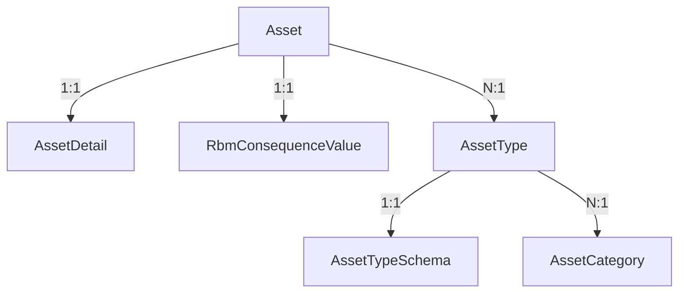

# **Modul Asset & RBM Detail Structure**

> Dokumentasi struktur utama yang digunakan dalam sistem RBM berbasis `mx-core`. Dokumen ini mencakup definisi `Asset`, `AssetType`, `AssetTypeSchema`, `AssetDetail`, serta nilai grading ESC untuk mendukung evaluasi konsekuensi kegagalan aset.

---

## 1. 🧾 Struktur `Asset` (Informasi Umum)

```ts
type Asset = {
  tagNumber: string;
  description: string;
  assetType: string; // FK ke AssetType.assetTypeId
  unit: string;
  area: string;
  status: 'Active' | 'Spare' | 'Retired';
  criticality?: 'Kritis' | 'Normal';
  tier?: 'Tier1' | 'Tier2' | 'Tier3';
  installationDate?: string;
};
```

Contoh:

```json
{
  "tagNumber": "CV-101-A",
  "description": "Control Valve Feed Gas to Reformer",
  "assetType": "control-valve",
  "unit": "Syngas",
  "area": "R-101",
  "status": "Active",
  "criticality": "Kritis",
  "tier": "Tier1",
  "installationDate": "2019-03-12"
}
```

---

## 2. 🧭 Struktur `AssetType`

```ts
type AssetType = {
  assetTypeId: string; // ex: "control-valve"
  label: string; // ex: "Control Valve"
  categoryId: string; // FK ke AssetCategory
};
```

---

## 3. 🗃️ Struktur `AssetCategory`

```ts
type AssetCategory = {
  categoryId: string;
  name: string;
};
```

Contoh:

```json
{ "categoryId": "instrument", "name": "Instrumentasi" }
```

---

## 4. 🧩 Struktur `AssetTypeSchema`

```ts
type AssetTypeSchema = {
  assetTypeId: string;
  fields: FieldDefinition[];
  ppcStrategy: PpcStrategyDefinition;
  spareParts: SparePartTemplate[];
};
```

### ➤ 4.1. `FieldDefinition`

```ts
type FieldDefinition = {
  name: string;
  label: string;
  type: 'string' | 'number' | 'enum' | 'boolean' | 'date';
  required: boolean;
  unit?: string;
  options?: string[]; // hanya berlaku untuk enum
};
```

### ➤ 4.2. `PpcStrategyDefinition`

```ts
type PpcStrategyDefinition = {
  preventive: string[];
  predictive: string[];
  corrective: string[];
};
```

### ➤ 4.3. `SparePartTemplate`

```ts
type SparePartTemplate = {
  name: string;
  partNumber?: string;
  uom: string;
  quantity: number;
  remarks?: string;
};
```

---

## 5. 📁 Contoh Lengkap `AssetTypeSchema`

### 5.1. Control Valve – `/schemas/asset-types/control-valve.json`

```json
{
  "assetTypeId": "control-valve",
  "fields": [
    {
      "name": "size",
      "label": "Ukuran Valve",
      "type": "number",
      "unit": "inch",
      "required": true
    },
    {
      "name": "type",
      "label": "Tipe Valve",
      "type": "enum",
      "options": ["Globe", "Ball", "Butterfly"],
      "required": true
    },
    {
      "name": "failMode",
      "label": "Fail Mode",
      "type": "enum",
      "options": ["Fail Open", "Fail Close", "Fail Last"],
      "required": true
    },
    {
      "name": "flowMax",
      "label": "Flow Max",
      "type": "number",
      "unit": "Nm³/h",
      "required": false
    },
    {
      "name": "flowMin",
      "label": "Flow Min",
      "type": "number",
      "unit": "Nm³/h",
      "required": false
    },
    {
      "name": "characteristic",
      "label": "Flow Characteristic",
      "type": "enum",
      "options": ["Linear", "Equal %", "Quick Opening"],
      "required": true
    },
    {
      "name": "actuatorType",
      "label": "Actuator Type",
      "type": "string",
      "required": false
    }
  ],
  "ppcStrategy": {
    "preventive": [
      "Periksa posisi stem dan kalibrasi travel",
      "Periksa kebocoran body dan bonnet",
      "Bersihkan actuator dan lubrikasi linkage"
    ],
    "predictive": [
      "Pantau tekanan supply air",
      "Pantau sinyal kontrol dan respon waktu",
      "Analisa getaran actuator"
    ],
    "corrective": [
      "Ganti diaphragm actuator",
      "Ganti packing atau gasket valve",
      "Kalibrasi ulang positioner"
    ]
  },
  "spareParts": [
    { "name": "Valve Packing", "uom": "set", "quantity": 1 },
    { "name": "Actuator Diaphragm", "uom": "pcs", "quantity": 1 },
    { "name": "Gasket Bonnet", "uom": "pcs", "quantity": 1 }
  ]
}
```

---

## 6. 🧾 `AssetDetail` — Data Teknis per Aset

```ts
type AssetDetail = {
  tagNumber: string; // FK ke Asset
  [field: string]: string | number | boolean;
};
```

Contoh `/data/asset-details/CV-101-A.detail.json`:

```json
{
  "tagNumber": "CV-101-A",
  "size": 6,
  "type": "Globe",
  "failMode": "Fail Close",
  "flowMax": 1200,
  "flowMin": 600,
  "characteristic": "Equal %",
  "actuatorType": "Pneumatic"
}
```

---

## 7. 📊 `RbmConsequenceValue` – Grading ESC

Struktur penilaian aspek konsekuensi berdasarkan Safety, Environment, dan Production.

```ts
type RbmConsequenceValue = {
  tagNumber: string; // FK ke Asset.tagNumber
  safety: number; // 1–5
  environment: number; // 1–5
  production: number; // 1–5
  gradedBy: string;
  gradedAt: string; // ISO datetime
  note?: string;
};
```

📋 Tabel Referensi:

| Field         | Tipe     | Wajib | Deskripsi                                                  |
| ------------- | -------- | ----- | ---------------------------------------------------------- |
| `tagNumber`   | string   | ✅    | FK ke `Asset.tagNumber`                                    |
| `safety`      | number   | ✅    | Nilai aspek **Safety**, rentang 1–5                        |
| `environment` | number   | ✅    | Nilai aspek **Lingkungan**, rentang 1–5                    |
| `production`  | number   | ✅    | Nilai aspek **Produksi (Continuous Running)**, rentang 1–5 |
| `gradedBy`    | string   | ✅    | Nama/NIP evaluator                                         |
| `gradedAt`    | datetime | ✅    | Timestamp penilaian                                        |
| `note`        | string   | ❌    | Catatan tambahan                                           |

---

## 8. 🔗 Relasi Data & Alur



---

## 9. 📁 Struktur Folder Direkomendasikan

```
/schemas/asset-types/
│   └── control-valve.json
│   └── centrifugal-pump.json
│   └── transformer.json

/data/asset-details/
│   └── CV-101-A.detail.json
│   └── P-204-B.detail.json

/data/assets/
│   └── CV-101-A.json
│   └── P-204-B.json

/data/esc-grading/
│   └── CV-101-A.grading.json

/docs/
│   └── asset-definition.md
```

---

## 10. ✅ Ringkasan

| Entitas               | Keterangan                                                  |
| --------------------- | ----------------------------------------------------------- |
| `Asset`               | Informasi umum aset (tag, unit, status, tier)               |
| `AssetType`           | Jenis peralatan, contoh: `control-valve`                    |
| `AssetTypeSchema`     | Template data teknis + PPC + Spare Part per jenis aset      |
| `AssetDetail`         | Data aktual sesuai skema untuk tiap `tagNumber`             |
| `RbmConsequenceValue` | Data penilaian konsekuensi: Safety, Environment, Production |
| `AssetCategory`       | Kategori besar (electrical, static, rotating, dll.)         |

---

## 🚀 Siap Digunakan

Dokumentasi ini adalah pegangan utama bagi:

- Developer frontend: membuat form dinamis berdasarkan schema
- Backend: validasi otomatis dan penyimpanan
- Planner: referensi strategi TBM/CBM per jenis aset
- Integrasi CMMS: penyusunan WO berdasar criticality, PPC, spare
