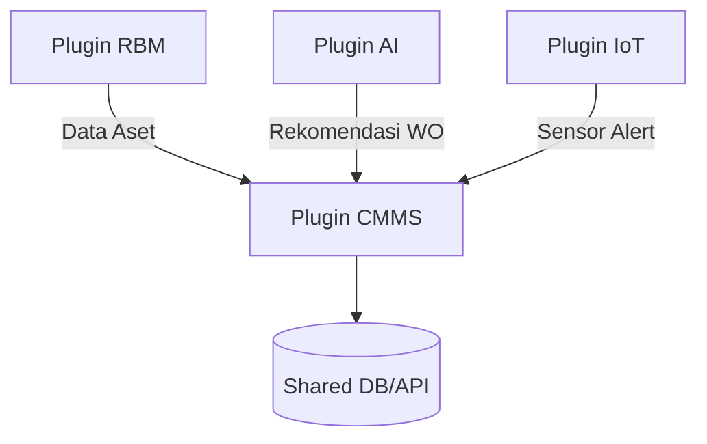

🧭 **Prolog — SDLC untuk `mx-core-cmms` dalam Ekosistem Mx-Core**

---

- [🧩 **Business Requirement Specification (BRS) – Plugin `mx-core-cmms`**](#-business-requirement-specification-brs--plugin-mx-core-cmms)
- [🧩 **2. Software Requirement Specification (SRS) – Plugin `mx-core-cmms`**](#-2-software-requirement-specification-srs--plugin-mx-core-cmms)
- [🧩 **3. System Design — Plugin `mx-core-cmms`**](#-3-system-design--plugin-mx-core-cmms)
- [🧩 **4. Implementation (Coding)**](#-4-implementation-coding)
- [🧩 **5. Testing**](#-5-testing)
- [🧩 **6. Deployment**](#-6-deployment)
- [🧩 **7. Maintenance \& Support**](#-7-maintenance--support)
- [🔚 **Kesimpulan Khusus `mx-core-cmms`**](#-kesimpulan-khusus-mx-core-cmms)
- [📌 **Saran Lanjutan (Langkah Berikutnya)**](#-saran-lanjutan-langkah-berikutnya)

---

Dalam mengembangkan aplikasi skala industri seperti `mx-core-cmms`, pendekatan **sistematis dan terdokumentasi dengan baik** bukanlah pilihan, melainkan keharusan. Terlebih lagi, `mx-core-cmms` bukan hanya sebuah aplikasi standalone — ia adalah **plugin modular** dalam platform **Mx-Core**, yang harus mampu berintegrasi dengan sistem lain seperti RBM, AI prediktif, dan IoT sensor.

Pengembangan tidak bermula dari sekadar menulis kode, melainkan dari **pemahaman mendalam terhadap kebutuhan bisnis di lapangan**, seperti urgensi pengurangan downtime, keterlacakan histori perawatan, hingga efisiensi operasional teknisi. Kebutuhan ini kemudian dikristalisasi ke dalam **dokumen Business Requirement Specification (BRS)**, lalu diturunkan secara teknis ke **Software Requirement Specification (SRS)** lengkap dengan skenario pemakaian (use-case).

Desain sistem dilakukan dalam dua tingkat:

- **High-Level Design (HLD)** memetakan komponen besar dalam arsitektur plugin (UI, API, RBAC, integrasi DB),
- **Low-Level Design (LLD)** merinci aspek teknis seperti model data work order, skema API, middleware RBAC, dan algoritma penjadwalan preventive maintenance.

Setelah desain matang, pengembangan dilakukan secara modular dalam kerangka monorepo Mx-Core menggunakan Next.js dan TypeScript. Proses ini dilanjutkan dengan fase **pengujian** berlapis (unit, integrasi, UAT), **deployment terdistribusi** (via Vercel), hingga tahap **maintenance & support** untuk mendukung feedback dari lapangan dan pengembangan fitur baru (seperti auto-WO dari sensor).

Dokumentasi ini disusun sebagai pedoman menyeluruh untuk membangun dan mengelola `mx-core-cmms` sebagai **komponen kritis dari ekosistem digital industri Mx-Core**, sekaligus dapat dijadikan referensi untuk plugin bisnis lain yang bersifat modular dan terintegrasi.

```
[BRS]
  ⇩ Kebutuhan bisnis CMMS (reduksi downtime, histori aset, efisiensi teknisi)
[SRS]
  ⇩ Functional Requirements, Non-Functional, Use-Case
  ⇨ Menjabarkan alur WO, jadwal PM, integrasi RBM/IoT
[System Design]
  ⇨ HLD: UI Plugin, API Handler, RBAC Integration
  ⇨ LLD: Work Order Model, Scheduler Logic, API Schema
[Implementation]
  ⇨ Plugin UI & API dalam monorepo Mx-Core
[Testing]
  ⇨ Unit, Integrasi, E2E, UAT lapangan
[Deployment]
  ⇨ Plugin dinamis via Vercel, runtime loading oleh Mx-Core
[Maintenance]
  ⇨ Monitoring, patch, fitur lanjutan (IoT alert, AI recommendation)
```

---

### 🧩 **Business Requirement Specification (BRS) – Plugin `mx-core-cmms`**

> 📌 _Dokumen ini merinci latar belakang, tujuan bisnis, serta kebutuhan tingkat tinggi dari pengembangan plugin CMMS dalam ekosistem Mx-Core._

---

- 1. 📛 **Judul Proyek**

**Plugin `mx-core-cmms` – Computerized Maintenance Management System**
_Modul operasional untuk pengelolaan preventive dan corrective maintenance berbasis aset industri._

---

- 2. 🧭 **Latar Belakang Masalah**

Di lingkungan industri (manufaktur, EPC, energi), kegiatan pemeliharaan masih sering:

- Terlambat dijalankan karena jadwal tidak terdokumentasi dengan baik.
- Tidak terintegrasi dengan data risiko dan prediksi kerusakan dari sistem RBM atau AI.
- Sulit dilacak karena work order tersebar dalam sistem manual (Excel, WhatsApp).
- Bergantung pada pengalaman teknisi senior tanpa histori digital yang dapat diakses semua pihak.

Hal ini menyebabkan **tingginya downtime**, **biaya operasional membengkak**, serta **kehilangan pengetahuan teknis historis**.

---

- 3. 🌐 **Visi dan Tujuan Bisnis**

> 🎯 _Visi:_

Menyediakan sistem CMMS modular dan terintegrasi yang mengelola seluruh siklus maintenance aset, dari penjadwalan hingga histori perbaikan, serta mendukung keputusan berbasis risiko dan data prediktif.

> 🎯 _Tujuan Utama:_

- Mengelola work order secara digital dan terpusat.
- Menerapkan **preventive maintenance** berbasis waktu atau kondisi.
- Mendukung pemeliharaan **berbasis prediksi** dari AI dan sensor IoT.
- Memastikan dokumentasi perawatan terekam rapi dan mudah diakses.
- Mengurangi downtime dan meningkatkan efektivitas teknisi lapangan.

---

- 4. 👥 **Stakeholders dan Peran**

| Role           | Peran                                                               |
| -------------- | ------------------------------------------------------------------- |
| **Technician** | Menjalankan perintah kerja (WO), mengisi laporan hasil perawatan.   |
| **Planner**    | Menyusun jadwal PM, membuat dan mengelola WO.                       |
| **Supervisor** | Menyetujui dan mengevaluasi efektivitas pemeliharaan.               |
| **Engineer**   | Menganalisis histori kerusakan, anomali, dan korelasi data AI/RBM.  |
| **IT Admin**   | Mengatur permission (RBAC), deployment plugin, dan troubleshooting. |

---

- 5. ✅ **Kebutuhan Bisnis Tingkat Tinggi**

| Kebutuhan                               | Keterangan                                            |
| --------------------------------------- | ----------------------------------------------------- |
| Pengelolaan Work Order (WO)             | Pembuatan, update, status, histori                    |
| Penjadwalan Preventive Maintenance (PM) | Jadwal harian/mingguan/bulanan berbasis kategori aset |
| Integrasi dengan Data Aset (RBM)        | Ambil data aset terdaftar dari `mx-core-rbm`          |
| Alert dan Trigger Otomatis dari IoT/AI  | Membuat WO otomatis dari data prediktif atau sensor   |
| Dashboard untuk Monitoring Status PM/WO | Visualisasi work order aktif, selesai, overdue, dsb   |
| Role-based Access Control (RBAC)        | Hak akses granular sesuai peran pengguna              |
| Audit Trail & Histori Perawatan         | Riwayat tindakan dan teknisi yang terlibat            |

---

- 6. 🎯 **Kriteria Keberhasilan Proyek**

| Kriteria                                 | Indikator Keberhasilan                                |
| ---------------------------------------- | ----------------------------------------------------- |
| Digitalisasi 100% work order             | Semua WO dibuat dan dicatat melalui sistem            |
| Penurunan downtime aset                  | Downtime bulanan berkurang setelah 3 bulan penggunaan |
| PM berjalan sesuai jadwal                | >95% jadwal preventive selesai tepat waktu            |
| Integrasi data aset dan histori dari RBM | Data aset sinkron dan dapat digunakan dalam CMMS      |
| RBAC berjalan efektif                    | Fitur hanya muncul sesuai role pengguna               |
| UAT oleh user lapangan sukses            | Semua fitur utama dapat digunakan teknisi & planner   |

---

- 7. 🔒 **Batasan dan Asumsi**

| Jenis   | Penjelasan                                                                                |
| ------- | ----------------------------------------------------------------------------------------- |
| Asumsi  | Data aset sudah tersedia di `mx-core-rbm` dan dapat diakses via shared DB/API             |
| Asumsi  | Plugin akan berjalan dalam sistem Mx-Core dengan runtime modular & RBAC terintegrasi      |
| Batasan | Tidak melakukan manajemen suku cadang atau purchasing (akan dikembangkan di plugin lain)  |
| Batasan | Penjadwalan berdasarkan kalender, belum menggunakan analisis AI untuk RUL (dalam roadmap) |

---

- 8. 📚 **Referensi Pendukung**

* Dokumen BRS Platform Mx-Core (Visi & Modul Plugin)
* Struktur Monorepo Mx-Core (`plugins/mx-core-cmms`)
* Plugin lain: `mx-core-rbm`, `mx-core-ai`, `mx-core-dashboard`
* Data aset dan histori dari `mx-core-rbm` (struktur schema)
* Referensi praktik CMMS industri (ISO 55000, OEE)

---

> ✅ **Output:**

- Dokumen BRS final `mx-core-cmms` → disetujui oleh tim bisnis, engineer, dan IT ops
- Siap menjadi dasar perumusan dokumen **SRS (Software Requirement Specification)**

---

### 🧩 **2. Software Requirement Specification (SRS) – Plugin `mx-core-cmms`**

> 📌 Dokumen ini merinci kebutuhan teknis sistem untuk plugin `mx-core-cmms` dalam platform Mx-Core, mencakup fungsi utama, batasan non-fungsional, serta skenario penggunaan yang mendetail berdasarkan kebutuhan bisnis yang telah dirumuskan dalam BRS.

---

- 📄 1. **Pendahuluan**

> 🎯 Tujuan Dokumen

- Menjabarkan secara teknis fungsi dan batasan plugin `mx-core-cmms`.
- Menjadi acuan pengembangan dan validasi sistem, mulai dari desain hingga pengujian.

> 📦 Ruang Lingkup

Plugin ini bertanggung jawab atas pengelolaan siklus pemeliharaan aset, termasuk:

- Work order (WO)
- Jadwal preventive maintenance
- Histori perawatan
- Integrasi dengan plugin RBM, AI, dan IoT

> 🧾 Definisi & Akronim

| Istilah | Definisi                                   |
| ------- | ------------------------------------------ |
| CMMS    | Computerized Maintenance Management System |
| WO      | Work Order (perintah kerja pemeliharaan)   |
| PM      | Preventive Maintenance                     |
| RBM     | Risk-Based Maintenance                     |
| IoT     | Internet of Things                         |
| RBAC    | Role-Based Access Control                  |
| FR      | Functional Requirement                     |
| UC      | Use Case                                   |

---

- ⚙️ 2. **Gambaran Umum Sistem**

`mx-core-cmms` adalah plugin modular yang terintegrasi dalam platform Mx-Core. Plugin ini menyediakan antarmuka UI berbasis Next.js dan API handler untuk:

- Membuat dan mengelola work order
- Menjadwalkan preventive maintenance
- Melihat histori perawatan aset
- Menyinkronkan data aset dari plugin RBM
- Menerima trigger WO otomatis dari AI atau IoT

Plugin ini menggunakan sistem autentikasi terpusat dan RBAC dari core platform (`@mx-core/core`), serta berbagi tipe data dengan `@mx-core/types`.

---

- 🧩 3. **Functional Requirements (FR-n)**

| ID    | Functional Requirement                                                                            |
| ----- | ------------------------------------------------------------------------------------------------- |
| FR-01 | Sistem mendukung login terpusat dengan validasi JWT dan evaluasi RBAC berdasarkan peran pengguna. |
| FR-02 | Sistem dapat menampilkan daftar aset dari `mx-core-rbm` melalui shared DB atau API proxy.         |
| FR-03 | Pengguna dapat membuat, mengubah, dan menghapus work order (WO) sesuai hak akses.                 |
| FR-04 | Pengguna dapat menjadwalkan preventive maintenance berdasarkan kategori dan interval aset.        |
| FR-05 | Pengguna dapat melihat histori maintenance dan tindakan sebelumnya per aset.                      |
| FR-06 | Sistem dapat menerima alert dari plugin AI/IoT dan membuat WO otomatis berdasarkan rule tertentu. |
| FR-07 | Sistem dapat memfilter dan menampilkan work order berdasarkan status, role, dan plant.            |
| FR-08 | Semua tindakan pengguna dicatat dalam audit log internal plugin.                                  |

---

- 🔒 4. **Non-Functional Requirements (NFR-n)**

| ID     | Kategori         | Kebutuhan                                                                   |
| ------ | ---------------- | --------------------------------------------------------------------------- |
| NFR-01 | Availability     | Sistem tersedia minimal 99.9% uptime di lingkungan produksi.                |
| NFR-02 | Security         | Setiap endpoint dan tampilan UI menggunakan RBAC terintegrasi dari core.    |
| NFR-03 | Responsiveness   | Waktu respon halaman utama < 200ms (dengan cache & pagination aktif).       |
| NFR-04 | Scalability      | Plugin mendukung multi-plant dan role paralel secara isolatif.              |
| NFR-05 | Interoperability | Data WO dapat digunakan oleh plugin AI, RBM, dan dashboard.                 |
| NFR-06 | Maintainability  | Struktur kode modular, dengan komponen reusable dan dapat diuji (testable). |
| NFR-07 | Observability    | Semua error kritis dan aksi user terekam di log dan sistem alert.           |

---

- 📋 5. **Use Case List**

Berikut adalah daftar _Use Case_ utama untuk plugin `mx-core-cmms`:

| ID    | Nama Use Case                        | Aktor        |
| ----- | ------------------------------------ | ------------ |
| UC-01 | Login & Akses Plugin CMMS            | Semua Role   |
| UC-02 | Lihat Daftar Aset                    | Planner      |
| UC-03 | Buat Work Order Manual               | Planner      |
| UC-04 | Buat Work Order Otomatis dari AI/IoT | System (Bot) |
| UC-05 | Penjadwalan Preventive Maintenance   | Planner      |
| UC-06 | Update Status Work Order             | Technician   |
| UC-07 | Lihat Histori Maintenance Aset       | Engineer     |
| UC-08 | Evaluasi Efektivitas WO              | Supervisor   |

---

- 📄 6. **Use Case Detail (UC-n)**

> 🔹 **UC-03 – Buat Work Order Manual**

- **Nama:** Buat Work Order Manual
- **Aktor:** Planner
- **Deskripsi:** Planner membuat WO untuk preventive maintenance dari halaman dashboard.
- **Trigger:** Kalender PM atau kebutuhan langsung dari plant.
- **Alur Utama:**

  1. Planner login dan masuk halaman `Work Order`.
  2. Klik “Buat WO Baru”.
  3. Pilih aset dari daftar yang disediakan (sync dengan RBM).
  4. Isi detail: deskripsi pekerjaan, tanggal pelaksanaan, teknisi terkait.
  5. Simpan → WO masuk status "Scheduled".

- **Alur Alternatif:**

  - Jika aset tidak tersedia → Tampilkan error & tombol “Sinkronisasi Aset”.

- **Kondisi Sukses:** WO tersimpan dan muncul di daftar planner & teknisi sesuai jadwal.
- **Catatan Khusus:**

  - Semua field divalidasi (required, format tanggal).
  - Audit log mencatat ID user & waktu pembuatan WO.

---

> 🔹 **UC-04 – Buat Work Order Otomatis dari AI/IoT** _(Future Feature)_

- **Nama:** Auto-WO dari Alert AI/IoT
- **Aktor:** System (Bot)
- **Deskripsi:** Sistem menerima notifikasi dari plugin AI/IoT lalu membuat WO otomatis.
- **Trigger:** Alert dengan level "High" dari AI atau sensor abnormal.
- **Alur Utama:**

  1. Plugin AI/IoT mengirim payload alert ke endpoint CMMS.
  2. Payload diparsing dan divalidasi (tipe, level, aset terkait).
  3. Sistem membuat WO dengan status “Scheduled (Auto)”.
  4. WO masuk dashboard planner untuk validasi/approval.

- **Alur Alternatif:**

  - Jika payload tidak valid → ditolak dan dicatat di error log.

- **Kondisi Sukses:** WO muncul dan ditandai sebagai "Otomatis".
- **Catatan Khusus:** Feature ini baru akan aktif setelah AI/IoT alert schema disepakati.

---

> 🔹 **UC-07 – Lihat Histori Maintenance Aset**

- **Nama:** Lihat Histori Maintenance
- **Aktor:** Engineer, Supervisor
- **Deskripsi:** User melihat riwayat tindakan maintenance berdasarkan aset.
- **Trigger:** Investigasi gangguan, analisis kegagalan, evaluasi efektivitas.
- **Alur Utama:**

  1. User login dan masuk halaman “Histori Aset”.
  2. Cari atau pilih aset dari daftar.
  3. Sistem menampilkan daftar WO dan log terkait.

- **Kondisi Sukses:** Data histori ditampilkan lengkap dan bisa difilter.
- **Catatan Khusus:** Link ke dashboard RBM dan AI jika tersedia.

---

- 🗂️ 7. **Prioritas Pengembangan (MoSCoW)**

| Prioritas | Fitur                                            |
| --------- | ------------------------------------------------ |
| Must      | FR-01 s.d FR-05 (login, WO, jadwal, histori)     |
| Should    | FR-07 (filter WO berdasarkan role/status)        |
| Could     | FR-06 (auto-WO dari AI/IoT alert)                |
| Won’t     | Manajemen sparepart, budgeting (plugin terpisah) |

---

- 🔁 8. **Traceability Matrix** (Opsional)

| BRS Tujuan Bisnis                          | FR/UC Terkait              |
| ------------------------------------------ | -------------------------- |
| Mengurangi downtime                        | FR-04, FR-06, UC-03, UC-04 |
| Work order terdokumentasi & terpusat       | FR-03, FR-07, UC-03, UC-06 |
| Integrasi dengan RBM & histori aset        | FR-02, FR-05, UC-07        |
| Penjadwalan preventive maintenance         | FR-04, UC-05               |
| Dukungan peran teknisi dan planner berbeda | FR-01, FR-07, UC-01        |

---

- ✅ **Output Dokumen**

* Dokumen **SRS Plugin `mx-core-cmms`** final
* Siap digunakan sebagai dasar pengembangan: desain sistem (HLD/LLD), pengujian QA, dan review UAT

---

### 🧩 **3. System Design — Plugin `mx-core-cmms`**

Dokumen ini membagi desain sistem menjadi dua tingkat:

- **High-Level Design (HLD)** → memetakan arsitektur komponen secara menyeluruh dan integrasi antar modul.
- **Low-Level Design (LLD)** → menjabarkan struktur data, skema API, middleware, dan konfigurasi teknis internal plugin.

---

- 🔷 **3.1 High-Level Design (HLD)**

> 🧱 **Arsitektur Komponen Utama**

| Komponen        | Teknologi                         | Penjelasan                                                              |
| --------------- | --------------------------------- | ----------------------------------------------------------------------- |
| **Frontend**    | `Next.js` App Router              | UI plugin CMMS (`plugins/mx-core-cmms/src/app`)                         |
| **Backend/API** | Next.js API handler / Express API | API lokal plugin atau delegasi ke `apps/backend` jika perlu             |
| **Database**    | PostgreSQL (shared dengan RBM)    | Tabel: `equipment`, `work_order`, `maintenance_log`                     |
| **RBAC**        | `@mx-core/core` + `<CanAccess />` | Kontrol akses UI dan API berbasis role & resource                       |
| **Plugin Host** | Mx-Core Plugin Loader             | Plugin dimuat melalui `plugin.json` dan di-render via `plugin-manifest` |

---

> 🔗 **Integrasi Antar Plugin**



| Integrasi        | Deskripsi                                                                |
| ---------------- | ------------------------------------------------------------------------ |
| 🔄 **RBM**       | Sinkronisasi data aset (ID, kategori, prioritas risiko)                  |
| 🤖 **AI**        | Rekomendasi tindakan prediktif → Auto-WO (via endpoint internal)         |
| 📡 **IoT**       | Alert anomali sensor → Trigger WO otomatis                               |
| 📊 **Dashboard** | Status WO & PM ditampilkan di plugin `mx-core-dashboard` via shared data |

---

> 🔐 **RBAC Flow**

- Deklarasi rules di `plugin.json`
- Evaluasi akses via `canAccess()` (backend) dan `<CanAccess />` (UI)
- Role: `Planner`, `Technician`, `Supervisor`, `Engineer`

---

> 🌐 **Routing Struktur (App Router)**

```bash
/plugins/mx-core-cmms/
└── src/
    └── app/
        ├── layout.tsx
        ├── page.tsx                  # Landing page CMMS
        ├── work-orders/
        │   ├── page.tsx              # List WO
        │   └── [id]/edit.tsx         # Edit/Update WO
        ├── scheduler/
        │   └── page.tsx              # Jadwal PM
        └── history/
            └── page.tsx              # Histori WO per aset
```

---

- 🔷 **3.2 Low-Level Design (LLD)**

> 📁 **Model Data (Simplified)**

```ts
// models/workOrder.ts
export type WorkOrderStatus =
  | 'SCHEDULED'
  | 'IN_PROGRESS'
  | 'DONE'
  | 'CANCELLED';
export type WorkOrderType = 'PM' | 'CM' | 'AUTOMATIC';

export interface WorkOrder {
  id: string;
  assetId: string;
  type: WorkOrderType;
  description: string;
  scheduledDate: string; // ISO string
  status: WorkOrderStatus;
  createdBy: string;
  createdAt: string;
  updatedAt?: string;
}
```

> 📁 **Database Schema (PostgreSQL)**

```sql
CREATE TABLE work_orders (
  id UUID PRIMARY KEY,
  asset_id UUID REFERENCES assets(id),
  type VARCHAR(20),
  description TEXT,
  scheduled_date TIMESTAMP,
  status VARCHAR(20),
  created_by UUID,
  created_at TIMESTAMP DEFAULT now(),
  updated_at TIMESTAMP
);
```

---

> 📁 **API Schema**

- 🔹 `GET /api/work-orders`

* **Deskripsi**: Mengambil daftar WO dengan filter (status, tanggal, aset)
* **Query Param**:

  - `status=IN_PROGRESS`
  - `assetId=<uuid>`

* **Response**:

```json
[
  {
    "id": "uuid",
    "type": "PM",
    "description": "PM mingguan pompa A-101",
    "scheduledDate": "2024-01-15T08:00:00Z",
    "status": "SCHEDULED"
  }
]
```

---

- 🔹 `POST /api/work-orders`

* **Deskripsi**: Membuat work order baru
* **Body Payload**:

```json
{
  "assetId": "uuid",
  "type": "PM",
  "description": "Inspeksi visual rutin",
  "scheduledDate": "2024-01-20T09:00:00Z"
}
```

- **Response**: `201 Created` + body WO

---

- 🔹 `PUT /api/work-orders/:id`

* **Deskripsi**: Mengubah status/isi WO
* **Body Payload (partial)**:

```json
{
  "status": "DONE",
  "description": "Sudah dilakukan pengecekan & pembersihan filter"
}
```

---

- 🔹 `GET /api/assets`

* **Deskripsi**: Ambil data aset dari RBM plugin
* **Implementasi**:

  - **Option 1**: Query langsung shared DB
  - **Option 2**: Proxy API call ke `apps/backend`

---

> ⚙️ **Middleware**

- 🔐 `authMiddleware()`

* Validasi token JWT
* Menyisipkan informasi user ke context (`req.user`)

- 🧩 `checkPermission()`

```ts
checkPermission({
  role: 'Planner',
  resource: 'work-order',
  action: 'create',
});
```

- Evaluasi rule RBAC berbasis konteks pengguna dan rule dari `plugin.json`
- Digunakan di level API handler dan UI (`<CanAccess />`)

---

> 🧩 **Komponen Kunci**

| Komponen        | Deskripsi                        |
| --------------- | -------------------------------- |
| `WorkOrderList` | Menampilkan daftar WO terfilter  |
| `WorkOrderForm` | Formulir pembuatan & update WO   |
| `SchedulerGrid` | Visualisasi kalender PM          |
| `AssetSelector` | Dropdown pemilihan aset dari RBM |
| `HistoryTable`  | Tabel histori maintenance aset   |

---

> ⚙️ **Konfigurasi Tambahan**

| File                 | Fungsi                                   |
| -------------------- | ---------------------------------------- |
| `.env.local`         | Konfigurasi endpoint API & secret RBM    |
| `plugin.json`        | Metadata plugin, RBAC rules, basePath    |
| `tailwind.config.js` | Styling konsisten dengan core UI         |
| `tsconfig.json`      | Path alias ke `@mx-core/types` & `@core` |

---

> 🧪 **Testing Design**

- Setiap API memiliki unit test (`workOrder.test.ts`)
- Test E2E menggunakan `Playwright` atau `Cypress`:

  - Buat → tampilkan → ubah status → lihat histori

---

> 🧠 **Roadmap LLD Lanjutan (Planned)**

| Fitur                    | Status     | Keterangan                                       |
| ------------------------ | ---------- | ------------------------------------------------ |
| Schema Zod Validation    | ✅ Aktif   | Validasi payload input form/API                  |
| AI/IoT Auto-WO Endpoint  | 🔜 Planned | Terima alert eksternal dan generate WO otomatis  |
| Template PM Editor       | 🔜 Planned | Form builder untuk rutin jadwal berdasarkan aset |
| Audit Trail Full Logging | 🔜 Planned | Riwayat aksi user tersimpan di tabel log         |

---

- ✅ Output

* **Dokumen HLD & LLD plugin `mx-core-cmms`**
* Menjadi referensi utama tim backend/frontend
* Siap digunakan untuk **implementation & testing**

---

### 🧩 **4. Implementation (Coding)**

> 📁 Lokasi Plugin

```bash
/plugins/mx-core-cmms/
├── plugin.json
├── src/
│   ├── app/                 # Next.js App Router (layout, pages)
│   ├── components/          # UI modul seperti <WorkOrderCard />
│   ├── services/            # API logic, fetcher
│   ├── models/              # Tipe data lokal
│   ├── hooks/               # Custom hooks CMMS
│   └── api/                 # API Route untuk CRUD WO
```

> ⚙️ Fitur Kodingan

- Semua akses data via service layer (`services/workOrder.ts`)
- Validasi menggunakan Zod
- UI akses dibungkus `<CanAccess>`
- Setiap halaman `page.tsx` adalah unit modular → dapat di-reuse oleh plant/tenant lain

---

### 🧩 **5. Testing**

> 🧪 Layer Pengujian

| Layer       | Tool                 | Penjelasan                       |
| ----------- | -------------------- | -------------------------------- |
| Unit        | Jest + ts-jest       | Test fungsi `createWorkOrder`    |
| Integration | Supertest            | Test endpoint `/api/work-orders` |
| E2E         | Playwright / Cypress | Test user flow di UI plugin      |
| UAT         | Manual via staging   | Simulasi oleh Planner / Eng      |

---

### 🧩 **6. Deployment**

> ✅ Hosted via **Vercel**

- Plugin ini bersifat **dinamis** → perlu SSR untuk dashboard & routing.
- `plugin.json` mendeklarasikan: `"api": true, "ui": true`
- Dihubungkan ke root frontend via `plugin-manifest.json`
- Domain publik: `https://mx-core-cmms.vercel.app`

---

### 🧩 **7. Maintenance & Support**

> 📌 Aktivitas:

- Perbaikan bug harian (via alert Sentry)
- Patch histori maintenance
- Penambahan dukungan auto-WO dari IoT sensor
- Integrasi feedback teknisi (user flow improvement)
- Penyusunan laporan histori → integrasi ke plugin `dashboard`

> 📈 SLA:

- WO tidak boleh gagal disimpan lebih dari 2 menit (resilient submission)
- Error handling per halaman harus informatif → dukungan onboarding teknisi baru

---

### 🔚 **Kesimpulan Khusus `mx-core-cmms`**

| Aspek                | Penilaian                                                   |
| -------------------- | ----------------------------------------------------------- |
| 🎯 Tujuan Bisnis     | Menghubungkan strategi RBM + alert IoT ke aksi konkret (WO) |
| 🧱 Posisi Arsitektur | Plugin dinamis utama, sangat terkait RBM, AI, IoT           |
| 🔐 Keamanan          | RBAC aktif di semua UI dan API                              |
| 🛠️ Desain & Koding   | Modular, reusable, testing-aware                            |
| 📦 Deployment        | Dinamis, SSR-enabled via Vercel                             |
| 🚀 Potensi Ekspansi  | Auto-WO dari sensor, AI scoring, integrasi SAP/EAM          |

---

### 📌 **Saran Lanjutan (Langkah Berikutnya)**

- [ ] **Dokumentasi lengkap SDLC** → kita bisa bantu _draft_ per bagian, mulai dari BRS → SRS
- [ ] **Penambahan diagram arsitektur plugin level** (CMMS only)
- [ ] **Simulasi alur UAT** untuk user (Planner/Technician)
- [ ] **Integrasi real-time dari MQTT** (IoT → WO) → jika sudah ada broker
- [ ] **Penyusunan visual flow RBAC UI/UX per halaman**

---
