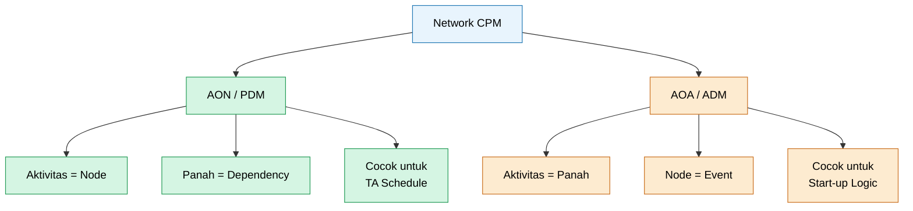
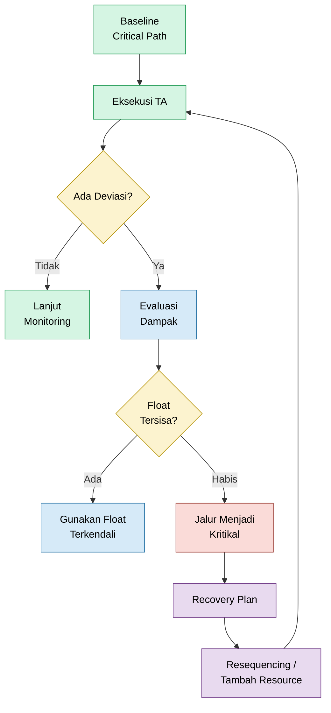
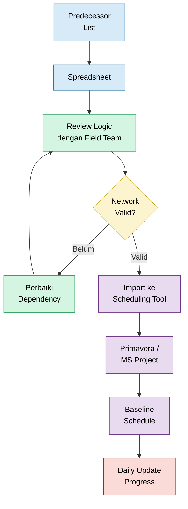

**_Critical Path Method (CPM): Strategi Pengendalian Jadwal Aktivitas di Industri Petrokimia_**

---

- [1. Pendahuluan](#1-pendahuluan)
- [2. Konsep Dasar CPM](#2-konsep-dasar-cpm)
  - [Terminologi dalam CPM](#terminologi-dalam-cpm)
  - [Langkah-langkah Utama dalam CPM](#langkah-langkah-utama-dalam-cpm)
  - [Representasi Jaringan: AON (PDM) vs AOA (ADM)](#representasi-jaringan-aon-pdm-vs-aoa-adm)
- [3. Langkah-langkah Implementasi CPM dalam Turn Around (TA)](#3-langkah-langkah-implementasi-cpm-dalam-turn-around-ta)
  - [Perencanaan dan Identifikasi Aktivitas](#perencanaan-dan-identifikasi-aktivitas)
  - [Pembuatan Diagram Jaringan](#pembuatan-diagram-jaringan)
  - [Validasi Kualitas Network (TA-Ready)](#validasi-kualitas-network-ta-ready)
  - [Penentuan Durasi Aktivitas](#penentuan-durasi-aktivitas)
  - [Identifikasi Jalur Kritikal](#identifikasi-jalur-kritikal)
  - [Penentuan Jalur Kritikal](#penentuan-jalur-kritikal)
  - [Pengelolaan Buffer dan Penanganan Risiko](#pengelolaan-buffer-dan-penanganan-risiko)
  - [Pemantauan Selama Eksekusi Turn Around](#pemantauan-selama-eksekusi-turn-around)
  - [Penutup Bab](#penutup-bab)
- [4. Studi Kasus Implementasi CPM dalam Turn Around (TA)](#4-studi-kasus-implementasi-cpm-dalam-turn-around-ta)
  - [Studi Kasus — Turn Around Skala Pabrik](#studi-kasus--turn-around-skala-pabrik)
  - [**Studi Kasus — Overhaul API Pump Multi-Stage (Industrial Detail)**](#studi-kasus--overhaul-api-pump-multi-stage-industrial-detail)
- [5. Keuntungan dan Tantangan Penerapan CPM dalam Turn Around (TA)](#5-keuntungan-dan-tantangan-penerapan-cpm-dalam-turn-around-ta)
  - [Keuntungan Penerapan CPM dalam Turn Around (TA)](#keuntungan-penerapan-cpm-dalam-turn-around-ta)
  - [Tantangan Penerapan CPM dalam Turn Around (TA)](#tantangan-penerapan-cpm-dalam-turn-around-ta)
  - [Refleksi Praktis](#refleksi-praktis)
- [6. Alat dan Sumber Daya untuk CPM](#6-alat-dan-sumber-daya-untuk-cpm)
  - [Perangkat Lunak CPM](#perangkat-lunak-cpm)
  - [Tool Mapping dalam Konteks Network CPM](#tool-mapping-dalam-konteks-network-cpm)
- [7. Kesimpulan](#7-kesimpulan)
- [8. Referensi](#8-referensi)

---

### 1. Pendahuluan

> **Definisi Critical Path Method (CPM)**

**Critical Path Method (CPM)** adalah teknik manajemen proyek yang digunakan untuk menentukan **durasi minimum suatu pekerjaan** dengan mengidentifikasi jalur aktivitas terpanjang yang harus diselesaikan tanpa keterlambatan. Metode ini memungkinkan engineer dan planner memahami keterkaitan antaraktivitas secara logis sehingga urutan kerja dapat disusun secara optimal.

Dalam praktik industri modern, CPM tidak hanya berfungsi sebagai alat penjadwalan, tetapi juga sebagai **instrumen pengendalian eksekusi**. Network yang dibangun melalui CPM memberikan visibilitas terhadap aktivitas kritikal, potensi bottleneck, serta fleksibilitas jadwal (float), sehingga keputusan operasional dapat diambil secara lebih terukur.

CPM banyak digunakan pada pekerjaan dengan tingkat kompleksitas tinggi, seperti:

- Turn Around (TA) dan shutdown pabrik
- Overhaul equipment kritikal
- Proyek modifikasi fasilitas
- Commissioning dan start-up unit
- Pekerjaan konstruksi dan EPC
- Integrasi sistem dan revamp plant

Pada seluruh konteks tersebut, kesamaan utamanya adalah kebutuhan akan **sequencing yang presisi**, dependency yang jelas, serta kontrol waktu yang ketat.

[**Kembali ke Atas**](#1-pendahuluan)

---

> **Komponen Utama dalam CPM**

Beberapa elemen fundamental yang membentuk network CPM meliputi:

- **Aktivitas**
  Unit pekerjaan terdefinisi yang mengonsumsi waktu dan sumber daya.

- **Durasi**
  Waktu yang diperlukan untuk menyelesaikan setiap aktivitas dalam kondisi kerja tertentu.

- **Dependency (Keterkaitan Aktivitas)**
  Hubungan logis yang menentukan urutan pekerjaan dan mencegah konflik eksekusi.

- **Jalur Kritikal (Critical Path)**
  Rangkaian aktivitas tanpa kelonggaran waktu yang secara langsung menentukan durasi total pekerjaan.

- **Float atau Slack**
  Fleksibilitas waktu pada aktivitas non-kritikal tanpa memengaruhi tanggal penyelesaian akhir.

- **Milestone**
  Titik kontrol yang menandai fase penting atau readiness suatu sistem.

---

> **Tujuan Penggunaan CPM**

Implementasi CPM bertujuan untuk meningkatkan kepastian eksekusi melalui pendekatan berbasis network logic. Secara praktis, CPM digunakan untuk:

**Menentukan Durasi Realistis**
Menghitung total waktu minimum yang dibutuhkan berdasarkan hubungan kerja aktual — bukan asumsi optimistis.

**Mengendalikan Urutan Pekerjaan (Sequencing Control)**
Memastikan setiap aktivitas terjadi dalam urutan yang aman, logis, dan dapat dieksekusi secara fisik.

**Mengidentifikasi Aktivitas Sensitif terhadap Keterlambatan**
Menunjukkan pekerjaan yang tidak memiliki toleransi slip dan karenanya memerlukan pengawasan lebih ketat.

**Meningkatkan Kualitas Pengambilan Keputusan**
Planner dapat mengevaluasi dampak perubahan jadwal sebelum keputusan diterapkan di lapangan.

**Mengurangi Risiko Gangguan Operasi**
Dengan network yang valid, potensi konflik pekerjaan, resource bottleneck, maupun rework dapat diminimalkan.

---

> **Peran Strategis CPM dalam Operasi Industri**

Walaupun sering diasosiasikan dengan proyek berskala besar seperti Turn Around, nilai sebenarnya dari CPM terletak pada kemampuannya mengubah rencana kerja menjadi **model operasional yang dapat dikendalikan**.

Pada lingkungan industri berisiko tinggi — termasuk fasilitas petrokimia — kesalahan sequencing tidak hanya berdampak pada jadwal, tetapi juga dapat memicu:

- paparan energi berbahaya
- konflik pekerjaan simultan
- peningkatan risiko kebakaran atau ledakan
- pelanggaran permit
- rework akibat quality gate terlewati

Karena itu, penyusunan network CPM yang realistis secara tidak langsung mendukung praktik **Safety, Health, and Environment (SHE)** melalui pengaturan urutan kerja yang lebih disiplin.

---

> **Pentingnya CPM dalam Turn Around — dan Di Luar Turn Around**

Dalam konteks **Turn Around (TA)**, CPM membantu organisasi mengelola ribuan aktivitas dengan dependency kompleks dalam jendela waktu terbatas. Keterlambatan satu aktivitas kritikal dapat menggeser tanggal start-up dan berdampak signifikan pada kehilangan produksi.

Namun membatasi CPM hanya pada TA adalah kekeliruan umum.

Pendekatan ini sama pentingnya pada pekerjaan seperti:

- overhaul pompa, kompresor, atau turbin
- penggantian heat exchanger
- tie-in piping
- catalyst change-out
- proyek debottlenecking
- instalasi equipment baru

Setiap pekerjaan yang memiliki dependency teknis membutuhkan sequencing yang terkendali — dan di situlah CPM memberikan nilai terbesar.

---

> **Dari Jadwal ke Alat Kontrol Eksekusi**

Kesalahan paling sering terjadi adalah memperlakukan CPM hanya sebagai alat untuk membuat Gantt chart. Pada organisasi dengan tingkat maturitas tinggi, CPM justru digunakan sebagai:

- 👉 alat monitoring harian
- 👉 dasar prioritas resource
- 👉 sistem peringatan dini keterlambatan
- 👉 referensi recovery plan
- 👉 fondasi koordinasi lintas disiplin

Dengan kata lain, CPM bukan sekadar teknik perencanaan — melainkan bagian dari **execution governance**.

---

> **Arah Pembahasan Artikel**

Artikel ini disusun untuk memberikan pemahaman komprehensif mengenai penerapan Critical Path Method dalam konteks industri, mulai dari konsep dasar hingga implementasi praktis.

Pembahasan mencakup:

- terminologi dan prinsip network scheduling
- representasi diagram (AON dan AOA)
- teknik identifikasi jalur kritikal
- studi kasus industrial overhaul equipment
- tantangan implementasi di lapangan
- serta praktik terbaik untuk meningkatkan kredibilitas jadwal

Dengan memahami pendekatan ini, engineer dan planner diharapkan mampu membangun network yang tidak hanya terlihat baik secara teoritis, tetapi juga **jujur merepresentasikan realitas pekerjaan**.

Pada akhirnya, kualitas sebuah jadwal tidak ditentukan oleh seberapa rapi diagram dibuat — melainkan oleh seberapa akurat network tersebut dapat dieksekusi.

---

Selanjutnya, kita akan memasuki **Konsep Dasar CPM**, yang membahas terminologi, struktur network, serta prinsip sequencing sebagai fondasi utama dalam pengendalian jadwal pekerjaan industri.

---

<ResourceBox
  title="Korelasi internal-link modul:"
  items={[
    {
      name: 'Membangun WBS dan Estimasi Man-Hour',
      href: '/blog/maintenance/wbs-level',
      description:
        'Membangun WBS dan Estimasi Man-Hour Overhaul Peralatan Industri - Strategi Sukses Turn Around',
    },
    {
      name: 'Transformasi dari Reaktif ke Proaktif',
      href: '/blog/management/maintenance-proactive',
      description: 'Transformasi dari Pemeliharaan Reaktif ke Proaktif',
    },
    {
      name: 'Panduan Troubleshooting & Pemilihan Metode RCA',
      href: '/blog/management/RCA/rca-panduan-lengkap',
      description:
        'Panduan Troubleshooting & Pemilihan Metode RCA Berbasis Risk-Based Maintenance (RBM)',
    },
    {
      name: 'Maintenance System Handbook (MSH)',
      href: '/blog/management/MSH/MSH-panduan-lengkap',
      description:
        'Dari Risk-Based Thinking ke Reliability-Driven Organization - Panduan Lengkap Maintenance System Handbook',
    },
    {
      name: 'TAM - Turn Around Management',
      href: '/blog/maintenance/TAM',
      description: 'TAM - Turn Around Management',
    },
    {
      name: 'Aset Life Cycle',
      href: '/blog/maintenance/lifecycle-aset',
      description: 'Aset Life Cycle di Industri Petrokimia',
    },
    {
      name: 'TCO - Total Cost Ownership',
      href: '/blog/maintenance/tco',
      description: 'TCO - Total Cost Ownership',
    },
  ]}
/>

[**Kembali ke Atas**](#1-pendahuluan)

---

### 2. Konsep Dasar CPM

Memahami **Critical Path Method (CPM)** tidak cukup hanya pada definisi. Engineer perlu memahami bagaimana elemen-elemen dalam CPM saling berinteraksi untuk membentuk sebuah network yang dapat dikendalikan secara operasional selama Turn Around (TA).

Bab ini membangun fondasi tersebut — mulai dari terminologi hingga representasi diagram jaringan — agar pembaca tidak hanya memahami konsep, tetapi juga mampu membaca dan mengevaluasi schedule secara kritis.

---

#### Terminologi dalam CPM

Untuk memahami CPM secara utuh, beberapa istilah berikut wajib dikuasai:

**Aktivitas (Activity)**  
Tugas atau pekerjaan spesifik yang harus diselesaikan dalam proyek. Setiap aktivitas memiliki durasi dan dependency yang mempengaruhi jadwal keseluruhan.

**Durasi (Duration)**  
Waktu yang diperlukan untuk menyelesaikan suatu aktivitas, biasanya dinyatakan dalam hari atau minggu.

**Predecessor dan Successor**

- **Predecessor** → aktivitas yang harus selesai atau dimulai sebelum aktivitas lain dapat berlangsung.
- **Successor** → aktivitas yang bergantung pada predecessor.

**Jalur Kritikal (Critical Path)**  
Rangkaian aktivitas dengan total durasi terpanjang yang menentukan waktu minimum penyelesaian proyek. Keterlambatan satu aktivitas pada jalur ini akan langsung menunda proyek.

**Float atau Slack**  
Kelonggaran waktu yang dimiliki aktivitas tanpa mempengaruhi tanggal penyelesaian proyek.

- **Total Float:** toleransi tanpa menggeser tanggal finish proyek
- **Free Float:** toleransi tanpa menggeser aktivitas berikutnya

**Milestone**  
Titik penanda pencapaian penting dalam proyek, biasanya berdurasi nol dan digunakan sebagai anchor kontrol jadwal.

---

#### Langkah-langkah Utama dalam CPM

**Identifikasi Aktivitas Proyek**  
Seluruh pekerjaan harus diuraikan menjadi aktivitas yang terukur dan dapat dimonitor progresnya.

**Penentuan Urutan Aktivitas (Sequencing)**  
Setelah aktivitas diidentifikasi, engineer harus menetapkan hubungan logis antar pekerjaan menggunakan dependency.

Pada tahap inilah penting memahami bahwa network CPM dapat direpresentasikan dengan dua pendekatan utama.

---

#### Representasi Jaringan: AON (PDM) vs AOA (ADM)

Diagram jaringan bukan sekadar visualisasi — ia adalah bahasa logika proyek. Kesalahan memahami simbol dapat menyebabkan salah interpretasi terhadap schedule.



---

> AON — Activity-on-Node / Precedence Diagramming Method (PDM)

Pada pendekatan ini:

- **Aktivitas direpresentasikan sebagai node (kotak)**
- **Panah menunjukkan dependency**

Pendekatan AON adalah standar dalam penjadwalan modern dan menjadi basis perhitungan CPM pada hampir seluruh software scheduling.

**Karakteristik utama AON:**

- Fleksibel untuk berbagai tipe hubungan (FS, SS, FF, SF)
- Mudah dibaca oleh tim eksekusi
- Ideal untuk monitoring harian
- Mendukung integrasi resource

**Praktik industri:**  
AON hampir selalu digunakan pada:

- Turn Around execution schedule
- EPC planning
- shutdown coordination
- software seperti Primavera dan Microsoft Project

---

> AOA — Activity-on-Arrow / Arrow Diagramming Method (ADM)

Berbeda dengan AON:

- **Panah merepresentasikan aktivitas**
- **Node (lingkaran) merepresentasikan event**

Node tidak memiliki durasi — ia hanya menandakan status transisi pekerjaan.

**Karakteristik utama AOA:**

- Sangat kuat untuk membaca logika urutan event
- Secara klasik berorientasi Finish-to-Start
- Kadang membutuhkan _dummy activity_
- Lebih jarang digunakan dalam software modern

**Masih relevan ketika digunakan untuk:**

- start-up logic
- shutdown sequence
- commissioning flow
- event-based engineering review

---

> Kapan Menggunakan AON vs AOA? (Panduan Praktis)

| Aspek                  | AON / PDM             | AOA / ADM                           |
| ---------------------- | --------------------- | ----------------------------------- |
| Representasi           | Aktivitas = node      | Aktivitas = panah                   |
| Event                  | Implisit              | Eksplisit                           |
| Fleksibilitas          | Sangat tinggi         | Lebih terbatas                      |
| Dominasi software      | Sangat dominan        | Jarang                              |
| Ideal untuk            | TA schedule & kontrol | Logic event/start-up                |
| Risiko misinterpretasi | Rendah                | Lebih tinggi bila dummy tidak jelas |

> **Prinsip praktis:**  
> Gunakan **AON untuk membangun dan mengendalikan jadwal TA.**  
> Gunakan **AOA ketika Anda ingin membaca logika transisi event secara cepat.**

Setelah memahami bagian ini, pembaca seharusnya tidak lagi menganggap bahwa “node selalu milestone” atau “panah selalu dependency.” Interpretasi bergantung pada metode yang digunakan.

---

> Estimasi Durasi Aktivitas

Durasi harus ditentukan menggunakan:

- data historis
- judgement teknis
- evaluasi constraint lapangan

Estimasi yang buruk akan menghasilkan critical path yang menyesatkan.

---

> Pembuatan Jaringan Aktivitas (Activity Network)

Setelah sequencing dan durasi ditetapkan, network dapat dibangun untuk memperlihatkan alur kerja proyek.

Berikut contoh diagram jaringan aktivitas yang menampilkan dependency serta jalur kritikal.

> **Catatan:** Diagram berikut menggunakan pendekatan **AON/PDM**.


Sebagai pembanding, contoh berikut menunjukkan pendekatan **AOA**, di mana node adalah event dan panah adalah aktivitas.


Melihat kedua gaya ini membantu engineer memahami bahwa perbedaan simbol bukan sekadar estetika — tetapi mencerminkan cara membaca logika proyek.

---

> Identifikasi Jalur Kritikal

Dengan network yang telah dibangun, jalur kritikal dapat diidentifikasi sebagai jalur dengan durasi total terpanjang.

Aktivitas pada jalur ini harus menjadi prioritas utama dalam pengawasan.

---

> Pengelolaan Float dan Buffer

Aktivitas non-kritikal memiliki float, namun float bukanlah izin untuk menunda pekerjaan — melainkan proteksi terhadap variabilitas lapangan.

Planner yang matang akan memonitor jalur near-critical sama ketatnya dengan jalur kritikal.

---

> Mengapa Konsep Ini Penting?

Memahami terminologi dan network CPM memberikan tiga keuntungan utama:

- memungkinkan optimalisasi waktu dan sumber daya
- meningkatkan kualitas monitoring
- memperkuat pengambilan keputusan

Tanpa pemahaman ini, schedule hanya akan menjadi dokumen administratif — bukan alat kontrol operasional.

Dengan fondasi konseptual yang kuat, engineer dapat menggunakan CPM untuk memprediksi, memantau, dan mengendalikan proyek Turn Around secara lebih presisi.

---

### 3. Langkah-langkah Implementasi CPM dalam Turn Around (TA)

Implementasi **Critical Path Method (CPM)** dalam Turn Around (TA) tidak berhenti pada tahap penyusunan jadwal. CPM harus berfungsi sebagai **alat kontrol operasional** yang memungkinkan engineer melakukan monitoring progres, mendeteksi potensi keterlambatan lebih awal, serta mengambil keputusan berbasis network logic.

Bab ini berfokus pada pendekatan praktis agar network CPM yang dibangun benar-benar dapat digunakan selama eksekusi TA — bukan sekadar menjadi artefak perencanaan.

---

#### Perencanaan dan Identifikasi Aktivitas

Langkah pertama dalam penerapan CPM adalah merencanakan serta mengidentifikasi seluruh aktivitas yang diperlukan dalam proyek Turn Around.

**Definisi Aktivitas**

- Identifikasi seluruh pekerjaan utama seperti isolasi energi, pembongkaran equipment, inspeksi, repair, reassembly, alignment, testing, hingga commissioning.
- Aktivitas harus cukup rinci untuk dapat dikendalikan, namun tidak terlalu granular hingga membuat jadwal sulit dikelola.

> **Prinsip praktis:**  
> Jika sebuah aktivitas tidak dapat dimonitor progres hariannya, maka kemungkinan besar aktivitas tersebut masih terlalu besar.

**Pengelompokan Aktivitas**

Aktivitas dapat dikelompokkan berdasarkan:

- Area plant
- Jenis equipment
- Discipline (mechanical, electrical, instrument)
- Tahapan kerja

Pengelompokan yang baik membantu:

- resource leveling
- penentuan prioritas pekerjaan
- koordinasi lintas fungsi
- percepatan troubleshooting saat eksekusi

**Pengaturan Aktivitas Secara Logis**

Setiap aktivitas wajib memiliki hubungan predecessor dan successor yang jelas.

Hindari aktivitas yang:

- berdiri sendiri
- tidak memiliki logika ketergantungan
- dimasukkan hanya untuk “melengkapi daftar pekerjaan”

Aktivitas tanpa hubungan logis berpotensi menghasilkan jalur kritikal yang keliru.

---

#### Pembuatan Diagram Jaringan

Setelah aktivitas teridentifikasi, langkah berikutnya adalah membangun **network logic** menggunakan pendekatan **Precedence Diagramming Method (PDM / AON)**.

````mermaid
flowchart TD
    A["Identifikasi<br/>Aktivitas"] --> B["Tentukan<br/>Predecessor"]
    B --> C["Tentukan<br/>Successor"]
    C --> D["Bangun<br/>Network AON"]
    D --> E["Validasi<br/>Logic"]
    E --> F["Tandai<br/>SHE Gate"]
    F --> G["Tandai<br/>Quality Gate"]
    G --> H["Siap untuk<br/>Monitoring TA"]

    classDef plan fill:#D6EAF8,stroke:#2874A6,color:#000;
    classDef logic fill:#D5F5E3,stroke:#239B56,color:#000;
    classDef gate fill:#FADBD8,stroke:#922B21,color:#000;
    classDef ready fill:#E8DAEF,stroke:#6C3483,color:#000;

    class A,B,C plan;
    class D,E logic;
    class F,G gate;
    class H ready;
    ```

**Menggambarkan Aktivitas**

- Aktivitas direpresentasikan sebagai node.
- Panah menunjukkan hubungan ketergantungan (dependency).

Network harus mencerminkan **urutan kerja aktual di lapangan**, bukan sekadar urutan administratif.

**Menghubungkan Aktivitas**

Pastikan setiap hubungan menjawab pertanyaan fundamental:

> _“Apakah pekerjaan ini benar-benar bisa dimulai sebelum pekerjaan sebelumnya selesai?”_

Jika jawabannya tidak — maka hubungan logika harus diperbaiki.

**Tipe Hubungan yang Umum dalam TA**

- **Finish to Start (FS)** → paling dominan dalam pekerjaan shutdown dan overhaul
- **Start to Start (SS)** → umum pada pekerjaan paralel dengan resource berbeda
- **Finish to Finish (FF)** → sering muncul pada tahap testing atau flushing
- **Start to Finish (SF)** → sangat jarang digunakan dalam praktik TA

---

#### Validasi Kualitas Network (TA-Ready)

Sebelum network disahkan sebagai baseline schedule, lakukan verifikasi menyeluruh. Network yang baik bukan hanya terlihat rapi — tetapi juga **dapat dieksekusi secara fisik dan aman.**

Gunakan checklist berikut sebagai panduan praktis:

- Semua aktivitas memiliki predecessor dan successor
- Tidak ada **logic hole** (aktivitas tanpa keterkaitan)
- Tidak ada dependency yang dipaksakan hanya demi estetika diagram
- Urutan shutdown dan start-up telah dimodelkan dengan jelas
- Aktivitas berisiko tinggi sudah terlihat dalam network

**Tandai SHE Hold Points**, misalnya:

- LOTO complete
- gas free certificate
- confined space release
- permit to work approval

**Tandai Quality Gates**, seperti:

- QC inspection release
- NDT acceptance
- hydrotest approval
- alignment verification

Selain itu:

- Hindari network terlalu kompleks hingga sulit dibaca
- Validasi logic bersama supervisor lapangan
- Pastikan urutan benar-benar dapat dikerjakan secara fisik
- Lakukan review lintas fungsi (planner, execution, safety)

> **Prinsip emas Turn Around:**
> Jika network tidak realistis untuk dikerjakan di lapangan, maka network tersebut tidak memiliki nilai kontrol.

Network yang lolos tahap ini sudah cukup kuat untuk digunakan dalam **monitoring harian TA**.

---

#### Penentuan Durasi Aktivitas

Durasi yang akurat merupakan fondasi dari CPM yang kredibel. Jadwal yang terlihat presisi tetapi dibangun di atas estimasi lemah hanya akan menciptakan ilusi kontrol.

**Estimasi Deterministik**

- Menggunakan data historis dari pekerjaan serupa.
- Sangat efektif untuk aktivitas repetitif seperti valve overhaul atau pump replacement.

**Estimasi Probabilistik (PERT)**

Digunakan ketika variabilitas pekerjaan tinggi.

Formula:

````

TE = (O + 4M + P) / 6

````

Dimana:

- O = Optimistic
- M = Most likely
- P = Pessimistic

Pendekatan ini membantu mengurangi bias optimisme yang sering muncul pada fase perencanaan.

**Mempertimbangkan Constraint Lapangan**

Durasi harus mempertimbangkan realitas operasional:

- keterbatasan manpower
- kebutuhan alat berat
- shared resources
- kesiapan material
- akses kerja
- faktor cuaca

Durasi tanpa mempertimbangkan constraint bukanlah jadwal — melainkan asumsi.

---

#### Identifikasi Jalur Kritikal

Setelah network dan durasi ditetapkan, langkah berikutnya adalah menentukan jalur kritikal melalui perhitungan waktu aktivitas.

---

> Forward Pass dan Backward Pass (Toolkit Engineer)

| Parameter            | Formula                 |
| -------------------- | ----------------------- |
| ES (Earliest Start)  | EF predecessor terbesar |
| EF (Earliest Finish) | ES + Durasi             |
| LF (Latest Finish)   | LS successor terkecil   |
| LS (Latest Start)    | LF – Durasi             |
| Float                | LS – ES                 |

---

> Cara Membaca Node Waktu Secara Operasional

Dalam praktik scheduling, node biasanya memuat:

- ES
- EF
- LS
- LF

Interpretasinya sederhana namun sangat kuat:

👉 **Float = 0 → aktivitas kritikal**
👉 **Float > 0 → terdapat fleksibilitas waktu**

Namun perlu dipahami:

> Float bukan izin untuk menunda pekerjaan —
> Float adalah buffer terhadap ketidakpastian.

---

> Kesalahan Umum dalam Membaca Jalur Kritikal

Engineer yang belum berpengalaman sering:

- hanya fokus pada jalur kritikal
- mengabaikan **near-critical path**

Padahal dalam Turn Around:

> Jalur dengan float kecil dapat berubah menjadi kritikal hanya karena deviasi minor.

Oleh sebab itu, monitoring tidak boleh terbatas pada satu jalur saja.

---

#### Penentuan Jalur Kritikal

Jalur kritikal adalah rangkaian aktivitas dengan durasi total terpanjang yang menentukan waktu minimum penyelesaian proyek.

Implikasinya jelas:

- Tidak boleh terlambat
- Harus dimonitor secara ketat
- Menjadi prioritas dalam alokasi sumber daya

**Praktik terbaik di lingkungan TA:**
Planner berpengalaman biasanya menyusun **Critical Path List**, bukan sekadar menandai jalur merah pada Gantt chart.

Pendekatan ini meningkatkan visibilitas terhadap aktivitas yang benar-benar menentukan tanggal start-up.

---

#### Pengelolaan Buffer dan Penanganan Risiko

CPM bukan alat untuk menghilangkan risiko, tetapi alat untuk meningkatkan **visibilitas terhadap risiko jadwal.**

**Project Buffer**

- Ditempatkan di akhir jadwal sebagai perlindungan terhadap ketidakpastian global.

**Feeding Buffer**

- Digunakan untuk melindungi jalur kritikal dari keterlambatan jalur non-kritikal.

Namun penting dipahami:

> Buffer bukan cadangan waktu untuk dikonsumsi,
> melainkan mekanisme stabilisasi jadwal.

---

#### Pemantauan Selama Eksekusi Turn Around

Ketika TA berlangsung:

- Bandingkan **planned vs actual** setiap hari
- Identifikasi deviasi sedini mungkin
- Lakukan resequencing bila diperlukan
- Evaluasi ulang jalur kritikal secara berkala

Planner Turn Around yang matang memahami satu realitas penting:

> Critical Path bukan sesuatu yang statis —
> ia dapat berubah sepanjang eksekusi.

---

#### Penutup Bab

Dengan implementasi yang disiplin, CPM bertransformasi dari sekadar metode penjadwalan menjadi **alat pengambilan keputusan operasional**.

Engineer yang memahami network logic, durasi realistis, serta dinamika jalur kritikal akan mampu:

- mengendalikan jadwal
- meminimalkan downtime
- meningkatkan kepastian start-up
- mengurangi tekanan eksekusi

Pada akhirnya, keberhasilan Turn Around tidak ditentukan oleh seberapa indah network dibuat — tetapi oleh seberapa akurat network tersebut merepresentasikan realitas pekerjaan di lapangan.

[**Kembali ke Atas**](#1-pendahuluan)

---

### 4. Studi Kasus Implementasi CPM dalam Turn Around (TA)

Bab ini menyajikan contoh penerapan **Critical Path Method (CPM)** pada dua level pekerjaan berbeda:

- Turn Around skala pabrik
- Overhaul equipment kritikal di workshop

Pendekatan dua level ini penting karena dalam praktik industri, keterlambatan pada satu equipment kritikal saja dapat menggeser keseluruhan jadwal TA.

---

#### Studi Kasus — Turn Around Skala Pabrik

> Latar Belakang

Sebuah pabrik petrokimia merencanakan Turn Around selama **30 hari kalender** yang mencakup pekerjaan inspeksi, maintenance mayor, penggantian komponen kritikal, serta pengujian unit proses.

```mermaid
flowchart TD
    A["Work Order<br/>Release"] --> B["Permit + JSA<br/>LOTO Plan"]
    B --> C["LOTO +<br/>Isolasi"]
    C --> D["Drain +<br/>Depressurize"]
    D --> E["Dismantling"]
    E --> F["Inspection"]
    E --> G["Spare Part<br/>Preparation"]

    F --> H["Engineering<br/>Evaluation"]
    G --> H

    H --> I["Repair /<br/>Replacement"]
    I --> J["Reassembly"]
    J --> K["Run Test +<br/>QC"]
    K --> L["Installation +<br/>Final Alignment"]
    L --> M["Commissioning"]

    classDef she fill:#FADBD8,stroke:#922B21,color:#000;
    classDef work fill:#D6EAF8,stroke:#2874A6,color:#000;
    classDef parallel fill:#D5F5E3,stroke:#239B56,color:#000;
    classDef qc fill:#FCF3CF,stroke:#B7950B,color:#000;
    classDef finish fill:#E8DAEF,stroke:#6C3483,color:#000;

    class A,E,I,J,L work;
    class B,C,D she;
    class F,G,H parallel;
    class K qc;
    class M finish;
````

Lebih dari **50 aktivitas** saling terhubung dalam network schedule. Mengingat tingginya potensi kehilangan produksi, proyek harus selesai sesuai jadwal tanpa kompromi terhadap aspek keselamatan dan kualitas.


---

> Implementasi CPM

**Identifikasi dan Pengelompokan Aktivitas**

Aktivitas dikelompokkan berdasarkan area utama:

- Unit proses
- Boiler
- Jaringan perpipaan
- Rotating equipment

Pengelompokan ini membantu planner dalam mengatur resource serta menghindari konflik pekerjaan.

**Penyusunan Network Logic**

Tim planner membangun network menggunakan pendekatan **AOA**, memastikan setiap aktivitas memiliki hubungan predecessor yang realistis.

Sebagai contoh:

> Inspeksi valve → harus selesai sebelum penggantian valve dimulai.

**Penentuan Durasi**

Durasi ditetapkan menggunakan kombinasi:

- data historis TA sebelumnya
- judgement engineer senior
- estimasi probabilistik untuk pekerjaan berisiko tinggi

**Identifikasi Jalur Kritikal**

Melalui forward dan backward pass, ditemukan bahwa jalur kritikal didominasi oleh:

- penggantian valve utama
- repair piping kritikal
- system pressure test
- commissioning unit

Durasi jalur kritikal mencapai **32 jam**, memberikan contingency terbatas terhadap target 30 hari.

**Pengelolaan Buffer dan Risiko**

Feeding buffer ditempatkan pada jalur non-kritikal yang berpotensi mempengaruhi hydrotest dan commissioning.

Risiko utama yang diidentifikasi:

- keterlambatan material
- temuan inspeksi tak terduga
- cuaca untuk pekerjaan outdoor

Mitigasi dilakukan melalui:

- vendor cadangan
- percepatan approval teknis
- kesiapan manpower tambahan

---

> Hasil Eksekusi

**Monitoring Harian**

Planner membandingkan planned vs actual setiap hari untuk aktivitas kritikal.

Pendekatan ini memungkinkan deteksi deviasi lebih awal.

**Penyesuaian Jadwal**

Pada pertengahan TA, terjadi keterlambatan satu hari pada repair piping akibat temuan korosi tambahan.

Tim segera melakukan resequencing aktivitas non-kritikal untuk mencegah pergeseran jalur kritikal.

**Penyelesaian Proyek**

TA selesai pada hari ke-29.

Buffer yang tersedia tidak hanya berfungsi sebagai proteksi jadwal, tetapi juga menurunkan tekanan eksekusi pada fase start-up.

---

> Insight Utama

Studi kasus ini menegaskan satu hal penting:

> CPM bukan sekadar alat perencanaan —  
> tetapi sistem navigasi selama eksekusi Turn Around.

---

#### **Studi Kasus — Overhaul API Pump Multi-Stage (Industrial Detail)**

Jika studi kasus sebelumnya menggambarkan kompleksitas Turn Around (TA) skala pabrik, maka contoh berikut memperlihatkan bagaimana **Critical Path Method (CPM)** digunakan pada level **equipment kritikal** dengan kebutuhan presisi tinggi.

Overhaul pump sering dianggap pekerjaan rutin. Namun dalam praktik TA, keterlambatan satu pompa dapat menunda **mechanical completion**, menggeser readiness unit, dan pada akhirnya berdampak langsung terhadap target start-up.

Studi ini menunjukkan bahwa bahkan pada satu equipment, network yang disiplin dapat menjadi alat kontrol operasional yang sangat kuat.

---

> Scope dan Asumsi Workshop

Kasus ini menggunakan asumsi kondisi workshop standar agar network mencerminkan praktik overhaul industri yang realistis:

- manpower tersedia sesuai kebutuhan
- special tools tersedia (puller, torque wrench, dial/laser alignment)
- spare part kit siap (bearing, seal, gasket)
- tidak ada waiting material
- pekerjaan berjalan dalam satu shift normal
- tidak terjadi rework mayor

Durasi dinyatakan dalam **hari kerja efektif**, meskipun pada praktik TA dapat dikonversi menjadi jam untuk meningkatkan akurasi kontrol.

---

> Work Breakdown Structure (WBS)

WBS disusun berbasis **deliverable**, bukan sekadar daftar aktivitas, sehingga setiap item dapat diberi durasi, dependency, dan dimonitor dalam schedule.

| ID  | Aktivitas                               |
| --- | --------------------------------------- |
| A01 | Work order release & scope confirmation |
| A02 | Permit approval + JSA/JHA + LOTO plan   |
| A03 | LOTO & isolasi energi                   |
| A04 | Drain dan depressurize (energy zero)    |
| A05 | Disconnect coupling + shim record       |
| A06 | Remove pump dari baseplate              |
| A07 | Transport ke workshop                   |
| A08 | External cleaning & degreasing          |
| A09 | Dismantling multi-stage                 |
| A10 | Visual inspection                       |
| A11 | Dimensional check                       |
| A12 | NDT inspection (bila diperlukan)        |
| A13 | Engineering evaluation                  |
| A14 | Spare part preparation                  |
| A15 | Component repair / replacement          |
| A16 | Reassembly + set clearance              |
| A17 | Alignment check (initial)               |
| A18 | Rotor balancing                         |
| A19 | Lube oil flushing                       |
| A20 | Mechanical run test                     |
| A21 | QC final inspection                     |
| A22 | Return to site                          |
| A23 | Installation                            |
| A24 | Final alignment                         |
| A25 | Commissioning & start-up                |

**Catatan penting:**

- **A02 dan A04** berfungsi sebagai **SHE Gate** — pekerjaan mekanik tidak boleh dimulai sebelum verifikasi kondisi aman.
- **A21** adalah **Quality Gate** yang mencegah reinstall equipment dengan kondisi belum memenuhi acceptance criteria.

Mengabaikan dua gate ini adalah salah satu penyebab paling umum terjadinya rework pada TA.

---

> Sequencing dan Durasi

Sebagian besar aktivitas mengikuti hubungan **Finish-to-Start (FS)** karena mencerminkan urutan fisik pekerjaan overhaul.

Namun setelah tahap inspeksi, network mulai bercabang — dan di sinilah CPM memberikan nilai strategis.

Contoh durasi realistis:

| Aktivitas                | Durasi |
| ------------------------ | ------ |
| Make safe (LOTO + drain) | 1 hari |
| Removal & transport      | 1 hari |
| Dismantling              | 2 hari |
| Inspection lengkap       | 2 hari |
| Engineering evaluation   | 1 hari |
| Repair / replacement     | 3 hari |
| Reassembly               | 2 hari |
| Balancing                | 1 hari |
| Run test + QC            | 1 hari |
| Reinstall + alignment    | 2 hari |
| Commissioning            | 1 hari |

Setelah **engineering evaluation (A13)**, pekerjaan bercabang menjadi beberapa workstream paralel:

- NDT dan minor repair
- spare preparation
- bearing replacement
- seal replacement

Seluruh cabang tersebut kemudian **merge pada reassembly (A16)**.

Merge point seperti ini hampir selalu menjadi kandidat jalur kritikal dalam overhaul rotating equipment.

Total estimasi jalur utama berada pada kisaran:

👉 **±18 hari kerja**

---

> Diagram CPM (AON)

Diagram **Activity-on-Node (AON)** digunakan karena:

- mudah dibaca oleh planner maupun execution team
- kompatibel dengan software scheduling (Primavera/MS Project)
- dependency terlihat jelas
- memudahkan monitoring harian

Network ini dapat langsung digunakan sebagai **baseline schedule overhaul pump**.


---

> Perhitungan Critical Path

Hasil analisis network menunjukkan jalur terpanjang sebagai berikut:

**A01 → A02 → A03 → A04 → A06 → A07 → A09 → A10 → A13 → A15 → A16 → A18 → A20 → A21 → A23 → A24 → A25**

Durasi total:

👉 **±25 jam**

Aktivitas paling sensitif terhadap keterlambatan:

- engineering evaluation
- repair / replacement
- reassembly
- rotor balancing
- mechanical run test

Keterlambatan satu hari pada tahap repair hampir pasti menggeser tanggal commissioning.

Inilah karakteristik khas rotating equipment overhaul — durasi workshop biasanya menjadi penentu readiness.

---

> Apa yang Harus Dimonitor Harian

Planner berpengalaman tidak hanya melihat Gantt chart.

Mereka fokus pada aktivitas yang berpotensi mengubah jalur kritikal:

- progress dismantling
- hasil inspeksi
- keputusan engineering
- kesiapan spare part
- durasi repair aktual
- hasil run test

Fase inspeksi dan repair adalah sumber variabilitas terbesar dalam overhaul pump.

---

> Contoh Recovery Action

Jika repair melewati durasi rencana, beberapa opsi dapat dipertimbangkan:

- menambah manpower secara paralel
- overtime terbatas
- machining melalui vendor eksternal
- prioritas QC inspection
- percepatan balancing

Namun perlu dipahami prinsip fundamental TA:

> **Recovery action yang terlambat hampir selalu lebih mahal daripada network yang realistis sejak awal.**

---

> Lesson Learned untuk Eksekusi TA

Beberapa pelajaran strategis dari studi ini:

**Equipment kritikal harus memiliki network sendiri.**
Mengandalkan summary schedule adalah kesalahan klasik planner pemula.

**Spare part readiness sering menjadi penentu jalur kritikal.**

**Inspection findings adalah sumber ketidakpastian terbesar.**

**Quality gate mencegah rework mahal.**

**CPM harus tetap hidup selama eksekusi.**
Network bukan dokumen statis — ia harus diperbarui saat realitas lapangan berubah.

---

> Penutup Bab

Dua studi kasus dalam bab ini menunjukkan bahwa **Critical Path Method** dapat digunakan pada berbagai level — mulai dari shutdown pabrik hingga overhaul satu equipment.

Namun keberhasilan implementasinya bergantung pada satu faktor utama:

> **Seberapa jujur network merepresentasikan realitas pekerjaan.**

Network yang realistis menghasilkan jadwal yang kredibel.
Sebaliknya, network berbasis asumsi optimistis hanya menciptakan kejutan saat eksekusi.

Dengan pendekatan yang disiplin, CPM tidak lagi sekadar alat perencanaan — melainkan menjadi **instrumen kontrol operasional** dalam manajemen Turn Around.

[**Kembali ke Atas**](#1-pendahuluan)

---

### 5. Keuntungan dan Tantangan Penerapan CPM dalam Turn Around (TA)

Setelah memahami konsep dan melihat implementasi nyata pada studi kasus, penting untuk mengevaluasi apa yang benar-benar diberikan oleh **Critical Path Method (CPM)** dalam lingkungan Turn Around — serta keterbatasan yang harus disadari sejak awal.

Bab ini tidak membahas teori, melainkan refleksi praktis berdasarkan pola yang berulang dalam eksekusi TA.

---

#### Keuntungan Penerapan CPM dalam Turn Around (TA)

**Visibilitas terhadap Aktivitas Penentu Start-up**

CPM membantu tim memahami aktivitas mana yang benar-benar menentukan tanggal readiness unit.

Pada studi kasus overhaul pump, jalur:

> engineering evaluation → repair → reassembly → testing

menjadi penentu commissioning. Tanpa network yang jelas, fokus tim bisa dengan mudah terpecah ke pekerjaan yang sebenarnya tidak berdampak langsung pada start-up.

---

**Kemampuan Mengelola Pekerjaan Paralel Secara Aman**

Network yang baik membuka peluang menjalankan beberapa pekerjaan secara paralel tanpa menciptakan konflik logika.

Sebagai contoh, aktivitas pembersihan eksternal dapat berjalan bersamaan dengan persiapan spare part, selama dependency-nya tervalidasi.

Pendekatan ini terbukti mempersingkat durasi tanpa meningkatkan risiko.

---

**Mencegah Blind Spot pada Merge Point**

Merge point sering menjadi sumber keterlambatan tersembunyi.

Pada kasus pump overhaul, tahap reassembly tidak dapat dimulai sebelum:

- hasil inspeksi diterima
- spare part tersedia
- keputusan engineering selesai

Keterlambatan kecil pada salah satu jalur tersebut langsung menggeser aktivitas berikutnya.

CPM membuat titik konvergensi seperti ini terlihat sejak fase perencanaan.

---

**Meningkatkan Disiplin terhadap SHE dan Quality Gate**

Ketika hold point seperti:

- LOTO completion
- gas free certification
- QC release

ditanamkan dalam network, pekerjaan tidak dapat “meloncat” melewati tahapan keselamatan atau kualitas.

Selain meningkatkan kepatuhan, pendekatan ini juga mencegah rework — yang dalam TA hampir selalu lebih mahal daripada keterlambatan itu sendiri.

---

**Dasar Pengambilan Keputusan yang Lebih Objektif**

Tanpa CPM, percepatan pekerjaan sering didorong oleh tekanan operasional atau persepsi urgensi.

Dengan CPM, keputusan dapat berbasis dampak nyata terhadap jalur kritikal.

Tidak semua keterlambatan membutuhkan tindakan agresif — hanya yang mengancam critical path.

---

**Meningkatkan Kesiapan Recovery**

Ketika network sudah tervalidasi, opsi recovery menjadi lebih jelas.

Misalnya, jika durasi repair melewati rencana, planner dapat segera mempertimbangkan:

- penambahan manpower
- kerja paralel terbatas
- overtime terkontrol
- outsourcing machining

Tanpa network, respons seperti ini biasanya terlambat.

---

**Mengubah Jadwal Menjadi Alat Navigasi**

Keuntungan terbesar CPM bukan pada diagramnya — tetapi pada cara berpikir yang dibentuknya.

Tim tidak lagi bertanya:

> “Apa pekerjaan berikutnya?”

Melainkan:

> “Apa pekerjaan yang paling menentukan tanggal start-up?”

Perubahan perspektif ini sangat krusial dalam lingkungan TA.

---

#### Tantangan Penerapan CPM dalam Turn Around (TA)

Meski powerful, CPM bukan tanpa keterbatasan. Banyak kegagalan TA bukan terjadi karena metode yang salah, tetapi karena implementasi yang tidak disiplin.

---

**Dependency yang Tidak Realistis**

Kesalahan paling berbahaya dalam network bukanlah durasi — melainkan logika.

Dependency yang salah akan menghasilkan jalur kritikal yang salah, dan seluruh prioritas eksekusi ikut bergeser.

Dalam praktik, kesalahan ini sering muncul ketika network disusun tanpa melibatkan supervisor lapangan.

> Network harus divalidasi oleh orang yang benar-benar akan mengerjakan pekerjaan tersebut.

---

**Durasi yang Terlalu Optimistis**

Planner secara alami cenderung berharap pekerjaan berjalan lancar.

Namun realitas TA hampir selalu menghadirkan:

- temuan inspeksi tambahan
- baut seized
- misalignment
- komponen aus di luar prediksi

Tanpa margin realistis, jalur kritikal menjadi sangat rapuh.

---

**Resource Bottleneck**

CPM sering diasumsikan bekerja dalam dunia dengan resource tak terbatas — padahal kenyataannya tidak demikian.

Beberapa bottleneck klasik dalam TA meliputi:

- crane availability
- rigging crew
- welders bersertifikasi
- seal specialist
- alat machining

Satu resource yang dipakai bersama dapat mengubah jalur non-kritikal menjadi kritikal dalam hitungan jam.

---

**Disiplin terhadap Quality Gate**

Tekanan jadwal terkadang mendorong tim untuk “melanjutkan dulu” sambil menunggu approval.

Ini adalah jebakan berbahaya.

Reassembly tanpa QC clearance, misalnya, berisiko menciptakan rework besar yang justru memperpanjang downtime.

CPM hanya efektif jika setiap gate dihormati.

---

**Rework sebagai Disruptor Utama Network**

Dalam banyak TA, jalur kritikal berubah bukan karena durasi normal — tetapi karena pekerjaan yang harus diulang.

Sumber rework paling umum:

- inspeksi tidak menyeluruh
- toleransi tidak tercapai
- alignment tidak presisi
- kontaminasi saat assembly

Network terbaik sekalipun akan runtuh jika kualitas eksekusi tidak dijaga.

---

**Critical Path yang Bersifat Dinamis**

Salah satu miskonsepsi terbesar adalah menganggap jalur kritikal bersifat tetap.

Pada kenyataannya, jalur kritikal dapat berpindah ketika:

- aktivitas paralel terlambat
- buffer terkonsumsi
- resource dialihkan
- scope berubah

Planner yang tidak memperbarui network berisiko mengendalikan proyek menggunakan peta yang sudah tidak relevan.



---

#### Refleksi Praktis

Dari berbagai implementasi di lingkungan industri, satu kesimpulan konsisten muncul:

> CPM bukan sekadar teknik penjadwalan —  
> melainkan sistem berpikir tentang prioritas.

Keberhasilannya sangat bergantung pada tiga hal:

- kejujuran dalam menyusun network
- realisme dalam menetapkan durasi
- disiplin dalam mengeksekusi pekerjaan

Tanpa ketiganya, CPM hanya akan menjadi diagram yang terlihat meyakinkan namun gagal memandu eksekusi.

---

> Penutup Bagian

Ketika diterapkan dengan benar, CPM memberikan lebih dari sekadar kontrol waktu — ia meningkatkan prediktabilitas operasi, menurunkan tekanan eksekusi, dan membantu organisasi mencapai start-up dengan tingkat kepastian yang lebih tinggi.

---

### 6. Alat dan Sumber Daya untuk CPM

Dalam proyek Turn Around, perangkat lunak bukan sekadar alat administrasi — melainkan sistem yang membantu planner menjaga visibilitas terhadap jalur kritikal, dependency, serta potensi deviasi jadwal.

Namun penting dipahami sejak awal:

> Software yang baik tidak akan memperbaiki network yang buruk.  
> Sebaliknya, network yang kuat tetap dapat dikendalikan bahkan dengan tools sederhana.

Bab ini bertujuan membantu engineer memilih alat yang paling sesuai dengan **kompleksitas proyek**, **kebutuhan kontrol**, dan **kapabilitas organisasi**.

---

#### Perangkat Lunak CPM

**Primavera P6**

Primavera P6 secara luas dianggap sebagai standar industri untuk proyek besar dengan tingkat kompleksitas tinggi seperti shutdown kilang, revamp unit proses, dan EPC.

Kekuatan utamanya terletak pada kemampuannya menangani:

- ribuan aktivitas
- multi-critical path
- resource leveling
- scenario planning
- progress tracking tingkat lanjut

Primavera sangat cocok digunakan ketika:

- TA melibatkan banyak kontraktor
- terdapat banyak interdependency lintas area
- organisasi membutuhkan kontrol jadwal yang ketat

Namun, implementasi Primavera menuntut:

- planner berpengalaman
- disiplin update progress
- governance scheduling yang baik

Tanpa itu, Primavera hanya akan menjadi Gantt chart mahal.

---

**Microsoft Project**

Microsoft Project sering menjadi pilihan organisasi yang membutuhkan keseimbangan antara kapabilitas dan kemudahan penggunaan.

Tool ini sangat efektif untuk:

- TA skala menengah
- shutdown parsial
- overhaul equipment
- proyek internal plant

Kelebihan utamanya adalah kurva belajar yang lebih landai dibanding Primavera, sehingga adopsinya relatif cepat.

Namun perlu diingat:

> Batas terbesar Microsoft Project biasanya bukan pada softwarenya —  
> melainkan pada disiplin penggunaannya.

Tanpa struktur network yang baik, hasilnya tetap akan bias.

---

**OpenProject**

Sebagai platform open-source, OpenProject menawarkan fleksibilitas tinggi bagi organisasi yang ingin menghindari ketergantungan pada lisensi mahal.

Tool ini cukup mumpuni untuk:

- planning berbasis tim kecil
- organisasi dengan budaya kolaboratif
- proyek dengan kompleksitas moderat

Namun OpenProject biasanya membutuhkan dukungan internal IT, terutama bila di-host secara mandiri.

Pilihan ini sering optimal bagi perusahaan yang ingin membangun kapabilitas digital tanpa investasi besar di awal.

---

**Smartsheet**

Smartsheet berada di antara spreadsheet tradisional dan software scheduling formal.

Cocok digunakan ketika:

- organisasi masih dalam fase transisi menuju scheduling formal
- tim membutuhkan visibilitas cepat
- kompleksitas dependency belum terlalu tinggi

Meski tidak sekuat Primavera, Smartsheet sering menjadi langkah awal yang baik sebelum organisasi matang secara scheduling.

---

**Asana dan Trello**

Kedua platform ini pada dasarnya adalah alat manajemen pekerjaan — bukan scheduler CPM.

Meski demikian, mereka tetap berguna untuk:

- koordinasi task non-kritikal
- workflow approval
- tracking action item

Namun untuk Turn Around dengan dependency kompleks, penggunaan tools ini sebagai scheduler utama sangat tidak disarankan.

> Gunakan untuk kolaborasi — bukan untuk mengendalikan jalur kritikal.

---

#### Tool Mapping dalam Konteks Network CPM

Sebagian besar software scheduling modern menggunakan pendekatan:

> **AON (Activity-on-Node) / PDM**

Artinya:

- aktivitas direpresentasikan sebagai node
- dependency menjadi basis perhitungan critical path

Pendekatan ini mendukung fleksibilitas hubungan seperti:

- Finish-to-Start
- Start-to-Start
- Finish-to-Finish

yang sangat umum dalam pekerjaan Turn Around.

Sebaliknya, pendekatan **AOA (Activity-on-Arrow)** kini lebih jarang digunakan dalam software dan lebih sering muncul dalam:

- engineering logic diagram
- start-up sequence
- shutdown mapping
- commissioning flow

AOA tetap bernilai ketika engineer perlu memahami logika event secara cepat, meskipun tidak digunakan sebagai baseline schedule.

---

> Praktik yang Direkomendasikan: Mulai dari Predecessor List

Terlepas dari software yang dipilih, banyak planner berpengalaman memulai dengan pendekatan sederhana:



> bangun **predecessor list** terlebih dahulu.

Minimal berisi:

- ID aktivitas
- deskripsi pekerjaan
- durasi
- predecessor

Struktur ini dapat dengan mudah dibuat menggunakan spreadsheet, lalu diimpor ke:

- Primavera
- Microsoft Project
- OpenProject

Pendekatan ini memberikan dua keuntungan besar:

**Pertama — memaksa kejelasan logika sebelum masuk software.**  
**Kedua — mencegah planner “menggambar sambil berpikir”.**

Network seharusnya dirancang — bukan diimprovisasi di dalam aplikasi.

---

> Sumber Daya Tambahan

Meskipun pengalaman lapangan adalah guru terbaik, referensi yang tepat dapat mempercepat kematangan seorang planner.

Beberapa literatur yang secara konsisten dianggap kredibel dalam praktik manajemen proyek antara lain:

- _Project Management: A Systems Approach to Planning, Scheduling, and Controlling_ — Harold Kerzner
- _CPM in Construction Management_ — James J. O'Brien & Fredric Plotnick
- _The Fast Forward MBA in Project Management_ — Eric Verzuh

Buku-buku tersebut tidak hanya membahas teknik, tetapi juga pola pengambilan keputusan dalam lingkungan proyek kompleks.

---

> Sertifikasi dan Pembelajaran Formal

Bagi engineer yang ingin memperdalam kompetensi scheduling, sertifikasi seperti **Project Management Professional (PMP)** dapat membantu membangun kerangka berpikir yang lebih sistematis.

Namun penting untuk dipahami:

> Sertifikasi meningkatkan pengetahuan.  
> Pengalaman lapangan membangun judgement.

Keduanya saling melengkapi — bukan saling menggantikan.

---

> Penutup Bab

Pemilihan software bukanlah keputusan teknis semata, melainkan keputusan strategis yang harus mempertimbangkan:

- kompleksitas proyek
- kesiapan organisasi
- kompetensi planner
- budaya eksekusi

Pada akhirnya, alat terbaik adalah alat yang:

- dipahami tim
- digunakan secara disiplin
- mendukung pengambilan keputusan

Karena dalam Turn Around, kejelasan jadwal sering kali menjadi pembeda antara start-up yang terkendali dan start-up yang penuh tekanan.

[**Kembali ke Atas**](#1-pendahuluan)

---

### 7. Kesimpulan

Critical Path Method (CPM) telah terbukti menjadi salah satu pendekatan paling efektif dalam mengendalikan kompleksitas jadwal Turn Around, khususnya pada lingkungan industri petrokimia yang sarat dependency dan berisiko tinggi terhadap deviasi waktu.

Lebih dari sekadar teknik penjadwalan, CPM menyediakan visibilitas terhadap aktivitas yang benar-benar menentukan kesiapan start-up, sehingga organisasi dapat mengarahkan fokus, sumber daya, dan pengawasan pada titik yang paling berdampak.

CPM memberikan nilai maksimal ketika network disusun secara valid — dengan dependency yang realistis, integrasi SHE dan quality gate, serta durasi yang mencerminkan kondisi lapangan. Tanpa fondasi tersebut, bahkan software terbaik sekalipun tidak akan mampu menghasilkan jadwal yang kredibel.

Studi kasus overhaul API pump multi-stage menunjukkan bahwa CPM tidak hanya relevan pada level shutdown pabrik, tetapi juga sangat efektif digunakan pada level equipment. Dengan network yang terdefinisi baik, planner dapat melakukan monitoring harian, mendeteksi potensi keterlambatan lebih awal, serta menyiapkan recovery sebelum jalur kritikal terdampak.

Pada akhirnya, keberhasilan implementasi CPM tidak ditentukan oleh kompleksitas diagram, melainkan oleh kedisiplinan dalam membangun network yang jujur terhadap realitas pekerjaan.

Organisasi yang mampu menjadikan CPM sebagai bagian dari cara berpikir operasional — bukan sekadar alat perencanaan — akan memiliki tingkat prediktabilitas yang lebih tinggi, tekanan eksekusi yang lebih rendah, serta peluang start-up yang jauh lebih terkendali.

[**Kembali ke Atas**](#1-pendahuluan)

---

### 8. Referensi

1. **Buku**

   - **"Project Management: A Systems Approach to Planning, Scheduling, and Controlling"** oleh Harold Kerzner

     - Buku ini adalah salah satu referensi utama dalam manajemen proyek dan mencakup CPM secara mendalam. Kerzner memberikan panduan komprehensif tentang perencanaan, penjadwalan, dan pengendalian proyek.

   - **"The Fast Forward MBA in Project Management"** oleh Eric Verzuh

     - Buku ini menawarkan panduan praktis dan mudah dipahami tentang manajemen proyek, termasuk metode CPM. Verzuh menjelaskan konsep-konsep dasar dengan cara yang aplikatif dan terstruktur.

   - **"Project Management: A Managerial Approach"** oleh Jack R. Meredith dan Samuel J. Mantel Jr.
     - Buku ini memberikan pendekatan manajerial terhadap manajemen proyek dan mencakup berbagai teknik seperti CPM untuk membantu dalam perencanaan dan kontrol proyek.

2. **Artikel dan Jurnal**

   - **"Critical Path Method (CPM) for Construction Management"** oleh Michael D. Tardif

     - Artikel ini membahas aplikasi CPM dalam manajemen konstruksi, tetapi prinsip-prinsipnya juga dapat diterapkan dalam konteks Turn Around (TA) di pabrik.

   - **"Applying the Critical Path Method to Turnaround Projects"** oleh James W. Hall

     - Artikel ini fokus pada penerapan CPM dalam proyek Turn Around dan memberikan studi kasus serta panduan praktis.

   - **"Optimizing Project Schedules Using the Critical Path Method"** oleh Susan J. Morrow
     - Artikel ini mengeksplorasi cara-cara untuk mengoptimalkan jadwal proyek menggunakan CPM dan memberikan teknik-teknik yang bisa diterapkan dalam manajemen proyek industri.

3. **Sumber Daya Online**

   - **PMBOK® Guide (Project Management Body of Knowledge)** - Project Management Institute (PMI)

     - Panduan ini adalah standar industri dalam manajemen proyek yang mencakup berbagai metode, termasuk CPM. PMI menyediakan panduan dan referensi yang berguna dalam manajemen proyek.

   - **"Critical Path Method (CPM) Basics"** - ProjectManagement.com

     - Artikel ini memberikan penjelasan dasar mengenai CPM, termasuk bagaimana metode ini digunakan dalam perencanaan dan pengendalian proyek.

   - **"Project Scheduling and Control"** - TechTarget (SearchProjectManagement)
     - Sumber daya ini menawarkan artikel dan panduan tentang teknik penjadwalan proyek, termasuk CPM, dengan fokus pada kontrol dan manajemen waktu.

4. **Sumber Tambahan**

   - **"Microsoft Project 2019 Step by Step"** oleh Carl Chatfield dan Timothy Johnson

     - Buku ini menyediakan panduan praktis untuk menggunakan Microsoft Project, salah satu perangkat lunak yang sering digunakan untuk menerapkan CPM dalam proyek.

   - **"Advanced Project Management: A Practical Guide"** oleh Michael O'Connell
     - Buku ini membahas teknik-teknik manajerial tingkat lanjut, termasuk CPM, dengan fokus pada penerapan praktis dalam berbagai jenis proyek.

[**Kembali ke Atas**](#1-pendahuluan)

---

<small>
  **_Catatan Penyusunan_** Artikel ini disusun sebagai materi edukasi dan
  referensi umum berdasarkan berbagai sumber pustaka, praktik lapangan, serta
  bantuan alat penulisan. Pembaca disarankan untuk melakukan verifikasi lanjutan
  dan penyesuaian sesuai dengan kondisi serta kebutuhan masing-masing sistem.
</small>
```
