# **_Orifice Plate: Geometry, Flow Equation, Installation, and Field Engineering Practice_**

---

- [**_Orifice Plate: Geometry, Flow Equation, Installation, and Field Engineering Practice_**](#orifice-plate-geometry-flow-equation-installation-and-field-engineering-practice)
- [Orifice Plate Geometry, Flow Equation, Installation, and Field Engineering Practice](#orifice-plate-geometry-flow-equation-installation-and-field-engineering-practice-1)
  - [0. Executive Summary: Decisions Before Equations](#0-executive-summary-decisions-before-equations)
    - [0.1 Tiga kategori yang tidak boleh dicampur](#01-tiga-kategori-yang-tidak-boleh-dicampur)
    - [0.2 Standard orifice plate flowmeter](#02-standard-orifice-plate-flowmeter)
  - [0.3 Restriction orifice untuk pressure reduction](#03-restriction-orifice-untuk-pressure-reduction)
  - [0.4 Small hole, short tube, diffuser, dan purge restrictor](#04-small-hole-short-tube-diffuser-dan-purge-restrictor)
  - [0.5 Kapan persamaan ISO/ASME dapat dipakai](#05-kapan-persamaan-isoasme-dapat-dipakai)
  - [0.6 Kapan korelasi empiris, vendor data, pengujian, atau CFD diperlukan](#06-kapan-korelasi-empiris-vendor-data-pengujian-atau-cfd-diperlukan)
  - [0.7 Kesalahan desain yang paling mahal](#07-kesalahan-desain-yang-paling-mahal)
  - [1. Scope, Intended Use, and Explicit Exclusions](#1-scope-intended-use-and-explicit-exclusions)
    - [1.1 Tujuan artikel](#11-tujuan-artikel)
    - [1.2 Intended use](#12-intended-use)
    - [1.3 Batas penggunaan utama](#13-batas-penggunaan-utama)
  - [1.4 Data minimum sebelum memulai perhitungan](#14-data-minimum-sebelum-memulai-perhitungan)
  - [1.5 Explicit exclusions](#15-explicit-exclusions)
    - [Multiphase flow](#multiphase-flow)
    - [Slurry atau fluida abrasif](#slurry-atau-fluida-abrasif)
    - [Pulsating flow](#pulsating-flow)
    - [Viskositas sangat tinggi](#viskositas-sangat-tinggi)
    - [Gas dekat kondisi choking](#gas-dekat-kondisi-choking)
    - [Flashing liquid](#flashing-liquid)
    - [Diffuser multi-hole](#diffuser-multi-hole)
    - [Micro-orifice atau bore sangat kecil](#micro-orifice-atau-bore-sangat-kecil)
    - [Plate non-konsentris atau aus](#plate-non-konsentris-atau-aus)
  - [1.6 Prinsip konservatif](#16-prinsip-konservatif)
  - [2. Application Classification: Metering atau Restriction?](#2-application-classification-metering-atau-restriction)
    - [2.1 Decision tree utama](#21-decision-tree-utama)
    - [2.2 Standard orifice plate flowmeter](#22-standard-orifice-plate-flowmeter)
    - [2.3 Restriction orifice](#23-restriction-orifice)
    - [2.4 Small hole, short tube, diffuser, dan purge restrictor](#24-small-hole-short-tube-diffuser-dan-purge-restrictor)
  - [2.5 Klasifikasi berdasarkan fungsi, bukan hanya bentuk](#25-klasifikasi-berdasarkan-fungsi-bukan-hanya-bentuk)
  - [2.6 Output desain per aplikasi](#26-output-desain-per-aplikasi)
    - [Flowmeter](#flowmeter)
    - [Restriction orifice](#restriction-orifice)
    - [Diffuser](#diffuser)
    - [Purge line](#purge-line)
    - [Blowdown](#blowdown)
    - [Compressor recycle](#compressor-recycle)
    - [Aeration manifold](#aeration-manifold)
  - [2.7 Engineering rule sebelum menghitung](#27-engineering-rule-sebelum-menghitung)
  - [Rujukan Bab 0–2](#rujukan-bab-02)
- [3. Geometry, Tolerances, and Inspection Requirements](#3-geometry-tolerances-and-inspection-requirements)
  - [3.1 Definisi geometri](#31-definisi-geometri)
    - [Pipe internal diameter, (D)](#pipe-internal-diameter-d)
  - [3.2 Mengapa (t/d) bukan satu-satunya klasifikasi](#32-mengapa-td-bukan-satu-satunya-klasifikasi)
  - [3.3 Fabrication and field inspection](#33-fabrication-and-field-inspection)
    - [Inspection hold points](#inspection-hold-points)
    - [Acceptance checklist](#acceptance-checklist)
    - [Bore measurement pada beberapa arah](#bore-measurement-pada-beberapa-arah)
    - [Burr dan edge inspection](#burr-dan-edge-inspection)
    - [Plate orientation](#plate-orientation)
    - [Gasket clearance verification](#gasket-clearance-verification)
    - [Material certificate dan traceability](#material-certificate-dan-traceability)
    - [Kondisi yang memerlukan revalidation](#kondisi-yang-memerlukan-revalidation)
- [4. Flow Physics and Pressure Profile](#4-flow-physics-and-pressure-profile)
  - [4.1 Kontinuitas dan percepatan aliran](#41-kontinuitas-dan-percepatan-aliran)
  - [4.2 Static pressure, velocity head, dan total pressure](#42-static-pressure-velocity-head-dan-total-pressure)
    - [Static pressure](#static-pressure)
  - [4.3 Vena contracta](#43-vena-contracta)
  - [4.4 Differential pressure versus permanent pressure loss](#44-differential-pressure-versus-permanent-pressure-loss)
    - [Profil tekanan sepanjang orifice](#profil-tekanan-sepanjang-orifice)
    - [Differential pressure yang diukur](#differential-pressure-yang-diukur)
  - [4.5 Turbulence, separation, recirculation, dan pressure recovery](#45-turbulence-separation-recirculation-dan-pressure-recovery)
    - [Separation](#separation)
    - [Recirculation](#recirculation)
    - [Turbulence dan irreversible dissipation](#turbulence-dan-irreversible-dissipation)
    - [Pressure recovery tidak sama dengan energy recovery penuh](#pressure-recovery-tidak-sama-dengan-energy-recovery-penuh)
    - [Implikasi desain](#implikasi-desain)
    - [Implikasi untuk CFD dan pengujian](#implikasi-untuk-cfd-dan-pengujian)
    - [Prinsip praktis](#prinsip-praktis)
    - [Rujukan Bab 3–4](#rujukan-bab-34)
- [5. Standard Orifice Plate Flowmeter](#5-standard-orifice-plate-flowmeter)
  - [5.1 Applicability standard](#51-applicability-standard)
    - [Persyaratan dasar](#persyaratan-dasar)
    - [Persyaratan yang tidak boleh dicampur](#persyaratan-yang-tidak-boleh-dicampur)
    - [Status hasil perhitungan](#status-hasil-perhitungan)
  - [5.2 Persamaan dasar mass flow](#52-persamaan-dasar-mass-flow)
  - [5.3 Liquid, gas, steam, dan natural gas/hydrocarbon gas](#53-liquid-gas-steam-dan-natural-gashydrocarbon-gas)
    - [Liquid incompressible](#liquid-incompressible)
  - [Ringkasan pemilihan basis fluida](#ringkasan-pemilihan-basis-fluida)
  - [5.4 Pressure tapping arrangement](#54-pressure-tapping-arrangement)
  - [5.5 Uncertainty](#55-uncertainty)
    - [Expanded uncertainty](#expanded-uncertainty)
- [6. Restriction Orifice for Liquids](#6-restriction-orifice-for-liquids)
  - [6.1 Tujuan desain](#61-tujuan-desain)
    - [Pressure reduction](#pressure-reduction)
  - [6.2 Basis perhitungan](#62-basis-perhitungan)
    - [Definisikan reference section terlebih dahulu](#definisikan-reference-section-terlebih-dahulu)
  - [6.3 Cavitation, flashing, dan erosion](#63-cavitation-flashing-dan-erosion)
- [7. Restriction Orifice for Gas and Steam](#7-restriction-orifice-for-gas-and-steam)
  - [7.1 Compressibility](#71-compressibility)
    - [Bedakan tiga jenis flow rate](#bedakan-tiga-jenis-flow-rate)
  - [7.2 Choked flow](#72-choked-flow)
  - [7.3 Noise dan vibration](#73-noise-dan-vibration)
  - [7.4 Pressure-reduction design sequence](#74-pressure-reduction-design-sequence)
    - [1. Tentukan (P_1), (T_1), (P_2), flow rate, dan komposisi gas](#1-tentukan-p_1-t_1-p_2-flow-rate-dan-komposisi-gas)
    - [2. Cek choking](#2-cek-choking)
    - [3. Tentukan allowable velocity dan noise basis](#3-tentukan-allowable-velocity-dan-noise-basis)
    - [4. Tentukan single-stage atau multi-stage](#4-tentukan-single-stage-atau-multi-stage)
    - [5. Validasi permanent pressure loss dan downstream pressure](#5-validasi-permanent-pressure-loss-dan-downstream-pressure)
    - [Rujukan Bab 7](#rujukan-bab-7)
- [8. Small Holes, Short Tubes, and Diffuser Plates](#8-small-holes-short-tubes-and-diffuser-plates)
  - [8.1 Mengapa tidak boleh langsung memakai orifice-meter equation](#81-mengapa-tidak-boleh-langsung-memakai-orifice-meter-equation)
    - [Entrance loss](#entrance-loss)
    - [Bore friction](#bore-friction)
  - [8.2 Dua Reynolds number yang harus dihitung](#82-dua-reynolds-number-yang-harus-dihitung)
    - [Pipe Reynolds number](#pipe-reynolds-number)
  - [8.3 Multi-hole distribution](#83-multi-hole-distribution)
  - [8.4 Validation strategy](#84-validation-strategy)
- [9. Installation and Instrumentation](#9-installation-and-instrumentation)
  - [9.1 Straight-run requirement](#91-straight-run-requirement)
    - [Prinsip dasar](#prinsip-dasar)
    - [Elbow](#elbow)
    - [Tee](#tee)
    - [Reducer dan expander](#reducer-dan-expander)
    - [Valve](#valve)
    - [Swirl](#swirl)
    - [Flow conditioner](#flow-conditioner)
    - [Tidak menggunakan angka straight-run generik](#tidak-menggunakan-angka-straight-run-generik)
    - [Straight-run review checklist](#straight-run-review-checklist)
  - [9.2 Plate mounting](#92-plate-mounting)
    - [Orientasi sharp edge](#orientasi-sharp-edge)
    - [Centering](#centering)
  - [9.3 DP transmitter system](#93-dp-transmitter-system)
    - [Impulse lines](#impulse-lines)
    - [Slope](#slope)
    - [Vent dan drain](#vent-dan-drain)
    - [Condensate pot untuk steam](#condensate-pot-untuk-steam)
    - [Gas pocket pada liquid service](#gas-pocket-pada-liquid-service)
    - [Liquid accumulation pada gas service](#liquid-accumulation-pada-gas-service)
    - [Hydrostatic head correction](#hydrostatic-head-correction)
  - [9.4 Commissioning checks](#94-commissioning-checks)
    - [Field commissioning checklist](#field-commissioning-checklist)
    - [Functional commissioning sequence](#functional-commissioning-sequence)
    - [Baseline data yang harus direkam](#baseline-data-yang-harus-direkam)
    - [Rujukan Bab 9](#rujukan-bab-9)
- [10. CFD: When It Helps and When It Does Not](#10-cfd-when-it-helps-and-when-it-does-not)
  - [10.1 CFD tidak menggantikan standar flowmeter](#101-cfd-tidak-menggantikan-standar-flowmeter)
    - [Peran CFD yang tepat](#peran-cfd-yang-tepat)
    - [Peran CFD yang tidak tepat](#peran-cfd-yang-tidak-tepat)
    - [Rule of evidence](#rule-of-evidence)
  - [10.2 Use cases yang tepat](#102-use-cases-yang-tepat)
  - [10.3 Minimum CFD quality requirements](#103-minimum-cfd-quality-requirements)
    - [1. Definisikan quantity of interest](#1-definisikan-quantity-of-interest)
    - [2. Domain length memadai](#2-domain-length-memadai)
    - [3. Geometry representatif](#3-geometry-representatif)
    - [4. Mesh-independence](#4-mesh-independence)
    - [5. Turbulence-model justification](#5-turbulence-model-justification)
    - [6. Boundary condition representatif](#6-boundary-condition-representatif)
    - [7. Pressure-drop convergence](#7-pressure-drop-convergence)
    - [8. Mass-balance verification](#8-mass-balance-verification)
    - [9. Comparison dengan analytical calculation](#9-comparison-dengan-analytical-calculation)
    - [10. Validation terhadap test data](#10-validation-terhadap-test-data)
    - [CFD acceptance matrix](#cfd-acceptance-matrix)
    - [Minimum CFD report structure](#minimum-cfd-report-structure)
    - [Rujukan Bab 10](#rujukan-bab-10)
- [11. Worked Engineering Cases](#11-worked-engineering-cases)
  - [11.1 Case 1 — Water Flowmeter Sesuai Scope ISO/ASME](#111-case-1--water-flowmeter-sesuai-scope-isoasme)
    - [Tujuan](#tujuan)
    - [Input data](#input-data)
    - [Asumsi](#asumsi)
    - [Metode yang dipilih](#metode-yang-dipilih)
  - [11.2 Case 2 — Air Restriction Orifice dengan Compressibility Check](#112-case-2--air-restriction-orifice-dengan-compressibility-check)
    - [Tujuan](#tujuan-1)
    - [Input data](#input-data-1)
    - [Asumsi](#asumsi-1)
    - [Compressibility check](#compressibility-check)
  - [11.3 Case 3 — Small-Hole Aeration Diffuser dengan Bore Reynolds Number](#113-case-3--small-hole-aeration-diffuser-dengan-bore-reynolds-number)
    - [Tujuan](#tujuan-2)
    - [Input data](#input-data-2)
    - [Asumsi](#asumsi-2)
    - [Downstream backpressure](#downstream-backpressure)
  - [11.4 Case 4 — High-(\\Delta P) Liquid Restriction dengan Cavitation Screening](#114-case-4--high-delta-p-liquid-restriction-dengan-cavitation-screening)
    - [Tujuan](#tujuan-3)
    - [Input data](#input-data-3)
    - [Asumsi](#asumsi-3)
    - [Geometri](#geometri-1)
  - [11.5 Ringkasan Studi Kasus](#115-ringkasan-studi-kasus)
    - [Rujukan Bab 11](#rujukan-bab-11)
- [12. Troubleshooting and Failure Modes](#12-troubleshooting-and-failure-modes)
  - [12.1 Prinsip diagnosis berbasis tren](#121-prinsip-diagnosis-berbasis-tren)
  - [12.2 Tabel diagnosis praktis](#122-tabel-diagnosis-praktis)
  - [12.3 Troubleshooting sequence](#123-troubleshooting-sequence)
    - [Step 1 — Pastikan kondisi aman](#step-1--pastikan-kondisi-aman)
    - [Step 2 — Bandingkan dengan baseline](#step-2--bandingkan-dengan-baseline)
    - [Step 3 — Pisahkan instrument problem dari process problem](#step-3--pisahkan-instrument-problem-dari-process-problem)
    - [Step 4 — Inspeksi plate dan mounting](#step-4--inspeksi-plate-dan-mounting)
    - [Step 5 — Periksa basis desain](#step-5--periksa-basis-desain)
  - [12.4 Failure mode yang tidak boleh dikompensasi dengan calibration](#124-failure-mode-yang-tidak-boleh-dikompensasi-dengan-calibration)
    - [Rujukan Bab 12](#rujukan-bab-12)
- [13. Final Design Package and Release Checklist](#13-final-design-package-and-release-checklist)
  - [13.1 Dokumen minimum final design package](#131-dokumen-minimum-final-design-package)
  - [13.2 Process data sheet requirement](#132-process-data-sheet-requirement)
  - [13.3 Calculation-package release checklist](#133-calculation-package-release-checklist)
  - [13.4 Mechanical and material release checklist](#134-mechanical-and-material-release-checklist)
  - [13.5 Instrument and installation release checklist](#135-instrument-and-installation-release-checklist)
  - [13.6 Inspection and commissioning release checklist](#136-inspection-and-commissioning-release-checklist)
  - [13.7 Maintenance interval strategy](#137-maintenance-interval-strategy)
  - [13.8 Kondisi yang menahan technical release](#138-kondisi-yang-menahan-technical-release)
    - [Rujukan Bab 13](#rujukan-bab-13)
- [Appendix](#appendix)
  - [Appendix A — Daftar Simbol dan Satuan SI](#appendix-a--daftar-simbol-dan-satuan-si)
  - [Appendix B — Unit Conversion yang Aman](#appendix-b--unit-conversion-yang-aman)
    - [Pressure](#pressure)
    - [Flow rate](#flow-rate)
    - [Length and area](#length-and-area)
    - [Viscosity](#viscosity)
    - [Temperature](#temperature)
  - [Checklist unit safety](#checklist-unit-safety)
  - [Appendix C — Decision Tree Pemilihan Model](#appendix-c--decision-tree-pemilihan-model)
  - [Appendix D — Datasheet Template](#appendix-d--datasheet-template)
    - [D.1 General data](#d1-general-data)
    - [D.2 Geometry and material](#d2-geometry-and-material)
    - [D.3 Instrumentation and installation](#d3-instrumentation-and-installation)
  - [Appendix E — Calculation Templates](#appendix-e--calculation-templates)
    - [E.1 Liquid restriction template](#e1-liquid-restriction-template)
      - [Input](#input)
      - [Core calculation](#core-calculation)
  - [E.2 Gas restriction template](#e2-gas-restriction-template)
    - [Input](#input-1)
    - [Critical pressure ratio](#critical-pressure-ratio)
    - [Choked ideal-gas screening](#choked-ideal-gas-screening)
  - [E.3 Short-tube template](#e3-short-tube-template)
    - [Input](#input-2)
    - [Total loss coefficient](#total-loss-coefficient)
  - [E.4 Multi-hole plate template](#e4-multi-hole-plate-template)
    - [Identical-hole approximation](#identical-hole-approximation)
  - [Appendix F — Inspection Checklist Plate dan Transmitter](#appendix-f--inspection-checklist-plate-dan-transmitter)
    - [F.1 Plate inspection checklist](#f1-plate-inspection-checklist)
    - [F.2 DP transmitter checklist](#f2-dp-transmitter-checklist)
  - [Appendix G — CFD Validation Checklist](#appendix-g--cfd-validation-checklist)
    - [Rujukan Appendix](#rujukan-appendix)
- [Rujukan Teknis yang Harus Menjadi Tulang Punggung](#rujukan-teknis-yang-harus-menjadi-tulang-punggung)

---

# Orifice Plate Geometry, Flow Equation, Installation, and Field Engineering Practice

## 0. Executive Summary: Decisions Before Equations

Orifice plate tampak sederhana: sebuah plate dengan bore untuk membatasi atau mengukur aliran. Namun, kesalahan paling mahal dalam desain biasanya bukan berasal dari aritmetika, melainkan dari **pemilihan model fisik yang salah sebelum perhitungan dimulai**.

Lubang pada plate tidak otomatis berarti sistem tersebut dapat dihitung sebagai _standard orifice plate flowmeter_. Fungsi komponen, geometri bore, jenis fluida, kondisi tekanan, dan target desain harus diklasifikasikan terlebih dahulu.

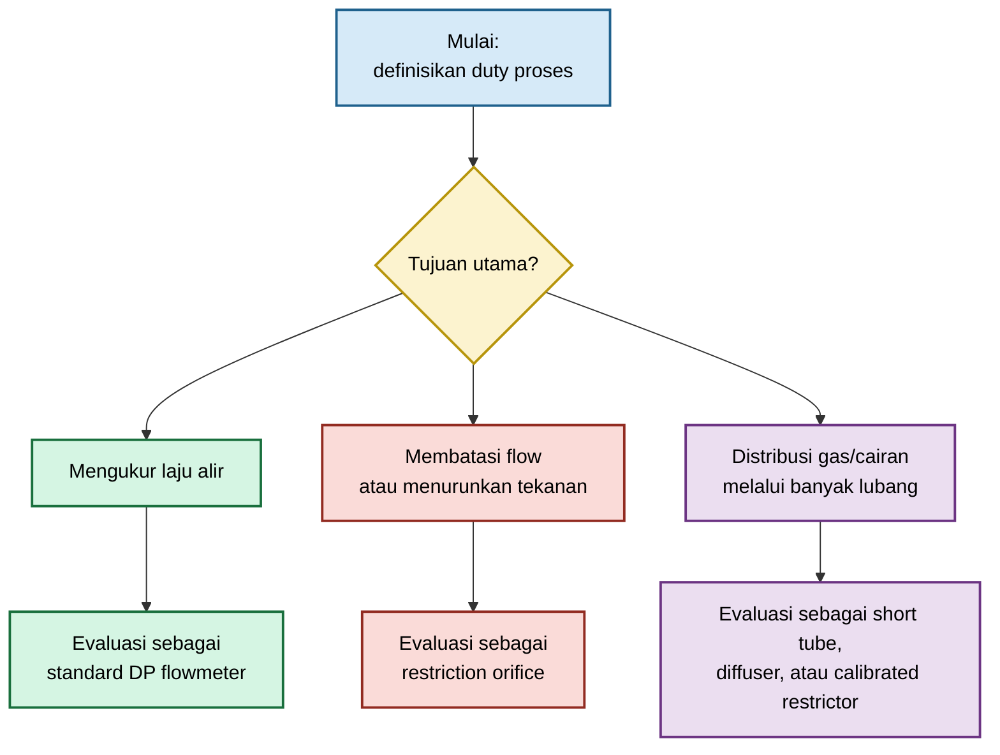

### 0.1 Tiga kategori yang tidak boleh dicampur

| Kategori                                               | Tujuan utama                                            | Basis desain                                                      | Risiko utama bila salah model                                  |
| ------------------------------------------------------ | ------------------------------------------------------- | ----------------------------------------------------------------- | -------------------------------------------------------------- |
| **Standard orifice plate flowmeter**                   | Mengukur flow dengan ketidakpastian terkontrol          | Differential-pressure metering standard                           | Error pengukuran dan kegagalan custody/accounting              |
| **Restriction orifice**                                | Menurunkan tekanan atau membatasi flow                  | Pressure-loss, velocity, cavitation/choking, noise                | Cavitation, sonic flow, noise, vibration, erosion              |
| **Small hole, short tube, diffuser, purge restrictor** | Membatasi atau mendistribusikan flow melalui bore kecil | Korelasi empiris, calibration, vendor curve, atau CFD tervalidasi | Distribusi tidak seragam, fouling, plugging, error $C_d$ besar |

### 0.2 Standard orifice plate flowmeter

Kategori ini digunakan ketika target utama adalah memperoleh laju alir dari differential pressure yang terukur. Persamaan standar hanya dapat digunakan apabila plate, bore, pipe, tapping, instalasi, dan kondisi operasi berada dalam batas penerapan metode yang dipilih.

Secara umum, mass flow untuk differential-pressure flowmeter dinyatakan sebagai:

$$
\dot{m}
=

C , \varepsilon , A_o
\sqrt{
\frac{2\rho_1 \Delta p}
{1-\beta^4}
}
$$

dengan:

$$
A_o
=

\frac{\pi d^2}{4}
$$

dan:

$$
\beta
=

\frac{d}{D}
$$

Keterangan:

- $\dot{m}$ = mass flow rate;
- (C) = discharge coefficient;
- $\varepsilon$ = expansibility factor;
- $A_o$ = luas bore;
- $\rho_1$ = densitas fluida pada kondisi upstream;
- $\Delta p$ = differential pressure pada tapping yang didefinisikan;
- (d) = bore diameter;
- (D) = internal pipe diameter.

Nilai (C) bukan konstanta universal. Untuk standard metering, nilainya berasal dari korelasi yang hanya berlaku bila persyaratan geometri, tapping arrangement, Reynolds number, beta ratio, dan kondisi instalasi dipenuhi. Prinsip ini merupakan dasar ISO 5167 dan ASME MFC-3M. [R1][R2]

### 0.3 Restriction orifice untuk pressure reduction

Restriction orifice digunakan ketika target utamanya adalah membatasi flow atau menghasilkan pressure drop tertentu. Akurasi flow measurement mungkin tetap diperlukan, tetapi bukan fungsi utama plate.

Untuk preliminary hydraulic screening pada liquid inkompresibel, pressure loss dapat ditulis sebagai:

$$
\Delta p
=

K
\frac{\rho V^2}{2}
$$

dengan:

- (K) = total loss coefficient;
- $\rho$ = densitas fluida;
- (V) = velocity yang basisnya harus didefinisikan secara konsisten, misalnya pipe velocity atau bore velocity.

Pada desain restriction orifice, engineer harus mengevaluasi lebih dari sekadar target $\Delta p$:

- minimum pressure pada vena contracta;
- cavitation atau flashing untuk liquid;
- choking untuk gas atau steam;
- jet velocity dan Mach number;
- permanent pressure loss;
- acoustic noise;
- vibration dan fatigue;
- erosion;
- kemungkinan penggunaan multi-stage restriction.

### 0.4 Small hole, short tube, diffuser, dan purge restrictor

Bore kecil dengan plate relatif tebal tidak selalu berperilaku seperti thin sharp-edge orifice. Pada kasus tersebut, entrance loss, friction di dalam bore, exit loss, burr, surface finish, dan variasi machining dapat mengubah flow secara signifikan.

Untuk short tube atau bore kecil, hubungan praktis dapat ditulis:

$$
Q
=

C_d A_o
\sqrt{
\frac{2\Delta p}{\rho}
}
$$

Namun, nilai $C_d$ harus diperlakukan sebagai fungsi dari kondisi aktual:

$$
C_d
=

f
\left(
\mathrm{Re}_{bore},
\frac{t}{d},
\text{edge condition},
\text{roughness},
\text{pressure ratio}
\right)
$$

Persamaan tersebut dapat digunakan untuk estimasi awal, tetapi desain final perlu didukung oleh salah satu atau kombinasi berikut:

- korelasi empiris yang relevan;
- vendor performance curve;
- calibration test;
- test rig;
- CFD yang diverifikasi dan divalidasi terhadap data eksperimen.

### 0.5 Kapan persamaan ISO/ASME dapat dipakai

Persamaan standard differential-pressure metering dapat dipakai bila seluruh kondisi berikut dipenuhi:

1. Tujuan utamanya adalah pengukuran flow, bukan semata-mata pressure reduction.
2. Pipa berbentuk circular conduit dan mengalir penuh.
3. Fluida satu fase pada kondisi yang dapat didefinisikan.
4. Geometri plate, bore, dan pipe dapat diukur serta memenuhi toleransi metode.
5. Jenis pressure tapping sesuai dengan korelasi yang dipakai.
6. Beta ratio dan Reynolds number berada dalam rentang penerapan standar.
7. Upstream flow profile dan straight run memenuhi persyaratan atau menggunakan flow conditioner yang sesuai.
8. Plate tidak aus, burr, tererosi, atau terhalang gasket.
9. Data tekanan, temperatur, densitas, dan viskositas tersedia pada basis yang benar.

Apabila salah satu kondisi tersebut tidak terpenuhi, hasil tetap dapat dihitung, tetapi tidak boleh otomatis disebut sebagai hasil “sesuai ISO” atau “sesuai ASME”.

### 0.6 Kapan korelasi empiris, vendor data, pengujian, atau CFD diperlukan

Metode non-standar diperlukan bila salah satu kondisi berikut terjadi:

| Kondisi                           | Metode yang lebih tepat                               |
| --------------------------------- | ----------------------------------------------------- |
| Bore kecil dengan $t/d$ besar     | Korelasi short tube atau calibration test             |
| Multi-hole diffuser               | Vendor curve, flow-balance test, atau CFD tervalidasi |
| Gas dengan pressure ratio tinggi  | Compressible-flow model dan choking check             |
| Liquid dekat vapor pressure       | Cavitation/flashing model                             |
| High-velocity gas restriction     | Noise, Mach number, vibration, dan fatigue assessment |
| Geometri eksentrik atau plate aus | Inspection, recalibration, atau CFD screening         |
| Manifold dengan banyak cabang     | Network calculation dan CFD bila diperlukan           |
| Slurry atau fluida abrasif        | Erosion assessment dan empirical field data           |

### 0.7 Kesalahan desain yang paling mahal

#### Menggunakan $C_d = 0{,}61$ secara universal

Nilai sekitar 0,61 sering diasosiasikan dengan thin sharp-edge orifice pada kondisi tertentu. Nilai tersebut tidak dapat digunakan secara otomatis untuk thick plate, short tube, rounded inlet, micro-orifice, diffuser, atau plate yang mengalami wear.

#### Mengabaikan expansibility pada gas

Untuk gas, densitas berubah ketika tekanan menurun. Mengabaikan expansibility dapat menghasilkan error flow yang material, khususnya ketika $\Delta p$ tidak kecil terhadap tekanan absolut upstream.

#### Menyamakan measured DP dengan permanent pressure loss

Differential pressure pada tapping bukan selalu sama dengan pressure loss permanen sistem.

$$
\Delta p_{\mathrm{measured}}
\neq
\Delta p_{\mathrm{permanent}}
$$

Sebagian tekanan dapat pulih setelah vena contracta. Besarnya recovery bergantung pada geometri dan kondisi aliran.

#### Menggunakan $t/d$ sebagai satu-satunya dasar klasifikasi

Rasio $t/d$ penting, tetapi tidak cukup. Engineer juga harus menilai edge radius, bore finish, bore length, beta ratio, Reynolds number, pressure ratio, dan kondisi upstream.

#### Mengabaikan cavitation, choking, noise, erosion, dan plugging

Risiko ini dapat menyebabkan kegagalan fungsi walaupun perhitungan debit tampak benar. Restriction orifice yang memenuhi target flow tetapi menimbulkan cavitation, sonic jet, atau plugging bukan desain yang dapat diterima.

[**Kembali ke Atas**](#orifice-plate-geometry-flow-equation-installation-and-field-engineering-practice)

---

## 1. Scope, Intended Use, and Explicit Exclusions

### 1.1 Tujuan artikel

Artikel ini adalah panduan engineering untuk:

- preliminary design;
- independent checking;
- troubleshooting;
- review calculation package;
- penilaian kelayakan model;
- penentuan kebutuhan test, vendor data, atau CFD.

Artikel ini tidak dimaksudkan untuk menggantikan standar, datasheet proyek, spesifikasi owner, atau approval authority. Bila hasil perhitungan digunakan untuk custody transfer, billing, safety-critical pressure reduction, blowdown, atau equipment protection, desain harus diverifikasi terhadap standar dan prosedur proyek yang berlaku.

### 1.2 Intended use

Artikel ini paling sesuai untuk engineer yang perlu menjawab pertanyaan berikut:

- Apakah plate ini flowmeter atau restriction device?
- Apakah persamaan standard-orifice masih valid?
- Apakah bore kecil ini lebih tepat diperlakukan sebagai short tube?
- Apakah gas berpotensi choking?
- Apakah liquid berpotensi cavitation atau flashing?
- Apakah permanent pressure loss dapat diterima?
- Apakah hasil CFD dapat dipercaya untuk keputusan desain?
- Apakah plate yang terpasang masih sesuai dengan calculation basis?

### 1.3 Batas penggunaan utama

Panduan ini berlaku terutama untuk kondisi berikut.

| Parameter       | Batas penggunaan utama                                                |
| --------------- | --------------------------------------------------------------------- |
| Regime operasi  | Steady atau quasi-steady flow                                         |
| Geometri pipa   | Circular pipe atau conduit dengan internal diameter terdefinisi       |
| Kondisi pipa    | Terisi penuh untuk liquid flowmeter dan liquid restriction            |
| Fase fluida     | Satu fase pada titik evaluasi utama                                   |
| Plate           | Geometri bore, thickness, edge, dan posisi dapat diukur               |
| Properti fluida | Tekanan, temperatur, densitas, dan viskositas tersedia                |
| Instrumentasi   | Differential pressure dan pressure tapping dapat diidentifikasi       |
| Tujuan desain   | Metering, restriction, distribution, balancing, atau purge yang jelas |

Untuk fluida inkompresibel, continuity dapat ditulis:

$$
Q
=

A V
$$

Untuk analisis mass flow yang lebih umum:

$$
\dot{m}
=

\rho A V
$$

Nilai densitas harus memakai kondisi proses yang sesuai. Untuk gas, engineer harus memastikan apakah flow rate dinyatakan sebagai actual volumetric flow, standard volumetric flow, normal volumetric flow, atau mass flow.

### 1.4 Data minimum sebelum memulai perhitungan

Perhitungan tidak boleh dimulai hanya dari bore diameter dan target flow. Data minimum berikut diperlukan.

| Kelompok data    | Data minimum                                                                        |
| ---------------- | ----------------------------------------------------------------------------------- |
| Process          | Flow minimum, normal, maksimum; pressure; temperature; fluid composition            |
| Fluid properties | Density, viscosity; vapor pressure untuk liquid; (Z) dan (k) untuk gas bila relevan |
| Pipe             | Actual internal diameter, material, schedule, roughness bila dibutuhkan             |
| Plate            | Bore diameter, thickness, bevel, edge condition, concentricity, material            |
| Installation     | Tapping type, upstream fittings, straight run, valve position, flow conditioner     |
| Design duty      | Metering accuracy, target DP, allowable permanent loss, noise, plugging tolerance   |
| Mechanical       | Pressure rating, corrosion allowance, erosion risk, support arrangement             |

### 1.5 Explicit exclusions

Bagian berikut berada di luar scope standard calculation dan memerlukan penilaian khusus.

#### Multiphase flow

Pada gas-liquid, liquid-solid, atau gas-liquid-solid flow, pressure drop dan differential pressure tidak dapat diinterpretasikan dengan persamaan satu fase secara langsung. Slip velocity, phase distribution, entrainment, segregation, dan intermittent flow dapat mendominasi hasil.

#### Slurry atau fluida abrasif

Slurry dapat menyebabkan bore enlargement, edge rounding, plugging, dan perubahan $C_d$ sepanjang umur operasi. Untuk kondisi ini, material selection dan erosion life dapat menjadi lebih penting daripada akurasi initial sizing.

#### Pulsating flow

Pulsasi dari reciprocating pump, compressor, atau control valve dapat menyebabkan DP transmitter membaca nilai yang tidak merepresentasikan mean flow secara akurat. Damping, averaging, dan dynamic response harus dianalisis.

#### Viskositas sangat tinggi

Pada Reynolds number rendah, korelasi turbulent-flow tidak dapat digunakan tanpa koreksi atau validasi. Laminar dan transitional flow dapat menyebabkan $C_d$ berubah substansial.

#### Gas dekat kondisi choking

Untuk gas, kenaikan pressure drop tidak selalu meningkatkan flow setelah critical pressure ratio tercapai. Kondisi ini memerlukan compressible-flow calculation.

#### Flashing liquid

Flashing berbeda dari cavitation. Pada flashing, cairan dapat berubah fase dan tidak sepenuhnya mengembun kembali downstream. Persamaan liquid satu fase tidak lagi cukup.

#### Diffuser multi-hole

Distribusi flow antar-lubang dapat tidak merata akibat pressure gradient di plenum, perbedaan elevasi, variasi diameter bore, dan interaksi bubble plume atau jet.

#### Micro-orifice atau bore sangat kecil

Pada bore kecil, burr, fouling, surface finish, dan toleransi diameter dapat menghasilkan perubahan flow yang jauh lebih besar daripada error instrumentasi.

#### Plate non-konsentris atau aus

Plate dengan eccentricity, erosion, pitting, edge rounding, atau gasket intrusion tidak lagi merepresentasikan geometri calculation basis. Inspection dan revalidation diperlukan sebelum menggunakan kembali hasil perhitungan awal.

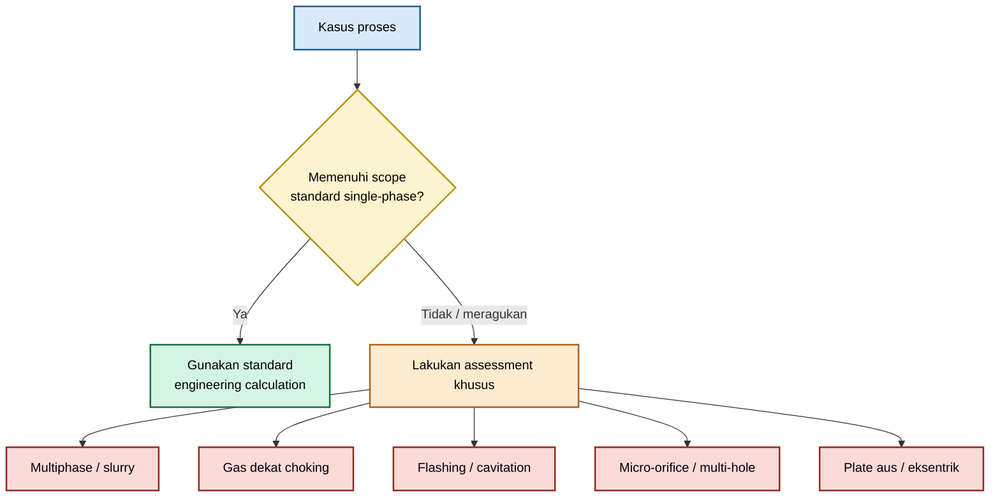

### 1.6 Prinsip konservatif

Apabila informasi geometri, process condition, atau standard applicability tidak lengkap, jangan meningkatkan keyakinan terhadap hasil hanya dengan menambah digit desimal pada spreadsheet.

Gunakan urutan keputusan berikut:

1. Identifikasi ketidakpastian terbesar.
2. Tentukan apakah ketidakpastian tersebut memengaruhi safety, accuracy, operability, atau equipment integrity.
3. Gunakan asumsi konservatif untuk screening awal.
4. Tentukan kebutuhan inspection, test, vendor data, atau CFD.
5. Dokumentasikan batas validitas hasil.

[**Kembali ke Atas**](#orifice-plate-geometry-flow-equation-installation-and-field-engineering-practice)

---

## 2. Application Classification: Metering atau Restriction?

Klasifikasi aplikasi adalah keputusan pertama yang menentukan model, data input, acceptance criteria, dan deliverable. Jangan memilih persamaan berdasarkan bentuk plate saja.

### 2.1 Decision tree utama

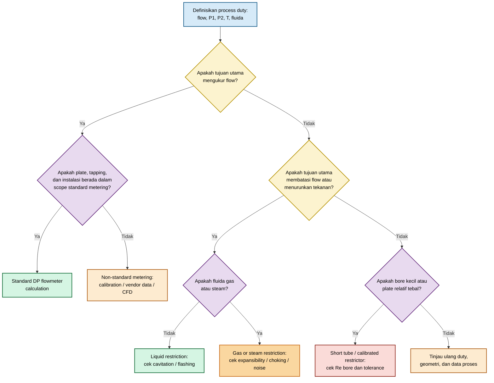

Gunakan pertanyaan berikut sebagai minimum decision gate.

| Pertanyaan                                        | Konsekuensi desain                                                                       |
| ------------------------------------------------- | ---------------------------------------------------------------------------------------- |
| Apakah tujuan utama mengukur flow?                | Gunakan differential-pressure metering method yang sesuai standar dan target uncertainty |
| Apakah tujuan utama menurunkan tekanan?           | Gunakan restriction-orifice design method dengan cek permanent loss dan mechanical risk  |
| Apakah bore kecil dan plate relatif tebal?        | Perlakukan sebagai short tube atau calibrated restrictor, bukan otomatis thin orifice    |
| Apakah fluida gas?                                | Wajib cek expansibility, pressure ratio, choking, velocity, noise, dan basis flow rate   |
| Apakah liquid mendekati vapor pressure?           | Wajib cek cavitation dan flashing pada area vena contracta                               |
| Apakah terdapat banyak hole?                      | Evaluasi plenum pressure gradient, flow balance, dan toleransi lubang                    |
| Apakah plate tidak sesuai drawing atau telah aus? | Lakukan inspection dan jangan gunakan calculation basis lama tanpa revalidation          |

### 2.2 Standard orifice plate flowmeter

Gunakan kategori ini bila keberhasilan desain diukur dari kualitas pengukuran flow.

**Tujuan utama:**

- process monitoring;
- control;
- performance test;
- mass balance;
- allocation;
- custody transfer, bila standar dan uncertainty requirement dipenuhi.

**Deliverable minimum:**

| Deliverable            | Isi minimum                                                                    |
| ---------------------- | ------------------------------------------------------------------------------ |
| Datasheet              | Fluid, flow range, P/T, density, viscosity, pipe ID, bore, beta ratio          |
| Calculation            | Standard basis, tapping type, (C), $\varepsilon$, Reynolds number, uncertainty |
| Installation drawing   | Straight run, orientation, tapping location, transmitter location              |
| Inspection requirement | Bore, edge, concentricity, plate thickness, gasket clearance                   |
| Commissioning record   | Zero check, impulse-line check, transmitter calibration, plate orientation     |

Untuk kasus ini, permanent pressure loss tetap penting, tetapi bukan primary performance variable. Primary variable adalah flow uncertainty dan repeatability.

### 2.3 Restriction orifice

Gunakan kategori ini bila keberhasilan desain diukur dari kemampuan plate untuk menghasilkan pressure drop atau membatasi flow tanpa menciptakan risiko operasional yang tidak dapat diterima.

**Aplikasi umum:**

- pump minimum-flow line;
- bypass;
- pressure reduction;
- compressor recycle;
- blowdown restriction;
- equipment protection;
- hydraulic balancing.

**Deliverable minimum:**

| Deliverable              | Isi minimum                                                          |
| ------------------------ | -------------------------------------------------------------------- |
| Process design basis     | Flow, upstream/downstream pressure, temperature, fluid properties    |
| Hydraulic calculation    | Target $\Delta p$, permanent loss, velocity, restriction coefficient |
| Risk assessment          | Cavitation, flashing, choking, noise, vibration, erosion             |
| Mechanical specification | Material, thickness, pressure rating, holder arrangement             |
| Operating limits         | Minimum/maximum flow, pressure ratio, inspection interval            |

Untuk restriction service, akurasi flow mungkin hanya secondary requirement. Namun, pressure drop, noise, durability, dan operability harus dianalisis lebih ketat.

### 2.4 Small hole, short tube, diffuser, dan purge restrictor

Gunakan kategori ini ketika bore sangat kecil, plate relatif tebal, atau terdapat banyak lubang yang mendistribusikan flow.

**Aplikasi umum:**

- aeration diffuser;
- purge gas restrictor;
- calibration leak path;
- pneumatic restrictor;
- sparger;
- gas distribution plate;
- multi-hole balancing plate.

**Deliverable minimum:**

| Deliverable            | Isi minimum                                                              |
| ---------------------- | ------------------------------------------------------------------------ |
| Geometry specification | Diameter tiap hole, thickness, hole pattern, pitch, roughness, tolerance |
| Flow basis             | Flow per hole, total flow, actual/standard gas basis, pressure drop      |
| Distribution check     | Plenum pressure map, elevation effect, hole-to-hole variation            |
| Validation plan        | Vendor curve, test data, calibration, CFD validation                     |
| Maintainability review | Fouling, plugging, cleaning method, replacement philosophy               |

Untuk multi-hole plate, total flow tidak selalu dapat dihitung secara aman hanya dengan:

$$
Q_{\mathrm{total}}
=

N Q_{\mathrm{hole}}
$$

Hubungan tersebut baru layak digunakan bila setiap hole menerima differential pressure yang hampir sama dan memiliki geometri serta kondisi aliran yang setara.

### 2.5 Klasifikasi berdasarkan fungsi, bukan hanya bentuk

Dua plate dapat memiliki bore diameter yang sama, tetapi memerlukan metode berbeda.

| Kondisi       | Plate A                           | Plate B                           | Konsekuensi                                         |
| ------------- | --------------------------------- | --------------------------------- | --------------------------------------------------- |
| Fungsi        | Flowmeter                         | Pressure reduction                | Model dan acceptance criteria berbeda               |
| Fluida        | Water                             | Natural gas                       | Gas memerlukan expansibility dan choking check      |
| Geometri      | Thin, sharp-edge                  | Thick bore                        | $C_d$ dan loss behavior dapat berbeda               |
| Instalasi     | Flange taps, straight run memadai | Dekat control valve               | Standard metering correlation mungkin tidak berlaku |
| Output desain | Flow uncertainty                  | Permanent loss, noise, durability | Deliverable tidak sama                              |

### 2.6 Output desain per aplikasi

#### Flowmeter

Output yang harus tersedia:

- range flow minimum, normal, dan maksimum;
- beta ratio;
- DP pada tiap flow point;
- pressure tapping arrangement;
- discharge coefficient basis;
- expansibility factor untuk gas;
- uncertainty budget;
- straight-run requirement;
- installation and inspection drawing.

#### Restriction orifice

Output yang harus tersedia:

- required pressure drop;
- permanent pressure loss;
- pressure profile;
- bore velocity;
- cavitation/flashing assessment untuk liquid;
- choking/noise assessment untuk gas;
- erosion and material assessment;
- plate and holder mechanical specification.

#### Diffuser

Output yang harus tersedia:

- total gas flow;
- flow per hole;
- diameter dan thickness tiap hole;
- hole pattern;
- plenum pressure distribution;
- bubble distribution requirement;
- plugging risk;
- calibration basis atau vendor curve.

#### Purge line

Output yang harus tersedia:

- minimum purge flow;
- maximum purge flow;
- pressure available;
- gas basis;
- restriction geometry;
- plugging tolerance;
- isolation and maintenance arrangement.

#### Blowdown

Output yang harus tersedia:

- depressurization target;
- upstream pressure dan temperature;
- backpressure;
- compressible flow basis;
- choking condition;
- noise and vibration assessment;
- material temperature limitation;
- downstream disposal capacity.

#### Compressor recycle

Output yang harus tersedia:

- normal dan upset flow;
- compressor operating envelope;
- pressure ratio;
- gas composition;
- transient behavior;
- acoustic and vibration risk;
- valve-orifice interaction.

#### Aeration manifold

Output yang harus tersedia:

- total airflow;
- airflow per diffuser or per hole;
- manifold pressure loss;
- pressure balance;
- submergence head;
- hole tolerance;
- fouling and cleaning strategy;
- oxygen-transfer or mixing performance requirement.

### 2.7 Engineering rule sebelum menghitung

Sebelum memasukkan angka ke spreadsheet, nyatakan satu kalimat desain berikut:

> “Komponen ini adalah [flowmeter / restriction orifice / short tube / diffuser / purge restrictor] untuk [fluida] pada [rentang operasi], dan keberhasilan desain ditentukan oleh [akurasi flow / target pressure reduction / flow distribution / safety limit].”

Kalimat tersebut memaksa calculation package memiliki basis yang dapat direview. Bila kalimat ini belum dapat ditulis dengan jelas, model belum boleh dipilih.

### Rujukan Bab 0–2

- **[R1]** ISO 5167-1, _Measurement of Fluid Flow by Means of Pressure Differential Devices Inserted in Circular Cross-Section Conduits Running Full — Part 1: General Principles and Requirements_. Gunakan edisi yang berlaku pada proyek.
- **[R2]** ISO 5167-2, _Measurement of Fluid Flow by Means of Pressure Differential Devices Inserted in Circular Cross-Section Conduits Running Full — Part 2: Orifice Plates_. Gunakan edisi yang berlaku pada proyek.
- **[R3]** ASME MFC-3M, _Measurement of Fluid Flow in Pipes Using Orifice, Nozzle, and Venturi_.
- **[R4]** Crane Co., _Flow of Fluids Through Valves, Fittings and Pipe_, Technical Paper No. 410.
- **[R5]** I. E. Idelchik, _Handbook of Hydraulic Resistance_.
- **[R6]** ASME V&V 20, _Standard for Verification and Validation in Computational Fluid Dynamics and Heat Transfer_.

[**Kembali ke Atas**](#orifice-plate-geometry-flow-equation-installation-and-field-engineering-practice)

---

Berikut lanjutan naskah Bab 3–4, dengan basis struktur dari draft sebelumnya.

---

# 3. Geometry, Tolerances, and Inspection Requirements

Geometri orifice plate bukan sekadar informasi pada fabrication drawing. Setiap dimensi menentukan area aliran, pola separasi, lokasi vena contracta, discharge coefficient, pressure loss, dan—untuk flowmeter—validitas korelasi yang digunakan.

Kesalahan kecil pada bore, edge, posisi plate, atau gasket dapat mengubah karakteristik flow secara material. Karena itu, geometry control harus diperlakukan sebagai bagian dari desain hidrolik dan metrologi, bukan hanya quality-control mekanis.

## 3.1 Definisi geometri

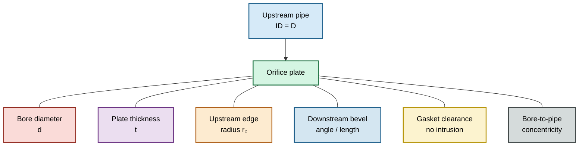

### Pipe internal diameter, (D)

(D) adalah internal diameter aktual pipa pada lokasi plate, bukan nominal pipe size, outside diameter, atau schedule number.

$$
A_p
=

\frac{\pi D^2}{4}
$$

Pada standard differential-pressure metering, definisi dan metode pengukuran (D) harus konsisten dengan standard calculation method yang digunakan. Perubahan akibat lining, corrosion, deposit, ovality, atau temperatur dapat mengubah beta ratio dan hasil flow calculation.

### Bore diameter, (d)

Bore diameter adalah diameter lubang aliran pada plate.

$$
A_o
=

\frac{\pi d^2}{4}
$$

Karena luas bore berbanding dengan kuadrat diameter:

$$
A_o
\propto
d^2
$$

maka error kecil pada bore dapat menghasilkan error flow yang material.

Untuk perubahan kecil:

$$
\frac{\Delta A_o}{A_o}
\approx
2
\frac{\Delta d}{d}
$$

Sebagai contoh, perubahan bore sebesar 1% dapat menghasilkan perubahan area sekitar 2%. Untuk restriction, perubahan tersebut dapat mengubah pressure drop. Untuk flowmeter, perubahan tersebut dapat langsung memengaruhi hasil flow calculation.

### Beta ratio, $\beta$

Beta ratio didefinisikan sebagai:

$$
\beta
=

\frac{d}{D}
$$

Hubungan antara area bore dan area pipa adalah:

$$
\frac{A_o}{A_p}
=

\beta^2
$$

Beta ratio memengaruhi:

- differential pressure pada flow tertentu;
- sensitivity transmitter;
- permanent pressure loss;
- discharge coefficient correlation;
- uncertainty;
- pressure recovery;
- kemungkinan cavitation atau noise pada service tertentu.

Beta ratio tidak boleh dihitung menggunakan nominal pipe diameter apabila calculation method membutuhkan actual internal diameter.

### Plate thickness, (t)

Plate thickness adalah ketebalan fisik plate. Nilai ini penting, tetapi tidak selalu sama dengan panjang efektif aliran di dalam bore.

Rasio awal yang sering diperiksa adalah:

$$
\frac{t}{d}
$$

Rasio ini membantu mengidentifikasi apakah geometri cenderung menyerupai thin plate atau short tube. Namun, rasio tersebut bukan satu-satunya parameter penentu model.

### Effective bore length, $L_e$

Effective bore length adalah panjang bagian bore yang secara nyata memberikan tahanan aliran. Nilainya dapat berbeda dari ketebalan total plate karena adanya bevel, chamfer, counterbore, atau rounded entrance.

Untuk bore silindris tanpa bevel yang signifikan, pendekatan awal dapat menggunakan:

$$
L_e
\approx
t
$$

Namun, pendekatan tersebut tidak boleh dipakai secara otomatis untuk plate dengan bevel, counterbore, atau profil inlet khusus.

Pada short tube, rasio berikut biasanya lebih relevan daripada thickness nominal saja:

$$
\frac{L_e}{d}
$$

### Upstream edge radius, $r_e$

Upstream edge radius menentukan apakah aliran mengalami pemisahan tajam di sisi masuk bore atau memasuki bore secara lebih gradual.

Untuk sharp-edge orifice, upstream edge harus mempertahankan kondisi tajam sesuai basis desain. Edge yang mengalami rounding akibat polishing, corrosion, erosion, atau handling dapat mengubah contraction dan discharge coefficient.

Parameter yang lebih bermakna adalah:

$$
\frac{r_e}{d}
$$

Semakin besar nilai relatif radius edge, semakin besar kemungkinan karakteristik aliran bergeser dari sharp-edge behavior menuju rounded-inlet behavior.

### Downstream bevel

Bevel umumnya ditempatkan pada sisi downstream untuk mempertahankan upstream edge sebagai reference edge.

Parameter bevel yang perlu dicatat:

- bevel angle;
- bevel length;
- residual cylindrical bore length;
- arah bevel;
- diameter bore pada upstream face;
- kondisi transisi antara bore dan bevel.

Bevel bukan sekadar detail manufaktur. Bevel yang salah arah atau terlalu jauh masuk ke upstream side dapat mengubah karakteristik entrance flow.

### Bore roughness

Roughness bore menjadi penting terutama untuk:

- short tube;
- bore kecil;
- high-viscosity fluid;
- low-Reynolds-number flow;
- service dengan fouling;
- plate hasil drilling atau additive manufacturing.

Secara umum, roughness dapat dinyatakan sebagai:

$$
\frac{\varepsilon}{d}
$$

dengan:

- $\varepsilon$ = characteristic bore roughness;
- (d) = bore diameter.

Pada thin sharp-edge orifice, bore roughness mungkin tidak dominan dibandingkan edge condition. Pada short tube, roughness dapat menambah friction loss secara signifikan.

### Concentricity

Concentricity menunjukkan kesesuaian posisi center bore terhadap centerline pipe.

Eksentrisitas dapat ditulis secara sederhana sebagai:

$$
e
=

\text{jarak antara sumbu bore dan sumbu pipe}
$$

Rasio pemeriksaan yang berguna adalah:

$$
\frac{e}{D}
$$

Eksentrisitas menyebabkan distribusi kecepatan tidak simetris, sehingga vena contracta, pressure profile, dan differential pressure dapat berubah. Pada flowmeter standar, kondisi ini dapat menurunkan validitas correlation basis.

### Flatness

Plate flatness menentukan apakah plate dapat terpasang tegak lurus dan rata terhadap sealing surface.

Plate yang melengkung dapat menyebabkan:

- sealing tidak merata;
- gasket intrusion;
- misalignment;
- perubahan orientasi edge;
- leakage;
- local stress concentration.

Flatness perlu diperiksa terutama pada plate tipis, diameter besar, high-pressure service, dan plate yang pernah mengalami differential-pressure loading tinggi.

### Gasket intrusion

Gasket tidak boleh masuk ke bore atau mengubah effective flow area.

Kondisi yang harus dipastikan bukan hanya:

$$
D_{\text{gasket}}

>

d
$$

tetapi juga bahwa gasket:

- berada konsentris terhadap bore;
- tidak terjepit masuk ke flow path;
- tidak mengalami cold flow atau extrusion;
- tidak menutup sebagian upstream edge;
- tidak menghasilkan langkah $_step_$ pada internal pipe wall.

Jika gasket mengurangi area efektif, maka:

$$
A_{\text{effective}}
<
A_o
$$

Akibatnya, flow, pressure drop, dan discharge coefficient dapat berubah dari basis desain.

### Ringkasan parameter geometri

| Parameter              |        Simbol | Dampak utama                                      |
| ---------------------- | ------------: | ------------------------------------------------- |
| Pipe internal diameter |           (D) | Beta ratio, pipe velocity, standard applicability |
| Bore diameter          |           (d) | Area aliran, flow capacity, DP                    |
| Beta ratio             |       $\beta$ | DP, pressure loss, coefficient correlation        |
| Plate thickness        |           (t) | Klasifikasi awal thin plate atau short tube       |
| Effective bore length  |         $L_e$ | Friction loss dalam bore                          |
| Edge radius            |         $r_e$ | Separation, contraction, $C_d$                    |
| Bore roughness         | $\varepsilon$ | Friction dan repeatability short tube             |
| Eccentricity           |           (e) | Asimetri profile dan measurement error            |
| Gasket intrusion       |             — | Effective area dan flow disturbance               |

## 3.2 Mengapa $t/d$ bukan satu-satunya klasifikasi

Rasio:

$$
\frac{t}{d}
$$

adalah screening parameter yang berguna, tetapi tidak cukup untuk memilih model akhir atau menetapkan nilai $C_d$.

Sebagai contoh, dua plate dengan nilai $t/d$ sama dapat menunjukkan karakteristik yang berbeda apabila satu plate memiliki sharp upstream edge dan plate lain memiliki rounded entrance, burr, bevel yang salah arah, atau bore roughness tinggi.

Model aktual harus mempertimbangkan lebih dari satu parameter:

$$
C_d
=

f
\left(
\mathrm{Re},
\beta,
\frac{t}{d},
r_e,
\text{roughness},
\text{edge condition}
\right)
$$

Untuk analisis yang lebih lengkap, hubungan tersebut dapat diperluas menjadi:

$$
C_d
=

f
\left(
\mathrm{Re}_{pipe},
\mathrm{Re}_{bore},
\beta,
\frac{L_e}{d},
\frac{r_e}{d},
\frac{\varepsilon}{d},
\text{edge condition},
\frac{P_2}{P_1},
M
\right)
$$

dengan:

- $\mathrm{Re}_{pipe}$ = Reynolds number berbasis diameter pipa;
- $\mathrm{Re}_{bore}$ = Reynolds number berbasis diameter bore;
- $P_2/P_1$ = pressure ratio untuk gas;
- (M) = Mach number lokal, bila relevan.

### Apa yang dapat disimpulkan dari $t/d$

| Kondisi                             | Interpretasi awal                                                       |
| ----------------------------------- | ----------------------------------------------------------------------- |
| $t/d$ kecil dan upstream edge tajam | Kandidat thin sharp-edge plate                                          |
| $t/d$ menengah                      | Perlu evaluasi edge, bore length, dan empirical correlation             |
| $t/d$ besar                         | Kandidat short tube atau long-bore restriction                          |
| Bore kecil dengan $t/d$ besar       | Risiko sensitivity terhadap machining, roughness, dan fouling meningkat |

### Apa yang tidak dapat disimpulkan dari $t/d$

Rasio $t/d$ tidak dapat membuktikan bahwa:

- plate memenuhi standard-orifice geometry;
- nilai $C_d$ tertentu dapat digunakan;
- bore memiliki sharp edge;
- entrance radius dapat diabaikan;
- flow berada pada turbulent regime;
- gas tidak mengalami choking;
- liquid tidak mengalami cavitation;
- multi-hole diffuser akan membagi flow secara merata.

Pernyataan bahwa plate dengan $t/d$ besar otomatis merupakan “rounded inlet restriction” juga tidak tepat. Rounded inlet ditentukan oleh profil dan radius entrance, bukan hanya oleh ketebalan plate.

### Dua Reynolds number yang harus dibedakan

Untuk standard flowmeter, Reynolds number pipa sering menjadi parameter utama:

$$
\mathrm{Re}_{pipe}
=

\frac{\rho V_{pipe} D}{\mu}
$$

dengan:

$$
V_{pipe}
=

\frac{Q}{A_p}
$$

Untuk short tube atau bore kecil, Reynolds number bore juga harus dihitung:

$$
\mathrm{Re}_{bore}
=

\frac{\rho V_{bore} d}{\mu}
$$

dengan:

$$
V_{bore}
=

\frac{Q}{A_o}
$$

Bore velocity dapat jauh lebih tinggi daripada pipe velocity. Karena itu, sebuah sistem dapat memiliki $\mathrm{Re}_{pipe}$ yang tampak moderat, tetapi menunjukkan karakter aliran yang berbeda di dalam bore.

## 3.3 Fabrication and field inspection

Inspection harus memastikan bahwa plate yang terpasang sama dengan geometri yang dipakai pada calculation package.

Tidak cukup hanya memeriksa bore diameter nominal. Plate harus diperiksa sebagai satu kesatuan: bore, edge, thickness, bevel, centering, material, orientation, dan traceability.

### Inspection hold points

| Tahap                | Fokus pemeriksaan                                                          |
| -------------------- | -------------------------------------------------------------------------- |
| Sebelum machining    | Drawing revision, material, bore requirement, orientation                  |
| Setelah machining    | Bore, edge, thickness, bevel, burr, roughness bila relevan                 |
| Sebelum dispatch     | Tagging, material certificate, inspection record, preservation             |
| Sebelum installation | Plate orientation, flange condition, gasket, centering                     |
| Saat commissioning   | Tapping line, transmitter configuration, leak check, as-built verification |

### Acceptance checklist

| Item                 | Metode pemeriksaan                                                   | Catatan acceptance                                                   |
| -------------------- | -------------------------------------------------------------------- | -------------------------------------------------------------------- |
| Bore diameter        | Internal micrometer, pin gauge, bore gauge, atau optical measurement | Ukur pada beberapa arah dan catat minimum, maksimum, serta rata-rata |
| Bore circularity     | Bandingkan hasil beberapa arah pengukuran                            | Ovality dapat mengubah effective area                                |
| Burr inspection      | Visual inspection, optical inspection, atau borescope                | Burr tidak boleh mengganggu sharp edge atau flow path                |
| Upstream edge        | Optical inspection atau profile inspection                           | Pastikan tidak rounded, chipped, dented, atau corroded               |
| Plate thickness      | Caliper atau micrometer pada beberapa titik                          | Catat thickness aktual dan uniformity                                |
| Bevel                | Angle gauge, optical comparator, atau CMM bila kritis                | Pastikan bevel berada pada sisi yang dirancang                       |
| Concentricity        | Centering fixture atau dimensional measurement                       | Bore harus aligned terhadap pipe centerline                          |
| Flatness             | Surface plate atau approved flatness method                          | Periksa warping atau deformation                                     |
| Gasket clearance     | Dry-fit check sebelum tightening                                     | Pastikan gasket tidak masuk ke bore                                  |
| Plate orientation    | Tag, arrow, dan visual confirmation                                  | Sharp edge harus menghadap upstream bila desain mensyaratkan         |
| Material certificate | MTC / certificate of conformity                                      | Verifikasi grade, heat number, dan traceability                      |
| Plate tag            | Permanent marking                                                    | Sertakan tag number, bore, material, flow direction, revision        |

### Bore measurement pada beberapa arah

Untuk plate kritis, bore tidak boleh diverifikasi hanya dengan satu pengukuran diameter.

Praktik lapangan yang baik adalah mengukur bore pada beberapa orientasi sudut, misalnya:

- $0^\circ$;
- $45^\circ$;
- $90^\circ$;
- $135^\circ$.

Bila kedua sisi bore dapat diakses, pengukuran dapat dilakukan pada upstream dan downstream face. Pola inspeksi final harus mengikuti project specification atau standard yang menjadi basis desain.

Hasil inspeksi harus dicatat dalam bentuk berikut:

| Parameter      |                                Nilai |
| -------------- | -----------------------------------: |
| Bore minimum   |                           $d_{\min}$ |
| Bore maksimum  |                           $d_{\max}$ |
| Bore rata-rata |                             $\bar d$ |
| Ovality        |                  $d_{\max}-d_{\min}$ |
| Alat ukur      | Serial number dan calibration status |
| Inspector      |          Nama, tanggal, dan approval |

### Burr dan edge inspection

Burr kecil dapat menjadi masalah besar pada bore kecil. Burr dapat:

- mengurangi area efektif;
- mengubah edge profile;
- menambah turbulence;
- menjadi titik awal fouling;
- mengubah distribusi flow antar-hole.

Sharp edge tidak boleh diperbaiki dengan abrasive polishing tanpa memahami basis geometri yang dipersyaratkan. Polishing yang terlihat “lebih halus” dapat justru menghasilkan edge rounding dan mengubah behavior plate.

### Plate orientation

Untuk plate dengan sharp upstream edge dan downstream bevel, arah pemasangan harus tidak ambigu.

Minimal marking yang direkomendasikan:

- tag number;
- bore diameter;
- material;
- flow arrow;
- “UPSTREAM” marking;
- drawing number;
- revision number;
- heat number atau traceability code.

Plate tanpa arah pemasangan yang jelas berisiko terbalik saat maintenance atau replacement.

### Gasket clearance verification

Sebelum flange ditutup penuh, lakukan dry-fit verification untuk memastikan:

- gasket inner diameter cukup besar;
- gasket centered;
- gasket tidak bergeser saat bolt tightening;
- plate tidak terdorong dari posisi center;
- tidak terdapat lip atau extrusion ke bore.

Untuk critical metering service, dokumentasikan kondisi gasket dengan foto sebelum final assembly.

### Material certificate dan traceability

Material certificate harus ditinjau terhadap:

- material grade;
- heat number;
- chemical composition;
- mechanical properties;
- corrosion requirement;
- project specification;
- pressure-temperature rating requirement.

Untuk service korosif, sour service, erosif, atau temperatur tinggi, verifikasi material tidak boleh dibatasi pada nama material umum seperti “SS316”. Grade, heat, certificate, dan bila diperlukan PMI harus dapat ditelusuri.

### Kondisi yang memerlukan revalidation

Plate harus diperiksa ulang atau dihitung ulang bila ditemukan:

- bore enlargement akibat erosion;
- edge rounding;
- pitting;
- gasket intrusion;
- plate warping;
- plate terpasang terbalik;
- bore tidak konsentris;
- deposit atau scaling;
- penggantian plate tanpa traceability;
- perubahan internal pipe diameter karena lining atau deposit.

[**Kembali ke Atas**](#orifice-plate-geometry-flow-equation-installation-and-field-engineering-practice)

---

# 4. Flow Physics and Pressure Profile

Orifice menghasilkan differential pressure melalui kombinasi percepatan aliran, contraction, separasi, turbulence, dan energy dissipation. Untuk memahami pemilihan model dan risiko desain, engineer harus membedakan antara:

- static pressure;
- velocity head;
- total pressure;
- pressure minimum di sekitar vena contracta;
- differential pressure yang dibaca transmitter;
- permanent pressure loss.

## 4.1 Kontinuitas dan percepatan aliran

Untuk steady flow, prinsip kekekalan massa adalah:

$$
\dot m
=

\rho A V
$$

Untuk aliran inkompresibel:

$$
Q
=

A V
$$

Pada pipa upstream:

$$
Q
=

A_p V_{pipe}
$$

Pada bore:

$$
Q
=

A_o V_{bore}
$$

Karena:

$$
A_o
<
A_p
$$

maka secara umum:

$$
V_{bore}

>

V_{pipe}
$$

Hubungan antara pipe velocity dan bore velocity dapat ditulis:

$$
V_{bore}
=

\frac{V_{pipe}}{\beta^2}
$$

karena:

$$
\frac{A_o}{A_p}
=

\beta^2
$$

Semakin kecil beta ratio, semakin tinggi bore velocity untuk flow rate yang sama.

Namun, physical minimum flow area biasanya tidak terjadi tepat di bidang plate. Setelah melewati sharp edge, aliran masih mengalami contraction hingga mencapai vena contracta.

Jika:

$$
A_c
<
A_o
$$

maka velocity rata-rata di vena contracta menjadi:

$$
V_c
=

\frac{Q}{A_c}
$$

dan secara umum:

$$
V_c

>

V_{bore}

>

V_{pipe}
$$

### Catatan penting untuk gas

Untuk gas, densitas tidak selalu konstan:

$$
\rho_1 A_1 V_1
=

\rho_2 A_2 V_2
$$

Ketika pressure drop signifikan, densitas berubah sepanjang flow path. Karena itu, persamaan inkompresibel hanya dapat digunakan sebagai estimasi awal pada kondisi pressure drop kecil atau bila compressibility telah dievaluasi.

## 4.2 Static pressure, velocity head, dan total pressure

### Static pressure

Static pressure adalah tekanan termodinamika lokal yang bekerja pada dinding pipa atau wall pressure tap.

Notasi umum:

$$
p
=

\text{static pressure}
$$

DP transmitter umumnya membaca perbedaan static pressure pada dua lokasi tapping:

$$
\Delta p_{\mathrm{measured}}
=

p_H-p_L
$$

dengan:

- $p_H$ = high-side pressure;
- $p_L$ = low-side pressure.

### Velocity head

Untuk fluida inkompresibel, velocity head dalam satuan tekanan adalah:

$$
q
=

\frac{1}{2}
\rho V^2
$$

Velocity head bukan tekanan statis yang dibaca langsung oleh wall tap. Nilai ini merepresentasikan komponen energi kinetik per unit volume.

### Total pressure

Dalam aliran ideal horizontal tanpa loss:

$$
p
+
\frac{1}{2}\rho V^2
=

\text{konstan}
$$

Dengan elevation:

$$
p
+
\frac{1}{2}\rho V^2
+
\rho g z
=

\text{konstan}
$$

Untuk aliran nyata, harus dimasukkan pressure loss atau head loss:

$$
p_1
+
\frac{1}{2}\rho V_1^2
+
\rho g z_1
=

p_2
+
\frac{1}{2}\rho V_2^2
+
\rho g z_2
+
\Delta p_{\mathrm{loss}}
$$

Static pressure dapat pulih sebagian setelah vena contracta. Namun, total pressure tidak dapat pulih sepenuhnya karena sebagian energi hilang menjadi turbulence, mixing, heat, dan irreversible dissipation.

### Static pressure bukan total pressure

Kesalahan umum adalah menganggap penurunan static pressure di orifice sepenuhnya berubah menjadi velocity head dan kemudian seluruhnya kembali menjadi static pressure downstream.

Pada aliran nyata:

$$
\text{pressure recovery}
<
\text{initial static-pressure reduction}
$$

karena terdapat irreversible loss.

## 4.3 Vena contracta

Vena contracta adalah lokasi downstream dari sharp-edged orifice ketika jet fluida mencapai area minimum.

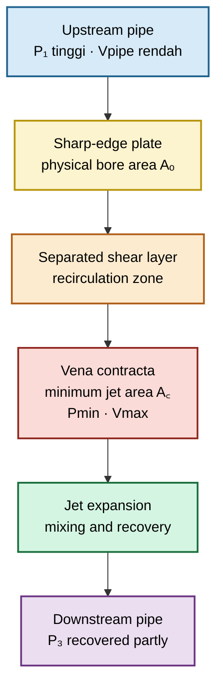

Hubungan contraction dapat dinyatakan dengan coefficient of contraction:

$$
C_c
=

\frac{A_c}{A_o}
$$

dengan:

- $A_c$ = area jet pada vena contracta;
- $A_o$ = physical bore area.

Untuk sharp-edge plate, streamlines tidak langsung mengikuti seluruh bore area secara sempurna. Aliran terpisah di edge lalu membentuk jet yang lebih kecil di downstream side.

Lokasi tekanan minimum biasanya berada di sekitar vena contracta. Namun, titik tekanan minimum lokal tidak selalu tepat sama dengan lokasi geometric minimum area dan tidak selalu sama dengan lokasi low-pressure tapping.

Hal ini sangat penting untuk evaluasi cavitation:

> Tekanan low-side transmitter bukan selalu tekanan minimum yang dialami fluida.

## 4.4 Differential pressure versus permanent pressure loss

Untuk membedakan dua konsep ini, definisikan tiga reference pressure:

- $P_1$: static pressure di upstream reference section;
- $P_{\min}$: local minimum static pressure di sekitar vena contracta;
- $P_3$: static pressure downstream setelah sebagian pressure recovery.

Pada kondisi horizontal dan satu fase, pola umum adalah:

$$
P_1

>

P_3

>

P_{\min}
$$

### Profil tekanan sepanjang orifice

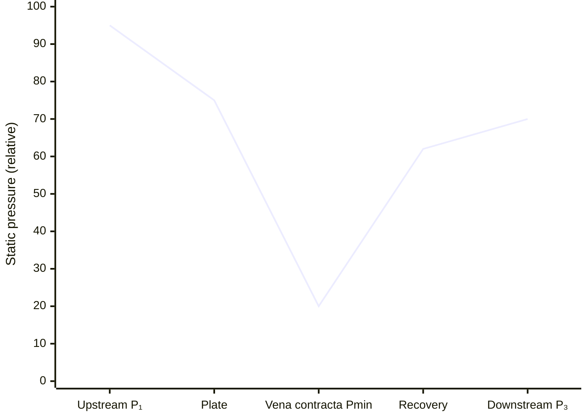

Interpretasi kurva:

1. Static pressure mulai turun ketika fluida mendekati plate.
2. Pressure turun lebih tajam setelah melewati edge.
3. Pressure minimum terjadi di sekitar vena contracta.
4. Jet mengembang dan melambat downstream.
5. Sebagian static pressure pulih.
6. Static pressure downstream tetap lebih rendah daripada pressure upstream karena permanent loss.

### Differential pressure yang diukur

Differential pressure transmitter membaca:

$$
\Delta p_{\mathrm{measured}}
=

p_H-p_L
$$

Nilai ini bergantung pada lokasi tapping, misalnya:

- corner taps;
- flange taps;
- D–D/2 taps;
- pipe taps.

Karena itu, $\Delta p_{\mathrm{measured}}$ tidak boleh didefinisikan tanpa menyebut tapping arrangement.

### Permanent pressure loss

Permanent pressure loss harus dibandingkan antara dua reference section pipa yang ekuivalen dan cukup jauh dari plate sehingga pressure recovery utama telah selesai.

$$
\Delta p_{\mathrm{perm}}
=

P_1-P_3
$$

Dalam banyak konfigurasi orifice plate:

$$
\Delta p_{\mathrm{perm}}
<
\Delta p_{\mathrm{measured}}
$$

karena sebagian static pressure pulih setelah vena contracta.

Namun, rasio antara keduanya bukan konstanta universal. Nilainya dipengaruhi oleh:

- beta ratio;
- geometry plate;
- tap location;
- Reynolds number;
- upstream profile;
- thickness;
- flow regime;
- downstream disturbance.

### Pressure recovery

Pressure recovery dapat dinyatakan secara konseptual sebagai:

$$
\Delta p_{\mathrm{recovered}}
=

P_3-P_{\min}
$$

Semakin efektif aliran pulih, semakin besar nilai tersebut. Namun, recovery yang lebih tinggi tidak selalu berarti metering performance lebih baik, karena tujuan restriction design dan flowmeter design berbeda.

| Parameter                       | Arti engineering                                        |
| ------------------------------- | ------------------------------------------------------- |
| $\Delta p_{\mathrm{measured}}$  | Sinyal yang dibaca DP transmitter                       |
| $P_{\min}$                      | Risiko cavitation, flashing, atau local gas release     |
| $\Delta p_{\mathrm{perm}}$      | Energi pompa atau kompresor yang hilang secara permanen |
| $\Delta p_{\mathrm{recovered}}$ | Static pressure yang kembali setelah vena contracta     |

## 4.5 Turbulence, separation, recirculation, dan pressure recovery

Ketika fluida melewati sharp edge, boundary layer tidak dapat mengikuti perubahan geometri secara mendadak. Aliran mengalami separation dan membentuk shear layer di sekitar jet.

Fenomena utama yang terjadi adalah:

1. Fluida dipercepat menuju bore.
2. Aliran terpisah di upstream edge.
3. Jet menyempit setelah meninggalkan plate.
4. Recirculation zone terbentuk di antara jet dan dinding pipe downstream.
5. Shear layer menciptakan turbulence dan mixing.
6. Jet mengembang kembali menuju luas pipa.
7. Sebagian static pressure pulih, tetapi sebagian energi hilang permanen.

### Separation

Separation lebih kuat pada sharp-edge orifice dibandingkan entrance yang gradual. Inilah salah satu alasan sharp-edge plate menghasilkan vena contracta yang jelas dan karakteristik discharge tertentu.

Pada geometri non-standar, separation dapat berubah karena:

- rounded edge;
- burr;
- bevel yang salah arah;
- thick plate;
- long bore;
- roughness;
- eccentricity;
- asymmetric upstream velocity profile.

### Recirculation

Recirculation zone downstream dari plate bukan sekadar fenomena visual. Zona ini memengaruhi:

- local pressure;
- turbulence intensity;
- pressure recovery;
- vibration;
- particle deposition;
- erosion;
- bubble formation;
- mixing antara jet dan bulk flow.

Pada liquid dengan tekanan dekat vapor pressure, area ini dapat menjadi lokasi risk cavitation. Pada gas berkecepatan tinggi, kondisi ini dapat berkontribusi terhadap acoustic noise dan vibration.

### Turbulence dan irreversible dissipation

Turbulence menciptakan mixing skala kecil dan dissipasi energi mekanik. Akibatnya, total pressure downstream lebih rendah daripada total pressure upstream.

Secara konseptual:

$$
P_{0,1}

>

P_{0,3}
$$

dengan:

- $P_{0,1}$ = total pressure upstream;
- $P_{0,3}$ = total pressure downstream.

Static pressure dapat meningkat setelah vena contracta, tetapi total pressure tetap berkurang akibat loss.

### Pressure recovery tidak sama dengan energy recovery penuh

Pressure recovery dapat terlihat baik bila $P_3$ naik cukup besar dari $P_{\min}$. Namun, engineer tidak boleh menyimpulkan bahwa energi telah pulih penuh.

Hubungan yang benar adalah:

$$
P_3

>

P_{\min}
$$

tetapi:

$$
P_3
<
P_1
$$

untuk aliran nyata dengan permanent pressure loss.

### Implikasi desain

| Fenomena            | Dampak pada desain                                    |
| ------------------- | ----------------------------------------------------- |
| Vena contracta      | Tentukan local minimum pressure dan cavitation risk   |
| Separation          | Memengaruhi $C_d$, vibration, dan uncertainty         |
| Recirculation       | Dapat meningkatkan fouling, erosion, atau unsteady DP |
| Turbulence          | Menyebabkan permanent pressure loss                   |
| Pressure recovery   | Menentukan energy penalty aktual downstream           |
| Jet velocity tinggi | Risiko noise, choking, vibration, dan material damage |

### Implikasi untuk CFD dan pengujian

CFD dapat membantu memvisualisasikan:

- vena contracta;
- separation zone;
- pressure minimum;
- recirculation;
- pressure recovery;
- distribution flow pada multi-hole plate.

Namun, CFD tidak otomatis menghasilkan nilai $C_d$ yang layak digunakan untuk desain. Model harus diverifikasi terhadap mesh independence, turbulence-model sensitivity, boundary-condition realism, dan—untuk desain kritis—data eksperimen atau calibration data.

### Prinsip praktis

Sebelum menetapkan desain, engineer harus dapat menjawab:

1. Di mana low-pressure tap berada?
2. Di mana pressure minimum lokal kemungkinan terjadi?
3. Berapa permanent pressure loss yang harus ditanggung sistem?
4. Apakah pressure minimum dapat memicu cavitation atau flashing?
5. Apakah gas dapat mencapai critical flow atau Mach number tinggi?
6. Apakah turbulence dan recirculation dapat menyebabkan noise, erosion, atau plugging?
7. Apakah geometri plate yang terpasang sama dengan geometri calculation basis?

### Rujukan Bab 3–4

- **[R1]** ISO 5167-1, _Measurement of Fluid Flow by Means of Pressure Differential Devices Inserted in Circular Cross-Section Conduits Running Full — Part 1: General Principles and Requirements_.
- **[R2]** ISO 5167-2, _Measurement of Fluid Flow by Means of Pressure Differential Devices Inserted in Circular Cross-Section Conduits Running Full — Part 2: Orifice Plates_.
- **[R3]** ASME MFC-3M, _Measurement of Fluid Flow in Pipes Using Orifice, Nozzle, and Venturi_.
- **[R4]** R. W. Miller, _Flow Measurement Engineering Handbook_.
- **[R5]** Crane Co., _Flow of Fluids Through Valves, Fittings and Pipe_, Technical Paper No. 410.
- **[R6]** I. E. Idelchik, _Handbook of Hydraulic Resistance_.

[**Kembali ke Atas**](#orifice-plate-geometry-flow-equation-installation-and-field-engineering-practice)

---

# 5. Standard Orifice Plate Flowmeter

Standard orifice plate flowmeter digunakan untuk mengukur laju alir melalui differential pressure yang terbentuk pada orifice plate. Metode ini kuat, matang, dan luas digunakan, tetapi hanya akurat apabila **geometri plate, diameter pipa, pressure tapping, kondisi aliran, dan metode perhitungan berasal dari basis standar yang sama**.

Bab ini membahas orifice plate sebagai **alat ukur flow**, bukan sebagai restriction orifice untuk pressure reduction. Perbedaan tersebut harus dijaga sejak tahap desain, perhitungan, instalasi, hingga inspeksi. Bab ini juga memperbaiki kecenderungan penggunaan persamaan orifice secara terlalu umum pada draft awal.

## 5.1 Applicability standard

Persamaan standard-orifice hanya boleh digunakan apabila seluruh persyaratan metode yang dipilih dipenuhi. Memakai persamaan standar pada geometri atau instalasi yang berada di luar batas penerapan dapat menghasilkan angka flow yang terlihat meyakinkan, tetapi tidak memiliki dasar uncertainty yang dapat dipertanggungjawabkan.

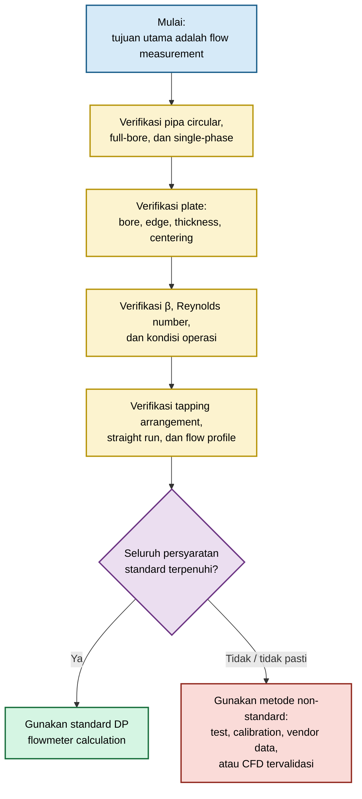

### Persyaratan dasar

| Area            | Persyaratan engineering                                                                           |
| --------------- | ------------------------------------------------------------------------------------------------- |
| Tujuan aplikasi | Tujuan primer adalah pengukuran flow, bukan sekadar menghasilkan pressure drop                    |
| Pipa            | Circular conduit, terisi penuh, internal diameter aktual dapat ditentukan                         |
| Fluida          | Single phase pada basis perhitungan; properti fluida tersedia                                     |
| Plate           | Bore, edge, thickness, bevel, dan concentricity memenuhi metode yang digunakan                    |
| Tapping         | Jenis dan lokasi tapping diketahui serta sesuai dengan basis koefisien                            |
| Aliran upstream | Straight run, upstream fittings, swirl, dan flow profile telah dievaluasi                         |
| Operating range | Beta ratio, Reynolds number, dan flow range berada dalam applicability range standar              |
| Instrumentasi   | DP transmitter, pressure/temperature measurement, dan impulse line memenuhi kebutuhan uncertainty |
| Kondisi plate   | Tidak aus, tidak tererosi, tidak tersumbat, dan tidak mengalami gasket intrusion                  |

### Persyaratan yang tidak boleh dicampur

Standard flowmeter calculation harus memakai satu basis yang konsisten:

```text
plate geometry
+ tapping arrangement
+ discharge-coefficient correlation
+ expansibility correlation
+ diameter basis
+ installation requirement
= satu calculation method
```

Contoh yang tidak dapat diterima:

- memakai flange taps tetapi menggunakan coefficient correlation untuk D–D/2 taps;
- memakai nominal pipe size sebagai (D);
- memakai bore diameter dari drawing lama setelah plate mengalami erosion;
- menggunakan $\varepsilon=1$ untuk gas tanpa evaluasi expansibility;
- memakai nilai $C=0{,}61$ tanpa memeriksa kondisi plate dan Reynolds number;
- menghitung flow berdasarkan differential pressure tetapi tidak mendefinisikan lokasi tapping.

### Status hasil perhitungan

| Status                             | Arti                                                                                    |
| ---------------------------------- | --------------------------------------------------------------------------------------- |
| **Standard-compliant calculation** | Seluruh persyaratan standard yang dipilih dipenuhi dan terdokumentasi                   |
| **Engineering estimate**           | Persamaan digunakan untuk estimasi, tetapi sebagian kondisi standard tidak diverifikasi |
| **Non-standard calculation**       | Geometri, instalasi, atau regime flow berada di luar scope standard                     |
| **Validation required**            | Hasil perlu dikonfirmasi dengan test, calibration, vendor data, atau CFD tervalidasi    |

Gunakan istilah _standard-compliant_ hanya bila standard edition, calculation method, inspection evidence, dan installation basis telah ditetapkan pada calculation package.

---

## 5.2 Persamaan dasar mass flow

Untuk standard orifice plate flowmeter, mass flow rate dapat ditulis sebagai:

$$
\dot m
=

C , \varepsilon
\frac{\pi d^2}{4}
\sqrt{
\frac{2\rho_1 \Delta p}
{1-\beta^4}
}
$$

dengan:

$$
\beta
=

\frac{d}{D}
$$

dan:

$$
A_o
=

\frac{\pi d^2}{4}
$$

Keterangan:

| Simbol        | Definisi                                              | Satuan SI |
| ------------- | ----------------------------------------------------- | --------: |
| $\dot m$      | Mass flow rate                                        |      kg/s |
| (C)           | Discharge coefficient                                 |         – |
| $\varepsilon$ | Expansibility factor                                  |         – |
| (d)           | Bore diameter aktual                                  |         m |
| (D)           | Pipe internal diameter aktual                         |         m |
| $\beta$       | Beta ratio, $d/D$                                     |         – |
| $\rho_1$      | Upstream fluid density                                |     kg/m³ |
| $\Delta p$    | Differential pressure pada tapping yang didefinisikan |        Pa |

Apabila seluruh besaran menggunakan satuan SI, hasil persamaan adalah mass flow rate dalam kg/s.

### Diameter aktual, bukan nominal diameter

Diameter (d) dan (D) harus merupakan diameter aktual yang sesuai dengan basis calculation method.

$$
d
\neq
\text{nominal bore pada drawing tanpa verifikasi}
$$

$$
D
\neq
\text{nominal pipe size}
$$

Pada kondisi tertentu, diameter perlu dikoreksi terhadap temperatur operasi apabila basis standar atau prosedur proyek mensyaratkannya. Hal ini penting karena perubahan diameter memengaruhi area bore secara kuadratik.

$$
A_o
\propto
d^2
$$

Untuk perubahan kecil:

$$
\frac{\Delta A_o}{A_o}
\approx
2
\frac{\Delta d}{d}
$$

### Discharge coefficient, (C)

Discharge coefficient mengoreksi perbedaan antara aliran ideal dan aliran nyata. Nilainya mencakup efek contraction, viscous loss, separation, serta karakteristik geometri yang menjadi basis korelasi.

Nilai (C) bukan konstanta universal.

$$
C
=

f
\left(
\beta,
\mathrm{Re},
\text{plate geometry},
\text{tap arrangement},
\text{edge condition}
\right)
$$

Untuk standard metering, (C) harus berasal dari correlation method yang sesuai. Jangan menetapkan:

$$
C
=

0.61
$$

secara otomatis untuk semua plate.

### Expansibility factor, $\varepsilon$

Expansibility factor mengoreksi perubahan densitas akibat ekspansi fluida ketika melewati orifice.

Untuk liquid yang praktis inkompresibel:

$$
\varepsilon
\approx
1
$$

Untuk gas dan steam:

$$
\varepsilon
<
1
$$

Nilai $\varepsilon$ bergantung pada pressure ratio, beta ratio, serta sifat termodinamika fluida. Mengabaikan $\varepsilon$ pada gas dapat menyebabkan systematic flow error.

### Konversi ke actual volumetric flow

Actual volumetric flow pada kondisi upstream dapat dihitung dari:

$$
Q_1
=

\frac{\dot m}{\rho_1}
$$

Untuk gas, jangan menulis “m³/h” tanpa menyatakan basisnya. Nyatakan salah satu:

- actual m³/h pada kondisi upstream;
- standard m³/h;
- normal m³/h;
- kg/h.

---

## 5.3 Liquid, gas, steam, dan natural gas/hydrocarbon gas

### Liquid incompressible

Untuk liquid yang cukup jauh dari vapor pressure dan dengan perubahan densitas yang kecil:

$$
\varepsilon
=

1
$$

Maka persamaan mass flow menjadi:

$$
\dot m
=

C
\frac{\pi d^2}{4}
\sqrt{
\frac{2\rho_1 \Delta p}
{1-\beta^4}
}
$$

Volumetric flow dapat ditulis:

$$
Q
=

C
\frac{\pi d^2}{4}
\sqrt{
\frac{2\Delta p}
{\rho_1(1-\beta^4)}
}
$$

Walaupun liquid sering diperlakukan inkompresibel, engineer tetap harus memeriksa:

- density pada temperatur operasi;
- viscosity dan Reynolds number;
- vapor pressure;
- kemungkinan cavitation;
- gas entrainment;
- solids atau fouling;
- perubahan internal pipe diameter akibat scale atau lining.

Liquid yang mendekati vapor pressure tidak boleh dianalisis hanya sebagai standard liquid-flowmeter case. Kondisi minimum pressure di sekitar vena contracta harus dievaluasi terpisah.

### Gas compressible

Untuk gas, densitas berubah ketika tekanan turun melewati orifice. Oleh karena itu, gunakan:

$$
\dot m
=

C , \varepsilon
\frac{\pi d^2}{4}
\sqrt{
\frac{2\rho_1 \Delta p}
{1-\beta^4}
}
$$

Densitas upstream harus dihitung pada tekanan dan temperatur absolut upstream:

$$
\rho_1
=

\frac{p_1 M}
{Z_1 R T_1}
$$

dengan:

| Simbol | Definisi                        |
| ------ | ------------------------------- |
| $p_1$  | Upstream absolute pressure      |
| (M)    | Molecular mass                  |
| $Z_1$  | Compressibility factor upstream |
| (R)    | Universal gas constant          |
| $T_1$  | Upstream absolute temperature   |

Untuk gas, engineer harus membedakan mass flow, actual flow, dan standard flow.

$$
Q_1
=

\frac{\dot m}{\rho_1}
$$

Konversi dari actual volumetric flow di upstream ke base volumetric flow dapat ditulis:

$$
Q_b
=

Q_1
\left(
\frac{p_1}{p_b}
\right)
\left(
\frac{T_b}{T_1}
\right)
\left(
\frac{Z_b}{Z_1}
\right)
$$

dengan semua tekanan menggunakan basis absolut dan semua temperatur menggunakan absolute temperature.

Sebelum menyetujui desain gas flowmeter, periksa:

- expansibility factor;
- pressure ratio;
- Reynolds number;
- Mach number bila pressure drop tinggi;
- kemungkinan critical flow atau choking;
- pressure and temperature measurement location;
- basis standard condition;
- uncertainty pada (Z), molecular mass, dan gas composition.

### Steam

Steam memerlukan perhatian lebih karena properti termodinamika berubah kuat terhadap tekanan dan temperatur.

Untuk steam, calculation package harus menyatakan secara jelas:

- saturated atau superheated steam;
- upstream pressure;
- upstream temperature;
- steam quality bila wet steam mungkin terjadi;
- density basis;
- tapping arrangement;
- condensate pot arrangement;
- impulse-line condition.

Pada saturated atau wet steam, ketidakpastian quality dan kondisi kondensat dapat menjadi signifikan. Standard dry-steam correlation tidak boleh diterapkan tanpa verifikasi pada wet-steam service.

Untuk superheated steam:

$$
\rho_1
=

\rho
\left(
p_1,
T_1
\right)
$$

dengan density berasal dari steam property method yang ditetapkan dalam calculation basis.

### Natural gas dan hydrocarbon gas

Natural gas dan hydrocarbon gas memerlukan basis properti yang lebih ketat karena densitas dan expansibility dipengaruhi oleh:

- gas composition;
- molecular mass;
- compressibility factor, (Z);
- isentropic exponent;
- pressure;
- temperature;
- water content;
- condensable hydrocarbon;
- perubahan komposisi sepanjang waktu.

Untuk natural gas measurement, calculation basis harus menyatakan:

- gas composition source;
- gas-property method;
- base pressure;
- base temperature;
- standard volumetric-flow definition;
- flow computer algorithm;
- applicable AGA/API/ISO/ASME method;
- frequency pembaruan gas composition bila komposisi bervariasi.

### Ringkasan pemilihan basis fluida

| Fluida                   |                         $\varepsilon$ | Density basis                         | Pemeriksaan tambahan                            |
| ------------------------ | ------------------------------------: | ------------------------------------- | ----------------------------------------------- |
| Water atau liquid stabil |                             Umumnya 1 | Density pada operating temperature    | Cavitation, viscosity, entrained gas            |
| Process liquid volatil   |     Umumnya 1 untuk metering equation | Density pada kondisi upstream         | Vapor pressure, flashing, cavitation            |
| Air                      | Wajib dihitung bila expansion relevan | $p_1$, $T_1$, dan (Z)                 | Pressure ratio, choking, base-flow definition   |
| Steam                    |                      Wajib dievaluasi | Steam properties pada $p_1,T_1$       | Wetness, condensate pots, thermal losses        |
| Natural gas              |                      Wajib dievaluasi | Composition-based (Z), (M), $p_1,T_1$ | Gas composition, base conditions, flow computer |

---

## 5.4 Pressure tapping arrangement

Pressure tapping menentukan nilai differential pressure yang dibaca transmitter.

$$
\Delta p_{\mathrm{tap}}
=

p_H-p_L
$$

Karena static pressure berubah tajam di sekitar plate, lokasi tapping memengaruhi nilai $\Delta p$ yang terukur. Oleh sebab itu, discharge coefficient, expansibility factor, dan calculation method harus sesuai dengan jenis tapping yang digunakan.

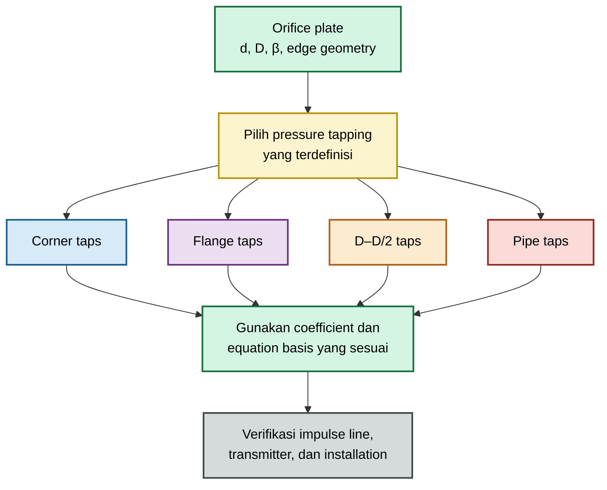

### Corner taps

Corner taps berada sangat dekat dengan plate, pada sisi upstream dan downstream plate atau flange faces sesuai definisi metode.

Karakteristik utama:

- compact arrangement;
- pressure taps sangat dekat dengan plate;
- banyak digunakan pada beberapa standard orifice configurations;
- sensitivity tinggi terhadap detail instalasi dan definisi tapping.

Corner-tap correlation tidak boleh dipertukarkan dengan flange-tap atau D–D/2-tap correlation.

### Flange taps

Flange taps secara umum ditempatkan pada jarak nominal tertentu dari masing-masing sisi plate, sering dirujuk sebagai sekitar 25,4 mm atau 1 inch dari plate faces sesuai definisi metode.

Karakteristik utama:

- umum pada industrial flowmeter;
- konfigurasi relatif mudah diimplementasikan;
- harus mengikuti definisi standar mengenai posisi tapping, diameter tap, dan flange geometry;
- tidak boleh diasumsikan identik dengan corner taps.

### D–D/2 taps

D–D/2 taps menggunakan:

- upstream tap pada jarak satu internal pipe diameter dari upstream face;
- downstream tap pada jarak setengah internal pipe diameter dari downstream face.

Secara konsep:

$$
x_H
=

1D
$$

$$
x_L
=

0.5D
$$

dengan posisi dihitung terhadap reference plane plate sesuai definisi metode.

Karakteristik utama:

- tapping location dinyatakan relatif terhadap actual internal diameter;
- sesuai untuk method yang secara eksplisit menggunakan D–D/2 arrangement;
- memerlukan verifikasi dimensi aktual, bukan nominal pipe size.

### Pipe taps

Pipe taps terletak lebih jauh dari plate dibandingkan corner, flange, atau D–D/2 taps. Posisi historis sering didefinisikan sekitar beberapa diameter pipa upstream dan downstream, tetapi engineer harus menggunakan posisi tepat dari standard atau project method yang berlaku.

Pipe taps tidak boleh diidentifikasi hanya dari deskripsi “tap jauh dari plate”. Posisi aktual, reference plane, dan standard basis harus terdokumentasi.

### Perbandingan tapping arrangement

| Tapping arrangement | Lokasi umum                         | Kelebihan                                   | Risiko bila salah basis                             |
| ------------------- | ----------------------------------- | ------------------------------------------- | --------------------------------------------------- |
| Corner taps         | Sangat dekat dengan plate           | Compact, sesuai konfigurasi tertentu        | Nilai $\Delta p$ tidak sama dengan tap lain         |
| Flange taps         | Nominal dekat flange faces          | Banyak digunakan pada instalasi industri    | Salah jarak tap dapat menghasilkan bias             |
| D–D/2 taps          | (1D) upstream dan (0.5D) downstream | Definisi geometrik relatif terhadap pipe ID | Salah memakai nominal (D) menghasilkan posisi salah |
| Pipe taps           | Lebih jauh dari plate               | Dapat sesuai untuk method tertentu          | Recovery pressure memengaruhi measured DP           |

### Aturan wajib

> **Koefisien, tapping arrangement, dan calculation method harus berasal dari basis yang sama.**

Jangan melakukan kombinasi berikut:

| Kombinasi salah                                 | Konsekuensi                                             |
| ----------------------------------------------- | ------------------------------------------------------- |
| Flange-tap transmitter dengan D–D/2 correlation | Systematic flow error                                   |
| Corner-tap plate dengan pipe-tap calculation    | Coefficient tidak representatif                         |
| Tap location aktual berbeda dari drawing        | Measured DP tidak sesuai calculation basis              |
| Impulse line tersumbat atau berisi fase salah   | DP transmitter membaca tekanan yang tidak representatif |
| Transmitter elevation tidak dikoreksi           | Hydrostatic error pada differential pressure            |

---

## 5.5 Uncertainty

Uncertainty flowmeter tidak ditentukan oleh DP transmitter saja. Bore diameter, coefficient correlation, density, installation, flow profile, dan kondisi plate dapat menghasilkan kontribusi uncertainty yang sama besar atau lebih besar.

### Expanded uncertainty

Hasil measurement sebaiknya dilaporkan dalam bentuk:

$$
\dot m
\pm
U
$$

dengan:

$$
U
=

k u_c
$$

di mana:

- $u_c$ = combined standard uncertainty;
- (k) = coverage factor yang harus dinyatakan;
- (U) = expanded uncertainty.

Pernyataan seperti “akurasi flowmeter ±1%” tidak cukup tanpa menyatakan:

- basis confidence;
- flow range;
- fluida;
- standard method;
- kondisi plate;
- pressure tapping;
- installation condition;
- status calibration.

### Sensitivitas persamaan mass flow

Untuk screening awal, dengan menganggap (C) dan $\varepsilon$ sebagai input independen:

$$
\frac{u(\dot m)}{\dot m}
\approx
\sqrt{
\left(
\frac{u(C)}{C}
\right)^2
+
\left(
\frac{u(\varepsilon)}{\varepsilon}
\right)^2
+
\left(
S_d
\frac{u(d)}{d}
\right)^2
+
\left(
S_D
\frac{u(D)}{D}
\right)^2
+
\left(
\frac{1}{2}
\frac{u(\rho_1)}{\rho_1}
\right)^2
+
\left(
\frac{1}{2}
\frac{u(\Delta p)}{\Delta p}
\right)^2
}
$$

dengan approximate sensitivity coefficients:

$$
S_d
=

2
+
\frac{2\beta^4}
{1-\beta^4}
$$

$$
S_D
=

*

\frac{2\beta^4}
{1-\beta^4}
$$

Persamaan ini hanya screening tool. Dalam uncertainty budget formal, correlation antara (C), $\varepsilon$, (d), (D), density, pressure, dan temperature harus dipertimbangkan sesuai metode yang digunakan.

### Kontributor uncertainty utama

| Kontributor                  | Dampak                           | Catatan praktis                                                      |
| ---------------------------- | -------------------------------- | -------------------------------------------------------------------- |
| Bore diameter, (d)           | Sangat tinggi                    | Flow sensitif terhadap $d^2$; wear dan inspection error penting      |
| Pipe ID, (D)                 | Meningkat pada beta ratio tinggi | Harus actual internal diameter                                       |
| DP transmitter               | Sedang                           | Sensitivitas mass flow terhadap DP secara ideal adalah (1/2)         |
| Density                      | Sedang                           | Sangat penting untuk gas, steam, dan fluid dengan temperatur berubah |
| Temperature                  | Tidak langsung dan langsung      | Memengaruhi density, viscosity, diameter, dan gas-property model     |
| Pressure                     | Penting untuk gas                | Memengaruhi density, (Z), dan expansibility                          |
| Discharge coefficient, (C)   | Tinggi                           | Tergantung standard correlation, geometry, dan Reynolds number       |
| Expansibility, $\varepsilon$ | Tinggi untuk gas/steam           | Tidak boleh diabaikan saat gas expansion relevan                     |
| Installation effect          | Dapat menjadi systematic bias    | Swirl, valve, elbow, reducer, dan short straight run                 |
| Plate wear                   | Drift jangka panjang             | Erosion dan edge rounding dapat mengubah flow indication             |
| Flow profile                 | Dapat mengubah (C) efektif       | Perlu straight run atau flow conditioner                             |
| Impulse line                 | Bisa sangat signifikan           | Plugging, gas pocket, liquid accumulation, hydrostatic imbalance     |

### Bore diameter sebagai kontributor dominan

Karena:

$$
\dot m
\propto
d^2
$$

maka perubahan kecil pada bore dapat menghasilkan perubahan flow yang material.

Sebagai ilustrasi sederhana pada beta ratio rendah:

$$
\frac{\Delta \dot m}{\dot m}
\approx
2
\frac{\Delta d}{d}
$$

Apabila bore meningkat 0,5%, flow indication dapat berubah kira-kira 1%, bahkan sebelum mempertimbangkan perubahan (C).

### Differential pressure transmitter

Secara ideal:

$$
\dot m
\propto
\sqrt{\Delta p}
$$

Maka:

$$
\frac{\Delta \dot m}{\dot m}
\approx
\frac{1}{2}
\frac{\Delta(\Delta p)}{\Delta p}
$$

Namun, uncertainty transmitter pada low-flow condition dapat menjadi besar karena $\Delta p$ turun secara kuadratik terhadap flow.

$$
\Delta p
\propto
\dot m^2
$$

Akibatnya, turndown yang terlalu lebar dapat menyebabkan DP signal mendekati noise floor atau calibration limitation transmitter.

### Installation effect sebagai systematic uncertainty

Installation effect tidak selalu dapat diperlakukan sebagai random uncertainty yang langsung digabungkan dengan root-sum-square.

Contoh installation effect:

- elbow dekat upstream;
- double elbow out of plane;
- partially open valve;
- reducer atau expander;
- swirl;
- pipe roughness abnormal;
- flow conditioner yang tidak sesuai;
- plate tidak centered;
- tapping line tidak simetris.

Bila efek ini tidak dikarakterisasi, lebih tepat diperlakukan sebagai **potential bias** atau **unresolved systematic error**, bukan sekadar angka acak dalam uncertainty budget.

### Plate wear dan inspection interval

Plate yang digunakan dalam service erosif, korosif, fouling, atau high-velocity flow dapat mengalami:

- bore enlargement;
- edge rounding;
- pitting;
- deposit;
- gasket damage;
- plate deformation.

Untuk service kritis, inspection interval harus ditetapkan berdasarkan:

- fluid erosivity;
- velocity;
- solids content;
- corrosion mechanism;
- historical drift;
- flowmeter criticality;
- required measurement uncertainty.

### Minimum uncertainty statement

Calculation package untuk standard orifice plate flowmeter minimal harus memuat:

1. Standard dan edisi yang digunakan.
2. Tapping arrangement.
3. Bore dan pipe ID basis.
4. Flow range dan DP range.
5. Density basis.
6. Gas-property basis bila fluida compressible.
7. Discharge coefficient method.
8. Expansibility method.
9. DP, pressure, dan temperature instrument accuracy.
10. Installation condition dan straight-run basis.
11. Inspection status plate.
12. Expanded uncertainty dan coverage factor.

### Rujukan Bab 5

- **[R1]** ISO 5167-1, _Measurement of Fluid Flow by Means of Pressure Differential Devices Inserted in Circular Cross-Section Conduits Running Full — Part 1: General Principles and Requirements_.
- **[R2]** ISO 5167-2, _Measurement of Fluid Flow by Means of Pressure Differential Devices Inserted in Circular Cross-Section Conduits Running Full — Part 2: Orifice Plates_.
- **[R3]** ASME MFC-3M, _Measurement of Fluid Flow in Pipes Using Orifice, Nozzle, and Venturi_.
- **[R4]** AGA Report No. 3 / API MPMS Chapter 14.3, _Orifice Metering of Natural Gas and Other Related Hydrocarbon Fluids_.
- **[R5]** JCGM 100, _Evaluation of Measurement Data — Guide to the Expression of Uncertainty in Measurement_.
- **[R6]** R. W. Miller, _Flow Measurement Engineering Handbook_.

> Tetapkan edisi dan amendment seluruh standar pada basis proyek sebelum calculation package diterbitkan.

[**Kembali ke Atas**](#orifice-plate-geometry-flow-equation-installation-and-field-engineering-practice)

---

# 6. Restriction Orifice for Liquids

Restriction orifice untuk liquid dirancang terutama untuk menghasilkan pressure drop, membatasi flow, atau melindungi equipment downstream. Berbeda dengan standard orifice flowmeter, keberhasilan desain tidak ditentukan terutama oleh uncertainty flow measurement, melainkan oleh kemampuan restriction untuk mencapai duty proses tanpa menimbulkan cavitation, flashing, erosion, vibration, atau pressure loss yang tidak dapat diterima.

## 6.1 Tujuan desain

Restriction orifice untuk liquid umumnya digunakan untuk empat tujuan utama.

| Tujuan                | Contoh aplikasi                                            | Acceptance criterion utama                        |
| --------------------- | ---------------------------------------------------------- | ------------------------------------------------- |
| Pressure reduction    | Let-down line, bypass, pump discharge restriction          | Tekanan downstream dan permanent loss             |
| Flow limitation       | Minimum-flow line, seal-water line, cooling branch         | Flow minimum/maksimum pada pressure range operasi |
| Downstream protection | Melindungi exchanger, vessel, analyzer, atau instrument    | Velocity, cavitation, erosion, dan pressure limit |
| Hydraulic balancing   | Cabang paralel, distribution header, cooling-water network | Distribusi flow antar-cabang                      |

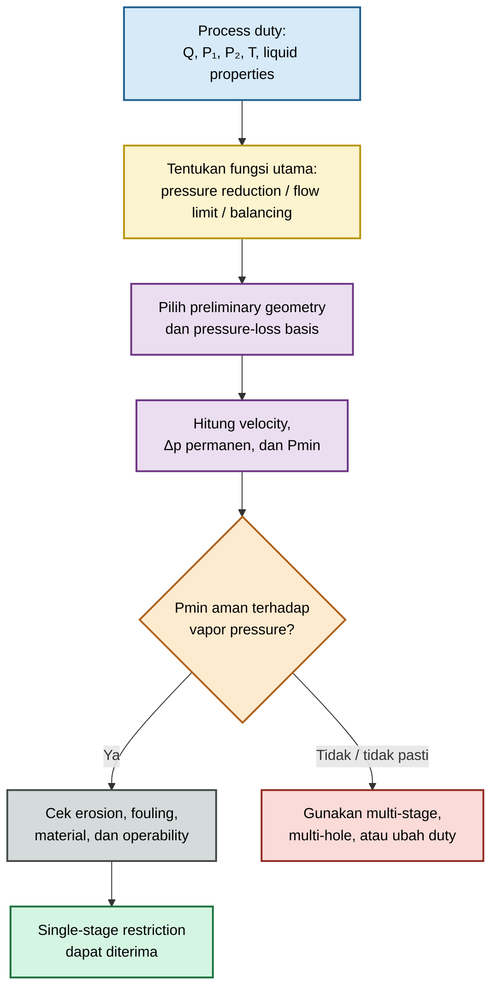

### Pressure reduction

Pressure reduction berarti restriction didesain agar pressure downstream berada pada rentang yang dibutuhkan proses. Nilai target tidak cukup didefinisikan sebagai:

$$
\Delta p
=

P_1-P_2
$$

Engineer harus menyatakan reference location untuk $P_1$ dan $P_2$, misalnya:

- upstream pipe section sebelum restriction;
- downstream pipe section setelah pressure recovery;
- nozzle inlet equipment downstream;
- titik paling kritis pada line.

Untuk liquid, head elevation, downstream piping loss, control valve, dan static backpressure dapat memengaruhi tekanan aktual yang diterima equipment.

### Flow limitation

Pada flow-limiting service, restriction dirancang agar flow tidak melampaui nilai tertentu pada differential pressure maksimum yang mungkin terjadi.

Untuk kasus ini, jangan hanya menggunakan normal operating pressure. Evaluasi minimal mencakup:

- minimum upstream pressure;
- normal upstream pressure;
- maximum upstream pressure;
- minimum downstream backpressure;
- normal downstream backpressure;
- maximum downstream backpressure;
- perubahan density dan viscosity karena temperatur.

Flow yang aman pada normal condition dapat menjadi terlalu tinggi pada kondisi high-pressure atau low-backpressure.

### Downstream protection

Restriction orifice dapat digunakan untuk membatasi energi atau flow yang masuk ke equipment downstream, misalnya:

- pompa kecil;
- analyzer loop;
- seal system;
- heat exchanger;
- filter;
- instrument tubing;
- low-pressure vessel.

Pada aplikasi ini, kriteria utama dapat berupa:

- maximum allowable pressure;
- maximum allowable flow;
- maximum velocity;
- maximum heat input;
- cavitation margin;
- material durability.

### Hydraulic balancing

Dalam jaringan cabang paralel, restriction orifice meningkatkan resistance pada cabang tertentu agar distribusi flow mendekati target.

Namun, balancing dengan restriction plate selalu menambah permanent pressure loss. Sebelum memilih plate, bandingkan dengan alternatif:

- valve balancing;
- perubahan pipe diameter;
- perubahan routing;
- control valve;
- manifold redesign;
- orifice pada cabang lain.

Restriction yang efektif secara hidrolik tetapi menyebabkan energy penalty tinggi dapat menjadi solusi yang buruk secara lifecycle cost.

---

## 6.2 Basis perhitungan

### Definisikan reference section terlebih dahulu

Untuk restriction liquid, bedakan tiga tekanan berikut:

- $p_1$: static pressure pada upstream reference section;
- $p_{\min}$: local minimum pressure di sekitar vena contracta;
- $p_3$: static pressure downstream setelah pressure recovery utama.

Permanent pressure loss adalah:

$$
\Delta p_{\mathrm{perm}}
=

p_1-p_3
$$

Nilai ini berbeda dari differential pressure pada pressure taps:

$$
\Delta p_{\mathrm{tap}}
=

p_H-p_L
$$

Untuk desain restriction, $\Delta p_{\mathrm{perm}}$ biasanya lebih penting daripada $\Delta p_{\mathrm{tap}}$.

### Pendekatan loss coefficient

Untuk liquid inkompresibel atau perubahan densitas kecil, pressure loss dapat ditulis:

$$
\Delta p
=

K
\frac{\rho V^2}{2}
$$

Persamaan tersebut hanya bermakna bila basis velocity dan reference section didefinisikan secara eksplisit.

#### Basis pipe velocity

Bila (V) adalah pipe velocity upstream:

$$
V_p
=

\frac{Q}{A_p}
$$

maka:

$$
\Delta p_{\mathrm{perm}}
=

K_{p,1\rightarrow3}
\frac{\rho V_p^2}{2}
$$

dengan:

- $K_{p,1\rightarrow3}$ = permanent-loss coefficient berbasis upstream pipe velocity;
- $A_p$ = internal pipe cross-sectional area;
- (Q) = actual volumetric flow pada kondisi proses.

#### Basis bore velocity

Bila (V) adalah physical bore velocity:

$$
V_b
=

\frac{Q}{A_o}
$$

maka:

$$
\Delta p_{\mathrm{perm}}
=

K_{b,1\rightarrow3}
\frac{\rho V_b^2}{2}
$$

dengan:

$$
A_o
=

\frac{\pi d^2}{4}
$$

Karena:

$$
V_b
=

\frac{V_p}{\beta^2}
$$

maka hubungan coefficient dengan basis velocity berbeda adalah:

$$
K_{p,1\rightarrow3}
=

\frac{K_{b,1\rightarrow3}}{\beta^4}
$$

Kesalahan umum adalah mengambil nilai (K) dari referensi yang berbasis bore velocity, lalu memasukkannya ke persamaan dengan pipe velocity tanpa konversi.

### Tidak ada satu nilai (K) untuk semua restriction

Nilai (K) dipengaruhi oleh:

$$
K
=

f
\left(
\beta,
\frac{L_e}{d},
\frac{r_e}{d},
\frac{\varepsilon}{d},
\mathrm{Re},
\text{edge condition},
\text{reference section}
\right)
$$

Untuk short restriction, thick plate, multi-hole plate, atau plate dengan geometry non-standard, nilai (K) sebaiknya berasal dari:

- korelasi yang relevan;
- vendor performance data;
- hydraulic test;
- CFD yang telah divalidasi;
- data operasi lapangan dari geometry sejenis.

### Hubungan flow dan pressure loss

Bila (K), density, dan geometry dianggap tetap:

$$
Q
\propto
\sqrt{\Delta p_{\mathrm{perm}}}
$$

Sebaliknya:

$$
\Delta p_{\mathrm{perm}}
\propto
Q^2
$$

Karena itu, small increase pada flow dapat meningkatkan pressure loss secara cepat. Periksa restriction pada seluruh operating envelope, bukan hanya satu titik normal.

### Sequence perhitungan liquid restriction

| Langkah | Kegiatan                                                                                    |
| ------: | ------------------------------------------------------------------------------------------- |
|       1 | Tentukan flow minimum, normal, dan maksimum                                                 |
|       2 | Tentukan $p_1$, downstream backpressure, temperatur, density, viscosity, dan vapor pressure |
|       3 | Tentukan reference section untuk permanent loss                                             |
|       4 | Pilih preliminary bore dan geometry plate                                                   |
|       5 | Pilih atau estimasikan (K) dengan basis velocity yang jelas                                 |
|       6 | Hitung $V_p$, $V_b$, dan $\Delta p_{\mathrm{perm}}$                                         |
|       7 | Estimasikan $p_{\min}$ dan cek cavitation/flashing                                          |
|       8 | Evaluasi erosion, material, noise, vibration, fouling, dan mechanical integrity             |
|       9 | Ulangi iterasi atau pilih multi-stage restriction bila diperlukan                           |

---

## 6.3 Cavitation, flashing, dan erosion

### Vapor pressure

Vapor pressure harus dievaluasi pada temperatur liquid aktual:

$$
p_v
=

p_v(T)
$$

Gunakan tekanan absolut. Perbandingan antara gauge pressure dengan vapor pressure absolut dapat menghasilkan kesimpulan yang salah.

### Pressure minimum di vena contracta

Cavitation risk ditentukan oleh local minimum pressure, bukan hanya oleh downstream pressure atau low-side transmitter pressure.

$$
p_{\min}
\neq
p_L
$$

Secara konservatif, desain harus memastikan:

$$
p_{\min}

>

p_v
+
\Delta p_{\mathrm{margin}}
$$

Nilai $\Delta p_{\mathrm{margin}}$ harus ditetapkan berdasarkan criticality, uncertainty geometry, fluida, material, dan metode evaluasi. Tidak ada satu margin universal yang cocok untuk semua service.

### Pressure-recovery coefficient

Untuk memahami hubungan antara pressure minimum dan permanent loss, dapat digunakan pressure-recovery coefficient konseptual:

$$
C_{\mathrm{pr}}
=

\frac{p_3-p_{\min}}
{p_1-p_{\min}}
$$

Maka:

$$
p_1-p_3
=

\left(
1-C_{\mathrm{pr}}
\right)
\left(
p_1-p_{\min}
\right)
$$

atau:

$$
p_{\min}
=

p_1
-

\frac{
\Delta p_{\mathrm{perm}}
}{
1-C_{\mathrm{pr}}
}
$$

Persamaan ini hanya boleh dipakai bila $C_{\mathrm{pr}}$ berasal dari geometry dan reference condition yang sama. Jangan memilih nilai $C_{\mathrm{pr}}$ generik tanpa basis test, correlation, atau CFD tervalidasi.

### Cavitation index

Salah satu bentuk cavitation index untuk screening adalah:

$$
\sigma_{\mathrm{ref}}
=

\frac{
p_{\mathrm{ref}}-p_v
}{
\frac{1}{2}
\rho V_{\mathrm{ref}}^2
}
$$

dengan:

- $p_{\mathrm{ref}}$ = tekanan pada reference section yang didefinisikan;
- $V_{\mathrm{ref}}$ = velocity pada section yang sama;
- $p_v$ = vapor pressure pada temperatur operasi.

Nilai $\sigma_{\mathrm{ref}}$ hanya dapat dibandingkan dengan threshold atau correlation yang memakai definisi reference pressure dan velocity yang sama. Berbagai industri memakai definisi cavitation index yang berbeda; angka dari satu metode tidak boleh dipindahkan langsung ke metode lain.

### Cavitation versus flashing

| Fenomena   | Kondisi dasar                                                    | Perilaku bubble                          | Risiko utama                                          |
| ---------- | ---------------------------------------------------------------- | ---------------------------------------- | ----------------------------------------------------- |
| Cavitation | $p_{\min}$ turun hingga atau di bawah $p_v$, lalu pressure pulih | Bubble terbentuk dan collapse downstream | Noise, vibration, pitting, material loss              |
| Flashing   | Tekanan downstream tetap berada pada atau di bawah $p_v$         | Vapor tetap ada downstream               | Two-phase flow, high velocity, erosion, process upset |

Untuk cavitation:

$$
p_{\min}
\leq
p_v
\quad \text{dan kemudian} \quad
p_3

>

p_v
$$

Untuk flashing:

$$
p_{\min}
\leq
p_v
\quad \text{dan} \quad
p_3
\leq
p_v
$$

Flashing bukan sekadar “cavitation yang lebih berat”. Keduanya membutuhkan strategi desain dan material assessment yang berbeda.

### Erosion

Erosion meningkat bila restriction mengalami kombinasi berikut:

- high jet velocity;
- liquid mengandung solid;
- cavitation collapse;
- flashing atau two-phase flow;
- sharp directional change;
- material lunak atau tidak tahan korosi;
- operasi intermittent dengan pressure cycling;
- roughness atau burr yang memusatkan jet.

Material resistance penting, tetapi material yang lebih keras bukan pengganti desain hidrolik yang benar. Mengganti material plate tanpa mengurangi cavitation atau jet velocity hanya dapat memperlambat kerusakan.

### Multi-stage restriction

Single-stage restriction dapat menjadi tidak aman bila satu plate menghasilkan:

- $p_{\min}$ terlalu rendah;
- cavitation atau flashing;
- jet velocity terlalu tinggi;
- erosion berat;
- unacceptable vibration;
- pressure drop sangat besar pada satu lokasi.

Pada multi-stage restriction:

$$
p_1-p_{\mathrm{outlet}}
=

\sum_i
\Delta p_{\mathrm{stage},i}
+
\sum_j
\Delta p_{\mathrm{interstage},j}
$$

Setiap stage harus dievaluasi dengan pressure, density, viscosity, dan vapor-pressure margin yang relevan pada stage tersebut. Pressure drop tidak boleh sekadar dibagi rata tanpa mengevaluasi pressure recovery dan backpressure antar-stage.

### Rujukan Bab 6

- **[R6-1]** Crane Co., _Flow of Fluids Through Valves, Fittings and Pipe_, Technical Paper No. 410.
- **[R6-2]** I. E. Idelchik, _Handbook of Hydraulic Resistance_.
- **[R6-3]** R. W. Miller, _Flow Measurement Engineering Handbook_.
- **[R6-4]** API RP 14E, _Recommended Practice for Design and Installation of Offshore Production Platform Piping Systems_, bila relevan untuk erosion-velocity assessment pada service produksi.
- **[R6-5]** Project specification, material specification, dan vendor correlation yang berlaku untuk service aktual.

[**Kembali ke Atas**](#orifice-plate-geometry-flow-equation-installation-and-field-engineering-practice)

---

# 7. Restriction Orifice for Gas and Steam

Restriction orifice untuk gas dan steam memerlukan pendekatan berbeda dari liquid restriction karena densitas berubah saat tekanan turun. Pada pressure ratio tinggi, aliran dapat mengalami choking, jet velocity dapat mendekati sonic velocity, dan noise atau vibration dapat menjadi design-limiting condition.

Persamaan liquid incompressible tidak boleh digunakan sebagai basis final untuk gas atau steam restriction tanpa evaluasi compressibility.

## 7.1 Compressibility

### Bedakan tiga jenis flow rate

Untuk gas dan steam, setiap calculation package harus menyatakan basis flow rate dengan jelas.

| Jenis flow             |   Simbol | Definisi                                                                            |
| ---------------------- | -------: | ----------------------------------------------------------------------------------- |
| Mass flow              | $\dot m$ | Massa fluida per satuan waktu                                                       |
| Actual volumetric flow |    $Q_a$ | Volume per satuan waktu pada pressure dan temperature aktual                        |
| Base volumetric flow   |    $Q_b$ | Volume per satuan waktu pada standard/base pressure dan temperature yang ditetapkan |

Hubungan dasar:

$$
Q_a
=

\frac{\dot m}{\rho_a}
$$

dan:

$$
Q_b
=

\frac{\dot m}{\rho_b}
$$

Untuk gas yang mengikuti pendekatan real-gas sederhana:

$$
Q_b
=

Q_a
\left(
\frac{p_a}{p_b}
\right)
\left(
\frac{T_b}{T_a}
\right)
\left(
\frac{Z_b}{Z_a}
\right)
$$

dengan:

- semua tekanan dalam basis absolut;
- semua temperatur dalam absolute temperature;
- $Z_a$ dan $Z_b$ adalah compressibility factor pada masing-masing kondisi.

### Density basis

Untuk gas, density upstream dapat ditulis:

$$
\rho_1
=

\frac{
p_1 M
}{
Z_1RT_1
}
$$

dengan:

| Simbol | Definisi                        |
| ------ | ------------------------------- |
| $p_1$  | Upstream absolute pressure      |
| (M)    | Molecular mass                  |
| $Z_1$  | Upstream compressibility factor |
| (R)    | Universal gas constant          |
| $T_1$  | Upstream absolute temperature   |

Untuk steam, density harus berasal dari steam property method yang sesuai dengan kondisi aktual, bukan dari pendekatan ideal-gas sederhana kecuali telah dibuktikan memadai.

### Screening versus final design

Untuk gas restriction, terdapat tiga tingkat analisis.

| Tingkat                 | Penggunaan                                                                | Batas                             |
| ----------------------- | ------------------------------------------------------------------------- | --------------------------------- |
| Preliminary screening   | Mengidentifikasi ukuran kasar, pressure ratio, dan risk choking           | Tidak cukup untuk desain kritis   |
| Engineering calculation | Menggunakan compressible-flow method, properti fluida, dan geometry basis | Memerlukan validasi applicability |
| Final design validation | Vendor data, test, accepted software method, atau CFD tervalidasi         | Diperlukan untuk critical service |

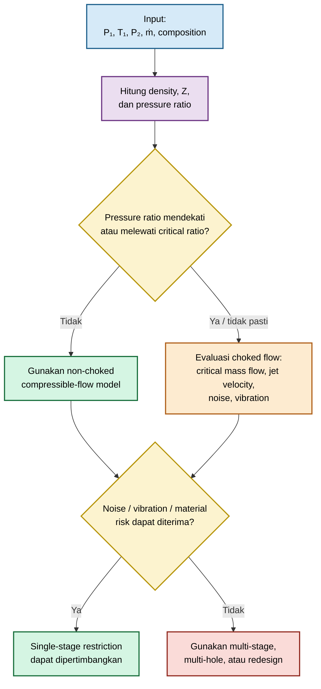

## 7.2 Choked flow

### Definisi

Choked flow terjadi ketika local velocity pada throat atau vena contracta mencapai sonic velocity:

$$
M
=

\frac{V}{a}
=

1
$$

dengan:

- (M) = Mach number;
- (V) = local flow velocity;
- (a) = local speed of sound.

Setelah choking tercapai, penurunan downstream pressure lebih lanjut tidak secara langsung meningkatkan mass flow melalui throat untuk upstream stagnation condition yang sama.

### Critical pressure ratio: ideal-gas screening

Untuk ideal gas yang mengalami isentropic flow melalui converging restriction, critical pressure ratio dapat ditulis:

$$
\left(
\frac{p_2}{p_1}
\right)_{\mathrm{crit}}
=

\left(
\frac{2}{\gamma+1}
\right)^{
\frac{\gamma}{\gamma-1}
}
$$

dengan:

- $p_1$ = upstream absolute pressure;
- $p_2$ = downstream or effective backpressure;
- $\gamma$ = ratio of specific heats.

Bila:

$$
\frac{p_2}{p_1}
\leq
\left(
\frac{p_2}{p_1}
\right)_{\mathrm{crit}}
$$

maka flow berpotensi choked pada kondisi idealized screening.

### Critical mass-flow equation: ideal-gas screening

Untuk converging restriction, screening mass flow pada choking dapat ditulis:

$$
\dot m_{\mathrm{crit,ideal}}
=

C_d A_o p_1
\sqrt{
\frac{\gamma}{R_sT_1}
}
\left(
\frac{2}{\gamma+1}
\right)^{
\frac{\gamma+1}{2(\gamma-1)}
}
$$

dengan:

| Simbol   | Definisi                                             |
| -------- | ---------------------------------------------------- |
| $C_d$    | Discharge coefficient yang relevan terhadap geometry |
| $A_o$    | Physical bore area                                   |
| $p_1$    | Upstream absolute pressure                           |
| $R_s$    | Specific gas constant                                |
| $T_1$    | Upstream absolute temperature                        |
| $\gamma$ | Ratio of specific heats                              |

Persamaan tersebut adalah **ideal-gas screening equation**, bukan universal final-design equation untuk seluruh gas restriction.

Untuk natural gas, hydrocarbon gas, steam, atau high-pressure real gas, gunakan metode yang memasukkan real-fluid properties dan geometry-specific discharge behavior. Jangan menambahkan faktor (Z) ke persamaan ideal secara sembarang tanpa basis model yang tervalidasi.

### Effective downstream pressure

Untuk restriction plate, location choking dapat berada di sekitar vena contracta, bukan pada downstream pressure tap atau nozzle inlet yang jauh dari plate. Karena itu:

$$
p_{\mathrm{backpressure}}
\neq
p_{\min}
$$

Pressure recovery, geometry, and downstream piping dapat memengaruhi hubungan antara backpressure dan local throat condition.

### Steam

Steam restriction harus mempertimbangkan:

- saturated atau superheated condition;
- pressure dan temperature upstream;
- perubahan enthalpy;
- steam quality;
- kemungkinan condensation;
- pressure ratio;
- wet-steam behavior;
- material temperature limits.

Untuk wet steam atau steam yang mendekati saturation line, model ideal-gas sederhana dapat memberikan hasil yang tidak representatif. Gunakan steam-property package atau metode yang disetujui proyek.

## 7.3 Noise dan vibration

### Jet velocity

Jet velocity tinggi di downstream orifice dapat menimbulkan acoustic energy besar.

Untuk screening:

$$
V_j
\approx
\frac{\dot m}
{\rho_j A_j}
$$

dengan:

- $\rho_j$ = density lokal jet;
- $A_j$ = effective jet area;
- $V_j$ = estimated jet velocity.

Untuk gas compressible, $\rho_j$ tidak boleh otomatis disamakan dengan upstream density.

### Mach number

Mach number lokal dapat dihitung sebagai:

$$
M_j
=

\frac{V_j}{a_j}
$$

Untuk ideal gas:

$$
a_j
=

\sqrt{
\gamma R_s T_j
}
$$

Untuk real gas dan steam, speed of sound harus berasal dari property method yang relevan.

### Sumber noise dan vibration

| Mekanisme                    | Dampak potensial                                |
| ---------------------------- | ----------------------------------------------- |
| High-velocity jet            | Broadband aerodynamic noise                     |
| Sonic atau near-sonic flow   | Noise sangat tinggi dan pressure fluctuation    |
| Jet impingement              | Local erosion, vibration, fatigue               |
| Separation dan recirculation | Unsteady force pada plate dan downstream pipe   |
| Acoustic resonance           | Amplifikasi noise pada piping atau vessel       |
| Pressure cycling             | Fatigue pada plate, holder, flange, dan support |

Tidak ada satu allowable velocity atau Mach number yang universal untuk seluruh restriction service. Evaluasi harus mempertimbangkan:

- jenis gas;
- pressure ratio;
- pipe size;
- downstream geometry;
- wall thickness;
- support spacing;
- material;
- operating duration;
- allowable noise di area kerja;
- proximity terhadap equipment sensitif.

### Multi-hole dan multi-stage restriction

Multi-hole plate dapat mengurangi skala jet tunggal, tetapi bukan otomatis solusi universal. Multi-hole juga dapat meningkatkan:

- risiko plugging;
- sensitivity terhadap machining tolerance;
- ketidakseragaman flow;
- local interaction antar-jet;
- inspection complexity.

Multi-stage restriction dapat menurunkan pressure drop per stage dan mengurangi jet severity. Namun, desain harus memeriksa pressure, temperature, density, Mach number, dan noise pada setiap stage.

### Fatigue

Fatigue assessment perlu dipertimbangkan bila terdapat:

- high-frequency pressure fluctuation;
- continuous high-flow service;
- repeated start-stop;
- compressor recycle operation;
- blowdown duty;
- acoustic resonance;
- unsupported downstream spool;
- high stress concentration pada plate holder atau flange.

Material strength saja tidak cukup. Geometri support, plate mounting, weld detail, dan dynamic loading juga harus dievaluasi.

## 7.4 Pressure-reduction design sequence

### 1. Tentukan $P_1$, $T_1$, $P_2$, flow rate, dan komposisi gas

Data minimum:

| Data        | Keterangan                                                          |
| ----------- | ------------------------------------------------------------------- |
| $P_1$       | Upstream absolute pressure minimum, normal, maksimum                |
| $T_1$       | Upstream temperature minimum, normal, maksimum                      |
| $P_2$       | Required downstream pressure atau backpressure envelope             |
| Flow rate   | Minimum, normal, maximum; basis mass/actual/base flow               |
| Composition | Molecular mass, (Z), $\gamma$, contaminants, condensable components |
| Piping      | ID, schedule, downstream fittings, support, acoustic constraints    |

### 2. Cek choking

Gunakan pressure-ratio screening dan compressible-flow method yang sesuai.

Jika choking mungkin terjadi, tentukan:

- critical mass flow;
- expected throat condition;
- downstream pressure sensitivity;
- sonic or near-sonic jet risk;
- temperature change;
- adequacy of downstream piping.

### 3. Tentukan allowable velocity dan noise basis

Tetapkan basis desain bersama discipline process, piping, mechanical, dan HSE:

- maximum acceptable noise;
- target jet velocity or Mach screening limit;
- fatigue concern;
- support requirement;
- downstream equipment sensitivity;
- personnel exposure.

Jangan mengambil allowable velocity dari proyek lain tanpa mengevaluasi apakah gas, pressure ratio, geometry, dan piping configuration setara.

### 4. Tentukan single-stage atau multi-stage

Single-stage dapat dipakai bila pressure ratio, velocity, noise, vibration, and material risks dapat diterima.

Pilih multi-stage atau multi-hole bila single-stage menyebabkan:

- choking dengan jet sangat agresif;
- unacceptable noise;
- vibration;
- fatigue risk;
- erosion;
- pressure drop terlalu terkonsentrasi;
- downstream temperature atau pressure instability.

### 5. Validasi permanent pressure loss dan downstream pressure

Pastikan restriction tidak hanya memenuhi bore sizing, tetapi juga memenuhi seluruh system duty:

$$
P_{\mathrm{downstream,actual}}
\geq
P_{\mathrm{required}}
$$

pada kondisi kritis yang relevan.

Periksa juga:

- downstream line loss;
- valve loss;
- equipment inlet pressure;
- backpressure variation;
- transient upset;
- relief or blowdown interaction;
- allowable pressure of downstream system.

### Rujukan Bab 7

- **[R7-1]** API 521, _Guide for Pressure-Relieving and Depressuring Systems_.
- **[R7-2]** Crane Co., _Flow of Fluids Through Valves, Fittings and Pipe_, Technical Paper No. 410.
- **[R7-3]** I. E. Idelchik, _Handbook of Hydraulic Resistance_.
- **[R7-4]** R. W. Miller, _Flow Measurement Engineering Handbook_.
- **[R7-5]** Property package, equation of state, dan vendor methodology yang disetujui untuk gas atau steam aktual.

[**Kembali ke Atas**](#orifice-plate-geometry-flow-equation-installation-and-field-engineering-practice)

---

# 8. Small Holes, Short Tubes, and Diffuser Plates

Small holes, short tubes, diffuser plates, purge restrictors, dan multi-hole distribution plates tidak boleh otomatis dianalisis menggunakan standard orifice-meter equation. Pada geometry ini, flow dapat sangat sensitif terhadap bore length, entrance shape, roughness, burr, plugging, dan Reynolds number bore.

## 8.1 Mengapa tidak boleh langsung memakai orifice-meter equation

Standard orifice-meter equation dikembangkan untuk geometry, tapping arrangement, pipe condition, dan flow regime tertentu. Small-hole dan short-tube restriction sering berada di luar scope tersebut.

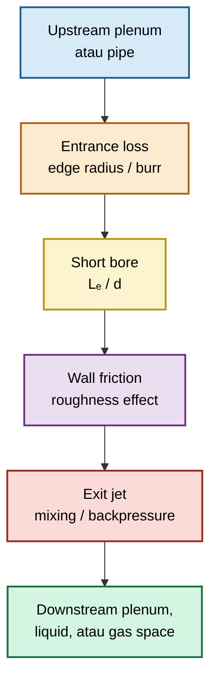

### Entrance loss

Entrance loss bergantung pada:

- sharp edge atau rounded edge;
- burr;
- chamfer;
- inlet radius;
- surface damage;
- misalignment;
- upstream plenum condition.

Bore dengan diameter sama dapat menghasilkan flow berbeda bila edge profile berbeda.

### Bore friction

Untuk bore yang cukup panjang relatif terhadap diameter, friction sepanjang bore dapat menjadi bagian besar dari total pressure loss.

Pendekatan konseptual:

$$
K_{\mathrm{total}}
=

K_{\mathrm{entrance}}
+
f
\frac{L_e}{d}
+
K_{\mathrm{exit}}
+
K_{\mathrm{additional}}
$$

dengan:

- $K_{\mathrm{entrance}}$ = entrance-loss coefficient;
- (f) = friction factor yang sesuai dengan regime flow;
- $L_e$ = effective bore length;
- (d) = bore diameter;
- $K_{\mathrm{exit}}$ = exit-loss coefficient;
- $K_{\mathrm{additional}}$ = loss akibat burr, bend, chamfer, fouling, atau geometry tambahan.

Untuk liquid incompressible atau gas dengan expansion kecil, pendekatan pressure loss dapat ditulis:

$$
\Delta p
=

K_{\mathrm{total}}
\frac{
\rho V_b^2
}{
2
}
$$

dengan:

$$
V_b
=

\frac{Q}{A_o}
$$

Apabila bentuk discharge coefficient digunakan:

$$
Q
=

C_d A_o
\sqrt{
\frac{2\Delta p}{\rho}
}
$$

maka, dengan basis bore velocity yang konsisten:

$$
K_{\mathrm{total}}
=

\frac{1}{C_d^2}
$$

Nilai $C_d$ atau $K_{\mathrm{total}}$ harus berasal dari kondisi geometry yang relevan. Jangan menggunakan nilai $C_d$ thin sharp-edge plate secara otomatis untuk short tube.

### Exit loss

Setelah melewati bore, jet dapat:

- mengembang ke downstream pipe;
- masuk ke liquid;
- membentuk bubble;
- menumbuk baffle;
- berinteraksi dengan jet dari hole lain;
- mengalami backpressure yang tidak seragam.

Exit condition dapat menentukan apakah hole bekerja sebagai simple restrictor, diffuser, aerator, atau jet injector.

### Machining tolerance

Untuk bore kecil:

$$
A_o
=

\frac{\pi d^2}{4}
$$

sehingga:

$$
Q
\propto
d^2
\sqrt{\Delta p}
$$

Untuk perubahan kecil:

$$
\frac{\Delta Q}{Q}
\approx
2
\frac{\Delta d}{d}
+
\frac{\Delta C_d}{C_d}
+
\frac{1}{2}
\frac{\Delta(\Delta p)}{\Delta p}
-

\frac{1}{2}
\frac{\Delta \rho}{\rho}
$$

Sebagai contoh, bore diameter yang berubah 5% dapat mengubah area sekitar 10%, sebelum memasukkan perubahan $C_d$ akibat burr atau roughness.

### Burr dan fouling

Burr dapat mengurangi effective area atau mengubah entrance profile. Fouling dapat menyebabkan:

- bore diameter efektif mengecil;
- roughness meningkat;
- flow antar-hole tidak seragam;
- plugging parsial;
- pressure drop naik;
- bubble size atau jet behavior berubah.

Untuk bore kecil, cleanability dan inspection access harus menjadi bagian dari design basis, bukan hanya maintenance concern.

## 8.2 Dua Reynolds number yang harus dihitung

Untuk small-hole dan short-tube system, pipe Reynolds number saja tidak cukup.

### Pipe Reynolds number

$$
\mathrm{Re}_{pipe}
=

\frac{
\rho V_{pipe}D
}{
\mu
}
$$

dengan:

$$
V_{pipe}
=

\frac{Q}{A_p}
$$

Parameter ini membantu mengevaluasi upstream flow profile dan kondisi aliran pada main pipe atau manifold.

### Bore Reynolds number

$$
\mathrm{Re}_{bore}
=

\frac{
\rho V_{bore}d
}{
\mu
}
$$

dengan:

$$
V_{bore}
=

\frac{Q}{A_o}
$$

Parameter ini lebih relevan untuk mengevaluasi:

- friction di dalam bore;
- transition antara laminar dan turbulent behavior;
- sensitivity $C_d$;
- roughness effect;
- performance short tube;
- repeatability flow antar-hole.

### Interpretasi praktis

| Kondisi                                                      | Implikasi                                                                       |
| ------------------------------------------------------------ | ------------------------------------------------------------------------------- |
| $\mathrm{Re}_{pipe}$ tinggi, $\mathrm{Re}_{bore}$ moderat    | Upstream profile mungkin stabil, tetapi bore tetap sensitif terhadap $C_d$      |
| $\mathrm{Re}_{pipe}$ rendah, $\mathrm{Re}_{bore}$ rendah     | Correlation turbulent-flow tidak dapat digunakan otomatis                       |
| $\mathrm{Re}_{bore}$ berubah besar sepanjang operating range | Flow coefficient dapat tidak konstan                                            |
| Bore sangat kecil                                            | Burr, roughness, dan fouling dapat dominan dibandingkan nominal Reynolds number |

Untuk gas, density berubah dengan pressure dan temperature. Maka Reynolds number harus dihitung pada kondisi yang sesuai dengan lokasi evaluasi.

## 8.3 Multi-hole distribution

Untuk plate dengan (N) hole identik, hubungan berikut sering digunakan:

$$
Q_{\mathrm{total}}
=

NQ_{\mathrm{hole}}
$$

Hubungan tersebut hanya valid bila seluruh hole menerima differential pressure dan kondisi aliran yang hampir sama.

### Syarat utama

| Syarat                              | Implikasi                                                         |
| ----------------------------------- | ----------------------------------------------------------------- |
| Pressure plenum seragam             | Pressure di depan setiap hole hampir sama                         |
| Hole geometry identik               | Diameter, thickness, edge, burr, dan roughness setara             |
| Backpressure seragam                | Kondisi downstream setiap hole tidak berbeda material             |
| Hole tidak tersumbat                | Tidak ada partial plugging atau fouling lokal                     |
| Interaksi jet/bubble kecil          | Satu hole tidak mengubah backpressure hole lain secara signifikan |
| Elevasi setara atau telah dikoreksi | Hydrostatic head tidak menciptakan flow imbalance                 |

Untuk liquid atau gas distributor, kondisi ideal yang diinginkan adalah:

$$
\Delta p_{\mathrm{plenum}}
\ll
\Delta p_{\mathrm{hole}}
$$

Artinya, pressure loss sepanjang plenum harus jauh lebih kecil daripada pressure drop pada setiap hole. Dengan demikian, variasi pressure antar-hole memberikan pengaruh kecil terhadap flow distribution.

### Bila pressure plenum tidak seragam

Setiap hole harus dihitung secara individual:

$$
Q_i
=

C_{d,i}
A_{o,i}
\sqrt{
\frac{
2
\left(
p_{\mathrm{plenum},i}
-

p_{\mathrm{back},i}
\right)
}{
\rho_i
}
}
$$

untuk liquid inkompresibel atau kondisi gas dengan expansion yang dapat diabaikan.

Kemudian:

$$
Q_{\mathrm{total}}
=

\sum_{i=1}^{N}
Q_i
$$

Untuk gas dengan pressure ratio signifikan, gunakan compressible-flow relation untuk setiap hole; jangan memakai persamaan incompressible di atas sebagai hasil final.

### Aeration diffuser

Untuk submerged aeration diffuser, downstream backpressure tiap hole dapat dipengaruhi oleh kedalaman submergence:

$$
p_{\mathrm{back},i}
=

p_{\mathrm{surface}}
+
\rho_l g h_i
+
\Delta p_{\mathrm{local},i}
$$

dengan:

- $p_{\mathrm{surface}}$ = pressure pada liquid free surface;
- $\rho_l$ = liquid density;
- (g) = acceleration due to gravity;
- $h_i$ = submergence depth hole ke-(i);
- $\Delta p_{\mathrm{local},i}$ = local hydraulic resistance di sekitar outlet.

Variasi elevasi, manifold pressure, hole tolerance, dan bubble interaction dapat membuat distribusi airflow tidak seragam walaupun nominal hole diameter sama.

## 8.4 Validation strategy

Small-hole, short-tube, and multi-hole plate harus mempunyai validation strategy yang sesuai dengan criticality desain.

### Calibration test

Calibration test adalah metode paling kuat bila targetnya adalah flow accuracy atau hole-to-hole consistency.

Test sebaiknya merepresentasikan:

- actual hole geometry;
- material dan surface finish;
- fluid yang relevan;
- pressure range;
- temperature range bila material;
- mounting configuration;
- upstream plenum;
- downstream backpressure;
- expected fouling condition bila dapat disimulasikan.

Hasil test sebaiknya menghasilkan curve:

$$
Q
=

f(\Delta p)
$$

atau untuk gas:

$$
\dot m
=

f
\left(
P_1,
P_2,
T_1
\right)
$$

### Vendor curve

Vendor curve dapat digunakan bila:

- geometry identik atau demonstrably equivalent;
- fluid and operating range cocok;
- test condition terdokumentasi;
- pressure basis jelas;
- uncertainty atau repeatability dinyatakan;
- perubahan material, hole finish, atau pattern tidak mengubah applicability.

Vendor curve dari produk berbeda tidak boleh dipakai hanya karena hole diameter nominal sama.

### CFD tervalidasi

CFD berguna untuk:

- pressure distribution dalam plenum;
- flow imbalance antar-hole;
- jet interaction;
- bubble/jet direction screening;
- pressure recovery;
- effect of eccentricity;
- effect of geometry modifications.

CFD tidak boleh menjadi pengganti calibration test untuk target flow accuracy apabila model belum divalidasi terhadap data eksperimen.

Minimum CFD quality requirements:

| Area               | Minimum requirement                                                                                |
| ------------------ | -------------------------------------------------------------------------------------------------- |
| Geometry           | Bore, edge, thickness, plenum, dan outlet geometry representatif                                   |
| Mesh               | Mesh-independence check, terutama di entrance dan bore wall                                        |
| Physics            | Compressible model untuk gas bila diperlukan; multiphase model bila bubble behavior menjadi target |
| Turbulence         | Justifikasi turbulence model dan sensitivity check                                                 |
| Boundary condition | Pressure, flow, temperature, dan backpressure representatif                                        |
| Validation         | Bandingkan dengan analytical estimate atau test data                                               |
| Reporting          | Nyatakan limitation, residual, mass-balance error, dan uncertainty model                           |

### Flow-balance measurement

Untuk multi-hole distributor, flow-balance measurement dapat dilakukan melalui:

- individual branch flow measurement;
- pressure mapping pada plenum;
- bubble-pattern observation untuk diffuser;
- tracer method;
- acoustic or thermal method bila relevan;
- calibrated collection test pada skala prototipe.

Tujuannya bukan hanya memperoleh total flow, tetapi memeriksa:

$$
\frac{
Q_{i,\max}
-

Q_{i,\min}
}{
\overline{Q_i}
}
$$

sebagai indikator ketidakseragaman distribusi.

### Sensitivity analysis

Sensitivity analysis minimum harus menilai perubahan terhadap:

- bore diameter, (d);
- plate thickness, (t);
- effective bore length, $L_e$;
- discharge coefficient, $C_d$;
- roughness;
- pressure drop;
- density;
- viscosity;
- plenum pressure variation;
- downstream backpressure variation;
- partial plugging.

Untuk total flow dengan hole identik:

$$
Q_{\mathrm{total}}
=

N C_d A_o
\sqrt{
\frac{2\Delta p}{\rho}
}
$$

Maka perubahan pada jumlah hole, diameter, coefficient, atau pressure drop harus dievaluasi secara eksplisit.

### Pilihan metode validasi

| Kondisi                             | Metode utama                                                                    |
| ----------------------------------- | ------------------------------------------------------------------------------- |
| Purge restrictor non-kritis         | Engineering estimate + sensitivity analysis                                     |
| Small hole dengan target flow ketat | Calibration test atau vendor data tervalidasi                                   |
| Diffuser multi-hole                 | Plenum calculation + flow-balance test + CFD bila perlu                         |
| High-pressure gas small hole        | Compressible-flow model + choking check + test/vendor validation                |
| Erosive atau fouling service        | Prototype test atau historical field data                                       |
| Safety-critical restriction         | Independent calculation review + validated method + documented inspection basis |

### Rujukan Bab 8

- **[R8-1]** I. E. Idelchik, _Handbook of Hydraulic Resistance_.
- **[R8-2]** Crane Co., _Flow of Fluids Through Valves, Fittings and Pipe_, Technical Paper No. 410.
- **[R8-3]** R. W. Miller, _Flow Measurement Engineering Handbook_.
- **[R8-4]** ASME V&V 20, _Standard for Verification and Validation in Computational Fluid Dynamics and Heat Transfer_.
- **[R8-5]** Vendor test data, calibration procedure, dan project specification yang sesuai dengan geometry serta operating envelope aktual.

[**Kembali ke Atas**](#orifice-plate-geometry-flow-equation-installation-and-field-engineering-practice)

---

Berikut lanjutan naskah Bab 9–10. Struktur ini tetap membedakan standard metering, restriction service, serta geometri non-standar secara tegas.

---

# 9. Installation and Instrumentation

Kinerja orifice plate tidak hanya ditentukan oleh bore diameter dan persamaan perhitungan. Instalasi upstream, posisi plate, pressure tapping, impulse line, dan DP transmitter dapat menghasilkan bias sistematis bahkan ketika plate telah dibuat sesuai drawing.

Untuk standard flowmeter, instalasi adalah bagian dari basis validitas standard correlation. Untuk restriction orifice, instalasi menentukan apakah pressure drop, vibration, cavitation risk, dan downstream pressure benar-benar sesuai desain.

## 9.1 Straight-run requirement

### Prinsip dasar

Aliran yang memasuki orifice plate idealnya memiliki velocity profile yang stabil dan representatif terhadap basis korelasi atau model desain. Disturbance upstream dapat menyebabkan:

- asymmetric velocity profile;
- swirl;
- secondary flow;
- pulsation;
- separation sebelum plate;
- perubahan differential pressure;
- perubahan discharge coefficient efektif;
- peningkatan uncertainty atau systematic bias.

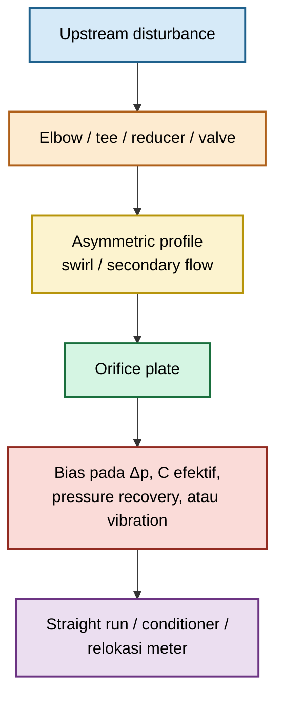

### Elbow

Single elbow dapat menghasilkan velocity profile yang tidak simetris. Double elbow, terutama dengan orientasi tidak satu bidang, dapat menimbulkan swirl yang lebih kuat.

Dampak potensial:

- pressure distribution di upstream pipe tidak seragam;
- vena contracta menjadi asimetris;
- differential pressure tidak lagi merepresentasikan kondisi basis standard;
- flow uncertainty meningkat;
- hasil flowmeter dapat mengalami bias yang stabil tetapi tidak terlihat dari transmitter.

### Tee

Tee dapat menghasilkan flow separation, momentum imbalance, dan non-uniform velocity profile, terutama bila flow masuk dari branch atau terdapat aliran cabang yang berubah-ubah.

Tee harus dievaluasi berdasarkan:

- arah aliran utama;
- posisi branch;
- rasio branch flow terhadap main flow;
- keberadaan valve pada branch;
- jarak tee terhadap plate;
- apakah flow pada branch bersifat stabil atau intermittent.

### Reducer dan expander

Reducer atau expander dapat mempercepat atau memperlambat aliran serta menciptakan profil kecepatan yang tidak seragam. Concentric reducer umumnya lebih mudah dianalisis dibanding eccentric reducer, tetapi keduanya tetap dapat memengaruhi profile upstream.

Pada liquid service, eccentric reducer juga perlu mempertimbangkan kemungkinan gas pocket. Pada gas service, orientasi reducer perlu mempertimbangkan kemungkinan liquid accumulation atau condensate hold-up.

### Valve

Valve, khususnya control valve yang tidak sepenuhnya open, adalah salah satu sumber disturbance paling signifikan.

Valve dapat menghasilkan:

- high turbulence;
- asymmetric jet;
- swirl;
- pulsation;
- cavitation;
- local flashing;
- pressure fluctuation;
- flow profile yang sangat tidak stabil.

Orifice flowmeter tidak boleh ditempatkan dekat downstream control valve hanya karena layout piping terlihat ringkas. Posisi relatif plate terhadap valve harus diperiksa terhadap standard, project specification, atau studi flow profile bila konfigurasi non-standar.

### Swirl

Swirl adalah komponen tangensial kecepatan yang membuat aliran berputar terhadap sumbu pipa. Swirl dapat berasal dari elbow, tee, valve, pump discharge, compressor discharge, header geometry, atau flow conditioner yang tidak sesuai.

Swirl dapat menyebabkan:

$$
V_{\theta}
\neq
0
$$

dengan:

- $V_{\theta}$ = tangential velocity component.

Untuk orifice flowmeter, swirl dapat menghasilkan bias karena pressure taps dan discharge-coefficient correlation umumnya mengasumsikan flow profile tertentu.

### Flow conditioner

Flow conditioner dapat digunakan untuk mengurangi swirl atau membentuk velocity profile yang lebih stabil. Namun, flow conditioner bukan solusi universal.

Sebelum menggunakan flow conditioner, verifikasi:

- jenis conditioner;
- location relative terhadap plate;
- pressure loss tambahan;
- fouling risk;
- standard applicability;
- maintenance access;
- compatibility dengan fluid service;
- bukti performance untuk disturbance upstream yang aktual.

Flow conditioner yang tidak sesuai dapat menambah permanent pressure loss dan tetap tidak menghasilkan profile yang dibutuhkan.

### Tidak menggunakan angka straight-run generik

Jangan memakai aturan sederhana seperti “10D upstream dan 5D downstream” untuk seluruh konfigurasi.

Kebutuhan straight run bergantung pada:

- jenis pressure tapping;
- beta ratio;
- jenis upstream disturbance;
- konfigurasi elbow;
- valve position;
- reducer/expander geometry;
- flow conditioner;
- standard atau project method;
- required uncertainty.

Gunakan tabel straight-run dari standard atau project specification yang menjadi basis desain. Bila konfigurasi tidak tercakup, perlakukan sebagai non-standard installation dan pertimbangkan CFD, flow-profile study, atau calibration.

### Straight-run review checklist

| Parameter        | Pertanyaan review                                                                |
| ---------------- | -------------------------------------------------------------------------------- |
| Upstream elbow   | Apakah terdapat single elbow atau double elbow dekat plate?                      |
| Tee              | Apakah branch flow berubah selama operasi?                                       |
| Valve            | Apakah terdapat control valve, partially open isolation valve, atau check valve? |
| Reducer/expander | Apakah geometry dan orientasi telah dievaluasi?                                  |
| Pump/compressor  | Apakah terdapat pulsation, swirl, atau rotating-flow effect?                     |
| Flow conditioner | Apakah tipe dan posisi conditioner sesuai basis standard?                        |
| Pipe condition   | Apakah terdapat liner, weld bead, deposit, corrosion, atau ovality?              |
| Straight run     | Apakah panjang aktual diverifikasi terhadap standard dan as-built drawing?       |

---

## 9.2 Plate mounting

Plate mounting harus menjamin bahwa geometri yang terpasang sama dengan geometri pada calculation basis.

### Orientasi sharp edge

Untuk sharp-edge orifice plate, sharp edge harus menghadap upstream. Downstream bevel, bila ada, harus berada pada sisi downstream.

Arah pemasangan yang salah dapat mengubah:

- separation behavior;
- vena contracta;
- discharge coefficient;
- differential pressure;
- permanent loss;
- validity of standard correlation.

Setiap plate harus memiliki permanent marking, minimal:

- flow direction arrow;
- “UPSTREAM” marking;
- tag number;
- bore diameter;
- material;
- drawing number atau revision;
- traceability code.

### Centering

Plate harus berada konsentris terhadap pipe internal diameter.

Secara konseptual:

$$
e
=

\text{jarak antara sumbu bore dan sumbu pipa}
$$

Rasio berikut berguna sebagai indikator awal:

$$
\frac{e}{D}
$$

Nilai acceptance harus mengacu pada standard atau project specification. Jangan menyatakan plate “centered” hanya berdasarkan visual inspection dari sisi flange.

### Gasket

Gasket harus memberikan sealing tanpa mengubah effective bore area atau menciptakan step pada internal pipe wall.

Pastikan:

- gasket inner diameter tidak masuk ke bore;
- gasket centered;
- gasket tidak terlipat;
- gasket tidak mengalami extrusion;
- gasket material cocok dengan pressure-temperature service;
- gasket tidak menutup sharp edge;
- flange tightening tidak menggeser gasket atau plate.

Untuk plate kritis, lakukan dry-fit verification sebelum final tightening.

### Flange alignment

Flange misalignment dapat menyebabkan:

- plate tidak tegak lurus terhadap aliran;
- gasket intrusion;
- uneven compression;
- plate distortion;
- local leakage;
- asymmetric flow path.

Pemeriksaan minimum mencakup:

- parallelism flange faces;
- bolt-hole alignment;
- internal bore alignment;
- condition of flange faces;
- absence of weld bead, scale, or debris near plate.

### Plate holder

Plate holder, carrier ring, atau flange arrangement harus memastikan plate:

- tertahan secara mekanis;
- tidak bergerak akibat differential pressure;
- tidak bergetar;
- tidak terdeformasi;
- mudah dipasang dengan orientasi benar;
- tetap concentric setelah bolt tightening;
- dapat diinspeksi dan diganti tanpa merusak sealing surface.

Untuk high-$\Delta p$ restriction service, plate holder harus dievaluasi terhadap:

- differential pressure loading;
- plate deflection;
- cyclic loading;
- vibration;
- fatigue;
- pressure rating;
- temperature expansion;
- material compatibility.

### Mounting verification

| Item            | Acceptance check                                              |
| --------------- | ------------------------------------------------------------- |
| Flow direction  | Sharp edge berada di sisi upstream sesuai marking             |
| Bore alignment  | Plate centered terhadap pipe ID                               |
| Plate face      | Tidak warped, dented, pitted, atau tergores                   |
| Gasket          | Tidak intrude ke bore dan tidak menciptakan internal step     |
| Flange          | Faces parallel, clean, dan aligned                            |
| Holder          | Plate tertahan dan tidak longgar                              |
| Bolt tightening | Dilakukan dengan sequence dan torque procedure yang disetujui |
| Documentation   | Tag plate cocok dengan drawing dan calculation package        |

---

## 9.3 DP transmitter system

DP transmitter tidak mengukur pressure drop pada plate secara langsung. Transmitter mengukur pressure pada kedua sisi sensing system, yang dapat dipengaruhi oleh impulse line, elevation head, trapped gas, condensate, plugging, dan manifold configuration.

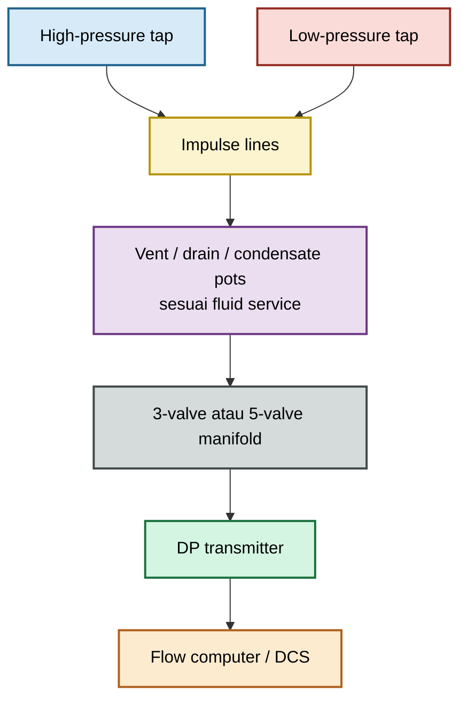

### Impulse lines

Impulse line harus mempertahankan fase fluida yang benar, dengan pressure transmission yang stabil dari tap ke transmitter.

Risiko impulse line:

- plugging;
- leak;
- gas pocket pada liquid service;
- liquid accumulation pada gas service;
- unequal hydrostatic head;
- freezing;
- condensation;
- vaporization;
- insufficient slope;
- vibration damage;
- heat tracing failure;
- impulse line terlalu panjang.

### Slope

Slope impulse line harus mencegah akumulasi fase yang tidak diinginkan.

| Service | Praktik umum                                                                                         | Risiko bila salah                                     |
| ------- | ---------------------------------------------------------------------------------------------------- | ----------------------------------------------------- |
| Liquid  | Transmitter umumnya dipasang lebih rendah dari taps; impulse line diarahkan turun menuju transmitter | Gas pocket mengubah head dan menghasilkan unstable DP |
| Dry gas | Transmitter umumnya dipasang lebih tinggi dari taps; impulse line diarahkan naik menuju transmitter  | Kondensat dapat terkumpul pada low point              |
| Steam   | Transmitter umumnya dipasang lebih rendah dari taps dengan condensate pots pada elevasi yang sama    | Unequal condensate head menciptakan offset DP         |

Praktik akhir harus mengikuti project specification, transmitter manufacturer guidance, dan process service actual.

### Vent dan drain

Vent dan drain harus ditempatkan pada lokasi yang memungkinkan pengeluaran fase terperangkap.

Untuk liquid service:

- vent pada high point untuk mengeluarkan gas;
- drain pada low point bila perlu untuk flushing atau maintenance.

Untuk gas service:

- drain pada low point untuk mengeluarkan condensate;
- vent digunakan sesuai prosedur isolasi dan depressurizing.

Vent dan drain tidak boleh menjadi dead leg yang menimbulkan plugging atau leak path.

### Condensate pot untuk steam

Pada steam service, condensate pots digunakan agar kedua impulse leg memiliki liquid seal dan hydrostatic head yang terkendali.

Persyaratan umum:

- kedua condensate pot berada pada elevasi yang sama;
- kedua pot memiliki configuration yang identik;
- impulse legs diisi sesuai procedure;
- transmitter dipasang pada elevasi yang sesuai;
- thermal condition kedua sisi dibuat seimbang;
- pot dapat diinspeksi dan dibersihkan.

Jika condensate head tidak seimbang, transmitter dapat membaca differential pressure yang bias.

### Gas pocket pada liquid service

Gas pocket pada salah satu impulse line liquid dapat menyebabkan:

- apparent DP drift;
- oscillation;
- response delay;
- incorrect zero;
- error ketika temperature atau pressure berubah.

Tindakan pencegahan:

- slope yang benar;
- vent point;
- transmitter location yang sesuai;
- filling and venting procedure;
- periodic inspection;
- isolasi dari gas evolution bila memungkinkan.

### Liquid accumulation pada gas service

Liquid accumulation pada impulse line gas dapat menyebabkan:

- blocked sensing line;
- unequal hydrostatic head;
- false high atau low DP;
- delayed response;
- temperature-dependent error;
- corrosion under deposit.

Tindakan pencegahan:

- low-point drain;
- proper slope;
- heat tracing atau insulation bila condensate risk tinggi;
- periodic draining;
- moisture-management procedure.

### Hydrostatic head correction

Bila sensing lines memiliki fluida atau elevasi yang berbeda, differential pressure yang dibaca transmitter dapat berbeda dari differential pressure pada tapping.

Dengan satu konvensi elevasi vertikal:

$$
\Delta p_{\mathrm{tx}}
=

\left[
p_H
+
\rho_H g
\left(
z_H-z_{\mathrm{tx}}
\right)
\right]
-

\left[
p_L
+
\rho_L g
\left(
z_L-z_{\mathrm{tx}}
\right)
\right]
$$

dengan:

- $p_H$ dan $p_L$ = static pressure pada high dan low tap;
- $\rho_H$ dan $\rho_L$ = density fluida dalam masing-masing impulse leg;
- $z_H$, $z_L$, dan $z_{\mathrm{tx}}$ = elevasi reference points;
- (g) = acceleration due to gravity.

Bila kedua impulse leg memiliki density, elevasi, dan thermal condition yang sama, sebagian besar hydrostatic effect dapat saling menghilangkan. Bila tidak, correction atau installation redesign diperlukan.

### Manifold configuration

Manifold digunakan untuk:

- isolation;
- equalization;
- venting;
- draining;
- transmitter calibration;
- safe removal.

Manifold harus dipilih berdasarkan:

- pressure rating;
- temperature rating;
- material compatibility;
- number of valves;
- need for vent/drain;
- maintenance philosophy;
- accessibility;
- leak risk.

Sebelum membuka manifold, operator harus mengikuti isolasi, equalization, venting, dan depressurizing procedure yang disetujui.

---

## 9.4 Commissioning checks

Commissioning harus membuktikan bahwa plate, tapping, impulse line, transmitter, and DCS configuration sesuai dengan calculation package dan drawing.

### Field commissioning checklist

| No. | Item                    | Pemeriksaan lapangan                                                                 | Status      |
| --: | ----------------------- | ------------------------------------------------------------------------------------ | ----------- |
|   1 | Tag plate               | Tag, bore, material, revision, dan flow arrow sesuai drawing                         | Pass / Fail |
|   2 | Orientasi plate         | Sharp edge menghadap upstream                                                        | Pass / Fail |
|   3 | Bore condition          | Tidak ada burr, deposit, corrosion, erosion, atau damage                             | Pass / Fail |
|   4 | Centering               | Plate dan gasket centered terhadap pipe ID                                           | Pass / Fail |
|   5 | Gasket                  | Tidak intrude ke bore dan sealing surface baik                                       | Pass / Fail |
|   6 | Flange alignment        | Tidak ada misalignment, gap abnormal, atau deformation                               | Pass / Fail |
|   7 | Pressure taps           | Lokasi, orientation, diameter, dan accessibility sesuai drawing                      | Pass / Fail |
|   8 | Impulse lines           | Routing, slope, support, insulation, tracing, vent, dan drain sesuai service         | Pass / Fail |
|   9 | Steam condensate pots   | Elevasi, filling, symmetry, dan accessibility sesuai design                          | Pass / Fail |
|  10 | DP transmitter          | Tag, range, calibration, mounting, manifold, dan zero check benar                    | Pass / Fail |
|  11 | Pressure transmitter    | Upstream pressure measurement tersedia bila dibutuhkan calculation                   | Pass / Fail |
|  12 | Temperature transmitter | Lokasi dan calibration sesuai density or gas-property basis                          | Pass / Fail |
|  13 | Flow computer/DCS       | Square-root extraction, density compensation, units, and base conditions benar       | Pass / Fail |
|  14 | Leak test               | Tidak ada leak pada flange, tap, manifold, atau impulse line                         | Pass / Fail |
|  15 | Isolation/equalization  | Valve lineup diverifikasi untuk normal operation                                     | Pass / Fail |
|  16 | Straight run            | As-built upstream/downstream configuration cocok dengan design basis                 | Pass / Fail |
|  17 | Process condition       | Flow, P, T, density basis, dan phase condition sesuai commissioning envelope         | Pass / Fail |
|  18 | Baseline data           | Initial DP, P, T, flow indication, dan alarm condition direkam                       | Pass / Fail |
|  19 | Documentation           | As-built drawing, calibration certificate, inspection record, dan punch list lengkap | Pass / Fail |

### Functional commissioning sequence

1. Verifikasi mechanical completion dan plate installation.
2. Verifikasi valve lineup serta isolation status.
3. Pastikan impulse lines bebas blockage dan terisi fase yang benar.
4. Equalize transmitter dan lakukan zero verification sesuai procedure.
5. Buka process pressure secara terkendali.
6. Monitor DP, static pressure, temperature, dan flow indication.
7. Bandingkan indication dengan process expectation atau independent reference bila tersedia.
8. Periksa oscillation, drift, abnormal noise, vibration, atau leak.
9. Rekam baseline operating data untuk future troubleshooting.
10. Tutup seluruh punch list sebelum menyatakan system accepted.

### Baseline data yang harus direkam

| Parameter                                | Tujuan                                              |
| ---------------------------------------- | --------------------------------------------------- |
| Plate identification                     | Traceability                                        |
| Bore diameter dan inspection result      | Future wear comparison                              |
| DP transmitter range dan calibration     | Measurement basis                                   |
| Flow, DP, P, dan T pada commissioning    | Initial performance benchmark                       |
| Valve position dan process configuration | Reproducibility                                     |
| Noise/vibration observation              | Future degradation comparison                       |
| Photographs of installation              | Evidence of orientation, gasket, tubing, and access |
| Alarm and trip settings                  | Functional verification                             |

### Rujukan Bab 9

- **[R9-1]** ISO 5167-1, _Measurement of Fluid Flow by Means of Pressure Differential Devices Inserted in Circular Cross-Section Conduits Running Full — Part 1: General Principles and Requirements_.
- **[R9-2]** ISO 5167-2, _Measurement of Fluid Flow by Means of Pressure Differential Devices Inserted in Circular Cross-Section Conduits Running Full — Part 2: Orifice Plates_.
- **[R9-3]** ASME MFC-3M, _Measurement of Fluid Flow in Pipes Using Orifice, Nozzle, and Venturi_.
- **[R9-4]** R. W. Miller, _Flow Measurement Engineering Handbook_.
- **[R9-5]** Project piping specification, instrument installation standard, dan transmitter manufacturer installation manual yang berlaku.

[**Kembali ke Atas**](#orifice-plate-geometry-flow-equation-installation-and-field-engineering-practice)

---

# 10. CFD: When It Helps and When It Does Not

CFD dapat menjadi alat yang sangat berguna untuk memahami flow field, pressure distribution, vena contracta, recirculation, plenum imbalance, dan jet interaction. Namun, CFD tidak secara otomatis memberikan hasil yang lebih valid daripada standard correlation atau test data.

CFD harus digunakan untuk menjawab pertanyaan engineering yang jelas, terutama ketika geometri atau kondisi operasi berada di luar scope standard correlation.

## 10.1 CFD tidak menggantikan standar flowmeter

Untuk standard orifice plate flowmeter yang memenuhi seluruh syarat geometri, tapping, Reynolds number, beta ratio, dan installation requirement, standard correlation umumnya merupakan basis utama yang lebih tepat untuk perhitungan flow dan uncertainty.

Standard correlation memiliki:

- basis eksperimen;
- batas applicability;
- definisi geometry;
- definisi tapping;
- uncertainty statement;
- prosedur inspeksi;
- pengalaman industri yang luas.

CFD tidak boleh dipakai untuk menggantikan standard flowmeter calculation hanya karena simulasi menghasilkan contour yang menarik.

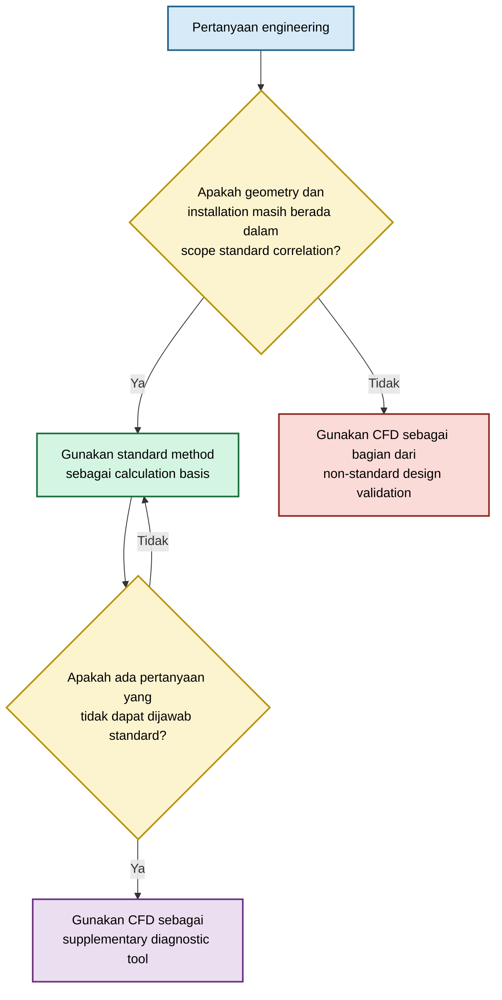

### Peran CFD yang tepat

CFD dapat digunakan untuk:

- menjelaskan mengapa measurement bias mungkin terjadi;
- membandingkan beberapa layout piping;
- mengevaluasi effect of eccentricity;
- memetakan pressure distribution;
- memeriksa pressure recovery;
- mengidentifikasi recirculation zone;
- menilai flow imbalance pada manifold;
- mendukung pemilihan geometry non-standard;
- melakukan screening cavitation or noise risk;
- mendukung desain prototype sebelum test.

### Peran CFD yang tidak tepat

CFD tidak boleh digunakan sebagai satu-satunya dasar untuk:

- menyatakan standard flowmeter compliant;
- menetapkan custody-transfer uncertainty tanpa validation;
- memilih $C_d$ final untuk geometry kecil tanpa test data;
- menjamin tidak ada cavitation erosion hanya karena pressure contour tampak aman;
- menjamin acoustic noise acceptable tanpa model dan assessment yang sesuai;
- menyatakan flow distribution multi-hole seragam tanpa boundary condition yang representatif;
- menggantikan inspection terhadap plate yang aus atau salah pasang.

### Rule of evidence

| Jenis keputusan                         | Basis utama                                                               |
| --------------------------------------- | ------------------------------------------------------------------------- |
| Standard orifice flowmeter              | Standard correlation dan installation requirement                         |
| Geometry non-standard                   | Correlation relevan, test, vendor data, atau CFD tervalidasi              |
| Safety-critical gas restriction         | Compressible-flow calculation, engineering review, vendor/test validation |
| Multi-hole diffuser                     | Plenum calculation, flow-balance test, CFD bila diperlukan                |
| Cavitation-sensitive liquid restriction | Hydraulic model, cavitation screening, material review, test bila kritis  |
| Flowmeter drift karena wear             | Inspection dan recalibration, bukan CFD saja                              |

---

## 10.2 Use cases yang tepat

### Short tube

CFD sesuai untuk mengevaluasi:

- entrance separation;
- friction sepanjang bore;
- effect of $L_e/d$;
- effect of edge radius;
- pressure loss;
- discharge behavior;
- effect of roughness model;
- transition dari short tube ke long-bore behavior.

Untuk short tube, CFD harus dibandingkan dengan analytical loss model:

$$
\Delta p
=

K_{\mathrm{total}}
\frac{\rho V_b^2}{2}
$$

dengan:

$$
K_{\mathrm{total}}
=

K_{\mathrm{entrance}}
+
f
\frac{L_e}{d}
+
K_{\mathrm{exit}}
+
K_{\mathrm{additional}}
$$

Tujuan CFD bukan hanya menghasilkan satu nilai $\Delta p$, tetapi menjelaskan kontribusi entrance, friction, separation, dan exit loss.

### Multi-hole diffuser

CFD sesuai untuk:

- pressure distribution dalam plenum;
- flow variation antar-hole;
- effect of hole pattern;
- effect of plenum geometry;
- interaction antar jet;
- effect of submerged outlet;
- effect of asymmetric supply line.

Untuk hole ke-(i), tujuan simulasi dapat berupa evaluasi:

$$
Q_i
=

f
\left(
p_{\mathrm{plenum},i},
p_{\mathrm{back},i},
d_i,
L_{e,i},
C_{d,i}
\right)
$$

Kemudian ketidakseragaman dapat dievaluasi melalui:

$$
\mathrm{Imbalance}
=

\frac{
Q_{i,\max}
-

Q_{i,\min}
}{
\overline{Q_i}
}
\times
100\%
$$

### Eccentric installation

CFD dapat membantu memeriksa efek:

- plate offset;
- gasket intrusion;
- flange step;
- pipe ovality;
- eccentric reducer;
- non-concentric bore;
- asymmetric upstream elbow.

Output yang relevan bukan hanya contour velocity. Engineer harus mengevaluasi:

- change in $\Delta p$;
- pressure-tap asymmetry;
- flow-profile distortion;
- pressure recovery;
- local recirculation;
- possible systematic bias.

### Complex manifold

CFD bermanfaat untuk manifold dengan:

- multiple branches;
- asymmetric inlet;
- sudden expansion atau contraction;
- multiple restriction plates;
- pressure equalization requirement;
- recycle flow;
- mixing point;
- high velocity branch.

Untuk sistem manifold, CFD sering lebih bernilai sebagai pelengkap network calculation daripada sebagai pengganti seluruh perhitungan jaringan.

### High-velocity restriction

CFD dapat digunakan untuk screening:

- jet core;
- peak velocity;
- Mach number;
- recirculation;
- impingement location;
- pressure fluctuation tendency;
- local wall shear;
- potential erosion zone.

Untuk gas:

$$
M
=

\frac{V}{a}
$$

dengan:

$$
a
=

\sqrt{
\gamma R_s T
}
$$

untuk ideal-gas screening. Untuk real gas atau steam, gunakan speed of sound dari property model yang relevan.

### Cavitation risk screening

CFD dapat digunakan untuk mengidentifikasi lokasi yang mungkin memiliki tekanan rendah:

$$
p_{\min}
\leq
p_v
$$

Namun, contour pressure di bawah vapor pressure tidak otomatis memprediksi erosion rate. Cavitation prediction bergantung pada:

- cavitation model;
- mass-transfer model;
- nuclei content;
- dissolved gas;
- turbulence treatment;
- boundary conditions;
- fluid property accuracy;
- material response;
- transient behavior.

CFD lebih tepat digunakan untuk **risk screening dan geometry comparison**, bukan sebagai jaminan tunggal bahwa cavitation erosion tidak akan terjadi.

### Jet interaction

Untuk multi-hole plate, sparger, diffuser, atau gas injection plate, CFD dapat membantu mengevaluasi:

- jet merging;
- crossflow deflection;
- recirculation;
- local high-velocity region;
- downstream impingement;
- bubble plume interaction;
- unequal outlet pressure.

Bila multiphase behavior menjadi keputusan desain utama, model dan validation requirement harus jauh lebih ketat daripada single-phase CFD.

---

## 10.3 Minimum CFD quality requirements

CFD yang digunakan untuk keputusan engineering harus memiliki quality plan. Simulasi tidak boleh diterima hanya berdasarkan residual convergence atau gambar contour.

### 1. Definisikan quantity of interest

Sebelum membuat mesh, tentukan output yang akan dipakai untuk keputusan.

Contoh:

- permanent pressure loss;
- differential pressure pada tapping;
- minimum static pressure;
- pressure distribution dalam plenum;
- flow per hole;
- jet velocity;
- Mach number;
- pressure recovery;
- recirculation length;
- erosion-prone wall region.

Reference pressure planes harus didefinisikan sebelum hasil dianalisis:

$$
\Delta p_{\mathrm{CFD}}
=

\overline{p}_{\mathrm{upstream}}
-

\overline{p}_{\mathrm{downstream}}
$$

dengan $\overline{p}$ berupa area-weighted average static pressure pada plane yang telah ditetapkan.

Plane CFD harus konsisten dengan plane analytical calculation atau test data. Jangan membandingkan pressure drop dari reference locations yang berbeda.

### 2. Domain length memadai

Domain harus cukup panjang untuk memungkinkan:

- development flow upstream;
- representasi disturbance upstream bila relevan;
- pressure recovery downstream;
- stabilisasi profile sebelum boundary outlet;
- evaluasi recirculation zone.

Tidak ada panjang domain universal untuk seluruh kasus. Domain terlalu pendek dapat memaksa outlet boundary condition memengaruhi pressure recovery atau jet behavior.

Untuk standard flowmeter study, jika upstream profile menjadi fokus, domain harus memasukkan fittings yang menghasilkan disturbance atau menggunakan inlet profile yang terbukti representatif.

### 3. Geometry representatif

Geometry harus mencakup detail yang memengaruhi hasil:

- actual pipe ID;
- bore diameter;
- plate thickness;
- effective bore length;
- sharp edge atau radius;
- bevel;
- gasket intrusion bila ada;
- eccentricity;
- upstream fittings;
- plenum volume;
- downstream restriction;
- pressure taps bila tap pressure dibandingkan.

Menyederhanakan sharp edge menjadi rounded edge atau menghilangkan gasket step dapat mengubah hasil secara material.

### 4. Mesh-independence

Mesh harus diuji melalui systematic refinement, terutama pada:

- upstream edge;
- bore entrance;
- bore wall;
- vena contracta;
- shear layer;
- recirculation zone;
- wall region;
- pressure taps bila dimodelkan;
- individual holes pada multi-hole plate.

Gunakan minimal tiga tingkat mesh yang disusun secara sistematis bila memungkinkan.

Untuk quantity of interest $\phi$, salah satu screening metric adalah:

$$
\delta_{\phi}
=

\frac{
\left|
\phi_{\mathrm{fine}}
-

\phi_{\mathrm{medium}}
\right|
}{
\left|
\phi_{\mathrm{fine}}
\right|
}
\times
100\%
$$

Hasil mesh refinement harus dilaporkan untuk output kritis, bukan hanya untuk residual.

### 5. Turbulence-model justification

Orifice flow memiliki separation, shear layer, recirculation, dan pressure recovery. Turbulence model harus dipilih berdasarkan fenomena yang ingin diprediksi.

Dokumentasikan:

- model turbulence;
- wall treatment;
- target $y^+$;
- mesh adequacy terhadap wall treatment;
- alasan pemilihan model;
- sensitivity terhadap model alternatif bila hasil digunakan untuk keputusan penting.

RANS model dapat memadai untuk banyak preliminary engineering study, tetapi tidak selalu cukup untuk transient jet interaction, acoustic phenomena, atau detailed cavitation dynamics.

### 6. Boundary condition representatif

Boundary conditions harus merepresentasikan kondisi proses:

| Boundary condition | Pertanyaan penting                                                    |
| ------------------ | --------------------------------------------------------------------- |
| Inlet flow rate    | Mass flow atau volumetric flow? Basis actual atau standard?           |
| Inlet profile      | Uniform, fully developed, measured, atau disturbed profile?           |
| Inlet turbulence   | Apakah turbulence intensity dan length scale masuk akal?              |
| Outlet pressure    | Apakah outlet cukup jauh dari recovery zone?                          |
| Temperature        | Apakah energy equation diperlukan?                                    |
| Gas property       | Ideal gas, real gas, atau equation of state lain?                     |
| Multiphase         | Apakah phase fraction, bubble size, atau mass transfer didefinisikan? |
| Wall condition     | Smooth, rough, adiabatic, heated, atau erosive?                       |

Untuk gas restriction dengan pressure ratio besar, model harus mengaktifkan compressibility dan energy equation bila kondisi termal serta density change relevan.

### 7. Pressure-drop convergence

Residual kecil tidak menjamin pressure drop telah converged.

Pantau quantity of interest secara iteratif:

$$
\Delta p^{(n)}
\rightarrow
\Delta p^{(n+1)}
\rightarrow
\Delta p_{\mathrm{stable}}
$$

Simulasi dianggap belum siap untuk evaluasi bila:

- mass imbalance masih tinggi;
- $\Delta p$ terus drift;
- recirculation zone berubah;
- flow split antar-hole belum stabil;
- monitor point berosilasi tanpa analisis transient yang benar;
- residual turun tetapi force atau pressure output belum stabil.

### 8. Mass-balance verification

Untuk steady-state simulation:

$$
\varepsilon_m
=

\frac{
\left|
\dot m_{\mathrm{in}}
-

\dot m_{\mathrm{out}}
\right|
}{
\dot m_{\mathrm{in}}
}
\times
100\%
$$

Mass imbalance harus dievaluasi terhadap target accuracy simulasi. Nilai acceptance harus ditentukan dalam CFD plan, bukan diputuskan setelah hasil diperoleh.

### 9. Comparison dengan analytical calculation

CFD harus dibandingkan dengan perhitungan sederhana yang independen, misalnya:

- continuity;
- Bernoulli dengan loss coefficient;
- Darcy-Weisbach untuk bore friction;
- compressible-flow screening;
- plenum network calculation;
- expected pressure recovery trend.

Perbandingan tidak harus menghasilkan angka identik. Tujuannya adalah mendeteksi kesalahan besar pada geometry, units, boundary conditions, fluid properties, atau reference pressure planes.

### 10. Validation terhadap test data

Untuk desain kritis, CFD harus divalidasi terhadap data eksperimen atau field data yang relevan.

Validasi paling kuat menggunakan:

- geometry identik;
- fluid sama atau dinamically similar;
- pressure range relevan;
- comparable Reynolds number;
- comparable pressure ratio;
- measured pressure taps;
- measured flow distribution;
- documented measurement uncertainty.

Bila test data tidak tersedia, laporan CFD harus menyatakan dengan jelas bahwa hasilnya adalah **engineering prediction**, bukan verified performance guarantee.

### CFD acceptance matrix

| Elemen              | Minimum evidence                                              |
| ------------------- | ------------------------------------------------------------- |
| Geometry            | Drawing, dimensions, and simplification log                   |
| Physics             | Fluid model, compressibility, thermal model, multiphase basis |
| Mesh                | Mesh statistics dan refinement comparison                     |
| Turbulence          | Model justification dan wall-treatment basis                  |
| Boundary conditions | Process data, assumptions, profile definition                 |
| Convergence         | Residual, pressure-drop monitor, mass balance                 |
| Comparison          | Analytical calculation atau benchmark case                    |
| Validation          | Test data atau justification bila belum tersedia              |
| Reporting           | Limitations, uncertainty, and decision relevance              |

### Minimum CFD report structure

1. Objective dan engineering decision.
2. Geometry and assumptions.
3. Fluid properties and operating points.
4. Governing equations and physical models.
5. Domain and mesh strategy.
6. Boundary conditions.
7. Solver settings and convergence criteria.
8. Mesh-independence result.
9. Pressure-drop and mass-balance verification.
10. Comparison with analytical result.
11. Validation evidence.
12. Results, limitations, and design recommendation.

### Rujukan Bab 10

- **[R10-1]** ASME V&V 20, _Standard for Verification and Validation in Computational Fluid Dynamics and Heat Transfer_.
- **[R10-2]** P. J. Roache, _Verification and Validation in Computational Science and Engineering_.
- **[R10-3]** ISO 5167-1 dan ISO 5167-2 untuk batas penggunaan standard differential-pressure flowmeter.
- **[R10-4]** ASME MFC-3M, _Measurement of Fluid Flow in Pipes Using Orifice, Nozzle, and Venturi_.
- **[R10-5]** Project CFD procedure, quality plan, dan validation data yang relevan terhadap geometry serta operating envelope aktual.

[**Kembali ke Atas**](#orifice-plate-geometry-flow-equation-installation-and-field-engineering-practice)

---

Berikut lanjutan artikel dengan empat studi kasus, diagnosis praktis, release checklist, dan appendix teknis. Studi kasus ini menggunakan basis dan batas model yang konsisten dengan pembahasan sebelumnya.

---

# 11. Worked Engineering Cases

Bab ini berisi empat contoh engineering untuk menunjukkan pemilihan model, batas validitas, perhitungan, sensitivitas, warning, dan keputusan desain.

Semua pressure pada contoh dinyatakan sebagai **absolute pressure**, kecuali bila disebut lain. Standard volumetric flow pada contoh gas menggunakan basis:

$$
p_b
=

101.325\ \mathrm{kPa}
$$

$$
T_b
=

15^\circ\mathrm{C}
=

288.15\ \mathrm{K}
$$

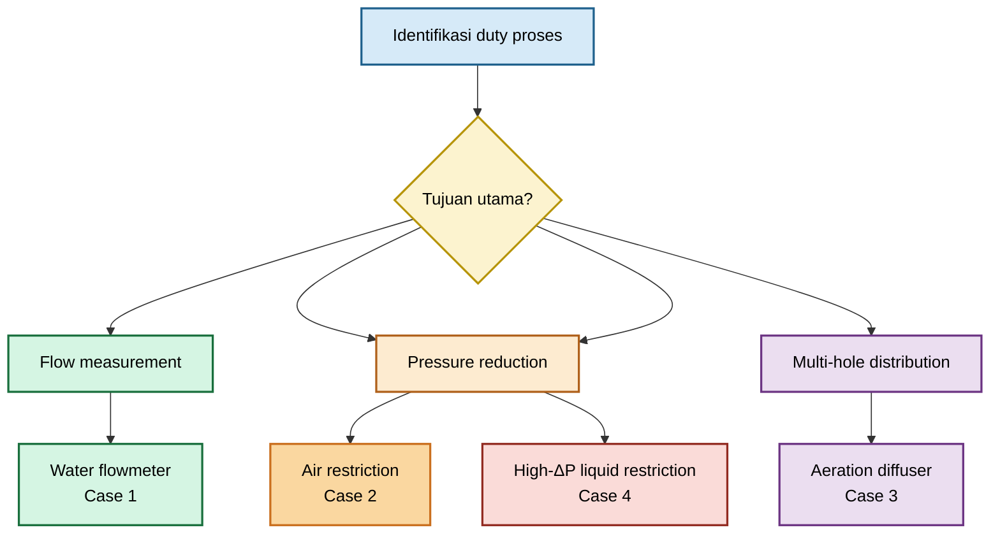

## 11.1 Case 1 — Water Flowmeter Sesuai Scope ISO/ASME

### Tujuan

Menghitung flow water menggunakan thin sharp-edge orifice plate dengan flange taps. Contoh ini merupakan ilustrasi metode standard differential-pressure flowmeter, dengan asumsi seluruh persyaratan dimensional dan instalasi telah diverifikasi.

### Input data

| Parameter                           |                                            Nilai |
| ----------------------------------- | -----------------------------------------------: |
| Fluida                              |                                     Water, 20 °C |
| Density, $\rho$                     |                           $998\ \mathrm{kg/m^3}$ |
| Dynamic viscosity, $\mu$            | $1.002\times10^{-3}\ \mathrm{Pa}\cdot\mathrm{s}$ |
| Pipe ID aktual, (D)                 |                             $0.1000\ \mathrm{m}$ |
| Bore diameter aktual, (d)           |                             $0.0500\ \mathrm{m}$ |
| Plate thickness, (t)                |                               $3.0\ \mathrm{mm}$ |
| Beta ratio, $\beta$                 |                                            0.500 |
| Differential pressure               |                             $10.0\ \mathrm{kPa}$ |
| Pressure tapping                    |                                      Flange taps |
| Expansibility factor, $\varepsilon$ |                                            1.000 |
| Discharge coefficient, (C)          |           0.606, dari correlation yang disetujui |

### Asumsi

- Pipa circular, penuh, dan single-phase.
- Plate sharp-edge terpasang dengan orientasi benar.
- Flange taps dan straight run memenuhi persyaratan metode.
- Tidak terdapat swirl, fouling, gasket intrusion, atau plate wear.
- Nilai (C) bukan nilai universal; digunakan hanya sebagai hasil correlation yang relevan terhadap geometry dan tapping.

### Metode yang dipilih

Standard orifice flowmeter equation untuk liquid inkompresibel:

$$
Q
=

C A_o
\sqrt{
\frac{
2\Delta p
}{
\rho
\left(
1-\beta^4
\right)
}
}
$$

dengan:

$$
A_o
=

\frac{\pi d^2}{4}
$$

$$
\beta
=

\frac{d}{D}
$$

### Perhitungan

Luas bore:

$$
A_o
=

\frac{
\pi
\left(
0.0500
\right)^2
}{
4
}
=

1.9635\times10^{-3}\ \mathrm{m^2}
$$

Beta ratio:

$$
\beta
=

\frac{0.0500}{0.1000}
=

0.500
$$

$$
1-\beta^4
=

1-(0.5)^4
=

0.9375
$$

Debit volumetrik:

$$
Q
=

0.606
\left(
1.9635\times10^{-3}
\right)
\sqrt{
\frac{
2(10{,}000)
}{
998(0.9375)
}
}
$$

$$
Q
=

5.50\times10^{-3}\ \mathrm{m^3/s}
$$

$$
Q
=

19.8\ \mathrm{m^3/h}
$$

Mass flow:

$$
\dot m
=

\rho Q
$$

$$
\dot m
=

998
\left(
5.50\times10^{-3}
\right)
=

5.49\ \mathrm{kg/s}
$$

Pipe velocity:

$$
A_p
=

\frac{\pi D^2}{4}
=

7.854\times10^{-3}\ \mathrm{m^2}
$$

$$
V_{pipe}
=

\frac{Q}{A_p}
=

0.700\ \mathrm{m/s}
$$

Pipe Reynolds number:

$$
\mathrm{Re}_{pipe}
=

\frac{
\rho V_{pipe}D
}{
\mu
}
$$

$$
\mathrm{Re}_{pipe}
=

\frac{
998(0.700)(0.100)
}{
1.002\times10^{-3}
}
\approx
6.98\times10^4
$$

### Hasil

| Output               |                  Nilai |
| -------------------- | ---------------------: |
| Volumetric flow      | $19.8\ \mathrm{m^3/h}$ |
| Mass flow            |  $5.49\ \mathrm{kg/s}$ |
| Pipe velocity        |  $0.700\ \mathrm{m/s}$ |
| Bore velocity        |   $2.80\ \mathrm{m/s}$ |
| Pipe Reynolds number |       $6.98\times10^4$ |

### Sensitivitas

| Parameter                  | Asumsi uncertainty | Perkiraan kontribusi flow |
| -------------------------- | -----------------: | ------------------------: |
| Bore diameter, (d)         |             ±0.10% |                    ±0.21% |
| Discharge coefficient, (C) |             ±0.30% |                    ±0.30% |
| Differential pressure      |             ±0.20% |                    ±0.10% |
| Density                    |             ±0.20% |                    ±0.10% |

Estimasi gabungan sederhana, tanpa memasukkan installation effect:

$$
u_Q
\approx
\sqrt{
(0.21\%)^2+
(0.30\%)^2+
(0.10\%)^2+
(0.10\%)^2
}
$$

$$
u_Q
\approx
0.40\%
$$

Nilai tersebut bukan uncertainty guarantee. Installation effect, plate inspection status, flow profile, dan correlation applicability dapat menambah systematic uncertainty.

### Warning

- Nilai $C=0.606$ tidak boleh dipakai bila tapping, beta ratio, edge geometry, atau Reynolds number berbeda dari basis correlation.
- Flowmeter tidak boleh dinyatakan compliant hanya berdasarkan hasil persamaan.
- Bore wear sebesar 0.5% dapat mengubah flow indication sekitar 1% atau lebih.

### Keputusan akhir

**Dapat diterima sebagai standard-orifice flowmeter calculation** hanya bila seluruh persyaratan geometry, tapping, straight run, inspection, dan instrument uncertainty diverifikasi terhadap standard yang dipakai.

---

## 11.2 Case 2 — Air Restriction Orifice dengan Compressibility Check

### Tujuan

Membatasi flow udara dari upstream pressure 300 kPa absolute ke downstream backpressure 240 kPa absolute.

### Input data

| Parameter                      |                                             Nilai |
| ------------------------------ | ------------------------------------------------: |
| Fluida                         |                                           Dry air |
| Upstream pressure, $p_1$       |                            $300\ \mathrm{kPa(a)}$ |
| Downstream backpressure, $p_2$ |                            $240\ \mathrm{kPa(a)}$ |
| Upstream temperature, $T_1$    |                              $293.15\ \mathrm{K}$ |
| Bore diameter, (d)             |                               $10.0\ \mathrm{mm}$ |
| Discharge coefficient, $C_d$   |                                              0.70 |
| Specific heat ratio, $\gamma$  |                                              1.40 |
| Specific gas constant, $R_s$   | $287.05\ \mathrm{J}/(\mathrm{kg}\cdot\mathrm{K})$ |

### Asumsi

- Air diperlakukan sebagai ideal gas untuk preliminary screening.
- Upstream velocity kecil, sehingga upstream static condition mendekati stagnation condition.
- Nilai $C_d$ berasal dari geometry-matched correlation, vendor data, atau bench test.
- $p_2$ adalah downstream backpressure reference, bukan low-pressure tap flowmeter.

### Compressibility check

Pressure ratio:

$$
r
=

\frac{p_2}{p_1}
=

\frac{240}{300}
=

0.800
$$

Critical pressure ratio untuk ideal gas:

$$
r_{\mathrm{crit}}
=

\left(
\frac{2}{\gamma+1}
\right)^{
\frac{\gamma}{\gamma-1}
}
$$

$$
r_{\mathrm{crit}}
=

\left(
\frac{2}{2.4}
\right)^{3.5}
=

0.528
$$

Karena:

$$
r
=

0.800

>

0.528
$$

maka flow diperkirakan **tidak choked** pada kondisi normal ini.

Critical downstream pressure:

$$
p_{2,\mathrm{crit}}
=

r_{\mathrm{crit}}p_1
$$

$$
p_{2,\mathrm{crit}}
=

0.528
\times
300
=

158.5\ \mathrm{kPa(a)}
$$

Bila downstream pressure turun hingga sekitar 158.5 kPa(a) atau lebih rendah, choking harus dievaluasi sebagai kondisi dominan.

### Metode yang dipilih

Persamaan preliminary non-choked compressible flow:

$$
\dot m
=

C_dA_op_1
\sqrt{
\frac{
2\gamma
}{
R_sT_1(\gamma-1)
}
\left[
\left(
\frac{p_2}{p_1}
\right)^{
2/\gamma
}
-

\left(
\frac{p_2}{p_1}
\right)^{
(\gamma+1)/\gamma
}
\right]
}
$$

Luas bore:

$$
A_o
=

\frac{\pi d^2}{4}
=

7.854\times10^{-5}\ \mathrm{m^2}
$$

### Perhitungan mass flow

$$
\dot m
=

0.70
\left(
7.854\times10^{-5}
\right)
(300{,}000)
\sqrt{
\frac{
2(1.4)
}{
287.05(293.15)(0.4)
}
\left[
(0.8)^{1.4286}
-

(0.8)^{1.7143}
\right]
}
$$

$$
\dot m
\approx
3.19\times10^{-2}\ \mathrm{kg/s}
$$

Upstream density:

$$
\rho_1
=

\frac{p_1}{R_sT_1}
$$

$$
\rho_1
=

\frac{300{,}000}{287.05(293.15)}
=

3.57\ \mathrm{kg/m^3}
$$

Actual upstream flow:

$$
Q_1
=

\frac{\dot m}{\rho_1}
$$

$$
Q_1
=

8.94\times10^{-3}\ \mathrm{m^3/s}
$$

$$
Q_1
=

32.2\ \mathrm{m^3/h}
$$

Standard volumetric flow:

$$
Q_b
=

Q_1
\left(
\frac{p_1}{p_b}
\right)
\left(
\frac{T_b}{T_1}
\right)
$$

$$
Q_b
=

8.94\times10^{-3}
\left(
\frac{300}{101.325}
\right)
\left(
\frac{288.15}{293.15}
\right)
$$

$$
Q_b
=

2.60\times10^{-2}\ \mathrm{m^3/s}
$$

$$
Q_b
=

93.6\ \mathrm{Sm^3/h}
$$

### Hasil

| Output                       |                             Nilai |
| ---------------------------- | --------------------------------: |
| Pressure ratio, $p_2/p_1$    |                             0.800 |
| Critical pressure ratio      |                             0.528 |
| Flow regime                  | Non-choked, preliminary screening |
| Mass flow                    |           $0.0319\ \mathrm{kg/s}$ |
| Actual upstream flow         |            $32.2\ \mathrm{m^3/h}$ |
| Standard flow                |           $93.6\ \mathrm{Sm^3/h}$ |
| Critical downstream pressure |          $158.5\ \mathrm{kPa(a)}$ |

### Sensitivitas

| Parameter                    | Dampak utama                                     |
| ---------------------------- | ------------------------------------------------ |
| Bore diameter, (d)           | $\dot m \propto d^2$                             |
| Discharge coefficient, $C_d$ | Linear terhadap mass flow                        |
| Upstream pressure, $p_1$     | Sangat memengaruhi density dan mass flow         |
| Downstream pressure, $p_2$   | Penting saat mendekati critical pressure ratio   |
| Temperature, $T_1$           | Mempengaruhi density dan sonic condition         |
| Gas composition              | Mengubah $R_s$, $\gamma$, dan (Z) untuk real gas |

Sebagai ilustrasi, uncertainty $C_d$ sebesar ±10% menghasilkan uncertainty mass flow sekitar ±10%. Hal ini biasanya lebih dominan dibandingkan error kecil transmitter pressure.

### Warning

- Persamaan ini adalah preliminary ideal-gas model, bukan final gas-restriction method untuk semua kondisi.
- Natural gas, hydrocarbon gas, steam, atau gas bertekanan tinggi memerlukan real-gas property method.
- Bila $p_2$ dapat turun mendekati 158.5 kPa(a), choked-flow assessment wajib dilakukan.
- Jet velocity, noise, vibration, dan downstream impingement belum dinyatakan aman hanya karena flow tidak choked.

### Keputusan akhir

**Dapat digunakan sebagai preliminary sizing**, tetapi final design harus memasukkan pressure envelope, noise assessment, geometry-specific $C_d$, dan verifikasi choking pada pressure minimum downstream.

---

## 11.3 Case 3 — Small-Hole Aeration Diffuser dengan Bore Reynolds Number

### Tujuan

Mengestimasi airflow diffuser plate dengan 100 hole untuk injeksi udara ke water tank pada submergence 1 m.

### Input data

| Parameter                               |                                           Nilai |
| --------------------------------------- | ----------------------------------------------: |
| Fluida gas                              |                                      Air, 20 °C |
| Upstream plenum pressure, $p_1$         |                        $115.0\ \mathrm{kPa(a)}$ |
| Air temperature                         |                            $293.15\ \mathrm{K}$ |
| Surface pressure                        |                      $101.325\ \mathrm{kPa(a)}$ |
| Water depth, (h)                        |                               $1.0\ \mathrm{m}$ |
| Water density, $\rho_l$                 |                          $998\ \mathrm{kg/m^3}$ |
| Air viscosity, $\mu_g$                  | $1.81\times10^{-5}\ \mathrm{Pa}\cdot\mathrm{s}$ |
| Hole diameter, (d)                      |                             $1.00\ \mathrm{mm}$ |
| Plate thickness, (t)                    |                             $2.00\ \mathrm{mm}$ |
| Number of holes, (N)                    |                                             100 |
| Calibrated discharge coefficient, $C_d$ |                                            0.72 |
| Estimated plenum pressure variation     |                                           40 Pa |

### Asumsi

- Hole geometry seragam dan bersih.
- Nilai $C_d=0.72$ berasal dari prototype test atau vendor curve pada kondisi sebanding.
- Pressure drop per hole jauh lebih besar dari pressure variation dalam plenum.
- Gas expansion kecil untuk screening awal:

$$
\frac{
\Delta p
}{
p_1
}
<
5\%
$$

- Interaksi bubble antar-hole belum dimasukkan ke dalam perhitungan sederhana.

### Downstream backpressure

Hydrostatic backpressure pada kedalaman 1 m:

$$
p_{\mathrm{back}}
=

p_{\mathrm{surface}}
+
\rho_lgh
$$

$$
p_{\mathrm{back}}
=

101.325
+
\frac{
998(9.80665)(1)
}{
1000
}
$$

$$
p_{\mathrm{back}}
=

111.11\ \mathrm{kPa(a)}
$$

Available pressure drop per hole:

$$
\Delta p
=

p_1-p_{\mathrm{back}}
$$

$$
\Delta p
=

115.00-111.11
=

3.89\ \mathrm{kPa}
$$

### Geometri

$$
\frac{t}{d}
=

\frac{2.0}{1.0}
=

2.0
$$

Plate ini harus diperlakukan sebagai **short tube**, bukan thin sharp-edge flowmeter.

Luas satu hole:

$$
A_o
=

\frac{\pi d^2}{4}
$$

$$
A_o
=

7.854\times10^{-7}\ \mathrm{m^2}
$$

Upstream air density:

$$
\rho_g
=

\frac{p_1}{R_sT_1}
$$

$$
\rho_g
=

\frac{115{,}000}{287.05(293.15)}
=

1.37\ \mathrm{kg/m^3}
$$

### Metode yang dipilih

Short-tube preliminary flow equation:

$$
Q_{\mathrm{hole}}
=

C_dA_o
\sqrt{
\frac{
2\Delta p
}{
\rho_g
}
}
$$

### Perhitungan per hole

$$
Q_{\mathrm{hole}}
=

0.72
\left(
7.854\times10^{-7}
\right)
\sqrt{
\frac{
2(3889)
}{
1.37
}
}
$$

$$
Q_{\mathrm{hole}}
=

4.27\times10^{-5}\ \mathrm{m^3/s}
$$

$$
Q_{\mathrm{hole}}
=

2.56\ \mathrm{L/min}
$$

Bore velocity:

$$
V_{\mathrm{bore}}
=

\frac{
Q_{\mathrm{hole}}
}{
A_o
}
$$

$$
V_{\mathrm{bore}}
=

54.3\ \mathrm{m/s}
$$

Bore Reynolds number:

$$
\mathrm{Re}_{bore}
=

\frac{
\rho_gV_{\mathrm{bore}}d
}{
\mu_g
}
$$

$$
\mathrm{Re}_{bore}
=

\frac{
1.37(54.3)(0.001)
}{
1.81\times10^{-5}
}
$$

$$
\mathrm{Re}_{bore}
\approx
4.1\times10^3
$$

### Total airflow

Dengan asumsi pressure plenum seragam:

$$
Q_{\mathrm{total}}
=

NQ_{\mathrm{hole}}
$$

$$
Q_{\mathrm{total}}
=

100
\left(
4.27\times10^{-5}
\right)
$$

$$
Q_{\mathrm{total}}
=

4.27\times10^{-3}\ \mathrm{m^3/s}
$$

$$
Q_{\mathrm{total}}
=

15.4\ \mathrm{m^3/h}
$$

Konversi ke standard condition:

$$
Q_b
=

Q_{\mathrm{total}}
\left(
\frac{p_1}{p_b}
\right)
\left(
\frac{T_b}{T_1}
\right)
$$

$$
Q_b
\approx
17.1\ \mathrm{Sm^3/h}
$$

### Pemeriksaan pressure uniformity plenum

$$
\frac{
\Delta p_{\mathrm{plenum}}
}{
\Delta p_{\mathrm{hole}}
}
=

\frac{
40
}{
3889
}
=

1.0\%
$$

Untuk hubungan:

$$
Q
\propto
\sqrt{
\Delta p
}
$$

variasi flow akibat plenum pressure drop sekitar:

$$
\frac{
\Delta Q
}{
Q
}
\approx
\frac{1}{2}
\frac{
\Delta p_{\mathrm{plenum}}
}{
\Delta p_{\mathrm{hole}}
}
$$

$$
\frac{
\Delta Q
}{
Q
}
\approx
0.5\%
$$

### Hasil

| Output                 |                   Nilai |
| ---------------------- | ----------------------: |
| Pressure drop per hole |    $3.89\ \mathrm{kPa}$ |
| Flow per hole          |  $2.56\ \mathrm{L/min}$ |
| Total actual airflow   |  $15.4\ \mathrm{m^3/h}$ |
| Total standard airflow | $17.1\ \mathrm{Sm^3/h}$ |
| Bore velocity          |    $54.3\ \mathrm{m/s}$ |
| Bore Reynolds number   |         $4.1\times10^3$ |
| $t/d$                  |                     2.0 |

### Sensitivitas

| Parameter                 |    Asumsi variasi | Dampak perkiraan pada flow |
| ------------------------- | ----------------: | -------------------------: |
| Hole diameter, (d)        |             ±2.5% |                      ±5.0% |
| $C_d$                     |             ±5.0% |                      ±5.0% |
| Pressure drop             |             ±5.0% |                      ±2.5% |
| Plenum pressure variation | 1.0% dari hole DP |                      ±0.5% |

Estimasi gabungan sederhana:

$$
u_Q
\approx
\sqrt{
(5.0\%)^2+
(5.0\%)^2+
(2.5\%)^2+
(0.5\%)^2
}
$$

$$
u_Q
\approx
7.5\%
$$

Nilai aktual dapat lebih besar bila terjadi fouling, hole-to-hole diameter variation, bubble interaction, atau backpressure non-uniform.

### Warning

- $\mathrm{Re}_{bore}\approx4.1\times10^3$ menunjukkan bahwa $C_d$ tidak boleh dianggap universal.
- $t/d=2$ menunjukkan short-tube behavior.
- Bubble plume dapat meningkatkan local backpressure dan mengubah flow distribution.
- Hole diameter tolerance dapat lebih dominan daripada uncertainty pressure transmitter.
- Fouling sebagian pada beberapa hole dapat menyebabkan distribusi airflow tidak merata walaupun total flow tampak normal.

### Keputusan akhir

**Dapat diterima hanya sebagai preliminary diffuser estimate.** Final design membutuhkan prototype test, vendor test curve, atau validated CFD plus flow-balance verification.

---

## 11.4 Case 4 — High-$\Delta P$ Liquid Restriction dengan Cavitation Screening

### Tujuan

Memeriksa risiko cavitation pada single-stage liquid restriction dengan permanent pressure loss tinggi.

### Input data

| Parameter                                         |                   Nilai |
| ------------------------------------------------- | ----------------------: |
| Fluida                                            |            Water, 25 °C |
| Water density, $\rho$                             |  $997\ \mathrm{kg/m^3}$ |
| Vapor pressure, $p_v$                             | $3.17\ \mathrm{kPa(a)}$ |
| Flow rate                                         |   $9.0\ \mathrm{m^3/h}$ |
| Upstream pressure, $p_1$                          |  $700\ \mathrm{kPa(a)}$ |
| Pipe internal diameter, (D)                       |     $50.0\ \mathrm{mm}$ |
| Bore diameter, (d)                                |     $12.5\ \mathrm{mm}$ |
| Plate thickness, (t)                              |      $3.0\ \mathrm{mm}$ |
| Permanent loss coefficient, $K_{p,1\rightarrow3}$ |                     619 |
| Local pressure coefficient, $C_{p,\min}$          |                   -3.45 |

Nilai $K_{p,1\rightarrow3}$ dan $C_{p,\min}$ pada contoh ini dianggap berasal dari geometry-specific correlation, qualified vendor data, atau validated CFD. Nilai tersebut **tidak boleh dipindahkan langsung** ke geometri lain.

### Asumsi

- Liquid satu fase pada upstream reference section.
- $K_{p,1\rightarrow3}$ berbasis upstream pipe velocity.
- $C_{p,\min}$ berbasis bore velocity.
- Loss akibat piping downstream belum dimasukkan ke dalam $\Delta p_{\mathrm{perm}}$.
- Prediksi tekanan minimum hanya digunakan untuk cavitation screening.

### Geometri

$$
\beta
=

\frac{d}{D}
=

\frac{12.5}{50.0}
=

0.25
$$

$$
\frac{t}{d}
=

\frac{3.0}{12.5}
=

0.24
$$

Pipe area:

$$
A_p
=

\frac{\pi D^2}{4}
=

1.9635\times10^{-3}\ \mathrm{m^2}
$$

Bore area:

$$
A_o
=

\frac{\pi d^2}{4}
=

1.2272\times10^{-4}\ \mathrm{m^2}
$$

### Pipe and bore velocity

$$
Q
=

\frac{9.0}{3600}
=

2.50\times10^{-3}\ \mathrm{m^3/s}
$$

$$
V_{pipe}
=

\frac{Q}{A_p}
=

1.273\ \mathrm{m/s}
$$

$$
V_{bore}
=

\frac{Q}{A_o}
=

20.37\ \mathrm{m/s}
$$

Pipe dynamic pressure:

$$
q_{pipe}
=

\frac{1}{2}
\rho V_{pipe}^2
$$

$$
q_{pipe}
=

\frac{1}{2}
(997)
(1.273)^2
=

0.808\ \mathrm{kPa}
$$

Bore dynamic pressure:

$$
q_{bore}
=

\frac{1}{2}
\rho V_{bore}^2
$$

$$
q_{bore}
=

\frac{1}{2}
(997)
(20.37)^2
=

206.9\ \mathrm{kPa}
$$

### Permanent pressure loss

$$
\Delta p_{\mathrm{perm}}
=

K_{p,1\rightarrow3}
\frac{
\rho V_{pipe}^2
}{
2
}
$$

$$
\Delta p_{\mathrm{perm}}
=

619
(0.808)
$$

$$
\Delta p_{\mathrm{perm}}
\approx
500\ \mathrm{kPa}
$$

Estimated downstream pressure after primary recovery:

$$
p_3
=

p_1-\Delta p_{\mathrm{perm}}
$$

$$
p_3
=

700-500
=

200\ \mathrm{kPa(a)}
$$

### Cavitation screening

Local pressure coefficient:

$$
C_{p,\min}
=

\frac{
p_{\min}-p_1
}{
\frac{1}{2}\rho V_{bore}^2
}
$$

Maka:

$$
p_{\min}
=

p_1
+
C_{p,\min}
\left(
\frac{1}{2}\rho V_{bore}^2
\right)
$$

$$
p_{\min}
=

700
+
(-3.45)
(206.9)
$$

$$
p_{\min}
\approx
-14\ \mathrm{kPa(a)}
$$

Nilai negatif tersebut bukan tekanan fisik yang benar-benar dapat tercapai. Hasil tersebut menunjukkan bahwa single-phase model memprediksi tekanan jauh di bawah vapor pressure:

$$
p_{\min}
<
p_v
$$

Karena downstream pressure masih lebih tinggi daripada vapor pressure:

$$
p_3

>

p_v
$$

maka kondisi ini mengindikasikan **cavitation**, bukan flashing stabil.

Cavitation index berbasis bore velocity dan downstream recovered pressure:

$$
\sigma_{b,3}
=

\frac{
p_3-p_v
}{
\frac{1}{2}\rho V_{bore}^2
}
$$

$$
\sigma_{b,3}
=

\frac{
200-3.17
}{
206.9
}
=

0.95
$$

Nilai $\sigma_{b,3}$ hanya dapat dibandingkan dengan threshold dari model, geometry, dan reference velocity yang sama.

### Sensitivitas

Untuk geometry dan coefficient yang tetap:

$$
\Delta p_{\mathrm{perm}}
\propto
Q^2
$$

Jika flow meningkat 10%:

$$
\frac{
\Delta p_{new}
}{
\Delta p_{base}
}
=

(1.10)^2
=

1.21
$$

Maka permanent pressure loss meningkat sekitar 21%.

Kenaikan flow juga meningkatkan bore velocity dan memperburuk local pressure depression. Penurunan upstream pressure menghasilkan efek yang sama terhadap cavitation margin.

### Warning

- Hasil tekanan minimum di bawah vapor pressure menunjukkan single-stage restriction tidak aman.
- Material lebih kuat tidak menghilangkan akar masalah cavitation.
- Pressure transmitter downstream tidak cukup untuk membuktikan tidak adanya cavitation.
- Single-stage plate dapat menimbulkan noise, vibration, pitting, dan accelerated erosion.
- Perhitungan final harus memasukkan downstream piping loss, process pressure envelope, dan kemungkinan flow upset.

### Keputusan akhir

**Single-stage restriction ditolak.**

Pilihan desain berikut harus dievaluasi:

- multi-stage restriction;
- multi-hole staged plate;
- pressure reduction melalui control valve yang sesuai;
- peningkatan downstream backpressure bila proses memungkinkan;
- redesign line untuk mengurangi satu kali pressure drop;
- material upgrade setelah hydraulic risk dikurangi.

---

## 11.5 Ringkasan Studi Kasus

| Case | Aplikasi                           | Metode utama                          | Risiko dominan                                  | Keputusan                                           |
| ---- | ---------------------------------- | ------------------------------------- | ----------------------------------------------- | --------------------------------------------------- |
| 1    | Water flowmeter                    | Standard DP flow equation             | Installation and geometry compliance            | Dapat diterima bila standard requirements terpenuhi |
| 2    | Air restriction                    | Compressible non-choked screening     | Choking, noise, $C_d$ uncertainty               | Preliminary sizing only                             |
| 3    | Aeration diffuser                  | Short-tube calibrated model           | Hole tolerance, fouling, distribution imbalance | Test/vendor validation diperlukan                   |
| 4    | High-$\Delta P$ liquid restriction | (K)-loss dan local pressure screening | Cavitation dan erosion                          | Single-stage ditolak                                |

### Rujukan Bab 11

- **[R11-1]** ISO 5167-1 dan ISO 5167-2, differential-pressure flow measurement using orifice plates.
- **[R11-2]** ASME MFC-3M, flow measurement in pipes using orifice, nozzle, and venturi.
- **[R11-3]** Crane Co., _Flow of Fluids Through Valves, Fittings and Pipe_, Technical Paper No. 410.
- **[R11-4]** I. E. Idelchik, _Handbook of Hydraulic Resistance_.
- **[R11-5]** API 521, _Guide for Pressure-Relieving and Depressuring Systems_.
- **[R11-6]** Vendor calibration data, prototype testing, atau CFD validation data yang relevan terhadap geometri aktual.

[**Kembali ke Atas**](#orifice-plate-geometry-flow-equation-installation-and-field-engineering-practice)

---

# 12. Troubleshooting and Failure Modes

Troubleshooting orifice plate harus memisahkan tiga sumber masalah:

1. **Process problem**: flow, density, pressure, temperature, phase, atau operating mode berubah.
2. **Mechanical problem**: plate, bore, gasket, flange, piping, atau holder berubah.
3. **Instrument problem**: pressure tap, impulse line, manifold, transmitter, flow computer, atau configuration salah.

Jangan langsung melakukan transmitter recalibration sebelum memastikan plate dan impulse system tidak mengalami masalah fisik.

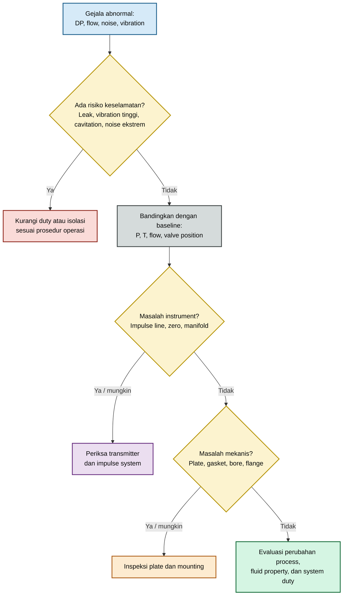

## 12.1 Prinsip diagnosis berbasis tren

Untuk geometry dan density yang relatif konstan:

$$
\Delta p
\propto
Q^2
$$

Trend DP sebaiknya dibandingkan pada flow yang setara. Salah satu screening normalization adalah:

$$
\Delta p_{\mathrm{norm}}
=

\Delta p
\left(
\frac{
Q_{\mathrm{ref}}
}{
Q
}
\right)^2
$$

Persamaan ini hanya layak untuk screening pada kondisi density, viscosity, geometry, dan regime flow yang relatif stabil. Jangan menggunakannya untuk gas dengan pressure ratio besar, two-phase flow, atau system dengan geometry berubah akibat fouling.

## 12.2 Tabel diagnosis praktis

| Gejala                                       | Penyebab potensial                                                                          | Pemeriksaan                                                                  | Tindakan                                                        |
| -------------------------------------------- | ------------------------------------------------------------------------------------------- | ---------------------------------------------------------------------------- | --------------------------------------------------------------- |
| DP naik bertahap pada flow yang sama         | Fouling, plugging, deposit, gasket extrusion                                                | Trend DP ternormalisasi, inspeksi plate, visual bore check                   | Cleaning, flushing, replacement                                 |
| DP turun bertahap pada flow yang sama        | Bore erosion, edge rounding, bypass leak, plate damage                                      | Dimensional check, inspection edge, leak test                                | Replace plate, investigate erosion source                       |
| Flow terbaca rendah terhadap reference meter | Partial plugging, gasket intrusion, wrong bore basis, transmitter range/configuration salah | Plate inspection, bore measurement, transmitter configuration, density basis | Cleaning, realignment, recalibration                            |
| Flow terbaca tinggi terhadap reference meter | Bore enlargement, wrong (C), wrong square-root extraction, unequal impulse-line head        | Measure bore, check DCS logic, verify impulse-line fill                      | Replace plate, correct configuration                            |
| DP zero offset saat no-flow                  | Unequal hydrostatic head, trapped gas/liquid, transmitter zero drift                        | Equalization test, vent/drain, transmitter zero check                        | Purge impulse line, rebalance legs, recalibrate                 |
| DP berosilasi                                | Pump pulsation, compressor pulsation, two-phase flow, vibration, unstable control valve     | Trend frequency, process history, line inspection                            | Add damping, improve installation, review process source        |
| Noise tinggi                                 | Choked flow, high jet velocity, cavitation, flashing, jet impingement                       | Pressure ratio, acoustic trend, inspection, process condition                | Multi-stage design, reduce duty, redesign downstream            |
| Vibration pada plate atau piping             | Acoustic resonance, high turbulence, loose holder, pulsation                                | Vibration survey, support inspection, pressure fluctuation logging           | Improve support, redesign restriction, add damping              |
| Flow antar-hole tidak seragam                | Plenum pressure drop, hole tolerance, fouling, different backpressure                       | Pressure mapping, hole inspection, bubble-pattern observation                | Redesign manifold, clean holes, revise pattern                  |
| Permanent loss lebih tinggi dari desain      | Fouling, wrong bore, higher viscosity, upstream line changes                                | Compare P/T/Q, inspect plate, verify piping configuration                    | Cleaning, resize plate, correct process assumptions             |
| Permanent loss lebih rendah dari desain      | Bore enlargement, bypassing, missing plate, incorrect installation                          | Inspection, bore check, tag verification                                     | Replace orifice, correct installation                           |
| Steam DP drift                               | Unequal condensate pots, heat loss, steam condensation, plugged leg                         | Pot elevation check, drain/vent check, temperature inspection                | Refill pots, correct routing, restore insulation                |
| Liquid-service transmitter unstable          | Gas pocket pada impulse line, flashing at taps, pump pulsation                              | Venting, impulse-line slope, process pressure check                          | Vent line, relocate taps, improve damping                       |
| Gas-service transmitter unstable             | Liquid accumulation atau condensate in impulse line                                         | Drain low points, inspect tracing and insulation                             | Drain, heat trace, improve slope                                |
| Repeated gasket damage                       | Flange misalignment, excessive plate deflection, wrong gasket material                      | Flange alignment, holder condition, bolt torque review                       | Repair flange, replace holder, select correct gasket            |
| Plate repeatedly erodes                      | Cavitation, solids impingement, high jet velocity, corrosion                                | Inspect wear pattern, analyze fluid and velocity                             | Reduce pressure drop per stage, upgrade material, remove solids |
| Plate installed terbalik                     | Missing arrow, poor tagging, maintenance error                                              | Visual inspection and drawing comparison                                     | Correct orientation, improve permanent marking                  |
| DP transmitter responds lambat               | Plugging, long impulse lines, viscous fill fluid, restrictive manifold                      | Response test, line flushing, tubing review                                  | Clean, shorten line, revise tubing/manifold                     |
| Sudden loss of flow indication               | Isolation valve closed, transmitter failure, broken impulse line, DCS fault                 | Valve lineup, manifold state, loop check                                     | Restore lineup, repair instrument, verify DCS                   |
| Flow changes setelah maintenance             | Wrong plate installed, gasket intrusion, incorrect tapping reconnection                     | Tag check, bore measurement, drawing review                                  | Install correct plate, update records                           |

## 12.3 Troubleshooting sequence

### Step 1 — Pastikan kondisi aman

Hentikan atau kurangi duty sesuai prosedur bila ditemukan:

- external leak;
- abnormal noise;
- severe vibration;
- cavitation indication;
- flange movement;
- piping support failure;
- temperature excursion;
- pressure excursion;
- suspected plate damage.

### Step 2 — Bandingkan dengan baseline

Gunakan commissioning data untuk membandingkan:

- DP;
- static pressure;
- temperature;
- flow indication;
- valve position;
- pump/compressor speed;
- process density;
- noise;
- vibration;
- pressure ratio.

### Step 3 — Pisahkan instrument problem dari process problem

Lakukan:

- transmitter equalization;
- zero check;
- vent/drain check;
- impulse-line flushing;
- manifold lineup verification;
- loop check;
- DCS square-root extraction verification;
- pressure and temperature signal comparison.

### Step 4 — Inspeksi plate dan mounting

Periksa:

- bore diameter;
- edge condition;
- burr;
- erosion;
- fouling;
- gasket intrusion;
- orientation;
- concentricity;
- flange alignment;
- plate holder;
- plate tag dan drawing revision.

### Step 5 — Periksa basis desain

Tinjau ulang:

- fluid composition;
- density;
- viscosity;
- temperature;
- pressure envelope;
- downstream backpressure;
- piping modification;
- valve relocation;
- new control strategy;
- operating range yang berubah.

## 12.4 Failure mode yang tidak boleh dikompensasi dengan calibration

Beberapa masalah mekanis tidak boleh “dikoreksi” hanya dengan transmitter calibration:

| Failure mode           | Mengapa calibration tidak cukup                        |
| ---------------------- | ------------------------------------------------------ |
| Bore erosion           | Geometry telah berubah dan dapat terus berubah         |
| Gasket intrusion       | Effective area dan edge profile berubah                |
| Plate terbalik         | Flow physics tidak sesuai calculation basis            |
| Cavitation             | Risiko kerusakan mekanis tetap ada                     |
| Fouling                | Restriction dapat memburuk secara progresif            |
| Swirl dari piping baru | Systematic bias bukan error transmitter                |
| Condensate imbalance   | Error berubah terhadap temperatur dan waktu            |
| Multi-hole plugging    | Total flow dapat tampak normal tetapi distribusi gagal |

### Rujukan Bab 12

- **[R12-1]** R. W. Miller, _Flow Measurement Engineering Handbook_.
- **[R12-2]** ISO 5167-1 dan ISO 5167-2.
- **[R12-3]** ASME MFC-3M.
- **[R12-4]** Project maintenance procedure, instrument work instruction, dan process safety procedure.

[**Kembali ke Atas**](#orifice-plate-geometry-flow-equation-installation-and-field-engineering-practice)

---

# 13. Final Design Package and Release Checklist

Final design package harus memungkinkan engineer lain untuk menelusuri keputusan desain dari process duty hingga installation drawing, inspection record, dan commissioning basis.

Paket desain tidak dianggap lengkap hanya karena spreadsheet menghasilkan bore diameter. Geometry, material, calculation method, uncertainty, installation, operability, inspection, dan maintenance harus membentuk satu basis yang konsisten.

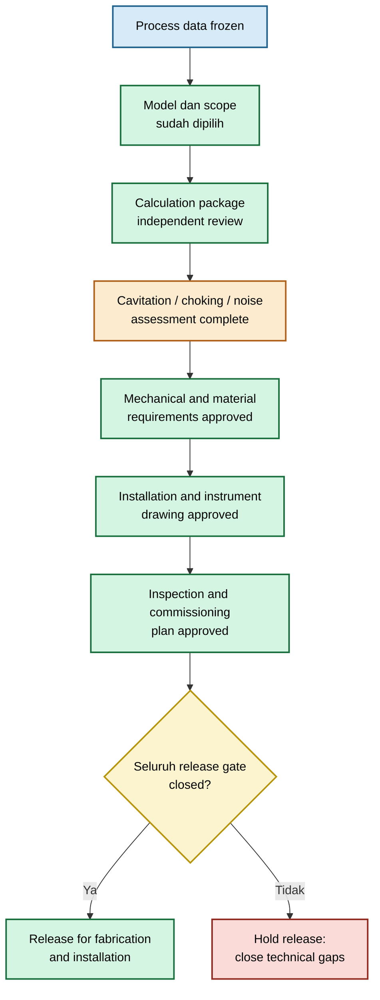

## 13.1 Dokumen minimum final design package

| Dokumen                          | Isi minimum                                                                        | Release criterion                    |
| -------------------------------- | ---------------------------------------------------------------------------------- | ------------------------------------ |
| Process data sheet               | Fluid, composition, flow range, P/T envelope, density, viscosity, vapor pressure   | Data disetujui process engineer      |
| Geometry drawing                 | (D), (d), (t), bevel, edge, tolerance, concentricity, orientation                  | Drawing revision terkendali          |
| Material specification           | Material grade, corrosion requirement, erosion resistance, certificate requirement | Material sesuai service              |
| Pressure rating                  | Plate, holder, flange, gasket, manifold, transmitter rating                        | Sesuai design P/T                    |
| Calculation sheet                | Model, asumsi, input, equation, output, units, sensitivity                         | Independent technical review selesai |
| Standard applicability statement | Standard yang dipakai, scope, tapping, geometry, installation limitations          | Tidak ada claim tanpa bukti          |
| Uncertainty statement            | Untuk metering: contributors, range, coverage basis                                | Sesuai measurement objective         |
| Cavitation check                 | $p_v$, $p_{\min}$, pressure recovery, margin, mitigation                           | Aman atau mitigasi disetujui         |
| Choking check                    | Pressure ratio, sonic risk, mass-flow limit                                        | Aman pada seluruh operating envelope |
| Noise/vibration check            | Jet velocity, Mach screening, acoustic and fatigue review                          | Risiko dapat diterima                |
| Installation drawing             | Straight run, tapping, orientation, support, flow conditioner                      | Cocok dengan calculation basis       |
| Instrument drawing               | DP transmitter, manifold, impulse line, vent/drain, condensate pot                 | Sesuai fluid service                 |
| Inspection plan                  | Bore, edge, gasket, centering, material certificate, traceability                  | Hold point dan acceptance clear      |
| Commissioning checklist          | Mechanical, instrument, DCS, baseline-data verification                            | Siap digunakan di lapangan           |
| Maintenance plan                 | Inspection trigger, cleaning method, replacement basis, spare plate strategy       | Disetujui operations dan maintenance |

## 13.2 Process data sheet requirement

Process data sheet minimal harus memuat:

| Parameter         | Minimum requirement                                             |
| ----------------- | --------------------------------------------------------------- |
| Flow              | Minimum, normal, maximum, upset flow                            |
| Pressure          | Upstream dan downstream minimum, normal, maksimum               |
| Temperature       | Minimum, normal, maksimum                                       |
| Fluid             | Komposisi, density, viscosity, vapor pressure                   |
| Gas property      | Molecular mass, (Z), $\gamma$, condensable components           |
| Liquid property   | Solids, corrosion tendency, fouling tendency, gas entrainment   |
| Operating mode    | Continuous, intermittent, startup, shutdown, blowdown           |
| Design objective  | Metering, restriction, balancing, distribution, purge           |
| Required accuracy | Jika flow measurement adalah tujuan utama                       |
| Allowable loss    | Permanent pressure loss atau energy penalty                     |
| Safety limit      | Cavitation, choking, noise, downstream equipment pressure limit |

## 13.3 Calculation-package release checklist

| Item                                                                                          | Yes/No |
| --------------------------------------------------------------------------------------------- | ------ |
| Fungsi plate telah diklasifikasikan sebagai flowmeter, restriction, short tube, atau diffuser |        |
| Semua pressure dinyatakan sebagai gauge atau absolute dengan konsisten                        |        |
| Actual flow, standard flow, dan mass flow dibedakan dengan jelas                              |        |
| Pipe ID menggunakan nilai aktual, bukan nominal pipe size                                     |        |
| Bore diameter berasal dari drawing dan inspection basis yang sama                             |        |
| Tapping arrangement didefinisikan                                                             |        |
| (C), $C_d$, (K), atau $\varepsilon$ memiliki basis yang terdokumentasi                        |        |
| Unit check dilakukan                                                                          |        |
| Reynolds number yang relevan dihitung                                                         |        |
| Gas telah diperiksa terhadap compressibility dan choking                                      |        |
| Liquid telah diperiksa terhadap vapor pressure, cavitation, dan flashing                      |        |
| Permanent pressure loss dipisahkan dari measured DP                                           |        |
| Sensitivity terhadap bore diameter dan pressure drop telah dihitung                           |        |
| Warning dan batas penggunaan dicantumkan                                                      |        |
| Calculation telah direview oleh engineer independen                                           |        |

## 13.4 Mechanical and material release checklist

| Item              | Verifikasi                                                     |
| ----------------- | -------------------------------------------------------------- |
| Plate material    | Grade, heat number, certificate, corrosion compatibility       |
| Thickness         | Cukup terhadap differential pressure dan handling              |
| Holder/carrier    | Menahan plate tanpa movement atau deformation                  |
| Flange rating     | Sesuai pressure-temperature rating                             |
| Gasket            | Material, ID, thickness, compression, chemical compatibility   |
| Bore tolerance    | Sesuai calculation basis dan inspection method                 |
| Edge condition    | Sharp edge atau rounded inlet sesuai drawing                   |
| Bevel orientation | Di sisi yang benar                                             |
| Concentricity     | Sesuai standard atau project tolerance                         |
| Surface finish    | Sesuai short-tube, micro-orifice, atau metering requirement    |
| Erosion allowance | Diperiksa untuk slurry, cavitation, atau high-velocity service |

## 13.5 Instrument and installation release checklist

| Item                        | Verifikasi                                                    |
| --------------------------- | ------------------------------------------------------------- |
| Pressure taps               | Type, location, diameter, orientation, accessibility          |
| DP transmitter              | Range, accuracy, turndown, pressure rating, material          |
| Static pressure measurement | Tersedia bila density/flow calculation memerlukan             |
| Temperature measurement     | Tersedia dan representative                                   |
| Impulse lines               | Slope, support, insulation, tracing, vent, drain              |
| Steam service               | Condensate pots, equal elevation, filling procedure           |
| Liquid service              | Gas pocket prevention and venting                             |
| Gas service                 | Condensate drainage and low-point management                  |
| Manifold                    | Isolation, equalization, vent/drain, maintenance access       |
| Flow computer               | Square-root extraction, density compensation, base conditions |
| Straight run                | Verified against design basis                                 |
| Flow conditioner            | Type, location, pressure loss, maintenance access             |
| Plate orientation           | Arrow and upstream marking visible at installation            |

## 13.6 Inspection and commissioning release checklist

| Tahap            | Deliverable                                                                 |
| ---------------- | --------------------------------------------------------------------------- |
| Fabrication      | Material certificate, dimensional report, bore measurement, edge inspection |
| Pre-installation | Plate tag verification, gasket fit-up, flange inspection                    |
| Installation     | Orientation, centering, bolting, impulse-line routing                       |
| Loop check       | Transmitter calibration, manifold function, DCS scaling                     |
| Commissioning    | Zero check, line fill, leak test, baseline DP/P/T/Q recording               |
| Handover         | As-built drawing, punch-list closure, maintenance plan, spare plate record  |

## 13.7 Maintenance interval strategy

Maintenance interval tidak boleh ditetapkan hanya berdasarkan kalender. Gunakan pendekatan berbasis risiko:

$$
I_{\mathrm{inspection}}
=

f
\left(
\text{erosivity},
\text{fouling tendency},
\text{criticality},
\text{historical drift},
\text{operating hours},
\text{failure consequence}
\right)
$$

Contoh trigger inspection:

| Trigger                                      | Tindakan                                                      |
| -------------------------------------------- | ------------------------------------------------------------- |
| DP trend berubah signifikan pada flow setara | Inspect plate dan impulse system                              |
| Flow discrepancy dengan reference meter      | Verify geometry, configuration, and transmitter               |
| Noise atau vibration meningkat               | Check choking, cavitation, holder, and downstream piping      |
| Service berubah                              | Revalidate model dan material                                 |
| Shutdown terjadwal                           | Inspect bore, edge, gasket, holder, and deposits              |
| Plate diganti                                | Update tag, drawing, inspection record, and calculation basis |

## 13.8 Kondisi yang menahan technical release

Technical release harus ditahan bila salah satu kondisi berikut belum selesai:

- bore diameter belum diverifikasi;
- $C_d$, (C), atau (K) tidak memiliki basis;
- standard applicability belum ditetapkan;
- pressure tapping tidak didefinisikan;
- gas tidak diperiksa terhadap choking;
- liquid tidak diperiksa terhadap cavitation;
- downstream pressure tidak diverifikasi;
- material belum diperiksa terhadap corrosion atau erosion;
- plate holder belum diperiksa terhadap differential pressure;
- installation drawing tidak sesuai calculation basis;
- inspection dan commissioning plan belum tersedia;
- CFD digunakan tanpa mesh check, pressure-drop convergence, atau validation basis.

### Rujukan Bab 13

- **[R13-1]** ISO 5167-1 dan ISO 5167-2.
- **[R13-2]** ASME MFC-3M.
- **[R13-3]** API 521 untuk depressuring dan gas restriction service yang relevan.
- **[R13-4]** ASME V&V 20 untuk CFD verification and validation.
- **[R13-5]** Project quality plan, fabrication specification, and instrument installation standard.

[**Kembali ke Atas**](#orifice-plate-geometry-flow-equation-installation-and-field-engineering-practice)

---

# Appendix

## Appendix A — Daftar Simbol dan Satuan SI

| Simbol                     | Definisi                                           |                                  Satuan SI |
| -------------------------- | -------------------------------------------------- | -----------------------------------------: |
| $A_o$                      | Physical bore area                                 |                             $\mathrm{m^2}$ |
| $A_p$                      | Pipe internal cross-sectional area                 |                             $\mathrm{m^2}$ |
| $A_c$                      | Vena-contracta jet area                            |                             $\mathrm{m^2}$ |
| (a)                        | Local speed of sound                               |                             $\mathrm{m/s}$ |
| (C)                        | Standard flowmeter discharge coefficient           |                                          – |
| $C_d$                      | Discharge coefficient untuk restriction/short tube |                                          – |
| $C_c$                      | Coefficient of contraction                         |                                          – |
| $C_{p,\min}$               | Local minimum pressure coefficient                 |                                          – |
| $C_{\mathrm{pr}}$          | Pressure-recovery coefficient                      |                                          – |
| (D)                        | Actual pipe internal diameter                      |                                          m |
| (d)                        | Bore diameter                                      |                                          m |
| (e)                        | Bore eccentricity terhadap pipe axis               |                                          m |
| (f)                        | Darcy friction factor, sesuai definisi metode      |                                          – |
| (g)                        | Acceleration due to gravity                        |                           $\mathrm{m/s^2}$ |
| (h)                        | Elevation atau liquid depth                        |                                          m |
| (K)                        | Loss coefficient                                   |                                          – |
| $L_e$                      | Effective bore length                              |                                          m |
| (M)                        | Mach number atau molecular mass, sesuai konteks    |                                          – |
| $\dot m$                   | Mass flow rate                                     |                            $\mathrm{kg/s}$ |
| (p)                        | Static pressure                                    |                                         Pa |
| $p_v$                      | Vapor pressure                                     |                                      Pa(a) |
| $p_1$                      | Upstream reference pressure                        |                                      Pa(a) |
| $p_2$                      | Downstream/backpressure reference                  |                                      Pa(a) |
| $p_3$                      | Recovered downstream pressure                      |                                      Pa(a) |
| $p_{\min}$                 | Local minimum pressure                             |                                      Pa(a) |
| (Q)                        | Actual volumetric flow rate                        |                           $\mathrm{m^3/s}$ |
| $Q_b$                      | Base/standard volumetric flow                      |                           $\mathrm{m^3/s}$ |
| (R)                        | Universal gas constant                             | $\mathrm{J}/(\mathrm{mol}\cdot\mathrm{K})$ |
| $R_s$                      | Specific gas constant                              |  $\mathrm{J}/(\mathrm{kg}\cdot\mathrm{K})$ |
| $\mathrm{Re}$              | Reynolds number                                    |                                          – |
| (t)                        | Plate thickness                                    |                                          m |
| (T)                        | Absolute temperature                               |                                          K |
| $u_c$                      | Combined standard uncertainty                      |                           sesuai measurand |
| (U)                        | Expanded uncertainty                               |                           sesuai measurand |
| (V)                        | Mean velocity                                      |                             $\mathrm{m/s}$ |
| (Z)                        | Gas compressibility factor                         |                                          – |
| $\beta$                    | Beta ratio, $d/D$                                  |                                          – |
| $\Delta p$                 | Differential pressure                              |                                         Pa |
| $\Delta p_{\mathrm{perm}}$ | Permanent pressure loss                            |                                         Pa |
| $\varepsilon$              | Expansibility factor                               |                                          – |
| $\mu$                      | Dynamic viscosity                                  |               $\mathrm{Pa}\cdot\mathrm{s}$ |
| $\rho$                     | Density                                            |                          $\mathrm{kg/m^3}$ |
| $\sigma$                   | Cavitation index                                   |                                          – |
| $\gamma$                   | Ratio of specific heats                            |                                          – |
| $\varepsilon_r$            | Relative roughness                                 |                                          – |

---

## Appendix B — Unit Conversion yang Aman

### Pressure

| Unit                 |                Nilai dalam Pa |
| -------------------- | ----------------------------: |
| $1\ \mathrm{Pa}$     |              $1\ \mathrm{Pa}$ |
| $1\ \mathrm{kPa}$    |           $10^3\ \mathrm{Pa}$ |
| $1\ \mathrm{MPa}$    |           $10^6\ \mathrm{Pa}$ |
| $1\ \mathrm{bar}$    |           $10^5\ \mathrm{Pa}$ |
| $1\ \mathrm{mbar}$   |            $100\ \mathrm{Pa}$ |
| $1\ \mathrm{atm}$    |      $101{,}325\ \mathrm{Pa}$ |
| $1\ \mathrm{psi}$    |    $6{,}894.757\ \mathrm{Pa}$ |
| $1\ \mathrm{mmH_2O}$ | $\approx9.80665\ \mathrm{Pa}$ |

Nilai mmH$_2$O adalah pendekatan berbasis conventional water column. Untuk perhitungan akurat, perhatikan temperatur air dan definisi referensi.

### Flow rate

| Unit                 |                               Konversi |
| -------------------- | -------------------------------------: |
| $1\ \mathrm{m^3/h}$  | $2.77778\times10^{-4}\ \mathrm{m^3/s}$ |
| $1\ \mathrm{L/min}$  | $1.66667\times10^{-5}\ \mathrm{m^3/s}$ |
| $1\ \mathrm{L/s}$    |              $10^{-3}\ \mathrm{m^3/s}$ |
| $1\ \mathrm{kg/h}$   |  $2.77778\times10^{-4}\ \mathrm{kg/s}$ |
| $1\ \mathrm{kg/min}$ |  $1.66667\times10^{-2}\ \mathrm{kg/s}$ |

### Length and area

| Unit                |                Konversi |
| ------------------- | ----------------------: |
| $1\ \mathrm{mm}$    |   $10^{-3}\ \mathrm{m}$ |
| $1\ \mathrm{\mu m}$ |   $10^{-6}\ \mathrm{m}$ |
| $1\ \mathrm{inch}$  |    $0.0254\ \mathrm{m}$ |
| $1\ \mathrm{mm^2}$  | $10^{-6}\ \mathrm{m^2}$ |

### Viscosity

| Unit                             |                              Konversi |
| -------------------------------- | ------------------------------------: |
| $1\ \mathrm{cP}$                 | $10^{-3}\ \mathrm{Pa}\cdot\mathrm{s}$ |
| $1\ \mathrm{mPa}\cdot\mathrm{s}$ | $10^{-3}\ \mathrm{Pa}\cdot\mathrm{s}$ |
| $1\ \mathrm{cSt}$                |             $10^{-6}\ \mathrm{m^2/s}$ |

### Temperature

$$
T[\mathrm{K}]
=

t[^\circ\mathrm{C}]
+
273.15
$$

Gunakan temperature absolut dalam seluruh persamaan gas:

$$
T
\neq
^\circ\mathrm{C}
$$

### Checklist unit safety

- Jangan mencampur gauge pressure dan absolute pressure pada gas/choking/cavitation calculation.
- Jangan mencampur actual flow dengan standard flow.
- Jangan memakai nominal pipe size sebagai diameter internal.
- Jangan memakai mm untuk diameter di persamaan SI tanpa konversi ke meter.
- Jangan menulis $m^3/h$ untuk gas tanpa menyatakan basis pressure dan temperature.

---

## Appendix C — Decision Tree Pemilihan Model

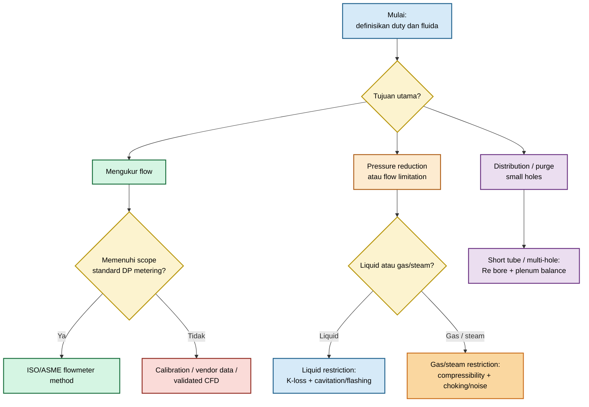

---

## Appendix D — Datasheet Template

### D.1 General data

| Field                                          | Input                                      |
| ---------------------------------------------- | ------------------------------------------ |
| Tag number                                     |                                            |
| Service description                            |                                            |
| Function                                       | Flowmeter / restriction / diffuser / purge |
| Fluid                                          |                                            |
| Fluid phase                                    |                                            |
| Flow minimum / normal / maximum                |                                            |
| Upstream pressure minimum / normal / maximum   |                                            |
| Downstream pressure minimum / normal / maximum |                                            |
| Temperature minimum / normal / maximum         |                                            |
| Density                                        |                                            |
| Viscosity                                      |                                            |
| Vapor pressure                                 |                                            |
| Gas composition, (Z), $\gamma$, molecular mass |                                            |
| Required flow accuracy                         |                                            |
| Allowable permanent pressure loss              |                                            |
| Cavitation/choking/noise limit                 |                                            |

### D.2 Geometry and material

| Field                        | Input |
| ---------------------------- | ----- |
| Pipe material and schedule   |       |
| Actual pipe ID, (D)          |       |
| Bore diameter, (d)           |       |
| Beta ratio, $\beta$          |       |
| Plate thickness, (t)         |       |
| Effective bore length, $L_e$ |       |
| Upstream edge condition      |       |
| Downstream bevel             |       |
| Bore roughness               |       |
| Concentricity tolerance      |       |
| Flatness tolerance           |       |
| Plate material               |       |
| Holder/carrier material      |       |
| Gasket type and ID           |       |
| Pressure-temperature rating  |       |

### D.3 Instrumentation and installation

| Field                        | Input |
| ---------------------------- | ----- |
| Pressure tapping arrangement |       |
| DP transmitter range         |       |
| Static pressure transmitter  |       |
| Temperature transmitter      |       |
| Flow computer basis          |       |
| Actual/base flow definition  |       |
| Impulse line material        |       |
| Vent/drain arrangement       |       |
| Condensate pot requirement   |       |
| Straight run basis           |       |
| Upstream disturbance         |       |
| Flow conditioner             |       |
| Plate orientation marking    |       |
| Inspection hold points       |       |

---

## Appendix E — Calculation Templates

### E.1 Liquid restriction template

#### Input

$$
Q,\quad
\rho,\quad
\mu,\quad
p_1,\quad
p_3,\quad
p_v,\quad
D,\quad
d,\quad
K_{p,1\rightarrow3}
$$

#### Core calculation

$$
A_p
=

\frac{\pi D^2}{4}
$$

$$
A_o
=

\frac{\pi d^2}{4}
$$

$$
V_{pipe}
=

\frac{Q}{A_p}
$$

$$
V_{bore}
=

\frac{Q}{A_o}
$$

$$
\Delta p_{\mathrm{perm}}
=

K_{p,1\rightarrow3}
\frac{
\rho V_{pipe}^2
}{
2
}
$$

#### Cavitation screening

$$
p_{\min}
=

p_1
+
C_{p,\min}
\left(
\frac{
\rho V_{bore}^2
}{
2
}
\right)
$$

Check:

$$
p_{\min}

>

p_v
+
\Delta p_{\mathrm{margin}}
$$

### E.2 Gas restriction template

#### Input

$$
p_1,\quad
p_2,\quad
T_1,\quad
\gamma,\quad
R_s,\quad
C_d,\quad
A_o
$$

#### Critical pressure ratio

$$
\left(
\frac{p_2}{p_1}
\right)_{\mathrm{crit}}
=

\left(
\frac{2}{\gamma+1}
\right)^{
\frac{\gamma}{\gamma-1}
}
$$

#### Non-choked preliminary mass flow

$$
\dot m
=

C_dA_op_1
\sqrt{
\frac{
2\gamma
}{
R_sT_1(\gamma-1)
}
\left[
\left(
\frac{p_2}{p_1}
\right)^{
2/\gamma
}
-

\left(
\frac{p_2}{p_1}
\right)^{
(\gamma+1)/\gamma
}
\right]
}
$$

#### Choked ideal-gas screening

$$
\dot m_{\mathrm{crit}}
=

C_dA_op_1
\sqrt{
\frac{
\gamma
}{
R_sT_1
}
}
\left(
\frac{2}{\gamma+1}
\right)^{
\frac{
\gamma+1
}{
2(\gamma-1)
}
}
$$

Gunakan real-gas method atau approved vendor software untuk final design natural gas, hydrocarbon gas, steam, atau high-pressure gas.

### E.3 Short-tube template

#### Input

$$
d,\quad
L_e,\quad
\rho,\quad
\mu,\quad
\Delta p,\quad
K_{\mathrm{entrance}},\quad
K_{\mathrm{exit}},\quad
f
$$

#### Total loss coefficient

$$
K_{\mathrm{total}}
=

K_{\mathrm{entrance}}
+
f\frac{L_e}{d}
+
K_{\mathrm{exit}}
+
K_{\mathrm{additional}}
$$

#### Flow estimate

$$
Q
=

A_o
\sqrt{
\frac{
2\Delta p
}{
\rho K_{\mathrm{total}}
}
}
$$

Equivalent discharge coefficient:

$$
C_d
=

\frac{1}{\sqrt{K_{\mathrm{total}}}}
$$

### E.4 Multi-hole plate template

#### Identical-hole approximation

$$
Q_{\mathrm{total}}
=

NQ_{\mathrm{hole}}
$$

dengan:

$$
Q_{\mathrm{hole}}
=

C_dA_o
\sqrt{
\frac{
2\Delta p_{\mathrm{hole}}
}{
\rho
}
}
$$

#### Non-uniform plenum condition

$$
Q_{\mathrm{total}}
=

\sum_{i=1}^{N}
Q_i
$$

$$
Q_i
=

C_{d,i}A_{o,i}
\sqrt{
\frac{
2
\left(
p_{\mathrm{plenum},i}
-

p_{\mathrm{back},i}
\right)
}{
\rho_i
}
}
$$

Untuk gas dengan pressure ratio besar, gunakan compressible-flow relation pada setiap hole.

---

## Appendix F — Inspection Checklist Plate dan Transmitter

### F.1 Plate inspection checklist

| Item                                     | Pass/Fail | Catatan |
| ---------------------------------------- | --------- | ------- |
| Plate tag sesuai drawing                 |           |         |
| Material certificate tersedia            |           |         |
| Bore diameter diukur multi-axis          |           |         |
| Bore circularity diperiksa               |           |         |
| Edge tajam/tidak rusak                   |           |         |
| Tidak ada burr                           |           |         |
| Bevel berada pada sisi benar             |           |         |
| Plate thickness sesuai drawing           |           |         |
| Flatness diperiksa                       |           |         |
| Bore concentric terhadap pipe            |           |         |
| Plate tidak erosi, pitting, atau fouling |           |         |
| Flow arrow/upstream marking terlihat     |           |         |
| Gasket tidak intrude ke bore             |           |         |
| Holder dan flange tidak rusak            |           |         |

### F.2 DP transmitter checklist

| Item                                           | Pass/Fail | Catatan |
| ---------------------------------------------- | --------- | ------- |
| Tag transmitter sesuai drawing                 |           |         |
| Range sesuai calculation basis                 |           |         |
| Calibration certificate valid                  |           |         |
| High-side dan low-side connection benar        |           |         |
| Manifold lineup benar                          |           |         |
| Impulse line slope benar                       |           |         |
| Vent/drain tersedia dan dapat diakses          |           |         |
| Tidak ada gas pocket pada liquid service       |           |         |
| Tidak ada liquid accumulation pada gas service |           |         |
| Condensate pots steam simetris                 |           |         |
| Zero check selesai                             |           |         |
| DCS scaling dan square-root extraction benar   |           |         |
| Pressure-temperature compensation benar        |           |         |
| Leak test selesai                              |           |         |

---

## Appendix G — CFD Validation Checklist

| Area                  | Pemeriksaan                                                                                     |
| --------------------- | ----------------------------------------------------------------------------------------------- |
| Objective             | Quantity of interest didefinisikan: DP, pressure recovery, $p_{\min}$, flow split, jet velocity |
| Geometry              | Bore, edge, thickness, bevel, gasket, pipe ID, plenum, fittings representatif                   |
| Domain                | Upstream development dan downstream recovery length memadai                                     |
| Mesh                  | Minimum tiga tingkat mesh atau refinement study tersedia                                        |
| Near-wall treatment   | Target $y^+$ konsisten dengan turbulence model                                                  |
| Turbulence model      | Alasan pemilihan dan sensitivity study terdokumentasi                                           |
| Compressibility       | Diaktifkan untuk gas bila density/temperature berubah material                                  |
| Multiphase            | Model justified bila bubble/cavitation menjadi target                                           |
| Boundary conditions   | Flow, pressure, temperature, turbulence, backpressure representatif                             |
| Convergence           | Residual, monitor DP, flow split, dan mass balance stabil                                       |
| Mass balance          | Inlet-outlet mass imbalance dilaporkan                                                          |
| Analytical comparison | Dibandingkan dengan continuity, loss model, atau compressible-flow screening                    |
| Validation            | Dibandingkan dengan test, vendor data, atau benchmark relevan                                   |
| Limitations           | Semua simplifikasi dan uncertainty CFD dinyatakan                                               |
| Decision relevance    | Rekomendasi desain dibatasi pada evidence yang tersedia                                         |

### Rujukan Appendix

- ISO 5167-1 dan ISO 5167-2.
- ASME MFC-3M.
- ASME V&V 20.
- Crane TP-410.
- Idelchik, _Handbook of Hydraulic Resistance_.
- API 521.
- JCGM 100, _Guide to the Expression of Uncertainty in Measurement_.

[**Kembali ke Atas**](#orifice-plate-geometry-flow-equation-installation-and-field-engineering-practice)

---

# Rujukan Teknis yang Harus Menjadi Tulang Punggung

Gunakan rujukan berikut pada tingkat klaim, bukan hanya sebagai daftar pustaka akhir:

| Topik                                                  | Rujukan utama                                   |
| ------------------------------------------------------ | ----------------------------------------------- |
| Standard differential-pressure flowmeter               | ISO 5167-1 dan ISO 5167-2                       |
| Metode orifice/nozzle/venturi ASME                     | ASME MFC-3M                                     |
| Natural gas orifice metering                           | AGA Report No. 3 dan API MPMS Chapter 14.3      |
| Restriction loss, fittings, dan piping hydraulics      | Crane TP-410                                    |
| Hydraulic resistance dan loss coefficients             | Idelchik, _Handbook of Hydraulic Resistance_    |
| Flow measurement engineering practice                  | Miller, _Flow Measurement Engineering Handbook_ |
| Depressuring, blowdown, dan relief-related restriction | API 521                                         |
| Erosion velocity and piping service                    | API RP 14E, bila relevan                        |
| CFD verification and validation                        | ASME V&V 20                                     |

Sebelum publikasi, tahun edisi dan amendment setiap standar perlu diverifikasi langsung pada penerbit resmi ISO, ASME, API, dan AGA karena saya tidak dapat memeriksa status edisi terkini secara daring pada sesi ini.

---

<small>
  **_Catatan Penyusunan_** Artikel ini disusun sebagai materi edukasi dan
  referensi umum berdasarkan berbagai sumber pustaka, praktik lapangan, serta
  bantuan alat penulisan. Pembaca disarankan untuk melakukan verifikasi lanjutan
  dan penyesuaian sesuai dengan kondisi serta kebutuhan masing-masing sistem.
</small>
