# **_Orifice Plate: Geometry, Flow Equation, Installation, and Field Engineering Practice_**

---

- [**_Orifice Plate: Geometry, Flow Equation, Installation, and Field Engineering Practice_**](#orifice-plate-geometry-flow-equation-installation-and-field-engineering-practice)
- [1. Physical Geometry](#1-physical-geometry)
  - [Tujuan](#tujuan)
  - [Engineering Diagram](#engineering-diagram)
  - [Plate](#plate)
  - [Bore](#bore)
  - [Plate Thickness](#plate-thickness)
  - [Sharp Edge](#sharp-edge)
  - [Bevel](#bevel)
  - [Concentricity](#concentricity)
  - [Gasket Clearance](#gasket-clearance)
  - [Beta Ratio](#beta-ratio)
  - [Thickness-to-Diameter Ratio $t/d$](#thickness-to-diameter-ratio-td)
  - [Parameter Geometrik Utama](#parameter-geometrik-utama)
  - [Output](#output)
- [2. Flow Physics](#2-flow-physics)
  - [Tujuan](#tujuan-1)
  - [Engineering Diagram](#engineering-diagram-1)
  - [Continuity](#continuity)
  - [Bernoulli](#bernoulli)
  - [Acceleration](#acceleration)
  - [Pressure Reduction](#pressure-reduction)
  - [Vena Contracta](#vena-contracta)
  - [Pressure Recovery](#pressure-recovery)
  - [Permanent Pressure Loss](#permanent-pressure-loss)
  - [Pressure Profile Sepanjang Orifice](#pressure-profile-sepanjang-orifice)
  - [Hubungan Fisika yang Terbentuk](#hubungan-fisika-yang-terbentuk)
  - [Output](#output-1)
- [3. Flow Models](#3-flow-models)
  - [Tujuan](#tujuan-2)
  - [Engineering Diagram](#engineering-diagram-2)
  - [Thin Sharp Edge Orifice](#thin-sharp-edge-orifice)
    - [Karakteristik Geometri](#karakteristik-geometri)
    - [Discharge Coefficient](#discharge-coefficient)
    - [Model](#model)
  - [Aplikasi](#aplikasi)
  - [Kelebihan](#kelebihan)
  - [Keterbatasan](#keterbatasan)
  - [Thick Plate Orifice](#thick-plate-orifice)
    - [Karakteristik Geometri](#karakteristik-geometri-1)
    - [Discharge Coefficient](#discharge-coefficient-1)
    - [Model](#model-1)
  - [Aplikasi](#aplikasi-1)
  - [Keterbatasan](#keterbatasan-1)
  - [Short Tube](#short-tube)
    - [Karakteristik Geometri](#karakteristik-geometri-2)
    - [Discharge Coefficient](#discharge-coefficient-2)
  - [Model](#model-2)
  - [Aplikasi](#aplikasi-2)
  - [Restriction Orifice](#restriction-orifice)
    - [Karakteristik](#karakteristik)
    - [Model](#model-3)
  - [Aplikasi](#aplikasi-3)
  - [Small Hole](#small-hole)
    - [Karakteristik](#karakteristik-1)
    - [Model](#model-4)
  - [Contoh Diffuser Udara](#contoh-diffuser-udara)
  - [Karakteristik Penting](#karakteristik-penting)
  - [Pemilihan Model](#pemilihan-model)
  - [Batas Penggunaan Model](#batas-penggunaan-model)
  - [Output](#output-2)
- [4. Differential Pressure Behaviour](#4-differential-pressure-behaviour)
  - [Tujuan](#tujuan-3)
  - [Engineering Diagram](#engineering-diagram-3)
  - [Flow vs Differential Pressure](#flow-vs-differential-pressure)
  - [Contoh](#contoh-1)
  - [Flow vs DP Curve](#flow-vs-dp-curve)
  - [Differential Pressure vs Flow](#differential-pressure-vs-flow)
  - [Contoh](#contoh-2)
  - [DP vs Flow Behaviour](#dp-vs-flow-behaviour)
  - [Turn-Down Limitation](#turn-down-limitation)
    - [Contoh](#contoh-3)
  - [Turn-Down Illustration](#turn-down-illustration)
  - [Sensitivity](#sensitivity)
  - [Pressure Loss](#pressure-loss)
  - [Pressure Behaviour Through Orifice](#pressure-behaviour-through-orifice)
  - [Differential Pressure Behaviour Summary](#differential-pressure-behaviour-summary)
  - [Output](#output-3)
- [5. Installation Requirements](#5-installation-requirements)
  - [Tujuan](#tujuan-4)
  - [Engineering Diagram](#engineering-diagram-4)
  - [Straight Run](#straight-run)
    - [Fungsi](#fungsi)
  - [Pengaruh Profil Kecepatan](#pengaruh-profil-kecepatan)
  - [Straight Run Requirement](#straight-run-requirement)
  - [Pressure Tapping](#pressure-tapping)
  - [Fungsi Tapping](#fungsi-tapping)
  - [Tapping Arrangement](#tapping-arrangement)
  - [Orientation](#orientation)
  - [Plate Orientation](#plate-orientation)
  - [Flow Direction Verification](#flow-direction-verification)
  - [Manifold Arrangement](#manifold-arrangement)
  - [Typical Arrangement](#typical-arrangement)
  - [Impulse Line](#impulse-line)
  - [Impulse Line Behaviour](#impulse-line-behaviour)
  - [Sealing](#sealing)
  - [Pengaruh Kebocoran](#pengaruh-kebocoran)
  - [Installation Verification Logic](#installation-verification-logic)
  - [Checklist Instalasi](#checklist-instalasi)
  - [Output](#output-4)
- [6. Operational Limits](#6-operational-limits)
  - [Tujuan](#tujuan-5)
  - [Engineering Diagram](#engineering-diagram-5)
  - [Reynolds Number](#reynolds-number)
    - [Definisi](#definisi)
  - [Pengaruh terhadap Discharge Coefficient](#pengaruh-terhadap-discharge-coefficient)
  - [Risiko Operasi](#risiko-operasi)
  - [Beta Ratio Limits](#beta-ratio-limits)
  - [Karakteristik](#karakteristik-2)
  - [Beta Terlalu Kecil](#beta-terlalu-kecil)
  - [Beta Terlalu Besar](#beta-terlalu-besar)
  - [Area Operasi Umum](#area-operasi-umum)
  - [t/d Limits](#td-limits)
    - [Definisi](#definisi-2)
    - [Klasifikasi](#klasifikasi)
    - [Interpretasi](#interpretasi)
  - [Cavitation](#cavitation)
    - [Definisi](#definisi-3)
    - [Lokasi](#lokasi)
    - [Mekanisme](#mekanisme)
    - [Dampak](#dampak)
  - [Erosion](#erosion)
    - [Penyebab](#penyebab)
    - [Hubungan Umum](#hubungan-umum)
    - [Area Kritis](#area-kritis)
    - [Konsekuensi](#konsekuensi)
    - [Definisi](#definisi-4)
  - [Choked Flow](#choked-flow)
  - [Aplikasi](#aplikasi-4)
  - [Compressibility Effect](#compressibility-effect)
    - [Fluida Cair](#fluida-cair)
    - [Fluida Gas](#fluida-gas)
  - [Operating Envelope Summary](#operating-envelope-summary)
  - [Output](#output-5)
- [7. Inspection and Degradation](#7-inspection-and-degradation)
  - [Tujuan](#tujuan-6)
  - [Engineering Diagram](#engineering-diagram-6)
  - [Bore Wear](#bore-wear)
    - [Definisi](#definisi-5)
    - [Mekanisme](#mekanisme-1)
  - [Titik Inspeksi](#titik-inspeksi)
  - [Kriteria](#kriteria)
  - [Edge Wear](#edge-wear)
    - [Definisi](#definisi-6)
    - [Mekanisme](#mekanisme-2)
    - [Penyebab](#penyebab-1)
    - [Titik Inspeksi](#titik-inspeksi-1)
  - [Fouling](#fouling)
    - [Definisi](#definisi-7)
    - [Mekanisme](#mekanisme-3)
    - [Dampak](#dampak-2)
    - [Titik Inspeksi](#titik-inspeksi-2)
  - [Plugging](#plugging)
    - [Definisi](#definisi-8)
    - [Mekanisme](#mekanisme-4)
    - [Dampak](#dampak-3)
    - [Titik Inspeksi](#titik-inspeksi-3)
  - [Corrosion](#corrosion)
    - [Definisi](#definisi-9)
    - [Mekanisme](#mekanisme-5)
    - [Bentuk Kerusakan](#bentuk-kerusakan)
    - [Dampak](#dampak-4)
    - [Titik Inspeksi](#titik-inspeksi-4)
  - [Mechanical Damage](#mechanical-damage)
    - [Definisi](#definisi-10)
    - [Penyebab](#penyebab-2)
    - [Mekanisme](#mekanisme-6)
    - [Bentuk Kerusakan](#bentuk-kerusakan-1)
    - [Titik Inspeksi](#titik-inspeksi-5)
  - [Inspection Workflow](#inspection-workflow)
  - [Inspection Checklist](#inspection-checklist)
  - [Degradation Summary](#degradation-summary)
  - [Output](#output-6)
- [8. Application Cases](#8-application-cases)
  - [Tujuan](#tujuan-7)
  - [Engineering Diagram](#engineering-diagram-7)
  - [Flow Measurement](#flow-measurement)
    - [Tujuan](#tujuan-8)
    - [Engineering Diagram](#engineering-diagram-8)
    - [Prinsip](#prinsip)
  - [Parameter Dominan](#parameter-dominan)
  - [Geometri yang Direkomendasikan](#geometri-yang-direkomendasikan)
  - [Fokus Engineer](#fokus-engineer)
  - [Contoh Aplikasi](#contoh-aplikasi)
  - [Restriction Service](#restriction-service)
    - [Tujuan](#tujuan-9)
    - [Engineering Diagram](#engineering-diagram-9)
    - [Prinsip](#prinsip-1)
  - [Parameter Dominan](#parameter-dominan-1)
  - [Geometri](#geometri)
  - [Fokus Engineer](#fokus-engineer-1)
  - [Contoh Aplikasi](#contoh-aplikasi-1)
  - [Aeration Diffuser](#aeration-diffuser)
    - [Tujuan](#tujuan-10)
    - [Engineering Diagram](#engineering-diagram-10)
    - [Prinsip](#prinsip-2)
  - [Model](#model-5)
  - [Parameter Dominan](#parameter-dominan-2)
  - [Fokus Engineer](#fokus-engineer-2)
  - [Contoh](#contoh-4)
  - [Gas Distribution](#gas-distribution)
    - [Tujuan](#tujuan-11)
    - [Engineering Diagram](#engineering-diagram-11)
    - [Prinsip](#prinsip-3)
    - [Model](#model-6)
  - [Parameter Dominan](#parameter-dominan-3)
  - [Fokus Engineer](#fokus-engineer-3)
  - [Contoh Aplikasi](#contoh-aplikasi-2)
  - [Application Selection Matrix](#application-selection-matrix)
  - [Mapping Application to Model](#mapping-application-to-model)
  - [Output](#output-7)
- [9. Example Engineering Calculations](#9-example-engineering-calculations)
  - [Tujuan](#tujuan-12)
  - [Case A — Orifice Flowmeter](#case-a--orifice-flowmeter)
    - [Problem Statement](#problem-statement)
    - [Engineering Diagram](#engineering-diagram-12)
    - [Step 1 — Bore Diameter](#step-1--bore-diameter)
  - [Step 2 — Bore Area](#step-2--bore-area)
  - [Step 3 — Flow Calculation](#step-3--flow-calculation)
  - [Result](#result)
  - [Case B — Restriction Orifice](#case-b--restriction-orifice)
    - [Problem Statement](#problem-statement-1)
    - [Engineering Diagram](#engineering-diagram-13)
    - [Step 1 — Area](#step-1--area)
  - [Step 2 — Flow](#step-2--flow)
  - [Result](#result-1)
  - [Case C — Air Diffuser Hole](#case-c--air-diffuser-hole)
    - [Problem Statement](#problem-statement-2)
    - [Engineering Diagram](#engineering-diagram-14)
    - [Step 1 — Geometry Verification](#step-1--geometry-verification)
  - [Step 2 — Hole Area](#step-2--hole-area)
  - [Step 3 — Differential Pressure Conversion](#step-3--differential-pressure-conversion)
  - [Step 4 — Flow Calculation](#step-4--flow-calculation)
  - [Result](#result-2)
  - [Diffuser Scaling Example](#diffuser-scaling-example)
    - [Total Air Flow](#total-air-flow)
  - [Engineering Comparison](#engineering-comparison)
  - [Output](#output-8)
- [10. Design Worksheet Appendix](#10-design-worksheet-appendix)
  - [Tujuan](#tujuan-13)
  - [Worksheet Architecture](#worksheet-architecture)
    - [Engineering Diagram](#engineering-diagram-15)
  - [Formula Sheet](#formula-sheet)
    - [Geometry](#geometry)
  - [Flow Measurement Model](#flow-measurement-model)
  - [Restriction Orifice Model](#restriction-orifice-model)
  - [Reynolds Number](#reynolds-number-1)
  - [Differential Pressure Verification](#differential-pressure-verification)
  - [Diffuser Total Flow](#diffuser-total-flow)
  - [CSV Template](#csv-template)
  - [Default Values](#default-values)
    - [Case A](#case-a)
    - [Case B](#case-b)
    - [Case C](#case-c)
  - [Validation Dataset](#validation-dataset)
    - [Validation A](#validation-a)
  - [Validation B](#validation-b)
  - [Validation C](#validation-c)
  - [Validation D](#validation-d)
  - [Expected Results Summary](#expected-results-summary)
  - [Warning Limits](#warning-limits)
    - [Beta Ratio Warning](#beta-ratio-warning)
    - [Reynolds Number Warning](#reynolds-number-warning)
    - [Thickness Ratio Warning](#thickness-ratio-warning)
    - [Diffuser Warning](#diffuser-warning)
    - [Velocity Warning](#velocity-warning)
    - [Pressure Drop Warning](#pressure-drop-warning)
  - [Excel Validation Logic](#excel-validation-logic)
    - [Geometry Check](#geometry-check)
    - [Reynolds Check](#reynolds-check)
    - [Thickness Ratio Check](#thickness-ratio-check)
    - [Diffuser Check](#diffuser-check)
  - [Worksheet Deliverables](#worksheet-deliverables)
  - [Output](#output-9)

---

# 1. Physical Geometry

## Tujuan

Memahami bentuk fisik orifice dan bagaimana geometri mempengaruhi perilaku aliran.

<figure>
  
  <figcaption>
    Ilustrasi konsep orifice untuk menunjukkan penyempitan aliran, perubahan
    tekanan, dan pengukuran laju alir pada sistem perpipaan.
  </figcaption>
</figure>

## Engineering Diagram

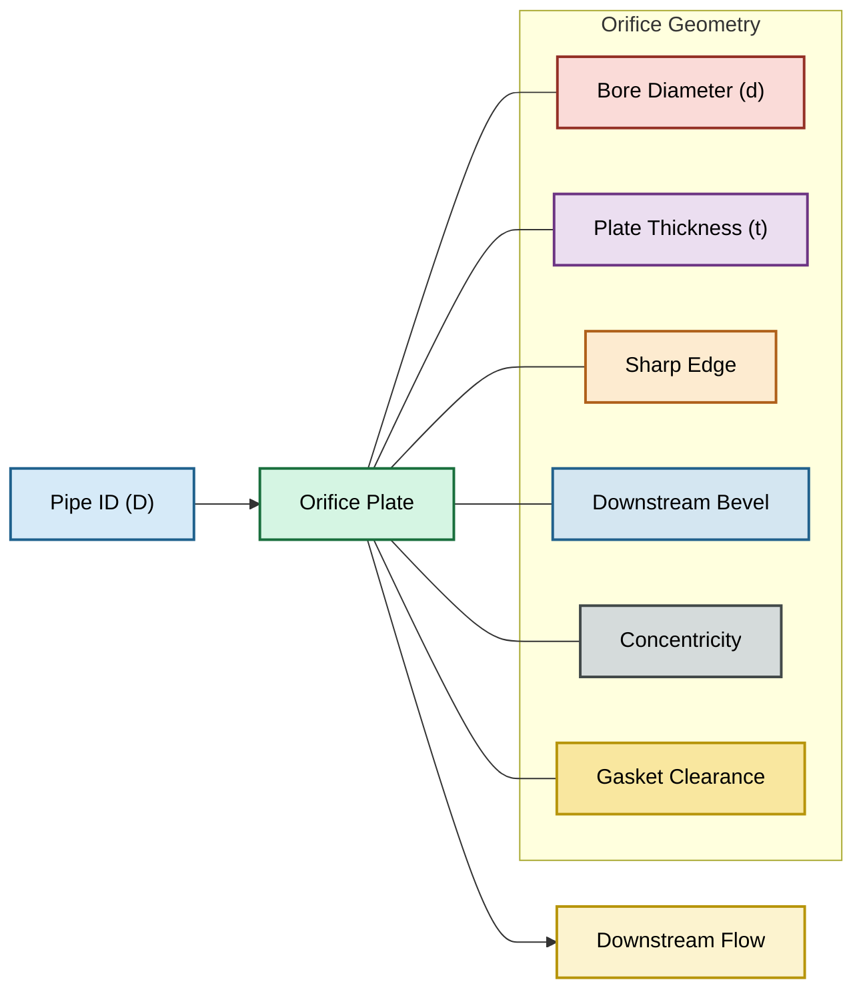

Geometri orifice menentukan bagaimana fluida dipercepat saat melewati penyempitan area. Pada banyak aplikasi industri, performa orifice lebih dipengaruhi oleh kualitas geometri dibandingkan kompleksitas model matematis yang digunakan.

## Plate

Orifice plate adalah elemen restriksi yang dipasang tegak lurus terhadap arah aliran.

Fungsi utama:

- menciptakan penyempitan area aliran
- menghasilkan differential pressure
- mengontrol atau mengukur flow

Material umum:

- Stainless Steel 304
- Stainless Steel 316
- Monel
- Hastelloy
- Carbon Steel

Pemilihan material ditentukan oleh:

- korosi
- temperatur operasi
- erosivitas fluida

## Bore

Bore adalah lubang utama tempat fluida melewati orifice.

Luas bore:

$$
A_o=\frac{\pi d^2}{4}
$$

Dimana:

$$
d = \text{diameter bore}
$$

Perubahan kecil pada diameter bore menghasilkan perubahan area yang signifikan karena hubungan kuadratik.

Sebagai contoh:

$$
d \uparrow 2\%
\Rightarrow
A_o \uparrow \approx 4\%
$$

## Plate Thickness

Ketebalan plate dinyatakan sebagai:

$$
t
$$

Parameter yang lebih penting adalah:

$$
\frac{t}{d}
$$

karena rasio ini menentukan klasifikasi geometri orifice.

## Sharp Edge

Sharp edge berada pada sisi upstream.

Karakteristik:

- sudut tajam
- tidak mengalami rounding
- menghasilkan vena contracta yang stabil

Sharp edge yang aus menyebabkan perubahan:

$$
C_d
$$

dan menghasilkan deviasi pengukuran flow.

## Bevel

Bevel dibuat pada sisi downstream.

Tujuan:

- mempertahankan sharp edge upstream
- mengurangi ketebalan efektif pada sisi masuk
- memperbaiki karakteristik aliran

Secara umum bevel tidak boleh mengubah diameter bore nominal.

## Concentricity

Concentricity menunjukkan kesesuaian posisi bore terhadap sumbu pipa.

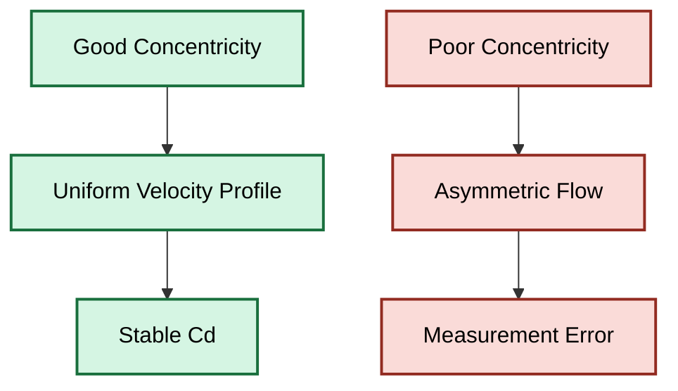

Semakin besar eksentrisitas:

- distribusi kecepatan semakin tidak simetris
- pressure profile berubah
- akurasi menurun

## Gasket Clearance

Gasket tidak boleh masuk ke area bore.

Kondisi yang benar:

$$
D_{\text{gasket}}

>

d
$$

Jika gasket menutupi sebagian bore:

$$
A_{\text{effective}}
<
A_o
$$

akibatnya flow aktual berbeda dari flow desain.

## Beta Ratio

Beta ratio merupakan parameter geometri terpenting dalam desain orifice.

Definisi:

$$
\beta=\frac{d}{D}
$$

Dimana:

- $d$ = bore diameter
- $D$ = pipe internal diameter

Hubungan area:

$$
\frac{A_o}{A_p}
=

\beta^2
$$

dengan:

$$
A_p=\frac{\pi D^2}{4}
$$

Secara umum:

| Beta Ratio  | Karakteristik           |
| ----------- | ----------------------- |
| < 0.30      | Restriksi sangat tinggi |
| 0.30 – 0.70 | Area operasi umum       |
| > 0.70      | Sensitivitas DP menurun |

## Thickness-to-Diameter Ratio $t/d$

Selain beta ratio, rasio berikut sangat penting:

$$
\frac{t}{d}
$$

Parameter ini menentukan apakah suatu elemen masih dapat dianggap sebagai thin sharp-edge orifice atau sudah berubah menjadi short tube.

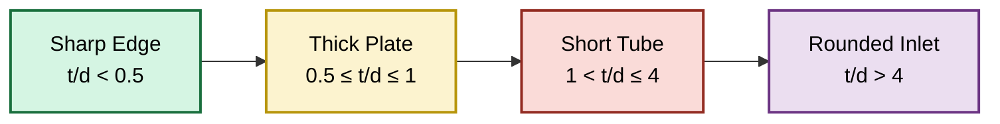

Contoh:

Diameter bore:

$$
d = 1\ \mathrm{mm}
$$

Plate thickness:

$$
t = 2\ \mathrm{mm}
$$

Maka:

$$
\frac{t}{d}
=

\frac{2}{1}
=

2
$$

Geometri tersebut masuk kategori:

**Short Tube**

bukan:

**Thin Sharp Edge Orifice**

## Parameter Geometrik Utama

| Parameter              | Simbol  | Unit |
| ---------------------- | ------- | ---- |
| Pipe Internal Diameter | $D$     | mm   |
| Bore Diameter          | $d$     | mm   |
| Plate Thickness        | $t$     | mm   |
| Beta Ratio             | $\beta$ | -    |
| Bore Area              | $A_o$   | mm²  |
| Pipe Area              | $A_p$   | mm²  |
| Thickness Ratio        | $t/d$   | -    |

## Output

Pada akhir bab ini pembaca harus dapat:

- mengidentifikasi komponen fisik orifice
- memahami pengaruh diameter bore terhadap area aliran
- memahami arti beta ratio
- memahami arti rasio $t/d$
- mengklasifikasikan geometri menjadi:

  - sharp edge orifice
  - thick plate orifice
  - short tube
  - rounded inlet restriction

[**Kembali ke Atas**](#orifice-plate-geometry-flow-equation-installation-and-field-engineering-practice)

---

# 2. Flow Physics

## Tujuan

Menjelaskan fenomena fisika yang terjadi ketika fluida melewati orifice.

## Engineering Diagram

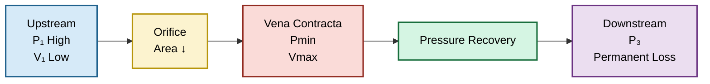

Saat fluida melewati orifice, fenomena yang terjadi bukan hanya penurunan tekanan.

Secara fisika terdapat urutan kejadian berikut:

1. Fluida mendekati orifice.
2. Area aliran menyempit.
3. Kecepatan meningkat.
4. Tekanan statis menurun.
5. Vena contracta terbentuk.
6. Tekanan pulih sebagian.
7. Sebagian energi hilang permanen.

Urutan inilah yang menjadi dasar seluruh model orifice.

## Continuity

Prinsip kontinuitas menyatakan bahwa massa yang masuk harus sama dengan massa yang keluar.

Untuk aliran tunak:

$$
\dot m = \rho A V
$$

Untuk dua lokasi:

$$
\rho_1 A_1 V_1
=

\rho_2 A_2 V_2
$$

Untuk fluida inkompresibel:

$$
A_1V_1=A_2V_2
$$

Ketika area mengecil:

$$
A_2<A_1
$$

maka:

$$
V_2>V_1
$$

Artinya penyempitan area menghasilkan percepatan aliran.

## Bernoulli

Energi aliran terdiri dari:

- energi tekanan
- energi kecepatan
- energi elevasi

Persamaan Bernoulli:

$$
P+\frac{1}{2}\rho V^2+\rho gz
=

\text{konstan}
$$

Untuk pipa horizontal:

$$
P+\frac{1}{2}\rho V^2
=

\text{konstan}
$$

Jika kecepatan meningkat:

$$
V \uparrow
$$

maka:

$$
P \downarrow
$$

Prinsip ini menjelaskan mengapa orifice menghasilkan differential pressure.

## Acceleration

Penyempitan area memaksa fluida mengalami percepatan.

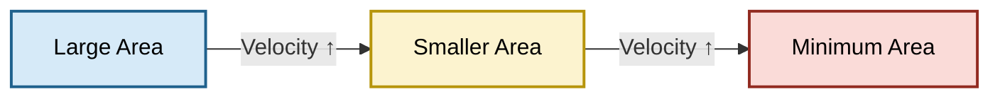

Hubungan kontinuitas:

$$
Q=AV
$$

Dengan debit konstan:

$$
A \downarrow
\Rightarrow
V \uparrow
$$

Semakin kecil bore:

$$
d \downarrow
$$

maka:

$$
V \uparrow
$$

## Pressure Reduction

Karena kecepatan meningkat, tekanan statis menurun.

Perubahan energi:

$$
\Delta P
\rightarrow
\Delta V
$$

Energi tekanan diubah menjadi energi kinetik.

Pada orifice:

$$
P_1>P_2
$$

Dimana:

- $P_1$ = upstream pressure
- $P_2$ = downstream tapping pressure

Pressure reduction inilah yang diukur oleh DP transmitter.

## Vena Contracta

Vena contracta adalah lokasi dimana jet fluida mencapai luas efektif minimum setelah melewati orifice.

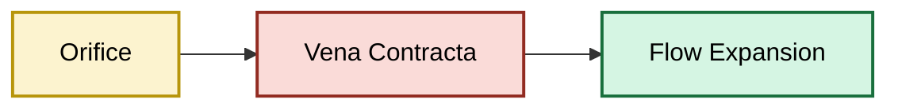

Pada vena contracta:

Kecepatan maksimum:

$$
V=V_{\max}
$$

Tekanan minimum:

$$
P=P_{\min}
$$

Lokasi ini sangat penting karena menjadi sumber utama pressure drop.

## Pressure Recovery

Setelah vena contracta, aliran mulai mengembang kembali.

Area jet meningkat:

$$
A \uparrow
$$

Kecepatan menurun:

$$
V \downarrow
$$

Sebagian energi kinetik berubah kembali menjadi tekanan.

Akibatnya:

$$
P_3>P_{\min}
$$

Namun tekanan tidak pernah pulih sepenuhnya.

## Permanent Pressure Loss

Energi yang hilang akibat turbulensi tidak dapat dipulihkan.

Hubungan tekanan:

$$
P_1>P_3>P_{\min}
$$

Permanent pressure loss:

$$
\Delta P_{\text{perm}}
=

P_1-P_3
$$

Differential pressure pengukuran:

$$
\Delta P
=

P_1-P_2
$$

Secara umum:

$$
\Delta P_{\text{perm}}
<
\Delta P
$$

Karena sebagian tekanan masih berhasil dipulihkan setelah vena contracta.

## Pressure Profile Sepanjang Orifice

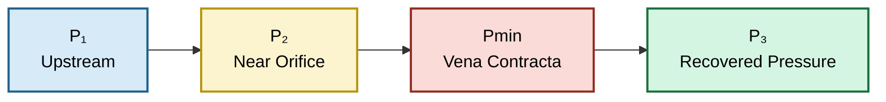

Urutan tekanan:

$$
P_1>P_3>P_{\min}
$$

dan

$$
P_1>P_2
$$

Interpretasi:

- $P_1$ = tekanan sebelum orifice
- $P_2$ = tekanan pada lokasi tapping
- $P_{\min}$ = tekanan minimum di vena contracta
- $P_3$ = tekanan setelah recovery

## Hubungan Fisika yang Terbentuk

Dari seluruh fenomena di atas diperoleh hubungan dasar:

Kontinuitas:

$$
Q=AV
$$

Bernoulli:

$$
P+\frac12\rho V^2
=

\text{konstan}
$$

Konsekuensi:

$$
A\downarrow
\Rightarrow
V\uparrow
\Rightarrow
P\downarrow
\Rightarrow
\Delta P
\text{ terbentuk}
$$

Inilah dasar fisika dari seluruh persamaan orifice yang akan dibahas pada bab berikutnya.

## Output

Pada akhir bab ini pembaca harus dapat:

- memahami hubungan antara area dan kecepatan
- memahami hubungan antara kecepatan dan tekanan
- memahami pembentukan vena contracta
- memahami pressure recovery
- memahami permanent pressure loss
- membaca pressure profile sepanjang orifice
- memahami asal mula terbentuknya differential pressure

[**Kembali ke Atas**](#orifice-plate-geometry-flow-equation-installation-and-field-engineering-practice)

---

# 3. Flow Models

## Tujuan

Menentukan model matematis yang sesuai dengan geometri dan aplikasi.

## Engineering Diagram

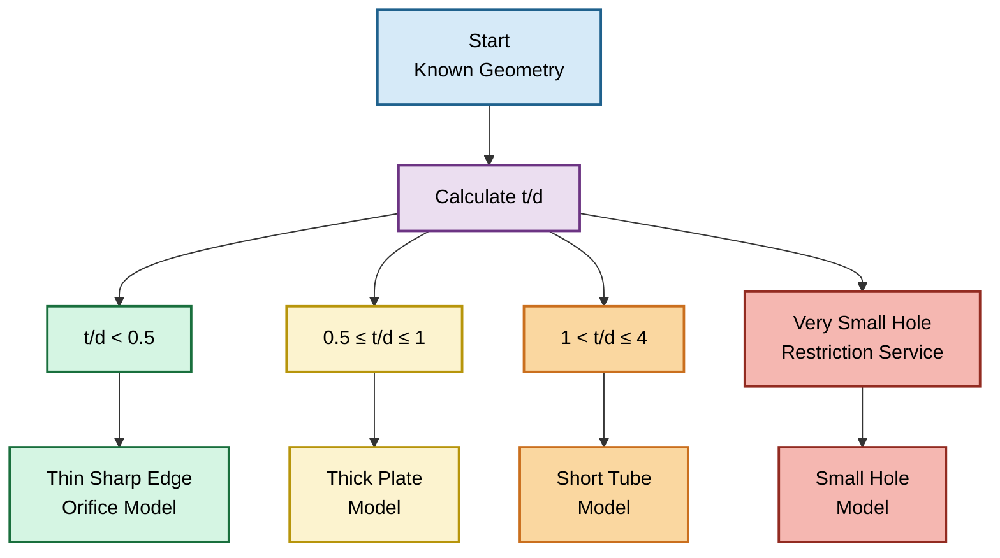

Tidak ada satu model yang berlaku untuk seluruh geometri orifice.

Kesalahan yang paling sering terjadi adalah menggunakan persamaan orifice standar untuk seluruh kasus, padahal perubahan geometri dapat mengubah karakteristik aliran secara signifikan.

Parameter pertama yang harus diperiksa adalah:

$$
\frac{t}{d}
$$

karena rasio ini menentukan model mana yang paling sesuai.

## Thin Sharp Edge Orifice

### Karakteristik Geometri

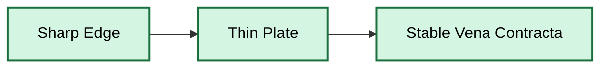

Karakteristik:

$$
\frac{t}{d} < 0.5
$$

Sharp edge berada pada sisi upstream.

Vena contracta terbentuk dengan jelas setelah fluida melewati bore.

### Discharge Coefficient

Secara umum:

$$
C_d \approx 0.60
\sim
0.62
$$

### Model

Untuk fluida inkompresibel:

$$
Q
=

C_d A_o
\sqrt{
\frac
{2\Delta P}
{\rho(1-\beta^4)}
}
$$

Dimana:

$$
A_o=\frac{\pi d^2}{4}
$$

dan:

$$
\beta=\frac{d}{D}
$$

### Aplikasi

- orifice flowmeter
- differential pressure measurement
- custody transfer basis calculation
- process flow measurement

### Kelebihan

- model paling banyak digunakan
- tersedia standar internasional
- tersedia korelasi discharge coefficient

### Keterbatasan

Tidak cocok untuk:

$$
\frac{t}{d}

>

0.5
$$

---

## Thick Plate Orifice

### Karakteristik Geometri

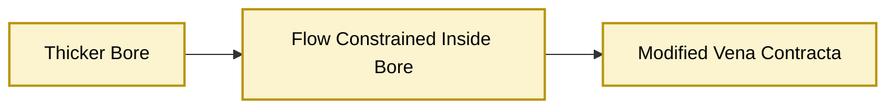

Karakteristik:

$$
0.5
\le
\frac{t}{d}
\le
1
$$

Pada kondisi ini fluida mulai mengalami restriksi sepanjang ketebalan plate.

Vena contracta tidak lagi sepenuhnya identik dengan orifice tipis.

### Discharge Coefficient

Umumnya:

$$
C_d
\approx
0.65
\sim
0.80
$$

Nilai aktual bergantung pada:

- edge condition
- bore finish
- Reynolds number

### Model

Bentuk dasar tetap:

$$
Q
=

C_d A_o
\sqrt{
\frac{2\Delta P}{\rho}
}
$$

tetapi nilai:

$$
C_d
$$

harus dikoreksi sesuai geometri aktual.

### Aplikasi

- restriction plate
- pressure reduction service
- simple flow restriction

### Keterbatasan

Model ISO 5167 tidak selalu valid.

---

## Short Tube

### Karakteristik Geometri

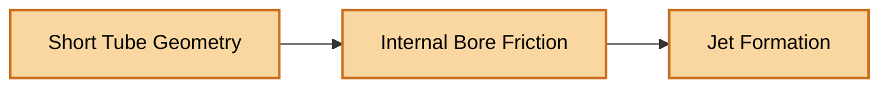

Karakteristik:

$$
1
<
\frac{t}{d}
\le
4
$$

Pada kondisi ini lubang tidak lagi berperilaku sebagai thin plate.

Lubang mulai berperilaku seperti pipa sangat pendek.

### Discharge Coefficient

Tipikal:

$$
C_d
=

0.75
\sim
0.90
$$

### Model

Persamaan praktis:

$$
Q
=

C_dA_o
\sqrt{
\frac{2\Delta P}
{\rho}
}
$$

dengan:

$$
C_d=f(\mathrm{Re},t/d)
$$

### Contoh

Diameter bore:

$$
d=1\ \mathrm{mm}
$$

Thickness:

$$
t=2\ \mathrm{mm}
$$

Maka:

$$
\frac{t}{d}
=

2
$$

Kasus tersebut termasuk:

**Short Tube**

bukan:

**Thin Sharp Edge Orifice**

### Aplikasi

- aeration diffuser
- pneumatic restrictor
- calibration leak path
- purge flow control

---

## Restriction Orifice

### Karakteristik

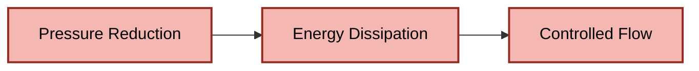

Tujuan utama restriction orifice bukan mengukur flow.

Tujuan utamanya adalah:

- menurunkan tekanan
- membatasi flow
- melindungi equipment downstream

Parameter yang dominan:

$$
\Delta P
$$

bukan akurasi flow measurement.

### Model

Persamaan umum:

$$
Q
=

C_dA_o
\sqrt{
\frac{2\Delta P}
{\rho}
}
$$

Namun desain biasanya dimulai dari:

- target pressure drop
- allowable velocity
- noise limitation
- cavitation limitation

### Aplikasi

- blowdown
- bypass line
- compressor recycle
- gas pressure reduction

---

## Small Hole

### Karakteristik

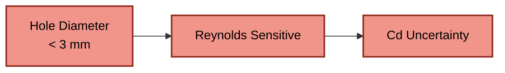

Diameter sangat kecil menyebabkan:

- Reynolds number rendah
- sensitivitas machining tinggi
- sensitivitas burr tinggi
- sensitivitas fouling tinggi

### Model

Untuk kasus:

$$
\beta \rightarrow 0
$$

maka:

$$
1-\beta^4
\approx
1
$$

Persamaan menjadi:

$$
Q
=

C_dA_o
\sqrt{
\frac{2\Delta P}
{\rho}
}
$$

### Contoh Diffuser Udara

Diameter:

$$
d=1\ \mathrm{mm}
$$

Thickness:

$$
t=2\ \mathrm{mm}
$$

Pressure drop:

$$
\Delta P=100\ \mathrm{mmH_2O}
$$

Maka model yang lebih sesuai adalah:

**Short Tube Model**

bukan:

**Orifice Meter Model**

### Karakteristik Penting

Perubahan diameter kecil menghasilkan perubahan flow besar.

Karena:

$$
A_o
=

\frac{\pi d^2}{4}
$$

maka:

$$
Q
\propto
d^2
\sqrt{\Delta P}
$$

Jika:

$$
d
\uparrow 10\%
$$

maka flow meningkat sekitar:

$$
21\%
$$

---

## Pemilihan Model

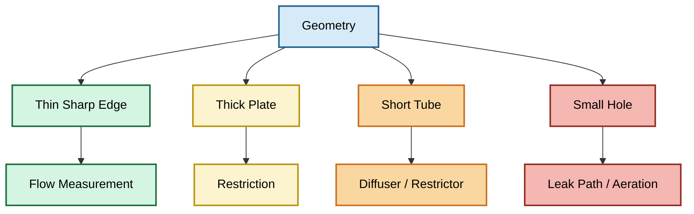

## Batas Penggunaan Model

| Model               | Geometri Dominan      | Parameter Kritis |
| ------------------- | --------------------- | ---------------- |
| Thin Sharp Edge     | $t/d < 0.5$           | β, Cd            |
| Thick Plate         | $0.5 \leq t/d \leq 1$ | Cd               |
| Short Tube          | $1 < t/d \leq 4$      | Cd, Re           |
| Restriction Orifice | Pressure Drop         | ΔP               |
| Small Hole          | Diameter kecil        | Re, Machining    |

## Output

Pada akhir bab ini pembaca harus dapat:

- memilih model yang sesuai dengan geometri
- membedakan thin orifice dan short tube
- memahami batas penggunaan persamaan orifice standar
- memahami pengaruh rasio $t/d$
- menentukan kapan model restriction orifice digunakan
- menentukan kapan small hole harus diperlakukan sebagai short tube

[**Kembali ke Atas**](#orifice-plate-geometry-flow-equation-installation-and-field-engineering-practice)

---

# 4. Differential Pressure Behaviour

## Tujuan

Menjelaskan hubungan antara flow dan differential pressure.

## Engineering Diagram

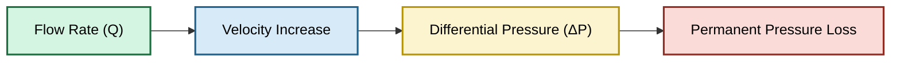

Perilaku differential pressure merupakan karakteristik utama yang membuat orifice digunakan secara luas untuk:

- flow measurement
- flow restriction
- balancing flow
- aeration system
- pneumatic control

Hubungan antara flow dan differential pressure tidak bersifat linear.

Pemahaman karakteristik ini sangat penting karena kesalahan interpretasi sering menghasilkan sizing yang tidak sesuai.

## Flow vs Differential Pressure

Persamaan dasar orifice:

$$
Q
=

C_dA_o
\sqrt{
\frac
{2\Delta P}
{\rho}
}
$$

Untuk geometri dan fluida tetap:

$$
Q
\propto
\sqrt{\Delta P}
$$

Artinya:

- flow meningkat terhadap akar kuadrat differential pressure
- kenaikan pressure empat kali menghasilkan flow dua kali

### Contoh

Jika:

$$
\Delta P_1 = 100\ \mathrm{Pa}
$$

dan:

$$
\Delta P_2 = 400\ \mathrm{Pa}
$$

maka:

$$
\frac{Q_2}{Q_1}
=

\sqrt{\frac{400}{100}}
=

2
$$

Flow hanya meningkat dua kali walaupun differential pressure meningkat empat kali.

## Flow vs DP Curve

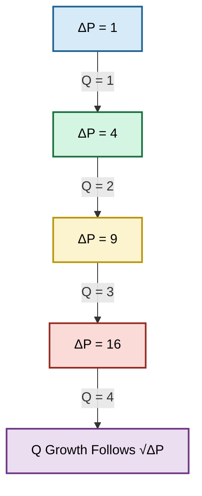

Hubungan ini menjelaskan mengapa transmitter differential pressure biasanya melakukan:

**square root extraction**

untuk menghasilkan sinyal flow yang linear.

## Differential Pressure vs Flow

Persamaan yang sama dapat dibalik:

$$
\Delta P
=

\frac{\rho}{2}
\left(
\frac{Q}
{C_dA_o}
\right)^2
$$

Sehingga:

$$
\Delta P
\propto
Q^2
$$

Artinya:

- differential pressure meningkat secara kuadratik terhadap flow
- sedikit kenaikan flow dapat menghasilkan kenaikan DP yang besar

### Contoh

Jika:

$$
Q_2 = 2Q_1
$$

maka:

$$
\Delta P_2
=

4\Delta P_1
$$

Jika:

$$
Q_2 = 3Q_1
$$

maka:

$$
\Delta P_2
=

9\Delta P_1
$$

## DP vs Flow Behaviour

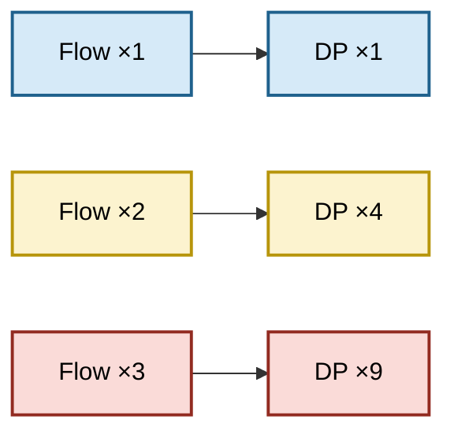

Inilah penyebab pressure drop meningkat sangat cepat pada flow tinggi.

## Turn-Down Limitation

Salah satu keterbatasan utama orifice adalah turn-down ratio.

Karena:

$$
Q
\propto
\sqrt{\Delta P}
$$

maka pada flow rendah differential pressure menjadi sangat kecil.

Akibatnya:

- signal transmitter mengecil
- noise meningkat
- akurasi menurun

### Contoh

Jika flow turun menjadi:

$$
50\%
$$

maka differential pressure menjadi:

$$
(0.5)^2
=

0.25
$$

atau:

$$
25\%
$$

dari nilai awal.

Jika flow turun menjadi:

$$
20\%
$$

maka:

$$
\Delta P
=

0.04
\Delta P_{max}
$$

hanya tersisa 4%.

## Turn-Down Illustration

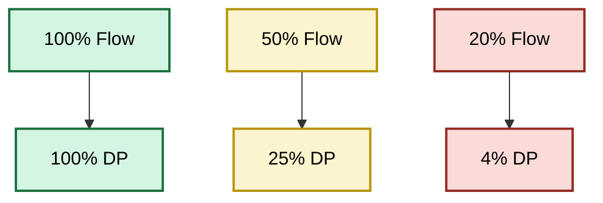

Semakin lebar range operasi yang dibutuhkan, semakin sulit menggunakan orifice secara akurat.

## Sensitivity

Sensitivitas menunjukkan seberapa besar perubahan flow terhadap perubahan differential pressure.

Dari:

$$
Q
=

K\sqrt{\Delta P}
$$

maka:

$$
\frac{dQ}{d(\Delta P)}
=

\frac{K}
{2\sqrt{\Delta P}}
$$

Artinya:

- sensitivitas tinggi pada DP rendah
- sensitivitas menurun pada DP tinggi

Konsekuensi praktis:

- perubahan kecil DP pada flow rendah menghasilkan perubahan flow yang terlihat besar
- perubahan DP yang sama pada flow tinggi menghasilkan perubahan flow yang lebih kecil

## Pressure Loss

Tidak seluruh differential pressure dapat dipulihkan.

Hubungan tekanan:

$$
P_1

>

P_3

>

P_{\min}
$$

Permanent pressure loss:

$$
\Delta P_{\text{perm}}
=

P_1-P_3
$$

Differential pressure pengukuran:

$$
\Delta P
=

P_1-P_2
$$

Secara umum:

$$
\Delta P_{\text{perm}}
<
\Delta P
$$

karena sebagian tekanan berhasil dipulihkan setelah vena contracta.

## Pressure Behaviour Through Orifice

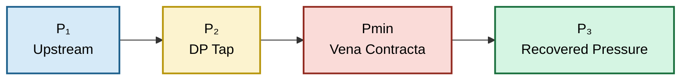

Energi yang hilang akibat:

- turbulensi
- vorteks
- mixing

tidak dapat dipulihkan kembali.

## Differential Pressure Behaviour Summary

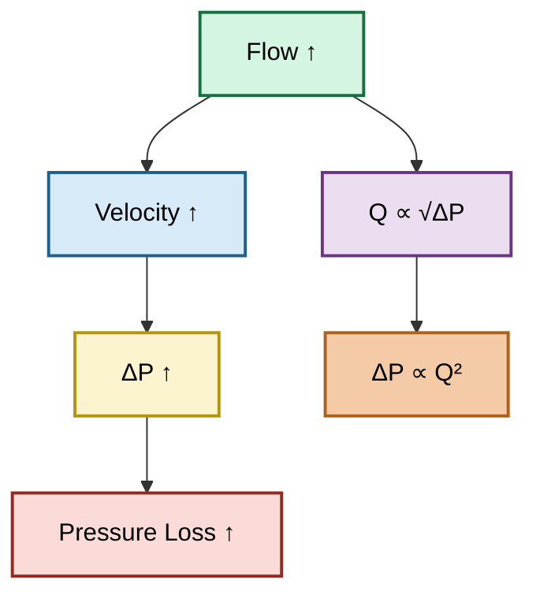

## Output

Pada akhir bab ini pembaca harus dapat:

- memahami hubungan antara flow dan differential pressure
- memahami hubungan kuadratik antara flow dan pressure drop
- memahami keterbatasan turn-down ratio
- memahami sensitivitas pengukuran orifice
- memahami perbedaan antara differential pressure dan permanent pressure loss
- memahami pressure behaviour sepanjang orifice

[**Kembali ke Atas**](#orifice-plate-geometry-flow-equation-installation-and-field-engineering-practice)

---

# 5. Installation Requirements

## Tujuan

Menjamin asumsi model tetap berlaku di lapangan.

Sebagian besar kesalahan orifice bukan berasal dari persamaan matematika, tetapi dari instalasi yang tidak memenuhi asumsi dasar model aliran.

Model orifice mengasumsikan:

- aliran telah berkembang penuh (fully developed flow)
- profil kecepatan stabil
- tidak ada swirl berlebihan
- pressure tapping bekerja dengan benar
- impulse line bebas gangguan

Jika asumsi tersebut tidak terpenuhi, maka nilai differential pressure yang diukur tidak lagi merepresentasikan flow yang sebenarnya.

## Engineering Diagram

```mermaid id="installation_overview"
flowchart LR

A["Upstream Straight Run"]:::a
B["Orifice Plate"]:::b
C["Pressure Tapping"]:::c
D["Impulse Line"]:::d
E["DP Transmitter"]:::e
F["Downstream Straight Run"]:::f

A --> B
B --> C
C --> D
D --> E
B --> F

classDef a fill:#D5F5E3,color:#000,stroke:#196F3D,stroke-width:2px;
classDef b fill:#FCF3CF,color:#000,stroke:#B7950B,stroke-width:2px;
classDef c fill:#D6EAF8,color:#000,stroke:#1F618D,stroke-width:2px;
classDef d fill:#EBDEF0,color:#000,stroke:#6C3483,stroke-width:2px;
classDef e fill:#FADBD8,color:#000,stroke:#922B21,stroke-width:2px;
classDef f fill:#D5DBDB,color:#000,stroke:#424949,stroke-width:2px;
```

Tujuan utama instalasi adalah menjaga agar differential pressure yang diukur tetap sesuai dengan kondisi yang diasumsikan oleh model.

## Straight Run

### Fungsi

Straight run memberikan kesempatan bagi profil kecepatan untuk kembali stabil sebelum fluida mencapai orifice.

Gangguan yang umum terjadi:

- elbow
- tee
- reducer
- valve
- control valve
- pump discharge
- blower discharge

Semua komponen tersebut menghasilkan:

- swirl
- velocity distortion
- asymmetric flow profile

yang dapat mengubah differential pressure.

## Pengaruh Profil Kecepatan

```mermaid id="velocity_profile"
flowchart LR

A["Disturbed Flow"]:::bad
B["Velocity Distortion"]:::bad
C["Measurement Error"]:::bad

D["Straight Run"]:::good
E["Stable Velocity Profile"]:::good
F["Stable Differential Pressure"]:::good

A --> B --> C
D --> E --> F

classDef good fill:#D5F5E3,color:#000,stroke:#196F3D,stroke-width:2px;
classDef bad fill:#FADBD8,color:#000,stroke:#922B21,stroke-width:2px;
```

Secara praktis:

semakin dekat orifice dengan sumber gangguan, semakin besar kemungkinan error pengukuran.

## Straight Run Requirement

Panjang straight run biasanya dinyatakan sebagai:

$$
L_u
=

nD
$$

dan

$$
L_d
=

mD
$$

dimana:

- $L_u$ = upstream straight run
- $L_d$ = downstream straight run
- $D$ = pipe diameter

Nilai:

$$
n
$$

dan

$$
m
$$

bergantung pada:

- jenis tapping
- konfigurasi piping
- standar yang digunakan

Karena itu instalasi harus selalu diverifikasi terhadap standar desain yang dipilih.

## Pressure Tapping

Pressure tapping adalah titik pengambilan tekanan yang digunakan untuk menghasilkan differential pressure.

## Fungsi Tapping

```mermaid id="pressure_tap"
flowchart LR

A["High Pressure Tap"]:::hp
B["Differential Pressure"]:::dp
C["Low Pressure Tap"]:::lp

A --> B --> C

classDef hp fill:#D5F5E3,color:#000,stroke:#196F3D,stroke-width:2px;
classDef dp fill:#FCF3CF,color:#000,stroke:#B7950B,stroke-width:2px;
classDef lp fill:#FADBD8,color:#000,stroke:#922B21,stroke-width:2px;
```

Differential pressure:

$$
\Delta P
=

P_H-P_L
$$

dimana:

$$
P_H
=

\text{high pressure side}
$$

dan:

$$
P_L
=

\text{low pressure side}
$$

Lokasi tapping mempengaruhi nilai differential pressure yang terukur.

## Tapping Arrangement

Jenis tapping yang umum:

- corner tap
- flange tap
- D and D/2 tap
- pipe tap

Karena pressure profile berubah sepanjang orifice, lokasi tapping yang berbeda menghasilkan differential pressure yang berbeda.

Oleh karena itu:

- model
- tapping
- discharge coefficient

harus dipilih secara konsisten.

## Orientation

Orientasi orifice harus sesuai dengan desain.

## Plate Orientation

```mermaid id="orientation"
flowchart LR

A["Sharp Edge Upstream"]:::good --> B["Correct Installation"]:::good

C["Bevel Facing Upstream"]:::bad --> D["Measurement Error"]:::bad

classDef good fill:#D5F5E3,color:#000,stroke:#196F3D,stroke-width:2px;
classDef bad fill:#FADBD8,color:#000,stroke:#922B21,stroke-width:2px;
```

Pada orifice standar:

- sharp edge menghadap upstream
- bevel menghadap downstream

Jika plate terbalik:

- vena contracta berubah
- discharge coefficient berubah
- hasil pengukuran tidak valid

## Flow Direction Verification

Pastikan:

$$
\text{Flow Direction}
\rightarrow
\text{Sharp Edge}
\rightarrow
\text{Bevel}
$$

sesuai dengan marking pada plate.

## Manifold Arrangement

Manifold digunakan antara impulse line dan transmitter.

Tujuan manifold:

- isolasi transmitter
- equalization
- venting
- draining

## Typical Arrangement

```mermaid id="manifold"
flowchart LR

A["High Side"]:::hp
B["3 Valve Manifold"]:::m
C["Low Side"]:::lp
D["DP Transmitter"]:::t

A --> B
C --> B
B --> D

classDef hp fill:#D5F5E3,color:#000,stroke:#196F3D,stroke-width:2px;
classDef lp fill:#FADBD8,color:#000,stroke:#922B21,stroke-width:2px;
classDef m fill:#FCF3CF,color:#000,stroke:#B7950B,stroke-width:2px;
classDef t fill:#D6EAF8,color:#000,stroke:#1F618D,stroke-width:2px;
```

Kesalahan konfigurasi manifold dapat menyebabkan:

- zero shift
- trapped gas
- trapped liquid
- false differential pressure

## Impulse Line

Impulse line menghubungkan pressure tapping dengan transmitter.

Fungsi utamanya:

- mentransmisikan tekanan
- menjaga representasi tekanan tetap akurat

## Impulse Line Behaviour

```mermaid id="impulse_line"
flowchart TD

A["Pressure Tap"]:::a
B["Impulse Line"]:::b
C["DP Transmitter"]:::c

A --> B
B --> C

classDef a fill:#D5F5E3,color:#000,stroke:#196F3D,stroke-width:2px;
classDef b fill:#FCF3CF,color:#000,stroke:#B7950B,stroke-width:2px;
classDef c fill:#D6EAF8,color:#000,stroke:#1F618D,stroke-width:2px;
```

Hal yang harus diperhatikan:

- slope
- liquid trap
- gas pocket
- freezing
- plugging
- condensation

Masalah impulse line sering menghasilkan error yang jauh lebih besar dibandingkan error persamaan flow.

## Sealing

Sistem sealing harus memastikan tidak ada kebocoran pada:

- flange
- tapping
- manifold
- impulse line

## Pengaruh Kebocoran

```mermaid id="leak_effect"
flowchart LR

A["Leakage"]:::bad --> B["Pressure Distortion"]:::bad --> C["DP Error"]:::bad

D["Proper Sealing"]:::good --> E["Stable Pressure Signal"]:::good

classDef good fill:#D5F5E3,color:#000,stroke:#196F3D,stroke-width:2px;
classDef bad fill:#FADBD8,color:#000,stroke:#922B21,stroke-width:2px;
```

Selain kebocoran eksternal, gasket intrusion juga harus diperiksa.

Jika gasket masuk ke area bore:

$$
A_{\text{effective}}
<
A_o
$$

maka karakteristik orifice berubah.

## Installation Verification Logic

```mermaid id="verification_logic"
flowchart TD

A["Geometry Correct"]:::a
B["Straight Run Available"]:::b
C["Tapping Correct"]:::c
D["Impulse Line Healthy"]:::d
E["No Leakage"]:::e
F["Valid Differential Pressure"]:::f

A --> B
B --> C
C --> D
D --> E
E --> F

classDef a fill:#D5F5E3,color:#000,stroke:#196F3D,stroke-width:2px;
classDef b fill:#D6EAF8,color:#000,stroke:#1F618D,stroke-width:2px;
classDef c fill:#FCF3CF,color:#000,stroke:#B7950B,stroke-width:2px;
classDef d fill:#EBDEF0,color:#000,stroke:#6C3483,stroke-width:2px;
classDef e fill:#FADBD8,color:#000,stroke:#922B21,stroke-width:2px;
classDef f fill:#A9DFBF,color:#000,stroke:#196F3D,stroke-width:3px;
```

## Checklist Instalasi

| Item                              | Verification |
| --------------------------------- | ------------ |
| Flow direction correct            | □            |
| Sharp edge facing upstream        | □            |
| Bore concentric with pipe         | □            |
| Gasket not intruding into bore    | □            |
| Upstream straight run available   | □            |
| Downstream straight run available | □            |
| Tapping location correct          | □            |
| Impulse line free of blockage     | □            |
| No gas pocket / liquid trap       | □            |
| Manifold configuration correct    | □            |
| No leakage detected               | □            |
| DP transmitter commissioned       | □            |

## Output

Pada akhir bab ini pembaca harus dapat:

- memahami tujuan straight run
- memahami fungsi pressure tapping
- memahami orientasi plate yang benar
- memahami fungsi manifold
- memahami pengaruh impulse line terhadap akurasi
- memahami pentingnya sealing
- menggunakan checklist instalasi untuk verifikasi lapangan

[**Kembali ke Atas**](#orifice-plate-geometry-flow-equation-installation-and-field-engineering-practice)

---

# 6. Operational Limits

## Tujuan

Menentukan batas operasi yang aman.

Model orifice tidak berlaku tanpa batas. Setiap orifice memiliki rentang operasi dimana:

- discharge coefficient relatif stabil
- hubungan flow dan differential pressure masih valid
- kerusakan mekanis belum terjadi
- fenomena aliran khusus belum mendominasi

Bab ini membahas batas operasi yang harus diperiksa sebelum hasil perhitungan digunakan untuk desain atau evaluasi lapangan.

## Engineering Diagram

```mermaid id="operating_envelope"
flowchart TD

A["Reynolds Number"]:::a
B["Beta Ratio"]:::b
C["t/d Ratio"]:::c
D["Cavitation"]:::d
E["Erosion"]:::e
F["Choking"]:::f
G["Compressibility"]:::g

A --> H["Valid Operating Envelope"]:::ok
B --> H
C --> H
D --> H
E --> H
F --> H
G --> H

classDef a fill:#D5F5E3,color:#000,stroke:#196F3D,stroke-width:2px;
classDef b fill:#D6EAF8,color:#000,stroke:#1F618D,stroke-width:2px;
classDef c fill:#FCF3CF,color:#000,stroke:#B7950B,stroke-width:2px;
classDef d fill:#FADBD8,color:#000,stroke:#922B21,stroke-width:2px;
classDef e fill:#EBDEF0,color:#000,stroke:#6C3483,stroke-width:2px;
classDef f fill:#F5CBA7,color:#000,stroke:#AF601A,stroke-width:2px;
classDef g fill:#D5DBDB,color:#000,stroke:#424949,stroke-width:2px;
classDef ok fill:#A9DFBF,color:#000,stroke:#196F3D,stroke-width:3px;
```

Seluruh parameter di atas membentuk operating envelope dari suatu orifice.

## Reynolds Number

### Definisi

Reynolds number digunakan untuk membandingkan gaya inersia terhadap gaya viskos.

$$
\mathrm{Re}
=

\frac{\rho V D}{\mu}
$$

Dimana:

- $\rho$ = density
- $V$ = velocity
- $D$ = characteristic diameter
- $\mu$ = dynamic viscosity

### Pengaruh terhadap Discharge Coefficient

```mermaid id="re_cd_relation"
flowchart LR

A["Low Re"]:::bad
B["Cd Changes Rapidly"]:::bad
C["Measurement Uncertainty"]:::bad

D["High Re"]:::good
E["Stable Cd"]:::good
F["Stable Flow Model"]:::good

A --> B --> C
D --> E --> F

classDef good fill:#D5F5E3,color:#000,stroke:#196F3D,stroke-width:2px;
classDef bad fill:#FADBD8,color:#000,stroke:#922B21,stroke-width:2px;
```

Pada Reynolds rendah:

$$
C_d
=

f(\mathrm{Re})
$$

menjadi sangat sensitif.

Akibatnya:

- akurasi menurun
- model sederhana menjadi kurang representatif

Pada Reynolds tinggi:

$$
C_d
\approx
\text{konstan}
$$

sehingga model lebih stabil.

### Risiko Operasi

Jika:

$$
\mathrm{Re}
\downarrow
$$

maka:

- uncertainty meningkat
- repeatability menurun
- validitas korelasi berkurang

---

## Beta Ratio Limits

### Definisi

Beta ratio:

$$
\beta
=

\frac{d}{D}
$$

merupakan parameter geometri paling penting pada orifice meter.

### Karakteristik

```mermaid id="beta_ratio"
flowchart LR

A["Low β"]:::a --> B["High Restriction"]:::a

C["Medium β"]:::b --> D["Normal Operation"]:::b

E["High β"]:::c --> F["Low DP Sensitivity"]:::c

classDef a fill:#FADBD8,color:#000,stroke:#922B21,stroke-width:2px;
classDef b fill:#D5F5E3,color:#000,stroke:#196F3D,stroke-width:2px;
classDef c fill:#FCF3CF,color:#000,stroke:#B7950B,stroke-width:2px;
```

### Beta Terlalu Kecil

Jika:

$$
\beta < 0.30
$$

maka:

- pressure drop meningkat tajam
- erosion meningkat
- plugging lebih mudah terjadi

### Beta Terlalu Besar

Jika:

$$
\beta > 0.70
$$

maka:

- differential pressure mengecil
- sensitivitas menurun
- turndown memburuk

### Area Operasi Umum

$$
0.30
\le
\beta
\le
0.70
$$

---

## t/d Limits

### Definisi

Rasio:

$$
\frac{t}{d}
$$

menentukan tipe geometri yang sebenarnya.

### Klasifikasi

```mermaid id="td_limits"
flowchart LR

A["t/d < 0.5"]:::a
B["0.5 ≤ t/d ≤ 1"]:::b
C["1 < t/d ≤ 4"]:::c
D["t/d > 4"]:::d

A --> B --> C --> D

classDef a fill:#D5F5E3,color:#000,stroke:#196F3D,stroke-width:2px;
classDef b fill:#FCF3CF,color:#000,stroke:#B7950B,stroke-width:2px;
classDef c fill:#F5CBA7,color:#000,stroke:#AF601A,stroke-width:2px;
classDef d fill:#FADBD8,color:#000,stroke:#922B21,stroke-width:2px;
```

### Interpretasi

| t/d     | Classification        |
| ------- | --------------------- |
| < 0.5   | Thin Sharp Edge       |
| 0.5 – 1 | Thick Plate           |
| 1 – 4   | Short Tube            |
| > 4     | Tube-like Restriction |

Model yang digunakan harus konsisten dengan klasifikasi ini.

---

## Cavitation

### Definisi

Cavitation terjadi ketika tekanan lokal turun di bawah vapor pressure fluida.

Pada orifice:

$$
P_{\min}
<
P_{vap}
$$

### Lokasi

Cavitation biasanya dimulai di sekitar:

- vena contracta
- high velocity zone

### Mekanisme

```mermaid id="cavitation"
flowchart LR

A["Pressure Drop"]:::a
B["Local Vapor Formation"]:::b
C["Bubble Collapse"]:::c
D["Surface Damage"]:::d

A --> B --> C --> D

classDef a fill:#D6EAF8,color:#000,stroke:#1F618D,stroke-width:2px;
classDef b fill:#FCF3CF,color:#000,stroke:#B7950B,stroke-width:2px;
classDef c fill:#FADBD8,color:#000,stroke:#922B21,stroke-width:2px;
classDef d fill:#922B21,color:#fff,stroke:#641E16,stroke-width:3px;
```

### Dampak

- vibration
- noise
- erosion
- bore damage

---

## Erosion

### Penyebab

Erosion terjadi akibat:

- partikel padat
- kecepatan tinggi
- cavitation collapse

### Hubungan Umum

Jika:

$$
V
\uparrow
$$

maka:

$$
\text{Erosion}
\uparrow
$$

### Area Kritis

```mermaid id="erosion_zone"
flowchart LR

A["Sharp Edge"]:::a
B["Bore"]:::b
C["Downstream Exit"]:::c

classDef a fill:#FADBD8,color:#000,stroke:#922B21,stroke-width:2px;
classDef b fill:#FCF3CF,color:#000,stroke:#B7950B,stroke-width:2px;
classDef c fill:#F5CBA7,color:#000,stroke:#AF601A,stroke-width:2px;
```

Kerusakan paling sering ditemukan pada:

- upstream edge
- bore wall
- downstream bevel

### Konsekuensi

Perubahan diameter:

$$
d
\uparrow
$$

mengubah:

$$
A_o
=

\frac{\pi d^2}{4}
$$

dan menyebabkan perubahan flow calculation.

---

## Choking

### Definisi

Untuk gas, peningkatan pressure drop tidak selalu menghasilkan peningkatan flow.

Pada kondisi tertentu:

$$
V
=

a
$$

dimana:

$$
a
=

\text{speed of sound}
$$

Aliran mencapai kondisi sonic.

### Choked Flow

```mermaid id="choking"
flowchart LR

A["Pressure Ratio Decreases"]:::a
B["Velocity Increases"]:::b
C["Mach = 1"]:::c
D["Flow Limited"]:::d

A --> B --> C --> D

classDef a fill:#D6EAF8,color:#000,stroke:#1F618D,stroke-width:2px;
classDef b fill:#FCF3CF,color:#000,stroke:#B7950B,stroke-width:2px;
classDef c fill:#FADBD8,color:#000,stroke:#922B21,stroke-width:2px;
classDef d fill:#922B21,color:#fff,stroke:#641E16,stroke-width:3px;
```

Setelah kondisi ini tercapai:

$$
\Delta P
\uparrow
$$

tidak lagi meningkatkan flow secara signifikan.

### Aplikasi

Fenomena ini penting untuk:

- compressed air
- natural gas
- nitrogen
- steam restriction

---

## Compressibility Effect

### Fluida Cair

Untuk liquid:

$$
\rho
\approx
\text{konstan}
$$

Asumsi inkompresibel biasanya memadai.

### Fluida Gas

Untuk gas:

$$
\rho
=

f(P,T)
$$

Density berubah sepanjang aliran.

### Dampak

```mermaid id="compressibility"
flowchart LR

A["Pressure Change"]:::a
B["Density Change"]:::b
C["Flow Behaviour Change"]:::c

A --> B --> C

classDef a fill:#D6EAF8,color:#000,stroke:#1F618D,stroke-width:2px;
classDef b fill:#FCF3CF,color:#000,stroke:#B7950B,stroke-width:2px;
classDef c fill:#FADBD8,color:#000,stroke:#922B21,stroke-width:2px;
```

Untuk gas:

$$
Q
=

f(\rho)
$$

dan:

$$
\rho
=

f(P,T)
$$

Sehingga koreksi ekspansibilitas sering diperlukan.

---

## Operating Envelope Summary

```mermaid id="operating_summary"
flowchart TD

A["Re Valid"]:::a
B["β Valid"]:::b
C["t/d Valid"]:::c
D["No Cavitation"]:::d
E["No Excessive Erosion"]:::e
F["No Choking"]:::f
G["Compressibility Evaluated"]:::g

A --> H["Acceptable Operation"]:::ok
B --> H
C --> H
D --> H
E --> H
F --> H
G --> H

classDef a fill:#D5F5E3,color:#000,stroke:#196F3D,stroke-width:2px;
classDef b fill:#D6EAF8,color:#000,stroke:#1F618D,stroke-width:2px;
classDef c fill:#FCF3CF,color:#000,stroke:#B7950B,stroke-width:2px;
classDef d fill:#FADBD8,color:#000,stroke:#922B21,stroke-width:2px;
classDef e fill:#EBDEF0,color:#000,stroke:#6C3483,stroke-width:2px;
classDef f fill:#F5CBA7,color:#000,stroke:#AF601A,stroke-width:2px;
classDef g fill:#D5DBDB,color:#000,stroke:#424949,stroke-width:2px;
classDef ok fill:#A9DFBF,color:#000,stroke:#196F3D,stroke-width:3px;
```

## Output

Pada akhir bab ini pembaca harus dapat:

- mengevaluasi Reynolds number
- mengevaluasi beta ratio
- mengevaluasi rasio $t/d$
- mengenali risiko cavitation
- mengenali risiko erosion
- memahami fenomena choking
- memahami efek compressibility
- menentukan operating envelope yang aman untuk orifice

[**Kembali ke Atas**](#orifice-plate-geometry-flow-equation-installation-and-field-engineering-practice)

---

# 7. Inspection and Degradation

## Tujuan

Mengidentifikasi perubahan geometri selama operasi.

Orifice merupakan perangkat pasif tanpa bagian bergerak, namun bukan berarti bebas dari degradasi.

Selama operasi, geometri orifice dapat berubah akibat:

- erosi
- korosi
- fouling
- plugging
- kerusakan mekanis

Karena seluruh model flow bergantung pada geometri, perubahan kecil pada bore atau edge dapat menghasilkan perubahan flow yang signifikan.

Tujuan inspeksi adalah memastikan bahwa geometri aktual masih sesuai dengan geometri desain.

## Engineering Diagram

```mermaid id="degradation_overview"
flowchart TD

A["Design Geometry"]:::good

B["Bore Wear"]:::a
C["Edge Wear"]:::b
D["Fouling"]:::c
E["Plugging"]:::d
F["Corrosion"]:::e
G["Mechanical Damage"]:::f

A --> B
A --> C
A --> D
A --> E
A --> F
A --> G

B --> H["Flow Deviation"]:::bad
C --> H
D --> H
E --> H
F --> H
G --> H

classDef good fill:#D5F5E3,color:#000,stroke:#196F3D,stroke-width:3px;
classDef bad fill:#FADBD8,color:#000,stroke:#922B21,stroke-width:3px;

classDef a fill:#D6EAF8,color:#000,stroke:#1F618D,stroke-width:2px;
classDef b fill:#FCF3CF,color:#000,stroke:#B7950B,stroke-width:2px;
classDef c fill:#EBDEF0,color:#000,stroke:#6C3483,stroke-width:2px;
classDef d fill:#F5CBA7,color:#000,stroke:#AF601A,stroke-width:2px;
classDef e fill:#D5DBDB,color:#000,stroke:#424949,stroke-width:2px;
classDef f fill:#F1948A,color:#000,stroke:#922B21,stroke-width:2px;
```

Perubahan geometri merupakan penyebab utama penyimpangan performa orifice di lapangan.

## Bore Wear

### Definisi

Bore wear adalah pembesaran diameter bore akibat:

- erosi partikel
- cavitation
- high velocity flow
- jet impingement

### Mekanisme

```mermaid id="bore_wear"
flowchart LR

A["Particle Impact"]:::a
B["Material Removal"]:::b
C["Bore Diameter Increase"]:::c
D["Flow Increase"]:::d

A --> B --> C --> D

classDef a fill:#D6EAF8,color:#000,stroke:#1F618D,stroke-width:2px;
classDef b fill:#FCF3CF,color:#000,stroke:#B7950B,stroke-width:2px;
classDef c fill:#FADBD8,color:#000,stroke:#922B21,stroke-width:2px;
classDef d fill:#F1948A,color:#000,stroke:#922B21,stroke-width:2px;
```

Jika diameter berubah dari:

$$
d
$$

menjadi:

$$
d+\Delta d
$$

maka area berubah menjadi:

$$
A_o
=

\frac{\pi(d+\Delta d)^2}{4}
$$

Karena:

$$
A_o
\propto
d^2
$$

perubahan kecil diameter dapat menghasilkan perubahan flow yang signifikan.

### Titik Inspeksi

Periksa:

- diameter bore
- ovality
- local wear
- scoring mark

### Kriteria

Bandingkan:

$$
d_{\text{actual}}
$$

terhadap:

$$
d_{\text{design}}
$$

---

## Edge Wear

### Definisi

Sharp edge merupakan bagian paling kritis dari orifice.

Model orifice standar mengasumsikan bahwa sharp edge tetap tajam.

### Mekanisme

```mermaid id="edge_wear"
flowchart LR

A["Sharp Edge"]:::good
B["Rounded Edge"]:::bad
C["Cd Change"]:::bad
D["Flow Error"]:::bad

A --> B --> C --> D

classDef good fill:#D5F5E3,color:#000,stroke:#196F3D,stroke-width:2px;
classDef bad fill:#FADBD8,color:#000,stroke:#922B21,stroke-width:2px;
```

Akibat keausan:

$$
C_d
\neq
C_{d,\text{design}}
$$

Meskipun diameter bore belum berubah.

### Penyebab

- erosive flow
- cavitation
- corrosion
- repeated cleaning

### Titik Inspeksi

Periksa:

- rounding
- nick
- chipping
- local damage

---

## Fouling

### Definisi

Fouling adalah penumpukan material pada permukaan orifice.

Contoh:

- scale
- wax
- sludge
- biological growth
- polymer deposition

### Mekanisme

```mermaid id="fouling"
flowchart LR

A["Deposit Formation"]:::a
B["Effective Area Reduction"]:::b
C["DP Increase"]:::c

A --> B --> C

classDef a fill:#D6EAF8,color:#000,stroke:#1F618D,stroke-width:2px;
classDef b fill:#FCF3CF,color:#000,stroke:#B7950B,stroke-width:2px;
classDef c fill:#FADBD8,color:#000,stroke:#922B21,stroke-width:2px;
```

Jika deposit terbentuk:

$$
A_{\text{effective}}
<
A_o
$$

maka:

$$
V
\uparrow
$$

dan:

$$
\Delta P
\uparrow
$$

untuk flow yang sama.

### Dampak

- over-reading
- unstable measurement
- pressure loss increase

### Titik Inspeksi

Periksa:

- deposit thickness
- deposit distribution
- surface roughness

---

## Plugging

### Definisi

Plugging adalah penyumbatan sebagian atau seluruh bore.

### Mekanisme

```mermaid id="plugging"
flowchart LR

A["Debris"]:::a
B["Partial Blockage"]:::b
C["Reduced Flow Area"]:::c
D["Flow Restriction"]:::d

A --> B --> C --> D

classDef a fill:#D6EAF8,color:#000,stroke:#1F618D,stroke-width:2px;
classDef b fill:#FCF3CF,color:#000,stroke:#B7950B,stroke-width:2px;
classDef c fill:#FADBD8,color:#000,stroke:#922B21,stroke-width:2px;
classDef d fill:#F1948A,color:#000,stroke:#922B21,stroke-width:2px;
```

Plugging sering ditemukan pada:

- small hole
- aeration diffuser
- low flow service
- dirty fluid service

### Dampak

Jika:

$$
A_{\text{effective}}
\downarrow
$$

maka:

$$
Q
\downarrow
$$

dan:

$$
\Delta P
\uparrow
$$

### Titik Inspeksi

Periksa:

- debris
- scale
- foreign object
- biological growth

---

## Corrosion

### Definisi

Corrosion menyebabkan perubahan geometri akibat reaksi kimia atau elektrokimia.

### Mekanisme

```mermaid id="corrosion"
flowchart LR

A["Chemical Attack"]:::a
B["Material Loss"]:::b
C["Geometry Change"]:::c

A --> B --> C

classDef a fill:#D6EAF8,color:#000,stroke:#1F618D,stroke-width:2px;
classDef b fill:#FCF3CF,color:#000,stroke:#B7950B,stroke-width:2px;
classDef c fill:#FADBD8,color:#000,stroke:#922B21,stroke-width:2px;
```

### Bentuk Kerusakan

- uniform corrosion
- pitting
- crevice corrosion
- galvanic corrosion

### Dampak

Corrosion dapat menyebabkan:

$$
d
\uparrow
$$

atau:

$$
\text{surface roughness}
\uparrow
$$

yang mempengaruhi:

$$
C_d
$$

### Titik Inspeksi

Periksa:

- pitting
- discoloration
- metal loss
- wall thinning

---

## Mechanical Damage

### Definisi

Mechanical damage merupakan perubahan geometri akibat gaya eksternal.

### Penyebab

- mishandling
- improper installation
- over-tightening
- dropped plate
- maintenance error

### Mekanisme

```mermaid id="mechanical_damage"
flowchart LR

A["Mechanical Force"]:::a
B["Distortion"]:::b
C["Geometry Change"]:::c
D["Flow Error"]:::d

A --> B --> C --> D

classDef a fill:#D6EAF8,color:#000,stroke:#1F618D,stroke-width:2px;
classDef b fill:#FCF3CF,color:#000,stroke:#B7950B,stroke-width:2px;
classDef c fill:#FADBD8,color:#000,stroke:#922B21,stroke-width:2px;
classDef d fill:#F1948A,color:#000,stroke:#922B21,stroke-width:2px;
```

### Bentuk Kerusakan

- bent plate
- dent
- warped plate
- damaged edge
- eccentric bore

### Titik Inspeksi

Periksa:

- flatness
- concentricity
- bore symmetry
- edge condition

---

## Inspection Workflow

```mermaid id="inspection_workflow"
flowchart TD

A["Remove Orifice"]:::a
B["Visual Inspection"]:::b
C["Dimensional Verification"]:::c
D["Compare with Design"]:::d
E["Accept"]:::good
F["Repair / Replace"]:::bad

A --> B
B --> C
C --> D
D --> E
D --> F

classDef a fill:#D6EAF8,color:#000,stroke:#1F618D,stroke-width:2px;
classDef b fill:#FCF3CF,color:#000,stroke:#B7950B,stroke-width:2px;
classDef c fill:#EBDEF0,color:#000,stroke:#6C3483,stroke-width:2px;
classDef d fill:#D5DBDB,color:#000,stroke:#424949,stroke-width:2px;
classDef good fill:#D5F5E3,color:#000,stroke:#196F3D,stroke-width:3px;
classDef bad fill:#FADBD8,color:#000,stroke:#922B21,stroke-width:3px;
```

## Inspection Checklist

| Inspection Item                   | Verification |
| --------------------------------- | ------------ |
| Bore diameter measured            | □            |
| Bore circularity verified         | □            |
| Sharp edge condition verified     | □            |
| Edge rounding checked             | □            |
| Fouling inspected                 | □            |
| Plugging inspected                | □            |
| Corrosion inspected               | □            |
| Pitting inspected                 | □            |
| Plate flatness verified           | □            |
| Concentricity verified            | □            |
| Plate orientation marking visible | □            |
| Damage from handling inspected    | □            |
| Actual dimensions recorded        | □            |

## Degradation Summary

```mermaid id="degradation_summary"
flowchart LR

A["Wear"]:::a
B["Corrosion"]:::b
C["Fouling"]:::c
D["Plugging"]:::d
E["Mechanical Damage"]:::e

A --> F["Geometry Change"]:::bad
B --> F
C --> F
D --> F
E --> F

F --> G["Flow Calculation Deviation"]:::bad

classDef a fill:#D6EAF8,color:#000,stroke:#1F618D,stroke-width:2px;
classDef b fill:#FCF3CF,color:#000,stroke:#B7950B,stroke-width:2px;
classDef c fill:#EBDEF0,color:#000,stroke:#6C3483,stroke-width:2px;
classDef d fill:#F5CBA7,color:#000,stroke:#AF601A,stroke-width:2px;
classDef e fill:#D5DBDB,color:#000,stroke:#424949,stroke-width:2px;
classDef bad fill:#FADBD8,color:#000,stroke:#922B21,stroke-width:3px;
```

## Output

Pada akhir bab ini pembaca harus dapat:

- mengidentifikasi mekanisme degradasi orifice
- membedakan bore wear dan edge wear
- mengenali fouling dan plugging
- mengevaluasi dampak corrosion terhadap geometri
- mengenali mechanical damage
- melakukan inspeksi visual dan dimensional
- menggunakan inspection checklist sebagai verifikasi lapangan

[**Kembali ke Atas**](#orifice-plate-geometry-flow-equation-installation-and-field-engineering-practice)

---

# 8. Application Cases

## Tujuan

Menghubungkan teori dengan penggunaan nyata.

Bab-bab sebelumnya menjelaskan:

- geometri
- fisika aliran
- model matematis
- differential pressure
- instalasi
- batas operasi
- inspeksi

Namun engineer lapangan tidak memulai dari teori.

Engineer biasanya memulai dari pertanyaan:

> Saya ingin mengukur flow.

atau

> Saya ingin membatasi flow.

atau

> Saya ingin mendistribusikan udara.

Karena itu pemilihan model harus dimulai dari aplikasi yang ingin dicapai.

## Engineering Diagram

```mermaid id="application_map"
flowchart TD

A["Application"]:::start

A --> B["Flow Measurement"]:::m
A --> C["Restriction Service"]:::r
A --> D["Aeration Diffuser"]:::a
A --> E["Gas Distribution"]:::g

B --> B1["Thin Sharp Edge Orifice"]
C --> C1["Restriction Orifice"]
D --> D1["Short Tube / Small Hole"]
E --> E1["Balancing Restrictor"]

classDef start fill:#D6EAF8,color:#000,stroke:#1F618D,stroke-width:3px;

classDef m fill:#D5F5E3,color:#000,stroke:#196F3D,stroke-width:2px;
classDef r fill:#FCF3CF,color:#000,stroke:#B7950B,stroke-width:2px;
classDef a fill:#FADBD8,color:#000,stroke:#922B21,stroke-width:2px;
classDef g fill:#EBDEF0,color:#000,stroke:#6C3483,stroke-width:2px;
```

Aplikasi menentukan:

- geometri
- model
- parameter desain
- metode inspeksi

---

## Flow Measurement

### Tujuan

Mengukur flow menggunakan differential pressure.

### Engineering Diagram

```mermaid id="flow_measurement"
flowchart LR

A["Upstream Pressure"]:::a
B["Orifice Plate"]:::b
C["Differential Pressure"]:::c
D["Flow Calculation"]:::d

A --> B
B --> C
C --> D

classDef a fill:#D6EAF8,color:#000,stroke:#1F618D,stroke-width:2px;
classDef b fill:#D5F5E3,color:#000,stroke:#196F3D,stroke-width:2px;
classDef c fill:#FCF3CF,color:#000,stroke:#B7950B,stroke-width:2px;
classDef d fill:#EBDEF0,color:#000,stroke:#6C3483,stroke-width:2px;
```

### Prinsip

Orifice menghasilkan:

$$
\Delta P
$$

yang kemudian dikonversi menjadi flow.

Model yang digunakan:

$$
Q
=

C_dA_o
\sqrt{
\frac
{2\Delta P}
{\rho(1-\beta^4)}
}
$$

### Parameter Dominan

- beta ratio
- discharge coefficient
- Reynolds number
- tapping location
- straight run

### Geometri yang Direkomendasikan

$$
\frac{t}{d}
<
0.5
$$

atau:

**Thin Sharp Edge Orifice**

### Fokus Engineer

Engineer lebih fokus pada:

- akurasi
- repeatability
- uncertainty
- calibration

daripada pressure loss.

### Contoh Aplikasi

- custody transfer
- utility metering
- steam metering
- cooling water measurement
- compressed air metering

---

## Restriction Service

### Tujuan

Mengurangi tekanan atau membatasi flow.

### Engineering Diagram

```mermaid id="restriction_service_case"
flowchart LR

A["High Pressure"]:::a
B["Restriction Orifice"]:::b
C["Pressure Drop"]:::c
D["Protected Equipment"]:::d

A --> B
B --> C
C --> D

classDef a fill:#D6EAF8,color:#000,stroke:#1F618D,stroke-width:2px;
classDef b fill:#FCF3CF,color:#000,stroke:#B7950B,stroke-width:2px;
classDef c fill:#FADBD8,color:#000,stroke:#922B21,stroke-width:2px;
classDef d fill:#D5F5E3,color:#000,stroke:#196F3D,stroke-width:2px;
```

### Prinsip

Tujuan utama bukan mengukur flow.

Tujuan utama adalah menghasilkan:

$$
\Delta P
$$

yang diinginkan.

Model umum:

$$
Q
=

C_dA_o
\sqrt{
\frac{2\Delta P}
{\rho}
}
$$

### Parameter Dominan

- pressure drop
- cavitation
- choking
- noise
- velocity

### Geometri

Dapat berupa:

- thin plate
- thick plate
- multi-stage restriction

### Fokus Engineer

Engineer lebih fokus pada:

- pressure reduction
- equipment protection
- noise reduction
- vibration control

### Contoh Aplikasi

- compressor recycle
- pump minimum flow
- blowdown restriction
- gas letdown system
- bypass line

---

## Aeration Diffuser

### Tujuan

Mendistribusikan udara ke dalam cairan.

### Engineering Diagram

```mermaid id="aeration_diffuser"
flowchart LR

A["Blower"]:::a
B["Header Pipe"]:::b
C["Small Holes"]:::c
D["Air Bubbles"]:::d
E["Water Body"]:::e

A --> B
B --> C
C --> D
D --> E

classDef a fill:#D6EAF8,color:#000,stroke:#1F618D,stroke-width:2px;
classDef b fill:#D5F5E3,color:#000,stroke:#196F3D,stroke-width:2px;
classDef c fill:#FCF3CF,color:#000,stroke:#B7950B,stroke-width:2px;
classDef d fill:#FADBD8,color:#000,stroke:#922B21,stroke-width:2px;
classDef e fill:#EBDEF0,color:#000,stroke:#6C3483,stroke-width:2px;
```

### Prinsip

Lubang diffuser biasanya:

$$
d
=

1
\sim
3\ \mathrm{mm}
$$

dan sering memiliki:

$$
\frac{t}{d}

>

1
$$

sehingga tidak lagi berperilaku sebagai thin sharp edge orifice.

Dalam banyak kasus lebih tepat dianggap sebagai:

- short tube
- flow restrictor
- small hole

### Model

Untuk:

$$
\beta
\rightarrow
0
$$

digunakan:

$$
Q
=

C_dA_o
\sqrt{
\frac{2\Delta P}
{\rho}
}
$$

dengan:

$$
\Delta P
=

P_{\text{blower}}
+

P_{\text{water}}
+

P_{\text{loss}}
$$

### Parameter Dominan

- hole diameter
- hole count
- hole spacing
- water depth
- blower pressure

### Fokus Engineer

Engineer lebih fokus pada:

- total airflow
- bubble distribution
- oxygen transfer
- fouling resistance

### Contoh

Kasus yang telah dibahas sebelumnya:

$$
d=1\ \mathrm{mm}
$$

$$
t=2\ \mathrm{mm}
$$

$$
\frac{t}{d}=2
$$

Klasifikasi:

**Short Tube**

bukan:

**Thin Sharp Edge Orifice**

---

## Gas Distribution

### Tujuan

Membagi flow secara merata ke beberapa cabang.

### Engineering Diagram

```mermaid id="gas_distribution"
flowchart TD

A["Gas Header"]:::a

A --> B["Branch 1"]:::b
A --> C["Branch 2"]:::b
A --> D["Branch 3"]:::b
A --> E["Branch n"]:::b

B --> F["Restriction"]
C --> F
D --> F
E --> F

F --> G["Balanced Flow"]:::g

classDef a fill:#D6EAF8,color:#000,stroke:#1F618D,stroke-width:2px;
classDef b fill:#FCF3CF,color:#000,stroke:#B7950B,stroke-width:2px;
classDef g fill:#D5F5E3,color:#000,stroke:#196F3D,stroke-width:3px;
```

### Prinsip

Perbedaan kecil tekanan pada setiap cabang dapat menghasilkan distribusi flow yang tidak merata.

Dengan menambahkan restriction orifice:

$$
\Delta P_{orifice}

\gg

\Delta P_{header}
$$

maka pengaruh variasi tekanan header menjadi kecil.

### Model

Model yang digunakan umumnya:

$$
Q
=

C_dA_o
\sqrt{
\frac{2\Delta P}
{\rho}
}
$$

### Parameter Dominan

- branch pressure balance
- restriction sizing
- total header pressure

### Fokus Engineer

Engineer lebih fokus pada:

- flow uniformity
- balancing
- repeatability

### Contoh Aplikasi

- burner manifold
- aeration manifold
- gas distribution header
- purge gas distribution

---

## Application Selection Matrix

```mermaid id="application_matrix"
flowchart LR

A["Need Accurate Flow?"]:::m --> B["Flow Measurement"]

C["Need Pressure Reduction?"]:::r --> D["Restriction Service"]

E["Need Air Injection?"]:::a --> F["Aeration Diffuser"]

G["Need Equal Distribution?"]:::g --> H["Gas Distribution"]

classDef m fill:#D5F5E3,color:#000,stroke:#196F3D,stroke-width:2px;
classDef r fill:#FCF3CF,color:#000,stroke:#B7950B,stroke-width:2px;
classDef a fill:#FADBD8,color:#000,stroke:#922B21,stroke-width:2px;
classDef g fill:#EBDEF0,color:#000,stroke:#6C3483,stroke-width:2px;
```

## Mapping Application to Model

| Application         | Geometry           | Model                  |
| ------------------- | ------------------ | ---------------------- |
| Flow Measurement    | Thin Sharp Edge    | Orifice Meter Equation |
| Restriction Service | Thin / Thick Plate | Restriction Orifice    |
| Aeration Diffuser   | Short Tube         | Small Hole Model       |
| Gas Distribution    | Restriction Hole   | Restriction Model      |

## Output

Pada akhir bab ini pembaca harus dapat:

- menghubungkan aplikasi dengan model yang tepat
- membedakan flow measurement dan restriction service
- memahami karakteristik diffuser aerasi
- memahami prinsip gas distribution balancing
- memilih geometri yang sesuai dengan tujuan aplikasi
- memilih model matematis yang sesuai dengan aplikasi lapangan

[**Kembali ke Atas**](#orifice-plate-geometry-flow-equation-installation-and-field-engineering-practice)

---

# 9. Example Engineering Calculations

## Tujuan

Menghubungkan teori, geometri, dan model matematis ke dalam perhitungan yang dapat direplikasi oleh engineer.

Seluruh contoh berikut menggunakan pendekatan yang konsisten dengan model yang telah dibahas pada bab sebelumnya.

---

## Case A — Orifice Flowmeter

### Problem Statement

Sebuah orifice flowmeter dipasang pada pipa air dengan data:

| Parameter                        | Value      |
| -------------------------------- | ---------- |
| Pipe ID $D$                      | 102.3 mm   |
| Beta Ratio $\beta$               | 0.60       |
| Density $\rho$                   | 1000 kg/m³ |
| Discharge Coefficient $C_d$      | 0.61       |
| Differential Pressure $\Delta P$ | 13.36 kPa  |

Tentukan flow rate.

### Engineering Diagram

```mermaid
flowchart LR

A["P1"]:::a
B["Orifice"]:::b
C["ΔP"]:::c
D["Flow Rate"]:::d

A --> B --> C --> D

classDef a fill:#D6EAF8,color:#000,stroke:#1F618D,stroke-width:2px;
classDef b fill:#D5F5E3,color:#000,stroke:#196F3D,stroke-width:2px;
classDef c fill:#FCF3CF,color:#000,stroke:#B7950B,stroke-width:2px;
classDef d fill:#EBDEF0,color:#000,stroke:#6C3483,stroke-width:2px;
```

### Step 1 — Bore Diameter

$$
d
=

\beta D
$$

$$
d
=

0.60 \times 0.1023
$$

$$
d
=

0.06138\ \mathrm{m}
$$

### Step 2 — Bore Area

$$
A_o
=

\frac{\pi d^2}{4}
$$

$$
A_o
=

0.002959\ \mathrm{m^2}
$$

### Step 3 — Flow Calculation

$$
Q
=

C_dA_o
\sqrt{
\frac
{2\Delta P}
{\rho(1-\beta^4)}
}
$$

Substitusi:

$$
Q
=

0.61
\times
0.002959
\times
\sqrt{
\frac
{2(13360)}
{1000(1-0.6^4)}
}
$$

### Result

$$
Q
=

0.0100\ \mathrm{m^3/s}
$$

Konversi:

$$
Q
=

10.0\ \mathrm{L/s}
$$

atau:

$$
Q
=

600\ \mathrm{L/min}
$$

---

## Case B — Restriction Orifice

### Problem Statement

Udara pada tekanan rendah dialirkan melalui restriction orifice.

Data:

| Parameter     | Value     |
| ------------- | --------- |
| Bore Diameter | 5 mm      |
| Cd            | 0.75      |
| Density       | 1.2 kg/m³ |
| ΔP            | 5 kPa     |

Hitung flow udara.

### Engineering Diagram

```mermaid
flowchart LR

A["Pressure Source"]:::a
B["Restriction Orifice"]:::b
C["Pressure Drop"]:::c
D["Controlled Flow"]:::d

A --> B --> C --> D

classDef a fill:#D6EAF8,color:#000,stroke:#1F618D,stroke-width:2px;
classDef b fill:#FCF3CF,color:#000,stroke:#B7950B,stroke-width:2px;
classDef c fill:#FADBD8,color:#000,stroke:#922B21,stroke-width:2px;
classDef d fill:#D5F5E3,color:#000,stroke:#196F3D,stroke-width:2px;
```

### Step 1 — Area

$$
d
=

0.005\ \mathrm{m}
$$

$$
A_o
=

\frac{\pi d^2}{4}
$$

$$
A_o
=

1.963\times10^{-5}\ \mathrm{m^2}
$$

### Step 2 — Flow

Karena:

$$
\beta \rightarrow 0
$$

digunakan:

$$
Q
=

C_dA_o
\sqrt{
\frac
{2\Delta P}
{\rho}
}
$$

Substitusi:

$$
Q
=

0.75
\times
1.963\times10^{-5}
\times
\sqrt{
\frac
{2(5000)}
{1.2}
}
$$

### Result

$$
Q
=

0.00135\ \mathrm{m^3/s}
$$

Konversi:

$$
Q
=

1.35\ \mathrm{L/s}
$$

atau:

$$
Q
=

81\ \mathrm{L/min}
$$

---

## Case C — Air Diffuser Hole

### Problem Statement

Sebuah diffuser aerasi menggunakan lubang tunggal dengan data:

| Parameter             | Value       |
| --------------------- | ----------- |
| Hole Diameter         | 1 mm        |
| Plate Thickness       | 2 mm        |
| Differential Pressure | 100 mmH₂O   |
| Air Temperature       | 35°C        |
| Air Density           | 1.145 kg/m³ |
| Cd                    | 0.75        |

Tentukan flow udara yang keluar dari satu lubang.

### Engineering Diagram

```mermaid
flowchart LR

A["Blower"]:::a
B["1 mm Hole"]:::b
C["Air Bubble"]:::c
D["Water"]:::d

A --> B --> C --> D

classDef a fill:#D6EAF8,color:#000,stroke:#1F618D,stroke-width:2px;
classDef b fill:#FCF3CF,color:#000,stroke:#B7950B,stroke-width:2px;
classDef c fill:#FADBD8,color:#000,stroke:#922B21,stroke-width:2px;
classDef d fill:#D5F5E3,color:#000,stroke:#196F3D,stroke-width:2px;
```

### Step 1 — Geometry Verification

Diameter:

$$
d
=

1\ \mathrm{mm}
=

0.001\ \mathrm{m}
$$

Thickness:

$$
t
=

2\ \mathrm{mm}
=

0.002\ \mathrm{m}
$$

Rasio:

$$
\frac{t}{d}
=

2
$$

Klasifikasi:

**Short Tube**

### Step 2 — Hole Area

$$
A_o
=

\frac{\pi d^2}{4}
$$

$$
A_o
=

7.854\times10^{-7}\ \mathrm{m^2}
$$

### Step 3 — Differential Pressure Conversion

$$
\Delta P
=

100\ \mathrm{mmH_2O}
$$

$$
1\ \mathrm{mmH_2O}
=

9.80665\ \mathrm{Pa}
$$

$$
\Delta P
=

980.7\ \mathrm{Pa}
$$

### Step 4 — Flow Calculation

Model:

$$
Q
=

C_dA_o
\sqrt{
\frac
{2\Delta P}
{\rho}
}
$$

Substitusi:

$$
Q
=

0.75
\times
7.854\times10^{-7}
\times
\sqrt{
\frac
{2(980.7)}
{1.145}
}
$$

### Result

$$
Q
=

2.44\times10^{-5}\ \mathrm{m^3/s}
$$

Konversi:

$$
Q
=

1.46\ \mathrm{L/min}
$$

---

## Diffuser Scaling Example

Jika diffuser memiliki:

$$
N=100
$$

lubang identik.

### Total Air Flow

$$
Q_{\text{total}}
=

NQ_{\text{hole}}
$$

$$
Q_{\text{total}}
=

100
\times
1.46
$$

### Result

$$
Q_{\text{total}}
=

146\ \mathrm{L/min}
$$

atau:

$$
Q_{\text{total}}
=

8.76\ \mathrm{m^3/h}
$$

---

## Engineering Comparison

```mermaid
flowchart TD

A["Case A<br/>Flow Measurement"]:::a

B["Case B<br/>Restriction Service"]:::b

C["Case C<br/>Aeration Diffuser"]:::c

A --> D["Accurate Flow Calculation"]
B --> E["Pressure Reduction"]
C --> F["Air Distribution"]

classDef a fill:#D5F5E3,color:#000,stroke:#196F3D,stroke-width:2px;
classDef b fill:#FCF3CF,color:#000,stroke:#B7950B,stroke-width:2px;
classDef c fill:#FADBD8,color:#000,stroke:#922B21,stroke-width:2px;
```

## Output

Pada akhir bab ini pembaca harus dapat:

- menghitung flow pada orifice flowmeter
- menghitung flow pada restriction orifice
- menghitung flow pada diffuser aerasi
- menentukan klasifikasi geometri menggunakan rasio $t/d$
- mengkonversi differential pressure ke flow rate
- menghitung total flow dari banyak lubang diffuser

[**Kembali ke Atas**](#orifice-plate-geometry-flow-equation-installation-and-field-engineering-practice)

---

# 10. Design Worksheet Appendix

## Tujuan

Menyediakan worksheet standar yang dapat digunakan engineer untuk:

- sizing awal
- verifikasi desain
- troubleshooting
- inspection verification
- import langsung ke Exce

  l

Lampiran ini dirancang agar seluruh perhitungan pada artikel dapat direplikasi menggunakan spreadsheet tanpa software khusus.

---

## Worksheet Architecture

### Engineering Diagram

```mermaid
flowchart TD

A["Input Data"]:::a

B["Geometry"]:::b
C["Flow Model"]:::c
D["Validation"]:::d
E["Result"]:::e

A --> B
B --> C
C --> D
D --> E

classDef a fill:#D6EAF8,color:#000,stroke:#1F618D,stroke-width:2px;
classDef b fill:#D5F5E3,color:#000,stroke:#196F3D,stroke-width:2px;
classDef c fill:#FCF3CF,color:#000,stroke:#B7950B,stroke-width:2px;
classDef d fill:#FADBD8,color:#000,stroke:#922B21,stroke-width:2px;
classDef e fill:#EBDEF0,color:#000,stroke:#6C3483,stroke-width:2px;
```

Worksheet dibagi menjadi lima blok utama:

1. Input Data
2. Geometry
3. Flow Calculation
4. Validation
5. Result

---

## Formula Sheet

### Geometry

Pipe Area:

$$
A_p
=

\frac{\pi D^2}{4}
$$

Orifice Area:

$$
A_o
=

\frac{\pi d^2}{4}
$$

Beta Ratio:

$$
\beta
=

\frac{d}{D}
$$

Thickness Ratio:

$$
\frac{t}{d}
$$

---

### Flow Measurement Model

$$
Q
=

C_dA_o
\sqrt{
\frac
{2\Delta P}
{\rho(1-\beta^4)}
}
$$

---

### Restriction Orifice Model

$$
Q
=

C_dA_o
\sqrt{
\frac
{2\Delta P}
{\rho}
}
$$

---

### Reynolds Number

Velocity:

$$
V
=

\frac{Q}{A_p}
$$

Reynolds Number:

$$
\mathrm{Re}
=

\frac{\rho VD}{\mu}
$$

---

### Differential Pressure Verification

$$
\Delta P
=

\frac{\rho}{2}
\left(
\frac
{Q}
{C_dA_o}
\right)^2
(1-\beta^4)
$$

---

### Diffuser Total Flow

$$
Q_{\text{total}}
=

NQ_{\text{hole}}
$$

---

## CSV Template

Simpan sebagai:

```text
orifice_design_template.csv
```

```csv
Section,Parameter,Symbol,Unit,Value,Formula
Geometry,Pipe Diameter,D,m,,
Geometry,Orifice Diameter,d,m,,
Geometry,Plate Thickness,t,m,,
Geometry,Beta Ratio,beta,-,,=d/D
Geometry,Pipe Area,Ap,m2,,=PI()*D^2/4
Geometry,Orifice Area,Ao,m2,,=PI()*d^2/4
Geometry,Thickness Ratio,t_d,-,,=t/d

Fluid,Density,rho,kg/m3,,
Fluid,Viscosity,mu,Pa.s,,

Flow,Discharge Coefficient,Cd,-,,
Flow,Differential Pressure,DeltaP,Pa,,
Flow,Flow Rate,Q,m3/s,,=Cd*Ao*SQRT((2*DeltaP)/(rho*(1-beta^4)))

Velocity,Velocity,V,m/s,,=Q/Ap

Validation,Reynolds Number,Re,-,,=(rho*V*D)/mu

Diffuser,Number of Holes,N,-,,
Diffuser,Flow per Hole,Qhole,m3/s,,
Diffuser,Total Flow,Qtotal,m3/s,,=N*Qhole
```

---

## Default Values

Dataset berikut digunakan untuk memvalidasi worksheet.

### Case A

Orifice Flowmeter

| Parameter | Value      |
| --------- | ---------- |
| D         | 0.1023 m   |
| d         | 0.06138 m  |
| Cd        | 0.61       |
| rho       | 1000 kg/m³ |
| mu        | 0.001 Pa.s |
| DeltaP    | 13360 Pa   |

---

### Case B

Restriction Orifice

| Parameter | Value      |
| --------- | ---------- |
| d         | 0.005 m    |
| Cd        | 0.75       |
| rho       | 1.20 kg/m³ |
| DeltaP    | 5000 Pa    |

---

### Case C

Air Diffuser

| Parameter | Value       |
| --------- | ----------- |
| d         | 0.001 m     |
| t         | 0.002 m     |
| Cd        | 0.75        |
| rho       | 1.145 kg/m³ |
| DeltaP    | 980.7 Pa    |
| N         | 100         |

---

## Validation Dataset

### Validation A

Orifice Flowmeter

Expected:

$$
Q
=

0.0100\ \mathrm{m^3/s}
$$

---

### Validation B

Restriction Orifice

Expected:

$$
Q
=

0.00135\ \mathrm{m^3/s}
$$

---

### Validation C

Air Diffuser

Expected:

$$
Q_{\text{hole}}
=

2.44\times10^{-5}\ \mathrm{m^3/s}
$$

atau:

$$
Q_{\text{hole}}
=

1.46\ \mathrm{L/min}
$$

---

### Validation D

Total Diffuser Flow

Expected:

$$
Q_{\text{total}}
=

0.00244\ \mathrm{m^3/s}
$$

atau:

$$
Q_{\text{total}}
=

146\ \mathrm{L/min}
$$

---

## Expected Results Summary

```mermaid
flowchart LR

A["Flowmeter"]:::a --> B["600 L/min"]:::a

C["Restriction"]:::b --> D["81 L/min"]:::b

E["Diffuser Hole"]:::c --> F["1.46 L/min"]:::c

G["100 Holes"]:::d --> H["146 L/min"]:::d

classDef a fill:#D5F5E3,color:#000,stroke:#196F3D,stroke-width:2px;
classDef b fill:#FCF3CF,color:#000,stroke:#B7950B,stroke-width:2px;
classDef c fill:#FADBD8,color:#000,stroke:#922B21,stroke-width:2px;
classDef d fill:#EBDEF0,color:#000,stroke:#6C3483,stroke-width:2px;
```

---

## Warning Limits

Worksheet harus memberikan warning jika kondisi berikut terjadi.

### Beta Ratio Warning

$$
\beta < 0.30
$$

Status:

```text
LOW BETA RATIO
```

atau:

$$
\beta > 0.70
$$

Status:

```text
HIGH BETA RATIO
```

---

### Reynolds Number Warning

$$
\mathrm{Re} < 10000
$$

Status:

```text
LOW REYNOLDS NUMBER
```

---

### Thickness Ratio Warning

$$
\frac{t}{d}

>

1
$$

Status:

```text
SHORT TUBE GEOMETRY
```

---

### Diffuser Warning

Jika:

$$
d < 1\ \mathrm{mm}
$$

Status:

```text
PLUGGING RISK
```

---

### Velocity Warning

Jika:

$$
V > 30\ \mathrm{m/s}
$$

Status:

```text
HIGH VELOCITY
```

---

### Pressure Drop Warning

Jika:

$$
\Delta P

>

20\%
P_{\text{upstream}}
$$

Status:

```text
CHECK COMPRESSIBILITY EFFECT
```

---

## Excel Validation Logic

### Geometry Check

```excel
=IF(AND(beta>=0.3,beta<=0.7),"OK","CHECK")
```

### Reynolds Check

```excel
=IF(Re>10000,"OK","LOW RE")
```

### Thickness Ratio Check

```excel
=IF(t_d<=1,"ORIFICE","SHORT TUBE")
```

### Diffuser Check

```excel
=IF(d<0.001,"PLUGGING RISK","OK")
```

---

## Worksheet Deliverables

Worksheet yang telah selesai harus mampu:

- menghitung beta ratio
- menghitung area
- menghitung flow
- menghitung Reynolds number
- menghitung total diffuser flow
- memvalidasi hasil
- memberikan warning otomatis
- digunakan untuk flowmeter
- digunakan untuk restriction orifice
- digunakan untuk diffuser aerasi

## Output

Pada akhir lampiran ini pembaca memiliki:

- formula sheet lengkap
- template CSV siap import ke Excel
- dataset validasi
- expected result
- warning limit
- logic validation

sehingga seluruh contoh pada artikel dapat direproduksi secara langsung menggunakan spreadsheet standar.

[**Kembali ke Atas**](#orifice-plate-geometry-flow-equation-installation-and-field-engineering-practice)

---

<small>
  **_Catatan Penyusunan_** Artikel ini disusun sebagai materi edukasi dan
  referensi umum berdasarkan berbagai sumber pustaka, praktik lapangan, serta
  bantuan alat penulisan. Pembaca disarankan untuk melakukan verifikasi lanjutan
  dan penyesuaian sesuai dengan kondisi serta kebutuhan masing-masing sistem.
</small>
