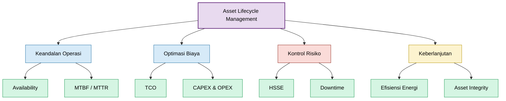
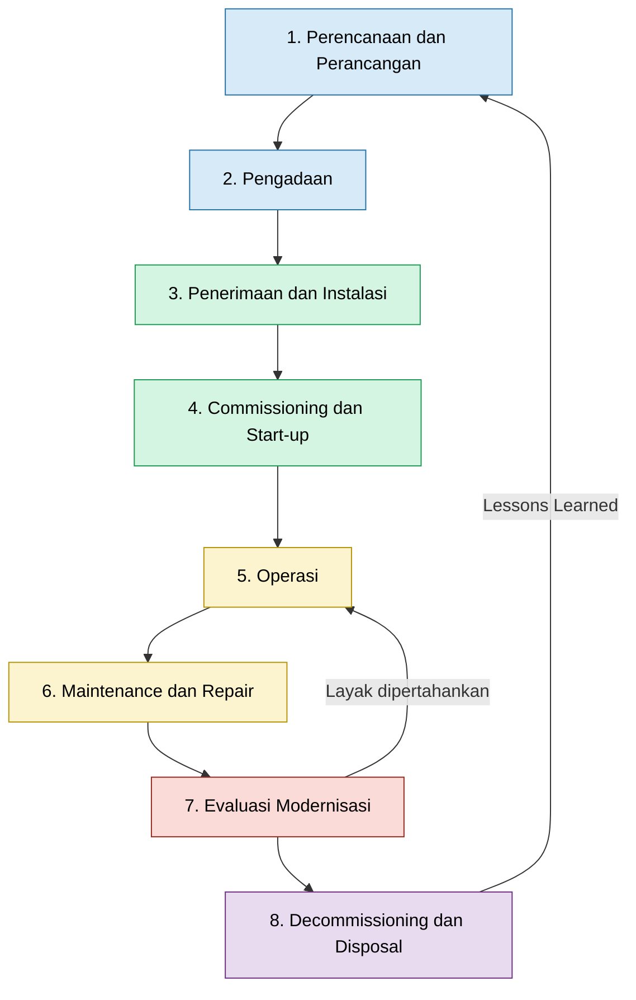
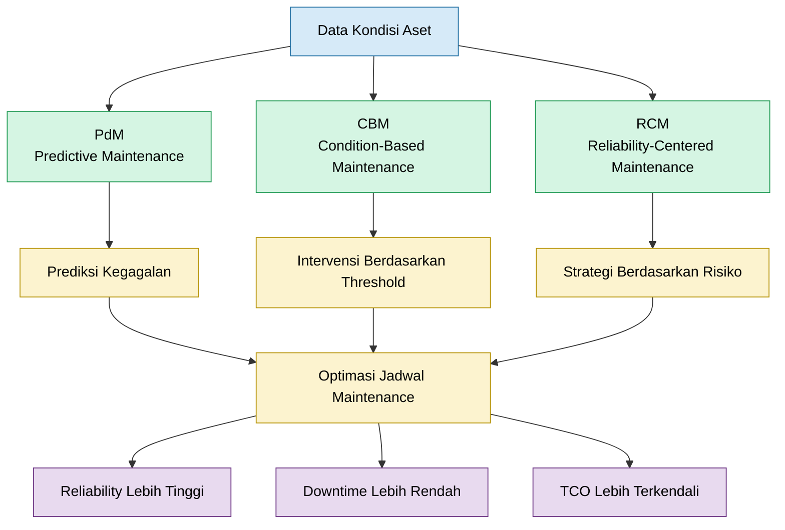
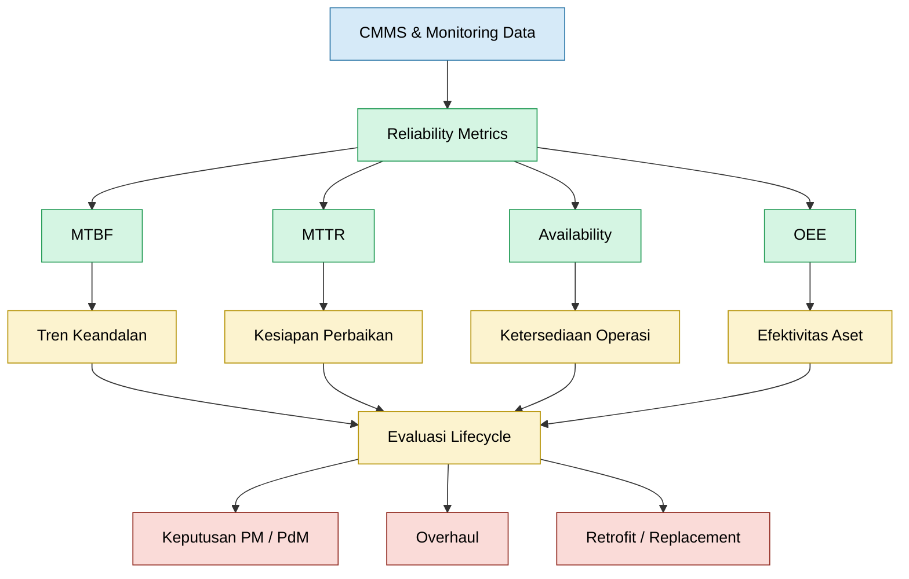
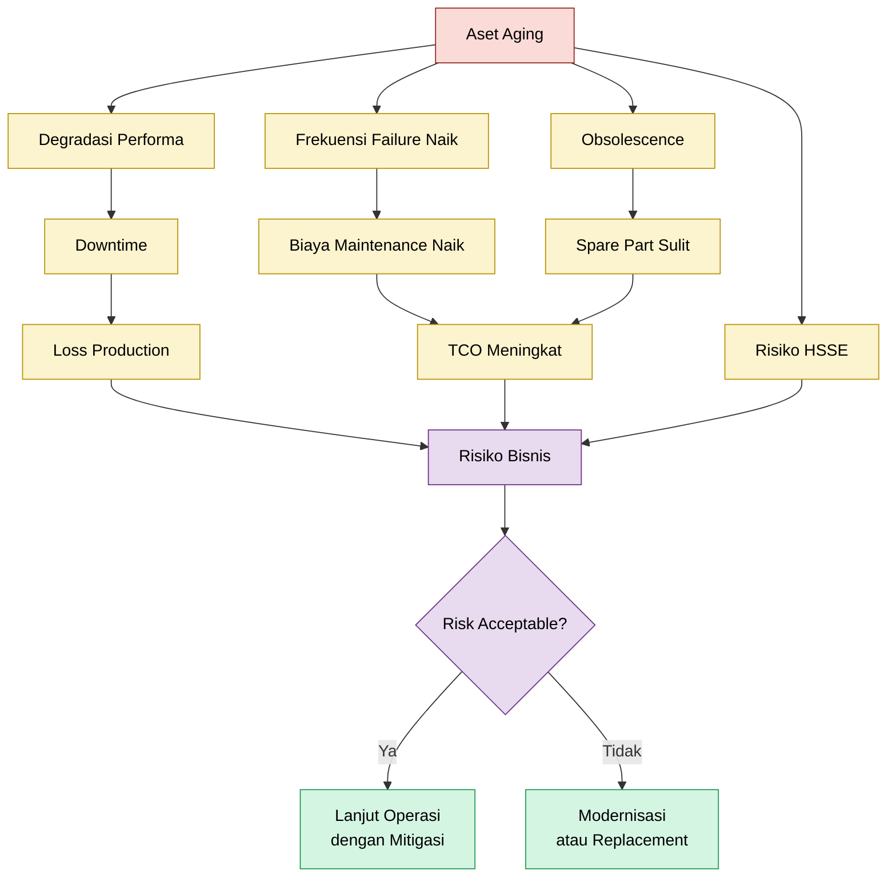
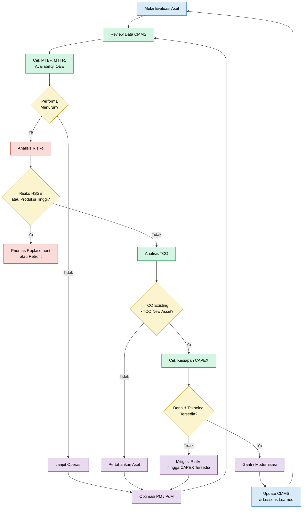
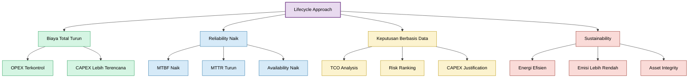
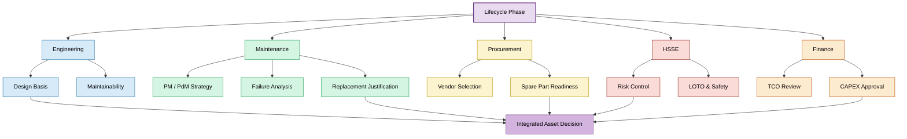
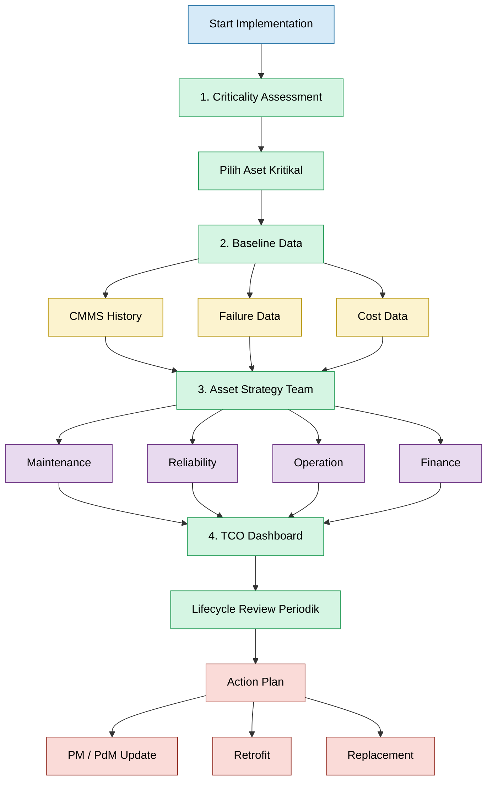
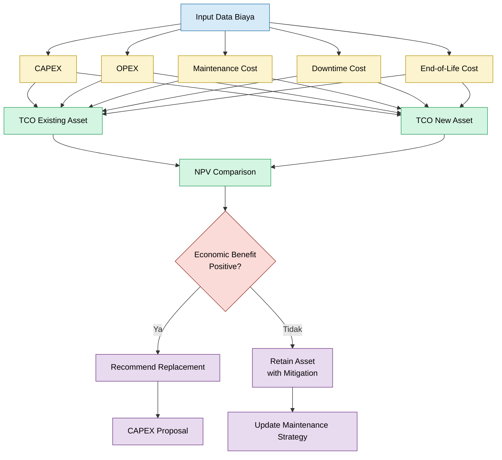

**_Aset Life Cycle di Industri Petrokimia_**

---

- [**I. Pendahuluan \& Tujuan**](#i-pendahuluan--tujuan)
- [**II. Konsep Siklus Hidup, Peran Maintenance, dan Strategi Pemeliharaan**](#ii-konsep-siklus-hidup-peran-maintenance-dan-strategi-pemeliharaan)
  - [**Strategi Pemeliharaan Berbasis Siklus Hidup**](#strategi-pemeliharaan-berbasis-siklus-hidup)
- [**III. Metrik Pendukung \& Risiko Lifecycle**](#iii-metrik-pendukung--risiko-lifecycle)
- [**A. Metrik Teknis untuk Evaluasi Keandalan**](#a-metrik-teknis-untuk-evaluasi-keandalan)
- [**B. Analisis Risiko terhadap Aset Aging**](#b-analisis-risiko-terhadap-aset-aging)
- [**IV. Visualisasi Lifecycle dan Pengambilan Keputusan**](#iv-visualisasi-lifecycle-dan-pengambilan-keputusan)
- [**V. Manfaat Jangka Panjang Pendekatan Lifecycle**](#v-manfaat-jangka-panjang-pendekatan-lifecycle)
- [**VI. Matriks Tanggung Jawab Lintas Fungsi (RACI)**](#vi-matriks-tanggung-jawab-lintas-fungsi-raci)
- [**VII. Rekomendasi Implementasi**](#vii-rekomendasi-implementasi)
- [**VIII. Penutup**](#viii-penutup)
- [**IX. Lampiran**](#ix-lampiran)

---

### **I. Pendahuluan & Tujuan**

Dalam industri petrokimia yang sangat bergantung pada keandalan sistem proses dan kontinuitas operasi, aset produksi merupakan komponen strategis yang menentukan keberhasilan operasional maupun finansial perusahaan. Setiap aset—baik berupa pompa, kompresor, motor listrik, sistem kontrol, maupun infrastruktur pendukung—memiliki **siklus hidup teknis dan ekonomis** yang harus dikelola secara menyeluruh untuk menjamin efisiensi, keamanan, dan keberlanjutan proses.

Pengelolaan aset yang hanya berfokus pada fase operasional atau pemeliharaan tidak lagi memadai. Pendekatan parsial semacam itu seringkali menimbulkan keputusan reaktif, peningkatan biaya tak terencana, serta penurunan availability. Oleh karena itu, diperlukan kerangka strategis yang mencakup seluruh tahapan keberadaan aset sejak tahap perencanaan awal hingga fase akhir masa pakainya. Pendekatan ini dikenal sebagai **manajemen siklus hidup aset (Asset Life Cycle Management)**.


Salah satu tantangan terbesar yang dihadapi oleh perencana teknis dan manajer pemeliharaan adalah menentukan waktu yang tepat untuk mempertahankan, memperbaiki, atau mengganti suatu aset. Keputusan ini memerlukan pertimbangan multidisiplin yang mencakup aspek teknis, keuangan, operasional, dan risiko keselamatan. Keputusan yang terlalu lambat dapat menyebabkan peningkatan downtime, sementara keputusan yang terlalu dini berpotensi menimbulkan pemborosan investasi.

Artikel ini disusun sebagai referensi menyeluruh (**one-stop reference**) untuk para perencana, reliability engineer, dan praktisi manajemen aset di lingkungan industri proses. Tujuannya adalah untuk:

- Menyajikan struktur **siklus hidup aset** secara sistematis dan aplikatif.
- Menjelaskan **peran fungsi pemeliharaan (maintenance)** di setiap fase siklus.
- Menyelaraskan strategi teknis dengan pendekatan berbasis **Total Cost of Ownership (TCO)** dan **risiko operasional**.
- Menyediakan alat bantu visual dan analitis untuk mendukung **pengambilan keputusan teknis** yang lebih objektif dan terukur.



Dengan mengadopsi pendekatan siklus hidup aset, perusahaan tidak hanya dapat mengoptimalkan biaya dan keandalan, tetapi juga memperkuat disiplin perencanaan jangka panjang yang selaras dengan prinsip **Asset Integrity Management**, **ISO 55000**, dan **praktik terbaik industri global**.

<ResourceBox
  title="Korelasi internal-link modul:"
  items={[
    {
      name: 'TCO - Total Cost Ownership',
      href: '/blog/maintenance/tco',
      description: 'TCO - Total Cost Ownership',
    },
    {
      name: 'Transformasi dari Reaktif ke Proaktif',
      href: '/blog/management/maintenance-proactive',
      description: 'Transformasi dari Pemeliharaan Reaktif ke Proaktif',
    },
    {
      name: 'Panduan Troubleshooting & Pemilihan Metode RCA',
      href: '/blog/management/RCA/rca-panduan-lengkap',
      description:
        'Panduan Troubleshooting & Pemilihan Metode RCA Berbasis Risk-Based Maintenance (RBM)',
    },
    {
      name: 'Maintenance System Handbook (MSH)',
      href: '/blog/management/MSH/MSH-panduan-lengkap',
      description:
        'Dari Risk-Based Thinking ke Reliability-Driven Organization - Panduan Lengkap Maintenance System Handbook',
    },
  ]}
/>

[**Kembali ke Atas**](#i-pendahuluan--tujuan)

---

### **II. Konsep Siklus Hidup, Peran Maintenance, dan Strategi Pemeliharaan**

Manajemen aset modern tidak dapat dipisahkan dari pemahaman menyeluruh terhadap **siklus hidup aset**. Pendekatan ini menekankan bahwa setiap aset industri—khususnya dalam sektor petrokimia—memiliki tahapan keberadaan yang jelas, yang masing-masing memerlukan strategi pengelolaan dan intervensi yang berbeda, khususnya dari perspektif fungsi pemeliharaan (maintenance).



Dalam konteks ini, siklus hidup aset dibagi menjadi **8 fase utama**, sebagai berikut:

---

> **1. Perencanaan & Perancangan**

Tahap awal yang menetapkan kebutuhan fungsional, spesifikasi teknis, dan desain awal aset. Pemilihan teknologi, perhitungan kapasitas, serta analisis TCO jangka panjang dilakukan di sini.

**Peran Maintenance:**

- Memberikan input terhadap _maintainability_, _accessibility_, dan _serviceability_ dari desain.
- Menilai risiko pemeliharaan dan potensi bottleneck.
- Memastikan spesifikasi teknis mempertimbangkan kemudahan inspeksi dan pemeliharaan.

---

> **2. Pengadaan (Procurement)**

Proses seleksi vendor, evaluasi teknis-komersial, dan penerbitan kontrak pengadaan aset.

**Peran Maintenance:**

- Memastikan kesesuaian spesifikasi teknis terhadap standar industri (mis. API, ASME).
- Verifikasi ketersediaan spare part dan dokumen pendukung (O&M manual, commissioning spares).
- Keterlibatan dalam _vendor data review_ untuk keperluan dokumentasi CMMS.

---

> **3. Penerimaan & Instalasi**

Aktivitas logistik penerimaan aset di lapangan serta instalasi mekanikal, elektrikal, dan instrumentasi.

**Peran Maintenance:**

- Inspeksi penerimaan (visual, dimensional, tagging).
- Supervisi pemasangan kritikal seperti alignment dan grouting sesuai API RP 686.
- Verifikasi kemudahan akses untuk servis dan pemeliharaan rutin.

---

> **4. Commissioning & Start-up**

Fase transisi dari konstruksi ke operasi, mencakup uji fungsi, interlock, dan integrasi sistem.

**Peran Maintenance:**

- Verifikasi fungsi proteksi dan sistem pelumasan.
- Pengumpulan data baseline performa awal (vibrasi, suhu, tekanan, arus).
- Entri aset dan struktur hierarki ke CMMS serta penyusunan rencana PM awal.

---

> **5. Operasi (Operation)**

Fase aktif di mana aset digunakan dalam proses produksi berkelanjutan.

**Peran Maintenance:**

- Pelaksanaan **Preventive Maintenance (PM)** sesuai jadwal.
- Pemantauan kondisi aset melalui **Predictive Maintenance (PdM)** seperti vibration analysis, infrared thermography, dan ultrasonic testing.
- Evaluasi indikator performa seperti MTBF, MTTR, dan availability untuk pengambilan keputusan berbasis data.

---

> **6. Pemeliharaan & Perbaikan (Maintenance & Repair)**

Kegiatan intervensi teknis terhadap aset untuk menjaga atau memulihkan fungsi operasionalnya.

**Peran Maintenance:**

- Implementasi strategi **Reliability-Centered Maintenance (RCM)**.
- Pelaksanaan shutdown maintenance dan overhaul.
- Root Cause Analysis (RCA) terhadap kegagalan berulang dan update strategi perawatan.

---

> **7. Evaluasi Penggantian / Modernisasi**

Penilaian kelayakan aset untuk dilanjutkan operasionalnya atau diganti.

**Peran Maintenance:**

- Menyusun justifikasi penggantian aset berdasarkan analisis **Total Cost of Ownership (TCO)** dan data historis kegagalan.
- Memberikan rekomendasi teknologi alternatif atau retrofit.
- Koordinasi dengan tim keuangan untuk penyusunan dokumen justifikasi investasi (CAPEX).

---

> **8. Decommissioning & Disposal**

Fase penghentian operasional dan pemindahan atau pembuangan aset.

**Peran Maintenance:**

- Pelaksanaan prosedur isolasi energi (LOTO), draining, dan flushing.
- Dukungan dalam pembongkaran aman dan sesuai regulasi lingkungan/HSSE.
- Dokumentasi lessons learned dan update CMMS untuk penghapusan aset.

---

#### **Strategi Pemeliharaan Berbasis Siklus Hidup**

Agar pemeliharaan berjalan efektif dalam konteks lifecycle, dibutuhkan strategi terintegrasi yang mencakup:



> 🔹 **Integrasi Metodologi PdM, RCM, dan CBM**

- **PdM (Predictive Maintenance):** Mengandalkan data kondisi real-time untuk menentukan waktu pemeliharaan optimal.
- **RCM (Reliability-Centered Maintenance):** Mengidentifikasi strategi pemeliharaan terbaik berdasarkan fungsi dan risiko kegagalan.
- **CBM (Condition-Based Maintenance):** Pemeliharaan berdasarkan ambang batas parameter performa aktual.

> 🔹 **Evaluasi TCO Secara Periodik**

- Mengkaji kembali biaya operasional dan pemeliharaan aset berdasarkan tren performa dan downtime aktual.
- Mempersiapkan data dan analisis yang diperlukan untuk mendukung pengambilan keputusan investasi penggantian.

> 🔹 **Sinergi Lintas Fungsi**

Keterlibatan aktif antar fungsi adalah kunci sukses:

- **Maintenance & Reliability:** Menyediakan data keandalan dan perencanaan kerja teknis.
- **Engineering:** Memastikan desain mendukung lifecycle yang efektif.
- **Finance/Asset Management:** Melakukan justifikasi investasi dan kontrol biaya aset.
- **Operation:** Memberikan umpan balik operasional dan kebutuhan proses.

---

Dengan kerangka ini, fungsi maintenance tidak hanya menjalankan aktivitas perbaikan, tetapi menjadi komponen strategis dalam menjaga integritas, efisiensi biaya, dan keberlanjutan siklus hidup aset secara menyeluruh. Pendekatan ini sejalan dengan praktik terbaik dalam standar **ISO 55000** dan membentuk dasar yang kuat untuk pengambilan keputusan yang berbasis data dan risiko.

[**Kembali ke Atas**](#i-pendahuluan--tujuan)

---

### **III. Metrik Pendukung & Risiko Lifecycle**

Keberhasilan pengelolaan siklus hidup aset sangat bergantung pada kemampuan organisasi dalam **mengukur performa teknis dan mengevaluasi risiko operasional secara kuantitatif**. Dalam praktiknya, pendekatan lifecycle harus didukung oleh indikator performa kunci (Key Performance Indicators – KPI) yang relevan serta kerangka manajemen risiko yang terintegrasi terhadap **kondisi aktual, usia teknis, dan kontribusi aset terhadap proses produksi**.

---

### **A. Metrik Teknis untuk Evaluasi Keandalan**



> 1. **MTBF (Mean Time Between Failures)**

Menggambarkan waktu rata-rata antar dua kegagalan fungsi dari suatu aset. Nilai ini menunjukkan keandalan komponen dan menjadi acuan dalam menyusun strategi pemeliharaan preventif dan penggantian suku cadang.

> 2. **MTTR (Mean Time To Repair)**

Mengukur rata-rata waktu yang dibutuhkan untuk memperbaiki dan mengembalikan aset ke kondisi operasional setelah terjadi kegagalan. Nilai MTTR yang tinggi mencerminkan kompleksitas perbaikan atau kurangnya kesiapan spare part dan SDM.

> 3. **Availability (A)**

Merupakan ukuran ketersediaan aset untuk beroperasi pada saat dibutuhkan. Rumus umumnya:

$$
\text{Availability} = \frac{\text{MTBF}}{\text{MTBF} + \text{MTTR}}
$$

Availability yang tinggi diperlukan untuk menjamin kelancaran operasi tanpa gangguan signifikan.

> 4. **OEE (Overall Equipment Effectiveness)**

Indikator komposit yang menggabungkan **Availability, Performance Efficiency, dan Quality Rate** untuk mengukur efektivitas aset secara menyeluruh.

$$
\text{OEE} = A \times P \times Q
$$

Nilai OEE digunakan sebagai tolok ukur untuk benchmarking antar aset atau antar unit produksi.

> 5. **Pemanfaatan CMMS (Computerized Maintenance Management System)**

Integrasi CMMS yang baik memungkinkan akuisisi dan analisis data performa aset secara real-time, termasuk histori kegagalan, backlog pemeliharaan, dan kepatuhan terhadap jadwal PM. CMMS menjadi platform penting dalam:

- Analisis tren performa aset.
- Validasi keputusan penggantian atau overhaul.
- Estimasi biaya kumulatif per siklus hidup aset (basis TCO).

---

### **B. Analisis Risiko terhadap Aset Aging**



Seiring bertambahnya usia aset, risikonya tidak hanya bersifat teknis tetapi juga berdampak langsung terhadap operasional, keselamatan, dan kinerja keuangan. Berikut beberapa komponen risiko utama yang perlu dievaluasi secara berkala:

> 1. **Downtime Operasional**

Kegagalan pada aset kritikal dapat mengakibatkan downtime signifikan yang berdampak langsung pada hilangnya output produksi, keterlambatan pengiriman produk, dan penalti kontraktual.

> 2. **Dampak HSSE (Health, Safety, Security, and Environment)**

Aset yang menua berpotensi menyebabkan **loss of containment (LOC)**, kebocoran bahan kimia berbahaya, atau bahkan insiden keselamatan kerja. Risiko semacam ini harus dimasukkan dalam penilaian prioritas penggantian, terutama bila aset tersebut tergolong safety-critical.

> 3. **Biaya Implisit vs. Eksplisit**

- **Biaya eksplisit** seperti biaya perbaikan, spare part, dan tenaga kerja sering kali tercatat dan dikendalikan.
- **Biaya implisit** mencakup hilangnya peluang produksi, reputasi perusahaan, serta beban kerja tambahan akibat pemeliharaan reaktif yang tinggi—sering kali luput dari analisis finansial padahal berdampak besar terhadap total biaya kepemilikan (TCO).

> 4. **Risiko dari Keterlambatan Penggantian**

Kegagalan dalam menentukan waktu penggantian aset secara tepat dapat menyebabkan:

- Kenaikan biaya pemeliharaan secara eksponensial.
- Kegagalan sistematis (systemic failure) yang memicu kerusakan berantai.
- Hilangnya integritas sistem dan tidak terpenuhinya spesifikasi produk akibat degradasi performa teknis.

---

> **Kesimpulan Sementara**

Evaluasi lifecycle yang efektif mensyaratkan pendekatan yang berbasis metrik performa dan analisis risiko terintegrasi. Data yang akurat dan terstruktur dari CMMS, dikombinasikan dengan KPI yang tepat dan pemahaman terhadap konsekuensi kegagalan, menjadi dasar kuat dalam:

- Menyusun strategi pemeliharaan jangka panjang.
- Menentukan prioritas investasi penggantian aset.
- Menghindari keputusan berbasis intuisi yang berisiko tinggi dalam lingkungan operasional kritikal seperti industri petrokimia.

[**Kembali ke Atas**](#i-pendahuluan--tujuan)

---

### **IV. Visualisasi Lifecycle dan Pengambilan Keputusan**

Dalam pengelolaan aset industri, visualisasi bukan sekadar alat bantu komunikasi, tetapi merupakan media strategis untuk menyampaikan **alur logis, hubungan antar fase, dan dasar pengambilan keputusan teknis** secara objektif. Representasi visual mempermudah lintas fungsi—engineering, maintenance, finance, dan operasi—untuk memahami siklus hidup aset serta justifikasi finansial dan teknis terhadap intervensi pemeliharaan atau penggantian.

---

> **A. Diagram Siklus Hidup Aset (Asset Life Cycle Wheel)**

Diagram ini menggambarkan **8 fase utama** yang membentuk siklus hidup sebuah aset industri. Bentuk roda (cycle) digunakan untuk menunjukkan sifat berulang dan berkesinambungan dari proses pengelolaan aset, serta pentingnya kesinambungan informasi dari satu fase ke fase berikutnya.

Setiap fase menunjukkan titik masuk peran fungsi maintenance, mulai dari _design for maintainability_ di tahap awal hingga kegiatan _shutdown planning_, analisis _end-of-life_, dan _lessons learned_ setelah decommissioning. Visual ini sangat penting untuk menyelaraskan peran strategis maintenance dengan tujuan bisnis jangka panjang.

---

> **B. Grafik Perbandingan Biaya Kumulatif TCO**

Grafik ini memperlihatkan **akumulasi biaya** antara dua opsi aset: mempertahankan aset eksisting vs menggantinya dengan aset baru. Data yang ditampilkan mencakup:

- Biaya operasional tahunan (energi, pelumas, tenaga kerja).
- Biaya pemeliharaan (preventive, corrective, predictive).
- Biaya downtime (kehilangan produksi).
- Biaya investasi awal (untuk opsi penggantian).
- Proyeksi selama 5–10 tahun, termasuk perhitungan _discounted cash flow_ (NPV).

Kurva biaya kumulatif ini sering kali menunjukkan **break-even point**, yaitu tahun ke berapa penggantian aset akan mulai memberikan keuntungan ekonomi dibanding mempertahankan aset lama. Grafik ini menjadi **alat bantu utama** dalam diskusi antara tim teknis dan tim keuangan.

---

> **C. Flowchart Pengambilan Keputusan Penggantian Aset**

Flowchart ini menyajikan **alur logika berbasis kondisi dan data** untuk menentukan apakah suatu aset sebaiknya dipelihara, dimodernisasi, atau diganti. Elemen-elemen utama meliputi:

1. Status performa aset (berdasarkan MTBF/OEE/availability).
2. Kecenderungan biaya pemeliharaan (tren meningkat tajam?).
3. Risiko downtime terhadap proses produksi atau HSSE.
4. Hasil evaluasi TCO dibanding opsi penggantian.
5. Ketersediaan dana investasi dan teknologi pengganti.
6. Keputusan akhir: lanjut operasional, retrofit, atau ganti baru.

Flowchart ini **memformalkan proses pengambilan keputusan** agar tidak bersifat subjektif atau reaktif. Implementasi alur ini dalam CMMS atau dalam kerangka _Asset Management Strategy_ akan sangat mendukung transparansi dan akuntabilitas keputusan investasi aset.



---

> **Kesimpulan**

Visualisasi lifecycle dan pengambilan keputusan adalah bagian integral dari strategi manajemen aset modern. Kombinasi antara **diagram siklus hidup**, **grafik TCO kumulatif**, dan **flowchart keputusan** memungkinkan organisasi untuk:

- Menyelaraskan pemahaman antar departemen terhadap kondisi dan risiko aset.
- Meningkatkan akurasi perencanaan pemeliharaan dan investasi.
- Membangun pendekatan yang sistematis dan berbasis data untuk setiap keputusan teknis yang berdampak pada keandalan, efisiensi, dan keberlanjutan operasi.

[**Kembali ke Atas**](#i-pendahuluan--tujuan)

---

### **V. Manfaat Jangka Panjang Pendekatan Lifecycle**

Implementasi pendekatan berbasis siklus hidup aset (Asset Life Cycle Approach) memberikan keuntungan yang tidak hanya bersifat teknis, tetapi juga strategis dan finansial dalam jangka panjang. Di lingkungan industri petrokimia yang dituntut untuk menjaga keandalan tinggi, efisiensi operasional, dan kepatuhan terhadap standar keselamatan serta lingkungan, pendekatan ini menjadi pilar utama dalam perencanaan manajemen aset yang berkelanjutan.



---

> **1. Penghematan Biaya Total (Optimalisasi OPEX dan CAPEX)**

Dengan mempertimbangkan **Total Cost of Ownership (TCO)** sejak awal, organisasi dapat menekan biaya operasional (OPEX) seperti downtime, pemeliharaan reaktif, serta konsumsi energi, sekaligus menghindari pemborosan investasi modal (CAPEX) akibat penggantian aset yang tidak terencana atau terlalu dini.

Manfaat ini dicapai melalui:

- Evaluasi biaya kumulatif setiap opsi (retensi vs penggantian).
- Perencanaan investasi penggantian yang lebih akurat dan tidak bersifat darurat.
- Efisiensi anggaran pemeliharaan melalui strategi berbasis data dan risiko.

---

> **2. Peningkatan Availability dan Keandalan Sistem**

Lifecycle approach memastikan bahwa **aset tetap dalam kondisi optimal** selama masa operasionalnya. Hal ini dicapai dengan menyelaraskan desain awal dengan kebutuhan pemeliharaan, menerapkan monitoring berbasis kondisi, serta memastikan setiap fase—dari commissioning hingga decommissioning—dikelola dengan prinsip _asset integrity_ dan _maintainability_.

Dampak jangka panjangnya:

- Meningkatnya MTBF (Mean Time Between Failures).
- Turunnya MTTR (Mean Time to Repair) berkat kesiapan strategi pemeliharaan.
- Tingkat availability dan OEE yang tinggi secara konsisten.

---

> **3. Dukungan terhadap Keberlanjutan dan Efisiensi Energi**

Aset yang dirancang dan dikelola berdasarkan prinsip lifecycle lebih memungkinkan untuk:

- Mengadopsi teknologi baru yang lebih hemat energi.
- Meminimalkan emisi dan jejak karbon melalui efisiensi operasional.
- Mendukung program keberlanjutan perusahaan (corporate sustainability goals) tanpa mengorbankan keandalan sistem.

Ini sejalan dengan tren global seperti **green asset management**, ISO 50001 (Energy Management), dan prinsip-prinsip ESG (Environmental, Social, Governance).

---

> **4. Justifikasi Investasi Penggantian Berbasis Data**

Pendekatan lifecycle memungkinkan **pengambilan keputusan yang objektif dan terdokumentasi** dalam proses penggantian aset, melalui:

- Analisis performa historis dari CMMS dan sistem monitoring.
- Pembandingan TCO kumulatif aset lama vs baru.
- Pemetaan risiko operasional dan dampak terhadap bisnis utama.
- Visualisasi grafik _break-even_ dan NPV dari alternatif solusi.

Dengan demikian, proposal penggantian aset tidak lagi bersifat subjektif atau reaktif, tetapi didukung penuh oleh data teknis, risiko, dan pertimbangan finansial jangka panjang.

---

> **Kesimpulan**

Lifecycle-based asset management bukan hanya alat perencanaan, melainkan juga pendekatan strategis yang secara langsung:

- **Meningkatkan efisiensi biaya dan keandalan teknis.**
- **Memperkuat justifikasi teknis-finansial terhadap keputusan penggantian.**
- **Mendukung program keberlanjutan dan tata kelola aset modern.**

Dengan memanfaatkan seluruh potensi pendekatan ini, organisasi dapat berpindah dari pola manajemen berbasis insiden menuju **manajemen aset berbasis nilai dan risiko**, sebagaimana ditekankan dalam standar internasional seperti **ISO 55000** dan kerangka best practice industri.

[**Kembali ke Atas**](#i-pendahuluan--tujuan)

---

### **VI. Matriks Tanggung Jawab Lintas Fungsi (RACI)**

Dalam pengelolaan siklus hidup aset industri petrokimia, keterlibatan berbagai fungsi organisasi menjadi kunci keberhasilan. Agar setiap tahapan lifecycle dapat dijalankan dengan efisien dan selaras dengan tujuan strategis, perlu ditetapkan peran dan tanggung jawab yang jelas antar fungsi melalui pendekatan **RACI matrix**—Responsible, Accountable, Consulted, dan Informed.

Matriks ini membantu menghindari tumpang tindih peran, mempercepat pengambilan keputusan, dan meningkatkan akuntabilitas dalam pelaksanaan proyek EPC, _turnaround_, maupun operasi rutin.

---

> **A. Struktur RACI Matrix per Fase Siklus Hidup Aset**

| No  | Fase Lifecycle                   | Maintenance | Engineering | Procurement | HSSE | Finance |
| --- | -------------------------------- | ----------- | ----------- | ----------- | ---- | ------- |
| 1   | Perencanaan & Perancangan        | C           | A           | I           | C    | C       |
| 2   | Pengadaan                        | C           | C           | A           | I    | R       |
| 3   | Penerimaan & Instalasi           | R           | A           | C           | C    | I       |
| 4   | Commissioning & Start-up         | R           | A           | C           | R    | I       |
| 5   | Operasi                          | A           | C           | I           | C    | I       |
| 6   | Pemeliharaan & Perbaikan         | A           | C           | I           | C    | I       |
| 7   | Evaluasi Penggantian/Modernisasi | A           | C           | C           | I    | R       |
| 8   | Decommissioning & Disposal       | R           | A           | C           | A    | C       |

**Keterangan:**

- **R (Responsible):** Pelaksana utama aktivitas.
- **A (Accountable):** Penanggung jawab akhir (otoritas persetujuan).
- **C (Consulted):** Pihak yang perlu dikonsultasikan (2 arah).
- **I (Informed):** Pihak yang harus diinformasikan (1 arah).



---

> **B. Peran Lintas Fungsi dalam Konteks Praktis**

- **Maintenance:**
  Fokus pada strategi pemeliharaan, evaluasi kinerja aset, dan penyusunan justification teknis untuk penggantian atau perbaikan besar. Berperan kuat dalam fase operasi, pemeliharaan, serta penghapusan aset.

- **Engineering:**
  Bertanggung jawab atas desain teknis, integrasi sistem, dan validasi maintainability. Peran sentral di fase awal dan saat pembaruan teknologi dilakukan.

- **Procurement:**
  Mengelola pengadaan aset dan layanan terkait, termasuk koordinasi dengan vendor untuk ketersediaan dokumentasi, suku cadang, dan logistik instalasi.

- **HSSE:**
  Terlibat aktif di semua fase yang menyangkut risiko keselamatan, keamanan proses, dan dampak lingkungan, terutama dalam commissioning, operasi, dan decommissioning.

- **Finance:**
  Bertanggung jawab terhadap perencanaan dan kontrol biaya, termasuk analisis TCO, persetujuan CAPEX, dan pemutakhiran data aset untuk kepentingan akuntansi dan depresiasi.

---

> **C. Aplikasi dalam Proyek EPC, Turnaround, dan Operasi Normal**

- **Dalam Proyek EPC:**
  Matriks RACI mendukung koordinasi antar fungsi sejak tahap FEED (Front End Engineering Design), memastikan maintainability masuk dalam desain awal dan pengadaan memenuhi standar lifecycle asset management.

- **Dalam Kegiatan Turnaround:**
  Maintenance bertindak sebagai pemimpin teknis, dengan Engineering sebagai evaluator modifikasi, HSSE sebagai pengawas keselamatan, dan Finance mendukung pengendalian anggaran. Peran RACI sangat krusial untuk memastikan jadwal tidak terganggu.

- **Dalam Operasi Normal:**
  Matriks ini menjaga keberlanjutan strategi pemeliharaan, evaluasi performa aset, dan perencanaan penggantian, sehingga seluruh fungsi bergerak berdasarkan data, risiko, dan prioritas yang jelas.

---

> **Kesimpulan**

Penerapan **RACI matrix** dalam konteks siklus hidup aset memastikan bahwa pengelolaan aset dilakukan secara lintas fungsi, terstruktur, dan akuntabel. Dengan mendefinisikan peran tiap departemen secara eksplisit di setiap fase lifecycle, organisasi dapat:

- Meminimalkan miskomunikasi dan overlap tanggung jawab.
- Meningkatkan efektivitas kolaborasi antar fungsi.
- Menciptakan proses pengambilan keputusan yang transparan dan tepat waktu.

RACI bukan sekadar alat dokumentasi, tetapi **fondasi koordinasi organisasi** dalam manajemen aset yang kompleks dan berisiko tinggi seperti di industri petrokimia.

[**Kembali ke Atas**](#i-pendahuluan--tujuan)

---

### **VII. Rekomendasi Implementasi**

Agar pendekatan manajemen siklus hidup aset (Asset Lifecycle Management) dapat berjalan efektif dan memberi dampak nyata terhadap keandalan dan efisiensi biaya di fasilitas industri petrokimia, diperlukan strategi implementasi yang terstruktur dan berbasis pada keterlibatan lintas fungsi. Rekomendasi berikut dirancang sebagai acuan praktis bagi manajemen dan tim teknis dalam memulai dan mengembangkan pendekatan ini di tingkat plant maupun korporat.



---

> **1. Langkah Awal Integrasi Lifecycle Management di Plant**

Implementasi lifecycle management sebaiknya dimulai dari aset-aset kritikal dengan tingkat kegagalan tinggi atau biaya pemeliharaan yang signifikan. Tahapan yang direkomendasikan:

- **Mapping Aset dan Criticality Assessment:**
  Identifikasi aset yang berpengaruh langsung terhadap produksi, HSSE, dan biaya operasional. Gunakan metode FMEA atau Risk Matrix untuk menentukan prioritas.

- **Baseline Data Collection:**
  Kumpulkan data historis dari CMMS terkait MTBF, downtime, backlog pemeliharaan, dan biaya. Validasi kelengkapan dan akurasi data sebagai dasar perhitungan TCO dan reliability metrics.

- **Integrasi Lifecycle ke Prosedur Eksisting:**
  Revisi SOP pemeliharaan, perencanaan pengadaan, dan penggantian aset agar mencerminkan pendekatan lifecycle secara menyeluruh dari fase desain hingga disposal.

---

> **2. Pembentukan Tim _Asset Strategy & Reliability_**

Tim ini berfungsi sebagai penggerak utama dalam manajemen siklus hidup aset dan koordinasi lintas fungsi. Komposisi tim idealnya mencakup:

- **Maintenance Lead** – Fokus pada strategi PdM, RCM, dan evaluasi performa.
- **Reliability Engineer** – Menganalisis data performa, memodelkan TCO dan risiko.
- **Process Engineer** – Memberi masukan dampak operasional terhadap keandalan aset.
- **Procurement Representative** – Mengelola siklus kontrak dan vendor performance.
- **Finance Analyst** – Mendukung analisis investasi dan budgeting berbasis lifecycle.

Tim ini bertugas menyusun strategi jangka panjang aset (Asset Strategy Plan), memfasilitasi review lifecycle secara periodik, serta mengawal implementasi rekomendasi penggantian atau modernisasi.

---

> **3. Pemanfaatan CMMS dan Dashboard TCO**

Digitalisasi merupakan prasyarat penting dalam mendukung lifecycle management yang efektif. Oleh karena itu:

- **Optimalkan CMMS sebagai data source utama**
  Pastikan semua aktivitas pemeliharaan, data kegagalan, dan histori perbaikan tercatat lengkap dan dapat ditelusuri. Buat struktur aset yang selaras dengan ISO 14224 (equipment taxonomy).

- **Bangun Dashboard TCO dan Lifecycle Metrics**
  Gunakan platform BI (Business Intelligence) untuk menampilkan data performa aset secara real-time, termasuk:

  - Tren biaya pemeliharaan kumulatif vs anggaran.
  - Perbandingan TCO aset lama vs baru.
  - Notifikasi ketika metrik seperti MTBF atau downtime melebihi threshold.

Dashboard ini berfungsi sebagai **alat bantu keputusan** berbasis data yang memungkinkan manajemen melakukan intervensi atau justifikasi penggantian secara cepat dan terukur.

---

> **Kesimpulan**

Pendekatan lifecycle management tidak dapat diterapkan secara parsial atau hanya sebagai program temporer. Ia harus dijalankan sebagai strategi berkelanjutan yang didukung oleh struktur organisasi, proses, data, dan teknologi. Dengan melaksanakan rekomendasi ini, organisasi dapat:

- Meningkatkan efektivitas manajemen aset jangka panjang.
- Menghindari pemborosan akibat keputusan penggantian yang reaktif.
- Menyediakan justifikasi teknis dan finansial yang kredibel untuk pengambilan keputusan strategis.

**Lifecycle bukan hanya kerangka kerja teknis—melainkan fondasi menuju keunggulan operasional dan keberlanjutan industri.**

[**Kembali ke Atas**](#i-pendahuluan--tujuan)

---

### **VIII. Penutup**

Pendekatan manajemen siklus hidup aset (Asset Lifecycle Management) memberikan landasan strategis yang kokoh bagi pengelolaan peralatan industri petrokimia secara terukur, terstruktur, dan berorientasi jangka panjang. Melalui pemahaman menyeluruh atas kedelapan fase siklus hidup—mulai dari perencanaan, pengadaan, commissioning, operasi, hingga decommissioning—organisasi dapat memastikan bahwa setiap aset berkontribusi optimal terhadap keandalan sistem, efisiensi biaya, serta keselamatan dan keberlanjutan operasi.

Poin-poin penting yang dapat disimpulkan dari artikel ini:

- **Fungsi maintenance** memiliki peran kritis di setiap fase siklus hidup aset, bukan hanya saat operasi berlangsung.
- **Integrasi strategi pemeliharaan** seperti PdM, RCM, dan CBM, yang selaras dengan evaluasi TCO, menghasilkan keputusan yang lebih presisi dalam mempertahankan atau mengganti aset.
- **Visualisasi lifecycle**, analisis TCO, dan penerapan RACI matrix meningkatkan transparansi serta koordinasi lintas fungsi.
- **Manfaat jangka panjang** dari pendekatan ini meliputi penghematan biaya total, peningkatan keandalan sistem, dukungan terhadap keberlanjutan, serta justifikasi investasi berbasis data.

Lifecycle bukanlah sekadar konsep akademik, tetapi **alat strategis** yang memungkinkan organisasi berpindah dari manajemen berbasis insiden menuju **manajemen berbasis nilai dan risiko**. Implementasi yang disiplin dan kolaboratif akan memperkuat fondasi operasional, meningkatkan daya saing industri, dan menjamin keberlanjutan jangka panjang aset kritikal dalam ekosistem produksi petrokimia.

[**Kembali ke Atas**](#i-pendahuluan--tujuan)

---

### **IX. Lampiran**

Lampiran berikut disusun untuk mendukung penerapan praktis artikel ini sebagai acuan teknis maupun strategi lintas fungsi dalam pengelolaan siklus hidup aset industri petrokimia.

---

> **1. Template RACI Matrix – Asset Lifecycle**

| No  | Fase Lifecycle                   | Maintenance | Engineering | Procurement | HSSE | Finance |
| --- | -------------------------------- | ----------- | ----------- | ----------- | ---- | ------- |
| 1   | Perencanaan & Perancangan        | C           | A           | I           | C    | C       |
| 2   | Pengadaan                        | C           | C           | A           | I    | R       |
| 3   | Penerimaan & Instalasi           | R           | A           | C           | C    | I       |
| 4   | Commissioning & Start-up         | R           | A           | C           | R    | I       |
| 5   | Operasi                          | A           | C           | I           | C    | I       |
| 6   | Pemeliharaan & Perbaikan         | A           | C           | I           | C    | I       |
| 7   | Evaluasi Penggantian/Modernisasi | A           | C           | C           | I    | R       |
| 8   | Decommissioning & Disposal       | R           | A           | C           | A    | C       |

---

> **2. Tabel Asumsi Studi Kasus TCO**

| Kategori Biaya               | Existing Pump                       | New Pump   |
| ---------------------------- | ----------------------------------- | ---------- |
| Biaya Awal (CAPEX)           | $55,000                             | $65,000    |
| Biaya Operasi per tahun      | $12,000                             | $8,500     |
| Biaya Pemeliharaan per tahun | $12,000 (lama) – $15,000 (proyeksi) | $3,000     |
| Downtime (kerugian/tahun)    | $20,000                             | $0         |
| Proyeksi 5 tahun (TCO)       | ± $220,000                          | ± $122,500 |

---

> **3. Template Perhitungan TCO & NPV (Simplifikasi)**

```text
TCO = ∑ (Operating Cost_t + Maintenance Cost_t + Downtime Cost_t) + Acquisition Cost + End-of-Life Cost

NPV = ∑ (Cash Flow_t / (1 + r)^t) – Initial Investment

Keterangan:
t = tahun ke-n
r = discount rate (misal 8%)
```



📌 Disarankan menggunakan spreadsheet untuk perhitungan dinamis berdasarkan skenario umur aset 5–15 tahun.

---

> **4. Referensi Standar Industri**

| Standar               | Judul / Ruang Lingkup                                          | Aplikasi                                    |
| --------------------- | -------------------------------------------------------------- | ------------------------------------------- |
| **API RP 686**        | _Recommended Practice for Machinery Installation_              | Instalasi peralatan berputar                |
| **API 580**           | _Risk-Based Inspection_                                        | Penilaian risiko aset                       |
| **ISO 55000**         | _Asset Management – Overview_                                  | Sistem manajemen aset                       |
| **ISO 15686**         | _Building and Construction – Life Cycle Costing_               | Metodologi LCC                              |
| **ISO 14224**         | _Collection of Reliability and Maintenance Data for Equipment_ | Taksonomi dan data CMMS                     |
| **ASME Section VIII** | _Pressure Vessels Design Code_                                 | Desain peralatan bertekanan                 |
| **NFPA 70/70E**       | _National Electrical Code / Electrical Safety_                 | Decommissioning dan keselamatan kelistrikan |
| **IEC 60300-3-3**     | _Dependability Management – Life Cycle Cost Analysis_          | Metode perhitungan LCC                      |

---

> **Penutup Lampiran**

Seluruh dokumen pendukung ini dapat dijadikan sebagai **referensi standar operasional** dalam pengembangan kebijakan, prosedur, dan perencanaan strategis manajemen aset. Kombinasi antara framework lifecycle, metrik performa, dan integrasi digital (CMMS/TCO dashboard) memungkinkan pendekatan ini diimplementasikan secara sistematis dan terukur di lingkungan industri petrokimia.

[**Kembali ke Atas**](#i-pendahuluan--tujuan)

---

<small>
  **_Catatan Penyusunan_** Artikel ini disusun sebagai materi edukasi dan
  referensi umum berdasarkan berbagai sumber pustaka, praktik lapangan, serta
  bantuan alat penulisan. Pembaca disarankan untuk melakukan verifikasi lanjutan
  dan penyesuaian sesuai dengan kondisi serta kebutuhan masing-masing sistem.
</small>
