# **_Online Troubleshooting dan Recovery Performance Plate Heat Exchanger akibat Scaling pada Sisi Cooling Water_**

_Pendekatan Praktis Berbasis Data Lapangan pada PHE Water Scrubber Saat Plant Tetap Beroperasi_

---

- [**_Online Troubleshooting dan Recovery Performance Plate Heat Exchanger akibat Scaling pada Sisi Cooling Water_**](#online-troubleshooting-dan-recovery-performance-plate-heat-exchanger-akibat-scaling-pada-sisi-cooling-water)
- [Abstrak](#abstrak)
- [1. Pendahuluan](#1-pendahuluan)
  - [1.1 Latar Belakang](#11-latar-belakang)
  - [1.2 Kondisi Aktual PHE Water Scrubber](#12-kondisi-aktual-phe-water-scrubber)
  - [1.3 Data Aktual dari SCADA](#13-data-aktual-dari-scada)
  - [1.4 Catatan Engineering atas Angka 16.98%](#14-catatan-engineering-atas-angka-1698)
  - [1.5 Tujuan Artikel](#15-tujuan-artikel)
  - [1.6 Ruang Lingkup](#16-ruang-lingkup)
- [2. Prinsip Dasar Perpindahan Panas pada PHE](#2-prinsip-dasar-perpindahan-panas-pada-phe)
  - [2.1 Neraca Panas pada Sisi Process Fluid](#21-neraca-panas-pada-sisi-process-fluid)
  - [2.2 Neraca Panas pada Sisi Cooling Water](#22-neraca-panas-pada-sisi-cooling-water)
  - [2.3 Persamaan Perpindahan Panas Utama](#23-persamaan-perpindahan-panas-utama)
  - [2.4 LMTD untuk PHE Counter-Current](#24-lmtd-untuk-phe-counter-current)
  - [2.5 Approach Temperature](#25-approach-temperature)
  - [2.6 Hubungan Data yang Dibutuhkan untuk Evaluasi Performance](#26-hubungan-data-yang-dibutuhkan-untuk-evaluasi-performance)
  - [2.7 Prinsip Praktis untuk Engineer Lapangan](#27-prinsip-praktis-untuk-engineer-lapangan)
- [3. Evaluasi Data SCADA PHE Water Scrubber](#3-evaluasi-data-scada-phe-water-scrubber)
  - [3.1 Data yang Tersedia](#31-data-yang-tersedia)
  - [3.2 Perhitungan Process Temperature Drop](#32-perhitungan-process-temperature-drop)
  - [3.3 Rasio Heat Removal Berdasarkan Sisi Process](#33-rasio-heat-removal-berdasarkan-sisi-process)
  - [3.4 Interpretasi Angka 16.98%](#34-interpretasi-angka-1698)
  - [3.5 Kenapa Process Temperature Drop Saja Tidak Cukup](#35-kenapa-process-temperature-drop-saja-tidak-cukup)
  - [3.6 Data Tambahan yang Dibutuhkan](#36-data-tambahan-yang-dibutuhkan)
  - [3.7 Minimum Calculation Set untuk Data SCADA Saat Ini](#37-minimum-calculation-set-untuk-data-scada-saat-ini)
- [4. Definisi Performance Loss pada PHE](#4-definisi-performance-loss-pada-phe)
  - [4.1 Definisi Performance Ratio](#41-definisi-performance-ratio)
  - [4.2 Jika Performance Loss Benar-Benar 17%](#42-jika-performance-loss-benar-benar-17)
  - [4.3 Hubungan Performance Loss dengan Overall Heat Transfer Coefficient](#43-hubungan-performance-loss-dengan-overall-heat-transfer-coefficient)
  - [4.4 Tambahan Thermal Resistance Akibat Scaling](#44-tambahan-thermal-resistance-akibat-scaling)
  - [4.5 Interpretasi Fisik Thermal Resistance](#45-interpretasi-fisik-thermal-resistance)
  - [4.6 Perbedaan Antara Duty Tinggi dan Performance Baik](#46-perbedaan-antara-duty-tinggi-dan-performance-baik)
  - [4.7 Makna Teknis Performance Loss yang Valid](#47-makna-teknis-performance-loss-yang-valid)
  - [4.8 Practical Checkpoint untuk Engineer Lapangan](#48-practical-checkpoint-untuk-engineer-lapangan)
  - [4.9 Ringkasan Bab 3 dan Bab 4](#49-ringkasan-bab-3-dan-bab-4)
- [5. Mekanisme Scaling pada Sisi Cooling Water](#5-mekanisme-scaling-pada-sisi-cooling-water)
  - [5.1 Komposisi Umum Cooling Water](#51-komposisi-umum-cooling-water)
  - [5.2 Jenis Scale dan Deposit yang Umum](#52-jenis-scale-dan-deposit-yang-umum)
  - [5.3 Mekanisme Calcium Carbonate Scaling](#53-mekanisme-calcium-carbonate-scaling)
  - [5.4 Tahapan Pembentukan Scale](#54-tahapan-pembentukan-scale)
    - [5.4.1 Supersaturation](#541-supersaturation)
  - [5.4.2 Nucleation](#542-nucleation)
  - [5.4.3 Crystal Growth](#543-crystal-growth)
  - [5.4.4 Deposit Consolidation](#544-deposit-consolidation)
  - [5.5 Lokasi Rawan Scaling pada PHE](#55-lokasi-rawan-scaling-pada-phe)
  - [5.6 Efek Scaling terhadap Thermal Performance](#56-efek-scaling-terhadap-thermal-performance)
  - [5.7 Efek Scaling terhadap Hydraulic Performance](#57-efek-scaling-terhadap-hydraulic-performance)
  - [5.8 Hubungan Scaling, Biofilm, dan Suspended Solid](#58-hubungan-scaling-biofilm-dan-suspended-solid)
  - [5.9 Implikasi Mekanisme Scaling terhadap Strategi Online Cleaning](#59-implikasi-mekanisme-scaling-terhadap-strategi-online-cleaning)
- [6. Troubleshooting Saat Data Cooling Water Terbatas](#6-troubleshooting-saat-data-cooling-water-terbatas)
  - [6.1 Tantangan Instrumentasi Lapangan](#61-tantangan-instrumentasi-lapangan)
  - [6.2 Data Minimum yang Harus Dikumpulkan](#62-data-minimum-yang-harus-dikumpulkan)
  - [6.3 Perhitungan Heat Duty Aktual](#63-perhitungan-heat-duty-aktual)
  - [6.4 Estimasi Cooling Water Flow](#64-estimasi-cooling-water-flow)
  - [6.5 Perhitungan LMTD](#65-perhitungan-lmtd)
  - [6.6 Perhitungan Actual Thermal Conductance](#66-perhitungan-actual-thermal-conductance)
  - [6.7 Approach Temperature sebagai Parameter Harian](#67-approach-temperature-sebagai-parameter-harian)
  - [6.8 Diagnostic Matrix Tanpa Differential Pressure Cooling Water](#68-diagnostic-matrix-tanpa-differential-pressure-cooling-water)
  - [6.9 Alur Troubleshooting Kuantitatif](#69-alur-troubleshooting-kuantitatif)
  - [6.10 Batasan Evaluasi Tanpa Flow dan Pressure](#610-batasan-evaluasi-tanpa-flow-dan-pressure)
  - [6.11 Minimum Field Data Sheet untuk Keputusan Awal](#611-minimum-field-data-sheet-untuk-keputusan-awal)
  - [6.12 Kesimpulan Bab 5 dan Bab 6](#612-kesimpulan-bab-5-dan-bab-6)
- [7. Konsep Online Cleaning Saat Plant Tetap Jalan](#7-konsep-online-cleaning-saat-plant-tetap-jalan)
  - [7.1 Perbedaan Offline Cleaning dan Online Cleaning](#71-perbedaan-offline-cleaning-dan-online-cleaning)
  - [7.2 Target Realistis Online Cleaning](#72-target-realistis-online-cleaning)
  - [7.3 Formula Konsep Online Cleaning](#73-formula-konsep-online-cleaning)
  - [7.4 Batasan Fundamental Online Cleaning](#74-batasan-fundamental-online-cleaning)
  - [7.5 Parameter Keberhasilan Online Cleaning](#75-parameter-keberhasilan-online-cleaning)
  - [7.6 Prinsip Keselamatan Online Cleaning](#76-prinsip-keselamatan-online-cleaning)
- [8. Metode Online Cleaning yang Direkomendasikan](#8-metode-online-cleaning-yang-direkomendasikan)
  - [8.1 Optimasi Cooling Water Chemistry](#81-optimasi-cooling-water-chemistry)
  - [8.2 Shock Dosing Antiscalant](#82-shock-dosing-antiscalant)
  - [8.3 Dispersant Dosing](#83-dispersant-dosing)
  - [8.4 Biodispersant dan Biocide](#84-biodispersant-dan-biocide)
  - [8.5 Controlled pH Adjustment](#85-controlled-ph-adjustment)
  - [8.6 Increase Cooling Water Velocity](#86-increase-cooling-water-velocity)
  - [8.7 Flow Cycling atau Hydraulic Pulsing](#87-flow-cycling-atau-hydraulic-pulsing)
  - [8.8 Online Reverse Flushing Jika Memungkinkan](#88-online-reverse-flushing-jika-memungkinkan)
  - [8.9 Side-Stream Filtration dan Blowdown](#89-side-stream-filtration-dan-blowdown)
  - [8.10 Integrasi Metode Online Cleaning](#810-integrasi-metode-online-cleaning)
  - [8.11 Parameter Evaluasi Setelah Online Cleaning](#811-parameter-evaluasi-setelah-online-cleaning)
  - [8.12 Kesimpulan Bab 7 dan Bab 8](#812-kesimpulan-bab-7-dan-bab-8)
- [9. Sequence Online Cleaning yang Direkomendasikan](#9-sequence-online-cleaning-yang-direkomendasikan)
  - [9.1 Step 1 — Establish Baseline](#91-step-1--establish-baseline)
  - [9.2 Step 2 — Cooling Water Chemical Assessment](#92-step-2--cooling-water-chemical-assessment)
  - [9.3 Step 3 — Correct Cooling Water Chemistry](#93-step-3--correct-cooling-water-chemistry)
  - [9.4 Step 4 — Shock Dose Antiscalant dan Dispersant](#94-step-4--shock-dose-antiscalant-dan-dispersant)
  - [9.5 Step 5 — Biodispersant dan Biocide Jika Ada Biofilm](#95-step-5--biodispersant-dan-biocide-jika-ada-biofilm)
  - [9.6 Step 6 — Increase Hydraulic Shear](#96-step-6--increase-hydraulic-shear)
  - [9.7 Step 7 — Remove Released Deposit](#97-step-7--remove-released-deposit)
  - [9.8 Step 8 — Monitor Performance Recovery](#98-step-8--monitor-performance-recovery)
  - [9.9 Ringkasan Sequence Online Cleaning](#99-ringkasan-sequence-online-cleaning)
- [10. Kriteria Keberhasilan dan Kegagalan Online Cleaning](#10-kriteria-keberhasilan-dan-kegagalan-online-cleaning)
  - [10.1 Kriteria Keberhasilan](#101-kriteria-keberhasilan)
  - [10.2 Catatan Khusus untuk Data Saat Ini](#102-catatan-khusus-untuk-data-saat-ini)
  - [10.3 Contoh Tabel Evaluasi Keberhasilan](#103-contoh-tabel-evaluasi-keberhasilan)
  - [10.4 Interpretasi Kenaikan dan Penurunan Parameter](#104-interpretasi-kenaikan-dan-penurunan-parameter)
    - [10.4.1 Jika $UA$ Naik](#1041-jika-ua-naik)
    - [10.4.2 Jika $T\_{approach}$ Turun](#1042-jika-t_approach-turun)
    - [10.4.3 Jika TSS atau Turbidity Naik Sementara](#1043-jika-tss-atau-turbidity-naik-sementara)
    - [10.4.4 Jika Chemical Residual Stabil](#1044-jika-chemical-residual-stabil)
  - [10.5 Kriteria Kegagalan](#105-kriteria-kegagalan)
  - [10.6 Decision Matrix Keberhasilan dan Kegagalan](#106-decision-matrix-keberhasilan-dan-kegagalan)
  - [10.7 Kapan Online Cleaning Harus Dilanjutkan](#107-kapan-online-cleaning-harus-dilanjutkan)
  - [10.8 Kapan Online Cleaning Harus Dihentikan atau Dievaluasi Ulang](#108-kapan-online-cleaning-harus-dihentikan-atau-dievaluasi-ulang)
  - [10.9 Kapan Harus Rencana Offline Cleaning](#109-kapan-harus-rencana-offline-cleaning)
  - [10.10 Ringkasan Bab 9 dan Bab 10](#1010-ringkasan-bab-9-dan-bab-10)
- [11. Hal yang Tidak Direkomendasikan Saat Plant Online](#11-hal-yang-tidak-direkomendasikan-saat-plant-online)
  - [11.1 Tindakan yang Harus Dihindari](#111-tindakan-yang-harus-dihindari)
    - [11.1.1 Injeksi HCl Langsung ke Branch PHE](#1111-injeksi-hcl-langsung-ke-branch-phe)
    - [11.1.2 Acid Shock Lokal](#1112-acid-shock-lokal)
    - [11.1.3 pH Depression Ekstrem](#1113-ph-depression-ekstrem)
    - [11.1.4 Chemical Tanpa Compatibility Check](#1114-chemical-tanpa-compatibility-check)
    - [11.1.5 Flow Reversal Tanpa Jalur Drain atau Filter](#1115-flow-reversal-tanpa-jalur-drain-atau-filter)
    - [11.1.6 Membuang Debris ke Supply Header](#1116-membuang-debris-ke-supply-header)
    - [11.1.7 Valve Operation Mendadak](#1117-valve-operation-mendadak)
    - [11.1.8 Air Scouring Tanpa Desain Khusus](#1118-air-scouring-tanpa-desain-khusus)
    - [11.1.9 Chemical Treatment Tanpa Target Residual](#1119-chemical-treatment-tanpa-target-residual)
    - [11.1.10 Treatment Tanpa Monitoring $UA$](#11110-treatment-tanpa-monitoring-ua)
  - [11.2 Risiko Teknis](#112-risiko-teknis)
    - [11.2.1 Pitting Corrosion](#1121-pitting-corrosion)
    - [11.2.2 Crevice Corrosion](#1122-crevice-corrosion)
    - [11.2.3 Gasket Degradation](#1123-gasket-degradation)
    - [11.2.4 Plate Leakage](#1124-plate-leakage)
    - [11.2.5 Plugging Downstream](#1125-plugging-downstream)
    - [11.2.6 Water Hammer](#1126-water-hammer)
    - [11.2.7 Thermal Shock](#1127-thermal-shock)
    - [11.2.8 Process Temperature Excursion](#1128-process-temperature-excursion)
    - [11.2.9 Impact to Other Cooling Water Users](#1129-impact-to-other-cooling-water-users)
  - [11.3 Barrier Sebelum Melakukan Online Cleaning](#113-barrier-sebelum-melakukan-online-cleaning)
  - [11.4 Stop Criteria Online Cleaning](#114-stop-criteria-online-cleaning)
  - [11.5 Ringkasan Bab 11](#115-ringkasan-bab-11)
- [12. Template Monitoring untuk Engineer Lapangan](#12-template-monitoring-untuk-engineer-lapangan)
  - [12.1 Template Data Performance](#121-template-data-performance)
  - [12.2 Template Data Cooling Water Chemistry](#122-template-data-cooling-water-chemistry)
  - [12.3 Template Aktivitas Online Cleaning](#123-template-aktivitas-online-cleaning)
  - [12.4 Template Perhitungan Recovery](#124-template-perhitungan-recovery)
  - [12.5 Template Trend Harian](#125-template-trend-harian)
  - [12.6 Alur Monitoring Data](#126-alur-monitoring-data)
  - [12.7 Minimum Acceptance untuk Data Monitoring](#127-minimum-acceptance-untuk-data-monitoring)
  - [12.8 Kesalahan Umum dalam Monitoring](#128-kesalahan-umum-dalam-monitoring)
  - [12.9 Ringkasan Bab 12](#129-ringkasan-bab-12)
- [13. Rekomendasi Implementasi di Lapangan](#13-rekomendasi-implementasi-di-lapangan)
  - [13.1 Sebelum Online Cleaning](#131-sebelum-online-cleaning)
  - [13.2 Selama Online Cleaning](#132-selama-online-cleaning)
  - [13.3 Setelah Online Cleaning](#133-setelah-online-cleaning)
  - [13.4 Practical Decision Logic](#134-practical-decision-logic)
  - [13.5 Dokumentasi yang Harus Disimpan](#135-dokumentasi-yang-harus-disimpan)
- [14. Kesimpulan](#14-kesimpulan)

---

# Abstrak

Plate Heat Exchanger atau PHE banyak digunakan pada unit petrokimia karena memiliki **efisiensi perpindahan panas tinggi**, ukuran kompak, dan respons termal yang cepat. Namun, keunggulan tersebut diikuti oleh kelemahan operasional yang penting: PHE sangat sensitif terhadap **scaling**, **fouling**, **plugging**, dan **maldistribution**, terutama pada sisi **cooling water**.

Artikel ini membahas metode **troubleshooting** dan **online recovery performance** PHE pada service **Water Scrubber** dengan kondisi aktual sebagai berikut:

- plant tetap beroperasi;
- PHE tidak dapat di-stop dan diisolasi;
- flow cooling water tidak tersedia di SCADA;
- differential pressure cooling water tidak tersedia;
- supply dan return cooling water kembali ke header-line;
- data utama yang tersedia berasal dari sisi process fluid;
- metode offline cleaning atau CIP ideal belum dapat dilakukan.

Data aktual dari SCADA sisi process menunjukkan:

| Parameter                | Aktual | Design |
| ------------------------ | -----: | -----: |
| Inlet Temperature        |  109°C |  109°C |
| Outlet Temperature       |   56°C |   65°C |
| Process Temperature Drop |   53°C |   44°C |

Berdasarkan data tersebut:

$$
\Delta T_{process,actual}
=
T_{h,in,actual}
-
T_{h,out,actual}
$$

$$
\Delta T_{process,actual}
=
109 - 56
=
53^\circ C
$$

Sedangkan pada kondisi design:

$$
\Delta T_{process,design}
=
T_{h,in,design}
-
T_{h,out,design}
$$

$$
\Delta T_{process,design}
=
109 - 65
=
44^\circ C
$$

Jika flow process dan specific heat process fluid dianggap sama antara kondisi aktual dan design, maka rasio heat removal dari sisi process adalah:

$$
\frac{Q_{actual}}{Q_{design}}
=
\frac{\Delta T_{process,actual}}{\Delta T_{process,design}}
$$

$$
\frac{Q_{actual}}{Q_{design}}
=
\frac{53}{44}
=
1.2045
$$

Dengan kata lain:

$$
Q_{actual}
\approx
120.45\% \, Q_{design}
$$

Artinya, berdasarkan data process temperature saja, heat removal aktual justru terlihat lebih besar dibanding design. Oleh karena itu, data ini **tidak boleh langsung disebut sebagai penurunan performance PHE sebesar 16.98%** tanpa klarifikasi basis perhitungannya.

Angka 16.98% berasal dari perhitungan:

$$
\frac{53 - 44}{53}
\times
100\%
=
16.98\%
$$

Namun, angka tersebut hanya menyatakan bahwa design process temperature drop lebih rendah 16.98% terhadap actual process temperature drop. Angka tersebut **bukan definisi baku performance loss PHE**.

Performance loss PHE akibat scaling harus dievaluasi menggunakan parameter yang lebih lengkap, terutama:

$$
Q_{actual}
$$

$$
\Delta T_{lm}
$$

$$
UA_{actual}
$$

$$
T_{approach}
$$

$$
\frac{UA_{actual}}{UA_{clean}}
$$

Dengan demikian, artikel ini menekankan satu prinsip utama untuk engineer-praktisi lapangan:

> Data temperatur process penting, tetapi tidak cukup untuk menyimpulkan scaling atau performance loss. Performance PHE harus dibuktikan dengan heat duty, LMTD, UA, trend, dan baseline yang comparable.

Untuk kondisi plant tetap running, strategi online recovery yang dibahas dalam artikel ini menggunakan pendekatan:

$$
\boxed{
\text{soften}
\rightarrow
\text{disperse}
\rightarrow
\text{shear}
\rightarrow
\text{remove}
\rightarrow
\text{monitor}
}
$$

Pendekatan ini berarti deposit harus dilunakkan, partikel yang terlepas harus dijaga tetap tersuspensi, gaya geser aliran harus dimanfaatkan, deposit harus dibuang dari sistem, dan seluruh hasilnya harus diverifikasi melalui data performance yang terukur.

[**Kembali ke Atas**](#online-troubleshooting-dan-recovery-performance-plate-heat-exchanger-akibat-scaling-pada-sisi-cooling-water)

---

# 1. Pendahuluan

## 1.1 Latar Belakang

Plate Heat Exchanger atau PHE adalah salah satu jenis heat exchanger yang sangat banyak digunakan pada industri petrokimia, refinery, chemical plant, dan utility system. Pada service **Water Scrubber**, PHE berfungsi untuk menurunkan temperatur process fluid dengan menggunakan cooling water sebagai media pendingin.

Secara umum, PHE dipilih karena memiliki beberapa keunggulan teknis:

- koefisien perpindahan panas tinggi;
- area perpindahan panas besar dalam volume yang relatif kecil;
- respons temperatur cepat terhadap perubahan beban operasi;
- efisien untuk aplikasi liquid-to-liquid heat exchange;
- jumlah plate dapat disesuaikan dengan kebutuhan duty;
- relatif mudah dibuka dan dibersihkan pada kondisi shutdown.

Namun, PHE juga memiliki sensitivitas tinggi terhadap kondisi fluida. Celah antar-plate yang sempit membuat PHE lebih mudah terdampak oleh deposit dibanding beberapa tipe heat exchanger lain. Pada sisi cooling water, permasalahan yang umum terjadi meliputi:

- mineral scaling;
- suspended solid fouling;
- biological fouling;
- corrosion product deposit;
- sludge accumulation;
- partial plugging;
- maldistribution aliran;
- penurunan effective heat transfer area.

Dalam kondisi normal, PHE yang mengalami scaling dapat dibersihkan melalui offline cleaning atau CIP setelah unit diisolasi. Namun, pada plant petrokimia, kondisi ideal tersebut sering tidak tersedia. Plant harus tetap berjalan, process temperature harus tetap dijaga, dan window shutdown belum tentu tersedia. Oleh karena itu, engineer lapangan memerlukan metode evaluasi dan online recovery yang tetap dapat dilakukan tanpa menghentikan operasi.

## 1.2 Kondisi Aktual PHE Water Scrubber

Kondisi aktual yang menjadi dasar pembahasan artikel ini adalah PHE pada service **Water Scrubber** dengan keterbatasan data dan keterbatasan tindakan maintenance sebagai berikut:

- PHE masih beroperasi;
- plant tidak dapat dihentikan;
- PHE tidak dapat diisolasi untuk cleaning;
- flow cooling water tidak tersedia di SCADA;
- local flowmeter cooling water tidak tersedia;
- differential pressure cooling water tidak dapat dibaca;
- supply cooling water dan return cooling water kembali ke header-line;
- data yang tersedia terutama berasal dari sisi process;
- temperatur cooling water harus diambil secara lokal;
- indikasi scaling perlu dikonfirmasi melalui perhitungan performance, bukan asumsi visual.

Kondisi seperti ini sangat umum di lapangan. Engineer sering harus mengambil keputusan dengan data terbatas, tetapi keputusan tersebut tetap harus berbasis angka. Pernyataan seperti “kemungkinan scaling”, “cooling water kurang”, atau “performance turun” tidak cukup untuk menentukan tindakan. Setiap indikasi harus dikonversi menjadi parameter kuantitatif.

Diagram berikut menggambarkan situasi aktual PHE Water Scrubber.

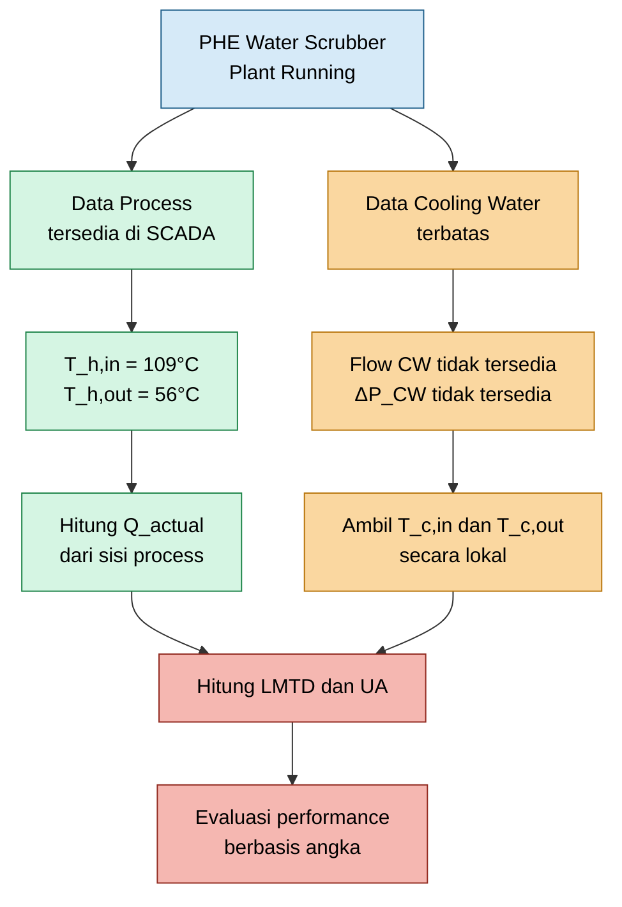

Diagram tersebut menunjukkan bahwa keterbatasan data cooling water tidak boleh menghentikan troubleshooting. Sisi process tetap dapat digunakan sebagai basis awal untuk menghitung heat duty. Namun, untuk menilai performance PHE secara benar, temperatur cooling water inlet dan outlet tetap harus dikumpulkan agar LMTD dan UA dapat dihitung.

## 1.3 Data Aktual dari SCADA

Data sisi process yang tersedia dari SCADA adalah sebagai berikut:

| Parameter                | Aktual | Design | Catatan                             |
| ------------------------ | -----: | -----: | ----------------------------------- |
| Inlet Temperature        |  109°C |  109°C | sama dengan design                  |
| Outlet Temperature       |   56°C |   65°C | aktual lebih rendah 9°C dari design |
| Process Temperature Drop |   53°C |   44°C | aktual lebih besar 9°C dari design  |
| Deviasi yang ditampilkan | 16.98% |      - | perlu klarifikasi basis perhitungan |

Dari data tersebut:

$$
T_{h,in,actual} = 109^\circ C
$$

$$
T_{h,out,actual} = 56^\circ C
$$

Maka:

$$
\Delta T_{process,actual} = 109 - 56 = 53^\circ C
$$

Untuk kondisi design:

$$
T_{h,in,design} = 109^\circ C
$$

$$
T_{h,out,design} = 65^\circ C
$$

Maka:

$$
\Delta T_{process,design} = 109 - 65 = 44^\circ C
$$

Selisih process temperature drop aktual terhadap design adalah:

$$
\Delta T_{process,actual} - \Delta T_{process,design} = 53 - 44 = 9^\circ C
$$

Jika flow process dan specific heat sama, maka heat removal aktual terhadap design adalah:

$$
\frac{Q_{actual}}{Q_{design}} = \frac{53}{44} = 1.2045
$$

atau:

$$
Q_{actual} = 1.2045 , Q_{design}
$$

Dalam persen:

$$
Q_{actual}
\approx
120.45\% , Q_{design}
$$

Interpretasi awalnya adalah process fluid mengalami pendinginan lebih besar dibanding design case. Oleh karena itu, data ini harus dibaca hati-hati. Data tersebut belum membuktikan adanya performance loss. Sebaliknya, jika hanya melihat process temperature drop, PHE tampak sedang membuang panas lebih besar dari design, dengan syarat flow dan specific heat memang sama.

## 1.4 Catatan Engineering atas Angka 16.98%

Angka 16.98% perlu diklarifikasi karena dapat menimbulkan kesimpulan yang salah. Nilai tersebut berasal dari:

$$
\frac{53 - 44}{53} \times 100\% = 16.98\%
$$

Perhitungan tersebut menggunakan actual process temperature drop sebagai denominator. Secara matematis, angka ini menyatakan bahwa design process temperature drop lebih rendah 16.98% terhadap actual process temperature drop.

Namun, definisi tersebut tidak sama dengan performance loss PHE.

Performance loss PHE seharusnya dievaluasi dengan membandingkan actual thermal conductance terhadap clean atau baseline thermal conductance:

$$
\text{Performance Loss} = \frac{UA_{clean} - UA_{actual}}{UA_{clean}} \times 100\%
$$

atau jika menggunakan heat duty, perbandingan harus dilakukan pada kondisi yang comparable:

$$
\text{Duty Loss} = \frac{Q_{clean} - Q_{actual}}{Q_{clean}} \times 100\%
$$

dengan catatan bahwa flow, inlet temperature, cooling water temperature, dan operating load harus sebanding.

Jika hanya tersedia data process temperature, maka kesimpulan performance loss belum valid karena process temperature drop dipengaruhi oleh banyak faktor:

- process flow aktual;
- specific heat process fluid;
- cooling water inlet temperature;
- cooling water flow;
- valve opening;
- process load;
- operating mode;
- exchanger cleanliness;
- heat transfer area efektif;
- design case versus actual operating case.

Dengan demikian, data SCADA harus dijadikan starting point, bukan final conclusion.

## 1.5 Tujuan Artikel

Artikel ini disusun untuk memberikan panduan praktis bagi engineer lapangan dalam menangani indikasi scaling pada PHE Water Scrubber saat plant tetap beroperasi.

Tujuan teknis artikel ini adalah:

- menjelaskan cara membaca data SCADA sisi process secara benar;
- membedakan antara process temperature drop dan performance loss;
- menunjukkan cara menghitung heat duty aktual dari sisi process;
- menjelaskan pentingnya LMTD dan UA dalam evaluasi performance PHE;
- memberikan metode troubleshooting saat flow dan differential pressure cooling water tidak tersedia;
- menjelaskan mekanisme scaling pada sisi cooling water;
- merancang strategi online cleaning tanpa isolasi PHE;
- menentukan parameter kuantitatif untuk memverifikasi keberhasilan online recovery.

Tujuan praktisnya adalah memastikan keputusan maintenance tidak didasarkan pada asumsi, tetapi pada angka yang dapat dihitung dan dibandingkan.

## 1.6 Ruang Lingkup

Ruang lingkup artikel ini dibatasi pada:

- Plate Heat Exchanger untuk liquid-to-liquid service;
- aplikasi pada PHE Water Scrubber;
- cooling water sebagai cooling medium;
- potensi scaling pada sisi cooling water;
- plant tetap running;
- tidak tersedia flow cooling water;
- tidak tersedia differential pressure cooling water;
- data utama berasal dari sisi process;
- fokus pada online troubleshooting dan online recovery;
- bukan pembahasan detail offline CIP atau overhaul PHE.

[**Kembali ke Atas**](#online-troubleshooting-dan-recovery-performance-plate-heat-exchanger-akibat-scaling-pada-sisi-cooling-water)

---

# 2. Prinsip Dasar Perpindahan Panas pada PHE

## 2.1 Neraca Panas pada Sisi Process Fluid

Pada kondisi data cooling water terbatas, sisi process fluid harus menjadi basis utama perhitungan awal. Hal ini karena flow process umumnya lebih tersedia di SCADA dibanding flow cooling water branch.

Heat duty dari sisi process fluid dihitung dengan:

$$
Q_{actual} = \dot{m}_{h} C_{p,h} \left( T_{h,in} - T_{h,out} \right)
$$

di mana:

$$
Q_{actual} = \text{actual heat duty}
$$

$$
\dot{m}_h = \text{mass flow rate process fluid}
$$

$$
C_{p,h} = \text{specific heat process fluid}
$$

$$
T_{h,in} = \text{process fluid inlet temperature}
$$

$$
T_{h,out} = \text{process fluid outlet temperature}
$$

Untuk data aktual PHE Water Scrubber:

$$
T_{h,in,actual} = 109^\circ C
$$

$$
T_{h,out,actual} = 56^\circ C
$$

Sehingga:

$$
\Delta T_{process,actual} = 109 - 56 = 53^\circ C
$$

Maka:

$$
Q_{actual} = \dot{m}_{h} C_{p,h} \left( 53 \right)
$$

Jika satuan yang digunakan adalah:

$$
\dot{m}_h = \text{kg/s}
$$

dan:

$$
C_{p,h} = \text{kJ/kg.K}
$$

maka:

$$
Q_{actual} = \text{kW}
$$

Untuk kondisi design:

$$
T_{h,in,design} = 109^\circ C
$$

$$
T_{h,out,design} = 65^\circ C
$$

Sehingga:

$$
\Delta T_{process,design} = 109 - 65 = 44^\circ C
$$

Maka:

$$
Q_{design} = \dot{m}_{h,design} C_{p,h,design} \left( 44 \right)
$$

Jika:

$$
\dot{m}_{h,actual} = \dot{m}_{h,design}
$$

dan:

$$
C_{p,h,actual} = C_{p,h,design}
$$

maka:

$$
\frac{Q_{actual}}{Q_{design}} = \frac{53}{44} = 1.2045
$$

Namun, asumsi flow dan specific heat sama harus diverifikasi. Jika process flow aktual lebih rendah dari design, maka process temperature drop dapat meningkat walaupun actual heat duty tidak meningkat. Inilah alasan mengapa data temperatur saja tidak boleh langsung digunakan sebagai kesimpulan performance.

## 2.2 Neraca Panas pada Sisi Cooling Water

Secara teori, heat duty yang diserap cooling water adalah:

$$
Q_{CW} = \dot{m}_{CW} C_{p,CW} \left( T_{c,out} - T_{c,in} \right)
$$

di mana:

$$
\dot{m}_{CW} = \text{cooling water mass flow rate}
$$

$$
C_{p,CW} = \text{specific heat cooling water}
$$

$$
T_{c,in} = \text{cooling water inlet temperature}
$$

$$
T_{c,out} = \text{cooling water outlet temperature}
$$

Untuk cooling water, nilai specific heat dapat didekati sebagai:

$$
C_{p,CW}
\approx
4.18
,
\text{kJ/kg.K}
$$

Pada kondisi ideal tanpa heat loss signifikan:

$$
Q_{actual}
\approx
Q_{CW}
$$

Namun, pada kasus ini flow cooling water tidak tersedia. Oleh karena itu, jika temperatur cooling water inlet dan outlet dapat diambil secara lokal, flow cooling water dapat diestimasi dari heat balance:

$$
\dot{m}_{CW,estimated} = \frac{Q_{actual}} { C_{p,CW} \left( T_{c,out} - T_{c,in} \right) }
$$

Persamaan ini sangat berguna di lapangan karena memberikan estimasi cooling water flow tanpa flowmeter permanen. Walaupun estimasi ini tidak seakurat flowmeter, nilainya cukup untuk screening apakah masalah dominan mengarah ke flow limitation atau thermal resistance.

Diagram berikut menunjukkan hubungan neraca panas antara sisi process dan cooling water.

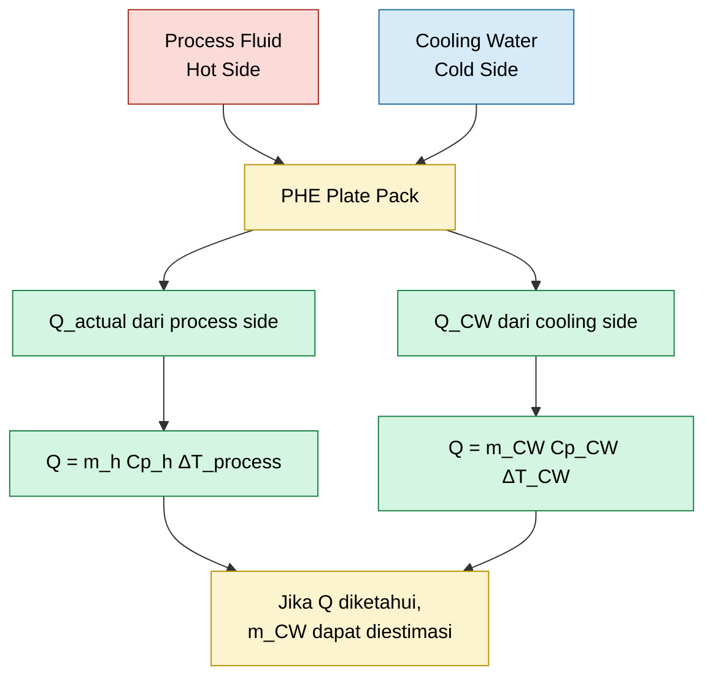

## 2.3 Persamaan Perpindahan Panas Utama

Persamaan dasar perpindahan panas pada heat exchanger adalah:

$$
Q
=

U A \Delta T_{lm}
$$

di mana:

$$
U
=

\text{overall heat transfer coefficient}
$$

$$
A
=

\text{effective heat transfer area}
$$

$$
\Delta T_{lm} = \text{log mean temperature difference}
$$

Untuk evaluasi lapangan, parameter yang sangat berguna adalah:

$$
UA_{actual} = \frac{Q_{actual}} {\Delta T_{lm}}
$$

Parameter $UA$ disebut sebagai actual thermal conductance. Nilai ini sangat praktis karena area plate biasanya tetap selama jumlah plate tidak berubah. Jika $UA$ turun, maka hal tersebut dapat mengindikasikan adanya penurunan kemampuan heat transfer akibat:

- scaling;
- fouling;
- partial plugging;
- maldistribution;
- internal bypass;
- gasket leakage;
- penurunan efektivitas area plate.

Dalam troubleshooting, $UA$ lebih kuat dibanding hanya melihat process temperature drop karena $UA$ mempertimbangkan driving force temperatur antara dua fluida.

## 2.4 LMTD untuk PHE Counter-Current

PHE umumnya dioperasikan mendekati konfigurasi counter-current untuk memperoleh efisiensi termal yang lebih baik. Untuk konfigurasi counter-current, temperature difference di kedua ujung exchanger didefinisikan sebagai:

$$
\Delta T_1 = T_{h,in} - T_{c,out}
$$

$$
\Delta T_2 = T_{h,out} - T_{c,in}
$$

LMTD dihitung dengan:

$$
\Delta T_{lm} = \frac{ \Delta T_1 - \Delta T_2 } { \ln \left( \frac{\Delta T_1}{\Delta T_2} \right) }
$$

Untuk data aktual PHE Water Scrubber:

$$
T_{h,in} = 109^\circ C
$$

$$
T_{h,out} = 56^\circ C
$$

Maka:

$$
\Delta T_1 = 109 - T_{c,out}
$$

dan:

$$
\Delta T_2 = 56 - T_{c,in}
$$

Sehingga:

$$
\Delta T_{lm} = \frac{ \left( 109 - T_{c,out} \right) - \left( 56 - T_{c,in} \right) } { \ln \left[ \frac{ 109 - T_{c,out} } { 56 - T_{c,in} } \right] }
$$

Persamaan ini menunjukkan bahwa nilai $UA$ tidak dapat dihitung dengan benar tanpa data cooling water inlet dan outlet temperature. Karena itu, walaupun flow cooling water tidak tersedia, minimal data berikut harus dikumpulkan:

$$
T_{c,in}
$$

dan:

$$
T_{c,out}
$$

Jika dua data tersebut tidak tersedia di SCADA, maka harus diambil secara lokal menggunakan alat ukur temperatur yang tervalidasi.

## 2.5 Approach Temperature

Selain $UA$, parameter sederhana yang sangat berguna untuk monitoring harian adalah approach temperature.

Untuk cooler, approach temperature dapat didefinisikan sebagai:

$$
T_{approach} = T_{h,out} - T_{c,in}
$$

Parameter ini menunjukkan seberapa dekat temperatur outlet process terhadap temperatur inlet cooling water. Semakin kecil approach temperature, semakin efektif pendinginan, selama tidak terjadi overcooling yang mengganggu proses.

Untuk kasus aktual:

$$
T_{h,out} = 56^\circ C
$$

Maka:

$$
T_{approach} = 56 - T_{c,in}
$$

Jika contoh nilai lokal cooling water inlet adalah:

$$
T_{c,in} = 32^\circ C
$$

maka:

$$
T_{approach} = 56 - 32 = 24^\circ C
$$

Nilai approach ini harus dibandingkan terhadap clean baseline atau design operating case. Approach temperature yang naik dari baseline dapat mengindikasikan:

- penurunan $UA$;
- scaling;
- fouling;
- cooling water flow rendah;
- maldistribution;
- internal bypass.

Namun, approach temperature juga tidak boleh dibaca sendiri. Approach harus dikaitkan dengan heat duty, cooling water inlet temperature, process flow, dan operating load.

## 2.6 Hubungan Data yang Dibutuhkan untuk Evaluasi Performance

Untuk memperoleh evaluasi performance PHE yang kuat, data harus disusun dalam alur perhitungan berikut:

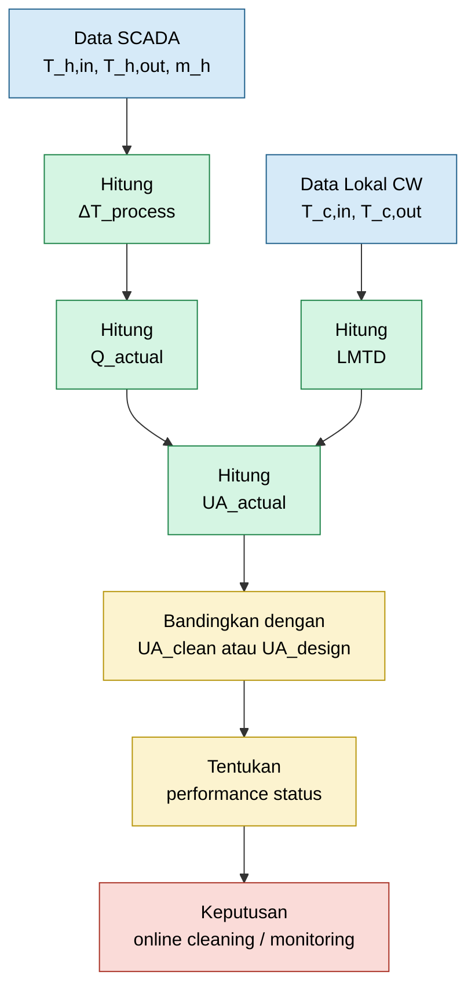

Diagram tersebut menegaskan bahwa data process side saja hanya cukup untuk menghitung $Q_{actual}$, tetapi belum cukup untuk menyimpulkan performance loss. Untuk mengevaluasi performance PHE, engineer tetap memerlukan $T_{c,in}$ dan $T_{c,out}$ agar $\Delta T_{lm}$ dan $UA_{actual}$ dapat dihitung.

## 2.7 Prinsip Praktis untuk Engineer Lapangan

Berdasarkan pembahasan di atas, prinsip praktis yang harus digunakan adalah sebagai berikut:

Pertama, gunakan sisi process sebagai basis awal karena data flow process biasanya tersedia.

$$
Q_{actual} = \dot{m}_{h} C_{p,h} \left( T_{h,in} - T_{h,out} \right)
$$

Kedua, jangan menyimpulkan performance loss hanya dari process temperature drop.

$$
\Delta T_{process}
\neq
\text{performance loss}
$$

Ketiga, ambil data cooling water inlet dan outlet temperature secara lokal bila tidak tersedia di SCADA.

$$
T_{c,in}
\quad
\text{dan}
\quad
T_{c,out}
$$

Keempat, hitung LMTD dan actual thermal conductance.

$$
UA_{actual} = \frac{Q_{actual}} {\Delta T_{lm}}
$$

Kelima, bandingkan $UA_{actual}$ dengan baseline yang comparable.

$$
\text{Performance Ratio} = \frac{UA_{actual}}{UA_{clean}}
$$

Dengan pendekatan ini, engineer lapangan dapat menghindari kesimpulan yang keliru dan dapat menentukan apakah tindakan online cleaning memang diperlukan atau hanya perlu monitoring lanjutan.

[**Kembali ke Atas**](#online-troubleshooting-dan-recovery-performance-plate-heat-exchanger-akibat-scaling-pada-sisi-cooling-water)

---

# 3. Evaluasi Data SCADA PHE Water Scrubber

## 3.1 Data yang Tersedia

Data awal yang tersedia untuk evaluasi PHE Water Scrubber berasal dari sisi process fluid. Data ini penting karena merupakan data aktual dari operasi, bukan asumsi. Namun, data ini tetap harus dibaca dengan benar agar tidak menghasilkan kesimpulan engineering yang keliru.

Data SCADA menunjukkan:

| Parameter                | Aktual | Design |
| ------------------------ | -----: | -----: |
| Inlet Temperature        |  109°C |  109°C |
| Outlet Temperature       |   56°C |   65°C |
| Process Temperature Drop |   53°C |   44°C |

Secara simbolik:

$$
T_{h,in,actual}
=
109^\circ C
$$

$$
T_{h,out,actual}
=
56^\circ C
$$

$$
T_{h,in,design}
=
109^\circ C
$$

$$
T_{h,out,design}
=
65^\circ C
$$

Data ini menunjukkan bahwa temperatur inlet process aktual sama dengan design, yaitu:

$$
T_{h,in,actual}
=
T_{h,in,design}
=
109^\circ C
$$

Namun, outlet temperature aktual lebih rendah daripada design:

$$
T_{h,out,actual}
<
T_{h,out,design}
$$

atau:

$$
56^\circ C
<
65^\circ C
$$

Artinya, dari sisi process temperature saja, process fluid aktual mengalami pendinginan lebih besar dibanding design. Ini adalah poin penting karena data tersebut tidak secara otomatis menunjukkan bahwa PHE mengalami performance loss.

## 3.2 Perhitungan Process Temperature Drop

Process temperature drop didefinisikan sebagai selisih antara temperatur inlet dan outlet process fluid:

$$
\Delta T_{process}
=
T_{h,in}
-
T_{h,out}
$$

Untuk kondisi aktual:

$$
\Delta T_{process,actual}
=
T_{h,in,actual}
-
T_{h,out,actual}
$$

$$
\Delta T_{process,actual}
=
109 - 56
=
53^\circ C
$$

Untuk kondisi design:

$$
\Delta T_{process,design}
=
T_{h,in,design}
-
T_{h,out,design}
$$

$$
\Delta T_{process,design}
=
109 - 65
=
44^\circ C
$$

Deviasi absolut process temperature drop adalah:

$$
\Delta T_{process,actual}
-
\Delta T_{process,design}
=
53 - 44
=
9^\circ C
$$

Dengan demikian, process temperature drop aktual lebih besar daripada design sebesar:

$$
9^\circ C
$$

atau secara rasio:

$$
\frac{\Delta T_{process,actual}}
{\Delta T_{process,design}}
=
\frac{53}{44}
=
1.2045
$$

Rasio ini berarti bahwa temperature drop process aktual adalah sekitar:

$$
120.45\%
$$

terhadap design temperature drop.

## 3.3 Rasio Heat Removal Berdasarkan Sisi Process

Heat duty dari sisi process fluid dihitung dengan:

$$
Q
=
\dot{m}_h C_{p,h}
\left(
T_{h,in}
-
T_{h,out}
\right)
$$

atau:

$$
Q
=
\dot{m}_h C_{p,h}
\Delta T_{process}
$$

Untuk kondisi aktual:

$$
Q_{actual}
=
\dot{m}_{h,actual}
C_{p,h,actual}
\Delta T_{process,actual}
$$

Untuk kondisi design:

$$
Q_{design}
=
\dot{m}_{h,design}
C_{p,h,design}
\Delta T_{process,design}
$$

Jika diasumsikan bahwa flow process dan specific heat process fluid sama antara kondisi aktual dan design:

$$
\dot{m}_{h,actual}
=
\dot{m}_{h,design}
$$

dan:

$$
C_{p,h,actual}
=
C_{p,h,design}
$$

maka rasio heat removal dapat disederhanakan menjadi:

$$
\frac{Q_{actual}}{Q_{design}}
=
\frac{\Delta T_{process,actual}}
{\Delta T_{process,design}}
$$

Dengan data yang tersedia:

$$
\frac{Q_{actual}}{Q_{design}}
=
\frac{53}{44}
=
1.2045
$$

Sehingga:

$$
Q_{actual}
=
1.2045
Q_{design}
$$

atau:

$$
Q_{actual}
\approx
120.45\%
Q_{design}
$$

Ini berarti bahwa, jika flow process dan specific heat memang sama, heat removal aktual sekitar:

$$
20.45\%
$$

lebih tinggi dibanding design duty.

Namun, asumsi tersebut harus diverifikasi. Jika flow process aktual lebih rendah dari design, maka temperature drop dapat menjadi lebih besar tanpa berarti heat duty aktual lebih tinggi. Oleh karena itu, nilai process flow aktual wajib dikonfirmasi.

Diagram berikut menunjukkan logika evaluasi heat removal dari data SCADA sisi process.

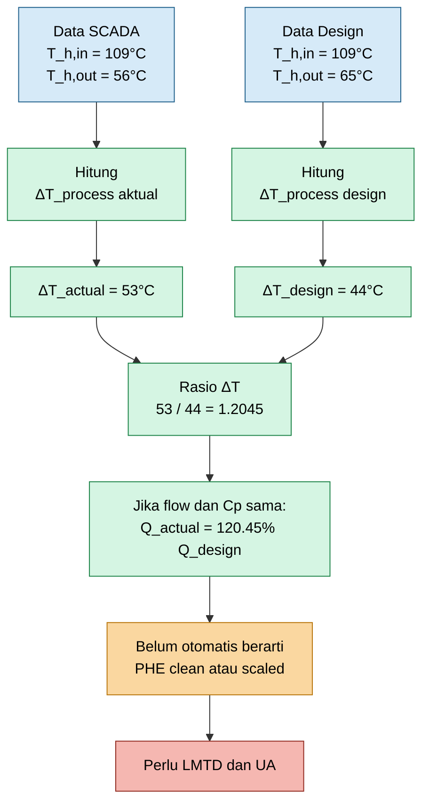

## 3.4 Interpretasi Angka 16.98%

Pada tabel awal terdapat angka penurunan atau deviasi sebesar:

$$
16.98\%
$$

Angka tersebut dapat diperoleh dari persamaan:

$$
\frac{53 - 44}{53}
\times
100\%
=

16.98\%
$$

Secara matematis, persamaan tersebut menggunakan actual process temperature drop sebagai denominator:

$$
\frac{
\Delta T_{process,actual}
-

\Delta T_{process,design}
}
{
\Delta T_{process,actual}
}
\times
100\%
$$

Dengan memasukkan data:

$$
\frac{
53 - 44
}
{
53
}
\times
100\%
=

16.98\%
$$

Namun, secara engineering, angka ini **bukan definisi standar performance loss PHE**.

Angka tersebut hanya menyatakan bahwa design process temperature drop lebih rendah 16.98% terhadap actual process temperature drop. Dengan kata lain:

$$
\Delta T_{process,design}
=

83.02\%
\Delta T_{process,actual}
$$

karena:

$$
100\% - 16.98\% = 83.02\%
$$

Interpretasi tersebut berbeda dari performance loss PHE. Performance loss tidak boleh dihitung hanya dari selisih process temperature drop aktual dan design. Performance loss harus dihitung berdasarkan kemampuan heat exchanger memindahkan panas pada driving force temperatur yang comparable.

Definisi performance loss yang lebih tepat adalah:

$$
\text{Performance Loss}
=

\frac{
UA_{clean}
-

UA_{actual}
}
{
UA_{clean}
}
\times
100\%
$$

atau, jika menggunakan heat duty, hanya boleh digunakan pada kondisi operasi yang comparable:

$$
\text{Duty Loss}
=

\frac{
Q_{clean}
-

Q_{actual}
}
{
Q_{clean}
}
\times
100\%
$$

Syarat comparable berarti kondisi berikut harus sebanding:

- process flow;
- process inlet temperature;
- process fluid composition;
- specific heat;
- cooling water inlet temperature;
- cooling water flow;
- operating load;
- line-up;
- control mode.

Jika syarat tersebut tidak dipenuhi, maka perbandingan langsung antara aktual dan design dapat menghasilkan kesimpulan yang salah.

## 3.5 Kenapa Process Temperature Drop Saja Tidak Cukup

Process temperature drop adalah parameter penting, tetapi bukan parameter final untuk menilai performance PHE.

Secara sederhana:

$$
\Delta T_{process} = T_{h,in} - T_{h,out}
$$

Nilai ini dipengaruhi oleh banyak faktor. Bukan hanya oleh kondisi plate, tetapi juga oleh hydraulic dan operating condition.

Misalnya, process temperature drop dapat meningkat karena:

- process flow turun;
- cooling water flow naik;
- cooling water inlet temperature lebih rendah;
- control valve cooling water lebih terbuka;
- process heat load berubah;
- composition process fluid berubah;
- specific heat berubah;
- exchanger sedang beroperasi pada load berbeda dari design.

Sebaliknya, process temperature drop dapat menurun karena:

- process flow naik;
- cooling water flow turun;
- cooling water inlet temperature naik;
- fouling atau scaling meningkat;
- sebagian channel tersumbat;
- terjadi maldistribution;
- terdapat internal bypass;
- area heat transfer efektif menurun.

Oleh karena itu, pernyataan berikut tidak valid sebagai kesimpulan tunggal:

$$
\Delta T_{process}
\text{ berubah}
\Rightarrow
\text{PHE scaling}
$$

Yang benar adalah:

$$
\Delta T_{process}
\text{ berubah}
\Rightarrow
\text{perlu evaluasi } Q, \Delta T_{lm}, UA, \text{ dan baseline}
$$

## 3.6 Data Tambahan yang Dibutuhkan

Untuk menyimpulkan apakah scaling benar-benar terjadi, engineer lapangan harus melengkapi data SCADA dengan data tambahan berikut.

| Data Tambahan                    | Fungsi Engineering                         |
| -------------------------------- | ------------------------------------------ |
| Process flow aktual              | Menghitung actual heat duty                |
| Specific heat process fluid      | Menghindari error perhitungan duty         |
| Cooling water inlet temperature  | Menghitung approach dan LMTD               |
| Cooling water outlet temperature | Menghitung LMTD dan estimasi CW flow       |
| Clean baseline UA                | Pembanding utama performance               |
| Design cooling water flow        | Pembanding estimasi flow                   |
| Cooling water pH                 | Indikasi scaling tendency                  |
| Conductivity                     | Indikasi cycle of concentration            |
| Hardness                         | Indikasi potensi calcium carbonate scaling |
| Alkalinity                       | Indikasi carbonate scaling tendency        |
| Silica                           | Indikasi potensi silica scaling            |
| TSS                              | Indikasi suspended solid fouling           |
| Iron                             | Indikasi corrosion product deposit         |
| Microbiological count            | Indikasi biological fouling                |
| Trend outlet temperature         | Melihat arah degradasi                     |
| Trend UA                         | Bukti kuantitatif performance change       |

Tanpa data tambahan tersebut, kesimpulan hanya berdasarkan process temperature drop akan terlalu lemah untuk dipakai sebagai dasar keputusan online cleaning.

## 3.7 Minimum Calculation Set untuk Data SCADA Saat Ini

Berdasarkan data saat ini, perhitungan minimum yang dapat langsung dilakukan adalah:

$$
\Delta T_{process,actual}
=

53^\circ C
$$

$$
\Delta T_{process,design}
=

44^\circ C
$$

$$
\frac{
\Delta T_{process,actual}
}
{
\Delta T_{process,design}
}
=

1.2045
$$

Namun, perhitungan yang belum dapat dilakukan tanpa data tambahan adalah:

$$
Q_{actual}
=

\dot{m}_{h} C_{p,h}
\Delta T_{process}
$$

karena masih membutuhkan:

$$
\dot{m}_h
$$

dan:

$$
C_{p,h}
$$

Selanjutnya:

$$
UA_{actual}
=

\frac{Q_{actual}}{\Delta T_{lm}}
$$

juga belum dapat dihitung karena masih membutuhkan:

$$
T_{c,in}
$$

dan:

$$
T_{c,out}
$$

Untuk menentukan performance status, engineer harus mencapai minimal perhitungan:

$$
\frac{UA_{actual}}{UA_{clean}}
$$

atau, jika baseline clean belum tersedia:

$$
\frac{UA_{actual}}{UA_{design}}
$$

dengan catatan bahwa perbandingan terhadap design harus dilakukan secara hati-hati karena design case belum tentu sama dengan operating case aktual.

[**Kembali ke Atas**](#online-troubleshooting-dan-recovery-performance-plate-heat-exchanger-akibat-scaling-pada-sisi-cooling-water)

---

# 4. Definisi Performance Loss pada PHE

## 4.1 Definisi Performance Ratio

Performance PHE harus dinilai menggunakan parameter yang mewakili kemampuan exchanger memindahkan panas. Parameter yang paling praktis untuk kondisi lapangan adalah:

$$
UA
$$

Karena:

$$
Q
=

UA
\Delta T_{lm}
$$

maka:

$$
UA
=

\frac{Q}{\Delta T_{lm}}
$$

Performance ratio didefinisikan sebagai:

$$
\text{Performance Ratio}
=

\frac{
UA_{actual}
}
{
UA_{clean}
}
$$

Jika nilai ini mendekati 1, maka performance aktual mendekati clean baseline:

$$
\frac{
UA_{actual}
}
{
UA_{clean}
}
\approx
1
$$

Jika nilai ini lebih kecil dari 1, maka terdapat penurunan thermal conductance:

$$
\frac{
UA_{actual}
}
{
UA_{clean}
}
<
1
$$

Performance loss kemudian dihitung sebagai:

$$
\text{Performance Loss}
=

\left(
1
-

\frac{
UA_{actual}
}
{
UA_{clean}
}
\right)
\times
100\%
$$

atau:

$$
\text{Performance Loss}
=

\frac{
UA_{clean}
-

UA_{actual}
}
{
UA_{clean}
}
\times
100\%
$$

Inilah definisi yang lebih tepat untuk menyatakan penurunan performance PHE akibat scaling atau fouling.

## 4.2 Jika Performance Loss Benar-Benar 17%

Jika setelah dihitung berdasarkan $UA$ ternyata performance loss benar-benar sebesar 17%, maka:

$$
\text{Performance Loss}
=

17\%
$$

Sehingga performance remaining adalah:

$$
\text{Performance Remaining} = 100\% - 17\% = 83\%
$$

Maka:

$$
\frac{
UA_{actual}
}
{
UA_{clean}
}
=

0.83
$$

Artinya, PHE hanya memiliki thermal conductance sebesar 83% dari kondisi clean baseline.

Namun, perlu ditekankan bahwa angka 17% dari tabel SCADA sebelumnya belum dapat langsung dianggap sebagai:

$$
\frac{
UA_{actual}
}
{
UA_{clean}
}
=

0.83
$$

karena angka tersebut berasal dari selisih process temperature drop, bukan dari hasil perhitungan $UA$.

Diagram berikut membedakan dua interpretasi angka 17%.

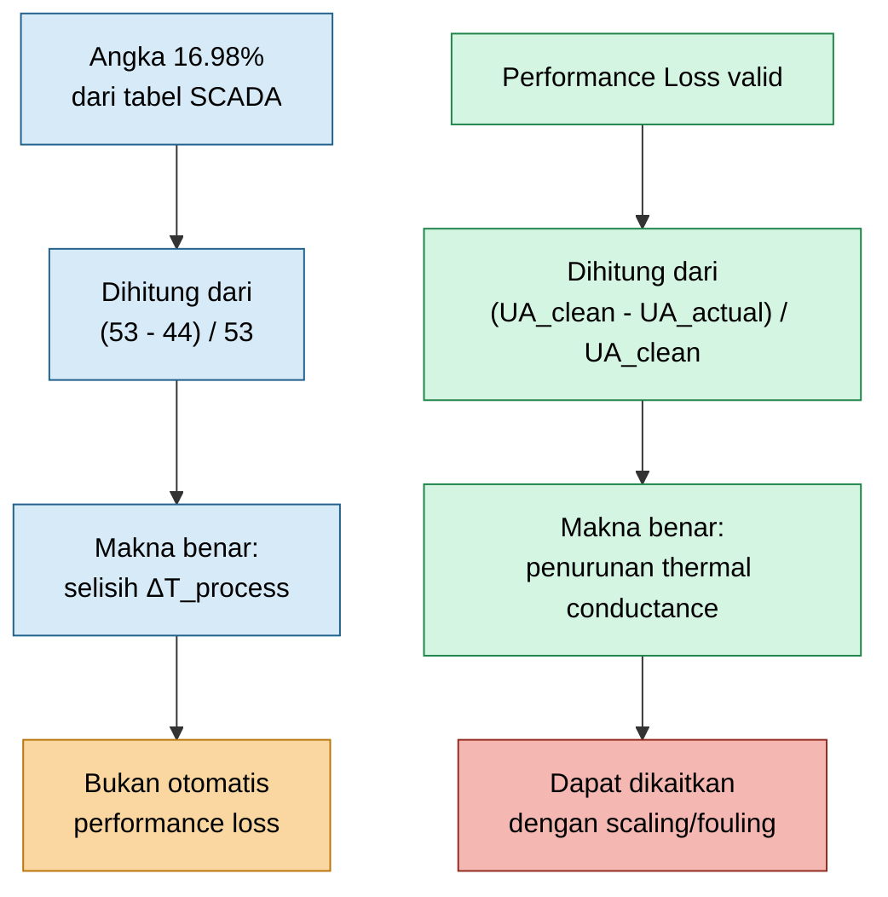

## 4.3 Hubungan Performance Loss dengan Overall Heat Transfer Coefficient

Nilai $UA$ adalah hasil perkalian antara overall heat transfer coefficient dan effective heat transfer area:

$$
UA
=

U A
$$

Jika jumlah plate tidak berubah, tidak ada plate yang dilepas, dan konfigurasi PHE tetap sama, maka area dapat dianggap tetap:

$$
A_{actual}
=

A_{clean}
$$

Dengan asumsi tersebut:

$$
\frac{
UA_{actual}
}
{
UA_{clean}
}
=

\frac{
U_{actual} A
}
{
U_{clean} A
}
$$

Karena $A$ sama, maka:

$$
\frac{
UA_{actual}
}
{
UA_{clean}
}
=

\frac{
U_{actual}
}
{
U_{clean}
}
$$

Jika performance ratio adalah 0.83:

$$
\frac{
UA_{actual}
}
{
UA_{clean}
}
=

0.83
$$

maka:

$$
\frac{
U_{actual}
}
{
U_{clean}
}
=

0.83
$$

atau:

$$
U_{actual}
=

0.83
U_{clean}
$$

Artinya, overall heat transfer coefficient aktual turun menjadi 83% dari clean condition.

## 4.4 Tambahan Thermal Resistance Akibat Scaling

Pada kondisi clean, overall thermal resistance dapat ditulis sebagai:

$$
\frac{1}{U_{clean}}
=

\frac{1}{h_h}
+
\frac{t_p}{k_p}
+
\frac{1}{h_c}
$$

di mana:

$$
h_h
=

\text{heat transfer coefficient sisi process}
$$

$$
h_c
=

\text{heat transfer coefficient sisi cooling water}
$$

$$
t_p
=

\text{plate thickness}
$$

$$
k_p
=

\text{thermal conductivity plate}
$$

Jika terjadi scaling pada sisi cooling water, maka muncul tambahan tahanan termal:

$$
R_{scale}
$$

Sehingga:

$$
\frac{1}{U_{scaled}}
=

\frac{1}{U_{clean}}
+
R_{scale}
$$

Dengan demikian:

$$
R_{scale} = \frac{1}{U_{scaled}} - \frac{1}{U_{clean}}
$$

Jika:

$$
U_{scaled}
=

0.83
U_{clean}
$$

maka:

$$
R_{scale} = \frac{1}{0.83U_{clean}} - \frac{1}{U_{clean}}
$$

$$
R_{scale}
=

\left(
\frac{1}{0.83}
-

1
\right)
\frac{1}{U_{clean}}
$$

Karena:

$$
\frac{1}{0.83}
=

1.2048
$$

maka:

$$
R_{scale}
=

0.2048
\frac{1}{U_{clean}}
$$

atau:

$$
R_{scale}
=

\frac{0.2048}{U_{clean}}
$$

Persamaan ini sangat penting karena menunjukkan bahwa performance loss dapat diterjemahkan menjadi tambahan thermal resistance. Dengan demikian, pembahasan scaling menjadi kuantitatif, bukan hanya observasi kualitatif.

## 4.5 Interpretasi Fisik Thermal Resistance

Scaling bekerja seperti lapisan isolasi pada permukaan plate. Walaupun lapisannya tipis, efeknya dapat signifikan karena heat transfer PHE bergantung pada kontak termal yang intensif dan celah aliran yang sempit.

Secara konseptual:

$$
R_{total}
=

R_{film,hot}
+
R_{plate}
+
R_{film,cold}
+
R_{scale}
$$

Jika $R_{scale}$ meningkat, maka:

$$
R_{total}
\uparrow
$$

Karena:

$$
U
=

\frac{1}{R_{total}}
$$

maka:

$$
U
\downarrow
$$

Selanjutnya:

$$
UA
\downarrow
$$

dan pada driving force temperatur yang sama:

$$
Q
\downarrow
$$

Efek akhirnya pada operasi adalah process outlet temperature cenderung naik jika heat load tetap:

$$
T_{h,out}
\uparrow
$$

Namun dalam data saat ini, outlet temperature aktual justru lebih rendah dari design. Karena itu, dugaan scaling harus dibuktikan melalui trend $UA$, bukan dari data temperatur process tunggal.

Diagram berikut menggambarkan hubungan scaling dengan thermal resistance dan performance.

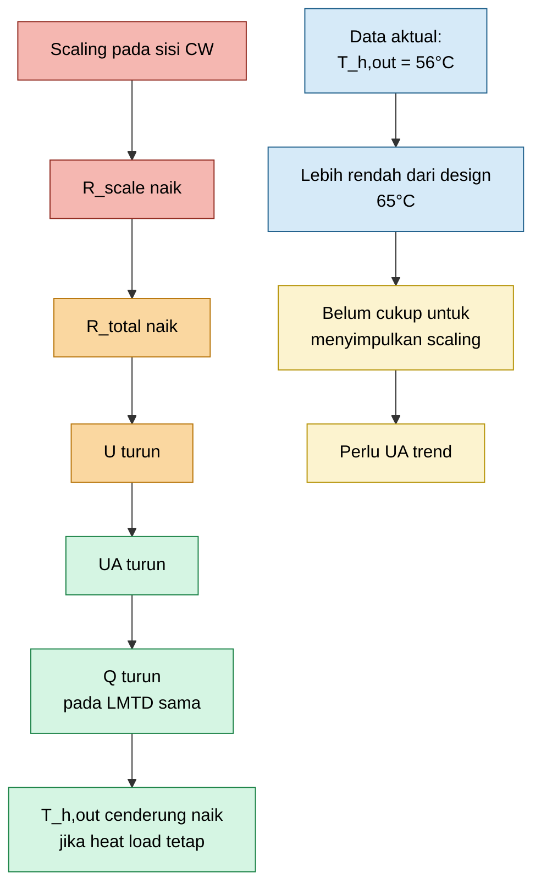

## 4.6 Perbedaan Antara Duty Tinggi dan Performance Baik

Satu kesalahan umum di lapangan adalah menganggap bahwa heat duty tinggi selalu berarti exchanger bersih atau performance baik. Ini tidak selalu benar.

Heat duty ditentukan oleh:

$$
Q
=

UA
\Delta T_{lm}
$$

Nilai $Q$ bisa tinggi karena:

- $UA$ tinggi;
- $\Delta T_{lm}$ tinggi;
- process load tinggi;
- cooling water inlet temperature rendah;
- process flow tinggi;
- operating condition berbeda dari design.

Karena itu, untuk menilai kondisi PHE, engineer harus memisahkan dua pertanyaan:

Pertama:

$$
\text{Berapa panas yang sedang dipindahkan?}
$$

Jawabannya diberikan oleh:

$$
Q_{actual}
$$

Kedua:

$$
\text{Seberapa baik exchanger memindahkan panas pada driving force yang tersedia?}
$$

Jawabannya diberikan oleh:

$$
UA_{actual}
$$

Jika hanya melihat $Q$, maka pengaruh driving force temperatur belum dipisahkan. Jika melihat $UA$, maka performance exchanger dapat dievaluasi lebih objektif.

## 4.7 Makna Teknis Performance Loss yang Valid

Performance loss yang valid berarti bahwa, setelah dikoreksi terhadap driving force temperatur, PHE mengalami penurunan kemampuan perpindahan panas.

Secara teknis, performance loss yang valid ditandai oleh:

$$
UA_{actual}
<
UA_{clean}
$$

atau:

$$
\frac{
UA_{actual}
}
{
UA_{clean}
}
<
1
$$

Jika penurunan ini terjadi bertahap, kemungkinan penyebabnya adalah:

- scaling;
- fouling;
- biological deposit;
- corrosion product deposit;
- suspended solid accumulation.

Jika penurunan terjadi mendadak, kemungkinan penyebabnya adalah:

- plugging;
- line-up berubah;
- air lock;
- valve position berubah;
- internal bypass;
- gasket failure;
- plate pack issue.

Dalam kasus PHE Water Scrubber, data SCADA saat ini belum cukup untuk menyatakan performance loss. Data tersebut baru menunjukkan bahwa:

$$
\Delta T_{process,actual}

>

\Delta T_{process,design}
$$

dan:

$$
T_{h,out,actual}
<
T_{h,out,design}
$$

Kesimpulan yang lebih tepat adalah:

> Berdasarkan data process temperature, PHE aktual menghasilkan outlet process lebih rendah daripada design. Untuk menilai apakah terjadi scaling atau performance loss, diperlukan perhitungan $Q_{actual}$, $\Delta T_{lm}$, dan $UA_{actual}$ serta pembandingan terhadap clean baseline.

## 4.8 Practical Checkpoint untuk Engineer Lapangan

Sebelum menyatakan bahwa PHE mengalami performance loss, engineer lapangan harus menjawab pertanyaan berikut:

1. Apakah process flow aktual sama dengan design?
2. Apakah specific heat process fluid sama dengan design?
3. Apakah cooling water inlet temperature sama dengan design?
4. Apakah cooling water outlet temperature tersedia?
5. Apakah LMTD sudah dihitung?
6. Apakah $UA_{actual}$ sudah dihitung?
7. Apakah ada clean baseline $UA_{clean}$?
8. Apakah perbandingan dilakukan pada load yang comparable?
9. Apakah ada trend penurunan $UA$?
10. Apakah chemistry cooling water menunjukkan scaling tendency?

Jika mayoritas jawaban belum tersedia, maka status engineering yang benar adalah:

$$
\text{Performance status belum dapat dikonfirmasi}
$$

bukan:

$$
\text{PHE sudah pasti scaling}
$$

atau:

$$
\text{PHE performance loss 17\%}
$$

## 4.9 Ringkasan Bab 3 dan Bab 4

Dari data SCADA:

$$
T_{h,in,actual}
=

109^\circ C
$$

$$
T_{h,out,actual}
=

56^\circ C
$$

$$
\Delta T_{process,actual}
=

53^\circ C
$$

Sedangkan design:

$$
T_{h,out,design}
=

65^\circ C
$$

$$
\Delta T_{process,design}
=

44^\circ C
$$

Jika flow dan $C_p$ sama:

$$
\frac{Q_{actual}}{Q_{design}} = \frac{53}{44} = 1.2045
$$

Sehingga:

$$
Q_{actual}
\approx
120.45\%
Q_{design}
$$

Angka 16.98% berasal dari:

$$
\frac{53-44}{53}
\times
100\%
=

16.98\%
$$

Namun angka ini bukan definisi performance loss PHE.

Performance loss yang benar harus dihitung dari:

$$
\text{Performance Loss}
=

\frac{
UA_{clean}
-

UA_{actual}
}
{
UA_{clean}
}
\times
100\%
$$

Dengan demikian, kesimpulan engineering untuk tahap ini adalah:

$$
\boxed{
\Delta T_{process}
\text{ adalah data penting, tetapi belum cukup untuk menyimpulkan scaling atau performance loss.}
}
$$

dan:

$$
\boxed{
\text{Performance PHE harus dibuktikan melalui } Q_{actual},
\Delta T_{lm},
UA_{actual},
\text{ trend, dan baseline yang comparable.}
}
$$

[**Kembali ke Atas**](#online-troubleshooting-dan-recovery-performance-plate-heat-exchanger-akibat-scaling-pada-sisi-cooling-water)

---

# 5. Mekanisme Scaling pada Sisi Cooling Water

## 5.1 Komposisi Umum Cooling Water

Cooling water pada sistem industri petrokimia jarang berupa air murni. Di dalamnya selalu terdapat mineral terlarut, suspended solid, corrosion product, bahan kimia treatment, dan potensi kontaminasi biologis. Pada kondisi tertentu, komponen-komponen tersebut dapat membentuk deposit pada permukaan plate PHE.

Komponen umum yang berperan dalam pembentukan scaling dan fouling adalah:

$$
Ca^{2+}
$$

$$
Mg^{2+}
$$

$$
HCO_3^-
$$

$$
CO_3^{2-}
$$

$$
SO_4^{2-}
$$

$$
SiO_2
$$

$$
Fe^{2+}
\quad \text{dan} \quad
Fe^{3+}
$$

Selain ion terlarut, cooling water juga dapat membawa:

$$
\text{suspended solid}
$$

$$
\text{corrosion product}
$$

$$
\text{microorganism}
$$

$$
\text{biofilm fragment}
$$

Pada PHE, deposit kecil sekalipun dapat berdampak besar karena celah aliran antar-plate relatif sempit. Deposit yang awalnya hanya berupa lapisan tipis dapat berkembang menjadi kombinasi scaling, slime, dan plugging lokal.

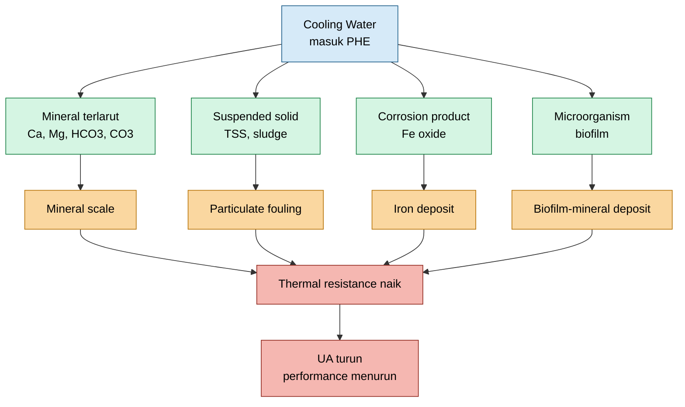

Diagram di atas menunjukkan bahwa scaling pada PHE tidak selalu berupa satu jenis deposit murni. Dalam banyak kasus lapangan, deposit yang terlihat sebagai “scale” sebenarnya merupakan campuran antara mineral scale, biofilm, corrosion product, dan suspended solid.

## 5.2 Jenis Scale dan Deposit yang Umum

Deposit pada sisi cooling water PHE dapat diklasifikasikan berdasarkan karakter kimia dan karakter visualnya.

| Jenis Deposit           | Karakter Umum                                       | Implikasi Cleaning                        |
| ----------------------- | --------------------------------------------------- | ----------------------------------------- |
| Calcium carbonate       | putih atau krem, umum pada pH dan alkalinity tinggi | relatif responsif terhadap acid cleaning  |
| Calcium sulfate         | putih keras, lebih sulit larut                      | lebih sulit dibanding calcium carbonate   |
| Magnesium hydroxide     | terbentuk pada pH tinggi                            | terkait kontrol pH                        |
| Silica scale            | keras, padat, sulit dibersihkan                     | online cleaning sangat terbatas           |
| Iron oxide              | coklat atau merah                                   | terkait corrosion product                 |
| Biofilm-mineral deposit | berlendir, gelap, bercampur mineral                 | perlu biodispersant dan biocide           |
| Sludge deposit          | lunak, mudah berpindah                              | dapat dipengaruhi velocity dan filtration |

Dari sisi troubleshooting, engineer tidak boleh hanya menulis “scaling” tanpa indikasi jenis deposit. Jenis deposit menentukan strategi online cleaning. Misalnya, deposit calcium carbonate dapat dikendalikan dengan antiscalant dan pH control, sedangkan silica scale jauh lebih sulit dihilangkan secara online.

## 5.3 Mekanisme Calcium Carbonate Scaling

Salah satu scale paling umum pada sistem cooling water adalah calcium carbonate. Reaksi pembentukan utamanya adalah:

$$
Ca^{2+}
+
CO_3^{2-}
\rightarrow
CaCO_3
\downarrow
$$

Calcium carbonate juga dapat terbentuk dari dekomposisi bikarbonat:

$$
Ca^{2+}
+
2HCO_3^-
\rightarrow
CaCO_3
\downarrow
+
CO_2
+
H_2O
$$

Simbol:

$$
\downarrow
$$

menunjukkan terbentuknya padatan atau precipitate.

Pembentukan calcium carbonate meningkat saat cooling water memiliki kombinasi kondisi berikut:

- pH tinggi;
- alkalinity tinggi;
- hardness tinggi;
- temperature skin plate tinggi;
- cycle of concentration tinggi;
- velocity cooling water rendah;
- scale inhibitor tidak efektif;
- biofilm terbentuk di permukaan plate;
- suspended solid menjadi inti pertumbuhan kristal.

Pada PHE, temperatur bulk cooling water dapat terlihat normal, tetapi temperatur lokal pada permukaan plate dapat lebih tinggi. Area dekat permukaan plate disebut sebagai wall region atau skin temperature region. Di area ini, kondisi lokal dapat mencapai supersaturation lebih cepat dibanding bulk water.

Secara konsep:

$$
T_{wall}

>

T_{bulk,CW}
$$

Ketika temperatur lokal naik, kecenderungan calcium carbonate untuk mengendap juga meningkat. Jika konsentrasi ion melebihi batas kelarutan, maka terjadi supersaturation:

$$
\text{Ion concentration}

>

\text{solubility limit}
$$

Akibatnya:

$$
CaCO_3
\downarrow
$$

akan mulai menempel pada permukaan plate.

## 5.4 Tahapan Pembentukan Scale

Pembentukan scale tidak terjadi dalam satu langkah. Mekanismenya bertahap dan progresif.

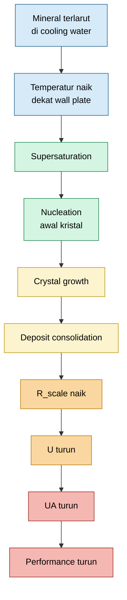

Tahapan tersebut dapat dijelaskan sebagai berikut.

### 5.4.1 Supersaturation

Cooling water membawa mineral terlarut. Ketika fluida melewati PHE dan menyerap panas dari process fluid, temperatur cooling water naik. Di dekat permukaan plate, temperatur lokal dapat lebih tinggi dari temperatur bulk.

Jika kombinasi temperatur, pH, alkalinity, dan hardness membuat ion melebihi batas kelarutannya, terjadi supersaturation:

$$
S
=

\frac{C}{C_{sat}}
$$

di mana:

$$
S
=

\text{supersaturation ratio}
$$

$$
C
=

\text{actual ion concentration}
$$

$$
C_{sat} = \text{saturation concentration}
$$

Jika:

$$
S

>

1
$$

maka air berada dalam kondisi supersaturated dan berpotensi membentuk scale.

### 5.4.2 Nucleation

Nucleation adalah pembentukan inti kristal awal. Titik awal ini sering terjadi pada area yang memiliki:

- roughness permukaan;
- scratch pada plate;
- dead zone;
- velocity rendah;
- biofilm;
- suspended solid;
- gasket edge;
- port area.

Secara praktis, nucleation adalah fase awal yang sering tidak terlihat secara visual tetapi sudah mulai menurunkan efektivitas permukaan heat transfer.

### 5.4.3 Crystal Growth

Setelah inti kristal terbentuk, ion mineral berikutnya lebih mudah menempel pada inti tersebut. Pertumbuhan kristal menyebabkan lapisan deposit semakin tebal:

$$
\delta_s
\uparrow
$$

di mana:

$$
\delta_s = \text{scale thickness}
$$

Semakin tebal scale, semakin besar tahanan termalnya:

$$
R_{scale} = \frac{\delta_s}{k_s}
$$

di mana:

$$
k_s = \text{thermal conductivity scale}
$$

### 5.4.4 Deposit Consolidation

Deposit yang awalnya relatif lunak dapat menjadi lebih keras akibat waktu operasi, temperatur, tekanan, dan reaksi lanjutan dengan corrosion product atau biofilm. Pada tahap ini, deposit semakin sulit dilepaskan dengan online cleaning biasa.

Secara operasional, ini berarti:

$$
\text{early scale}
\rightarrow
\text{lebih mudah dikendalikan online}
$$

sedangkan:

$$
\text{consolidated hard scale}
\rightarrow
\text{sering membutuhkan offline cleaning}
$$

## 5.5 Lokasi Rawan Scaling pada PHE

Pada PHE, scaling jarang terbentuk secara seragam sempurna di seluruh area plate. Deposit cenderung muncul terlebih dahulu di area yang memiliki distribusi aliran buruk atau kondisi lokal yang mendukung presipitasi.

Lokasi rawan meliputi:

- inlet port cooling water;
- area distribusi awal aliran;
- channel dengan velocity rendah;
- gasket groove;
- area dekat dead zone;
- area dengan maldistribution;
- plate surface yang rough;
- channel yang sebagian tersumbat debris;
- area dengan biofilm atau sludge.

Lokasi-lokasi tersebut penting karena online cleaning sangat bergantung pada kemampuan aliran membawa chemical dan menghasilkan shear stress. Area dead zone dan channel yang sudah partially plugged akan lebih sulit mendapatkan treatment yang efektif.

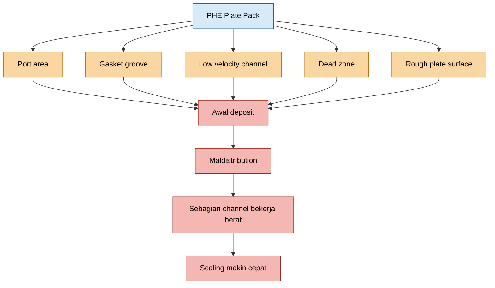

## 5.6 Efek Scaling terhadap Thermal Performance

Scaling bekerja sebagai tahanan panas tambahan. Pada kondisi clean, total thermal resistance dapat ditulis secara sederhana sebagai:

$$
\frac{1}{U_{clean}} = \frac{1}{h_h} + \frac{t_p}{k_p} + \frac{1}{h_c}
$$

Jika scaling terjadi pada sisi cooling water, maka:

$$
\frac{1}{U_{scaled}} = \frac{1}{h_h} + \frac{t_p}{k_p} + \frac{1}{h_c} + R_{scale}
$$

atau:

$$
\frac{1}{U_{scaled}} = \frac{1}{U_{clean}} + R_{scale}
$$

Dengan:

$$
R_{scale} = \frac{\delta_s}{k_s}
$$

Jika:

$$
R_{scale}
\uparrow
$$

maka:

$$
\frac{1}{U_{scaled}}
\uparrow
$$

sehingga:

$$
U_{scaled}
\downarrow
$$

Karena:

$$
Q
=

U A \Delta T_{lm}
$$

dan area plate tetap, maka penurunan $U$ menyebabkan:

$$
UA
\downarrow
$$

dan pada driving force temperatur yang sama:

$$
Q
\downarrow
$$

Jika heat load process tetap tetapi heat removal turun, maka process outlet temperature akan cenderung naik:

$$
T_{h,out}
\uparrow
$$

Namun, dalam kasus PHE Water Scrubber saat ini, data SCADA menunjukkan:

$$
T_{h,out,actual} = 56^\circ C
$$

sedangkan design:

$$
T_{h,out,design} = 65^\circ C
$$

Karena outlet aktual lebih rendah dari design, dugaan scaling tidak boleh disimpulkan hanya dari data outlet temperature. Harus dihitung $UA_{actual}$ dan dibandingkan dengan baseline.

## 5.7 Efek Scaling terhadap Hydraulic Performance

Selain efek termal, scale juga dapat mempersempit area aliran.

Jika deposit menumpuk di channel, maka effective flow area menurun:

$$
A_{flow}
\downarrow
$$

Untuk flow yang sama, velocity lokal dapat meningkat:

$$
v_{local}
\uparrow
$$

Namun, pressure drop juga meningkat:

$$
\Delta P
\uparrow
$$

Secara umum untuk fluida inkompresibel dalam sistem yang sama, pressure drop sering mengikuti kecenderungan:

$$
\Delta P
\propto
\dot{m}^2
$$

Namun pada kasus ini, differential pressure cooling water tidak tersedia:

$$
\Delta P_{CW} = \text{not available}
$$

Karena itu, diagnosis hydraulic tidak dapat dilakukan secara lengkap. Engineer harus menggunakan parameter termal sebagai pengganti utama:

$$
Q_{actual}
$$

$$
\Delta T_{CW}
$$

$$
\Delta T_{lm}
$$

$$
UA_{actual}
$$

$$
T_{approach}
$$

$$
\frac{UA_{actual}}{UA_{clean}}
$$

## 5.8 Hubungan Scaling, Biofilm, dan Suspended Solid

Di lapangan, scaling sering tidak berdiri sendiri. Deposit pada sisi cooling water sering merupakan kombinasi antara mineral, biofilm, dan suspended solid.

Biofilm dapat berperan sebagai perekat:

$$
\text{biofilm}
+
\text{mineral particle}
\rightarrow
\text{adherent deposit}
$$

Suspended solid dapat menjadi inti nucleation:

$$
\text{suspended solid}
+
CaCO_3
\rightarrow
\text{scale growth site}
$$

Corrosion product juga dapat menambah roughness dan menyediakan lokasi penempelan:

$$
Fe_2O_3
+
\text{mineral}
\rightarrow
\text{mixed deposit}
$$

Karena itu, online cleaning tidak cukup hanya dengan antiscalant. Jika deposit mengandung biofilm atau sludge, strategi harus mencakup dispersant, biodispersant, biocide, dan removal melalui blowdown atau filtration.

## 5.9 Implikasi Mekanisme Scaling terhadap Strategi Online Cleaning

Mekanisme scaling memberikan dasar untuk strategi online cleaning. Jika scale terbentuk karena crystal growth, maka treatment harus menghentikan pertumbuhan kristal. Jika deposit melekat karena biofilm, maka biofilm harus dilemahkan. Jika partikel sudah terlepas, maka partikel harus dibuang dari sistem.

Secara ringkas:

$$
\text{scale growth}
\Rightarrow
\text{antiscalant}
$$

$$
\text{particle redeposition}
\Rightarrow
\text{dispersant}
$$

$$
\text{biofilm binding}
\Rightarrow
\text{biodispersant and biocide}
$$

$$
\text{loose deposit}
\Rightarrow
\text{hydraulic shear}
$$

$$
\text{suspended deposit}
\Rightarrow
\text{filtration and blowdown}
$$

Maka konsep online cleaning yang logis adalah:

$$
\boxed{
\text{soften}
\rightarrow
\text{disperse}
\rightarrow
\text{shear}
\rightarrow
\text{remove}
\rightarrow
\text{monitor}
}
$$

[**Kembali ke Atas**](#online-troubleshooting-dan-recovery-performance-plate-heat-exchanger-akibat-scaling-pada-sisi-cooling-water)

---

# 6. Troubleshooting Saat Data Cooling Water Terbatas

## 6.1 Tantangan Instrumentasi Lapangan

Pada kasus PHE Water Scrubber, keterbatasan utama adalah data cooling water tidak lengkap. Flow cooling water tidak tersedia, differential pressure cooling water tidak tersedia, dan supply-return cooling water kembali ke header-line. Kondisi ini membatasi kemampuan engineer untuk melakukan hydraulic diagnosis secara langsung.

Kondisi aktual dapat diringkas sebagai berikut:

| Item                                | Status                                 |
| ----------------------------------- | -------------------------------------- |
| Flow process                        | tersedia atau dapat diambil dari SCADA |
| Process inlet temperature           | tersedia di SCADA                      |
| Process outlet temperature          | tersedia di SCADA                      |
| Cooling water flow                  | tidak tersedia                         |
| Cooling water differential pressure | tidak tersedia                         |
| Cooling water inlet temperature     | perlu diambil lokal                    |
| Cooling water outlet temperature    | perlu diambil lokal                    |
| Offline cleaning                    | belum memungkinkan                     |
| Plant status                        | running                                |

Dengan keterbatasan tersebut, troubleshooting harus dilakukan menggunakan pendekatan:

$$
\boxed{
\text{thermal-based diagnosis}
}
$$

bukan:

$$
\boxed{
\text{complete hydraulic diagnosis}
}
$$

Artinya, evaluasi difokuskan pada perhitungan heat duty, LMTD, actual UA, approach temperature, dan trend performance.

## 6.2 Data Minimum yang Harus Dikumpulkan

Walaupun flow cooling water dan $\Delta P_{CW}$ tidak tersedia, masih ada data minimum yang wajib dikumpulkan. Tanpa data ini, diagnosis akan kembali menjadi kualitatif dan tidak cukup kuat untuk pengambilan keputusan.

| Parameter    | Sumber                          | Kegunaan                                     |
| ------------ | ------------------------------- | -------------------------------------------- |
| $T_{h,in}$   | SCADA                           | menghitung process temperature drop dan LMTD |
| $T_{h,out}$  | SCADA                           | menghitung duty, approach, dan LMTD          |
| $\dot{m}_h$  | SCADA atau flowmeter            | basis perhitungan heat duty                  |
| $C_{p,h}$    | datasheet, lab, atau simulation | basis perhitungan heat duty                  |
| $T_{c,in}$   | local measurement               | menghitung approach dan LMTD                 |
| $T_{c,out}$  | local measurement               | menghitung LMTD dan estimasi CW flow         |
| pH           | lab atau analyzer               | indikasi scaling tendency                    |
| conductivity | lab atau analyzer               | indikasi cycle of concentration              |
| hardness     | lab                             | indikasi calcium carbonate scaling           |
| alkalinity   | lab                             | indikasi carbonate scaling                   |
| silica       | lab                             | indikasi silica scale                        |
| TSS          | lab                             | indikasi suspended solid fouling             |
| iron         | lab                             | indikasi corrosion product deposit           |
| microbiology | lab                             | indikasi biofouling                          |

Data temperatur lokal cooling water harus diambil dengan cara yang konsisten. Jika menggunakan portable temperature probe atau clamp-on sensor, metode pengukuran harus sama antara inlet dan outlet agar error relatif dapat dikurangi.

## 6.3 Perhitungan Heat Duty Aktual

Data SCADA sisi process menunjukkan:

$$
T_{h,in} = 109^\circ C
$$

dan:

$$
T_{h,out} = 56^\circ C
$$

Maka:

$$
\Delta T_{process} = 109 - 56 = 53^\circ C
$$

Heat duty aktual dihitung dengan:

$$
Q_{actual} = \dot{m}_{h} C_{p,h} \left( T_{h,in} - T_{h,out} \right)
$$

Dengan memasukkan data temperatur:

$$
Q_{actual} = \dot{m}_{h} C_{p,h} \left( 109 - 56 \right)
$$

$$
Q_{actual} = \dot{m}_{h} C_{p,h} \left( 53 \right)
$$

Jika:

$$
\dot{m}_h = \text{kg/s}
$$

dan:

$$
C_{p,h} = \text{kJ/kg.K}
$$

maka:

$$
Q_{actual} = \text{kW}
$$

Catatan penting: tanpa $\dot{m}_{h}$ dan $C_{p,h}$, nilai $Q_{actual}$ belum dapat dihitung secara absolut. Yang baru dapat dihitung adalah process temperature drop.

## 6.4 Estimasi Cooling Water Flow

Jika temperatur cooling water inlet dan outlet tersedia, cooling water flow dapat diestimasi dari neraca panas:

$$
Q_{actual} = \dot{m}_{CW} C_{p,CW} \left( T_{c,out} - T_{c,in} \right)
$$

Sehingga:

$$
\dot{m}_{CW,estimated} = \frac{ Q_{actual} } { C_{p,CW} \left( T_{c,out} - T_{c,in} \right) }
$$

Untuk cooling water:

$$
C_{p,CW}
\approx
4.18
,
\text{kJ/kg.K}
$$

Cooling water temperature rise didefinisikan sebagai:

$$
\Delta T_{CW} = T_{c,out} - T_{c,in}
$$

Maka:

$$
\dot{m}_{CW,estimated} = \frac{ Q_{actual} } { C_{p,CW} \Delta T_{CW} }
$$

Interpretasi awal:

Jika:

$$
\Delta T_{CW}
\uparrow
$$

dan process outlet temperature juga naik, maka kemungkinan terdapat keterbatasan flow cooling water.

Jika:

$$
\Delta T_{CW}
\downarrow
$$

tetapi:

$$
T_{h,out}
\uparrow
$$

maka kemungkinan masalahnya adalah penurunan $UA$, misalnya akibat scaling, fouling, biofilm, atau internal bypass.

Namun untuk kasus data saat ini, $T_{h,out}$ aktual masih lebih rendah dari design. Oleh karena itu, interpretasi harus dilakukan terhadap trend, bukan satu snapshot data.

## 6.5 Perhitungan LMTD

Untuk PHE counter-current, temperature difference di kedua ujung exchanger adalah:

$$
\Delta T_1 = T_{h,in} - T_{c,out}
$$

dan:

$$
\Delta T_2 = T_{h,out} - T_{c,in}
$$

Dengan data process aktual:

$$
T_{h,in} = 109^\circ C
$$

$$
T_{h,out} = 56^\circ C
$$

maka:

$$
\Delta T_1 = 109 - T_{c,out}
$$

dan:

$$
\Delta T_2 = 56 - T_{c,in}
$$

LMTD dihitung sebagai:

$$
\Delta T_{lm} = \frac{ \Delta T_1 - \Delta T_2 } { \ln \left( \frac{\Delta T_1}{\Delta T_2} \right) }
$$

atau:

$$
\Delta T_{lm} = \frac{ \left( 109 - T_{c,out} \right) - \left( 56 - T_{c,in} \right) } { \ln \left[ \frac{ 109 - T_{c,out} } { 56 - T_{c,in} } \right] }
$$

Persamaan ini hanya valid jika:

$$
\Delta T_1

>

0
$$

dan:

$$
\Delta T_2

>

0
$$

Jika salah satu temperature difference mendekati nol atau bernilai negatif, maka data harus diperiksa ulang karena dapat menunjukkan salah baca temperatur, salah identifikasi inlet-outlet, atau kondisi crossing temperature yang memerlukan evaluasi lebih lanjut.

## 6.6 Perhitungan Actual Thermal Conductance

Setelah $Q_{actual}$ dan $\Delta T_{lm}$ dihitung, actual thermal conductance dapat diperoleh:

$$
UA_{actual} = \frac{ Q_{actual} } { \Delta T_{lm} }
$$

Nilai ini menjadi parameter utama untuk menentukan apakah performance PHE menurun.

Jika clean baseline tersedia:

$$
\text{Performance Ratio} = \frac{ UA_{actual} } { UA_{clean} }
$$

Jika yang tersedia hanya design data, maka dapat digunakan sementara:

$$
\text{Design-Based Ratio} = \frac{ UA_{actual} } { UA_{design} }
$$

Namun, perbandingan terhadap design harus dilakukan dengan hati-hati karena design case belum tentu sama dengan actual operating case.

Performance loss dihitung sebagai:

$$
\text{Performance Loss} = \left( 1 - \frac{ UA_{actual} } { UA_{clean} } \right) \times 100\%
$$

Jika:

$$
\frac{
UA_{actual}
}
{
UA_{clean}
}
=

0.83
$$

maka:

$$
\text{Performance Loss} = 17\%
$$

Namun, angka 17% harus berasal dari perhitungan $UA$, bukan dari selisih process temperature drop.

## 6.7 Approach Temperature sebagai Parameter Harian

Approach temperature adalah parameter sederhana yang dapat dipakai untuk monitoring harian.

$$
T_{approach} = T_{h,out} - T_{c,in}
$$

Untuk data aktual:

$$
T_{approach} = 56 - T_{c,in}
$$

Jika misalnya:

$$
T_{c,in} = 32^\circ C
$$

maka:

$$
T_{approach} = 56 - 32 = 24^\circ C
$$

Approach temperature harus dibandingkan dengan baseline pada kondisi operasi yang comparable. Jika approach meningkat secara bertahap, dapat menjadi indikasi performance menurun.

Namun, approach juga harus dibaca bersama $Q_{actual}$ dan $UA_{actual}$ karena approach dipengaruhi oleh cooling water inlet temperature dan process load.

## 6.8 Diagnostic Matrix Tanpa Differential Pressure Cooling Water

Karena $\Delta P_{CW}$ tidak tersedia, diagnosis dilakukan menggunakan kombinasi parameter termal.

| Gejala Kuantitatif                                  | Interpretasi Utama                    | Arah Pemeriksaan                             |
| --------------------------------------------------- | ------------------------------------- | -------------------------------------------- |
| $T_{h,out}$ naik dan $\Delta T_{CW}$ tinggi         | flow cooling water kemungkinan rendah | valve, bypass, header differential, air lock |
| $T_{h,out}$ naik dan $\Delta T_{CW}$ rendah         | $UA$ kemungkinan rendah               | scaling, fouling, biofilm, internal bypass   |
| $UA/UA_{clean}$ turun bertahap                      | fouling atau scaling progresif        | online chemical recovery                     |
| $UA/UA_{clean}$ turun mendadak                      | blockage atau line-up berubah         | valve, strainer, air pocket                  |
| $T_{approach}$ naik                                 | cooling effectiveness turun           | scaling, low flow, maldistribution           |
| TSS atau turbidity naik                             | deposit terlepas atau CW kotor        | filtration dan blowdown                      |
| $\Delta T_{process}$ aktual lebih besar dari design | belum tentu scaling                   | cek flow, $C_p$, CW temperature, load        |
| $T_{h,out}$ aktual lebih rendah dari design         | belum tentu PHE bersih                | cek $UA$, LMTD, dan load                     |

Matrix ini harus digunakan sebagai alat bantu, bukan sebagai pengganti perhitungan. Keputusan tetap harus dikaitkan dengan angka $Q$, $\Delta T_{lm}$, dan $UA$.

## 6.9 Alur Troubleshooting Kuantitatif

Alur troubleshooting yang disarankan adalah sebagai berikut.

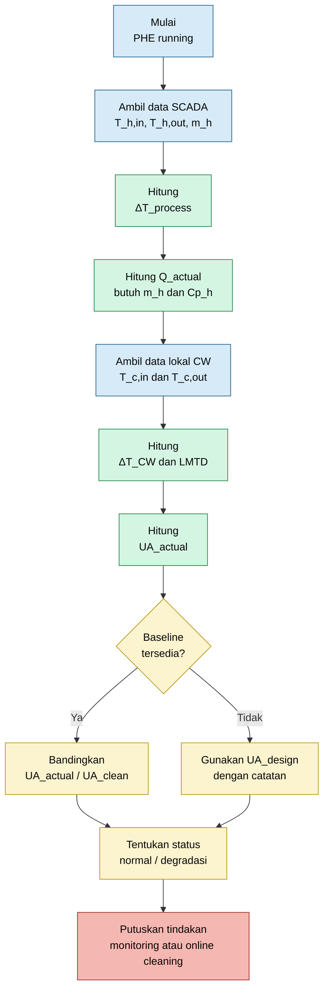

Alur tersebut menjaga agar troubleshooting tetap objektif. Setiap langkah harus menghasilkan angka, bukan hanya kesan lapangan.

## 6.10 Batasan Evaluasi Tanpa Flow dan Pressure

Tanpa flow cooling water dan differential pressure cooling water, terdapat batasan yang harus dinyatakan secara jelas.

Diagnosis yang dapat dilakukan:

$$
\text{thermal-based diagnosis}
$$

Diagnosis yang belum lengkap:

$$
\text{complete hydraulic diagnosis}
$$

Artinya, engineer dapat menilai apakah performance termal menurun, tetapi belum dapat secara penuh memastikan hydraulic restriction tanpa data tambahan seperti:

$$
\dot{m}_{CW}
$$

atau:

$$
\Delta P_{CW}
$$

Walaupun demikian, perhitungan berikut tetap sangat berguna:

$$
Q_{actual}
$$

$$
\Delta T_{CW}
$$

$$
\Delta T_{lm}
$$

$$
UA_{actual}
$$

$$
T_{approach}
$$

$$
\frac{UA_{actual}}{UA_{clean}}
$$

Parameter tersebut cukup untuk menentukan apakah online cleaning layak dicoba, apakah chemical treatment perlu dikoreksi, atau apakah masalah lebih mungkin berasal dari line-up dan flow limitation.

## 6.11 Minimum Field Data Sheet untuk Keputusan Awal

Untuk membuat keputusan awal, engineer lapangan sebaiknya mengisi data minimum berikut.

| Parameter            |           Unit | Nilai Aktual | Catatan                 |
| -------------------- | -------------: | -----------: | ----------------------- |
| $T_{h,in}$           |     $^\circ C$ |          109 | dari SCADA              |
| $T_{h,out}$          |     $^\circ C$ |           56 | dari SCADA              |
| $\Delta T_{process}$ |     $^\circ C$ |           53 | hasil perhitungan       |
| $\dot{m}_h$          | kg/s atau kg/h |          TBD | wajib dikonfirmasi      |
| $C_{p,h}$            |        kJ/kg.K |          TBD | dari datasheet atau lab |
| $T_{c,in}$           |     $^\circ C$ |          TBD | ukur lokal              |
| $T_{c,out}$          |     $^\circ C$ |          TBD | ukur lokal              |
| $\Delta T_{CW}$      |     $^\circ C$ |          TBD | hasil perhitungan       |
| $Q_{actual}$         |             kW |          TBD | hasil perhitungan       |
| $\Delta T_{lm}$      |     $^\circ C$ |          TBD | hasil perhitungan       |
| $UA_{actual}$        |           kW/K |          TBD | hasil perhitungan       |
| $UA/UA_{clean}$      |              - |          TBD | indikator performance   |

Kata “TBD” dalam tabel bukan sekadar placeholder administratif. Itu adalah data gap yang harus ditutup sebelum menyimpulkan performance loss atau efektivitas online cleaning.

## 6.12 Kesimpulan Bab 5 dan Bab 6

Scaling pada sisi cooling water terjadi melalui mekanisme supersaturation, nucleation, crystal growth, dan deposit consolidation. Deposit tersebut menambah thermal resistance:

$$
R_{scale} = \frac{\delta_s}{k_s}
$$

dan menyebabkan:

$$
U
\downarrow
$$

$$
UA
\downarrow
$$

$$
Q
\downarrow
$$

pada driving force yang sama.

Namun, pada kasus PHE Water Scrubber saat ini, data process menunjukkan:

$$
T_{h,out,actual} = 56^\circ C
$$

lebih rendah dari design:

$$
T_{h,out,design} = 65^\circ C
$$

Karena itu, scaling tidak boleh disimpulkan hanya dari satu data temperature snapshot. Evaluasi harus dilanjutkan dengan menghitung:

$$
Q_{actual}
$$

$$
\Delta T_{lm}
$$

$$
UA_{actual}
$$

dan membandingkannya terhadap:

$$
UA_{clean}
$$

atau baseline yang comparable.

Dengan keterbatasan flow cooling water dan $\Delta P_{CW}$, pendekatan yang benar adalah:

$$
\boxed{
\text{thermal-based troubleshooting}
}
$$

menggunakan data process, data temperatur cooling water lokal, chemistry cooling water, dan trend performance. Hanya dengan pendekatan ini keputusan online cleaning dapat dibuat secara objektif dan dapat dipertanggungjawabkan.

[**Kembali ke Atas**](#online-troubleshooting-dan-recovery-performance-plate-heat-exchanger-akibat-scaling-pada-sisi-cooling-water)

---

# 7. Konsep Online Cleaning Saat Plant Tetap Jalan

## 7.1 Perbedaan Offline Cleaning dan Online Cleaning

Pada kondisi ideal, PHE yang mengalami scaling dibersihkan dengan metode **offline cleaning** atau **Cleaning in Place**. PHE dihentikan, diisolasi, di-drain, kemudian dilakukan chemical cleaning secara terkontrol. Metode tersebut memberikan peluang cleaning yang lebih menyeluruh karena chemical dapat difokuskan hanya ke sisi yang bermasalah.

Namun, pada kasus PHE Water Scrubber, kondisi ideal tersebut tidak tersedia. Plant tetap berjalan, PHE tetap menerima process fluid dan cooling water, serta offline cleaning belum memungkinkan. Oleh karena itu, strategi yang digunakan bukan lagi **perfect cleaning**, tetapi **online recovery**.

Perbedaan prinsipnya adalah sebagai berikut:

| Aspek               | Offline Cleaning                        | Online Cleaning                                        |
| ------------------- | --------------------------------------- | ------------------------------------------------------ |
| Status plant        | PHE stop                                | Plant tetap running                                    |
| Isolasi PHE         | Ya                                      | Tidak                                                  |
| Process fluid       | Tidak mengalir                          | Tetap mengalir                                         |
| Cooling water       | Diisolasi atau disirkulasi khusus       | Tetap masuk sistem cooling water                       |
| Chemical strength   | Bisa lebih kuat dan spesifik            | Harus aman untuk seluruh sistem                        |
| Target utama        | Membersihkan deposit semaksimal mungkin | Recovery bertahap dan menahan degradasi                |
| Risiko ke user lain | Rendah karena sistem terisolasi         | Ada, karena chemical masuk jaringan cooling water      |
| Verifikasi hasil    | Inspection dan performance test         | Trend $UA$, $T_{approach}$, $T_{h,out}$, dan chemistry |

Secara sederhana, offline cleaning menjawab pertanyaan:

$$
\text{Bagaimana membersihkan PHE secara maksimal?}
$$

Sedangkan online cleaning menjawab pertanyaan:

$$
\text{Bagaimana memulihkan sebagian performance tanpa menghentikan plant?}
$$

Diagram berikut menunjukkan perbedaan alur kedua metode.

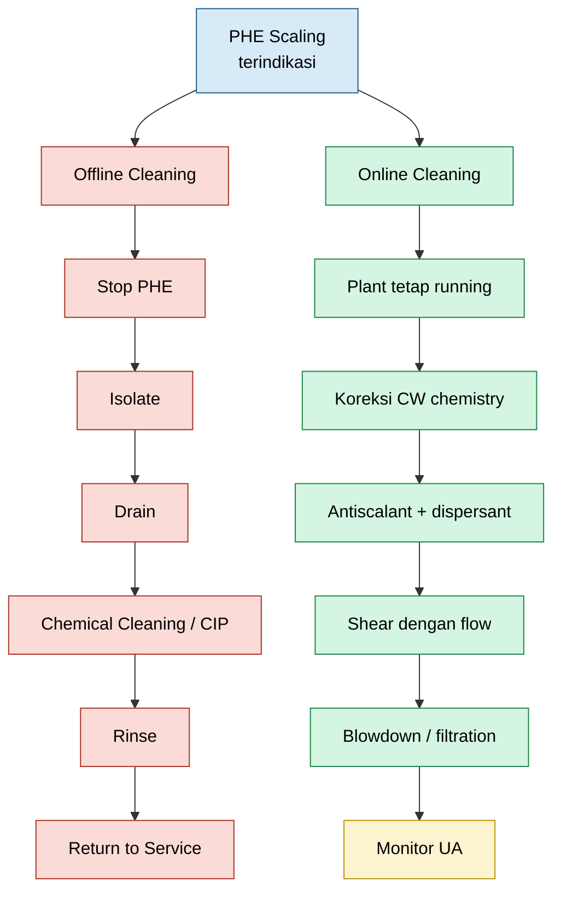

Untuk kondisi plant tetap berjalan, online cleaning harus dipandang sebagai strategi **risk-controlled performance recovery**. Engineer lapangan harus memahami bahwa hasilnya mungkin tidak mengembalikan PHE ke kondisi benar-benar clean, tetapi dapat menahan laju degradasi dan memulihkan sebagian kemampuan perpindahan panas.

## 7.2 Target Realistis Online Cleaning

Target online cleaning tidak boleh disamakan dengan offline cleaning. Pada offline cleaning, targetnya adalah menghilangkan deposit semaksimal mungkin. Pada online cleaning, targetnya adalah mengubah kondisi operasi dan chemistry agar deposit tidak terus tumbuh, deposit yang masih lunak dapat dilemahkan, dan partikel yang terlepas dapat dikeluarkan dari sistem.

Target online cleaning adalah:

$$
\text{stop further scale growth}
$$

$$
\text{soften existing deposit}
$$

$$
\text{disperse loosened particles}
$$

$$
\text{increase hydraulic shear}
$$

$$
\text{remove detached solids}
$$

$$
\text{recover part of lost } UA
$$

Secara performance, jika sebelumnya terbukti dari perhitungan bahwa:

$$
\frac{UA_{actual}}{UA_{clean}} = 0.83
$$

maka online cleaning yang berhasil tidak harus langsung menghasilkan:

$$
\frac{UA_{after}}{UA_{clean}} = 1.00
$$

Target realistis dapat berupa recovery bertahap, misalnya:

$$
\frac{UA_{after}}{UA_{clean}} = 0.88 \text{ sampai } 0.95
$$

Tentu target aktual harus ditetapkan berdasarkan criticality equipment, operating margin, cooling water chemistry, dan historis performa PHE.

Yang penting adalah online cleaning harus menghasilkan perubahan yang terukur, misalnya:

$$
UA_{after}

>

UA_{before}
$$

atau:

$$
T_{approach,after}
<
T_{approach,before}
$$

atau:

$$
T_{h,out,after}
\text{ bergerak ke arah target operasi}
$$

Jika tidak ada perubahan pada $UA$, maka online cleaning belum terbukti efektif.

## 7.3 Formula Konsep Online Cleaning

Konsep online cleaning yang digunakan dalam artikel ini adalah:

$$
\boxed{
\text{soften}
\rightarrow
\text{disperse}
\rightarrow
\text{shear}
\rightarrow
\text{remove}
\rightarrow
\text{monitor}
}
$$

Dalam bahasa operasi:

$$
\boxed{
\text{lunakkan deposit, jaga tetap tersuspensi, lepaskan dengan aliran, buang dari sistem, lalu ukur recovery}
}
$$

Makna setiap tahap adalah sebagai berikut.

| Tahap             | Makna Praktis                                            | Parameter yang Dipantau                      |
| ----------------- | -------------------------------------------------------- | -------------------------------------------- |
| $\text{soften}$   | melemahkan deposit aktif dan menurunkan scaling tendency | pH, alkalinity, hardness, inhibitor residual |
| $\text{disperse}$ | mencegah partikel menempel ulang                         | TSS, turbidity, dispersant residual          |
| $\text{shear}$    | meningkatkan gaya geser untuk melepas deposit lemah      | valve line-up, flow tendency, $T_{h,out}$    |
| $\text{remove}$   | membuang partikel dari sistem                            | blowdown, filter loading, strainer condition |
| $\text{monitor}$  | membuktikan recovery secara angka                        | $Q$, $\Delta T_{lm}$, $UA$, $T_{approach}$   |

Diagram berikut merangkum konsep online cleaning dalam bentuk alur vertikal.

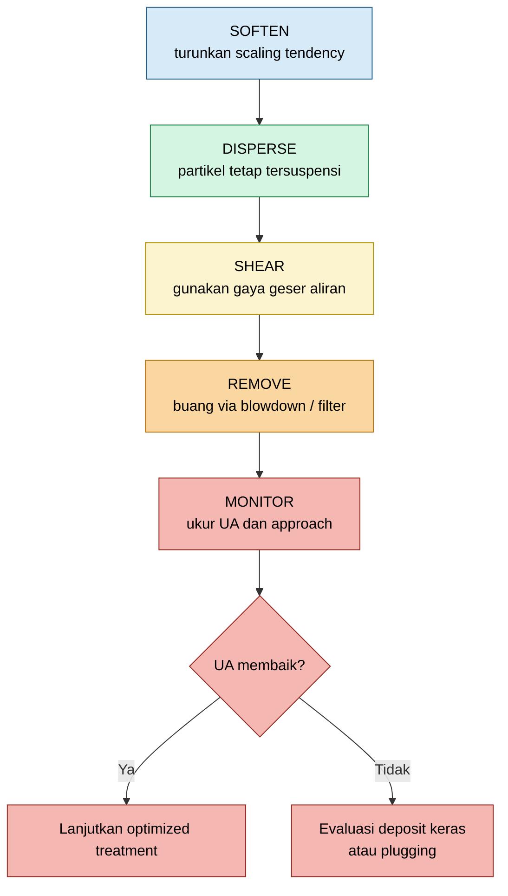

Konsep ini penting karena online cleaning bukan sekadar “menambah chemical”. Jika chemical hanya melemahkan deposit tetapi tidak ada removal path, deposit dapat terlepas lalu beredar di cooling water system dan menempel ulang di PHE atau equipment lain.

Secara konseptual:

$$
\text{deposit detached}
\rightarrow
\text{suspended solid}
\rightarrow
\text{must be removed}
$$

Jika tidak dibuang:

$$
\text{suspended solid}
\rightarrow
\text{redeposition}
$$

Maka online cleaning harus selalu dikombinasikan dengan blowdown, filtration, atau strainer cleaning.

## 7.4 Batasan Fundamental Online Cleaning

Online cleaning memiliki batas kemampuan. Metode ini paling efektif bila deposit masih berupa:

$$
\text{early-stage scale}
$$

$$
\text{soft deposit}
$$

$$
\text{loose mineral deposit}
$$

$$
\text{biofilm-mineral fouling}
$$

$$
\text{sludge ringan}
$$

Online cleaning kurang efektif bila deposit sudah menjadi:

$$
\text{hard consolidated scale}
$$

$$
\text{silica scale}
$$

$$
\text{severe plugging}
$$

$$
\text{fully blocked channel}
$$

$$
\text{deposit behind dead zone}
$$

Pada kondisi scale yang sudah sangat keras, online cleaning sering hanya mampu menahan degradasi lebih lanjut, bukan mengembalikan $UA$ ke kondisi clean.

Oleh karena itu, online cleaning harus dilihat sebagai strategi untuk:

$$
\text{buy operating time}
$$

dan:

$$
\text{stabilize performance until opportunity shutdown}
$$

bukan sebagai pengganti permanen dari offline inspection bila indikasi internal plugging atau hard scale sudah kuat.

## 7.5 Parameter Keberhasilan Online Cleaning

Keberhasilan online cleaning tidak boleh dinilai dari kesan visual saja. Harus ada indikator kuantitatif.

Parameter utama adalah:

$$
UA_{actual}
$$

$$
T_{approach}
$$

$$
T_{h,out}
$$

$$
\Delta T_{CW}
$$

$$
TSS
$$

$$
\text{turbidity}
$$

$$
\text{chemical residual}
$$

Indikasi positif online cleaning adalah:

$$
UA_{after}

>

UA_{before}
$$

$$
T_{approach,after}
<
T_{approach,before}
$$

$$
TSS
\text{ naik sementara lalu turun}
$$

$$
\text{turbidity naik sementara lalu turun}
$$

$$
\text{chemical residual stabil}
$$

Kenaikan sementara $TSS$ atau turbidity dapat menjadi tanda deposit mulai terlepas. Namun, kenaikan tersebut hanya positif bila diikuti dengan removal melalui blowdown atau filtration.

## 7.6 Prinsip Keselamatan Online Cleaning

Karena plant tetap berjalan, online cleaning harus dikendalikan ketat. Chemical yang dimasukkan ke cooling water system dapat berdampak pada equipment lain, bukan hanya PHE Water Scrubber.

Prinsip keselamatan yang harus dipenuhi adalah:

- chemical compatible dengan material plate;
- chemical compatible dengan gasket;
- tidak menyebabkan pH ekstrem;
- tidak menyebabkan corrosion excursion;
- tidak menyebabkan release deposit terlalu cepat;
- tidak mengganggu user cooling water lain;
- tidak menyebabkan plugging downstream;
- tidak dilakukan tanpa target residual dan monitoring.

Tindakan yang harus dihindari adalah acid shock lokal tanpa engineering review. Khusus PHE dengan stainless steel plate, chemical yang mengandung chloride atau acid kuat dapat meningkatkan risiko:

$$
\text{pitting corrosion}
$$

$$
\text{crevice corrosion}
$$

$$
\text{gasket degradation}
$$

Maka online cleaning harus dilakukan sebagai program terkontrol, bukan tindakan spontan.

[**Kembali ke Atas**](#online-troubleshooting-dan-recovery-performance-plate-heat-exchanger-akibat-scaling-pada-sisi-cooling-water)

---

# 8. Metode Online Cleaning yang Direkomendasikan

## 8.1 Optimasi Cooling Water Chemistry

Langkah pertama online cleaning adalah memastikan cooling water chemistry berada dalam window yang tidak mempercepat scaling. Jika chemistry tetap buruk, maka online cleaning hanya memberikan hasil sementara.

Parameter yang perlu dikontrol meliputi:

| Parameter                | Fungsi                                                   |
| ------------------------ | -------------------------------------------------------- |
| pH                       | mengontrol kecenderungan carbonate scaling dan corrosion |
| conductivity             | indikasi cycle of concentration                          |
| hardness                 | indikasi potensi $CaCO_3$ dan $Mg$ deposit               |
| alkalinity               | indikasi carbonate/bicarbonate system                    |
| silica                   | indikasi silica scaling                                  |
| TSS                      | indikasi suspended solid fouling                         |
| iron                     | indikasi corrosion product                               |
| microbiological activity | indikasi biofouling                                      |
| residual inhibitor       | memastikan scale inhibitor efektif                       |
| residual biocide         | memastikan kontrol mikrobiologi                          |
| cycle of concentration   | mengontrol akumulasi mineral                             |

Tindakan utama yang dapat dilakukan adalah:

- increase blowdown bila conductivity tinggi;
- controlled pH adjustment;
- optimasi residual antiscalant;
- optimasi dispersant;
- koreksi biocide program;
- evaluasi side-stream filtration;
- verifikasi dosing pump dan injection point;
- cek apakah chemical residual benar-benar sampai ke cooling water header.

Secara konsep, scaling tendency meningkat bila mineral terkonsentrasi:

$$
\text{cycle of concentration}
\uparrow
\Rightarrow
\text{dissolved solids}
\uparrow
\Rightarrow
\text{scaling tendency}
\uparrow
$$

Maka blowdown menjadi salah satu kontrol penting:

$$
\text{blowdown}
\uparrow
\Rightarrow
\text{conductivity}
\downarrow
\Rightarrow
\text{scaling tendency}
\downarrow
$$

Namun blowdown harus dikendalikan agar tidak mengganggu water balance dan chemical residual.

## 8.2 Shock Dosing Antiscalant

Shock dosing antiscalant bertujuan menghentikan pertumbuhan scale aktif dan melemahkan kecenderungan mineral untuk menempel pada plate.

Tujuan utama:

$$
\text{crystal growth}
\downarrow
$$

$$
\text{crystal distortion}
\uparrow
$$

$$
\text{adhesion to plate}
\downarrow
$$

$$
\text{new scale formation}
\downarrow
$$

Chemical yang umum digunakan meliputi:

- phosphonate-based inhibitor;
- polymer-based antiscalant;
- polyacrylate;
- polymaleate;
- threshold inhibitor;
- deposit conditioner.

Mekanisme antiscalant bukan selalu melarutkan scale yang sudah keras. Banyak antiscalant bekerja dengan cara mengganggu pertumbuhan kristal sehingga kristal menjadi tidak stabil, tidak mudah melekat, dan lebih mudah terbawa aliran.

Secara konseptual:

$$
Ca^{2+}
+
CO_3^{2-}
\rightarrow
CaCO_3
\downarrow
$$

Dengan antiscalant:

$$
\text{crystal growth}
\rightarrow
\text{distorted crystal}
$$

dan:

$$
\text{adhesion force}
\downarrow
$$

Shock dosing tidak boleh dilakukan tanpa target. Parameter yang harus dicatat:

| Parameter             | Keterangan                 |
| --------------------- | -------------------------- |
| chemical name         | nama produk                |
| active component      | basis kimia                |
| dosing rate           | laju dosing                |
| start time            | waktu mulai                |
| stop time             | waktu selesai              |
| target residual       | residual yang diinginkan   |
| actual residual       | hasil analisis aktual      |
| pH response           | perubahan pH               |
| conductivity response | perubahan conductivity     |
| turbidity response    | indikasi deposit terlepas  |
| $UA$ response         | bukti performance recovery |

Tanpa data residual dan trend $UA$, shock dosing hanya menjadi aktivitas kimia tanpa bukti engineering.

## 8.3 Dispersant Dosing

Dispersant digunakan untuk menjaga partikel yang sudah terlepas tetap tersuspensi dalam cooling water. Ini sangat penting karena deposit yang terlepas tetapi tidak stabil dalam suspensi dapat menempel ulang di area lain.

Secara konsep:

$$
\text{loose deposit}
+
\text{dispersant}
\rightarrow
\text{suspended particle}
$$

Tujuan dispersant dosing adalah:

- mencegah redeposition;
- menjaga partikel terbawa aliran;
- membantu removal melalui blowdown atau filter;
- mengurangi sludge accumulation;
- menjaga channel PHE tidak cepat tertutup kembali.

Tanpa dispersant, mekanisme yang mungkin terjadi adalah:

$$
\text{deposit detached}
\rightarrow
\text{floating particle}
\rightarrow
\text{redeposition}
$$

Dengan dispersant yang efektif:

$$
\text{deposit detached}
\rightarrow
\text{stable suspension}
\rightarrow
\text{removed by blowdown or filtration}
$$

Parameter monitoring dispersant meliputi:

$$
TSS
$$

$$
\text{turbidity}
$$

$$
\text{filter loading}
$$

$$
\text{strainer condition}
$$

$$
UA_{actual}
$$

Kenaikan sementara $TSS$ dan turbidity setelah dosing dapat menjadi indikasi partikel mulai terlepas. Namun, jika $TSS$ terus tinggi dan tidak diikuti removal, risiko fouling ulang meningkat.

## 8.4 Biodispersant dan Biocide

Dalam cooling water system, deposit pada PHE sering bukan mineral murni. Biofilm dapat menjadi lapisan perekat yang menahan mineral, suspended solid, dan corrosion product pada plate.

Mekanisme deposit campuran dapat ditulis sebagai:

$$
\text{biofilm}
+
\text{mineral}
\rightarrow
\text{adherent deposit}
$$

atau:

$$
\text{biofilm}
+
\text{suspended solid}
+
\text{iron oxide}
\rightarrow
\text{mixed fouling layer}
$$

Jika biofilm berperan, antiscalant saja sering tidak cukup. Diperlukan biodispersant dan biocide.

Mekanisme online treatment:

$$
\text{biodispersant}
\rightarrow
\text{biofilm matrix weakened}
$$

$$
\text{biocide}
\rightarrow
\text{microbial activity reduced}
$$

$$
\text{dispersant}
\rightarrow
\text{released particles suspended}
$$

Urutan yang direkomendasikan:

1. lakukan biodispersant untuk membuka matrix biofilm;
2. lakukan biocide shock sesuai program water treatment;
3. dukung dengan dispersant agar partikel yang lepas tidak redeposit;
4. tingkatkan blowdown atau filtration;
5. monitor $TSS$, turbidity, residual biocide, dan $UA$.

Indikasi biofouling antara lain:

- deposit berlendir;
- sample cooling water berbau;
- turbidity meningkat;
- microbiological count tinggi;
- chlorine demand meningkat;
- strainer cepat kotor;
- performance turun bertahap.

## 8.5 Controlled pH Adjustment

Untuk calcium carbonate scaling, pH sangat berpengaruh terhadap keseimbangan carbonate.

Reaksi pembentukan calcium carbonate:

$$
Ca^{2+}
+
CO_3^{2-}
\rightarrow
CaCO_3
\downarrow
$$

Saat pH tinggi, konsentrasi carbonate ion meningkat:

$$
CO_3^{2-}
\uparrow
$$

sehingga kecenderungan pembentukan $CaCO_3$ meningkat.

Dengan controlled pH adjustment, sebagian carbonate dapat dikonversi menjadi bicarbonate:

$$
CO_3^{2-}
+
H^+
\rightarrow
HCO_3^-
$$

Akibatnya:

$$
\text{scaling tendency}
\downarrow
$$

Namun, controlled pH adjustment bukan berarti acid shock lokal. Penurunan pH harus dilakukan dalam operating window cooling water system dan harus mempertimbangkan corrosion control.

Catatan penting:

- jangan melakukan acid shock lokal ke branch PHE;
- jangan menurunkan pH secara ekstrem;
- pastikan corrosion monitoring;
- pastikan compatibility dengan material plate dan gasket;
- pastikan dampak ke user cooling water lain dievaluasi;
- koordinasikan dengan water treatment specialist.

Untuk stainless steel plate, risiko corrosion harus diperhatikan, terutama jika terdapat chloride. Lingkungan low pH dan chloride dapat meningkatkan risiko:

$$
\text{chloride-induced pitting}
$$

dan:

$$
\text{crevice corrosion}
$$

## 8.6 Increase Cooling Water Velocity

Deposit yang masih lunak atau belum terkonsolidasi keras dapat dilepas dengan meningkatkan hydraulic shear.

Tujuan utama:

$$
v_{CW}
\uparrow
$$

$$
\tau_w
\uparrow
$$

$$
\text{deposit detachment}
\uparrow
$$

di mana:

$$
v_{CW} = \text{cooling water velocity}
$$

dan:

$$
\tau_w = \text{wall shear stress}
$$

Secara sederhana, semakin tinggi velocity, semakin besar gaya geser di dekat permukaan plate. Gaya geser ini dapat membantu melepas loose deposit, slime, atau scale yang sudah dilemahkan oleh chemical treatment.

Tindakan lapangan:

- cek valve line-up cooling water;
- pastikan inlet dan outlet valve berada pada posisi benar;
- pastikan bypass tidak mencuri flow;
- koordinasikan kenaikan header differential dengan utility;
- cek apakah return header memiliki back pressure tinggi;
- optimasi distribusi cooling water ke user critical;
- lakukan perubahan secara bertahap.

Penting: peningkatan velocity harus dilakukan dalam batas desain PHE dan sistem piping. Perubahan mendadak dapat menyebabkan water hammer atau process upset.

## 8.7 Flow Cycling atau Hydraulic Pulsing

Flow cycling adalah perubahan flow cooling water secara terkendali untuk menghasilkan variasi shear stress.

Konsepnya:

$$
\text{normal flow}
\rightarrow
\text{higher flow}
\rightarrow
\text{normal flow}
$$

Tujuannya:

$$
\text{variable shear stress}
$$

$$
\text{deposit adhesion weakened}
$$

$$
\text{loose deposit detached}
$$

Flow cycling bermanfaat jika deposit masih relatif lunak atau berupa sludge dan biofilm-mineral deposit. Namun, untuk hard crystalline scale, efeknya terbatas.

Prinsip pelaksanaan:

- perubahan valve dilakukan perlahan;
- operator panel memonitor $T_{h,out}$;
- jangan membuat step change yang tajam;
- hindari water hammer;
- hindari thermal shock;
- pastikan tidak menyebabkan process temperature excursion;
- catat waktu dan respons temperatur.

Diagram berikut menggambarkan konsep flow cycling.

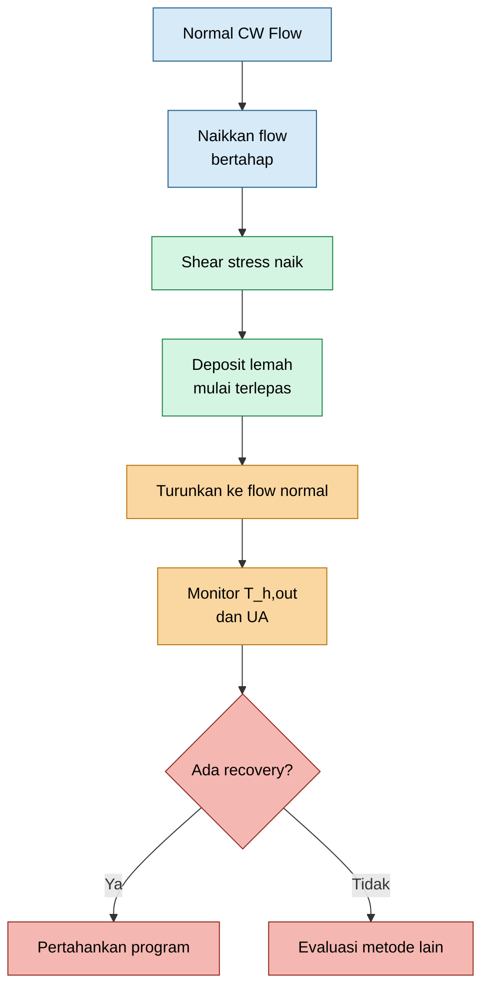

## 8.8 Online Reverse Flushing Jika Memungkinkan

Online reverse flushing dapat dipertimbangkan jika konfigurasi piping memungkinkan dan risiko operasi dapat dikendalikan. Prinsipnya adalah membalik arah aliran cooling water melalui PHE untuk membantu melepas deposit atau debris yang tertahan di inlet port dan channel awal.

Arah normal:

$$
CW_{in}
\rightarrow
PHE
\rightarrow
CW_{out}
$$

Arah reverse:

$$
CW_{out}
\rightarrow
PHE
\rightarrow
CW_{in}
$$

Tujuan reverse flushing:

- melepas debris pada port inlet;
- mengangkat sludge;
- mengganggu deposit yang terbentuk pada arah flow normal;
- memperbaiki partial blockage ringan;
- membawa loose deposit keluar dari channel.

Namun, metode ini hanya boleh dilakukan bila memenuhi syarat:

- tersedia jalur drain atau filter;
- debris tidak dikembalikan ke supply header;
- tidak mengganggu user cooling water lain;
- tidak menyebabkan water hammer;
- process temperature tetap aman;
- valve line-up jelas;
- operator memahami urutan tindakan;
- prosedur tertulis tersedia.

Jika reverse flushing hanya memindahkan debris ke supply header atau user lain, maka metode ini tidak boleh dilakukan.

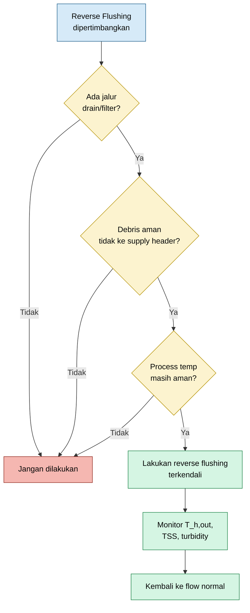

## 8.9 Side-Stream Filtration dan Blowdown

Online cleaning tidak lengkap tanpa removal path. Setiap tindakan yang melemahkan deposit berpotensi menghasilkan partikel tersuspensi. Jika partikel tidak dibuang, maka partikel dapat redeposit di PHE atau equipment lain.

Tanpa removal path:

$$
\text{deposit lepas}
\rightarrow
\text{beredar}
\rightarrow
\text{redeposit}
$$

Dengan removal path:

$$
\text{deposit lepas}
\rightarrow
\text{suspended solid}
\rightarrow
\text{removed by filtration or blowdown}
$$

Metode removal yang dapat digunakan:

- increase blowdown;
- side-stream filtration;
- temporary bag filter;
- cartridge filter;
- automatic backwash filter;
- strainer cleaning;
- sampling $TSS$ dan turbidity.

Parameter yang harus dipantau:

$$
TSS
$$

$$
\text{turbidity}
$$

$$
\text{filter differential pressure}
$$

$$
\text{strainer loading}
$$

$$
\text{conductivity}
$$

$$
UA_{actual}
$$

Jika $TSS$ naik setelah chemical dosing, lalu turun setelah blowdown atau filtration, ini dapat menjadi indikasi bahwa deposit berhasil dilepas dan dibuang.

Jika $TSS$ tetap tinggi, maka sistem mungkin kekurangan removal capacity atau deposit terus terlepas dalam jumlah besar.

## 8.10 Integrasi Metode Online Cleaning

Setiap metode online cleaning tidak boleh dipandang terpisah. Efektivitasnya muncul dari kombinasi chemical control, hydraulic action, dan solids removal.

Alur integrasi yang direkomendasikan:

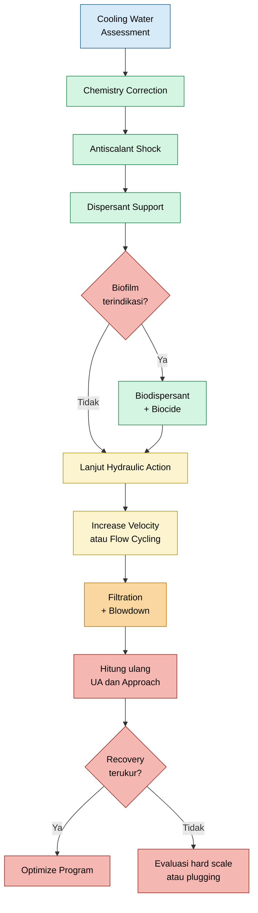

Prinsipnya, chemical melemahkan atau mengendalikan deposit, hydraulic shear membantu melepaskan deposit, dan filtration/blowdown membuang partikel dari sistem. Setelah itu, keberhasilan harus dibuktikan melalui perhitungan performance.

## 8.11 Parameter Evaluasi Setelah Online Cleaning

Setelah program online cleaning dijalankan, engineer harus menghitung ulang parameter berikut:

$$
Q_{after} = \dot{m}_{h} C_{p,h} \left( T_{h,in,after} - T_{h,out,after} \right)
$$

$$
\Delta T_{lm,after} = \frac{ \Delta T_{1,after} - \Delta T_{2,after} } { \ln \left( \frac{\Delta T_{1,after}}{\Delta T_{2,after}} \right) }
$$

$$
UA_{after} = \frac{ Q_{after} } { \Delta T_{lm,after} }
$$

Kemudian bandingkan dengan kondisi sebelum online cleaning:

$$
\Delta UA = UA_{after} - UA_{before}
$$

Jika:

$$
\Delta UA

>

0
$$

maka terdapat recovery thermal conductance.

Performance recovery dapat ditulis sebagai:

$$
\text{Recovery} = \frac{ UA_{after} - UA_{before} } { UA_{clean} } \times 100\%
$$

Jika clean baseline belum tersedia, gunakan baseline sementara dari kondisi terbaik historis dengan catatan engineering yang jelas.

## 8.12 Kesimpulan Bab 7 dan Bab 8

Pada kondisi plant tetap berjalan, online cleaning bukan pengganti penuh offline cleaning. Online cleaning adalah strategi recovery bertahap yang harus dilakukan secara terkendali.

Konsep utamanya adalah:

$$
\boxed{
\text{soften}
\rightarrow
\text{disperse}
\rightarrow
\text{shear}
\rightarrow
\text{remove}
\rightarrow
\text{monitor}
}
$$

Metode yang direkomendasikan meliputi:

- optimasi cooling water chemistry;
- shock dosing antiscalant;
- dispersant dosing;
- biodispersant dan biocide bila ada indikasi biofilm;
- controlled pH adjustment;
- increase cooling water velocity;
- flow cycling;
- online reverse flushing bila aman dan memungkinkan;
- side-stream filtration;
- blowdown;
- monitoring $UA$, $T_{approach}$, $TSS$, turbidity, dan chemical residual.

Keberhasilan online cleaning harus dibuktikan dengan:

$$
UA_{after}

>

UA_{before}
$$

dan bukan hanya berdasarkan kesan visual atau asumsi bahwa chemical sudah ditambahkan.

Dengan pendekatan ini, engineer-praktisi lapangan dapat menjalankan program online recovery secara terukur, aman, dan dapat dipertanggungjawabkan.

[**Kembali ke Atas**](#online-troubleshooting-dan-recovery-performance-plate-heat-exchanger-akibat-scaling-pada-sisi-cooling-water)

---

# 9. Sequence Online Cleaning yang Direkomendasikan

Online cleaning tidak boleh dilakukan sebagai tindakan reaktif tanpa baseline. Urutan kerja harus dibuat sistematis agar setiap tindakan memiliki tujuan, parameter target, dan bukti keberhasilan. Dalam konteks PHE Water Scrubber, sequence online cleaning harus dimulai dari data aktual yang tersedia, lalu dilengkapi dengan data lokal dan data chemical treatment.

Tujuan utama sequence ini adalah memastikan bahwa tindakan online cleaning dapat menjawab tiga pertanyaan penting:

$$
\text{Apa kondisi awal PHE?}
$$

$$
\text{Apa tindakan korektif yang dilakukan?}
$$

$$
\text{Apakah performance benar-benar membaik setelah tindakan?}
$$

Alur besar sequence online cleaning adalah sebagai berikut.

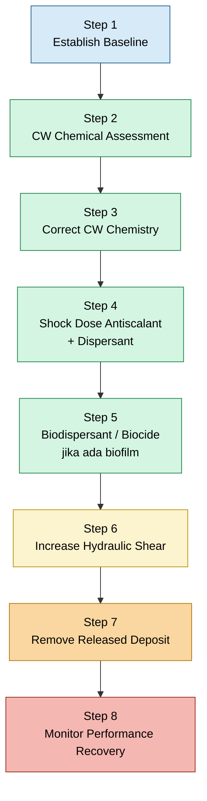

## 9.1 Step 1 — Establish Baseline

Langkah pertama adalah membuat baseline aktual. Baseline bukan hanya data temperatur, tetapi kondisi operasi lengkap sebelum online cleaning dimulai.

Data awal yang sudah tersedia dari SCADA adalah:

$$
T_{h,in} = 109^\circ C
$$

$$
T_{h,out} = 56^\circ C
$$

Maka:

$$
\Delta T_{process} = T_{h,in} - T_{h,out}
$$

$$
\Delta T_{process} = 109 - 56 = 53^\circ C
$$

Data ini penting, tetapi belum cukup. Agar performance dapat dihitung, data tambahan yang harus dikumpulkan adalah:

$$
\dot{m}_h
$$

$$
C_{p,h}
$$

$$
T_{c,in}
$$

$$
T_{c,out}
$$

Dengan data tersebut, engineer dapat menghitung:

$$
Q_{actual}
$$

$$
\Delta T_{lm}
$$

$$
UA_{actual}
$$

$$
T_{approach}
$$

$$
\frac{UA_{actual}}{UA_{clean}}
$$

Baseline yang benar harus mencakup minimal parameter berikut.

| Parameter            |           Unit | Status              | Fungsi                          |
| -------------------- | -------------: | ------------------- | ------------------------------- |
| $T_{h,in}$           |     $^\circ C$ | tersedia            | basis duty dan LMTD             |
| $T_{h,out}$          |     $^\circ C$ | tersedia            | basis duty dan approach         |
| $\Delta T_{process}$ |     $^\circ C$ | tersedia            | indikasi pendinginan process    |
| $\dot{m}_h$          | kg/s atau kg/h | perlu dikonfirmasi  | basis heat duty                 |
| $C_{p,h}$            |        kJ/kg.K | perlu dikonfirmasi  | basis heat duty                 |
| $T_{c,in}$           |     $^\circ C$ | perlu diambil lokal | basis approach dan LMTD         |
| $T_{c,out}$          |     $^\circ C$ | perlu diambil lokal | basis LMTD dan estimasi CW flow |
| $Q_{actual}$         |             kW | perlu dihitung      | heat duty aktual                |
| $\Delta T_{lm}$      |     $^\circ C$ | perlu dihitung      | driving force temperatur        |
| $UA_{actual}$        |           kW/K | perlu dihitung      | indikator utama performance     |
| $UA/UA_{clean}$      |              - | perlu dihitung      | performance ratio               |

Heat duty dihitung dari sisi process:

$$
Q_{actual} = \dot{m}_{h} C_{p,h} \left( T_{h,in} - T_{h,out} \right)
$$

Dengan data temperatur saat ini:

$$
Q_{actual} = \dot{m}_{h} C_{p,h} \left( 109 - 56 \right)
$$

$$
Q_{actual} = \dot{m}_{h} C_{p,h} \left( 53 \right)
$$

LMTD dihitung setelah $T_{c,in}$ dan $T_{c,out}$ tersedia:

$$
\Delta T_1 = T_{h,in} - T_{c,out}
$$

$$
\Delta T_2 = T_{h,out} - T_{c,in}
$$

$$
\Delta T_{lm} = \frac{ \Delta T_1 - \Delta T_2 } { \ln \left( \frac{\Delta T_1}{\Delta T_2} \right) }
$$

Kemudian:

$$
UA_{actual} = \frac{ Q_{actual} } { \Delta T_{lm} }
$$

Approach temperature dihitung dengan:

$$
T_{approach} = T_{h,out} - T_{c,in}
$$

Untuk data saat ini:

$$
T_{approach} = 56 - T_{c,in}
$$

Jika baseline ini belum lengkap, online cleaning tetap dapat dilakukan secara hati-hati, tetapi keberhasilannya tidak dapat dibuktikan dengan kuat. Oleh karena itu, baseline adalah fondasi utama.

## 9.2 Step 2 — Cooling Water Chemical Assessment

Setelah baseline performance dibuat, langkah berikutnya adalah melakukan assessment terhadap cooling water chemistry. Tujuannya adalah menentukan apakah cooling water memang memiliki kecenderungan membentuk scale, biofouling, sludge, atau corrosion product deposit.

Data yang harus diambil adalah:

- pH;
- conductivity;
- hardness;
- alkalinity;
- silica;
- TSS;
- iron;
- chloride;
- residual inhibitor;
- residual biocide;
- microbiological count;
- turbidity.

Fungsi masing-masing parameter adalah sebagai berikut.

| Parameter             | Fungsi Engineering                                |
| --------------------- | ------------------------------------------------- |
| pH                    | indikator scaling tendency dan corrosion tendency |
| conductivity          | indikasi cycle of concentration                   |
| hardness              | potensi calcium dan magnesium scale               |
| alkalinity            | potensi carbonate scaling                         |
| silica                | potensi silica scale                              |
| TSS                   | potensi suspended solid fouling                   |
| iron                  | indikasi corrosion product deposit                |
| chloride              | risiko pitting, terutama pada stainless steel     |
| residual inhibitor    | efektivitas scale inhibition                      |
| residual biocide      | efektivitas microbiological control               |
| microbiological count | indikasi biofouling                               |
| turbidity             | indikasi partikel tersuspensi                     |

Kondisi yang perlu dicari adalah kombinasi parameter, bukan satu angka tunggal. Misalnya, calcium carbonate scaling lebih mungkin terjadi bila terdapat kombinasi:

$$
\text{hardness tinggi}
+
\text{alkalinity tinggi}
+
\text{pH tinggi}
+
\text{temperature tinggi}
$$

Silica scaling lebih mungkin bila:

$$
SiO_2
\text{ tinggi}
+
\text{cycle of concentration tinggi}
$$

Biofouling lebih mungkin bila:

$$
\text{microbiological count tinggi}
+
\text{residual biocide rendah}
+
\text{slime indication}
$$

Assessment ini penting karena metode online cleaning untuk calcium carbonate, biofilm, dan silica tidak sama.

## 9.3 Step 3 — Correct Cooling Water Chemistry

Setelah hasil assessment tersedia, chemistry cooling water harus dikoreksi sebelum melakukan chemical shock. Jika chemistry tidak dikoreksi, deposit baru akan terus terbentuk meskipun sebagian deposit lama berhasil dilepas.

Tindakan yang dapat dilakukan meliputi:

- increase blowdown;
- controlled pH adjustment;
- optimasi inhibitor residual;
- optimasi dispersant residual;
- koreksi biocide program;
- kontrol cycle of concentration.

Jika conductivity tinggi, maka cycle of concentration kemungkinan tinggi. Hubungannya dapat ditulis secara konsep:

$$
\text{conductivity}
\uparrow
\Rightarrow
\text{dissolved solids}
\uparrow
$$

dan:

$$
\text{dissolved solids}
\uparrow
\Rightarrow
\text{scaling tendency}
\uparrow
$$

Maka increase blowdown dapat membantu:

$$
\text{blowdown}
\uparrow
\Rightarrow
\text{conductivity}
\downarrow
$$

Jika pH terlalu tinggi, carbonate ion meningkat:

$$
CO_3^{2-}
\uparrow
$$

Sehingga kecenderungan pembentukan calcium carbonate meningkat:

$$
Ca^{2+}
+
CO_3^{2-}
\rightarrow
CaCO_3
\downarrow
$$

Dengan controlled pH adjustment:

$$
CO_3^{2-}
+
H^+
\rightarrow
HCO_3^-
$$

maka kecenderungan pembentukan $CaCO_3$ dapat diturunkan.

Namun, koreksi pH harus dilakukan dengan hati-hati. Tujuannya bukan membuat pH serendah mungkin, tetapi mengembalikan pH ke operating window yang aman terhadap scaling dan corrosion.

## 9.4 Step 4 — Shock Dose Antiscalant dan Dispersant

Setelah chemistry dikoreksi, langkah berikutnya adalah melakukan shock dosing antiscalant dan dispersant. Tujuannya adalah menghentikan pertumbuhan scale aktif, melemahkan deposit yang masih reaktif, dan menjaga partikel yang lepas tetap tersuspensi.

Tujuan antiscalant:

$$
\text{crystal growth}
\downarrow
$$

$$
\text{adhesion to plate}
\downarrow
$$

$$
\text{new scale formation}
\downarrow
$$

Tujuan dispersant:

$$
\text{loose deposit}
+
\text{dispersant}
\rightarrow
\text{suspended particle}
$$

Data yang harus dicatat saat shock dosing:

| Data                  | Keterangan                 |
| --------------------- | -------------------------- |
| chemical name         | nama produk yang digunakan |
| active component      | basis kimia chemical       |
| dosing rate           | laju injeksi               |
| start time            | waktu mulai dosing         |
| stop time             | waktu selesai              |
| target residual       | residual yang diharapkan   |
| actual residual       | hasil pengukuran aktual    |
| pH response           | perubahan pH               |
| conductivity response | perubahan conductivity     |
| turbidity response    | indikasi deposit terlepas  |
| $UA$ response         | bukti recovery performance |

Shock dosing tanpa pencatatan data residual tidak dapat dievaluasi secara engineering. Engineer harus dapat menjawab:

$$
\text{Berapa dosis diberikan?}
$$

$$
\text{Berapa residual tercapai?}
$$

$$
\text{Apakah } UA \text{ berubah?}
$$

$$
\text{Apakah } TSS \text{ atau turbidity berubah?}
$$

Jika tidak ada data tersebut, maka tindakan chemical hanya menjadi aktivitas operasional tanpa bukti efektivitas.

## 9.5 Step 5 — Biodispersant dan Biocide Jika Ada Biofilm

Jika cooling water menunjukkan indikasi biofilm, maka program online cleaning harus dilengkapi dengan biodispersant dan biocide. Deposit biofilm-mineral sering lebih sulit ditangani karena biofilm dapat bertindak sebagai perekat deposit.

Indikasi biofilm meliputi:

- slime;
- deposit berlendir;
- microbiological count tinggi;
- chlorine demand tinggi;
- turbidity tinggi;
- strainer cepat kotor;
- performance turun bertahap.

Mekanisme deposit campuran:

$$
\text{biofilm}
+
\text{mineral}
\rightarrow
\text{adherent deposit}
$$

Online treatment yang disarankan:

$$
\text{biodispersant}
\rightarrow
\text{biofilm matrix weakened}
$$

$$
\text{biocide}
\rightarrow
\text{microbial activity reduced}
$$

$$
\text{dispersant}
\rightarrow
\text{released particles suspended}
$$

Urutan yang lebih aman adalah biodispersant terlebih dahulu, kemudian biocide shock sesuai rekomendasi water treatment specialist, lalu removal melalui blowdown atau filtration.

Jika biofilm dilepas tanpa removal path, partikel biologis dan mineral dapat kembali menempel di area lain.

## 9.6 Step 6 — Increase Hydraulic Shear

Setelah deposit mulai dilemahkan secara kimia, aliran cooling water harus dimanfaatkan untuk membantu pelepasan deposit. Ini dilakukan dengan meningkatkan hydraulic shear secara terkendali.

Tindakan yang dilakukan:

- cek valve line-up;
- cek bypass;
- tingkatkan flow bila memungkinkan;
- lakukan flow cycling terkendali;
- monitor $T_{h,out}$;
- monitor $T_{approach}$;
- monitor $\Delta T_{CW}$.

Secara konsep:

$$
v_{CW}
\uparrow
$$

maka:

$$
\tau_w
\uparrow
$$

dan:

$$
\text{deposit detachment}
\uparrow
$$

di mana:

$$
v_{CW} = \text{cooling water velocity}
$$

dan:

$$
\tau_w = \text{wall shear stress}
$$

Flow cycling dilakukan secara bertahap:

$$
\text{normal flow}
\rightarrow
\text{higher flow}
\rightarrow
\text{normal flow}
$$

Tujuannya adalah memberikan variasi shear stress sehingga deposit yang sudah melemah lebih mudah terlepas.

Namun, perubahan flow tidak boleh dilakukan mendadak. Risiko utama yang harus dihindari adalah:

- water hammer;
- thermal shock;
- process temperature excursion;
- gasket stress;
- gangguan pada user cooling water lain.

Operator panel harus memonitor respons process temperature selama perubahan flow dilakukan.

## 9.7 Step 7 — Remove Released Deposit

Setiap deposit yang berhasil dilepas harus segera dikeluarkan dari sistem. Jika tidak, partikel dapat beredar kembali dan menempel ulang di PHE atau equipment lain.

Tanpa removal path:

$$
\text{deposit lepas}
\rightarrow
\text{beredar di sistem}
\rightarrow
\text{redeposit}
$$

Dengan removal path:

$$
\text{deposit lepas}
\rightarrow
\text{suspended solid}
\rightarrow
\text{removed by blowdown or filtration}
$$

Tindakan removal:

- increase blowdown;
- side-stream filtration;
- temporary bag filter;
- cleaning strainer;
- sampling TSS;
- sampling turbidity;
- monitoring filter loading;
- monitoring visual sample cooling water.

Jika $TSS$ dan turbidity naik sementara setelah chemical dosing atau flow cycling, hal tersebut dapat menjadi indikasi deposit mulai terlepas. Namun, kenaikan ini harus diikuti dengan penurunan setelah removal dilakukan.

Indikasi removal efektif:

$$
TSS
\uparrow
\text{ sementara}
\rightarrow
TSS
\downarrow
$$

$$
\text{turbidity}
\uparrow
\text{ sementara}
\rightarrow
\text{turbidity}
\downarrow
$$

Jika $TSS$ tetap tinggi, maka removal capacity belum cukup atau deposit masih terus terlepas dalam jumlah besar.

## 9.8 Step 8 — Monitor Performance Recovery

Langkah terakhir adalah menghitung ulang performance setelah online cleaning. Ini adalah bagian paling penting karena keberhasilan tidak boleh dinilai hanya dari chemical sudah ditambahkan atau flushing sudah dilakukan.

Hitung ulang:

$$
Q_{after}
$$

$$
\Delta T_{lm,after}
$$

$$
UA_{after}
$$

$$
T_{approach,after}
$$

$$
\frac{UA_{after}}{UA_{clean}}
$$

Heat duty setelah online cleaning:

$$
Q_{after} = \dot{m}_{h} C_{p,h} \left( T_{h,in,after} - T_{h,out,after} \right)
$$

LMTD setelah online cleaning:

$$
\Delta T_{lm,after} = \frac{ \Delta T_{1,after} - \Delta T_{2,after} } { \ln \left( \frac{\Delta T_{1,after}}{\Delta T_{2,after}} \right) }
$$

Actual thermal conductance setelah online cleaning:

$$
UA_{after} = \frac{ Q_{after} } { \Delta T_{lm,after} }
$$

Performance recovery:

$$
\text{Recovery} = \frac{ UA_{after} - UA_{before} } { UA_{clean} } \times 100\%
$$

Jika:

$$
UA_{after}

>

UA_{before}
$$

maka terdapat recovery.

Jika:

$$
UA_{after}
\approx
UA_{before}
$$

maka online cleaning belum terbukti efektif.

## 9.9 Ringkasan Sequence Online Cleaning

Sequence online cleaning dapat diringkas dalam diagram berikut.

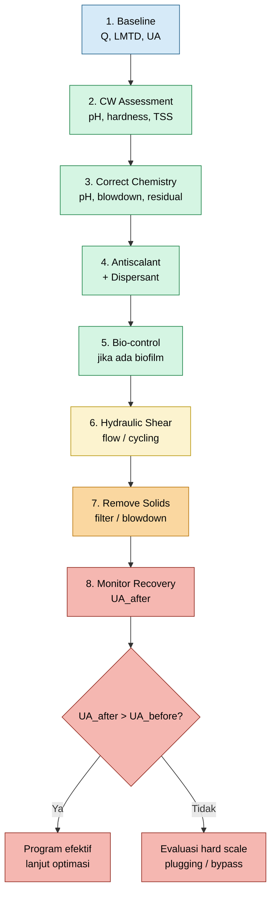

Sequence ini memastikan online cleaning tetap terukur. Setiap langkah menghasilkan data yang dapat dibandingkan sebelum dan sesudah tindakan.

[**Kembali ke Atas**](#online-troubleshooting-dan-recovery-performance-plate-heat-exchanger-akibat-scaling-pada-sisi-cooling-water)

---

# 10. Kriteria Keberhasilan dan Kegagalan Online Cleaning

## 10.1 Kriteria Keberhasilan

Online cleaning dianggap berhasil bila terdapat bukti kuantitatif bahwa thermal performance membaik, chemistry lebih terkendali, dan tidak terjadi efek samping operasional.

Kriteria keberhasilan utama adalah:

$$
T_{h,out}
\text{ bergerak ke target operasi}
$$

$$
T_{approach}
\downarrow
$$

$$
UA_{actual}
\uparrow
$$

$$
\frac{
UA_{actual}
}
{
UA_{clean}
}
\uparrow
$$

Selain itu, indikator operasional yang mendukung adalah:

$$
TSS
\text{ atau turbidity naik sementara lalu turun}
$$

$$
\text{chemical residual stabil}
$$

$$
\text{tidak ada corrosion excursion}
$$

$$
\text{tidak ada gasket leak}
$$

$$
\text{tidak ada process upset}
$$

Indikator paling kuat tetap:

$$
UA_{after}

>

UA_{before}
$$

karena $UA$ memperhitungkan heat duty dan driving force temperatur. Jika hanya melihat outlet temperature, kesimpulan dapat bias.

## 10.2 Catatan Khusus untuk Data Saat Ini

Pada data saat ini:

$$
T_{h,out,actual} = 56^\circ C
$$

Sedangkan design outlet temperature adalah:

$$
T_{h,out,design} = 65^\circ C
$$

Artinya:

$$
T_{h,out,actual}
<
T_{h,out,design}
$$

Dengan kondisi ini, indikator keberhasilan online cleaning tidak cukup hanya berupa “outlet semakin dingin”. Sebab outlet saat ini sudah lebih rendah dari design.

Yang harus dipantau adalah apakah:

$$
UA
$$

stabil atau meningkat pada load yang comparable.

Dengan kata lain, indikator keberhasilan yang lebih benar adalah:

$$
\frac{
UA_{after}
}
{
UA_{clean}
}

>

\frac{
UA_{before}
}
{
UA_{clean}
}
$$

atau:

$$
UA_{after}

>

UA_{before}
$$

Jika outlet temperature berubah tetapi $UA$ tidak membaik, maka perubahan tersebut mungkin berasal dari perubahan flow, cooling water temperature, atau process load, bukan dari cleaning effect.

## 10.3 Contoh Tabel Evaluasi Keberhasilan

Tabel berikut dapat digunakan untuk mengevaluasi hasil online cleaning.

| Parameter            | Before |       After | Interpretasi                    |
| -------------------- | -----: | ----------: | ------------------------------- |
| $T_{h,in}$           |  109°C |       109°C | inlet stabil                    |
| $T_{h,out}$          |   56°C | perlu trend | dibandingkan target operasi     |
| $\Delta T_{process}$ |   53°C | perlu trend | belum cukup untuk judge scaling |
| $T_{c,in}$           |    TBD |         TBD | wajib diambil lokal             |
| $T_{c,out}$          |    TBD |         TBD | wajib diambil lokal             |
| $\Delta T_{CW}$      |    TBD |         TBD | indikasi respons cooling water  |
| $Q_{actual}$         |    TBD |         TBD | heat duty aktual                |
| $\Delta T_{lm}$      |    TBD |         TBD | driving force temperatur        |
| $UA/UA_{clean}$      |    TBD |         TBD | indikator utama                 |
| TSS                  |    TBD |         TBD | indikasi deposit terlepas       |
| Turbidity            |    TBD |         TBD | indikasi cleaning response      |
| Residual inhibitor   |    TBD |         TBD | validasi chemical program       |
| Residual biocide     |    TBD |         TBD | validasi bio-control            |

Kata “TBD” harus diperlakukan sebagai data gap yang wajib ditutup. Jika terlalu banyak parameter masih TBD, maka evaluasi keberhasilan tidak cukup kuat.

## 10.4 Interpretasi Kenaikan dan Penurunan Parameter

Tidak semua perubahan parameter berarti online cleaning berhasil. Engineer harus membaca pola perubahan.

### 10.4.1 Jika $UA$ Naik

Jika:

$$
UA_{after}

>

UA_{before}
$$

maka ada indikasi positif bahwa thermal conductance membaik. Ini dapat terjadi karena deposit berkurang, flow distribution membaik, atau sebagian blockage terlepas.

### 10.4.2 Jika $T_{approach}$ Turun

Jika:

$$
T_{approach,after}
<
T_{approach,before}
$$

maka process outlet semakin mendekati cooling water inlet temperature. Ini merupakan indikasi cooling effectiveness membaik, dengan catatan process load dan cooling water inlet temperature comparable.

### 10.4.3 Jika TSS atau Turbidity Naik Sementara

Jika:

$$
TSS
\uparrow
\text{ sementara}
$$

atau:

$$
\text{turbidity}
\uparrow
\text{ sementara}
$$

setelah chemical treatment atau flow cycling, ini dapat menjadi indikasi deposit mulai terlepas.

Namun harus diikuti oleh:

$$
TSS
\downarrow
$$

atau:

$$
\text{turbidity}
\downarrow
$$

setelah blowdown atau filtration.

Jika tidak turun, maka sistem berisiko mengalami redeposition.

### 10.4.4 Jika Chemical Residual Stabil

Jika residual inhibitor dan residual biocide stabil sesuai target, maka chemical treatment lebih terkendali. Tetapi residual stabil saja tidak cukup. Harus tetap ada bukti performance:

$$
UA_{actual}
\uparrow
$$

atau minimal:

$$
UA_{actual}
\text{ stabil}
$$

dalam kondisi load yang comparable.

## 10.5 Kriteria Kegagalan

Online cleaning dianggap tidak efektif bila tidak ada recovery terukur pada thermal performance.

Indikator kegagalan utama:

$$
UA_{after}
\approx
UA_{before}
$$

atau:

$$
UA_{after}
<
UA_{before}
$$

Indikator lain:

$$
T_{approach}
\text{ tidak membaik}
$$

$$
T_{h,out}
\text{ tidak bergerak ke target operasi}
$$

$$
TSS
\text{ tetap tinggi}
$$

$$
\text{turbidity tetap tinggi}
$$

$$
\text{chemical residual tidak stabil}
$$

$$
\text{process upset terjadi}
$$

$$
\text{indikasi leak atau corrosion muncul}
$$

Jika online cleaning gagal, kemungkinan penyebabnya adalah:

- scale terlalu keras;
- silica scale;
- deposit sudah terkonsolidasi;
- plugging berat;
- maldistribution;
- gasket leakage;
- internal bypass;
- plate deformation;
- plate arrangement salah;
- tightening dimension tidak sesuai;
- chemical tidak mencapai channel yang bermasalah;
- removal path tidak memadai.

## 10.6 Decision Matrix Keberhasilan dan Kegagalan

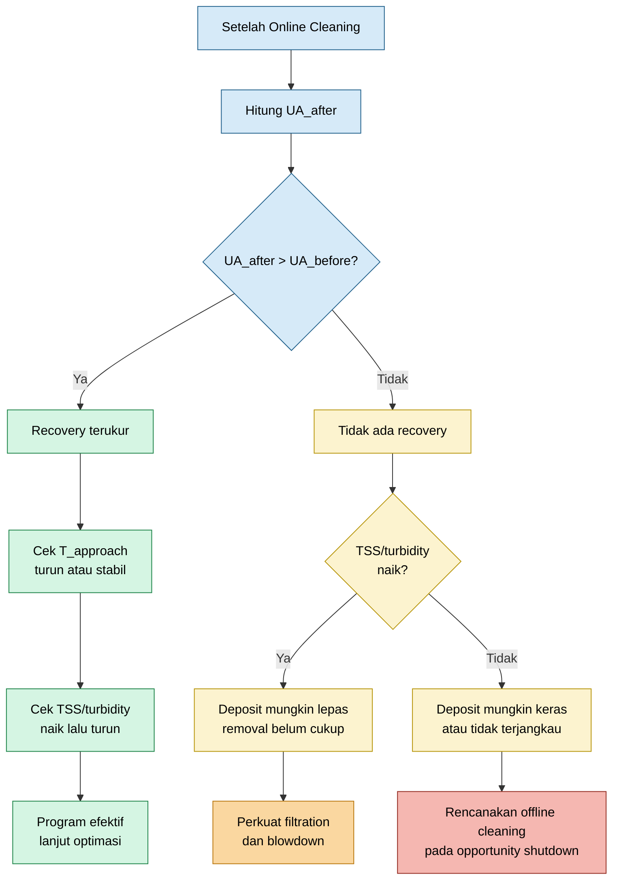

Decision matrix ini membantu engineer membedakan antara tiga kondisi:

1. online cleaning efektif;
2. deposit mulai terlepas tetapi belum berhasil dibuang;
3. deposit terlalu keras atau masalah bukan hanya scaling.

## 10.7 Kapan Online Cleaning Harus Dilanjutkan

Online cleaning dapat dilanjutkan bila:

$$
UA_{after}

>

UA_{before}
$$

dan tidak ada efek samping seperti corrosion, leak, atau process upset.

Online cleaning juga dapat dilanjutkan bila:

$$
UA_{actual}
\text{ stabil}
$$

pada kondisi sebelumnya terus menurun. Dalam kasus ini, keberhasilan bukan berupa recovery besar, tetapi penahanan laju degradasi.

Secara praktis:

$$
\text{degradation rate}
\downarrow
$$

juga merupakan hasil positif bila plant belum dapat shutdown.

## 10.8 Kapan Online Cleaning Harus Dihentikan atau Dievaluasi Ulang

Online cleaning harus dihentikan atau dievaluasi ulang bila terjadi:

- process temperature excursion;
- corrosion rate meningkat;
- pH keluar dari operating window;
- gasket leak;
- turbidity sangat tinggi dan tidak turun;
- strainer atau filter cepat plugging;
- user cooling water lain terdampak;
- chemical residual tidak terkendali;
- tidak ada recovery $UA$ setelah periode evaluasi.

Kondisi tersebut menunjukkan bahwa risiko online cleaning sudah melebihi manfaatnya.

## 10.9 Kapan Harus Rencana Offline Cleaning

Offline cleaning harus masuk rencana opportunity shutdown bila:

$$
UA_{after}
\approx
UA_{before}
$$

meskipun online cleaning sudah dilakukan dengan benar.

Offline cleaning juga perlu direncanakan bila terdapat indikasi:

- hard scale;
- silica scale;
- channel plugging;
- internal bypass;
- gasket leakage;
- plate deformation;
- plate pack tightening issue;
- plate arrangement issue.

Pada kondisi tersebut, online cleaning hanya dapat menjadi tindakan sementara untuk menjaga operasi sampai shutdown tersedia.

## 10.10 Ringkasan Bab 9 dan Bab 10

Sequence online cleaning harus dilakukan secara bertahap:

$$
\boxed{
\text{baseline}
\rightarrow
\text{assessment}
\rightarrow
\text{chemistry correction}
\rightarrow
\text{chemical shock}
\rightarrow
\text{hydraulic shear}
\rightarrow
\text{solids removal}
\rightarrow
\text{performance monitoring}
}
$$

Keberhasilan harus dibuktikan dengan:

$$
UA_{after}

>

UA_{before}
$$

atau:

$$
\frac{
UA_{after}
}
{
UA_{clean}
}

>

\frac{
UA_{before}
}
{
UA_{clean}
}
$$

Kegagalan ditandai oleh:

$$
UA_{after}
\approx
UA_{before}
$$

atau tidak adanya perbaikan pada $T_{approach}$ dan target operasi.

Untuk data saat ini, karena:

$$
T_{h,out,actual} = 56^\circ C
$$

lebih rendah dari design:

$$
T_{h,out,design} = 65^\circ C
$$

maka keberhasilan online cleaning tidak boleh dinilai hanya dari outlet temperature semakin rendah. Evaluasi harus tetap menggunakan:

$$
Q
$$

$$
\Delta T_{lm}
$$

$$
UA
$$

$$
T_{approach}
$$

dan baseline yang comparable.

Dengan pendekatan ini, online cleaning dapat dikelola sebagai program engineering yang terukur, bukan hanya tindakan chemical treatment berbasis asumsi.

[**Kembali ke Atas**](#online-troubleshooting-dan-recovery-performance-plate-heat-exchanger-akibat-scaling-pada-sisi-cooling-water)

---

# 11. Hal yang Tidak Direkomendasikan Saat Plant Online

Online cleaning pada PHE yang masih beroperasi harus diperlakukan sebagai aktivitas engineering yang memiliki risiko proses, mekanik, material, dan operasional. Pada kondisi offline, PHE dapat diisolasi sehingga dampak chemical dan deposit yang terlepas dapat dikontrol di dalam boundary equipment. Namun, pada kondisi online, setiap tindakan pada sisi cooling water dapat memengaruhi seluruh jaringan cooling water dan user lain.

Oleh karena itu, tindakan online cleaning tidak boleh dilakukan hanya berdasarkan intuisi atau instruksi verbal tanpa parameter target. Setiap tindakan harus memiliki:

$$
\text{basis engineering}
$$

$$
\text{operating limit}
$$

$$
\text{chemical compatibility check}
$$

$$
\text{monitoring parameter}
$$

$$
\text{stop criteria}
$$

$$
\text{approval operasi dan HSE}
$$

Prinsip dasarnya adalah:

$$
\boxed{
\text{online cleaning harus menurunkan risiko scaling tanpa menciptakan risiko operasi baru}
}
$$

## 11.1 Tindakan yang Harus Dihindari

Beberapa tindakan berikut harus dihindari saat plant online, kecuali sudah melalui review engineering, vendor, process, utility, inspection, dan HSE.

### 11.1.1 Injeksi HCl Langsung ke Branch PHE

Injeksi hydrochloric acid langsung ke branch PHE yang sedang online sangat tidak direkomendasikan. Walaupun HCl dapat melarutkan calcium carbonate, risikonya sangat tinggi, terutama untuk PHE dengan plate stainless steel.

Reaksi pelarutan calcium carbonate oleh acid adalah:

$$
CaCO_3
+
2H^+
\rightarrow
Ca^{2+}
+
CO_2
+
H_2O
$$

Namun, jika acid mengandung chloride, maka risiko terhadap stainless steel meningkat:

$$
\text{low pH}
+
Cl^-
\rightarrow
\text{pitting corrosion risk}
$$

Risiko utama dari injeksi HCl langsung adalah:

- localized low pH;
- chloride-induced pitting;
- crevice corrosion pada gasket contact area;
- gasket degradation;
- pelepasan deposit terlalu cepat;
- plugging downstream;
- gangguan ke cooling water user lain.

Jika acid cleaning memang diperlukan, metode yang lebih tepat adalah offline cleaning dengan isolasi, chemical circulation, venting, pH control, inhibitor, dan neutralization.

### 11.1.2 Acid Shock Lokal

Acid shock lokal pada branch cooling water dapat menciptakan kondisi kimia ekstrem di sebagian sistem. Masalahnya, chemical tidak selalu terdistribusi merata. Beberapa channel dapat menerima konsentrasi acid tinggi, sementara channel lain tidak mendapat efek cleaning yang cukup.

Kondisi ini berbahaya karena:

$$
\text{local acid concentration}
\gg
\text{bulk acid concentration}
$$

Akibatnya dapat terjadi:

$$
\text{localized corrosion}
$$

$$
\text{gasket attack}
$$

$$
\text{plate damage}
$$

$$
\text{deposit release surge}
$$

Pada online cleaning, yang diperbolehkan adalah controlled chemistry adjustment dalam operating window cooling water system, bukan acid shock lokal.

### 11.1.3 pH Depression Ekstrem

Menurunkan pH memang dapat menurunkan kecenderungan calcium carbonate scaling, karena carbonate ion bergeser menjadi bicarbonate:

$$
CO_3^{2-}
+
H^+
\rightarrow
HCO_3^-
$$

Namun, penurunan pH yang terlalu ekstrem dapat menggeser masalah dari scaling menjadi corrosion.

Secara sederhana:

$$
\text{pH terlalu tinggi}
\Rightarrow
\text{scaling risk}
$$

$$
\text{pH terlalu rendah}
\Rightarrow
\text{corrosion risk}
$$

Karena itu, pH harus dikontrol dalam operating window yang disetujui oleh water treatment specialist dan inspection/corrosion engineer. Tujuannya bukan membuat pH serendah mungkin, tetapi menyeimbangkan risiko scaling dan corrosion.

### 11.1.4 Chemical Tanpa Compatibility Check

Chemical online cleaning harus kompatibel dengan:

- material plate;
- material gasket;
- material piping;
- coating bila ada;
- cooling tower basin;
- pump casing;
- seal material;
- user cooling water lain;
- existing water treatment chemical.

Jika compatibility tidak diperiksa, chemical yang bertujuan memperbaiki performance PHE dapat menyebabkan masalah baru seperti swelling gasket, embrittlement, corrosion, atau foaming pada cooling tower.

Sebelum chemical digunakan, minimal harus dikonfirmasi:

$$
\text{plate material compatibility}
$$

$$
\text{gasket material compatibility}
$$

$$
\text{pH operating range}
$$

$$
\text{chloride limitation}
$$

$$
\text{temperature limitation}
$$

$$
\text{recommended residual range}
$$

### 11.1.5 Flow Reversal Tanpa Jalur Drain atau Filter

Online reverse flushing hanya boleh dilakukan jika deposit yang terlepas dapat dibuang secara aman. Jika tidak ada jalur drain, temporary filter, atau strainer yang memadai, reverse flushing dapat mengirim debris ke supply header atau user lain.

Kondisi yang harus dihindari adalah:

$$
\text{deposit detached}
\rightarrow
\text{return to supply header}
\rightarrow
\text{fouling at other users}
$$

Reverse flushing tanpa removal path dapat memindahkan masalah, bukan menyelesaikannya.

### 11.1.6 Membuang Debris ke Supply Header

Supply header cooling water harus dijaga sebersih mungkin karena melayani banyak equipment. Jika debris dari PHE dikembalikan ke supply header, maka user lain seperti exchanger, compressor cooler, pump seal cooler, atau analyzer cooler dapat terdampak.

Risikonya:

$$
\text{debris}
\rightarrow
\text{small-bore cooler plugging}
$$

$$
\text{debris}
\rightarrow
\text{control valve restriction}
$$

$$
\text{debris}
\rightarrow
\text{strainer overload}
$$

$$
\text{debris}
\rightarrow
\text{new fouling location}
$$

Karena itu, setiap online flushing harus memiliki removal path yang jelas.

### 11.1.7 Valve Operation Mendadak

Membuka atau menutup valve cooling water secara mendadak dapat menyebabkan hydraulic transient. Risiko utamanya adalah water hammer.

Secara konsep:

$$
\Delta v
\text{ mendadak}
\Rightarrow
\text{pressure surge}
$$

Pressure surge dapat menyebabkan:

- gasket stress;
- flange leak;
- pipe vibration;
- support loading;
- instrument impulse damage;
- upset pada user lain.

Flow cycling boleh dilakukan, tetapi harus bertahap dan terkontrol.

### 11.1.8 Air Scouring Tanpa Desain Khusus

Air scouring dapat menghasilkan gaya geser tinggi, tetapi pada PHE online metode ini sangat berisiko jika tidak didesain. Masalahnya meliputi:

- two-phase flow instability;
- water hammer;
- air lock;
- vibration;
- gasket stress;
- process temperature upset;
- udara masuk ke header cooling water.

Jika air scouring akan dipertimbangkan, harus ada desain khusus, prosedur, venting plan, dan review HSE. Untuk operasi normal, metode ini tidak direkomendasikan sebagai tindakan spontan.

### 11.1.9 Chemical Treatment Tanpa Target Residual

Menambahkan chemical tanpa target residual adalah tindakan yang lemah secara engineering. Engineer tidak dapat menilai apakah chemical underdose, overdose, atau tidak sampai ke titik yang dituju.

Setiap chemical program harus memiliki:

$$
\text{target residual}
$$

$$
\text{actual residual}
$$

$$
\text{sampling frequency}
$$

$$
\text{acceptance range}
$$

$$
\text{corrective action}
$$

Contoh buruk:

> Tambahkan antiscalant.

Contoh benar:

> Lakukan shock dosing antiscalant dengan target residual tertentu, sampling sebelum dan sesudah dosing, lalu evaluasi $TSS$, turbidity, dan $UA$.

### 11.1.10 Treatment Tanpa Monitoring $UA$

Tujuan online cleaning adalah memperbaiki performance PHE. Maka keberhasilannya harus diukur dari performance, bukan dari fakta bahwa chemical sudah diinjeksikan.

Parameter utama yang harus dimonitor adalah:

$$
UA_{actual}
$$

Jika:

$$
UA_{after}

>

UA_{before}
$$

maka terdapat indikasi recovery.

Jika:

$$
UA_{after}
\approx
UA_{before}
$$

maka online cleaning belum terbukti efektif.

Tanpa monitoring $UA$, program online cleaning hanya menjadi aktivitas operasional tanpa bukti hasil.

## 11.2 Risiko Teknis

Risiko teknis online cleaning dapat dikelompokkan menjadi risiko material, risiko hydraulic, risiko process, dan risiko network cooling water.

### 11.2.1 Pitting Corrosion

Pitting corrosion adalah serangan lokal yang dapat terjadi pada stainless steel, terutama bila terdapat chloride, low pH, dan stagnant zone.

Secara konseptual:

$$
Cl^-
+
\text{low pH}
+
\text{stagnant zone}
\rightarrow
\text{pitting risk}
$$

Pitting berbahaya karena dapat berkembang secara lokal tanpa penurunan thickness yang merata. Pada PHE, pitting dapat menyebabkan leak antar-fluid atau leak ke atmosfer.

### 11.2.2 Crevice Corrosion

Crevice corrosion dapat terjadi di area celah sempit, seperti area gasket contact, plate contact point, atau deposit-covered area.

Kondisi pemicunya:

$$
\text{crevice}
+
Cl^-
+
\text{oxygen differential}
\rightarrow
\text{crevice corrosion}
$$

PHE memiliki banyak area sempit sehingga risiko crevice corrosion harus diperhatikan saat chemical cleaning online.

### 11.2.3 Gasket Degradation

Gasket adalah komponen kritikal PHE. Chemical yang tidak kompatibel dapat menyebabkan:

- swelling;
- hardening;
- cracking;
- loss of elasticity;
- leakage;
- premature gasket failure.

Jika gasket mengalami degradasi, maka risiko yang muncul bukan hanya external leak, tetapi juga internal bypass yang menurunkan performance.

### 11.2.4 Plate Leakage

Plate leakage dapat terjadi akibat corrosion, mechanical damage, atau gasket failure. Pada service Water Scrubber, plate leakage dapat menyebabkan cross-contamination antara process fluid dan cooling water.

Risiko ini harus dipertimbangkan terutama bila chemical online cleaning terlalu agresif.

### 11.2.5 Plugging Downstream

Online cleaning dapat melepas deposit. Jika deposit terlepas dalam jumlah besar dan tidak ada filtration atau blowdown yang cukup, maka deposit dapat menyebabkan plugging downstream.

Mekanismenya:

$$
\text{deposit detached}
\rightarrow
\text{suspended solid surge}
\rightarrow
\text{downstream plugging}
$$

Karena itu, online cleaning harus selalu dikombinasikan dengan removal strategy.

### 11.2.6 Water Hammer

Water hammer terjadi akibat perubahan momentum fluida secara mendadak. Pada online cleaning, water hammer dapat terjadi akibat valve operation mendadak atau reverse flushing yang tidak terkendali.

Secara sederhana:

$$
\Delta v
\uparrow
\Rightarrow
\Delta P_{surge}
\uparrow
$$

Risikonya:

- gasket leak;
- flange leak;
- pipe support overstress;
- vibration;
- instrument damage.

### 11.2.7 Thermal Shock

Thermal shock terjadi bila perubahan temperatur terlalu cepat. Pada PHE, thermal shock dapat menyebabkan stress pada plate dan gasket.

Risiko ini meningkat bila flow cooling water berubah mendadak atau bila temperatur cooling water berubah cepat akibat operational switching.

### 11.2.8 Process Temperature Excursion

Setiap tindakan pada sisi cooling water dapat memengaruhi temperatur outlet process. Jika flow cycling atau flushing mengurangi cooling sementara, maka:

$$
T_{h,out}
\uparrow
$$

Jika temperature excursion melewati limit process, maka online cleaning harus dihentikan.

### 11.2.9 Impact to Other Cooling Water Users

Cooling water system biasanya bersifat common header. Perubahan chemical, pH, flow, turbidity, atau debris tidak hanya memengaruhi satu PHE.

Risiko terhadap user lain meliputi:

- fouling berpindah;
- corrosion meningkat;
- cooling duty turun;
- strainer plugging;
- analyzer cooling terganggu;
- seal cooler terganggu.

Maka setiap online cleaning harus dikoordinasikan dengan utility dan operation.

## 11.3 Barrier Sebelum Melakukan Online Cleaning

Sebelum tindakan online cleaning dilakukan, minimal harus ada barrier berikut:

$$
\text{validated baseline}
$$

$$
\text{approved chemical}
$$

$$
\text{defined operating window}
$$

$$
\text{sampling plan}
$$

$$
\text{removal path}
$$

$$
\text{stop criteria}
$$

$$
\text{operator communication}
$$

Diagram berikut merangkum barrier yang harus dipastikan.

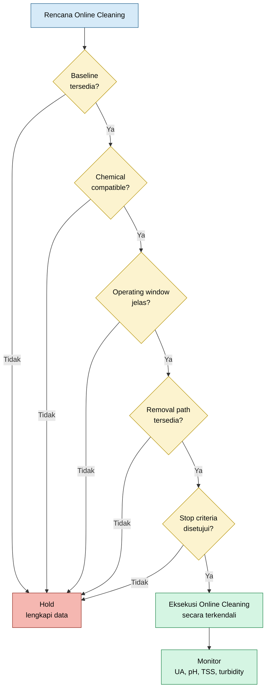

## 11.4 Stop Criteria Online Cleaning

Online cleaning harus memiliki stop criteria. Tanpa stop criteria, tindakan dapat berlanjut walaupun risiko sudah meningkat.

Online cleaning harus dihentikan atau dievaluasi ulang bila terjadi:

$$
T_{h,out}

>

T_{h,out,limit}
$$

$$
pH
<
pH_{min}
$$

atau:

$$
pH

>

pH_{max}
$$

$$
\text{corrosion rate}

>

\text{allowable limit}
$$

$$
\text{turbidity}
\text{ sangat tinggi dan tidak turun}
$$

$$
\text{gasket leak terindikasi}
$$

$$
\text{user cooling water lain terdampak}
$$

$$
UA_{after}
\leq
UA_{before}
\text{ setelah periode evaluasi}
$$

Stop criteria harus disetujui sebelum eksekusi, bukan setelah terjadi upset.

## 11.5 Ringkasan Bab 11

Hal yang tidak direkomendasikan saat plant online adalah tindakan yang agresif, tidak terukur, atau tidak memiliki removal path. Online cleaning yang buruk dapat menyebabkan masalah lebih besar daripada scaling awal.

Tindakan yang harus dihindari meliputi:

- injeksi HCl langsung ke branch PHE;
- acid shock lokal;
- pH depression ekstrem;
- chemical tanpa compatibility check;
- flow reversal tanpa jalur drain atau filter;
- membuang debris ke supply header;
- valve operation mendadak;
- air scouring tanpa desain;
- chemical treatment tanpa target residual;
- treatment tanpa monitoring $UA$.

Risiko teknis utama adalah:

$$
\text{pitting corrosion}
$$

$$
\text{crevice corrosion}
$$

$$
\text{gasket degradation}
$$

$$
\text{plate leakage}
$$

$$
\text{plugging downstream}
$$

$$
\text{water hammer}
$$

$$
\text{thermal shock}
$$

$$
\text{process temperature excursion}
$$

$$
\text{impact to other cooling water users}
$$

Kesimpulan praktisnya:

$$
\boxed{
\text{online cleaning harus dikendalikan dengan baseline, compatibility check, monitoring, removal path, dan stop criteria}
}
$$

[**Kembali ke Atas**](#online-troubleshooting-dan-recovery-performance-plate-heat-exchanger-akibat-scaling-pada-sisi-cooling-water)

---

# 12. Template Monitoring untuk Engineer Lapangan

Monitoring adalah bagian paling penting dari online cleaning. Tanpa monitoring yang benar, engineer tidak dapat membedakan apakah online cleaning benar-benar memperbaiki performance atau hanya menghasilkan perubahan operasi sementara.

Template monitoring harus mendukung empat tujuan:

$$
\text{merekam kondisi awal}
$$

$$
\text{mengikuti respons selama cleaning}
$$

$$
\text{menghitung recovery performance}
$$

$$
\text{membuktikan apakah tindakan efektif}
$$

Parameter monitoring harus dibagi menjadi tiga kelompok:

1. performance PHE;
2. chemistry cooling water;
3. aktivitas online cleaning.

## 12.1 Template Data Performance

Template data performance digunakan untuk menghitung heat duty, LMTD, actual thermal conductance, dan performance ratio.

| Parameter            |       Unit | Aktual Saat Ini | Design | Before Cleaning | During | After | Clean Baseline |
| -------------------- | ---------: | --------------: | -----: | --------------: | -----: | ----: | -------------: |
| $T_{h,in}$           | $^\circ C$ |             109 |    109 |                 |        |       |                |
| $T_{h,out}$          | $^\circ C$ |              56 |     65 |                 |        |       |                |
| $\Delta T_{process}$ | $^\circ C$ |              53 |     44 |                 |        |       |                |
| $\dot{m}_h$          |       kg/h |             TBD |    TBD |                 |        |       |                |
| $C_{p,h}$            |    kJ/kg.K |             TBD |    TBD |                 |        |       |                |
| $T_{c,in}$           | $^\circ C$ |             TBD |    TBD |                 |        |       |                |
| $T_{c,out}$          | $^\circ C$ |             TBD |    TBD |                 |        |       |                |
| $\Delta T_{CW}$      | $^\circ C$ |             TBD |    TBD |                 |        |       |                |
| $T_{approach}$       | $^\circ C$ |             TBD |    TBD |                 |        |       |                |
| $Q_{actual}$         |         kW |             TBD |    TBD |                 |        |       |                |
| $\Delta T_{lm}$      | $^\circ C$ |             TBD |    TBD |                 |        |       |                |
| $UA_{actual}$        |       kW/K |             TBD |    TBD |                 |        |       |                |
| $UA/UA_{clean}$      |       $\%$ |             TBD |    TBD |                 |        |       |                |
| Performance loss     |       $\%$ |             TBD |    TBD |                 |        |       |                |

Rumus yang digunakan dalam template ini adalah:

$$
\Delta T_{process} = T_{h,in} - T_{h,out}
$$

$$
Q_{actual} = \dot{m}_{h} C_{p,h} \left( T_{h,in} - T_{h,out} \right)
$$

$$
\Delta T_{CW} = T_{c,out} - T_{c,in}
$$

$$
T_{approach} = T_{h,out} - T_{c,in}
$$

$$
\Delta T_1 = T_{h,in} - T_{c,out}
$$

$$
\Delta T_2 = T_{h,out} - T_{c,in}
$$

$$
\Delta T_{lm} = \frac{ \Delta T_1 - \Delta T_2 } { \ln \left( \frac{\Delta T_1}{\Delta T_2} \right) }
$$

$$
UA_{actual} = \frac{ Q_{actual} } { \Delta T_{lm} }
$$

Performance ratio:

$$
\text{Performance Ratio} = \frac{ UA_{actual} } { UA_{clean} }
$$

Performance loss:

$$
\text{Performance Loss} = \left( 1 - \frac{ UA_{actual} } { UA_{clean} } \right) \times 100\%
$$

Catatan penting: kolom “Aktual Saat Ini” tidak sama dengan “Before Cleaning” bila data sebelum cleaning diambil pada waktu yang berbeda. Engineer harus mencatat waktu pengambilan data karena process load dan cooling water temperature dapat berubah.

## 12.2 Template Data Cooling Water Chemistry

Template chemistry digunakan untuk melihat apakah kondisi cooling water mendukung scaling, fouling, corrosion, atau biological growth.

| Parameter             |            Unit | Before | During | After | Target |
| --------------------- | --------------: | -----: | -----: | ----: | -----: |
| pH                    |               - |        |        |       |        |
| Conductivity          |           µS/cm |        |        |       |        |
| Hardness              | ppm as $CaCO_3$ |        |        |       |        |
| Alkalinity            | ppm as $CaCO_3$ |        |        |       |        |
| Silica                |             ppm |        |        |       |        |
| TSS                   |             ppm |        |        |       |        |
| Turbidity             |             NTU |        |        |       |        |
| Iron                  |             ppm |        |        |       |        |
| Chloride              |             ppm |        |        |       |        |
| Residual inhibitor    |             ppm |        |        |       |        |
| Residual biocide      |             ppm |        |        |       |        |
| Microbiological count |          CFU/mL |        |        |       |        |

Interpretasi parameter utama:

| Parameter                    | Interpretasi                           |
| ---------------------------- | -------------------------------------- |
| pH tinggi                    | meningkatkan risiko carbonate scaling  |
| pH rendah                    | meningkatkan risiko corrosion          |
| conductivity tinggi          | indikasi cycle of concentration tinggi |
| hardness tinggi              | risiko calcium/magnesium scale         |
| alkalinity tinggi            | risiko carbonate scaling               |
| silica tinggi                | risiko silica scale                    |
| TSS tinggi                   | risiko particulate fouling             |
| turbidity tinggi             | indikasi partikel tersuspensi          |
| iron tinggi                  | indikasi corrosion product             |
| chloride tinggi              | risiko pitting pada stainless steel    |
| residual inhibitor rendah    | scale control tidak efektif            |
| residual biocide rendah      | biofouling control lemah               |
| microbiological count tinggi | risiko biofilm                         |

Hubungan scaling tendency sederhana untuk calcium carbonate:

$$
Ca^{2+}
+
CO_3^{2-}
\rightarrow
CaCO_3
\downarrow
$$

Jika pH meningkat:

$$
CO_3^{2-}
\uparrow
$$

maka:

$$
\text{CaCO}_3 \text{ scaling tendency}
\uparrow
$$

Karena itu, pH, hardness, dan alkalinity harus dibaca sebagai satu kelompok, bukan satu parameter terpisah.

## 12.3 Template Aktivitas Online Cleaning

Template aktivitas digunakan untuk mencatat setiap tindakan online cleaning. Tujuannya agar setiap respons performance dapat dikaitkan dengan tindakan tertentu.

| Aktivitas              | Start Time | End Time | Parameter Target   | Hasil Aktual | Catatan |
| ---------------------- | ---------- | -------- | ------------------ | ------------ | ------- |
| Increase blowdown      |            |          | conductivity       |              |         |
| Antiscalant shock dose |            |          | residual inhibitor |              |         |
| Dispersant dosing      |            |          | TSS/turbidity      |              |         |
| Biodispersant          |            |          | microbial/slime    |              |         |
| Biocide shock          |            |          | residual biocide   |              |         |
| Flow cycling           |            |          | $T_{h,out}$, $UA$  |              |         |
| Side-stream filtration |            |          | TSS/turbidity      |              |         |
| Strainer cleaning      |            |          | visual deposit     |              |         |

Setiap aktivitas harus memiliki target. Contoh:

- increase blowdown tidak cukup ditulis “blowdown dilakukan”; harus ditulis target conductivity;
- antiscalant shock dose harus memiliki target residual inhibitor;
- dispersant dosing harus dikaitkan dengan TSS/turbidity;
- flow cycling harus dikaitkan dengan $T_{h,out}$ dan $UA$;
- filtration harus dikaitkan dengan penurunan TSS atau turbidity.

## 12.4 Template Perhitungan Recovery

Untuk menilai hasil online cleaning, gunakan template perhitungan berikut.

| Parameter            |          Symbol | Before | After | Change |
| -------------------- | --------------: | -----: | ----: | -----: |
| Heat duty            |             $Q$ |        |       |        |
| LMTD                 | $\Delta T_{lm}$ |        |       |        |
| Thermal conductance  |            $UA$ |        |       |        |
| Approach temperature |  $T_{approach}$ |        |       |        |
| Performance ratio    | $UA/UA_{clean}$ |        |       |        |
| Performance loss     |            $\%$ |        |       |        |

Rumus perubahan $UA$:

$$
\Delta UA = UA_{after} - UA_{before}
$$

Jika:

$$
\Delta UA

>

0
$$

maka performance membaik.

Recovery terhadap clean baseline:

$$
\text{Recovery} = \frac{ UA_{after} - UA_{before} } { UA_{clean} } \times 100\%
$$

Remaining performance loss:

$$
\text{Remaining Loss} = \left( 1 - \frac{ UA_{after} } { UA_{clean} } \right) \times 100\%
$$

Jika clean baseline tidak tersedia, gunakan baseline terbaik historis, tetapi beri catatan:

$$
UA_{clean}
\approx
UA_{best\ historical}
$$

dengan status:

$$
\text{temporary reference}
$$

bukan clean baseline definitif.

## 12.5 Template Trend Harian

Untuk PHE critical, monitoring tidak cukup dilakukan satu kali. Data harus dibuat dalam trend harian atau per shift.

| Date/Shift | $T_{h,in}$ | $T_{h,out}$ | $T_{c,in}$ | $T_{c,out}$ | $Q$ | $\Delta T_{lm}$ | $UA$ | $T_{approach}$ |  pH | Conductivity | TSS | Remark |
| ---------- | ---------: | ----------: | ---------: | ----------: | --: | --------------: | ---: | -------------: | --: | -----------: | --: | ------ |
|            |            |             |            |             |     |                 |      |                |     |              |     |        |

Trend ini lebih kuat daripada satu snapshot data. Scaling biasanya progresif, sehingga indikasi yang dicari adalah:

$$
UA
\downarrow
\text{ terhadap waktu}
$$

atau:

$$
T_{approach}
\uparrow
\text{ terhadap waktu}
$$

Jika online cleaning berhasil, trend yang diharapkan adalah:

$$
UA
\uparrow
\text{ atau stabil}
$$

dan:

$$
T_{approach}
\downarrow
\text{ atau stabil}
$$

## 12.6 Alur Monitoring Data

Diagram berikut menunjukkan alur monitoring dari data mentah sampai keputusan tindakan.

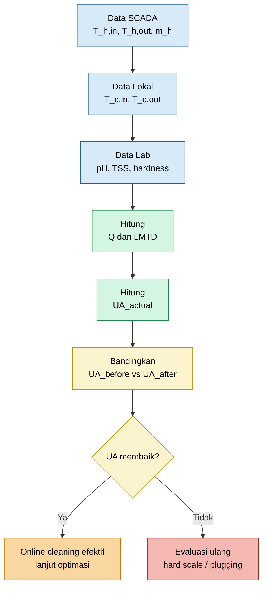

Diagram tersebut menegaskan bahwa data tidak boleh berhenti pada pencatatan temperatur. Data harus diproses menjadi $Q$, $\Delta T_{lm}$, dan $UA$ agar dapat menjadi dasar keputusan.

## 12.7 Minimum Acceptance untuk Data Monitoring

Agar monitoring dianggap layak untuk evaluasi engineering, minimal data berikut harus tersedia:

$$
T_{h,in}
$$

$$
T_{h,out}
$$

$$
\dot{m}_h
$$

$$
C_{p,h}
$$

$$
T_{c,in}
$$

$$
T_{c,out}
$$

Jika salah satu dari data tersebut tidak tersedia, maka perhitungan $UA$ tidak lengkap.

Data tambahan yang sangat disarankan:

$$
pH
$$

$$
\text{conductivity}
$$

$$
\text{hardness}
$$

$$
\text{alkalinity}
$$

$$
TSS
$$

$$
\text{turbidity}
$$

$$
\text{residual inhibitor}
$$

$$
\text{residual biocide}
$$

Tanpa data chemical, engineer dapat mengetahui bahwa $UA$ berubah, tetapi sulit menentukan penyebabnya secara lebih akurat.

## 12.8 Kesalahan Umum dalam Monitoring

Kesalahan yang sering terjadi di lapangan adalah:

1. hanya mencatat outlet temperature;
2. tidak mencatat cooling water inlet temperature;
3. tidak mencatat cooling water outlet temperature;
4. tidak mencatat process flow;
5. tidak menghitung $UA$;
6. membandingkan data aktual dengan design tanpa memastikan operating case comparable;
7. menyimpulkan scaling hanya dari visual atau feeling;
8. menilai keberhasilan online cleaning hanya karena chemical sudah ditambahkan;
9. tidak mencatat waktu dosing;
10. tidak mencatat residual chemical.

Contoh kesimpulan yang lemah:

> PHE sudah membaik karena outlet lebih dingin.

Kesimpulan yang lebih kuat:

> Setelah online cleaning, $UA$ meningkat dari $UA_{before}$ menjadi $UA_{after}$ pada process flow dan cooling water inlet temperature yang comparable. $T_{approach}$ turun, dan turbidity naik sementara lalu turun setelah blowdown.

## 12.9 Ringkasan Bab 12

Template monitoring harus memastikan setiap tindakan online cleaning dapat dievaluasi secara kuantitatif. Parameter utama yang harus dihitung adalah:

$$
Q_{actual}
$$

$$
\Delta T_{lm}
$$

$$
UA_{actual}
$$

$$
T_{approach}
$$

$$
\frac{UA_{actual}}{UA_{clean}}
$$

Data chemistry harus digunakan untuk menjelaskan penyebab dan respons online cleaning, sedangkan data aktivitas digunakan untuk menghubungkan tindakan dengan perubahan performance.

Kesimpulan praktisnya:

$$
\boxed{
\text{monitoring yang baik mengubah observasi lapangan menjadi keputusan engineering}
}
$$

dan:

$$
\boxed{
\text{tanpa } UA \text{ dan baseline, efektivitas online cleaning belum dapat dibuktikan}
}
$$

[**Kembali ke Atas**](#online-troubleshooting-dan-recovery-performance-plate-heat-exchanger-akibat-scaling-pada-sisi-cooling-water)

---

# 13. Rekomendasi Implementasi di Lapangan

Implementasi online cleaning pada PHE Water Scrubber harus dilakukan sebagai program engineering terkontrol, bukan sekadar aktivitas chemical dosing. Tujuannya adalah memastikan bahwa setiap tindakan memiliki dasar data, batas operasi, metode monitoring, dan kriteria evaluasi yang jelas.

Pada kondisi plant tetap running, rekomendasi implementasi harus menjawab tiga fase utama:

$$
\text{sebelum online cleaning}
$$

$$
\text{selama online cleaning}
$$

$$
\text{setelah online cleaning}
$$

Ketiga fase tersebut harus terhubung dengan parameter performance PHE, cooling water chemistry, dan respons operasi.

```mermaid id="implementasi-online-cleaning"
flowchart TD
    A["Sebelum Online Cleaning<br/>validasi data dan risiko"] --> B["Selama Online Cleaning<br/>monitor operasi dan chemistry"]
    B --> C["Setelah Online Cleaning<br/>hitung recovery performance"]
    C --> D{"Recovery<br/>signifikan?"}
    D -->|Ya| E["Lanjut optimized treatment<br/>dan monitoring UA"]
    D -->|Tidak| F["Evaluasi hard scale<br/>plugging / internal bypass"]
    F --> G["Rencanakan offline cleaning<br/>pada opportunity shutdown"]

    classDef before fill:#D6EAF8,stroke:#21618C,color:#000;
    classDef during fill:#D5F5E3,stroke:#1E8449,color:#000;
    classDef after fill:#FCF3CF,stroke:#B7950B,color:#000;
    classDef good fill:#D5F5E3,stroke:#1E8449,color:#000;
    classDef bad fill:#F5B7B1,stroke:#922B21,color:#000;

    class A before;
    class B during;
    class C,D after;
    class E good;
    class F,G bad;
```

## 13.1 Sebelum Online Cleaning

Sebelum online cleaning dilakukan, engineer harus memastikan bahwa data awal cukup untuk membedakan antara **indikasi scaling**, **perubahan load**, **perubahan cooling water condition**, dan **perubahan operasi**.

Data SCADA sisi process harus divalidasi terlebih dahulu:

$$
T_{h,in} = 109^\circ C
$$

$$
T_{h,out} = 56^\circ C
$$

Sehingga:

$$
\Delta T_{process} = T_{h,in} - T_{h,out}
$$

$$
\Delta T_{process} = 109 - 56 = 53^\circ C
$$

Namun, nilai ini belum cukup untuk menyimpulkan performance loss. Sebelum online cleaning, data berikut harus tersedia atau minimal memiliki rencana pengambilan data:

| Data                      | Status Minimum     | Tujuan                                          |
| ------------------------- | ------------------ | ----------------------------------------------- |
| $T_{h,in}$                | valid dari SCADA   | basis heat duty dan LMTD                        |
| $T_{h,out}$               | valid dari SCADA   | basis heat duty dan approach                    |
| $\dot{m}_h$               | harus tersedia     | menghitung $Q_{actual}$                         |
| $C_{p,h}$                 | harus tersedia     | menghitung $Q_{actual}$                         |
| $T_{c,in}$                | harus diukur lokal | menghitung approach dan LMTD                    |
| $T_{c,out}$               | harus diukur lokal | menghitung LMTD dan estimasi CW flow            |
| water chemistry           | harus dianalisis   | menentukan scaling tendency                     |
| target outlet temperature | harus disepakati   | menjaga batas operasi process                   |
| stop criteria             | harus disepakati   | mencegah online cleaning menjadi risiko operasi |

Checklist sebelum online cleaning:

- data SCADA process sudah divalidasi;
- $T_{h,in}=109^\circ C$ dan $T_{h,out}=56^\circ C$ benar;
- local temperature cooling water inlet dan outlet diambil;
- process flow aktual tersedia;
- $C_{p,h}$ process fluid tersedia;
- water chemistry dianalisis;
- batas aman process outlet temperature ditentukan;
- batas pH dan conductivity ditentukan;
- target residual chemical ditentukan;
- removal path tersedia melalui blowdown, filtration, atau strainer cleaning;
- koordinasi dengan utility dan operation dilakukan;
- operator panel mengetahui parameter yang harus dimonitor;
- stop criteria sudah disetujui.

Heat duty awal harus dihitung dengan:

$$
Q_{before} = \dot{m}_{h,before} C_{p,h,before} \left( T_{h,in,before} - T_{h,out,before} \right)
$$

Untuk data temperatur saat ini:

$$
Q_{before} = \dot{m}_{h,before} C_{p,h,before} \left( 109 - 56 \right)
$$

$$
Q_{before} = \dot{m}_{h,before} C_{p,h,before} \left( 53 \right)
$$

Setelah $T_{c,in}$ dan $T_{c,out}$ tersedia, hitung:

$$
\Delta T_{1,before} = T_{h,in,before} - T_{c,out,before}
$$

$$
\Delta T_{2,before} = T_{h,out,before} - T_{c,in,before}
$$

$$
\Delta T_{lm,before} = \frac{ \Delta T_{1,before} - \Delta T_{2,before} } { \ln \left( \frac{\Delta T_{1,before}}{\Delta T_{2,before}} \right) }
$$

Kemudian:

$$
UA_{before} = \frac{ Q_{before} } { \Delta T_{lm,before} }
$$

Nilai $UA_{before}$ inilah yang menjadi baseline aktual sebelum online cleaning.

## 13.2 Selama Online Cleaning

Selama online cleaning, fokus utama adalah menjaga plant tetap stabil sambil memantau apakah chemical dan hydraulic action menghasilkan respons yang diinginkan.

Parameter yang harus dimonitor:

$$
T_{h,out}
$$

$$
T_{approach}
$$

$$
T_{c,in}
$$

$$
T_{c,out}
$$

$$
UA_{actual}
$$

$$
pH
$$

$$
\text{conductivity}
$$

$$
TSS
$$

$$
\text{turbidity}
$$

$$
\text{chemical residual}
$$

$$
\text{strainer/filter condition}
$$

Secara operasional, parameter tersebut dapat dikelompokkan sebagai berikut.

| Kelompok Monitoring       | Parameter                                | Tujuan                         |
| ------------------------- | ---------------------------------------- | ------------------------------ |
| Process response          | $T_{h,out}$, $T_{approach}$              | memastikan process tetap aman  |
| Thermal performance       | $Q$, $\Delta T_{lm}$, $UA$               | membuktikan recovery           |
| Cooling water temperature | $T_{c,in}$, $T_{c,out}$, $\Delta T_{CW}$ | melihat respons cooling water  |
| Chemistry                 | pH, conductivity, hardness, alkalinity   | mengendalikan scaling tendency |
| Solids release            | TSS, turbidity                           | melihat deposit terlepas       |
| Chemical control          | residual inhibitor, residual biocide     | memastikan dosing efektif      |
| Mechanical protection     | strainer/filter condition                | mencegah plugging downstream   |

Selama online cleaning, engineer harus menghindari interpretasi tunggal. Misalnya, jika turbidity naik, hal tersebut dapat berarti deposit mulai terlepas. Namun, jika turbidity tidak turun setelah blowdown atau filtration, maka risiko redeposition meningkat.

Pola respons yang diharapkan:

$$
TSS
\uparrow
\text{ sementara}
\rightarrow
TSS
\downarrow
$$

$$
\text{turbidity}
\uparrow
\text{ sementara}
\rightarrow
\text{turbidity}
\downarrow
$$

$$
UA_{actual}
\uparrow
$$

atau minimal:

$$
UA_{actual}
\text{ stabil}
$$

pada kondisi yang sebelumnya menunjukkan degradasi.

Selama online cleaning, $T_{approach}$ harus dihitung secara berkala:

$$
T_{approach} = T_{h,out} - T_{c,in}
$$

Jika $T_{approach}$ turun pada load yang comparable, maka cooling effectiveness membaik:

$$
T_{approach,after}
<
T_{approach,before}
$$

Namun, jika $T_{c,in}$ berubah signifikan, maka perubahan $T_{approach}$ harus dibaca bersama $UA$ agar tidak salah interpretasi.

```mermaid id="monitor-selama-online"
flowchart TD
    A["Online Cleaning Running"] --> B["Monitor Process<br/>T_h,out"]
    A --> C["Monitor Thermal<br/>Q, LMTD, UA"]
    A --> D["Monitor Chemistry<br/>pH, conductivity, residual"]
    A --> E["Monitor Solids<br/>TSS, turbidity"]
    A --> F["Monitor Mechanical<br/>filter / strainer"]

    B --> G{"Process<br/>aman?"}
    C --> H{"UA<br/>membaik?"}
    D --> I{"Chemistry<br/>dalam target?"}
    E --> J{"Solids<br/>terbuang?"}
    F --> K{"Tidak ada<br/>plugging?"}

    G --> L["Lanjut dengan kontrol"]
    H --> L
    I --> L
    J --> L
    K --> L

    G -->|Tidak| M["Stop / hold<br/>evaluasi ulang"]
    I -->|Tidak| M
    K -->|Tidak| M

    classDef start fill:#D6EAF8,stroke:#21618C,color:#000;
    classDef monitor fill:#D5F5E3,stroke:#1E8449,color:#000;
    classDef decision fill:#FCF3CF,stroke:#B7950B,color:#000;
    classDef good fill:#D5F5E3,stroke:#1E8449,color:#000;
    classDef stop fill:#F5B7B1,stroke:#922B21,color:#000;

    class A start;
    class B,C,D,E,F monitor;
    class G,H,I,J,K decision;
    class L good;
    class M stop;
```

Online cleaning harus dihentikan sementara atau dievaluasi ulang jika terjadi:

$$
T_{h,out}

>

T_{h,out,limit}
$$

$$
pH
<
pH_{min}
$$

atau:

$$
pH

>

pH_{max}
$$

$$
\text{turbidity}
\text{ tinggi dan tidak turun}
$$

$$
\text{strainer plugging}
$$

$$
\text{indikasi leak}
$$

$$
\text{user cooling water lain terdampak}
$$

## 13.3 Setelah Online Cleaning

Setelah online cleaning selesai, engineer harus menghitung ulang performance. Evaluasi setelah cleaning tidak boleh hanya berbasis observasi bahwa chemical sudah diinjeksikan atau cooling water terlihat lebih jernih.

Parameter yang harus dihitung:

$$
Q_{after}
$$

$$
UA_{after}
$$

$$
\frac{UA_{after}}{UA_{clean}}
$$

$$
\text{performance recovery}
$$

$$
\text{remaining performance loss}
$$

Heat duty setelah online cleaning:

$$
Q_{after} = \dot{m}_{h,after} C_{p,h,after} \left( T_{h,in,after} - T_{h,out,after} \right)
$$

LMTD setelah online cleaning:

$$
\Delta T_{1,after} = T_{h,in,after} - T_{c,out,after}
$$

$$
\Delta T_{2,after} = T_{h,out,after} - T_{c,in,after}
$$

$$
\Delta T_{lm,after} = \frac{ \Delta T_{1,after} - \Delta T_{2,after} } { \ln \left( \frac{\Delta T_{1,after}}{\Delta T_{2,after}} \right) }
$$

Actual thermal conductance setelah online cleaning:

$$
UA_{after} = \frac{ Q_{after} } { \Delta T_{lm,after} }
$$

Recovery dihitung sebagai:

$$
\Delta UA = UA_{after} - UA_{before}
$$

Jika:

$$
\Delta UA

>

0
$$

maka terjadi recovery thermal conductance.

Recovery terhadap clean baseline:

$$
\text{Performance Recovery} = \frac{ UA_{after} - UA_{before} } { UA_{clean} } \times 100\%
$$

Remaining performance loss:

$$
\text{Remaining Performance Loss} = \left( 1 - \frac{ UA_{after} } { UA_{clean} } \right) \times 100\%
$$

Jika recovery signifikan, maka tindakan lanjutan adalah:

- lanjutkan optimized chemical treatment;
- pertahankan monitoring $UA$;
- review blowdown;
- review side-stream filtration;
- update operating guideline;
- jadwalkan inspection pada opportunity shutdown;
- jadikan $UA_{after}$ sebagai data pembanding sementara.

Jika recovery kecil, maka kemungkinan penyebabnya adalah:

- scale terlalu keras;
- silica scale;
- deposit sudah terkonsolidasi;
- plugging berat;
- maldistribution;
- internal bypass;
- gasket leakage;
- chemical tidak mencapai channel bermasalah;
- removal path tidak cukup;
- root cause bukan scaling dominan.

Dalam kondisi recovery kecil, tindakan selanjutnya adalah:

- curigai hard scale;
- curigai silica scale;
- curigai plugging;
- curigai internal bypass;
- rencanakan offline cleaning pada opportunity shutdown;
- pertimbangkan temporary clamp-on flowmeter untuk cooling water;
- pertimbangkan penambahan pressure tapping pada next shutdown;
- siapkan inspection checklist untuk plate dan gasket.

## 13.4 Practical Decision Logic

Setelah online cleaning, keputusan praktis dapat dibuat menggunakan logic berikut.

```mermaid id="post-cleaning-decision"
flowchart TD
    A["Hitung UA_before<br/>dan UA_after"] --> B{"UA_after > UA_before?"}
    B -->|Ya| C["Recovery terukur"]
    C --> D{"TSS/turbidity<br/>turun setelah removal?"}
    D -->|Ya| E["Program efektif<br/>lanjut optimized treatment"]
    D -->|Tidak| F["Recovery ada<br/>tetapi removal belum cukup"]
    F --> G["Perkuat filtration<br/>dan blowdown"]

    B -->|Tidak| H["Tidak ada recovery"]
    H --> I{"Chemistry<br/>sudah terkoreksi?"}
    I -->|Tidak| J["Koreksi chemistry<br/>ulang program"]
    I -->|Ya| K["Curigai hard scale,<br/>plugging, bypass"]
    K --> L["Rencanakan offline cleaning<br/>dan inspection"]

    classDef calc fill:#D6EAF8,stroke:#21618C,color:#000;
    classDef good fill:#D5F5E3,stroke:#1E8449,color:#000;
    classDef warning fill:#FCF3CF,stroke:#B7950B,color:#000;
    classDef bad fill:#F5B7B1,stroke:#922B21,color:#000;
    classDef action fill:#FAD7A0,stroke:#B9770E,color:#000;

    class A,B calc;
    class C,D,E good;
    class F,G warning;
    class H,I,J,K,L bad;
```

Logic ini membantu engineer menghindari dua kesalahan umum:

1. menganggap online cleaning gagal hanya karena outlet temperature tidak berubah, padahal $UA$ mungkin stabil dan degradasi berhenti;
2. menganggap online cleaning berhasil hanya karena chemical sudah diinjeksikan, padahal $UA$ tidak membaik.

## 13.5 Dokumentasi yang Harus Disimpan

Setelah online cleaning, semua data harus disimpan sebagai referensi untuk troubleshooting berikutnya.

Dokumentasi minimum:

| Dokumen/Data                        | Fungsi                                |
| ----------------------------------- | ------------------------------------- |
| data SCADA sebelum, selama, sesudah | melihat trend process                 |
| data temperatur cooling water lokal | menghitung LMTD dan approach          |
| data process flow dan $C_p$         | menghitung heat duty                  |
| water chemistry report              | melihat scaling tendency              |
| chemical dosing log                 | menghubungkan tindakan dengan respons |
| blowdown/filtration log             | membuktikan removal path              |
| strainer cleaning record            | bukti deposit release                 |
| $UA$ calculation sheet              | bukti performance recovery            |
| deviation atau abnormality report   | jika terjadi upset                    |
| recommendation follow-up            | dasar tindakan selanjutnya            |

Dokumentasi ini penting karena PHE scaling biasanya bersifat berulang. Tanpa data historis, troubleshooting berikutnya akan kembali mulai dari nol.

[**Kembali ke Atas**](#online-troubleshooting-dan-recovery-performance-plate-heat-exchanger-akibat-scaling-pada-sisi-cooling-water)

---

# 14. Kesimpulan

Data SCADA PHE Water Scrubber menunjukkan:

$$
T_{h,in,actual} = 109^\circ C
$$

$$
T_{h,out,actual} = 56^\circ C
$$

Sehingga:

$$
\Delta T_{actual} = T_{h,in,actual} - T_{h,out,actual}
$$

$$
\Delta T_{actual} = 109 - 56 = 53^\circ C
$$

Sedangkan data design menunjukkan:

$$
T_{h,in,design} = 109^\circ C
$$

$$
T_{h,out,design} = 65^\circ C
$$

Sehingga:

$$
\Delta T_{design} = T_{h,in,design} - T_{h,out,design}
$$

$$
\Delta T_{design} = 109 - 65 = 44^\circ C
$$

Jika flow dan $C_p$ process sama antara aktual dan design, maka rasio heat removal adalah:

$$
\frac{
Q_{actual}
}
{
Q_{design}
}
=

\frac{
\Delta T_{actual}
}
{
\Delta T_{design}
}
$$

$$
\frac{
Q_{actual}
}
{
Q_{design}
}
=

\frac{
53
}
{
44
}
=

1.2045
$$

Dengan demikian:

$$
Q_{actual}
\approx
120.45\%
Q_{design}
$$

Artinya, berdasarkan process temperature drop saja, heat removal aktual terlihat lebih besar dari design. Data ini **tidak langsung menunjukkan performance loss**.

Angka:

$$
16.98\%
$$

yang berasal dari:

$$
\frac{ 53 - 44 } { 53 } \times 100\% = 16.98\%
$$

harus diklarifikasi karena angka tersebut bukan definisi standar performance loss PHE. Angka tersebut hanya menunjukkan selisih antara actual process temperature drop dan design process temperature drop terhadap actual process temperature drop.

Performance loss akibat scaling harus dibuktikan melalui:

$$
\boxed{
\frac{
UA_{actual}
}
{
UA_{clean}
}
}
$$

bukan hanya dari:

$$
\Delta T_{process}
$$

Secara engineering, performance PHE harus dievaluasi dengan:

$$
Q_{actual}
$$

$$
\Delta T_{lm}
$$

$$
UA_{actual}
$$

$$
T_{approach}
$$

$$
\frac{
UA_{actual}
}
{
UA_{clean}
}
$$

Jika benar terjadi scaling pada sisi cooling water, maka mekanismenya adalah bertambahnya thermal resistance pada permukaan plate:

$$
\frac{1}{U_{scaled}} = \frac{1}{U_{clean}} + R_{scale}
$$

Dengan:

$$
R_{scale} = \frac{\delta_s}{k_s}
$$

Jika $R_{scale}$ meningkat, maka:

$$
U
\downarrow
$$

$$
UA
\downarrow
$$

dan pada driving force temperatur yang sama:

$$
Q
\downarrow
$$

Namun, pada kondisi plant tetap running, offline cleaning ideal tidak selalu tersedia. Oleh karena itu, strategi online cleaning tetap relevan bila ada indikasi scaling dari:

- trend penurunan $UA$;
- kenaikan $T_{approach}$;
- cooling water chemistry yang mendukung scaling;
- kenaikan TSS atau turbidity;
- penurunan performance historis;
- indikasi fouling atau biofilm;
- outlet process bergerak menjauh dari target operasi pada load comparable.

Strategi online yang direkomendasikan adalah:

$$
\boxed{
\text{soften}
\rightarrow
\text{disperse}
\rightarrow
\text{shear}
\rightarrow
\text{remove}
\rightarrow
\text{monitor}
}
$$

Makna operasionalnya:

$$
\boxed{
\text{lunakkan deposit, jaga tetap tersuspensi, lepaskan dengan aliran, buang dari sistem, lalu ukur recovery}
}
$$

Tindakan utama yang direkomendasikan meliputi:

- optimasi cooling water chemistry;
- shock dosing antiscalant;
- dispersant dosing;
- biodispersant dan biocide bila ada biofilm;
- controlled pH adjustment;
- peningkatan cooling water velocity;
- flow cycling terkendali;
- side-stream filtration;
- blowdown;
- monitoring $UA$, $T_{approach}$, dan $T_{h,out}$.

Keberhasilan online cleaning harus dibuktikan dengan:

$$
UA_{after}

>

UA_{before}
$$

atau:

$$
\frac{
UA_{after}
}
{
UA_{clean}
}

>

\frac{
UA_{before}
}
{
UA_{clean}
}
$$

Jika tidak ada perbaikan:

$$
UA_{after}
\approx
UA_{before}
$$

maka online cleaning belum terbukti efektif. Pada kondisi tersebut, engineer harus mempertimbangkan kemungkinan:

- hard scale;
- silica scale;
- deposit terkonsolidasi;
- plugging berat;
- maldistribution;
- internal bypass;
- gasket leakage;
- plate deformation;
- plate arrangement issue;
- tightening dimension issue.

Kesimpulan paling penting dari artikel ini adalah:

$$
\boxed{
\Delta T_{process}
\text{ adalah data penting, tetapi belum cukup untuk menyatakan scaling atau performance loss.}
}
$$

dan:

$$
\boxed{
\text{Performance PHE harus dibuktikan dengan }
Q,
\Delta T_{lm},
UA,
\text{ dan baseline yang comparable.}
}
$$

Untuk engineer-praktisi lapangan, pesan akhirnya adalah sederhana tetapi sangat penting:

$$
\boxed{
\text{jangan membuat keputusan maintenance besar hanya dari observasi kualitatif}
}
$$

Setiap tindakan harus dikaitkan dengan data:

$$
T_{h,in}
$$

$$
T_{h,out}
$$

$$
\dot{m}_h
$$

$$
C_{p,h}
$$

$$
T_{c,in}
$$

$$
T_{c,out}
$$

$$
Q_{actual}
$$

$$
\Delta T_{lm}
$$

$$
UA_{actual}
$$

$$
T_{approach}
$$

dan:

$$
\frac{
UA_{actual}
}
{
UA_{clean}
}
$$

Dengan pendekatan ini, troubleshooting PHE Water Scrubber tetap dapat dilakukan secara tajam, akurat, dan dapat dipertanggungjawabkan meskipun plant tetap beroperasi dan data cooling water tidak lengkap.

[**Kembali ke Atas**](#online-troubleshooting-dan-recovery-performance-plate-heat-exchanger-akibat-scaling-pada-sisi-cooling-water)

---

<small>
  **_Catatan Penyusunan_** Artikel ini disusun sebagai materi edukasi dan
  referensi umum berdasarkan berbagai sumber pustaka, praktik lapangan, serta
  bantuan alat penulisan. Pembaca disarankan untuk melakukan verifikasi lanjutan
  dan penyesuaian sesuai dengan kondisi serta kebutuhan masing-masing sistem.
</small>
