# **_Batas Minimum dan Maksimum Lubrikasi Rider Ring pada Reciprocating Compressor: Konversi Tetes/menit, mL/jam, Wear Control, dan Tindakan Koreksi Lapangan_**

---

- [**_Batas Minimum dan Maksimum Lubrikasi Rider Ring pada Reciprocating Compressor: Konversi Tetes/menit, mL/jam, Wear Control, dan Tindakan Koreksi Lapangan_**](#batas-minimum-dan-maksimum-lubrikasi-rider-ring-pada-reciprocating-compressor-konversi-tetesmenit-mljam-wear-control-dan-tindakan-koreksi-lapangan)
- [1. Executive Summary](#1-executive-summary)
- [2. Fungsi Rider Ring dan Makna Rider Band Bearing Load](#2-fungsi-rider-ring-dan-makna-rider-band-bearing-load)
  - [2.1 Fungsi Rider Ring](#21-fungsi-rider-ring)
  - [2.2 Apa yang Dimaksud Rider Band Bearing](#22-apa-yang-dimaksud-rider-band-bearing)
  - [2.3 Rumus Rider Band Bearing Load](#23-rumus-rider-band-bearing-load)
  - [2.4 Batas Praktis Rider Band Bearing Load](#24-batas-praktis-rider-band-bearing-load)
- [3. Konversi Tetes/menit ke mL/jam](#3-konversi-tetesmenit-ke-mljam)
  - [3.1 Mengapa Konversi Diperlukan](#31-mengapa-konversi-diperlukan)
  - [3.2 Formula Dasar Konversi](#32-formula-dasar-konversi)
  - [3.3 Asumsi Umum Drop Factor](#33-asumsi-umum-drop-factor)
  - [3.4 Total Oil Rate untuk Beberapa Lube Point](#34-total-oil-rate-untuk-beberapa-lube-point)
  - [3.5 Sensitivitas Drop Factor](#35-sensitivitas-drop-factor)
  - [3.6 Prosedur Kalibrasi Drop Factor](#36-prosedur-kalibrasi-drop-factor)
  - [3.7 Kesimpulan Bab Konversi](#37-kesimpulan-bab-konversi)
- [4. Penentuan Minimum dan Maksimum Lubrikasi](#4-penentuan-minimum-dan-maksimum-lubrikasi)
  - [4.1 Prinsip Penentuan Batas](#41-prinsip-penentuan-batas)
  - [4.2 Operating Envelope per Lube Point](#42-operating-envelope-per-lube-point)
  - [4.3 Pemilihan Normal Setting](#43-pemilihan-normal-setting)
  - [4.4 Break-in Lubrication](#44-break-in-lubrication)
  - [4.5 Adjustment Step](#45-adjustment-step)
  - [4.6 Decision Rule Minimum dan Maksimum](#46-decision-rule-minimum-dan-maksimum)
- [5. Verifikasi Oil Film di Lapangan](#5-verifikasi-oil-film-di-lapangan)
  - [5.1 Tujuan Verifikasi](#51-tujuan-verifikasi)
  - [5.2 Prosedur Paper Test](#52-prosedur-paper-test)
  - [5.3 Acceptance Criteria Paper Test](#53-acceptance-criteria-paper-test)
  - [5.4 Interpretasi Visual](#54-interpretasi-visual)
  - [5.5 Keterbatasan Paper Test](#55-keterbatasan-paper-test)
- [6. Efek Jika Oil Rate di Bawah Minimum](#6-efek-jika-oil-rate-di-bawah-minimum)
  - [6.1 Definisi Under-Lubrication](#61-definisi-under-lubrication)
  - [6.2 Mekanisme Kerusakan Akibat Under-Lubrication](#62-mekanisme-kerusakan-akibat-under-lubrication)
  - [6.3 Dampak Utama terhadap Rider Ring](#63-dampak-utama-terhadap-rider-ring)
  - [6.4 Dampak terhadap Cylinder Liner](#64-dampak-terhadap-cylinder-liner)
  - [6.5 Dampak terhadap Piston Ring dan Performance](#65-dampak-terhadap-piston-ring-dan-performance)
  - [6.6 Indikasi Lapangan Under-Lubrication](#66-indikasi-lapangan-under-lubrication)
  - [6.7 Tindakan Koreksi untuk Under-Lubrication](#67-tindakan-koreksi-untuk-under-lubrication)
  - [6.8 Kesimpulan Bab Under-Lubrication](#68-kesimpulan-bab-under-lubrication)
- [7. Efek Jika Oil Rate di Atas Maksimum](#7-efek-jika-oil-rate-di-atas-maksimum)
  - [7.1 Definisi Over-Lubrication](#71-definisi-over-lubrication)
  - [7.2 Prinsip Utama Over-Lubrication](#72-prinsip-utama-over-lubrication)
  - [7.3 Mengapa Oli Berlebih Bisa Mempercepat Wear Rider Ring](#73-mengapa-oli-berlebih-bisa-mempercepat-wear-rider-ring)
  - [7.4 Carbon Deposit sebagai Abrasive Third-Body](#74-carbon-deposit-sebagai-abrasive-third-body)
  - [7.5 RR Sticking dan Kenaikan Contact Pressure](#75-rr-sticking-dan-kenaikan-contact-pressure)
  - [7.6 Valve Fouling sebagai Penyebab Tidak Langsung RR Wear](#76-valve-fouling-sebagai-penyebab-tidak-langsung-rr-wear)
  - [7.7 Indikasi Lapangan Over-Lubrication](#77-indikasi-lapangan-over-lubrication)
  - [7.8 Contoh Koreksi Over-Lubrication](#78-contoh-koreksi-over-lubrication)
  - [7.9 Kesimpulan Bab Over-Lubrication](#79-kesimpulan-bab-over-lubrication)
- [8. Batas Temperatur dan Risiko Deposit](#8-batas-temperatur-dan-risiko-deposit)
  - [8.1 Mengapa Temperatur Penting](#81-mengapa-temperatur-penting)
  - [8.2 Temperature Envelope untuk Praktisi](#82-temperature-envelope-untuk-praktisi)
  - [8.3 Kombinasi Paling Berbahaya](#83-kombinasi-paling-berbahaya)
  - [8.4 Temperature-Based Action](#84-temperature-based-action)
  - [8.5 Temperatur Naik Tidak Selalu Berarti Oil Rate Kurang](#85-temperatur-naik-tidak-selalu-berarti-oil-rate-kurang)
  - [8.6 Kesimpulan Bab Temperatur](#86-kesimpulan-bab-temperatur)
- [9. Wear Rate Rider Ring dan Decision Rule](#9-wear-rate-rider-ring-dan-decision-rule)
  - [9.1 Mengapa Wear Rate Harus Dihitung](#91-mengapa-wear-rate-harus-dihitung)
  - [9.2 Formula Actual Wear Rate](#92-formula-actual-wear-rate)
  - [9.3 Formula Allowable Wear Rate](#93-formula-allowable-wear-rate)
  - [9.4 Decision Rule Wear Rate](#94-decision-rule-wear-rate)
  - [9.5 Contoh Evaluasi Wear Rate terhadap Oil Rate](#95-contoh-evaluasi-wear-rate-terhadap-oil-rate)
  - [9.6 Projected Remaining Life](#96-projected-remaining-life)
  - [9.7 Menghubungkan Wear Rate dengan Minimum dan Maksimum Lubrikasi](#97-menghubungkan-wear-rate-dengan-minimum-dan-maksimum-lubrikasi)
  - [9.8 Kesimpulan Bab Wear Rate](#98-kesimpulan-bab-wear-rate)
- [10. Troubleshooting dan Tindakan Koreksi](#10-troubleshooting-dan-tindakan-koreksi)
  - [10.1 Prinsip Troubleshooting](#101-prinsip-troubleshooting)
  - [10.2 Diagram Keputusan Cepat](#102-diagram-keputusan-cepat)
  - [10.3 Tabel Troubleshooting Utama](#103-tabel-troubleshooting-utama)
  - [10.4 Tindakan Jika RR Cepat Aus dan Liner Kering](#104-tindakan-jika-rr-cepat-aus-dan-liner-kering)
  - [10.5 Tindakan Jika RR Cepat Aus dan Liner Basah Hitam](#105-tindakan-jika-rr-cepat-aus-dan-liner-basah-hitam)
  - [10.6 Tindakan Jika Valve Basah Oli atau Banyak Deposit](#106-tindakan-jika-valve-basah-oli-atau-banyak-deposit)
  - [10.7 Tindakan Jika Carbon Deposit Ditemukan](#107-tindakan-jika-carbon-deposit-ditemukan)
  - [10.8 Tindakan Jika Wear Tidak Merata](#108-tindakan-jika-wear-tidak-merata)
  - [10.9 Prioritas Tindakan Koreksi](#109-prioritas-tindakan-koreksi)
  - [10.10 Kesimpulan Bab Troubleshooting](#1010-kesimpulan-bab-troubleshooting)
- [Lampiran](#lampiran)
  - [Lampiran A — Rumus Cepat](#lampiran-a--rumus-cepat)
    - [A.1 Konversi Tetes/menit ke mL/jam](#a1-konversi-tetesmenit-ke-mljam)
  - [A.2 Konversi mL/jam ke Tetes/menit](#a2-konversi-mljam-ke-tetesmenit)
  - [A.3 Total Oil Rate per Cylinder](#a3-total-oil-rate-per-cylinder)
  - [A.4 Rider Band Bearing Load](#a4-rider-band-bearing-load)
  - [A.5 Actual Wear Rate Rider Ring](#a5-actual-wear-rate-rider-ring)
  - [A.6 Allowable Wear Rate Rider Ring](#a6-allowable-wear-rate-rider-ring)
  - [A.7 Remaining Life Rider Ring](#a7-remaining-life-rider-ring)
  - [A.8 Rule of Thumb Adjustment](#a8-rule-of-thumb-adjustment)
  - [Lampiran B — Checklist Field Inspection](#lampiran-b--checklist-field-inspection)
    - [B.1 Data Oil Rate](#b1-data-oil-rate)
    - [B.2 Data Operating Condition](#b2-data-operating-condition)
    - [B.3 Paper Test Result](#b3-paper-test-result)
  - [B.4 Rider Ring Inspection](#b4-rider-ring-inspection)
  - [B.5 Cylinder Liner and Groove Inspection](#b5-cylinder-liner-and-groove-inspection)
  - [B.6 Valve and Carryover Inspection](#b6-valve-and-carryover-inspection)
  - [B.7 Final Field Decision](#b7-final-field-decision)

---

# 1. Executive Summary

Lubrikasi pada **rider ring–cylinder liner** reciprocating compressor berfungsi untuk membentuk **oil film tipis, kontinu, dan bersih** pada area sliding contact antara rider ring dan cylinder liner. Oil film ini diperlukan untuk mengurangi friction, mengendalikan keausan rider ring, menjaga posisi piston tetap stabil di dalam cylinder, serta mencegah **piston-to-liner metal contact**.

Fungsi utama lubrikasi bukan membuat cylinder menjadi sangat basah oleh oli. Target yang benar adalah:

$$
\boxed{
\text{Oil film cukup, tipis, kontinu, bersih, dan tidak membentuk deposit}
}
$$

Artikel ini disusun untuk membantu praktisi lapangan menetapkan batas **minimum** dan **maksimum** oil rate pada rider ring reciprocating compressor, terutama bila OEM memberikan rekomendasi dalam satuan **tetes/menit**, misalnya:

$$
10\text{–}25\ \text{tetes/menit per lube point}
$$

Agar dapat digunakan sebagai dasar inspeksi dan troubleshooting, angka tersebut harus dikonversi menjadi **mL/jam**, lalu divalidasi terhadap kondisi aktual di lapangan seperti **paper test**, wear rate rider ring, discharge temperature, valve deposit, oil carryover, dan kondisi cylinder liner.

Dengan asumsi umum:

$$
20\ \text{tetes} = 1\ \text{mL}
$$

maka:

$$
1\ \text{tetes/menit}
=

3\ \text{mL/jam}
$$

Sehingga rekomendasi OEM:

$$
10\text{–}25\ \text{tetes/menit}
$$

setara dengan:

$$
30\text{–}75\ \text{mL/jam per lube point}
$$

Untuk cylinder dengan dua lube point:

$$
Q_{total}
=

Q_{point} \times 2
$$

maka:

$$
Q_{total}
=

60\text{–}150\ \text{mL/jam per cylinder}
$$

Tabel ringkas batas operasi yang digunakan dalam artikel ini adalah sebagai berikut.

| Parameter                    |                                          Nilai Praktis |
| ---------------------------- | -----------------------------------------------------: |
| Contoh OEM range             |           $10\text{–}25\ \text{tetes/menit per point}$ |
| Asumsi drop factor           |                                  $20\ \text{tetes/mL}$ |
| Minimum continuous           | $10\ \text{tetes/menit} = 30\ \text{mL/jam per point}$ |
| Maximum continuous           | $25\ \text{tetes/menit} = 75\ \text{mL/jam per point}$ |
| Normal trial setting         |           $15\text{–}20\ \text{tetes/menit per point}$ |
| Step adjustment              |                                    $\pm 10\%$ per step |
| Break-in, bila diizinkan OEM |                     $1.5\text{–}2.0 \times Q_{normal}$ |
| Target temperature normal    |                                $T < 120^\circ\text{C}$ |
| Review/action temperature    |                         $120\text{–}135^\circ\text{C}$ |
| High-risk deposit zone       |                                $T > 150^\circ\text{C}$ |

Secara umum, bila OEM memberikan nilai normal oil rate, maka batas praktis dapat ditulis sebagai:

$$
Q_{min}
=

0.5 \times Q_{normal}
$$

$$
Q_{max,continuous}
=

1.0 \times Q_{normal}
$$

$$
Q_{break-in}
=

1.5\text{–}2.0 \times Q_{normal}
$$

Namun, bila OEM memberikan range eksplisit seperti:

$$
10\text{–}25\ \text{tetes/menit}
$$

maka range tersebut harus diperlakukan sebagai **continuous operating envelope**, kecuali manual OEM menyatakan lain. Dengan basis tersebut:

$$
Q < Q_{min}
\Rightarrow
\text{under-lubricated}
$$

dan:

$$
Q > Q_{max}
\Rightarrow
\text{over-lubricated}
$$

Under-lubrication menyebabkan oil film tidak kontinu. Mekanisme kerusakannya dapat diringkas sebagai berikut.

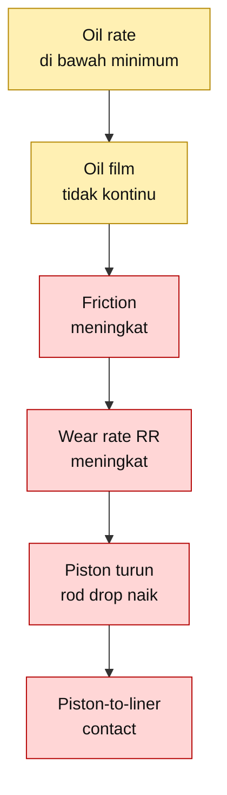

Over-lubrication juga dapat mempercepat keausan rider ring. Mekanismenya bukan karena oli berlebih langsung mengikis rider ring, tetapi karena oli berlebih dapat tertahan di cylinder, terdegradasi oleh temperatur, lalu membentuk carbon, gum, lacquer, sludge, dan abrasive paste.

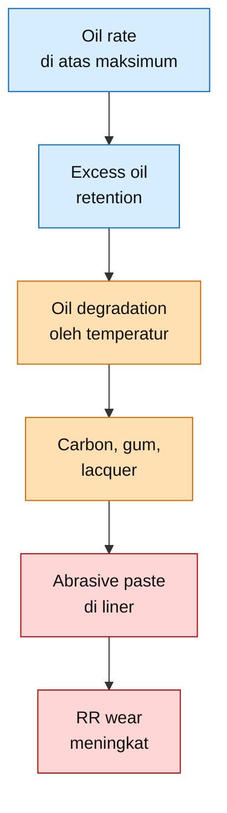

Dengan demikian, batas minimum ditentukan oleh kecukupan oil film dan wear rate, sedangkan batas maksimum ditentukan oleh risiko deposit, oil carryover, valve fouling, dan abrasive wear.

$$
\boxed{
\text{Minimum lubrication ditentukan oleh kecukupan oil film}
}
$$

$$
\boxed{
\text{Maximum lubrication ditentukan oleh batas deposit dan carryover}
}
$$

Kesimpulan umum artikel ini adalah:

$$
\boxed{
\text{Oil rate terbaik adalah oil rate terendah yang masih menghasilkan oil film stabil, wear rate terkendali, valve bersih, dan tidak menyebabkan carryover}
}
$$

<ResourceBox
  title="Artikel terkait:"
  items={[
    {
      name: 'Repair Piston Compressor',
      href: '/blog/maintenance/maintenance-repair-piston',
      description:
        'Repair Prosedur Piston Compressor C-150 Berbahan Aluminium 7050',
    },
  ]}
/>

[**Kembali ke Atas**](#batas-minimum-dan-maksimum-lubrikasi-rider-ring-pada-reciprocating-compressor-konversi-tetesmenit-mljam-wear-control-dan-tindakan-koreksi-lapangan)

---

# 2. Fungsi Rider Ring dan Makna Rider Band Bearing Load

## 2.1 Fungsi Rider Ring

Pada horizontal reciprocating compressor, piston bergerak bolak-balik di dalam cylinder. Karena orientasi cylinder horizontal, berat piston assembly menghasilkan beban vertikal ke bawah. Beban ini harus ditopang oleh komponen yang dirancang sebagai wear part, yaitu **rider ring** atau **rider band**.

Rider ring dipasang pada piston untuk mencegah body piston menyentuh langsung cylinder liner. Dengan demikian, komponen yang dikorbankan untuk mengalami keausan adalah rider ring, bukan piston atau cylinder liner.

Fungsi rider ring dapat diringkas sebagai berikut.

| Fungsi Rider Ring                  | Tujuan Teknis                                              |
| ---------------------------------- | ---------------------------------------------------------- |
| Menopang berat piston assembly     | Mencegah piston turun dan menyentuh liner                  |
| Menjadi sliding support            | Mengatur contact antara piston assembly dan cylinder liner |
| Menjaga radial clearance           | Mempertahankan posisi piston tetap terkendali              |
| Menjadi sacrificial wear component | Rider ring aus lebih dahulu dibanding piston atau liner    |
| Mengurangi risiko scoring          | Mencegah metal-to-metal contact                            |
| Membantu stabilitas piston         | Mengurangi uneven contact dan abnormal side loading        |

Secara sederhana:

$$
\boxed{
\text{Rider ring adalah sliding support dan wear component antara piston dan cylinder liner}
}
$$

Diagram fungsi rider ring dapat digambarkan sebagai berikut.

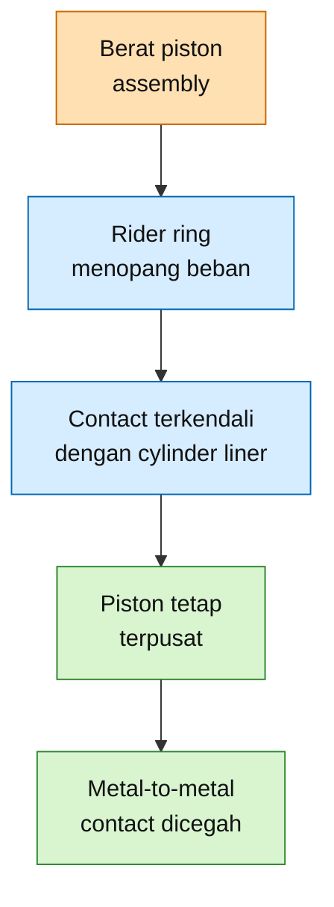

## 2.2 Apa yang Dimaksud Rider Band Bearing

Istilah **rider band bearing** sering menimbulkan salah pengertian. Istilah ini bukan berarti terdapat bearing terpisah seperti ball bearing, roller bearing, atau sleeve bearing.

Yang dimaksud adalah rider ring bekerja sebagai **bearing surface**, yaitu permukaan yang menerima dan menyalurkan beban piston ke cylinder liner.

Dengan kata lain:

$$
\boxed{
\text{Rider band bearing}
=

\text{rider ring yang bekerja sebagai sliding bearing surface}
}
$$

Sedangkan **rider band bearing load** adalah tekanan kontak rata-rata antara rider ring dan cylinder liner.

$$
\boxed{
\text{Rider band bearing load}
=

\text{contact pressure antara rider ring dan cylinder liner}
}
$$

## 2.3 Rumus Rider Band Bearing Load

Rider band bearing load dihitung dari berat piston assembly dan sebagian berat piston rod yang ditopang oleh rider ring, dibagi dengan luas kontak efektif rider ring terhadap cylinder liner.

Rumus praktisnya adalah:

$$
L_B
=

\frac{
W_P + 0.5W_R
}{
0.866 \times D \times W
}
$$

Dengan:

| Simbol | Arti                             |  Satuan Praktis |
| ------ | -------------------------------- | --------------: |
| $L_B$  | rider band bearing load          | $\text{N/mm}^2$ |
| $W_P$  | berat piston assembly            |      $\text{N}$ |
| $W_R$  | berat piston rod                 |      $\text{N}$ |
| $D$    | cylinder bore diameter           |     $\text{mm}$ |
| $W$    | total effective rider ring width |     $\text{mm}$ |

Apabila data berat masih diberikan dalam satuan massa, yaitu kilogram, maka harus dikonversi menjadi gaya.

$$
W
=

m \times g
$$

Dengan:

$$
g
=

9.81\ \text{m/s}^2
$$

Sehingga:

$$
W\ [\text{N}]
=

m\ [\text{kg}]
\times
9.81
$$

## 2.4 Batas Praktis Rider Band Bearing Load

Untuk horizontal reciprocating compressor, batas praktis yang umum digunakan adalah:

| Kondisi Cylinder                   |   Batas Rider Band Bearing Load |
| ---------------------------------- | ------------------------------: |
| Lubricated horizontal cylinder     |  $L_B \leq 0.07\ \text{N/mm}^2$ |
| Non-lubricated horizontal cylinder | $L_B \leq 0.035\ \text{N/mm}^2$ |

Dalam satuan imperial, nilai tersebut mendekati:

$$
0.07\ \text{N/mm}^2
\approx
10\ \text{psi}
$$

dan:

$$
0.035\ \text{N/mm}^2
\approx
5\ \text{psi}
$$

Batas ini penting karena oil rate tidak boleh digunakan untuk menutupi masalah desain atau loading.

$$
\boxed{
L_B > 0.07\ \text{N/mm}^2
\Rightarrow
\text{jangan hanya menaikkan oil rate}
}
$$

Apabila $L_B$ melebihi batas, penyebab utama harus dicari pada:

| Area Pemeriksaan    | Kemungkinan Masalah                   |
| ------------------- | ------------------------------------- |
| Piston assembly     | Berat piston terlalu besar            |
| Rider ring          | Lebar efektif rider ring tidak cukup  |
| Piston rod          | Kontribusi beban rod tinggi           |
| Cylinder liner      | Bore aus, oval, atau out-of-round     |
| Alignment           | Rod runout atau piston misalignment   |
| Operating condition | Beban aktual berbeda dari design case |

Hubungan antara bearing load dan keausan rider ring dapat diringkas sebagai berikut.

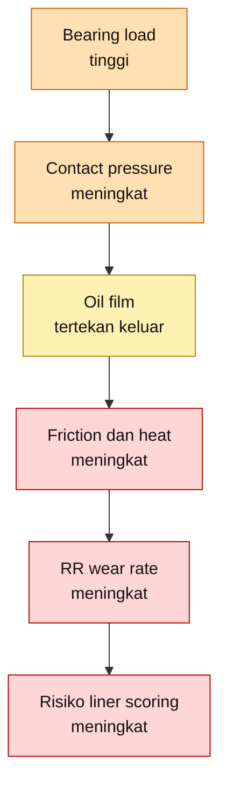

Prinsip praktisnya:

$$
\boxed{
\text{Oil rate optimization hanya layak dilakukan setelah bearing load berada dalam batas desain}
}
$$

[**Kembali ke Atas**](#batas-minimum-dan-maksimum-lubrikasi-rider-ring-pada-reciprocating-compressor-konversi-tetesmenit-mljam-wear-control-dan-tindakan-koreksi-lapangan)

---

# 3. Konversi Tetes/menit ke mL/jam

## 3.1 Mengapa Konversi Diperlukan

Di lapangan, OEM sering memberikan oil rate dalam satuan **tetes/menit** karena pengaturan lubricator dapat dibaca melalui sight glass. Contoh instruksi yang umum dijumpai adalah:

$$
10\text{–}25\ \text{tetes/menit}
$$

Namun, satuan tetes/menit belum cukup untuk analisis teknis karena volume setiap tetes tidak selalu sama. Volume tetes dipengaruhi oleh:

| Faktor                   | Dampak terhadap Volume Tetes                                  |
| ------------------------ | ------------------------------------------------------------- |
| Viskositas oli           | Oli lebih kental dapat menghasilkan tetes lebih besar         |
| Temperatur oli           | Temperatur tinggi menurunkan viskositas                       |
| Diameter drip tube       | Diameter lebih besar cenderung menghasilkan tetes lebih besar |
| Specific gravity oli     | Mempengaruhi pembentukan tetes                                |
| Desain sight glass       | Setiap lubricator dapat berbeda                               |
| Kondisi pompa lubricator | Pulsation dapat mempengaruhi pembacaan visual                 |

Karena itu, istilah **tetes/menit** harus dikonversi menjadi **mL/jam** menggunakan **drop factor**.

## 3.2 Formula Dasar Konversi

Definisikan:

| Simbol | Arti                   |               Satuan |
| ------ | ---------------------- | -------------------: |
| $Q$    | oil rate               |      $\text{mL/jam}$ |
| $N_d$  | jumlah tetes per menit | $\text{tetes/menit}$ |
| $DF$   | drop factor            |    $\text{tetes/mL}$ |

Formula konversi dari tetes/menit ke mL/jam adalah:

$$
Q
=

\frac{
N_d \times 60
}{
DF
}
$$

Formula konversi balik dari mL/jam ke tetes/menit adalah:

$$
N_d
=

\frac{
Q \times DF
}{
60
}
$$

## 3.3 Asumsi Umum Drop Factor

Bila drop factor aktual belum dikalibrasi, asumsi awal yang sering digunakan adalah:

$$
DF
=

20\ \text{tetes/mL}
$$

Dengan asumsi tersebut:

$$
Q
=

\frac{
N_d \times 60
}{
20
}
$$

Sehingga:

$$
Q
=

3N_d
$$

Artinya:

$$
\boxed{
1\ \text{tetes/menit}
=

3\ \text{mL/jam}
}
$$

Konversi praktisnya adalah sebagai berikut.

| Tetes/menit | mL/jam per Lube Point |
| ----------: | --------------------: |
|         $5$ |                  $15$ |
|        $10$ |                  $30$ |
|        $15$ |                  $45$ |
|        $20$ |                  $60$ |
|        $25$ |                  $75$ |
|        $30$ |                  $90$ |
|        $40$ |                 $120$ |

Dengan demikian, range OEM:

$$
10\text{–}25\ \text{tetes/menit}
$$

menjadi:

$$
10 \times 3
=

30\ \text{mL/jam}
$$

dan:

$$
25 \times 3
=

75\ \text{mL/jam}
$$

Sehingga:

$$
\boxed{
10\text{–}25\ \text{tetes/menit}
=

30\text{–}75\ \text{mL/jam per lube point}
}
$$

## 3.4 Total Oil Rate untuk Beberapa Lube Point

Bila satu cylinder memiliki lebih dari satu lube point, maka total oil rate dihitung sebagai:

$$
Q_{total}
=

Q_{point}
\times
n
$$

Dengan:

| Simbol      | Arti                            |
| ----------- | ------------------------------- |
| $Q_{total}$ | total oil rate per cylinder     |
| $Q_{point}$ | oil rate per lube point         |
| $n$         | jumlah lube point pada cylinder |

Contoh untuk dua lube point:

$$
n = 2
$$

Maka:

$$
Q_{total}
=

Q_{point}
\times
2
$$

Tabel konversinya adalah sebagai berikut.

|        Setting per Point |    mL/jam per Point |  Total untuk 2 Point |
| -----------------------: | ------------------: | -------------------: |
| $10\ \text{tetes/menit}$ | $30\ \text{mL/jam}$ |  $60\ \text{mL/jam}$ |
| $15\ \text{tetes/menit}$ | $45\ \text{mL/jam}$ |  $90\ \text{mL/jam}$ |
| $20\ \text{tetes/menit}$ | $60\ \text{mL/jam}$ | $120\ \text{mL/jam}$ |
| $25\ \text{tetes/menit}$ | $75\ \text{mL/jam}$ | $150\ \text{mL/jam}$ |

## 3.5 Sensitivitas Drop Factor

Asumsi $20\ \text{tetes/mL}$ hanya estimasi awal. Untuk oil rate yang lebih akurat, drop factor harus dikalibrasi di lapangan.

Perbandingan hasil konversi untuk range $10\text{–}25\ \text{tetes/menit}$ adalah sebagai berikut.

|           Drop Factor | $10\ \text{tetes/menit}$ | $25\ \text{tetes/menit}$ |
| --------------------: | -----------------------: | -----------------------: |
| $15\ \text{tetes/mL}$ |      $40\ \text{mL/jam}$ |     $100\ \text{mL/jam}$ |
| $20\ \text{tetes/mL}$ |      $30\ \text{mL/jam}$ |      $75\ \text{mL/jam}$ |
| $25\ \text{tetes/mL}$ |      $24\ \text{mL/jam}$ |      $60\ \text{mL/jam}$ |
| $30\ \text{tetes/mL}$ |      $20\ \text{mL/jam}$ |      $50\ \text{mL/jam}$ |

Selisih ini signifikan. Oleh karena itu, untuk compressor kritikal, pengaturan oil rate tidak boleh hanya berdasarkan visual tetes/menit. Drop factor aktual harus diukur.

## 3.6 Prosedur Kalibrasi Drop Factor

Prosedur praktis untuk kalibrasi adalah:

1. Jalankan lubricator pada setting operasi normal.
2. Tampung oli dari outlet lubricator selama waktu tertentu.
3. Hitung jumlah tetes selama periode tersebut.
4. Ukur volume oli yang terkumpul dalam mL.
5. Hitung drop factor aktual.

Rumusnya:

$$
DF
=

\frac{
N_{total}
}{
V
}
$$

Dengan:

| Simbol      | Arti                       |            Satuan |
| ----------- | -------------------------- | ----------------: |
| $DF$        | drop factor aktual         | $\text{tetes/mL}$ |
| $N_{total}$ | jumlah tetes yang dihitung |    $\text{tetes}$ |
| $V$         | volume oli terkumpul       |       $\text{mL}$ |

Contoh:

$$
N_{total}
=

200\ \text{tetes}
$$

$$
V
=

10\ \text{mL}
$$

Maka:

$$
DF
=

\frac{
200
}{
10
}
=

20\ \text{tetes/mL}
$$

Dengan drop factor aktual tersebut, oil rate dapat dihitung kembali menggunakan:

$$
Q
=

\frac{
N_d \times 60
}{
DF
}
$$

## 3.7 Kesimpulan Bab Konversi

Untuk kebutuhan praktis lapangan, gunakan panduan berikut.

$$
\boxed{
Q\ [\text{mL/jam}]
=

\frac{
N_d\ [\text{tetes/menit}]
\times
60
}{
DF\ [\text{tetes/mL}]
}
}
$$

Bila belum ada kalibrasi:

$$
\boxed{
DF
=

20\ \text{tetes/mL}
}
$$

Sehingga:

$$
\boxed{
Q
=

3N_d
}
$$

Untuk contoh OEM:

$$
\boxed{
10\text{–}25\ \text{tetes/menit}
=

30\text{–}75\ \text{mL/jam per lube point}
}
$$

Dan untuk dua lube point:

$$
\boxed{
Q_{total}
=

60\text{–}150\ \text{mL/jam per cylinder}
}
$$

[**Kembali ke Atas**](#batas-minimum-dan-maksimum-lubrikasi-rider-ring-pada-reciprocating-compressor-konversi-tetesmenit-mljam-wear-control-dan-tindakan-koreksi-lapangan)

---

# 4. Penentuan Minimum dan Maksimum Lubrikasi

## 4.1 Prinsip Penentuan Batas

Jika OEM memberikan range oil rate dalam bentuk:

$$
10\text{–}25\ \text{tetes/menit per lube point}
$$

maka range tersebut harus diperlakukan sebagai **continuous operating envelope**, kecuali manual OEM menyatakan lain.

Artinya:

$$
\boxed{
10\ \text{tetes/menit}
=

\text{minimum continuous}
}
$$

dan:

$$
\boxed{
25\ \text{tetes/menit}
=

\text{maximum continuous}
}
$$

Dengan asumsi drop factor:

$$
DF
=

20\ \text{tetes/mL}
$$

maka konversi oil rate adalah:

$$
Q
=

\frac{
N_d \times 60
}{
DF
}
$$

Sehingga:

$$
Q_{min}
=

\frac{
10 \times 60
}{
20
}
=

30\ \text{mL/h per point}
$$

dan:

$$
Q_{max}
=

\frac{
25 \times 60
}{
20
}
=

75\ \text{mL/h per point}
$$

Dengan demikian, untuk contoh OEM **10–25 tetes/menit**, batas continuous operation adalah:

| Kondisi            | Tetes/menit per Point | mL/jam per Point |
| ------------------ | --------------------: | ---------------: |
| Minimum continuous |                **10** |           **30** |
| Normal rendah      |                **15** |           **45** |
| Normal tengah      |                **20** |           **60** |
| Maximum continuous |                **25** |           **75** |

Prinsip praktisnya:

$$
\boxed{
Q < Q_{min}
\Rightarrow
\text{under-lubricated}
}
$$

$$
\boxed{
Q > Q_{max}
\Rightarrow
\text{over-lubricated}
}
$$

---

## 4.2 Operating Envelope per Lube Point

Untuk satu lube point, range operasi dapat ditulis sebagai:

$$
10
\leq
N_d
\leq
25
$$

dengan satuan:

$$
N_d
=

\text{tetes/menit per point}
$$

Dalam satuan mL/jam:

$$
30
\leq
Q
\leq
75
$$

dengan satuan:

$$
Q
=

\text{mL/h per point}
$$

Ringkasnya:

$$
\boxed{
10\text{–}25\ \text{tetes/menit per point}
=

30\text{–}75\ \text{mL/h per point}
}
$$

Apabila satu cylinder memiliki dua lube point, maka:

$$
Q_{total}
=

Q_{point}
\times
2
$$

Tabel total oil rate untuk dua lube point adalah sebagai berikut.

|        Setting per Point |  mL/jam per Point | Total untuk 2 Point |
| -----------------------: | ----------------: | ------------------: |
| $10\ \text{tetes/menit}$ | $30\ \text{mL/h}$ |   $60\ \text{mL/h}$ |
| $15\ \text{tetes/menit}$ | $45\ \text{mL/h}$ |   $90\ \text{mL/h}$ |
| $20\ \text{tetes/menit}$ | $60\ \text{mL/h}$ |  $120\ \text{mL/h}$ |
| $25\ \text{tetes/menit}$ | $75\ \text{mL/h}$ |  $150\ \text{mL/h}$ |

Diagram operating envelope berikut dapat digunakan sebagai panduan cepat di lapangan.

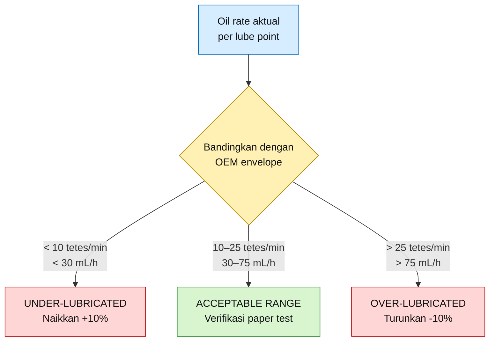

---

## 4.3 Pemilihan Normal Setting

Dalam range OEM **10–25 tetes/menit**, setting awal yang praktis biasanya dipilih di tengah range, misalnya:

$$
N_{normal}
=

20\ \text{tetes/menit per point}
$$

Dengan asumsi:

$$
DF
=

20\ \text{tetes/mL}
$$

maka:

$$
Q_{normal}
=

\frac{
20 \times 60
}{
20
}
=

60\ \text{mL/h per point}
$$

Untuk dua lube point:

$$
Q_{normal,total}
=

60 \times 2
=
120\ \text{mL/h per cylinder}
$$

Setting ini kemudian divalidasi dengan:

| Parameter             | Target                                                         |
| --------------------- | -------------------------------------------------------------- |
| Paper test            | Paper pertama stained, paper kedua tidak basah tembus          |
| RR wear rate          | Tidak melebihi allowable wear rate                             |
| Discharge temperature | Stabil, tidak naik lebih dari $10^\circ\text{C}$ dari baseline |
| Valve condition       | Tidak basah oli berlebih, tidak ada deposit berat              |
| Cylinder liner        | Tidak ada scoring, black paste, atau deposit keras             |

---

## 4.4 Break-in Lubrication

Setelah penggantian rider ring, piston ring, atau pekerjaan cylinder liner seperti honing, oil rate break-in sering perlu dinaikkan sementara. Tujuannya adalah memastikan oil film terbentuk selama periode awal running, ketika surface conformity antara ring dan liner belum stabil.

Jika normal setting adalah:

$$
N_{normal}
=

20\ \text{tetes/menit per point}
$$

maka:

$$
Q_{normal}
=

60\ \text{mL/h per point}
$$

Untuk break-in, bila diizinkan OEM:

$$
Q_{break-in}
=

1.5\text{–}2.0
\times
Q_{normal}
$$

Dalam satuan tetes/menit:

$$
N_{break-in}
=

1.5\text{–}2.0
\times
20
$$

$$
N_{break-in}
=

30\text{–}40\ \text{tetes/menit per point}
$$

Dalam satuan mL/jam:

$$
Q_{break-in}
=

1.5\text{–}2.0
\times
60
$$

$$
Q_{break-in}
=

90\text{–}120\ \text{mL/h per point}
$$

Tabel ringkasnya adalah sebagai berikut.

| Kondisi                          | Tetes/menit per Point | mL/jam per Point |
| -------------------------------- | --------------------: | ---------------: |
| Minimum continuous               |                **10** |           **30** |
| Normal setting                   |                **20** |           **60** |
| Maximum continuous               |                **25** |           **75** |
| Break-in $1.5 \times Q_{normal}$ |                **30** |           **90** |
| Break-in $2.0 \times Q_{normal}$ |                **40** |          **120** |

Untuk dua lube point:

| Kondisi                          | mL/jam per Point | Total mL/jam per Cylinder |
| -------------------------------- | ---------------: | ------------------------: |
| Minimum continuous               |           **30** |                    **60** |
| Normal setting                   |           **60** |                   **120** |
| Maximum continuous               |           **75** |                   **150** |
| Break-in $1.5 \times Q_{normal}$ |           **90** |                   **180** |
| Break-in $2.0 \times Q_{normal}$ |          **120** |                   **240** |

Catatan penting:

$$
\boxed{
\text{Jika }25\ \text{tetes/menit adalah absolute maximum dari OEM,}
}
$$

$$
\boxed{
\text{maka break-in }30\text{–}40\ \text{tetes/menit tidak boleh dilakukan tanpa approval OEM.}
}
$$

---

## 4.5 Adjustment Step

Penyesuaian oil rate tidak boleh dilakukan terlalu besar dalam satu kali perubahan. Adjustment yang direkomendasikan adalah:

$$
\boxed{
\Delta Q
=

\pm 10\%
\ \text{per step}
}
$$

Jika oil rate terlalu rendah:

$$
Q_{new}
=

1.10
\times
Q_{current}
$$

Jika oil rate terlalu tinggi:

$$
Q_{new}
=

0.90
\times
Q_{current}
$$

Contoh penurunan dari 25 tetes/menit:

$$
N_{new}
=

0.90
\times
25
=

22.5\ \text{tetes/menit}
$$

Untuk pembacaan lapangan, nilai ini dapat dibulatkan menjadi:

$$
N_{new}
\approx
23\ \text{tetes/menit}
$$

Dengan asumsi $DF = 20$:

$$
Q_{new}
=

23 \times 3
=
69\ \text{mL/h per point}
$$

Contoh kenaikan dari 10 tetes/menit:

$$
N_{new}
=

1.10
\times
10
=

11\ \text{tetes/menit}
$$

$$
Q_{new}
=

11 \times 3
=
33\ \text{mL/h per point}
$$

---

## 4.6 Decision Rule Minimum dan Maksimum

Setting oil rate dinyatakan **diterima** hanya jika memenuhi tiga kelompok persyaratan berikut.

| Kelompok     | Acceptance Criteria                                    |
| ------------ | ------------------------------------------------------ |
| Oil rate     | Berada dalam OEM envelope                              |
| Oil film     | Paper test acceptable                                  |
| Wear control | RR wear rate tidak melebihi allowable wear rate        |
| Temperature  | Discharge temperature tidak masuk zona action          |
| Cleanliness  | Valve dan cylinder tidak menunjukkan deposit progresif |

Secara kuantitatif:

$$
10
\leq
N_d
\leq
25
$$

atau:

$$
30
\leq
Q
\leq
75
$$

Tetapi secara praktis, angka ini belum cukup. Oil rate harus dikaitkan dengan hasil inspeksi.

$$
\boxed{
\text{Oil rate acceptable}
=

\text{oil rate dalam envelope}
+
\text{paper test acceptable}
+
\text{wear rate terkendali}
}
$$

[**Kembali ke Atas**](#batas-minimum-dan-maksimum-lubrikasi-rider-ring-pada-reciprocating-compressor-konversi-tetesmenit-mljam-wear-control-dan-tindakan-koreksi-lapangan)

---

# 5. Verifikasi Oil Film di Lapangan

## 5.1 Tujuan Verifikasi

Oil rate yang benar di sight glass belum tentu menghasilkan oil film yang benar di cylinder liner. Ada beberapa kemungkinan deviasi:

| Kondisi di Sight Glass | Kondisi Aktual di Cylinder                             |
| ---------------------- | ------------------------------------------------------ |
| Tetes terlihat normal  | Check valve tersumbat sebagian                         |
| Tetes terlihat cukup   | Distribusi oil ke liner tidak merata                   |
| Tetes terlihat tinggi  | Oil tertahan di valve pocket atau groove               |
| Tetes terlihat rendah  | Liner masih cukup basah karena carryover               |
| Tetes stabil           | Oil film tetap bisa breakdown akibat temperatur tinggi |

Karena itu, oil film harus diverifikasi langsung melalui inspeksi lapangan. Metode paling sederhana adalah **paper test**.

$$
\boxed{
\text{Paper test digunakan untuk membedakan liner kering, cukup terlumasi, atau over-lubricated.}
}
$$

---

## 5.2 Prosedur Paper Test

Paper test dilakukan saat unit sudah aman untuk dibuka, sudah depressurized, sudah isolated, dan memenuhi persyaratan permit serta LOTO.

Prosedur praktis:

1. Stop compressor sesuai prosedur operasi.
2. Pastikan cylinder sudah aman dibuka.
3. Lakukan paper test secepat mungkin setelah shutdown.
4. Gunakan dua lembar **unwaxed cigarette paper** atau kertas tipis sejenis.
5. Usapkan paper pada permukaan cylinder liner.
6. Ambil sampel dari beberapa posisi bore.
7. Bandingkan hasil paper pertama dan paper kedua.

Rekomendasi posisi sampling:

| Posisi                    | Tujuan                                      |
| ------------------------- | ------------------------------------------- |
| Top bore                  | Melihat distribusi oil di bagian atas liner |
| Bottom bore               | Area utama contact rider ring               |
| Left side                 | Melihat distribusi lateral                  |
| Right side                | Melihat distribusi lateral                  |
| Area dekat lube point     | Memeriksa local over-lube                   |
| Area jauh dari lube point | Memeriksa oil distribution                  |

Untuk praktisi, minimal ambil tiga posisi:

$$
\boxed{
\text{top bore}
+
\text{left side}
+
\text{right side}
}
$$

Bila akses memungkinkan, tambahkan:

$$
\boxed{
\text{bottom bore}
+
\text{area dekat lube point}
+
\text{area jauh dari lube point}
}
$$

---

## 5.3 Acceptance Criteria Paper Test

Acceptance criteria paper test adalah sebagai berikut.

| Hasil Paper Test                                      | Interpretasi        | Tindakan                            |
| ----------------------------------------------------- | ------------------- | ----------------------------------- |
| Paper pertama kering                                  | Under-lubricated    | Naikkan oil rate **+10%**           |
| Paper pertama stained, paper kedua tidak basah tembus | Acceptable          | Pertahankan setting                 |
| Paper pertama dan kedua basah tembus                  | Over-lubricated     | Turunkan oil rate **−10%**          |
| Paper hitam berminyak/berpasir                        | Oil + carbon/debris | Bersihkan cylinder, review oil rate |
| Ada partikel RR                                       | Wear aktif          | Ukur RR dan liner                   |

Dalam bentuk rule:

$$
\boxed{
\text{Paper 1 dry}
\Rightarrow
Q_{new}
=

1.10Q_{current}
}
$$

$$
\boxed{
\text{Paper 1 stained dan Paper 2 tidak soaked}
\Rightarrow
Q_{new}
=

Q_{current}
}
$$

$$
\boxed{
\text{Paper 1 soaked dan Paper 2 soaked}
\Rightarrow
Q_{new}
=

0.90Q_{current}
}
$$

Diagram keputusan paper test dapat digunakan sebagai berikut.

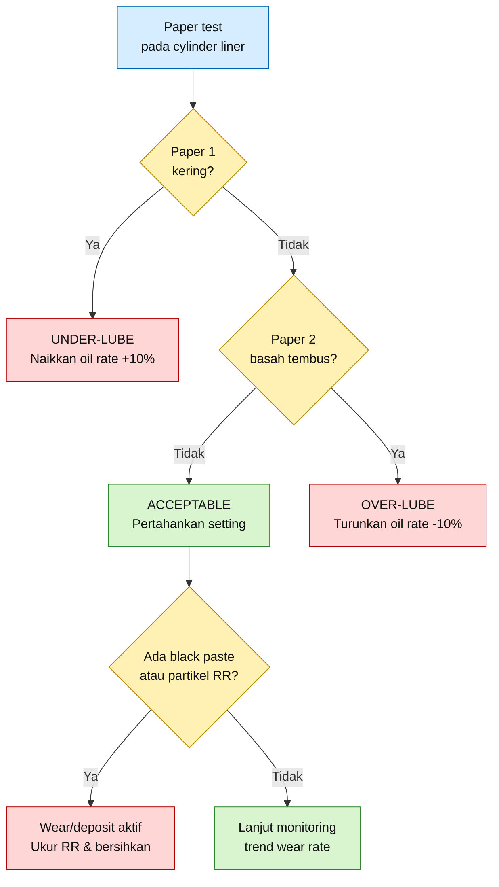

---

## 5.4 Interpretasi Visual

Paper test tidak hanya membaca basah atau kering. Warna dan tekstur residu juga penting.

| Temuan pada Paper   | Interpretasi Teknis                        |
| ------------------- | ------------------------------------------ |
| Kering bersih       | Oil film tidak cukup                       |
| Stain tipis merata  | Oil film cukup                             |
| Basah tembus jernih | Oil rate terlalu tinggi atau drain buruk   |
| Hitam berminyak     | Oil terdegradasi atau bercampur carbon     |
| Hitam berpasir      | Abrasive paste, carbon, atau wear debris   |
| Serbuk putih/coklat | Kemungkinan partikel RR atau ring material |
| Partikel metalik    | Potensi liner scoring atau metal contact   |

Kalimat lapangan yang penting:

$$
\boxed{
\text{Cylinder yang terlalu basah belum tentu aman.}
}
$$

Cylinder yang basah hitam menunjukkan kemungkinan:

$$
\boxed{
\text{over-lube}
+
\text{deposit}
+
\text{abrasive paste}
}
$$

---

## 5.5 Keterbatasan Paper Test

Paper test adalah metode cepat, tetapi bukan satu-satunya dasar keputusan. Hasil paper test harus dikorelasikan dengan:

| Parameter                | Mengapa Penting                              |
| ------------------------ | -------------------------------------------- |
| Oil rate aktual          | Memastikan setting lubricator benar          |
| Drop factor aktual       | Memastikan konversi tetes/min ke mL/h akurat |
| RR thickness             | Mengetahui wear aktual                       |
| Rod drop                 | Mengetahui perubahan posisi piston           |
| Valve condition          | Mendeteksi over-lube dan deposit             |
| Discharge temperature    | Menilai risiko oil degradation               |
| Cylinder liner condition | Mendeteksi scoring dan deposit               |
| Drain oil volume         | Menilai carryover atau oil accumulation      |

Paper test dinyatakan valid sebagai dasar adjustment bila didukung oleh data berikut:

$$
\boxed{
\text{Paper test}
+
\text{oil rate aktual}
+
\text{wear trend}
+
\text{temperature trend}
}
$$

[**Kembali ke Atas**](#batas-minimum-dan-maksimum-lubrikasi-rider-ring-pada-reciprocating-compressor-konversi-tetesmenit-mljam-wear-control-dan-tindakan-koreksi-lapangan)

---

# 6. Efek Jika Oil Rate di Bawah Minimum

## 6.1 Definisi Under-Lubrication

Untuk contoh OEM dengan range:

$$
10\text{–}25\ \text{tetes/menit per point}
$$

maka under-lubrication didefinisikan sebagai:

$$
N_d
<
10\ \text{tetes/menit per point}
$$

Dengan asumsi:

$$
DF
=

20\ \text{tetes/mL}
$$

maka:

$$
Q
<
\frac{
10 \times 60
}{
20
}
$$

Sehingga:

$$
Q
<
30\ \text{mL/h per point}
$$

Jadi batas bawahnya adalah:

$$
\boxed{
N_d < 10\ \text{tetes/menit per point}
}
$$

atau:

$$
\boxed{
Q < 30\ \text{mL/h per point}
}
$$

---

## 6.2 Mekanisme Kerusakan Akibat Under-Lubrication

Saat oil rate berada di bawah minimum, oil film pada interface rider ring dan cylinder liner menjadi tidak kontinu. Sliding contact berubah menjadi kondisi boundary lubrication yang buruk. Friction naik, temperatur lokal naik, dan wear rate rider ring meningkat.

Mekanisme dasarnya adalah:

$$
Q < Q_{min}
\rightarrow
\text{oil film breakdown}
\rightarrow
\text{friction naik}
\rightarrow
\text{RR wear naik}
\rightarrow
\text{piston turun}
\rightarrow
\text{piston-to-liner contact}
$$

Diagram mekanisme under-lubrication adalah sebagai berikut.

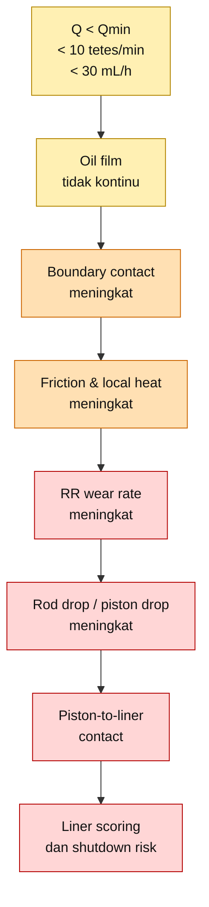

---

## 6.3 Dampak Utama terhadap Rider Ring

Under-lubrication paling cepat terlihat pada rider ring karena rider ring adalah komponen yang menanggung sliding contact terhadap cylinder liner.

Dampak yang umum muncul:

| Dampak                 | Penjelasan Teknis                                       |
| ---------------------- | ------------------------------------------------------- |
| Wear rate RR meningkat | Contact terjadi dengan oil film tidak cukup             |
| Surface glazing        | Permukaan RR menjadi mengkilap akibat panas dan rubbing |
| Local burning          | Terjadi discoloration atau bekas panas lokal            |
| Uneven wear            | Beban tidak tersebar merata pada lebar rider ring       |
| Crack atau chipping    | Material RR mengalami thermal-mechanical stress         |
| Loss of support        | Piston turun karena rider ring menipis                  |

Secara kuantitatif, kondisi harus dianggap alarm bila:

$$
WR_{actual}

>

1.25
\times
WR_{allowable}
$$

dan harus dianggap action bila:

$$
WR_{actual}

>

1.5
\times
WR_{allowable}
$$

---

## 6.4 Dampak terhadap Cylinder Liner

Jika rider ring aus terlalu cepat, piston dapat kehilangan support. Clearance antara piston dan cylinder liner berkurang. Bila kondisi ini berlanjut, akan terjadi contact antara piston atau rider ring yang rusak dengan cylinder liner.

Dampaknya:

| Kerusakan pada Cylinder Liner | Konsekuensi                               |
| ----------------------------- | ----------------------------------------- |
| Polishing abnormal            | Indikasi rubbing berulang                 |
| Axial scoring                 | Goresan searah gerakan piston             |
| Local hot spot                | Temperatur lokal naik                     |
| Out-of-round wear             | Bore menjadi tidak seragam                |
| Re-honing required            | Permukaan liner perlu diperbaiki          |
| Liner replacement             | Jika scoring atau wear melewati limit OEM |

Hubungan antara wear rider ring dan risiko liner damage adalah:

$$
\text{RR thickness turun}
\rightarrow
\text{piston support turun}
\rightarrow
\text{clearance turun}
\rightarrow
\text{liner contact risk naik}
$$

---

## 6.5 Dampak terhadap Piston Ring dan Performance

Walaupun rider ring adalah fokus utama, under-lubrication juga mempengaruhi piston ring. Piston ring membutuhkan kondisi permukaan liner yang stabil untuk menjaga sealing.

Jika liner mulai scoring atau temperatur lokal meningkat, maka piston ring dapat mengalami:

| Dampak pada Piston Ring      | Efek Operasi                    |
| ---------------------------- | ------------------------------- |
| Ring wear meningkat          | Sealing memburuk                |
| Blow-by meningkat            | Capacity turun                  |
| Ring overheating             | Risiko ring sticking atau crack |
| Ring breakage                | Potensi valve/cylinder damage   |
| Compression efficiency turun | Power per kapasitas meningkat   |

Efek performance dapat diringkas sebagai:

$$
\text{Piston ring leakage naik}
\rightarrow
\text{volumetric efficiency turun}
\rightarrow
\text{discharge temperature naik}
$$

---

## 6.6 Indikasi Lapangan Under-Lubrication

Indikasi utama under-lubrication adalah sebagai berikut.

| Indikasi                             |                                Batas Tindakan |
| ------------------------------------ | --------------------------------------------: |
| Paper pertama kering                 |                     Naikkan oil rate **+10%** |
| Oil rate aktual di bawah OEM minimum |                     Kembalikan ke minimum OEM |
| RR wear rate naik                    |     Action jika $>1.25 \times WR_{allowable}$ |
| Discharge temperature naik           | Review jika $+10^\circ\text{C}$ dari baseline |
| Rod drop meningkat cepat             |                    Hitung remaining clearance |
| Liner scoring                        |                   Stop/review sesuai severity |
| RR glazing atau burnt mark           |   Cek oil rate, bearing load, dan temperature |
| Packing leakage ikut naik            |    Periksa piston/rod alignment dan stability |

Dalam bentuk decision rule:

$$
\boxed{
\text{Paper 1 dry}
\Rightarrow
Q_{new}
=

1.10Q_{current}
}
$$

Jika oil rate aktual sudah berada di bawah minimum OEM:

$$
\boxed{
Q_{current}
<
Q_{OEM,min}
\Rightarrow
Q_{new}
\geq
Q_{OEM,min}
}
$$

Untuk contoh OEM:

$$
Q_{OEM,min}
=

30\ \text{mL/h per point}
$$

atau:

$$
N_{OEM,min}
=

10\ \text{tetes/menit per point}
$$

---

## 6.7 Tindakan Koreksi untuk Under-Lubrication

Tindakan koreksi harus dilakukan bertahap dan terukur.

| Langkah | Tindakan                   | Target                                       |
| ------- | -------------------------- | -------------------------------------------- |
| 1       | Verifikasi oil rate aktual | Pastikan $N_d \geq 10\ \text{tetes/min}$     |
| 2       | Cek lubricator output      | Tidak ada blockage atau check valve stuck    |
| 3       | Naikkan oil rate           | $Q_{new}=1.10Q_{current}$                    |
| 4       | Lakukan paper test ulang   | Paper pertama harus stained                  |
| 5       | Ukur RR thickness          | Hitung wear rate                             |
| 6       | Periksa liner              | Tidak ada scoring progresif                  |
| 7       | Monitor temperature        | Tidak naik $>10^\circ\text{C}$ dari baseline |

Contoh:

Oil rate aktual:

$$
N_{current}
=

9\ \text{tetes/menit}
$$

Karena:

$$
9
<
10
$$

maka setting berada di bawah minimum OEM. Oil rate harus dikembalikan minimal menjadi:

$$
N_{new}
=

10\ \text{tetes/menit}
$$

atau jika mengikuti adjustment $+10\%$:

$$
N_{new}
=

1.10
\times
9
=

9.9
\approx
10\ \text{tetes/menit}
$$

Dalam mL/jam:

$$
Q_{new}
=

10 \times 3
=
30\ \text{mL/h per point}
$$

---

## 6.8 Kesimpulan Bab Under-Lubrication

Untuk contoh OEM **10–25 tetes/menit**, batas bawah continuous operation adalah:

$$
\boxed{
10\ \text{tetes/menit per point}
}
$$

atau:

$$
\boxed{
30\ \text{mL/h per point}
}
$$

Jika oil rate turun di bawah batas ini, risiko utama adalah:

$$
\boxed{
\text{oil film breakdown}
\rightarrow
\text{accelerated RR wear}
\rightarrow
\text{piston-to-liner contact}
}
$$

Tindakan koreksi utama adalah:

$$
\boxed{
Q_{new}
=

1.10
\times
Q_{current}
}
$$

atau mengembalikan setting minimal ke:

$$
\boxed{
Q_{OEM,min}
=

30\ \text{mL/h per point}
}
$$

[**Kembali ke Atas**](#batas-minimum-dan-maksimum-lubrikasi-rider-ring-pada-reciprocating-compressor-konversi-tetesmenit-mljam-wear-control-dan-tindakan-koreksi-lapangan)

---

# 7. Efek Jika Oil Rate di Atas Maksimum

## 7.1 Definisi Over-Lubrication

Untuk contoh OEM dengan range continuous operation:

$$
10\text{–}25\ \text{tetes/menit per point}
$$

maka kondisi **over-lubrication** didefinisikan sebagai:

$$
N_d > 25\ \text{tetes/menit per point}
$$

Dengan asumsi:

$$
DF = 20\ \text{tetes/mL}
$$

maka:

$$
Q > \frac{25 \times 60}{20}
$$

Sehingga:

$$
Q > 75\ \text{mL/h per point}
$$

Jadi batas atas continuous operation adalah:

$$
\boxed{
N_d > 25\ \text{tetes/menit per point}
}
$$

atau:

$$
\boxed{
Q > 75\ \text{mL/h per point}
}
$$

Untuk cylinder dengan dua lube point:

$$
Q_{total} > 75 \times 2
$$

$$
Q_{total} > 150\ \text{mL/h per cylinder}
$$

---

## 7.2 Prinsip Utama Over-Lubrication

Kesalahan umum di lapangan adalah menganggap oli lebih banyak selalu lebih aman. Pada reciprocating compressor, asumsi ini tidak tepat.

Setelah oil film minimum terbentuk, penambahan oli tidak selalu menurunkan wear. Sebaliknya, oli berlebih dapat tertahan di cylinder, valve pocket, ring groove, dan liner surface. Pada temperatur tinggi, oli tersebut dapat terdegradasi menjadi carbon, gum, lacquer, sludge, dan abrasive paste.

Mekanisme utamanya adalah:

$$
\text{excess oil}
\rightarrow
\text{oil retention}
\rightarrow
\text{carbon/gum/lacquer}
\rightarrow
\text{abrasive third-body}
\rightarrow
\text{accelerated RR wear}
$$

Diagram mekanisme over-lubrication adalah sebagai berikut.

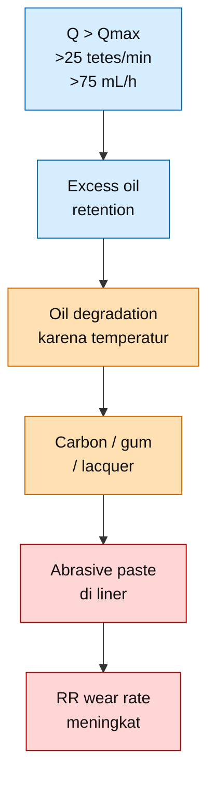

---

## 7.3 Mengapa Oli Berlebih Bisa Mempercepat Wear Rider Ring

Rider ring bekerja pada kondisi sliding contact terhadap cylinder liner. Pada kondisi ideal, terdapat oil film tipis yang cukup untuk menurunkan friction. Namun bila oli terlalu banyak, sebagian oli tidak langsung terbawa keluar bersama gas, melainkan tertahan pada area berikut:

| Lokasi Retensi Oli | Risiko                    |
| ------------------ | ------------------------- |
| Cylinder liner     | Deposit dan abrasive film |
| Rider ring groove  | RR sticking               |
| Piston ring groove | Piston ring sticking      |
| Valve pocket       | Valve fouling             |
| Discharge passage  | Oil carbonization         |
| Low point cylinder | Liquid accumulation       |
| Drain line         | Oil carryover indication  |

Efek terhadap rider ring dapat terjadi melalui enam mekanisme utama.

| Mekanisme               | Dampak terhadap RR                            |
| ----------------------- | --------------------------------------------- |
| Carbon deposit          | Menjadi abrasive particle                     |
| Oil + debris            | Membentuk abrasive paste                      |
| Lacquer/gum             | Membuat RR atau piston ring sticking          |
| RR sticking             | Contact area mengecil, contact pressure naik  |
| Valve fouling           | Valve leakage, recompression, temperatur naik |
| Deposit pada liner      | Heat transfer turun, RR temperature naik      |
| Liquid oil accumulation | Piston instability dan uneven wear            |

---

## 7.4 Carbon Deposit sebagai Abrasive Third-Body

Deposit carbon yang terbentuk dari oli terdegradasi dapat masuk ke interface antara rider ring dan cylinder liner. Pada kondisi ini, contact tidak lagi hanya:

$$
\text{RR} \leftrightarrow \text{oil film} \leftrightarrow \text{cylinder liner}
$$

melainkan berubah menjadi:

$$
\text{RR}
\leftrightarrow
\text{oil + carbon + debris}
\leftrightarrow
\text{cylinder liner}
$$

Campuran ini bekerja seperti abrasive compound.

$$
\boxed{
\text{Oil} + \text{carbon} + \text{wear debris}
=

\text{abrasive paste}
}
$$

Akibatnya, rider ring dapat aus lebih cepat walaupun permukaan cylinder terlihat basah oleh oli.

---

## 7.5 RR Sticking dan Kenaikan Contact Pressure

Rider ring harus dapat duduk dan bergerak secara normal di dalam groove. Bila groove terisi lacquer, gum, carbon, atau sludge, rider ring dapat mengalami sticking.

Jika rider ring sticking, maka contact area efektif terhadap liner berkurang. Contact pressure meningkat karena beban yang sama ditopang oleh area yang lebih kecil.

Hubungan dasarnya adalah:

$$
P
=

\frac{F}{A}
$$

Dengan:

| Simbol | Arti                         |
| ------ | ---------------------------- |
| $P$    | contact pressure             |
| $F$    | beban normal pada rider ring |
| $A$    | effective contact area       |

Jika contact area turun dari $A_1$ menjadi $A_2$, dengan:

$$
A_2 < A_1
$$

maka:

$$
P_2 = \frac{F}{A_2} > \frac{F}{A_1} = P_1
$$

Sehingga:

$$
\boxed{
A \downarrow
\Rightarrow
P \uparrow
\Rightarrow
WR_{\mathrm{RR}} \uparrow
}
$$

Diagramnya dapat diringkas sebagai berikut.

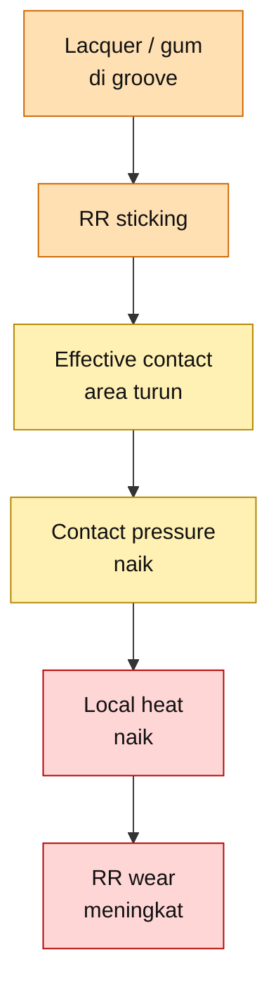

---

## 7.6 Valve Fouling sebagai Penyebab Tidak Langsung RR Wear

Oli berlebih dapat terbawa ke suction valve dan discharge valve. Pada valve, oli dapat membentuk film lengket, carbon deposit, atau lacquer. Akibatnya valve tidak membuka dan menutup dengan benar.

Valve fouling dapat menyebabkan:

| Kerusakan Valve      | Efek pada Compressor     |
| -------------------- | ------------------------ |
| Valve plate lengket  | Opening/closing delay    |
| Valve leakage        | Recompression            |
| Valve deposit        | Flow restriction         |
| Spring contamination | Valve dynamics terganggu |
| Impact abnormal      | Valve life turun         |

Jika valve leakage terjadi, gas dapat mengalami recompression. Recompression menaikkan discharge temperature.

Hubungan tidak langsung terhadap RR adalah:

$$
\text{over-lube}
\rightarrow
\text{valve fouling}
\rightarrow
\text{valve leakage}
\rightarrow
\text{recompression}
\rightarrow
T_{\mathrm{discharge}} \uparrow
\rightarrow
\text{oil degradation}
\rightarrow
\text{RR wear} \uparrow
$$

Diagram ringkasnya:

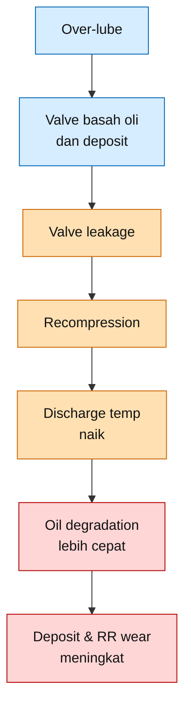

---

## 7.7 Indikasi Lapangan Over-Lubrication

Indikasi over-lubrication tidak selalu berupa oil rate yang terlihat tinggi. Pada beberapa kasus, oil rate tampak normal, tetapi distribusi oli buruk atau drain tidak efektif.

Indikasi utama over-lubrication adalah:

| Indikasi                               | Tindakan                                      |
| -------------------------------------- | --------------------------------------------- |
| Paper pertama dan kedua soaked through | Turunkan oil rate **$-10\%$**                 |
| Valve basah oli                        | Turunkan oil rate **$-10\%$**, inspeksi valve |
| Carbon deposit                         | Bersihkan, cek temperatur discharge           |
| Ring groove kotor                      | Clean groove, ukur clearance                  |
| RR aus walau cylinder basah            | Treat as deposit-driven wear                  |
| Drain oil $>2\times$ baseline          | Review over-lubrication/carryover             |
| Discharge temperature naik             | Cek valve leakage dan cooling                 |
| Oil carryover downstream               | Cek oil rate, separator, coalescer, drain     |

Rule untuk adjustment:

$$
\boxed{
\text{Paper 1 soaked dan Paper 2 soaked}
\Rightarrow
Q_{new}
=

0.90Q_{current}
}
$$

Jika oil rate aktual melebihi maximum OEM:

$$
\boxed{
Q_{current}

>

Q_{OEM,max}
\Rightarrow
Q_{new}
\leq
Q_{OEM,max}
}
$$

Untuk contoh OEM:

$$
Q_{OEM,max}
=

75\ \text{mL/h per point}
$$

atau:

$$
N_{OEM,max}
=

25\ \text{tetes/menit per point}
$$

---

## 7.8 Contoh Koreksi Over-Lubrication

Misal oil rate aktual:

$$
N_{current}
=

30\ \text{tetes/menit per point}
$$

Karena batas maksimum OEM adalah:

$$
N_{OEM,max}
=

25\ \text{tetes/menit per point}
$$

maka:

$$
30 > 25
$$

Artinya unit beroperasi dalam kondisi over-lubricated.

Oil rate harus diturunkan minimal ke batas maksimum OEM:

$$
N_{new}
=

25\ \text{tetes/menit per point}
$$

Dalam satuan mL/jam:

$$
Q_{new}
=

25 \times 3
=
75\ \text{mL/h per point}
$$

Jika penurunan dilakukan bertahap $10\%$ dari kondisi aktual:

$$
N_{step1}
=

0.90
\times
30
=

27\ \text{tetes/menit}
$$

Namun karena:

$$
27 > 25
$$

maka setting masih di atas maksimum OEM. Oleh sebab itu, untuk kasus ini setting harus langsung dikembalikan ke:

$$
\boxed{
N_{new}
=

25\ \text{tetes/menit per point}
}
$$

---

## 7.9 Kesimpulan Bab Over-Lubrication

Untuk contoh OEM **10–25 tetes/menit**, batas atas continuous operation adalah:

$$
\boxed{
25\ \text{tetes/menit per point}
}
$$

atau:

$$
\boxed{
75\ \text{mL/h per point}
}
$$

Jika oil rate melebihi batas ini, risiko utama adalah:

$$
\boxed{
\text{deposit}
\rightarrow
\text{abrasive paste}
\rightarrow
\text{ring sticking}
\rightarrow
\text{accelerated RR wear}
}
$$

Tindakan koreksi utama adalah:

$$
\boxed{
Q_{new}
=

0.90
\times
Q_{current}
}
$$

atau mengembalikan setting ke:

$$
\boxed{
Q_{OEM,max}
=

75\ \text{mL/h per point}
}
$$

[**Kembali ke Atas**](#batas-minimum-dan-maksimum-lubrikasi-rider-ring-pada-reciprocating-compressor-konversi-tetesmenit-mljam-wear-control-dan-tindakan-koreksi-lapangan)

---

# 8. Batas Temperatur dan Risiko Deposit

## 8.1 Mengapa Temperatur Penting

Oil rate tidak boleh dianalisis terpisah dari temperatur. Pada temperatur rendah sampai sedang, oli cenderung masih mampu membentuk oil film dan tidak cepat terdegradasi. Pada temperatur tinggi, oli lebih mudah mengalami oxidation, thermal degradation, dan carbonization.

Area yang penting diperhatikan adalah:

| Area                   | Risiko                     |
| ---------------------- | -------------------------- |
| Discharge end cylinder | Temperatur gas tertinggi   |
| Valve pocket           | Deposit dan valve sticking |
| Piston ring groove     | Ring sticking              |
| Rider ring groove      | RR sticking                |
| Cylinder liner surface | Oil film degradation       |
| Discharge passage      | Carbon deposit             |

Temperatur yang dimaksud pada bab ini adalah temperatur area cylinder/discharge gas, bukan temperatur oil sump pada frame lubrication system.

---

## 8.2 Temperature Envelope untuk Praktisi

Gunakan batas sederhana berikut untuk maintenance decision.

|                             Temperatur Cylinder/Discharge | Status                           |
| --------------------------------------------------------: | -------------------------------- |
|                             **$T < 120^\circ\mathrm{C}$** | Target normal                    |
| **$120^\circ\mathrm{C} \leq T \leq 135^\circ\mathrm{C}$** | Review oil rate, valve, cooling  |
|                             **$T > 135^\circ\mathrm{C}$** | Action required                  |
|                             **$T > 150^\circ\mathrm{C}$** | High risk carbon/varnish/deposit |
|                             **$T > 160^\circ\mathrm{C}$** | Severe; perlu review OEM         |

Dalam bentuk rule:

$$
\boxed{
T < 120^\circ\mathrm{C}
\Rightarrow
\text{target normal}
}
$$

$$
\boxed{
120^\circ\mathrm{C}
\leq
T
\leq
135^\circ\mathrm{C}
\Rightarrow
\text{review condition}
}
$$

$$
\boxed{
T > 135^\circ\mathrm{C}
\Rightarrow
\text{action required}
}
$$

$$
\boxed{
T > 150^\circ\mathrm{C}
\Rightarrow
\text{high risk deposit}
}
$$

---

## 8.3 Kombinasi Paling Berbahaya

Over-lubrication menjadi jauh lebih berbahaya bila terjadi bersamaan dengan temperatur tinggi.

Kombinasi berbahaya adalah:

$$
\boxed{
Q > Q_{max}
\quad
\text{dan}
\quad
T > 135^\circ\mathrm{C}
}
$$

Artinya:

$$
\boxed{
\text{Over-lube}
+
\text{high temperature}
=

\text{risiko tinggi deposit, valve fouling, ring sticking, dan RR wear}
}
$$

Diagram risiko kombinasi oil rate dan temperatur:

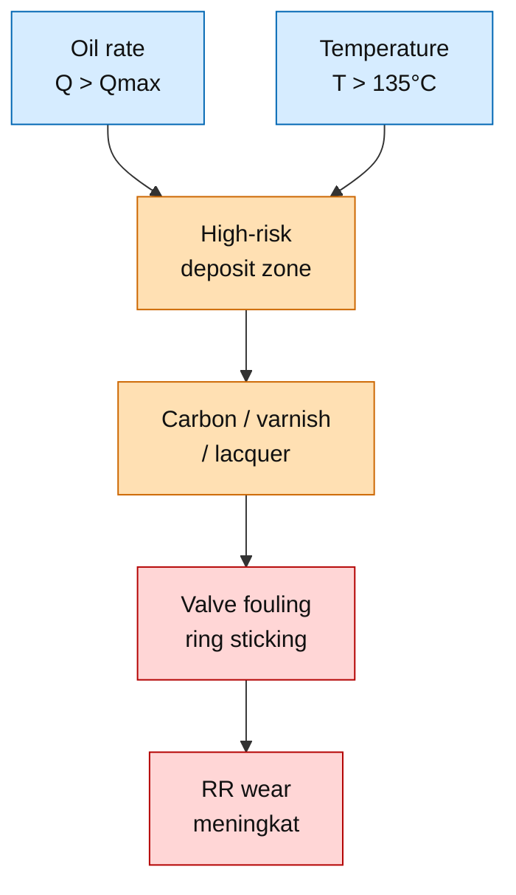

---

## 8.4 Temperature-Based Action

Gunakan tabel berikut untuk menentukan tindakan.

|                       Temperatur | Kondisi Oil Rate   | Tindakan                                            |
| -------------------------------: | ------------------ | --------------------------------------------------- |
|        $T < 120^\circ\mathrm{C}$ | Dalam envelope OEM | Lanjut monitoring                                   |
| $120\text{–}135^\circ\mathrm{C}$ | Dalam envelope OEM | Review valve, cooling, paper test                   |
| $120\text{–}135^\circ\mathrm{C}$ | $Q > Q_{max}$      | Turunkan oil rate $-10\%$, cek deposit              |
|        $T > 135^\circ\mathrm{C}$ | Dalam envelope OEM | Action: cek valve leakage dan cooling               |
|        $T > 135^\circ\mathrm{C}$ | $Q > Q_{max}$      | High priority: turunkan oil rate dan inspeksi valve |
|        $T > 150^\circ\mathrm{C}$ | Any oil rate       | Treat as high-risk deposit condition                |
|        $T > 160^\circ\mathrm{C}$ | Any oil rate       | Review OEM, trip philosophy, dan material limit     |

---

## 8.5 Temperatur Naik Tidak Selalu Berarti Oil Rate Kurang

Kenaikan discharge temperature sering ditafsirkan sebagai indikasi kurang oli. Interpretasi ini harus hati-hati.

Discharge temperature dapat naik karena:

| Penyebab                     | Dampak                              |
| ---------------------------- | ----------------------------------- |
| Discharge valve leakage      | Recompression                       |
| Suction valve leakage        | Capacity turun dan temperature naik |
| Cooling water flow rendah    | Heat removal turun                  |
| Cooling water fouling        | Heat transfer turun                 |
| Compression ratio tinggi     | Temperature naturally meningkat     |
| Gas molecular weight berubah | Polytropic behavior berubah         |
| Over-lubrication             | Deposit dan valve fouling           |
| Under-lubrication            | Friction lokal meningkat            |

Karena itu:

$$
\boxed{
T_{\mathrm{discharge}} \uparrow
\not\Rightarrow
\text{langsung tambah oli}
}
$$

Yang benar:

$$
\boxed{
T_{\mathrm{discharge}} \uparrow
\Rightarrow
\text{cek valve, cooling, oil rate, deposit, dan gas condition}
}
$$

---

## 8.6 Kesimpulan Bab Temperatur

Batas praktis yang digunakan dalam artikel ini adalah:

$$
\boxed{
T < 120^\circ\mathrm{C}
=

\text{target normal}
}
$$

$$
\boxed{
120\text{–}135^\circ\mathrm{C}
=

\text{review zone}
}
$$

$$
\boxed{
T > 135^\circ\mathrm{C}
=

\text{action required}
}
$$

$$
\boxed{
T > 150^\circ\mathrm{C}
=

\text{high-risk deposit zone}
}
$$

Kombinasi paling berbahaya adalah:

$$
\boxed{
Q > Q_{max}
\quad
\text{dan}
\quad
T > 135^\circ\mathrm{C}
}
$$

Pada kondisi tersebut, tindakan yang tepat bukan menambah oli, tetapi melakukan:

1. Review oil rate.
2. Paper test.
3. Valve inspection.
4. Cylinder liner inspection.
5. Cooling system check.
6. Review lubricant suitability.

[**Kembali ke Atas**](#batas-minimum-dan-maksimum-lubrikasi-rider-ring-pada-reciprocating-compressor-konversi-tetesmenit-mljam-wear-control-dan-tindakan-koreksi-lapangan)

---

# 9. Wear Rate Rider Ring dan Decision Rule

## 9.1 Mengapa Wear Rate Harus Dihitung

Oil rate tidak boleh dinilai hanya dari jumlah tetes/menit. Oil rate harus dinilai dari hasil akhirnya, yaitu apakah rider ring wear masih terkendali.

Parameter yang paling berguna untuk praktisi adalah:

$$
\boxed{
WR_{\mathrm{actual}}
=

\text{wear rate aktual rider ring dalam mm/1000 jam}
}
$$

Dengan wear rate, engineer dapat membandingkan:

| Data                        | Fungsi                                               |
| --------------------------- | ---------------------------------------------------- |
| Wear aktual                 | Mengetahui kerusakan yang sudah terjadi              |
| Operating hours             | Menormalkan wear terhadap waktu                      |
| Minimum allowable thickness | Menentukan remaining life                            |
| Target overhaul interval    | Menentukan apakah unit aman sampai outage berikutnya |
| Oil rate setting            | Menghubungkan lubrication dengan wear                |

---

## 9.2 Formula Actual Wear Rate

Formula actual wear rate adalah:

$$
WR_{\mathrm{actual}}
=

\frac{
t_0 - t_1
}{
H
}
\times
1000
$$

Dengan:

| Simbol                 | Arti                               |                       Satuan |
| ---------------------- | ---------------------------------- | ---------------------------: |
| $WR_{\mathrm{actual}}$ | wear rate aktual                   | $\text{mm}/1000\ \text{jam}$ |
| $t_0$                  | thickness awal rider ring          |                  $\text{mm}$ |
| $t_1$                  | thickness rider ring saat inspeksi |                  $\text{mm}$ |
| $H$                    | operating hours sejak baseline     |                 $\text{jam}$ |

Contoh:

$$
t_0 = 12.0\ \text{mm}
$$

$$
t_1 = 11.4\ \text{mm}
$$

$$
H = 3000\ \text{jam}
$$

Maka:

$$
WR_{\mathrm{actual}}
=

\frac{
12.0 - 11.4
}{
3000
}
\times
1000
$$

$$
WR_{\mathrm{actual}}
=

\frac{
0.6
}{
3000
}
\times
1000
$$

$$
WR_{\mathrm{actual}}
=

0.20\ \text{mm}/1000\ \text{jam}
$$

---

## 9.3 Formula Allowable Wear Rate

Allowable wear rate dihitung dari thickness awal, minimum allowable thickness, dan target running hours.

$$
WR_{\mathrm{allowable}}
=

\frac{
t_0 - t_{\min}
}{
H_{\mathrm{target}}
}
\times
1000
$$

Dengan:

| Simbol                    | Arti                                 |                       Satuan |
| ------------------------- | ------------------------------------ | ---------------------------: |
| $WR_{\mathrm{allowable}}$ | allowable wear rate                  | $\text{mm}/1000\ \text{jam}$ |
| $t_0$                     | thickness awal rider ring            |                  $\text{mm}$ |
| $t_{\min}$                | minimum allowable thickness          |                  $\text{mm}$ |
| $H_{\mathrm{target}}$     | target running hours sampai overhaul |                 $\text{jam}$ |

Contoh:

$$
t_0 = 12.0\ \text{mm}
$$

$$
t_{\min} = 9.0\ \text{mm}
$$

$$
H_{\mathrm{target}} = 24000\ \text{jam}
$$

Maka:

$$
WR_{\mathrm{allowable}}
=

\frac{
12.0 - 9.0
}{
24000
}
\times
1000
$$

$$
WR_{\mathrm{allowable}}
=

\frac{
3.0
}{
24000
}
\times
1000
$$

$$
WR_{\mathrm{allowable}}
=

0.125\ \text{mm}/1000\ \text{jam}
$$

---

## 9.4 Decision Rule Wear Rate

Setelah $WR_{\mathrm{actual}}$ dan $WR_{\mathrm{allowable}}$ dihitung, gunakan decision rule berikut.

| Kondisi                                                      | Keputusan                             |
| ------------------------------------------------------------ | ------------------------------------- |
| $WR_{\mathrm{actual}} \leq WR_{\mathrm{allowable}}$          | Oil rate acceptable                   |
| $WR_{\mathrm{actual}} > 1.25 \times WR_{\mathrm{allowable}}$ | Alarm, review oil rate dan temperatur |
| $WR_{\mathrm{actual}} > 1.5 \times WR_{\mathrm{allowable}}$  | Action, lakukan koreksi               |
| Projected life $<$ next inspection interval                  | Jadwalkan shutdown inspection         |

Dalam bentuk matematis:

$$
\boxed{
WR_{\mathrm{actual}}
\leq
WR_{\mathrm{allowable}}
\Rightarrow
\text{acceptable}
}
$$

$$
\boxed{
WR_{\mathrm{actual}}

>

1.25
\times
WR_{\mathrm{allowable}}
\Rightarrow
\text{alarm}
}
$$

$$
\boxed{
WR_{\mathrm{actual}}

>

1.5
\times
WR_{\mathrm{allowable}}
\Rightarrow
\text{action}
}
$$

Diagram keputusan wear rate:

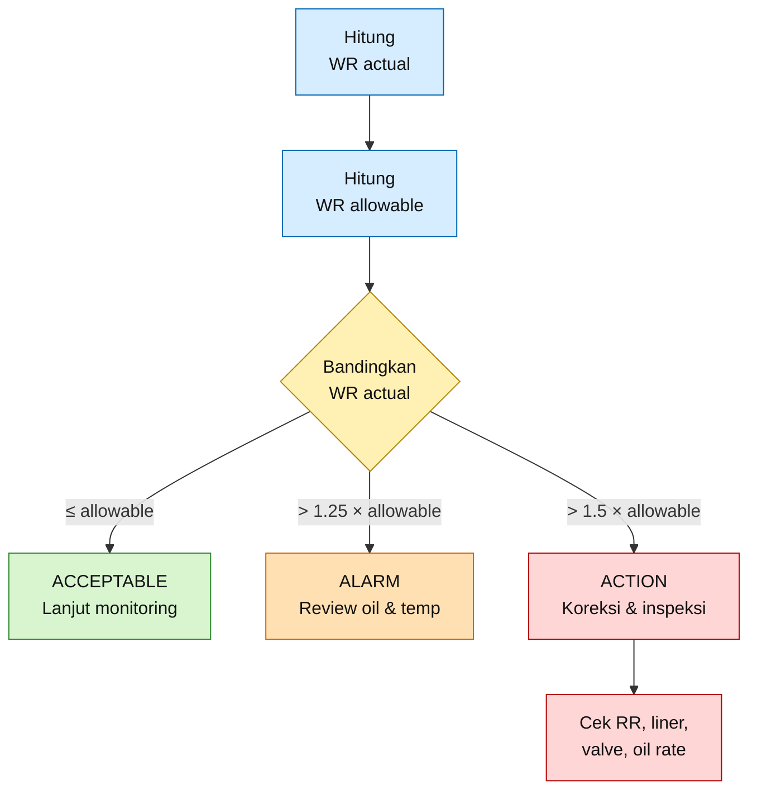

---

## 9.5 Contoh Evaluasi Wear Rate terhadap Oil Rate

Dari contoh sebelumnya:

$$
WR_{\mathrm{actual}}
=

0.20\ \text{mm}/1000\ \text{jam}
$$

dan:

$$
WR_{\mathrm{allowable}}
=

0.125\ \text{mm}/1000\ \text{jam}
$$

Hitung rasio wear:

$$
R_{WR}
=

\frac{
WR_{\mathrm{actual}}
}{
WR_{\mathrm{allowable}}
}
$$

$$
R_{WR}
=

\frac{
0.20
}{
0.125
}
=

1.6
$$

Karena:

$$
R_{WR}
=

1.6

>

1.5
$$

maka statusnya adalah:

$$
\boxed{
\text{ACTION}
}
$$

Artinya, oil rate, temperature, bearing load, valve condition, cylinder liner condition, dan gas cleanliness harus diperiksa. Jangan langsung menyimpulkan bahwa oli kurang. Wear tinggi dapat disebabkan oleh under-lube atau over-lube.

---

## 9.6 Projected Remaining Life

Untuk menentukan apakah rider ring masih aman sampai shutdown berikutnya, hitung remaining thickness:

$$
t_{\mathrm{remaining}}
=

t_1 - t_{\min}
$$

Projected remaining life:

$$
H_{\mathrm{remaining}}
=

\frac{
t_{\mathrm{remaining}}
}{
WR_{\mathrm{actual}}
}
\times
1000
$$

Dengan:

| Simbol                   | Arti                       |                       Satuan |
| ------------------------ | -------------------------- | ---------------------------: |
| $t_{\mathrm{remaining}}$ | remaining usable thickness |                  $\text{mm}$ |
| $H_{\mathrm{remaining}}$ | projected remaining life   |                 $\text{jam}$ |
| $WR_{\mathrm{actual}}$   | actual wear rate           | $\text{mm}/1000\ \text{jam}$ |

Contoh:

$$
t_1 = 11.4\ \text{mm}
$$

$$
t_{\min} = 9.0\ \text{mm}
$$

$$
WR_{\mathrm{actual}} = 0.20\ \text{mm}/1000\ \text{jam}
$$

Maka:

$$
t_{\mathrm{remaining}}
=

11.4 - 9.0
=
2.4\ \text{mm}
$$

$$
H_{\mathrm{remaining}}
=

\frac{
2.4
}{
0.20
}
\times
1000
$$

$$
H_{\mathrm{remaining}}
=

12000\ \text{jam}
$$

Jika next inspection interval adalah:

$$
H_{\mathrm{next}}
=

16000\ \text{jam}
$$

maka:

$$
H_{\mathrm{remaining}}
<
H_{\mathrm{next}}
$$

Sehingga unit tidak aman untuk menunggu inspeksi berikutnya tanpa tindakan.

$$
\boxed{
H_{\mathrm{remaining}}
<
H_{\mathrm{next}}
\Rightarrow
\text{jadwalkan shutdown inspection lebih awal}
}
$$

---

## 9.7 Menghubungkan Wear Rate dengan Minimum dan Maksimum Lubrikasi

Wear rate harus digunakan sebagai validasi akhir oil rate.

| Kondisi Oil Rate  |        Wear Rate | Interpretasi                                              |
| ----------------- | ---------------: | --------------------------------------------------------- |
| Di bawah minimum  |           Tinggi | Under-lubrication probable                                |
| Di dalam envelope |    Rendah/stabil | Setting acceptable                                        |
| Di dalam envelope |           Tinggi | Cek temperature, bearing load, alignment, gas cleanliness |
| Di atas maksimum  |           Tinggi | Deposit-driven wear probable                              |
| Di atas maksimum  | Rendah sementara | Tetap review carryover dan deposit risk                   |

Decision logic:

$$
\boxed{
Q < Q_{min}
\quad \text{dan} \quad
WR_{\mathrm{actual}} \uparrow
\Rightarrow
\text{under-lube suspected}
}
$$

$$
\boxed{
Q > Q_{max}
\quad \text{dan} \quad
WR_{\mathrm{actual}} \uparrow
\Rightarrow
\text{over-lube/deposit suspected}
}
$$

$$
\boxed{
Q_{min}
\leq
Q
\leq
Q_{max}
\quad \text{dan} \quad
WR_{\mathrm{actual}} \uparrow
\Rightarrow
\text{check non-lube root causes}
}
$$

Non-lube root causes yang harus diperiksa:

| Area         | Parameter                                        |
| ------------ | ------------------------------------------------ |
| Bearing load | $L_B > 0.07\ \text{N/mm}^2$                      |
| Alignment    | Rod runout, piston centering                     |
| Liner        | Ovality, scoring, surface roughness              |
| Gas          | Dirty gas, liquid carryover, corrosive component |
| Temperature  | $T > 135^\circ\mathrm{C}$                        |
| Valve        | Leakage, fouling, broken component               |
| Material     | RR material tidak sesuai service                 |

---

## 9.8 Kesimpulan Bab Wear Rate

Formula utama wear rate adalah:

$$
\boxed{
WR_{\mathrm{actual}}
=

\frac{
t_0 - t_1
}{
H
}
\times
1000
}
$$

Allowable wear rate adalah:

$$
\boxed{
WR_{\mathrm{allowable}}
=

\frac{
t_0 - t_{\min}
}{
H_{\mathrm{target}}
}
\times
1000
}
$$

Decision rule utama:

$$
\boxed{
WR_{\mathrm{actual}}
\leq
WR_{\mathrm{allowable}}
=

\text{acceptable}
}
$$

$$
\boxed{
WR_{\mathrm{actual}}

>

1.25
\times
WR_{\mathrm{allowable}}
=

\text{alarm}
}
$$

$$
\boxed{
WR_{\mathrm{actual}}

>

1.5
\times
WR_{\mathrm{allowable}}
=

\text{action}
}
$$

Kesimpulan penting:

$$
\boxed{
\text{Oil rate yang benar adalah oil rate yang menghasilkan wear rate terkendali, bukan hanya oil rate yang berada dalam range tetes/menit OEM.}
}
$$

[**Kembali ke Atas**](#batas-minimum-dan-maksimum-lubrikasi-rider-ring-pada-reciprocating-compressor-konversi-tetesmenit-mljam-wear-control-dan-tindakan-koreksi-lapangan)

---

# 10. Troubleshooting dan Tindakan Koreksi

## 10.1 Prinsip Troubleshooting

Troubleshooting oil rate pada rider ring tidak boleh hanya berdasarkan jumlah tetes pada sight glass. Setiap keputusan harus menggabungkan empat data utama:

$$
\boxed{
\text{oil rate}
+
\text{paper test}
+
\text{wear rate}
+
\text{temperature}
}
$$

Jika hanya oil rate yang dilihat, maka keputusan bisa salah. Cylinder yang terlihat kering memang dapat menunjukkan under-lubrication, tetapi cylinder yang sangat basah juga tidak selalu aman. Cylinder basah hitam sering menunjukkan **over-lubrication**, deposit, carbon slurry, atau abrasive paste.

Prinsip keputusan yang digunakan adalah:

$$
\boxed{
Q < Q_{min}
\Rightarrow
\text{naikkan oil rate}
}
$$

$$
\boxed{
Q > Q_{max}
\Rightarrow
\text{turunkan oil rate}
}
$$

$$
\boxed{
Q_{min}
\leq
Q
\leq
Q_{max}
\quad
\text{tetapi}
\quad
WR_{\mathrm{actual}}
\uparrow
\Rightarrow
\text{cari root cause lain}
}
$$

Dengan contoh OEM:

$$
Q_{min} = 30\ \text{mL/h per point} = 10\ \text{tetes/menit per point}
$$

$$
Q_{max} = 75\ \text{mL/h per point} = 25\ \text{tetes/menit per point}
$$

---

## 10.2 Diagram Keputusan Cepat

Diagram berikut dapat digunakan sebagai alur keputusan lapangan. Diagram dibuat vertikal agar tetap nyaman dibaca pada layar HP.

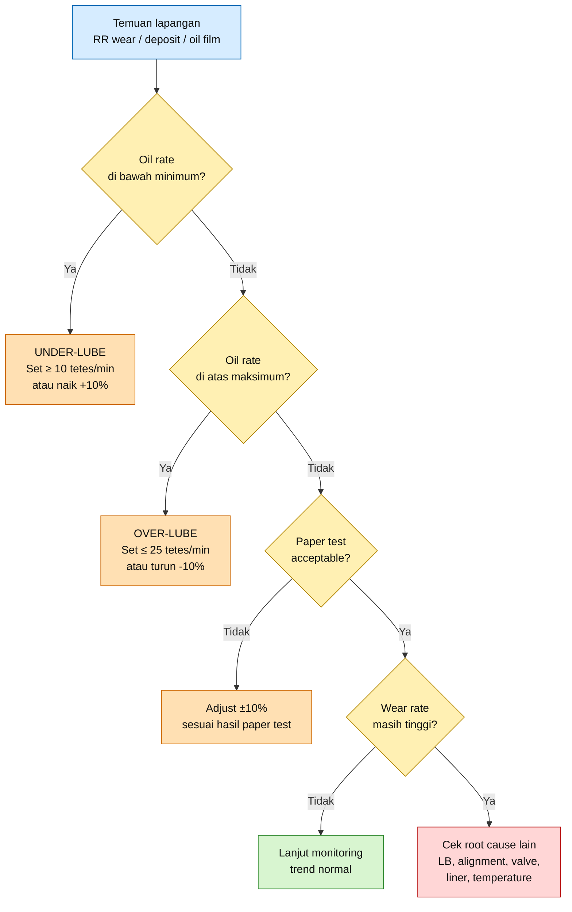

---

## 10.3 Tabel Troubleshooting Utama

Tabel berikut adalah ringkasan keputusan lapangan untuk kasus paling umum.

| Temuan Lapangan                             | Kemungkinan Penyebab        | Verifikasi                    | Tindakan Kuantitatif                               |
| ------------------------------------------- | --------------------------- | ----------------------------- | -------------------------------------------------- |
| RR cepat aus, liner kering                  | Under-lube                  | Paper test                    | Naikkan oil rate **$+10\%$**                       |
| Oil rate $<10\ \text{tetes/min}$            | Di bawah OEM minimum        | Cek lubricator                | Kembalikan ke **$\geq 10\ \text{tetes/min}$**      |
| RR cepat aus, liner basah hitam             | Over-lube + debris          | Paper test, visual inspection | Turunkan oil rate **$-10\%$**                      |
| Oil rate $>25\ \text{tetes/min}$ continuous | Over-lube                   | Check setting                 | Turunkan ke **$\leq 25\ \text{tetes/min}$**        |
| Valve basah oli                             | Oil carryover               | Valve inspection              | Turunkan oil rate **$-10\%$**                      |
| Carbon deposit                              | Oil degradation             | Cek discharge temperature     | Action jika **$T > 135^\circ\mathrm{C}$**          |
| Ring sticking                               | Lacquer/gum                 | Groove inspection             | Clean groove, review oil                           |
| Wear tidak merata                           | Alignment atau bearing load | Rod runout, $L_B$             | Koreksi alignment/desain                           |
| RR aus walau oil tinggi                     | Deposit-driven wear         | Liner/valve inspection        | Jangan tambah oli; bersihkan dan turunkan bertahap |

---

## 10.4 Tindakan Jika RR Cepat Aus dan Liner Kering

Kondisi ini menunjukkan kemungkinan under-lubrication.

Indikasi utama:

| Indikasi             | Interpretasi                            |
| -------------------- | --------------------------------------- |
| Paper pertama kering | Oil film tidak cukup                    |
| Liner tampak kering  | Distribusi oli tidak memadai            |
| RR glazing           | Friction dan local heat tinggi          |
| RR wear rate naik    | Oil film tidak mampu melindungi contact |
| Rod drop meningkat   | Rider ring kehilangan thickness         |

Decision rule:

$$
\boxed{
\text{Paper 1 dry}
\Rightarrow
Q_{new}
=

1.10Q_{current}
}
$$

Jika oil rate berada di bawah minimum OEM:

$$
Q_{current}
<
Q_{OEM,min}
$$

maka oil rate tidak cukup hanya dinaikkan $10\%$. Setting harus dikembalikan minimal ke batas OEM:

$$
Q_{new}
\geq
Q_{OEM,min}
$$

Untuk contoh OEM:

$$
N_{new}
\geq
10\ \text{tetes/menit per point}
$$

atau:

$$
Q_{new}
\geq
30\ \text{mL/h per point}
$$

---

## 10.5 Tindakan Jika RR Cepat Aus dan Liner Basah Hitam

Kondisi ini berbeda dari liner kering. Jika rider ring tetap cepat aus walaupun cylinder basah hitam, maka penyebabnya kemungkinan bukan kekurangan oli, tetapi **deposit-driven wear**.

Mekanisme utamanya adalah:

$$
\text{oil berlebih}
+
\text{carbon}
+
\text{debris}
\rightarrow
\text{abrasive paste}
\rightarrow
WR_{\mathrm{RR}}
\uparrow
$$

Indikasi:

| Indikasi              | Interpretasi                       |
| --------------------- | ---------------------------------- |
| Paper hitam berminyak | Oil degradation atau carbon slurry |
| Paper terasa berpasir | Abrasive third-body                |
| Valve basah dan kotor | Oil carryover                      |
| Ring groove kotor     | Gum/lacquer accumulation           |
| RR wear tidak merata  | Ring sticking atau edge loading    |

Tindakan:

$$
\boxed{
Q_{new}
=

0.90Q_{current}
}
$$

Namun jika oil rate aktual sudah di atas batas OEM:

$$
Q_{current}

>

Q_{OEM,max}
$$

maka setting harus dikembalikan ke:

$$
Q_{new}
\leq
Q_{OEM,max}
$$

Untuk contoh OEM:

$$
N_{new}
\leq
25\ \text{tetes/menit per point}
$$

atau:

$$
Q_{new}
\leq
75\ \text{mL/h per point}
$$

---

## 10.6 Tindakan Jika Valve Basah Oli atau Banyak Deposit

Valve yang basah oli menunjukkan oil carryover ke valve area. Bila dibiarkan, kondisi ini dapat menyebabkan valve sticking, valve leakage, recompression, dan kenaikan discharge temperature.

Mekanisme kerusakannya:

$$
\text{over-lube}
\rightarrow
\text{valve wetting}
\rightarrow
\text{valve fouling}
\rightarrow
\text{valve leakage}
\rightarrow
T_{\mathrm{discharge}}
\uparrow
$$

Tindakan kuantitatif:

$$
Q_{new}
=

0.90Q_{current}
$$

Kemudian lakukan inspeksi ulang setelah periode operasi yang ditentukan oleh site practice, misalnya:

$$
500\text{–}1000\ \text{jam operasi}
$$

atau pada shutdown opportunity terdekat.

Parameter yang harus diverifikasi:

| Parameter             | Target                                         |
| --------------------- | ---------------------------------------------- |
| Oil rate              | Tidak melebihi $Q_{max}$                       |
| Valve plate           | Tidak lengket                                  |
| Valve seat            | Tidak ada carbon berat                         |
| Discharge temperature | Tidak naik $>10^\circ\mathrm{C}$ dari baseline |
| Paper test            | Tidak soaked through                           |
| Drain oil             | Tidak meningkat $>2\times$ baseline            |

---

## 10.7 Tindakan Jika Carbon Deposit Ditemukan

Carbon deposit menunjukkan oli mengalami degradasi atau terbakar sebagian akibat temperatur, over-lubrication, atau lubricant yang tidak sesuai dengan service.

Jika carbon deposit ditemukan, jangan hanya membersihkan deposit. Root cause harus dikoreksi.

Pemeriksaan minimum:

| Area        | Pemeriksaan                                     |
| ----------- | ----------------------------------------------- |
| Oil rate    | Apakah $Q > Q_{max}$                            |
| Temperature | Apakah $T > 135^\circ\mathrm{C}$                |
| Valve       | Leakage, sticking, fouling                      |
| Cooling     | Flow, fouling, approach temperature             |
| Lubricant   | Viscosity grade, base oil, OEM approval         |
| Gas         | Liquid carryover, dirty gas, reactive component |

Decision rule:

$$
\boxed{
T > 135^\circ\mathrm{C}
\Rightarrow
\text{action required}
}
$$

$$
\boxed{
T > 150^\circ\mathrm{C}
\Rightarrow
\text{high-risk deposit condition}
}
$$

Jika deposit ditemukan bersamaan dengan over-lube:

$$
\boxed{
Q > Q_{max}
\quad
\text{dan}
\quad
\text{deposit present}
\Rightarrow
Q_{new}
=

0.90Q_{current}
}
$$

---

## 10.8 Tindakan Jika Wear Tidak Merata

Wear tidak merata pada rider ring tidak boleh langsung dikaitkan dengan oil rate. Wear tidak merata sering berhubungan dengan alignment, bearing load, liner ovality, piston level, atau rod runout.

Pemeriksaan utama:

| Parameter            | Tujuan                                       |
| -------------------- | -------------------------------------------- |
| $L_B$                | Memastikan bearing load tidak melebihi batas |
| Rod runout           | Memastikan rod tidak misaligned              |
| Piston centering     | Memastikan piston tidak berat sebelah        |
| Liner ID             | Memeriksa ovality dan taper                  |
| Rider ring groove    | Memeriksa sticking atau clearance abnormal   |
| Crosshead alignment  | Memeriksa sumber side load                   |
| Foundation/vibration | Memeriksa dynamic movement                   |

Batas bearing load untuk lubricated horizontal cylinder:

$$
\boxed{
L_B
\leq
0.07\ \text{N/mm}^2
}
$$

Jika:

$$
L_B

>

0.07\ \text{N/mm}^2
$$

maka tindakan utama bukan menambah oli, tetapi melakukan engineering review pada desain dan alignment.

$$
\boxed{
L_B > 0.07\ \text{N/mm}^2
\Rightarrow
\text{oil rate adjustment bukan solusi utama}
}
$$

---

## 10.9 Prioritas Tindakan Koreksi

Urutan tindakan koreksi yang disarankan adalah:

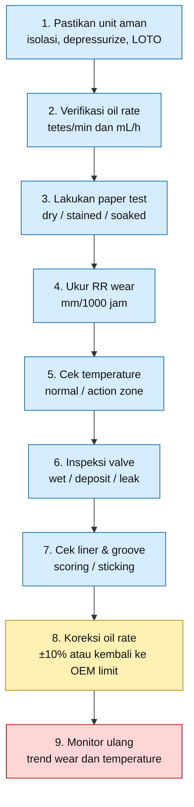

---

## 10.10 Kesimpulan Bab Troubleshooting

Troubleshooting lubrikasi rider ring harus berbasis data. Keputusan utama dapat diringkas sebagai berikut.

$$
\boxed{
\text{Liner kering}
+
\text{RR wear tinggi}
\Rightarrow
\text{naikkan oil rate } +10\%
}
$$

$$
\boxed{
\text{Liner basah hitam}
+
\text{RR wear tinggi}
\Rightarrow
\text{jangan tambah oli}
}
$$

$$
\boxed{
\text{Valve basah oli}
+
\text{deposit}
\Rightarrow
\text{turunkan oil rate } -10\%
}
$$

$$
\boxed{
\text{Wear tidak merata}
\Rightarrow
\text{cek } L_B,\ \text{alignment, rod runout, dan liner condition}
}
$$

Untuk contoh OEM **10–25 tetes/menit per point**, batas tindakan final adalah:

$$
\boxed{
N_d < 10
\Rightarrow
\text{kembalikan ke } N_d \geq 10
}
$$

$$
\boxed{
N_d > 25
\Rightarrow
\text{kembalikan ke } N_d \leq 25
}
$$

[**Kembali ke Atas**](#batas-minimum-dan-maksimum-lubrikasi-rider-ring-pada-reciprocating-compressor-konversi-tetesmenit-mljam-wear-control-dan-tindakan-koreksi-lapangan)

---

# Lampiran

Agar artikel tetap fokus untuk praktisi, detail pendukung diringkas dalam lampiran berikut.

---

## Lampiran A — Rumus Cepat

### A.1 Konversi Tetes/menit ke mL/jam

$$
Q
=

\frac{
N_d \times 60
}{
DF
}
$$

Dengan:

| Simbol | Arti         |             Satuan |
| ------ | ------------ | -----------------: |
| $Q$    | oil rate     |      $\text{mL/h}$ |
| $N_d$  | jumlah tetes | $\text{tetes/min}$ |
| $DF$   | drop factor  |  $\text{tetes/mL}$ |

Jika:

$$
DF
=

20\ \text{tetes/mL}
$$

maka:

$$
Q
=

3N_d
$$

---

### A.2 Konversi mL/jam ke Tetes/menit

$$
N_d
=

\frac{
Q \times DF
}{
60
}
$$

Jika:

$$
DF
=

20\ \text{tetes/mL}
$$

maka:

$$
N_d
=

\frac{Q}{3}
$$

---

### A.3 Total Oil Rate per Cylinder

$$
Q_{total}
=

Q_{point}
\times
n
$$

Dengan:

| Simbol      | Arti                        |
| ----------- | --------------------------- |
| $Q_{total}$ | total oil rate per cylinder |
| $Q_{point}$ | oil rate per lube point     |
| $n$         | jumlah lube point           |

---

### A.4 Rider Band Bearing Load

$$
L_B
=

\frac{
W_P + 0.5W_R
}{
0.866 \times D \times W
}
$$

Dengan:

| Simbol | Arti                             |          Satuan |
| ------ | -------------------------------- | --------------: |
| $L_B$  | rider band bearing load          | $\text{N/mm}^2$ |
| $W_P$  | berat piston assembly            |      $\text{N}$ |
| $W_R$  | berat piston rod                 |      $\text{N}$ |
| $D$    | cylinder bore diameter           |     $\text{mm}$ |
| $W$    | total effective rider ring width |     $\text{mm}$ |

Jika data masih berupa massa:

$$
W
=

m \times 9.81
$$

---

### A.5 Actual Wear Rate Rider Ring

$$
WR_{\mathrm{actual}}
=

\frac{
t_0 - t_1
}{
H
}
\times
1000
$$

Dengan:

| Simbol                 | Arti                       |                       Satuan |
| ---------------------- | -------------------------- | ---------------------------: |
| $WR_{\mathrm{actual}}$ | actual wear rate           | $\text{mm}/1000\ \text{jam}$ |
| $t_0$                  | thickness awal RR          |                  $\text{mm}$ |
| $t_1$                  | thickness RR saat inspeksi |                  $\text{mm}$ |
| $H$                    | operating hours            |                 $\text{jam}$ |

---

### A.6 Allowable Wear Rate Rider Ring

$$
WR_{\mathrm{allowable}}
=

\frac{
t_0 - t_{\min}
}{
H_{\mathrm{target}}
}
\times
1000
$$

Dengan:

| Simbol                    | Arti                           |                       Satuan |
| ------------------------- | ------------------------------ | ---------------------------: |
| $WR_{\mathrm{allowable}}$ | allowable wear rate            | $\text{mm}/1000\ \text{jam}$ |
| $t_{\min}$                | minimum allowable RR thickness |                  $\text{mm}$ |
| $H_{\mathrm{target}}$     | target operating hours         |                 $\text{jam}$ |

---

### A.7 Remaining Life Rider Ring

$$
t_{\mathrm{remaining}} = t_1 - t_{\min}
$$

$$
H_{\mathrm{remaining}}
=

\frac{
t_{\mathrm{remaining}}
}{
WR_{\mathrm{actual}}
}
\times
1000
$$

---

### A.8 Rule of Thumb Adjustment

Untuk under-lubrication:

$$
Q_{new}
=

1.10Q_{current}
$$

Untuk over-lubrication:

$$
Q_{new}
=

0.90Q_{current}
$$

Untuk contoh OEM:

$$
10
\leq
N_d
\leq
25
$$

atau:

$$
30
\leq
Q
\leq
75
$$

dengan satuan:

$$
N_d
=

\text{tetes/menit per point}
$$

$$
Q
=

\text{mL/h per point}
$$

[**Kembali ke Atas**](#batas-minimum-dan-maksimum-lubrikasi-rider-ring-pada-reciprocating-compressor-konversi-tetesmenit-mljam-wear-control-dan-tindakan-koreksi-lapangan)

---

## Lampiran B — Checklist Field Inspection

Checklist ini digunakan untuk memastikan oil rate, oil film, wear rate, dan indikasi deposit dicatat secara konsisten.

### B.1 Data Oil Rate

| Parameter            |                 Nilai |
| -------------------- | --------------------: |
| OEM minimum oil rate |      \_\_\_ tetes/min |
| OEM maximum oil rate |      \_\_\_ tetes/min |
| Drop factor aktual   |       \_\_\_ tetes/mL |
| Oil rate aktual      |      \_\_\_ tetes/min |
| Oil rate aktual      |           \_\_\_ mL/h |
| Jumlah lube point    |          \_\_\_ point |
| Total oil rate       |           \_\_\_ mL/h |
| Status oil rate      | Under / Normal / Over |

---

### B.2 Data Operating Condition

| Parameter                             |                     Nilai |
| ------------------------------------- | ------------------------: |
| Suction pressure                      |               \_\_\_ barg |
| Discharge pressure                    |               \_\_\_ barg |
| Discharge temperature                 | \_\_\_ $^\circ\mathrm{C}$ |
| Compressor speed                      |                \_\_\_ rpm |
| Gas service                           |                    \_\_\_ |
| Running hours sejak overhaul          |                \_\_\_ jam |
| Running hours sejak inspeksi terakhir |                \_\_\_ jam |

---

### B.3 Paper Test Result

| Lokasi              | Paper 1                | Paper 2                | Status      |
| ------------------- | ---------------------- | ---------------------- | ----------- |
| Top bore            | dry / stained / soaked | dry / stained / soaked | pass / fail |
| Bottom bore         | dry / stained / soaked | dry / stained / soaked | pass / fail |
| Left side           | dry / stained / soaked | dry / stained / soaked | pass / fail |
| Right side          | dry / stained / soaked | dry / stained / soaked | pass / fail |
| Near lube point     | dry / stained / soaked | dry / stained / soaked | pass / fail |
| Far from lube point | dry / stained / soaked | dry / stained / soaked | pass / fail |

Acceptance:

$$
\boxed{
\text{Paper 1 stained}
\quad
\text{dan}
\quad
\text{Paper 2 tidak soaked}
=

\text{acceptable}
}
$$

---

### B.4 Rider Ring Inspection

| Parameter                               |                   Nilai |
| --------------------------------------- | ----------------------: |
| RR material                             |                  \_\_\_ |
| RR thickness awal, $t_0$                |               \_\_\_ mm |
| RR thickness aktual, $t_1$              |               \_\_\_ mm |
| Minimum allowable thickness, $t_{\min}$ |               \_\_\_ mm |
| Actual wear                             |               \_\_\_ mm |
| Operating hours, $H$                    |              \_\_\_ jam |
| $WR_{\mathrm{actual}}$                  |      \_\_\_ mm/1000 jam |
| $WR_{\mathrm{allowable}}$               |      \_\_\_ mm/1000 jam |
| Remaining life                          |              \_\_\_ jam |
| Status                                  | Accept / Alarm / Action |

---

### B.5 Cylinder Liner and Groove Inspection

| Parameter              |                                 Nilai |
| ---------------------- | ------------------------------------: |
| Liner visual condition | clean / polished / scored / deposited |
| Liner scoring depth    |                             \_\_\_ mm |
| Liner ovality          |                             \_\_\_ mm |
| Ring groove condition  |    clean / lacquer / carbon / damaged |
| RR free movement       |                  free / tight / stuck |
| Carbon deposit         |       none / light / moderate / heavy |
| Black paste present    |                              yes / no |
| Metal particle present |                              yes / no |

---

### B.6 Valve and Carryover Inspection

| Parameter                  |                           Nilai |
| -------------------------- | ------------------------------: |
| Suction valve condition    | clean / wet / deposit / damaged |
| Discharge valve condition  | clean / wet / deposit / damaged |
| Valve leakage indication   |                        yes / no |
| Drain oil volume           |                     \_\_\_ mL/h |
| Drain oil vs baseline      |    normal / $>2\times$ baseline |
| Downstream oil carryover   |                        yes / no |
| Coalescer/filter condition |        normal / loaded / fouled |

---

### B.7 Final Field Decision

| Parameter                      | Status   |
| ------------------------------ | -------- |
| Oil rate within OEM range      | yes / no |
| Paper test acceptable          | yes / no |
| Wear rate acceptable           | yes / no |
| Temperature below action limit | yes / no |
| Valve clean                    | yes / no |
| Liner clean                    | yes / no |
| No abnormal carryover          | yes / no |

Final decision:

$$
\boxed{
\text{ACCEPT}
=

\text{all critical checks acceptable}
}
$$

$$
\boxed{
\text{ALARM}
=

\text{one or more parameters trending abnormal}
}
$$

$$
\boxed{
\text{ACTION}
=

\text{wear rate high, temperature high, deposit heavy, or oil rate outside OEM limit}
}
$$

[**Kembali ke Atas**](#batas-minimum-dan-maksimum-lubrikasi-rider-ring-pada-reciprocating-compressor-konversi-tetesmenit-mljam-wear-control-dan-tindakan-koreksi-lapangan)

---

<small>
  **_Catatan Penyusunan_** Artikel ini disusun sebagai materi edukasi dan
  referensi umum berdasarkan berbagai sumber pustaka, praktik lapangan, serta
  bantuan alat penulisan. Pembaca disarankan untuk melakukan verifikasi lanjutan
  dan penyesuaian sesuai dengan kondisi serta kebutuhan masing-masing sistem.
</small>
