# **_Technical Review and Improvement Study of Counter-Current STHE for CO₂ Gas Cooling: Heat Transfer Performance, SS304 Pitting Risk, and Upgrade Strategy to SS316L_**

---

- [**_Technical Review and Improvement Study of Counter-Current STHE for CO₂ Gas Cooling: Heat Transfer Performance, SS304 Pitting Risk, and Upgrade Strategy to SS316L_**](#technical-review-and-improvement-study-of-counter-current-sthe-for-co-gas-cooling-heat-transfer-performance-ss304-pitting-risk-and-upgrade-strategy-to-ss316l)
- [Executive Summary](#executive-summary)
- [1. Introduction and Background](#1-introduction-and-background)
  - [1.1 Deskripsi Sistem Proses](#11-deskripsi-sistem-proses)
  - [1.2 Fungsi STHE dalam Sistem CO₂ Compression](#12-fungsi-sthe-dalam-sistem-co-compression)
  - [1.3 Kenapa Kasus Ini Penting untuk Engineer Muda](#13-kenapa-kasus-ini-penting-untuk-engineer-muda)
  - [1.4 Problem Statement](#14-problem-statement)
    - [Pertanyaan 1 — Apakah performa heat transfer STHE konsisten dengan data aktual?](#pertanyaan-1--apakah-performa-heat-transfer-sthe-konsisten-dengan-data-aktual)
    - [Pertanyaan 2 — Di mana lokasi temperatur metal tube paling tinggi?](#pertanyaan-2--di-mana-lokasi-temperatur-metal-tube-paling-tinggi)
    - [Pertanyaan 3 — Apakah SS304 sesuai untuk kondisi ini?](#pertanyaan-3--apakah-ss304-sesuai-untuk-kondisi-ini)
    - [Pertanyaan 4 — Apakah upgrade ke SS316L cukup?](#pertanyaan-4--apakah-upgrade-ke-ss316l-cukup)
    - [Pertanyaan 5 — Data tambahan apa yang diperlukan?](#pertanyaan-5--data-tambahan-apa-yang-diperlukan)
  - [1.5 Tujuan Artikel](#15-tujuan-artikel)
- [2. Actual Field Data and Operating Baseline](#2-actual-field-data-and-operating-baseline)
  - [2.1 Data Aktual Sebelum Pitstop / Sebelum STHE Bocor](#21-data-aktual-sebelum-pitstop--sebelum-sthe-bocor)
  - [2.2 Data Cooling Water](#22-data-cooling-water)
  - [2.3 Baseline Counter-Current Temperature Pairing](#23-baseline-counter-current-temperature-pairing)
    - [Hot End](#hot-end)
    - [Cold End](#cold-end)
  - [2.4 Implikasi Terhadap Metal Temperature](#24-implikasi-terhadap-metal-temperature)
  - [2.5 Data Setelah Kebocoran](#25-data-setelah-kebocoran)
  - [2.6 Operating Baseline yang Digunakan untuk Perhitungan](#26-operating-baseline-yang-digunakan-untuk-perhitungan)
- [3. Fundamental STHE dan Counter-Current Arrangement](#3-fundamental-sthe-dan-counter-current-arrangement)
  - [3.1 Prinsip Dasar Shell and Tube Heat Exchanger](#31-prinsip-dasar-shell-and-tube-heat-exchanger)
  - [3.2 Elemen Utama STHE](#32-elemen-utama-sthe)
  - [3.3 Co-Current vs Counter-Current](#33-co-current-vs-counter-current)
    - [Co-current flow](#co-current-flow)
    - [Counter-current flow](#counter-current-flow)
  - [3.4 Mengapa Counter-Current Lebih Efektif](#34-mengapa-counter-current-lebih-efektif)
  - [3.5 Penentuan Hot End dan Cold End](#35-penentuan-hot-end-dan-cold-end)
- [4. Mekanisme Perpindahan Panas dari CO₂ ke Cooling Water](#4-mekanisme-perpindahan-panas-dari-co-ke-cooling-water)
  - [4.1 Jalur Perpindahan Panas](#41-jalur-perpindahan-panas)
  - [4.2 Konveksi dari CO₂ Gas ke Dinding Tube](#42-konveksi-dari-co-gas-ke-dinding-tube)
  - [4.3 Konduksi Menembus Dinding Tube SS304](#43-konduksi-menembus-dinding-tube-ss304)
  - [4.4 Konveksi dari Dinding Tube ke Cooling Water](#44-konveksi-dari-dinding-tube-ke-cooling-water)
  - [4.5 Thermal Resistance Network](#45-thermal-resistance-network)
  - [4.6 Mengapa Fouling Penting](#46-mengapa-fouling-penting)
- [5. Perhitungan Heat Transfer Berdasarkan Data Aktual](#5-perhitungan-heat-transfer-berdasarkan-data-aktual)
  - [5.1 Basis Data Perhitungan](#51-basis-data-perhitungan)
  - [5.2 Heat Duty dari Sisi CO₂](#52-heat-duty-dari-sisi-co)
  - [5.3 Cooling Water Heat Balance](#53-cooling-water-heat-balance)
  - [5.4 Validasi Energy Balance](#54-validasi-energy-balance)
  - [5.5 LMTD Counter-Current](#55-lmtd-counter-current)
  - [5.6 Actual UA](#56-actual-ua)
  - [5.7 Estimasi Required Heat Transfer Area](#57-estimasi-required-heat-transfer-area)
  - [5.8 Estimasi Hot-End Tube Wall Temperature](#58-estimasi-hot-end-tube-wall-temperature)
  - [5.9 Implikasi Termal terhadap Risiko Material](#59-implikasi-termal-terhadap-risiko-material)
- [6. Role of Downstream Separator and Possible Condensation Duty](#6-role-of-downstream-separator-and-possible-condensation-duty)
  - [6.1 Kenapa Liquid Separator Setelah STHE Penting](#61-kenapa-liquid-separator-setelah-sthe-penting)
  - [6.2 Sensible Duty vs Total Duty](#62-sensible-duty-vs-total-duty)
  - [6.3 Mekanisme Pembentukan Liquid Setelah Pendinginan](#63-mekanisme-pembentukan-liquid-setelah-pendinginan)
  - [6.4 Dampak Condensation Duty terhadap Heat Balance](#64-dampak-condensation-duty-terhadap-heat-balance)
  - [6.5 Data Tambahan yang Perlu Dikumpulkan](#65-data-tambahan-yang-perlu-dikumpulkan)
  - [6.6 Practical Engineering Interpretation](#66-practical-engineering-interpretation)
- [7. SS304 Resistance to Chloride and Pitting Mechanism](#7-ss304-resistance-to-chloride-and-pitting-mechanism)
  - [7.1 Data Chloride Aktual](#71-data-chloride-aktual)
  - [7.2 Kenapa SS304 Rentan terhadap Chloride](#72-kenapa-ss304-rentan-terhadap-chloride)
  - [7.3 Interpretasi Chloride $124.6\\ \\mathrm{ppm}$ pada Temperatur Metal $64-76^\\circ \\mathrm{C}$](#73-interpretasi-chloride-1246-mathrmppm-pada-temperatur-metal-64-76circ-mathrmc)
    - [Alasan 1 — Temperatur Metal Lebih Tinggi dari $60^\\circ \\mathrm{C}$](#alasan-1--temperatur-metal-lebih-tinggi-dari-60circ-mathrmc)
    - [Alasan 2 — Cooling Water Bulk Tidak Sama dengan Kondisi Lokal Under Deposit](#alasan-2--cooling-water-bulk-tidak-sama-dengan-kondisi-lokal-under-deposit)
    - [Alasan 3 — Hot End adalah Area dengan Thermal Severity Tertinggi](#alasan-3--hot-end-adalah-area-dengan-thermal-severity-tertinggi)
  - [7.4 Mekanisme Pitting SS304](#74-mekanisme-pitting-ss304)
    - [Tahap 1 — Passive Film Terbentuk](#tahap-1--passive-film-terbentuk)
    - [Tahap 2 — Chloride Menyerang Titik Lemah Passive Film](#tahap-2--chloride-menyerang-titik-lemah-passive-film)
    - [Tahap 3 — Pit Initiation](#tahap-3--pit-initiation)
    - [Tahap 4 — Acidification di Dalam Pit](#tahap-4--acidification-di-dalam-pit)
    - [Tahap 5 — Chloride Migration ke Dalam Pit](#tahap-5--chloride-migration-ke-dalam-pit)
    - [Tahap 6 — Pit Propagation dan Pinhole Leak](#tahap-6--pit-propagation-dan-pinhole-leak)
  - [7.5 Perbedaan Pitting, Crevice Corrosion, dan Under-Deposit Corrosion](#75-perbedaan-pitting-crevice-corrosion-dan-under-deposit-corrosion)
  - [7.6 Area Paling Kritis pada STHE](#76-area-paling-kritis-pada-sthe)
  - [7.7 Failure Morphology yang Harus Dicari](#77-failure-morphology-yang-harus-dicari)
  - [7.8 Kesimpulan Bab 7](#78-kesimpulan-bab-7)
- [8. Material Improvement: SS304 to SS316L](#8-material-improvement-ss304-to-ss316l)
  - [8.1 Kenapa SS316L Lebih Baik Dibanding SS304?](#81-kenapa-ss316l-lebih-baik-dibanding-ss304)
  - [8.2 Relevansi SS316L terhadap Kondisi Aktual STHE](#82-relevansi-ss316l-terhadap-kondisi-aktual-sthe)
  - [8.3 Perbandingan Interpretasi Chloride: SS304 vs SS316L](#83-perbandingan-interpretasi-chloride-ss304-vs-ss316l)
  - [8.4 Kenapa Memilih SS316L, Bukan Hanya SS316?](#84-kenapa-memilih-ss316l-bukan-hanya-ss316)
  - [8.5 Batasan SS316L](#85-batasan-ss316l)
  - [8.6 Kapan Duplex 2205 Perlu Dipertimbangkan?](#86-kapan-duplex-2205-perlu-dipertimbangkan)
  - [8.7 Material Selection Matrix](#87-material-selection-matrix)
  - [8.8 Kesimpulan Bab 8](#88-kesimpulan-bab-8)
- [9. Mechanical and Thermal Properties: SS304 vs SS316L](#9-mechanical-and-thermal-properties-ss304-vs-ss316l)
  - [9.1 Konteks Perbandingan](#91-konteks-perbandingan)
  - [9.2 Komposisi Kimia Utama](#92-komposisi-kimia-utama)
  - [9.3 Mechanical Properties](#93-mechanical-properties)
  - [9.4 Thermal Properties dalam Konteks Heat Transfer](#94-thermal-properties-dalam-konteks-heat-transfer)
  - [9.5 Wall Resistance Comparison](#95-wall-resistance-comparison)
  - [9.6 Faktor yang Lebih Dominan terhadap Heat Transfer](#96-faktor-yang-lebih-dominan-terhadap-heat-transfer)
  - [9.7 Hubungan Mechanical Properties dengan Pitting](#97-hubungan-mechanical-properties-dengan-pitting)
  - [9.8 Ringkasan Perbandingan Engineering SS304 vs SS316L](#98-ringkasan-perbandingan-engineering-ss304-vs-ss316l)
  - [9.9 Kesimpulan Bab 9](#99-kesimpulan-bab-9)
- [10. PREN Analysis and Diagram](#10-pren-analysis-and-diagram)
  - [10.1 Apa Itu PREN?](#101-apa-itu-pren)
  - [10.2 Kenapa PREN Penting pada Kasus STHE Ini?](#102-kenapa-pren-penting-pada-kasus-sthe-ini)
  - [10.3 Estimated PREN untuk SS304](#103-estimated-pren-untuk-ss304)
  - [10.4 Estimated PREN untuk SS316L](#104-estimated-pren-untuk-ss316l)
  - [10.5 Estimated PREN untuk Duplex 2205](#105-estimated-pren-untuk-duplex-2205)
  - [10.6 PREN Calculation Flow](#106-pren-calculation-flow)
  - [10.7 PREN Diagram for Article](#107-pren-diagram-for-article)
  - [10.8 PREN dan Relevansi terhadap Kasus Aktual](#108-pren-dan-relevansi-terhadap-kasus-aktual)
  - [10.9 Batasan PREN](#109-batasan-pren)
  - [10.10 Kesimpulan Bab 10](#1010-kesimpulan-bab-10)
- [11. Chloride vs Temperature Risk Map](#11-chloride-vs-temperature-risk-map)
  - [11.1 Kenapa Chloride Harus Dikombinasikan dengan Temperatur?](#111-kenapa-chloride-harus-dikombinasikan-dengan-temperatur)
  - [11.2 Operating Point Kasus Ini](#112-operating-point-kasus-ini)
  - [11.3 Data Panduan Material terhadap Chloride](#113-data-panduan-material-terhadap-chloride)
  - [11.4 Chloride–Temperature Risk Map Konseptual](#114-chloridetemperature-risk-map-konseptual)
  - [11.5 Operating Point Diagram](#115-operating-point-diagram)
  - [11.6 Pesan Utama Risk Map](#116-pesan-utama-risk-map)
  - [11.7 Faktor yang Dapat Menggeser Operating Point ke Zona Lebih Berisiko](#117-faktor-yang-dapat-menggeser-operating-point-ke-zona-lebih-berisiko)
  - [11.8 Practical Interpretation untuk Engineer Muda](#118-practical-interpretation-untuk-engineer-muda)
    - [Langkah 1 — Jangan mulai dari cooling water inlet](#langkah-1--jangan-mulai-dari-cooling-water-inlet)
  - [Langkah 2 — Tentukan hot-end local condition](#langkah-2--tentukan-hot-end-local-condition)
  - [Langkah 3 — Gabungkan dengan chloride](#langkah-3--gabungkan-dengan-chloride)
  - [Langkah 4 — Evaluasi material](#langkah-4--evaluasi-material)
  - [Langkah 5 — Validasi dengan inspeksi dan water chemistry](#langkah-5--validasi-dengan-inspeksi-dan-water-chemistry)
  - [11.9 Kesimpulan Bab 11](#119-kesimpulan-bab-11)
- [12. Root Cause Hypothesis for STHE Leakage](#12-root-cause-hypothesis-for-sthe-leakage)
  - [12.1 Positioning: Hipotesis, Bukan Final RCA](#121-positioning-hipotesis-bukan-final-rca)
  - [12.2 Basis Teknis Hipotesis Pitting](#122-basis-teknis-hipotesis-pitting)
  - [12.3 Most Probable Damage Mechanism](#123-most-probable-damage-mechanism)
  - [12.4 Contributing Factors](#124-contributing-factors)
  - [12.5 Alternative or Combined Mechanisms](#125-alternative-or-combined-mechanisms)
  - [12.6 Evidence Required to Confirm RCA](#126-evidence-required-to-confirm-rca)
  - [12.7 Kesimpulan Bab 12](#127-kesimpulan-bab-12)
- [13. Inspection and Failure Analysis Plan](#13-inspection-and-failure-analysis-plan)
  - [13.1 Tujuan Inspection dan Failure Analysis](#131-tujuan-inspection-dan-failure-analysis)
  - [13.2 Inspection Scope](#132-inspection-scope)
  - [13.3 Inspection Flow](#133-inspection-flow)
  - [13.4 Sampling Priority](#134-sampling-priority)
  - [13.5 Morphology Evidence](#135-morphology-evidence)
  - [13.6 Acceptance of Hypothesis](#136-acceptance-of-hypothesis)
  - [13.7 Kesimpulan Bab 13](#137-kesimpulan-bab-13)
- [14. Cooling Water Chemistry and Operating Envelope](#14-cooling-water-chemistry-and-operating-envelope)
  - [14.1 Data Cooling Water yang Sudah Ada](#141-data-cooling-water-yang-sudah-ada)
  - [14.2 Data Cooling Water yang Wajib Dilengkapi](#142-data-cooling-water-yang-wajib-dilengkapi)
  - [14.3 Kenapa Chloride Bulk Saja Tidak Cukup?](#143-kenapa-chloride-bulk-saja-tidak-cukup)
  - [14.4 Operating Envelope yang Disarankan](#144-operating-envelope-yang-disarankan)
  - [14.5 Parameter yang Perlu Ditrending](#145-parameter-yang-perlu-ditrending)
  - [14.6 Thermal Operating Limit](#146-thermal-operating-limit)
  - [14.7 Proposed Operating Envelope Table](#147-proposed-operating-envelope-table)
  - [14.8 Kesimpulan Bab 14](#148-kesimpulan-bab-14)
- [15. Improvement Options](#15-improvement-options)
  - [15.1 Improvement Philosophy](#151-improvement-philosophy)
  - [15.2 Short-Term Actions](#152-short-term-actions)
  - [15.3 Medium-Term Actions](#153-medium-term-actions)
  - [15.4 Long-Term Actions](#154-long-term-actions)
  - [15.5 Decision Matrix for Improvement](#155-decision-matrix-for-improvement)
  - [15.6 Recommended Improvement Package](#156-recommended-improvement-package)
    - [Package A — Minimum Required Improvement](#package-a--minimum-required-improvement)
    - [Package B — Reliability Improvement](#package-b--reliability-improvement)
    - [Package C — Robust Long-Term Improvement](#package-c--robust-long-term-improvement)
  - [15.7 Expected Outcome](#157-expected-outcome)
  - [15.8 Kesimpulan Bab 15](#158-kesimpulan-bab-15)

---

# Executive Summary

Shell and Tube Heat Exchanger atau **STHE** yang dibahas dalam artikel ini berfungsi sebagai **CO₂ gas cooler** setelah **1st stage compressor**. Gas CO₂ hasil kompresi didinginkan sebelum masuk ke **liquid separator**, kemudian dilanjutkan ke **2nd stage compressor**. Fungsi pendinginan ini sangat penting karena temperatur gas yang terlalu tinggi dapat mempengaruhi performa separator, meningkatkan beban termal downstream equipment, dan menurunkan reliability sistem kompresi.

Data aktual lapangan sebelum pitstop atau sebelum STHE bocor adalah sebagai berikut.

| Parameter              |                                                                       Nilai |
| ---------------------- | --------------------------------------------------------------------------: |
| Service                |                                   CO₂ gas cooler after 1st stage compressor |
| Fungsi                 | Menurunkan temperatur CO₂ sebelum liquid separator dan 2nd stage compressor |
| CO₂ gas flowrate       |                                                                   2 ton/jam |
| CO₂ gas inlet STHE     |                                                                       120°C |
| CO₂ gas outlet STHE    |                                                                        46°C |
| Cooling water inlet    |                                                                        32°C |
| Cooling water outlet   |                                                                        62°C |
| STHE arrangement       |                                                             Counter-current |
| Existing tube material |                                                                       SS304 |
| Chloride cooling water |                                                                   124.6 ppm |

Secara termal, STHE berhasil menurunkan temperatur CO₂ dari:

$$
T_{\mathrm{CO_2,in}} = 120^\circ \mathrm{C}
$$

menjadi:

$$
T_{\mathrm{CO_2,out}} = 46^\circ \mathrm{C}
$$

Sehingga penurunan temperatur CO₂ adalah:

$$
\Delta T_{\mathrm{CO_2}} = 120 - 46 = 74^\circ \mathrm{C}
$$

Di sisi cooling water, temperatur naik dari:

$$
T_{\mathrm{CW,in}} = 32^\circ \mathrm{C}
$$

menjadi:

$$
T_{\mathrm{CW,out}} = 62^\circ \mathrm{C}
$$

Sehingga kenaikan temperatur cooling water adalah:

$$
\Delta T_{\mathrm{CW}} = 62 - 32 = 30^\circ \mathrm{C}
$$

Karena STHE ini didesain sebagai **counter-current heat exchanger**, maka titik operasi paling kritis bukan berada pada cooling water inlet 32°C, tetapi pada **hot end**, yaitu area di mana **CO₂ gas inlet 120°C berhadapan dengan cooling water outlet 62°C**.

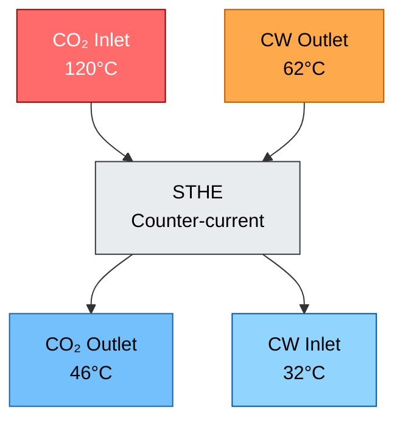

Konsekuensi engineering yang paling penting adalah:

$$
T_{\mathrm{wall,CW,hot\ end}} > T_{\mathrm{CW,out}}
$$

Dengan data aktual:

$$
T_{\mathrm{wall,CW,hot\ end}} > 62^\circ \mathrm{C}
$$

Artinya, temperatur metal tube pada sisi cooling water di hot end **pasti lebih tinggi dari 62°C**. Dalam perhitungan screening tanpa fouling, temperatur dinding tube sisi cooling water diperkirakan berada pada kisaran:

$$
T_{\mathrm{wall,CW,hot\ end}} \approx 64 - 76^\circ \mathrm{C}
$$

Kondisi ini sangat penting terhadap material existing **SS304**. Walaupun chloride cooling water sebesar **124.6 ppm** tidak tergolong ekstrem, kombinasi chloride tersebut dengan temperatur metal di atas 62°C dapat membuat SS304 berada pada kondisi **borderline sampai berisiko terhadap pitting corrosion**, terutama bila terdapat deposit, crevice, residual chlorine, atau area low velocity.

Sebagai pembanding material, panduan stainless steel menyatakan bahwa SS304 umumnya dianggap tahan terhadap pitting di potable water sampai sekitar **200 mg/L chloride pada temperatur ambient**, tetapi turun menjadi sekitar **150 mg/L pada 60°C**. Untuk SS316, batas panduan lebih tinggi, yaitu sekitar **1000 mg/L chloride pada ambient** dan turun menjadi sekitar **300 mg/L pada 60°C**. Hal ini menjelaskan mengapa SS316L lebih sesuai dibanding SS304 untuk service cooling water yang mengandung chloride pada temperatur metal elevated. ([worldstainless][1])

Kesimpulan utama dari artikel ini adalah:

> **Material selection untuk STHE cooling water service tidak boleh hanya berbasis cooling water inlet temperature. Evaluasi harus dilakukan berdasarkan hot-end metal temperature, chloride concentration, fouling tendency, crevice risk, dan actual operating condition.**

[**Kembali ke Atas**](#technical-review-and-improvement-study-of-counter-current-sthe-for-co-gas-cooling-heat-transfer-performance-ss304-pitting-risk-and-upgrade-strategy-to-ss316l)

---

# 1. Introduction and Background

## 1.1 Deskripsi Sistem Proses

STHE yang dibahas dalam artikel ini berada setelah **1st stage CO₂ compressor**. Gas CO₂ dari 1st stage compressor keluar pada temperatur tinggi karena adanya proses kompresi. Setelah itu, gas panas tersebut masuk ke STHE untuk didinginkan menggunakan cooling water.

Setelah keluar dari STHE, gas CO₂ masuk ke **liquid separator**. Separator ini berfungsi untuk memisahkan liquid yang mungkin terbentuk akibat pendinginan gas. Setelah melewati separator, gas CO₂ kemudian dilanjutkan ke **2nd stage compressor**.

Secara sederhana, konfigurasi prosesnya dapat digambarkan sebagai berikut.

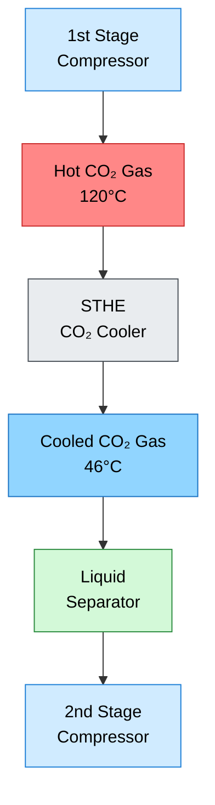

Pendinginan gas setelah kompresor memiliki beberapa fungsi penting:

| Fungsi                          | Penjelasan                                                              |
| ------------------------------- | ----------------------------------------------------------------------- |
| Menurunkan temperatur gas       | Agar temperatur inlet ke peralatan downstream tetap dalam batas operasi |
| Membantu kondensasi liquid      | Liquid yang terbentuk dapat dipisahkan di separator                     |
| Melindungi 2nd stage compressor | Mencegah liquid carry-over dan temperatur suction yang terlalu tinggi   |
| Menurunkan thermal stress       | Mengurangi beban termal pada piping dan equipment downstream            |
| Menjaga process stability       | Menjaga kestabilan operasi sistem kompresi bertingkat                   |

Pada sistem kompresi bertingkat, intercooler atau aftercooler seperti STHE bukan hanya equipment perpindahan panas. Equipment ini juga berperan dalam **mechanical reliability**, **process protection**, dan **contamination control**. Bila terjadi kebocoran tube, maka dapat terjadi kontaminasi silang antara process gas dan cooling water, serta potensi gangguan operasi pada separator dan kompresor downstream.

## 1.2 Fungsi STHE dalam Sistem CO₂ Compression

Dalam konteks sistem ini, STHE berfungsi untuk menurunkan temperatur gas CO₂ dari kondisi panas setelah 1st stage compressor menuju temperatur yang lebih aman sebelum masuk ke separator dan 2nd stage compressor.

Data aktual menunjukkan:

$$
T_{\mathrm{CO_2,in}} = 120^\circ \mathrm{C}
$$

$$
T_{\mathrm{CO_2,out}} = 46^\circ \mathrm{C}
$$

Maka penurunan temperatur gas adalah:

$$
\Delta T_{\mathrm{CO_2}} = T_{\mathrm{CO_2,in}} - T_{\mathrm{CO_2,out}}
$$

$$
\Delta T_{\mathrm{CO_2}} = 120 - 46
$$

$$
\Delta T_{\mathrm{CO_2}} = 74^\circ \mathrm{C}
$$

Penurunan temperatur sebesar 74°C menunjukkan bahwa STHE mengambil sejumlah panas yang signifikan dari gas CO₂. Panas tersebut kemudian diterima oleh cooling water, yang temperaturnya naik dari 32°C ke 62°C.

$$
\Delta T_{\mathrm{CW}} = T_{\mathrm{CW,out}} - T_{\mathrm{CW,in}}
$$

$$
\Delta T_{\mathrm{CW}} = 62 - 32
$$

$$
\Delta T_{\mathrm{CW}} = 30^\circ \mathrm{C}
$$

Kenaikan temperatur cooling water sampai 62°C menjadi sangat penting dalam analisis material, karena temperatur ini berkaitan langsung dengan **hot-end tube wall temperature**. Pada STHE counter-current, cooling water outlet 62°C berada di sisi yang sama dengan CO₂ inlet 120°C. Dengan demikian, area tersebut merupakan area dengan temperatur metal tube tertinggi.

## 1.3 Kenapa Kasus Ini Penting untuk Engineer Muda

Kasus ini memberikan pelajaran engineering yang sangat baik karena memperlihatkan hubungan langsung antara:

1. **Thermal design**
2. **Actual operating data**
3. **Material selection**
4. **Cooling water chemistry**
5. **Failure mechanism**
6. **Reliability improvement**

Kesalahan umum dalam evaluasi cooling water heat exchanger adalah hanya melihat temperatur cooling water inlet. Dalam kasus ini, cooling water inlet memang hanya 32°C. Namun, karena STHE bekerja secara counter-current, cooling water keluar pada 62°C dan berada berdekatan secara termal dengan CO₂ inlet 120°C.

Dengan kata lain:

$$
T_{\mathrm{CW,in}} = 32^\circ \mathrm{C}
$$

bukan temperatur yang menentukan risiko material di hot end.

Temperatur yang lebih relevan untuk analisis pitting adalah:

$$
T_{\mathrm{CW,out}} = 62^\circ \mathrm{C}
$$

dan lebih tepat lagi:

$$
T_{\mathrm{wall,CW,hot\ end}} > 62^\circ \mathrm{C}
$$

Ini adalah inti dari evaluasi material pada kasus ini.

## 1.4 Problem Statement

Artikel ini disusun untuk menjawab beberapa pertanyaan teknis berikut.

### Pertanyaan 1 — Apakah performa heat transfer STHE konsisten dengan data aktual?

Data menunjukkan CO₂ gas turun dari 120°C menjadi 46°C, sedangkan cooling water naik dari 32°C menjadi 62°C. Pertanyaan utamanya adalah apakah data ini konsisten secara heat balance, terutama dengan kapasitas CO₂ sebesar 2 ton/jam.

### Pertanyaan 2 — Di mana lokasi temperatur metal tube paling tinggi?

Karena STHE menggunakan konfigurasi counter-current, temperatur metal tertinggi diperkirakan berada pada **hot end**, yaitu area di mana CO₂ 120°C berhadapan dengan cooling water 62°C.

### Pertanyaan 3 — Apakah SS304 sesuai untuk kondisi ini?

Existing tube material adalah SS304. Cooling water memiliki chloride sebesar:

$$
C_{\mathrm{Cl}^{-}} = 124.6\ \mathrm{ppm}
$$

Kombinasi chloride dan temperatur metal di atas 62°C perlu dievaluasi terhadap risiko pitting corrosion.

### Pertanyaan 4 — Apakah upgrade ke SS316L cukup?

SS316L memiliki molybdenum sekitar 2–3%, sehingga lebih tahan terhadap pitting dan crevice corrosion dibanding SS304. Namun, SS316L bukan material yang immune terhadap chloride. Oleh karena itu, perlu dievaluasi apakah SS316L cukup atau perlu material yang lebih tinggi seperti Duplex 2205.

### Pertanyaan 5 — Data tambahan apa yang diperlukan?

Untuk menyimpulkan root cause dan menentukan improvement yang tepat, diperlukan data tambahan seperti:

| Data Tambahan             | Tujuan                             |
| ------------------------- | ---------------------------------- |
| Cooling water flow aktual | Validasi heat balance              |
| pH cooling water          | Evaluasi corrosivity               |
| Conductivity              | Indikasi total dissolved solids    |
| Residual chlorine         | Evaluasi oxidizing potential       |
| ORP                       | Evaluasi corrosion potential       |
| Hardness dan silica       | Evaluasi scaling tendency          |
| Deposit analysis          | Menentukan under-deposit corrosion |
| Tube inspection           | Menentukan morphology kerusakan    |
| Liquid separator rate     | Menghitung potensi latent duty     |

## 1.5 Tujuan Artikel

Artikel ini bertujuan untuk:

1. Menjelaskan fundamental STHE, khususnya konfigurasi counter-current.
2. Menguraikan mekanisme perpindahan panas dari CO₂ gas ke cooling water.
3. Menghitung heat duty, LMTD, estimasi cooling water flow, dan UA berdasarkan data aktual.
4. Mengevaluasi ketahanan SS304 terhadap chloride 124.6 ppm pada temperatur metal elevated.
5. Menjelaskan mekanisme pitting corrosion pada SS304.
6. Membandingkan SS304 dan SS316L dari sisi mechanical properties, thermal properties, dan corrosion resistance.
7. Memberikan dasar teknis untuk material upgrade dan improvement STHE.
8. Menyusun rekomendasi inspection plan, operating envelope, dan reliability improvement.

[**Kembali ke Atas**](#technical-review-and-improvement-study-of-counter-current-sthe-for-co-gas-cooling-heat-transfer-performance-ss304-pitting-risk-and-upgrade-strategy-to-ss316l)

---

# 2. Actual Field Data and Operating Baseline

## 2.1 Data Aktual Sebelum Pitstop / Sebelum STHE Bocor

Data sebelum pitstop atau sebelum STHE bocor digunakan sebagai **baseline thermal analysis** karena data ini mewakili kondisi operasi normal sebelum terjadi gangguan.

| Stream                 | Inlet / Upstream | Outlet / Downstream | Perubahan Temperatur |
| ---------------------- | ---------------: | ------------------: | -------------------: |
| CO₂ gas / process side |            120°C |                46°C |           Turun 74°C |
| Cooling water          |             32°C |                62°C |            Naik 30°C |

Kapasitas CO₂ dari data kompresor adalah:

$$
\dot{m}_{\mathrm{CO_2}} = 2\ \mathrm{ton/jam}
$$

Konversi ke satuan SI:

$$
2\ \mathrm{ton/jam} = 2000\ \mathrm{kg/jam}
$$

$$
\dot{m}_{\mathrm{CO_2}} = \frac{2000}{3600}
$$

$$
\dot{m}_{\mathrm{CO_2}} = 0.556\ \mathrm{kg/s}
$$

Dengan demikian, basis perhitungan heat transfer dari sisi CO₂ adalah:

| Parameter              |                     Simbol |      Nilai |
| ---------------------- | -------------------------: | ---------: |
| CO₂ mass flowrate      |  $\dot{m}_{\mathrm{CO_2}}$ | 0.556 kg/s |
| CO₂ inlet temperature  |     $T_{\mathrm{CO_2,in}}$ |      120°C |
| CO₂ outlet temperature |    $T_{\mathrm{CO_2,out}}$ |       46°C |
| CO₂ temperature drop   | $\Delta T_{\mathrm{CO_2}}$ |       74°C |

## 2.2 Data Cooling Water

Data cooling water aktual:

| Parameter                        |                   Simbol |     Nilai |
| -------------------------------- | -----------------------: | --------: |
| Cooling water inlet temperature  |     $T_{\mathrm{CW,in}}$ |      32°C |
| Cooling water outlet temperature |    $T_{\mathrm{CW,out}}$ |      62°C |
| Cooling water temperature rise   | $\Delta T_{\mathrm{CW}}$ |      30°C |
| Chloride concentration           |    $C_{\mathrm{Cl}^{-}}$ | 124.6 ppm |

Kenaikan temperatur cooling water dihitung sebagai:

$$
\Delta T_{\mathrm{CW}} = T_{\mathrm{CW,out}} - T_{\mathrm{CW,in}}
$$

$$
\Delta T_{\mathrm{CW}} = 62 - 32
$$

$$
\Delta T_{\mathrm{CW}} = 30^\circ \mathrm{C}
$$

Chloride cooling water sebesar 124.6 ppm harus dibaca dalam konteks temperatur metal. Nilai ini tidak dapat dievaluasi hanya pada cooling water inlet 32°C, karena titik kritis material berada pada hot end.

## 2.3 Baseline Counter-Current Temperature Pairing

Karena STHE ini didesain sebagai counter-current exchanger, pasangan temperatur lokal adalah sebagai berikut.

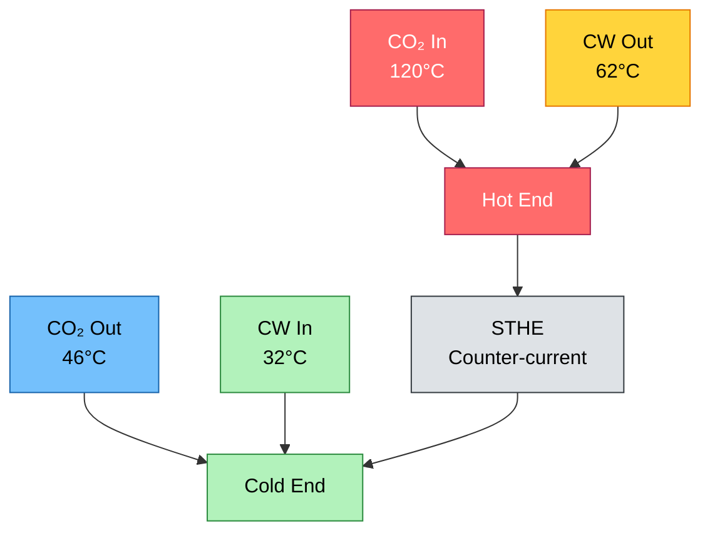

Dengan demikian:

### Hot End

$$
T_{\mathrm{CO_2,hot\ end}} = 120^\circ \mathrm{C}
$$

$$
T_{\mathrm{CW,hot\ end}} = 62^\circ \mathrm{C}
$$

Temperature driving force di hot end adalah:

$$
\Delta T_{\mathrm{hot\ end}} = 120 - 62
$$

$$
\Delta T_{\mathrm{hot\ end}} = 58^\circ \mathrm{C}
$$

### Cold End

$$
T_{\mathrm{CO_2,cold\ end}} = 46^\circ \mathrm{C}
$$

$$
T_{\mathrm{CW,cold\ end}} = 32^\circ \mathrm{C}
$$

Temperature driving force di cold end adalah:

$$
\Delta T_{\mathrm{cold\ end}} = 46 - 32
$$

$$
\Delta T_{\mathrm{cold\ end}} = 14^\circ \mathrm{C}
$$

## 2.4 Implikasi Terhadap Metal Temperature

Pada hot end, cooling water bulk temperature adalah 62°C. Agar panas dapat berpindah dari tube wall ke cooling water, temperatur dinding tube sisi cooling water harus lebih tinggi daripada temperatur cooling water bulk.

Maka:

$$
T_{\mathrm{wall,CW,hot\ end}} > T_{\mathrm{CW,out}}
$$

Dengan data aktual:

$$
T_{\mathrm{wall,CW,hot\ end}} > 62^\circ \mathrm{C}
$$

Poin ini sangat penting karena pitting corrosion pada stainless steel lebih relevan terhadap **metal temperature**, bukan hanya bulk cooling water inlet temperature.

Secara fisik, urutan temperatur di hot end dapat digambarkan sebagai berikut.

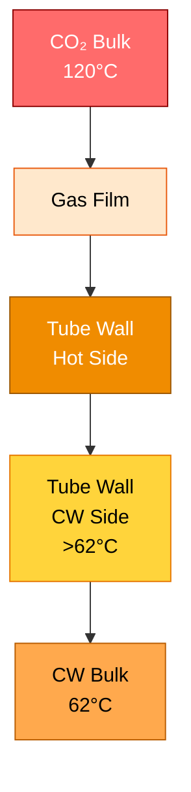

## 2.5 Data Setelah Kebocoran

Data setelah kebocoran tercatat sebagai berikut.

| Parameter                | Setelah Kebocoran |
| ------------------------ | ----------------: |
| CO₂ gas upstream         |             125°C |
| CO₂ gas downstream       |              80°C |
| Cooling water upstream   |              31°C |
| Cooling water downstream |             120°C |

Data ini tidak digunakan sebagai baseline normal thermal performance karena sudah berada dalam kondisi abnormal. Cooling water downstream mencapai 120°C, yaitu jauh lebih tinggi dari kondisi normal 62°C.

Kemungkinan penyebab data abnormal ini antara lain:

| Kemungkinan                | Penjelasan                                                                               |
| -------------------------- | ---------------------------------------------------------------------------------------- |
| Tube leak / cross leakage  | Process gas panas dapat mempengaruhi pembacaan atau kondisi cooling water                |
| Local flashing             | Bila tekanan lokal memungkinkan, air dapat mengalami flashing atau two-phase disturbance |
| Instrument error           | Temperature transmitter atau lokasi pengukuran perlu diverifikasi                        |
| Non-steady-state condition | Data diambil saat kondisi transien setelah kebocoran                                     |
| Maldistribution            | Aliran cooling water tidak merata setelah terjadi kerusakan                              |
| Mixing effect              | Ada pencampuran lokal akibat kebocoran atau bypass internal                              |

Untuk analisis heat transfer normal, artikel ini menggunakan data sebelum kebocoran sebagai basis:

$$
T_{\mathrm{CO_2}}: 120^\circ \mathrm{C} \rightarrow 46^\circ \mathrm{C}
$$

$$
T_{\mathrm{CW}}: 32^\circ \mathrm{C} \rightarrow 62^\circ \mathrm{C}
$$

## 2.6 Operating Baseline yang Digunakan untuk Perhitungan

Baseline yang akan digunakan dalam perhitungan selanjutnya adalah sebagai berikut.

| Item                             |                    Simbol |           Nilai |
| -------------------------------- | ------------------------: | --------------: |
| CO₂ mass flowrate                | $\dot{m}_{\mathrm{CO_2}}$ |      0.556 kg/s |
| CO₂ inlet temperature            |       $T_{\mathrm{h,in}}$ |           120°C |
| CO₂ outlet temperature           |      $T_{\mathrm{h,out}}$ |            46°C |
| Cooling water inlet temperature  |       $T_{\mathrm{c,in}}$ |            32°C |
| Cooling water outlet temperature |      $T_{\mathrm{c,out}}$ |            62°C |
| Chloride concentration           |     $C_{\mathrm{Cl}^{-}}$ |       124.6 ppm |
| Tube material existing           |                         — |           SS304 |
| Flow arrangement                 |                         — | Counter-current |

Dengan basis tersebut, analisis selanjutnya akan menghitung:

1. Heat duty dari sisi CO₂.
2. Estimasi flow cooling water yang konsisten dengan heat balance.
3. LMTD counter-current.
4. Actual $UA$.
5. Estimasi hot-end tube wall temperature.
6. Kesesuaian material SS304 terhadap chloride dan temperatur metal aktual.

---

## Key Takeaways Bab 1–2

1. STHE ini berfungsi sebagai CO₂ gas cooler setelah 1st stage compressor dan sebelum liquid separator.
2. Data normal sebelum bocor menunjukkan CO₂ turun dari 120°C ke 46°C.
3. Cooling water naik dari 32°C ke 62°C.
4. Karena konfigurasi adalah counter-current, hot end adalah area CO₂ 120°C berhadapan dengan cooling water 62°C.
5. Temperatur metal tube sisi cooling water di hot end pasti lebih tinggi dari 62°C.
6. Dengan chloride cooling water 124.6 ppm, SS304 harus dievaluasi secara serius terhadap risiko pitting corrosion.
7. Data setelah kebocoran tidak digunakan sebagai baseline normal karena sudah merupakan abnormal symptom.
8. Analisis selanjutnya harus berbasis heat balance, LMTD, metal temperature, dan material compatibility.

[1]: https://worldstainless.org/wp-content/uploads/2025/02/stainless-steel-grade-sheets.pdf?utm_source=chatgpt.com 'Stainless Steel Grade Datasheets'

[**Kembali ke Atas**](#technical-review-and-improvement-study-of-counter-current-sthe-for-co-gas-cooling-heat-transfer-performance-ss304-pitting-risk-and-upgrade-strategy-to-ss316l)

---

# 3. Fundamental STHE dan Counter-Current Arrangement

## 3.1 Prinsip Dasar Shell and Tube Heat Exchanger

Shell and Tube Heat Exchanger atau **STHE** adalah heat exchanger yang menggunakan bundle tube sebagai area utama perpindahan panas. Salah satu fluida mengalir di dalam tube, sedangkan fluida lainnya mengalir di sisi shell. Kedua fluida tidak bercampur secara langsung karena dipisahkan oleh dinding tube.

Pada kasus ini, STHE digunakan untuk menurunkan temperatur gas CO₂ setelah **1st stage compressor** sebelum gas masuk ke **liquid separator** dan kemudian ke **2nd stage compressor**.

Secara prinsip, panas berpindah dari fluida panas ke fluida dingin melalui tiga mekanisme utama:

1. **Konveksi** dari CO₂ gas panas ke permukaan tube.
2. **Konduksi** menembus dinding tube SS304.
3. **Konveksi** dari permukaan tube sisi cooling water ke cooling water.

Diagram sederhana prinsip STHE adalah sebagai berikut.

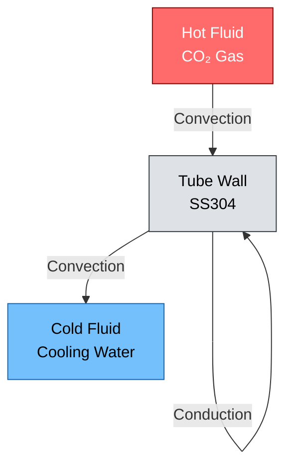

Dalam kondisi normal, tidak ada pencampuran antara CO₂ gas dan cooling water. Bila terjadi kebocoran tube, maka barrier antara process side dan cooling water side gagal, sehingga dapat terjadi cross leakage dan gangguan operasi.

## 3.2 Elemen Utama STHE

Komponen utama STHE dan fungsinya dapat diringkas sebagai berikut.

| Komponen            | Fungsi                                                   |
| ------------------- | -------------------------------------------------------- |
| Shell               | Menampung fluida shell side dan mengarahkan pola aliran  |
| Tube bundle         | Area utama perpindahan panas                             |
| Tube wall           | Barrier antara fluida panas dan fluida dingin            |
| Tube sheet          | Menahan tube dan memisahkan channel side dari shell side |
| Channel/head        | Distribusi fluida pada tube side                         |
| Baffle              | Mengarahkan aliran shell side dan mendukung tube         |
| Nozzle inlet/outlet | Jalur masuk dan keluar masing-masing fluida              |

Dalam konteks failure analysis, area seperti **tube wall**, **tube end**, **tube sheet**, dan **under-deposit region** menjadi sangat penting karena area tersebut sering menjadi lokasi awal pitting, crevice corrosion, atau mechanical damage.

## 3.3 Co-Current vs Counter-Current

Pada heat exchanger, arah relatif aliran fluida panas dan fluida dingin sangat menentukan profil temperatur dan efektivitas perpindahan panas.

### Co-current flow

Pada **co-current flow**, fluida panas dan fluida dingin masuk dari sisi yang sama dan mengalir ke arah yang sama.

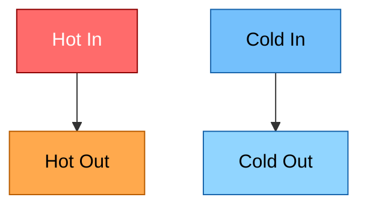

Pada co-current, perbedaan temperatur sangat besar di awal exchanger, tetapi cepat mengecil di sepanjang exchanger.

### Counter-current flow

Pada **counter-current flow**, fluida panas dan fluida dingin mengalir berlawanan arah.

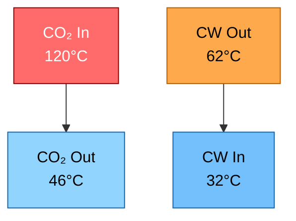

Untuk kasus ini, konfigurasi counter-current menghasilkan pasangan temperatur lokal sebagai berikut.

| Lokasi   |    Process Side | Cooling Water Side | Temperature Difference |
| -------- | --------------: | -----------------: | ---------------------: |
| Hot end  | CO₂ inlet 120°C |     CW outlet 62°C |                   58°C |
| Cold end | CO₂ outlet 46°C |      CW inlet 32°C |                   14°C |

Secara matematis:

$$
\Delta T_{\mathrm{hot\ end}} = T_{\mathrm{CO_2,in}} - T_{\mathrm{CW,out}}
$$

$$
\Delta T_{\mathrm{hot\ end}} = 120 - 62 = 58^\circ \mathrm{C}
$$

Dan:

$$
\Delta T_{\mathrm{cold\ end}} = T_{\mathrm{CO_2,out}} - T_{\mathrm{CW,in}}
$$

$$
\Delta T_{\mathrm{cold\ end}} = 46 - 32 = 14^\circ \mathrm{C}
$$

## 3.4 Mengapa Counter-Current Lebih Efektif

Counter-current arrangement umumnya lebih efektif dibanding co-current karena mampu mempertahankan **temperature driving force** yang lebih merata di sepanjang exchanger. Pada banyak aplikasi, counter-current memungkinkan outlet fluida panas mendekati inlet fluida dingin, selama area perpindahan panas cukup dan overall heat transfer coefficient memadai.

Untuk kasus ini, temperatur CO₂ outlet adalah:

$$
T_{\mathrm{CO_2,out}} = 46^\circ \mathrm{C}
$$

Sedangkan cooling water inlet adalah:

$$
T_{\mathrm{CW,in}} = 32^\circ \mathrm{C}
$$

Approach temperature pada cold end adalah:

$$
T_{\mathrm{approach}} = T_{\mathrm{CO_2,out}} - T_{\mathrm{CW,in}}
$$

$$
T_{\mathrm{approach}} = 46 - 32
$$

$$
T_{\mathrm{approach}} = 14^\circ \mathrm{C}
$$

Nilai approach 14°C masih realistis untuk STHE gas cooler, tetapi menunjukkan bahwa cold end memiliki driving force yang lebih kecil dibanding hot end.

## 3.5 Penentuan Hot End dan Cold End

Pada STHE counter-current, **hot end** bukan sekadar sisi process inlet. Hot end adalah lokasi di mana fluida panas berada pada temperatur tertinggi dan fluida dingin berada pada temperatur keluaran tertinggi.

Untuk data aktual:

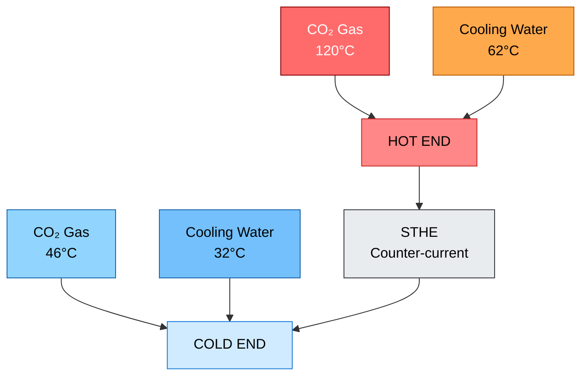

Maka:

$$
\mathrm{Hot\ End}: \quad 120^\circ \mathrm{C}\ \mathrm{CO_2} \leftrightarrow 62^\circ \mathrm{C}\ \mathrm{CW}
$$

$$
\mathrm{Cold\ End}: \quad 46^\circ \mathrm{C}\ \mathrm{CO_2} \leftrightarrow 32^\circ \mathrm{C}\ \mathrm{CW}
$$

Konsekuensi engineering-nya sangat penting:

$$
T_{\mathrm{wall,CW,hot\ end}} > 62^\circ \mathrm{C}
$$

Artinya, walaupun cooling water masuk pada 32°C, material tube di hot end tidak “melihat” 32°C. Material tube di hot end mengalami kondisi yang lebih berat, karena kontak termal lokalnya adalah cooling water sekitar 62°C dan CO₂ gas sekitar 120°C.

[**Kembali ke Atas**](#technical-review-and-improvement-study-of-counter-current-sthe-for-co-gas-cooling-heat-transfer-performance-ss304-pitting-risk-and-upgrade-strategy-to-ss316l)

---

# 4. Mekanisme Perpindahan Panas dari CO₂ ke Cooling Water

## 4.1 Jalur Perpindahan Panas

Perpindahan panas dari CO₂ gas ke cooling water terjadi karena adanya perbedaan temperatur. Pada hot end, temperatur bulk CO₂ gas adalah 120°C, sedangkan temperatur bulk cooling water outlet adalah 62°C.

Panas bergerak dari temperatur tinggi ke temperatur rendah melalui urutan berikut.

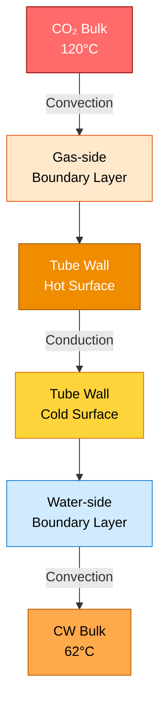

Urutan fisiknya adalah:

$$
\mathrm{CO_2\ bulk}
\rightarrow
\mathrm{gas\ film}
\rightarrow
\mathrm{tube\ wall}
\rightarrow
\mathrm{water\ film}
\rightarrow
\mathrm{cooling\ water\ bulk}
$$

## 4.2 Konveksi dari CO₂ Gas ke Dinding Tube

Pada sisi gas, panas berpindah dari bulk gas CO₂ ke permukaan tube melalui konveksi.

Persamaan dasar konveksi adalah:

$$
q'' = h_{\mathrm{gas}}
\left(
T_{\mathrm{CO_2,bulk}} - T_{\mathrm{wall,hot}}
\right)
$$

Keterangan:

| Simbol                   | Arti                                                     |
| ------------------------ | -------------------------------------------------------- |
| $q''$                    | Heat flux, $\mathrm{W/m^2}$                              |
| $h_{\mathrm{gas}}$       | Koefisien perpindahan panas sisi gas, $\mathrm{W/m^2.K}$ |
| $T_{\mathrm{CO_2,bulk}}$ | Temperatur bulk CO₂ lokal                                |
| $T_{\mathrm{wall,hot}}$  | Temperatur dinding tube sisi gas                         |

Untuk gas, nilai $h_{\mathrm{gas}}$ biasanya lebih rendah dibanding liquid karena densitas, thermal conductivity, dan heat capacity per volume gas lebih kecil dibanding air. Oleh karena itu, pada banyak gas cooler, gas-side film resistance dapat menjadi salah satu tahanan dominan.

## 4.3 Konduksi Menembus Dinding Tube SS304

Setelah panas mencapai permukaan tube sisi gas, panas mengalir menembus dinding tube melalui konduksi.

Persamaan konduksi sederhana untuk dinding tipis adalah:

$$
q'' = \frac{k_{\mathrm{tube}}}{\delta}
\left(
T_{\mathrm{wall,hot}} - T_{\mathrm{wall,CW}}
\right)
$$

Atau:

$$
T_{\mathrm{wall,hot}} - T_{\mathrm{wall,CW}}
=
q''
\frac{\delta}{k_{\mathrm{tube}}}
$$

Keterangan:

| Simbol                  | Arti                                        |
| ----------------------- | ------------------------------------------- |
| $k_{\mathrm{tube}}$     | Thermal conductivity tube, $\mathrm{W/m.K}$ |
| $\delta$                | Tebal tube, $\mathrm{m}$                    |
| $T_{\mathrm{wall,hot}}$ | Temperatur dinding sisi gas                 |
| $T_{\mathrm{wall,CW}}$  | Temperatur dinding sisi cooling water       |

Untuk SS304, nilai thermal conductivity pada rentang temperatur ini secara engineering dapat diambil sekitar:

$$
k_{\mathrm{SS304}} \approx 16.3\ \mathrm{W/m.K}
$$

Jika tube thickness diasumsikan:

$$
\delta = 1.65\ \mathrm{mm}
$$

Maka:

$$
\delta = 0.00165\ \mathrm{m}
$$

Tahanan konduksi dinding tube adalah:

$$
R_{\mathrm{wall}} = \frac{\delta}{k_{\mathrm{tube}}}
$$

$$
R_{\mathrm{wall}} = \frac{0.00165}{16.3}
$$

$$
R_{\mathrm{wall}} = 0.000101\ \mathrm{m^2.K/W}
$$

Nilai ini relatif kecil dibanding tahanan film gas atau fouling. Karena itu, perbedaan temperatur antara permukaan tube sisi gas dan permukaan tube sisi cooling water biasanya tidak terlalu besar, selama tube tidak terlalu tebal dan tidak ada deposit berat.

## 4.4 Konveksi dari Dinding Tube ke Cooling Water

Pada sisi cooling water, panas berpindah dari permukaan tube ke bulk cooling water melalui konveksi.

Persamaannya:

$$
q'' = h_{\mathrm{CW}}
\left(
T_{\mathrm{wall,CW}} - T_{\mathrm{CW,bulk}}
\right)
$$

Sehingga:

$$
T_{\mathrm{wall,CW}} =
T_{\mathrm{CW,bulk}} + \frac{q''}{h_{\mathrm{CW}}}
$$

Keterangan:

| Simbol                 | Arti                                                               |
| ---------------------- | ------------------------------------------------------------------ |
| $h_{\mathrm{CW}}$      | Koefisien perpindahan panas sisi cooling water, $\mathrm{W/m^2.K}$ |
| $T_{\mathrm{wall,CW}}$ | Temperatur dinding tube sisi cooling water                         |
| $T_{\mathrm{CW,bulk}}$ | Temperatur bulk cooling water lokal                                |

Pada hot end:

$$
T_{\mathrm{CW,bulk}} = 62^\circ \mathrm{C}
$$

Karena $\frac{q''}{h_{\mathrm{CW}}}$ bernilai positif, maka:

$$
T_{\mathrm{wall,CW}} > 62^\circ \mathrm{C}
$$

Ini adalah dasar termal mengapa risiko pitting harus dievaluasi terhadap metal temperature, bukan cooling water inlet temperature.

## 4.5 Thermal Resistance Network

Mekanisme perpindahan panas dapat direpresentasikan sebagai jaringan tahanan termal.

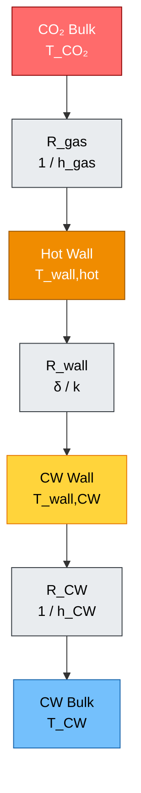

Total tahanan termal tanpa fouling adalah:

$$
R_{\mathrm{total}} =
\frac{1}{h_{\mathrm{gas}}}
+
\frac{\delta}{k_{\mathrm{tube}}}
+
\frac{1}{h_{\mathrm{CW}}}
$$

Jika fouling dimasukkan:

$$
R_{\mathrm{total}} =
\frac{1}{h_{\mathrm{gas}}}
+
R_{\mathrm{f,gas}}
+
\frac{\delta}{k_{\mathrm{tube}}}
+
R_{\mathrm{f,CW}}
+
\frac{1}{h_{\mathrm{CW}}}
$$

Overall heat transfer coefficient dapat ditulis sebagai:

$$
U = \frac{1}{R_{\mathrm{total}}}
$$

Dan heat flux lokal:

$$
q'' = U
\left(
T_{\mathrm{CO_2,local}} - T_{\mathrm{CW,local}}
\right)
$$

## 4.6 Mengapa Fouling Penting

Fouling pada cooling water side dapat berupa scale, corrosion product, suspended solid, biofilm, atau deposit lain. Fouling menambah tahanan termal:

$$
R_{\mathrm{total,new}} =
R_{\mathrm{total,clean}} + R_{\mathrm{f,CW}}
$$

Akibatnya, untuk duty yang sama, temperatur metal lokal dapat meningkat. Pada area deposit, chloride juga dapat terkonsentrasi secara lokal, sehingga risiko pitting meningkat.

Secara sederhana:

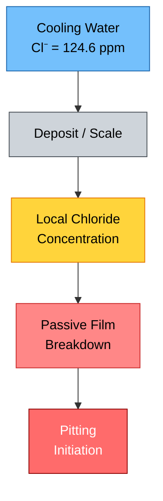

Karena itu, dalam kasus ini, chloride 124.6 ppm tidak boleh dievaluasi hanya sebagai angka bulk water. Yang lebih kritis adalah kemungkinan **local chloride concentration under deposit** pada metal temperature yang sudah lebih tinggi dari 62°C.

[**Kembali ke Atas**](#technical-review-and-improvement-study-of-counter-current-sthe-for-co-gas-cooling-heat-transfer-performance-ss304-pitting-risk-and-upgrade-strategy-to-ss316l)

---

# 5. Perhitungan Heat Transfer Berdasarkan Data Aktual

## 5.1 Basis Data Perhitungan

Data operasi yang digunakan:

| Parameter                        |                    Simbol |           Nilai |
| -------------------------------- | ------------------------: | --------------: |
| CO₂ mass flowrate                | $\dot{m}_{\mathrm{CO_2}}$ |      0.556 kg/s |
| CO₂ inlet temperature            |       $T_{\mathrm{h,in}}$ |           120°C |
| CO₂ outlet temperature           |      $T_{\mathrm{h,out}}$ |            46°C |
| Cooling water inlet temperature  |       $T_{\mathrm{c,in}}$ |            32°C |
| Cooling water outlet temperature |      $T_{\mathrm{c,out}}$ |            62°C |
| Chloride cooling water           |     $C_{\mathrm{Cl}^{-}}$ |       124.6 ppm |
| Flow arrangement                 |                         — | Counter-current |
| Existing tube material           |                         — |           SS304 |

Kapasitas CO₂:

$$
\dot{m}_{\mathrm{CO_2}} = 2\ \mathrm{ton/jam}
$$

$$
\dot{m}_{\mathrm{CO_2}} = 2000\ \mathrm{kg/jam}
$$

$$
\dot{m}_{\mathrm{CO_2}} =
\frac{2000}{3600}
$$

$$
\dot{m}_{\mathrm{CO_2}} = 0.556\ \mathrm{kg/s}
$$

Penurunan temperatur CO₂:

$$
\Delta T_{\mathrm{CO_2}} =
T_{\mathrm{h,in}} - T_{\mathrm{h,out}}
$$

$$
\Delta T_{\mathrm{CO_2}} = 120 - 46
$$

$$
\Delta T_{\mathrm{CO_2}} = 74^\circ \mathrm{C}
$$

## 5.2 Heat Duty dari Sisi CO₂

Untuk screening calculation, heat duty dari sisi CO₂ dapat dihitung dengan persamaan sensible heat:

$$
Q_{\mathrm{CO_2}} =
\dot{m}_{\mathrm{CO_2}}
C_{p,\mathrm{CO_2}}
\Delta T_{\mathrm{CO_2}}
$$

Nilai heat capacity CO₂ bergantung pada temperatur dan tekanan. Untuk perhitungan awal, digunakan nilai rata-rata engineering:

$$
C_{p,\mathrm{CO_2}} \approx 0.90\ \mathrm{kJ/kg.K}
$$

Maka:

$$
Q_{\mathrm{CO_2}} =
0.556
\times
0.90
\times
74
$$

$$
Q_{\mathrm{CO_2}} =
37.0\ \mathrm{kW}
$$

Jadi, estimasi duty sensible dari sisi CO₂ adalah:

$$
\boxed{
Q_{\mathrm{CO_2,sensible}} \approx 37\ \mathrm{kW}
}
$$

Untuk memperlihatkan sensitivitas terhadap nilai $C_p$, tabel berikut dapat digunakan.

| $C_{p,\mathrm{CO_2}}$ | $Q_{\mathrm{CO_2}}$ |
| --------------------: | ------------------: |
|          0.85 kJ/kg.K |             35.0 kW |
|          0.90 kJ/kg.K |             37.0 kW |
|          0.95 kJ/kg.K |             39.1 kW |
|          1.00 kJ/kg.K |             41.1 kW |

Sehingga dalam artikel ini dapat digunakan rentang:

$$
\boxed{
Q_{\mathrm{CO_2,sensible}} \approx 35 - 41\ \mathrm{kW}
}
$$

dengan nilai nominal:

$$
\boxed{
Q_{\mathrm{CO_2,sensible}} \approx 37\ \mathrm{kW}
}
$$

## 5.3 Cooling Water Heat Balance

Cooling water naik dari 32°C menjadi 62°C:

$$
\Delta T_{\mathrm{CW}} =
T_{\mathrm{CW,out}} - T_{\mathrm{CW,in}}
$$

$$
\Delta T_{\mathrm{CW}} =
62 - 32
$$

$$
\Delta T_{\mathrm{CW}} =
30^\circ \mathrm{C}
$$

Heat balance dari sisi cooling water adalah:

$$
Q_{\mathrm{CW}} =
\dot{m}_{\mathrm{CW}}
C_{p,\mathrm{CW}}
\Delta T_{\mathrm{CW}}
$$

Dengan:

$$
C_{p,\mathrm{CW}} \approx 4.18\ \mathrm{kJ/kg.K}
$$

Jika duty yang diserap cooling water sama dengan duty CO₂ sebesar 37 kW, maka estimasi mass flow cooling water adalah:

$$
\dot{m}_{\mathrm{CW}} =
\frac{Q}{C_{p,\mathrm{CW}}\Delta T_{\mathrm{CW}}}
$$

$$
\dot{m}_{\mathrm{CW}} =
\frac{37}{4.18 \times 30}
$$

$$
\dot{m}_{\mathrm{CW}} =
0.295\ \mathrm{kg/s}
$$

Konversi ke kg/jam:

$$
\dot{m}_{\mathrm{CW}} =
0.295 \times 3600
$$

$$
\dot{m}_{\mathrm{CW}} =
1062\ \mathrm{kg/jam}
$$

Dengan asumsi densitas air mendekati:

$$
\rho_{\mathrm{water}} \approx 1000\ \mathrm{kg/m^3}
$$

maka:

$$
\dot{V}_{\mathrm{CW}} \approx 1.06\ \mathrm{m^3/jam}
$$

Sehingga:

$$
\boxed{
\dot{V}_{\mathrm{CW,estimated}} \approx 1.06\ \mathrm{m^3/jam}
}
$$

## 5.4 Validasi Energy Balance

Hasil ini memberikan insight penting. Bila cooling water benar-benar naik sebesar 30°C dan duty CO₂ sekitar 37 kW, maka cooling water flow yang konsisten hanya sekitar 1.06 m³/jam.

| Flow CW Aktual | Duty Berdasarkan $\Delta T_{\mathrm{CW}} = 30^\circ\mathrm{C}$ |
| -------------: | -------------------------------------------------------------: |
|       1 m³/jam |                                                        34.8 kW |
|       2 m³/jam |                                                        69.7 kW |
|       5 m³/jam |                                                         174 kW |
|      10 m³/jam |                                                         348 kW |

Perhitungan duty untuk cooling water dapat ditulis:

$$
Q_{\mathrm{CW}} =
\dot{m}_{\mathrm{CW}}
C_{p,\mathrm{CW}}
\Delta T_{\mathrm{CW}}
$$

Untuk 1 m³/jam:

$$
\dot{m}_{\mathrm{CW}} =
\frac{1000}{3600}
=
0.278\ \mathrm{kg/s}
$$

$$
Q_{\mathrm{CW}} =
0.278
\times
4.18
\times
30
$$

$$
Q_{\mathrm{CW}} =
34.8\ \mathrm{kW}
$$

Maka, jika flow cooling water aktual jauh lebih besar dari 1 m³/jam, misalnya 5–10 m³/jam, data temperatur harus diverifikasi ulang karena duty dari sisi cooling water akan jauh lebih besar daripada duty sensible CO₂.

Kemungkinan penyebab mismatch energy balance antara lain:

| Kemungkinan                                 | Penjelasan                                                            |
| ------------------------------------------- | --------------------------------------------------------------------- |
| Cooling water flow aktual belum tervalidasi | Flow indicator mungkin tidak tersedia atau tidak akurat               |
| Temperature transmitter error               | Sensor bisa drift, salah lokasi, atau tidak mewakili bulk temperature |
| Tidak steady-state                          | Data diambil saat operasi transien                                    |
| Ada heat duty tambahan                      | Misalnya kondensasi komponen sebelum separator                        |
| Mixing atau bypass                          | Terjadi pencampuran cooling water yang tidak terukur                  |
| Fouling/maldistribution                     | Area efektif heat transfer berubah                                    |

## 5.5 LMTD Counter-Current

Untuk counter-current heat exchanger, temperature difference di kedua ujung exchanger adalah:

$$
\Delta T_1 =
T_{\mathrm{h,in}} - T_{\mathrm{c,out}}
$$

$$
\Delta T_1 =
120 - 62
$$

$$
\Delta T_1 =
58^\circ \mathrm{C}
$$

Dan:

$$
\Delta T_2 =
T_{\mathrm{h,out}} - T_{\mathrm{c,in}}
$$

$$
\Delta T_2 =
46 - 32
$$

$$
\Delta T_2 =
14^\circ \mathrm{C}
$$

Log Mean Temperature Difference atau LMTD:

$$
\Delta T_{\mathrm{lm}} =
\frac{
\Delta T_1 - \Delta T_2
}{
\ln\left(
\frac{\Delta T_1}{\Delta T_2}
\right)
}
$$

Substitusi nilai:

$$
\Delta T_{\mathrm{lm}} =
\frac{
58 - 14
}{
\ln\left(
\frac{58}{14}
\right)
}
$$

$$
\Delta T_{\mathrm{lm}} =
\frac{44}{\ln(4.143)}
$$

$$
\Delta T_{\mathrm{lm}} =
31.0^\circ \mathrm{C}
$$

Sehingga:

$$
\boxed{
\Delta T_{\mathrm{lm}} \approx 31^\circ \mathrm{C}
}
$$

Diagram mobile-friendly untuk LMTD:

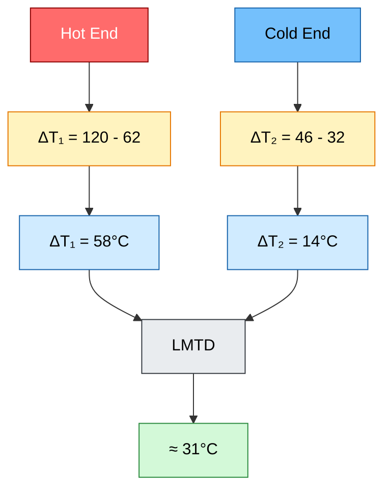

## 5.6 Actual UA

Hubungan dasar heat exchanger:

$$
Q =
U A \Delta T_{\mathrm{lm}}
$$

Produk $U A$ dapat dihitung sebagai:

$$
U A =
\frac{Q}{\Delta T_{\mathrm{lm}}}
$$

Dengan duty nominal:

$$
Q = 37\ \mathrm{kW}
$$

dan:

$$
\Delta T_{\mathrm{lm}} = 31^\circ \mathrm{C}
$$

maka:

$$
U A =
\frac{37}{31}
$$

$$
U A =
1.19\ \mathrm{kW/K}
$$

Sehingga:

$$
\boxed{
U A_{\mathrm{actual}} \approx 1.19\ \mathrm{kW/K}
}
$$

Sensitivity terhadap duty:

|  Duty |      $UA$ |
| ----: | --------: |
| 35 kW | 1.13 kW/K |
| 37 kW | 1.19 kW/K |
| 41 kW | 1.32 kW/K |

Untuk artikel, nilai yang wajar digunakan adalah:

$$
\boxed{
UA_{\mathrm{actual}} \approx 1.1 - 1.3\ \mathrm{kW/K}
}
$$

## 5.7 Estimasi Required Heat Transfer Area

Jika nilai overall heat transfer coefficient diasumsikan dalam beberapa skenario, maka area yang diperlukan dapat dihitung:

$$
A =
\frac{UA}{U}
$$

Gunakan:

$$
UA = 1.19\ \mathrm{kW/K}
$$

Jika:

$$
U = 100\ \mathrm{W/m^2.K}
=
0.100\ \mathrm{kW/m^2.K}
$$

maka:

$$
A =
\frac{1.19}{0.100}
$$

$$
A =
11.9\ \mathrm{m^2}
$$

Tabel estimasi area:

| Assumed $U$ | Required Area $A$ |
| ----------: | ----------------: |
|  100 W/m².K |           11.9 m² |
|  150 W/m².K |            7.9 m² |
|  200 W/m².K |            6.0 m² |
|  300 W/m².K |            4.0 m² |

Interpretasi:

1. Jika actual heat transfer area dari datasheet jauh lebih besar dari nilai ini, maka kemungkinan $U$ aktual lebih rendah karena gas-side limitation, fouling, atau maldistribution.
2. Jika actual area jauh lebih kecil, maka data operasi atau asumsi $C_p$ perlu diverifikasi ulang.
3. Nilai ini harus dibandingkan dengan datasheet STHE untuk melakukan thermal rerating.

## 5.8 Estimasi Hot-End Tube Wall Temperature

Tujuan bagian ini adalah memperkirakan temperatur dinding tube di hot end, karena parameter inilah yang paling relevan terhadap risiko pitting SS304.

Data hot end:

$$
T_{\mathrm{CO_2,hot\ end}} = 120^\circ \mathrm{C}
$$

$$
T_{\mathrm{CW,hot\ end}} = 62^\circ \mathrm{C}
$$

Maka:

$$
\Delta T_{\mathrm{hot\ end}} = 58^\circ \mathrm{C}
$$

Asumsi screening:

| Parameter            |            Nilai |
| -------------------- | ---------------: |
| Tube material        |            SS304 |
| Tube thickness       |          1.65 mm |
| $k_{\mathrm{SS304}}$ |       16.3 W/m.K |
| $h_{\mathrm{CW}}$    |      3000 W/m².K |
| $h_{\mathrm{gas}}$   |  100–1000 W/m².K |
| Fouling              | Belum dimasukkan |

Total resistance:

$$
R_{\mathrm{total}} =
\frac{1}{h_{\mathrm{gas}}}
+
\frac{\delta}{k}
+
\frac{1}{h_{\mathrm{CW}}}
$$

Wall temperature sisi cooling water:

$$
T_{\mathrm{wall,CW}} =
T_{\mathrm{CW,bulk}} +
\frac{q''}{h_{\mathrm{CW}}}
$$

Heat flux lokal:

$$
q'' =
\frac{
T_{\mathrm{CO_2,bulk}} - T_{\mathrm{CW,bulk}}
}{
R_{\mathrm{total}}
}
$$

### Case 1 — $h_{\mathrm{gas}} = 100\ \mathrm{W/m^2.K}$

$$
R_{\mathrm{gas}} = \frac{1}{100}
=
0.0100\ \mathrm{m^2.K/W}
$$

$$
R_{\mathrm{wall}} =
\frac{0.00165}{16.3}
=
0.000101\ \mathrm{m^2.K/W}
$$

$$
R_{\mathrm{CW}} =
\frac{1}{3000}
=
0.000333\ \mathrm{m^2.K/W}
$$

$$
R_{\mathrm{total}} =
0.0100 + 0.000101 + 0.000333
$$

$$
R_{\mathrm{total}} =
0.010434\ \mathrm{m^2.K/W}
$$

$$
q'' =
\frac{58}{0.010434}
$$

$$
q'' =
5560\ \mathrm{W/m^2}
$$

$$
T_{\mathrm{wall,CW}} =
62 +
\frac{5560}{3000}
$$

$$
T_{\mathrm{wall,CW}} =
63.9^\circ \mathrm{C}
$$

### Case 2 — $h_{\mathrm{gas}} = 300\ \mathrm{W/m^2.K}$

$$
R_{\mathrm{gas}} =
\frac{1}{300}
=
0.003333\ \mathrm{m^2.K/W}
$$

$$
R_{\mathrm{total}} =
0.003333 + 0.000101 + 0.000333
$$

$$
R_{\mathrm{total}} =
0.003767\ \mathrm{m^2.K/W}
$$

$$
q'' =
\frac{58}{0.003767}
$$

$$
q'' =
15397\ \mathrm{W/m^2}
$$

$$
T_{\mathrm{wall,CW}} =
62 +
\frac{15397}{3000}
$$

$$
T_{\mathrm{wall,CW}} =
67.1^\circ \mathrm{C}
$$

### Case 3 — $h_{\mathrm{gas}} = 1000\ \mathrm{W/m^2.K}$

$$
R_{\mathrm{gas}} =
\frac{1}{1000}
=
0.001000\ \mathrm{m^2.K/W}
$$

$$
R_{\mathrm{total}} =
0.001000 + 0.000101 + 0.000333
$$

$$
R_{\mathrm{total}} =
0.001434\ \mathrm{m^2.K/W}
$$

$$
q'' =
\frac{58}{0.001434}
$$

$$
q'' =
40446\ \mathrm{W/m^2}
$$

$$
T_{\mathrm{wall,CW}} =
62 +
\frac{40446}{3000}
$$

$$
T_{\mathrm{wall,CW}} =
75.5^\circ \mathrm{C}
$$

Ringkasan hasil:

| $h_{\mathrm{gas}}$ |      $q''$ | $T_{\mathrm{wall,CW}}$ |
| -----------------: | ---------: | ---------------------: |
|         100 W/m².K |  5.6 kW/m² |                 63.9°C |
|         300 W/m².K | 15.4 kW/m² |                 67.1°C |
|        1000 W/m².K | 40.4 kW/m² |                 75.5°C |

Sehingga:

$$
\boxed{
T_{\mathrm{wall,CW,hot\ end}}
\approx
64 - 76^\circ \mathrm{C}
}
$$

Nilai ini belum memasukkan fouling. Jika terdapat deposit di sisi cooling water, temperatur metal lokal di bawah deposit dapat lebih tinggi.

## 5.9 Implikasi Termal terhadap Risiko Material

Dari sisi heat transfer, kesimpulan Bab 5 adalah:

$$
Q_{\mathrm{CO_2,sensible}}
\approx
37\ \mathrm{kW}
$$

$$
\Delta T_{\mathrm{lm}}
\approx
31^\circ \mathrm{C}
$$

$$
UA_{\mathrm{actual}}
\approx
1.19\ \mathrm{kW/K}
$$

$$
T_{\mathrm{wall,CW,hot\ end}}
\approx
64 - 76^\circ \mathrm{C}
$$

Dengan chloride cooling water:

$$
C_{\mathrm{Cl}^{-}}
=
124.6\ \mathrm{ppm}
$$

maka kondisi aktual yang perlu dievaluasi untuk SS304 adalah:

$$
C_{\mathrm{Cl}^{-}} = 124.6\ \mathrm{ppm}
$$

pada:

$$
T_{\mathrm{metal}} \approx 64 - 76^\circ \mathrm{C}
$$

bukan pada cooling water inlet:

$$
T_{\mathrm{CW,in}} = 32^\circ \mathrm{C}
$$

Ini adalah poin utama yang harus dipahami engineer muda: **risiko pitting dikendalikan oleh kombinasi chloride dan metal temperature lokal, bukan hanya oleh temperatur inlet cooling water.**

---

## Key Takeaways Bab 3–5

1. STHE bekerja dengan mekanisme konveksi, konduksi, dan konveksi.
2. Karena arrangement adalah counter-current, hot end adalah lokasi CO₂ 120°C berhadapan dengan cooling water 62°C.
3. LMTD aktual counter-current adalah sekitar $31^\circ \mathrm{C}$.
4. Dengan flow CO₂ 2 ton/jam dan $C_{p,\mathrm{CO_2}} \approx 0.90\ \mathrm{kJ/kg.K}$, duty sensible CO₂ adalah sekitar 37 kW.
5. Cooling water flow yang konsisten dengan duty 37 kW dan kenaikan temperatur 30°C adalah sekitar 1.06 m³/jam.
6. Actual $UA$ diperkirakan sekitar 1.19 kW/K.
7. Temperatur tube wall sisi cooling water di hot end diperkirakan sekitar 64–76°C tanpa fouling.
8. Evaluasi pitting SS304 harus menggunakan kombinasi chloride 124.6 ppm dan metal temperature 64–76°C, bukan cooling water inlet 32°C.

[**Kembali ke Atas**](#technical-review-and-improvement-study-of-counter-current-sthe-for-co-gas-cooling-heat-transfer-performance-ss304-pitting-risk-and-upgrade-strategy-to-ss316l)

---

# 6. Role of Downstream Separator and Possible Condensation Duty

## 6.1 Kenapa Liquid Separator Setelah STHE Penting

Pada sistem ini, STHE tidak berdiri sendiri sebagai heat exchanger biasa. STHE berada di antara **1st stage compressor** dan **liquid separator**, kemudian gas $\mathrm{CO_2}$ masuk ke **2nd stage compressor**.

Urutan prosesnya adalah:

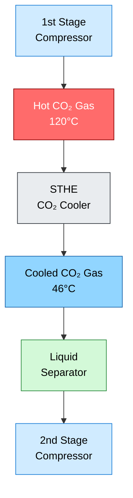

Keberadaan separator setelah STHE menunjukkan bahwa pendinginan gas $\mathrm{CO_2}$ berpotensi menghasilkan liquid. Liquid tersebut dapat berasal dari moisture, condensable impurity, atau komponen lain yang terkondensasi setelah temperatur gas turun dari:

$$
T_{\mathrm{CO_2,in}} = 120^\circ \mathrm{C}
$$

menjadi:

$$
T_{\mathrm{CO_2,out}} = 46^\circ \mathrm{C}
$$

Karena itu, heat duty STHE tidak boleh langsung diasumsikan hanya sebagai **sensible heat removal** dari gas $\mathrm{CO_2}$. Bila terdapat kondensasi, maka STHE juga harus membuang **latent heat** dari komponen yang berubah fase dari vapor menjadi liquid.

## 6.2 Sensible Duty vs Total Duty

Pada Bab 5, heat duty dihitung berdasarkan pendinginan sensible gas $\mathrm{CO_2}$:

$$
Q_{\mathrm{sensible,CO_2}}
=
\dot{m}_{\mathrm{CO_2}}
C_{p,\mathrm{CO_2}}
\Delta T_{\mathrm{CO_2}}
$$

Dengan data:

$$
\dot{m}_{\mathrm{CO_2}} = 0.556\ \mathrm{kg/s}
$$

$$
C_{p,\mathrm{CO_2}} \approx 0.90\ \mathrm{kJ/kg.K}
$$

$$
\Delta T_{\mathrm{CO_2}} = 74^\circ \mathrm{C}
$$

Maka:

$$
Q_{\mathrm{sensible,CO_2}}
=
0.556
\times
0.90
\times
74
$$

$$
Q_{\mathrm{sensible,CO_2}}
\approx
37\ \mathrm{kW}
$$

Namun, nilai tersebut hanya mewakili **minimum sensible duty** bila fluida yang didinginkan hanya berupa gas $\mathrm{CO_2}$ tanpa adanya kondensasi.

Jika terjadi kondensasi, maka total duty STHE menjadi:

$$
Q_{\mathrm{total}}
=
Q_{\mathrm{sensible,CO_2}}
+
Q_{\mathrm{latent,condensation}}
+
Q_{\mathrm{sensible,condensate}}
$$

Keterangan:

| Komponen Duty               | Persamaan Umum                                                                                          | Makna                                                 |
| --------------------------- | ------------------------------------------------------------------------------------------------------- | ----------------------------------------------------- |
| Sensible gas cooling        | $Q_{\mathrm{sensible,CO_2}} = \dot{m}_{\mathrm{CO_2}} C_{p,\mathrm{CO_2}} \Delta T_{\mathrm{CO_2}}$     | Panas untuk menurunkan temperatur gas $\mathrm{CO_2}$ |
| Latent condensation         | $Q_{\mathrm{latent,condensation}} = \dot{m}_{\mathrm{cond}} \lambda_{\mathrm{cond}}$                    | Panas yang dilepas saat vapor menjadi liquid          |
| Sensible condensate cooling | $Q_{\mathrm{sensible,condensate}} = \dot{m}_{\mathrm{cond}} C_{p,\mathrm{liq}} \Delta T_{\mathrm{liq}}$ | Panas untuk menurunkan temperatur liquid condensate   |

Dengan demikian:

$$
Q_{\mathrm{total}} \geq Q_{\mathrm{sensible,CO_2}}
$$

Atau secara praktis:

$$
Q_{\mathrm{total}} \geq 37\ \mathrm{kW}
$$

Jika terdapat liquid yang signifikan di separator, maka nilai aktual $Q_{\mathrm{total}}$ dapat lebih besar daripada $37\ \mathrm{kW}$.

## 6.3 Mekanisme Pembentukan Liquid Setelah Pendinginan

Pendinginan gas setelah kompresor dapat menyebabkan temperatur gas turun melewati dew point komponen tertentu. Bila hal ini terjadi, sebagian vapor akan berubah menjadi liquid.

Diagram konseptualnya adalah sebagai berikut.

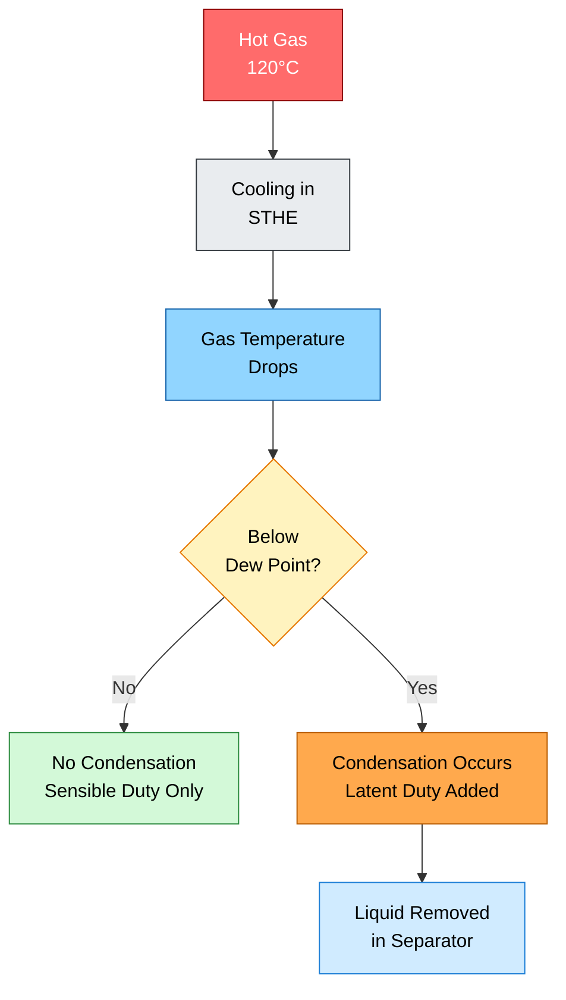

Dalam konteks sistem kompresi $\mathrm{CO_2}$, potensi liquid dapat berasal dari beberapa sumber:

| Potensi Sumber Liquid          | Penjelasan                                                                                  |
| ------------------------------ | ------------------------------------------------------------------------------------------- |
| Water vapor                    | Moisture yang ikut terbawa dalam gas dan terkondensasi saat temperatur turun                |
| Process contaminant            | Komponen kondensabel dari upstream process                                                  |
| Entrained liquid               | Liquid carry-over dari upstream equipment                                                   |
| Corrosion product atau deposit | Bukan liquid proses, tetapi dapat terbawa dan terkumpul di separator                        |
| Cooling water leakage          | Jika tube bocor, cooling water dapat masuk ke process side tergantung pressure differential |

Poin terakhir sangat penting pada kasus kebocoran. Bila tube leak terjadi, separator dapat menerima liquid yang bukan berasal dari kondensasi normal, tetapi dari cooling water ingress atau cross-contamination.

## 6.4 Dampak Condensation Duty terhadap Heat Balance

Pada Bab 5, estimasi cooling water flow yang konsisten dengan duty $37\ \mathrm{kW}$ dan kenaikan temperatur cooling water $30^\circ \mathrm{C}$ adalah:

$$
\dot{V}_{\mathrm{CW,estimated}}
\approx
1.06\ \mathrm{m^3/h}
$$

Nilai ini berasal dari:

$$
\dot{m}_{\mathrm{CW}}
=
\frac{Q}{C_{p,\mathrm{CW}}\Delta T_{\mathrm{CW}}}
$$

Jika $Q$ aktual lebih besar karena adanya condensation duty, maka cooling water flow yang konsisten juga akan lebih besar.

Sebagai contoh, jika total duty menjadi:

$$
Q_{\mathrm{total}} = 50\ \mathrm{kW}
$$

maka:

$$
\dot{m}_{\mathrm{CW}}
=
\frac{50}{4.18 \times 30}
$$

$$
\dot{m}_{\mathrm{CW}}
=
0.399\ \mathrm{kg/s}
$$

Konversi ke volumetric flow:

$$
\dot{V}_{\mathrm{CW}}
\approx
0.399 \times 3.6
$$

$$
\dot{V}_{\mathrm{CW}}
\approx
1.44\ \mathrm{m^3/h}
$$

Jika:

$$
Q_{\mathrm{total}} = 75\ \mathrm{kW}
$$

maka:

$$
\dot{m}_{\mathrm{CW}}
=
\frac{75}{4.18 \times 30}
$$

$$
\dot{m}_{\mathrm{CW}}
=
0.598\ \mathrm{kg/s}
$$

$$
\dot{V}_{\mathrm{CW}}
\approx
2.15\ \mathrm{m^3/h}
$$

Ringkasan sensitivitas:

| $Q_{\mathrm{total}}$ | $\dot{m}_{\mathrm{CW}}$ | $\dot{V}_{\mathrm{CW}}$ |
| -------------------: | ----------------------: | ----------------------: |
|    $37\ \mathrm{kW}$ |  $0.295\ \mathrm{kg/s}$ |  $1.06\ \mathrm{m^3/h}$ |
|    $50\ \mathrm{kW}$ |  $0.399\ \mathrm{kg/s}$ |  $1.44\ \mathrm{m^3/h}$ |
|    $75\ \mathrm{kW}$ |  $0.598\ \mathrm{kg/s}$ |  $2.15\ \mathrm{m^3/h}$ |
|   $100\ \mathrm{kW}$ |  $0.797\ \mathrm{kg/s}$ |  $2.87\ \mathrm{m^3/h}$ |

Interpretasinya:

> Bila actual cooling water flow jauh lebih besar daripada $1.06\ \mathrm{m^3/h}$, maka kemungkinan ada heat duty tambahan, data temperatur tidak steady-state, flow measurement tidak akurat, atau ada fenomena kondensasi yang belum diperhitungkan.

## 6.5 Data Tambahan yang Perlu Dikumpulkan

Untuk memastikan apakah duty STHE hanya sensible duty atau juga melibatkan condensation duty, beberapa data tambahan wajib dikumpulkan.

| Data                                         | Tujuan                                                                                     |
| -------------------------------------------- | ------------------------------------------------------------------------------------------ |
| Pressure $\mathrm{CO_2}$ discharge 1st stage | Menentukan properti aktual $\mathrm{CO_2}$, densitas, $C_p$, dan dew point                 |
| Komposisi gas $\mathrm{CO_2}$                | Menentukan $C_{p,\mathrm{mix}}$, dew point, dan potensi kondensasi                         |
| Flow liquid dari separator                   | Menghitung $Q_{\mathrm{latent,condensation}}$                                              |
| Komposisi liquid                             | Menentukan apakah liquid berupa water, condensate, contaminant, atau cooling water ingress |
| Pressure drop STHE                           | Indikasi fouling, blockage, maldistribution, atau perubahan hydraulic resistance           |
| Flow cooling water aktual                    | Validasi heat balance sisi cooling water                                                   |
| Temperatur separator inlet/outlet            | Verifikasi apakah terjadi pendinginan atau kondensasi lanjutan                             |
| Pressure separator                           | Membantu menentukan phase envelope dan dew point                                           |
| Conductivity liquid separator                | Indikasi apakah liquid mengandung cooling water atau garam terlarut                        |
| Chloride liquid separator                    | Membantu mengidentifikasi kemungkinan cooling water ingress                                |

## 6.6 Practical Engineering Interpretation

Untuk engineer muda, poin pentingnya adalah:

1. Nilai $37\ \mathrm{kW}$ adalah **minimum heat duty** berdasarkan sensible cooling gas $\mathrm{CO_2}$.
2. Adanya liquid separator setelah STHE menunjukkan kemungkinan adanya liquid formation.
3. Bila liquid terbentuk karena kondensasi, maka ada tambahan latent duty.
4. Bila liquid muncul akibat tube leak, maka separator dapat menerima cooling water ingress.
5. Heat balance harus ditutup dari dua sisi: process side dan cooling water side.
6. Data flow cooling water aktual dan flow liquid separator sangat penting untuk memvalidasi kondisi operasi.

Secara sederhana:

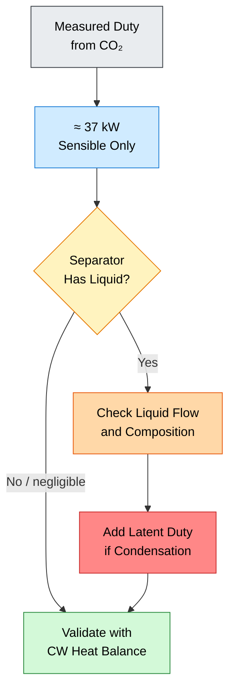

Kesimpulan Bab 6:

$$
\boxed{
Q_{\mathrm{sensible,CO_2}}
\approx
37\ \mathrm{kW}
}
$$

namun:

$$
\boxed{
Q_{\mathrm{total}}
=
Q_{\mathrm{sensible,CO_2}}
+
Q_{\mathrm{latent,condensation}}
+
Q_{\mathrm{sensible,condensate}}
}
$$

Sehingga:

$$
\boxed{
Q_{\mathrm{total}}
\geq
37\ \mathrm{kW}
}
$$

[**Kembali ke Atas**](#technical-review-and-improvement-study-of-counter-current-sthe-for-co₂-gas-cooling)

---

# 7. SS304 Resistance to Chloride and Pitting Mechanism

## 7.1 Data Chloride Aktual

Data cooling water menunjukkan chloride concentration sebesar:

$$
C_{\mathrm{Cl}^{-}} = 124.6\ \mathrm{ppm}
$$

Untuk air, satuan $\mathrm{ppm}$ secara praktis dapat diperlakukan mendekati $\mathrm{mg/L}$ untuk konsentrasi dilute aqueous solution, sehingga:

$$
C_{\mathrm{Cl}^{-}}
\approx
124.6\ \mathrm{mg/L}
$$

Nilai chloride ini tidak ekstrem bila dilihat secara isolated. Namun, chloride tidak boleh dievaluasi sendirian. Risiko pitting stainless steel dipengaruhi oleh kombinasi beberapa faktor, termasuk chloride level, temperatur, oxygen level, flow rate, dan aktivitas biologis atau bacterial oxidants. BSSA menyebut faktor-faktor seperti chloride level, temperature, oxygen level, water flow rate, dan bacterial oxidants sebagai faktor yang mempromosikan korosi stainless steel di lingkungan air. ([British Stainless Steel Association][1])

Pada kasus STHE ini, faktor yang paling penting adalah kombinasi:

$$
C_{\mathrm{Cl}^{-}} = 124.6\ \mathrm{ppm}
$$

dengan:

$$
T_{\mathrm{wall,CW,hot\ end}} > 62^\circ \mathrm{C}
$$

dan berdasarkan estimasi screening:

$$
T_{\mathrm{wall,CW,hot\ end}}
\approx
64 - 76^\circ \mathrm{C}
$$

Dengan demikian, kondisi yang harus dievaluasi bukan:

$$
C_{\mathrm{Cl}^{-}} = 124.6\ \mathrm{ppm}
\quad \mathrm{pada} \quad
T_{\mathrm{CW,in}} = 32^\circ \mathrm{C}
$$

melainkan:

$$
C_{\mathrm{Cl}^{-}} = 124.6\ \mathrm{ppm}
\quad \mathrm{pada} \quad
T_{\mathrm{metal}} \approx 64 - 76^\circ \mathrm{C}
$$

Ini adalah perbedaan interpretasi yang sangat penting.

## 7.2 Kenapa SS304 Rentan terhadap Chloride

SS304 adalah austenitic stainless steel yang memperoleh ketahanan korosi dari passive film berbasis chromium oxide pada permukaan logam. Passive film ini sangat tipis, tetapi stabil pada banyak lingkungan netral dan mildly corrosive.

Namun, ion chloride $\mathrm{Cl}^{-}$ dapat menyebabkan kerusakan lokal pada passive film. Ketika passive film rusak secara lokal, area kecil pada permukaan logam menjadi anodic, sedangkan area sekitarnya tetap passive dan cathodic. Perbedaan elektrokimia lokal ini menyebabkan serangan korosi yang sangat terfokus.

Mekanisme ini disebut **pitting corrosion**.

Secara sederhana:

$$
\mathrm{SS304}
+
\mathrm{Cl}^{-}
+
T_{\mathrm{metal}}\ \mathrm{tinggi}
+
\mathrm{deposit/crevice}
\rightarrow
\mathrm{pitting\ risk}
$$

Untuk SS304, panduan stainless steel menyebutkan bahwa material ini dianggap tahan terhadap pitting corrosion dalam potable water sampai sekitar $200\ \mathrm{mg/L}$ chloride pada temperatur ambient, tetapi turun menjadi sekitar $150\ \mathrm{mg/L}$ pada $60^\circ \mathrm{C}$. Sumber yang sama menyatakan bahwa SS304 rentan terhadap pitting dan crevice corrosion pada warm chloride environment serta chloride stress corrosion cracking pada temperatur di atas sekitar $60^\circ \mathrm{C}$. ([worldstainless][2])

Dengan data aktual:

```text
Chloride bulk       = 124.6 ppm
CW outlet bulk      = 62°C
Estimated wall temp = 64–76°C
Material existing   = SS304
```

interpretasinya adalah:

$$
\boxed{
\mathrm{SS304\ berada\ pada\ kondisi\ borderline\ sampai\ berisiko}
}
$$

Terutama bila terdapat faktor tambahan seperti:

| Faktor Akselerator              | Dampak terhadap Pitting                                              |
| ------------------------------- | -------------------------------------------------------------------- |
| Deposit atau scale              | Menyebabkan under-deposit corrosion dan local chloride concentration |
| Crevice di tube sheet           | Membentuk differential aeration cell dan chloride concentration cell |
| Low velocity cooling water      | Memudahkan deposit dan mengurangi flushing                           |
| Residual chlorine atau oxidizer | Menaikkan corrosion potential                                        |
| pH rendah                       | Mempercepat metal dissolution di dalam pit                           |
| Biofouling atau MIC             | Mendorong localized corrosion dan deposit biologis                   |
| Local evaporation/concentration | Menaikkan chloride lokal di permukaan metal                          |

## 7.3 Interpretasi Chloride $124.6\ \mathrm{ppm}$ pada Temperatur Metal $64-76^\circ \mathrm{C}$

Bulk chloride sebesar:

$$
C_{\mathrm{Cl}^{-}} = 124.6\ \mathrm{ppm}
$$

secara angka terlihat lebih rendah dari panduan umum SS304 sekitar:

$$
150\ \mathrm{mg/L}
\quad \mathrm{pada} \quad
60^\circ \mathrm{C}
$$

Namun, pada kasus ini terdapat beberapa alasan mengapa kondisi tetap berisiko.

### Alasan 1 — Temperatur Metal Lebih Tinggi dari $60^\circ \mathrm{C}$

Estimasi hot-end wall temperature adalah:

$$
T_{\mathrm{wall,CW,hot\ end}}
\approx
64 - 76^\circ \mathrm{C}
$$

Ini berarti metal temperature sudah berada di atas titik referensi $60^\circ \mathrm{C}$ yang sering digunakan dalam panduan material. Pada temperatur lebih tinggi, passive film lebih mudah breakdown dan pit growth cenderung lebih cepat.

### Alasan 2 — Cooling Water Bulk Tidak Sama dengan Kondisi Lokal Under Deposit

Bulk chloride:

$$
C_{\mathrm{Cl}^{-},bulk} = 124.6\ \mathrm{ppm}
$$

dapat menjadi jauh lebih tinggi secara lokal di bawah deposit atau crevice. Dalam kondisi under-deposit, terjadi restricted mass transfer sehingga ion chloride dapat terkonsentrasi di area kecil.

Secara konseptual:

$$
C_{\mathrm{Cl}^{-},local}

>

C_{\mathrm{Cl}^{-},bulk}
$$

Maka walaupun nilai bulk hanya $124.6\ \mathrm{ppm}$, nilai lokal di bawah deposit dapat lebih agresif.

### Alasan 3 — Hot End adalah Area dengan Thermal Severity Tertinggi

Pada hot end:

$$
T_{\mathrm{CO_2,bulk}} = 120^\circ \mathrm{C}
$$

$$
T_{\mathrm{CW,bulk}} = 62^\circ \mathrm{C}
$$

dan:

$$
T_{\mathrm{wall,CW}} > 62^\circ \mathrm{C}
$$

Dengan demikian, hot end adalah lokasi paling mungkin untuk mengalami pitting jika material, water chemistry, dan deposit condition tidak mendukung.

Diagram berikut merangkum logika risiko tersebut.

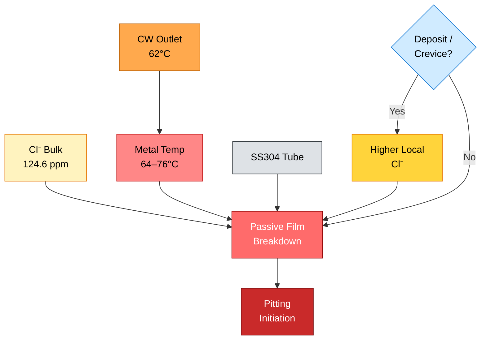

## 7.4 Mekanisme Pitting SS304

Pitting corrosion pada SS304 bukan korosi merata. Pitting adalah **localized corrosion**, sehingga kehilangan material dapat sangat kecil secara total, tetapi sangat dalam secara lokal. Ini menjelaskan mengapa tube dapat mengalami pinhole leak walaupun sebagian besar permukaan tube terlihat masih baik.

Mekanisme pitting dapat dijelaskan dalam beberapa tahap.

### Tahap 1 — Passive Film Terbentuk

SS304 membentuk passive film berbasis chromium oxide pada permukaannya.

Secara konseptual:

$$
\mathrm{Cr}
+
\mathrm{O_2}
\rightarrow
\mathrm{Cr_2O_3}
$$

Film $\mathrm{Cr_2O_3}$ ini melindungi permukaan stainless steel dari korosi umum.

### Tahap 2 — Chloride Menyerang Titik Lemah Passive Film

Ion chloride $\mathrm{Cl}^{-}$ menyerang titik lemah pada passive film, khususnya pada area:

- inclusion,
- scratch,
- deposit,
- crevice,
- weld heat tint,
- area stagnant,
- area dengan local chemistry yang berubah.

Reaksi ini bukan reaksi tunggal sederhana, tetapi dapat dituliskan secara konseptual sebagai:

$$
\mathrm{Passive\ Film}
+
\mathrm{Cl}^{-}
\rightarrow
\mathrm{Local\ Film\ Breakdown}
$$

### Tahap 3 — Pit Initiation

Setelah passive film rusak secara lokal, area kecil menjadi anodic.

Reaksi anodic metal dissolution:

$$
\mathrm{Fe}
\rightarrow
\mathrm{Fe}^{2+}
+
2e^{-}
$$

Area sekitar pit tetap passive dan bertindak sebagai cathode. Karena area anodic sangat kecil dan area cathodic besar, laju penetrasi pit dapat menjadi tinggi.

### Tahap 4 — Acidification di Dalam Pit

Ion logam yang terbentuk di dalam pit mengalami hydrolysis dan menghasilkan kondisi acidic.

Secara konseptual:

$$
\mathrm{Fe}^{2+}
+
2\mathrm{H_2O}
\rightarrow
\mathrm{Fe(OH)_2}
+
2\mathrm{H}^{+}
$$

Kenaikan konsentrasi $\mathrm{H}^{+}$ menyebabkan pH lokal turun.

$$
\mathrm{pH}_{\mathrm{pit}}
<
\mathrm{pH}_{\mathrm{bulk}}
$$

### Tahap 5 — Chloride Migration ke Dalam Pit

Untuk menjaga electroneutrality, ion chloride $\mathrm{Cl}^{-}$ bermigrasi ke dalam pit.

$$
C_{\mathrm{Cl}^{-},pit}

>

C_{\mathrm{Cl}^{-},bulk}
$$

Akibatnya, lingkungan di dalam pit menjadi semakin agresif:

$$
\mathrm{low\ pH}
+
\mathrm{high\ Cl}^{-}
\rightarrow
\mathrm{accelerated\ pit\ growth}
$$

### Tahap 6 — Pit Propagation dan Pinhole Leak

Pit tumbuh ke arah ketebalan tube. Karena bentuknya sempit dan dalam, pitting dapat menembus dinding tube tanpa menyebabkan thinning merata yang luas.

Akhirnya:

$$
\mathrm{Pit\ depth}
\geq
\mathrm{tube\ wall\ thickness}
$$

maka terjadi:

$$
\mathrm{tube\ perforation}
\rightarrow
\mathrm{pinhole\ leak}
$$

Diagram mekanisme pitting:

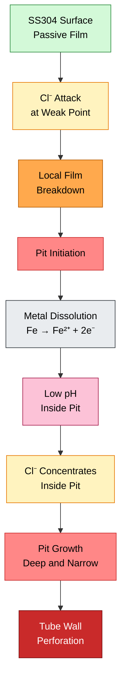

## 7.5 Perbedaan Pitting, Crevice Corrosion, dan Under-Deposit Corrosion

Pada STHE cooling water service, pitting jarang berdiri sendiri. Sering kali, pitting dipicu atau diperparah oleh crevice dan deposit.

| Mekanisme               | Karakteristik                                               | Lokasi Umum di STHE                           |
| ----------------------- | ----------------------------------------------------------- | --------------------------------------------- |
| Pitting corrosion       | Pit lokal, dalam, sering berbentuk pinhole                  | Tube wall, hot end, under-deposit area        |
| Crevice corrosion       | Serangan di celah sempit dengan stagnant solution           | Tube-to-tubesheet, gasket area, expanded tube |
| Under-deposit corrosion | Serangan di bawah scale, sludge, biofilm, corrosion product | Area dengan fouling, low velocity, dead zone  |
| Chloride SCC            | Retak bercabang pada austenitic stainless steel             | Area tensile stress dan elevated temperature  |

Hubungan antar-mekanisme:

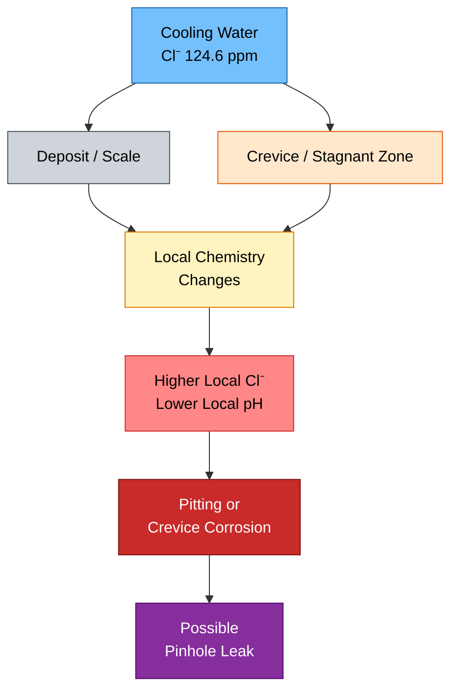

## 7.6 Area Paling Kritis pada STHE

Berdasarkan data temperatur dan mekanisme korosi, area paling kritis adalah lokasi dengan kombinasi:

$$
T_{\mathrm{metal}}\ \mathrm{tinggi}
+
C_{\mathrm{Cl}^{-}}\ \mathrm{signifikan}
+
\mathrm{deposit/crevice}
+
\mathrm{low\ velocity}
$$

Tabel berikut merangkum area kritis.

| Area                               | Alasan                                                                                                                                          |
| ---------------------------------- | ----------------------------------------------------------------------------------------------------------------------------------------------- |
| Hot end tube bundle                | Temperatur metal tertinggi karena berdekatan dengan $\mathrm{CO_2}$ inlet $120^\circ \mathrm{C}$ dan cooling water outlet $62^\circ \mathrm{C}$ |
| Dekat tube sheet                   | Terdapat potensi crevice, stagnant zone, dan residual stress dari tube expansion                                                                |
| Under-deposit area                 | Chloride dapat terkonsentrasi lokal di bawah deposit                                                                                            |
| Area baffle contact                | Berpotensi terjadi deposit, fretting, dan local damage pada passive film                                                                        |
| Tube dengan low velocity           | Fouling lebih mudah terbentuk dan oxygen renewal berkurang                                                                                      |
| Tube expansion zone                | Kombinasi crevice, residual stress, dan possible local corrosion                                                                                |
| Dead zone / maldistribution region | Aliran rendah menyebabkan sedimentasi dan biofouling                                                                                            |

Diagram inspeksi prioritas:

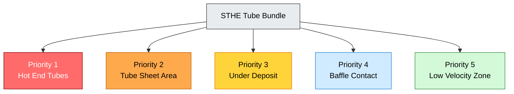

## 7.7 Failure Morphology yang Harus Dicari

Jika root cause mengarah ke chloride-induced pitting pada SS304, maka bukti fisik yang dicari saat inspeksi adalah sebagai berikut.

| Observasi                 | Interpretasi                                               |
| ------------------------- | ---------------------------------------------------------- |
| Pinhole kecil pada tube   | Indikasi perforation akibat pitting                        |
| Pit dalam dan sempit      | Ciri localized pitting corrosion                           |
| Deposit di sekitar pit    | Indikasi under-deposit corrosion                           |
| Serangan dekat tube sheet | Indikasi crevice corrosion                                 |
| Retak bercabang           | Kemungkinan chloride stress corrosion cracking             |
| Wall thinning merata      | Lebih mengarah ke erosion-corrosion atau general corrosion |
| Damage di baffle contact  | Kemungkinan fretting atau flow-induced vibration           |

Untuk membedakan mekanisme, perlu dilakukan inspeksi visual, boroscope, eddy current, IRIS atau UT, deposit analysis, dan bila memungkinkan metallography serta SEM/EDS.

## 7.8 Kesimpulan Bab 7

Dengan data aktual:

$$
C_{\mathrm{Cl}^{-}} = 124.6\ \mathrm{ppm}
$$

$$
T_{\mathrm{CW,out}} = 62^\circ \mathrm{C}
$$

$$
T_{\mathrm{wall,CW,hot\ end}}
\approx
64 - 76^\circ \mathrm{C}
$$

maka SS304 tidak berada dalam kondisi yang nyaman untuk long-term cooling water service.

Kesimpulan engineering:

$$
\boxed{
C_{\mathrm{Cl}^{-}} = 124.6\ \mathrm{ppm}
\ \mathrm{tidak\ ekstrem,\ tetapi\ signifikan}
}
$$

karena dikombinasikan dengan:

$$
\boxed{
T_{\mathrm{metal}} > 62^\circ \mathrm{C}
}
$$

dan potensi:

$$
\boxed{
\mathrm{deposit}
+
\mathrm{crevice}
+
\mathrm{low\ velocity}
+
\mathrm{oxidizer}
}
$$

Maka:

$$
\boxed{
\mathrm{Chloride\ induced\ pitting\ pada\ SS304}
\ \mathrm{adalah\ hipotesis\ kegagalan\ yang\ kuat}
}
$$

Namun, final root cause tetap harus dikonfirmasi melalui:

1. Lokasi pit.
2. Morphology pit.
3. Deposit analysis.
4. Cooling water chemistry lengkap.
5. Tube inspection.
6. Operating history.
7. Data residual chlorine, $\mathrm{pH}$, conductivity, dan ORP.

[**Kembali ke Atas**](#technical-review-and-improvement-study-of-counter-current-sthe-for-co₂-gas-cooling)

---

## Key Takeaways Bab 6–7

1. Nilai $37\ \mathrm{kW}$ adalah minimum sensible duty dari gas $\mathrm{CO_2}$.
2. Karena ada liquid separator setelah STHE, perlu dievaluasi kemungkinan adanya condensation duty.
3. Jika terjadi kondensasi, maka $Q_{\mathrm{total}}$ lebih besar dari $Q_{\mathrm{sensible,CO_2}}$.
4. Chloride cooling water sebesar $124.6\ \mathrm{ppm}$ harus dievaluasi bersama metal temperature, bukan sebagai angka tunggal.
5. Pada hot end, $T_{\mathrm{wall,CW}}$ diperkirakan sekitar $64-76^\circ \mathrm{C}$ tanpa fouling.
6. SS304 berada pada kondisi borderline sampai berisiko terhadap pitting pada kombinasi chloride dan temperatur tersebut.
7. Deposit, crevice, residual chlorine, low velocity, dan biofouling dapat mempercepat pitting.
8. Area inspeksi paling kritis adalah hot end tube bundle, tube sheet, under-deposit area, dan baffle contact area.

[1]: https://bssa.org.uk/wp-content/uploads/2021/04/SSAS4.92-Stainless-Steels-in-Supply-Waste-Waters.pdf?utm_source=chatgpt.com 'SSAS4.92-Stainless-Steels-in-Supply-Waste-Waters.pdf'
[2]: https://worldstainless.org/wp-content/uploads/2025/02/stainless-steel-grade-sheets.pdf?utm_source=chatgpt.com 'Stainless Steel Grade Datasheets'

[**Kembali ke Atas**](#technical-review-and-improvement-study-of-counter-current-sthe-for-co-gas-cooling-heat-transfer-performance-ss304-pitting-risk-and-upgrade-strategy-to-ss316l)

---

# 8. Material Improvement: SS304 to SS316L

## 8.1 Kenapa SS316L Lebih Baik Dibanding SS304?

SS304 dan SS316L sama-sama termasuk **austenitic stainless steel**. Keduanya memiliki chromium dan nickel sebagai unsur utama pembentuk struktur austenitic serta passive film berbasis chromium oxide. Perbedaan utama yang membuat SS316L lebih unggul terhadap chloride adalah adanya **molybdenum**.

SS316 atau SS316L mengandung molybdenum sekitar:

$$
\mathrm{Mo}_{\mathrm{SS316L}} \approx 2 - 3\%
$$

Sedangkan SS304 tidak memiliki molybdenum sebagai unsur nominal:

$$
\mathrm{Mo}_{\mathrm{SS304}} \approx 0\%
$$

Molybdenum meningkatkan ketahanan terhadap **pitting corrosion** dan **crevice corrosion**, khususnya pada lingkungan yang mengandung chloride. Grade 316 dikenal sebagai molybdenum-bearing austenitic stainless steel, dan molybdenum memberikan resistance yang lebih baik terhadap pitting dan crevice corrosion pada chloride environments dibanding Grade 304. ([Stainlessinox][1])

Secara sederhana:

$$
\mathrm{SS304}
=
\mathrm{Cr}
+
\mathrm{Ni}
$$

Sedangkan:

$$
\mathrm{SS316L}
=
\mathrm{Cr}
+
\mathrm{Ni}
+
\mathrm{Mo}
$$

Maka dari sisi chloride resistance:

$$
\mathrm{SS316L}

>

\mathrm{SS304}
$$

Namun, poin pentingnya adalah:

$$
\boxed{
\mathrm{SS316L\ lebih\ tahan,\ tetapi\ bukan\ immune\ terhadap\ chloride}
}
$$

Artinya, SS316L memberi margin lebih baik, tetapi tetap bisa mengalami pitting jika kondisi terlalu agresif, misalnya chloride tinggi, temperatur metal tinggi, deposit berat, crevice, stagnant zone, atau residual chlorine tinggi.

## 8.2 Relevansi SS316L terhadap Kondisi Aktual STHE

Kondisi aktual STHE adalah:

| Parameter                          |                                     Nilai |
| ---------------------------------- | ----------------------------------------: |
| Existing tube material             |                                     SS304 |
| Proposed tube material             |                                    SS316L |
| Chloride cooling water             |                     $124.6\ \mathrm{ppm}$ |
| Cooling water outlet               |                     $62^\circ \mathrm{C}$ |
| Estimated hot-end wall temperature |                $64 - 76^\circ \mathrm{C}$ |
| Service                            | CO₂ gas cooler after 1st stage compressor |
| Flow arrangement                   |                           Counter-current |

Chloride aktual:

$$
C_{\mathrm{Cl}^{-}} = 124.6\ \mathrm{ppm}
$$

atau secara praktis:

$$
C_{\mathrm{Cl}^{-}} \approx 124.6\ \mathrm{mg/L}
$$

Hot-end wall temperature diperkirakan:

$$
T_{\mathrm{wall,CW,hot\ end}}
\approx
64 - 76^\circ \mathrm{C}
$$

Panduan water industry menyebutkan bahwa, sebagai general guide untuk raw, natural, dan potable waters pada pH sekitar 6–8.5, tipe 304 dapat dipertimbangkan sampai sekitar **200 mg/L chloride**, sedangkan tipe 316 sampai sekitar **1000 mg/L chloride**. Namun, dokumen yang sama juga memberikan pendekatan konservatif: tipe 304 sampai sekitar **50 mg/L chloride** dan tipe 316 sampai sekitar **250 mg/L chloride**, terutama untuk kondisi yang lebih berisiko. ([Water UK Standards Board][2])

Dengan data aktual:

$$
C_{\mathrm{Cl}^{-}} = 124.6\ \mathrm{ppm}
$$

SS304 berada di atas batas konservatif:

$$
124.6\ \mathrm{ppm}

>

50\ \mathrm{ppm}
$$

Sedangkan SS316L masih berada di bawah batas konservatif:

$$
124.6\ \mathrm{ppm}
<
250\ \mathrm{ppm}
$$

Maka secara screening:

$$
\boxed{
\mathrm{SS316L\ adalah\ minimum\ upgrade\ yang\ technically\ defensible}
}
$$

Namun, karena metal temperature berada di atas $62^\circ \mathrm{C}$, pemilihan SS316L tetap harus disertai kontrol operasi dan water treatment. SS316L bukan solusi tunggal bila masalah utama sebenarnya adalah deposit, stagnant cooling water, over-chlorination, atau poor flow distribution.

## 8.3 Perbandingan Interpretasi Chloride: SS304 vs SS316L

Untuk kasus ini, perbandingan praktisnya dapat ditulis sebagai berikut.

| Parameter                                                                                 |                                                         SS304 |                                          SS316L |
| ----------------------------------------------------------------------------------------- | ------------------------------------------------------------: | ----------------------------------------------: |
| Molybdenum                                                                                |                                                 Tidak nominal |                                       $2 - 3\%$ |
| Resistance terhadap pitting chloride                                                      |                                                        Sedang |                                      Lebih baik |
| Resistance terhadap crevice corrosion                                                     |                                                        Sedang |                                      Lebih baik |
| Suitability pada $124.6\ \mathrm{ppm}$ Cl⁻ dan $T_{\mathrm{metal}} > 62^\circ \mathrm{C}$ |                                         Borderline / berisiko |                                Lebih defensible |
| Benefit utama                                                                             |                                                Umum, ekonomis |                        Margin korosi lebih baik |
| Catatan                                                                                   | Tidak disarankan untuk long-term reliability pada kondisi ini | Tetap perlu kontrol deposit dan water chemistry |

Secara konseptual:

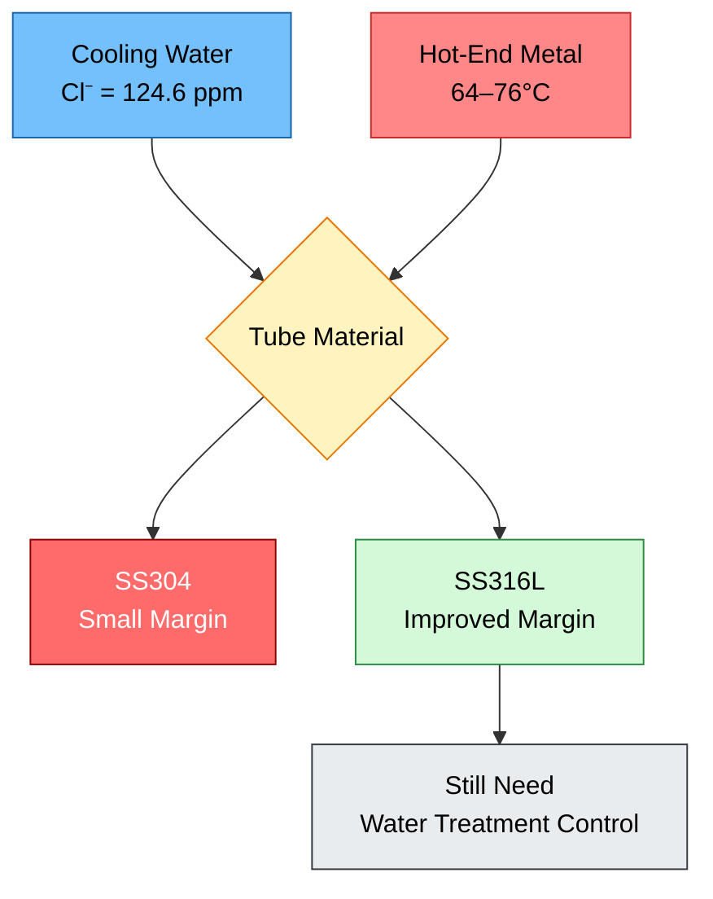

## 8.4 Kenapa Memilih SS316L, Bukan Hanya SS316?

Untuk tube heat exchanger, khususnya bila ada welding, tube-to-tubesheet welding, repair welding, atau heat affected zone, grade **L** lebih disukai karena kandungan carbon yang lebih rendah.

SS316L adalah versi low-carbon dari SS316. Low carbon membantu mengurangi risiko **sensitization** dan intergranular corrosion pada area yang mengalami thermal cycle. Atlas grade datasheet menjelaskan bahwa 316L adalah low carbon version dari 316 dan memiliki resistance yang lebih baik terhadap sensitization. ([Stainlessinox][1])

Secara praktis:

$$
\mathrm{SS316L}
=
\mathrm{SS316}
\ \mathrm{with\ lower\ carbon}
$$

Dengan carbon lebih rendah:

$$
C_{\mathrm{SS316L}}
<
C_{\mathrm{SS316}}
$$

maka risiko chromium carbide precipitation di grain boundary lebih rendah.

Implikasinya:

$$
\boxed{
\mathrm{SS316L\ lebih\ sesuai\ untuk\ welded\ heat\ exchanger\ tube\ application}
}
$$

## 8.5 Batasan SS316L

Walaupun SS316L lebih baik daripada SS304, SS316L tetap tidak boleh dianggap bebas risiko.

SS316L dapat tetap mengalami pitting atau crevice corrosion bila terdapat kombinasi berikut:

| Faktor                   | Dampak                                     |
| ------------------------ | ------------------------------------------ |
| Chloride tinggi          | Meningkatkan risiko passive film breakdown |
| Metal temperature tinggi | Mempercepat pit initiation dan propagation |
| Deposit atau scale       | Menciptakan under-deposit corrosion        |
| Crevice di tube sheet    | Menciptakan local chloride concentration   |
| Stagnant zone            | Mengurangi flushing dan oxygen renewal     |
| Residual chlorine tinggi | Menaikkan corrosion potential              |
| pH rendah                | Mempercepat dissolution di dalam pit       |
| Biofouling / MIC         | Memicu localized corrosion                 |

Untuk kasus ini, faktor yang sudah terbukti dari data adalah:

$$
C_{\mathrm{Cl}^{-}} = 124.6\ \mathrm{ppm}
$$

dan:

$$
T_{\mathrm{wall,CW,hot\ end}}
\approx
64 - 76^\circ \mathrm{C}
$$

Faktor yang masih perlu dikonfirmasi adalah:

$$
\mathrm{deposit}
+
\mathrm{crevice}
+
\mathrm{residual\ chlorine}
+
\mathrm{pH}
+
\mathrm{velocity}
+
\mathrm{biofouling}
$$

## 8.6 Kapan Duplex 2205 Perlu Dipertimbangkan?

Duplex 2205 memiliki struktur campuran ferrite dan austenite. Material ini umumnya memiliki strength lebih tinggi dan pitting resistance lebih baik dibanding SS316L. Duplex 2205 sering dipertimbangkan ketika SS316L memiliki margin korosi yang tidak cukup, terutama pada chloride environment yang lebih agresif.

Duplex 2205 perlu dipertimbangkan bila ditemukan kondisi berikut:

| Kondisi                                           | Alasan                                          |
| ------------------------------------------------- | ----------------------------------------------- |
| Kebocoran berulang setelah upgrade SS316L         | Menunjukkan SS316L tidak cukup robust           |
| Deposit berat dan sulit dikontrol                 | Under-deposit corrosion tetap agresif           |
| Residual chlorine tinggi                          | Menaikkan corrosion potential                   |
| Chloride meningkat akibat cycles of concentration | Bulk chloride dapat naik di atas nilai saat ini |
| Cooling water velocity rendah                     | Meningkatkan fouling dan stagnant corrosion     |
| Area crevice tidak dapat dieliminasi              | Crevice corrosion tetap menjadi driver          |
| Target reliability sangat tinggi                  | Membutuhkan corrosion margin lebih besar        |

Secara konseptual, pilihan material dapat disusun sebagai hierarchy berikut.

```mermaid id="t0i387"
flowchart TD
    A["Existing<br/>SS304"]:::bad
    B["Minimum Upgrade<br/>SS316L"]:::better
    C["Higher Margin<br/>Duplex 2205"]:::good
    D["Severe Service<br/>Super Duplex / 6Mo"]:::severe
    E["Special Case<br/>Titanium"]:::special

    A --> B --> C --> D --> E

    classDef bad fill:#ff6b6b,stroke:#8b0000,color:#ffffff;
    classDef better fill:#d3f9d8,stroke:#2b8a3e,color:#000000;
    classDef good fill:#74c0fc,stroke:#1864ab,color:#000000;
    classDef severe fill:#ffd43b,stroke:#e67700,color:#000000;
    classDef special fill:#e5dbff,stroke:#5f3dc4,color:#000000;
```

## 8.7 Material Selection Matrix

Material selection tidak boleh hanya mempertimbangkan chemical compatibility. Untuk STHE, pemilihan material juga harus mempertimbangkan heat transfer, mechanical strength, weldability, availability, cost, inspection strategy, dan compatibility dengan existing design.

| Material           | Kesesuaian terhadap Kasus                    | Catatan                                                                                    |
| ------------------ | -------------------------------------------- | ------------------------------------------------------------------------------------------ |
| SS304              | Tidak disarankan untuk long-term reliability | Margin kecil pada $124.6\ \mathrm{ppm}$ Cl⁻ dan $T_{\mathrm{metal}} > 62^\circ \mathrm{C}$ |
| SS316L             | Rekomendasi minimum                          | Better pitting resistance karena Mo; cocok sebagai upgrade pertama                         |
| Duplex 2205        | Opsi lebih robust                            | Dipertimbangkan jika fouling/deposit berat atau leak berulang                              |
| Super Duplex / 6Mo | Untuk severe chloride                        | Perlu justifikasi ekonomi dan corrosivity yang lebih tinggi                                |
| Titanium           | Sangat baik untuk beberapa seawater service  | Mahal, perlu review galvanic compatibility dan design limitation                           |

Keputusan material yang paling rasional untuk kondisi saat ini adalah:

$$
\boxed{
\mathrm{Upgrade\ tube\ material\ dari\ SS304\ ke\ SS316L}
}
$$

dengan catatan:

$$
\boxed{
\mathrm{Water\ chemistry,\ velocity,\ deposit,\ dan\ residual\ chlorine\ tetap\ harus\ dikontrol}
}
$$

## 8.8 Kesimpulan Bab 8

Berdasarkan data aktual:

$$
C_{\mathrm{Cl}^{-}} = 124.6\ \mathrm{ppm}
$$

$$
T_{\mathrm{wall,CW,hot\ end}}
\approx
64 - 76^\circ \mathrm{C}
$$

dan existing tube:

$$
\mathrm{Material}_{\mathrm{existing}} = \mathrm{SS304}
$$

maka:

$$
\boxed{
\mathrm{SS304\ memiliki\ margin\ kecil\ terhadap\ pitting}
}
$$

Upgrade ke SS316L secara teknis dapat dibenarkan karena adanya molybdenum yang meningkatkan pitting dan crevice corrosion resistance pada chloride environment.

Kesimpulan engineering:

$$
\boxed{
\mathrm{SS316L\ adalah\ minimum\ material\ upgrade\ yang\ technically\ defensible}
}
$$

Namun, jika inspeksi menemukan deposit berat, crevice corrosion parah, residual chlorine tinggi, atau leak berulang, maka material dengan margin lebih tinggi seperti Duplex 2205 perlu dipertimbangkan.

[**Kembali ke Atas**](#technical-review-and-improvement-study-of-counter-current-sthe-for-co₂-gas-cooling)

---

# 9. Mechanical and Thermal Properties: SS304 vs SS316L

## 9.1 Konteks Perbandingan

Perbandingan SS304 dan SS316L dalam artikel ini harus dilihat dari dua sisi berbeda:

1. **Heat transfer performance**
2. **Corrosion resistance terhadap chloride**

Dari sisi heat transfer, SS304 dan SS316L hampir sama karena thermal conductivity keduanya berada pada level yang serupa. Dari sisi corrosion resistance, SS316L lebih baik karena mengandung molybdenum.

Dengan kata lain:

$$
\boxed{
\mathrm{SS316L\ tidak\ dipilih\ untuk\ meningkatkan\ heat\ transfer}
}
$$

tetapi:

$$
\boxed{
\mathrm{SS316L\ dipilih\ untuk\ meningkatkan\ corrosion\ resistance}
}
$$

## 9.2 Komposisi Kimia Utama

Komposisi kimia tipikal SS304 dan SS316L dapat diringkas sebagai berikut. Nilai aktual harus tetap mengacu pada material certificate, ASME/ASTM specification, dan purchase requirement yang digunakan pada proyek.

| Element |                      SS304 |         SS316 / SS316L | Implikasi                                      |
| ------- | -------------------------: | ---------------------: | ---------------------------------------------- |
| Cr      |            $17.5 - 19.5\%$ |            $16 - 18\%$ | Pembentuk passive film                         |
| Ni      |               $8 - 10.5\%$ |            $10 - 14\%$ | Stabilizer austenitic structure                |
| Mo      |              Tidak nominal |              $2 - 3\%$ | Meningkatkan pitting resistance                |
| C max   | sekitar $0.07\%$ untuk 304 | lebih rendah pada 316L | Menurunkan risiko sensitization                |
| N max   |           sekitar $0.10\%$ |       sekitar $0.10\%$ | Dapat membantu strength dan pitting resistance |

Atlas/World Stainless grade datasheets mencantumkan komposisi dan properti Grade 304/304L/304H serta 316/316L/316H, termasuk perbedaan utama 316 sebagai molybdenum-bearing grade dibanding 304. ([worldstainless][3])

Secara konseptual:

```mermaid id="b0cq4l"
flowchart TD
    A["SS304"]:::ss304
    B["Cr + Ni"]:::base
    C["Good General<br/>Corrosion Resistance"]:::ok

    D["SS316L"]:::ss316
    E["Cr + Ni + Mo"]:::mo
    F["Better Pitting /<br/>Crevice Resistance"]:::better

    A --> B --> C
    D --> E --> F

    classDef ss304 fill:#dee2e6,stroke:#343a40,color:#000000;
    classDef ss316 fill:#d3f9d8,stroke:#2b8a3e,color:#000000;
    classDef base fill:#e9ecef,stroke:#495057,color:#000000;
    classDef mo fill:#fff3bf,stroke:#e67700,color:#000000;
    classDef ok fill:#91d5ff,stroke:#1864ab,color:#000000;
    classDef better fill:#74c0fc,stroke:#1864ab,color:#000000;
```

## 9.3 Mechanical Properties

Mechanical properties SS304 dan SS316L pada kondisi annealed relatif mirip. Ini penting karena dari sisi kekuatan dasar tube, upgrade dari SS304 ke SS316L umumnya tidak menimbulkan perubahan besar pada mechanical design, meskipun final verification tetap harus mengacu pada ASME Section II, ASME Section VIII, TEMA, atau API 660 sesuai design basis proyek.

| Property                 |                           SS304 |                  SS316 / SS316L | Implikasi terhadap STHE   |
| ------------------------ | ------------------------------: | ------------------------------: | ------------------------- |
| Tensile strength minimum |     $\approx 515\ \mathrm{MPa}$ |     $\approx 515\ \mathrm{MPa}$ | Hampir sama               |
| Yield strength minimum   |     $\approx 205\ \mathrm{MPa}$ |     $\approx 205\ \mathrm{MPa}$ | Hampir sama               |
| Elongation minimum       |                  $\approx 40\%$ |                  $\approx 40\%$ | Sama-sama ductile         |
| Elastic modulus          |     $\approx 193\ \mathrm{GPa}$ |     $\approx 193\ \mathrm{GPa}$ | Kekakuan tube hampir sama |
| Density                  | $\approx 7900\ \mathrm{kg/m^3}$ | $\approx 8000\ \mathrm{kg/m^3}$ | Praktis sama              |
| Hardness maximum         |      $\approx 201\ \mathrm{HB}$ |      $\approx 217\ \mathrm{HB}$ | 316 sedikit lebih tinggi  |

Data mechanical properties dan physical properties untuk Grade 304/316 pada datasheet Atlas/World Stainless menunjukkan nilai tensile strength, yield strength, elongation, density, elastic modulus, dan thermal conductivity yang secara engineering sangat dekat untuk kedua grade tersebut. ([worldstainless][3])

Implikasi untuk STHE:

$$
\sigma_{\mathrm{allowable,SS304}}
\approx
\sigma_{\mathrm{allowable,SS316L}}
$$

dalam konteks screening awal. Namun untuk design final, allowable stress harus dicek berdasarkan code dan temperatur desain.

## 9.4 Thermal Properties dalam Konteks Heat Transfer

Untuk heat exchanger, salah satu properti yang paling sering diperhatikan adalah **thermal conductivity**. Pada kasus ini, SS304 dan SS316L memiliki thermal conductivity yang hampir sama pada temperatur operasi sekitar 100°C.

| Property                                       |                             SS304 |                    SS316 / SS316L | Dampak terhadap Heat Transfer |
| ---------------------------------------------- | --------------------------------: | --------------------------------: | ----------------------------- |
| Thermal conductivity at $100^\circ \mathrm{C}$ |    $\approx 16.3\ \mathrm{W/m.K}$ |    $\approx 16.3\ \mathrm{W/m.K}$ | Praktis sama                  |
| Specific heat                                  |    $\approx 500\ \mathrm{J/kg.K}$ |    $\approx 500\ \mathrm{J/kg.K}$ | Praktis sama                  |
| Thermal expansion $0 - 100^\circ \mathrm{C}$   | $\approx 17.2\ \mu\mathrm{m/m.K}$ | $\approx 15.9\ \mu\mathrm{m/m.K}$ | 316 sedikit lebih rendah      |

Maka:

$$
k_{\mathrm{SS304}}
\approx
k_{\mathrm{SS316L}}
$$

atau:

$$
k_{\mathrm{SS304}}
\approx
16.3\ \mathrm{W/m.K}
$$

$$
k_{\mathrm{SS316L}}
\approx
16.3\ \mathrm{W/m.K}
$$

Sehingga:

$$
\boxed{
\mathrm{Upgrade\ SS304\ ke\ SS316L\ tidak\ secara\ signifikan\ meningkatkan\ heat\ transfer}
}
$$

Manfaat utama upgrade adalah:

$$
\boxed{
\mathrm{corrosion\ resistance,\ bukan\ thermal\ conductivity}
}
$$

## 9.5 Wall Resistance Comparison

Untuk membuktikan bahwa perbedaan SS304 dan SS316L tidak signifikan terhadap heat transfer, kita dapat menghitung tahanan konduksi dinding tube.

Asumsi tube thickness:

$$
\delta = 1.65\ \mathrm{mm}
$$

Konversi ke meter:

$$
\delta = 0.00165\ \mathrm{m}
$$

Thermal conductivity:

$$
k = 16.3\ \mathrm{W/m.K}
$$

Tahanan konduksi dinding:

$$
R_{\mathrm{wall}}
=
\frac{\delta}{k}
$$

Substitusi:

$$
R_{\mathrm{wall}}
=
\frac{0.00165}{16.3}
$$

$$
R_{\mathrm{wall}}
=
0.000101\ \mathrm{m^2.K/W}
$$

Sehingga:

$$
\boxed{
R_{\mathrm{wall}}
\approx
0.000101\ \mathrm{m^2.K/W}
}
$$

Nilai ini sangat kecil dibanding gas-side thermal resistance atau fouling resistance.

Sebagai perbandingan, jika:

$$
h_{\mathrm{gas}} = 100\ \mathrm{W/m^2.K}
$$

maka:

$$
R_{\mathrm{gas}}
=
\frac{1}{h_{\mathrm{gas}}}
\frac{1}{100}

0.0100\ \mathrm{m^2.K/W}
$$

Jika:

$$
h_{\mathrm{CW}} = 3000\ \mathrm{W/m^2.K}
$$

maka:

$$
R_{\mathrm{CW}}
=
\frac{1}{h_{\mathrm{CW}}}
\frac{1}{3000}

0.000333\ \mathrm{m^2.K/W}
$$

Perbandingan tahanan:

| Komponen            |                        Nilai |
| ------------------- | ---------------------------: |
| $R_{\mathrm{gas}}$  |   $0.0100\ \mathrm{m^2.K/W}$ |
| $R_{\mathrm{wall}}$ | $0.000101\ \mathrm{m^2.K/W}$ |
| $R_{\mathrm{CW}}$   | $0.000333\ \mathrm{m^2.K/W}$ |

Kontribusi wall resistance terhadap total resistance:

$$
R_{\mathrm{total}}
=
R_{\mathrm{gas}}
+
R_{\mathrm{wall}}
+
R_{\mathrm{CW}}
$$

$$
R_{\mathrm{total}}
=
0.0100
+
0.000101
+
0.000333
$$

$$
R_{\mathrm{total}}
=
0.010434\ \mathrm{m^2.K/W}
$$

Maka:

$$
\frac{R_{\mathrm{wall}}}{R_{\mathrm{total}}}
=
\frac{0.000101}{0.010434}
$$

$$
\frac{R_{\mathrm{wall}}}{R_{\mathrm{total}}}
=
0.0097
$$

atau:

$$
\boxed{
R_{\mathrm{wall}}
\approx
1\%
\ \mathrm{dari\ total\ thermal\ resistance}
}
$$

Kesimpulannya:

$$
\boxed{
\mathrm{Wall\ material\ change\ dari\ SS304\ ke\ SS316L\ hampir\ tidak\ mengubah\ thermal\ performance}
}
$$

## 9.6 Faktor yang Lebih Dominan terhadap Heat Transfer

Karena wall resistance kecil, performa STHE lebih dipengaruhi oleh faktor-faktor berikut.

| Faktor                             | Dampak terhadap Heat Transfer                     |
| ---------------------------------- | ------------------------------------------------- |
| Gas-side heat transfer coefficient | Sangat berpengaruh pada gas cooler                |
| Cooling water velocity             | Menentukan $h_{\mathrm{CW}}$ dan fouling tendency |
| Fouling resistance                 | Menambah thermal resistance                       |
| Tube cleanliness                   | Menentukan effective heat transfer area           |
| Flow distribution                  | Maldistribution dapat menurunkan area efektif     |
| Baffle condition                   | Mempengaruhi shell-side turbulence dan vibration  |
| LMTD                               | Driving force utama heat exchanger                |
| Actual heat transfer area          | Menentukan total $UA$                             |

Secara diagram:

```mermaid id="gf6v2d"
flowchart TD
    A["STHE Heat Transfer<br/>Performance"]:::main
    B["Gas-side h"]:::dominant
    C["CW Velocity"]:::dominant
    D["Fouling"]:::risk
    E["Flow Distribution"]:::risk
    F["LMTD"]:::dominant
    G["Tube Material k<br/>SS304 ≈ SS316L"]:::minor

    A --> B
    A --> C
    A --> D
    A --> E
    A --> F
    A --> G

    classDef main fill:#e9ecef,stroke:#343a40,color:#000000;
    classDef dominant fill:#74c0fc,stroke:#1864ab,color:#000000;
    classDef risk fill:#ffd43b,stroke:#e67700,color:#000000;
    classDef minor fill:#d3f9d8,stroke:#2b8a3e,color:#000000;
```

## 9.7 Hubungan Mechanical Properties dengan Pitting

Mechanical properties seperti tensile strength dan yield strength tidak secara langsung menentukan ketahanan terhadap pitting. Pitting lebih dikendalikan oleh metallurgical chemistry dan lingkungan operasi.

Namun, mechanical properties tetap penting karena pitting dapat mengurangi remaining wall thickness secara lokal. Bila pit tumbuh hingga menembus dinding tube, maka tube bocor walaupun bulk material strength masih memadai.

Secara konseptual:

$$
\mathrm{Pitting}
\rightarrow
\mathrm{local\ wall\ loss}
\rightarrow
\mathrm{remaining\ thickness\ decreases}
\rightarrow
\mathrm{pinhole\ leak}
$$

Jika pit depth adalah:

$$
d_{\mathrm{pit}}
$$

dan tube wall thickness adalah:

$$
t_{\mathrm{tube}}
$$

maka perforation terjadi saat:

$$
d_{\mathrm{pit}}
\geq
t_{\mathrm{tube}}
$$

Dengan asumsi:

$$
t_{\mathrm{tube}} = 1.65\ \mathrm{mm}
$$

maka tube dapat bocor ketika:

$$
d_{\mathrm{pit}}
\geq
1.65\ \mathrm{mm}
$$

Pitting berbahaya karena kehilangan material tidak merata. Total corrosion rate rata-rata dapat terlihat rendah, tetapi penetrasi lokal dapat sangat cepat.

## 9.8 Ringkasan Perbandingan Engineering SS304 vs SS316L

| Aspek                        | SS304                          | SS316L                                       | Kesimpulan                         |
| ---------------------------- | ------------------------------ | -------------------------------------------- | ---------------------------------- |
| Heat transfer                | Baik                           | Baik                                         | Hampir sama                        |
| Thermal conductivity         | $\approx 16.3\ \mathrm{W/m.K}$ | $\approx 16.3\ \mathrm{W/m.K}$               | Tidak ada improvement signifikan   |
| Mechanical strength          | Similar                        | Similar                                      | Tidak menjadi alasan utama upgrade |
| Chloride pitting resistance  | Lebih rendah                   | Lebih tinggi                                 | SS316L lebih sesuai                |
| Crevice corrosion resistance | Lebih rendah                   | Lebih tinggi                                 | SS316L lebih baik                  |
| Weldability                  | Baik                           | Baik, 316L lebih aman terhadap sensitization | 316L lebih disukai                 |
| Cost                         | Lebih rendah                   | Lebih tinggi                                 | Perlu justifikasi reliability      |
| Suitability untuk kasus ini  | Borderline / risky             | Minimum defensible upgrade                   | Upgrade disarankan                 |

## 9.9 Kesimpulan Bab 9

Dari sisi mechanical dan thermal properties:

$$
\boxed{
\mathrm{SS304\ dan\ SS316L\ memiliki\ mechanical\ properties\ yang\ relatif\ mirip}
}
$$

Dari sisi heat transfer:

$$
\boxed{
k_{\mathrm{SS304}}
\approx
k_{\mathrm{SS316L}}
\approx
16.3\ \mathrm{W/m.K}
}
$$

Sehingga:

$$
\boxed{
\mathrm{Upgrade\ ke\ SS316L\ tidak\ bertujuan\ meningkatkan\ heat\ transfer}
}
$$

Tujuan utama upgrade adalah:

$$
\boxed{
\mathrm{meningkatkan\ resistance\ terhadap\ chloride\ pitting\ dan\ crevice\ corrosion}
}
$$

Untuk STHE ini, dengan:

$$
C_{\mathrm{Cl}^{-}} = 124.6\ \mathrm{ppm}
$$

dan:

$$
T_{\mathrm{wall,CW,hot\ end}}
\approx
64 - 76^\circ \mathrm{C}
$$

maka SS316L merupakan pilihan minimum yang lebih rasional dibanding SS304.

[**Kembali ke Atas**](#technical-review-and-improvement-study-of-counter-current-sthe-for-co₂-gas-cooling)

---

## Key Takeaways Bab 8–9

1. SS316L lebih baik dari SS304 terhadap chloride karena mengandung molybdenum sekitar $2 - 3\%$.
2. Pada chloride $124.6\ \mathrm{ppm}$ dan metal temperature $64 - 76^\circ \mathrm{C}$, SS304 memiliki margin kecil terhadap pitting.
3. SS316L adalah minimum material upgrade yang technically defensible untuk kasus ini.
4. SS316L bukan immune terhadap chloride; deposit, crevice, residual chlorine, dan low velocity tetap harus dikontrol.
5. Mechanical properties SS304 dan SS316L relatif mirip.
6. Thermal conductivity SS304 dan SS316L praktis sama, sekitar $16.3\ \mathrm{W/m.K}$.
7. Wall resistance tube hanya sekitar $0.000101\ \mathrm{m^2.K/W}$ untuk thickness $1.65\ \mathrm{mm}$.
8. Performa heat transfer lebih dipengaruhi oleh $h_{\mathrm{gas}}$, $h_{\mathrm{CW}}$, fouling, flow distribution, dan LMTD dibanding perbedaan material SS304 vs SS316L.
9. Upgrade ke SS316L adalah keputusan corrosion reliability, bukan keputusan thermal performance.

[1]: https://www.stainlessinox.com/technical-data/Stainlessinox-Technical-Data.pdf?utm_source=chatgpt.com 'Stainless Steel Grade Datasheets'
[2]: https://standards-board.water.org.uk/wp-content/uploads/2023/08/IGN-4-25-02-Issue-2-August-2023-published-version-1.pdf?utm_source=chatgpt.com 'Applications for Stainless Steel in the Water Industry'
[3]: https://worldstainless.org/wp-content/uploads/2025/02/stainless-steel-grade-sheets.pdf?utm_source=chatgpt.com 'Stainless Steel Grade Datasheets'

[**Kembali ke Atas**](#technical-review-and-improvement-study-of-counter-current-sthe-for-co-gas-cooling-heat-transfer-performance-ss304-pitting-risk-and-upgrade-strategy-to-ss316l)

---

# 10. PREN Analysis and Diagram

## 10.1 Apa Itu PREN?

**PREN** atau **Pitting Resistance Equivalent Number** adalah indeks empiris yang digunakan untuk membandingkan ketahanan relatif stainless steel terhadap **pitting corrosion**. PREN bukan nilai absolut yang menjamin suatu material bebas pitting, tetapi berguna sebagai alat awal untuk membandingkan material stainless steel berdasarkan komposisi kimianya.

Formula umum PREN adalah:

$$
PREN =
\%Cr
+
3.3(\%Mo)
+
16(\%N)
$$

Keterangan:

| Simbol | Arti               | Pengaruh terhadap Pitting Resistance                           |
| ------ | ------------------ | -------------------------------------------------------------- |
| $\%Cr$ | Chromium content   | Membentuk passive film                                         |
| $\%Mo$ | Molybdenum content | Meningkatkan resistance terhadap pitting dan crevice corrosion |
| $\%N$  | Nitrogen content   | Meningkatkan pitting resistance dan strength                   |

British Stainless Steel Association menjelaskan bahwa formula umum PREN menggunakan faktor pembobot untuk molybdenum dan nitrogen karena kedua unsur tersebut memiliki pengaruh kuat terhadap pitting corrosion resistance. ([British Stainless Steel Association][1])

Secara prinsip:

$$
\boxed{
\mathrm{Semakin\ tinggi\ PREN,\ semakin\ tinggi\ ketahanan\ relatif\ terhadap\ pitting}
}
$$

Namun, PREN harus dipahami sebagai **ranking relatif**, bukan sebagai operating limit. Actual corrosion tetap dipengaruhi oleh chloride concentration, metal temperature, pH, residual chlorine, deposit, crevice, dan velocity.

---

## 10.2 Kenapa PREN Penting pada Kasus STHE Ini?

Pada kasus STHE ini, existing tube material adalah **SS304**. Cooling water mengandung chloride:

$$
C_{\mathrm{Cl}^{-}}
=
124.6\ \mathrm{ppm}
$$

Hot-end tube wall temperature diperkirakan:

$$
T_{\mathrm{wall,CW,hot\ end}}
\approx
64 - 76^\circ \mathrm{C}
$$

Kombinasi chloride dan temperatur metal elevated meningkatkan risiko pitting pada stainless steel. Karena itu, PREN dapat digunakan untuk menjelaskan secara kuantitatif mengapa SS316L lebih baik dibanding SS304.

Secara sederhana:

$$
PREN_{\mathrm{SS316L}}

>

PREN_{\mathrm{SS304}}
$$

karena SS316L mengandung molybdenum:

$$
\%Mo_{\mathrm{SS316L}}
\approx
2 - 3\%
$$

sedangkan SS304 tidak memiliki molybdenum nominal:

$$
\%Mo_{\mathrm{SS304}}
\approx
0\%
$$

---

## 10.3 Estimated PREN untuk SS304

Komposisi tipikal SS304:

$$
\%Cr_{\mathrm{SS304}}
\approx
18
$$

$$
\%Mo_{\mathrm{SS304}}
\approx
0
$$

$$
\%N_{\mathrm{SS304}}
\approx
0 - 0.10
$$

Dengan formula:

$$
PREN =
\%Cr
+
3.3(\%Mo)
+
16(\%N)
$$

Jika nitrogen diabaikan untuk screening awal:

$$
PREN_{\mathrm{SS304}}
\approx
18
+
3.3(0)
+
16(0)
$$

$$
PREN_{\mathrm{SS304}}
\approx
18
$$

Dengan variasi komposisi aktual, PREN SS304 secara praktis dapat dinyatakan sebagai:

$$
\boxed{
PREN_{\mathrm{SS304}}
\approx
18 - 20
}
$$

Interpretasi:

$$
\boxed{
\mathrm{SS304\ memiliki\ pitting\ resistance\ paling\ rendah\ di\ antara\ material\ yang\ dibandingkan}
}
$$

---

## 10.4 Estimated PREN untuk SS316L

Komposisi tipikal SS316L:

$$
\%Cr_{\mathrm{SS316L}}
\approx
17
$$

$$
\%Mo_{\mathrm{SS316L}}
\approx
2.0 - 2.5
$$

$$
\%N_{\mathrm{SS316L}}
\approx
0 - 0.10
$$

Untuk screening calculation, jika digunakan:

$$
\%Cr = 17
$$

$$
\%Mo = 2.5
$$

dan nitrogen diabaikan:

$$
PREN_{\mathrm{SS316L}}
=
17
+
3.3(2.5)
+
16(0)
$$

$$
PREN_{\mathrm{SS316L}}
=
17
+
8.25
$$

$$
PREN_{\mathrm{SS316L}}
=
25.25
$$

Sehingga secara praktis:

$$
\boxed{
PREN_{\mathrm{SS316L}}
\approx
24 - 26
}
$$

Interpretasi:

$$
\boxed{
\mathrm{SS316L\ memberikan\ peningkatan\ margin\ pitting\ dibanding\ SS304}
}
$$

Hal ini konsisten dengan peran molybdenum pada SS316L yang meningkatkan ketahanan terhadap pitting dan crevice corrosion di chloride environment. Atlas 316/316L datasheet menyebutkan bahwa molybdenum memberi Grade 316 ketahanan yang lebih baik dibanding 304, terutama terhadap pitting dan crevice corrosion di chloride environments. ([Atlas Steels][2])

---

## 10.5 Estimated PREN untuk Duplex 2205

Duplex 2205 memiliki kandungan chromium, molybdenum, dan nitrogen yang lebih tinggi dibanding SS304 dan SS316L. Secara tipikal, PREN Duplex 2205 berada pada kisaran:

$$
\boxed{
PREN_{\mathrm{Duplex\ 2205}}
\approx
34 - 36
}
$$

Interpretasi:

$$
\boxed{
\mathrm{Duplex\ 2205\ memiliki\ margin\ pitting\ lebih\ tinggi\ dibanding\ SS316L}
}
$$

Karena itu, Duplex 2205 dapat dipertimbangkan bila SS316L dianggap belum cukup robust, misalnya pada kondisi:

1. Deposit berat.
2. Crevice tidak dapat dieliminasi.
3. Residual chlorine tinggi.
4. Cooling water velocity rendah.
5. Chloride meningkat akibat cycles of concentration.
6. Terdapat riwayat kebocoran berulang.

---

## 10.6 PREN Calculation Flow

Diagram berikut menunjukkan bagaimana chromium, molybdenum, dan nitrogen mempengaruhi PREN.

```mermaid
flowchart TD
    A["Chemical<br/>Composition"]:::base
    B["Cr<br/>Passive Film"]:::cr
    C["Mo<br/>Pitting Resistance"]:::mo
    D["N<br/>Pitting + Strength"]:::n
    E["PREN Formula"]:::formula
    F["Higher PREN<br/>Higher Relative<br/>Pitting Resistance"]:::result

    A --> B --> E
    A --> C --> E
    A --> D --> E
    E --> F

    classDef base fill:#e9ecef,stroke:#343a40,color:#000000;
    classDef cr fill:#d3f9d8,stroke:#2b8a3e,color:#000000;
    classDef mo fill:#fff3bf,stroke:#e67700,color:#000000;
    classDef n fill:#d0ebff,stroke:#1c7ed6,color:#000000;
    classDef formula fill:#ffd8a8,stroke:#e8590c,color:#000000;
    classDef result fill:#74c0fc,stroke:#1864ab,color:#000000;
```

---

## 10.7 PREN Diagram for Article

Diagram berikut dapat digunakan untuk menunjukkan perbandingan relatif pitting resistance antara SS304, SS316L, dan Duplex 2205.

```mermaid
xychart-beta
    title "Relative Pitting Resistance by PREN"
    x-axis ["SS304", "SS316L", "Duplex 2205"]
    y-axis "PREN" 0 --> 40
    bar [19, 25, 35]
```

Untuk versi naratif, dapat ditulis:

```text
Relative Pitting Resistance by PREN

SS304        | ###################                 | ~18–20
SS316L       | #########################           | ~24–26
Duplex 2205  | ################################### | ~34–36
```

Interpretasi diagram:

| Material    | Estimated PREN | Interpretasi                               |
| ----------- | -------------: | ------------------------------------------ |
| SS304       |      $18 - 20$ | Resistance paling rendah terhadap pitting  |
| SS316L      |      $24 - 26$ | Lebih baik dari SS304 karena adanya Mo     |
| Duplex 2205 |      $34 - 36$ | Margin lebih tinggi untuk chloride service |

---

## 10.8 PREN dan Relevansi terhadap Kasus Aktual

Kondisi aktual STHE adalah:

$$
C_{\mathrm{Cl}^{-}}
=
124.6\ \mathrm{ppm}
$$

$$
T_{\mathrm{wall,CW,hot\ end}}
\approx
64 - 76^\circ \mathrm{C}
$$

Existing material:

$$
\mathrm{Material}_{\mathrm{existing}}
=
\mathrm{SS304}
$$

Proposed minimum upgrade:

$$
\mathrm{Material}_{\mathrm{proposed}}
=
\mathrm{SS316L}
$$

Dari sisi PREN:

$$
PREN_{\mathrm{SS304}}
\approx
18 - 20
$$

$$
PREN_{\mathrm{SS316L}}
\approx
24 - 26
$$

Maka peningkatan relatifnya dapat dihitung secara sederhana:

$$
\Delta PREN
=
PREN_{\mathrm{SS316L}}
-
PREN_{\mathrm{SS304}}
$$

Ambil nilai representatif:

$$
PREN_{\mathrm{SS316L}}
=
25
$$

$$
PREN_{\mathrm{SS304}}
=
19
$$

Maka:

$$
\Delta PREN
=
25 - 19
$$

$$
\Delta PREN
=
6
$$

Persentase peningkatan relatif:

$$
\frac{\Delta PREN}{PREN_{\mathrm{SS304}}}
\times
100\%
=
\frac{6}{19}
\times
100\%
$$

$$
31.6\%


$$

Sehingga:

$$

\boxed{
\mathrm{SS316L\ memberikan\ peningkatan\ PREN\ sekitar\ 30\%\ dibanding\ SS304}
}


$$

Peningkatan ini tidak berarti SS316L bebas pitting, tetapi memberikan margin material yang lebih baik untuk kondisi chloride cooling water.

---

## 10.9 Batasan PREN

PREN memiliki beberapa batasan penting:

1. PREN hanya berbasis komposisi kimia.
2. PREN tidak memasukkan efek temperatur operasi.
3. PREN tidak memasukkan pengaruh deposit dan crevice.
4. PREN tidak memasukkan residual chlorine atau oxidizer.
5. PREN tidak memasukkan efek pH.
6. PREN tidak menggantikan inspection dan corrosion testing.
7. PREN tidak sama dengan corrosion rate.

Dengan demikian:

$$

\boxed{
\mathrm{PREN\ adalah\ screening\ tool,\ bukan\ final\ design\ guarantee}
}


$$

Untuk final material selection, PREN harus dikombinasikan dengan:

$$
\begin{aligned}
& C_{\mathrm{Cl}^{-}} \\
& T_{\mathrm{metal}} \\
& \mathrm{pH} \\
& \mathrm{ORP} \\
& \mathrm{residual\ chlorine} \\
& \mathrm{deposit} \\
& \mathrm{crevice} \\
& \mathrm{velocity}
\end{aligned}
$$

---

## 10.10 Kesimpulan Bab 10

Kesimpulan dari PREN analysis adalah:

$$
PREN_{\mathrm{SS304}}
\approx
18 - 20
$$

$$
PREN_{\mathrm{SS316L}}
\approx
24 - 26
$$

$$
PREN_{\mathrm{Duplex\ 2205}}
\approx
34 - 36
$$

Maka:

$$
\boxed{
\mathrm{SS316L\ memiliki\ pitting\ resistance\ lebih\ baik\ dibanding\ SS304}
}
$$

Namun:

$$
\boxed{
\mathrm{SS316L\ tetap\ bukan\ immune\ terhadap\ chloride}
}
$$

Untuk kasus STHE ini, upgrade dari SS304 ke SS316L dapat dijustifikasi karena SS316L memberikan margin pitting yang lebih baik pada kondisi:

$$
C_{\mathrm{Cl}^{-}}
=
124.6\ \mathrm{ppm}
$$

dan:

$$
T_{\mathrm{metal}}
\approx
64 - 76^\circ \mathrm{C}
$$

[**Kembali ke Atas**](#technical-review-and-improvement-study-of-counter-current-sthe-for-co₂-gas-cooling)

---

# 11. Chloride vs Temperature Risk Map

## 11.1 Kenapa Chloride Harus Dikombinasikan dengan Temperatur?

Chloride concentration tidak dapat dievaluasi sebagai angka tunggal. Risiko pitting stainless steel meningkat ketika chloride dikombinasikan dengan temperatur metal yang tinggi, deposit, crevice, stagnant condition, residual chlorine, atau pH yang tidak terkontrol.

Pada kasus ini, chloride cooling water adalah:

$$
C_{\mathrm{Cl}^{-}}
=
124.6\ \mathrm{ppm}
$$

Jika hanya melihat angka chloride, nilai ini mungkin terlihat moderat. Namun, hot-end metal temperature diperkirakan:

$$
T_{\mathrm{wall,CW,hot\ end}}
\approx
64 - 76^\circ \mathrm{C}
$$

Maka operating point aktual harus dibaca sebagai:

$$
\boxed{
C_{\mathrm{Cl}^{-}}
=
124.6\ \mathrm{ppm}
\quad
\mathrm{pada}
\quad
T_{\mathrm{metal}}
\approx
64 - 76^\circ \mathrm{C}
}
$$

Bukan sebagai:

$$
\boxed{
C_{\mathrm{Cl}^{-}}
=
124.6\ \mathrm{ppm}
\quad
\mathrm{pada}
\quad
T_{\mathrm{CW,in}}
=
32^\circ \mathrm{C}
}
$$

Ini adalah inti dari material evaluation pada STHE counter-current.

---

## 11.2 Operating Point Kasus Ini

Operating point aktual untuk risk map adalah:

```text
Chloride cooling water = 124.6 ppm
Cooling water outlet   = 62°C
Estimated metal temp   = 64–76°C
Existing material      = SS304
Proposed upgrade       = SS316L
```

Dalam bentuk persamaan:

$$
C_{\mathrm{Cl}^{-}}
=
124.6\ \mathrm{ppm}
$$

$$
T_{\mathrm{CW,out}}
=
62^\circ \mathrm{C}
$$

$$
T_{\mathrm{wall,CW,hot\ end}}
\approx
64 - 76^\circ \mathrm{C}
$$

Existing material:

$$
\mathrm{SS304}
$$

Proposed material:

$$
\mathrm{SS316L}
$$

---

## 11.3 Data Panduan Material terhadap Chloride

Untuk SS304, Grade 304 disebut rentan terhadap pitting dan crevice corrosion pada warm chloride environments dan stress corrosion cracking di atas sekitar $60^\circ \mathrm{C}$. Grade 304 juga dianggap tahan terhadap potable water sampai sekitar $200\ \mathrm{mg/L}$ chloride pada ambient temperature, turun menjadi sekitar $150\ \mathrm{mg/L}$ pada $60^\circ \mathrm{C}$. ([AZoM][3])

Untuk SS316/316L, Atlas 316/316L datasheet menyebutkan bahwa 316 dianggap tahan terhadap pitting corrosion pada potable water sampai sekitar $1000\ \mathrm{mg/L}$ chloride pada ambient temperature, turun menjadi sekitar $300\ \mathrm{mg/L}$ pada $60^\circ \mathrm{C}$; datasheet yang sama juga menyatakan 316 tetap subject to pitting and crevice corrosion pada warm chloride environments dan stress corrosion cracking di atas sekitar $60^\circ \mathrm{C}$. ([Atlas Steels][2])

Untuk pendekatan yang lebih konservatif pada water industry, guidance menyebutkan bahwa 304 dapat dipertimbangkan sampai sekitar $50\ \mathrm{mg/L}$ chloride dan 316 sampai sekitar $250\ \mathrm{mg/L}$ chloride, terutama bila kondisi operasi memiliki faktor risiko seperti crevice, stagnant condition, atau hot spots. ([Water UK Standards Board][4])

Implikasi untuk kasus ini:

$$
C_{\mathrm{Cl}^{-}}
=
124.6\ \mathrm{ppm}
$$

lebih rendah dari batas konservatif 316:

$$
124.6
<
250\ \mathrm{ppm}
$$

tetapi lebih tinggi dari batas konservatif 304:

$$
124.6

>

50\ \mathrm{ppm}
$$

Sehingga secara screening:

$$
\boxed{
\mathrm{SS304:\ borderline\ sampai\ berisiko}
}
$$

$$
\boxed{
\mathrm{SS316L:\ lebih\ defensible,\ tetapi\ tetap\ perlu\ kontrol\ water\ chemistry}
}
$$

---

## 11.4 Chloride–Temperature Risk Map Konseptual

Diagram berikut adalah **risk map konseptual**, bukan kurva desain resmi. Tujuannya adalah membantu engineer muda memahami bahwa material selection harus mempertimbangkan kombinasi chloride dan metal temperature.

```mermaid
xychart-beta
    title "Conceptual Chloride vs Metal Temperature Risk Map"
    x-axis "Chloride, ppm" ["50", "125", "250", "500", "1000"]
    y-axis "Metal Temperature, °C" 0 --> 100
    line "SS304 Boundary" [65, 58, 42, 32, 20]
    line "SS316L Boundary" [90, 76, 65, 50, 35]
    line "Actual Min Wall Temp" [64, 64, 64, 64, 64]
    line "Actual Max Wall Temp" [76, 76, 76, 76, 76]
```

Cara membaca diagram:

| Elemen               | Makna                                                 |
| -------------------- | ----------------------------------------------------- |
| SS304 Boundary       | Perkiraan batas konseptual awal risiko pitting SS304  |
| SS316L Boundary      | Perkiraan batas konseptual awal risiko pitting SS316L |
| Actual Min Wall Temp | Batas bawah estimasi metal temperature aktual         |
| Actual Max Wall Temp | Batas atas estimasi metal temperature aktual          |
| Chloride 125 ppm     | Mendekati data aktual $124.6\ \mathrm{ppm}$           |

Pada chloride sekitar:

$$
C_{\mathrm{Cl}^{-}}
\approx
125\ \mathrm{ppm}
$$

estimated wall temperature aktual:

$$
T_{\mathrm{wall,CW,hot\ end}}
\approx
64 - 76^\circ \mathrm{C}
$$

berada di atas area nyaman untuk SS304 dan lebih dekat ke area yang masih dapat dipertahankan oleh SS316L, dengan catatan tidak ada deposit berat, crevice parah, over-chlorination, atau stagnant zone.

---

## 11.5 Operating Point Diagram

Diagram berikut menunjukkan posisi operasi aktual secara lebih sederhana dan mobile-friendly.

```mermaid
flowchart TD
    A["Actual Cooling Water<br/>Cl⁻ = 124.6 ppm"]:::water
    B["Counter-current<br/>Hot End"]:::eqp
    C["CW Outlet<br/>62°C"]:::warm
    D["Estimated Metal Temp<br/>64–76°C"]:::hot
    E{"Existing Material<br/>SS304"}:::decision
    F["Borderline / Risk<br/>Pitting Possible"]:::risk
    G["Minimum Upgrade<br/>SS316L"]:::upgrade
    H["Control Needed<br/>Deposit, pH, Cl₂, Velocity"]:::control

    A --> B
    C --> B
    B --> D
    D --> E
    E --> F
    F --> G
    G --> H

    classDef water fill:#74c0fc,stroke:#1864ab,color:#000000;
    classDef eqp fill:#e9ecef,stroke:#343a40,color:#000000;
    classDef warm fill:#ffa94d,stroke:#b85c00,color:#000000;
    classDef hot fill:#ff8787,stroke:#c92a2a,color:#000000;
    classDef decision fill:#fff3bf,stroke:#e67700,color:#000000;
    classDef risk fill:#ff6b6b,stroke:#8b0000,color:#ffffff;
    classDef upgrade fill:#d3f9d8,stroke:#2b8a3e,color:#000000;
    classDef control fill:#d0ebff,stroke:#1c7ed6,color:#000000;
```

---

## 11.6 Pesan Utama Risk Map

Pesan pertama:

$$
\boxed{
T_{\mathrm{CW,in}}
=
32^\circ \mathrm{C}
\ \mathrm{bukan\ basis\ utama\ material\ selection}
}
$$

Karena STHE adalah counter-current, kondisi kritis berada di hot end:

$$
T_{\mathrm{CO_2,hot\ end}}
=
120^\circ \mathrm{C}
$$

$$
T_{\mathrm{CW,hot\ end}}
=
62^\circ \mathrm{C}
$$

dan:

$$
T_{\mathrm{wall,CW,hot\ end}}

>

62^\circ \mathrm{C}
$$

Pesan kedua:

$$
\boxed{
C_{\mathrm{Cl}^{-}}
=
124.6\ \mathrm{ppm}
\ \mathrm{harus\ dievaluasi\ pada}
\ T_{\mathrm{metal}}
\approx
64 - 76^\circ \mathrm{C}
}
$$

Pesan ketiga:

$$
\boxed{
\mathrm{SS304\ memiliki\ margin\ kecil\ pada\ kondisi\ ini}
}
$$

Pesan keempat:

$$
\boxed{
\mathrm{SS316L\ adalah\ minimum\ upgrade\ yang\ lebih\ defensible}
}
$$

Namun:

$$
\boxed{
\mathrm{SS316L\ tetap\ memerlukan\ kontrol\ deposit,\ crevice,\ residual\ chlorine,\ pH,\ dan\ velocity}
}
$$

---

## 11.7 Faktor yang Dapat Menggeser Operating Point ke Zona Lebih Berisiko

Operating point aktual bukan titik yang statis. Beberapa kondisi dapat menggeser operating point ke zona risiko lebih tinggi.

| Faktor                       | Dampak terhadap Risk Map              |
| ---------------------------- | ------------------------------------- |
| Cooling water outlet naik    | Metal temperature naik                |
| Fouling meningkat            | Metal temperature lokal naik          |
| Deposit terbentuk            | Chloride lokal meningkat              |
| Residual chlorine naik       | Corrosion potential naik              |
| pH turun                     | Passive film lebih mudah breakdown    |
| Velocity rendah              | Deposit dan biofilm meningkat         |
| Cycles of concentration naik | Bulk chloride meningkat               |
| Crevice di tube sheet        | Local chemistry menjadi lebih agresif |

Secara konseptual:

$$
\mathrm{Higher\ fouling}
\rightarrow
T_{\mathrm{metal,local}}\uparrow
$$

$$
\mathrm{Deposit/crevice}
\rightarrow
C_{\mathrm{Cl}^{-},local}\uparrow
$$

$$
\mathrm{Residual\ chlorine}\uparrow
\rightarrow
E_{\mathrm{corr}}\uparrow
$$

Ketiga efek ini meningkatkan risiko pitting.

```mermaid
flowchart TD
    A["Current Point<br/>124.6 ppm<br/>64–76°C"]:::current
    B["Fouling ↑"]:::risk
    C["Metal Temp ↑"]:::hot
    D["Deposit / Crevice"]:::risk
    E["Local Cl⁻ ↑"]:::chloride
    F["Residual Cl₂ / ORP ↑"]:::risk
    G["Higher Pitting Risk"]:::fail

    A --> B --> C --> G
    A --> D --> E --> G
    A --> F --> G

    classDef current fill:#d0ebff,stroke:#1c7ed6,color:#000000;
    classDef risk fill:#ffd43b,stroke:#e67700,color:#000000;
    classDef hot fill:#ff8787,stroke:#c92a2a,color:#000000;
    classDef chloride fill:#fff3bf,stroke:#e67700,color:#000000;
    classDef fail fill:#c92a2a,stroke:#7b1113,color:#ffffff;
```

---

## 11.8 Practical Interpretation untuk Engineer Muda

Untuk engineer muda, risk map ini harus digunakan sebagai alat berpikir sebagai berikut.

### Langkah 1 — Jangan mulai dari cooling water inlet

Cooling water inlet:

$$
T_{\mathrm{CW,in}}
=
32^\circ \mathrm{C}
$$

hanya menunjukkan kondisi air masuk. Nilai ini tidak mewakili kondisi material di hot end.

### Langkah 2 — Tentukan hot-end local condition

Karena STHE counter-current:

$$
\mathrm{Hot\ End}
:
\quad
120^\circ \mathrm{C}\ \mathrm{CO_2}
\leftrightarrow
62^\circ \mathrm{C}\ \mathrm{CW}
$$

Maka:

$$
T_{\mathrm{wall,CW,hot\ end}}

>

62^\circ \mathrm{C}
$$

### Langkah 3 — Gabungkan dengan chloride

Chloride aktual:

$$
C_{\mathrm{Cl}^{-}}
=
124.6\ \mathrm{ppm}
$$

Maka kondisi material adalah:

$$
124.6\ \mathrm{ppm\ Cl}^{-}
\quad
\mathrm{pada}
\quad
64 - 76^\circ \mathrm{C}
$$

### Langkah 4 — Evaluasi material

Untuk SS304:

$$
\mathrm{Margin}
=
\mathrm{kecil}
$$

Untuk SS316L:

$$
\mathrm{Margin}
=
\mathrm{lebih\ baik}
$$

Untuk Duplex 2205:

$$
\mathrm{Margin}
=
\mathrm{lebih\ besar}
$$

### Langkah 5 — Validasi dengan inspeksi dan water chemistry

Risk map hanya screening. Final decision harus divalidasi dengan:

1. Tube failure morphology.
2. Deposit analysis.
3. Cooling water chemistry lengkap.
4. Residual chlorine dan ORP.
5. pH.
6. Cooling water velocity.
7. Fouling history.
8. Tube bundle inspection.

---

## 11.9 Kesimpulan Bab 11

Dengan data aktual:

$$
C_{\mathrm{Cl}^{-}}
=
124.6\ \mathrm{ppm}
$$

$$
T_{\mathrm{CW,out}}
=
62^\circ \mathrm{C}
$$

$$
T_{\mathrm{wall,CW,hot\ end}}
\approx
64 - 76^\circ \mathrm{C}
$$

maka:

$$
\boxed{
\mathrm{SS304\ berada\ pada\ area\ borderline\ sampai\ berisiko}
}
$$

Karena itu, cooling water inlet:

$$
T_{\mathrm{CW,in}}
=
32^\circ \mathrm{C}
$$

tidak boleh digunakan sebagai basis utama material selection.

Basis yang benar adalah:

$$
\boxed{
\mathrm{Hot\ end\ metal\ temperature}

>

62^\circ \mathrm{C}
\quad
\mathrm{pada}
\quad
C_{\mathrm{Cl}^{-}}
=
124.6\ \mathrm{ppm}
}
$$

Maka keputusan improvement yang paling rasional adalah:

$$
\boxed{
\mathrm{Upgrade\ SS304\ ke\ SS316L\ sebagai\ minimum\ material\ improvement}
}
$$

dengan catatan:

$$
\boxed{
\mathrm{Water\ treatment,\ fouling\ control,\ velocity,\ residual\ chlorine,\ dan\ deposit\ management\ tetap\ wajib\ dikendalikan}
}
$$

[**Kembali ke Atas**](#technical-review-and-improvement-study-of-counter-current-sthe-for-co₂-gas-cooling)

---

## Key Takeaways Bab 10–11

1. PREN digunakan untuk membandingkan ketahanan relatif stainless steel terhadap pitting.
2. Formula umum PREN adalah:

$$
PREN =
\%Cr
+
3.3(\%Mo)
+
16(\%N)
$$

3. Estimated PREN SS304 adalah sekitar:

$$
PREN_{\mathrm{SS304}}
\approx
18 - 20
$$

4. Estimated PREN SS316L adalah sekitar:

$$
PREN_{\mathrm{SS316L}}
\approx
24 - 26
$$

5. Estimated PREN Duplex 2205 adalah sekitar:

$$
PREN_{\mathrm{Duplex\ 2205}}
\approx
34 - 36
$$

6. SS316L memberikan peningkatan PREN sekitar 30% dibanding SS304.
7. Chloride risk tidak boleh dievaluasi tanpa metal temperature.
8. Operating point aktual adalah:

$$
C_{\mathrm{Cl}^{-}}
=
124.6\ \mathrm{ppm}
$$

pada:

$$
T_{\mathrm{metal}}
\approx
64 - 76^\circ \mathrm{C}
$$

9. SS304 berada pada kondisi borderline sampai berisiko.
10. SS316L adalah minimum upgrade yang technically defensible, tetapi bukan material yang immune terhadap chloride pitting.

[1]: https://bssa.org.uk/bssa_articles/calculation-of-pitting-resistance-equivalent-numbers-pren/?utm_source=chatgpt.com 'Calculation of pitting resistance equivalent numbers (PREN)'
[2]: https://atlassteels.com.au/wp-content/uploads/2021/06/Stainless-Steel-316-316L-316H-Grade-Data-Sheet-27-04-21.pdf?utm_source=chatgpt.com 'Stainless Steel 316, 316L, 316H Grade Data Sheet'
[3]: https://www.azom.com/article.aspx?ArticleID=965&utm_source=chatgpt.com 'Stainless Steel - Grade 304 (UNS S30400)'
[4]: https://standards-board.water.org.uk/wp-content/uploads/2023/08/IGN-4-25-02-Issue-2-August-2023-published-version-1.pdf?utm_source=chatgpt.com 'Applications for Stainless Steel in the Water Industry'

[**Kembali ke Atas**](#technical-review-and-improvement-study-of-counter-current-sthe-for-co-gas-cooling-heat-transfer-performance-ss304-pitting-risk-and-upgrade-strategy-to-ss316l)

---

# 12. Root Cause Hypothesis for STHE Leakage

## 12.1 Positioning: Hipotesis, Bukan Final RCA

Bagian ini harus dipahami sebagai **technical hypothesis**, bukan final root cause. Final root cause hanya dapat ditetapkan setelah dilakukan inspeksi tube, analisis deposit, pemeriksaan morphology kerusakan, verifikasi water chemistry, dan validasi data operasi.

Berdasarkan data aktual yang tersedia, hipotesis utama untuk kebocoran STHE adalah:

$$
\boxed{
\mathrm{Chloride\text{-}induced\ pitting\ corrosion\ pada\ SS304\ tube}
}
$$

Hipotesis ini kuat karena terdapat kombinasi berikut:

| Faktor                          |             Kondisi Aktual | Signifikansi                                                                                 |
| ------------------------------- | -------------------------: | -------------------------------------------------------------------------------------------- |
| Chloride cooling water          |      $124.6\ \mathrm{ppm}$ | Memberikan driving factor untuk pitting stainless steel                                      |
| Cooling water outlet            |      $62^\circ \mathrm{C}$ | Menunjukkan hot-end bulk water temperature tinggi                                            |
| Estimated tube wall temperature | $64 - 76^\circ \mathrm{C}$ | Metal temperature berada di zona risiko lebih tinggi                                         |
| Existing tube material          |                      SS304 | Austenitic stainless tanpa Mo nominal                                                        |
| Counter-current arrangement     |                         Ya | Hot end mempertemukan $\mathrm{CO_2}$ $120^\circ \mathrm{C}$ dengan CW $62^\circ \mathrm{C}$ |
| Deposit / scale                 |         Perlu dikonfirmasi | Dapat menaikkan local chloride concentration                                                 |
| Crevice at tube sheet           |         Perlu dikonfirmasi | Dapat menyebabkan crevice corrosion                                                          |
| Cooling water velocity          |          Perlu data aktual | Low velocity mempercepat deposit dan stagnation                                              |
| Residual chlorine / ORP         |          Perlu data aktual | Oxidizer dapat menaikkan corrosion potential                                                 |

Secara ringkas, causal chain yang paling mungkin adalah:

```mermaid id="rx7ayt"
flowchart TD
    A["CW Cl⁻<br/>124.6 ppm"]:::chem
    B["Hot-End Metal Temp<br/>64–76°C"]:::hot
    C["SS304 Tube<br/>No Mo Nominal"]:::metal
    D["Deposit / Crevice<br/>Potential"]:::deposit
    E["Passive Film<br/>Local Breakdown"]:::risk
    F["Pitting Initiation"]:::pit
    G["Pit Propagation"]:::pit
    H["Tube Wall<br/>Perforation"]:::fail
    I["STHE Leakage"]:::leak

    A --> E
    B --> E
    C --> E
    D --> E
    E --> F --> G --> H --> I

    classDef chem fill:#fff3bf,stroke:#e67700,color:#000000;
    classDef hot fill:#ff8787,stroke:#c92a2a,color:#000000;
    classDef metal fill:#dee2e6,stroke:#343a40,color:#000000;
    classDef deposit fill:#ced4da,stroke:#495057,color:#000000;
    classDef risk fill:#ffa94d,stroke:#b85c00,color:#000000;
    classDef pit fill:#ff6b6b,stroke:#8b0000,color:#ffffff;
    classDef fail fill:#c92a2a,stroke:#7b1113,color:#ffffff;
    classDef leak fill:#862e9c,stroke:#4a0d67,color:#ffffff;
```

## 12.2 Basis Teknis Hipotesis Pitting

Pitting pada stainless steel biasanya terjadi ketika passive film rusak secara lokal. Pada SS304, passive film chromium oxide memberikan ketahanan terhadap korosi umum, tetapi dapat mengalami local breakdown bila berada pada kombinasi:

$$
\mathrm{Cl}^{-}
+
T_{\mathrm{metal}}\ \mathrm{tinggi}
+
\mathrm{deposit}
+
\mathrm{crevice}
+
\mathrm{oxidizer}
$$

Dalam kasus ini:

$$
C_{\mathrm{Cl}^{-}} = 124.6\ \mathrm{ppm}
$$

$$
T_{\mathrm{CW,out}} = 62^\circ \mathrm{C}
$$

$$
T_{\mathrm{wall,CW,hot\ end}} \approx 64 - 76^\circ \mathrm{C}
$$

Maka kombinasi yang harus dievaluasi adalah:

$$
\boxed{
124.6\ \mathrm{ppm\ Cl}^{-}
\quad \mathrm{pada} \quad
64 - 76^\circ \mathrm{C}
}
$$

bukan:

$$
\boxed{
124.6\ \mathrm{ppm\ Cl}^{-}
\quad \mathrm{pada} \quad
32^\circ \mathrm{C}
}
$$

Ini adalah poin fundamental. Cooling water inlet temperature tidak merepresentasikan kondisi metal pada hot end.

## 12.3 Most Probable Damage Mechanism

Hipotesis utama:

$$
\boxed{
\mathrm{Chloride\text{-}induced\ pitting\ corrosion\ pada\ SS304\ tube}
}
$$

Mekanisme ini paling mungkin bila inspeksi menemukan:

| Evidence                     | Interpretasi                                                  |
| ---------------------------- | ------------------------------------------------------------- |
| Pinhole kecil                | Typical perforation akibat localized pitting                  |
| Pit dalam dan sempit         | Ciri chloride pitting                                         |
| Damage dominan di hot end    | Konsisten dengan metal temperature tertinggi                  |
| Deposit di sekitar pit       | Mengarah ke under-deposit pitting                             |
| Serangan dekat tube sheet    | Mengarah ke crevice-assisted pitting                          |
| General surface relatif baik | Konsisten dengan localized corrosion, bukan uniform corrosion |

Secara matematis, tube bocor terjadi ketika kedalaman pit mencapai atau melebihi ketebalan tube:

$$
d_{\mathrm{pit}} \geq t_{\mathrm{tube}}
$$

Jika asumsi tube thickness adalah:

$$
t_{\mathrm{tube}} = 1.65\ \mathrm{mm}
$$

maka perforation terjadi saat:

$$
d_{\mathrm{pit}} \geq 1.65\ \mathrm{mm}
$$

Pitting berbahaya karena kerusakan dapat sangat lokal. Corrosion rate rata-rata mungkin terlihat rendah, tetapi laju penetrasi lokal dapat cukup tinggi untuk menyebabkan pinhole leak.

## 12.4 Contributing Factors

Faktor kontributor dapat dikelompokkan menjadi empat kategori utama.

```mermaid id="glfe8m"
flowchart TD
    A["STHE Leakage"]:::fail

    B["Water Chemistry"]:::group
    C["Thermal Condition"]:::group
    D["Material Limitation"]:::group
    E["Mechanical / Hydraulic"]:::group

    B1["Cl⁻ = 124.6 ppm"]:::item
    B2["Residual Cl₂ / ORP<br/>Need Data"]:::item
    B3["pH / Conductivity<br/>Need Data"]:::item

    C1["CW Out = 62°C"]:::item
    C2["Wall Temp = 64–76°C"]:::item
    C3["Fouling may raise<br/>local wall temp"]:::item

    D1["Existing SS304"]:::item
    D2["No Mo nominal"]:::item
    D3["Lower pitting margin"]:::item

    E1["Deposit potential"]:::item
    E2["Crevice at tube sheet"]:::item
    E3["Low velocity / maldistribution"]:::item

    A --> B
    A --> C
    A --> D
    A --> E

    B --> B1
    B --> B2
    B --> B3

    C --> C1
    C --> C2
    C --> C3

    D --> D1
    D --> D2
    D --> D3

    E --> E1
    E --> E2
    E --> E3

    classDef fail fill:#c92a2a,stroke:#7b1113,color:#ffffff;
    classDef group fill:#e9ecef,stroke:#343a40,color:#000000;
    classDef item fill:#d0ebff,stroke:#1c7ed6,color:#000000;
```

Ringkasannya:

| Kategori        | Faktor                                      | Status             |
| --------------- | ------------------------------------------- | ------------------ |
| Water chemistry | Chloride $124.6\ \mathrm{ppm}$              | Sudah ada          |
| Water chemistry | Residual chlorine / ORP                     | Perlu data         |
| Water chemistry | pH, conductivity, hardness                  | Perlu data         |
| Thermal         | CW outlet $62^\circ \mathrm{C}$             | Sudah ada          |
| Thermal         | Wall temperature $64 - 76^\circ \mathrm{C}$ | Estimasi screening |
| Thermal         | Fouling thermal resistance                  | Perlu konfirmasi   |
| Material        | Existing SS304                              | Sudah ada          |
| Mechanical      | Crevice di tube sheet                       | Perlu inspeksi     |
| Hydraulic       | Low velocity / maldistribution              | Perlu data         |

## 12.5 Alternative or Combined Mechanisms

Walaupun hipotesis utama adalah chloride-induced pitting, artikel ini harus tetap membuka kemungkinan mekanisme lain. Kegagalan heat exchanger sering merupakan kombinasi beberapa mekanisme, bukan satu mekanisme tunggal.

| Mechanism               | Indikasi yang Dicari                                                | Komentar                                    |
| ----------------------- | ------------------------------------------------------------------- | ------------------------------------------- |
| Under-deposit corrosion | Pit berada di bawah deposit                                         | Sangat mungkin bila CW membawa scale/sludge |
| Crevice corrosion       | Serangan dekat tube sheet atau tube expansion                       | Umum pada STHE tube-to-tubesheet area       |
| Chloride SCC            | Retak bercabang, biasanya pada tensile stress dan temperatur tinggi | Perlu metallography untuk konfirmasi        |
| Erosion-corrosion       | Wall thinning searah aliran, bukan pit tajam                        | Perlu lihat pola aliran dan morphology      |
| Vibration / fretting    | Kerusakan di baffle contact                                         | Perlu mapping lokasi damage                 |
| MIC                     | Deposit biologis, pit tidak merata, slime/biofilm                   | Perlu microbiology dan deposit analysis     |

Diagram logic untuk membedakan mekanisme:

```mermaid id="cdxqjy"
flowchart TD
    A["Tube Damage Found"]:::start
    B{"Shape?"}:::decision
    C["Deep Narrow Pit"]:::pit
    D["Broad Wall Thinning"]:::erosion
    E["Crack / Branching"]:::scc
    F["Wear at Baffle"]:::fretting
    G["Deposit Present?"]:::decision
    H["Under-Deposit<br/>Pitting Likely"]:::risk
    I["Chloride Pitting<br/>Likely"]:::risk
    J["Erosion-Corrosion<br/>Check Velocity"]:::mech
    K["Chloride SCC<br/>Metallography"]:::sccclass
    L["Vibration / Fretting<br/>Check Supports"]:::mech

    A --> B
    B --> C --> G
    B --> D --> J
    B --> E --> K
    B --> F --> L
    G -->|"Yes"| H
    G -->|"No"| I

    classDef start fill:#e9ecef,stroke:#343a40,color:#000000;
    classDef decision fill:#fff3bf,stroke:#e67700,color:#000000;
    classDef pit fill:#ff8787,stroke:#c92a2a,color:#000000;
    classDef erosion fill:#d0ebff,stroke:#1c7ed6,color:#000000;
    classDef scc fill:#e5dbff,stroke:#5f3dc4,color:#000000;
    classDef fretting fill:#ffd8a8,stroke:#e8590c,color:#000000;
    classDef risk fill:#ff6b6b,stroke:#8b0000,color:#ffffff;
    classDef mech fill:#74c0fc,stroke:#1864ab,color:#000000;
    classDef sccclass fill:#b197fc,stroke:#5f3dc4,color:#000000;
```

## 12.6 Evidence Required to Confirm RCA

Untuk mengubah hipotesis menjadi root cause yang valid, minimal diperlukan bukti berikut.

| Evidence                        | Tujuan                                            |
| ------------------------------- | ------------------------------------------------- |
| Lokasi tube bocor               | Menentukan apakah dominan di hot end              |
| Morphology pit                  | Membedakan pitting, erosion, SCC, atau fretting   |
| Deposit analysis                | Melihat chloride, scale, iron oxide, biofilm      |
| Cooling water complete analysis | Menilai aggressiveness water                      |
| Residual chlorine / ORP         | Menilai oxidizing potential                       |
| pH dan conductivity             | Menilai chemistry stability                       |
| Tube wall thickness mapping     | Menentukan pola wall loss                         |
| Metallography                   | Konfirmasi pitting/SCC/microstructure issue       |
| SEM/EDS                         | Identifikasi elemen deposit dan corrosion product |

## 12.7 Kesimpulan Bab 12

Berdasarkan data yang ada, hipotesis paling kuat adalah:

$$
\boxed{
\mathrm{Chloride\text{-}induced\ pitting\ corrosion\ pada\ SS304\ tube}
}
$$

dengan faktor utama:

$$
C_{\mathrm{Cl}^{-}} = 124.6\ \mathrm{ppm}
$$

$$
T_{\mathrm{wall,CW,hot\ end}} \approx 64 - 76^\circ \mathrm{C}
$$

$$
\mathrm{Material} = \mathrm{SS304}
$$

Namun, final RCA harus tetap dikonfirmasi dengan inspection evidence, khususnya morphology kerusakan, lokasi pit, deposit analysis, dan water chemistry lengkap.

[**Kembali ke Atas**](#technical-review-and-improvement-study-of-counter-current-sthe-for-co₂-gas-cooling)

---

# 13. Inspection and Failure Analysis Plan

## 13.1 Tujuan Inspection dan Failure Analysis

Tujuan utama inspection dan failure analysis adalah menentukan **mekanisme kerusakan aktual** dan memastikan improvement yang dipilih benar-benar mengatasi penyebab kebocoran.

Tujuan teknisnya meliputi:

1. Mengonfirmasi leak path.
2. Menentukan lokasi dan distribusi kerusakan.
3. Mengidentifikasi morphology damage.
4. Membedakan pitting, crevice corrosion, SCC, erosion-corrosion, vibration/fretting, atau MIC.
5. Mengukur remaining wall thickness.
6. Menganalisis deposit dan corrosion product.
7. Memvalidasi hipotesis material degradation.
8. Memberikan dasar rekomendasi repair, replacement, atau material upgrade.

## 13.2 Inspection Scope

Inspection scope yang disarankan adalah sebagai berikut.

| Inspection                       | Tujuan                                                                        |
| -------------------------------- | ----------------------------------------------------------------------------- |
| Visual inspection tube bundle    | Mapping lokasi damage                                                         |
| Boroscope internal tube          | Melihat pit, deposit, atau blockage internal                                  |
| Eddy current testing             | Mendeteksi tube wall loss, pit, dan discontinuity pada non-ferromagnetic tube |
| IRIS / UT tube inspection        | Mengukur remaining wall thickness                                             |
| Hydrotest tube side / shell side | Konfirmasi leak path dan leak tightness                                       |
| Dye penetrant tube sheet area    | Deteksi crack atau surface breaking indication                                |
| Metallography tube sample        | Konfirmasi pitting, SCC, microstructure, atau sensitization                   |
| SEM/EDS deposit                  | Analisis chloride, scale, corrosion product, dan deposit composition          |
| Cooling water deposit analysis   | Identifikasi scale, chloride, iron oxide, biofilm                             |
| Hardness / dimensional check     | Melihat deformation, wear, atau damage akibat mechanical contact              |

## 13.3 Inspection Flow

Berikut flow inspection yang direkomendasikan agar RCA tidak langsung lompat ke kesimpulan material.

```mermaid id="pww8m3"
flowchart TD
    A["STHE Leakage<br/>Detected"]:::start
    B["Isolate & Make Safe"]:::safe
    C["Hydrotest / Leak Test"]:::test
    D["Identify<br/>Leaking Tube(s)"]:::find
    E["Visual + Boroscope"]:::inspect
    F["NDE<br/>ECT / IRIS / UT"]:::nde
    G["Deposit Sampling"]:::sample
    H["Metallography<br/>SEM/EDS"]:::lab
    I["Cooling Water<br/>Chemistry Review"]:::chem
    J["Damage Mechanism<br/>Confirmation"]:::rca
    K["Repair / Upgrade<br/>Recommendation"]:::action

    A --> B --> C --> D --> E
    E --> F
    E --> G
    F --> J
    G --> H --> J
    I --> J
    J --> K

    classDef start fill:#ff6b6b,stroke:#8b0000,color:#ffffff;
    classDef safe fill:#d3f9d8,stroke:#2b8a3e,color:#000000;
    classDef test fill:#d0ebff,stroke:#1c7ed6,color:#000000;
    classDef find fill:#fff3bf,stroke:#e67700,color:#000000;
    classDef inspect fill:#ffd8a8,stroke:#e8590c,color:#000000;
    classDef nde fill:#91d5ff,stroke:#1864ab,color:#000000;
    classDef sample fill:#ced4da,stroke:#495057,color:#000000;
    classDef lab fill:#e5dbff,stroke:#5f3dc4,color:#000000;
    classDef chem fill:#74c0fc,stroke:#1864ab,color:#000000;
    classDef rca fill:#ffa94d,stroke:#b85c00,color:#000000;
    classDef action fill:#12b886,stroke:#087f5b,color:#ffffff;
```

## 13.4 Sampling Priority

Sampling harus diprioritaskan berdasarkan likelihood kerusakan dan relevansi terhadap hipotesis.

```text id="p0bk34"
1. Tube bocor
2. Tube sekitar tube bocor
3. Tube hot end
4. Tube dekat tube sheet
5. Tube dengan deposit berat
6. Area baffle contact
7. Tube cold end sebagai pembanding
```

Tabel prioritas:

| Prioritas | Lokasi Sampling           | Alasan                                    |
| --------: | ------------------------- | ----------------------------------------- |
|         1 | Tube bocor                | Bukti utama failure mechanism             |
|         2 | Tube sekitar tube bocor   | Menentukan apakah localized atau systemic |
|         3 | Tube hot end              | Area dengan metal temperature tertinggi   |
|         4 | Tube dekat tube sheet     | Potensi crevice dan residual stress       |
|         5 | Tube dengan deposit berat | Indikasi under-deposit corrosion          |
|         6 | Area baffle contact       | Potensi fretting / vibration              |
|         7 | Tube cold end             | Pembanding area temperature lebih rendah  |

Diagram prioritas inspeksi:

```mermaid id="v6rcdn"
flowchart TD
    A["Tube Bundle<br/>Inspection Zones"]:::main
    B["P1<br/>Leaking Tube"]:::p1
    C["P2<br/>Adjacent Tubes"]:::p2
    D["P3<br/>Hot End"]:::p3
    E["P4<br/>Tube Sheet"]:::p4
    F["P5<br/>Heavy Deposit"]:::p5
    G["P6<br/>Baffle Contact"]:::p6
    H["P7<br/>Cold End Reference"]:::p7

    A --> B
    A --> C
    A --> D
    A --> E
    A --> F
    A --> G
    A --> H

    classDef main fill:#e9ecef,stroke:#343a40,color:#000000;
    classDef p1 fill:#c92a2a,stroke:#7b1113,color:#ffffff;
    classDef p2 fill:#ff6b6b,stroke:#8b0000,color:#ffffff;
    classDef p3 fill:#ff8787,stroke:#c92a2a,color:#000000;
    classDef p4 fill:#ffa94d,stroke:#b85c00,color:#000000;
    classDef p5 fill:#ffd43b,stroke:#e67700,color:#000000;
    classDef p6 fill:#91d5ff,stroke:#1864ab,color:#000000;
    classDef p7 fill:#d3f9d8,stroke:#2b8a3e,color:#000000;
```

## 13.5 Morphology Evidence

Morphology adalah kunci. Kerusakan yang sama-sama menyebabkan leak dapat memiliki root cause berbeda.

| Observasi                       | Kemungkinan Mekanisme                 | Bukti Tambahan                                     |
| ------------------------------- | ------------------------------------- | -------------------------------------------------- |
| Pinhole kecil dengan pit dalam  | Chloride pitting                      | SEM/EDS, deposit chloride                          |
| Pit di bawah deposit            | Under-deposit corrosion               | Deposit analysis                                   |
| Serangan dekat tube sheet       | Crevice corrosion                     | Lokasi dekat expansion / tubesheet                 |
| Retak bercabang                 | Chloride SCC                          | Metallography                                      |
| Wear di baffle contact          | Vibration / fretting                  | Damage aligned with baffle                         |
| Wall thinning luas              | Erosion-corrosion / general corrosion | UT mapping, flow direction                         |
| Pit tidak merata dengan biofilm | MIC                                   | Microbiology, slime, sulfur/iron bacteria evidence |

## 13.6 Acceptance of Hypothesis

Hipotesis **chloride-induced pitting** dapat dianggap terkonfirmasi bila ditemukan kombinasi bukti berikut:

$$
\mathrm{Deep\ localized\ pit}
+
\mathrm{chloride\ in\ deposit}
+
\mathrm{hot\ end\ location}
+
\mathrm{SS304}
$$

Secara formal:

$$
\boxed{
\mathrm{Pitting\ RCA\ confidence}
\uparrow
}
$$

jika:

$$
d_{\mathrm{pit}}
\approx
t_{\mathrm{tube}}
$$

dan:

$$
C_{\mathrm{Cl}^{-},deposit}

>

C_{\mathrm{Cl}^{-},bulk}
$$

serta lokasi kerusakan dominan berada pada:

$$
\mathrm{Hot\ End}
\quad \mathrm{atau} \quad
\mathrm{Tube\ Sheet\ Crevice}
$$

## 13.7 Kesimpulan Bab 13

Inspection plan harus diarahkan untuk membedakan mekanisme berikut:

$$
\mathrm{pitting}
\quad
\mathrm{vs}
\quad
\mathrm{crevice}
\quad
\mathrm{vs}
\quad
\mathrm{SCC}
\quad
\mathrm{vs}
\quad
\mathrm{erosion}
\quad
\mathrm{vs}
\quad
\mathrm{fretting}
$$

Tanpa morphology evidence, kesimpulan RCA akan terlalu spekulatif. Karena itu, inspection dan laboratory analysis merupakan bagian wajib sebelum menetapkan permanent corrective action.

[**Kembali ke Atas**](#technical-review-and-improvement-study-of-counter-current-sthe-for-co₂-gas-cooling)

---

# 14. Cooling Water Chemistry and Operating Envelope

## 14.1 Data Cooling Water yang Sudah Ada

Data cooling water yang sudah tersedia adalah:

| Parameter             |                 Nilai |
| --------------------- | --------------------: |
| Chloride              | $124.6\ \mathrm{ppm}$ |
| CW inlet temperature  | $32^\circ \mathrm{C}$ |
| CW outlet temperature | $62^\circ \mathrm{C}$ |

Data ini cukup untuk menunjukkan bahwa SS304 memiliki margin kecil pada hot-end condition, tetapi belum cukup untuk menetapkan operating envelope yang lengkap.

## 14.2 Data Cooling Water yang Wajib Dilengkapi

Untuk menentukan corrosivity cooling water secara lebih akurat, parameter berikut harus dikumpulkan.

| Parameter                 | Kenapa Penting                                  |
| ------------------------- | ----------------------------------------------- |
| pH                        | Menentukan stabilitas passive film              |
| Conductivity              | Indikasi total ionic strength                   |
| Hardness                  | Menentukan scaling tendency                     |
| Alkalinity                | Untuk evaluasi LSI/RSI                          |
| Silica                    | Indikasi deposit risk                           |
| Residual chlorine         | Oxidizing potential                             |
| ORP                       | Corrosion potential                             |
| Iron total                | Indikasi corrosion product                      |
| Sulfate                   | Scaling/corrosion contributor                   |
| Microbiology              | MIC/biofouling                                  |
| Suspended solid           | Fouling/deposit tendency                        |
| Cooling water velocity    | Deposit control dan heat transfer               |
| Turbidity                 | Indikasi solid carry-over                       |
| Oil/organic contamination | Dapat mempengaruhi biofouling dan heat transfer |
| Cycle of concentration    | Menentukan konsentrasi ion dalam cooling water  |

## 14.3 Kenapa Chloride Bulk Saja Tidak Cukup?

Bulk chloride yang terukur adalah:

$$
C_{\mathrm{Cl}^{-},bulk}
=
124.6\ \mathrm{ppm}
$$

Namun di bawah deposit atau di dalam crevice, chloride dapat terkonsentrasi secara lokal:

$$
C_{\mathrm{Cl}^{-},local}

>

C_{\mathrm{Cl}^{-},bulk}
$$

Selain itu, temperatur metal lokal dapat lebih tinggi dari bulk cooling water:

$$
T_{\mathrm{metal,local}}

>

T_{\mathrm{CW,bulk}}
$$

Maka risiko pitting dikendalikan oleh local condition:

$$
\boxed{
C_{\mathrm{Cl}^{-},local}
+
T_{\mathrm{metal,local}}
+
\mathrm{pH}_{local}
+
\mathrm{ORP}
}
$$

bukan hanya oleh bulk chloride.

```mermaid id="0mrsi3"
flowchart TD
    A["Bulk CW Data<br/>Cl⁻ = 124.6 ppm"]:::bulk
    B["Deposit / Crevice"]:::deposit
    C["Restricted Mass Transfer"]:::restrict
    D["Local Cl⁻ ↑"]:::chloride
    E["Local pH ↓"]:::ph
    F["Metal Temp ↑"]:::hot
    G["Pitting Risk ↑"]:::risk

    A --> B --> C
    C --> D --> G
    C --> E --> G
    F --> G

    classDef bulk fill:#74c0fc,stroke:#1864ab,color:#000000;
    classDef deposit fill:#ced4da,stroke:#495057,color:#000000;
    classDef restrict fill:#e9ecef,stroke:#343a40,color:#000000;
    classDef chloride fill:#fff3bf,stroke:#e67700,color:#000000;
    classDef ph fill:#ffd8a8,stroke:#e8590c,color:#000000;
    classDef hot fill:#ff8787,stroke:#c92a2a,color:#000000;
    classDef risk fill:#c92a2a,stroke:#7b1113,color:#ffffff;
```

## 14.4 Operating Envelope yang Disarankan

Operating envelope harus dibuat untuk menjaga agar STHE tidak beroperasi dalam kombinasi kondisi yang mempercepat pitting.

Target awal dapat dibuat sebagai berikut.

| Parameter              | Target Awal                                        | Tujuan                                         |
| ---------------------- | -------------------------------------------------- | ---------------------------------------------- |
| CW outlet temperature  | Dikendalikan agar tidak sustained high temperature | Mengurangi metal temperature                   |
| Cooling water velocity | Cukup untuk mencegah deposit/stagnation            | Menurunkan fouling dan under-deposit corrosion |
| Chloride               | Trending berkala                                   | Mendeteksi kenaikan akibat concentration cycle |
| pH                     | Stabil dan tidak acidic                            | Menjaga passive film                           |
| Residual chlorine      | Tidak berlebih                                     | Menghindari oxidizing potential terlalu tinggi |
| ORP                    | Trending                                           | Menilai corrosion potential                    |
| Suspended solid        | Rendah                                             | Mengurangi deposit                             |
| Hardness / silica      | Terkontrol                                         | Mengurangi scale                               |
| Microbiology           | Terkontrol                                         | Mencegah biofouling dan MIC                    |
| Cleaning frequency     | Berdasarkan fouling trend                          | Menjaga heat transfer dan mencegah deposit     |

## 14.5 Parameter yang Perlu Ditrending

Untuk reliability monitoring, parameter berikut sebaiknya ditrending secara periodik.

```mermaid id="caw0jg"
flowchart TD
    A["Cooling Water<br/>Monitoring Program"]:::main
    B["Chemistry"]:::group
    C["Thermal"]:::group
    D["Hydraulic"]:::group
    E["Corrosion"]:::group

    B1["Cl⁻"]:::item
    B2["pH"]:::item
    B3["Conductivity"]:::item
    B4["Residual Cl₂ / ORP"]:::item
    B5["Hardness / Silica"]:::item

    C1["CW In/Out Temp"]:::item
    C2["Approach Temp"]:::item
    C3["Estimated Wall Temp"]:::item

    D1["CW Flowrate"]:::item
    D2["Velocity"]:::item
    D3["Pressure Drop"]:::item

    E1["Corrosion Coupon"]:::item
    E2["Deposit Sample"]:::item
    E3["Microbiology"]:::item

    A --> B
    A --> C
    A --> D
    A --> E

    B --> B1
    B --> B2
    B --> B3
    B --> B4
    B --> B5

    C --> C1
    C --> C2
    C --> C3

    D --> D1
    D --> D2
    D --> D3

    E --> E1
    E --> E2
    E --> E3

    classDef main fill:#e9ecef,stroke:#343a40,color:#000000;
    classDef group fill:#d0ebff,stroke:#1c7ed6,color:#000000;
    classDef item fill:#d3f9d8,stroke:#2b8a3e,color:#000000;
```

## 14.6 Thermal Operating Limit

Karena risiko pitting sangat dipengaruhi oleh temperatur metal, maka operating envelope harus memasukkan batas temperatur.

Secara prinsip:

$$
T_{\mathrm{wall,CW,hot\ end}}
=
T_{\mathrm{CW,out}}
+
\frac{q''}{h_{\mathrm{CW}}}
$$

Jika fouling meningkat, effective resistance meningkat dan local metal temperature dapat naik:

$$
R_{\mathrm{total,new}}
=
R_{\mathrm{total,clean}}
+
R_{\mathrm{fouling}}
$$

Sehingga:

$$
T_{\mathrm{metal,local}}
\uparrow
$$

Maka control objective adalah:

$$
\boxed{
\mathrm{Minimize\ sustained\ high\ CW\ outlet\ temperature}
}
$$

dan:

$$
\boxed{
\mathrm{Maintain\ adequate\ CW\ velocity\ to\ reduce\ fouling}
}
$$

## 14.7 Proposed Operating Envelope Table

Operating envelope awal yang dapat dipakai sebagai framework:

| Parameter             | Monitoring              | Initial Action Limit                     | Corrective Action                   |
| --------------------- | ----------------------- | ---------------------------------------- | ----------------------------------- |
| $T_{\mathrm{CW,out}}$ | Continuous / shiftly    | Trending naik abnormal                   | Cek flow CW, fouling, duty          |
| $C_{\mathrm{Cl}^{-}}$ | Weekly / monthly        | Naik dari baseline $124.6\ \mathrm{ppm}$ | Review blowdown / cycles            |
| pH                    | Daily / weekly          | Drift ke acidic                          | Adjust chemical treatment           |
| Residual chlorine     | Daily / online bila ada | Terlalu tinggi / tidak stabil            | Adjust chlorination                 |
| Conductivity          | Daily / weekly          | Naik tajam                               | Review concentration cycle          |
| Pressure drop STHE    | Monthly / shiftly       | Naik abnormal                            | Indikasi fouling / blockage         |
| CW flowrate           | Continuous / periodic   | Turun dari normal                        | Check valve, strainer, pump         |
| Deposit               | During shutdown         | Deposit berat                            | Cleaning dan water treatment review |
| Corrosion coupon      | Periodic                | Corrosion rate naik                      | Review material dan chemistry       |

Catatan: angka action limit final harus ditetapkan berdasarkan plant standard, water treatment vendor recommendation, metallurgy review, dan operating history.

## 14.8 Kesimpulan Bab 14

Data chloride:

$$
C_{\mathrm{Cl}^{-}} = 124.6\ \mathrm{ppm}
$$

harus dipantau bersama:

$$
T_{\mathrm{metal}}
,\quad
\mathrm{pH}
,\quad
\mathrm{ORP}
,\quad
\mathrm{residual\ chlorine}
,\quad
\mathrm{deposit}
,\quad
\mathrm{velocity}
$$

Operating envelope yang baik harus mencegah kombinasi:

$$
\boxed{
\mathrm{High\ Cl}^{-}
+
\mathrm{High\ metal\ temperature}
+
\mathrm{Deposit/crevice}
+
\mathrm{Oxidizing\ condition}
}
$$

Karena kombinasi tersebut dapat mempercepat pitting pada stainless steel, termasuk SS304 dan bahkan SS316L bila kondisinya cukup agresif.

[**Kembali ke Atas**](#technical-review-and-improvement-study-of-counter-current-sthe-for-co₂-gas-cooling)

---

# 15. Improvement Options

## 15.1 Improvement Philosophy

Improvement STHE tidak boleh hanya berupa penggantian material. Material upgrade memang penting, tetapi kebocoran STHE sering melibatkan kombinasi material, water chemistry, flow distribution, fouling, dan operating control.

Karena itu, improvement harus dibagi menjadi:

1. **Short-term actions**
2. **Medium-term actions**
3. **Long-term actions**

Diagram roadmap:

```mermaid id="jhay9l"
flowchart TD
    A["STHE Reliability<br/>Improvement"]:::main
    B["Short-Term<br/>Containment"]:::short
    C["Medium-Term<br/>Risk Reduction"]:::medium
    D["Long-Term<br/>Design Improvement"]:::long

    B1["Plug leaking tube"]:::item
    B2["Hydrotest"]:::item
    B3["Cleaning"]:::item
    B4["Verify instruments"]:::item

    C1["Upgrade to SS316L"]:::item
    C2["Improve CW treatment"]:::item
    C3["Review CW velocity"]:::item
    C4["Install monitoring"]:::item

    D1["Thermal rerating"]:::item
    D2["Material selection study"]:::item
    D3["Bundle redesign"]:::item
    D4["Life-cycle cost analysis"]:::item

    A --> B
    A --> C
    A --> D

    B --> B1
    B --> B2
    B --> B3
    B --> B4

    C --> C1
    C --> C2
    C --> C3
    C --> C4

    D --> D1
    D --> D2
    D --> D3
    D --> D4

    classDef main fill:#e9ecef,stroke:#343a40,color:#000000;
    classDef short fill:#fff3bf,stroke:#e67700,color:#000000;
    classDef medium fill:#d0ebff,stroke:#1c7ed6,color:#000000;
    classDef long fill:#d3f9d8,stroke:#2b8a3e,color:#000000;
    classDef item fill:#ffffff,stroke:#868e96,color:#000000;
```

## 15.2 Short-Term Actions

Short-term actions bertujuan untuk mengembalikan containment sementara, memastikan unit aman, dan mengumpulkan data RCA.

| Action                               | Purpose                             |
| ------------------------------------ | ----------------------------------- |
| Plugging leaking tube                | Restore temporary containment       |
| Hydrotest after plugging             | Confirm integrity                   |
| Tube bundle cleaning                 | Remove deposit                      |
| Cooling water chemistry check        | Confirm corrosivity                 |
| Temperature transmitter verification | Confirm data validity               |
| Flow measurement verification        | Validate heat balance               |
| Inspect separator liquid             | Confirm condensation duty           |
| Leak location mapping                | Menentukan lokasi kerusakan dominan |
| Preserve failed tube sample          | Mendukung RCA laboratory analysis   |

Prioritas short-term:

$$
\boxed{
\mathrm{Safety}
\rightarrow
\mathrm{Containment}
\rightarrow
\mathrm{Data\ Preservation}
\rightarrow
\mathrm{Temporary\ Reliability}
}
$$

## 15.3 Medium-Term Actions

Medium-term actions bertujuan menurunkan risiko kebocoran berulang.

| Action                                     | Purpose                                  |
| ------------------------------------------ | ---------------------------------------- |
| Replace tube material from SS304 to SS316L | Improve pitting resistance               |
| Review CW flowrate and velocity            | Improve heat transfer and reduce fouling |
| Install side-stream filter                 | Reduce suspended solids                  |
| Improve water treatment                    | Control scale, biofouling, chlorine      |
| Add corrosion coupon/probe                 | Monitor corrosion trend                  |
| Establish operating limit for CW outlet    | Protect tube metal temperature           |
| Periodic tube inspection program           | Early detection of pitting               |
| Review cleaning procedure                  | Avoid damaging passive film              |

Justifikasi medium-term material upgrade:

$$
C_{\mathrm{Cl}^{-}} = 124.6\ \mathrm{ppm}
$$

$$
T_{\mathrm{wall,CW,hot\ end}} \approx 64 - 76^\circ \mathrm{C}
$$

$$
\mathrm{Existing\ material} = \mathrm{SS304}
$$

Maka:

$$
\boxed{
\mathrm{Upgrade\ ke\ SS316L\ adalah\ minimum\ improvement\ yang\ defensible}
}
$$

Namun, bersamaan dengan itu harus dilakukan:

$$
\boxed{
\mathrm{water\ chemistry\ control}
+
\mathrm{fouling\ control}
+
\mathrm{velocity\ control}
}
$$

## 15.4 Long-Term Actions

Long-term actions bertujuan membangun reliability yang berkelanjutan dan mencegah recurrence.

| Action                               | Purpose                                             |
| ------------------------------------ | --------------------------------------------------- |
| Full thermal rerating                | Validate duty, $UA$, area, pressure drop            |
| Full material selection study        | Compare SS316L vs Duplex 2205                       |
| Tube bundle redesign if required     | Improve flow distribution                           |
| Define corrosion management plan     | Prevent recurrence                                  |
| Include API 660 / TEMA design review | Mechanical and reliability assurance                |
| Life-cycle cost analysis             | Compare CAPEX vs downtime risk                      |
| Review design margin                 | Ensure operating flexibility                        |
| Add permanent monitoring             | Early detection of thermal and corrosion deviations |

## 15.5 Decision Matrix for Improvement

Berikut decision matrix praktis untuk menentukan level improvement.

| Kondisi yang Ditemukan                           | Recommended Improvement                                               |
| ------------------------------------------------ | --------------------------------------------------------------------- |
| Pitting ringan, deposit minimal, chloride stabil | Upgrade ke SS316L + water treatment control                           |
| Pitting di hot end dengan deposit sedang         | SS316L + cleaning program + velocity review                           |
| Pitting berat di bawah deposit                   | SS316L minimum; evaluasi Duplex 2205                                  |
| Crevice corrosion dominan di tube sheet          | Review tube-to-tubesheet design + material upgrade                    |
| Residual chlorine / ORP tinggi                   | Perbaiki chlorination control                                         |
| Low CW velocity                                  | Review hydraulic design dan flow distribution                         |
| Leak berulang setelah SS316L                     | Evaluasi Duplex 2205 atau higher alloy                                |
| Severe chloride / unstable chemistry             | Material selection study untuk Duplex / Super Duplex / 6Mo / Titanium |

Decision logic:

```mermaid id="9zzda4"
flowchart TD
    A["Inspection Result"]:::start
    B{"Damage<br/>Mechanism?"}:::decision
    C["Chloride Pitting"]:::risk
    D["Under-Deposit"]:::risk
    E["Crevice"]:::risk
    F["Fretting / Vibration"]:::mech
    G["SS316L Upgrade<br/>Minimum"]:::upgrade
    H["Water Treatment<br/>Improvement"]:::water
    I["Velocity / Cleaning<br/>Review"]:::clean
    J["Tube Sheet Design<br/>Review"]:::design
    K["Vibration Study"]:::mech2
    L{"Recurring / Severe?"}:::decision
    M["Evaluate Duplex 2205<br/>or Higher Alloy"]:::higher

    A --> B
    B --> C --> G
    B --> D --> G
    B --> E --> G
    B --> F --> K
    C --> H
    D --> I
    E --> J
    G --> L
    L -->|"No"| H
    L -->|"Yes"| M

    classDef start fill:#e9ecef,stroke:#343a40,color:#000000;
    classDef decision fill:#fff3bf,stroke:#e67700,color:#000000;
    classDef risk fill:#ff8787,stroke:#c92a2a,color:#000000;
    classDef mech fill:#d0ebff,stroke:#1c7ed6,color:#000000;
    classDef upgrade fill:#d3f9d8,stroke:#2b8a3e,color:#000000;
    classDef water fill:#74c0fc,stroke:#1864ab,color:#000000;
    classDef clean fill:#ffd43b,stroke:#e67700,color:#000000;
    classDef design fill:#ffa94d,stroke:#b85c00,color:#000000;
    classDef mech2 fill:#91d5ff,stroke:#1864ab,color:#000000;
    classDef higher fill:#b197fc,stroke:#5f3dc4,color:#000000;
```

## 15.6 Recommended Improvement Package

Untuk kasus ini, recommended package yang paling seimbang adalah:

### Package A — Minimum Required Improvement

1. Replace SS304 tube with SS316L.
2. Perform complete cooling water analysis.
3. Verify cooling water flowrate.
4. Clean tube bundle and remove deposit.
5. Establish CW outlet temperature monitoring.
6. Add periodic chloride, pH, residual chlorine, and conductivity trending.
7. Perform hydrotest after repair/replacement.

### Package B — Reliability Improvement

Package B mencakup Package A ditambah:

1. Install corrosion coupon or corrosion probe.
2. Review cooling water velocity.
3. Add side-stream filtration if suspended solid is high.
4. Define cleaning interval based on fouling trend.
5. Perform periodic NDE tube inspection.
6. Monitor separator liquid conductivity and chloride for leak detection.

### Package C — Robust Long-Term Improvement

Package C digunakan bila inspeksi menunjukkan damage berat atau recurrence risk tinggi:

1. Evaluate Duplex 2205 tube material.
2. Perform full thermal rerating.
3. Review tube bundle design and flow distribution.
4. Review baffle arrangement and vibration risk.
5. Perform life-cycle cost analysis.
6. Establish formal corrosion management plan.

## 15.7 Expected Outcome

Improvement yang baik harus menghasilkan:

| Area                 | Expected Outcome                                    |
| -------------------- | --------------------------------------------------- |
| Material reliability | Lower pitting susceptibility                        |
| Heat transfer        | Stable outlet temperature                           |
| Operation            | Reduced unplanned shutdown                          |
| Inspection           | Earlier detection of degradation                    |
| Water treatment      | Controlled chloride, pH, residual chlorine, fouling |
| Maintenance          | More predictable cleaning and inspection interval   |
| Safety               | Lower risk of cross leakage                         |

## 15.8 Kesimpulan Bab 15

Berdasarkan data aktual, improvement yang paling rasional adalah:

$$
\boxed{
\mathrm{Upgrade\ tube\ material\ dari\ SS304\ ke\ SS316L}
}
$$

sebagai minimum material improvement.

Namun, material upgrade harus dikombinasikan dengan:

$$
\boxed{
\mathrm{cooling\ water\ chemistry\ control}
+
\mathrm{deposit\ control}
+
\mathrm{velocity\ control}
+
\mathrm{inspection\ program}
}
$$

Jika damage terbukti berat, deposit sulit dikontrol, atau kebocoran berulang, maka perlu evaluasi:

$$
\boxed{
\mathrm{Duplex\ 2205\ atau\ higher\ alloy}
}
$$

[**Kembali ke Atas**](#technical-review-and-improvement-study-of-counter-current-sthe-for-co₂-gas-cooling)

---

<small>
  **_Catatan Penyusunan_** Artikel ini disusun sebagai materi edukasi dan
  referensi umum berdasarkan berbagai sumber pustaka, praktik lapangan, serta
  bantuan alat penulisan. Pembaca disarankan untuk melakukan verifikasi lanjutan
  dan penyesuaian sesuai dengan kondisi serta kebutuhan masing-masing sistem.
</small>
