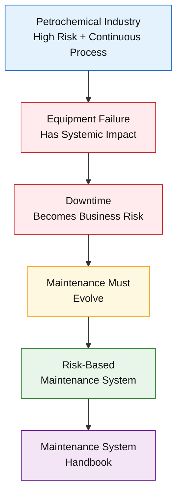
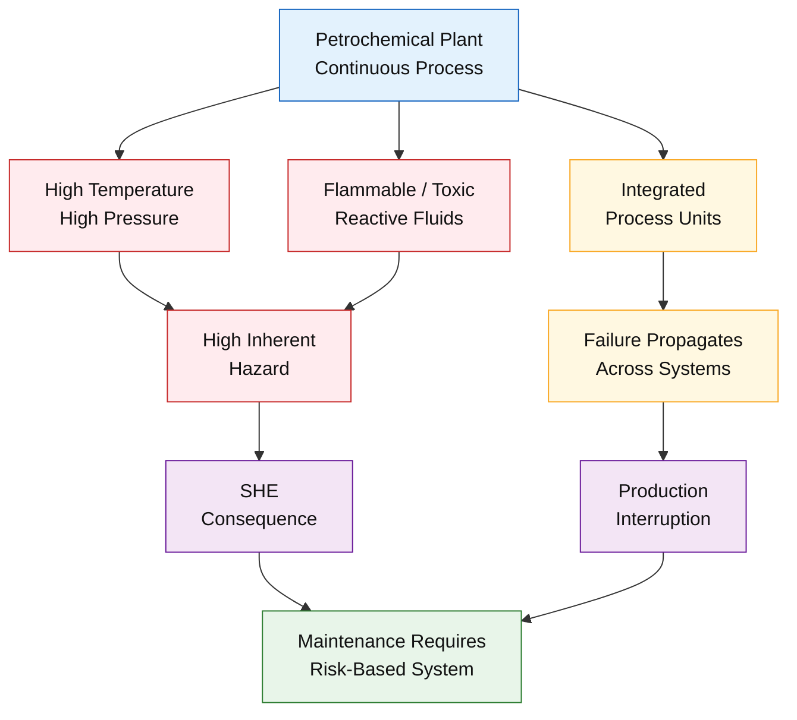
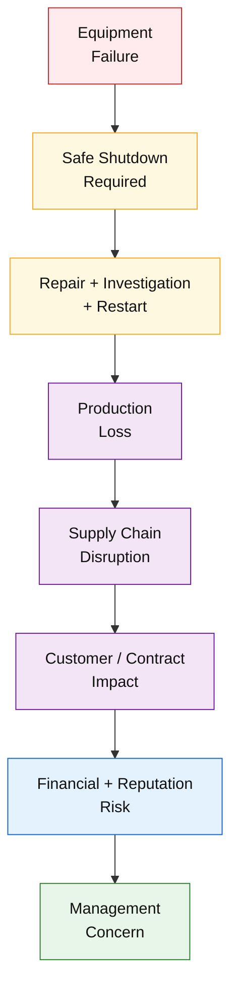
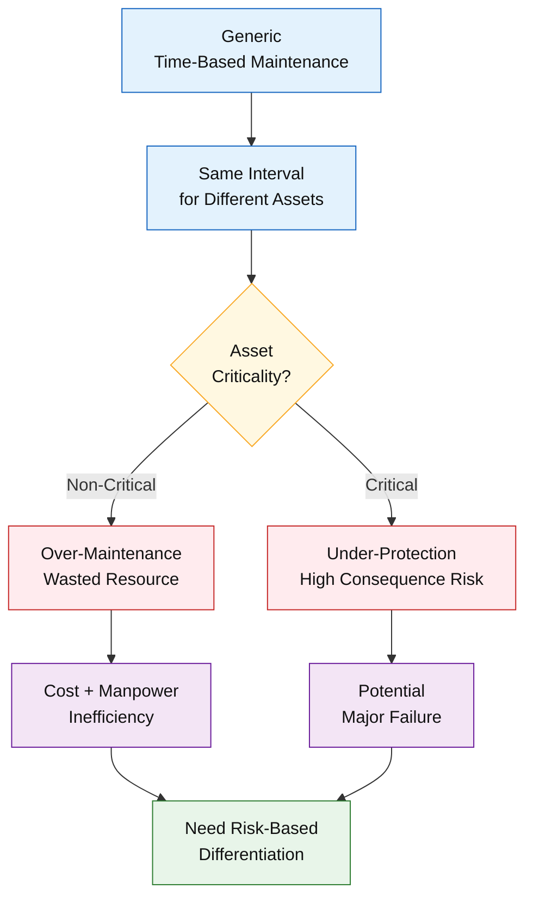
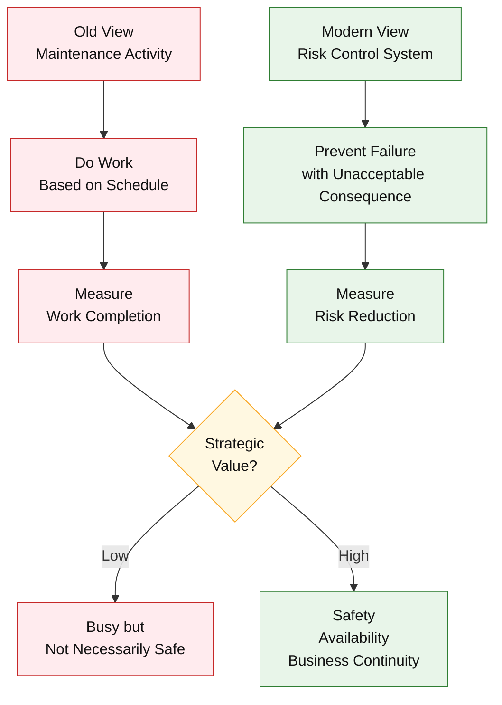
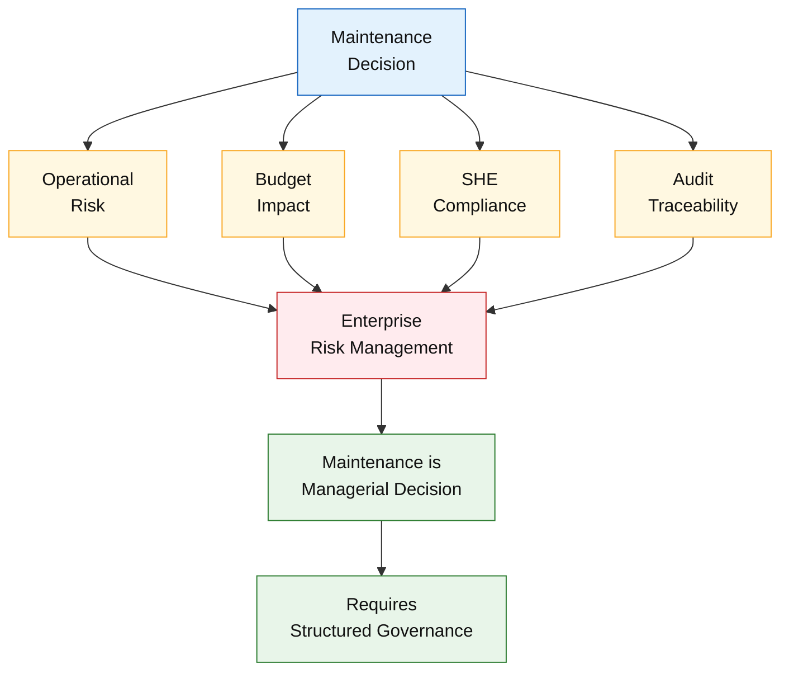
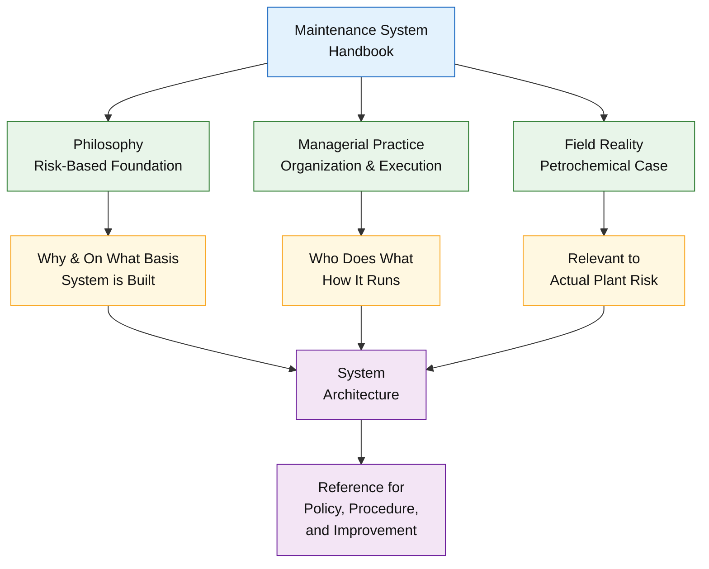
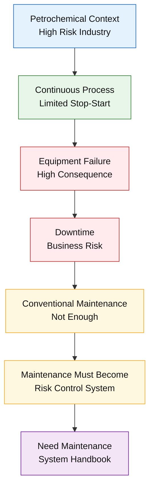
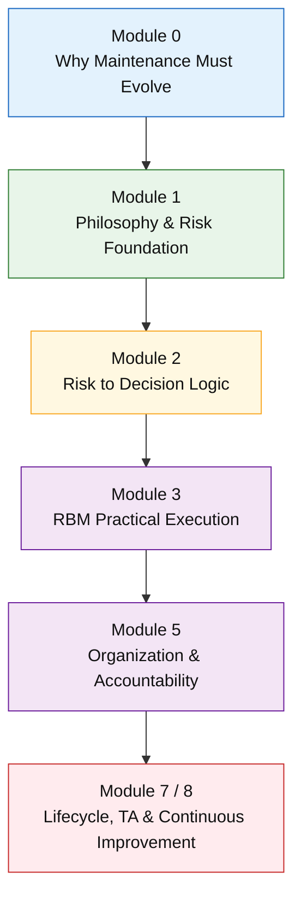

# **_Konteks Industri dan Alasan Sistem Pemeliharaan Harus Berevolusi_**

---

- [**_Konteks Industri dan Alasan Sistem Pemeliharaan Harus Berevolusi_**](#konteks-industri-dan-alasan-sistem-pemeliharaan-harus-berevolusi)
- [📌 Prolog Modul](#-prolog-modul)
- [0.1 Karakteristik Industri Petrokimia dan Proses Kontinu](#01-karakteristik-industri-petrokimia-dan-proses-kontinu)
- [0.2 Konsekuensi Downtime: Dari Gangguan Teknis ke Risiko Bisnis](#02-konsekuensi-downtime-dari-gangguan-teknis-ke-risiko-bisnis)
- [0.3 Keterbatasan Pendekatan Pemeliharaan Konvensional](#03-keterbatasan-pendekatan-pemeliharaan-konvensional)
- [0.4 Pergeseran Paradigma: Dari Aktivitas Pemeliharaan ke Sistem Pengendalian Risiko](#04-pergeseran-paradigma-dari-aktivitas-pemeliharaan-ke-sistem-pengendalian-risiko)
- [0.5 Posisi Maintenance dalam Tata Kelola Perusahaan](#05-posisi-maintenance-dalam-tata-kelola-perusahaan)
- [0.6 Tujuan Penyusunan _Maintenance System Handbook_](#06-tujuan-penyusunan-maintenance-system-handbook)
- [🧠 Kesimpulan Module 0](#-kesimpulan-module-0)
- [🔗 Korelasi dengan Modul Lain](#-korelasi-dengan-modul-lain)
- [📚 Referensi Module 0](#-referensi-module-0)

---

# 📌 Prolog Modul

Modul ini merupakan **bagian pembuka** dari **Maintenance System Handbook (MSH)** dan disusun sebagai **landasan kontekstual** sebelum pembahasan teknis, metodologis, dan implementatif pada modul-modul berikutnya. Fokus utama Modul 0 adalah membangun **kerangka berpikir yang selaras** bagi seluruh pemangku kepentingan—mulai dari engineer, supervisor, hingga manajemen puncak—terhadap **alasan fundamental** mengapa sistem pemeliharaan di industri petrokimia **harus berevolusi**.

Sistem pemeliharaan modern **tidak muncul sebagai adopsi tren manajerial atau teknologi semata**, melainkan sebagai **respons rasional** terhadap karakteristik industri petrokimia yang berisiko tinggi, padat modal, dan beroperasi secara kontinu. Dalam konteks ini, kegagalan peralatan tidak hanya berdampak pada aspek teknis, tetapi juga berimplikasi langsung terhadap **keselamatan, lingkungan, kontinuitas operasi, serta risiko bisnis dan reputasi perusahaan**.

Oleh karena itu, Modul 0 ditempatkan untuk menjawab pertanyaan mendasar **“mengapa”** sistem pemeliharaan harus dibangun secara sistemik, berbasis risiko, dan terintegrasi dengan tata kelola perusahaan. Pemahaman konteks ini menjadi **prasyarat logis** sebelum memasuki Modul 1 dan seterusnya, yang akan membahas **“atas dasar apa”** sistem tersebut dirancang dan **“bagaimana”** ia diimplementasikan secara konsisten dan berkelanjutan.

<ResourceBox
  title="Korelasi internal-link modul:"
  items={[
    {
      name: 'Maintenance System Handbook (MSH)',
      href: '/blog/management/MSH/MSH-panduan-lengkap',
      description:
        'Dari Risk-Based Thinking ke Reliability-Driven Organization - Panduan Lengkap Maintenance System Handbook',
    },
    {
      name: 'Filosofi dan Fondasi Risiko',
      href: '/blog/management/MSH/MSH-1-maintenance-fondasi-risiko',
      description: 'Module 1 – Filosofi dan Fondasi Risiko Sistem Pemeliharaan',
    },
    {
      name: 'Lifecycle Aset',
      href: '/blog/management/MSH/MSH-8-lifecycle-ta',
      description:
        'Module 8 – Lifecycle Aset, Turnaround, dan Continuous Improvement Sistem Pemeliharaan',
    },
  ]}
/>

---

# 0.1 Karakteristik Industri Petrokimia dan Proses Kontinu

Industri petrokimia termasuk dalam kategori **high-risk, high-capital, continuous process industry**, di mana proses produksi berjalan secara berkelanjutan dan sangat bergantung pada kestabilan operasi setiap peralatan utama. Tidak seperti industri diskrit yang dapat menghentikan dan memulai kembali proses dengan relatif mudah, industri petrokimia dirancang untuk **beroperasi tanpa interupsi** dalam jangka waktu panjang demi menjaga kestabilan reaksi, kualitas produk, dan efisiensi energi.

Karakteristik proses ini menjadikan **keandalan peralatan (equipment reliability)** sebagai prasyarat mutlak. Setiap peralatan—baik statis, rotating, electrical, maupun instrumentasi—berfungsi sebagai bagian dari satu sistem yang saling terhubung. Kegagalan pada satu komponen kritis tidak berdiri sendiri, melainkan dapat memicu **dampak sistemik** berupa gangguan proses lanjutan, ketidakstabilan unit hilir, hingga penghentian total operasi pabrik.

Dari sisi kondisi operasi, industri petrokimia beroperasi pada **suhu dan tekanan tinggi**, sering kali melibatkan fluida mudah terbakar, beracun, atau reaktif. Reaksi kimia yang berlangsung di dalam reaktor, kolom distilasi, dan sistem pemrosesan gas memiliki potensi bahaya inheren yang tinggi apabila terjadi deviasi proses. Dalam konteks ini, kegagalan peralatan tidak hanya berisiko menyebabkan kerusakan mekanis, tetapi juga dapat berkembang menjadi **insiden keselamatan dan lingkungan** dengan konsekuensi serius.

Selain itu, sifat proses kontinu membuat konsep “stop–start” yang lazim pada industri manufaktur diskrit **tidak dapat diterapkan secara praktis**. Penghentian operasi secara mendadak sering kali memerlukan prosedur kompleks, waktu pemulihan yang panjang, serta biaya yang sangat besar. Oleh karena itu, strategi pemeliharaan yang mengandalkan pendekatan generik tanpa mempertimbangkan karakteristik proses dan kritikalitas peralatan menjadi tidak memadai.

📌 **Fungsi dalam handbook:**
Bagian ini menetapkan **baseline realitas industri petrokimia**, yaitu bahwa sistem pemeliharaan harus dirancang berdasarkan kondisi operasi nyata, tingkat risiko inheren, dan sifat proses yang saling terintegrasi—bukan semata-mata berdasarkan teori atau praktik pemeliharaan generik.

---

# 0.2 Konsekuensi Downtime: Dari Gangguan Teknis ke Risiko Bisnis

Dalam industri petrokimia, **downtime tidak dapat diperlakukan sebagai isu teknis semata**. Setiap gangguan operasi—terutama pada peralatan kritikal—secara langsung bertransformasi menjadi **risiko bisnis** yang berdampak luas dan berlapis. Hal ini disebabkan oleh sifat proses yang kontinu, ketergantungan antar unit, serta tingginya eksposur biaya dan kewajiban komersial yang melekat pada operasi pabrik petrokimia.

Secara operasional, satu kegagalan peralatan utama dapat memicu **shutdown proses dengan durasi minimum sekitar tiga hari**, yang mencakup waktu penghentian aman (safe shutdown), investigasi teknis, perbaikan, serta proses start-up kembali. Dalam rentang waktu tersebut, perusahaan tidak hanya kehilangan kapasitas produksi, tetapi juga menanggung **kerugian material langsung** yang pada banyak kasus dapat melampaui **USD 500.000**, belum termasuk biaya oportunitas dan dampak finansial tidak langsung.

Dampak downtime juga meluas ke **rantai pasok (supply chain)**. Keterlambatan produksi menyebabkan kegagalan pemenuhan jadwal pengiriman produk, terganggunya kontrak penjualan, serta meningkatnya potensi komplain pelanggan. Dalam industri dengan bahan baku impor dan kontrak penjualan jangka panjang, gangguan semacam ini dapat merusak kepercayaan mitra bisnis dan menurunkan kredibilitas perusahaan di pasar.

Lebih jauh, downtime yang berulang atau tidak terkendali akan menarik perhatian **manajemen puncak**, karena implikasinya tidak lagi berada di level teknis, melainkan menyentuh aspek **keberlanjutan bisnis, kinerja keuangan, dan reputasi korporasi**. Pada titik ini, pemeliharaan tidak lagi dipandang sebagai fungsi pendukung, melainkan sebagai salah satu faktor penentu dalam pengelolaan risiko perusahaan secara keseluruhan.

📌 **Chain logic:**
**Downtime → Business Risk → Management Concern**

Rantai logika ini menjadi dasar mengapa sistem pemeliharaan di industri petrokimia harus dirancang untuk **mencegah kegagalan dengan konsekuensi besar**, bukan sekadar memperbaiki kerusakan setelah terjadi.

---

# 0.3 Keterbatasan Pendekatan Pemeliharaan Konvensional

Pendekatan pemeliharaan konvensional yang paling umum diterapkan di industri adalah **Time-Based Maintenance (TBM)**, yaitu pemeliharaan yang dijadwalkan berdasarkan interval waktu tetap, seperti jam operasi, siklus kalender, atau rekomendasi pabrikan. Dalam batas tertentu, TBM memiliki peran penting sebagai **fondasi dasar** untuk menjaga ketersediaan peralatan dan mencegah degradasi yang bersifat umum.

Namun, dalam konteks industri petrokimia yang berisiko tinggi dan sangat kompleks, TBM generik mengandung **asumsi mendasar yang keliru**, yaitu bahwa **seluruh peralatan memiliki tingkat nilai, risiko, dan dampak kegagalan yang relatif sama**. Asumsi ini menjadi sumber utama keterbatasan TBM ketika diterapkan tanpa diferensiasi kritikalitas aset.

Dampak langsung dari pendekatan ini adalah terjadinya **over-maintenance pada aset non-kritis**, di mana sumber daya pemeliharaan—tenaga kerja, waktu shutdown parsial, dan biaya—dihabiskan untuk peralatan yang kegagalannya tidak berdampak signifikan terhadap keselamatan, lingkungan, atau kontinuitas produksi. Sebaliknya, aset yang bersifat **kritis** justru berisiko mengalami **under-protection**, karena diperlakukan dengan interval dan metode pemeliharaan yang sama dengan peralatan berisiko rendah.

Ketidakseimbangan ini pada akhirnya menghasilkan **inefisiensi biaya dan tenaga kerja**, tanpa memberikan peningkatan keandalan yang sepadan. Lebih jauh lagi, TBM yang diterapkan secara seragam cenderung gagal mengantisipasi kegagalan dengan konsekuensi besar, karena fokusnya lebih pada kepatuhan jadwal daripada pada **dampak kegagalan aktual**.

📌 **Catatan penting:**
Bagian ini **tidak dimaksudkan untuk meniadakan atau menyerang Time-Based Maintenance (TBM)**. Sebaliknya, pembahasan ini menegaskan bahwa TBM memiliki **batas validitas** dan perlu ditempatkan dalam kerangka sistem yang lebih luas, di mana frekuensi dan kedalaman pemeliharaan ditentukan oleh **tingkat risiko dan kritikalitas peralatan**, bukan semata oleh waktu.

---

# 0.4 Pergeseran Paradigma: Dari Aktivitas Pemeliharaan ke Sistem Pengendalian Risiko

Keterbatasan pendekatan pemeliharaan konvensional mendorong perlunya **pergeseran paradigma** dalam memandang fungsi maintenance. Dalam konteks industri petrokimia, pemeliharaan tidak lagi dapat diposisikan sebagai sekadar **kumpulan aktivitas teknis** yang bertujuan menjaga peralatan tetap beroperasi, melainkan harus dipahami sebagai **sistem pengendalian risiko (risk control system)** yang terintegrasi dengan keseluruhan operasi dan tata kelola perusahaan.

Pergeseran ini ditandai oleh perubahan fokus yang mendasar. Jika pendekatan lama menitikberatkan pada _“melakukan pekerjaan pemeliharaan sesuai jadwal”_, maka pendekatan modern menempatkan tujuan utama pada _“mencegah terjadinya kegagalan dengan konsekuensi yang tidak dapat diterima”_. Dengan demikian, keberhasilan pemeliharaan tidak diukur dari banyaknya pekerjaan yang diselesaikan, melainkan dari **seberapa efektif sistem tersebut mengurangi risiko keselamatan, lingkungan, dan gangguan operasi**.

Dalam kerangka ini, pemeliharaan tidak lagi relevan untuk diperlakukan sebagai **cost center** yang semata-mata menyerap anggaran. Sebaliknya, maintenance menjadi **enabler utama** bagi:

- **keselamatan kerja (safety)**,
- **ketersediaan fasilitas produksi (availability)**, dan
- **keberlanjutan bisnis (business continuity)**.

Pendekatan ini mengharuskan setiap keputusan pemeliharaan—mulai dari penentuan interval, metode inspeksi, hingga alokasi sumber daya—dikaitkan langsung dengan **risiko dan dampak kegagalan** yang ingin dikendalikan. Tanpa kerangka berpikir tersebut, pemeliharaan akan terjebak pada aktivitas rutin yang patuh prosedur, tetapi tidak efektif secara strategis.

📌 **Jembatan ke Modul 1:**
Pada titik inilah kebutuhan akan **filosofi pemeliharaan berbasis risiko (risk-based philosophy)** menjadi nyata. Modul berikutnya akan membahas **atas dasar apa** sistem pemeliharaan modern dibangun, termasuk legitimasi konseptual dan standar yang menjadi rujukan dalam merancang sistem pemeliharaan yang konsisten, terukur, dan dapat dipertanggungjawabkan.

---

# 0.5 Posisi Maintenance dalam Tata Kelola Perusahaan

Dalam industri petrokimia, fungsi maintenance **tidak dapat lagi dipandang sebagai fungsi teknis yang berdiri sendiri**. Kompleksitas operasi, besarnya eksposur risiko, serta dampak finansial dari setiap keputusan pemeliharaan menempatkan maintenance sebagai **bagian integral dari tata kelola perusahaan (corporate governance)**.

Setiap keputusan pemeliharaan memiliki keterkaitan langsung dengan **manajemen risiko perusahaan**. Penentuan prioritas peralatan, penundaan pekerjaan, pemilihan metode pemeliharaan, hingga keputusan penggantian dini aset akan memengaruhi profil risiko keselamatan, lingkungan, dan kontinuitas operasi. Dengan demikian, maintenance berperan sebagai salah satu instrumen utama dalam pengendalian risiko operasional, sejajar dengan fungsi produksi, SHE, dan manajemen risiko korporat.

Dari sisi **anggaran**, maintenance merupakan salah satu kontributor biaya operasional terbesar dalam industri petrokimia. Namun, biaya tersebut tidak berdiri sendiri, melainkan terkait erat dengan keputusan strategis mengenai tingkat proteksi aset, toleransi risiko, dan target keandalan fasilitas. Tanpa kerangka sistem yang jelas, keputusan anggaran pemeliharaan berpotensi bersifat reaktif, defensif, atau sekadar mengikuti pola historis, tanpa mempertimbangkan dampak jangka panjang terhadap keandalan dan keberlanjutan bisnis.

Selain itu, pemeliharaan memiliki hubungan langsung dengan **kepatuhan terhadap aspek Safety, Health, and Environment (SHE)** serta **audit internal dan eksternal**. Banyak temuan audit keselamatan, lingkungan, maupun keandalan aset berakar pada kelemahan dalam sistem pemeliharaan, baik dari sisi perencanaan, eksekusi, maupun dokumentasi. Oleh karena itu, maintenance harus diposisikan sebagai fungsi yang **audit-ready**, dengan keputusan dan tindakannya dapat ditelusuri, dijustifikasi, dan dipertanggungjawabkan.

Dalam konteks ini, menjadi jelas bahwa **keputusan maintenance adalah keputusan manajerial**, bukan sekadar keputusan teknis lapangan. Keputusan tersebut memerlukan **kerangka sistem yang terstruktur**, berbasis data dan risiko, serta terintegrasi dengan kebijakan perusahaan—bukan bergantung pada intuisi individu atau kebiasaan historis. Posisi inilah yang menuntut pemeliharaan modern untuk dibangun di atas filosofi, tata kelola, dan mekanisme pengambilan keputusan yang konsisten dan transparan.

---

# 0.6 Tujuan Penyusunan _Maintenance System Handbook_

_Maintenance System Handbook_ disusun sebagai respons atas kebutuhan nyata akan **kerangka sistem pemeliharaan yang utuh, konsisten, dan dapat dipertanggungjawabkan** di lingkungan industri petrokimia. Selama ini, banyak organisasi memiliki prosedur, standar kerja, dan praktik pemeliharaan yang berjalan secara parsial—kuat di sisi teknis, namun lemah dalam integrasi filosofi, pengambilan keputusan, dan tata kelola risiko.

Handbook ini bertujuan untuk menjadi **one-stop reference** yang menyatukan berbagai perspektif pemeliharaan ke dalam satu arsitektur sistem yang koheren. Ia dirancang untuk digunakan oleh **berbagai level organisasi**, mulai dari engineer dan supervisor di lapangan, hingga manajer dan pimpinan pabrik yang bertanggung jawab atas keandalan aset, keselamatan, dan keberlanjutan bisnis.

Secara substansi, _Maintenance System Handbook_ mengintegrasikan tiga pilar utama:

- **Filosofi dan landasan konseptual** pemeliharaan berbasis risiko, sebagaimana dibahas dalam **Artikel 1**, yang menjawab pertanyaan _mengapa_ dan _atas dasar apa_ sistem pemeliharaan dibangun;
- **Praktik manajerial dan eksekusi pemeliharaan**, sebagaimana diuraikan dalam **Artikel 2**, yang menjelaskan _siapa melakukan apa_ dan _bagaimana sistem dijalankan_ secara operasional;
- **Realitas lapangan dan studi kasus industri petrokimia**, sebagaimana dipaparkan dalam **Artikel 3**, yang memastikan bahwa sistem yang dirancang tetap relevan terhadap kondisi operasi nyata dan risiko aktual.

📌 **Penegasan:**
Handbook ini **bukan Standard Operating Procedure (SOP)** dan tidak dimaksudkan untuk menggantikan prosedur teknis yang sudah ada. Sebaliknya, dokumen ini berfungsi sebagai **arsitektur sistem**, yaitu kerangka berpikir dan pengambilan keputusan yang menjadi acuan dalam menyusun, menilai, dan menyempurnakan seluruh kebijakan, prosedur, dan praktik pemeliharaan di tingkat organisasi.

---

# 🧠 Kesimpulan Module 0

Modul 0 menegaskan bahwa **kebutuhan akan sistem pemeliharaan modern bukan merupakan pilihan strategis yang bersifat opsional**, melainkan **konsekuensi logis dan tak terelakkan** dari karakter industri petrokimia itu sendiri. Lingkungan operasi dengan risiko tinggi, proses yang bersifat kontinu, serta eksposur kerugian yang besar menjadikan setiap kegagalan peralatan sebagai isu yang melampaui ranah teknis, dan langsung berdampak pada **keselamatan, lingkungan, kontinuitas operasi, serta keberlanjutan bisnis**.

Dalam konteks tersebut, pendekatan pemeliharaan yang reaktif, generik, dan berbasis kebiasaan tidak lagi memadai. Industri petrokimia menuntut **sistem pemeliharaan yang dibangun secara sadar**, berbasis **pengendalian risiko, pengambilan keputusan yang terstruktur, dan tata kelola yang jelas**. Pemeliharaan harus diposisikan sebagai bagian dari mekanisme manajemen risiko perusahaan, bukan sekadar fungsi pendukung operasional.

Tanpa pemahaman konteks yang dibangun dalam Modul 0 ini, pembahasan teknis dan metodologis pada modul-modul berikutnya akan kehilangan **makna strategis**, karena tidak memiliki landasan “mengapa” yang kuat. Oleh sebab itu, Modul 0 menjadi prasyarat konseptual untuk memahami dan menerima keseluruhan kerangka _Maintenance System Handbook_.

---

# 🔗 Korelasi dengan Modul Lain

- **Module 1**: Menjawab _atas dasar apa_ sistem pemeliharaan modern dibangun, termasuk filosofi dan legitimasi risk-based approach. [_Module 1 – Filosofi dan Fondasi Risiko Sistem Pemeliharaan_](/blog/management/MSH/MSH-1-maintenance-fondasi-risiko)
- **Module 2**: Menguraikan _bagaimana risiko diterjemahkan menjadi keputusan_ dalam sistem pemeliharaan. [_Module 2 – Model Risiko dan Logika Pengambilan Keputusan Pemeliharaan_](/blog/management/MSH/MSH-2-model-risiko)
- **Module 7**: Menutup keseluruhan sistem dengan _evaluasi, pembelajaran, dan perbaikan berkelanjutan_ dalam perspektif jangka panjang. [_Module 7 – Lifecycle, Turnaround & Continuous Improvement_](/blog/management/MSH/MSH-8-lifecycle-ta)

---

# 📚 Referensi Module 0

**Module 0 – Konteks Industri dan Alasan Sistem Pemeliharaan Harus Berevolusi**

Referensi berikut menjadi dasar konseptual dan kontekstual dalam menyusun Module 0 sebagai _opening frame_ dari **Maintenance System Handbook (MSH)**. Fokus referensi bukan pada metode teknis detail, melainkan pada **realitas industri proses, risiko sistemik, dan implikasi bisnis dari kegagalan peralatan**.

---

1. **Artikel Internal – Studi Kasus Operasional**

   - **Risk-Based Maintenance (RBM) di Industri Petrokimia – Studi Kasus PT. Petro Oxo Nusantara** (Artikel 3)
     Digunakan sebagai sumber utama untuk:

     - karakteristik proses kontinu,
     - konsekuensi downtime absolut,
     - keterkaitan langsung antara kegagalan teknis dan risiko bisnis.

2. **Artikel Internal – Perspektif Manajerial**

   - **Efisiensi dan Keandalan dalam Manajemen Pemeliharaan** (Artikel 2)
     Menjadi rujukan untuk:

     - posisi strategis maintenance dalam organisasi,
     - hubungan maintenance dengan anggaran, tata kelola, dan akuntabilitas manajerial,
     - pergeseran maintenance dari fungsi teknis menjadi fungsi pengendalian operasional.

3. **Artikel Internal – Fondasi Sistem**

   - **Maintenance System berbasis API RP 580** (Artikel 1)
     Digunakan untuk:

     - definisi sistem pemeliharaan sebagai rangkaian proses terintegrasi,
     - penegasan bahwa maintenance adalah sistem, bukan aktivitas terpisah.

---

4. **American Petroleum Institute**
   **API Recommended Practice 580 – Risk-Based Inspection**
   Referensi normatif yang memperkuat argumen bahwa:

   - pendekatan berbasis risiko lahir dari kebutuhan industri proses berisiko tinggi,
   - kegagalan peralatan memiliki implikasi keselamatan, lingkungan, dan bisnis.

5. **International Organization for Standardization**
   **ISO 31000 – Risk Management: Guidelines**
   Digunakan sebagai rujukan konseptual bahwa:

   - risiko adalah konteks organisasi,
   - pengendalian risiko harus terintegrasi dengan pengambilan keputusan strategis.

6. **International Organization for Standardization**
   **ISO 55000 – Asset Management**
   Menjadi landasan pemikiran bahwa:

   - aset industri harus dikelola berbasis nilai dan risiko,
   - sistem pemeliharaan merupakan bagian dari siklus hidup aset jangka panjang.

---

7. **Khan, F. I., & Amyotte, P. (2005)**
   _Risk-Based Maintenance and Inspection for the Process Industries_
   Referensi akademik yang memperkuat argumen bahwa:

   - industri proses tidak dapat mengandalkan pendekatan maintenance generik,
   - konsekuensi kegagalan sering kali lebih dominan daripada probabilitasnya.

---

📌 **Catatan Penutup Referensi Module 0**
Referensi Module 0 secara sengaja **bersifat lintas-disiplin** (teknis–manajerial–risiko–bisnis) untuk menegaskan bahwa kebutuhan akan sistem pemeliharaan modern **bukan isu teknis semata**, melainkan konsekuensi logis dari karakter industri petrokimia itu sendiri.

Dengan fondasi referensi ini, Module 0 berfungsi sebagai **kerangka berpikir bersama** sebelum pembaca memasuki pembahasan filosofis (Module 1) dan teknis-decisional (Module 2–7).

---

<small>
  **_Catatan Penyusunan_** Artikel ini disusun sebagai materi edukasi dan
  referensi umum berdasarkan berbagai sumber pustaka, praktik lapangan, serta
  bantuan alat penulisan. Pembaca disarankan untuk melakukan verifikasi lanjutan
  dan penyesuaian sesuai dengan kondisi serta kebutuhan masing-masing sistem.
</small>
