# **_Model Risiko dan Logika Pengambilan Keputusan Pemeliharaan_**

---

- [**_Model Risiko dan Logika Pengambilan Keputusan Pemeliharaan_**](#model-risiko-dan-logika-pengambilan-keputusan-pemeliharaan)
- [📌 Prolog Modul](#-prolog-modul)
- [2.1 Risiko sebagai Dasar Pengambilan Keputusan Teknis](#21-risiko-sebagai-dasar-pengambilan-keputusan-teknis)
- [2.2 Model Risiko Klasik: Probabilitas × Konsekuensi (PoF × CoF)](#22-model-risiko-klasik-probabilitas--konsekuensi-pof--cof)
- [2.3 Keterbatasan Model PoF × CoF dalam Proses Kontinu](#23-keterbatasan-model-pof--cof-dalam-proses-kontinu)
- [2.4 Konsep ESC (Environmental – Safety – Continuous Running)](#24-konsep-esc-environmental--safety--continuous-running)
- [2.5 Batas Penerimaan Risiko (Risk Acceptance \& Decision Boundary)](#25-batas-penerimaan-risiko-risk-acceptance--decision-boundary)
- [2.6 Keputusan Tanpa PoF: Justifikasi Teknik dan Bisnis (Kasus PT PON)](#26-keputusan-tanpa-pof-justifikasi-teknik-dan-bisnis-kasus-pt-pon)
- [2.7 Legitimasi Keputusan Berbasis Risiko dalam Standar Industri](#27-legitimasi-keputusan-berbasis-risiko-dalam-standar-industri)
- [2.8 Dari Model Risiko ke Keputusan Pemeliharaan](#28-dari-model-risiko-ke-keputusan-pemeliharaan)
- [🧠 Kesimpulan Module 2](#-kesimpulan-module-2)
- [📚 Referensi Module 2](#-referensi-module-2)

---

# 📌 Prolog Modul

Modul ini merupakan **inti konseptual** dari _Maintenance System Handbook (MSH)_. Jika Modul 1 menetapkan **fondasi filosofis dan normatif** sistem pemeliharaan, maka Modul 2 berfungsi sebagai **mekanisme operasional pengambilan keputusan** yang menjembatani filosofi tersebut dengan tindakan nyata di lapangan.

Modul 2 menjawab pertanyaan kunci yang menentukan kualitas dan legitimasi sistem pemeliharaan:

> **“Bagaimana risiko diterjemahkan menjadi keputusan pemeliharaan yang sah, konsisten, dan dapat dipertanggungjawabkan?”**

Pada titik inilah _risk-based thinking_ tidak lagi berhenti sebagai prinsip abstrak, melainkan bertransformasi menjadi **kerangka logika keputusan** yang mengarahkan prioritas, strategi, interval, serta alokasi sumber daya pemeliharaan. Setiap keputusan pemeliharaan—apakah suatu peralatan harus diprioritaskan, dipantau lebih intensif, atau diperlakukan secara konservatif—harus dapat ditelusuri kembali ke **model risiko yang jelas dan dapat dijelaskan**.

Modul ini juga menempatkan diri sebagai **titik temu antara standar industri dan realitas operasional**. Di satu sisi, model risiko klasik seperti _Probabilitas of Failure × Consequences of Failure (PoF × CoF)_ memberikan kerangka baku yang diakui secara internasional. Di sisi lain, studi kasus PT Petro Oxo Nusantara menunjukkan bahwa dalam industri proses kontinu dengan **konsekuensi kegagalan absolut**, model tersebut perlu **diadaptasi secara sadar dan terjustifikasi**, tanpa kehilangan legitimasi teknis maupun normatif.

Dengan demikian, Modul 2 memastikan bahwa keputusan pemeliharaan tidak bersifat intuitif, personal, atau ad-hoc, melainkan merupakan hasil dari **logika risiko yang eksplisit, terdokumentasi, dan selaras dengan tujuan keselamatan, lingkungan, serta keberlangsungan bisnis**.

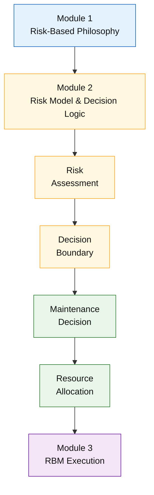

<ResourceBox
  title="Korelasi internal-link modul:"
  items={[
    {
      name: 'Maintenance System Handbook (MSH)',
      href: '/blog/management/MSH/MSH-panduan-lengkap',
      description:
        'Dari Risk-Based Thinking ke Reliability-Driven Organization - Panduan Lengkap Maintenance System Handbook',
    },
    {
      name: 'Fondasi Risiko Sistem Pemeliharaan',
      href: '/blog/management/MSH/MSH-1-maintenance-fondasi-risiko',
      description: 'Module 1 – Filosofi dan Fondasi Risiko Sistem Pemeliharaan',
    },
    {
      name: 'Risk-Based Maintenance',
      href: '/blog/management/MSH/MSH-3-rbm',
      description:
        'Module 3 – Risk-Based Maintenance sebagai Strategi Pemeliharaan Praktis',
    },
  ]}
/>

---

# 2.1 Risiko sebagai Dasar Pengambilan Keputusan Teknis

Dalam konteks sistem pemeliharaan modern, **risiko** dan **kegagalan** merupakan dua konsep yang berbeda namun sering kali disalahartikan sebagai hal yang sama. **Kegagalan teknis** merujuk pada kondisi ketika suatu peralatan tidak lagi mampu menjalankan fungsi desainnya. Sementara itu, **risiko** merepresentasikan **besarnya ancaman yang ditimbulkan oleh kegagalan tersebut terhadap sistem secara keseluruhan**, yang ditentukan oleh kombinasi antara **kemungkinan terjadinya kegagalan** dan **dampak yang ditimbulkannya**.

Perbedaan ini menjadi krusial karena **tidak semua kegagalan teknis menghasilkan risiko tertinggi**. Sebuah komponen non-kritis yang sering gagal mungkin hanya berdampak lokal dan mudah dipulihkan, sedangkan kegagalan yang jarang terjadi pada peralatan kritikal dapat memicu konsekuensi besar terhadap keselamatan, lingkungan, dan kontinuitas operasi. Oleh karena itu, fokus sistem pemeliharaan tidak boleh berhenti pada frekuensi kegagalan semata, melainkan harus diarahkan pada **tingkat risiko yang dihadapi organisasi apabila kegagalan tersebut benar-benar terjadi**.

Dalam kerangka _risk-based maintenance_, fungsi utama pemeliharaan bukanlah sekadar memperbaiki kerusakan, tetapi **menurunkan eksposur risiko hingga berada pada tingkat yang dapat diterima**. Setiap intervensi pemeliharaan—baik inspeksi, penggantian komponen, maupun peningkatan desain—harus diposisikan sebagai tindakan mitigasi risiko. Dengan pendekatan ini, keberhasilan pemeliharaan diukur bukan hanya dari jumlah pekerjaan yang diselesaikan, tetapi dari **kemampuan sistem dalam mencegah konsekuensi kegagalan yang paling berbahaya**.

Konsekuensinya, **keputusan pemeliharaan harus selalu menjawab satu pertanyaan mendasar**: _peralatan atau kegagalan apa yang paling berbahaya jika terjadi?_ Jawaban atas pertanyaan ini menjadi dasar untuk menetapkan prioritas pemeliharaan, menentukan tingkat perhatian teknis, serta mengalokasikan sumber daya yang terbatas secara rasional dan dapat dipertanggungjawabkan.

📌 **Chain logic:**
**Risiko → prioritas → keputusan → alokasi sumber daya**

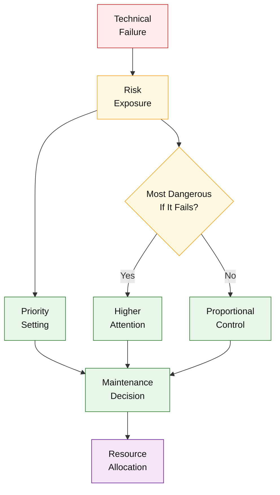

---

# 2.2 Model Risiko Klasik: Probabilitas × Konsekuensi (PoF × CoF)

Model risiko klasik yang paling luas digunakan dalam industri proses adalah pendekatan **Probabilitas of Failure × Consequences of Failure (PoF × CoF)**. Model ini menyediakan **kerangka logika sederhana namun kuat** untuk menerjemahkan ketidakpastian teknis menjadi prioritas pemeliharaan yang dapat dikelola secara sistematis.

**Probabilitas of Failure (PoF)** merepresentasikan **kemungkinan terjadinya kegagalan** suatu peralatan dalam periode waktu tertentu. Penilaian PoF umumnya didasarkan pada kombinasi data historis kegagalan, umur peralatan, kondisi operasi, hasil inspeksi, serta _engineering judgment_. Dalam praktik, PoF tidak selalu berbentuk nilai probabilistik murni, melainkan sering disajikan dalam bentuk **kelas atau kategori kemungkinan** (misalnya sangat rendah hingga sangat tinggi) untuk memudahkan pengambilan keputusan.

Sebaliknya, **Consequences of Failure (CoF)** menggambarkan **besarnya dampak yang ditimbulkan apabila kegagalan tersebut benar-benar terjadi**. Dampak ini tidak terbatas pada aspek teknis, tetapi mencakup dimensi yang lebih luas, antara lain:

- **Keselamatan (Safety):** potensi cedera, fatality, atau kecelakaan proses,
- **Lingkungan (Environment):** pelepasan zat berbahaya, pencemaran, dan konsekuensi regulasi,
- **Produksi:** kehilangan kapasitas, downtime, dan gangguan kontinuitas operasi,
- **Biaya:** biaya perbaikan, penggantian aset, kehilangan pendapatan, serta biaya tidak langsung lainnya.

Kombinasi PoF dan CoF menghasilkan **tingkat risiko relatif** yang digunakan untuk memetakan peralatan ke dalam matriks risiko. Matriks ini berfungsi sebagai **alat prioritisasi**, yaitu untuk menentukan aset mana yang memerlukan perhatian lebih besar, interval inspeksi yang lebih ketat, atau strategi pemeliharaan yang lebih konservatif.

📌 **Catatan penting:**
Model PoF × CoF **bukan alat prediksi absolut** dan tidak dimaksudkan untuk meramalkan kapan kegagalan akan terjadi secara presisi. Fungsinya adalah sebagai **alat bantu keputusan** yang membantu organisasi mengalokasikan sumber daya pemeliharaan secara rasional, transparan, dan dapat dipertanggungjawabkan. Validitas model ini terletak pada **konsistensi logika dan justifikasi keputusan**, bukan pada ketepatan matematis semata.

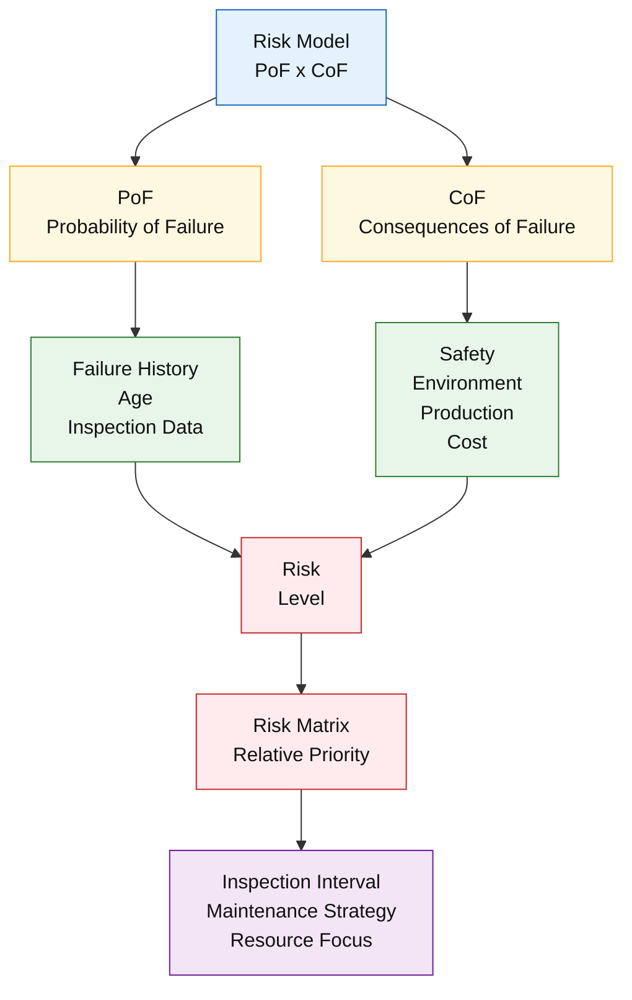

---

# 2.3 Keterbatasan Model PoF × CoF dalam Proses Kontinu

Meskipun model **PoF × CoF** banyak digunakan sebagai kerangka standar dalam penilaian risiko, penerapannya pada **industri proses kontinu** memiliki keterbatasan yang signifikan. Keterbatasan ini bukan disebabkan oleh kelemahan konseptual model, melainkan oleh **ketidaksesuaian antara asumsi model dan realitas operasional** fasilitas proses berisiko tinggi.

Pada industri proses kontinu, **frekuensi kegagalan (PoF)** sering kali **tidak lagi menjadi variabel penentu keputusan**. Banyak peralatan kritikal dirancang dan dioperasikan sedemikian rupa sehingga kegagalannya jarang terjadi. Namun, ketika kegagalan tersebut benar-benar terjadi, **dampaknya bersifat sistemik dan tidak proporsional**. Dengan kata lain, kegagalan yang “jarang” tidak identik dengan risiko yang “rendah”.

Dalam konteks ini, downtime akibat satu kegagalan tunggal dapat memicu:

- **Penghentian proses secara menyeluruh**, bukan hanya pada satu peralatan,
- **Kehilangan produksi dalam jumlah besar** akibat karakter proses yang tidak fleksibel terhadap _stop–start_,
- **Eksposur risiko finansial yang bersifat diskrit dan besar**, bukan gradual,
- **Dampak lanjutan pada supply chain**, kontrak penjualan, dan reputasi perusahaan.

Ketidakseimbangan antara probabilitas dan dampak inilah yang menyebabkan **ketidakproporsionalan dalam model PoF × CoF**. Secara matematis, nilai PoF yang rendah dapat “menurunkan” skor risiko total, padahal secara keputusan manajerial, kegagalan tersebut **tidak dapat diterima dalam kondisi apa pun**. Akibatnya, model risiko klasik berpotensi menghasilkan prioritas yang secara logika teknis tampak benar, tetapi **tidak selaras dengan kebutuhan perlindungan operasi dan bisnis**.

📌 **Penekanan penting:**
Dalam sistem pemeliharaan modern, **model risiko harus tunduk pada realitas operasional**, bukan sebaliknya. Ketika karakter proses menunjukkan bahwa setiap kegagalan membawa konsekuensi besar dan tidak dapat ditoleransi, maka pendekatan risiko perlu disesuaikan secara sadar, terjustifikasi, dan terdokumentasi—meskipun itu berarti menyimpang dari penerapan matematis PoF × CoF yang konvensional.

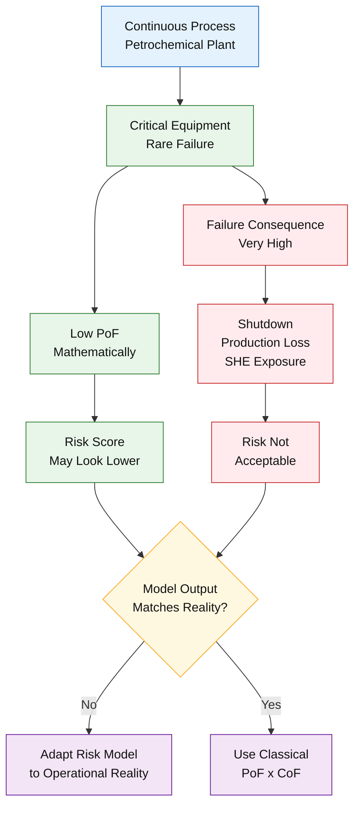

---

# 2.4 Konsep ESC (Environmental – Safety – Continuous Running)

Dalam konteks industri proses kontinu, kompleksitas dampak kegagalan sering kali sulit diterjemahkan secara efektif ke dalam angka atau formula matematis. Untuk menjembatani kebutuhan analisis risiko dengan realitas pengambilan keputusan di lapangan, digunakan konsep **ESC (Environmental – Safety – Continuous Running)** sebagai bentuk **konkret dan operasional dari Consequences of Failure (CoF)**.

ESC menyederhanakan spektrum dampak kegagalan ke dalam tiga dimensi utama yang **paling relevan dan sensitif** bagi industri petrokimia. Pendekatan ini tidak mengurangi kedalaman analisis risiko, tetapi justru meningkatkan **kejelasan komunikasi dan konsistensi keputusan** lintas fungsi.

Dimensi **Environmental** mencakup potensi pencemaran lingkungan, pelepasan zat berbahaya, pelanggaran batas emisi, serta konsekuensi regulasi dan reputasi yang menyertainya. Dalam banyak kasus, satu insiden lingkungan dapat memicu sanksi hukum, penghentian operasi, dan tekanan publik yang berdampak jangka panjang terhadap keberlanjutan bisnis.

Dimensi **Safety** merepresentasikan risiko terhadap keselamatan manusia dan integritas proses. Kegagalan peralatan dapat berujung pada kecelakaan kerja, paparan bahan berbahaya, kebakaran, atau ledakan. Dalam kerangka ESC, aspek keselamatan ditempatkan sebagai **batas absolut keputusan**, di mana risiko yang mengancam nyawa atau keselamatan proses tidak dapat ditoleransi.

Dimensi **Continuous Running** menyoroti dampak kegagalan terhadap **kontinuitas operasi dan rantai pasok**. Pada proses kontinu, gangguan kecil dapat berkembang menjadi penghentian total, kehilangan produksi dalam skala besar, serta kegagalan memenuhi komitmen pengiriman kepada pelanggan.

📌 **Fungsi dalam handbook:**
Konsep ESC berperan sebagai **bahasa operasional bersama** yang menyatukan perspektif engineer, fungsi SHE, dan manajemen. Dengan ESC, diskusi risiko tidak lagi terjebak pada terminologi teknis atau angka probabilitas semata, melainkan berfokus pada **dampak nyata yang harus dikendalikan oleh sistem pemeliharaan**.

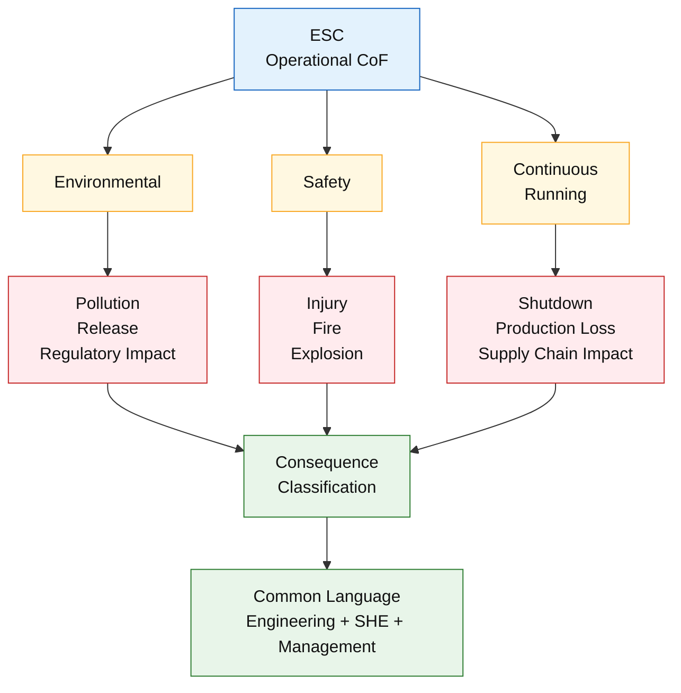

---

# 2.5 Batas Penerimaan Risiko (Risk Acceptance & Decision Boundary)

Dalam sistem pemeliharaan berbasis risiko, tidak semua risiko diperlakukan dengan cara yang sama. Salah satu elemen paling krusial dalam pengambilan keputusan adalah penetapan **batas penerimaan risiko (risk acceptance)**, yaitu tingkat risiko yang secara sadar **dapat diterima, harus dikurangi, atau sama sekali tidak boleh diterima** oleh organisasi. Konsep ini dikenal sebagai **decision boundary**, dan berfungsi sebagai garis pemisah yang menentukan arah tindakan pemeliharaan.

Risiko yang berada **di bawah batas penerimaan** dapat dikelola melalui pengendalian rutin dan pemantauan berkala. Pada tingkat ini, pemeliharaan berfokus pada pengendalian degradasi dan pencegahan kegagalan tanpa intervensi berlebihan. Sebaliknya, ketika risiko berada **di atas batas penerimaan**, organisasi wajib mengambil tindakan untuk **mengurangi eksposur risiko**, misalnya melalui peningkatan frekuensi inspeksi, penerapan condition monitoring, atau penguatan desain dan prosedur operasi.

Terdapat pula kategori risiko yang **tidak boleh diterima sama sekali**, terutama yang berpotensi menimbulkan dampak fatal terhadap keselamatan manusia, kerusakan lingkungan yang signifikan, atau penghentian operasi dengan konsekuensi bisnis yang tidak dapat ditoleransi. Pada kondisi ini, keputusan pemeliharaan tidak lagi bersifat opsional, melainkan **wajib dan segera**, bahkan jika secara teknis probabilitas kegagalannya rendah.

📌 **Catatan penting:**
Penetapan risk acceptance dan decision boundary **bukan keputusan teknis semata**. Keputusan ini mencerminkan **kebijakan manajemen risiko perusahaan**, yang melibatkan pertimbangan strategis, regulasi, toleransi bisnis, serta komitmen terhadap keselamatan dan lingkungan. Oleh karena itu, batas penerimaan risiko harus didefinisikan secara eksplisit, disepakati lintas fungsi, dan terdokumentasi sebagai bagian integral dari sistem pemeliharaan.

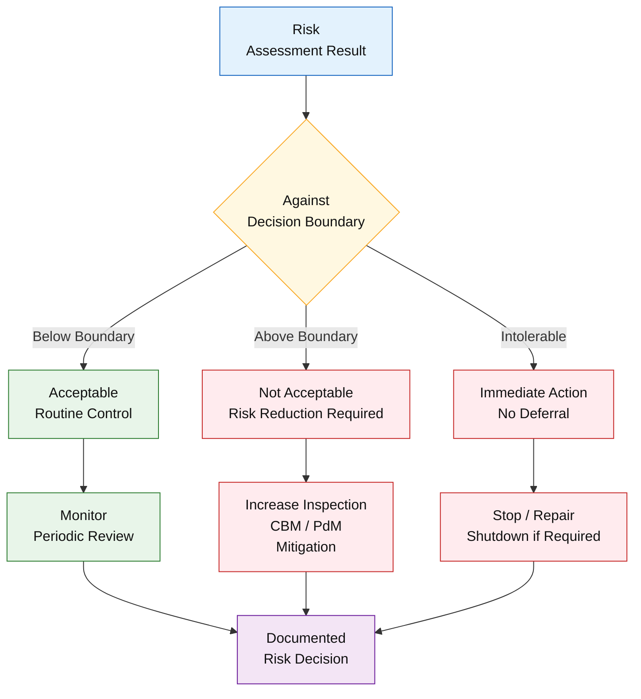

---

# 2.6 Keputusan Tanpa PoF: Justifikasi Teknik dan Bisnis (Kasus PT PON)

Dalam kondisi operasional tertentu, penggunaan **Probabilitas of Failure (PoF)** sebagai variabel penentu risiko dapat kehilangan relevansinya secara praktis. Hal inilah yang menjadi dasar keputusan PT Petro Oxo Nusantara (PT PON) untuk **secara sadar menghilangkan PoF** dalam sistem _Risk-Based Maintenance_ yang diterapkannya. Keputusan ini bukan diambil secara intuitif, melainkan didasarkan pada **justifikasi teknik dan bisnis yang kuat**.

PT PON beroperasi dalam rezim yang dapat dikategorikan sebagai **_absolute consequence regime_**, yaitu kondisi di mana **setiap kegagalan peralatan memiliki konsekuensi yang sangat besar dan tidak dapat ditoleransi**, terlepas dari seberapa jarang kegagalan tersebut terjadi. Dalam konteks ini, seluruh aset utama berada dalam kategori **dampak tinggi**, karena keterkaitan proses yang erat dan sifat operasi yang kontinu.

Secara operasional, setiap kegagalan signifikan akan menyebabkan **shutdown proses minimum selama tiga hari**, yang berdampak langsung pada hilangnya produksi, terganggunya rantai pasok, serta peningkatan risiko keselamatan dan lingkungan selama proses _shutdown_ dan _start-up_. Dari sisi bisnis, satu kejadian kegagalan saja dapat menimbulkan **kerugian material melebihi USD 500.000**, belum termasuk potensi kehilangan pendapatan, penalti kontraktual, dan dampak reputasi.

📌 **Penegasan penting:**
Penghilangan PoF dalam kasus PT PON **bukan merupakan penyimpangan terhadap standar industri**, melainkan **adaptasi yang sah dan rasional berbasis risiko absolut**. Selama keputusan tersebut didukung oleh analisis konsekuensi yang jelas, justifikasi terdokumentasi, serta selaras dengan tujuan perlindungan keselamatan, lingkungan, dan kontinuitas bisnis, pendekatan ini tetap konsisten dengan prinsip _risk-based thinking_ sebagaimana diamanatkan dalam standar industri.

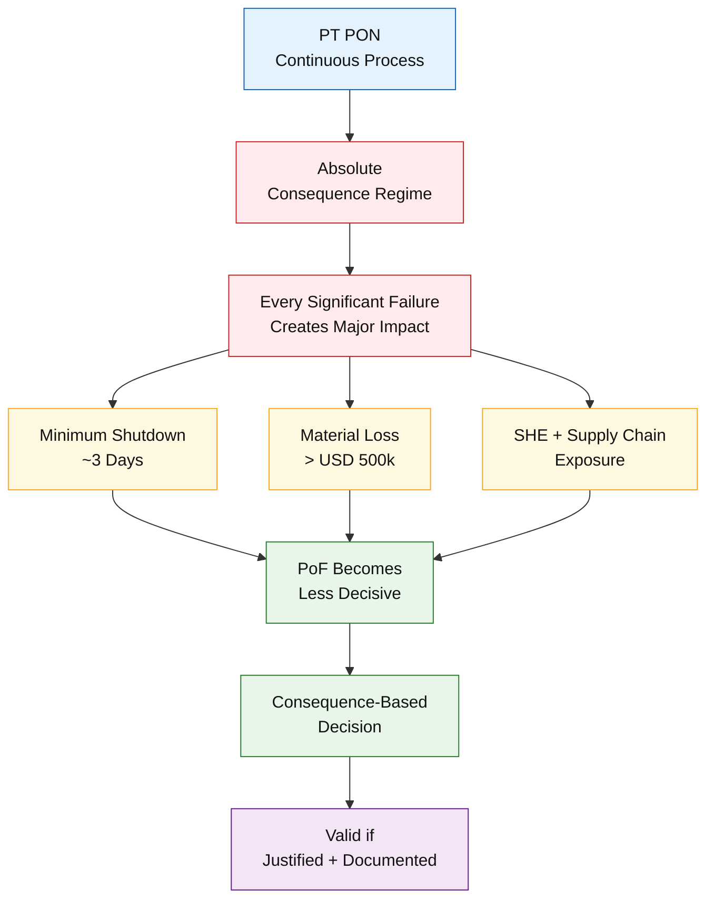

---

# 2.7 Legitimasi Keputusan Berbasis Risiko dalam Standar Industri

Keputusan pemeliharaan berbasis risiko memperoleh **legitimasi normatif** yang kuat melalui standar industri internasional, khususnya **API Recommended Practice 580 – Risk-Based Inspection (RBI)**. Standar ini secara eksplisit mengakui bahwa **tidak terdapat satu metode tunggal** yang harus diterapkan secara seragam pada seluruh fasilitas, mengingat perbedaan karakter proses, tingkat bahaya, ketersediaan data, serta tujuan bisnis masing-masing organisasi.

API RP 580 memberikan **fleksibilitas pendekatan** dengan mengizinkan penggunaan metode **kualitatif, semi-kuantitatif, maupun kuantitatif** dalam pemodelan risiko. Fleksibilitas ini dimaksudkan agar penilaian risiko dapat **disesuaikan dengan konteks fasilitas**, tanpa mengorbankan prinsip dasar _risk-based thinking_. Dengan demikian, organisasi diperkenankan memilih model risiko yang paling representatif terhadap realitas operasionalnya, selama pendekatan tersebut konsisten, transparan, dan terdokumentasi.

Prinsip kunci yang ditekankan dalam standar ini adalah **_engineering judgment_**. Keputusan berbasis risiko tidak dinilai dari kompleksitas formulanya, melainkan dari **kekuatan justifikasi teknis dan logika keputusan** yang digunakan. Selama proses penilaian risiko dapat menjelaskan _mengapa_ suatu aset diprioritaskan, _bagaimana_ dampaknya dikelola, dan _apa_ implikasi keputusannya terhadap keselamatan, lingkungan, dan operasi, maka pendekatan tersebut dinilai sah secara standar.

📌 **Penegasan normatif:**
Dalam kerangka API RP 580, **justifikasi keputusan lebih penting daripada formula matematis**. Standar tidak menuntut keseragaman metode, tetapi menuntut **konsistensi logika, keterlacakan keputusan, dan kesesuaian dengan konteks risiko aktual**. Prinsip inilah yang memberikan dasar normatif bagi adaptasi seperti penghilangan PoF pada kasus PT PON, tanpa kehilangan legitimasi teknis maupun audit-ready.

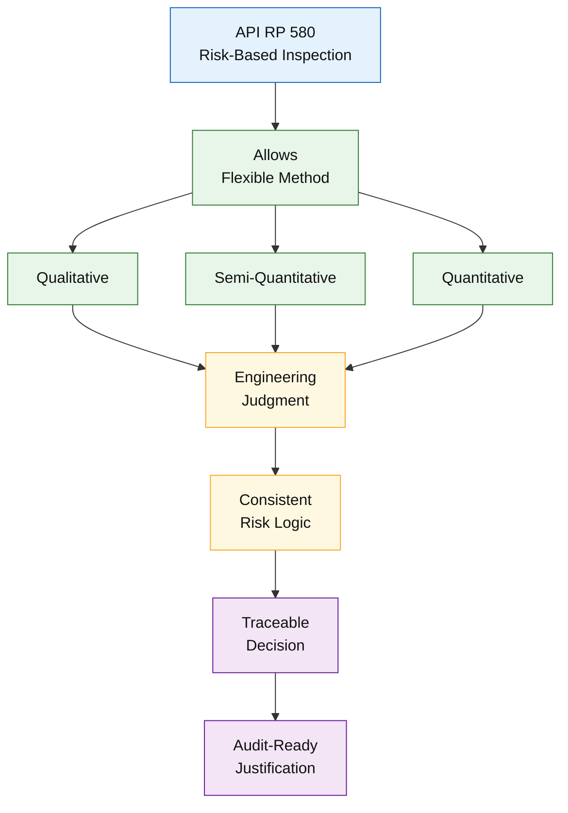

---

# 2.8 Dari Model Risiko ke Keputusan Pemeliharaan

Nilai utama dari model risiko tidak terletak pada formulanya, melainkan pada **kemampuannya untuk diterjemahkan menjadi keputusan pemeliharaan yang konkret dan dapat dieksekusi**. Pada tahap ini, risiko tidak lagi diperlakukan sebagai konsep analitis, tetapi sebagai **dasar langsung penentuan tindakan teknis dan manajerial**.

Hasil penilaian risiko digunakan pertama-tama untuk **menentukan prioritas pemeliharaan**. Aset dengan konsekuensi kegagalan tertinggi ditempatkan pada tingkat perhatian paling atas, sementara aset dengan dampak terbatas dapat dikelola dengan pendekatan yang lebih efisien. Prioritas ini kemudian menjadi dasar dalam **penetapan interval inspeksi**, di mana peralatan berisiko tinggi memerlukan pemantauan lebih sering dan lebih mendalam dibandingkan peralatan berisiko rendah.

Selanjutnya, model risiko mengarahkan **pemilihan strategi pemeliharaan** yang paling sesuai, apakah berupa **Time-Based Maintenance (TBM)**, **Condition-Based Maintenance (CBM)**, **Predictive Maintenance (PdM)**, atau bahkan **redesign dan penggantian dini** apabila risiko tidak dapat diturunkan melalui intervensi rutin. Keputusan ini juga menentukan **tingkat perhatian teknis**, seperti kedalaman inspeksi, kompetensi personel yang dibutuhkan, serta metode monitoring yang digunakan.

Akhirnya, seluruh keputusan tersebut bermuara pada **alokasi sumber daya**—manusia, waktu, anggaran, dan material—yang harus selaras dengan tingkat risiko yang dihadapi. Dengan demikian, sistem pemeliharaan tidak hanya menjadi lebih aman, tetapi juga lebih efisien dan terarah.

📌 **Jembatan ke Modul 3:**
Pada titik inilah **Risk-Based Maintenance (RBM)** muncul sebagai **strategi praktis** yang mengoperasionalkan keputusan berbasis risiko ke dalam program pemeliharaan harian, periodik, dan jangka panjang, sehingga risiko tidak hanya dianalisis, tetapi benar-benar **dikendalikan secara sistematis**.

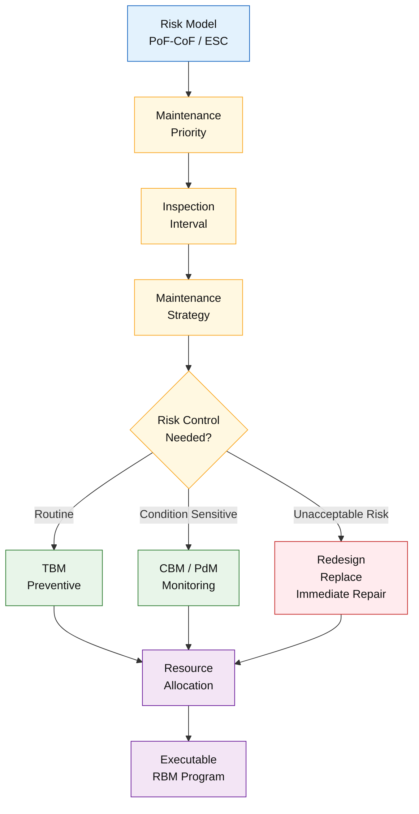

---

# 🧠 Kesimpulan Module 2

Modul 2 menegaskan bahwa **pemeliharaan modern pada industri petrokimia merupakan sistem pengambilan keputusan berbasis risiko**, bukan sekadar penerapan metode teknis atau pemenuhan jadwal kerja. Model klasik **Probabilitas of Failure × Consequences of Failure (PoF × CoF)** menyediakan kerangka awal yang penting untuk memahami dan memetakan risiko, namun **tidak bersifat absolut** dan tidak boleh diterapkan secara mekanis tanpa mempertimbangkan konteks operasional yang sesungguhnya.

Pendekatan **ESC (Environmental – Safety – Continuous Running)** serta keputusan untuk menghilangkan PoF pada kasus PT Petro Oxo Nusantara menunjukkan bahwa **keputusan pemeliharaan yang sah adalah keputusan yang mampu melindungi keselamatan manusia, lingkungan, dan kontinuitas bisnis**, meskipun hal tersebut menuntut penyimpangan yang terjustifikasi dari model matematis klasik. Dengan demikian, legitimasi keputusan pemeliharaan tidak ditentukan oleh kompleksitas formula, melainkan oleh **kekuatan logika risiko, konsistensi kebijakan, dan keterlacakan keputusan**.

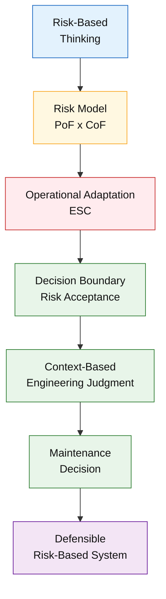

---

<ResourceBox
  title="Korelasi internal-link modul:"
  items={[
    {
      name: 'Maintenance System Handbook (MSH)',
      href: '/blog/management/MSH/MSH-panduan-lengkap',
      description:
        'Dari Risk-Based Thinking ke Reliability-Driven Organization - Panduan Lengkap Maintenance System Handbook',
    },
    {
      name: 'Fondasi Risiko Sistem Pemeliharaan',
      href: '/blog/management/MSH/MSH-1-maintenance-fondasi-risiko',
      description: 'Module 1 – Filosofi dan Fondasi Risiko Sistem Pemeliharaan',
    },
    {
      name: 'SHE sebagai Batas Sistem dalam Pengambilan Keputusan',
      href: '/blog/management/MSH/MSH-7-she-compliance',
      description:
        'Module 7 – SHE sebagai Batas Sistem dalam Pengambilan Keputusan Pemeliharaan',
    },
    {
      name: 'Lifecycle Aset',
      href: '/blog/management/MSH/MSH-8-lifecycle-ta',
      description:
        'Module 8 – Lifecycle Aset, Turnaround, dan Continuous Improvement Sistem Pemeliharaan',
    },
  ]}
  note="Module 8 berfungsi sebagai penutup sekaligus pengunci seluruh sistem, memastikan bahwa _Maintenance System Handbook_ tidak hanya menjadi dokumen referensi, tetapi kerangka kerja yang relevan dan bernilai sepanjang umur aset."
/>

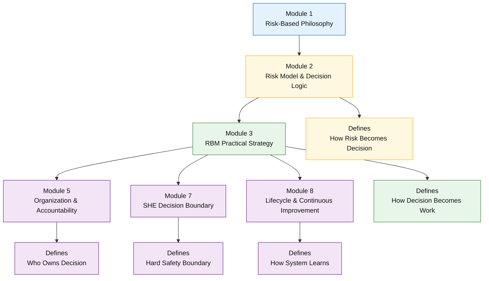

---

# 📚 Referensi Module 2

1. **Artikel 1** – _Maintenance System berbasis API RP 580_
2. **Artikel 3** – _Risk-Based Maintenance di Industri Petrokimia (Bab II & IV)_
3. **API Recommended Practice 580** – _Risk-Based Inspection_
4. **ISO 31000** – _Risk Management Guidelines_
5. **ISO 55000** – _Asset Management_

---

<small>
  **_Catatan Penyusunan_** Artikel ini disusun sebagai materi edukasi dan
  referensi umum berdasarkan berbagai sumber pustaka, praktik lapangan, serta
  bantuan alat penulisan. Pembaca disarankan untuk melakukan verifikasi lanjutan
  dan penyesuaian sesuai dengan kondisi serta kebutuhan masing-masing sistem.
</small>
