**_Risk-Based Maintenance sebagai Strategi Pemeliharaan Praktis_**

---

- [📌 Prolog Modul](#-prolog-modul)
- [3.1 Posisi RBM di antara Strategi Pemeliharaan](#31-posisi-rbm-di-antara-strategi-pemeliharaan)
- [3.2 RBM sebagai Kerangka Seleksi Strategi Pemeliharaan](#32-rbm-sebagai-kerangka-seleksi-strategi-pemeliharaan)
- [3.3 Preventive–Adaptive TBM: Evolusi TBM Tradisional](#33-preventiveadaptive-tbm-evolusi-tbm-tradisional)
- [3.4 Implementasi RBM di PT PON: Langkah Operasional Nyata](#34-implementasi-rbm-di-pt-pon-langkah-operasional-nyata)
- [3.5 Posisi Risk-Based Inspection (RBI) dalam Kerangka RBM](#35-posisi-risk-based-inspection-rbi-dalam-kerangka-rbm)
- [3.6 Tiering Aset dan Pola Evaluasi Berlapis](#36-tiering-aset-dan-pola-evaluasi-berlapis)
- [3.7 _Evaluation Loop_: RBM sebagai Sistem Hidup](#37-evaluation-loop-rbm-sebagai-sistem-hidup)
- [3.8 Perencanaan Pemeliharaan Berbasis 5M + 1E](#38-perencanaan-pemeliharaan-berbasis-5m--1e)
  - [**Man (Sumber Daya Manusia)**](#man-sumber-daya-manusia)
  - [**Machine / Tools (Peralatan dan Akses)**](#machine--tools-peralatan-dan-akses)
  - [**Money (Anggaran)**](#money-anggaran)
  - [**Method (Metode dan Prosedur)**](#method-metode-dan-prosedur)
  - [**Material (Suku Cadang dan Consumable)**](#material-suku-cadang-dan-consumable)
  - [**1E — Environment (Batas Sistem dan Konsekuensi Lingkungan)**](#1e--environment-batas-sistem-dan-konsekuensi-lingkungan)
- [3.9 RBM sebagai Sistem Training dan Disiplin Operasional](#39-rbm-sebagai-sistem-training-dan-disiplin-operasional)
- [🧠 Kesimpulan Module 3](#-kesimpulan-module-3)
- [📚 Referensi Module 3](#-referensi-module-3)

---

## 📌 Prolog Modul

Modul ini merupakan **modul eksekusi utama** dalam _Maintenance System Handbook (MSH)_. Setelah fondasi filosofis dan kerangka pengambilan keputusan dibangun secara berurutan pada modul sebelumnya, Modul 3 berfungsi sebagai **jembatan antara konsep dan praktik lapangan**.

Jika **Module 1** menjelaskan **atas dasar apa** sistem pemeliharaan dibangun, dan **Module 2** menjabarkan **bagaimana risiko diterjemahkan menjadi keputusan yang sah**, maka **Module 3 menjawab pertanyaan yang paling krusial bagi praktisi**:

> **“Bagaimana Risk-Based Maintenance (RBM) diaplikasikan secara nyata di lingkungan pabrik?”**

Pada modul ini, RBM tidak diposisikan sebagai teori tambahan atau metode eksklusif, melainkan sebagai **kerangka kerja praktis** yang mengarahkan pemilihan strategi pemeliharaan, pola evaluasi aset, serta pengaturan fokus dan intensitas pekerjaan di lapangan. Seluruh pembahasan diturunkan hingga level yang **dapat dipahami, dijalankan, dan diaudit**, tanpa kehilangan keterkaitan dengan keputusan risiko di tingkat sistem.

Sebagai tulang punggung pembahasan, Modul 3 menggunakan **studi kasus nyata PT Petro Oxo Nusantara (PT PON)**. Studi kasus ini menunjukkan bagaimana RBM diterapkan secara **pragmatis dan konservatif** pada industri proses kontinu berisiko tinggi, mulai dari pengelolaan aset, pemilihan strategi TBM/CBM/PdM, hingga pembentukan _evaluation loop_ yang berkelanjutan. Dengan pendekatan ini, RBM tidak berhenti sebagai kebijakan di atas kertas, tetapi menjadi **pola pikir teknisi, kerangka kerja supervisor, dan alat kendali manajemen**.

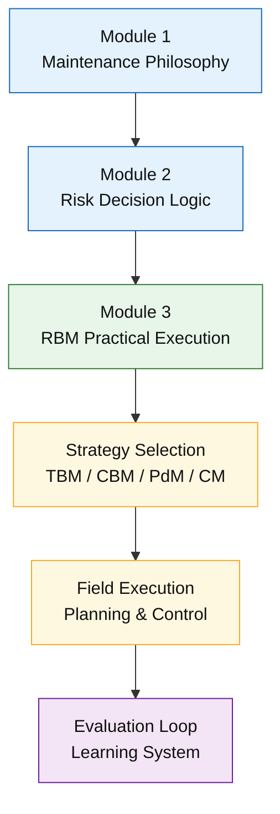

<ResourceBox
  title="Korelasi internal-link modul:"
  items={[
    {
      name: 'Maintenance System Handbook (MSH)',
      href: '/blog/management/MSH/MSH-panduan-lengkap',
      description:
        'Dari Risk-Based Thinking ke Reliability-Driven Organization - Panduan Lengkap Maintenance System Handbook',
    },
    {
      name: 'Model Risiko dan Logika Pengambilan Keputusan',
      href: '/blog/management/MSH/MSH-2-model-risiko',
      description:
        'Module 2 – Model Risiko dan Logika Pengambilan Keputusan Pemeliharaan',
    },
    {
      name: 'Budgeting Maintenance',
      href: '/blog/management/MSH/MSH-4-budgeting',
      description:
        'Module 4 – Budgeting Maintenance Berbasis Risk-Based Maintenance (RBM) di Pabrik Petrokimia',
    },
    {
      name: 'Penerapan Tier dalam RBM',
      href: '/blog/maintenance/maintenance-tier',
      description:
        'Penerapan Tier dalam Risk-Based Maintenance untuk Industri Petrokimia',
    },
    {
      name: 'Strategi Manpower',
      href: '/blog/management/MSH/MSH-manpower',
      description:
        'Strategi Manpower dalam Ekosistem Risk-Based Maintenance (RBM)',
    },
    {
      name: 'SECE Management',
      href: '/blog/safety/sece-management',
      description: 'SECE Management di Industri Petrokimia',
    },
  ]}
/>

---

## 3.1 Posisi RBM di antara Strategi Pemeliharaan

Pada praktik industri, berbagai strategi pemeliharaan seperti **Time-Based Maintenance (TBM)**, **Condition-Based Maintenance (CBM)**, **Predictive Maintenance (PdM)**, dan **Corrective Maintenance (CM)** telah lama dikenal dan digunakan. Namun, permasalahan utama yang sering muncul bukan pada ketersediaan metode tersebut, melainkan pada **ketiadaan kerangka yang jelas untuk menentukan kapan dan pada peralatan mana setiap metode layak diterapkan**. Di sinilah **Risk-Based Maintenance (RBM)** menempati posisinya.

RBM **bukanlah metode pemeliharaan baru** dan tidak dimaksudkan untuk menggantikan TBM, CBM, atau PdM. RBM berfungsi sebagai **kerangka seleksi strategi** yang bekerja pada **level sistem**, bukan pada level tugas individual. Dengan kata lain, RBM tidak menjawab _bagaimana_ suatu pekerjaan pemeliharaan dilakukan, tetapi menjawab _mengapa_ suatu peralatan diperlakukan dengan strategi tertentu dibandingkan yang lain.

Dalam kerangka RBM, setiap metode memiliki tempat dan justifikasinya masing-masing. **TBM** tetap menjadi tulang punggung pemeliharaan rutin, **CBM dan PdM** digunakan ketika risiko dan nilai aset membenarkan investasi teknologi dan sumber daya yang lebih tinggi, sementara **CM** masih dapat diterima untuk peralatan dengan dampak kegagalan yang rendah. RBM memastikan bahwa metode yang paling mahal, paling ketat, dan paling kompleks **hanya diterapkan pada aset yang benar-benar pantas menerimanya**.

Pertanyaan kunci yang dijawab RBM bukanlah _“metode apa yang paling canggih?”_, melainkan:

> _“Peralatan mana yang pantas mendapatkan metode paling mahal dan paling ketat?”_

Dengan pendekatan ini, RBM mencegah dua ekstrem yang sama-sama merugikan, yaitu **over-maintenance** pada aset non-kritis dan **under-protection** pada aset kritikal. Fokus organisasi pemeliharaan diarahkan pada pengelolaan risiko secara proporsional dan terukur.

📌 **Chain logika:**
**RBM → klasifikasi risiko → pemilihan metode → eksekusi pemeliharaan**

Sub-bab ini menegaskan bahwa RBM berperan sebagai **arsitektur pengambilan keputusan** yang menyatukan berbagai strategi pemeliharaan ke dalam satu sistem yang koheren, rasional, dan selaras dengan risiko aktual fasilitas.

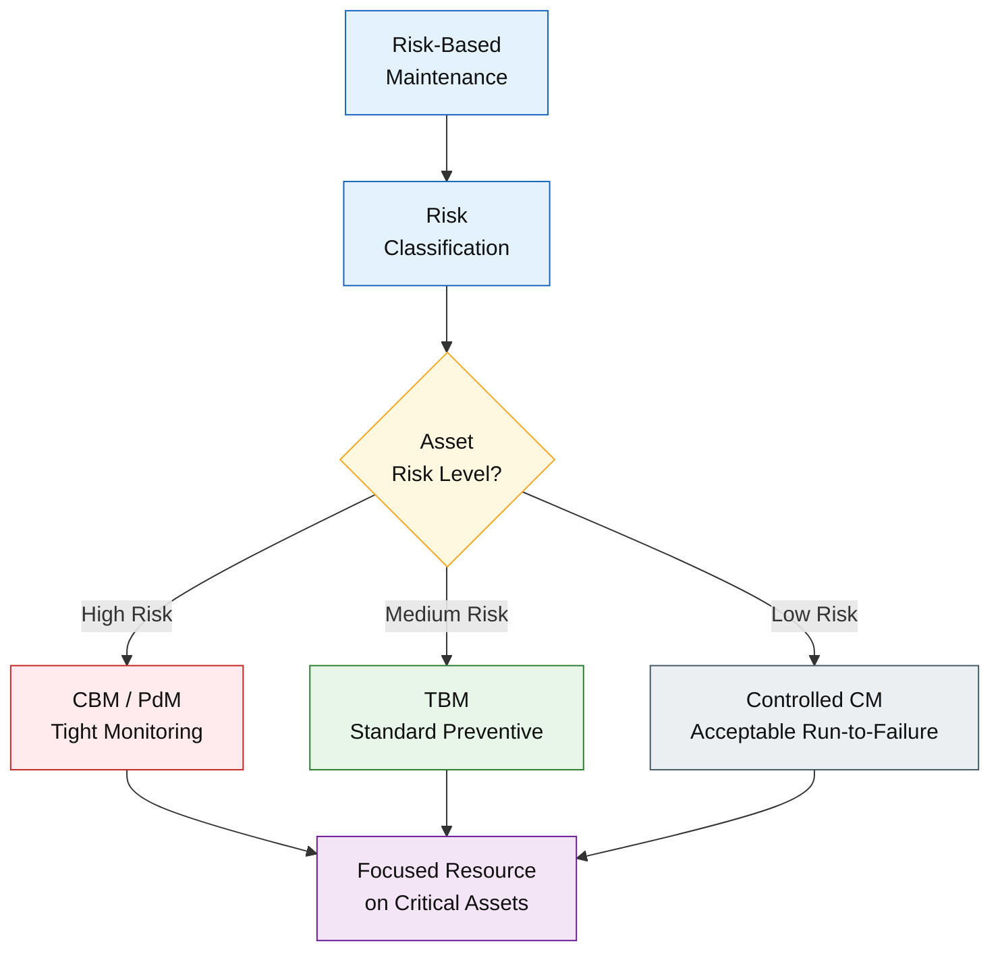

---

## 3.2 RBM sebagai Kerangka Seleksi Strategi Pemeliharaan

Risk-Based Maintenance (RBM) berfungsi sebagai **kerangka seleksi strategis** yang menerjemahkan hasil analisa risiko menjadi **perlakuan pemeliharaan yang berbeda dan proporsional** untuk setiap aset. Pada tahap ini, risiko tidak lagi diposisikan sebagai nilai analitis, melainkan sebagai **penentu tingkat perhatian teknis** yang harus diberikan oleh organisasi pemeliharaan.

Hasil analisa risiko—baik melalui model PoF × CoF maupun pendekatan konsekuensi absolut seperti ESC—digunakan untuk menentukan **frekuensi pemeliharaan**, **kedalaman inspeksi**, serta **metode pemeliharaan** yang paling sesuai. Aset dengan tingkat risiko tinggi atau konsekuensi kegagalan besar memerlukan intervensi yang lebih sering, inspeksi yang lebih mendalam, serta metode pemeliharaan berbasis kondisi atau prediksi yang lebih ketat. Sebaliknya, aset dengan risiko rendah dapat dikelola dengan pendekatan yang lebih sederhana dan efisien.

Dalam praktik RBM, pola seleksi strategi dapat dirangkum sebagai berikut. **Aset kritis** ditempatkan pada interval pemeliharaan yang ketat dan dilengkapi dengan **Condition-Based Maintenance (CBM)** atau **Predictive Maintenance (PdM)** untuk mendeteksi degradasi sedini mungkin. **Aset normal** dikelola menggunakan **Time-Based Maintenance (TBM) standar**, dengan interval dan cakupan pekerjaan yang telah ditetapkan secara konservatif. Sementara itu, **aset non-kritis** dapat menerima pendekatan **corrective maintenance** yang terkendali, selama kegagalannya tidak menimbulkan risiko signifikan terhadap keselamatan, lingkungan, atau kontinuitas operasi.

📌 **Penegasan penting:**
RBM **tidak sekadar mengatur jadwal**, tetapi **mengatur perhatian**. Dengan kerangka ini, organisasi pemeliharaan mampu memfokuskan energi, kompetensi, dan sumber daya pada aset yang paling menentukan risiko sistem, sekaligus menghindari pemborosan pada aset dengan dampak kegagalan yang terbatas.

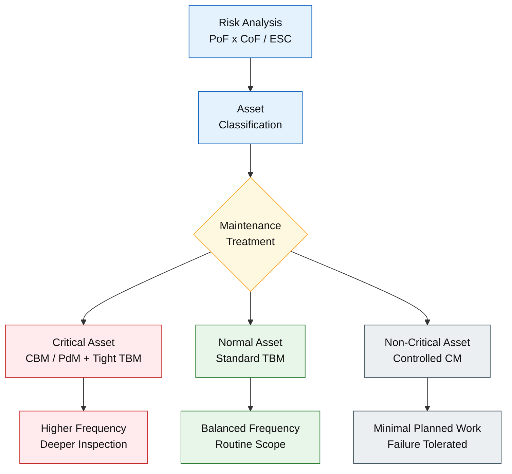

---

## 3.3 Preventive–Adaptive TBM: Evolusi TBM Tradisional

Dalam banyak organisasi, **Time-Based Maintenance (TBM)** sering dipersepsikan sebagai pendekatan yang kaku, mekanis, dan sepenuhnya dikendalikan oleh kalender. Persepsi ini muncul bukan karena kelemahan konsep TBM itu sendiri, melainkan akibat **penerapan TBM yang terlepas dari informasi kondisi aktual peralatan**. Sub-bab ini menegaskan bahwa TBM dapat berevolusi menjadi sistem yang jauh lebih cerdas melalui pendekatan **Preventive–Adaptive TBM**.

Pada praktik di PT Petro Oxo Nusantara, TBM tetap dipertahankan sebagai **backbone sistem pemeliharaan**. Hal ini dilakukan karena TBM memberikan struktur, keteraturan, dan kepastian perencanaan yang sangat dibutuhkan dalam lingkungan proses kontinu. Namun, TBM tidak dijalankan secara _blindly clock-driven_. Interval dan keputusan intervensinya divalidasi dan disesuaikan dengan **data condition monitoring** yang relevan.

Integrasi TBM dengan teknik pemantauan kondisi menghasilkan sistem yang **responsif terhadap degradasi nyata**, bukan sekadar mengikuti jadwal. Contohnya, **TBM yang diperkaya dengan vibration analysis** memungkinkan deteksi dini ketidakseimbangan, misalignment, atau kerusakan bearing sebelum berkembang menjadi kegagalan fungsional. **TBM yang dikombinasikan dengan thermography** memberikan validasi kesehatan sistem kelistrikan, mendeteksi hotspot, koneksi longgar, atau overloading yang tidak terlihat secara visual. Sementara itu, **TBM yang diperkuat dengan oil analysis** memungkinkan estimasi laju degradasi komponen mekanis melalui tren kontaminasi, keausan, dan degradasi pelumas.

📌 **Istilah kunci:**
**Preventive–Adaptive TBM** adalah TBM yang **tetap berbasis waktu, tetapi adaptif terhadap kondisi aktual peralatan**. Dengan pendekatan ini, TBM tidak lagi menjadi sistem “jam mati”, melainkan **alat pengendalian risiko yang hidup**, selaras dengan prinsip RBM dan mampu mencegah kegagalan kritikal secara lebih dini dan efektif.

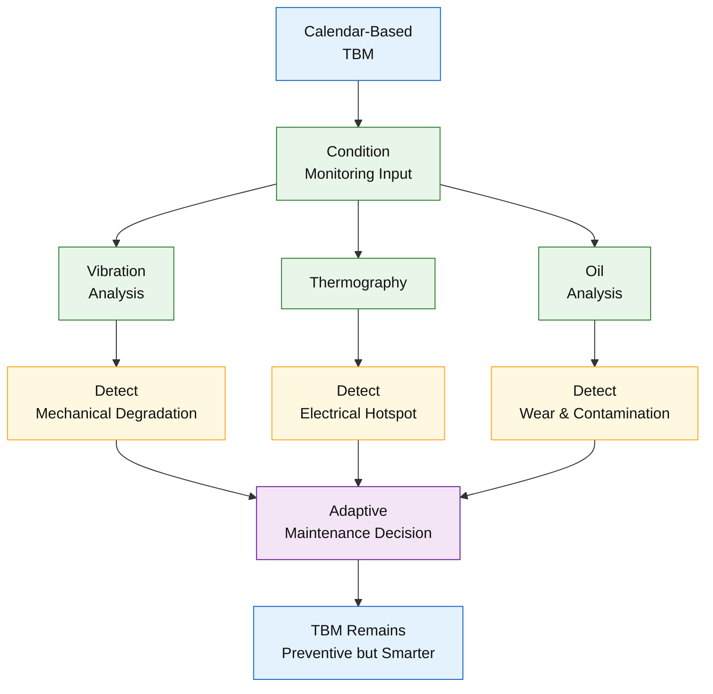

---

## 3.4 Implementasi RBM di PT PON: Langkah Operasional Nyata

Implementasi **Risk-Based Maintenance (RBM)** di PT Petro Oxo Nusantara (PT PON) dilakukan secara **bertahap, sistematis, dan berorientasi pada keterlaksanaan di lapangan**. Pendekatan ini menegaskan bahwa RBM bukan sekadar kebijakan tingkat atas, melainkan **sistem kerja operasional** yang bergantung pada kualitas data aset, konsistensi klasifikasi, dan disiplin dokumentasi.

Langkah-langkah implementasi RBM di PT PON dapat diringkas sebagai berikut.

**1. Penyusunan Daftar Induk Aset (DIA)**
Seluruh peralatan diidentifikasi dan disusun dalam **Daftar Induk Aset** yang terstruktur, mencakup tag number, fungsi proses, lokasi, dan keterkaitan sistem. DIA menjadi **fondasi utama** RBM karena seluruh analisa risiko, strategi pemeliharaan, dan evaluasi performa merujuk pada daftar ini. Tanpa DIA yang rapi dan konsisten, RBM tidak dapat dijalankan secara andal.

**2. Grading Dampak Berbasis ESC**
Setiap aset kemudian dievaluasi berdasarkan dampak kegagalannya terhadap **Environmental, Safety, dan Continuous Running (ESC)**. Grading ini memfokuskan analisa pada konsekuensi nyata kegagalan, bukan sekadar karakter teknis peralatan. Hasil grading ESC menjadi representasi praktis dari **Consequences of Failure (CoF)**.

**3. Klasifikasi Kritis vs Normal**
Berdasarkan hasil grading ESC, aset diklasifikasikan secara tegas menjadi **Kritis** atau **Normal**. Klasifikasi ini bersifat strategis karena menentukan tingkat perhatian, metode pemeliharaan, dan alokasi sumber daya. Pendekatan ini menghindari abu-abu dalam pengambilan keputusan dan memudahkan komunikasi lintas fungsi.

**4. Penetapan Strategi PPC (Predictive–Preventive–Corrective)**
Untuk setiap kelompok aset, ditetapkan kombinasi strategi **Predictive, Preventive, dan Corrective (PPC)** yang sesuai dengan tingkat risikonya. Aset kritis memperoleh porsi preventif dan prediktif yang lebih kuat, sementara aset normal dikelola secara lebih efisien tanpa mengorbankan keselamatan dan keandalan.

**5. Eksekusi TBM Berbasis Klasifikasi**
Time-Based Maintenance (TBM) tetap digunakan sebagai kerangka eksekusi utama, namun **interval, cakupan, dan kedalaman pekerjaan disesuaikan** dengan klasifikasi Kritis/Normal dan hasil evaluasi ESC. Dengan demikian, TBM berfungsi sebagai backbone yang terkontrol, bukan jadwal generik yang seragam.

**6. Dokumentasi dan Histori Gangguan**
Seluruh aktivitas pemeliharaan, temuan inspeksi, kegagalan, dan rework didokumentasikan secara sistematis. Histori ini digunakan sebagai **bahan evaluasi berkala**, dasar penyesuaian strategi, serta bukti objektif dalam audit teknis dan manajerial.

📌 **Catatan penting:**
Tidak ada RBM tanpa **data aset yang rapi, konsisten, dan dapat ditelusuri**. Kualitas implementasi RBM secara langsung ditentukan oleh kualitas DIA, disiplin klasifikasi, dan integritas dokumentasi operasional.

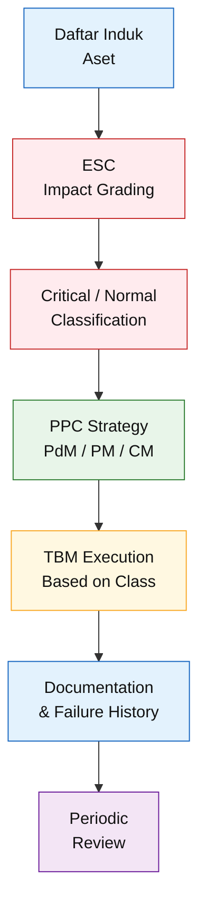

---

## 3.5 Posisi Risk-Based Inspection (RBI) dalam Kerangka RBM

Dalam kerangka **Risk-Based Maintenance (RBM)** yang diterapkan di PT Petro Oxo Nusantara, perlu ditegaskan bahwa **inspection berbasis risiko telah menjadi bagian inheren dari sistem**, meskipun tidak dibentuk sebagai program **Risk-Based Inspection (RBI) formal** yang terpisah sebagaimana didefinisikan dalam API RP 580. Pendekatan ini diambil secara sadar dan pragmatis, dengan tujuan menjaga keterlaksanaan di lapangan tanpa kehilangan disiplin pengendalian risiko.

Fungsi **Risk-Based Inspection (RBI)** di PT PON dijalankan secara **embedded** melalui mekanisme **grading ESC**, **klasifikasi kritikalitas aset**, serta **tiering aset dan evaluasi berlapis**. Diferensiasi frekuensi inspeksi, kedalaman pemeriksaan, dan fokus evaluasi ditentukan berdasarkan **konsekuensi kegagalan dan dampaknya terhadap keselamatan, lingkungan, dan kontinuitas operasi**, bukan berdasarkan interval generik atau keseragaman perlakuan aset.

Dengan pendekatan ini, **RBI tidak berdiri sebagai sistem terpisah**, melainkan berfungsi sebagai **inspection strategy di dalam RBM**, yang secara langsung terhubung dengan pengambilan keputusan pemeliharaan, alokasi sumber daya, dan _evaluation loop_. Model ini memastikan bahwa inspeksi berkontribusi nyata terhadap pengendalian risiko sistem, sekaligus menghindari kompleksitas administratif yang tidak proporsional dengan konteks operasional plant.

📌 **Penegasan penting:**
Dalam konteks RBM PT PON, **RBI dipahami sebagai fungsi, bukan sebagai label program**. Selama inspeksi diarahkan oleh risiko, dibedakan berdasarkan konsekuensi, dan dievaluasi secara berkala dalam _learning loop_, maka prinsip RBI telah dijalankan secara sah, konsisten, dan dapat dipertanggungjawabkan.

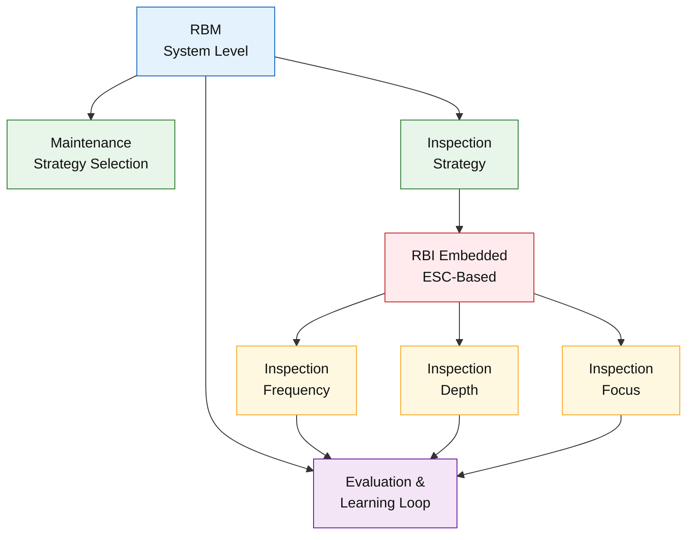

---

> 🧩 Diagram Konseptual

Diagram sederhana berikut menegaskan posisi RBI secara struktural tanpa mengganggu arsitektur RBM yang telah dibangun.

```
RBM (System Level)
│
├── Maintenance Strategy Selection
│
├── Inspection Strategy
│     └── RBI (embedded, ESC-based)
│
└── Evaluation & Learning Loop
```

---

## 3.6 Tiering Aset dan Pola Evaluasi Berlapis

Dalam implementasi RBM di lapangan, muncul pertanyaan praktis yang sangat relevan: _“Semua aset penting, tetapi mana yang harus diawasi setiap hari?”_ Pertanyaan ini tidak dapat dijawab dengan pendekatan seragam, karena **tingkat risiko dan konsekuensi kegagalan tiap aset berbeda secara signifikan**. Untuk menjawab kebutuhan tersebut, PT Petro Oxo Nusantara menerapkan **tiering aset** sebagai mekanisme pengaturan fokus dan intensitas evaluasi.

<ResourceBox
  title="Korelasi internal-link modul:"
  items={[
    {
      name: 'Penerapan Tier dalam RBM',
      href: '/blog/maintenance/maintenance-tier',
      description:
        'Penerapan Tier dalam Risk-Based Maintenance untuk Industri Petrokimia',
    },
  ]}
/>

Tiering aset merupakan proses pengelompokan peralatan berdasarkan **tingkat kritikalitas dan dampak kegagalannya**, sehingga pola pemantauan dan evaluasi dapat disesuaikan secara proporsional. Struktur tiering yang diterapkan di PT PON adalah sebagai berikut.

**Tier 1 – Aset Sangat Kritis**
Aset pada Tier 1 mencakup peralatan yang secara langsung menentukan keberlangsungan proses utama, seperti **Reformer** dan **Hydrogen Compressor**. Kegagalan pada aset ini berpotensi menghentikan operasi secara total dan memicu risiko keselamatan serta kerugian bisnis besar. Oleh karena itu, pola evaluasinya dilakukan secara **real-time atau harian**, melalui kombinasi pemantauan parameter operasi, inspeksi visual intensif, dan condition monitoring.

**Tier 2 – Aset Kritis Pendukung Proses**
Tier 2 mencakup peralatan seperti **Boiler, PSA Unit, dan Cooling System**, yang berperan sebagai penopang utama stabilitas proses. Meskipun tidak selalu memicu shutdown instan, degradasi pada aset ini dapat berkembang menjadi gangguan serius bila tidak terdeteksi. Evaluasi dilakukan secara **bulanan**, dengan fokus pada tren performa, hasil inspeksi, dan temuan anomali.

**Tier 3 – Aset Sistem Pendukung**
Tier 3 mencakup **supporting system** yang dampak kegagalannya relatif lebih terbatas dan tidak langsung memengaruhi keselamatan atau kontinuitas proses utama. Evaluasi dilakukan secara **enam bulanan**, cukup untuk memastikan fungsi dasar tetap terpenuhi tanpa membebani sumber daya pemeliharaan secara berlebihan.

📌 **Manfaat tiering:**
Pendekatan tiering memastikan bahwa **fokus engineer dan supervisor tidak terpecah**, serta energi organisasi diarahkan ke aset dengan risiko tertinggi. Dengan evaluasi yang **sebanding dengan tingkat risiko**, RBM dapat dijalankan secara lebih efektif, efisien, dan konsisten, tanpa mengorbankan keandalan sistem maupun keselamatan operasi.

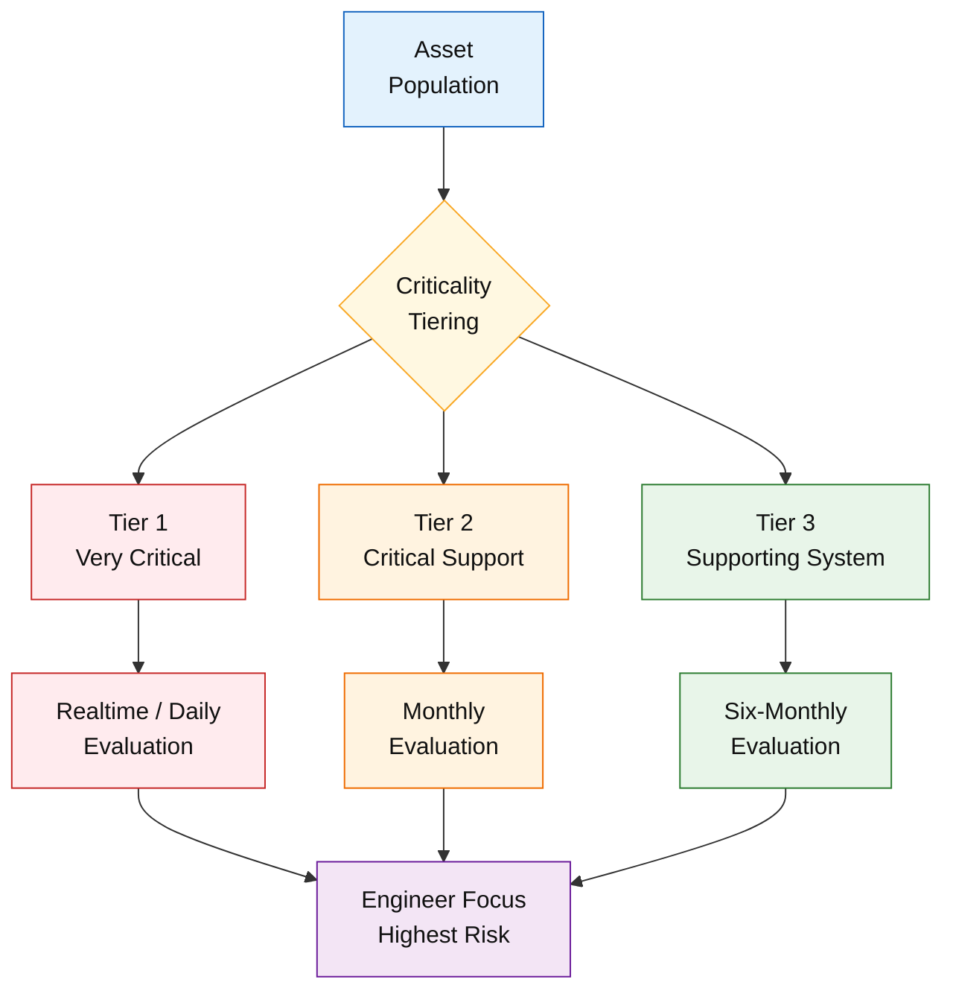

---

## 3.7 _Evaluation Loop_: RBM sebagai Sistem Hidup

Salah satu pembeda utama antara RBM yang matang dan RBM yang hanya berhenti sebagai dokumen adalah keberadaan **evaluation loop yang berjalan secara disiplin**. Dalam konteks ini, RBM diperlakukan sebagai **sistem hidup (_living system_)**, bukan sebagai konfigurasi statis yang ditetapkan sekali lalu dibiarkan berjalan tanpa koreksi.

Di PT Petro Oxo Nusantara, RBM dievaluasi secara **berkala setiap enam bulan** sebagai bagian dari siklus pengendalian risiko dan peningkatan keandalan. Evaluasi ini tidak berfokus pada kepatuhan administratif semata, melainkan pada **kinerja nyata sistem pemeliharaan** terhadap risiko yang telah diidentifikasi.

Cakupan evaluasi meliputi **review histori operasional**, antara lain:

- **Failure**: kejadian kegagalan aktual, baik mayor maupun minor, termasuk near-miss yang berpotensi berkembang menjadi insiden besar.
- **Rework**: pekerjaan pemeliharaan yang harus diulang karena ketidakefektifan intervensi awal, yang menjadi indikator lemahnya strategi atau eksekusi.
- **Deviasi jadwal**: keterlambatan atau percepatan TBM yang mengindikasikan ketidaksesuaian antara perencanaan dan kondisi lapangan.

Data historis tersebut dianalisis untuk menjawab pertanyaan kunci: apakah strategi pemeliharaan yang diterapkan **benar-benar menurunkan eksposur risiko**, atau justru menciptakan beban kerja tanpa peningkatan keandalan yang signifikan. Hasil analisis kemudian digunakan untuk **menyesuaikan interval TBM**, memperkuat atau melonggarkan inspeksi, serta mengubah kombinasi strategi PPC bila diperlukan.

📌 **Prinsip kunci:**
RBM **bukan sistem statis**, melainkan **_learning system_** yang terus berkembang melalui umpan balik lapangan. Tanpa _evaluation loop_ yang konsisten, RBM akan kehilangan relevansinya terhadap perubahan kondisi aset, proses, dan risiko bisnis, dan pada akhirnya tereduksi menjadi sekadar label tanpa daya kendali nyata.

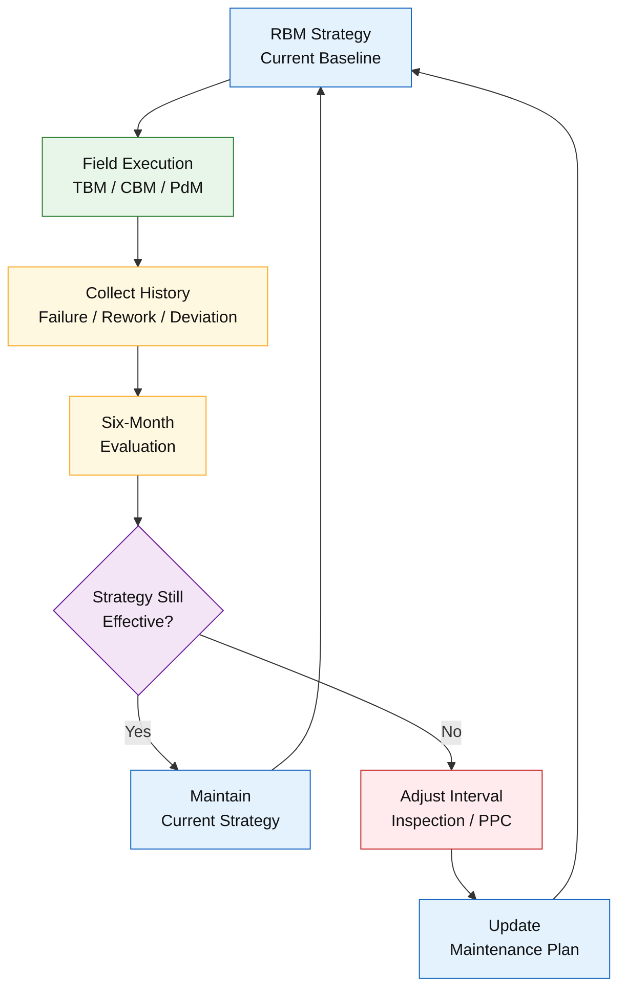

---

## 3.8 Perencanaan Pemeliharaan Berbasis 5M + 1E

Keberhasilan implementasi **Risk-Based Maintenance (RBM)** pada akhirnya ditentukan oleh kesiapan **sistem pendukung eksekusi**. Dalam praktik lapangan, banyak inisiatif RBM gagal bukan karena kerangka konseptualnya keliru, melainkan karena **perencanaan sumber daya tidak selaras dengan tingkat risiko yang dihadapi**. Untuk itu, PT Petro Oxo Nusantara menerapkan pendekatan **5M + 1E (Man, Machine/Tools, Money, Method, Material, dan Environment)** sebagai fondasi perencanaan pemeliharaan berbasis risiko.

Pendekatan ini menegaskan bahwa perencanaan pemeliharaan **tidak bersifat netral**, melainkan diturunkan langsung dari **klasifikasi risiko berbasis ESC (Environmental, Safety, Continuous running)**. Dengan demikian, seluruh elemen perencanaan tidak hanya diarahkan untuk menjaga keandalan dan kontinuitas operasi, tetapi juga untuk **mencegah dan membatasi konsekuensi keselamatan serta dampak lingkungan** yang dapat timbul akibat kegagalan aset.

---

### **Man (Sumber Daya Manusia)**

RBM menuntut **kompetensi yang sebanding dengan tingkat kritikalitas aset**. Aset berisiko tinggi memerlukan personel dengan kualifikasi, pengalaman, dan kewenangan yang memadai. Selain jumlah personel, aspek pelatihan dan sertifikasi menjadi krusial agar keputusan teknis, hasil inspeksi, serta respons terhadap kondisi abnormal dapat dipertanggungjawabkan, termasuk dalam konteks **penanganan potensi risiko keselamatan dan lingkungan**.

---

### **Machine / Tools (Peralatan dan Akses)**

Perencanaan harus memastikan ketersediaan **special tools**, instrumen condition monitoring, serta akses kerja yang aman dan memadai. Tanpa alat yang tepat, inspeksi mendalam dan deteksi dini degradasi tidak dapat dilakukan secara efektif, terlepas dari seberapa baik analisa risikonya. Pada aset dengan potensi loss of containment, peralatan pendukung seperti **leak detection, secondary containment, dan alat mitigasi darurat** menjadi bagian dari kebutuhan minimum.

---

### **Money (Anggaran)**

RBM mengarahkan anggaran secara **berbasis risiko**, bukan dibagi rata. Aset kritis memperoleh porsi anggaran yang lebih besar untuk inspeksi, monitoring, dan pencegahan, sementara aset dengan dampak kegagalan rendah dikelola secara lebih efisien. Pendekatan ini memastikan bahwa biaya pemeliharaan benar-benar digunakan untuk **mengurangi eksposur risiko terbesar**, termasuk biaya pencegahan insiden keselamatan dan dampak lingkungan yang berpotensi menimbulkan kerugian jangka panjang.

---

### **Method (Metode dan Prosedur)**

Setiap aktivitas pemeliharaan harus didukung oleh **SOP dan metode inspeksi** yang sesuai dengan tingkat risiko. Metode yang digunakan pada aset kritis harus lebih ketat, terstandar, dan terdokumentasi, sehingga hasilnya konsisten dan dapat diaudit. Dalam RBM, metode kerja juga berfungsi sebagai **barrier administratif**, yang secara eksplisit memasukkan pengendalian risiko keselamatan dan lingkungan sebagai bagian dari prosedur teknis.

---

### **Material (Suku Cadang dan Consumable)**

Ketersediaan **spare part kritis dan consumable** harus direncanakan berdasarkan klasifikasi risiko dan konsekuensi kegagalan. Keterlambatan material pada aset kritis dapat memperpanjang downtime dan memperbesar kerugian. Selain itu, aspek **kecocokan material terhadap fluida proses dan potensi dampak lingkungan** menjadi pertimbangan penting dalam pemilihan dan penyimpanan material.

---

### **1E — Environment (Batas Sistem dan Konsekuensi Lingkungan)**

Elemen **Environment (E)** diposisikan sebagai **batas sistem (_system constraint_)** dalam perencanaan RBM, bukan sekadar variabel tambahan. Dalam konteks industri proses berisiko tinggi, kegagalan aset tidak hanya berdampak pada keselamatan dan kontinuitas operasi, tetapi juga dapat menimbulkan **dampak lingkungan yang luas, tertunda, dan bersifat non-linear**.

Oleh karena itu, perencanaan pemeliharaan di PT Petro Oxo Nusantara secara eksplisit mempertimbangkan **konsekuensi lingkungan** dalam setiap keputusan 5M. Aset dengan potensi pelepasan bahan berbahaya, pencemaran tanah atau air, serta emisi tidak terkendali memperoleh perlakuan khusus dalam hal kompetensi personel, metode inspeksi, kesiapan peralatan mitigasi, alokasi anggaran, dan ketersediaan material pendukung. Dengan menempatkan Environment sebagai elemen tersendiri, RBM memastikan bahwa **keandalan operasional tidak pernah dicapai dengan mengorbankan perlindungan lingkungan**, dan seluruh keputusan tetap berada dalam batas penerimaan risiko organisasi.

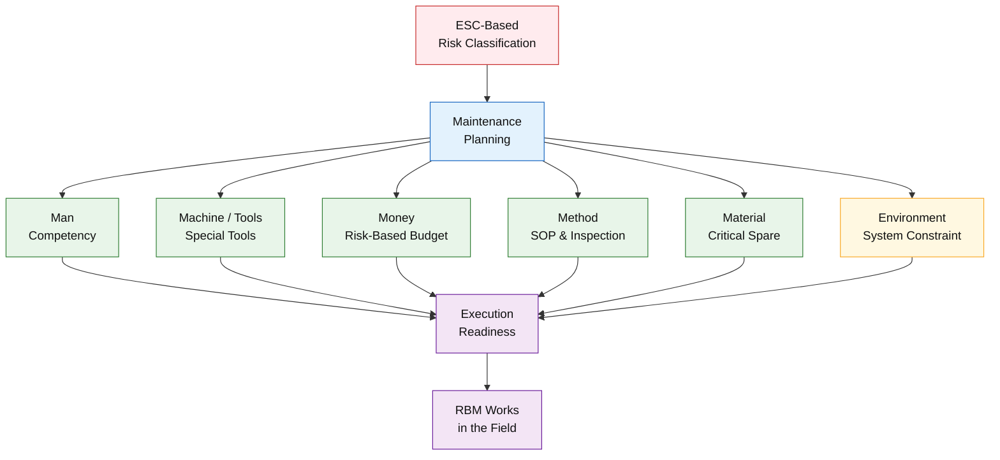

---

📌 **Penegasan:**

RBM tidak gagal karena konsepnya, tetapi karena **5M + 1E tidak siap**. Tanpa keselarasan antara risiko berbasis ESC, strategi pemeliharaan, dan perencanaan sumber daya yang mencakup aspek lingkungan sebagai batas sistem, RBM akan kehilangan daya eksekusinya dan tereduksi menjadi dokumen konseptual tanpa dampak nyata di lapangan.

---

## 3.9 RBM sebagai Sistem Training dan Disiplin Operasional

Selain berfungsi sebagai strategi pemeliharaan, **Risk-Based Maintenance (RBM)** memiliki peran penting sebagai **kerangka training internal dan pembentuk disiplin operasional**. RBM menyediakan struktur berpikir yang konsisten tentang _mengapa_ suatu aset diperlakukan dengan cara tertentu, sehingga pembelajaran tidak berhenti pada prosedur, tetapi mencakup **logika risiko di balik setiap keputusan pemeliharaan**.

Dalam konteks pelatihan internal, RBM dapat digunakan sebagai **framework pembelajaran berjenjang**. Engineer dilatih untuk memahami hubungan antara kegagalan teknis, konsekuensi, dan keputusan strategi; supervisor dilatih untuk menerjemahkan prioritas risiko menjadi pengaturan pekerjaan dan pengawasan lapangan; sementara superintendent dibekali pemahaman tentang bagaimana keputusan pemeliharaan berdampak pada keselamatan, keandalan, dan kinerja bisnis. Dengan pendekatan ini, pelatihan tidak terfragmentasi per fungsi, melainkan terintegrasi dalam satu kerangka sistem.

RBM juga berperan sebagai **alat penyamaan bahasa lintas level organisasi**. Istilah seperti _kritis_, _normal_, _ESC_, _tiering_, dan _risk acceptance_ digunakan secara konsisten oleh engineer, supervisor, dan superintendent. Konsistensi bahasa ini mengurangi ambiguitas, meminimalkan perbedaan interpretasi di lapangan, serta memperkuat disiplin dalam pengambilan keputusan dan eksekusi pekerjaan.

📌 **Nilai tambah modul ini:**
Dengan struktur yang sistematis dan berbasis studi kasus nyata, Modul 3—khususnya bagian RBM sebagai sistem training—sangat cocok dijadikan **modul pelatihan internal plant**. RBM tidak hanya meningkatkan kompetensi teknis, tetapi juga membentuk **disiplin operasional berbasis risiko**, yang menjadi prasyarat utama bagi keandalan jangka panjang dan keselamatan operasi industri petrokimia.

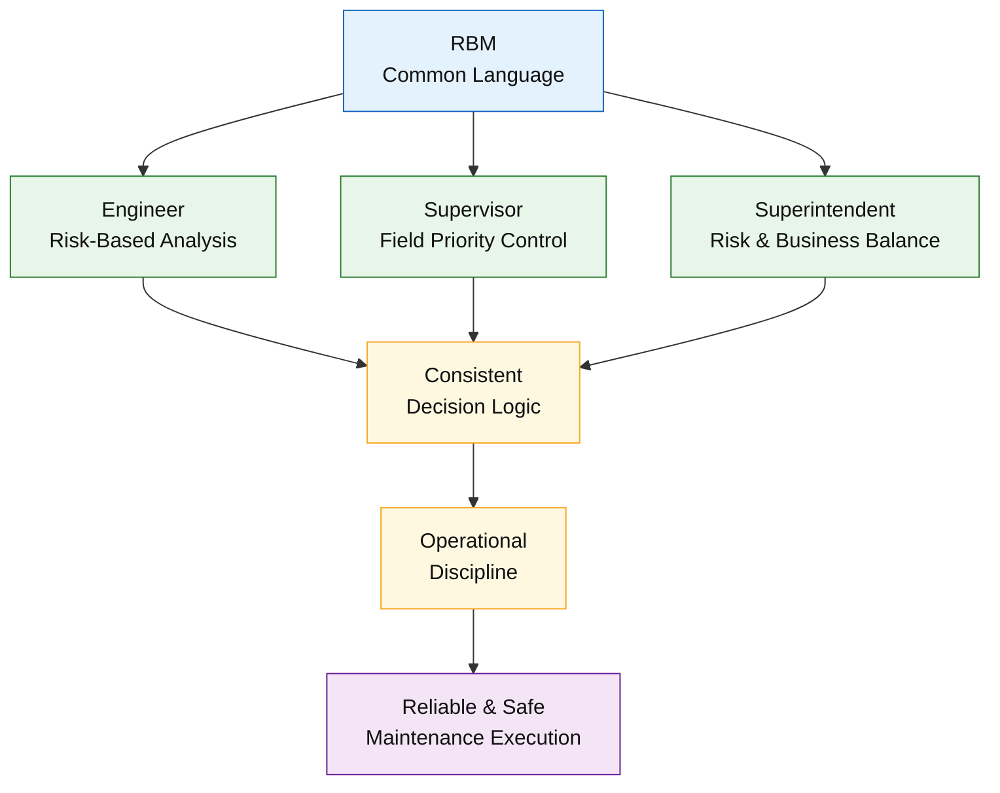

---

## 🧠 Kesimpulan Module 3

Modul 3 menegaskan bahwa **Risk-Based Maintenance (RBM) adalah strategi kerja yang operasional dan teruji**, bukan konsep akademik yang berhenti pada level kebijakan. Melalui RBM, organisasi pemeliharaan mampu **menerjemahkan keputusan berbasis risiko menjadi tindakan nyata di lapangan**, dengan fokus yang jelas dan terukur. Pendekatan ini memungkinkan tim untuk:

- memusatkan energi, kompetensi, dan sumber daya pada **aset yang benar-benar kritis**,
- menghindari **over-maintenance** yang tidak memberikan nilai tambah terhadap pengendalian risiko,
- serta membangun **Time-Based Maintenance (TBM) yang adaptif**, responsif terhadap kondisi aktual peralatan.

Studi kasus PT Petro Oxo Nusantara menunjukkan bahwa RBM dapat diterapkan secara **pragmatis dan konservatif**, tanpa ketergantungan pada kompleksitas model matematis, namun tetap **selaras dengan risiko bisnis nyata, keselamatan, dan kontinuitas operasi**. Dengan struktur tiering, _evaluation loop_, dan perencanaan 5M, RBM berfungsi sebagai **sistem kerja hidup** yang dapat diaudit, ditingkatkan, dan direplikasi.

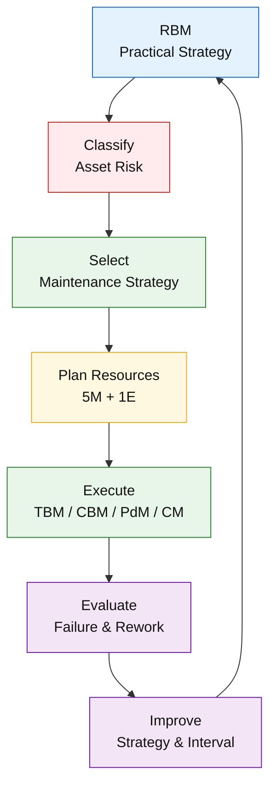

---

<ResourceBox
  title="Korelasi internal-link modul:"
  items={[
    {
      name: 'Maintenance System Handbook (MSH)',
      href: '/blog/management/MSH/MSH-panduan-lengkap',
      description:
        'Dari Risk-Based Thinking ke Reliability-Driven Organization - Panduan Lengkap Maintenance System Handbook',
    },
    {
      name: 'Model Risiko dan Logika Pengambilan Keputusan',
      href: '/blog/management/MSH/MSH-2-model-risiko',
      description:
        'Module 2 – Model Risiko dan Logika Pengambilan Keputusan Pemeliharaan',
    },
    {
      name: 'Risk-Based Maintenance',
      href: '/blog/management/MSH/MSH-3-rbm',
      description:
        'Module 3 – Risk-Based Maintenance sebagai Strategi Pemeliharaan Praktis',
    },
    {
      name: 'Organisasi, KPI, dan Akuntabilitas',
      href: '/blog/management/MSH/MSH-5-organization',
      description:
        'Module 4 – Organisasi, KPI, dan Akuntabilitas dalam Sistem Pemeliharaan',
    },
    {
      name: 'Risk Reduction Program (RRP)',
      href: '/blog/management/MSH/MSH-risk-reduction-program',
      description:
        'Risk Reduction Program (RRP): Mengubah Risiko menjadi Reliability Improvement yang Terukur',
    },
    {
      name: 'Scope Turnaround Berbasis Risk-Based Maintenance',
      href: '/blog/management/MSH/MSH-panduan-scope-ta',
      description:
        'Panduan Pemilihan Scope Turnaround Berbasis Risk-Based Maintenance',
    },
    {
      name: 'Lifecycle Aset',
      href: '/blog/management/MSH/MSH-8-lifecycle-ta',
      description:
        'Module 7 – Lifecycle Aset, Turnaround, dan Continuous Improvement Sistem Pemeliharaan',
    },
  ]}
/>

---

## 📚 Referensi Module 3

1. **Artikel 3 (Core)** – _Risk-Based Maintenance di Industri Petrokimia: Studi Kasus PT Petro Oxo Nusantara (PT PON)_
2. **API Recommended Practice 580** – _Risk-Based Inspection_
3. **ISO 55000** – _Asset Management_
4. **Khan, F. I. & Haddara, M. M.** – _Risk-Based Maintenance in the Process Industry_
5. **Jaderi et al.** – _Criticality Analysis Using Risk-Based Maintenance Approaches_

---

<small>
  **_Catatan Penyusunan_** Artikel ini disusun sebagai materi edukasi dan
  referensi umum berdasarkan berbagai sumber pustaka, praktik lapangan, serta
  bantuan alat penulisan. Pembaca disarankan untuk melakukan verifikasi lanjutan
  dan penyesuaian sesuai dengan kondisi serta kebutuhan masing-masing sistem.
</small>
