# **_Eksekusi, Troubleshooting, dan Sistem Pembelajaran Pemeliharaan_**

---

- [**_Eksekusi, Troubleshooting, dan Sistem Pembelajaran Pemeliharaan_**](#eksekusi-troubleshooting-dan-sistem-pembelajaran-pemeliharaan)
- [📌 Prolog Modul](#-prolog-modul)
- [6.1 Eksekusi Pemeliharaan sebagai Titik Kritis Sistem](#61-eksekusi-pemeliharaan-sebagai-titik-kritis-sistem)
- [6.2 Troubleshooting sebagai Proses Sistematis (Bukan Insting)](#62-troubleshooting-sebagai-proses-sistematis-bukan-insting)
  - [Tahapan Troubleshooting Sistematis](#tahapan-troubleshooting-sistematis)
- [6.3 Root Cause Analysis (RCA): Menghentikan Masalah di Akarnya](#63-root-cause-analysis-rca-menghentikan-masalah-di-akarnya)
  - [Tujuan dan Prinsip RCA](#tujuan-dan-prinsip-rca)
  - [Kapan RCA Wajib Dilakukan](#kapan-rca-wajib-dilakukan)
  - [Peran Engineer dan Supervisor dalam RCA](#peran-engineer-dan-supervisor-dalam-rca)
  - [RCA sebagai Kewajiban Sistem](#rca-sebagai-kewajiban-sistem)
- [6.4 FMEA dan FTA sebagai Alat Pencegahan Kegagalan](#64-fmea-dan-fta-sebagai-alat-pencegahan-kegagalan)
  - [FMEA: Mengantisipasi Kegagalan Sejak Dini](#fmea-mengantisipasi-kegagalan-sejak-dini)
  - [FTA: Memahami Jalur Penyebab Kegagalan Kritis](#fta-memahami-jalur-penyebab-kegagalan-kritis)
  - [Integrasi dalam Sistem Pemeliharaan](#integrasi-dalam-sistem-pemeliharaan)
- [6.5 First-Time Fix sebagai Indikator Kematangan Eksekusi](#65-first-time-fix-sebagai-indikator-kematangan-eksekusi)
  - [Definisi First-Time Fix](#definisi-first-time-fix)
  - [Faktor Penentu First-Time Fix](#faktor-penentu-first-time-fix)
  - [First-Time Fix dalam Kerangka KPI](#first-time-fix-dalam-kerangka-kpi)
- [6.6 Dokumentasi Pemeliharaan sebagai Aset Teknis](#66-dokumentasi-pemeliharaan-sebagai-aset-teknis)
  - [Dokumentasi sebagai Histori dan Basis Evaluasi](#dokumentasi-sebagai-histori-dan-basis-evaluasi)
  - [Dokumentasi sebagai Referensi Troubleshooting](#dokumentasi-sebagai-referensi-troubleshooting)
  - [Integrasi dengan Sistem dan Fungsi Lain](#integrasi-dengan-sistem-dan-fungsi-lain)
- [6.7 Learning Loop: Dari Gangguan ke Perbaikan Sistem](#67-learning-loop-dari-gangguan-ke-perbaikan-sistem)
  - [Konsep Learning Loop dalam Pemeliharaan](#konsep-learning-loop-dalam-pemeliharaan)
  - [Integrasi Learning Loop dengan Sistem Pemeliharaan](#integrasi-learning-loop-dengan-sistem-pemeliharaan)
  - [Learning Loop sebagai Penggerak Sistem Hidup](#learning-loop-sebagai-penggerak-sistem-hidup)
- [6.8 Troubleshooting sebagai Sistem Pembelajaran Tim](#68-troubleshooting-sebagai-sistem-pembelajaran-tim)
  - [Transfer Pengetahuan Antar Shift](#transfer-pengetahuan-antar-shift)
  - [Pembelajaran Lintas Jabatan](#pembelajaran-lintas-jabatan)
  - [Troubleshooting sebagai Materi Training Internal](#troubleshooting-sebagai-materi-training-internal)
- [🧠 Kesimpulan Module 6](#-kesimpulan-module-6)
- [📚 Referensi Module 6](#-referensi-module-6)

---

# 📌 Prolog Modul

Modul ini merupakan bagian dari **Maintenance System Handbook (MSH)** yang secara khusus menjawab pertanyaan paling krusial di tingkat eksekusi lapangan:

> **“Bagaimana kita memastikan masalah teknis tidak berulang?”**

Pada titik ini, sistem pemeliharaan telah memiliki **arah strategis** dan **struktur akuntabilitas** yang jelas.

- **Module 3** telah menjelaskan _strategi Risk-Based Maintenance (RBM) dan bagaimana strategi tersebut diterapkan secara praktis_,
- **Module 5** telah memastikan _siapa yang bertanggung jawab atas setiap keputusan, kinerja, dan biaya_.

Namun, tanpa mekanisme yang memastikan bahwa setiap gangguan menghasilkan pembelajaran, sistem pemeliharaan akan tetap terjebak pada pola **reaktif**—memperbaiki kerusakan yang sama berulang kali tanpa peningkatan keandalan yang nyata. Oleh karena itu, **Module 5** berfokus pada penguatan titik terlemah sekaligus paling menentukan dalam sistem pemeliharaan, yaitu **eksekusi, troubleshooting, dan pembelajaran organisasi**.

Dalam modul ini, **troubleshooting, analisa akar masalah, dan dokumentasi** diposisikan bukan sebagai aktivitas insidental, melainkan sebagai **aset sistemik** yang membangun memori organisasi. Setiap kegagalan diperlakukan sebagai sumber data dan pembelajaran untuk memperbaiki strategi, metode, dan keputusan di masa depan. Dengan pendekatan ini, sistem pemeliharaan diarahkan untuk bergerak dari sekadar _memperbaiki kerusakan_ menuju _mencegah kegagalan berulang_ secara terstruktur dan berkelanjutan.

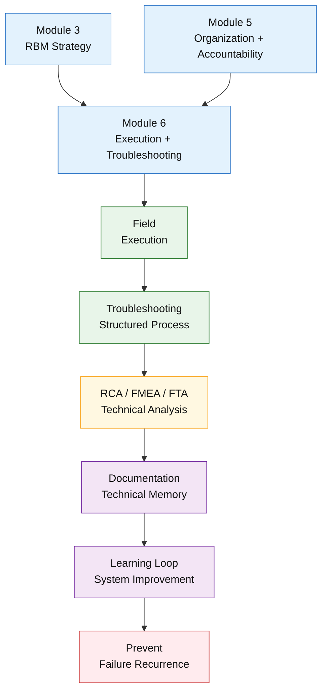

<ResourceBox
  title="Korelasi internal-link modul:"
  items={[
    {
      name: 'Maintenance System Handbook (MSH)',
      href: '/blog/management/MSH/MSH-panduan-lengkap',
      description:
        'Dari Risk-Based Thinking ke Reliability-Driven Organization - Panduan Lengkap Maintenance System Handbook',
    },
    {
      name: 'Organisasi, KPI, dan Akuntabilitas',
      href: '/blog/management/MSH/MSH-5-organization',
      description:
        'Module 5 – Organisasi, KPI, dan Akuntabilitas dalam Sistem Pemeliharaan',
    },
    {
      name: 'SHE sebagai Batas Sistem dalam Pengambilan Keputusan',
      href: '/blog/management/MSH/MSH-7-she-compliance',
      description:
        'Module 7 – SHE sebagai Batas Sistem dalam Pengambilan Keputusan Pemeliharaan',
    },
  ]}
/>

---

# 6.1 Eksekusi Pemeliharaan sebagai Titik Kritis Sistem

Sub-bab ini menegaskan bahwa **kualitas nyata sistem pemeliharaan ditentukan pada tahap eksekusi**, bukan pada kelengkapan dokumen strategi atau kecanggihan metode analisis. Strategi RBM, struktur organisasi, dan KPI hanya akan memberikan nilai jika **diterjemahkan secara konsisten dan disiplin di lapangan**.

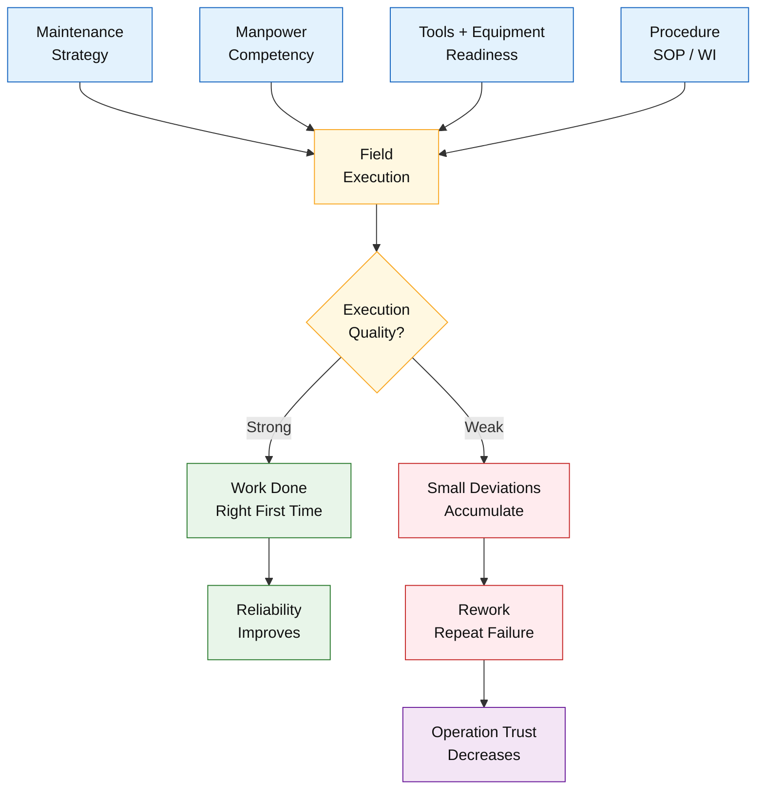

Eksekusi pemeliharaan merupakan **titik temu seluruh elemen sistem**, yaitu:

- **Strategi**, yang menentukan apa yang harus diprioritaskan dan mengapa,
- **Manusia**, yang membawa kompetensi, disiplin, dan keputusan operasional,
- **Peralatan dan tools**, yang memungkinkan pekerjaan dilakukan dengan benar,
- **Prosedur**, yang memastikan pekerjaan aman, seragam, dan dapat diulang.

Ketika salah satu elemen tersebut lemah, kualitas eksekusi akan menurun meskipun strategi di atas kertas terlihat ideal. Dalam praktik industri petrokimia, kegagalan eksekusi sering kali tidak muncul sebagai kesalahan tunggal, melainkan sebagai **akumulasi deviasi kecil**: pekerjaan tidak sesuai metode, inspeksi dilewati, atau standar kualitas diturunkan karena tekanan waktu.

Dampak dari eksekusi yang buruk bersifat sistemik. **Rework** menjadi konsekuensi langsung karena pekerjaan tidak menyelesaikan masalah secara tuntas. **Kegagalan berulang** muncul karena akar masalah tidak disentuh, hanya gejalanya yang ditangani. Dalam jangka menengah, kondisi ini menyebabkan **hilangnya kepercayaan dari fungsi operasi**, yang mulai memandang pemeliharaan sebagai sumber gangguan, bukan mitra keandalan.

Dalam kerangka **Maintenance System Handbook**, eksekusi diposisikan sebagai **validasi akhir sistem**. Di sinilah dapat dinilai apakah:

- keputusan berbasis risiko (Module 2) benar-benar diterapkan,
- strategi RBM (Module 3) dijalankan sesuai klasifikasi aset,
- peran dan akuntabilitas (Module 4) berfungsi sebagaimana dirancang.

📌 **Prinsip kunci:**
**Strategi hebat gagal jika eksekusi lemah.** Oleh karena itu, penguatan sistem pemeliharaan harus selalu dimulai dan diuji di titik eksekusi, karena di sanalah keandalan aset benar-benar dibentuk.

---

# 6.2 Troubleshooting sebagai Proses Sistematis (Bukan Insting)

Sub-bab ini menegaskan bahwa **troubleshooting dalam sistem pemeliharaan modern harus diperlakukan sebagai proses sistematis**, bukan sebagai aktivitas berbasis insting atau pengalaman individual semata. Pola _trial-and-error_ yang tidak terstruktur memang dapat menyelesaikan masalah sesaat, namun hampir selalu menyisakan **risiko kegagalan berulang** karena akar permasalahan tidak diidentifikasi secara utuh.

Dalam kerangka **Maintenance System Handbook**, troubleshooting diposisikan sebagai **rangkaian langkah berurutan** yang dapat diulang, diaudit, dan ditingkatkan kualitasnya. Struktur ini memastikan bahwa setiap gangguan ditangani dengan pendekatan yang konsisten, terlepas dari siapa personel yang terlibat.

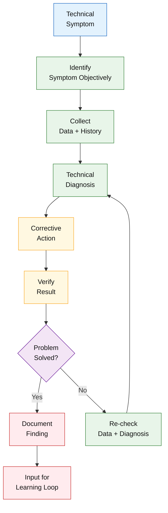

## Tahapan Troubleshooting Sistematis

1. **Identifikasi Gejala**
   Tahap awal berfokus pada pengenalan gejala kegagalan secara objektif, bukan asumsi penyebab. Gejala harus dinyatakan secara spesifik dan terukur, misalnya perubahan parameter operasi, alarm, atau penurunan kinerja.

2. **Pengumpulan Data**
   Data historis, hasil inspeksi, tren kondisi, dan informasi operasi dikumpulkan untuk membangun dasar analisis. Tanpa data yang memadai, diagnosis akan cenderung spekulatif.

3. **Diagnosis Teknis**
   Pada tahap ini, data dianalisis untuk mengidentifikasi kemungkinan penyebab kegagalan. Diagnosis harus berbasis fakta dan metode teknis yang relevan, bukan intuisi semata.

4. **Tindakan Korektif**
   Tindakan yang diambil harus secara langsung menargetkan penyebab yang teridentifikasi, bukan sekadar menghilangkan gejala. Pemilihan tindakan juga mempertimbangkan risiko, keselamatan, dan dampak terhadap operasi.

5. **Verifikasi Hasil**
   Tahap akhir memastikan bahwa tindakan korektif benar-benar efektif. Verifikasi dilakukan melalui pengujian, pemantauan pasca-perbaikan, atau pengamatan tren kinerja.

📌 **Penekanan:**
**Troubleshooting tanpa struktur akan menghasilkan masalah yang kembali.** Dengan menerapkan proses troubleshooting yang sistematis, organisasi pemeliharaan membangun fondasi untuk analisa akar masalah yang lebih dalam, pengurangan kegagalan berulang, dan peningkatan keandalan aset secara berkelanjutan.

---

# 6.3 Root Cause Analysis (RCA): Menghentikan Masalah di Akarnya

Sub-bab ini menempatkan **Root Cause Analysis (RCA)** sebagai mekanisme utama untuk **menghentikan kegagalan berulang (recurrence)** dalam sistem pemeliharaan. RCA bukan sekadar alat analisis pascakejadian, melainkan **kewajiban sistem** ketika gangguan menunjukkan pola berulang, berdampak signifikan terhadap keselamatan, lingkungan, atau kontinuitas operasi.

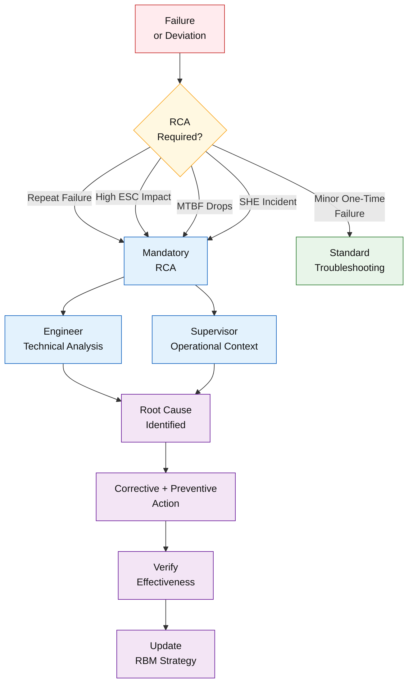

<ResourceBox
  title="Korelasi internal-link modul:"
  items={[
    {
      name: 'Panduan Troubleshooting & Pemilihan Metode RCA',
      href: '/blog/management/RCA/rca-panduan-lengkap',
      description:
        'Panduan Troubleshooting & Pemilihan Metode RCA Berbasis Risk-Based Maintenance (RBM)',
    },
    {
      name: 'Iceberg Theory',
      href: '/blog/management/iceberg-theory',
      description:
        'Beyond the Surface - Pendekatan Iceberg dalam Memperkuat Keandalan Aset Industri Petrokimia',
    },
    {
      name: 'FTFR - First-Time Fix Rate',
      href: '/blog/maintenance/ftfr',
      description: 'FTFR - First-Time Fix Rate',
    },
  ]}
/>

## Tujuan dan Prinsip RCA

Tujuan utama RCA adalah **memisahkan perbaikan gejala (symptom fixing)** dari **perbaikan akar masalah (root fixing)**. Perbaikan gejala hanya mengembalikan peralatan ke kondisi operasi sementara, sementara perbaikan akar masalah menghilangkan penyebab mendasar sehingga kegagalan yang sama tidak terjadi kembali. Dalam industri proses kontinu, kegagalan yang berulang—meski jarang—dapat memiliki konsekuensi besar, sehingga pendekatan root fixing menjadi keharusan.

## Kapan RCA Wajib Dilakukan

RCA **wajib** dilakukan pada kondisi-kondisi berikut:

- Kegagalan berulang pada aset yang sama atau mode kegagalan serupa,
- Kegagalan dengan dampak tinggi terhadap **ESC** (Environmental, Safety, Continuous Running),
- Deviasi signifikan dari kinerja yang diharapkan (mis. MTBF menurun tajam),
- Insiden yang melibatkan aspek keselamatan atau lingkungan.

Penetapan kewajiban ini memastikan RCA tidak bergantung pada preferensi individu, melainkan menjadi bagian dari **disiplin organisasi**.

## Peran Engineer dan Supervisor dalam RCA

- **Engineer** berperan sebagai **pemilik analisis teknis**, bertanggung jawab atas pemilihan metode RCA/RCFA, analisis data, dan formulasi rekomendasi teknis yang berkelanjutan.
- **Supervisor** berperan sebagai **pemilik konteks operasional**, memastikan data lapangan akurat, tindakan korektif dapat dieksekusi, serta rekomendasi diterjemahkan ke dalam praktik kerja.

Kolaborasi ini memastikan RCA tidak berhenti sebagai laporan, tetapi berujung pada **tindakan sistemik**.

## RCA sebagai Kewajiban Sistem

Dalam kerangka **Maintenance System Handbook**, RCA diperlakukan sebagai **kewajiban sistem**, bukan opsi. Setiap hasil RCA harus terdokumentasi, diverifikasi efektivitasnya, dan ditindaklanjuti dalam pembaruan strategi pemeliharaan.

📌 **Korelasi dengan modul lain:**
**Hasil RCA menjadi input langsung untuk evaluasi RBM (Module 3)**—baik dalam penyesuaian klasifikasi aset, interval TBM, pemilihan metode CBM/PdM, maupun keputusan redesign. Dengan demikian, RCA berfungsi sebagai **jembatan pembelajaran** yang menghubungkan kegagalan lapangan dengan perbaikan sistem pemeliharaan secara menyeluruh.

---

# 6.4 FMEA dan FTA sebagai Alat Pencegahan Kegagalan

Sub-bab ini menggeser orientasi pemeliharaan dari pendekatan **reaktif (_after failure_)** menuju **pencegahan terstruktur (_before failure_)** melalui pemanfaatan **Failure Mode and Effects Analysis (FMEA)** dan **Fault Tree Analysis (FTA)**. Kedua metode ini tidak berdiri sendiri, melainkan berfungsi sebagai **alat analisis pendukung** dalam sistem pengambilan keputusan berbasis risiko.

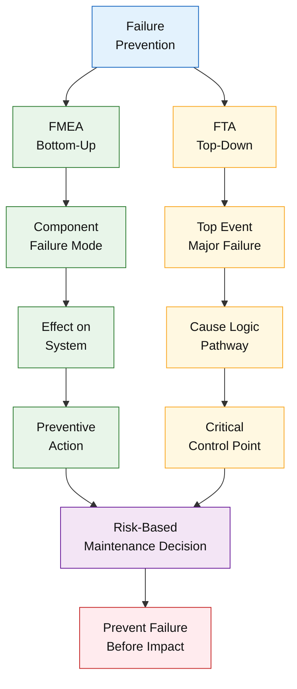

## FMEA: Mengantisipasi Kegagalan Sejak Dini

**FMEA** digunakan untuk mengidentifikasi **mode kegagalan potensial**, memahami **penyebabnya**, serta menilai **dampaknya terhadap sistem** sebelum kegagalan terjadi. Dalam konteks pemeliharaan:

- FMEA membantu memetakan bagaimana suatu komponen dapat gagal,
- menilai konsekuensi kegagalan terhadap keselamatan, lingkungan, dan operasi,
- serta menentukan prioritas tindakan pencegahan yang paling efektif.

Dengan FMEA, organisasi dapat merancang tindakan preventif—seperti inspeksi tambahan, perubahan metode pemeliharaan, atau redesign—sebelum kegagalan menimbulkan dampak signifikan.

## FTA: Memahami Jalur Penyebab Kegagalan Kritis

**FTA** digunakan untuk menganalisis **top-event** (kejadian puncak yang tidak diinginkan), kemudian menurunkannya menjadi **rantai sebab-akibat** yang logis. Pendekatan ini sangat berguna untuk:

- memahami interaksi kompleks antar komponen dan sistem,
- mengidentifikasi kombinasi kegagalan yang dapat memicu kejadian besar,
- serta menentukan titik kendali paling efektif untuk memutus jalur kegagalan.

FTA memberikan perspektif sistemik yang melengkapi FMEA yang lebih bersifat bottom-up.

## Integrasi dalam Sistem Pemeliharaan

Dalam kerangka **Maintenance System Handbook**, FMEA dan FTA digunakan secara selektif pada:

- aset atau sistem dengan risiko tinggi,
- kegagalan berulang atau berdampak besar,
- serta sebagai bagian dari perencanaan preventif dan evaluasi strategi pemeliharaan.

📌 **Nilai sistemik:**
Penerapan FMEA dan FTA memperkuat **decision logic berbasis risiko (Module 2)** dengan menyediakan dasar analitis yang sistematis. Dengan demikian, keputusan pemeliharaan tidak hanya bereaksi terhadap kegagalan yang sudah terjadi, tetapi **secara proaktif mencegah kegagalan sebelum berdampak pada keselamatan, lingkungan, dan kontinuitas operasi**.

---

# 6.5 First-Time Fix sebagai Indikator Kematangan Eksekusi

Sub-bab ini menempatkan **first-time fix (FTF)** sebagai **indikator kunci kematangan eksekusi pemeliharaan**, bukan sebagai hasil kebetulan atau kemampuan individu semata. Dalam sistem pemeliharaan modern, FTF mencerminkan **kualitas sistem secara keseluruhan**, mulai dari perencanaan hingga kompetensi eksekutor.

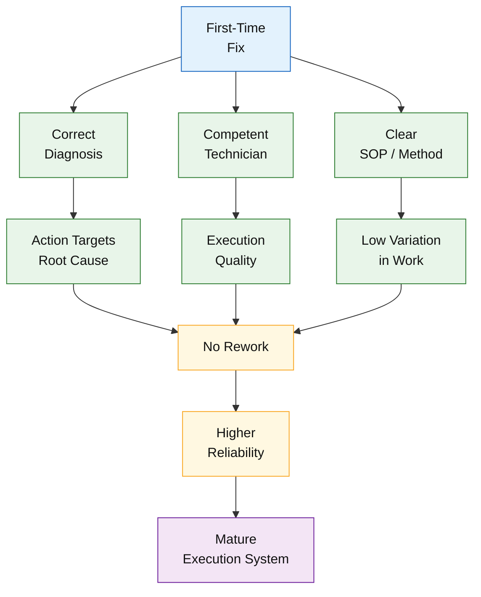

<ResourceBox
  title="Korelasi internal-link modul:"
  items={[
    {
      name: 'FTFR - First-Time Fix Rate',
      href: '/blog/maintenance/ftfr',
      description: 'FTFR - First-Time Fix Rate',
    },
    {
      name: 'Iceberg Theory',
      href: '/blog/management/iceberg-theory',
      description:
        'Beyond the Surface - Pendekatan Iceberg dalam Memperkuat Keandalan Aset Industri Petrokimia',
    },
    {
      name: 'Kerangka Berpikir Engineer',
      href: '/blog/general/Cause%E2%80%93Effect%E2%80%93Risk%E2%80%93Decision',
      description:
        'Kerangka Berpikir Engineer Berbasis Cause–Effect–Risk–Decision',
    },
  ]}
/>

## Definisi First-Time Fix

**First-time fix** didefinisikan sebagai kondisi di mana suatu pekerjaan pemeliharaan:

- menyelesaikan masalah teknis secara tuntas pada intervensi pertama,
- tidak memerlukan rework dalam periode waktu yang relevan,
- dan tidak menimbulkan kegagalan lanjutan akibat diagnosis atau tindakan yang keliru.

Dengan definisi ini, FTF bukan sekadar “alat kembali beroperasi”, tetapi **masalah benar-benar terselesaikan**.

## Faktor Penentu First-Time Fix

Tingkat first-time fix sangat dipengaruhi oleh tiga faktor utama:

1. **Kualitas Diagnosis**
   Diagnosis yang tepat memastikan tindakan korektif diarahkan pada akar masalah, bukan hanya gejala. Kegagalan diagnosis hampir selalu berujung pada rework dan kegagalan berulang.

2. **Kompetensi Teknisi**
   Pengetahuan teknis, pengalaman lapangan, dan kemampuan membaca kondisi peralatan menentukan akurasi eksekusi. Sistem pelatihan dan mentoring berperan langsung dalam meningkatkan FTF.

3. **Kejelasan SOP dan Metode Kerja**
   Prosedur yang jelas, teruji, dan mudah dipahami meminimalkan variasi eksekusi serta mengurangi risiko kesalahan manusia.

## First-Time Fix dalam Kerangka KPI

Dalam kerangka **Module 4 (Organization, KPI & Accountability)**, first-time fix berfungsi sebagai:

- **indikator langsung kualitas eksekusi**, terutama di level foreman dan teknisi,
- pengukur efektivitas troubleshooting dan kompetensi tim,
- serta sinyal awal adanya kelemahan sistem jika nilainya menurun.

📌 **Keterkaitan KPI:**
_First-time fix → kualitas diagnosis → kualitas eksekusi → keandalan sistem._

Dengan menjadikan first-time fix sebagai **target sistem**, organisasi pemeliharaan didorong untuk memperbaiki proses hulu—diagnosis, perencanaan, pelatihan, dan prosedur—sehingga pemeliharaan bergerak dari pola reaktif menuju **eksekusi yang konsisten, efektif, dan berulang secara benar**.

---

# 6.6 Dokumentasi Pemeliharaan sebagai Aset Teknis

Sub-bab ini menegaskan bahwa **dokumentasi pemeliharaan merupakan aset teknis strategis**, bukan kewajiban administratif semata. Dalam sistem pemeliharaan modern, dokumentasi berfungsi sebagai **memori organisasi** yang menjaga kesinambungan pengetahuan teknis lintas waktu, personel, dan generasi.

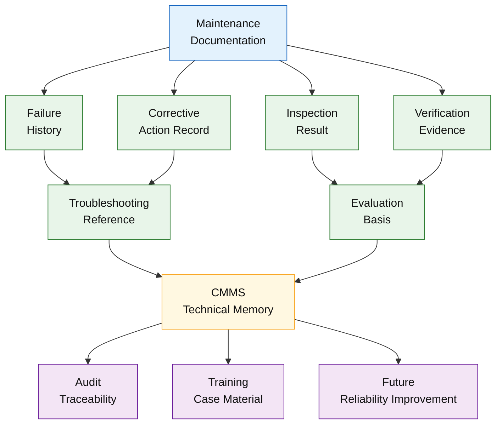

## Dokumentasi sebagai Histori dan Basis Evaluasi

Setiap aktivitas pemeliharaan—termasuk gangguan, tindakan korektif, dan hasil verifikasi—harus terdokumentasi secara konsisten. Dokumentasi ini membentuk:

- **histori kegagalan peralatan**, yang memungkinkan identifikasi pola gangguan,
- **basis evaluasi kinerja**, baik terhadap efektivitas strategi pemeliharaan maupun kualitas eksekusi,
- serta landasan data untuk penyesuaian interval, metode, dan prioritas pemeliharaan.

Tanpa histori yang tertata, evaluasi teknis akan bergantung pada ingatan individu dan intuisi sesaat.

## Dokumentasi sebagai Referensi Troubleshooting

Dokumentasi yang baik menjadi **referensi langsung** dalam proses troubleshooting berikutnya. Catatan kegagalan terdahulu, solusi yang berhasil atau gagal, serta kondisi operasi saat kejadian memberikan konteks penting bagi teknisi dan engineer dalam mengambil keputusan yang lebih cepat dan akurat.

## Integrasi dengan Sistem dan Fungsi Lain

Dokumentasi pemeliharaan memiliki keterkaitan langsung dengan:

- **CMMS**, sebagai platform pengelolaan data aset, work order, dan histori peralatan,
- **audit internal dan eksternal**, yang menuntut traceability keputusan dan tindakan teknis,
- **training internal**, sebagai bahan pembelajaran berbasis kasus nyata lapangan.

📌 **Prinsip kunci:**
Tanpa dokumentasi yang disiplin dan terstruktur, organisasi pemeliharaan akan **mengulang kesalahan yang sama**, kehilangan pengetahuan berharga, dan melemahkan kemampuan sistem untuk belajar dan berkembang. Dokumentasi yang kuat menjadikan pengalaman masa lalu sebagai **modal teknis untuk keandalan masa depan**.

---

# 6.7 Learning Loop: Dari Gangguan ke Perbaikan Sistem

Sub-bab ini menegaskan bahwa **keandalan sistem pemeliharaan tidak ditentukan oleh ketiadaan gangguan**, melainkan oleh **kemampuan organisasi belajar dari setiap gangguan yang terjadi**. Dalam kerangka _Maintenance System Handbook_, mekanisme tersebut diwujudkan melalui **learning loop** yang terstruktur dan berulang.

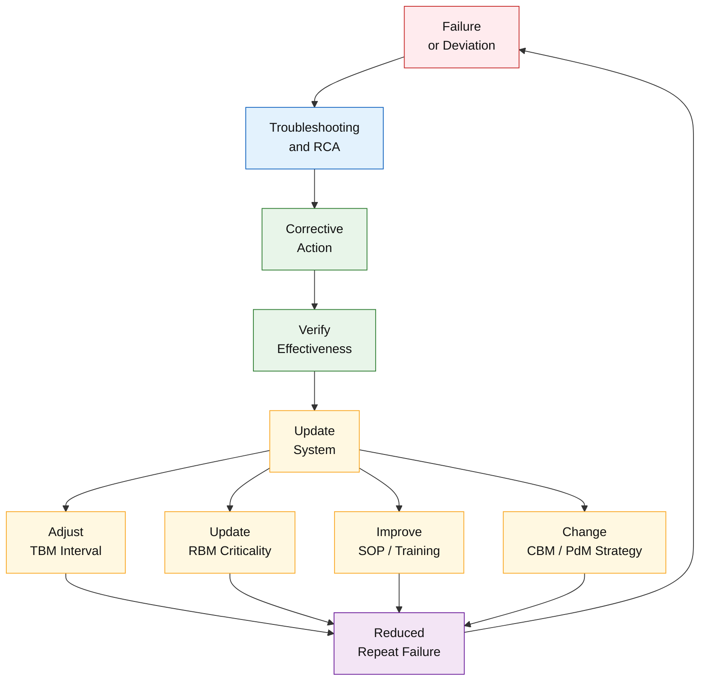

## Konsep Learning Loop dalam Pemeliharaan

Learning loop menggambarkan alur sistematis berikut:

**failure → analisa → perbaikan → update sistem**

Setiap kegagalan atau deviasi operasi diperlakukan sebagai **data berharga**, bukan sekadar insiden yang harus segera ditutup. Melalui analisa teknis (RCA, FMEA, FTA), organisasi memperoleh pemahaman baru yang kemudian diterjemahkan menjadi tindakan perbaikan dan pembaruan sistem.

## Integrasi Learning Loop dengan Sistem Pemeliharaan

Learning loop tidak berdiri sendiri, melainkan terintegrasi langsung dengan elemen kunci sistem pemeliharaan, antara lain:

- **Evaluasi berkala (6 bulanan / tahunan)**
  Hasil gangguan dan analisa dikompilasi untuk menilai efektivitas strategi pemeliharaan secara menyeluruh.

- **Penyesuaian interval TBM**
  Data kegagalan aktual digunakan untuk memperketat, melonggarkan, atau mengubah metode pemeliharaan berbasis risiko dan kondisi aktual.

- **Pembaruan klasifikasi risiko (RBM)**
  Temuan baru dapat mengubah status kritikalitas aset, tiering evaluasi, atau prioritas perhatian teknis.

Dengan mekanisme ini, sistem pemeliharaan tidak terjebak pada asumsi awal, melainkan **berevolusi seiring pengalaman lapangan**.

## Learning Loop sebagai Penggerak Sistem Hidup

📌 **Penegasan utama:**
Risk-Based Maintenance (RBM) **hidup karena learning loop**, bukan karena jadwal tetap atau prosedur statis. Tanpa learning loop, RBM akan tereduksi menjadi TBM yang dibungkus istilah risiko, namun kehilangan kemampuan adaptifnya.

Melalui learning loop yang disiplin, organisasi pemeliharaan mampu:

- menurunkan tingkat kegagalan berulang,
- meningkatkan kualitas keputusan teknis,
- dan menjaga relevansi sistem pemeliharaan terhadap dinamika operasi jangka panjang.

Dengan demikian, learning loop menjadi **jembatan antara pengalaman lapangan dan peningkatan sistem yang berkelanjutan**.

---

# 6.8 Troubleshooting sebagai Sistem Pembelajaran Tim

Sub-bab ini menempatkan **troubleshooting** bukan sekadar sebagai aktivitas teknis penyelesaian masalah, melainkan sebagai **mekanisme pembelajaran kolektif** yang memperkuat stabilitas dan kematangan organisasi pemeliharaan. Dalam sistem pemeliharaan modern, nilai troubleshooting tidak berhenti pada alat kembali beroperasi, tetapi pada **pengetahuan yang diwariskan dan disistematiskan**.

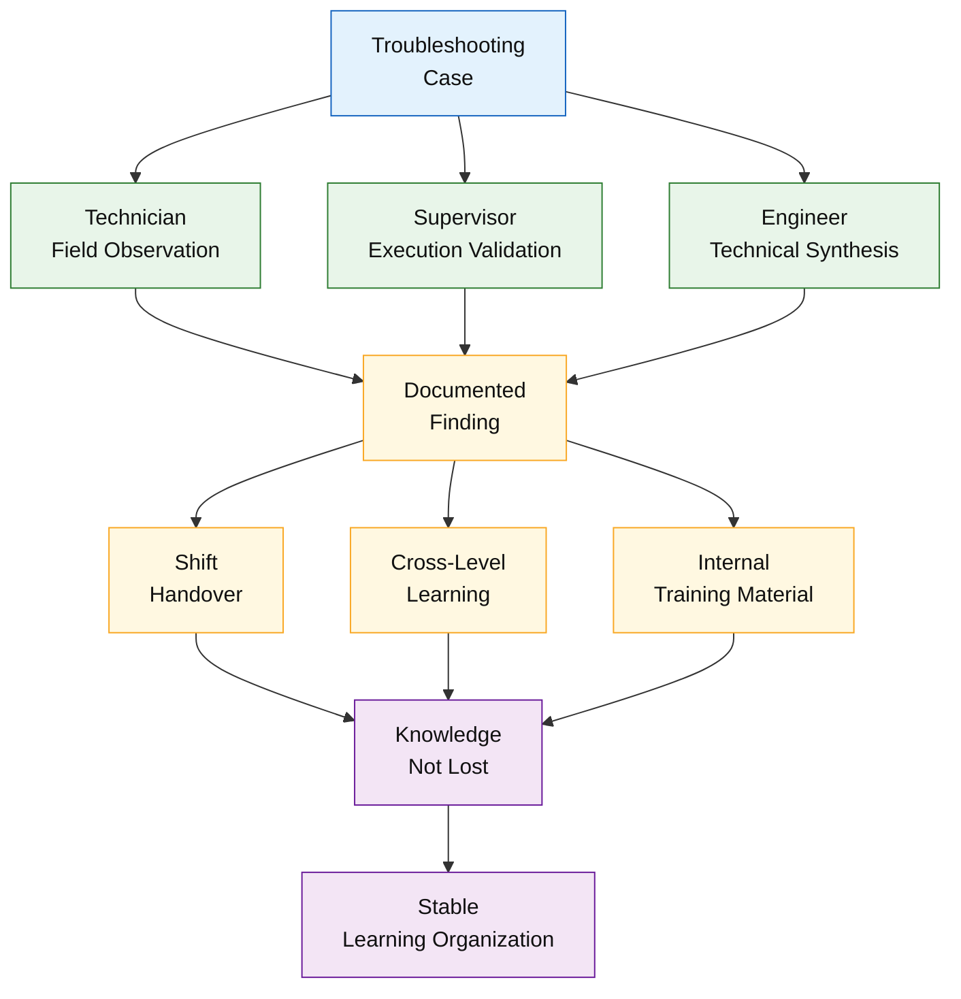

## Transfer Pengetahuan Antar Shift

Gangguan dan penyelesaiannya sering terjadi dalam konteks kerja bergilir. Tanpa sistem pembelajaran yang baik, pengetahuan akan terfragmentasi dan hilang saat pergantian shift. Dengan pendekatan sistematis:

- hasil troubleshooting didokumentasikan dan dikomunikasikan,
- temuan penting dibagikan lintas shift,
- dan keputusan teknis tidak bergantung pada individu tertentu.

Hal ini memastikan konsistensi respon teknis dan mengurangi ketergantungan pada “orang kunci”.

## Pembelajaran Lintas Jabatan

Troubleshooting yang efektif melibatkan alur pembelajaran berjenjang:

- **teknisi** menyumbang temuan lapangan dan observasi aktual,
- **supervisor** memvalidasi metode dan memastikan konsistensi eksekusi,
- **engineer** mensintesis temuan menjadi solusi teknis dan perbaikan sistem.

Dengan mekanisme ini, troubleshooting menjadi sarana penyelarasan perspektif teknis antar level organisasi, bukan aktivitas terisolasi di lapangan.

## Troubleshooting sebagai Materi Training Internal

Kasus nyata troubleshooting—terutama yang terdokumentasi dengan baik—merupakan **materi pelatihan paling relevan** bagi organisasi pemeliharaan. Dibandingkan teori umum, studi kasus internal:

- mencerminkan kondisi peralatan dan proses aktual,
- meningkatkan pemahaman konteks risiko,
- serta mempercepat transfer pengalaman kepada personel baru.

📌 **Nilai strategis:**
Organisasi yang mampu mengubah troubleshooting menjadi **sistem pembelajaran tim** akan memiliki tingkat stabilitas yang lebih tinggi. Pengetahuan tidak hilang bersama waktu, kesalahan tidak diulang, dan sistem pemeliharaan berkembang secara kolektif. Dengan demikian, **organisasi yang belajar adalah organisasi yang stabil dan berkelanjutan**.

---

# 🧠 Kesimpulan Module 6

Modul 5 menegaskan bahwa **keandalan pemeliharaan tidak diukur dari kecepatan memperbaiki gangguan**, melainkan dari **kemampuan sistem mencegah terulangnya masalah yang sama**. Dalam konteks ini, pemeliharaan yang matang adalah pemeliharaan yang **belajar secara sistematis** dari setiap kegagalan.

Melalui eksekusi yang disiplin, troubleshooting yang terstruktur, penerapan RCA sebagai kewajiban sistem, serta dukungan FMEA dan FTA sebagai alat pencegahan, organisasi pemeliharaan mampu mengubah gangguan menjadi **sumber peningkatan berkelanjutan**. Dokumentasi yang rapi dan learning loop yang aktif memastikan bahwa pengetahuan teknis tidak hilang, melainkan terakumulasi sebagai aset organisasi.

Dengan demikian, Module 6 menjadi penghubung penting antara **strategi (Module 3)** dan **akuntabilitas (Module 4)**, sekaligus fondasi menuju sistem pemeliharaan yang **preventif, adaptif, dan berkelanjutan**.

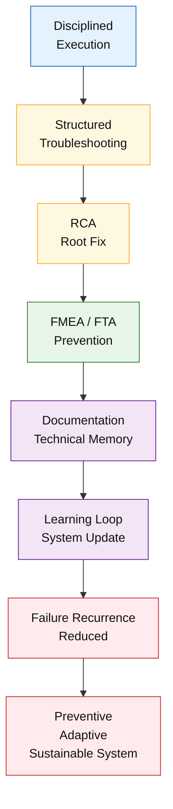

---

<ResourceBox
  title="Korelasi internal-link modul:"
  items={[
    {
      name: 'Maintenance System Handbook (MSH)',
      href: '/blog/management/MSH/MSH-panduan-lengkap',
      description:
        'Dari Risk-Based Thinking ke Reliability-Driven Organization - Panduan Lengkap Maintenance System Handbook',
    },
    {
      name: 'Risk-Based Maintenance',
      href: '/blog/management/MSH/MSH-3-rbm',
      description:
        'Module 3 – Risk-Based Maintenance sebagai Strategi Pemeliharaan Praktis',
    },
    {
      name: 'Organisasi, KPI, dan Akuntabilitas',
      href: '/blog/management/MSH/MSH-5-organization',
      description:
        'Module 5 – Organisasi, KPI, dan Akuntabilitas dalam Sistem Pemeliharaan',
    },
    {
      name: 'Eksekusi, Troubleshooting, dan Sistem Pembelajaran',
      href: '/blog/management/MSH/MSH-6-eksekusi',
      description:
        'Module 6 – Eksekusi, Troubleshooting, dan Sistem Pembelajaran Pemeliharaan',
    },
    {
      name: 'SHE sebagai Batas Sistem dalam Pengambilan Keputusan',
      href: '/blog/management/MSH/MSH-7-she-compliance',
      description:
        'Module 7 – SHE sebagai Batas Sistem dalam Pengambilan Keputusan Pemeliharaan',
    },
    {
      name: 'Lifecycle Aset',
      href: '/blog/management/MSH/MSH-8-lifecycle-ta',
      description:
        'Module 8 – Lifecycle Aset, Turnaround, dan Continuous Improvement Sistem Pemeliharaan',
    },
  ]}
/>

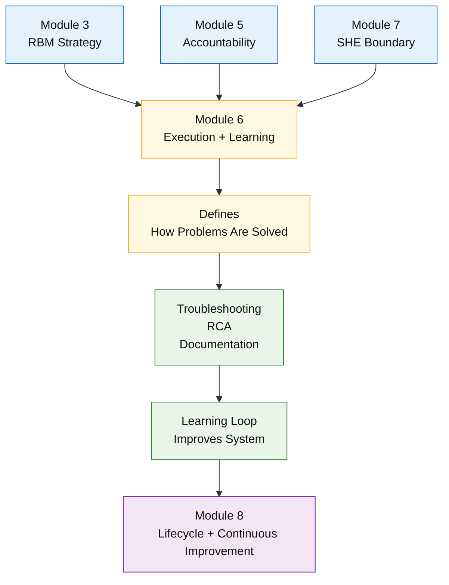

---

# 📚 Referensi Module 6

1. **Artikel 2**
   _Efisiensi dan Keandalan dalam Manajemen Pemeliharaan_ – Bab Troubleshooting, KPI, dan Dokumentasi

2. **Artikel 3**
   _Risk-Based Maintenance di Industri Petrokimia_ – Evaluasi Berkala dan Learning Loop

3. Literatur teknis dan praktik industri:

   - Root Cause Failure Analysis (RCFA)
   - Failure Mode and Effects Analysis (FMEA)
   - Fault Tree Analysis (FTA)

4. **ISO 55000 – Asset Management**
   (aspek pembelajaran organisasi, pengelolaan pengetahuan, dan siklus hidup aset)

---

<small>
  **_Catatan Penyusunan_** Artikel ini disusun sebagai materi edukasi dan
  referensi umum berdasarkan berbagai sumber pustaka, praktik lapangan, serta
  bantuan alat penulisan. Pembaca disarankan untuk melakukan verifikasi lanjutan
  dan penyesuaian sesuai dengan kondisi serta kebutuhan masing-masing sistem.
</small>
