# **_Lifecycle Aset, Turnaround, dan Continuous Improvement Sistem Pemeliharaan_**

---

- [**_Lifecycle Aset, Turnaround, dan Continuous Improvement Sistem Pemeliharaan_**](#lifecycle-aset-turnaround-dan-continuous-improvement-sistem-pemeliharaan)
- [📌 Prolog Modul](#-prolog-modul)
- [8.1 Maintenance dalam Perspektif Siklus Hidup Aset](#81-maintenance-dalam-perspektif-siklus-hidup-aset)
- [8.2 Hubungan Sistemik Maintenance dan Turnaround (TA)](#82-hubungan-sistemik-maintenance-dan-turnaround-ta)
- [8.3 Review Berkala: 6 Bulanan dan Tahunan sebagai Mekanisme Kontrol](#83-review-berkala-6-bulanan-dan-tahunan-sebagai-mekanisme-kontrol)
  - [Review 6 Bulanan](#review-6-bulanan)
  - [Review Tahunan](#review-tahunan)
  - [Penegasan](#penegasan)
- [8.4 Reliability Growth sebagai Target Sistem](#84-reliability-growth-sebagai-target-sistem)
- [8.5 Audit sebagai Alat Evolusi, Bukan Sekadar Kepatuhan](#85-audit-sebagai-alat-evolusi-bukan-sekadar-kepatuhan)
- [8.6 Maturity Evolution: Dari Sistem Reaktif ke Sistem Tangguh](#86-maturity-evolution-dari-sistem-reaktif-ke-sistem-tangguh)
- [8.6 Maturity Evolution: Dari Sistem Reaktif ke Sistem Tangguh](#86-maturity-evolution-dari-sistem-reaktif-ke-sistem-tangguh-1)
- [8.7 Peran Leadership dalam Menjaga Keberlanjutan Sistem](#87-peran-leadership-dalam-menjaga-keberlanjutan-sistem)
- [8.8 Continuous Improvement sebagai Siklus Tertutup Sistem Maintenance](#88-continuous-improvement-sebagai-siklus-tertutup-sistem-maintenance)
- [🧠 Kesimpulan Module 8](#-kesimpulan-module-8)
- [📚 Referensi Module 8](#-referensi-module-8)

---

# 📌 Prolog Modul

Modul ini merupakan **penutup strategis** dari _Maintenance System Handbook_ yang dirancang untuk menjawab pertanyaan pada tingkat pimpinan dan pengambil keputusan jangka panjang:

> **“Bagaimana sistem pemeliharaan ini tetap efektif, relevan, dan dapat dipertanggungjawabkan dalam horizon 10–20 tahun?”**

Seluruh modul sebelumnya telah membangun sistem secara berlapis dan konsisten. **Module 1–2** meletakkan filosofi serta logika pengambilan keputusan berbasis risiko. **Module 3** menerjemahkannya ke dalam strategi _Risk-Based Maintenance_ yang operasional. **Module 4–5** memastikan eksekusi yang akuntabel serta pembelajaran yang berkelanjutan dari setiap gangguan. **Module 6** kemudian menetapkan SHE sebagai batas keras yang tidak dapat dinegosiasikan dalam seluruh keputusan pemeliharaan.

Dengan fondasi tersebut, **Module 7** berfokus pada keberlanjutan sistem. Modul ini memastikan bahwa sistem pemeliharaan tidak berhenti sebagai desain awal yang statis, melainkan **ditinjau secara periodik**, **ditingkatkan secara sadar**, dan **diselaraskan dengan siklus hidup aset serta kegiatan Turnaround (TA)**. Perspektif siklus hidup, mekanisme review dan audit, serta _continuous improvement_ diposisikan sebagai pengikat agar sistem tetap adaptif terhadap penuaan aset, perubahan risiko, tuntutan regulasi, dan dinamika bisnis.

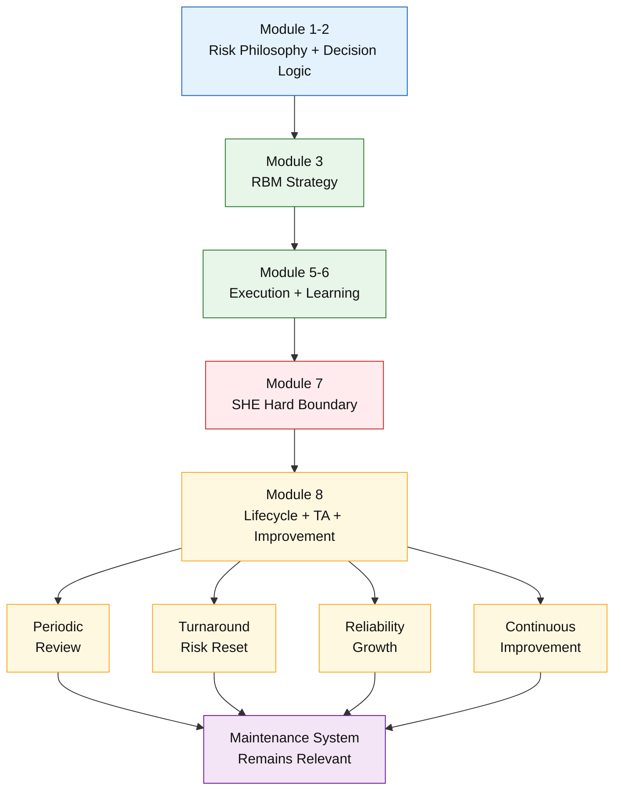

<ResourceBox
  title="Korelasi internal-link modul:"
  items={[
    {
      name: 'Maintenance System Handbook (MSH)',
      href: '/blog/management/MSH/MSH-panduan-lengkap',
      description:
        'Dari Risk-Based Thinking ke Reliability-Driven Organization - Panduan Lengkap Maintenance System Handbook',
    },
    {
      name: 'Alasan Sistem Pemeliharaan Harus Berevolusi',
      href: '/blog/management/MSH/MSH-0-maintenance-evolusi',
      description:
        'Module 0 – Konteks Industri dan Alasan Sistem Pemeliharaan Harus Berevolusi',
    },
    {
      name: 'Fondasi Risiko Sistem Pemeliharaan',
      href: '/blog/management/MSH/MSH-1-maintenance-fondasi-risiko',
      description: 'Module 1 – Filosofi dan Fondasi Risiko Sistem Pemeliharaan',
    },
    {
      name: 'Model Risiko dan Logika Pengambilan Keputusan',
      href: '/blog/management/MSH/MSH-2-model-risiko',
      description:
        'Module 2 – Model Risiko dan Logika Pengambilan Keputusan Pemeliharaan',
    },
    {
      name: 'Risk-Based Maintenance',
      href: '/blog/management/MSH/MSH-3-rbm',
      description:
        'Module 3 – Risk-Based Maintenance sebagai Strategi Pemeliharaan Praktis',
    },
    {
      name: 'Eksekusi, Troubleshooting, dan Sistem Pembelajaran',
      href: '/blog/management/MSH/MSH-6-eksekusi',
      description:
        'Module 6 – Eksekusi, Troubleshooting, dan Sistem Pembelajaran Pemeliharaan',
    },
    {
      name: 'SHE sebagai Batas Sistem dalam Pengambilan Keputusan',
      href: '/blog/management/MSH/MSH-7-she-compliance',
      description:
        'Module 7 – SHE sebagai Batas Sistem dalam Pengambilan Keputusan Pemeliharaan',
    },
  ]}
  note="Module 8 berfungsi sebagai penutup sekaligus pengunci seluruh sistem, memastikan bahwa _Maintenance System Handbook_ tidak hanya menjadi dokumen referensi, tetapi kerangka kerja yang relevan dan bernilai sepanjang umur aset."
/>

---

# 8.1 Maintenance dalam Perspektif Siklus Hidup Aset

Sub-bab ini menempatkan pemeliharaan sebagai **komponen integral dari manajemen siklus hidup aset (asset lifecycle management)**, bukan sebagai aktivitas tahunan yang berdiri sendiri. Dalam kerangka ini, strategi maintenance harus dipahami sebagai **fungsi dinamis** yang berubah seiring perubahan kondisi teknis, risiko, dan nilai aset terhadap operasi bisnis.

Dalam industri petrokimia, aset utama—seperti reaktor, kolom distilasi, kompresor, dan sistem utilitas—memiliki umur teknis panjang dan nilai kapital tinggi. Oleh karena itu, pendekatan pemeliharaan yang efektif harus mempertimbangkan **fase siklus hidup aset**, yang secara umum meliputi:

1. **Design Phase**
   Pada tahap ini, keputusan desain sangat menentukan beban pemeliharaan jangka panjang. Keterlibatan fungsi maintenance diperlukan untuk memastikan aspek _maintainability_, akses inspeksi, filosofi redundancy, serta pemilihan material yang sesuai dengan risiko proses. Kesalahan di fase ini akan “dikunci” sepanjang umur aset.

2. **Commissioning Phase**
   Maintenance berperan dalam memastikan bahwa aset memasuki fase operasi dengan kondisi awal yang terdokumentasi dengan baik (_baseline condition_). Data commissioning menjadi referensi penting untuk evaluasi degradasi di masa depan dan penetapan strategi awal TBM, CBM, atau PdM.

3. **Operation Phase**
   Pada fase operasi normal, fokus maintenance adalah menjaga **availability, reliability, dan compliance SHE** melalui strategi berbasis risiko (RBM). Interval inspeksi, metode pemeliharaan, dan tingkat perhatian disesuaikan dengan profil risiko aktual aset.

4. **Aging Phase**
   Seiring bertambahnya usia aset, laju degradasi dan potensi kegagalan meningkat. Strategi maintenance harus berevolusi dari sekadar menjaga ketersediaan menjadi **mengendalikan risiko penuaan**, termasuk peningkatan frekuensi inspeksi, penambahan metode monitoring, atau keputusan redesign dan replacement parsial.

5. **Decommissioning Phase**
   Pada tahap akhir, maintenance berperan memastikan penghentian operasi dilakukan secara aman, terkendali, dan sesuai regulasi. Risiko SHE dan lingkungan menjadi dominan, sementara pertimbangan biaya operasional jangka pendek tidak lagi relevan.

Prinsip kunci dari perspektif siklus hidup ini adalah bahwa **strategi pemeliharaan tidak bersifat universal dan statis**. Pendekatan yang efektif untuk aset berusia 5 tahun akan menjadi tidak memadai—atau bahkan berbahaya—bila diterapkan tanpa penyesuaian pada aset berusia 25 tahun. Oleh karena itu, sistem pemeliharaan yang matang harus mampu **menyesuaikan strategi, metode, dan prioritasnya secara sadar** seiring pergerakan aset sepanjang siklus hidupnya.

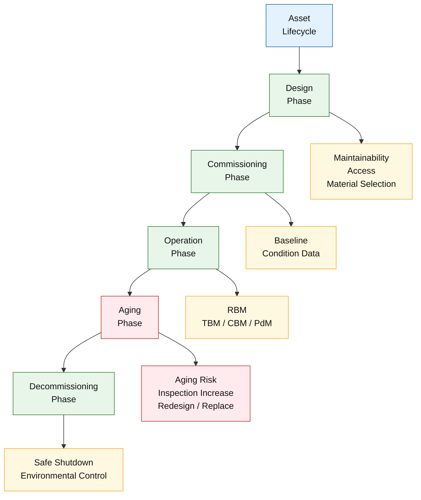

---

# 8.2 Hubungan Sistemik Maintenance dan Turnaround (TA)

Sub-bab ini bertujuan menghilangkan dikotomi yang sering muncul di organisasi, yaitu pemisahan antara **“operational maintenance”** dan **Turnaround (TA)** seolah-olah keduanya merupakan domain yang terpisah. Dalam kerangka _Maintenance System Handbook_, TA diposisikan sebagai **bagian integral dari sistem pemeliharaan**, bukan sekadar proyek besar yang berdiri sendiri.

Turnaround harus dipahami sebagai **_deep maintenance window_**, yaitu periode terbatas di mana organisasi memiliki kesempatan untuk melakukan pekerjaan yang **tidak mungkin atau tidak aman dilakukan saat operasi normal**. Selain itu, TA berfungsi sebagai momen untuk **mereset risiko laten**—risiko yang selama operasi hanya dapat dimitigasi, tetapi tidak dapat dieliminasi sepenuhnya.

Dalam hubungan sistemik ini, aliran informasi bersifat dua arah:

1. **Input dari Maintenance ke TA**
   Seluruh perencanaan TA harus didasarkan pada data dan pembelajaran dari periode operasi sebelumnya, antara lain:

   - histori gangguan dan kegagalan berulang,
   - hasil Root Cause Analysis (RCA),
   - tren _condition monitoring_ (vibration, oil analysis, thermography, dan inspeksi proses),
   - deviasi terhadap strategi RBM yang telah ditetapkan.
     Data ini memastikan bahwa scope TA **berbasis risiko nyata**, bukan asumsi atau kebiasaan historis.

2. **Output dari TA ke Maintenance**
   Hasil TA tidak berhenti pada selesainya pekerjaan shutdown. Output TA harus diterjemahkan kembali ke dalam sistem pemeliharaan, berupa:

   - perubahan atau penyesuaian strategi maintenance,
   - keputusan redesign atau penggantian komponen kritis,
   - penghapusan _failure mode_ tertentu yang sebelumnya dominan,
   - pembaruan baseline kondisi aset pasca-TA.
     Dengan demikian, TA menjadi titik loncatan untuk **peningkatan keandalan jangka panjang**, bukan sekadar pemulihan kondisi.

Keterkaitan langsung dengan **Risk-Based Maintenance (Module 3)** sangat krusial. RBM menentukan **aset mana dan failure mode mana yang wajib disentuh saat TA**, serta pekerjaan mana yang dapat ditunda tanpa melanggar batas risiko dan SHE. Tanpa kerangka RBM, TA berisiko berubah menjadi kumpulan pekerjaan besar yang mahal namun tidak efektif dalam menurunkan risiko sistemik.

Melalui pendekatan ini, maintenance dan TA membentuk **satu siklus terpadu**: operasi mengidentifikasi risiko, TA mengeliminasi risiko laten, dan sistem pemeliharaan pasca-TA beroperasi pada tingkat keandalan yang lebih tinggi.

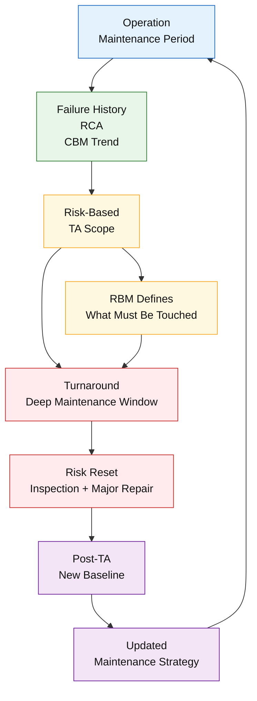

---

# 8.3 Review Berkala: 6 Bulanan dan Tahunan sebagai Mekanisme Kontrol

Sub-bab ini menegaskan bahwa **review berkala merupakan mekanisme kontrol inti** dalam sistem pemeliharaan modern. Review tidak diposisikan sebagai respons reaktif terhadap kegagalan besar, melainkan sebagai **ritual sistemik** yang memastikan bahwa strategi, eksekusi, dan asumsi risiko tetap relevan terhadap kondisi aktual aset dan operasi.

## Review 6 Bulanan

Review enam bulanan berfungsi sebagai **early control mechanism** untuk mendeteksi deviasi sebelum berkembang menjadi masalah sistemik. Fokus utama meliputi:

- **Efektivitas TBM dan strategi RBM**, termasuk kesesuaian interval, metode, dan scope pekerjaan.
- **Tren gangguan dan kegagalan**, baik frekuensi maupun pola berulang yang mengindikasikan degradasi atau kelemahan desain.
- **Validasi klasifikasi kritikal aset**, memastikan bahwa perubahan operasi, beban, atau lingkungan tidak menggeser profil risiko yang ada.

Hasil review ini menjadi dasar penyesuaian taktis tanpa harus menunggu siklus besar seperti Turnaround.

## Review Tahunan

Review tahunan berperan sebagai **strategic alignment mechanism**. Pada level ini, organisasi menilai:

- kebutuhan _realignment_ strategi pemeliharaan terhadap target bisnis dan risiko,
- potensi **redesign, replacement, atau upgrade** aset yang tidak lagi ekonomis atau aman,
- **kesiapan Turnaround (TA)** berikutnya, termasuk scope awal berbasis risiko dan pembelajaran historis.

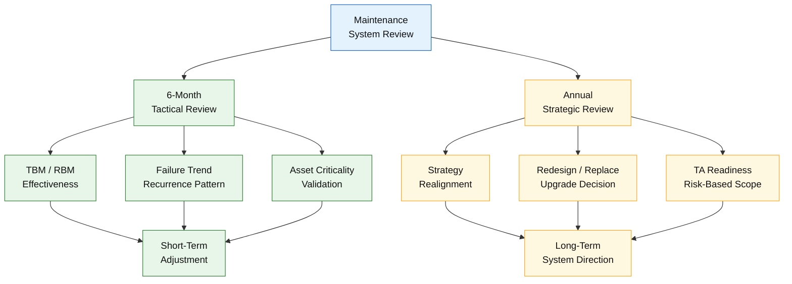

## Penegasan

Tanpa mekanisme review yang terjadwal dan disiplin, sistem pemeliharaan akan **membeku pada asumsi lama**, kehilangan sensitivitas terhadap perubahan risiko, dan pada akhirnya menjadi tidak efektif. Review berkala memastikan sistem tetap **adaptif, terkalibrasi, dan defensible** sepanjang siklus hidup aset.

---

# 8.4 Reliability Growth sebagai Target Sistem

Sub-bab ini menggeser orientasi sistem pemeliharaan dari sekadar **kepatuhan terhadap jadwal dan prosedur** menuju **peningkatan keandalan yang terukur dan berkelanjutan (reliability growth)**. Dalam sistem pemeliharaan yang matang, keberhasilan tidak lagi diukur dari seberapa cepat gangguan diperbaiki, melainkan dari **seberapa jarang gangguan tersebut terjadi kembali**.

**Reliability growth** didefinisikan sebagai kemampuan sistem untuk **menurunkan laju kegagalan seiring waktu** melalui pembelajaran terstruktur, perbaikan desain, dan penyempurnaan strategi pemeliharaan. Fokusnya bukan pada reaksi, tetapi pada eliminasi penyebab kegagalan.

Indikator utama reliability growth meliputi:

- **Penurunan recurrence failure**, yang menunjukkan efektivitas RCA dan tindakan korektif permanen.
- **Peningkatan Mean Time Between Failures (MTBF)** pada aset kritis, sebagai bukti stabilitas teknis.
- **Stabilitas operasi**, ditandai dengan berkurangnya gangguan tak terencana dan variabilitas proses.

Reliability growth memiliki keterkaitan langsung dengan dua pilar sistem:

- **Learning loop (Module 5)**, yang memastikan setiap kegagalan menghasilkan pengetahuan dan perubahan sistem.
- **RBM maturity (Module 3)**, yang memastikan fokus pemeliharaan semakin tajam pada risiko dan failure mode dominan.

📌 **Prinsip kunci:**
Sistem pemeliharaan yang dewasa tidak diukur dari kecepatan respons terhadap kegagalan, tetapi dari **kemampuannya mencegah kegagalan yang sama terjadi kembali**.

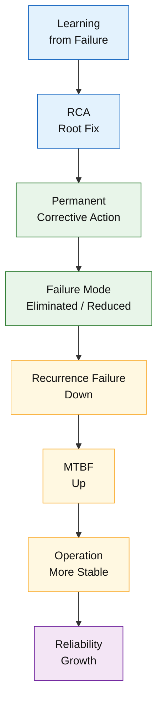

---

# 8.5 Audit sebagai Alat Evolusi, Bukan Sekadar Kepatuhan

Sub-bab ini menempatkan audit sebagai **mekanisme pembelajaran dan penguatan sistem**, bukan sekadar kewajiban kepatuhan atau sumber tekanan administratif. Dalam _Maintenance System Handbook_, audit diposisikan sebagai **alat evaluasi objektif** untuk menilai konsistensi antara filosofi, keputusan risiko, dan praktik pemeliharaan di lapangan.

Audit dibedakan menjadi dua fungsi utama:

1. **Audit Internal**
   Audit internal berperan sebagai **early feedback mechanism** yang dilakukan secara berkala untuk:

   - memverifikasi konsistensi penerapan RBM, KPI, dan governance,
   - memastikan keputusan pemeliharaan selaras dengan logika risiko dan batas SHE,
   - mengidentifikasi deviasi sebelum berkembang menjadi kegagalan sistemik.
     Audit internal yang efektif bersifat korektif dan preventif, bukan represif.

2. **Audit Eksternal**
   Audit eksternal berfungsi sebagai **validasi independen** terhadap sistem pemeliharaan. Fokusnya mencakup:

   - ketertelusuran keputusan berbasis risiko,
   - kesesuaian dengan standar dan praktik industri,
   - kesiapan organisasi dalam mempertanggungjawabkan keputusan teknis dan manajerial.

Dalam konteks evolusi sistem, audit berfungsi sebagai:

- **verifikasi konsistensi**, antara kebijakan, strategi, dan eksekusi,
- **validasi keputusan risiko**, terutama pada area kritis dan berisiko tinggi,
- **pemicu perbaikan**, melalui temuan yang diterjemahkan menjadi tindakan sistemik.

Kesiapan terhadap standar seperti **ISO 55000** dan **API RP 580/581** tidak dipandang sebagai tujuan akhir, melainkan sebagai **kerangka referensi** untuk mempercepat kedewasaan sistem.

📌 **Nilai strategis:**
Audit yang dirancang dan dimanfaatkan dengan benar akan mempercepat transisi organisasi dari sekadar patuh menuju **sistem pemeliharaan yang matang, defensible, dan terus berkembang**.

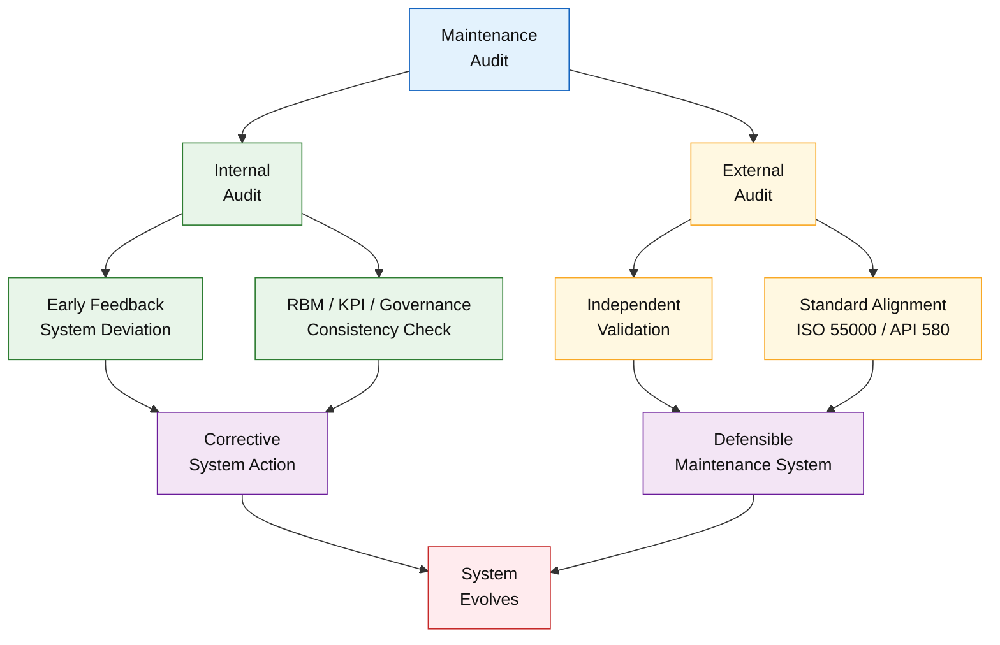

---

# 8.6 Maturity Evolution: Dari Sistem Reaktif ke Sistem Tangguh

Sub-bab ini memberikan **kerangka evolusi kematangan sistem pemeliharaan**, yang menggambarkan perjalanan organisasi dari pola kerja reaktif menuju **organisasi yang digerakkan oleh keandalan (reliability-driven organization)**. Kerangka ini menegaskan bahwa tujuan _Maintenance System Handbook_ bukanlah menyamakan semua fasilitas, melainkan memastikan setiap plant **bergerak naik secara sadar dan terukur**.

Tahapan kematangan sistem pemeliharaan dapat dijelaskan sebagai berikut:

1. **Reaktif**
   Pemeliharaan bersifat responsif terhadap kegagalan. Fokus utama adalah memulihkan operasi secepat mungkin, dengan tingkat pengulangan kegagalan yang tinggi dan pembelajaran yang minimal.

2. **Preventive Generik**
   Organisasi mulai menerapkan pemeliharaan berbasis waktu secara luas. Meskipun lebih stabil dibanding reaktif, pendekatan ini sering menghasilkan over-maintenance dan belum mempertimbangkan perbedaan risiko antar aset.

3. **Risk-Based**
   Sistem mulai memprioritaskan aset dan aktivitas berdasarkan risiko. RBM digunakan untuk menentukan fokus pemeliharaan, sehingga sumber daya diarahkan ke area yang paling kritis terhadap keselamatan, lingkungan, dan kontinuitas operasi.

4. **Preventive–Adaptive**
   Strategi pemeliharaan menjadi adaptif terhadap kondisi aktual aset. Data _condition monitoring_, hasil evaluasi, dan pembelajaran sistemik digunakan untuk menyesuaikan interval dan metode pemeliharaan secara dinamis.

5. **Reliability-Driven Organization**
   Keandalan menjadi tujuan bersama lintas fungsi. Kegagalan jarang terjadi, pembelajaran terintegrasi dalam sistem, dan keputusan pemeliharaan sepenuhnya selaras dengan risiko, SHE, dan tujuan bisnis jangka panjang.

📌 **Penegasan:**
Tidak semua plant harus berada pada tingkat kematangan yang sama pada waktu yang sama. Namun, setiap organisasi pemeliharaan yang sehat harus memiliki **arah pergerakan yang jelas menuju tingkat kematangan yang lebih tinggi**.

# 8.6 Maturity Evolution: Dari Sistem Reaktif ke Sistem Tangguh

Sub-bab ini menyajikan **kerangka evolusi kematangan sistem pemeliharaan** yang menggambarkan perjalanan organisasi dari pola kerja reaktif menuju **organisasi yang digerakkan oleh keandalan (reliability-driven organization)**. Kerangka ini digunakan bukan untuk melakukan perbandingan antar plant, melainkan sebagai **alat refleksi dan arah perbaikan berkelanjutan**.

Tahapan kematangan sistem pemeliharaan dapat dijelaskan sebagai berikut:

1. **Reaktif**
   Pemeliharaan dilakukan setelah kegagalan terjadi. Fokus utama adalah pemulihan operasi secepat mungkin, dengan tingkat _recurrence failure_ tinggi dan pembelajaran yang terbatas.

2. **Preventive Generik**
   Organisasi mulai menerapkan pemeliharaan berbasis waktu secara luas. Stabilitas meningkat, namun pendekatan ini sering menghasilkan **over-maintenance** dan belum mempertimbangkan perbedaan risiko antar aset.

3. **Risk-Based**
   Sistem pemeliharaan mulai memprioritaskan aset dan aktivitas berdasarkan risiko. RBM digunakan untuk mengarahkan sumber daya ke aset dan failure mode yang paling berdampak terhadap keselamatan, lingkungan, dan kontinuitas operasi.

4. **Preventive–Adaptive**
   Strategi pemeliharaan menjadi adaptif terhadap kondisi aktual aset. Data _condition monitoring_, hasil evaluasi berkala, dan pembelajaran dari gangguan digunakan untuk menyesuaikan interval dan metode pemeliharaan secara dinamis.

5. **Reliability-Driven Organization**
   Keandalan menjadi tujuan bersama lintas fungsi. Kegagalan jarang terjadi, pembelajaran terintegrasi dalam sistem, dan keputusan pemeliharaan sepenuhnya selaras dengan risiko, SHE, serta tujuan bisnis jangka panjang.

📌 **Penegasan:**
Tidak semua plant harus berada pada tingkat kematangan yang sama. Namun, setiap organisasi pemeliharaan yang sehat harus memiliki **arah pergerakan yang jelas dan terukur menuju tingkat kematangan yang lebih tinggi**.

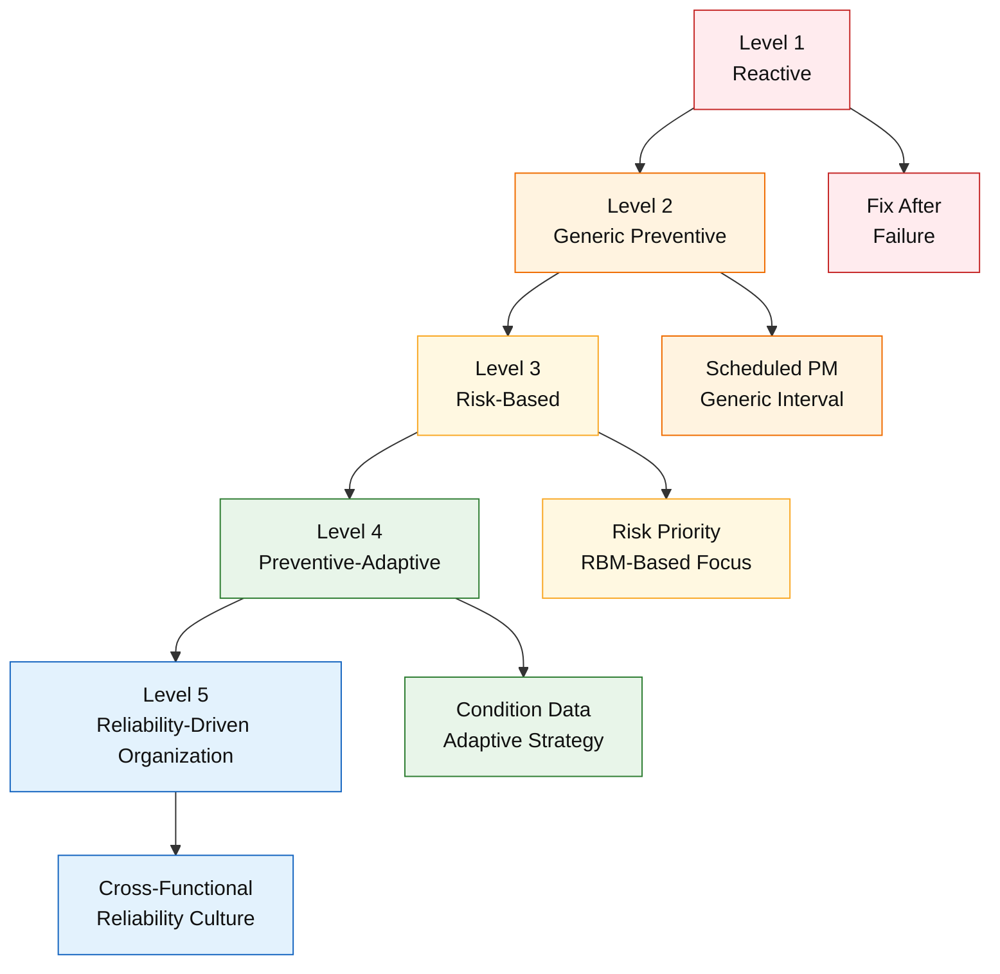

---

# 8.7 Peran Leadership dalam Menjaga Keberlanjutan Sistem

Sub-bab ini menegaskan bahwa **keberlanjutan sistem pemeliharaan tidak ditentukan oleh kelengkapan metode atau kecanggihan alat**, melainkan oleh **konsistensi kepemimpinan dalam menjaga arah dan disiplin sistem**. Dalam konteks _Maintenance System Handbook_, leadership berperan sebagai **penjaga stabilitas sistem jangka panjang**, terutama ketika organisasi menghadapi tekanan target, biaya, dan dinamika operasional.

Peran utama leadership dalam sistem pemeliharaan mencakup:

- **Penjaga filosofi sistem (Module 1)**
  Leadership bertanggung jawab memastikan bahwa prinsip _risk-based thinking_ tetap menjadi dasar pengambilan keputusan. Tanpa komitmen pimpinan, filosofi ini mudah tereduksi menjadi formalitas dokumen atau slogan.

- **Penjaga batas SHE (Module 6)**
  Dalam situasi tekanan produksi atau biaya, leadership menjadi pihak yang menentukan apakah batas SHE benar-benar dijaga. Konsistensi pimpinan dalam menolak kompromi berbahaya merupakan sinyal kuat bagi seluruh organisasi.

- **Sponsor improvement berkelanjutan**
  Inisiatif perbaikan, redesign, dan peningkatan kapabilitas membutuhkan dukungan sumber daya dan legitimasi dari pimpinan. Tanpa sponsorship ini, _continuous improvement_ akan terhenti pada level wacana.

Sub-bab ini juga menyoroti bahaya **_management drift_**, yaitu pergeseran keputusan yang perlahan namun sistemik akibat:

- dominasi target jangka pendek,
- toleransi terhadap deviasi kecil yang berulang,
- kompromi sistemik yang mengikis disiplin pemeliharaan dan keselamatan.

📌 **Prinsip kunci:**
Sistem pemeliharaan yang bertahan lama bukanlah sistem yang sejak awal dirancang sempurna, melainkan sistem yang **secara aktif dijaga, dipertahankan, dan diperkuat oleh kepemimpinan** dari waktu ke waktu.

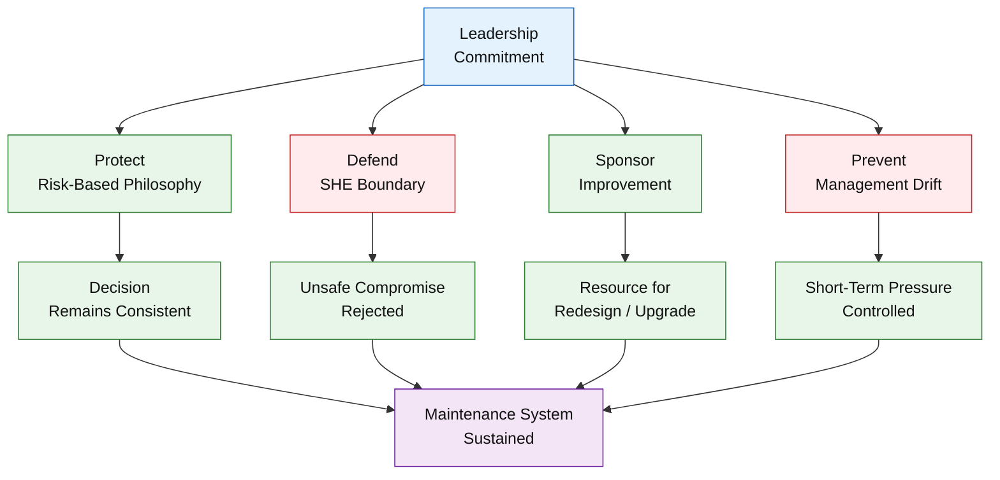

---

# 8.8 Continuous Improvement sebagai Siklus Tertutup Sistem Maintenance

Sub-bab ini menjadi **penutup logis dan konseptual** dari seluruh _Maintenance System Handbook_, dengan menegaskan bahwa pemeliharaan modern harus dipahami sebagai **sistem tertutup yang terus belajar dan menyesuaikan diri**, bukan rangkaian program yang bersifat episodik.

Continuous improvement dalam konteks ini tidak berdiri sebagai inisiatif terpisah, melainkan sebagai **mekanisme pengikat seluruh modul** ke dalam satu siklus sistemik yang utuh, meliputi:

- **Risk model** sebagai dasar penetapan prioritas dan batas keputusan (Module 1–2),
- **Risk-Based Maintenance (RBM)** sebagai strategi seleksi metode pemeliharaan (Module 3),
- **Eksekusi terkontrol dan akuntabel** melalui organisasi, KPI, dan governance (Module 4),
- **Troubleshooting, RCA, dan learning loop** sebagai sumber pembelajaran sistem (Module 5),
- **Pembatasan keputusan oleh SHE** sebagai _hard constraint_ (Module 6),
- **Review berkala dan redesign sadar** untuk menyesuaikan sistem dengan usia aset dan perubahan risiko (Module 7).

Siklus ini dapat diringkas sebagai:

> **risk model → RBM → eksekusi → pembelajaran → review → perbaikan desain dan strategi**

Dengan siklus tertutup tersebut, sistem pemeliharaan diposisikan sebagai **_living system_**—sistem yang:

- peka terhadap perubahan kondisi aset,
- mampu belajar dari gangguan dan deviasi,
- serta beradaptasi tanpa kehilangan disiplin filosofi dan batas SHE.

Continuous improvement bukan berarti perubahan tanpa arah, melainkan **penyempurnaan terkontrol** yang selalu berangkat dari data, risiko, dan pembelajaran nyata di lapangan.

📌 **Ringkasan besar:**
Pemeliharaan modern bukan tentang mencapai kondisi “sempurna”, tetapi tentang membangun sistem yang **belajar secara konsisten, menyesuaikan diri secara sadar, dan mampu bertahan dalam jangka panjang** di tengah kompleksitas industri proses.

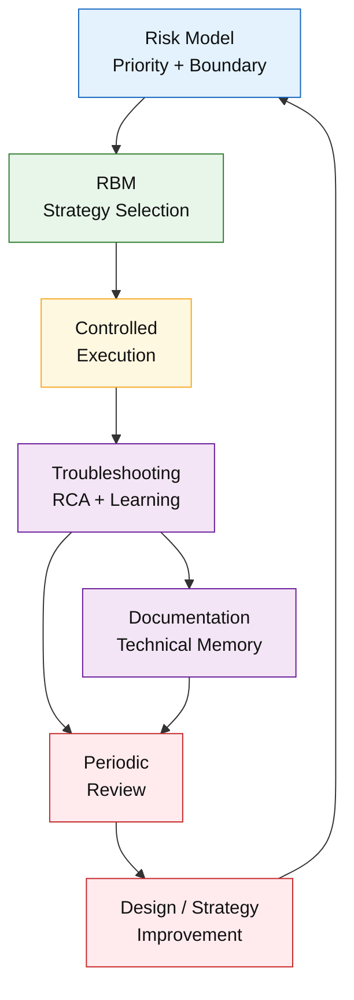

---

# 🧠 Kesimpulan Module 8

Modul ini menegaskan bahwa **keandalan jangka panjang tidak dicapai melalui metode, tools, atau program tunggal**, melainkan melalui **sistem pemeliharaan yang secara sadar ditinjau, ditantang, dan diperbaiki secara konsisten** sepanjang umur fasilitas. Dalam konteks industri petrokimia yang berisiko tinggi dan berumur panjang, sistem yang tidak berevolusi akan tertinggal oleh penuaan aset, perubahan risiko, dan tuntutan regulasi.

Dengan mengaitkan pemeliharaan pada **siklus hidup aset**, **Turnaround (TA)**, **review berkala**, serta **maturity evolution**, organisasi memastikan bahwa sistem pemeliharaan tidak berhenti pada kepatuhan prosedural, tetapi terus menghasilkan nilai strategis. Pendekatan ini menjaga agar keputusan pemeliharaan tetap relevan secara teknis, **defensible secara audit**, dan selaras dengan tujuan bisnis jangka panjang.

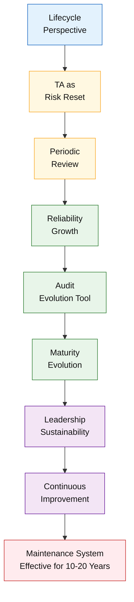

---

<ResourceBox
  title="Korelasi internal-link modul:"
  items={[
    {
      name: 'Maintenance System Handbook (MSH)',
      href: '/blog/management/MSH/MSH-panduan-lengkap',
      description:
        'Dari Risk-Based Thinking ke Reliability-Driven Organization - Panduan Lengkap Maintenance System Handbook',
    },
    {
      name: 'Alasan Sistem Pemeliharaan Harus Berevolusi',
      href: '/blog/management/MSH/MSH-0-maintenance-evolusi',
      description:
        'Module 0 – Konteks Industri dan Alasan Sistem Pemeliharaan Harus Berevolusi',
    },
    {
      name: 'Fondasi Risiko Sistem Pemeliharaan',
      href: '/blog/management/MSH/MSH-1-maintenance-fondasi-risiko',
      description: 'Module 1 – Filosofi dan Fondasi Risiko Sistem Pemeliharaan',
    },
    {
      name: 'Model Risiko dan Logika Pengambilan Keputusan',
      href: '/blog/management/MSH/MSH-2-model-risiko',
      description:
        'Module 2 – Model Risiko dan Logika Pengambilan Keputusan Pemeliharaan',
    },
    {
      name: 'Risk-Based Maintenance',
      href: '/blog/management/MSH/MSH-3-rbm',
      description:
        'Module 3 – Risk-Based Maintenance sebagai Strategi Pemeliharaan Praktis',
    },
    {
      name: 'Eksekusi, Troubleshooting, dan Sistem Pembelajaran',
      href: '/blog/management/MSH/MSH-6-eksekusi',
      description:
        'Module 6 – Eksekusi, Troubleshooting, dan Sistem Pembelajaran Pemeliharaan',
    },
    {
      name: 'SHE sebagai Batas Sistem dalam Pengambilan Keputusan',
      href: '/blog/management/MSH/MSH-7-she-compliance',
      description:
        'Module 7 – SHE sebagai Batas Sistem dalam Pengambilan Keputusan Pemeliharaan',
    },
  ]}
  note="Module 8 berfungsi sebagai penutup sekaligus pengunci seluruh sistem, memastikan bahwa _Maintenance System Handbook_ tidak hanya menjadi dokumen referensi, tetapi kerangka kerja yang relevan dan bernilai sepanjang umur aset."
/>

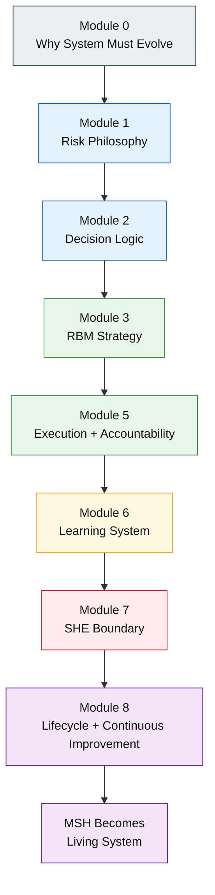

---

# 📚 Referensi Module 8

1. **Artikel 2** – _Efisiensi dan Keandalan dalam Manajemen Pemeliharaan_
2. **Artikel 3** – _Risk-Based Maintenance – Evaluasi, RBM Maturity & ESC_
3. **ISO 55000** – _Asset Management Lifecycle_
4. **API Recommended Practice 580 / 581** – _Risk-Based Framework_
5. Literatur _reliability growth_ dan _continuous improvement_ pada industri proses

---

<small>
  **_Catatan Penyusunan_** Artikel ini disusun sebagai materi edukasi dan
  referensi umum berdasarkan berbagai sumber pustaka, praktik lapangan, serta
  bantuan alat penulisan. Pembaca disarankan untuk melakukan verifikasi lanjutan
  dan penyesuaian sesuai dengan kondisi serta kebutuhan masing-masing sistem.
</small>
