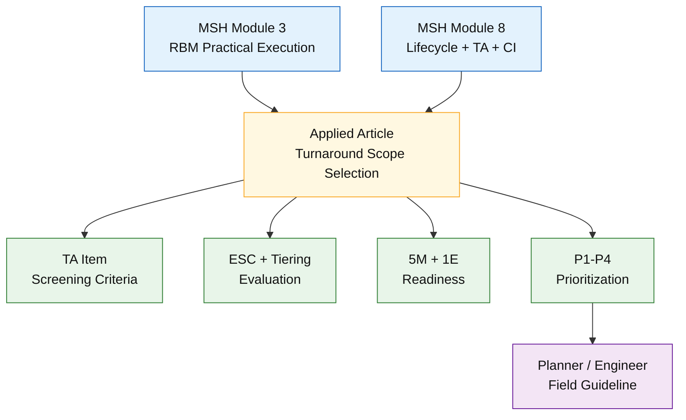
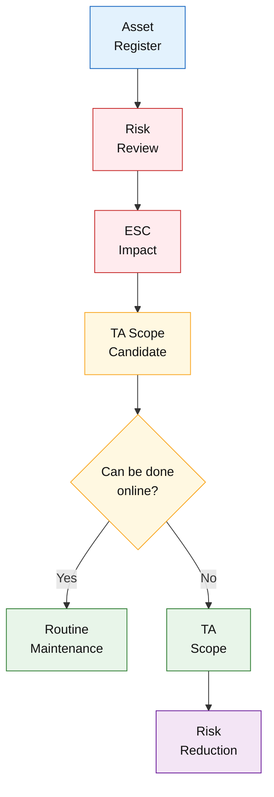
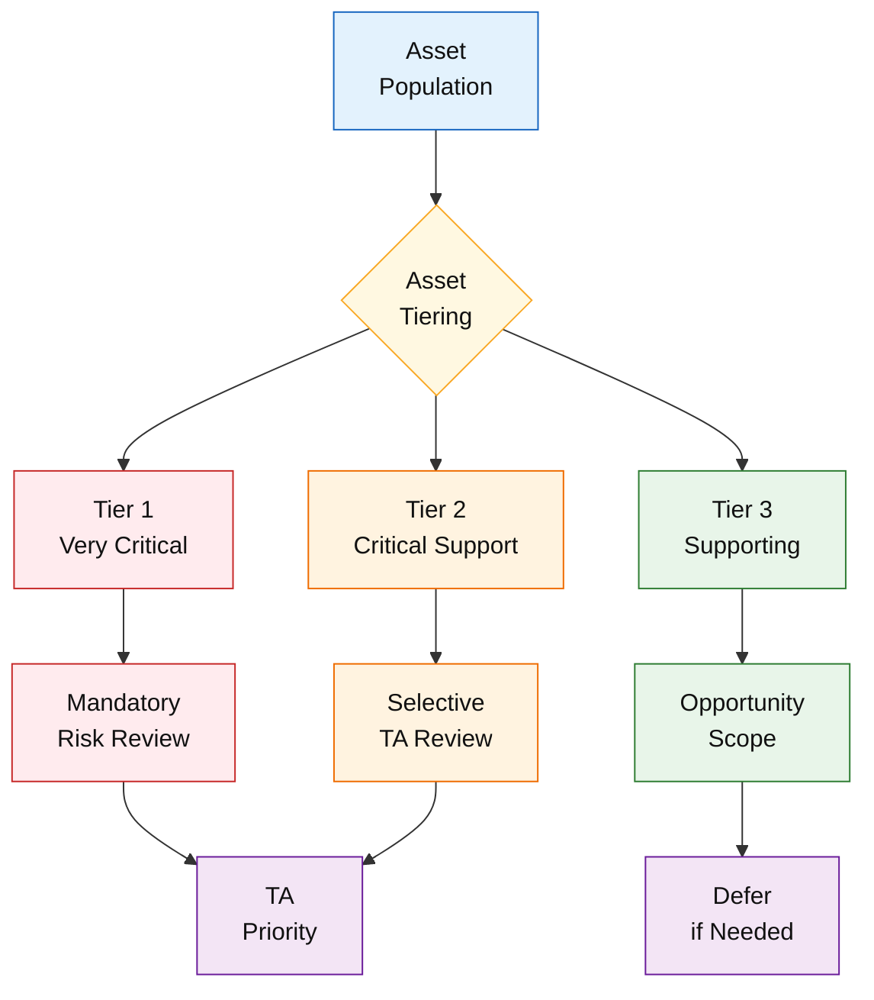
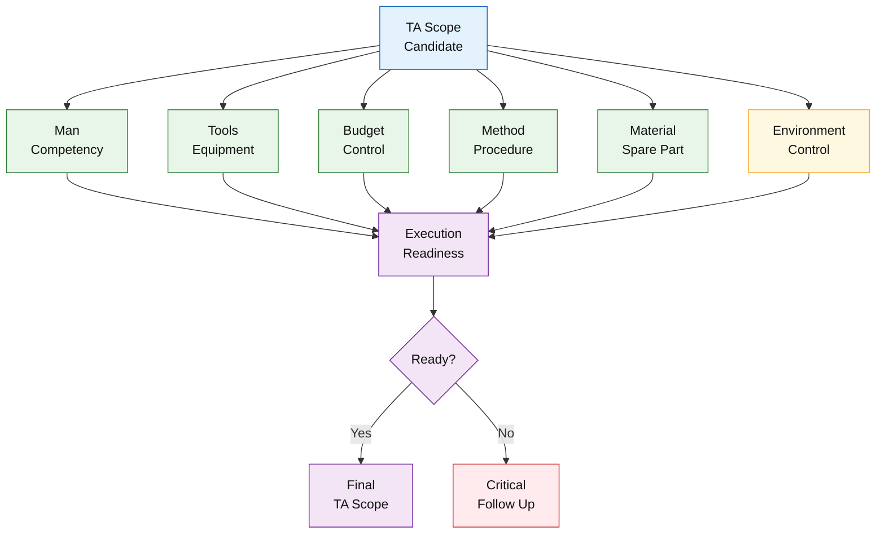

# **_Panduan Pemilihan Scope Turnaround Berbasis Risk-Based Maintenance_**

---

- [**_Panduan Pemilihan Scope Turnaround Berbasis Risk-Based Maintenance_**](#panduan-pemilihan-scope-turnaround-berbasis-risk-based-maintenance)
  - [📌 Prolog Modul](#-prolog-modul)
  - [📌 Latar Belakang](#-latar-belakang)
  - [1. TA-Turnaround sebagai Momentum Pengurangan Risiko](#1-ta-turnaround-sebagai-momentum-pengurangan-risiko)
  - [2. Kriteria Utama Item TA Berbasis RBM](#2-kriteria-utama-item-ta-berbasis-rbm)
    - [2.1 Dampak ESC Tinggi](#21-dampak-esc-tinggi)
    - [2.2 Berdasarkan Tier Aset](#22-berdasarkan-tier-aset)
    - [2.3 Ada Histori Failure, Rework, atau Deviasi](#23-ada-histori-failure-rework-atau-deviasi)
    - [2.4 Membutuhkan Kondisi Shutdown](#24-membutuhkan-kondisi-shutdown)
  - [3. Prioritas Scope TA](#3-prioritas-scope-ta)
    - [P1 — Mandatory Risk Reduction](#p1--mandatory-risk-reduction)
    - [P2 — High Reliability Priority](#p2--high-reliability-priority)
    - [P3 — Opportunity Scope](#p3--opportunity-scope)
    - [P4 — Defer or Exclude](#p4--defer-or-exclude)
  - [4. Readiness 5M + 1E](#4-readiness-5m--1e)
  - [5. Screening Akhir Item TA](#5-screening-akhir-item-ta)
  - [🧠 Kesimpulan](#-kesimpulan)

---

## 📌 Prolog Modul

Artikel ini disusun sebagai **artikel aplikasi** dalam ekosistem _Maintenance System Handbook (MSH)_. Jika **Module 3** menempatkan **Risk-Based Maintenance (RBM)** sebagai kerangka seleksi strategi pemeliharaan yang operasional, dan **Module 8** menempatkan **Turnaround (TA)** sebagai bagian dari _asset lifecycle_, _risk reset_, dan _continuous improvement_, maka artikel ini berfungsi sebagai **jembatan praktis** yang menerjemahkan kedua modul tersebut ke dalam proses nyata pemilihan _scope Turnaround_.

Dengan demikian, artikel ini tidak dimaksudkan untuk menggantikan pembahasan konseptual pada modul utama, melainkan untuk menjawab pertanyaan praktis yang paling sering muncul di level planner, engineer muda, dan tim persiapan shutdown:

> **“Bagaimana memilih item Turnaround secara sistematis, berbasis risiko, dan tetap selaras dengan arsitektur MSH?”**

Melalui artikel ini, pembaca diarahkan untuk memahami bahwa pemilihan _scope Turnaround_ tidak boleh semata-mata berbasis daftar pekerjaan atau kebiasaan historis, tetapi harus diturunkan dari **RBM**, **ESC impact**, **tiering aset**, **kebutuhan shutdown**, serta **readiness 5M + 1E**. Dengan pendekatan ini, _Turnaround_ diposisikan sebagai **program pengurangan risiko yang terencana**, bukan sekadar kumpulan pekerjaan besar saat plant berhenti.

[**Kembali ke Atas**](#panduan-pemilihan-scope-turnaround-berbasis-risk-based-maintenance)

---

## 📌 Latar Belakang

Turnaround atau **TA** bukan sekadar momen berhentinya plant untuk melakukan pekerjaan sebanyak mungkin. Dalam pendekatan **Risk-Based Maintenance (RBM)**, TA harus dipandang sebagai **kesempatan terencana untuk menurunkan risiko operasi**.

Artinya, item yang masuk ke dalam **TA** tidak boleh hanya berdasarkan kebiasaan, permintaan departemen, atau karena “mumpung plant shutdown”. Setiap item harus memiliki alasan teknis yang jelas, terutama terkait dengan risiko terhadap **Environmental, Safety, dan Continuous Running** atau **ESC**.

Secara sederhana, keputusan berbasis risiko dapat digambarkan dengan hubungan berikut:

$$
R = \mathrm{PoF} \times \mathrm{CoF}
$$

di mana:

- $R$ adalah tingkat risiko,
- $\mathrm{PoF}$ adalah _Probability of Failure_,
- $\mathrm{CoF}$ adalah _Consequence of Failure_.

Dalam konteks praktis di plant, konsekuensi kegagalan dapat diterjemahkan menjadi:

$$
\mathrm{CoF}_{\mathrm{ESC}} = f(E, S, C)
$$

dengan:

- $E$ = dampak lingkungan,
- $S$ = dampak keselamatan,
- $C$ = dampak terhadap kontinuitas operasi.

[**Kembali ke Atas**](#panduan-pemilihan-scope-turnaround-berbasis-risk-based-maintenance)

---

## 1. TA-Turnaround sebagai Momentum Pengurangan Risiko

Dalam RBM, pertanyaan utama bukan lagi:

> “Pekerjaan apa saja yang ingin kita masukkan ke TA?”

Tetapi berubah menjadi:

> “Risiko apa yang harus kita turunkan melalui TA?”

Perubahan cara berpikir ini penting agar scope TA tidak membesar tanpa kendali. TA harus fokus pada item yang benar-benar membutuhkan kondisi shutdown, memiliki dampak besar terhadap keselamatan, lingkungan, keandalan, atau kontinuitas produksi.

📌 **Prinsip utama:**
Item TA harus memiliki hubungan langsung dengan penurunan risiko. Jika suatu pekerjaan tidak menurunkan risiko, tidak membutuhkan shutdown, dan dapat dilakukan online, maka item tersebut tidak layak menjadi prioritas TA.

[**Kembali ke Atas**](#panduan-pemilihan-scope-turnaround-berbasis-risk-based-maintenance)

---

## 2. Kriteria Utama Item TA Berbasis RBM

Dalam integrasi RBM, item TA sebaiknya dipilih berdasarkan beberapa kriteria utama berikut.

### 2.1 Dampak ESC Tinggi

Item masuk prioritas apabila kegagalannya dapat berdampak besar terhadap:

- **Environmental**: release bahan berbahaya, emisi abnormal, spill, pencemaran, atau pelanggaran izin lingkungan.
- **Safety**: fire, explosion, toxic exposure, loss of containment, atau major accident.
- **Continuous Running**: plant trip, production loss, bottleneck proses, atau extended downtime.

Contoh item:

- PSV, rupture disc, flare system, ESD valve, dan SIS loop.
- Pressure vessel, reactor, column, drum, dan piping critical.
- Compressor utama, boiler, reformer, cooling system, dan power supply utama.
- Analyzer critical, PLC, DCS, transformer, dan switchgear utama.

---

### 2.2 Berdasarkan Tier Aset

Setiap item harus dikaitkan dengan **tiering aset**. Tujuannya adalah agar perhatian engineer dan planner fokus pada aset yang paling penting bagi risiko sistem.

**Tier 1** harus selalu direview dalam persiapan TA. Namun, bukan berarti semua aset Tier 1 wajib dibuka atau overhaul. Keputusan tetap harus melihat kondisi aktual, histori gangguan, hasil inspeksi, dan efektivitas strategi maintenance yang berjalan.

---

### 2.3 Ada Histori Failure, Rework, atau Deviasi

Item menjadi kandidat kuat TA apabila memiliki bukti lapangan seperti:

- failure berulang,
- rework setelah maintenance,
- deviasi jadwal preventive maintenance,
- temporary repair yang belum dibuat permanen,
- abnormal trend dari vibration, thermography, oil analysis, corrosion monitoring, atau parameter proses.

Contoh:

- centrifugal pump mengalami mechanical seal failure berulang,
- reciprocating compressor mengalami valve failure berulang,
- motor critical menunjukkan hotspot atau penurunan insulation resistance,
- heat exchanger mengalami fouling berat dan menurunkan throughput,
- control valve critical mengalami passing, hunting, atau stuck.

📌 **Catatan untuk planner:**
Histori gangguan adalah data penting. Tanpa histori, pemilihan scope TA akan mudah berubah menjadi opini.

---

### 2.4 Membutuhkan Kondisi Shutdown

Item layak masuk TA apabila pekerjaan membutuhkan kondisi khusus yang tidak dapat dilakukan saat plant running, seperti:

- depressurizing,
- draining,
- decontamination,
- gas freeing,
- blinding,
- confined space entry,
- internal inspection,
- major lifting,
- tie-in ke sistem proses aktif,
- hot work pada sistem hydrocarbon atau toxic service.

Jika pekerjaan dapat dilakukan online secara aman, maka item tersebut harus dipertimbangkan untuk dikerjakan melalui routine maintenance, bukan dimasukkan sebagai pekerjaan utama TA.

[**Kembali ke Atas**](#panduan-pemilihan-scope-turnaround-berbasis-risk-based-maintenance)

---

## 3. Prioritas Scope TA

Agar scope TA tidak terlalu besar, setiap item perlu diklasifikasikan menjadi empat prioritas.

### P1 — Mandatory Risk Reduction

Item wajib masuk TA apabila berhubungan dengan risiko tinggi terhadap ESC, statutory compliance, integrity threat, atau potensi shutdown besar.

Contoh:

- internal inspection pressure vessel critical,
- repair piping critical dengan thinning berat,
- proof test PSV, ESD valve, atau SIS loop,
- perbaikan defect pada compressor utama,
- inspection boiler, reformer, atau equipment critical lain.

---

### P2 — High Reliability Priority

Item masuk prioritas tinggi apabila merupakan bad actor atau memiliki trend degradasi yang berpotensi menyebabkan production loss.

Contoh:

- pump critical dengan failure berulang,
- exchanger fouling berat,
- motor critical dengan indikasi insulation deterioration,
- control valve critical yang menyebabkan unstable control,
- analyzer critical yang sering unavailable.

---

### P3 — Opportunity Scope

Item dapat dikerjakan apabila tidak mengganggu critical path, manpower tersedia, dan material siap.

Contoh:

- penambahan platform,
- relokasi local gauge,
- penambahan drain atau vent,
- minor piping support improvement,
- painting lokal pada area non-critical.

---

### P4 — Defer or Exclude

Item tidak direkomendasikan masuk TA apabila:

- dapat dilakukan online,
- tidak memiliki risk reduction yang jelas,
- scope belum matang,
- material belum tersedia,
- engineering belum selesai,
- hanya bersifat cosmetic atau housekeeping.

[**Kembali ke Atas**](#panduan-pemilihan-scope-turnaround-berbasis-risk-based-maintenance)

---

## 4. Readiness 5M + 1E

Dalam RBM, item dengan risiko tinggi belum tentu siap dieksekusi. Karena itu, setiap item TA harus dicek menggunakan pendekatan:

$$
\mathrm{Readiness} = f(\mathrm{Man}, \mathrm{Machine}, \mathrm{Money}, \mathrm{Method}, \mathrm{Material}, \mathrm{Environment})
$$

Pendekatan ini sering disebut sebagai:

$$
\mathrm{5M} + \mathrm{1E}
$$

Penjelasan singkat:

- **Man**: PIC jelas, jumlah manpower cukup, kompetensi sesuai, dan vendor specialist sudah teridentifikasi.
- **Machine**: crane, bundle puller, hydrojetting unit, NDT tools, test equipment, dan special tools tersedia.
- **Money**: budget mencakup jasa, material, rental equipment, scaffolding, insulation, testing, dan contingency.
- **Method**: method statement, JSA, ITP, isolation plan, lifting plan, dan commissioning procedure tersedia.
- **Material**: spare part, gasket, stud bolt, bearing, seal, cable, instrument, dan consumable sudah jelas.
- **Environment**: waste handling, decontamination, spill prevention, emission control, dan environmental permit sudah dipersiapkan.

📌 **Prinsip penting:**
Item risiko tinggi dengan readiness rendah tidak boleh hilang dari daftar. Item tersebut harus diberi status **critical pending readiness** dan dikawal sampai siap dieksekusi.

[**Kembali ke Atas**](#panduan-pemilihan-scope-turnaround-berbasis-risk-based-maintenance)

---

## 5. Screening Akhir Item TA

Sebelum item disetujui sebagai final scope TA, planner dan engineer perlu melakukan screening sederhana berikut.

| No  | Pertanyaan Screening                                                       |
| --- | -------------------------------------------------------------------------- |
| 1   | Apa equipment tag atau system yang terdampak?                              |
| 2   | Apa dampaknya terhadap ESC?                                                |
| 3   | Apakah aset masuk Tier 1, Tier 2, atau Tier 3?                             |
| 4   | Apa failure mode atau degradation mechanism yang terjadi?                  |
| 5   | Apa risiko jika tidak dikerjakan di TA?                                    |
| 6   | Apakah pekerjaan dapat dilakukan online?                                   |
| 7   | Apakah ada histori failure, rework, temporary repair, atau abnormal trend? |
| 8   | Apakah pekerjaan ini menurunkan risiko secara nyata?                       |
| 9   | Apa strategi setelah TA: TBM, CBM, PdM, atau CM?                           |
| 10  | Apakah readiness 5M + 1E sudah cukup?                                      |
| 11  | Apakah acceptance criteria dan ITP sudah jelas?                            |
| 12  | Apakah item masuk P1, P2, P3, atau P4?                                     |

Screening ini membantu memastikan bahwa setiap item TA memiliki dasar teknis, dasar risiko, dan kesiapan eksekusi yang dapat dipertanggungjawabkan.

[**Kembali ke Atas**](#panduan-pemilihan-scope-turnaround-berbasis-risk-based-maintenance)

---

## 🧠 Kesimpulan

Integrasi RBM ke dalam TA mengubah cara pemilihan scope dari pendekatan berbasis daftar pekerjaan menjadi pendekatan berbasis risiko.

Dengan pendekatan ini, TA harus fokus pada item yang:

- berdampak tinggi terhadap ESC,
- berada pada aset Tier 1 atau Tier 2,
- memiliki histori failure, rework, atau trend abnormal,
- membutuhkan kondisi shutdown,
- berkontribusi terhadap penurunan risiko,
- dan memiliki readiness 5M + 1E yang cukup.

Rumusan sederhana untuk pemilihan item TA adalah:

$$
\mathrm{TA\ Scope} = f(\mathrm{Risk}, \mathrm{Tier}, \mathrm{History}, \mathrm{Shutdown\ Need}, \mathrm{Readiness})
$$

Dengan cara ini, TA tidak hanya menjadi agenda shutdown maintenance, tetapi menjadi **program pengurangan risiko yang terencana, terukur, dan dapat diaudit**.

[**Kembali ke Atas**](#panduan-pemilihan-scope-turnaround-berbasis-risk-based-maintenance)

---

<ResourceBox
  title="Korelasi internal-link modul:"
  items={[
    {
      name: 'Risk-Based Maintenance',
      href: '/blog/management/MSH/MSH-3-rbm',
      description:
        'Module 3 – Risk-Based Maintenance sebagai Strategi Pemeliharaan Praktis',
    },
    {
      name: 'Lifecycle Aset dan Turnaround',
      href: '/blog/management/MSH/MSH-8-lifecycle-ta',
      description:
        'Hubungan lifecycle aset, turnaround, dan continuous improvement sistem pemeliharaan',
    },
    {
      name: 'Penerapan Tier dalam RBM',
      href: '/blog/maintenance/maintenance-tier',
      description:
        'Penerapan tiering aset dalam Risk-Based Maintenance untuk industri petrokimia',
    },
  ]}
/>

---

<small>
  **_Catatan Penyusunan_** Artikel ini disusun sebagai materi edukasi dan
  referensi umum berdasarkan berbagai sumber pustaka, praktik lapangan, serta
  bantuan alat penulisan. Pembaca disarankan untuk melakukan verifikasi lanjutan
  dan penyesuaian sesuai dengan kondisi serta kebutuhan masing-masing sistem.
</small>
