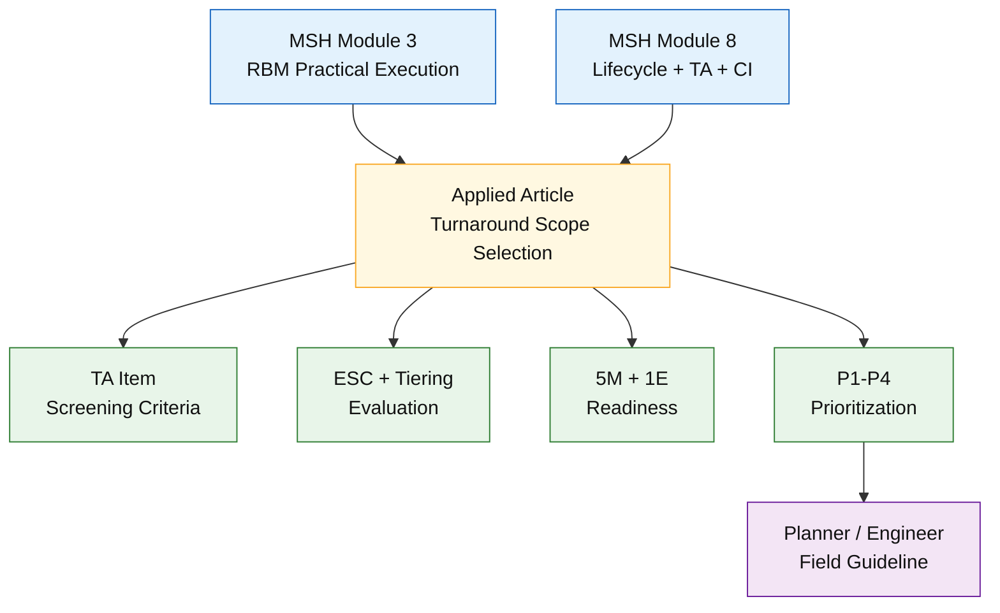
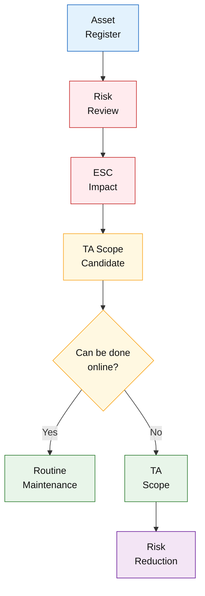
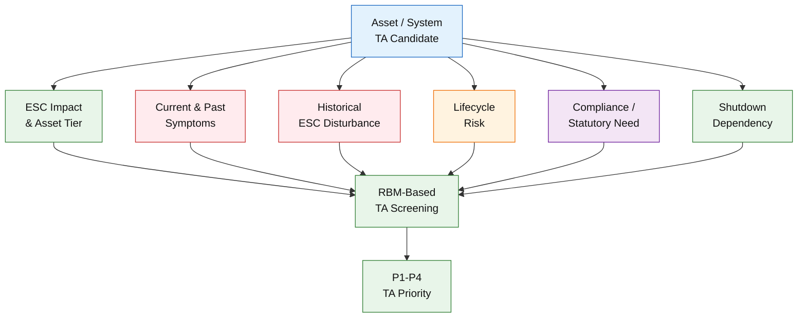
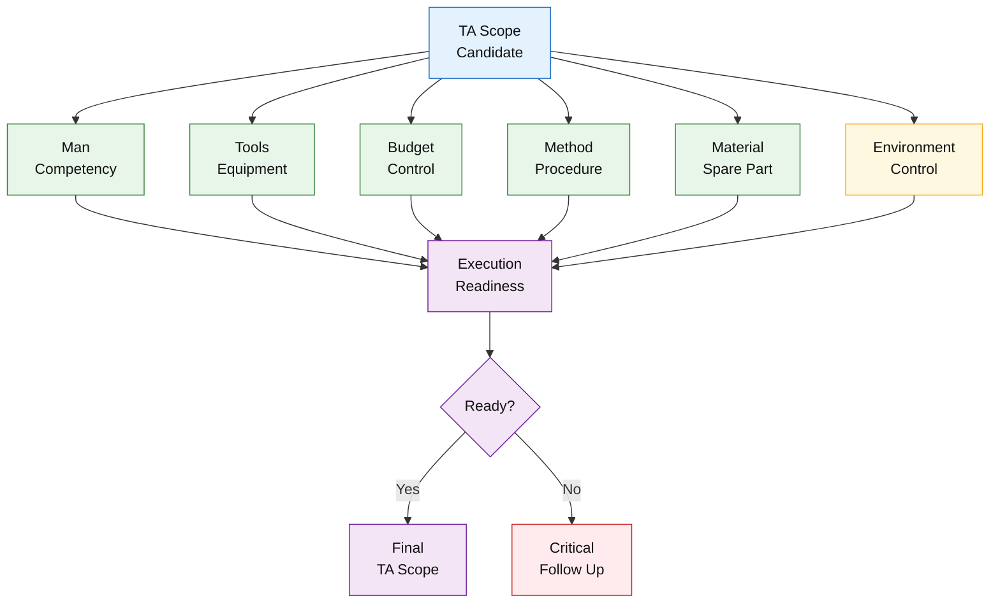

# **_Panduan Pemilihan Scope Turnaround Berbasis Risk-Based Maintenance_**

---

- [**_Panduan Pemilihan Scope Turnaround Berbasis Risk-Based Maintenance_**](#panduan-pemilihan-scope-turnaround-berbasis-risk-based-maintenance)
  - [📌 Prolog Modul](#-prolog-modul)
  - [📌 Latar Belakang](#-latar-belakang)
  - [1. TA-Turnaround sebagai Momentum Pengurangan Risiko](#1-ta-turnaround-sebagai-momentum-pengurangan-risiko)
  - [2. Kriteria Utama Item TA Berbasis RBM](#2-kriteria-utama-item-ta-berbasis-rbm)
    - [2.1 Dampak ESC Tinggi](#21-dampak-esc-tinggi)
    - [2.2 Berdasarkan Tier Aset](#22-berdasarkan-tier-aset)
    - [2.3 Gejala Aktual dan Historis yang Menunjukkan Gangguan Aset](#23-gejala-aktual-dan-historis-yang-menunjukkan-gangguan-aset)
    - [2.4 Histori Gangguan terhadap ESC](#24-histori-gangguan-terhadap-esc)
    - [2.5 Obsolete Asset atau Obsolete Part](#25-obsolete-asset-atau-obsolete-part)
    - [2.6 Expired Asset, Expired Part, atau Life-Limited Component](#26-expired-asset-expired-part-atau-life-limited-component)
    - [2.7 Integrity Threat dan Degradation Mechanism](#27-integrity-threat-dan-degradation-mechanism)
    - [2.8 Compliance, Statutory, dan Mandatory Inspection](#28-compliance-statutory-dan-mandatory-inspection)
    - [2.9 Efektivitas Strategi Maintenance Saat Ini](#29-efektivitas-strategi-maintenance-saat-ini)
    - [2.10 Membutuhkan Kondisi Shutdown](#210-membutuhkan-kondisi-shutdown)
  - [Bab 3 — Prioritas Scope TA](#bab-3--prioritas-scope-ta)
    - [P1 — Mandatory Risk Reduction](#p1--mandatory-risk-reduction)
    - [P2 — High Reliability Priority](#p2--high-reliability-priority)
    - [P3 — Opportunity Scope](#p3--opportunity-scope)
    - [P4 — Defer or Exclude](#p4--defer-or-exclude)
  - [4. Readiness 5M + 1E](#4-readiness-5m--1e)
  - [5. Screening Akhir Item TA](#5-screening-akhir-item-ta)
  - [🧠 Kesimpulan](#-kesimpulan)

---

## 📌 Prolog Modul

Artikel ini disusun sebagai **artikel aplikasi** dalam ekosistem _Maintenance System Handbook (MSH)_. Jika **Module 3** menempatkan **Risk-Based Maintenance (RBM)** sebagai kerangka seleksi strategi pemeliharaan yang operasional, dan **Module 8** menempatkan **Turnaround (TA)** sebagai bagian dari _asset lifecycle_, _risk reset_, dan _continuous improvement_, maka artikel ini berfungsi sebagai **jembatan praktis** yang menerjemahkan kedua modul tersebut ke dalam proses nyata pemilihan _scope Turnaround_.

Dengan demikian, artikel ini tidak dimaksudkan untuk menggantikan pembahasan konseptual pada modul utama, melainkan untuk menjawab pertanyaan praktis yang paling sering muncul di level planner, engineer muda, dan tim persiapan shutdown:

> **“Bagaimana memilih item Turnaround secara sistematis, berbasis risiko, dan tetap selaras dengan arsitektur MSH?”**

Melalui artikel ini, pembaca diarahkan untuk memahami bahwa pemilihan _scope Turnaround_ tidak boleh semata-mata berbasis daftar pekerjaan atau kebiasaan historis, tetapi harus diturunkan dari **RBM**, **ESC impact**, **tiering aset**, **kebutuhan shutdown**, serta **readiness 5M + 1E**. Dengan pendekatan ini, _Turnaround_ diposisikan sebagai **program pengurangan risiko yang terencana**, bukan sekadar kumpulan pekerjaan besar saat plant berhenti.

[**Kembali ke Atas**](#panduan-pemilihan-scope-turnaround-berbasis-risk-based-maintenance)

---

## 📌 Latar Belakang

Turnaround atau **TA** bukan sekadar momen berhentinya plant untuk melakukan pekerjaan sebanyak mungkin. Dalam pendekatan **Risk-Based Maintenance (RBM)**, TA harus dipandang sebagai **kesempatan terencana untuk menurunkan risiko operasi**.

Artinya, item yang masuk ke dalam **TA** tidak boleh hanya berdasarkan kebiasaan, permintaan departemen, atau karena “mumpung plant shutdown”. Setiap item harus memiliki alasan teknis yang jelas, terutama terkait dengan risiko terhadap **Environmental, Safety, dan Continuous Running** atau **ESC**.

Secara sederhana, keputusan berbasis risiko dapat digambarkan dengan hubungan berikut:

$$
R = \mathrm{PoF} \times \mathrm{CoF}
$$

di mana:

- $R$ adalah tingkat risiko,
- $\mathrm{PoF}$ adalah _Probability of Failure_,
- $\mathrm{CoF}$ adalah _Consequence of Failure_.

Dalam konteks praktis di plant, konsekuensi kegagalan dapat diterjemahkan menjadi:

$$
\mathrm{CoF}_{\mathrm{ESC}} = f(E, S, C)
$$

dengan:

- $E$ = dampak lingkungan,
- $S$ = dampak keselamatan,
- $C$ = dampak terhadap kontinuitas operasi.

[**Kembali ke Atas**](#panduan-pemilihan-scope-turnaround-berbasis-risk-based-maintenance)

---

## 1. TA-Turnaround sebagai Momentum Pengurangan Risiko

Dalam RBM, pertanyaan utama bukan lagi:

> “Pekerjaan apa saja yang ingin kita masukkan ke TA?”

Tetapi berubah menjadi:

> “Risiko apa yang harus kita turunkan melalui TA?”

Perubahan cara berpikir ini penting agar scope TA tidak membesar tanpa kendali. TA harus fokus pada item yang benar-benar membutuhkan kondisi shutdown, memiliki dampak besar terhadap keselamatan, lingkungan, keandalan, atau kontinuitas produksi.

📌 **Prinsip utama:**
Item TA harus memiliki hubungan langsung dengan penurunan risiko. Jika suatu pekerjaan tidak menurunkan risiko, tidak membutuhkan shutdown, dan dapat dilakukan online, maka item tersebut tidak layak menjadi prioritas TA.

[**Kembali ke Atas**](#panduan-pemilihan-scope-turnaround-berbasis-risk-based-maintenance)

---

## 2. Kriteria Utama Item TA Berbasis RBM

Dalam integrasi **Risk-Based Maintenance (RBM)**, item TA tidak cukup dipilih hanya berdasarkan criticality aset atau kebiasaan historis. Item TA harus dipilih berdasarkan **bukti risiko** yang menunjukkan bahwa suatu aset, sistem, atau komponen memiliki potensi kegagalan yang dapat memengaruhi **Environmental, Safety, dan Continuous Operation** atau **ESC**.

Dengan demikian, pemilihan item TA harus mempertimbangkan kombinasi antara:

$$
\mathrm{TA\ Candidate} =
f(
\mathrm{ESC},
\mathrm{Tier},
\mathrm{Condition},
\mathrm{History},
\mathrm{Lifecycle},
\mathrm{Compliance},
\mathrm{Shutdown\ Need}
)
$$

Artinya, suatu item dapat menjadi kandidat TA bukan hanya karena equipment tersebut critical, tetapi juga karena terdapat indikasi degradasi, histori gangguan, risiko obsolescence, expiry limit, keterbatasan spare part, kewajiban inspeksi, atau hanya dapat diperbaiki pada saat plant shutdown.

---

### 2.1 Dampak ESC Tinggi

Item masuk prioritas apabila kegagalannya dapat berdampak besar terhadap:

- **Environmental**: release bahan berbahaya, emisi abnormal, spill, pencemaran, atau pelanggaran izin lingkungan.
- **Safety**: fire, explosion, toxic exposure, loss of containment, personnel injury, atau major accident.
- **Continuous Operation**: plant trip, production loss, bottleneck proses, quality giveaway, atau extended downtime.

Contoh item:

- PSV, rupture disc, flare system, ESD valve, dan SIS loop.
- Pressure vessel, reactor, column, drum, dan piping critical.
- Main compressor, boiler, reformer, cooling system, dan main power supply.
- Critical analyzer, PLC, DCS, transformer, switchgear, dan UPS system.

---

### 2.2 Berdasarkan Tier Aset

Setiap item harus dikaitkan dengan **tiering aset** agar perhatian planner dan engineer fokus pada aset yang paling berpengaruh terhadap risiko sistem.

**Tier 1** harus selalu masuk proses review TA. Namun, bukan berarti semua aset Tier 1 wajib dibuka, dibongkar, atau dioverhaul. Keputusan tetap harus mempertimbangkan kondisi aktual, histori gangguan, hasil inspeksi, trend parameter, obsolescence, expiry, dan efektivitas strategi maintenance yang sedang berjalan.

Prinsipnya:

- **Tier 1**: mandatory risk review.
- **Tier 2**: selective TA review berdasarkan kondisi dan histori.
- **Tier 3**: opportunity scope apabila mendukung reliability, maintainability, atau cost avoidance.

---

### 2.3 Gejala Aktual dan Historis yang Menunjukkan Gangguan Aset

Item menjadi kandidat kuat TA apabila terdapat **gejala aset saat ini atau masa lalu** yang menunjukkan indikasi gangguan, degradasi, atau penurunan performance.

Contoh indikasi:

- vibration meningkat atau unstable,
- temperature bearing, winding, casing, atau lube oil meningkat,
- pressure drop meningkat,
- flow menurun,
- efficiency equipment menurun,
- abnormal noise,
- leakage berulang,
- high power consumption,
- hunting pada control valve,
- analyzer drift,
- nuisance trip,
- intermittent fault pada PLC, DCS, switchgear, atau protection relay.

Contoh aplikasi:

- centrifugal pump menunjukkan kenaikan vibration dan mechanical seal leakage berulang,
- reciprocating compressor mengalami penurunan capacity dan kenaikan discharge temperature,
- heat exchanger mengalami fouling berat sehingga duty menurun,
- motor critical menunjukkan penurunan insulation resistance,
- transformer menunjukkan abnormal dissolved gas analysis,
- control valve critical mengalami passing atau response lambat.

📌 **Prinsip utama:**
Gejala aktual dan historis harus diperlakukan sebagai **early warning signal**. Walaupun equipment belum gagal total, indikasi tersebut dapat menunjukkan peningkatan $\mathrm{PoF}$ yang perlu diturunkan melalui TA.

---

### 2.4 Histori Gangguan terhadap ESC

Item harus dipertimbangkan masuk TA apabila aset tersebut pernah menyebabkan, berkontribusi, atau hampir menyebabkan gangguan terhadap **Environmental, Safety, atau Continuous Operation**.

Contoh histori yang relevan:

- pernah menyebabkan plant trip,
- pernah menyebabkan production loss signifikan,
- pernah menyebabkan flaring abnormal,
- pernah menyebabkan spill atau release,
- pernah menyebabkan safety incident atau near miss,
- pernah menyebabkan equipment protection aktif,
- pernah menyebabkan unit derating,
- pernah menyebabkan off-spec product,
- pernah memerlukan temporary repair untuk menjaga plant tetap running.

Contoh:

- compressor utama pernah trip dan menyebabkan unit shutdown,
- control valve critical pernah stuck dan menyebabkan process upset,
- exchanger fouling pernah menurunkan plant load,
- analyzer critical pernah unavailable sehingga operator kehilangan validasi kualitas proses,
- piping leak pernah ditangani dengan temporary clamp,
- ESD valve pernah gagal stroke test dan berpotensi mengganggu safety function.

📌 **Catatan untuk planner:**
Histori gangguan ESC harus diberi bobot lebih tinggi daripada sekadar histori work order biasa. Gangguan yang pernah memengaruhi keselamatan, lingkungan, atau kontinuitas operasi adalah bukti kuat bahwa item tersebut memiliki konsekuensi tinggi.

---

### 2.5 Obsolete Asset atau Obsolete Part

Item perlu dipertimbangkan masuk TA apabila aset, sistem, atau spare part sudah memasuki kondisi **obsolete**, yaitu tidak lagi didukung oleh OEM, sulit diperoleh, atau memiliki keterbatasan teknis untuk dipertahankan.

Contoh kondisi obsolescence:

- OEM sudah menghentikan produksi spare part,
- spare part hanya tersedia melalui reverse engineering,
- firmware, software, atau hardware tidak lagi didukung,
- vendor support sudah tidak tersedia,
- equipment tidak kompatibel dengan sistem baru,
- lead time spare part sangat panjang,
- remaining stock hanya cukup untuk satu kali repair,
- tidak ada interchangeable part yang tervalidasi.

Contoh item:

- obsolete PLC module,
- obsolete DCS controller card,
- obsolete relay protection,
- obsolete analyzer board,
- obsolete seal cartridge,
- obsolete compressor valve assembly,
- obsolete motor protection relay,
- obsolete switchgear component.

📌 **Prinsip utama:**
Obsolescence meningkatkan risiko karena saat kegagalan terjadi, recovery time dapat menjadi sangat panjang. Dalam konteks TA, obsolete item dapat menjadi prioritas apabila kegagalannya berpotensi menyebabkan kehilangan fungsi ESC atau extended downtime.

---

### 2.6 Expired Asset, Expired Part, atau Life-Limited Component

Item juga perlu dipertimbangkan apabila terdapat aset atau komponen yang memiliki batas umur, masa berlaku, sertifikasi, atau shelf life yang sudah habis atau mendekati habis.

Contoh kondisi expiry:

- calibration validity sudah habis,
- certification expiry,
- pressure test validity habis,
- hose, gasket, seal, chemical, battery, atau cartridge melewati shelf life,
- safety-critical device melewati interval proof test,
- lifting gear, relief device, atau protective device melewati due date inspeksi,
- insulation, coating, refractory, catalyst, atau lining melewati design life,
- UPS battery atau emergency battery melewati recommended replacement interval.

Contoh item:

- PSV overdue untuk testing,
- SIS proof test overdue,
- gas detector calibration overdue,
- fire and gas device melewati interval validasi,
- UPS battery bank mendekati end of life,
- rubber expansion joint melewati service life,
- flexible hose pada chemical atau hydrocarbon service melewati expiry date.

📌 **Prinsip utama:**
Expired item tidak selalu berarti sudah gagal, tetapi dapat berarti **barrier reliability** sudah tidak dapat dijamin. Untuk safety-critical dan environmental-critical item, kondisi expiry harus dikaitkan langsung dengan risiko ESC.

---

### 2.7 Integrity Threat dan Degradation Mechanism

Item masuk kandidat TA apabila terdapat ancaman integrity yang hanya dapat dikonfirmasi atau diperbaiki saat shutdown.

Contoh degradation mechanism:

- corrosion,
- erosion,
- cracking,
- creep,
- fatigue,
- fouling,
- scaling,
- refractory damage,
- coating failure,
- insulation degradation,
- under deposit corrosion,
- corrosion under insulation,
- vibration-induced fatigue.

Contoh aplikasi:

- pressure vessel membutuhkan internal inspection,
- piping critical memiliki thinning mendekati minimum allowable thickness,
- exchanger mengalami fouling dan tube leakage,
- furnace tube menunjukkan indikasi creep,
- tank bottom memiliki indikasi corrosion,
- buried piping memiliki indikasi external corrosion.

Item seperti ini perlu dikaitkan dengan risk assessment karena konsekuensi kegagalannya dapat berupa loss of containment, fire, toxic release, atau unplanned shutdown.

---

### 2.8 Compliance, Statutory, dan Mandatory Inspection

Beberapa item TA tidak hanya didasarkan pada risiko teknis, tetapi juga pada kewajiban regulatory, statutory, insurance, atau corporate standard.

Contoh:

- internal inspection pressure vessel,
- boiler inspection,
- PSV testing,
- lifting equipment certification,
- fire protection system testing,
- electrical protection relay testing,
- hazardous area equipment inspection,
- SIS proof testing,
- tank inspection,
- pressure piping inspection.

📌 **Prinsip utama:**
Item compliance yang terkait langsung dengan legal requirement, operating permit, atau safety barrier harus diperlakukan sebagai kandidat kuat TA, terutama apabila hanya dapat dilakukan pada saat shutdown.

---

### 2.9 Efektivitas Strategi Maintenance Saat Ini

Item perlu direview apabila strategi maintenance yang berjalan terbukti tidak lagi efektif mengendalikan risiko.

Indikasinya antara lain:

- preventive maintenance sering overdue,
- predictive maintenance menemukan trend abnormal berulang,
- corrective maintenance meningkat,
- rework tinggi,
- temporary repair berulang,
- inspeksi online tidak cukup untuk memastikan kondisi internal,
- spare part strategy tidak sesuai dengan criticality,
- bad actor tetap berulang walaupun sudah dilakukan routine maintenance.

Contoh:

- pump critical tetap mengalami seal failure walaupun PM sudah dilakukan,
- analyzer tetap sering unavailable walaupun preventive cleaning dilakukan,
- motor critical menunjukkan deterioration walaupun testing periodik berjalan,
- compressor valve sering gagal sebelum expected life.

📌 **Catatan:**
Jika strategi maintenance saat running tidak cukup menurunkan risiko, TA dapat digunakan sebagai momentum untuk melakukan corrective action yang lebih permanen.

---

### 2.10 Membutuhkan Kondisi Shutdown

Item layak masuk TA apabila pekerjaan membutuhkan kondisi khusus yang tidak dapat dilakukan saat plant running, seperti:

- depressurizing,
- draining,
- decontamination,
- gas freeing,
- blinding,
- confined space entry,
- internal inspection,
- major lifting,
- tie-in ke sistem proses aktif,
- hot work pada hydrocarbon atau toxic service,
- isolation total dari sistem energi,
- opening equipment yang berisi hazardous material.

Jika pekerjaan dapat dilakukan online secara aman, item tersebut harus dipertimbangkan untuk routine maintenance, kecuali terdapat alasan kuat seperti integrasi dengan pekerjaan TA lain, kebutuhan akses khusus, atau efisiensi risiko secara keseluruhan.

[**Kembali ke Atas**](#panduan-pemilihan-scope-turnaround-berbasis-risk-based-maintenance)

---

## Bab 3 — Prioritas Scope TA

Agar tidak bias, prioritas scope TA sebaiknya tidak hanya ditentukan oleh criticality aset atau ESC impact, tetapi oleh kombinasi:

$$
\mathrm{RBM\ TA\ Priority} =
f(
\mathrm{CoF}*{\mathrm{ESC}},
\mathrm{PoF}*{\mathrm{Actual}},
\mathrm{Lifecycle\ Risk},
\mathrm{Shutdown\ Dependency},
\mathrm{Readiness}
)
$$

Dengan pendekatan ini, item yang belum pernah gagal tetapi sudah obsolete, expired, overdue statutory inspection, atau menunjukkan gejala degradasi serius tetap dapat masuk prioritas tinggi.

---

### P1 — Mandatory Risk Reduction

Item wajib masuk TA apabila memenuhi salah satu kondisi berikut:

- memiliki risiko tinggi terhadap ESC,
- pernah menyebabkan atau hampir menyebabkan gangguan ESC,
- terkait statutory, regulatory, insurance, atau mandatory inspection,
- memiliki integrity threat yang berpotensi menyebabkan loss of containment,
- merupakan safety-critical atau environmental-critical barrier yang overdue,
- memiliki expired certification, expired proof test, atau expired inspection validity,
- obsolete tanpa mitigation yang memadai dan berdampak pada fungsi critical,
- defect-nya hanya dapat diperbaiki saat shutdown,
- jika ditunda dapat menyebabkan plant trip, major incident, atau extended outage.

Contoh:

- internal inspection pressure vessel critical,
- repair piping critical dengan thinning berat,
- PSV testing yang overdue,
- SIS proof test overdue,
- ESD valve gagal partial stroke atau full stroke test,
- obsolete PLC card untuk emergency shutdown function,
- compressor utama dengan defect yang dapat menyebabkan forced outage,
- boiler atau reformer inspection yang wajib secara statutory.

---

### P2 — High Reliability Priority

Item masuk prioritas tinggi apabila tidak langsung mandatory, tetapi memiliki bukti kuat peningkatan risiko operasi.

Kriteria P2:

- bad actor dengan failure berulang,
- trend degradasi meningkat,
- performance equipment menurun,
- equipment critical menunjukkan abnormal condition,
- obsolete part masih memiliki mitigation sementara tetapi berisiko tinggi,
- life-limited component mendekati end of life,
- temporary repair perlu dibuat permanen,
- item berpotensi menyebabkan production loss atau derating,
- strategi maintenance online tidak lagi efektif.

Contoh:

- pump critical dengan mechanical seal failure berulang,
- exchanger fouling berat yang menurunkan throughput,
- motor critical dengan insulation deterioration,
- control valve critical yang menyebabkan unstable control,
- analyzer critical yang sering unavailable,
- UPS battery critical mendekati end of life,
- compressor valve dengan umur aktual jauh lebih pendek dari expected life.

---

### P3 — Opportunity Scope

Item dapat dikerjakan apabila memberikan manfaat reliability, maintainability, atau safety improvement, tetapi tidak menjadi mandatory risk reduction.

Kriteria P3:

- tidak berada pada critical path,
- manpower dan material tersedia,
- risiko eksekusi rendah,
- dapat meningkatkan akses inspeksi atau maintainability,
- dapat mengurangi minor recurring issue,
- dapat digabungkan dengan pekerjaan utama TA,
- tidak mengganggu penyelesaian P1 dan P2.

Contoh:

- penambahan platform akses,
- relokasi local gauge,
- penambahan drain atau vent,
- minor piping support improvement,
- painting lokal pada area non-critical,
- improvement tagging,
- minor modification untuk kemudahan maintenance.

---

### P4 — Defer or Exclude

Item tidak direkomendasikan masuk TA apabila:

- dapat dilakukan online secara aman,
- tidak memiliki risk reduction yang jelas,
- tidak memiliki bukti kondisi, histori, atau dasar engineering yang kuat,
- tidak terkait ESC, reliability, statutory, atau lifecycle risk,
- scope belum matang,
- engineering belum selesai,
- material belum tersedia,
- hanya bersifat cosmetic atau housekeeping,
- readiness rendah dan risikonya masih dapat dikendalikan sampai TA berikutnya.

Namun, apabila item memiliki risiko tinggi tetapi readiness rendah, item tersebut **tidak boleh langsung menjadi P4**. Status yang lebih tepat adalah:

> **Critical Pending Readiness**

Artinya, item tetap dikawal sebagai risiko penting, tetapi memerlukan percepatan engineering, procurement, material readiness, atau vendor readiness sebelum final scope freeze.

[**Kembali ke Atas**](#panduan-pemilihan-scope-turnaround-berbasis-risk-based-maintenance)

---

## 4. Readiness 5M + 1E

Dalam RBM, item dengan risiko tinggi belum tentu siap dieksekusi. Karena itu, setiap item TA harus dicek menggunakan pendekatan:

$$
\mathrm{Readiness} = f(\mathrm{Man}, \mathrm{Machine}, \mathrm{Money}, \mathrm{Method}, \mathrm{Material}, \mathrm{Environment})
$$

Pendekatan ini sering disebut sebagai:

$$
\mathrm{5M} + \mathrm{1E}
$$

Penjelasan singkat:

- **Man**: PIC jelas, jumlah manpower cukup, kompetensi sesuai, dan vendor specialist sudah teridentifikasi.
- **Machine**: crane, bundle puller, hydrojetting unit, NDT tools, test equipment, dan special tools tersedia.
- **Money**: budget mencakup jasa, material, rental equipment, scaffolding, insulation, testing, dan contingency.
- **Method**: method statement, JSA, ITP, isolation plan, lifting plan, dan commissioning procedure tersedia.
- **Material**: spare part, gasket, stud bolt, bearing, seal, cable, instrument, dan consumable sudah jelas.
- **Environment**: waste handling, decontamination, spill prevention, emission control, dan environmental permit sudah dipersiapkan.

📌 **Prinsip penting:**
Item risiko tinggi dengan readiness rendah tidak boleh hilang dari daftar. Item tersebut harus diberi status **critical pending readiness** dan dikawal sampai siap dieksekusi.

[**Kembali ke Atas**](#panduan-pemilihan-scope-turnaround-berbasis-risk-based-maintenance)

---

## 5. Screening Akhir Item TA

Sebelum item disetujui sebagai final scope TA, planner dan engineer perlu melakukan screening sederhana berikut.

| No  | Pertanyaan Screening                                                                                               |
| --- | ------------------------------------------------------------------------------------------------------------------ |
| 1   | Apa equipment tag atau system yang terdampak?                                                                      |
| 2   | Apa dampaknya terhadap ESC?                                                                                        |
| 3   | Apakah aset masuk Tier 1, Tier 2, atau Tier 3?                                                                     |
| 4   | Apa failure mode atau degradation mechanism yang terjadi?                                                          |
| 5   | Apa risiko jika tidak dikerjakan di TA?                                                                            |
| 6   | Apakah pekerjaan dapat dilakukan online?                                                                           |
| 7   | Apakah ada histori failure, rework, temporary repair, atau abnormal trend?                                         |
| 8   | Apakah pekerjaan ini menurunkan risiko secara nyata?                                                               |
| 9   | Apa strategi setelah TA: TBM, CBM, PdM, atau CM?                                                                   |
| 10  | Apakah readiness 5M + 1E sudah cukup?                                                                              |
| 11  | Apakah acceptance criteria dan ITP sudah jelas?                                                                    |
| 12  | Apakah item masuk P1, P2, P3, atau P4?                                                                             |
| 13  | Apakah terdapat gejala aktual atau historis yang menunjukkan penurunan performance aset?                           |
| 14  | Apakah aset pernah menyebabkan atau hampir menyebabkan gangguan ESC?                                               |
| 15  | Apakah terdapat obsolete asset, obsolete part, atau discontinued OEM support?                                      |
| 16  | Apakah terdapat expired part, expired certification, expired inspection validity, atau overdue proof test?         |
| 17  | Apakah terdapat life-limited component yang mendekati end of life?                                                 |
| 18  | Apakah strategi maintenance saat ini masih efektif mengendalikan risiko?                                           |
| 19  | Apakah terdapat temporary repair yang harus dibuat permanen saat TA?                                               |
| 20  | Apakah terdapat risiko supply chain atau long lead item yang dapat memperpanjang downtime jika gagal saat operasi? |

Screening ini membantu memastikan bahwa setiap item TA memiliki dasar teknis, dasar risiko, dan kesiapan eksekusi yang dapat dipertanggungjawabkan.

[**Kembali ke Atas**](#panduan-pemilihan-scope-turnaround-berbasis-risk-based-maintenance)

---

## 🧠 Kesimpulan

Integrasi RBM ke dalam TA mengubah cara pemilihan scope dari pendekatan berbasis daftar pekerjaan menjadi pendekatan berbasis risiko.

Dengan pendekatan ini, TA harus fokus pada item yang:

- berdampak tinggi terhadap ESC,
- berada pada aset Tier 1 atau Tier 2,
- memiliki histori failure, rework, atau trend abnormal,
- membutuhkan kondisi shutdown,
- berkontribusi terhadap penurunan risiko,
- dan memiliki readiness 5M + 1E yang cukup.

Rumusan sederhana untuk pemilihan item TA adalah:

$$
\mathrm{TA\ Scope} = f(\mathrm{Risk}, \mathrm{Tier}, \mathrm{History}, \mathrm{Shutdown\ Need}, \mathrm{Readiness})
$$

Dengan cara ini, TA tidak hanya menjadi agenda shutdown maintenance, tetapi menjadi **program pengurangan risiko yang terencana, terukur, dan dapat diaudit**.

[**Kembali ke Atas**](#panduan-pemilihan-scope-turnaround-berbasis-risk-based-maintenance)

---

<ResourceBox
  title="Korelasi internal-link modul:"
  items={[
    {
      name: 'Risk-Based Maintenance',
      href: '/blog/management/MSH/MSH-3-rbm',
      description:
        'Module 3 – Risk-Based Maintenance sebagai Strategi Pemeliharaan Praktis',
    },
    {
      name: 'Lifecycle Aset dan Turnaround',
      href: '/blog/management/MSH/MSH-8-lifecycle-ta',
      description:
        'Hubungan lifecycle aset, turnaround, dan continuous improvement sistem pemeliharaan',
    },
    {
      name: 'Penerapan Tier dalam RBM',
      href: '/blog/maintenance/maintenance-tier',
      description:
        'Penerapan tiering aset dalam Risk-Based Maintenance untuk industri petrokimia',
    },
  ]}
/>

---

<small>
  **_Catatan Penyusunan_** Artikel ini disusun sebagai materi edukasi dan
  referensi umum berdasarkan berbagai sumber pustaka, praktik lapangan, serta
  bantuan alat penulisan. Pembaca disarankan untuk melakukan verifikasi lanjutan
  dan penyesuaian sesuai dengan kondisi serta kebutuhan masing-masing sistem.
</small>
