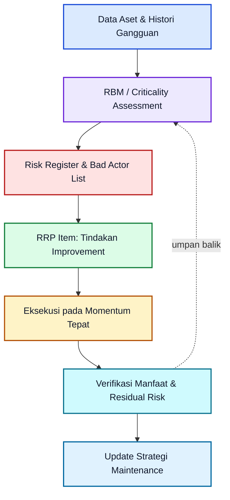
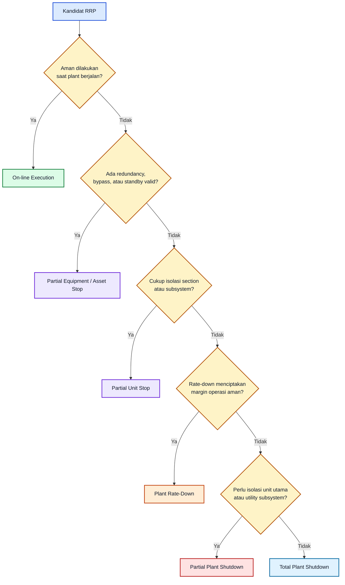
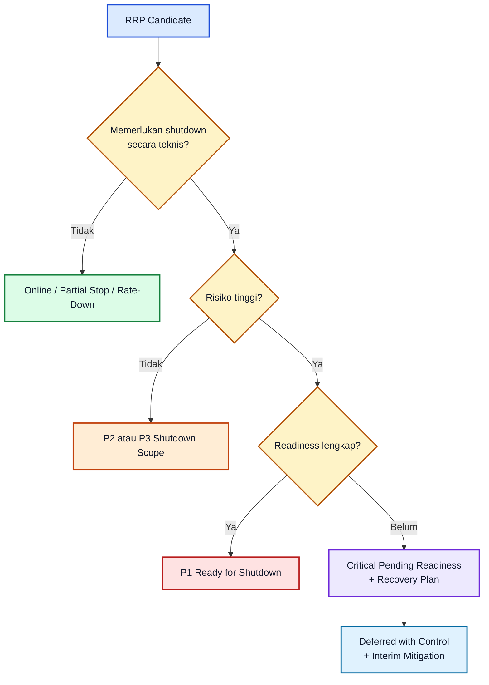
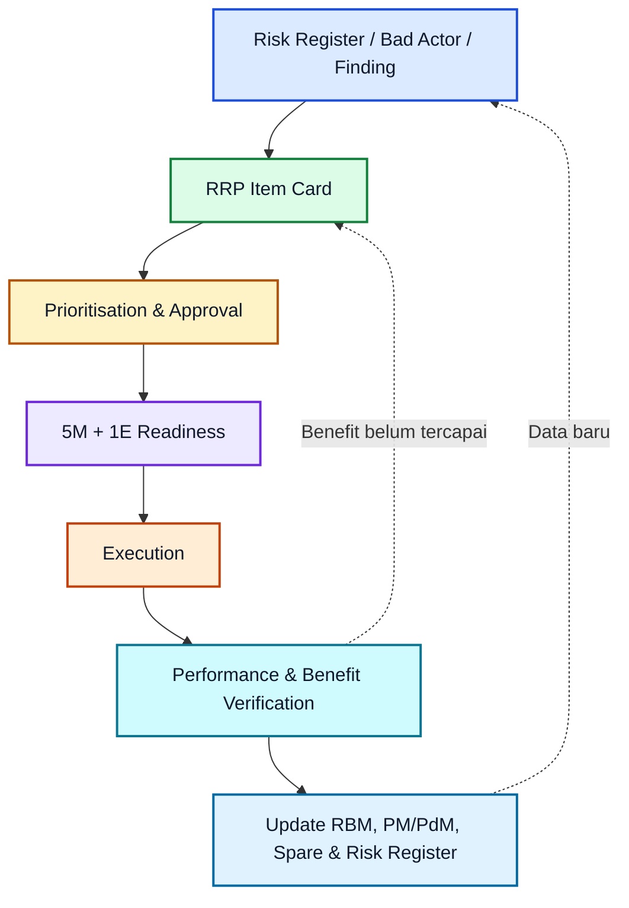

# **_Risk Reduction Program (RRP): Mengubah Risiko menjadi Reliability Improvement yang Terukur_**

---

- [**_Risk Reduction Program (RRP): Mengubah Risiko menjadi Reliability Improvement yang Terukur_**](#risk-reduction-program-rrp-mengubah-risiko-menjadi-reliability-improvement-yang-terukur)
- [Risk Reduction Program (RRP): Mengubah Risiko menjadi Reliability Improvement yang Terukur](#risk-reduction-program-rrp-mengubah-risiko-menjadi-reliability-improvement-yang-terukur-1)
  - [1. Pendahuluan: Risiko Tidak Berhenti di Risk Register](#1-pendahuluan-risiko-tidak-berhenti-di-risk-register)
    - [1.1 Mengapa Risk Register Saja Tidak Cukup](#11-mengapa-risk-register-saja-tidak-cukup)
    - [1.2 RRP Bukan Daftar Penggantian Equipment](#12-rrp-bukan-daftar-penggantian-equipment)
    - [1.3 RRP sebagai Jembatan dari Analisis ke Eksekusi](#13-rrp-sebagai-jembatan-dari-analisis-ke-eksekusi)
    - [1.4 Istilah yang Sering Tercampur](#14-istilah-yang-sering-tercampur)
    - [1.5 Contoh Lintas Unit](#15-contoh-lintas-unit)
  - [2. Posisi RRP dalam Sistem Manajemen Maintenance dan Reliability](#2-posisi-rrp-dalam-sistem-manajemen-maintenance-dan-reliability)
    - [2.1 Hubungan RRP dengan Risk-Based Thinking](#21-hubungan-rrp-dengan-risk-based-thinking)
    - [2.2 Hubungan RRP dengan RBM](#22-hubungan-rrp-dengan-rbm)
    - [2.3 RRP sebagai Execution Arm dari RBM](#23-rrp-sebagai-execution-arm-dari-rbm)
    - [2.4 Batas antara RRP dan Scope Shutdown](#24-batas-antara-rrp-dan-scope-shutdown)
    - [2.5 Evaluation Loop: RRP sebagai Sistem Belajar](#25-evaluation-loop-rrp-sebagai-sistem-belajar)
  - [3. Definisi dan Tujuan Risk Reduction Program](#3-definisi-dan-tujuan-risk-reduction-program)
    - [3.1 Definisi RRP](#31-definisi-rrp)
    - [3.2 Tujuan RRP](#32-tujuan-rrp)
      - [1. Menurunkan Risiko terhadap Environment, Safety, dan Continuous Running](#1-menurunkan-risiko-terhadap-environment-safety-dan-continuous-running)
      - [2. Mengurangi Forced Outage, Derating, Recurring Failure, dan Emergency Maintenance](#2-mengurangi-forced-outage-derating-recurring-failure-dan-emergency-maintenance)
      - [3. Meningkatkan Availability, Reliability, Maintainability, dan Kapasitas](#3-meningkatkan-availability-reliability-maintainability-dan-kapasitas)
      - [4. Mengubah Temuan Risiko menjadi Portofolio Tindakan](#4-mengubah-temuan-risiko-menjadi-portofolio-tindakan)
      - [5. Menentukan Momentum Eksekusi yang Tepat](#5-menentukan-momentum-eksekusi-yang-tepat)
      - [6. Memastikan Manfaat Dapat Diverifikasi](#6-memastikan-manfaat-dapat-diverifikasi)
    - [3.3 Prinsip Dasar RRP](#33-prinsip-dasar-rrp)
      - [Berbasis Data dan Bukti Teknis](#berbasis-data-dan-bukti-teknis)
      - [Berbasis Risiko, Bukan Semata Daftar Pekerjaan](#berbasis-risiko-bukan-semata-daftar-pekerjaan)
      - [Memprioritaskan Risk Reduction dan Residual Risk](#memprioritaskan-risk-reduction-dan-residual-risk)
      - [Tidak Menunggu Major Failure](#tidak-menunggu-major-failure)
      - [Tidak Semua Tindakan Harus Menunggu Turnaround](#tidak-semua-tindakan-harus-menunggu-turnaround)
      - [Memiliki Owner, Target, Budget, dan Acceptance Criteria](#memiliki-owner-target-budget-dan-acceptance-criteria)
      - [Ditutup dengan Benefit Realization dan Update Strategy](#ditutup-dengan-benefit-realization-dan-update-strategy)
  - [4. Scope Plant-Wide RRP](#4-scope-plant-wide-rrp)
    - [4.1 Syngas Unit](#41-syngas-unit)
      - [Karakter Risiko Utama](#karakter-risiko-utama)
      - [Apa yang Harus Dilakukan Engineer](#apa-yang-harus-dilakukan-engineer)
    - [4.2 Octanol Unit](#42-octanol-unit)
      - [Karakter Risiko Utama](#karakter-risiko-utama-1)
      - [Apa yang Harus Dilakukan Engineer](#apa-yang-harus-dilakukan-engineer-1)
    - [4.3 CO₂ Plant](#43-co-plant)
      - [Karakter Risiko Utama](#karakter-risiko-utama-2)
      - [Apa yang Harus Dilakukan Engineer](#apa-yang-harus-dilakukan-engineer-2)
    - [4.4 Utility Unit](#44-utility-unit)
      - [Karakter Risiko Utama](#karakter-risiko-utama-3)
      - [Utility sebagai Common-Cause Risk](#utility-sebagai-common-cause-risk)
    - [4.5 Mengelola Batas Antar-Unit](#45-mengelola-batas-antar-unit)
  - [5. Sumber Kandidat RRP](#5-sumber-kandidat-rrp)
    - [5.1 Dari Mana Kandidat RRP Berasal](#51-dari-mana-kandidat-rrp-berasal)
    - [5.1.1 RBM dan Criticality Assessment](#511-rbm-dan-criticality-assessment)
    - [5.1.2 Forced Outage, Derating, dan Loss Production](#512-forced-outage-derating-dan-loss-production)
    - [5.1.3 Bad Actor Bukan Selalu Risk Item Terbesar](#513-bad-actor-bukan-selalu-risk-item-terbesar)
    - [5.1.4 Temporary Repair sebagai Sinyal Risiko](#514-temporary-repair-sebagai-sinyal-risiko)
    - [5.2 Kriteria Kandidat Menjadi RRP Item](#52-kriteria-kandidat-menjadi-rrp-item)
    - [5.2.1 Uji Sederhana Sebelum Membuat RRP Item](#521-uji-sederhana-sebelum-membuat-rrp-item)
    - [5.2.2 Contoh Penilaian Kandidat](#522-contoh-penilaian-kandidat)
    - [5.2.3 Batas antara RRP Item dan Routine Work](#523-batas-antara-rrp-item-dan-routine-work)
  - [6. Klasifikasi Tindakan dalam RRP](#6-klasifikasi-tindakan-dalam-rrp)
    - [6.1 Operating Improvement](#61-operating-improvement)
    - [6.2 Maintenance Strategy Improvement](#62-maintenance-strategy-improvement)
    - [6.3 Reliability Improvement](#63-reliability-improvement)
    - [6.4 Integrity Improvement](#64-integrity-improvement)
    - [6.5 Capacity Debottlenecking](#65-capacity-debottlenecking)
    - [6.6 Automation and Control Improvement](#66-automation-and-control-improvement)
    - [6.7 Critical Spare Improvement](#67-critical-spare-improvement)
    - [6.8 Shutdown Scope Improvement](#68-shutdown-scope-improvement)
  - [7. Prioritisasi RRP](#7-prioritisasi-rrp)
    - [7.1 Prinsip Prioritas](#71-prinsip-prioritas)
    - [7.2 Klasifikasi Prioritas](#72-klasifikasi-prioritas)
    - [7.2.1 P1 — Mandatory](#721-p1--mandatory)
    - [7.2.2 P2 — High Priority](#722-p2--high-priority)
    - [7.2.3 P3 — Improvement Opportunity](#723-p3--improvement-opportunity)
    - [7.2.4 P4 — Defer / Exclude](#724-p4--defer--exclude)
    - [7.3 Konsep Pengurangan Risiko](#73-konsep-pengurangan-risiko)
      - [1. Menurunkan Kemungkinan Kegagalan](#1-menurunkan-kemungkinan-kegagalan)
      - [2. Menurunkan Dampak Kegagalan](#2-menurunkan-dampak-kegagalan)
      - [3. Memperkuat Reliability Barrier](#3-memperkuat-reliability-barrier)
    - [7.3.1 Contoh Pemetaan Prioritas](#731-contoh-pemetaan-prioritas)
  - [8. Momentum Eksekusi RRP](#8-momentum-eksekusi-rrp)
    - [8.1 Prinsip Pemilihan Momentum Eksekusi](#81-prinsip-pemilihan-momentum-eksekusi)
    - [8.2 Klasifikasi Momentum Eksekusi](#82-klasifikasi-momentum-eksekusi)
    - [8.2.1 On-line / Sambil Plant Jalan](#821-on-line--sambil-plant-jalan)
    - [8.2.2 Partial Equipment / Asset Stop](#822-partial-equipment--asset-stop)
    - [8.2.3 Partial Unit Stop](#823-partial-unit-stop)
    - [8.2.4 Plant Rate-Down](#824-plant-rate-down)
    - [8.2.5 Partial Plant Shutdown](#825-partial-plant-shutdown)
    - [8.2.6 Total Plant Shutdown](#826-total-plant-shutdown)
    - [8.3 Decision Logic Pemilihan Momentum](#83-decision-logic-pemilihan-momentum)
    - [8.4 Risiko Penundaan](#84-risiko-penundaan)
    - [8.4.1 Critical Pending Readiness](#841-critical-pending-readiness)
  - [9. Integrasi RRP dengan Shutdown dan Turnaround](#9-integrasi-rrp-dengan-shutdown-dan-turnaround)
    - [9.1 Shutdown sebagai Momentum Eksekusi, Bukan Satu-Satunya Solusi](#91-shutdown-sebagai-momentum-eksekusi-bukan-satu-satunya-solusi)
    - [9.2 Kriteria Item yang Memerlukan Shutdown](#92-kriteria-item-yang-memerlukan-shutdown)
    - [9.2.1 Contoh Penilaian Kebutuhan Shutdown](#921-contoh-penilaian-kebutuhan-shutdown)
    - [9.3 Kategori RRP Scope untuk Shutdown](#93-kategori-rrp-scope-untuk-shutdown)
    - [9.3.1 P1 Ready for Shutdown](#931-p1-ready-for-shutdown)
    - [9.3.2 P1 Critical Pending Readiness](#932-p1-critical-pending-readiness)
    - [9.3.3 P2 Ready for Shutdown dan P3 Opportunity Scope](#933-p2-ready-for-shutdown-dan-p3-opportunity-scope)
    - [9.3.4 Online Before Shutdown](#934-online-before-shutdown)
    - [9.3.5 Deferred with Control](#935-deferred-with-control)
  - [10. Governance dan Readiness RRP](#10-governance-dan-readiness-rrp)
    - [10.1 RRP Item Card](#101-rrp-item-card)
    - [10.1.1 Menulis Problem Statement yang Baik](#1011-menulis-problem-statement-yang-baik)
    - [10.1.2 Minimum Evidence untuk RRP Item](#1012-minimum-evidence-untuk-rrp-item)
    - [10.1.3 Status Minimum RRP Item](#1013-status-minimum-rrp-item)
    - [10.2 Readiness 5M + 1E](#102-readiness-5m--1e)
    - [10.2.1 Readiness Hijau, Kuning, dan Merah](#1021-readiness-hijau-kuning-dan-merah)
    - [10.2.2 Readiness Bukan Alasan Menghapus Risiko](#1022-readiness-bukan-alasan-menghapus-risiko)
    - [10.3 Peran dan Akuntabilitas](#103-peran-dan-akuntabilitas)
    - [10.3.1 Prinsip Akuntabilitas](#1031-prinsip-akuntabilitas)
  - [11. Benefit Realization dan Pengukuran Keberhasilan](#11-benefit-realization-dan-pengukuran-keberhasilan)
    - [11.1 Leading Indicators](#111-leading-indicators)
    - [11.2 Lagging Indicators](#112-lagging-indicators)
    - [11.2.1 Formula Dasar dalam MDX](#1121-formula-dasar-dalam-mdx)
    - [11.2.2 Hindari KPI yang Menyesatkan](#1122-hindari-kpi-yang-menyesatkan)
    - [11.3 Verifikasi Manfaat](#113-verifikasi-manfaat)
      - [11.3.1 Baseline Sebelum Implementasi](#1131-baseline-sebelum-implementasi)
      - [11.3.2 Periode Observasi Setelah Implementasi](#1132-periode-observasi-setelah-implementasi)
      - [11.3.3 Metode Verifikasi](#1133-metode-verifikasi)
    - [11.3.4 Update ke RBM dan Maintenance Strategy](#1134-update-ke-rbm-dan-maintenance-strategy)
  - [12. Penutup: Dari Risiko ke Improvement yang Terukur](#12-penutup-dari-risiko-ke-improvement-yang-terukur)

---

# Risk Reduction Program (RRP): Mengubah Risiko menjadi Reliability Improvement yang Terukur

## 1. Pendahuluan: Risiko Tidak Berhenti di Risk Register

Di banyak pabrik proses, organisasi sebenarnya sudah memiliki cukup banyak informasi risiko: _risk register_, _criticality assessment_, histori gangguan, hasil _Root Cause Analysis_ (RCA), temuan inspeksi, data _condition monitoring_, daftar _bad actor_, serta catatan _derating_ dan _forced outage_. Tantangannya bukan selalu kekurangan data. Tantangan yang lebih besar adalah memastikan data tersebut menghasilkan tindakan teknis yang benar-benar menurunkan risiko.

Sebuah _risk register_ yang hanya disimpan sebagai dokumen belum mengubah kondisi aset. Nilai risiko tidak turun hanya karena aset telah diberi kategori kritis, diberi skor, atau dibahas dalam rapat. Risiko baru mulai turun ketika organisasi memilih tindakan yang tepat, menyiapkan sumber daya, mengeksekusinya pada momentum yang sesuai, dan membuktikan bahwa tindakan tersebut benar-benar memperbaiki kondisi operasi.

Di sinilah **Risk Reduction Program (RRP)** dibutuhkan.

<figure>
  
  <figcaption>
    Ilustrasi konsep RRP PON sebagai gambaran alur proses, komponen utama, dan
    hubungan antarbagian dalam sistem.
  </figcaption>
</figure>

> **Risk Reduction Program adalah mekanisme eksekusi untuk memastikan risiko aset dan operasi diterjemahkan menjadi tindakan perbaikan yang nyata, terukur, memiliki prioritas, owner, target waktu, dan manfaat yang dapat diverifikasi.**

RRP bukan pengganti _Risk-Based Maintenance_ (RBM). RBM tetap berfungsi sebagai kerangka untuk menentukan aset mana yang kritis, risiko mana yang dominan, dan strategi pemeliharaan apa yang proporsional. RRP melanjutkan proses tersebut dengan menjawab pertanyaan yang lebih operasional:

> “Setelah risiko dikenali, tindakan apa yang harus dilakukan, siapa yang bertanggung jawab, kapan tindakan dilakukan, dan bagaimana hasilnya dibuktikan?”

Artikel RBM PT PON telah menempatkan RBM sebagai kerangka seleksi strategi pemeliharaan—bukan pengganti TBM, CBM, PdM, atau corrective maintenance. RRP memperluas logika tersebut menjadi disiplin eksekusi improvement berbasis risiko. ([Mx Core Docs][1])

<ResourceBox
  title="Korelasi internal-link modul:"
  items={[
    {
      name: 'Scope Turnaround Berbasis Risk-Based Maintenance',
      href: '/blog/management/MSH/MSH-panduan-scope-ta',
      description:
        'Panduan Pemilihan Scope Turnaround Berbasis Risk-Based Maintenance',
    },
    {
      name: 'Maintenance System Handbook (MSH)',
      href: '/blog/management/MSH/MSH-panduan-lengkap',
      description:
        'Dari Risk-Based Thinking ke Reliability-Driven Organization - Panduan Lengkap Maintenance System Handbook',
    },
    {
      name: 'Model Risiko dan Logika Pengambilan Keputusan',
      href: '/blog/management/MSH/MSH-2-model-risiko',
      description:
        'Module 2 – Model Risiko dan Logika Pengambilan Keputusan Pemeliharaan',
    },
    {
      name: 'Risk-Based Maintenance',
      href: '/blog/management/MSH/MSH-3-rbm',
      description:
        'Module 3 – Risk-Based Maintenance sebagai Strategi Pemeliharaan Praktis',
    },
    {
      name: 'Organisasi, KPI, dan Akuntabilitas',
      href: '/blog/management/MSH/MSH-5-organization',
      description:
        'Module 4 – Organisasi, KPI, dan Akuntabilitas dalam Sistem Pemeliharaan',
    },
    {
      name: 'Lifecycle Aset',
      href: '/blog/management/MSH/MSH-8-lifecycle-ta',
      description:
        'Module 7 – Lifecycle Aset, Turnaround, dan Continuous Improvement Sistem Pemeliharaan',
    },
  ]}
/>

### 1.1 Mengapa Risk Register Saja Tidak Cukup

Risk register memiliki fungsi penting: mencatat risiko, menjelaskan sumber risiko, menilai konsekuensi, dan membantu menentukan prioritas. Namun, risk register memiliki keterbatasan apabila tidak dihubungkan dengan program tindakan.

Beberapa kondisi berikut sering terjadi di lapangan:

| Kondisi                                                                                  | Dampak Praktis                                                                      |
| ---------------------------------------------------------------------------------------- | ----------------------------------------------------------------------------------- |
| Aset sudah dikategorikan kritis, tetapi tidak ada action plan                            | Kritis hanya menjadi label, bukan dasar intervensi                                  |
| RCA sudah selesai, tetapi rekomendasi tidak ditutup                                      | Gangguan berulang dengan mode kegagalan yang sama                                   |
| Inspection finding sudah diketahui, tetapi tidak memiliki execution window               | Degradasi terus berkembang sampai menjadi kegagalan fungsional                      |
| Bad actor sudah teridentifikasi, tetapi hanya ditangani dengan repair berulang           | Biaya maintenance meningkat tanpa menghilangkan penyebab utama                      |
| Bottleneck proses sudah terlihat, tetapi tidak ada studi teknis atau keputusan investasi | Kapasitas hilang menjadi kondisi normal                                             |
| Temporary repair dibiarkan terlalu lama                                                  | Risiko residual meningkat dan ketergantungan pada solusi sementara menjadi permanen |

RRP diperlukan untuk mengubah pola tersebut dari:

**“Masalah telah diketahui”**

menjadi:

**“Risiko telah diturunkan dan manfaatnya telah dibuktikan.”**

### 1.2 RRP Bukan Daftar Penggantian Equipment

RRP sering disalahartikan sebagai daftar pengadaan, daftar CAPEX, atau daftar pekerjaan shutdown. Pemahaman tersebut terlalu sempit.

Sebuah risiko tidak selalu memerlukan penggantian equipment. Dalam banyak kasus, tindakan paling efektif justru dapat berupa:

- koreksi operating envelope;
- perbaikan prosedur start-up atau changeover;
- optimasi interval PM;
- penambahan _condition monitoring_;
- koreksi alignment, piping support, atau baseplate;
- revisi critical spare strategy;
- perbaikan logic interlock;
- tuning control loop;
- penggantian komponen spesifik, bukan keseluruhan equipment;
- peningkatan redundancy;
- perbaikan metode inspeksi;
- penghilangan sumber _common-cause failure_.

Contohnya, pompa yang sering gagal tidak selalu harus diganti. Engineer perlu memastikan terlebih dahulu apakah akar masalahnya berasal dari operasi jauh dari _best efficiency region_, NPSH yang tidak cukup, piping strain, seal plan yang tidak sesuai, kualitas fluida, misalignment, vibration, atau lemahnya strategi standby pump.

Demikian juga pada PHE yang menunjukkan penurunan performa. Solusinya tidak otomatis replacement. Tindakan dapat dimulai dari validasi heat balance, evaluasi pressure drop, studi fouling, perbaikan cooling-water quality, revisi cleaning interval, perbaikan gasket/plate, hingga upgrade konfigurasi bila keterbatasan desain telah terbukti.

### 1.3 RRP sebagai Jembatan dari Analisis ke Eksekusi

Secara sederhana, RRP menjadi penghubung antara informasi risiko dan tindakan lapangan.



Diagram tersebut menegaskan satu prinsip penting: **RRP bukan titik akhir.** Setelah pekerjaan selesai, organisasi masih perlu membuktikan bahwa risiko residual benar-benar turun dan strategi maintenance telah diperbarui berdasarkan pembelajaran tersebut.

### 1.4 Istilah yang Sering Tercampur

Agar pembahasan RRP tidak menjadi kabur, beberapa istilah perlu dibedakan sejak awal.

| Istilah                     | Arti Praktis                                                                                        | Contoh                                                                    |
| --------------------------- | --------------------------------------------------------------------------------------------------- | ------------------------------------------------------------------------- |
| **Bad actor**               | Equipment atau sistem dengan histori gangguan, biaya, rework, atau downtime yang dominan            | Pompa yang seal-nya berulang kali gagal                                   |
| **Risk item**               | Risiko spesifik yang perlu dikelola, lengkap dengan penyebab, konsekuensi, dan barrier              | Risiko trip kompresor karena lube-oil pressure rendah                     |
| **Reliability improvement** | Tindakan untuk meningkatkan kemampuan aset menjalankan fungsinya secara konsisten                   | Upgrade seal plan, vibration monitoring, bearing upgrade                  |
| **Integrity threat**        | Ancaman terhadap kemampuan pressure boundary atau struktur mempertahankan containment/fungsi desain | Tube creep, corrosion under insulation, refractory degradation            |
| **Shutdown scope**          | Pekerjaan yang memerlukan penghentian equipment, section, unit, atau plant                          | Internal inspection, overhaul, plate opening, replacement major equipment |
| **RRP item**                | Paket tindakan pengurangan risiko yang dapat dieksekusi dan diverifikasi                            | Upgrade control valve karena stiction memicu derating                     |

Seorang engineer perlu menghindari kesalahan umum: menganggap semua _bad actor_ otomatis merupakan risiko tertinggi. _Bad actor_ menunjukkan pola gangguan dominan, tetapi tingkat prioritasnya tetap harus dinilai berdasarkan dampak terhadap Environment, Safety, dan Continuous Running.

Sebaliknya, sebuah equipment dapat jarang gagal, tetapi tetap menjadi RRP prioritas tinggi apabila kegagalannya berpotensi menyebabkan _major shutdown_, pelepasan bahan berbahaya, atau kehilangan fungsi process safety barrier.

### 1.5 Contoh Lintas Unit

RRP harus dapat diterapkan lintas area tanpa kehilangan kedalaman teknis.

| Unit      | Contoh Risiko                                                               | Contoh RRP                                                                                                      |
| --------- | --------------------------------------------------------------------------- | --------------------------------------------------------------------------------------------------------------- |
| Syngas    | Reformer tube overheating atau penurunan margin integritas                  | Tube health assessment, combustion review, hot-spot monitoring, refractory corrective action                    |
| Octanol   | Recycle compressor trip berulang yang mengganggu stabilitas reaktor         | RCA, anti-surge review, lube oil improvement, spare strategy, protection logic verification                     |
| CO₂ Plant | PHE Gas Cooler membatasi kapasitas akibat fouling atau pressure drop tinggi | Performance test, cleaning strategy, plate assessment, cooling-water improvement, debottleneck study            |
| Utility   | Instrument air pressure drop menyebabkan control valve gagal merespons      | Reliability review compressor-dryer-header, standby philosophy, dew-point monitoring, emergency air arrangement |

Dengan pola tersebut, RRP menjadi bahasa yang sama bagi Operation, Maintenance, Inspection, Process Engineering, Reliability, Project, dan Management.

[**Kembali ke Atas**](#risk-reduction-program-rrp-mengubah-risiko-menjadi-reliability-improvement-yang-terukur)

---

## 2. Posisi RRP dalam Sistem Manajemen Maintenance dan Reliability

RRP harus ditempatkan sebagai bagian dari sistem manajemen maintenance dan reliability, bukan sebagai program tambahan yang berjalan sendiri. Ketika RRP tidak terhubung dengan RBM, risk register, RCA, inspection, dan planning, ia akan berubah menjadi daftar proyek yang sulit diprioritaskan.

Sebaliknya, ketika RRP menjadi bagian dari satu alur pengambilan keputusan, setiap tindakan memiliki dasar yang jelas: risiko apa yang diturunkan, mengapa tindakan tersebut dipilih, dan bagaimana keberhasilannya akan diukur.

Panduan Maintenance System Handbook PT PON menempatkan pemeliharaan sebagai sistem keputusan yang terintegrasi dan mengarah pada organisasi yang digerakkan oleh reliability. RRP perlu dibangun di dalam arsitektur tersebut sebagai penggerak implementasinya. ([Mx Core Docs][2])

### 2.1 Hubungan RRP dengan Risk-Based Thinking

_Risk-based thinking_ adalah pola pikir untuk melihat keputusan melalui konsekuensi dan ketidakpastian yang menyertainya. Dalam konteks pabrik proses, pola pikir ini membantu engineer dan manajemen menjawab tiga pertanyaan mendasar:

1. Risiko apa yang tidak dapat diterima?
2. Risiko mana yang harus diturunkan lebih dahulu?
3. Risiko mana yang dapat dipantau atau diterima secara terkendali?

Jawaban atas tiga pertanyaan tersebut tidak boleh hanya berbasis frekuensi failure. Engineer perlu mempertimbangkan dampak kegagalan terhadap:

- **Environment**: potensi pelepasan, pencemaran, limbah, emisi, atau kerusakan lingkungan;
- **Safety**: potensi cedera, kebakaran, ledakan, toxic exposure, atau hilangnya process safety barrier;
- **Continuous Running**: potensi shutdown, derating, ketidakstabilan proses, kehilangan kapasitas, serta dampak pada supply chain.

Risk-based thinking tidak memberi jawaban teknis secara otomatis. Namun, ia menentukan kualitas pertanyaan teknis yang harus dijawab.

Sebagai contoh, pada plant air compressor, pertanyaan yang kurang tepat adalah:

> “Kapan compressor perlu overhaul?”

Pertanyaan yang lebih tepat adalah:

> “Apa konsekuensi apabila instrument air hilang, apakah terdapat redundancy yang efektif, seberapa cepat pressure turun, dan tindakan apa yang paling efektif untuk menurunkan risiko kehilangan instrument air?”

Dari pertanyaan kedua, engineer dapat menentukan apakah RRP harus berisi overhaul compressor, penambahan receiver capacity, perbaikan auto-changeover, peningkatan dryer reliability, pemasangan low-pressure alarm, atau penguatan emergency air arrangement.

### 2.2 Hubungan RRP dengan RBM

RBM dan RRP memiliki fungsi yang berbeda, tetapi saling membutuhkan.

| Elemen               | Pertanyaan Utama                                                |
| -------------------- | --------------------------------------------------------------- |
| Risk-Based Thinking  | Risiko apa yang penting bagi perusahaan?                        |
| RBM                  | Aset mana yang kritis dan bagaimana strategi maintenance-nya?   |
| Risk Register        | Risiko teknis apa yang masih terbuka?                           |
| RRP                  | Improvement apa yang diperlukan untuk menurunkan risiko?        |
| Scope Shutdown / TA  | Improvement mana yang membutuhkan shutdown?                     |
| Benefit Verification | Apakah improvement benar-benar menghasilkan pengurangan risiko? |

RBM mengarahkan perhatian organisasi agar sumber daya tidak dialokasikan secara merata ke semua aset. Dalam praktiknya, RBM memilih intensitas dan kombinasi strategi maintenance yang sesuai, misalnya TBM, CBM, PdM, atau corrective maintenance terkendali. ([Mx Core Docs][1])

RRP masuk ketika strategi maintenance yang ada belum cukup untuk menurunkan risiko ke tingkat yang dapat diterima.

Contohnya:

| Kondisi                                        | Posisi RBM                                                  | Posisi RRP                                                                                                     |
| ---------------------------------------------- | ----------------------------------------------------------- | -------------------------------------------------------------------------------------------------------------- |
| Pump kritikal membutuhkan vibration monitoring | RBM menetapkan pump sebagai aset kritis dan membutuhkan PdM | RRP memastikan sistem monitoring, alarm limit, route, kompetensi, serta tindakan korektif benar-benar tersedia |
| Reformer tube menunjukkan indikasi degradasi   | RBM mengarahkan inspeksi dan monitoring lebih ketat         | RRP membentuk paket tindakan: assessment, operating limit review, repair strategy, dan readiness shutdown      |
| PHE menjadi bottleneck kapasitas               | RBM mengidentifikasi dampak terhadap continuous running     | RRP memilih tindakan: cleaning, plate replacement, upgrade, atau perubahan utility condition                   |
| UPS obsolete                                   | RBM menilai tingginya konsekuensi kehilangan control system | RRP menyusun migrasi, spare strategy, test procedure, dan execution window                                     |

### 2.3 RRP sebagai Execution Arm dari RBM

Istilah **execution arm** tidak berarti RRP hanya berada di bawah Maintenance. RRP membutuhkan kolaborasi lintas fungsi karena tindakan pengurangan risiko dapat menyentuh desain, operasi, inspeksi, electrical, control system, procurement, hingga project execution.

Namun secara logika, RRP adalah bagian yang mengubah keputusan berbasis risiko menjadi aksi yang terkelola.

| Tahap                | Fokus                                      | Output                                                                  |
| -------------------- | ------------------------------------------ | ----------------------------------------------------------------------- |
| RBM                  | Menentukan prioritas perlakuan aset        | Criticality, strategy, tiering, interval, monitoring requirement        |
| Risk Register        | Menentukan risiko residual dan barrier gap | Risiko terbuka, gap, owner awal                                         |
| RRP                  | Menentukan tindakan perbaikan              | RRP Item Card, budget, benefit, execution window                        |
| Execution Management | Menyiapkan dan melaksanakan pekerjaan      | Work pack, material, vendor, permit, method statement                   |
| Benefit Verification | Memastikan nilai tindakan tercapai         | Availability improvement, reduction in recurrence, residual risk update |

RRP tidak boleh hanya aktif saat mendekati turnaround. Pekerjaan yang dapat dilakukan ketika plant beroperasi atau saat satu equipment berhenti harus dipertimbangkan lebih dahulu. Menunda seluruh tindakan sampai shutdown besar dapat meningkatkan _deferral risk_, memperpanjang exposure, serta membebani scope shutdown secara tidak perlu.

Panduan pemilihan scope turnaround PT PON menekankan pentingnya membedakan pekerjaan yang benar-benar membutuhkan shutdown dari pekerjaan yang dapat ditangani melalui momentum lain. RRP perlu memasok kandidat yang sudah matang ke dalam proses tersebut. ([Mx Core Docs][3])

### 2.4 Batas antara RRP dan Scope Shutdown

RRP dan scope shutdown memiliki hubungan erat, tetapi tidak sama.

| Aspek           | RRP                                                         | Scope Shutdown / TA                                               |
| --------------- | ----------------------------------------------------------- | ----------------------------------------------------------------- |
| Fokus           | Pengurangan risiko melalui tindakan improvement             | Pelaksanaan pekerjaan pada jendela shutdown                       |
| Sumber          | Risk register, RCA, inspection, bad actor, bottleneck       | Kandidat pekerjaan yang memerlukan stop                           |
| Waktu eksekusi  | Dapat online sampai total shutdown                          | Terbatas pada periode shutdown                                    |
| Bentuk tindakan | Operasi, maintenance, integrity, automation, spare, upgrade | Overhaul, opening, inspection internal, replacement, modification |
| Keberhasilan    | Risiko residual turun dan benefit terbukti                  | Pekerjaan selesai aman, tepat mutu, tepat waktu                   |

Dengan kata lain:

> Semua pekerjaan shutdown yang baik dapat menjadi bagian dari RRP, tetapi tidak semua RRP harus menunggu shutdown.

### 2.5 Evaluation Loop: RRP sebagai Sistem Belajar

RRP yang matang tidak berhenti ketika suatu item ditandai “complete”. Setelah implementasi, engineer perlu melakukan evaluasi:

- apakah failure frequency turun;
- apakah availability meningkat;
- apakah _derating_ berkurang;
- apakah parameter proses menjadi lebih stabil;
- apakah biaya corrective maintenance turun;
- apakah barrier menjadi lebih andal;
- apakah residual risk telah berubah;
- apakah strategi PM, PdM, inspection, atau spare perlu diperbarui.

Hal ini selaras dengan konsep RBM sebagai _living system_ yang diperbarui berdasarkan failure, rework, deviasi jadwal, dan histori kondisi aktual. ([Mx Core Docs][1])

[**Kembali ke Atas**](#risk-reduction-program-rrp-mengubah-risiko-menjadi-reliability-improvement-yang-terukur)

---

## 3. Definisi dan Tujuan Risk Reduction Program

### 3.1 Definisi RRP

> **Risk Reduction Program adalah program terintegrasi untuk menurunkan risiko aset, proses, dan utilitas melalui tindakan reliability improvement, integrity improvement, maintenance strategy improvement, capacity debottlenecking, operating improvement, automation improvement, serta critical spare improvement.**

Definisi ini perlu dipahami secara luas. RRP bukan program yang hanya berlaku untuk rotating equipment, hanya berlaku untuk maintenance, atau hanya aktif ketika terdapat kebutuhan CAPEX.

RRP dapat mencakup tindakan dengan tingkat kompleksitas berbeda:

- perbaikan kecil yang dapat dilakukan online;
- revisi strategi PM atau PdM;
- koreksi engineering;
- peningkatan proses atau utility;
- replacement component;
- replacement equipment;
- perbaikan integrity;
- perubahan logic control;
- penambahan redundancy;
- pekerjaan major saat shutdown.

Yang membedakan RRP dari daftar pekerjaan biasa adalah **logika pengurangan risikonya**.

Setiap RRP item harus dapat menjawab:

1. Risiko apa yang sedang dikurangi?
2. Apa bukti bahwa risiko tersebut nyata?
3. Apa kegagalan atau skenario yang ingin dicegah?
4. Mengapa tindakan ini dipilih?
5. Bagaimana tindakan tersebut menurunkan probability, consequence, atau keduanya?
6. Kapan pekerjaan paling tepat dilakukan?
7. Bagaimana manfaatnya dibuktikan?

### 3.2 Tujuan RRP

RRP memiliki enam tujuan utama.

#### 1. Menurunkan Risiko terhadap Environment, Safety, dan Continuous Running

RRP harus diarahkan pada risiko yang benar-benar material. Dalam pabrik proses, tindakan yang menghasilkan pengurangan downtime kecil tetapi tidak menyentuh risiko utama tidak boleh menggeser perhatian dari item yang berpotensi menimbulkan _loss of containment_, major shutdown, atau hilangnya fungsi safety barrier.

#### 2. Mengurangi Forced Outage, Derating, Recurring Failure, dan Emergency Maintenance

Empat indikator ini umumnya menunjukkan bahwa strategi saat ini belum memadai.

| Indikator             | Makna Praktis                                                                    |
| --------------------- | -------------------------------------------------------------------------------- |
| Forced outage         | Kegagalan telah berkembang sampai mengganggu kelangsungan operasi                |
| Derating              | Aset atau sistem masih berjalan, tetapi tidak mampu memenuhi kebutuhan kapasitas |
| Recurring failure     | Tindakan sebelumnya belum menghilangkan failure mechanism                        |
| Emergency maintenance | Perencanaan, deteksi dini, atau barrier belum cukup efektif                      |

#### 3. Meningkatkan Availability, Reliability, Maintainability, dan Kapasitas

RRP tidak hanya mengurangi gangguan. RRP juga dapat meningkatkan kemampuan sistem untuk memenuhi fungsi yang dibutuhkan secara konsisten.

Contohnya:

- improving availability melalui standby pump yang benar-benar siap;
- improving reliability melalui seal-system redesign;
- improving maintainability melalui akses inspeksi yang lebih baik;
- improving capacity melalui debottlenecking PHE atau cooling-water system.

#### 4. Mengubah Temuan Risiko menjadi Portofolio Tindakan

Engineer sering menghadapi banyak temuan sekaligus. Tanpa portofolio yang terstruktur, organisasi cenderung mengerjakan item yang paling mudah, paling terlihat, atau paling sering dibahas—bukan yang paling penting.

RRP menyusun seluruh kebutuhan ke dalam portofolio yang dapat dibandingkan berdasarkan risiko, urgensi, benefit, readiness, dan kebutuhan shutdown.

#### 5. Menentukan Momentum Eksekusi yang Tepat

Momentum eksekusi bukan sekadar keputusan jadwal. Momentum menentukan risiko selama pekerjaan, dampak produksi, kebutuhan isolasi, kebutuhan vendor, serta peluang keberhasilan tindakan.

RRP harus dapat membedakan pekerjaan yang:

- perlu segera dilakukan online;
- dapat dilakukan saat standby equipment tersedia;
- membutuhkan partial equipment stop;
- memerlukan partial unit stop;
- cukup dilakukan dengan plant rate-down;
- membutuhkan partial plant shutdown;
- harus menunggu total plant shutdown.

#### 6. Memastikan Manfaat Dapat Diverifikasi

RRP tidak boleh ditutup hanya berdasarkan status pekerjaan selesai. Penutupan yang benar membutuhkan evaluasi manfaat.

Contoh bukti manfaat:

| Jenis Improvement              | Bukti Keberhasilan                                                                      |
| ------------------------------ | --------------------------------------------------------------------------------------- |
| Upgrade pump seal              | Penurunan seal leakage dan perpanjangan MTBF                                            |
| PHE cleaning strategy          | Penurunan pressure drop, peningkatan thermal performance, atau capacity recovery        |
| Control valve upgrade          | Penurunan hunting, stabilitas parameter proses, pengurangan derating                    |
| UPS replacement                | Peningkatan availability control system, hasil load test, dan pengurangan failure event |
| Compressor reliability program | Penurunan trip, penurunan vibration abnormal, dan peningkatan run length                |

### 3.3 Prinsip Dasar RRP

#### Berbasis Data dan Bukti Teknis

Setiap RRP item harus didukung oleh data yang cukup, misalnya histori trip, trend process, vibration, oil analysis, inspection finding, work order history, repair cost, atau kehilangan produksi.

Tidak semua data harus sempurna sebelum tindakan dilakukan. Namun, semakin besar biaya, kompleksitas, dan risiko suatu item, semakin kuat bukti teknis yang diperlukan.

#### Berbasis Risiko, Bukan Semata Daftar Pekerjaan

Daftar pekerjaan dimulai dari pertanyaan “apa yang perlu dikerjakan?”

RRP dimulai dari pertanyaan “risiko apa yang harus diturunkan?”

Perbedaan ini menentukan kualitas prioritas.

#### Memprioritaskan Risk Reduction dan Residual Risk

Tindakan yang paling mahal belum tentu paling efektif. Engineer perlu menilai perubahan risiko setelah tindakan dilakukan.

Contoh sederhana:

| Tindakan                                           | Kemungkinan Dampak                                 |
| -------------------------------------------------- | -------------------------------------------------- |
| Menambah inspection route                          | Menurunkan peluang kegagalan tidak terdeteksi      |
| Menyediakan standby pump yang tervalidasi          | Menurunkan dampak kegagalan satu pompa             |
| Mengganti control valve undersized                 | Menurunkan peluang instability dan production loss |
| Menambah emergency power                           | Menurunkan konsekuensi electrical failure          |
| Mengganti satu komponen tanpa mengatasi root cause | Risiko mungkin tetap tinggi                        |

#### Tidak Menunggu Major Failure

RRP adalah tindakan preventif dan proaktif. Kegagalan major seharusnya menjadi alarm bahwa barrier sebelumnya tidak cukup, bukan satu-satunya alasan untuk melakukan improvement.

#### Tidak Semua Tindakan Harus Menunggu Turnaround

Pekerjaan online atau partial stop sering memiliki manfaat lebih besar bila dilakukan lebih cepat. Menunda item yang dapat dilakukan saat operasi hanya karena “nanti sekalian TA” dapat memperbesar risiko dan menambah beban scope shutdown.

#### Memiliki Owner, Target, Budget, dan Acceptance Criteria

Setiap RRP item harus mempunyai satu owner yang bertanggung jawab terhadap kemajuan tindakan. Owner tidak harus mengerjakan semua pekerjaan sendiri, tetapi wajib memastikan koordinasi, keputusan, dan benefit realization berjalan.

#### Ditutup dengan Benefit Realization dan Update Strategy

Ketika tindakan telah terbukti efektif, hasilnya harus masuk kembali ke sistem:

- update PM/PdM plan;
- update inspection strategy;
- update critical spare;
- update operating procedure;
- update risk register;
- update asset criticality apabila diperlukan;
- dokumentasi _lesson learned_.

[**Kembali ke Atas**](#risk-reduction-program-rrp-mengubah-risiko-menjadi-reliability-improvement-yang-terukur)

---

## 4. Scope Plant-Wide RRP

RRP harus mencakup seluruh sistem yang memengaruhi keselamatan, lingkungan, dan kontinuitas operasi. Karena itu, scope RRP tidak boleh dibatasi hanya pada unit proses utama atau hanya pada rotating equipment.

Untuk konteks plant, scope tetap RRP terdiri atas empat cluster berikut.

| Cluster      | Fokus Sistem                                                                                                          |
| ------------ | --------------------------------------------------------------------------------------------------------------------- |
| Syngas Unit  | SMR, furnace, reformer tube, burner, refractory, catalyst, hydrogen compressor, syngas compressor, process protection |
| Octanol Unit | Oxo, hydrogenation, reactor, hydrogen system, compressor, pump, exchanger, catalyst, control valve, analyzer          |
| CO₂ Plant    | Cooling water, PHE Gas Cooler, PHE Reboiler, compressor, pump, liquefaction control valve, electrical, DCS/PLC        |
| Utility Unit | Boiler, plant air, instrument air, chiller, storage tank, electrical system, MCC, transformer, control system, UPS    |

Pembagian ini bukan untuk menciptakan silo. Justru, pembagian tersebut membantu engineer memahami batas sistem, hubungan antar-unit, dan risiko yang dapat menyebar dari satu subsystem ke subsystem lain.

### 4.1 Syngas Unit

Syngas Unit memerlukan perhatian khusus karena mengandung kombinasi high-temperature process, hydrogen service, combustion system, pressure system, rotating equipment kritikal, dan process safety barrier.

#### Karakter Risiko Utama

| Area                     | Risiko Dominan                                      | Fokus Engineer                                                              |
| ------------------------ | --------------------------------------------------- | --------------------------------------------------------------------------- |
| SMR / Furnace            | Overheating, tube degradation, combustion imbalance | Temperatur tube, burner condition, firing balance, refractory health        |
| Reformer Tube            | Creep, carburization, overheating, tube rupture     | Remaining life, hot spot, tube skin temperature, metallurgy assessment      |
| Burner System            | Flame instability, misfire, incomplete combustion   | Flame monitoring, fuel-gas quality, air-fuel ratio, burner maintenance      |
| Refractory               | Hot spot, casing overheating, heat loss             | Thermography, visual inspection, repair quality, anchor condition           |
| Hydrogen Compressor      | Vibration, seal failure, lube-oil issue, trip       | Performance, vibration, oil quality, seal condition, protection reliability |
| Syngas Compressor        | Surge, bearing issue, seal failure, driver trip     | Operating map, anti-surge logic, vibration, process control, driver health  |
| Critical Instrumentation | False trip, failed trip, inaccurate control         | Proof test, calibration, trip history, cause-and-effect verification        |

#### Apa yang Harus Dilakukan Engineer

Engineer tidak cukup hanya memeriksa apakah equipment masih beroperasi. Fokusnya harus pada _leading indicator_ sebelum kegagalan berkembang:

- apakah tube skin temperature menunjukkan pola abnormal;
- apakah burner performance mulai tidak seimbang;
- apakah vibration compressor meningkat secara konsisten;
- apakah anti-surge valve menunjukkan response yang tidak memadai;
- apakah refractory hot spot bertambah;
- apakah histori compressor trip menunjukkan common failure mode;
- apakah critical transmitter dan trip logic masih memiliki integrity yang memadai.

Contoh RRP Syngas:

> Peningkatan temperatur tube pada satu area reformer tidak langsung berarti tube harus diganti. RRP dapat dimulai dengan combustion study, burner inspection, firing-pattern correction, thermography, tube temperature mapping, dan assessment integritas. Penggantian tube atau major refractory repair menjadi keputusan berikutnya apabila bukti menunjukkan adanya integrity threat yang tidak dapat dikendalikan melalui tindakan online.

### 4.2 Octanol Unit

Octanol Unit mencakup area Oxo dan hydrogenation yang umumnya memiliki interaksi kuat antara reaktor, hydrogen handling, rotating equipment, exchanger, catalyst, control valve, dan product quality.

#### Karakter Risiko Utama

| Area            | Risiko Dominan                                       | Fokus Engineer                                                                      |
| --------------- | ---------------------------------------------------- | ----------------------------------------------------------------------------------- |
| Reactor         | Instabilitas temperatur, tekanan, level, atau reaksi | Operating envelope, cooling/heating capability, control loop, emergency response    |
| Hydrogen System | Leak, pressure instability, isolation failure        | Tightness, valve reliability, pressure control, detector, isolation philosophy      |
| Compressor      | Trip, recycle instability, vibration, seal issue     | Anti-surge/recycle performance, vibration, lube oil, process interaction            |
| Pump            | Seal failure, cavitation, bearing issue, low flow    | Hydraulic condition, NPSH, seal plan, piping, standby readiness                     |
| Heat Exchanger  | Fouling, pressure drop, loss of duty                 | Thermal performance, cleaning strategy, fouling mechanism                           |
| Catalyst System | Deactivation, contamination, pressure drop           | Feed quality, catalyst life, filter performance, operating discipline               |
| Control Valve   | Stiction, undersizing, passing, slow response        | Valve authority, travel, hysteresis, actuator, positioner, control-loop performance |
| Analyzer        | Salah pembacaan atau unavailable                     | Calibration, sample conditioning, maintenance history, redundancy requirement       |

#### Apa yang Harus Dilakukan Engineer

Pada Octanol Unit, banyak gangguan awal terlihat sebagai gangguan kontrol atau kualitas produk. Namun, engineer perlu menelusuri apakah akar penyebabnya ada pada proses, mekanis, instrumentasi, atau interaksi antar-sistem.

Contoh:

- Temperatur reaktor tidak stabil dapat berasal dari control valve stiction, bukan hanya tuning PID.
- Pressure drop exchanger meningkat dapat dipicu fouling dari kualitas feed atau upstream contamination, bukan hanya kurang cleaning.
- Recycle compressor trip dapat dipengaruhi perubahan resistance system atau valve performance, bukan hanya kerusakan compressor.

RRP pada unit ini perlu mempertemukan data process historian, maintenance history, hasil inspeksi, dan kondisi actual equipment.

### 4.3 CO₂ Plant

CO₂ Plant merupakan sistem yang sensitif terhadap performance cooling, heat transfer, pressure control, rotating equipment, dan kestabilan liquefaction. Gangguan kecil pada satu subsystem dapat berkembang menjadi derating atau loss production.

#### Karakter Risiko Utama

| Area                       | Risiko Dominan                                            | Fokus Engineer                                                                      |
| -------------------------- | --------------------------------------------------------- | ----------------------------------------------------------------------------------- |
| Cooling Water System       | Flow rendah, pressure rendah, fouling, poor water quality | Pump curve, side filter, water treatment, flow distribution, standby reliability    |
| PHE Gas Cooler             | Fouling, pressure drop tinggi, loss heat-transfer duty    | Heat balance, ΔP trend, approach temperature, plate condition                       |
| PHE Reboiler               | Loss duty, pressure instability, fouling, leakage         | Thermal performance, process stability, heating-medium condition                    |
| Compressor                 | Trip, vibration, seal/lube-oil issue, capacity loss       | Operating condition, protection, vibration, driver, recycle/anti-surge bila relevan |
| Pump                       | Cavitation, seal failure, insufficient standby            | NPSH, operating point, seal plan, motor condition, standby arrangement              |
| Liquefaction Control Valve | Stiction, undersizing, cavitation/flashing, hunting       | Cv verification, travel trend, pressure drop, actuator, positioner                  |
| Electrical & Control       | Motor failure, MCC issue, PLC/DCS failure                 | Protection setting, redundancy, obsolescence, UPS health                            |

#### Apa yang Harus Dilakukan Engineer

CO₂ Plant sering menjadi area yang tepat untuk menunjukkan kekuatan RRP karena banyak masalahnya bersifat lintas disiplin.

Misalnya, kapasitas rendah pada PHE Gas Cooler dapat dipengaruhi oleh kombinasi:

- fouling pada plate;
- flow cooling water tidak cukup;
- side-stream filter tidak efektif;
- kualitas air kurang baik;
- pump berjalan jauh dari duty design;
- pressure drop meningkat;
- temperature approach memburuk;
- perubahan beban proses;
- keterbatasan control valve atau downstream equipment.

Karena itu, RRP tidak boleh langsung memilih satu solusi. Engineer perlu memisahkan:

1. gejala;
2. failure mechanism;
3. bottleneck sebenarnya;
4. tindakan interim;
5. opsi permanen;
6. bukti keberhasilan setelah eksekusi.

### 4.4 Utility Unit

Utility Unit adalah **reliability backbone** plant. Banyak kegagalan utility tidak hanya mengganggu satu equipment, tetapi dapat menjadi _common-cause failure_ bagi beberapa unit proses sekaligus.

#### Karakter Risiko Utama

| Sistem            | Risiko Dominan                                           | Dampak Lintas Unit                                                        |
| ----------------- | -------------------------------------------------------- | ------------------------------------------------------------------------- |
| Boiler / Steam    | Boiler trip, feedwater pump failure, steam quality issue | Gangguan heating, reboiler, tracing, SMR, hydrogenation                   |
| Plant Air         | Compressor failure, dryer issue, header pressure drop    | Gangguan pneumatic tools, valve actuator, utility consumer                |
| Instrument Air    | Dew point tinggi, pressure drop, contamination           | Control valve fail, instrument malfunction, trip process                  |
| Chiller / Cooling | Compressor trip, pump failure, duty rendah               | Capacity limitation, product quality issue, equipment trip                |
| Electrical System | Transformer failure, MCC trip, breaker issue, blackout   | Multi-unit shutdown, motor trip, loss utility                             |
| Control System    | DCS/PLC/UPS/network failure                              | Loss monitoring, loss control, nuisance trip, inability to operate safely |
| Storage Tank      | Corrosion, settlement, overfill, transfer issue          | Containment risk, dispatch interruption, environmental exposure           |

#### Utility sebagai Common-Cause Risk

Perbedaan utama utility dengan equipment proses biasa adalah besarnya potensi dampak simultan.

Satu kegagalan pada instrument air header dapat memengaruhi banyak control valve. Satu kegagalan UPS dapat mengganggu server, controller, remote I/O, dan kemampuan operator memantau proses. Satu electrical blackout dapat menjatuhkan beberapa pump, compressor, dan auxiliary system pada saat yang hampir bersamaan.

Karena itu, engineer perlu menggunakan pertanyaan berikut dalam evaluasi utility:

- Unit proses mana saja yang bergantung pada utility ini?
- Apakah terdapat single point of failure?
- Apakah standby equipment benar-benar siap dan dapat auto-changeover?
- Apakah failure pada satu subsystem dapat menjalar ke unit lain?
- Apakah recovery procedure telah diuji?
- Apakah spare kritis dan kompetensi troubleshooting tersedia?
- Apakah terdapat barrier untuk menahan dampak kegagalan?

Contoh RRP Utility:

> Jika instrument air pressure drop sering terjadi, tindakan tidak cukup berhenti pada overhaul compressor yang bermasalah. RRP perlu mengevaluasi compressor redundancy, dryer, receiver capacity, header restriction, auto-changeover logic, dew point, leak management, emergency air, dan critical consumer priority.

### 4.5 Mengelola Batas Antar-Unit

Engineer perlu berhati-hati dalam menentukan ownership RRP item yang melewati batas unit.

Contoh:

| Kasus                                                    | Risiko Salah Pendekatan                                      | Pendekatan RRP yang Benar                                                      |
| -------------------------------------------------------- | ------------------------------------------------------------ | ------------------------------------------------------------------------------ |
| CO₂ Plant mengalami derating akibat cooling-water issue  | CO₂ Plant menyelesaikan sendiri tanpa melihat utility source | Bentuk RRP lintas CO₂ Plant–Utility dengan system boundary yang jelas          |
| Hydrogen compressor sering trip karena kualitas listrik  | Fokus hanya pada mechanical compressor                       | Review bersama Electrical, Control, dan Operation                              |
| Reactor instability karena control valve response lambat | Hanya melakukan PID tuning                                   | Validasi valve sizing, stiction, actuator, positioner, dan process interaction |
| Boiler trip memengaruhi beberapa unit                    | Setiap unit membuat tindakan sendiri                         | Utility RRP sebagai common-cause risk dengan prioritas plant-wide              |

RRP yang efektif tidak hanya menurunkan risiko lokal. RRP harus mampu melihat risiko sistemik dan menutup gap pada titik yang memberikan manfaat terbesar bagi plant secara keseluruhan.

[**Kembali ke Atas**](#risk-reduction-program-rrp-mengubah-risiko-menjadi-reliability-improvement-yang-terukur)

[1]: https://mx-core-docs.vercel.app/blog/management/MSH/MSH-3-rbm/ 'Risk-Based Maintenance sebagai Strategi Pemeliharaan Praktis'
[2]: https://mx-core-docs.vercel.app/blog/management/MSH/MSH-panduan-lengkap/ 'Dari Risk-Based Thinking ke Reliability-Driven Organization - Panduan Lengkap Maintenance System Handbook'
[3]: https://mx-core-docs.vercel.app/blog/management/MSH/MSH-panduan-scope-ta/ 'Panduan Pemilihan Scope Turnaround Berbasis Risk-Based Maintenance'

---

## 5. Sumber Kandidat RRP

RRP yang baik tidak dimulai dari daftar proyek atau daftar equipment yang ingin diganti. RRP dimulai dari bukti bahwa terdapat risiko, kehilangan fungsi, penurunan performa, atau kelemahan barrier yang perlu ditangani.

Kandidat RRP dapat berasal dari banyak sumber. Tantangan engineer bukan sekadar mengumpulkan sebanyak mungkin kandidat, tetapi membedakan antara:

- temuan yang cukup ditangani melalui pekerjaan rutin;
- masalah yang memerlukan RCA atau studi tambahan;
- risiko yang perlu menjadi RRP item;
- pekerjaan yang memang membutuhkan shutdown atau turnaround.

### 5.1 Dari Mana Kandidat RRP Berasal

| Sumber                                 | Nilai Utama                                                           | Contoh Kandidat RRP                                            |
| -------------------------------------- | --------------------------------------------------------------------- | -------------------------------------------------------------- |
| RBM dan criticality assessment         | Menentukan aset dengan konsekuensi tinggi                             | Hydrogen compressor tanpa redundancy efektif                   |
| Risk register                          | Menunjukkan risiko residual atau barrier gap                          | Risiko hilangnya instrument air pada critical control valve    |
| RCA dan incident investigation         | Menjelaskan akar penyebab gangguan nyata                              | Repeated pump seal failure akibat cavitation                   |
| Forced outage dan derating history     | Menunjukkan dampak nyata terhadap operasi                             | CO₂ Plant rate loss akibat PHE Gas Cooler limitation           |
| Bad actor equipment                    | Mengidentifikasi sumber downtime, biaya, atau rework dominan          | Cooling-water pump dengan trip berulang                        |
| Recurring failure                      | Menunjukkan tindakan sebelumnya belum menyelesaikan failure mechanism | Valve passing berulang setelah repair                          |
| Inspection finding                     | Mengungkap degradation mechanism dan integrity threat                 | Reformer tube creep indication atau corrosion under insulation |
| Condition monitoring                   | Memberi peringatan dini sebelum functional failure                    | Vibration trend compressor meningkat                           |
| Temporary repair                       | Menunjukkan solusi sementara yang belum ditutup permanen              | Clamp pada piping kritikal atau temporary bypass               |
| Obsolescence                           | Mengungkap risiko dukungan, spare, dan maintainability                | PLC module tidak lagi didukung vendor                          |
| Bottleneck proses                      | Menunjukkan kehilangan kapasitas atau margin operasi                  | Pressure drop tinggi pada PHE atau control valve undersized    |
| Audit finding                          | Menunjukkan gap sistem, compliance, atau assurance                    | PM critical equipment tidak sesuai strategi                    |
| Process safety review                  | Menunjukkan kelemahan barrier keselamatan proses                      | Trip logic belum tervalidasi atau alarm kritikal tidak efektif |
| Rekomendasi OEM / technical assessment | Memberi dasar teknis spesifik untuk equipment                         | Major overhaul compressor atau plate replacement PHE           |

Tidak semua sumber memiliki bobot yang sama. Sebagai contoh, rekomendasi OEM perlu dihargai karena berbasis pengalaman equipment, tetapi tetap harus diuji terhadap kondisi operasi aktual, histori failure, kebutuhan proses, serta risiko plant.

### 5.1.1 RBM dan Criticality Assessment

RBM dan criticality assessment memberikan arah awal mengenai aset mana yang membutuhkan perhatian lebih besar. Namun, asset criticality bukan otomatis daftar RRP.

Equipment kritikal dapat tetap beroperasi andal dengan strategi PM, PdM, inspection, dan spare yang memadai. Sebaliknya, RRP dibutuhkan ketika terdapat gap antara risiko yang dihadapi dan efektivitas barrier atau strategi yang tersedia.

Contoh:

| Kondisi                                                                               | Status                       |
| ------------------------------------------------------------------------------------- | ---------------------------- |
| Boiler feedwater pump kritikal, redundancy tersedia, vibration normal, PM efektif     | Belum tentu menjadi RRP item |
| Boiler feedwater pump kritikal, standby pump gagal auto-start, histori trip meningkat | Kandidat RRP kuat            |
| UPS DCS kritikal, spare tersedia, health check baik                                   | Belum tentu menjadi RRP item |
| UPS DCS kritikal, battery aging, load test gagal, spare tidak tersedia                | Kandidat RRP P1 atau P2      |

### 5.1.2 Forced Outage, Derating, dan Loss Production

Histori forced outage dan derating adalah sumber kandidat yang sangat penting karena menunjukkan dampak nyata terhadap continuous running. Namun, data ini perlu dibaca dengan hati-hati.

Satu forced outage besar dapat lebih penting daripada puluhan gangguan kecil. Sebaliknya, gangguan kecil yang berulang dapat menjadi sinyal bahwa failure mechanism berkembang dan berpotensi menghasilkan kegagalan lebih besar.

Engineer perlu memisahkan:

| Indikasi                                  | Arti yang Mungkin                                            |
| ----------------------------------------- | ------------------------------------------------------------ |
| Forced outage tunggal dengan dampak besar | Kegagalan jarang tetapi berkonsekuensi tinggi                |
| Derating berulang                         | Bottleneck, performance degradation, atau control limitation |
| Banyak work order corrective kecil        | Bad actor atau kegagalan berulang                            |
| Emergency repair meningkat                | Deteksi dini, PM, spare, atau planning belum memadai         |
| Rework pada equipment yang sama           | Root cause belum benar-benar ditutup                         |

### 5.1.3 Bad Actor Bukan Selalu Risk Item Terbesar

Bad actor adalah istilah praktis untuk equipment, subsystem, atau failure mode yang mendominasi gangguan, downtime, biaya, rework, atau beban kerja maintenance.

Namun, bad actor tidak selalu sama dengan risiko tertinggi.

| Kondisi                                                             | Interpretasi                                             |
| ------------------------------------------------------------------- | -------------------------------------------------------- |
| Pompa kecil sering mengalami seal leak, dampak produksi rendah      | Bad actor, tetapi bisa P2 atau P3                        |
| Main transformer jarang gagal, tetapi tidak memiliki backup         | Tidak selalu bad actor, tetapi dapat menjadi P1          |
| Control valve sering hunting dan menyebabkan derating               | Bad actor sekaligus kandidat RRP prioritas tinggi        |
| Reformer tube belum pernah gagal, tetapi menunjukkan indikasi creep | Bukan bad actor, namun dapat menjadi integrity threat P1 |

Karena itu, daftar bad actor harus menjadi salah satu input RRP, bukan satu-satunya dasar prioritas.

### 5.1.4 Temporary Repair sebagai Sinyal Risiko

Temporary repair sering diperlukan untuk menjaga operasi. Akan tetapi, temporary repair harus memiliki batas waktu, owner, dan rencana permanent repair.

Temporary repair menjadi kandidat RRP ketika:

- berada pada pressure boundary atau sistem kritikal;
- menurunkan margin keselamatan;
- meningkatkan kebutuhan inspeksi atau monitoring;
- tidak sesuai desain permanen;
- memerlukan pengawasan operasi khusus;
- berpotensi menjadi “normal baru” tanpa evaluasi risiko.

Contoh temporary repair yang perlu dievaluasi sebagai kandidat RRP:

- clamp pada piping bertekanan;
- temporary bypass pada instrument atau control valve;
- jumper listrik sementara;
- bypass logic sementara pada control system;
- penggunaan standby equipment sebagai satu-satunya equipment operasi;
- repair plate atau gasket PHE yang hanya bersifat sementara.

### 5.2 Kriteria Kandidat Menjadi RRP Item

Tidak semua temuan harus menjadi RRP item. RRP perlu tetap fokus pada tindakan yang memberi pengurangan risiko nyata.

| Kriteria      | Pertanyaan Kunci                                                                 |
| ------------- | -------------------------------------------------------------------------------- |
| Risiko        | Apakah dampaknya material terhadap Environment, Safety, atau Continuous Running? |
| Frekuensi     | Apakah gangguan berulang atau cenderung meningkat?                               |
| Konsekuensi   | Seberapa besar dampaknya bila equipment gagal?                                   |
| Barrier Gap   | Apakah barrier yang tersedia tidak cukup atau tidak andal?                       |
| Integrity     | Apakah terdapat degradation mechanism yang berkembang?                           |
| Produksi      | Apakah menyebabkan loss production, derating, atau bottleneck?                   |
| Cost          | Apakah menimbulkan emergency maintenance atau biaya tinggi?                      |
| Urgensi       | Apa risiko bila tindakan ditunda?                                                |
| Shutdown Need | Apakah pekerjaan membutuhkan stop atau shutdown?                                 |

### 5.2.1 Uji Sederhana Sebelum Membuat RRP Item

Sebelum sebuah kandidat dimasukkan ke RRP register, engineer perlu mampu menjawab enam pertanyaan berikut:

1. **Apa masalah yang sebenarnya terjadi?**
   Hindari problem statement seperti “equipment sering rusak”. Jelaskan fungsi yang gagal dan gejalanya.

2. **Apa bukti teknisnya?**
   Bukti dapat berupa histori trip, vibration trend, pressure drop, inspection finding, work order, atau loss production.

3. **Apa failure mechanism atau barrier gap-nya?**
   Tindakan tidak boleh hanya menutup gejala.

4. **Apa risiko apabila tidak dilakukan tindakan?**
   Ini termasuk deferral risk.

5. **Apa rekomendasi teknis yang paling masuk akal?**
   Bisa berupa studi lanjutan apabila akar masalah belum cukup jelas.

6. **Apakah tindakan tersebut perlu dikelola sebagai RRP, atau cukup melalui pekerjaan rutin?**
   Tidak semua masalah harus dinaikkan menjadi program.

### 5.2.2 Contoh Penilaian Kandidat

| Kandidat                                         | Bukti                                                                        | Keputusan Awal                                                            |
| ------------------------------------------------ | ---------------------------------------------------------------------------- | ------------------------------------------------------------------------- |
| Pump seal sering bocor                           | Tiga kali repair dalam enam bulan, vibration normal, suction pressure rendah | Kandidat RRP: evaluasi NPSH, suction line, operating point, dan seal plan |
| MCC feeder mengalami satu trip tanpa pengulangan | Gangguan tunggal, root cause jelas, corrective action selesai                | Cukup close-out corrective action                                         |
| PHE Gas Cooler menyebabkan rate loss             | ΔP meningkat, cooling-water flow turun, approach temperature memburuk        | Kandidat RRP: performance assessment dan debottleneck study               |
| PLC obsolete tetapi masih stabil                 | Vendor support berhenti, spare terbatas, fungsi kontrol kritikal             | Kandidat RRP: obsolescence management dan migration plan                  |
| Instrument air dew point meningkat               | Dryer performance turun, beberapa valve mulai lambat                         | Kandidat RRP: reliability review instrument air system                    |

### 5.2.3 Batas antara RRP Item dan Routine Work

| Routine Work                      | RRP Item                                                                           |
| --------------------------------- | ---------------------------------------------------------------------------------- |
| Pekerjaan berulang sesuai PM plan | Tindakan untuk mengubah atau memperbaiki strategi PM                               |
| Penggantian gasket standar        | Perubahan gasket material atau desain karena recurring failure                     |
| Vibration route rutin             | Penambahan online monitoring untuk aset kritikal dengan failure trend              |
| Cleaning exchanger berkala        | Optimasi cleaning strategy karena fouling menyebabkan derating                     |
| Repair valve yang gagal           | Upgrade valve/actuator/positioner karena failure berulang atau control instability |
| Overhaul normal                   | Overhaul dengan perubahan scope untuk menghilangkan failure mechanism              |

Prinsipnya: **routine work mempertahankan kondisi; RRP mengubah kondisi risiko atau kemampuan sistem secara terukur.**

[**Kembali ke Atas**](#risk-reduction-program-rrp-mengubah-risiko-menjadi-reliability-improvement-yang-terukur)

---

## 6. Klasifikasi Tindakan dalam RRP

RRP tidak boleh disempitkan menjadi program replacement equipment. Banyak tindakan pengurangan risiko yang lebih cepat, lebih efektif, dan lebih ekonomis dibanding replacement penuh.

Klasifikasi tindakan membantu engineer menentukan bentuk intervensi yang tepat sebelum menentukan budget atau execution window.

| Jenis Tindakan                     | Contoh                                                                                            |
| ---------------------------------- | ------------------------------------------------------------------------------------------------- |
| Operating Improvement              | Revisi operating envelope, start-up procedure, alarm response, changeover logic                   |
| Maintenance Strategy Improvement   | PM optimization, PdM route, vibration monitoring, oil analysis, thermography, inspection interval |
| Reliability Improvement            | Upgrade seal, bearing, motor, pump, compressor, valve, actuator, relay                            |
| Integrity Improvement              | Tube inspection, corrosion mitigation, refractory repair, piping support correction, tank repair  |
| Capacity Debottlenecking           | PHE upgrade, cooling system improvement, pump hydraulic modification, valve resizing              |
| Automation and Control Improvement | DCS/PLC upgrade, loop tuning, anti-surge improvement, interlock correction, analyzer upgrade      |
| Critical Spare Improvement         | Long-lead spare, strategic spare, repairable spare, OEM repair agreement                          |
| Shutdown Scope Improvement         | Overhaul, internal inspection, bundle/plate opening, major replacement, major modification        |

### 6.1 Operating Improvement

Operating improvement digunakan ketika risiko terutama muncul karena aset dioperasikan di luar kondisi yang sehat, tidak stabil, atau tidak sesuai design intent.

Contoh tindakan:

- revisi minimum-flow requirement pompa;
- penyesuaian start-up sequence;
- penguatan alarm response;
- perbaikan procedure changeover standby pump;
- pembatasan beban operasi sementara;
- revisi operating envelope compressor;
- pengaturan steam-to-carbon ratio pada SMR;
- pembatasan temperatur atau pressure tertentu sampai permanent repair selesai.

Operating improvement bukan “solusi administrasi” apabila didukung data process dan engineering. Namun, tindakan ini tidak boleh digunakan untuk menutupi design deficiency secara permanen.

### 6.2 Maintenance Strategy Improvement

Tindakan ini diperlukan ketika failure terjadi karena strategi maintenance tidak cukup efektif, terlalu generik, terlalu jarang, atau tidak mampu mendeteksi degradation mechanism tepat waktu.

Contoh lintas scope:

| Unit      | Contoh Improvement                                                          |
| --------- | --------------------------------------------------------------------------- |
| Syngas    | Tube temperature mapping dan refractory thermography berbasis risk          |
| Octanol   | Oil analysis dan vibration route untuk recycle compressor                   |
| CO₂ Plant | PHE performance monitoring dan cooling-water quality review                 |
| Utility   | Battery health test UPS, dew-point monitoring instrument air, relay testing |

Perubahan strategi maintenance harus jelas menjawab: **failure mode apa yang ingin dikendalikan dan indikator apa yang akan digunakan untuk mendeteksinya?**

### 6.3 Reliability Improvement

Reliability improvement berfokus pada peningkatan kemampuan equipment atau sistem menjalankan fungsi yang dibutuhkan secara konsisten.

Contoh:

- upgrade mechanical seal sesuai service;
- peningkatan bearing arrangement;
- correction alignment dan baseplate;
- redesign suction piping;
- penggantian motor dengan rating yang sesuai;
- perbaikan anti-surge valve;
- penggantian actuator dengan torque yang cukup;
- penambahan standby pump atau auto-changeover;
- penggantian relay proteksi yang obsolete.

Reliability improvement harus dibedakan dari sekadar replacement:

| Replacement biasa                          | Reliability improvement                                      |
| ------------------------------------------ | ------------------------------------------------------------ |
| Mengganti komponen dengan spesifikasi lama | Mengganti atau mengubah desain berdasarkan failure mechanism |
| Menyelesaikan kerusakan saat ini           | Menurunkan probabilitas failure berulang                     |
| Fokus pada availability sesaat             | Fokus pada run length dan risk reduction                     |
| Tidak selalu membutuhkan RCA               | Umumnya membutuhkan dasar teknis yang kuat                   |

### 6.4 Integrity Improvement

Integrity improvement berfokus pada kemampuan equipment untuk mempertahankan containment dan fungsi desainnya.

Contoh:

- reformer tube life assessment;
- corrosion mitigation;
- refractory repair;
- pipe support correction;
- replacement section piping;
- tank bottom repair;
- perbaikan insulation untuk mencegah corrosion under insulation;
- inspection enhancement untuk pressure vessel atau exchanger;
- upgrade material pada service yang agresif.

Integrity threat perlu mendapatkan perhatian khusus karena kegagalan integrity dapat berkembang dari indikasi kecil menjadi loss of containment atau major shutdown.

### 6.5 Capacity Debottlenecking

Capacity debottlenecking menjadi RRP ketika kehilangan kapasitas memiliki dampak nyata terhadap continuous running, margin operasi, atau ekonomi plant.

Contoh:

- PHE Gas Cooler memiliki duty tidak cukup;
- PHE Reboiler menyebabkan instability liquefaction;
- cooling-water flow tidak memenuhi kebutuhan;
- pump bekerja di luar hydraulic range;
- control valve undersized;
- steam header pressure tidak cukup;
- chiller tidak mampu memenuhi peak load.

Engineer perlu membedakan dua kondisi:

| Kondisi                                                   | Pendekatan                                         |
| --------------------------------------------------------- | -------------------------------------------------- |
| Equipment mengalami degradation dari design performance   | Fokus pada restoration dan root cause              |
| Equipment memang tidak lagi cukup untuk kebutuhan operasi | Fokus pada redesign, upgrade, atau parallelization |

### 6.6 Automation and Control Improvement

Automation dan control improvement diperlukan ketika risiko dipicu oleh kelemahan kontrol, instrumentasi, logic, atau obsolescence.

Contoh:

- tuning loop setelah valve sizing diverifikasi;
- perbaikan alarm set point dan alarm response;
- replacement obsolete PLC;
- upgrade DCS module;
- correction interlock;
- anti-surge control improvement;
- analyzer upgrade;
- proof test logic trip;
- improvement UPS redundancy;
- perbaikan network architecture.

Satu prinsip penting:

> Jangan menyelesaikan masalah control loop hanya dengan tuning PID sebelum memastikan sensor, valve, actuator, proses, dan logic bekerja dengan benar.

### 6.7 Critical Spare Improvement

Critical spare bukan sekadar stok material. Critical spare adalah bagian dari risk barrier.

Contoh:

- rotor compressor;
- cartridge mechanical seal;
- PLC CPU;
- power supply module;
- VFD module;
- relay proteksi;
- PHE gasket dan plate;
- motor kritikal;
- burner component;
- control valve actuator atau positioner.

RRP critical spare perlu menjawab:

- berapa lead time pengadaan;
- apakah spare interchangeable;
- apakah spare sudah preserved dan diuji;
- apakah vendor repair agreement tersedia;
- apakah terdapat risk bila spare gagal saat diperlukan;
- apakah spare berada pada lokasi yang dapat diakses saat emergency.

### 6.8 Shutdown Scope Improvement

Tindakan ini digunakan ketika pekerjaan tidak dapat dilakukan secara aman atau efektif saat operasi.

Contoh:

- internal inspection;
- compressor major overhaul;
- reformer inspection;
- PHE plate opening;
- major piping replacement;
- refractory repair;
- major electrical migration;
- vessel internal repair;
- shutdown valve overhaul.

Namun, pekerjaan shutdown tetap harus memiliki **risk reduction logic**. Tidak semua pekerjaan yang besar otomatis layak menjadi RRP prioritas tinggi.

[**Kembali ke Atas**](#risk-reduction-program-rrp-mengubah-risiko-menjadi-reliability-improvement-yang-terukur)

---

## 7. Prioritisasi RRP

RRP hampir selalu memiliki kandidat lebih banyak daripada kapasitas eksekusi, budget, manpower, atau shutdown window yang tersedia. Karena itu, prioritisasi bukan aktivitas administrasi. Prioritisasi adalah keputusan teknis dan manajerial tentang risiko mana yang harus diturunkan lebih dahulu.

### 7.1 Prinsip Prioritas

Beberapa prinsip perlu dijaga.

Pertama, risiko tinggi tidak selalu identik dengan failure frequency tinggi. Sebuah main transformer dapat jarang gagal, tetapi konsekuensi kegagalannya dapat menghentikan beberapa unit sekaligus.

Kedua, equipment yang sering gagal tidak otomatis menjadi P1. Pompa utilitas yang sering mengalami gangguan dapat menjadi bad actor, tetapi prioritasnya tergantung dampak proses, redundancy, dan barrier yang tersedia.

Ketiga, payback period bukan satu-satunya dasar keputusan. Item safety, environmental, statutory, atau integrity threat dapat tetap wajib dilakukan walaupun manfaat finansialnya tidak langsung terlihat.

Keempat, prioritas harus mempertimbangkan risiko bila tindakan ditunda. Inilah yang disebut **deferral risk**.

### 7.2 Klasifikasi Prioritas

| Prioritas                    | Definisi                                                                                                |
| ---------------------------- | ------------------------------------------------------------------------------------------------------- |
| P1 — Mandatory               | Risiko safety, environment, major production interruption, statutory requirement, atau integrity threat |
| P2 — High Priority           | Bad actor, recurring failure, bottleneck, frequent derating, atau maintenance cost tinggi               |
| P3 — Improvement Opportunity | Improvement reliability, maintainability, atau efficiency dengan benefit menengah                       |
| P4 — Defer / Exclude         | Risiko rendah, manfaat belum jelas, atau masih membutuhkan data tambahan                                |

### 7.2.1 P1 — Mandatory

P1 digunakan untuk item yang tidak boleh dibiarkan tanpa rencana dan pengendalian yang jelas.

Contoh:

- reformer tube menunjukkan indikasi integrity threat;
- protection system kritikal tidak memenuhi requirement;
- instrument air system memiliki single point of failure tanpa mitigation;
- major corrosion pada pressure boundary;
- emergency generator tidak andal untuk fungsi kritikal;
- control system obsolete tanpa spare dan berisiko menimbulkan multi-unit outage.

P1 tidak selalu berarti “harus dilakukan segera tanpa persiapan”. Namun, P1 harus memiliki:

- owner;
- interim mitigation;
- target execution;
- escalation path;
- readiness recovery plan bila belum siap;
- keputusan manajemen apabila residual risk belum dapat diterima.

### 7.2.2 P2 — High Priority

P2 digunakan untuk item yang memiliki dampak nyata terhadap reliability, capacity, atau maintenance cost, tetapi belum masuk kategori mandatory.

Contoh:

- PHE Gas Cooler menjadi bottleneck kapasitas;
- control valve liquefaction mengalami stiction berulang;
- compressor trip berulang karena recurring lube-oil issue;
- cooling-water side filter tidak efektif dan mempercepat fouling;
- MCC feeder mengalami repeated nuisance trip.

### 7.2.3 P3 — Improvement Opportunity

P3 adalah peluang improvement yang tetap bernilai, tetapi tidak boleh menggeser resource P1 dan P2.

Contoh:

- penambahan local indicator untuk mempercepat troubleshooting;
- redesign access platform untuk maintenance;
- digitalisasi route inspection;
- perbaikan minor pada piping support;
- upgrade non-critical motor monitoring.

### 7.2.4 P4 — Defer / Exclude

P4 bukan berarti masalah diabaikan. Item dapat ditempatkan di P4 apabila:

- risiko rendah;
- bukti belum cukup;
- manfaat belum jelas;
- rekomendasi belum memiliki dasar teknis;
- pekerjaan dapat ditangani lewat routine maintenance;
- terdapat prioritas lain yang lebih mendesak.

P4 harus tetap memiliki alasan tertulis agar keputusan defer dapat ditinjau ulang ketika data baru muncul.

### 7.3 Konsep Pengurangan Risiko

Secara praktis, RRP dapat menurunkan risiko melalui tiga mekanisme utama.

#### 1. Menurunkan Kemungkinan Kegagalan

Contoh:

- vibration monitoring meningkatkan peluang deteksi bearing degradation sebelum failure;
- oil analysis mendeteksi contamination atau lubricant breakdown;
- revisi PM interval mencegah degradation berlanjut;
- improvement seal plan mengurangi probabilitas seal failure;
- upgrade material menurunkan laju corrosion.

#### 2. Menurunkan Dampak Kegagalan

Contoh:

- standby pump mengurangi dampak kegagalan satu pompa;
- emergency power menjaga fungsi kritikal saat blackout;
- isolation valve yang andal membatasi dampak loss of containment;
- parallel cooling-water pump meningkatkan ketahanan sistem;
- redundancy UPS menjaga control system tetap tersedia.

#### 3. Memperkuat Reliability Barrier

Reliability barrier adalah kombinasi desain, operating discipline, maintenance, monitoring, protection, dan recovery capability yang mencegah suatu kegagalan berkembang menjadi gangguan besar.

| Risiko               | Contoh Barrier                                                                  |
| -------------------- | ------------------------------------------------------------------------------- |
| Compressor surge     | Anti-surge control, recycle valve, operating map, alarm, operator response      |
| Pump dry running     | Level interlock, minimum-flow line, suction pressure monitoring, procedure      |
| PHE fouling          | Water treatment, side-stream filter, ΔP trend, cleaning strategy                |
| Instrument air loss  | Standby compressor, dryer, receiver, auto-changeover, low-pressure alarm        |
| Reformer overheating | Burner monitoring, tube skin temperature, firing control, refractory inspection |

### 7.3.1 Contoh Pemetaan Prioritas

| Kasus                                                   | Risiko Bila Ditunda                                       | Prioritas Awal | Alasan                                 |
| ------------------------------------------------------- | --------------------------------------------------------- | -------------- | -------------------------------------- |
| PHE Gas Cooler performance turun, menyebabkan rate loss | Derating berlanjut dan margin operasi mengecil            | P2             | Bottleneck dan production impact nyata |
| Reformer tube menunjukkan creep indication              | Potential tube rupture dan major outage                   | P1             | Integrity threat                       |
| PLC module obsolete, spare terbatas, belum ada failure  | Potensi loss of control bila module gagal                 | P1/P2          | Bergantung criticality dan redundancy  |
| Seal pump sering gagal tetapi standby sehat             | Maintenance cost dan minor downtime                       | P2/P3          | Evaluasi consequence dan recurrence    |
| Penambahan platform akses inspection                    | Mempercepat maintenance dan meningkatkan safety pekerjaan | P3             | Improvement maintainability            |
| Upgrade local display non-kritikal                      | Benefit kecil, risiko rendah                              | P4             | Tidak mendesak                         |

[**Kembali ke Atas**](#risk-reduction-program-rrp-mengubah-risiko-menjadi-reliability-improvement-yang-terukur)

---

## 8. Momentum Eksekusi RRP

Salah satu kesalahan umum dalam program reliability adalah menganggap semua improvement harus menunggu shutdown besar. Pendekatan ini membuat risiko yang sebenarnya dapat dikurangi lebih awal justru dibiarkan terlalu lama.

Momentum eksekusi RRP harus dipilih berdasarkan kebutuhan teknis, keselamatan pelaksanaan, risiko bila ditunda, dampak produksi, dan kesiapan sumber daya.

### 8.1 Prinsip Pemilihan Momentum Eksekusi

Momentum eksekusi dipilih berdasarkan:

- risiko bila tindakan ditunda;
- kebutuhan isolasi;
- kebutuhan shutdown;
- ketersediaan redundancy;
- dampak terhadap produksi;
- kesiapan engineering dan material;
- durasi pekerjaan;
- interaksi dengan unit lain;
- keselamatan pelaksanaan;
- nilai benefit jika dilakukan lebih awal.

Prinsip praktisnya:

> Pilih momentum dengan gangguan operasi paling kecil, risiko pelaksanaan paling rendah, dan pengurangan risiko paling cepat—selama mutu teknis pekerjaan tetap terjaga.

### 8.2 Klasifikasi Momentum Eksekusi

| Momentum                       | Definisi                                                                               | Contoh                                                                                            |
| ------------------------------ | -------------------------------------------------------------------------------------- | ------------------------------------------------------------------------------------------------- |
| On-line / Sambil Plant Jalan   | Pekerjaan dilakukan tanpa menghentikan fungsi proses utama                             | PdM, thermography, vibration analysis, external inspection, loop tuning, logic correction         |
| Partial Equipment / Asset Stop | Satu equipment dihentikan, sementara unit tetap berjalan dengan redundancy atau bypass | Overhaul standby pump, motor replacement, valve repair, filter cleaning                           |
| Partial Unit Stop              | Sebagian section, train, atau subsystem dihentikan                                     | Isolasi section exchanger, repair liquefaction section, repair header utility tertentu            |
| Plant Rate-Down                | Kapasitas diturunkan untuk menciptakan operating margin                                | Performance test, valve verification, compressor map verification, process stabilization          |
| Partial Plant Shutdown         | Satu unit utama atau beberapa area dihentikan                                          | Shutdown CO₂ Plant, shutdown utility subsystem, shutdown Oxo section                              |
| Total Plant Shutdown           | Seluruh plant dihentikan untuk pekerjaan major dan multi-unit                          | Major overhaul, reformer inspection, plant-wide control system upgrade, major piping modification |

### 8.2.1 On-line / Sambil Plant Jalan

On-line execution adalah pilihan pertama bila pekerjaan dapat dilakukan aman dan tidak mengganggu process safety barrier.

Contoh:

- vibration monitoring;
- thermography panel listrik;
- external visual inspection;
- ultrasonic thickness measurement;
- performance test PHE;
- oil sampling;
- loop tuning setelah verifikasi instrument dan valve;
- review alarm logic;
- leak detection;
- inspection cooling-water side filter;
- audit auto-changeover standby equipment.

On-line tidak berarti tanpa risiko. Engineer tetap harus menilai permit, access, process condition, proximity terhadap rotating equipment, electrical exposure, dan kemungkinan gangguan terhadap operasi.

### 8.2.2 Partial Equipment / Asset Stop

Momentum ini digunakan saat satu equipment dapat dihentikan karena tersedia standby equipment, redundancy, bypass, atau alternatif operasi.

Contoh:

- overhaul standby cooling-water pump;
- replacement motor pada spare compressor;
- cleaning side-stream filter;
- repair valve pada line yang memiliki bypass;
- testing UPS redundancy;
- inspection standby diesel generator.

Sebelum memilih momentum ini, engineer wajib memastikan standby memang benar-benar siap. “Ada spare equipment” bukan bukti bahwa redundancy efektif.

### 8.2.3 Partial Unit Stop

Partial unit stop digunakan ketika pekerjaan memerlukan isolasi section atau subsystem tertentu, tetapi tidak harus menghentikan seluruh unit.

Contoh:

- repair section liquefaction CO₂;
- internal work pada satu exchanger train;
- isolasi header utility tertentu;
- replacement instrument manifold pada section terbatas;
- perbaikan line yang dapat di-bypass.

Kunci keberhasilannya adalah batas isolasi yang jelas, process interaction yang dipahami, dan recovery plan setelah pekerjaan selesai.

### 8.2.4 Plant Rate-Down

Plant rate-down dapat menjadi pilihan efektif ketika pekerjaan membutuhkan operating margin, tetapi tidak memerlukan shutdown penuh.

Contoh:

- verifikasi performance compressor pada beban rendah;
- pengujian response control valve;
- stabilisasi heat balance PHE;
- cleaning atau testing equipment tertentu yang mengurangi kapasitas sementara;
- verifikasi minimum-flow protection pump;
- assessment bottleneck pada kondisi terkontrol.

Rate-down tidak boleh dipilih hanya karena “lebih mudah”. Keputusan ini harus membandingkan loss production dengan manfaat pengurangan risiko yang diperoleh lebih cepat.

### 8.2.5 Partial Plant Shutdown

Partial plant shutdown digunakan ketika satu unit utama atau subsystem besar perlu dihentikan, sementara unit lain masih dapat beroperasi secara terbatas.

Contoh:

- shutdown CO₂ Plant untuk pekerjaan major PHE atau compressor;
- shutdown utility subsystem untuk replacement equipment;
- shutdown Oxo section untuk internal inspection;
- shutdown satu train proses untuk major repair.

Pada tahap ini, koordinasi antar-unit menjadi sangat penting karena banyak utility dan process stream memiliki ketergantungan silang.

### 8.2.6 Total Plant Shutdown

Total plant shutdown digunakan untuk pekerjaan yang memiliki kebutuhan isolasi luas, dampak lintas unit, atau risiko pelaksanaan yang tidak dapat diterima saat plant beroperasi.

Contoh:

- reformer major inspection;
- major compressor overhaul;
- major refractory repair;
- plant-wide DCS migration;
- major electrical upgrade;
- replacement critical piping network;
- pekerjaan yang membutuhkan multi-unit isolation dan heavy lifting.

### 8.3 Decision Logic Pemilihan Momentum



Diagram tersebut bukan aturan mutlak. Dalam praktiknya, engineer juga perlu mempertimbangkan:

- apakah material sudah tersedia;
- apakah vendor specialist diperlukan;
- apakah pekerjaan memiliki lead time panjang;
- apakah work pack, MOC, JSA, ITP, dan commissioning plan telah matang;
- apakah manfaat lebih besar bila pekerjaan dilakukan lebih awal;
- apakah partial shutdown justru menimbulkan risiko proses tambahan.

### 8.4 Risiko Penundaan

Setiap tindakan yang ditunda harus dinilai sebagai **deferral risk**.

Deferral risk bukan hanya “risiko pekerjaan belum selesai”. Deferral risk adalah peningkatan kemungkinan atau dampak kegagalan akibat tindakan permanen belum dilaksanakan.

Contoh:

| Item Ditunda               | Deferral Risk                                                 | Interim Mitigation                                                     |
| -------------------------- | ------------------------------------------------------------- | ---------------------------------------------------------------------- |
| Reformer tube assessment   | Degradasi tidak terdeteksi dan potensi tube failure meningkat | Temperature monitoring, operating limit, inspection frequency increase |
| PHE plate replacement      | Capacity loss berlanjut dan ΔP dapat meningkat                | Cleaning optimization, rate limit, performance trending                |
| PLC migration              | Risiko loss of control meningkat bila module gagal            | Spare verification, backup configuration, health monitoring            |
| Instrument air improvement | Risiko valve malfunction dan process upset                    | Leak survey, standby readiness test, pressure alarm review             |
| Pump redesign              | Seal failure dan emergency maintenance berulang               | Operating restriction, frequent inspection, spare cartridge readiness  |

### 8.4.1 Critical Pending Readiness

Status **Critical Pending Readiness** digunakan untuk item berisiko tinggi yang belum dapat dieksekusi karena engineering, material, vendor, budget, atau method belum siap.

Status ini penting karena mencegah item P1 “hilang” dari perhatian hanya karena belum siap.

Setiap item dengan status tersebut harus memiliki:

- risk owner;
- interim mitigation;
- recovery plan;
- target readiness date;
- escalation path;
- review frequency;
- keputusan risk acceptance bila diperlukan.

[**Kembali ke Atas**](#risk-reduction-program-rrp-mengubah-risiko-menjadi-reliability-improvement-yang-terukur)

---

## 9. Integrasi RRP dengan Shutdown dan Turnaround

### 9.1 Shutdown sebagai Momentum Eksekusi, Bukan Satu-Satunya Solusi

> Shutdown dan turnaround adalah salah satu sarana eksekusi RRP untuk pekerjaan yang memang tidak dapat dilakukan secara online atau saat partial stop. Namun, tindakan yang dapat dilakukan lebih awal tidak seharusnya ditunda tanpa alasan teknis yang kuat.

Turnaround bukan tempat untuk memasukkan seluruh backlog pekerjaan. Turnaround harus digunakan secara selektif untuk pekerjaan yang benar-benar memerlukan kondisi shutdown, isolasi luas, opening equipment, internal inspection, major replacement, atau perubahan besar yang tidak dapat dilakukan saat operasi.

RRP memasok kandidat yang telah memiliki dasar risiko, rekomendasi teknis, kebutuhan eksekusi, dan status readiness. Proses scope shutdown kemudian memilih kandidat yang paling tepat untuk dimasukkan ke jendela shutdown.

### 9.2 Kriteria Item yang Memerlukan Shutdown

Item RRP cenderung memerlukan shutdown apabila memiliki satu atau lebih karakteristik berikut:

- membutuhkan opening equipment;
- membutuhkan internal inspection;
- membutuhkan depressurizing;
- membutuhkan gas freeing;
- membutuhkan confined space entry;
- membutuhkan major overhaul;
- membutuhkan major replacement;
- membutuhkan heavy lifting;
- membutuhkan multi-unit isolation;
- membutuhkan major piping modification;
- memiliki risiko pelaksanaan tinggi bila dikerjakan saat operasi.

Namun, kebutuhan shutdown harus dibuktikan secara teknis. “Lebih nyaman dilakukan saat TA” bukan alasan yang cukup.

### 9.2.1 Contoh Penilaian Kebutuhan Shutdown

| Pekerjaan                      | Kemungkinan Momentum                       | Catatan                                                              |
| ------------------------------ | ------------------------------------------ | -------------------------------------------------------------------- |
| Thermography MCC               | On-line                                    | Tidak memerlukan stop apabila akses dan electrical safety terkendali |
| Overhaul standby pump          | Partial equipment stop                     | Memerlukan validasi standby lain atau bypass                         |
| PHE performance test           | On-line atau rate-down                     | Tergantung kebutuhan kondisi proses                                  |
| PHE plate opening              | Partial unit stop atau shutdown            | Bergantung isolasi dan kemampuan bypass                              |
| Compressor major overhaul      | Partial plant shutdown atau total shutdown | Tergantung redundancy dan process dependency                         |
| Reformer internal inspection   | Total plant shutdown                       | Membutuhkan isolasi, cooling, gas freeing, dan akses internal        |
| PLC module replacement         | On-line atau partial stop                  | Bergantung redundancy, architecture, dan control criticality         |
| Major steam-header replacement | Partial atau total shutdown                | Bergantung isolasi dan dampak lintas unit                            |

### 9.3 Kategori RRP Scope untuk Shutdown

| Kategori                      | Definisi                                                               |
| ----------------------------- | ---------------------------------------------------------------------- |
| P1 Ready for Shutdown         | Risiko tinggi dan seluruh readiness tersedia                           |
| P1 Critical Pending Readiness | Risiko tinggi namun engineering, material, atau vendor belum siap      |
| P2 Ready for Shutdown         | High priority item dengan readiness memadai                            |
| P3 Opportunity Scope          | Dikerjakan bila tidak mengganggu critical path atau resource prioritas |
| Online Before Shutdown        | Harus diselesaikan lebih awal karena tidak membutuhkan shutdown        |
| Deferred with Control         | Ditunda dengan interim mitigation, monitoring, dan approval yang jelas |

### 9.3.1 P1 Ready for Shutdown

Kategori ini berisi pekerjaan yang:

- memiliki risiko tinggi;
- jelas membutuhkan shutdown;
- scope engineering telah cukup matang;
- material dan vendor tersedia;
- metode kerja telah disetujui;
- acceptance criteria telah ditetapkan;
- commissioning atau start-up plan tersedia.

Item P1 Ready for Shutdown harus mendapat perlindungan terhadap perubahan scope yang tidak perlu.

### 9.3.2 P1 Critical Pending Readiness

Kategori ini adalah area perhatian manajemen tertinggi. Risiko sudah jelas tinggi, tetapi pekerjaan belum siap.

Penyebab yang umum:

- long-lead material belum dipesan;
- vendor specialist belum dikontrak;
- data engineering belum cukup;
- design option belum diputuskan;
- MOC belum selesai;
- budget belum disetujui;
- scope belum definitif.

Item ini tidak boleh hanya diberi status “pending”. Harus ada recovery plan dengan milestone yang jelas.

### 9.3.3 P2 Ready for Shutdown dan P3 Opportunity Scope

P2 Ready for Shutdown dimasukkan setelah P1 terlindungi. P3 Opportunity Scope hanya dikerjakan apabila tidak mengganggu critical path, resource, atau budget P1 dan P2.

Hal ini penting karena pekerjaan P3 yang terlihat mudah sering menghabiskan manpower, crane, scaffolding, vendor time, atau duration yang sebenarnya diperlukan untuk pekerjaan risiko tinggi.

### 9.3.4 Online Before Shutdown

Kategori ini mencegah kebiasaan menunda pekerjaan yang sebenarnya dapat dilakukan sekarang.

Contoh:

- vibration assessment;
- thermography;
- control-loop tuning;
- logic correction yang dapat dilakukan aman;
- external inspection;
- spare procurement;
- procedure improvement;
- performance test;
- training operator dan maintainer.

### 9.3.5 Deferred with Control

Deferred with Control hanya boleh digunakan bila:

- deferral risk telah dievaluasi;
- interim mitigation tersedia;
- monitoring diperkuat;
- owner dan target review jelas;
- approval risk acceptance diberikan sesuai kewenangan;
- alasan penundaan terdokumentasi.

Kategori ini bukan “daftar pekerjaan yang dilupakan”. Ini adalah keputusan risiko yang harus ditinjau ulang secara berkala.



RRP dan shutdown scope harus selalu berjalan sebagai satu alur: risiko menentukan kebutuhan tindakan, kebutuhan tindakan menentukan momentum eksekusi, dan kesiapan menentukan apakah tindakan dapat benar-benar dilakukan pada momentum tersebut.

[**Kembali ke Atas**](#risk-reduction-program-rrp-mengubah-risiko-menjadi-reliability-improvement-yang-terukur)

---

## 10. Governance dan Readiness RRP

RRP akan kehilangan daya guna apabila hanya dikelola sebagai daftar action tanpa owner, status kesiapan, dan keputusan yang jelas. Governance diperlukan agar setiap tindakan memiliki akuntabilitas dari tahap identifikasi risiko hingga verifikasi manfaat.

Prinsip utama governance RRP adalah:

> Risiko harus memiliki owner, tindakan harus memiliki penanggung jawab, dan manfaat harus memiliki bukti.

Governance juga memastikan bahwa keputusan tidak hanya dipengaruhi oleh departemen yang paling terdampak. Banyak RRP item memerlukan koordinasi lintas fungsi, khususnya ketika menyangkut utility, control system, major rotating equipment, integrity threat, atau pekerjaan shutdown.

### 10.1 RRP Item Card

RRP Item Card adalah dokumen inti untuk mengubah kandidat RRP menjadi paket tindakan yang dapat dikelola. Item Card tidak perlu terlalu panjang, tetapi harus cukup kuat untuk menjawab pertanyaan teknis, risiko, biaya, momentum eksekusi, dan manfaat.

Setiap usulan minimal memuat:

| Elemen                     | Penjelasan Praktis                                                                                                    |
| -------------------------- | --------------------------------------------------------------------------------------------------------------------- |
| RRP ID                     | Nomor unik agar item dapat ditelusuri dari awal hingga benefit realization                                            |
| Unit dan system boundary   | Unit, subsystem, serta batas fisik/fungsional yang terdampak                                                          |
| Equipment tag              | Tag equipment utama dan supporting equipment terkait                                                                  |
| Problem statement          | Masalah yang spesifik, bukan sekadar “equipment sering rusak”                                                         |
| Historical evidence        | Histori trip, derating, work order, inspection, trend proses, vibration, atau loss production                         |
| Failure mode               | Cara equipment atau sistem gagal menjalankan fungsinya                                                                |
| Risk before                | Risiko sebelum tindakan, termasuk dampak terhadap Environment, Safety, dan Continuous Running                         |
| Existing barrier           | Barrier yang sudah tersedia: design, operating procedure, monitoring, protection, redundancy, atau emergency response |
| Interim mitigation         | Pengendalian sementara sebelum tindakan permanen selesai                                                              |
| Rekomendasi                | Tindakan teknis yang dipilih, termasuk batas scope dan alasan pemilihan                                               |
| Momentum eksekusi          | Online, partial equipment stop, partial unit stop, rate-down, partial shutdown, atau total shutdown                   |
| Budget estimate            | Estimasi biaya engineering, material, vendor, tools, installation, test, dan contingency                              |
| Benefit                    | Pengurangan risiko, recovery capacity, avoided loss, maintenance saving, atau availability improvement                |
| Residual risk              | Risiko yang tersisa setelah tindakan dilakukan                                                                        |
| Prioritas                  | P1, P2, P3, atau P4                                                                                                   |
| Owner                      | Penanggung jawab terhadap kemajuan dan penyelesaian item                                                              |
| Readiness                  | Status 5M + 1E                                                                                                        |
| Acceptance criteria        | Kriteria teknis, test, inspection, commissioning, dan handover                                                        |
| Target benefit realization | Parameter dan periode pembuktian manfaat pasca implementasi                                                           |

### 10.1.1 Menulis Problem Statement yang Baik

Problem statement harus menjelaskan kondisi aktual, bukan langsung menyebut solusi.

| Kurang Tepat               | Lebih Tepat                                                                                                                                                            |
| -------------------------- | ---------------------------------------------------------------------------------------------------------------------------------------------------------------------- |
| “Ganti pump P-101.”        | “P-101 mengalami tiga seal failure dalam enam bulan, disertai suction pressure rendah dan indikasi operasi di luar hydraulic range.”                                   |
| “Upgrade PHE Gas Cooler.”  | “PHE Gas Cooler menunjukkan kenaikan pressure drop dan penurunan heat-transfer performance yang membatasi kapasitas CO₂ Plant.”                                        |
| “Ganti PLC lama.”          | “PLC kritikal telah obsolete, spare terbatas, vendor support berhenti, dan kegagalan modul dapat menyebabkan hilangnya fungsi kontrol pada subsystem kritikal.”        |
| “Perbaiki instrument air.” | “Pressure instrument air tidak stabil pada peak demand dan beberapa control valve menunjukkan response lambat akibat kualitas serta tekanan udara yang tidak memadai.” |

Problem statement yang baik membuat engineer dapat membedakan antara gejala, akar masalah, dan tindakan yang benar-benar diperlukan.

### 10.1.2 Minimum Evidence untuk RRP Item

Kualitas RRP item sangat bergantung pada bukti. Bukti tidak selalu harus berupa data kompleks, tetapi harus cukup untuk menghindari keputusan berdasarkan asumsi.

| Jenis RRP                   | Bukti Minimum yang Disarankan                                                                                   |
| --------------------------- | --------------------------------------------------------------------------------------------------------------- |
| Rotating equipment          | Histori failure, vibration, oil analysis, repair report, operating point, dan performance trend                 |
| Fixed equipment / integrity | Inspection finding, thickness trend, degradation mechanism, operating history, dan risk assessment              |
| Control valve / instrument  | Trend process, valve travel, maintenance history, stroke test, calibration record, dan loop performance         |
| Electrical / control system | Failure history, load test, relay test, UPS battery health, spare status, obsolescence assessment               |
| Bottleneck proses           | Heat balance, pressure drop, flow, temperature approach, capacity trend, dan process simulation bila diperlukan |
| Utility                     | Availability, redundancy test, auto-changeover performance, demand profile, dan cross-unit impact               |

### 10.1.3 Status Minimum RRP Item

Agar portofolio mudah dikendalikan, setiap item dapat menggunakan status berikut:

| Status                | Arti                                                                   |
| --------------------- | ---------------------------------------------------------------------- |
| Identified            | Kandidat telah dicatat, tetapi bukti atau scope belum lengkap          |
| Under Assessment      | Data, RCA, engineering, atau risk review sedang dilakukan              |
| Recommended           | Opsi teknis telah dipilih dan menunggu prioritisasi/approval           |
| Approved              | Scope, budget, owner, dan execution window telah disetujui             |
| In Preparation        | Engineering, procurement, vendor, work pack, atau MOC sedang disiapkan |
| Ready for Execution   | Kesiapan 5M + 1E telah memadai                                         |
| In Execution          | Pekerjaan sedang berjalan                                              |
| Under Verification    | Pekerjaan selesai, tetapi manfaat belum dibuktikan                     |
| Closed                | Benefit telah diverifikasi dan strategi maintenance diperbarui         |
| Deferred with Control | Ditunda dengan interim mitigation dan approval yang jelas              |

### 10.2 Readiness 5M + 1E

Readiness bukan sekadar memastikan material sudah tersedia. Sebuah pekerjaan dapat memiliki rekomendasi teknis yang baik, tetapi tetap gagal dieksekusi karena vendor belum siap, metode belum disetujui, tools khusus tidak tersedia, atau kondisi lingkungan tidak memungkinkan.

Kerangka 5M + 1E digunakan untuk memastikan pekerjaan benar-benar dapat dieksekusi.

| Elemen              | Pertanyaan Kunci                                                                                                                                |
| ------------------- | ----------------------------------------------------------------------------------------------------------------------------------------------- |
| **Man**             | Apakah kompetensi, manpower, vendor specialist, supervisor, dan owner tersedia?                                                                 |
| **Machine / Tools** | Apakah special tools, lifting equipment, test equipment, access tools, dan equipment pendukung tersedia serta laik pakai?                       |
| **Money**           | Apakah budget, contract strategy, approval, dan contingency telah tersedia?                                                                     |
| **Method**          | Apakah MOC, work procedure, JSA, ITP, isolation plan, commissioning plan, dan recovery plan telah disetujui?                                    |
| **Material**        | Apakah material, long-lead item, spare, consumable, dan preservation status telah diverifikasi?                                                 |
| **Environment**     | Apakah permit, waste handling, decontamination, spill prevention, scaffold, access, serta kondisi proses memungkinkan pekerjaan dilakukan aman? |

### 10.2.1 Readiness Hijau, Kuning, dan Merah

Untuk portofolio yang besar, status readiness dapat divisualkan sederhana.

| Status | Arti                                                 | Tindakan                                     |
| ------ | ---------------------------------------------------- | -------------------------------------------- |
| Hijau  | Semua elemen kritikal siap                           | Dapat masuk execution window                 |
| Kuning | Ada gap kecil yang masih dapat ditutup sesuai target | Perlu recovery plan dan monitoring ketat     |
| Merah  | Ada gap kritikal yang menghambat eksekusi            | Tidak boleh dianggap ready; perlu escalation |

Contoh:

| RRP Item                               | Readiness Gap                                              | Status |
| -------------------------------------- | ---------------------------------------------------------- | ------ |
| PHE plate replacement                  | Plate tersedia, vendor tersedia, work pack selesai         | Hijau  |
| Compressor overhaul                    | Vendor tersedia, tetapi rotor long-lead belum aman         | Merah  |
| Instrument air reliability improvement | Scope jelas, tetapi auto-changeover logic belum diuji      | Kuning |
| UPS replacement                        | Equipment tersedia, tetapi shutdown window belum disetujui | Kuning |

### 10.2.2 Readiness Bukan Alasan Menghapus Risiko

Item berisiko tinggi yang belum siap tidak boleh dikeluarkan dari daftar prioritas hanya karena material belum tersedia atau engineering belum selesai.

Item tersebut harus berstatus:

> **Critical Pending Readiness**

Status ini mengharuskan adanya:

- owner yang jelas;
- target recovery;
- interim mitigation;
- frekuensi review;
- escalation kepada pengambil keputusan;
- keputusan formal apabila risiko harus diterima sementara.

### 10.3 Peran dan Akuntabilitas

RRP membutuhkan peran yang jelas. Bukan berarti semua keputusan harus dibuat dalam rapat besar, tetapi setiap fungsi harus memahami kontribusinya terhadap risk reduction.

| Peran                   | Tanggung Jawab                                                                                       |
| ----------------------- | ---------------------------------------------------------------------------------------------------- |
| Sponsor                 | Menetapkan arah, prioritas, keputusan lintas fungsi, dan penyelesaian hambatan strategis             |
| RRP Owner               | Mengelola register, portofolio, progress, status risiko, dan benefit realization                     |
| Operations              | Memastikan operability, production impact, execution window, dan kesiapan start-up/recovery          |
| Maintenance             | Menyusun solusi teknis, work package, job plan, serta execution plan                                 |
| Reliability Engineer    | Menetapkan risk reduction logic, prioritisasi, failure-mode focus, dan KPI                           |
| Inspection / Integrity  | Menilai degradation mechanism, integrity threat, inspection requirement, serta acceptance criteria   |
| Process Engineering     | Menilai bottleneck, process impact, process safety implication, dan MOC                              |
| Project / Shutdown Team | Menjamin kesiapan pekerjaan shutdown, schedule integration, contractor, logistics, dan critical path |
| Finance / Planning      | Menilai budget, estimate, avoided loss, benefit calculation, serta cost tracking                     |

### 10.3.1 Prinsip Akuntabilitas

Beberapa prinsip penting perlu dijaga:

- **RRP Owner tidak harus menjadi pelaksana teknis seluruh pekerjaan**, tetapi harus memastikan item bergerak sampai manfaat terverifikasi.
- **Operations memiliki hak veto terhadap execution window yang tidak aman atau tidak operable**, tetapi tidak boleh menggunakan operasi sebagai alasan umum untuk menunda semua improvement.
- **Maintenance tidak boleh menjadi satu-satunya owner untuk masalah lintas fungsi**, seperti process bottleneck, instrument air reliability, atau obsolescence DCS.
- **Reliability Engineer harus fokus pada logic risk reduction**, bukan hanya mengejar daftar pekerjaan selesai.
- **Benefit harus memiliki owner**, karena pekerjaan selesai tidak otomatis berarti benefit tercapai.



[**Kembali ke Atas**](#risk-reduction-program-rrp-mengubah-risiko-menjadi-reliability-improvement-yang-terukur)

---

## 11. Benefit Realization dan Pengukuran Keberhasilan

Keberhasilan RRP tidak dapat diukur hanya dari jumlah item yang selesai. Pekerjaan dapat selesai tepat waktu, sesuai budget, dan memenuhi checklist pekerjaan, tetapi tidak memberikan pengurangan risiko yang nyata.

Karena itu, RRP harus membedakan antara:

- **execution completion**: pekerjaan sudah dilaksanakan;
- **technical acceptance**: pekerjaan memenuhi standar dan acceptance criteria;
- **benefit realization**: tindakan terbukti menghasilkan perbaikan terhadap risiko, reliability, capacity, cost, atau availability.

### 11.1 Leading Indicators

Leading indicators digunakan untuk melihat apakah program bergerak ke arah yang benar sebelum hasil akhir terlihat.

| Leading Indicator                                           | Tujuan                                                    |
| ----------------------------------------------------------- | --------------------------------------------------------- |
| Persentase asset kritikal dengan risk register tervalidasi  | Memastikan basis risiko memadai                           |
| Persentase P1 dan P2 dengan RRP Item Card lengkap           | Memastikan prioritas memiliki paket tindakan yang jelas   |
| Persentase item P1 dengan readiness hijau                   | Mengukur kesiapan eksekusi risiko tinggi                  |
| Persentase long-lead item yang telah diamankan              | Mengurangi risiko keterlambatan eksekusi                  |
| Jumlah bad actor dengan action plan                         | Memastikan recurring issue tidak hanya dicatat            |
| Jumlah temporary repair dengan permanent solution           | Mengukur pengurangan ketergantungan pada solusi sementara |
| Persentase action RRP selesai sesuai target                 | Mengukur disiplin eksekusi                                |
| Persentase item yang telah masuk tahap benefit verification | Menghindari penutupan pekerjaan tanpa pembuktian manfaat  |

Leading indicator harus dipantau secara periodik. Untuk item P1, monitoring umumnya perlu lebih sering dibanding P2 atau P3.

### 11.2 Lagging Indicators

Lagging indicators menunjukkan hasil nyata setelah tindakan dijalankan.

| Lagging Indicator          | Makna Praktis                                                                   |
| -------------------------- | ------------------------------------------------------------------------------- |
| Forced outage              | Seberapa sering kegagalan memaksa unit atau equipment berhenti                  |
| Derating hours             | Seberapa lama plant berjalan di bawah kapasitas yang dibutuhkan                 |
| Availability               | Kemampuan sistem tersedia saat dibutuhkan                                       |
| MTBF                       | Rata-rata waktu antar kegagalan                                                 |
| MTTR                       | Rata-rata waktu yang diperlukan untuk perbaikan dan recovery                    |
| Emergency maintenance cost | Beban biaya akibat pekerjaan tidak terencana                                    |
| Loss production            | Dampak produksi akibat gangguan, derating, atau shutdown                        |
| Recurring failure          | Kegagalan yang berulang setelah tindakan dilakukan                              |
| Rework                     | Pekerjaan yang harus diulang karena kualitas atau akar masalah belum tertangani |
| Major process upset        | Gangguan operasi besar yang memengaruhi stabilitas atau keselamatan proses      |
| Residual risk reduction    | Perubahan risiko setelah barrier atau tindakan baru diterapkan                  |

### 11.2.1 Formula Dasar dalam MDX

Formula berikut dapat digunakan secara konsisten dalam artikel atau dashboard RRP.

```mdx
## Operational Availability

$$
A_{\mathrm{operational}} =
\frac{\mathrm{Uptime}}
{\mathrm{Uptime} + \mathrm{Downtime}}
\times 100\%
$$

## Mean Time Between Failures

$$
MTBF =
\frac{\mathrm{Total\ Operating\ Time}}
{\mathrm{Number\ of\ Functional\ Failures}}
$$

## Mean Time To Repair

$$
MTTR =
\frac{\mathrm{Total\ Repair\ Time}}
{\mathrm{Number\ of\ Repairs}}
$$

## Reduction in Derating Hours

$$
\Delta H_{\mathrm{derating}} =
H_{\mathrm{before}} -
H_{\mathrm{after}}
$$

## Avoided Production Loss

$$
B_{\mathrm{avoided\ loss}} =
\Delta Q
\times
H
\times
M
$$

where:

- $\Delta Q$ = recovered or protected production rate
- $H$ = effective operating hours
- $M$ = contribution margin per unit product

## Risk Reduction

$$
\Delta R =
R_{\mathrm{before}} -
R_{\mathrm{after}}
$$
```

Formula tersebut harus digunakan secara hati-hati. Availability atau MTBF yang membaik belum otomatis membuktikan bahwa seluruh risiko telah turun. Engineer tetap perlu melihat apakah perbaikan tersebut relevan dengan failure mode dan barrier gap yang menjadi dasar RRP item.

### 11.2.2 Hindari KPI yang Menyesatkan

Beberapa KPI dapat memberi kesan positif tetapi tidak mencerminkan risk reduction.

| KPI yang Terlihat Baik           | Risiko Salah Interpretasi                                         |
| -------------------------------- | ----------------------------------------------------------------- |
| Jumlah work order selesai tinggi | Bisa menunjukkan banyak pekerjaan rutin, bukan pengurangan risiko |
| Biaya maintenance turun          | Bisa terjadi karena pekerjaan ditunda                             |
| MTBF meningkat                   | Bisa disebabkan periode observasi terlalu singkat                 |
| Tidak ada trip setelah upgrade   | Belum cukup bukti bila operating load turun                       |
| Banyak item RRP closed           | Bisa berarti item ditutup tanpa benefit verification              |

Karena itu, KPI RRP perlu dibaca bersama konteks operasi, beban plant, perubahan proses, dan periode observasi.

### 11.3 Verifikasi Manfaat

Pekerjaan selesai tidak otomatis berarti manfaat tercapai. Verifikasi manfaat membutuhkan baseline sebelum tindakan dan periode observasi setelah implementasi.

#### 11.3.1 Baseline Sebelum Implementasi

Baseline minimum dapat mencakup:

- availability dan downtime;
- histori trip;
- derating hours;
- trend parameter proses;
- vibration, temperature, pressure, flow, atau ΔP;
- maintenance cost;
- emergency work;
- repair frequency;
- loss production;
- risk ranking dan barrier status.

Contoh baseline:

| RRP Item                       | Baseline                                                                           |
| ------------------------------ | ---------------------------------------------------------------------------------- |
| Upgrade cooling-water pump     | Flow rendah, pressure drop tinggi, rate loss terjadi 12 kali/tahun                 |
| Replacement control valve      | Valve travel hunting, process pressure tidak stabil, tiga derating event per bulan |
| Compressor reliability program | Empat trip dalam satu tahun, vibration trend meningkat                             |
| Instrument air improvement     | Pressure dip saat peak demand, dua valve critical menunjukkan slow response        |
| UPS replacement                | Battery health menurun, load test tidak memenuhi requirement                       |

#### 11.3.2 Periode Observasi Setelah Implementasi

Periode observasi harus cukup untuk menangkap perubahan nyata. Durasi tidak harus sama untuk setiap item.

| Jenis Item                                  | Contoh Periode Observasi                                                   |
| ------------------------------------------- | -------------------------------------------------------------------------- |
| Control valve tuning/upgrade                | Beberapa minggu hingga beberapa siklus operasi                             |
| Pump seal improvement                       | Beberapa bulan atau hingga mencapai target run length                      |
| PHE performance improvement                 | Setelah kondisi proses stabil dan pada beberapa variasi beban              |
| Compressor overhaul/reliability improvement | Beberapa bulan hingga satu periode operasi representatif                   |
| DCS/UPS/PLC improvement                     | Load test, failover test, serta periode operasi stabil                     |
| Integrity repair                            | Hasil inspection, pressure test, dan monitoring sesuai mekanisme degradasi |

#### 11.3.3 Metode Verifikasi

| Aspek                 | Pertanyaan Verifikasi                                                     |
| --------------------- | ------------------------------------------------------------------------- |
| Technical performance | Apakah equipment memenuhi performance dan acceptance criteria?            |
| Reliability           | Apakah failure frequency, trip, atau rework berkurang?                    |
| Availability          | Apakah downtime dan derating berkurang?                                   |
| Process stability     | Apakah pressure, temperature, flow, atau quality lebih stabil?            |
| Cost                  | Apakah emergency maintenance dan repair cost turun?                       |
| Risk                  | Apakah probability, consequence, atau barrier gap telah membaik?          |
| Sustainability        | Apakah PM, PdM, operating procedure, dan spare strategy telah diperbarui? |

### 11.3.4 Update ke RBM dan Maintenance Strategy

Hasil benefit verification harus kembali menjadi input untuk RBM dan maintenance strategy.

Contoh:

| Hasil Verifikasi                                                        | Update yang Diperlukan                                                       |
| ----------------------------------------------------------------------- | ---------------------------------------------------------------------------- |
| Vibration monitoring berhasil mendeteksi bearing degradation lebih awal | Perkuat PdM route dan alarm limit                                            |
| PHE fouling kembali cepat setelah cleaning                              | Review water treatment, cleaning method, dan upstream contamination          |
| Control valve masih hunting setelah upgrade                             | Review process interaction, valve authority, tuning, atau instrument quality |
| Standby pump gagal auto-start saat test                                 | Perbaiki proof-test frequency dan auto-changeover logic                      |
| UPS replacement berhasil                                                | Update battery replacement strategy, load-test plan, dan spare policy        |

[**Kembali ke Atas**](#risk-reduction-program-rrp-mengubah-risiko-menjadi-reliability-improvement-yang-terukur)

---

## 12. Penutup: Dari Risiko ke Improvement yang Terukur

> **Risk Reduction Program bukan daftar proyek, bukan daftar penggantian equipment, dan bukan hanya daftar scope shutdown. RRP adalah mekanisme untuk mengubah risiko menjadi tindakan improvement yang diprioritaskan, dieksekusi pada momentum yang tepat, dan diverifikasi manfaatnya.**

RRP menempatkan risiko sebagai titik awal, bukan titik akhir. Risk register, criticality assessment, RCA, inspection finding, bad actor list, dan histori gangguan hanya akan memiliki nilai penuh apabila diterjemahkan menjadi tindakan teknis yang nyata.

Dalam praktiknya, RRP membantu engineer menjawab pertanyaan yang paling penting:

- Risiko apa yang perlu diturunkan?
- Apa bukti bahwa risiko tersebut nyata?
- Failure mode atau barrier gap apa yang harus ditangani?
- Tindakan improvement apa yang paling efektif?
- Apakah tindakan dapat dilakukan saat plant berjalan, saat partial stop, atau memerlukan shutdown?
- Siapa owner tindakan dan siapa yang bertanggung jawab atas manfaatnya?
- Bagaimana organisasi membuktikan bahwa risiko residual telah turun?

RRP juga menjaga agar shutdown dan turnaround digunakan secara tepat. Pekerjaan yang benar-benar memerlukan opening equipment, internal inspection, major overhaul, atau multi-unit isolation dapat dipersiapkan sebagai scope shutdown. Namun, tindakan yang aman dan layak dilakukan lebih awal tidak perlu ditunda hanya karena terdapat rencana shutdown di masa depan.

Dengan pendekatan ini, RRP menjadi disiplin yang menghubungkan risk-based thinking, RBM, engineering, operation, maintenance, inspection, project execution, dan benefit realization dalam satu alur kerja.

> Dengan RRP, organisasi tidak hanya mengetahui risiko aset dan operasi, tetapi memiliki disiplin untuk menurunkan risiko tersebut melalui reliability improvement yang nyata dan terukur.

[**Kembali ke Atas**](#risk-reduction-program-rrp-mengubah-risiko-menjadi-reliability-improvement-yang-terukur)

---

<small>
  **_Catatan Penyusunan_** Artikel ini disusun sebagai materi edukasi dan
  referensi umum berdasarkan berbagai sumber pustaka, praktik lapangan, serta
  bantuan alat penulisan. Pembaca disarankan untuk melakukan verifikasi lanjutan
  dan penyesuaian sesuai dengan kondisi serta kebutuhan masing-masing sistem.
</small>
