# **_SECE Management di Industri Petrokimia_**

_Memahami Element, Barrier, Dokumen, dan Pengelolaannya secara Praktis_

---

- [**_SECE Management di Industri Petrokimia_**](#sece-management-di-industri-petrokimia)
- [1. Pendahuluan: Mengapa SECE Penting?](#1-pendahuluan-mengapa-sece-penting)
  - [Pesan utama Bab 1](#pesan-utama-bab-1)
- [2. Fundamental SECE: Apa Itu Safety and Environmental Critical Element?](#2-fundamental-sece-apa-itu-safety-and-environmental-critical-element)
  - [2.1 Definisi SECE](#21-definisi-sece)
  - [2.2 Apa itu Major Accident Event?](#22-apa-itu-major-accident-event)
  - [2.3 Fungsi utama SECE](#23-fungsi-utama-sece)
    - [1. Mencegah major accident](#1-mencegah-major-accident)
    - [2. Mendeteksi kondisi berbahaya](#2-mendeteksi-kondisi-berbahaya)
    - [3. Mengendalikan eskalasi kejadian](#3-mengendalikan-eskalasi-kejadian)
    - [4. Memitigasi konsekuensi](#4-memitigasi-konsekuensi)
    - [5. Melindungi lingkungan](#5-melindungi-lingkungan)
  - [2.4 SECE berbeda dari equipment critical produksi](#24-sece-berbeda-dari-equipment-critical-produksi)
  - [2.5 Cara praktis menentukan apakah suatu item adalah SECE](#25-cara-praktis-menentukan-apakah-suatu-item-adalah-sece)
  - [2.6 Contoh praktis klasifikasi SECE](#26-contoh-praktis-klasifikasi-sece)
  - [2.7 Mengapa definisi ini penting?](#27-mengapa-definisi-ini-penting)
  - [Pesan utama Bab 2](#pesan-utama-bab-2)
- [3. Apa yang Dimaksud “Element” dalam SECE?](#3-apa-yang-dimaksud-element-dalam-sece)
  - [3.1 Mengapa kata “Element” penting?](#31-mengapa-kata-element-penting)
  - [3.2 Element bukan hanya equipment tag](#32-element-bukan-hanya-equipment-tag)
  - [3.3 Element dapat berada pada beberapa level](#33-element-dapat-berada-pada-beberapa-level)
  - [3.4 Contoh: satu barrier dapat terdiri dari beberapa element](#34-contoh-satu-barrier-dapat-terdiri-dari-beberapa-element)
  - [3.5 Contoh level element pada beberapa skenario](#35-contoh-level-element-pada-beberapa-skenario)
  - [3.6 Terlalu luas vs terlalu sempit](#36-terlalu-luas-vs-terlalu-sempit)
    - [Terlalu luas](#terlalu-luas)
    - [Terlalu sempit](#terlalu-sempit)
    - [Level yang tepat](#level-yang-tepat)
  - [3.7 Element dan fungsi barrier harus selalu terhubung](#37-element-dan-fungsi-barrier-harus-selalu-terhubung)
  - [3.8 Apakah human/procedural action bisa menjadi SECE?](#38-apakah-humanprocedural-action-bisa-menjadi-sece)
  - [3.9 Practical rule untuk menentukan level Element](#39-practical-rule-untuk-menentukan-level-element)
  - [3.10 Kesalahan umum dalam memahami Element](#310-kesalahan-umum-dalam-memahami-element)
  - [Pesan utama Bab 3](#pesan-utama-bab-3)
- [4. Bagaimana SECE Diidentifikasi?](#4-bagaimana-sece-diidentifikasi)
  - [4.1 Sumber identifikasi SECE](#41-sumber-identifikasi-sece)
  - [4.2 Langkah praktis identifikasi SECE](#42-langkah-praktis-identifikasi-sece)
    - [Langkah 1 — Identifikasi Major Accident Hazard](#langkah-1--identifikasi-major-accident-hazard)
    - [Langkah 2 — Tentukan Major Accident Event](#langkah-2--tentukan-major-accident-event)
    - [Langkah 3 — Tentukan Top Event](#langkah-3--tentukan-top-event)
    - [Langkah 4 — Identifikasi preventive dan mitigative barriers](#langkah-4--identifikasi-preventive-dan-mitigative-barriers)
    - [Langkah 5 — Tentukan barrier mana yang critical](#langkah-5--tentukan-barrier-mana-yang-critical)
    - [Langkah 6 — Mapping barrier ke element](#langkah-6--mapping-barrier-ke-element)
    - [Langkah 7 — Validasi dengan discipline engineer](#langkah-7--validasi-dengan-discipline-engineer)
    - [Langkah 8 — Masukkan ke SECE Register](#langkah-8--masukkan-ke-sece-register)
    - [Langkah 9 — Buat Performance Standard](#langkah-9--buat-performance-standard)
    - [Langkah 10 — Hubungkan ke inspection, testing, maintenance, dan CMMS](#langkah-10--hubungkan-ke-inspection-testing-maintenance-dan-cmms)
  - [4.3 Contoh identifikasi SECE: compressor gas release](#43-contoh-identifikasi-sece-compressor-gas-release)
  - [4.4 Output identifikasi SECE](#44-output-identifikasi-sece)
  - [Pesan utama Bab 4](#pesan-utama-bab-4)
- [5. Performance Standard: Apa yang Harus Dipenuhi oleh SECE?](#5-performance-standard-apa-yang-harus-dipenuhi-oleh-sece)
  - [5.1 Definisi Performance Standard](#51-definisi-performance-standard)
  - [5.2 Parameter utama dalam Performance Standard](#52-parameter-utama-dalam-performance-standard)
    - [1. Functionality](#1-functionality)
    - [2. Availability](#2-availability)
    - [3. Reliability](#3-reliability)
    - [4. Survivability](#4-survivability)
    - [5. Response Time](#5-response-time)
    - [6. Capacity](#6-capacity)
    - [7. Accuracy](#7-accuracy)
    - [8. Independence](#8-independence)
    - [9. Maintainability](#9-maintainability)
    - [10. Testability](#10-testability)
    - [11. Acceptance Criteria](#11-acceptance-criteria)
  - [5.3 Formula sederhana yang relevan dalam Performance Standard](#53-formula-sederhana-yang-relevan-dalam-performance-standard)
    - [Availability](#availability)
    - [Reliability dengan constant failure rate](#reliability-dengan-constant-failure-rate)
    - [PFDavg sederhana untuk low-demand SIF](#pfdavg-sederhana-untuk-low-demand-sif)
    - [Test compliance](#test-compliance)
  - [5.4 Contoh Performance Standard: PSV](#54-contoh-performance-standard-psv)
    - [Fungsi](#fungsi)
    - [Related MAE](#related-mae)
    - [Performance requirement](#performance-requirement)
    - [Failure criteria](#failure-criteria)
  - [5.5 Contoh Performance Standard: Gas Detector](#55-contoh-performance-standard-gas-detector)
    - [Fungsi](#fungsi-1)
    - [Related MAE](#related-mae-1)
    - [Performance requirement](#performance-requirement-1)
    - [Failure criteria](#failure-criteria-1)
  - [5.6 Contoh Performance Standard: Firewater Pump](#56-contoh-performance-standard-firewater-pump)
    - [Fungsi](#fungsi-2)
    - [Related MAE](#related-mae-2)
    - [Performance requirement](#performance-requirement-2)
    - [Failure criteria](#failure-criteria-2)
  - [5.7 Contoh Performance Standard: ESD Valve](#57-contoh-performance-standard-esd-valve)
    - [Fungsi](#fungsi-3)
    - [Related MAE](#related-mae-3)
    - [Performance requirement](#performance-requirement-3)
    - [Failure criteria](#failure-criteria-3)
  - [5.8 Template ringkas Performance Standard](#58-template-ringkas-performance-standard)
  - [Pesan utama Bab 5](#pesan-utama-bab-5)
- [6. SECE Management: Bagaimana SECE Dikelola?](#6-sece-management-bagaimana-sece-dikelola)
  - [6.1 Definisi SECE Management](#61-definisi-sece-management)
  - [6.2 Siklus praktis SECE Management](#62-siklus-praktis-sece-management)
  - [6.3 Komponen utama SECE Management](#63-komponen-utama-sece-management)
    - [1. SECE Register](#1-sece-register)
    - [2. Performance Standard](#2-performance-standard)
    - [3. SECE Owner](#3-sece-owner)
    - [4. Inspection, Testing, and Maintenance Plan](#4-inspection-testing-and-maintenance-plan)
    - [5. CMMS Integration](#5-cmms-integration)
    - [6. Defect Management](#6-defect-management)
    - [7. Impairment Management](#7-impairment-management)
    - [8. Bypass/Inhibit Control](#8-bypassinhibit-control)
    - [9. Management of Change](#9-management-of-change)
    - [10. KPI and Dashboard](#10-kpi-and-dashboard)
    - [11. Audit and Verification](#11-audit-and-verification)
    - [12. Competency Management](#12-competency-management)
  - [6.4 SECE Management sepanjang lifecycle fasilitas](#64-sece-management-sepanjang-lifecycle-fasilitas)
    - [Design phase](#design-phase)
    - [Construction and commissioning phase](#construction-and-commissioning-phase)
    - [Operation phase](#operation-phase)
    - [Modification phase](#modification-phase)
    - [Life extension phase](#life-extension-phase)
    - [Decommissioning phase](#decommissioning-phase)
  - [6.5 Contoh penerapan SECE Management: firewater pump](#65-contoh-penerapan-sece-management-firewater-pump)
  - [6.6 Kesalahan umum dalam SECE Management](#66-kesalahan-umum-dalam-sece-management)
  - [Pesan utama Bab 6](#pesan-utama-bab-6)
- [7. Dokumen yang Diperlukan dalam SECE Management](#7-dokumen-yang-diperlukan-dalam-sece-management)
  - [7.1 Prinsip document vs record](#71-prinsip-document-vs-record)
  - [7.2 Dokumen inti SECE Management](#72-dokumen-inti-sece-management)
    - [A. SECE Management Philosophy / Basis](#a-sece-management-philosophy--basis)
    - [B. SECE Management Procedure](#b-sece-management-procedure)
    - [C. Major Accident Event Register](#c-major-accident-event-register)
    - [D. SECE Register](#d-sece-register)
    - [E. SECE Performance Standard](#e-sece-performance-standard)
    - [F. Inspection, Testing, and Maintenance Plan](#f-inspection-testing-and-maintenance-plan)
    - [G. Test Procedure / Inspection Procedure](#g-test-procedure--inspection-procedure)
    - [H. SECE Impairment Procedure](#h-sece-impairment-procedure)
    - [I. Bypass / Inhibit / Override Procedure](#i-bypass--inhibit--override-procedure)
    - [J. SECE Defect Management Procedure](#j-sece-defect-management-procedure)
    - [K. MOC Procedure dengan SECE Screening](#k-moc-procedure-dengan-sece-screening)
    - [L. SECE KPI and Dashboard Procedure](#l-sece-kpi-and-dashboard-procedure)
    - [M. Competency Matrix](#m-competency-matrix)
    - [N. Audit and Verification Report](#n-audit-and-verification-report)
  - [7.3 Dokumen teknis pendukung](#73-dokumen-teknis-pendukung)
    - [Process Safety / Risk Study Documents](#process-safety--risk-study-documents)
    - [Engineering Design Documents](#engineering-design-documents)
    - [Maintenance and Integrity Documents](#maintenance-and-integrity-documents)
    - [Operational Control Documents](#operational-control-documents)
  - [7.4 Records yang harus disimpan](#74-records-yang-harus-disimpan)
  - [7.5 Minimum document set untuk plant existing](#75-minimum-document-set-untuk-plant-existing)
  - [7.6 Hirarki dokumen SECE Management](#76-hirarki-dokumen-sece-management)
  - [7.7 Kesalahan umum dalam dokumentasi SECE](#77-kesalahan-umum-dalam-dokumentasi-sece)
  - [7.8 Practical note untuk engineer](#78-practical-note-untuk-engineer)
  - [Pesan utama Bab 7](#pesan-utama-bab-7)
- [8. Defect, Impairment, Bypass, dan Overdue pada SECE](#8-defect-impairment-bypass-dan-overdue-pada-sece)
  - [8.1 Defect pada SECE](#81-defect-pada-sece)
  - [8.2 Impairment pada SECE](#82-impairment-pada-sece)
  - [8.3 Bypass, Inhibit, dan Override](#83-bypass-inhibit-dan-override)
    - [Bypass](#bypass)
    - [Inhibit](#inhibit)
    - [Override](#override)
  - [8.4 Overdue pada SECE](#84-overdue-pada-sece)
  - [8.5 Workflow pengelolaan impairment](#85-workflow-pengelolaan-impairment)
  - [8.6 Compensating measure](#86-compensating-measure)
  - [8.7 Risk acceptance dan approval](#87-risk-acceptance-dan-approval)
  - [8.8 Kapan operasi harus dibatasi atau dihentikan?](#88-kapan-operasi-harus-dibatasi-atau-dihentikan)
  - [8.9 Close-out impairment](#89-close-out-impairment)
  - [Pesan utama Bab 8](#pesan-utama-bab-8)
- [9. Kapan Diperlukan Organisasi Khusus SECE Management?](#9-kapan-diperlukan-organisasi-khusus-sece-management)
  - [9.1 Mengapa organisasi khusus mungkin diperlukan?](#91-mengapa-organisasi-khusus-mungkin-diperlukan)
  - [9.2 Kapan diperlukan fungsi khusus SECE?](#92-kapan-diperlukan-fungsi-khusus-sece)
  - [9.3 Prinsip accountability dan responsibility](#93-prinsip-accountability-dan-responsibility)
  - [9.4 Struktur minimum organisasi SECE Management](#94-struktur-minimum-organisasi-sece-management)
  - [9.5 Peran masing-masing fungsi](#95-peran-masing-masing-fungsi)
  - [9.6 SECE Coordinator: apakah perlu?](#96-sece-coordinator-apakah-perlu)
  - [9.7 Forum yang disarankan](#97-forum-yang-disarankan)
  - [9.8 RACI sederhana untuk SECE Management](#98-raci-sederhana-untuk-sece-management)
  - [9.9 Kesalahan umum organisasi](#99-kesalahan-umum-organisasi)
  - [Pesan utama Bab 9](#pesan-utama-bab-9)
- [10. SECE Management vs Barrier Management](#10-sece-management-vs-barrier-management)
  - [10.1 Apa itu Barrier?](#101-apa-itu-barrier)
  - [10.2 Apa itu Barrier Management?](#102-apa-itu-barrier-management)
  - [10.3 Apa itu SECE Management?](#103-apa-itu-sece-management)
  - [10.4 Perbandingan SECE Management dan Barrier Management](#104-perbandingan-sece-management-dan-barrier-management)
  - [10.5 Contoh: tank overfill](#105-contoh-tank-overfill)
    - [Dalam Barrier Management](#dalam-barrier-management)
    - [Dalam SECE Management](#dalam-sece-management)
  - [10.6 Contoh: hydrocarbon gas release](#106-contoh-hydrocarbon-gas-release)
    - [Barrier Management mencakup:](#barrier-management-mencakup)
    - [SECE Management dapat mencakup:](#sece-management-dapat-mencakup)
  - [10.7 Mengapa perbedaan ini penting?](#107-mengapa-perbedaan-ini-penting)
  - [10.8 Hubungan konseptual](#108-hubungan-konseptual)
  - [Pesan utama Bab 10](#pesan-utama-bab-10)
- [11. KPI, Dashboard, dan Assurance SECE](#11-kpi-dashboard-dan-assurance-sece)
  - [11.1 SECE health status](#111-sece-health-status)
  - [11.2 Leading dan lagging indicators](#112-leading-dan-lagging-indicators)
    - [Leading indicators](#leading-indicators)
    - [Lagging indicators](#lagging-indicators)
  - [11.3 Formula KPI dasar](#113-formula-kpi-dasar)
    - [SECE PM compliance](#sece-pm-compliance)
    - [SECE proof test compliance](#sece-proof-test-compliance)
    - [Overdue SECE ratio](#overdue-sece-ratio)
    - [SECE impairment rate](#sece-impairment-rate)
    - [Bypass exposure](#bypass-exposure)
    - [Unknown health ratio](#unknown-health-ratio)
  - [11.4 Dashboard SECE](#114-dashboard-sece)
  - [11.5 Diagram alur dashboard dan assurance](#115-diagram-alur-dashboard-dan-assurance)
  - [11.6 Assurance SECE](#116-assurance-sece)
  - [11.7 Assurance tidak boleh hanya administratif](#117-assurance-tidak-boleh-hanya-administratif)
  - [11.8 Review frequency](#118-review-frequency)
  - [11.9 Threshold dan escalation](#119-threshold-dan-escalation)
  - [11.10 Kesalahan umum KPI dan dashboard](#1110-kesalahan-umum-kpi-dan-dashboard)
  - [11.11 Practical rule untuk dashboard SECE](#1111-practical-rule-untuk-dashboard-sece)
  - [Pesan utama Bab 11](#pesan-utama-bab-11)
- [12. Glossary dan Checklist Praktis untuk Engineer](#12-glossary-dan-checklist-praktis-untuk-engineer)
  - [12.1 Glossary Istilah Penting](#121-glossary-istilah-penting)
  - [12.2 Cara Membaca Istilah dalam Praktik](#122-cara-membaca-istilah-dalam-praktik)
  - [12.3 Checklist untuk Practical Engineer](#123-checklist-untuk-practical-engineer)
    - [A. Checklist Identifikasi SECE](#a-checklist-identifikasi-sece)
    - [B. Checklist Performance Standard](#b-checklist-performance-standard)
    - [C. Checklist Maintenance, Inspection, and Testing](#c-checklist-maintenance-inspection-and-testing)
    - [D. Checklist Bypass, Inhibit, dan Impairment](#d-checklist-bypass-inhibit-dan-impairment)
    - [E. Checklist Management of Change](#e-checklist-management-of-change)
    - [F. Checklist Dashboard dan Review](#f-checklist-dashboard-dan-review)
  - [12.4 Checklist Cepat untuk Walkdown Lapangan](#124-checklist-cepat-untuk-walkdown-lapangan)
  - [12.5 Checklist Cepat untuk Maintenance Engineer](#125-checklist-cepat-untuk-maintenance-engineer)
  - [12.6 Checklist Cepat untuk Operations Engineer](#126-checklist-cepat-untuk-operations-engineer)
  - [12.7 Checklist Cepat untuk Instrument, Electrical, Mechanical, dan Civil Engineer](#127-checklist-cepat-untuk-instrument-electrical-mechanical-dan-civil-engineer)
  - [12.8 Diagram Ringkas untuk Engineer](#128-diagram-ringkas-untuk-engineer)
  - [Pesan utama Bab 12](#pesan-utama-bab-12)
- [13. Kesimpulan Artikel](#13-kesimpulan-artikel)
  - [13.1 Ringkasan Konsep Utama](#131-ringkasan-konsep-utama)
  - [13.2 Inti SECE Management dalam Satu Alur](#132-inti-sece-management-dalam-satu-alur)
  - [13.3 Pesan Akhir untuk Practical Engineer](#133-pesan-akhir-untuk-practical-engineer)
  - [13.4 Kesimpulan Utama](#134-kesimpulan-utama)
- [14. Referensi Utama](#14-referensi-utama)
  - [14.1 UK HSE — Offshore Installations Safety Case Regulations Guidance L154](#141-uk-hse--offshore-installations-safety-case-regulations-guidance-l154)
  - [14.2 Energy Institute — Guidelines for Management of Safety Critical Elements](#142-energy-institute--guidelines-for-management-of-safety-critical-elements)
  - [14.3 UK HSE — SPC/Enforcement/174: Verification that Safety Critical Elements are “Suitable”](#143-uk-hse--spcenforcement174-verification-that-safety-critical-elements-are-suitable)
  - [14.4 UK HSE — HSG254: Developing Process Safety Indicators](#144-uk-hse--hsg254-developing-process-safety-indicators)
  - [14.5 API RP 754 — Process Safety Performance Indicators for the Refining and Petrochemical Industries](#145-api-rp-754--process-safety-performance-indicators-for-the-refining-and-petrochemical-industries)
  - [14.6 IOGP Report 544 — Standardization of Barrier Definitions](#146-iogp-report-544--standardization-of-barrier-definitions)
  - [14.7 Catatan Penggunaan Referensi](#147-catatan-penggunaan-referensi)

---

# 1. Pendahuluan: Mengapa SECE Penting?

Industri petrokimia, refinery, LNG, offshore facility, terminal bahan bakar, dan fasilitas proses berisiko tinggi beroperasi dengan kombinasi energi, tekanan, temperatur, bahan kimia berbahaya, dan inventori hidrokarbon dalam jumlah besar. Dalam kondisi normal, seluruh sistem dikendalikan melalui desain proses, prosedur operasi, instrumentasi kontrol, sistem proteksi, serta aktivitas inspeksi dan pemeliharaan. Namun, pengalaman industri menunjukkan bahwa kecelakaan besar jarang terjadi karena satu penyebab tunggal. Biasanya, kecelakaan besar terjadi ketika beberapa lapisan proteksi gagal, dilewati, tidak terawat, atau tidak diketahui statusnya.

Dalam konteks inilah konsep **SECE — Safety and Environmental Critical Elements** menjadi penting.

SECE adalah elemen-elemen kritikal yang berfungsi mencegah, mendeteksi, mengendalikan, atau memitigasi **Major Accident Event**. Major Accident Event dapat berupa kebakaran besar, ledakan, pelepasan gas beracun, overpressure, runaway reaction, loss of containment, atau pencemaran lingkungan dalam skala besar. Pada fasilitas berisiko tinggi, SECE bukan sekadar daftar equipment. SECE adalah representasi dari **barrier kritikal** yang menjaga agar suatu bahaya tidak berkembang menjadi kecelakaan besar.

Secara praktis, plant tidak hanya bergantung pada operasi normal. Plant bergantung pada **lapisan proteksi** atau **barriers**. Sebagian barrier bersifat preventif, yaitu mencegah kejadian berbahaya terjadi. Sebagian lain bersifat mitigatif, yaitu membatasi dampak apabila kejadian sudah terjadi. Barrier dapat berupa equipment, sistem instrumentasi, sistem proteksi kebakaran, struktur, logic software, prosedur kritikal, atau fungsi operasional tertentu.

Diagram berikut menunjukkan posisi SECE dalam konteks major accident secara sederhana.

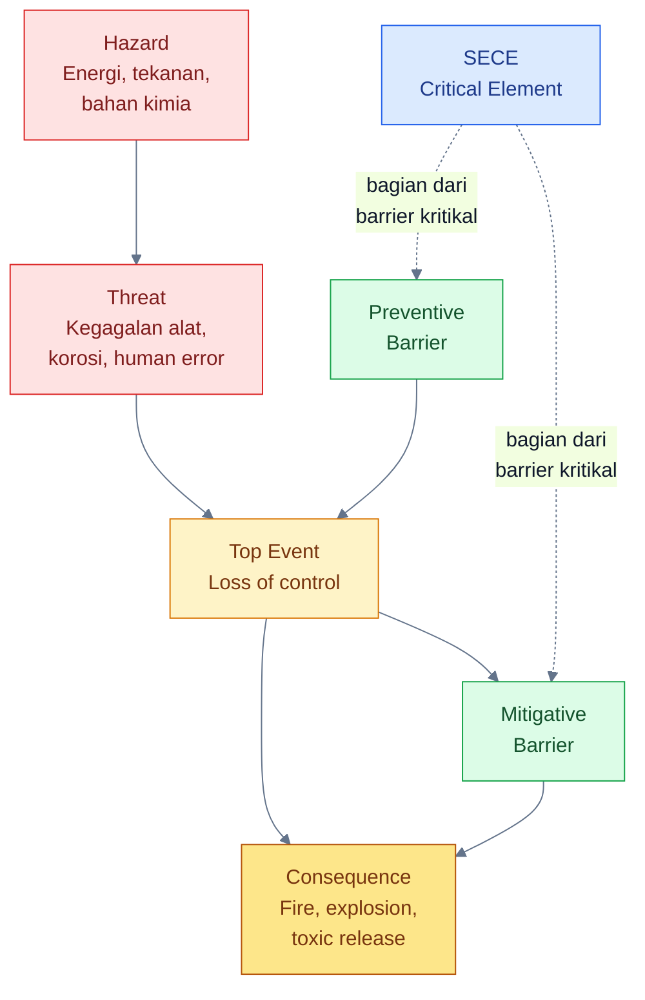

Bagi engineer di lapangan, konsep ini sangat relevan. Seorang maintenance engineer mungkin melihat **firewater pump** sebagai equipment yang harus dijaga availability-nya. Seorang instrument engineer mungkin melihat **gas detector**, **ESD valve**, atau **SIS loop** sebagai bagian dari sistem proteksi. Seorang inspection engineer mungkin fokus pada **pressure vessel**, **PSV**, **piping corrosion**, atau **fireproofing**. Seorang operations engineer mungkin berhadapan langsung dengan **bypass**, **inhibit**, **temporary operating restriction**, atau **manual emergency action**. Semua aktivitas tersebut sebenarnya dapat berada dalam payung SECE Management apabila equipment, sistem, atau fungsi tersebut berperan kritikal terhadap pencegahan atau mitigasi kecelakaan besar.

Dengan kata lain, SECE bukan hanya urusan HSE atau Process Safety. SECE juga bukan sekadar dokumen untuk memenuhi audit. SECE adalah bagian dari pekerjaan harian engineer dalam menjaga integritas plant.

Pada banyak organisasi, kelemahan terbesar bukan karena tidak memiliki proteksi. Proteksi sering kali sudah ada sejak fase desain. Kelemahan biasanya muncul karena status proteksi tidak diketahui, test terlambat, bypass terlalu lama, defect tidak dieskalasi, perubahan tidak melalui kajian yang memadai, atau performance standard tidak jelas. Dalam situasi seperti ini, plant terlihat berjalan normal, tetapi barrier kritikalnya mungkin sudah melemah.

Contoh sederhana: sebuah gas detector terpasang di compressor shelter. Pada P&ID, Cause & Effect Diagram, dan Fire & Gas Philosophy, detector tersebut berfungsi mendeteksi kebocoran hidrokarbon dan memicu alarm atau shutdown. Namun, jika detector tersebut fault selama beberapa minggu, calibration overdue, atau channel-nya inhibited tanpa risk assessment, maka barrier deteksi gas sebenarnya sedang tidak sehat. Bila terjadi kebocoran gas, plant tidak lagi memiliki perlindungan sebagaimana yang diasumsikan dalam desain.

Hal yang sama dapat terjadi pada firewater pump yang gagal auto-start, ESD valve yang lambat menutup, PSV yang overdue recertification, UPS safety system yang battery autonomy-nya tidak mencukupi, atau bund wall yang retak sehingga tidak mampu menahan tumpahan bahan kimia. Semua ini menunjukkan bahwa SECE harus dikelola secara aktif, bukan hanya didaftarkan.

UK HSE menerbitkan guidance L154 untuk regulasi Offshore Installations Safety Case Regulations 2015, yang ditujukan bagi duty holders seperti operator instalasi produksi, pemilik instalasi non-produksi, licensees, dan well operators; rezim safety case ini berfokus pada pengelolaan major accident hazards pada operasi oil and gas offshore. ([HSE][1]) Energy Institute juga menjelaskan bahwa Safety Critical Elements perlu dikelola sepanjang lifecycle fasilitas, mulai dari conceptual design, operasi, life extension, hingga decommissioning, dan ditujukan untuk fasilitas proses yang memiliki Major Accident Hazards. ([Energy Institute][2])

Bagi practical engineer, poin pentingnya adalah: **SECE Management harus menjawab pertanyaan sederhana namun kritikal: apakah elemen yang kita andalkan untuk mencegah atau memitigasi kecelakaan besar benar-benar tersedia, teruji, dan mampu bekerja saat dibutuhkan?**

## Pesan utama Bab 1

**SECE bukan hanya urusan HSE atau Process Safety. SECE adalah bagian dari pekerjaan harian engineer dalam menjaga plant tetap aman, andal, dan sesuai design intent.**

[Kembali ke atas](#sece-management-di-industri-petrokimia)

---

# 2. Fundamental SECE: Apa Itu Safety and Environmental Critical Element?

## 2.1 Definisi SECE

**SECE — Safety and Environmental Critical Elements** adalah bagian dari fasilitas, plant, sistem, equipment, struktur, komponen, software, atau fungsi tertentu yang kegagalannya dapat menyebabkan, berkontribusi secara substansial, atau gagal mencegah/membatasi dampak dari **Major Accident Event**.

Dalam bahasa yang lebih praktis:

> **SECE adalah elemen yang harus tetap sehat karena elemen tersebut merupakan bagian penting dari perlindungan plant terhadap kecelakaan besar.**

Energy Institute mendefinisikan Safety Critical Element sebagai bagian dari facility, plant, atau computer program yang kegagalannya dapat menyebabkan atau berkontribusi secara substansial terhadap Major Accident Hazard, atau yang tujuannya mencegah atau membatasi dampak Major Accident Hazard. ([Energy Institute][2]) Dalam regulasi offshore UK, istilah **safety and environmental-critical elements** juga mencakup bagian instalasi dan plant, termasuk computer programmes, yang kegagalannya dapat menyebabkan atau berkontribusi secara substansial terhadap major accident, atau yang bertujuan mencegah atau membatasi dampaknya. ([Natlex][3])

Definisi ini penting karena menempatkan SECE bukan berdasarkan jenis equipment, tetapi berdasarkan **fungsi terhadap major accident**. Sebuah equipment tidak otomatis menjadi SECE hanya karena mahal, besar, atau penting untuk produksi. Equipment menjadi SECE bila kegagalannya dapat melemahkan kontrol terhadap major accident hazard.

## 2.2 Apa itu Major Accident Event?

**Major Accident Event** adalah kejadian besar yang dapat menimbulkan dampak serius terhadap manusia, lingkungan, aset, atau keberlangsungan operasi. Di industri petrokimia, contoh Major Accident Event antara lain:

- kebakaran besar akibat hydrocarbon release,
- ledakan akibat vapor cloud explosion,
- pelepasan gas beracun seperti chlorine, ammonia, H₂S, atau toxic intermediates,
- overpressure pada pressure vessel atau reactor,
- runaway reaction,
- loss of containment dari pipa atau vessel bertekanan,
- tank overfill yang menyebabkan tumpahan besar,
- major environmental release ke drain, tanah, air permukaan, atau laut.

SECE selalu harus dikaitkan dengan skenario seperti ini. Bila tidak ada hubungan dengan Major Accident Event, maka item tersebut mungkin tetap penting, tetapi belum tentu SECE.

## 2.3 Fungsi utama SECE

SECE dapat memiliki beberapa fungsi utama. Fungsi-fungsi ini biasanya selaras dengan konsep barrier dalam process safety.

### 1. Mencegah major accident

SECE dapat berfungsi sebagai pencegah agar kondisi berbahaya tidak berkembang menjadi top event.

Contoh:

- SIS high-high pressure trip,
- PSV,
- ESD valve,
- high-high level shutdown,
- compressor trip system,
- overfill protection system.

### 2. Mendeteksi kondisi berbahaya

SECE dapat berfungsi mendeteksi kondisi abnormal sebelum menjadi lebih serius.

Contoh:

- gas detector,
- flame detector,
- smoke detector,
- toxic gas analyzer,
- high pressure alarm,
- high temperature alarm yang terkait response kritikal.

### 3. Mengendalikan eskalasi kejadian

SECE dapat berfungsi membatasi agar kejadian tidak berkembang lebih besar.

Contoh:

- emergency isolation valve,
- blowdown system,
- depressurization system,
- fire and gas executive action,
- deluge system,
- foam system.

### 4. Memitigasi konsekuensi

SECE dapat berfungsi mengurangi dampak setelah kejadian terjadi.

Contoh:

- firewater system,
- fireproofing,
- blast wall,
- emergency power supply,
- emergency lighting,
- escape route protection,
- emergency response system.

### 5. Melindungi lingkungan

SECE juga mencakup elemen yang kritikal terhadap pencegahan atau mitigasi dampak lingkungan besar.

Contoh:

- bund wall,
- secondary containment,
- drain isolation valve,
- emergency containment pond,
- oily water diversion,
- spill response system,
- toxic release containment.

Diagram berikut memberikan gambaran fungsi SECE secara ringkas.

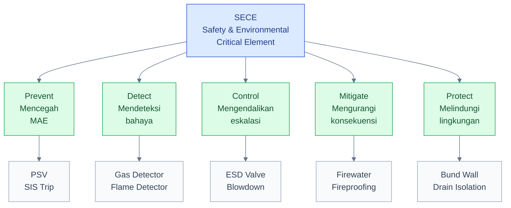

## 2.4 SECE berbeda dari equipment critical produksi

Salah satu kesalahan umum dalam implementasi awal SECE Management adalah menyamakan SECE dengan **production critical equipment**. Keduanya berbeda.

**Production critical equipment** adalah equipment yang kegagalannya menyebabkan penurunan produksi, plant trip, kualitas produk terganggu, atau kerugian ekonomi. Sedangkan **SECE** adalah elemen yang kegagalannya berhubungan dengan major accident.

Sebuah equipment dapat termasuk keduanya, tetapi tidak selalu.

Contoh:

- **Main product pump** mungkin sangat critical terhadap produksi. Jika pump gagal, unit tidak dapat mengirim produk. Namun, pump tersebut belum tentu SECE bila kegagalannya hanya menyebabkan production loss.
- **Firewater pump** mungkin jarang beroperasi dalam kondisi normal dan tidak berdampak pada produksi harian. Namun, firewater pump adalah SECE karena dibutuhkan saat terjadi kebakaran.
- **Cooling water pump** dapat menjadi production critical karena kegagalannya menyebabkan unit trip. Tetapi cooling water pump baru menjadi SECE bila kegagalannya dapat memicu runaway reaction, overpressure, atau loss of containment yang termasuk Major Accident Event.
- **Office air conditioning** dapat mengganggu kenyamanan dan produktivitas kerja, tetapi tidak terkait major accident sehingga bukan SECE.

Tabel berikut membantu membedakan beberapa kategori criticality.

| Kategori                       | Fokus utama                                         | Contoh                                            | Apakah selalu SECE? |
| ------------------------------ | --------------------------------------------------- | ------------------------------------------------- | ------------------- |
| Production Critical Equipment  | Menjaga produksi                                    | Product pump, compressor train, cooling tower fan | Tidak               |
| Business Critical Equipment    | Menjaga profitabilitas dan kontinuitas bisnis       | Export pump, loading arm, product analyzer        | Tidak               |
| Safety Critical Equipment      | Mencegah/memitigasi dampak keselamatan              | PSV, SIS, ESD, firewater pump                     | Biasanya ya         |
| Environmental Critical Element | Mencegah/memitigasi dampak lingkungan               | Bund wall, drain isolation, containment pond      | Biasanya ya         |
| SECE                           | Safety dan/atau environmental critical terhadap MAE | PSV, SIS, F&G, containment, emergency power       | Ya                  |

## 2.5 Cara praktis menentukan apakah suatu item adalah SECE

Untuk practical engineer, pertanyaan paling berguna adalah:

> **Jika item ini gagal, apakah major accident dapat terjadi, memburuk, atau gagal dimitigasi?**

Jika jawabannya **ya**, item tersebut berpotensi menjadi SECE.

Agar lebih sistematis, gunakan pertanyaan berikut:

1. Apakah item ini mencegah top event?
2. Apakah item ini mendeteksi kondisi berbahaya?
3. Apakah item ini memicu shutdown, isolation, atau depressurization?
4. Apakah item ini membatasi kebakaran, ledakan, atau toxic release?
5. Apakah item ini melindungi personel saat emergency?
6. Apakah item ini mencegah pencemaran lingkungan besar?
7. Apakah item ini disebut sebagai safeguard dalam HAZOP, LOPA, Bowtie, SIL Study, Fire Study, atau Environmental Risk Assessment?
8. Apakah item ini dibutuhkan agar risk reduction yang diasumsikan dalam design tetap valid?

Diagram berikut dapat digunakan sebagai logika awal screening.

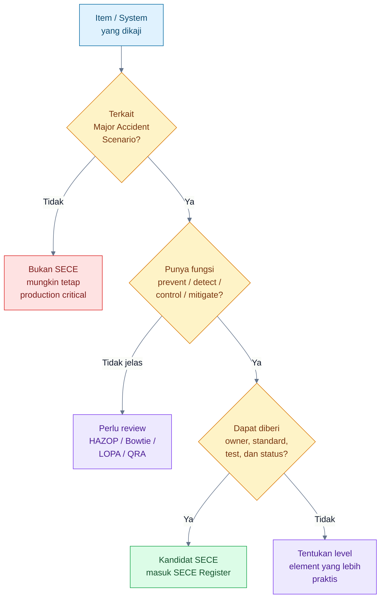

## 2.6 Contoh praktis klasifikasi SECE

| Item                               | Apakah SECE? | Catatan                                                                          |
| ---------------------------------- | -----------: | -------------------------------------------------------------------------------- |
| PSV pada reactor                   |           Ya | Mencegah overpressure yang dapat menyebabkan vessel rupture                      |
| Firewater pump                     |           Ya | Mitigasi kebakaran dan mencegah eskalasi                                         |
| Gas detector di compressor shelter |           Ya | Deteksi hydrocarbon release dan dapat memicu alarm/shutdown                      |
| Cooling water pump                 |   Tergantung | SECE bila kegagalannya dapat menyebabkan runaway reaction atau overpressure      |
| Product pump                       |   Tergantung | SECE bila kegagalannya terkait overfill, loss of containment, atau major release |
| Office air conditioning            |        Tidak | Tidak terkait Major Accident Event                                               |

## 2.7 Mengapa definisi ini penting?

Definisi yang tidak jelas akan menyebabkan dua masalah ekstrem.

Pertama, organisasi dapat memasukkan terlalu banyak item ke dalam SECE Register. Akibatnya, register menjadi terlalu besar, tidak fokus, sulit dikelola, dan kehilangan prioritas. Semua item dianggap critical, sehingga pada akhirnya tidak ada yang benar-benar diprioritaskan.

Kedua, organisasi dapat memasukkan terlalu sedikit item. Akibatnya, beberapa barrier kritikal tidak masuk dalam program assurance, tidak memiliki performance standard, tidak memiliki owner yang jelas, dan tidak dimonitor statusnya.

Karena itu, definisi SECE harus selalu dikaitkan dengan tiga hal:

1. **Major Accident Event** yang ingin dicegah atau dimitigasi.
2. **Fungsi barrier** yang dijalankan oleh elemen tersebut.
3. **Performance requirement** yang harus dipenuhi agar elemen tersebut dianggap efektif.

## Pesan utama Bab 2

**SECE ditentukan oleh fungsinya terhadap major accident, bukan oleh harga equipment, ukuran equipment, atau dampaknya terhadap produksi.**

[Kembali ke atas](#sece-management-di-industri-petrokimia)

---

# 3. Apa yang Dimaksud “Element” dalam SECE?

## 3.1 Mengapa kata “Element” penting?

Kata **Element** dalam SECE sering menimbulkan kebingungan. Banyak engineer secara natural menganggap element berarti equipment tag. Akibatnya, SECE Register sering berubah menjadi daftar tag equipment tanpa hubungan yang jelas dengan major accident scenario dan fungsi barrier.

Padahal, dalam konteks SECE, **Element** tidak selalu berarti satu equipment. Element dapat berupa equipment, system, component, structure, software, utility, atau function. Yang membuatnya menjadi SECE bukan bentuk fisiknya, tetapi perannya sebagai bagian dari barrier kritikal terhadap Major Accident Event.

Definisi Energy Institute secara eksplisit menyebut bahwa SCE dapat berupa bagian dari facility, plant, atau computer program; edisi ketiga panduan EI juga menambahkan guidance untuk pengelolaan SCE pada level system, equipment, dan component. ([Energy Institute][2]) Hal ini penting karena di lapangan, fungsi proteksi sering tidak dijalankan oleh satu alat tunggal, tetapi oleh rangkaian sensor, logic, final element, power supply, instrument air, dan tindakan operasi.

## 3.2 Element bukan hanya equipment tag

Dalam SECE, **Element** dapat berbentuk sebagai berikut.

| Jenis Element            | Contoh                                                                             |
| ------------------------ | ---------------------------------------------------------------------------------- |
| Equipment                | PSV, firewater pump, ESD valve, emergency generator                                |
| System                   | Firewater system, SIS, F&G system, flare system                                    |
| Component                | Gas detector, flame detector, pressure transmitter, solenoid valve                 |
| Structure                | Blast wall, fireproofing, bund wall, critical support                              |
| Software / Logic         | Safety PLC logic, Cause & Effect logic, voting logic                               |
| Utility critical         | UPS, emergency power, instrument air untuk shutdown valve                          |
| Environmental protection | Drain isolation, spill containment, emergency pond                                 |
| Human/procedural element | Critical manual isolation, emergency response action, operating procedure tertentu |

Kalimat praktisnya:

> **Element dalam SECE adalah bagian dari fasilitas yang menjalankan fungsi barrier kritikal terhadap Major Accident Event.**

## 3.3 Element dapat berada pada beberapa level

Element dapat didefinisikan pada level yang berbeda. Penentuan level ini sangat penting karena akan memengaruhi owner, performance standard, maintenance strategy, inspection task, test procedure, CMMS tagging, dan reporting.

Beberapa level element yang umum adalah:

1. **Level system**

   Contoh: Firewater System, Fire & Gas System, SIS, flare and blowdown system.

2. **Level equipment**

   Contoh: firewater pump, PSV, ESD valve, emergency diesel generator.

3. **Level component**

   Contoh: gas detector, flame detector, pressure transmitter, actuator, solenoid valve.

4. **Level loop / function**

   Contoh: SIF high-high pressure trip yang terdiri dari sensor, logic solver, dan final element.

5. **Level structure**

   Contoh: fireproofing, blast wall, bund wall, pipe rack support yang kritikal.

6. **Level software / logic**

   Contoh: safety PLC logic, Cause & Effect logic, voting logic 2oo3, permissive/interlock logic.

7. **Level utility support**

   Contoh: UPS untuk safety PLC, emergency power untuk F&G panel, instrument air untuk ESD valve.

Diagram berikut menunjukkan variasi level Element dalam SECE.

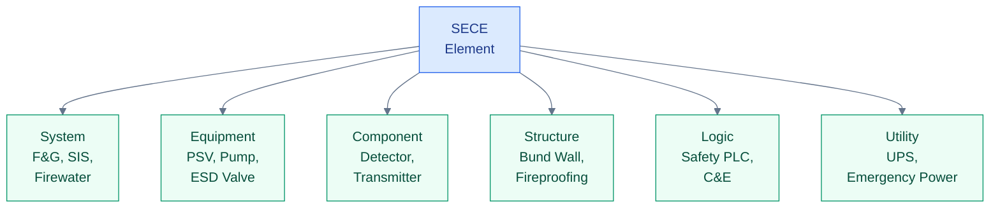

## 3.4 Contoh: satu barrier dapat terdiri dari beberapa element

Ambil contoh **hydrocarbon gas release** di compressor shelter. Fungsi proteksi yang diinginkan adalah mendeteksi gas dan memicu tindakan otomatis untuk membatasi pelepasan serta mengurangi kemungkinan ignition.

Barrier aktif ini dapat terdiri dari beberapa element:

- gas detector,
- F&G panel atau logic solver,
- alarm beacon/siren,
- ESD logic,
- shutdown valve,
- ventilation trip atau ventilation control,
- emergency power atau UPS,
- operator response.

Dalam contoh tersebut, tidak cukup hanya mengatakan “F&G system adalah SECE” tanpa menjelaskan elemen mana yang kritikal dan bagaimana fungsinya diuji. Engineer perlu mengetahui apakah gas detector sehat, apakah logic bekerja, apakah output ke ESD valid, apakah final element merespons, dan apakah power supply tersedia.

Diagram berikut menunjukkan contoh rangkaian element dalam satu fungsi barrier.

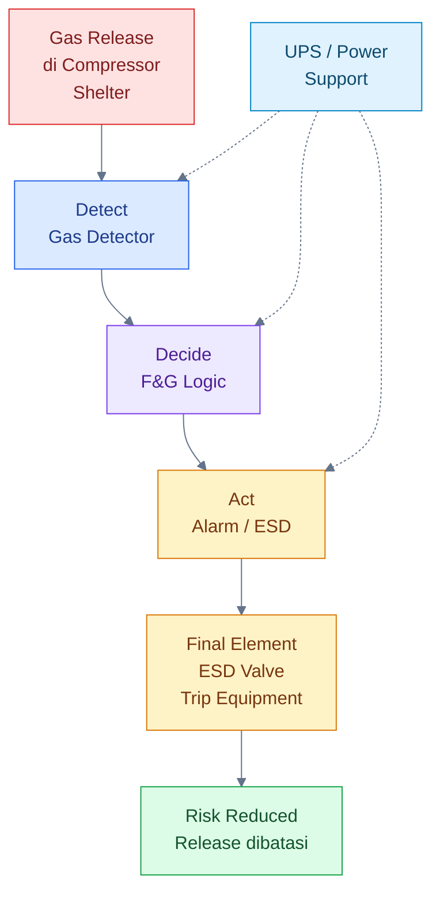

Dari diagram tersebut, terlihat bahwa fungsi proteksi tidak hanya bergantung pada gas detector. Bila UPS gagal, logic solver kehilangan power. Bila solenoid valve gagal, ESD valve tidak menutup. Bila ESD valve macet, fungsi isolasi gagal. Karena itu, penentuan level element harus dilakukan secara hati-hati.

## 3.5 Contoh level element pada beberapa skenario

| Skenario                | Element yang dapat menjadi SECE                                   |
| ----------------------- | ----------------------------------------------------------------- |
| Reactor overpressure    | PSV, rupture disc, SIS high-high pressure trip                    |
| Hydrocarbon gas release | Gas detector, F&G logic, ESD valve                                |
| Fire escalation         | Firewater pump, deluge system, fireproofing                       |
| Tank overfill           | Independent high-high level trip, inlet shutdown valve, bund wall |
| Toxic spill             | Drain isolation, containment pit, emergency pond                  |

## 3.6 Terlalu luas vs terlalu sempit

Salah satu tantangan terbesar dalam membangun SECE Register adalah menentukan batas element.

### Terlalu luas

Contoh:

> “Fire Protection System” dimasukkan sebagai satu SECE.

Masalahnya, terlalu luas. Fire Protection System dapat mencakup firewater pump, diesel engine, jockey pump, firewater ring main, deluge valve, hydrant, monitor, foam system, fire alarm, dan fireproofing. Bila semuanya disebut sebagai satu SECE, sulit menentukan:

- siapa owner teknisnya,
- performance standard mana yang berlaku,
- task maintenance apa yang harus dilakukan,
- acceptance criteria apa yang dipakai,
- status health-nya bagaimana,
- defect mana yang membuat SECE impaired.

### Terlalu sempit

Contoh:

> Setiap bolt, gasket, cable gland, terminal block, tubing fitting, dan junction box dimasukkan sebagai SECE.

Masalahnya, register menjadi sangat besar, sulit dikelola, dan kehilangan fokus. Engineer akan menghabiskan banyak energi mengelola daftar administratif, bukan memastikan fungsi barrier benar-benar sehat.

### Level yang tepat

Level element yang baik adalah level yang cukup detail untuk dikelola, tetapi tidak terlalu kecil sehingga tidak praktis.

Gunakan prinsip berikut:

> **Tetapkan SECE pada level yang bisa diberi owner, performance standard, maintenance/test task, acceptance criteria, dan status health.**

Contoh level yang lebih praktis:

| Area                     | Level terlalu luas     | Level lebih praktis                                                             |
| ------------------------ | ---------------------- | ------------------------------------------------------------------------------- |
| Fire protection          | Fire Protection System | Firewater pump, deluge valve, foam system, firewater ring main critical section |
| Instrumented protection  | SIS                    | SIF high-high pressure trip, SIF high-high level trip                           |
| F&G                      | F&G System             | Gas detector group, flame detector, F&G logic, executive action                 |
| Pressure protection      | Relief System          | PSV, rupture disc, flare header critical section                                |
| Environmental protection | Environmental System   | Bund wall, drain isolation valve, emergency containment pond                    |

## 3.7 Element dan fungsi barrier harus selalu terhubung

SECE Register yang baik tidak hanya berisi tag number. SECE Register harus menghubungkan element dengan fungsi barrier dan Major Accident Event.

Contoh yang kurang baik:

| Tag     | Description    |
| ------- | -------------- |
| XV-101  | Shutdown valve |
| GD-2101 | Gas detector   |
| P-9001A | Firewater pump |

Contoh yang lebih baik:

| SECE                   | Related MAE                                   | Barrier Function                  | Performance Requirement                                     |
| ---------------------- | --------------------------------------------- | --------------------------------- | ----------------------------------------------------------- |
| XV-101 ESD Valve       | Hydrocarbon release leading to fire/explosion | Isolasi inventory saat ESD demand | Valve menutup dalam waktu sesuai design basis               |
| GD-2101 Gas Detector   | Gas accumulation in compressor shelter        | Deteksi hydrocarbon gas           | Alarm/trip pada set point dan response time yang ditetapkan |
| P-9001A Firewater Pump | Fire escalation                               | Menyediakan firewater demand      | Flow dan pressure memenuhi firewater design basis           |

Dengan format kedua, engineer dapat langsung memahami mengapa suatu item menjadi SECE, apa fungsi proteksinya, dan bagaimana efektivitasnya dibuktikan.

## 3.8 Apakah human/procedural action bisa menjadi SECE?

Ini perlu dijelaskan hati-hati. Dalam banyak organisasi, SECE cenderung difokuskan pada hardware, system, structure, dan software/logic. Namun, pada beberapa kondisi, tindakan manusia atau prosedur tertentu dapat diperlakukan sebagai bagian dari critical barrier, terutama bila tindakan tersebut diklaim secara eksplisit dalam risk assessment untuk mencegah atau memitigasi Major Accident Event.

Contoh:

- manual isolation oleh operator dalam waktu tertentu,
- emergency depressurization manual,
- manual diversion untuk mencegah tumpahan masuk ke drain,
- emergency response action untuk toxic release,
- critical operating procedure saat start-up atau shutdown.

Namun, human/procedural element memiliki tantangan khusus karena reliability-nya dipengaruhi oleh training, workload, alarm clarity, accessibility, human-machine interface, waktu respons, komunikasi, dan kondisi emergency. Karena itu, bila human action diklaim sebagai barrier kritikal, organisasi harus memastikan:

- prosedurnya jelas,
- waktu respons realistis,
- operator kompeten,
- alarm atau indikasi pendukung tersedia,
- tindakan dapat dilakukan dalam kondisi emergency,
- dilakukan drill atau exercise,
- ada record pelatihan dan verifikasi kompetensi.

Dengan kata lain, human action tidak boleh diklaim sebagai SECE atau critical barrier hanya karena tertulis di prosedur. Harus ada assurance bahwa tindakan tersebut realistis dan dapat dilakukan saat dibutuhkan.

## 3.9 Practical rule untuk menentukan level Element

Untuk engineer, gunakan rule berikut saat menentukan apakah suatu element layak masuk SECE Register:

1. **Function-based**
   Element harus memiliki fungsi jelas terhadap prevention, detection, control, mitigation, atau environmental protection.

2. **MAE-linked**
   Element harus dapat dikaitkan dengan Major Accident Event tertentu.

3. **Owner-able**
   Element harus memiliki owner yang jelas.

4. **Test-able / inspect-able**
   Element harus dapat diuji, diinspeksi, atau diverifikasi.

5. **Standard-able**
   Element harus memiliki performance requirement dan acceptance criteria.

6. **Maintain-able**
   Element harus dapat dimasukkan ke dalam program maintenance, inspection, calibration, proof test, atau functional test.

7. **Status-able**
   Element harus dapat diberi status: healthy, degraded, failed, bypassed, overdue, atau unknown.

Jika suatu item tidak bisa memenuhi prinsip di atas, bukan berarti item tersebut tidak penting. Bisa jadi level definisinya perlu diperbaiki. Misalnya, bukan seluruh “SIS” sebagai satu SECE, tetapi **SIF high-high pressure trip** sebagai element yang lebih jelas.

## 3.10 Kesalahan umum dalam memahami Element

Beberapa kesalahan yang sering terjadi:

1. **Menganggap Element selalu equipment fisik**

   Padahal logic, software, utility support, dan structure juga bisa menjadi element.

2. **Menganggap semua komponen kecil harus masuk register**

   Ini membuat register tidak praktis.

3. **Tidak menghubungkan element dengan MAE**

   Akibatnya daftar SECE menjadi administratif, bukan risk-based.

4. **Tidak membedakan system dan function**

   Contoh: SIS sebagai system berbeda dengan SIF sebagai function.

5. **Tidak memasukkan support system yang kritikal**

   Contoh: UPS atau instrument air yang diperlukan agar ESD valve bekerja.

6. **Menentukan SECE berdasarkan opini, bukan berdasarkan hazard study**

   SECE harus diturunkan dari HAZOP, LOPA, Bowtie, QRA, SIL Assessment, Fire Study, atau Environmental Risk Assessment.

## Pesan utama Bab 3

**Dalam SECE, yang paling penting bukan nama equipment-nya, tetapi fungsi kritikalnya sebagai barrier terhadap Major Accident Event.**

Element harus dipilih pada level yang praktis: cukup detail untuk diberi owner, performance standard, test requirement, dan status health; tetapi tidak terlalu kecil sehingga SECE Register menjadi tidak dapat dikelola.

[1]: https://www.hse.gov.uk/pubns/books/l154.htm 'The Offshore Installations (Offshore Safety Directive)(Safety Case etc) Regulations 2015. Guidance on Regulations - HSE'
[2]: https://www.energyinst.org/industry/publications/topics/asset-integrity/guidelines-for-the-management-of-safety-critical-elements2 'Guidelines for the management of safety critical elements | Energy Institute'
[3]: https://natlex.ilo.org/dyn/natlex2/natlex2/files/download/108019/GBR108019.pdf?utm_source=chatgpt.com 'The Offshore Installations (Offshore Safety Directive) ( ...'

[Kembali ke atas](#sece-management-di-industri-petrokimia)

---

# 4. Bagaimana SECE Diidentifikasi?

SECE tidak boleh ditentukan hanya dengan melihat daftar equipment di plant. Kesalahan umum yang sering terjadi adalah membuat daftar SECE langsung dari equipment register, misalnya dengan memasukkan PSV, firewater pump, gas detector, ESD valve, dan SIS tanpa menjelaskan **Major Accident Event** apa yang dikendalikan dan **fungsi barrier** apa yang dijalankan oleh masing-masing elemen tersebut.

Pendekatan seperti itu berisiko menjadikan SECE Register hanya sebagai daftar tag, bukan sebagai alat pengelolaan risiko.

Secara prinsip, SECE harus diturunkan dari **major accident scenario**. Artinya, identifikasi SECE harus dimulai dari pemahaman terhadap bahaya besar yang ada di fasilitas, bagaimana bahaya tersebut dapat berkembang menjadi kecelakaan besar, barrier apa yang tersedia untuk mencegah atau memitigasinya, dan elemen mana yang benar-benar kritikal terhadap fungsi barrier tersebut.

Dengan kata lain, urutannya bukan:

> Equipment → SECE → Risk

Tetapi:

> Hazard → Major Accident Scenario → Barrier → Critical Element → SECE

Diagram berikut menunjukkan alur berpikir yang lebih tepat.

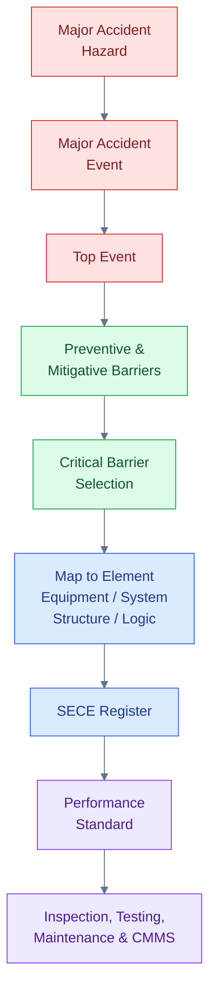

## 4.1 Sumber identifikasi SECE

Identifikasi SECE sebaiknya menggunakan kombinasi beberapa dokumen risk assessment dan engineering study. Tidak ada satu dokumen tunggal yang selalu cukup untuk menentukan seluruh SECE di fasilitas.

Sumber yang umum digunakan meliputi:

| Sumber                        | Peran dalam identifikasi SECE                                          |
| ----------------------------- | ---------------------------------------------------------------------- |
| HAZID                         | Mengidentifikasi bahaya utama sejak awal desain                        |
| HAZOP                         | Mengidentifikasi deviasi proses, safeguard, dan potensi consequence    |
| LOPA                          | Menentukan Independent Protection Layer dan kebutuhan risk reduction   |
| Bowtie Analysis               | Memetakan hazard, threat, top event, barrier, dan consequence          |
| QRA                           | Memberikan gambaran risiko kuantitatif dan skenario dominan            |
| SIL Assessment                | Mengidentifikasi Safety Instrumented Function dan target SIL           |
| Fire Risk Assessment          | Mengidentifikasi fire scenario dan kebutuhan fire protection           |
| Environmental Risk Assessment | Mengidentifikasi skenario dampak lingkungan besar                      |
| Relief and Flare Study        | Menentukan kebutuhan PSV, rupture disc, flare, dan blowdown            |
| F&G Mapping                   | Menentukan coverage gas detector, flame detector, dan executive action |
| Emergency Response Study      | Menentukan kebutuhan mitigasi dan response critical                    |
| Safety Case / Basis of Safety | Menjadi basis keseluruhan pengendalian major accident hazard           |

Untuk fasilitas existing, identifikasi SECE sering kali dilakukan dengan menggabungkan hasil studi lama, P&ID, Cause & Effect Diagram, equipment register, inspection record, CMMS data, dan pengalaman operasi. Namun, tetap harus ada validasi ulang agar daftar SECE tidak hanya menjadi hasil copy dari dokumen desain.

## 4.2 Langkah praktis identifikasi SECE

### Langkah 1 — Identifikasi Major Accident Hazard

Major Accident Hazard adalah sumber bahaya yang dapat menyebabkan kecelakaan besar. Dalam petrochemical plant, contoh Major Accident Hazard antara lain:

- hydrocarbon inventory,
- toxic chemical inventory,
- high pressure system,
- high temperature system,
- reactive chemical system,
- flammable vapor cloud potential,
- large storage tank,
- fired heater,
- boiler,
- compressor system,
- loading/unloading facility,
- hazardous waste or effluent system.

Pada tahap ini, engineer perlu memahami apa bahaya utama yang melekat pada unit proses.

Contoh:

> Reactor berisi material reaktif pada temperatur dan tekanan tinggi memiliki potensi runaway reaction, overpressure, dan release material berbahaya.

### Langkah 2 — Tentukan Major Accident Event

Setelah hazard diketahui, tentukan skenario major accident yang mungkin terjadi.

Contoh Major Accident Event:

- reactor overpressure leading to rupture,
- hydrocarbon loss of containment leading to fire or explosion,
- toxic gas release leading to personnel exposure,
- tank overfill leading to large spill and fire,
- fire escalation to adjacent equipment,
- flare system failure leading to uncontrolled release,
- major environmental release to drainage system.

Major Accident Event harus cukup spesifik. Pernyataan seperti “fire” terlalu umum. Lebih baik ditulis sebagai:

> Hydrocarbon release from compressor seal leading to gas accumulation, ignition, and explosion.

Dengan deskripsi yang spesifik, barrier yang dibutuhkan akan lebih mudah ditentukan.

### Langkah 3 — Tentukan Top Event

Top Event adalah titik ketika kontrol terhadap hazard hilang. Dalam bowtie, top event berada di tengah antara threat dan consequence.

Contoh:

| Hazard                             | Top Event                     |
| ---------------------------------- | ----------------------------- |
| Hydrocarbon under pressure         | Loss of containment           |
| Reactor with exothermic reaction   | Loss of reaction control      |
| Storage tank with flammable liquid | Tank overfill                 |
| Toxic gas inventory                | Toxic release                 |
| Pressurized vessel                 | Overpressure                  |
| Fire near process equipment        | Fire impingement / escalation |

Top event penting karena barrier preventive bekerja sebelum top event, sedangkan barrier mitigative bekerja setelah top event.

### Langkah 4 — Identifikasi preventive dan mitigative barriers

Barrier dibagi menjadi dua kelompok utama.

**Preventive barrier** mencegah top event terjadi.
**Mitigative barrier** mengurangi dampak setelah top event terjadi.

Contoh untuk skenario **tank overfill**:

| Jenis Barrier      | Contoh                                                                        |
| ------------------ | ----------------------------------------------------------------------------- |
| Preventive Barrier | level control, independent high-high level alarm, automatic inlet shutdown    |
| Mitigative Barrier | bund wall, drain isolation, foam system, firewater system, emergency response |

Contoh untuk skenario **reactor overpressure**:

| Jenis Barrier      | Contoh                                                             |
| ------------------ | ------------------------------------------------------------------ |
| Preventive Barrier | temperature control, pressure control, SIS high-high pressure trip |
| Mitigative Barrier | PSV, rupture disc, blowdown system, emergency response             |

### Langkah 5 — Tentukan barrier mana yang critical

Tidak semua barrier otomatis menjadi SECE. Barrier perlu dinilai apakah kegagalannya dapat menyebabkan risiko major accident meningkat secara signifikan.

Pertanyaan praktis:

- Apakah barrier ini diklaim dalam HAZOP, LOPA, Bowtie, SIL, QRA, atau Fire Study?
- Apakah barrier ini diperlukan untuk mencegah fatality, fire, explosion, toxic release, atau major environmental release?
- Apakah barrier ini merupakan Independent Protection Layer?
- Apakah barrier ini merupakan last line of defense?
- Apakah barrier ini memiliki fungsi otomatis yang kritikal?
- Apakah barrier ini perlu diuji atau diverifikasi secara berkala?
- Apakah kegagalannya harus dilaporkan ke management?

Jika jawabannya ya, barrier tersebut kemungkinan memiliki elemen yang harus dikategorikan sebagai SECE.

### Langkah 6 — Mapping barrier ke element

Setelah critical barrier ditentukan, lakukan mapping ke element nyata di plant. Element dapat berupa equipment, system, component, structure, logic, utility, atau function.

Contoh:

| Barrier Function              | Element yang Dipetakan                               |
| ----------------------------- | ---------------------------------------------------- |
| Relieve overpressure          | PSV, rupture disc, flare header                      |
| Detect gas release            | gas detector, F&G logic, alarm                       |
| Isolate hydrocarbon inventory | ESD valve, actuator, solenoid, instrument air        |
| Provide firewater             | firewater pump, diesel engine, controller, ring main |
| Prevent spill migration       | bund wall, drain isolation valve, containment pit    |
| Execute safety trip           | sensor, logic solver, final element, SIF             |

Pada tahap ini, engineer harus berhati-hati agar tidak menetapkan element terlalu luas atau terlalu sempit. Level element harus cukup praktis untuk dikelola.

### Langkah 7 — Validasi dengan discipline engineer

Identifikasi SECE harus divalidasi secara multidisiplin. Process Safety mungkin memahami major accident scenario, tetapi detail equipment sering berada pada discipline engineer.

Validasi sebaiknya melibatkan:

- process safety engineer,
- process engineer,
- operations representative,
- maintenance engineer,
- inspection engineer,
- mechanical engineer,
- instrument engineer,
- electrical engineer,
- civil/structural engineer,
- HSE/environment engineer,
- reliability engineer,
- project/MOC engineer bila terkait modifikasi.

Validasi ini penting untuk memastikan bahwa SECE benar-benar ada di lapangan, tag-nya benar, fungsinya sesuai design, dan aktivitas maintenance-nya dapat dilakukan.

### Langkah 8 — Masukkan ke SECE Register

Setiap element yang disetujui sebagai SECE harus dimasukkan ke dalam **SECE Register**.

Minimum informasi yang harus tersedia:

| Field                | Penjelasan                                                           |
| -------------------- | -------------------------------------------------------------------- |
| SECE ID              | Nomor unik element                                                   |
| Tag Number           | Tag equipment/system/component                                       |
| SECE Name            | Nama element                                                         |
| Related MAE          | Major Accident Event terkait                                         |
| Barrier Function     | Prevention, detection, control, mitigation, environmental protection |
| Element Type         | Equipment, system, structure, logic, utility, function               |
| Discipline Owner     | Mechanical, electrical, instrument, civil, operations, HSE           |
| Performance Standard | Dokumen standard terkait                                             |
| CMMS Reference       | Work order atau task di SAP PM/Maximo                                |
| Status               | Healthy, degraded, failed, bypassed, overdue, unknown                |

### Langkah 9 — Buat Performance Standard

SECE yang sudah masuk register harus memiliki Performance Standard. Tanpa Performance Standard, organisasi tidak memiliki dasar objektif untuk menyatakan apakah SECE tersebut sehat atau tidak.

Performance Standard menjawab pertanyaan:

- Apa fungsi SECE?
- Dalam kondisi apa SECE harus bekerja?
- Seberapa cepat harus bekerja?
- Kapasitas minimum berapa?
- Acceptance criteria-nya apa?
- Bagaimana cara menguji atau memverifikasinya?
- Apa yang dianggap degraded atau failed?
- Record apa yang harus tersedia?

### Langkah 10 — Hubungkan ke inspection, testing, maintenance, dan CMMS

SECE harus terhubung dengan program inspection, testing, dan maintenance. Jika SECE hanya ada di register tetapi tidak masuk ke CMMS, maka pengelolaannya akan bergantung pada manual tracking dan cenderung gagal.

Contoh integrasi ke CMMS:

| SECE           | CMMS Task                                             |
| -------------- | ----------------------------------------------------- |
| PSV            | recertification, visual inspection, set pressure test |
| Gas detector   | calibration, bump test, functional test               |
| ESD valve      | partial stroke test, full stroke test, solenoid test  |
| Firewater pump | weekly start test, monthly performance test           |
| UPS            | battery autonomy test, charger inspection             |
| Bund wall      | visual inspection, crack/leak inspection              |
| SIS loop       | proof test, bypass review, logic verification         |

## 4.3 Contoh identifikasi SECE: compressor gas release

Contoh skenario:

- Hazard: hydrocarbon gas under pressure.
- Threat: compressor seal failure.
- Top Event: hydrocarbon gas release.
- Consequence: gas accumulation, ignition, explosion.
- Preventive/Mitigative Barriers:

  - compressor seal monitoring,
  - gas detector,
  - F&G logic,
  - ESD valve,
  - compressor trip,
  - ventilation,
  - firewater/deluge,
  - emergency response.

Dari skenario ini, kandidat SECE dapat berupa:

| Candidate SECE    | Fungsi                                           |
| ----------------- | ------------------------------------------------ |
| Gas detector      | Mendeteksi hydrocarbon gas                       |
| F&G logic         | Memproses alarm dan executive action             |
| ESD valve         | Mengisolasi hydrocarbon inventory                |
| Compressor trip   | Menghentikan sumber release                      |
| Deluge system     | Mitigasi fire escalation                         |
| Firewater pump    | Menyediakan firewater demand                     |
| UPS untuk F&G/SIS | Menjaga fungsi logic dan detector tetap tersedia |

Perhatikan bahwa tidak semua item di compressor package otomatis menjadi SECE. Misalnya, lube oil cooler mungkin sangat penting untuk reliability compressor, tetapi belum tentu SECE kecuali kegagalannya dikaitkan langsung dengan major accident scenario.

## 4.4 Output identifikasi SECE

Hasil akhir proses identifikasi tidak hanya berupa daftar equipment. Output yang sebaiknya tersedia adalah:

1. **Major Accident Event Register**
   Berisi daftar skenario major accident yang relevan dengan fasilitas.

2. **Bowtie / Barrier Register**
   Berisi mapping threat, top event, consequence, preventive barrier, dan mitigative barrier.

3. **SECE Register**
   Berisi daftar element kritikal yang dikaitkan dengan MAE dan barrier function.

4. **Performance Standard**
   Berisi kriteria minimum yang harus dipenuhi setiap SECE.

5. **Maintenance and Assurance Plan**
   Berisi inspection, testing, calibration, proof test, dan PM task.

6. **SECE KPI Dashboard**
   Menampilkan status SECE: healthy, degraded, failed, bypassed, overdue, atau unknown.

## Pesan utama Bab 4

**SECE tidak boleh dibuat hanya dari daftar equipment. SECE harus diturunkan dari major accident scenario dan fungsi barrier.**

[Kembali ke atas](#sece-management-di-industri-petrokimia)

---

# 5. Performance Standard: Apa yang Harus Dipenuhi oleh SECE?

Setelah SECE diidentifikasi, langkah berikutnya adalah menetapkan **Performance Standard**. Ini adalah salah satu komponen paling penting dalam SECE Management. Tanpa Performance Standard, organisasi tidak memiliki dasar yang objektif untuk menilai apakah suatu SECE masih mampu menjalankan fungsi keselamatan atau perlindungan lingkungan.

Performance Standard menjawab pertanyaan sederhana:

> **Apa yang harus mampu dilakukan oleh SECE agar dapat dianggap fit for purpose?**

Sebagai contoh, tidak cukup mengatakan bahwa firewater pump harus “available”. Harus dijelaskan berapa kapasitas flow minimum, berapa discharge pressure minimum, bagaimana mode start-nya, berapa durasi operasi yang diperlukan, bagaimana acceptance criteria saat performance test, dan apa yang harus dilakukan bila hasil test gagal.

Begitu juga dengan gas detector. Tidak cukup hanya mengatakan bahwa gas detector harus “berfungsi”. Harus dijelaskan gas apa yang dideteksi, alarm set point, response time, calibration requirement, voting logic bila ada, executive action, dan kondisi apa yang dikategorikan sebagai degraded atau failed.

## 5.1 Definisi Performance Standard

**Performance Standard** adalah dokumen atau bagian dari dokumen yang menetapkan kriteria minimum yang harus dipenuhi oleh SECE agar elemen tersebut mampu menjalankan fungsi safety atau environmental protection sesuai design intent.

Performance Standard biasanya mencakup:

- fungsi SECE,
- related Major Accident Event,
- barrier function,
- performance requirement,
- acceptance criteria,
- testing and inspection requirement,
- failure criteria,
- impairment rule,
- responsible owner,
- required records.

Diagram berikut menunjukkan posisi Performance Standard dalam SECE Management.

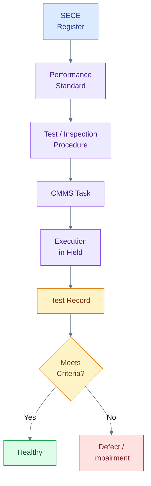

## 5.2 Parameter utama dalam Performance Standard

### 1. Functionality

Functionality menjelaskan fungsi apa yang harus dilakukan oleh SECE.

Contoh:

- PSV harus membuka untuk membuang tekanan berlebih.
- Gas detector harus mendeteksi gas pada konsentrasi tertentu.
- ESD valve harus menutup untuk mengisolasi inventory.
- Firewater pump harus menyediakan flow dan pressure untuk pemadaman.
- Bund wall harus menahan tumpahan agar tidak menyebar ke lingkungan.

Functionality harus ditulis secara jelas dan dapat diverifikasi.

### 2. Availability

Availability adalah kesiapan SECE untuk bekerja saat dibutuhkan.

Secara sederhana, availability dapat dituliskan sebagai:

$$
Availability = \frac{Uptime}{Uptime + Downtime}
$$

Untuk SECE, downtime tidak hanya berarti equipment rusak. Downtime juga dapat mencakup kondisi:

- bypassed,
- inhibited,
- isolated,
- under maintenance,
- failed test,
- unknown condition,
- overdue inspection bila aturan perusahaan mengklasifikasikannya sebagai unavailable.

Contoh requirement:

> Firewater pump shall be available in auto and manual start mode, except during approved impairment with compensating measure.

### 3. Reliability

Reliability menggambarkan kemampuan SECE bekerja tanpa gagal dalam periode tertentu.

Untuk pendekatan sederhana pada equipment dengan constant failure rate, reliability dapat dinyatakan sebagai:

$$
R(t) = e^{-\lambda t}
$$

Dengan:

- $R(t)$ = probability equipment tetap berfungsi sampai waktu $t$,
- $\lambda$ = failure rate,
- $t$ = waktu operasi atau exposure time.

Dalam praktik SECE Management, engineer tidak selalu menghitung reliability secara detail untuk setiap equipment. Namun, konsep reliability penting untuk menentukan test interval, spare part strategy, bad actor review, dan reliability improvement.

### 4. Survivability

Survivability adalah kemampuan SECE tetap menjalankan fungsi dalam kondisi kejadian ekstrem, seperti fire, explosion, flood, toxic atmosphere, atau loss of normal power.

Contoh:

- fireproofing harus tetap melindungi struktur selama durasi tertentu,
- emergency cable harus memiliki fire resistance sesuai requirement,
- local control panel untuk firewater pump harus tetap dapat digunakan saat emergency,
- blast wall harus mampu menahan blast load sesuai design basis,
- emergency generator harus tetap beroperasi saat normal power hilang.

Survivability sering dilupakan karena banyak test hanya dilakukan pada kondisi normal. Padahal SECE justru dibutuhkan dalam kondisi abnormal atau emergency.

### 5. Response Time

Response time adalah waktu maksimum yang dibutuhkan SECE untuk menjalankan fungsinya setelah demand muncul.

Contoh:

- ESD valve harus menutup dalam waktu tertentu.
- Gas detector harus memberikan alarm dalam waktu tertentu setelah terpapar gas.
- SIS harus memproses trip sesuai scan time dan logic requirement.
- Blowdown valve harus membuka dalam waktu yang ditetapkan.
- Firewater pump harus mencapai pressure minimum dalam waktu tertentu.

Response time harus realistis dan sesuai dengan scenario requirement. Jika response terlalu lambat, barrier mungkin tidak efektif walaupun akhirnya bekerja.

### 6. Capacity

Capacity adalah kapasitas minimum yang harus diberikan oleh SECE.

Contoh:

- PSV harus memiliki relieving capacity sesuai relief load.
- Firewater pump harus memberikan flow dan pressure sesuai firewater demand.
- Flare system harus mampu menerima relieving load.
- Bund wall harus memiliki containment capacity yang cukup.
- Emergency generator harus mampu menyuplai beban emergency critical.

Untuk equipment tertentu, capacity menjadi parameter utama. Firewater pump yang berhasil start tetapi tidak mampu memberikan flow dan pressure yang dibutuhkan tidak dapat dianggap fully healthy.

### 7. Accuracy

Accuracy relevan untuk instrumentasi dan analyzer.

Contoh:

- pressure transmitter untuk SIS harus memiliki akurasi sesuai safety requirement,
- gas detector harus memberikan output yang valid pada gas concentration tertentu,
- level transmitter untuk overfill protection harus akurat pada range operasi kritikal,
- toxic gas analyzer harus dikalibrasi dengan gas standard yang sesuai.

Instrument yang drift di luar toleransi dapat menyebabkan false safe condition atau gagal mendeteksi kondisi berbahaya.

### 8. Independence

Independence penting terutama untuk protection layer. SECE yang diklaim sebagai independent barrier tidak boleh memiliki common cause failure yang tidak dikendalikan dengan sistem kontrol normal.

Contoh:

- Independent high-high level trip sebaiknya tidak sepenuhnya bergantung pada transmitter yang sama dengan basic process control.
- SIS harus dipisahkan secara memadai dari BPCS sesuai philosophy functional safety.
- Power supply untuk safety system harus mempertimbangkan emergency power atau UPS bila diperlukan.
- Final element untuk safety action harus sesuai dengan design basis independence.

Independence bukan hanya persoalan hardware. Independence juga terkait dengan logic, power supply, instrument air, maintenance practice, dan human intervention.

### 9. Maintainability

Maintainability adalah kemudahan SECE untuk diperiksa, diuji, diperbaiki, dan dikembalikan ke kondisi normal.

Contoh:

- Gas detector harus dapat dikalibrasi dengan aman.
- ESD valve harus dapat dilakukan partial stroke test.
- PSV harus dapat dilepas untuk recertification.
- Firewater pump harus dapat diuji tanpa mengganggu operasi plant secara tidak perlu.
- UPS battery harus dapat diperiksa dan diganti.

Jika SECE sulit diuji atau diakses, kemungkinan besar assurance akan sering tertunda atau dilakukan tidak lengkap.

### 10. Testability

Testability adalah kemampuan untuk membuktikan fungsi SECE melalui test atau inspection.

Contoh:

- SIS loop harus memiliki proof test procedure.
- ESD valve harus memiliki stroke test method.
- Firewater pump harus memiliki performance test method.
- Bund wall harus memiliki inspection checklist.
- Fireproofing harus memiliki inspection criteria.

SECE yang tidak dapat diuji harus memiliki metode verifikasi alternatif yang disetujui, misalnya inspection, simulation, functional check, review record, atau engineering assessment.

### 11. Acceptance Criteria

Acceptance criteria adalah batas lulus atau gagal. Ini bagian paling penting dalam Performance Standard.

Contoh acceptance criteria:

| SECE           | Acceptance Criteria                                              |
| -------------- | ---------------------------------------------------------------- |
| PSV            | set pressure within allowable tolerance, no unacceptable leakage |
| Gas detector   | alarm/trip pada concentration dan response time yang ditetapkan  |
| Firewater pump | flow dan pressure memenuhi firewater design basis                |
| ESD valve      | closing time dan leakage sesuai requirement                      |
| UPS            | battery autonomy memenuhi minimum duration                       |
| Bund wall      | tidak ada crack/leak yang mengurangi containment function        |

Tanpa acceptance criteria, test hanya menjadi aktivitas administratif.

## 5.3 Formula sederhana yang relevan dalam Performance Standard

Tidak semua Performance Standard memerlukan perhitungan. Namun, beberapa parameter sering menggunakan formula sederhana sebagai basis evaluasi.

### Availability

$$
Availability = \frac{Uptime}{Uptime + Downtime}
$$

Contoh penerapan:

Jika satu firewater pump tersedia selama 720 jam dalam satu bulan dan mengalami downtime tidak disetujui selama 8 jam, maka:

$$
Availability = \frac{720 - 8}{720} = 0.9889 = 98.89\%
$$

### Reliability dengan constant failure rate

$$
R(t) = e^{-\lambda t}
$$

Keterangan:

- $R(t)$ = reliability pada waktu $t$,
- $\lambda$ = failure rate,
- $t$ = waktu.

### PFDavg sederhana untuk low-demand SIF

Untuk Safety Instrumented Function dalam low-demand mode, pendekatan sederhana yang sering digunakan pada tingkat konsep adalah:

$$
PFD_{avg} \approx \frac{\lambda_{DU} \times T}{2}
$$

Keterangan:

- $PFD_{avg}$ = average probability of failure on demand,
- $\lambda_{DU}$ = dangerous undetected failure rate,
- $T$ = proof test interval.

Formula ini menunjukkan hubungan penting: semakin panjang proof test interval, semakin besar potensi kegagalan tersembunyi yang tidak terdeteksi. Dalam aplikasi aktual, perhitungan SIL harus mengikuti metode dan data yang sesuai dengan functional safety lifecycle, bukan hanya formula sederhana ini.

### Test compliance

Untuk KPI compliance test SECE:

$$
Test\ Compliance = \frac{Number\ of\ SECE\ Tests\ Completed\ On\ Time}{Total\ SECE\ Tests\ Due} \times 100\%
$$

Formula ini sederhana tetapi sangat berguna untuk dashboard SECE.

## 5.4 Contoh Performance Standard: PSV

### Fungsi

PSV berfungsi melindungi pressure vessel atau piping system dari overpressure dengan cara membuka pada set pressure tertentu dan membuang fluida ke lokasi yang aman, misalnya flare system atau safe discharge location.

### Related MAE

- pressure vessel rupture,
- hydrocarbon release,
- toxic release,
- fire/explosion akibat overpressure.

### Performance requirement

| Parameter           | Requirement                                                    |
| ------------------- | -------------------------------------------------------------- |
| Functionality       | PSV membuka saat pressure mencapai set pressure                |
| Capacity            | Relieving capacity sesuai relief study                         |
| Availability        | PSV terpasang, tidak terisolasi, tidak blocked                 |
| Reliability         | Test/recertification sesuai interval                           |
| Survivability       | Material sesuai service dan kondisi operasi                    |
| Testability         | Dapat dilakukan pop test/bench test                            |
| Acceptance Criteria | set pressure, leakage, dan visual condition sesuai requirement |

### Failure criteria

PSV dapat dianggap failed atau impaired bila:

- overdue recertification melampaui batas yang disetujui,
- inlet atau outlet blocked,
- set pressure tidak sesuai,
- spring/corrosion damage,
- leakage melebihi batas,
- discharge path tidak tersedia,
- PSV terisolasi tanpa approval.

## 5.5 Contoh Performance Standard: Gas Detector

### Fungsi

Gas detector berfungsi mendeteksi hydrocarbon gas atau toxic gas pada area yang ditetapkan dan memberikan alarm atau executive action sesuai Cause & Effect.

### Related MAE

- gas accumulation,
- vapor cloud explosion,
- toxic exposure,
- fire escalation.

### Performance requirement

| Parameter           | Requirement                                   |
| ------------------- | --------------------------------------------- |
| Functionality       | Mendeteksi gas sesuai target gas              |
| Accuracy            | Output sesuai calibration gas                 |
| Response Time       | Alarm dalam waktu yang ditentukan             |
| Availability        | Tidak fault, tidak inhibited tanpa approval   |
| Testability         | Dapat dilakukan bump test/calibration         |
| Acceptance Criteria | Alarm/trip sesuai set point dan response time |

### Failure criteria

Gas detector dapat dianggap failed atau impaired bila:

- detector fault,
- calibration overdue,
- reading drift di luar toleransi,
- detector inhibited,
- detector tertutup obstruction,
- response time tidak memenuhi requirement,
- detector removed dari service tanpa risk assessment.

## 5.6 Contoh Performance Standard: Firewater Pump

### Fungsi

Firewater pump berfungsi menyediakan flow dan pressure untuk sistem pemadam kebakaran sesuai firewater demand.

### Related MAE

- fire escalation,
- jet fire,
- pool fire,
- storage tank fire,
- exposure fire to adjacent equipment.

### Performance requirement

| Parameter           | Requirement                                                        |
| ------------------- | ------------------------------------------------------------------ |
| Functionality       | Pump start otomatis/manual sesuai design                           |
| Capacity            | Flow dan pressure memenuhi firewater design basis                  |
| Availability        | Driver, fuel, battery, controller, suction source tersedia         |
| Reliability         | Periodic test dilakukan sesuai jadwal                              |
| Survivability       | Tetap dapat beroperasi saat emergency                              |
| Maintainability     | Akses maintenance dan test tersedia                                |
| Acceptance Criteria | Flow, pressure, start time, vibration, engine parameter acceptable |

### Failure criteria

Firewater pump dapat dianggap failed atau impaired bila:

- gagal auto-start,
- gagal manual start,
- flow atau pressure tidak memenuhi requirement,
- diesel engine fault,
- battery weak,
- fuel tidak mencukupi,
- suction blocked,
- controller fault,
- test overdue tanpa approval.

## 5.7 Contoh Performance Standard: ESD Valve

### Fungsi

ESD valve berfungsi mengisolasi inventory berbahaya saat menerima emergency shutdown demand.

### Related MAE

- hydrocarbon release,
- toxic release,
- fire/explosion escalation,
- uncontrolled inventory release.

### Performance requirement

| Parameter           | Requirement                                               |
| ------------------- | --------------------------------------------------------- |
| Functionality       | Valve menutup saat menerima ESD signal                    |
| Response Time       | Closing time sesuai design basis                          |
| Tightness           | Leakage dalam batas yang diterima                         |
| Availability        | Tidak bypassed, solenoid/actuator sehat                   |
| Testability         | Partial/full stroke test tersedia                         |
| Independence        | Sesuai safeguarding philosophy                            |
| Acceptance Criteria | Stroke time, final position, leakage, feedback acceptable |

### Failure criteria

ESD valve dapat dianggap failed atau impaired bila:

- gagal menutup,
- closing time lebih lama dari requirement,
- valve passing melebihi batas,
- solenoid fault,
- actuator leak,
- instrument air tidak tersedia,
- valve bypassed tanpa approval,
- position feedback tidak valid.

## 5.8 Template ringkas Performance Standard

Format berikut dapat digunakan sebagai struktur awal.

| Bagian                        | Isi                                                                  |
| ----------------------------- | -------------------------------------------------------------------- |
| SECE Name                     | Nama element                                                         |
| SECE ID / Tag                 | Nomor unik dan tag                                                   |
| Related MAE                   | Major Accident Event terkait                                         |
| Barrier Function              | Prevention, detection, control, mitigation, environmental protection |
| Functional Requirement        | Fungsi yang harus dilakukan                                          |
| Performance Criteria          | Availability, reliability, response time, capacity, survivability    |
| Test / Inspection Requirement | Jenis test dan interval                                              |
| Acceptance Criteria           | Batas lulus/gagal                                                    |
| Failure / Impairment Criteria | Kondisi degraded atau failed                                         |
| Required Records              | Test report, calibration certificate, inspection report              |
| Owner                         | Technical owner dan executing discipline                             |
| Reference Documents           | P&ID, C&E, HAZOP, LOPA, SIL, firewater study, datasheet              |

## Pesan utama Bab 5

**SECE tanpa Performance Standard tidak dapat dikelola secara objektif.**

Performance Standard mengubah SECE dari sekadar “equipment penting” menjadi elemen yang dapat diuji, diukur, diverifikasi, dan dipertanggungjawabkan.

[Kembali ke atas](#sece-management-di-industri-petrokimia)

---

# 6. SECE Management: Bagaimana SECE Dikelola?

SECE Management adalah sistem manajemen untuk memastikan seluruh Safety and Environmental Critical Elements tetap teridentifikasi, terdokumentasi, diuji, diinspeksi, dipelihara, dimonitor, diperbaiki, dan diverifikasi sepanjang lifecycle fasilitas.

Tujuan utamanya bukan hanya membuat daftar SECE. Tujuan utamanya adalah memastikan bahwa setiap SECE tetap mampu menjalankan fungsi barrier saat dibutuhkan.

Dalam bahasa practical engineer:

> **SECE Management adalah cara perusahaan memastikan critical barriers tidak hanya ada di desain, tetapi benar-benar sehat di lapangan.**

## 6.1 Definisi SECE Management

**SECE Management** adalah proses terintegrasi untuk mengelola seluruh element yang kritikal terhadap pencegahan atau mitigasi Major Accident Event, mulai dari identifikasi, penetapan performance standard, inspection, testing, maintenance, defect management, impairment control, MOC, KPI monitoring, hingga audit dan verification.

SECE Management harus menjawab pertanyaan berikut:

- Apa saja SECE di plant?
- Major Accident Event apa yang dikendalikan?
- Apa fungsi barrier masing-masing SECE?
- Apa Performance Standard-nya?
- Siapa owner-nya?
- Bagaimana cara menguji atau menginspeksinya?
- Kapan terakhir diuji?
- Apakah ada overdue?
- Apakah ada bypass atau inhibit?
- Apakah ada defect?
- Apakah ada compensating measure?
- Apakah statusnya visible bagi management?

## 6.2 Siklus praktis SECE Management

Siklus praktis SECE Management dapat diringkas sebagai:

> **Identify → Define Standard → Maintain/Test → Monitor → Correct → Verify → Improve**

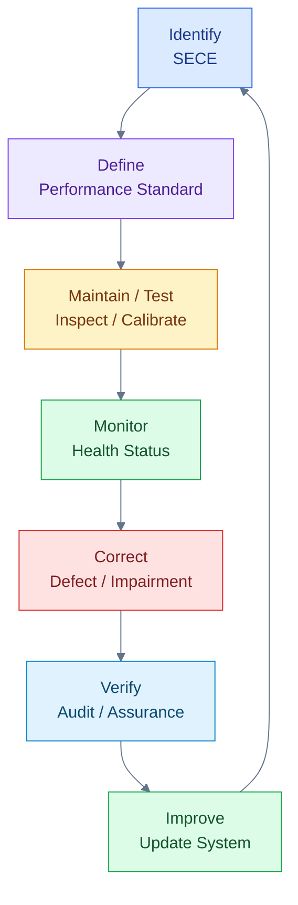

Siklus ini menunjukkan bahwa SECE Management bukan aktivitas satu kali. SECE harus terus diperbarui ketika ada perubahan operasi, perubahan desain, hasil audit, hasil incident investigation, perubahan risk assessment, ageing asset, obsolescence, atau modifikasi fasilitas.

## 6.3 Komponen utama SECE Management

### 1. SECE Register

SECE Register adalah daftar resmi seluruh SECE di fasilitas. Register ini harus menjadi single source of truth.

Register yang baik tidak hanya memuat tag number, tetapi juga:

- related MAE,
- barrier function,
- element type,
- owner,
- Performance Standard,
- CMMS reference,
- current health status,
- active defect,
- bypass/inhibit status,
- last test date,
- next due date.

Tanpa register, organisasi tidak dapat mengetahui secara sistematis apa saja critical elements yang harus dijaga.

### 2. Performance Standard

Setiap SECE harus memiliki Performance Standard. Standard ini menjadi dasar untuk inspection, testing, maintenance, audit, dan decision making.

Performance Standard juga menjadi dasar untuk menentukan apakah SECE:

- healthy,
- degraded,
- failed,
- bypassed,
- overdue,
- unknown.

### 3. SECE Owner

Setiap SECE harus memiliki owner. Owner bukan hanya orang yang melakukan maintenance, tetapi pihak yang bertanggung jawab memastikan SECE memenuhi Performance Standard.

Contoh owner:

| SECE           | Owner Utama                               |
| -------------- | ----------------------------------------- |
| PSV            | Mechanical / Inspection / Asset Integrity |
| SIS/SIF        | Instrument / Functional Safety            |
| ESD Valve      | Instrument + Mechanical                   |
| Firewater Pump | Mechanical / Fire Protection              |
| UPS            | Electrical                                |
| Fireproofing   | Civil / Asset Integrity                   |
| Bund Wall      | Civil / HSE / Operations                  |
| Gas Detector   | Instrument / F&G System Owner             |

SECE tanpa owner cenderung menjadi orphan equipment. Ketika ada defect, tidak jelas siapa yang harus menindaklanjuti.

### 4. Inspection, Testing, and Maintenance Plan

SECE harus masuk ke dalam program inspection, testing, dan maintenance. Aktivitas ini dapat berupa:

- preventive maintenance,
- corrective maintenance,
- statutory inspection,
- functional test,
- proof test,
- calibration,
- performance test,
- visual inspection,
- integrity inspection,
- operational readiness test.

Contoh:

| SECE           | Assurance Activity                                     |
| -------------- | ------------------------------------------------------ |
| PSV            | pop test, visual inspection, set pressure verification |
| SIS Loop       | proof test, logic test, bypass review                  |
| Gas Detector   | calibration, bump test                                 |
| Firewater Pump | start test, flow test, diesel engine test              |
| ESD Valve      | partial stroke, full stroke, leakage test              |
| UPS            | battery autonomy test                                  |
| Bund Wall      | crack and leak inspection                              |
| Fireproofing   | condition inspection                                   |

### 5. CMMS Integration

SECE Management harus terintegrasi dengan CMMS seperti SAP PM, Maximo, atau sistem maintenance lainnya.

Minimum yang harus ada di CMMS:

- SECE flag,
- criticality code,
- PM task,
- test interval,
- work order priority,
- overdue report,
- defect work order,
- link ke procedure,
- link ke Performance Standard,
- history record.

Tanpa integrasi CMMS, SECE testing sering bergantung pada spreadsheet manual yang mudah tidak sinkron dengan kondisi lapangan.

### 6. Defect Management

Defect pada SECE harus dikelola dengan prioritas lebih tinggi dibanding defect equipment biasa. Defect harus diklasifikasikan berdasarkan dampaknya terhadap fungsi barrier.

Contoh:

- ESD valve fail to close = critical defect.
- Gas detector fault = SECE impairment.
- Firewater pump failed start = critical impairment.
- PSV overdue = potential impairment.
- UPS battery autonomy failed = degraded/failed depending on requirement.
- Bund wall crack = degraded environmental barrier.

### 7. Impairment Management

Impairment adalah kondisi ketika SECE tidak memenuhi Performance Standard secara penuh.

Setiap impairment harus memiliki:

- risk assessment,
- approval,
- compensating measure,
- time limit,
- responsible person,
- communication to operations,
- shift handover,
- close-out verification.

Impairment tidak boleh hanya dicatat sebagai work order biasa.

### 8. Bypass/Inhibit Control

Bypass atau inhibit pada SECE adalah perubahan sementara terhadap safety barrier. Oleh karena itu, harus dikendalikan ketat.

Minimum kontrol:

- bypass permit,
- reason for bypass,
- risk assessment,
- approval matrix,
- expiry date,
- compensating measure,
- physical or system tagging,
- shift handover,
- periodic review,
- restoration verification.

### 9. Management of Change

Setiap perubahan yang memengaruhi SECE harus melalui MOC.

Contoh perubahan yang harus memicu SECE review:

- perubahan trip set point,
- perubahan SIS logic,
- perubahan gas detector location,
- perubahan firewater demand,
- perubahan relief load,
- perubahan PSV set pressure,
- perubahan actuator type,
- perubahan chemical service,
- perubahan layout,
- perubahan operating envelope.

MOC harus memastikan SECE Register, Performance Standard, CMMS task, procedure, dan training ikut diperbarui bila terdampak.

### 10. KPI and Dashboard

SECE Management harus menghasilkan visibility. Management harus mengetahui status SECE secara periodik.

Contoh status:

- healthy,
- degraded,
- failed,
- bypassed,
- inhibited,
- overdue,
- unknown.

Contoh KPI:

- % SECE PM completed on time,
- number of overdue SECE tasks,
- number of active bypass/inhibit,
- number of impaired SECE,
- number of failed proof tests,
- number of SECE failed on demand.

### 11. Audit and Verification

Audit dan verification diperlukan untuk memastikan SECE Management berjalan efektif. Audit tidak boleh hanya memeriksa apakah dokumen tersedia. Audit harus memeriksa apakah:

- SECE Register akurat,
- Performance Standard tersedia,
- test dilakukan sesuai procedure,
- acceptance criteria jelas,
- failed test ditindaklanjuti,
- bypass dikendalikan,
- CMMS data akurat,
- MOC memperbarui SECE,
- field condition sesuai document.

### 12. Competency Management

SECE harus diuji, diperbaiki, dan diverifikasi oleh personel yang kompeten.

Contoh:

- SIS proof test memerlukan pemahaman functional safety,
- gas detector calibration memerlukan pemahaman gas standard dan sensor behavior,
- PSV recertification memerlukan kompetensi pressure relief device,
- firewater pump test memerlukan pemahaman pump performance,
- UPS autonomy test memerlukan pemahaman battery system,
- impairment risk assessment memerlukan pemahaman process safety.

## 6.4 SECE Management sepanjang lifecycle fasilitas

SECE Management harus berjalan sejak desain sampai decommissioning.

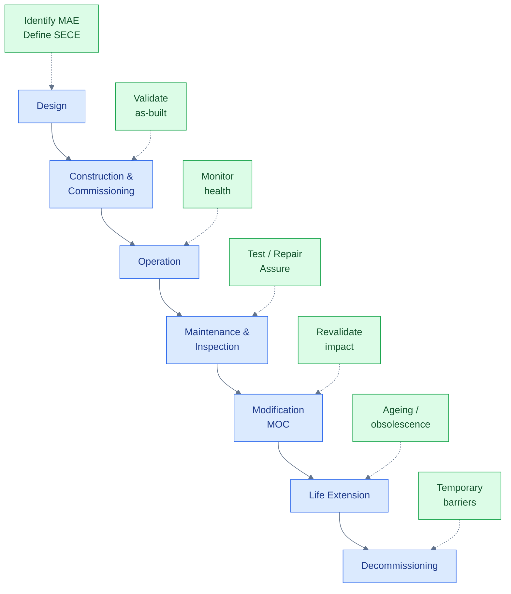

### Design phase

Pada fase desain, SECE ditentukan dari HAZID, HAZOP, LOPA, SIL, Fire Study, QRA, dan environmental assessment. Performance Standard awal harus dibuat agar design requirement jelas.

### Construction and commissioning phase

Pada fase commissioning, SECE harus diverifikasi secara fisik dan fungsional. Punch list yang terkait SECE harus diberi prioritas tinggi.

Contoh:

- Cause & Effect test,
- SIS validation,
- firewater pump performance test,
- gas detector functional test,
- ESD valve stroke test,
- PSV installation verification,
- emergency generator load test.

### Operation phase

Pada fase operasi, fokusnya adalah menjaga SECE tetap available dan efektif.

Aktivitas utama:

- PM compliance,
- calibration,
- proof test,
- bypass control,
- defect management,
- impairment review,
- dashboard reporting.

### Modification phase

Setiap perubahan harus menilai dampaknya terhadap SECE.

Pertanyaan penting:

- Apakah perubahan ini menghilangkan barrier?
- Apakah perubahan ini mengubah Performance Standard?
- Apakah test interval perlu berubah?
- Apakah CMMS task perlu diperbarui?
- Apakah operator perlu training baru?

### Life extension phase

Pada plant ageing, SECE perlu dievaluasi terhadap:

- corrosion,
- fatigue,
- obsolescence,
- spare part availability,
- outdated logic solver,
- obsolete gas detector,
- deteriorated fireproofing,
- unreliable emergency power system.

### Decommissioning phase

Saat inventory dikurangi atau unit dimatikan, SECE tidak otomatis boleh diabaikan. Selama masih ada hazard, barrier tetap diperlukan. Bahkan dalam beberapa kondisi, temporary SECE atau temporary barrier perlu ditetapkan.

## 6.5 Contoh penerapan SECE Management: firewater pump

Firewater pump adalah contoh SECE yang sangat praktis. Dalam operasi normal, pump mungkin jarang digunakan. Namun saat fire emergency, pump menjadi salah satu barrier utama untuk mencegah eskalasi.

SECE Management untuk firewater pump harus memastikan:

- firewater pump masuk SECE Register,
- related MAE jelas,
- Performance Standard tersedia,
- auto-start dan manual-start diuji,
- flow dan pressure diuji,
- diesel engine sehat,
- fuel tersedia,
- battery start system baik,
- controller sehat,
- suction source tersedia,
- discharge path tidak terisolasi,
- test record terdokumentasi,
- defect dieskalasi,
- impairment memiliki compensating measure.

Jika firewater pump gagal start saat test, kondisi ini tidak cukup hanya dibuat work order. Harus ada impairment assessment karena fungsi barrier terhadap fire escalation sedang melemah.

## 6.6 Kesalahan umum dalam SECE Management

Beberapa kesalahan yang sering terjadi:

1. SECE Register hanya berupa daftar equipment.
2. Tidak ada link antara SECE dan Major Accident Event.
3. Performance Standard tidak tersedia.
4. Test dilakukan tanpa acceptance criteria.
5. CMMS tidak memiliki SECE flag.
6. Overdue SECE task tidak dieskalasi.
7. Bypass/inhibit tidak memiliki expiry date.
8. Defect SECE diperlakukan seperti defect biasa.
9. MOC tidak memperbarui SECE Register.
10. Dashboard hanya menampilkan jumlah PM, bukan health status.
11. Audit hanya memeriksa dokumen, bukan efektivitas barrier.
12. Tidak ada owner yang jelas.

## Pesan utama Bab 6

**SECE Management adalah cara perusahaan memastikan critical barriers tetap tersedia, teruji, dan efektif saat dibutuhkan.**

[Kembali ke atas](#sece-management-di-industri-petrokimia)

---

# 7. Dokumen yang Diperlukan dalam SECE Management

SECE Management tidak dapat berjalan hanya dengan konsep. Agar dapat diimplementasikan, diaudit, dan dibuktikan efektivitasnya, SECE Management memerlukan dokumen dan records yang jelas.

Dokumen menjelaskan apa yang harus dilakukan. Records membuktikan bahwa aktivitas telah dilakukan.

Banyak organisasi memiliki equipment proteksi yang baik, tetapi lemah dalam dokumentasi. Akibatnya, saat terjadi audit atau incident investigation, organisasi sulit membuktikan bahwa SECE benar-benar sehat. Sebaliknya, ada juga organisasi yang memiliki banyak dokumen, tetapi records lapangan tidak lengkap atau tidak mencerminkan kondisi aktual. Keduanya merupakan kelemahan serius.

Dalam SECE Management, prinsip yang harus dipegang adalah:

> **Document defines requirement. Record proves compliance.**

Atau dalam bahasa praktis:

> **Dokumen menetapkan apa yang harus dilakukan; record membuktikan bahwa hal tersebut benar-benar dilakukan.**

## 7.1 Prinsip document vs record

| Jenis    | Fungsi                                                                                              |
| -------- | --------------------------------------------------------------------------------------------------- |
| Document | Menetapkan requirement, proses, standar, tanggung jawab, dan metode kerja                           |
| Record   | Membuktikan aktivitas telah dilakukan dan hasilnya memenuhi atau tidak memenuhi acceptance criteria |

Contoh:

| Document                  | Record                               |
| ------------------------- | ------------------------------------ |
| SECE Management Procedure | Completed SECE audit report          |
| Performance Standard      | Firewater pump test result           |
| Proof Test Procedure      | SIS proof test record                |
| Bypass Procedure          | Bypass approval log                  |
| Inspection Plan           | Completed inspection report          |
| Calibration Procedure     | Gas detector calibration certificate |
| MOC Procedure             | Approved MOC package                 |
| Competency Matrix         | Training and assessment record       |

Diagram berikut menunjukkan hubungan antara dokumen dan record.

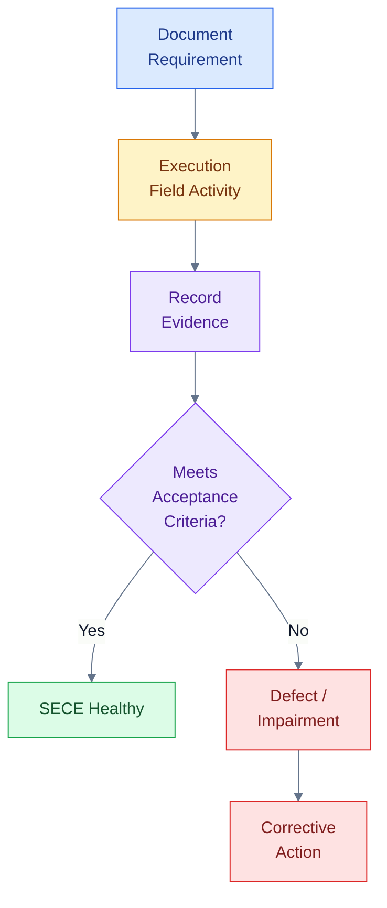

SECE yang tidak memiliki record valid sebaiknya tidak langsung dianggap healthy. Dalam pengelolaan yang konservatif, SECE seperti ini lebih tepat diperlakukan sebagai **unknown health** sampai ada bukti test, inspection, atau verification yang valid.

## 7.2 Dokumen inti SECE Management

### A. SECE Management Philosophy / Basis

Dokumen ini menjelaskan dasar filosofi pengelolaan SECE di fasilitas. Biasanya bersifat high-level dan menjadi referensi utama bagi prosedur lain.

Isi minimum:

- definisi SECE,
- scope fasilitas,
- basis major accident hazard,
- prinsip identifikasi SECE,
- hubungan SECE dengan Barrier Management,
- hubungan SECE dengan Process Safety Management,
- hubungan SECE dengan Asset Integrity Management,
- lifecycle SECE,
- prinsip ownership,
- prinsip assurance,
- prinsip impairment management,
- prinsip independent verification.

Dokumen ini penting agar seluruh departemen memiliki pemahaman yang sama. Tanpa philosophy yang jelas, setiap fungsi dapat memiliki interpretasi berbeda tentang apa yang disebut SECE.

### B. SECE Management Procedure

Ini adalah prosedur utama yang mengatur bagaimana SECE dikelola secara operasional.

Isi minimum:

- tujuan dan scope,
- definisi istilah,
- roles and responsibilities,
- proses identifikasi SECE,
- proses pembuatan dan update SECE Register,
- proses pembuatan Performance Standard,
- inspection, testing, and maintenance requirement,
- impairment management,
- bypass/inhibit control,
- overdue management,
- defect escalation,
- MOC interface,
- verification and audit,
- KPI reporting,
- document control,
- management review.

SECE Management Procedure harus cukup praktis sehingga dapat digunakan oleh operations, maintenance, inspection, instrument, electrical, mechanical, HSE, dan engineering.

### C. Major Accident Event Register

Major Accident Event Register adalah daftar skenario kecelakaan besar yang menjadi basis SECE.

Contoh struktur:

| Kolom           | Isi                                                    |
| --------------- | ------------------------------------------------------ |
| MAE ID          | Nomor skenario                                         |
| Hazard          | Hydrocarbon, toxic gas, pressure, reactive chemical    |
| Top Event       | Loss of containment, overpressure, overfill            |
| Consequence     | Fire, explosion, toxic exposure, environmental release |
| Barriers        | Preventive dan mitigative barriers                     |
| Related SECE    | SECE yang terkait                                      |
| Reference Study | HAZOP, LOPA, Bowtie, QRA, SIL study                    |

Register ini penting karena SECE harus selalu dikaitkan dengan Major Accident Event. Jika tidak ada link ke MAE, maka alasan suatu element menjadi SECE akan sulit dipertahankan.

### D. SECE Register

SECE Register adalah dokumen paling penting dalam implementasi SECE Management.

Minimum field:

| Kolom                | Isi                                                   |
| -------------------- | ----------------------------------------------------- |
| SECE ID              | Nomor unik                                            |
| Tag Number           | Tag equipment/system/component                        |
| SECE Name            | Nama element                                          |
| Element Type         | Equipment, system, structure, logic, utility          |
| Discipline           | Mechanical, Electrical, Instrument, Civil, HSE        |
| Related MAE          | Major Accident Event terkait                          |
| Barrier Function     | Prevention, detection, control, mitigation            |
| Performance Standard | Nomor dokumen                                         |
| Owner                | Technical owner                                       |
| CMMS Reference       | SAP PM / Maximo task                                  |
| Status               | Healthy, degraded, failed, bypassed, overdue, unknown |

SECE Register yang baik bukan sekadar daftar tag. Register harus menghubungkan:

> **Element → Major Accident Event → Barrier Function → Performance Standard → Assurance Task → Health Status**

### E. SECE Performance Standard

Performance Standard menjelaskan requirement minimum untuk setiap SECE.

Isi minimum:

- nama SECE,
- SECE ID/tag,
- related MAE,
- barrier function,
- required performance,
- acceptance criteria,
- test requirement,
- inspection requirement,
- failure criteria,
- impairment criteria,
- owner,
- required records,
- reference documents.

Tanpa Performance Standard, sulit menentukan apakah hasil test lulus atau gagal. Misalnya, firewater pump berhasil start, tetapi apakah flow dan pressure-nya cukup? ESD valve menutup, tetapi apakah closing time-nya memenuhi requirement? Gas detector alarm, tetapi apakah response time-nya masih acceptable?

### F. Inspection, Testing, and Maintenance Plan

Dokumen ini menghubungkan SECE dengan aktivitas lapangan.

Isi minimum:

- daftar SECE,
- PM task,
- inspection task,
- proof test task,
- calibration task,
- functional test task,
- interval,
- procedure reference,
- acceptance criteria,
- responsible discipline,
- required competency,
- CMMS work order reference,
- escalation rule bila overdue.

Contoh:

| SECE           | Task              | Responsible                    | Output Record           |
| -------------- | ----------------- | ------------------------------ | ----------------------- |
| PSV            | Recertification   | Mechanical / Inspection        | PSV test certificate    |
| Gas detector   | Calibration       | Instrument                     | Calibration certificate |
| SIS loop       | Proof test        | Instrument / Functional Safety | Proof test report       |
| Firewater pump | Performance test  | Mechanical                     | Pump test record        |
| UPS            | Autonomy test     | Electrical                     | UPS test report         |
| Bund wall      | Visual inspection | Civil / HSE                    | Inspection checklist    |

### G. Test Procedure / Inspection Procedure

Performance Standard menjelaskan **apa yang harus dicapai**.
Test Procedure menjelaskan **bagaimana cara mengujinya**.

Isi minimum:

- preparation,
- tools and equipment,
- permit requirement,
- isolation requirement,
- safety precautions,
- step-by-step test,
- acceptance criteria,
- data recording format,
- restoration step,
- abnormal condition,
- failure action,
- approval and sign-off.

Test Procedure harus cukup jelas agar hasil test konsisten, tidak tergantung interpretasi individu teknisi.

### H. SECE Impairment Procedure

Impairment Procedure mengatur apa yang harus dilakukan bila SECE tidak memenuhi Performance Standard.

Isi minimum:

- definisi impairment,
- kategori impairment,
- risk assessment requirement,
- approval level,
- maximum allowable duration,
- compensating measure,
- communication requirement,
- shift handover,
- review frequency,
- close-out verification.

Contoh kondisi impairment:

- firewater pump unavailable,
- gas detector fault,
- ESD valve failed stroke test,
- SIS loop inhibited,
- PSV overdue,
- UPS battery autonomy failed,
- bund wall damaged.

### I. Bypass / Inhibit / Override Procedure

Bypass, inhibit, dan override harus dikendalikan secara formal karena tindakan tersebut dapat melemahkan atau menonaktifkan barrier.

Isi minimum:

- jenis bypass/inhibit/override,
- reason for bypass,
- risk assessment,
- approval matrix,
- maximum duration,
- compensating measure,
- tagging/signage,
- logbook,
- shift handover,
- periodic review,
- restoration verification.

Contoh bypass/inhibit:

- SIS trip bypass,
- gas detector inhibit,
- ESD valve bypass,
- alarm suppression,
- override permissive,
- isolation of safety output.

Kalimat penting:

> **Bypass pada SECE bukan sekadar tindakan instrument atau operations; bypass adalah perubahan sementara terhadap risk barrier.**

### J. SECE Defect Management Procedure

Defect pada SECE harus dikelola dengan prioritas yang jelas.

Isi minimum:

- definisi defect SECE,
- severity classification,
- priority rule,
- escalation timeline,
- work order coding,
- temporary repair rule,
- RCA requirement,
- close-out verification,
- backlog reporting.

Contoh klasifikasi:

| Level    | Kondisi                                                                  |
| -------- | ------------------------------------------------------------------------ |
| Critical | SECE failed atau unavailable                                             |
| High     | SECE degraded tetapi masih partially available                           |
| Medium   | Defect tidak langsung menghilangkan fungsi tetapi menurunkan reliability |
| Low      | Minor defect, tetap perlu tracking                                       |

### K. MOC Procedure dengan SECE Screening

MOC harus memiliki screening khusus untuk SECE. Setiap perubahan harus menjawab pertanyaan berikut:

- Apakah perubahan memengaruhi SECE?
- Apakah perubahan memengaruhi Performance Standard?
- Apakah perubahan memengaruhi MAE atau barrier?
- Apakah perubahan memengaruhi SIS/SIF/SIL?
- Apakah perubahan memengaruhi firewater demand?
- Apakah perubahan memengaruhi relief load?
- Apakah perubahan memengaruhi F&G coverage?
- Apakah perubahan memengaruhi emergency response?
- Apakah SECE Register perlu diperbarui?
- Apakah CMMS task perlu diperbarui?
- Apakah operator atau technician perlu training baru?

Contoh perubahan yang harus memicu review SECE:

- perubahan PSV set pressure,
- perubahan alarm/trip setting,
- perubahan SIS logic,
- perubahan lokasi gas detector,
- perubahan actuator valve,
- perubahan operating pressure,
- perubahan process chemistry,
- perubahan layout,
- perubahan firewater demand,
- perubahan proof test interval.

### L. SECE KPI and Dashboard Procedure

Dokumen ini mengatur bagaimana status SECE dilaporkan.

Isi minimum:

- KPI definition,
- data source,
- calculation method,
- reporting frequency,
- threshold,
- escalation rule,
- management review.

Contoh KPI:

| KPI                             | Jenis   |
| ------------------------------- | ------- |
| % SECE PM completed on time     | Leading |
| Number of overdue SECE tests    | Leading |
| Number of active bypass/inhibit | Leading |
| Number of impaired SECE         | Leading |
| SIS proof test failure          | Lagging |
| Firewater pump failed to start  | Lagging |
| ESD valve failed to close       | Lagging |
| PSV failed pop test             | Lagging |

### M. Competency Matrix

SECE hanya boleh diuji, diperbaiki, dan diverifikasi oleh personel yang kompeten.

Competency Matrix harus menjelaskan kompetensi minimum untuk:

| Role                    | Competency Requirement                             |
| ----------------------- | -------------------------------------------------- |
| Instrument technician   | SIS/F&G proof test, calibration, loop test         |
| Electrical technician   | UPS, emergency generator, emergency power          |
| Mechanical technician   | PSV, ESD valve, firewater pump                     |
| Inspection engineer     | pressure vessel, piping, fireproofing, containment |
| Operations supervisor   | impairment, bypass, compensating measure           |
| Process safety engineer | MAE, Bowtie, LOPA, Performance Standard            |
| SECE coordinator        | register, dashboard, action tracking               |
| Verifier/auditor        | independent assurance                              |

### N. Audit and Verification Report

Audit dan verification report menjadi bukti bahwa SECE Management ditinjau secara berkala.

Isi minimum:

- audit scope,
- SECE sample,
- reference criteria,
- field verification,
- document review,
- findings,
- non-conformance,
- observation,
- recommendation,
- corrective action,
- responsible person,
- due date,
- closure evidence.

Audit harus memeriksa kesesuaian antara dokumen dan kondisi lapangan. Misalnya, bila SECE Register menyatakan gas detector healthy, auditor harus dapat melihat calibration record, field condition, inhibit status, dan Cause & Effect linkage.

## 7.3 Dokumen teknis pendukung

Selain dokumen inti, SECE Management membutuhkan dokumen teknis sebagai basis.

### Process Safety / Risk Study Documents

- HAZID Report.
- HAZOP Report.
- LOPA Report.
- Bowtie Register.
- QRA Report.
- SIL Assessment Report.
- Fire Risk Assessment.
- Environmental Risk Assessment.
- Safety Case / Basis of Safety.

Dokumen-dokumen ini menjelaskan mengapa suatu barrier dibutuhkan dan major accident scenario apa yang dikendalikan.

### Engineering Design Documents

- P&ID.
- PFD.
- Cause & Effect Diagram.
- SAFE Chart.
- Shutdown Philosophy.
- Control and Safeguarding Philosophy.
- Fire and Gas Philosophy.
- Firewater Design Basis.
- Relief and Flare Study.
- Hazardous Area Classification.
- Equipment Datasheet.
- Instrument Datasheet.
- Electrical Single Line Diagram.
- Layout Drawing.
- Drainage Philosophy.

Dokumen desain digunakan untuk memastikan SECE Register dan Performance Standard sesuai dengan design intent.

### Maintenance and Integrity Documents

- Preventive Maintenance Plan.
- Inspection Plan.
- RBI Study.
- RCM Study.
- Calibration Plan.
- Proof Test Plan.
- Spare Part Criticality List.
- Turnaround SECE Scope.
- Obsolescence Management Plan.
- Ageing Asset Review.

Dokumen ini memastikan SECE tidak hanya diidentifikasi, tetapi juga dipelihara dan diverifikasi secara berkelanjutan.

### Operational Control Documents

- Operating Procedure.
- Emergency Operating Procedure.
- Start-up and Shutdown Procedure.
- Isolation Procedure.
- Permit to Work.
- SIMOPS Procedure.
- Alarm Response Procedure.
- Emergency Response Plan.
- Fire Response Plan.
- Spill Response Plan.

Dokumen operasi penting karena banyak SECE berhubungan dengan tindakan operator, bypass control, emergency response, dan compensating measure.

## 7.4 Records yang harus disimpan

Records adalah bukti bahwa SECE Management berjalan. Records harus mudah ditelusuri, disimpan dengan baik, dan dapat dihubungkan ke SECE Register.

Records minimum:

- completed PM work order,
- inspection report,
- proof test report,
- calibration certificate,
- functional test report,
- PSV test certificate,
- firewater pump test record,
- gas detector calibration record,
- SIS proof test record,
- ESD valve stroke test record,
- UPS autonomy test record,
- emergency generator load test record,
- bypass/inhibit log,
- impairment risk assessment,
- compensating measure log,
- defect report,
- RCA report,
- MOC record,
- audit report,
- verification report,
- management review minutes,
- training and competency record.

Salah satu prinsip penting:

> **Tidak ada record valid berarti tidak ada bukti bahwa SECE healthy.**

Dalam dashboard, kondisi seperti ini sebaiknya dikategorikan sebagai **unknown**, bukan healthy.

## 7.5 Minimum document set untuk plant existing

Untuk plant existing yang baru memulai SECE Management, tidak perlu langsung membuat sistem yang terlalu kompleks. Mulailah dengan minimum document set yang paling berdampak.

| Prioritas | Dokumen                                   |
| --------: | ----------------------------------------- |
|         1 | SECE Management Procedure                 |
|         2 | Major Accident Event Register             |
|         3 | SECE Register                             |
|         4 | SECE Performance Standard                 |
|         5 | Inspection, Testing, and Maintenance Plan |
|         6 | Impairment and Bypass Procedure           |
|         7 | MOC SECE Screening Form                   |
|         8 | SECE KPI Dashboard                        |
|         9 | Audit / Verification Checklist            |
|        10 | Competency Matrix                         |

Dengan 10 dokumen ini, plant sudah memiliki fondasi awal untuk mengidentifikasi SECE, menetapkan requirement, menghubungkan ke maintenance, mengendalikan impairment, dan memonitor status.

## 7.6 Hirarki dokumen SECE Management

Agar lebih mudah dipahami, dokumen SECE dapat disusun dalam hirarki berikut.

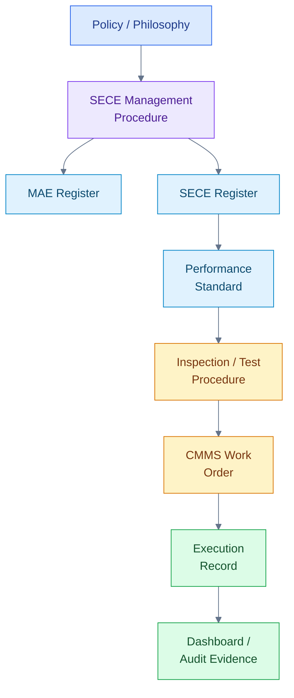

## 7.7 Kesalahan umum dalam dokumentasi SECE

Beberapa kelemahan yang sering ditemukan:

1. SECE Register tidak terhubung dengan MAE.
2. Performance Standard tidak tersedia atau terlalu umum.
3. Test Procedure tidak memiliki acceptance criteria.
4. Test record tidak mencatat hasil aktual, hanya checklist “done”.
5. CMMS task tidak memiliki SECE flag.
6. Bypass log tidak memiliki expiry date.
7. Impairment tidak memiliki risk assessment.
8. MOC tidak memperbarui SECE Register.
9. Audit hanya memeriksa dokumen, bukan kondisi lapangan.
10. Record tersimpan di banyak lokasi dan sulit ditelusuri.
11. Tidak ada owner untuk update dokumen.
12. Dokumen tidak mencerminkan as-built condition.

## 7.8 Practical note untuk engineer

Bagi engineer, pertanyaan dokumentasi yang paling penting adalah:

- Apakah SECE ini ada di register?
- Apakah related MAE-nya jelas?
- Apakah Performance Standard-nya tersedia?
- Apakah test procedure-nya jelas?
- Apakah acceptance criteria-nya terukur?
- Apakah record terakhir valid?
- Apakah status di dashboard sesuai kondisi lapangan?
- Apakah defect atau bypass sudah tercatat?
- Apakah perubahan terakhir sudah masuk MOC?
- Apakah CMMS task masih sesuai dengan Performance Standard?

Jika salah satu jawaban tidak jelas, maka SECE tersebut tidak sepenuhnya terkendali secara manajemen.

## Pesan utama Bab 7

**Dokumen menetapkan requirement; records membuktikan compliance. SECE yang tidak memiliki record valid sebaiknya diperlakukan sebagai unknown health, bukan otomatis healthy.**

[Kembali ke atas](#sece-management-di-industri-petrokimia)

---

# 8. Defect, Impairment, Bypass, dan Overdue pada SECE

SECE Management tidak hanya berbicara tentang bagaimana mengidentifikasi critical element, membuat register, atau menetapkan Performance Standard. Tantangan terbesar justru muncul ketika SECE tidak berada dalam kondisi normal. Dalam operasi harian, kondisi seperti defect, impairment, bypass, inhibit, dan overdue sangat mungkin terjadi. Yang membedakan organisasi yang matang dan organisasi yang lemah bukanlah apakah SECE pernah gagal atau tidak, tetapi bagaimana kegagalan tersebut dikenali, dinilai, dikendalikan, dikomunikasikan, dan ditutup.

Dalam praktik plant, SECE dapat mengalami kegagalan teknis. Gas detector dapat fault. Firewater pump dapat gagal start. ESD valve dapat lambat menutup. PSV dapat overdue test. UPS dapat kehilangan kapasitas battery. Fireproofing dapat rusak. Bund wall dapat retak. Kondisi seperti ini tidak selalu berarti plant harus langsung shutdown. Namun, kondisi tersebut harus dikelola secara formal karena barrier yang diasumsikan dalam risk assessment sedang melemah.

Prinsip pentingnya adalah:

> **SECE boleh mengalami kegagalan teknis, tetapi tidak boleh mengalami kegagalan manajemen.**

Artinya, setiap kondisi tidak normal pada SECE harus diketahui, dinilai risikonya, diberi compensating measure bila diperlukan, disetujui oleh authority yang tepat, dimonitor, dan ditutup dengan corrective action.

## 8.1 Defect pada SECE

**Defect** adalah kondisi kerusakan, anomali, degradasi, atau ketidaksesuaian pada SECE yang dapat memengaruhi kemampuan elemen tersebut memenuhi Performance Standard.

Contoh defect pada SECE:

| SECE           | Contoh Defect                                                       |
| -------------- | ------------------------------------------------------------------- |
| Gas detector   | fault, dirty sensor, failed calibration, response slow              |
| Firewater pump | failed to start, low discharge pressure, diesel engine fault        |
| ESD valve      | slow closing, fail to close, actuator leak, position feedback fault |
| PSV            | leakage, corrosion, set pressure out of tolerance, overdue test     |
| UPS            | weak battery, autonomy failed, charger fault                        |
| Fireproofing   | cracked, detached, missing section                                  |
| Bund wall      | crack, leak path, drain valve not sealing                           |
| SIS loop       | proof test failed, sensor fault, logic discrepancy                  |

Defect pada SECE tidak boleh diperlakukan sama seperti defect equipment biasa. Defect pada utility pump biasa mungkin berdampak pada operability. Defect pada SECE dapat berdampak pada kemampuan plant mengendalikan major accident.

Karena itu, work order untuk defect SECE sebaiknya memiliki identifikasi khusus di CMMS, misalnya:

- SECE flag,
- safety critical priority,
- required completion date,
- approval requirement bila repair ditunda,
- link ke related MAE,
- link ke Performance Standard.

## 8.2 Impairment pada SECE

**Impairment** adalah kondisi ketika SECE tidak dapat memenuhi Performance Standard secara penuh. Impairment bisa terjadi karena equipment rusak, test gagal, fungsi dinonaktifkan, data tidak valid, atau maintenance melewati batas yang ditetapkan.

Status impairment dapat berupa:

| Status      | Penjelasan                                           |
| ----------- | ---------------------------------------------------- |
| Degraded    | SECE masih berfungsi, tetapi performanya menurun     |
| Failed      | SECE tidak mampu menjalankan fungsi                  |
| Unavailable | SECE tidak tersedia saat dibutuhkan                  |
| Bypassed    | Fungsi proteksi dinonaktifkan sementara              |
| Inhibited   | Alarm/trip/detector/logic dinonaktifkan              |
| Overdue     | Test, inspection, atau calibration melewati due date |
| Unknown     | Tidak ada data valid untuk membuktikan kondisi       |

Contoh:

- Gas detector fault berarti fungsi deteksi gas tidak tersedia pada area tersebut.
- Firewater pump gagal start berarti fungsi mitigasi kebakaran melemah.
- ESD valve lambat menutup berarti fungsi isolasi tidak memenuhi response time.
- UPS battery autonomy failed berarti safety system mungkin tidak bertahan saat power failure.
- PSV overdue dapat menjadi impairment bila melewati batas toleransi yang disetujui.
- Fireproofing rusak berarti survivability struktur atau equipment menurun saat fire.

Impairment harus dikaitkan dengan risk scenario. Pertanyaan utamanya bukan hanya “apa yang rusak?”, tetapi:

> **Barrier apa yang melemah, dan Major Accident Event apa yang risikonya meningkat?**

## 8.3 Bypass, Inhibit, dan Override

Dalam operasi plant, bypass atau inhibit kadang diperlukan untuk maintenance, testing, troubleshooting, start-up, shutdown, atau kondisi abnormal tertentu. Namun, bypass pada SECE bukan tindakan administratif biasa. Bypass adalah tindakan yang melemahkan atau menonaktifkan risk barrier.

### Bypass

**Bypass** adalah penonaktifan sementara fungsi proteksi atau interlock sehingga demand tidak menghasilkan action sebagaimana desain normal.

Contoh:

- SIS trip bypassed,
- ESD valve bypassed,
- interlock permissive bypassed,
- shutdown output bypassed.

### Inhibit

**Inhibit** biasanya merujuk pada penonaktifan alarm, detector, input, output, atau channel tertentu pada system logic.

Contoh:

- gas detector inhibited,
- flame detector inhibited,
- F&G output inhibited,
- alarm disabled.

### Override

**Override** adalah tindakan mengalahkan fungsi otomatis atau logic tertentu, biasanya untuk memungkinkan operasi dalam kondisi khusus.

Contoh:

- start-up override,
- permissive override,
- temporary logic override.

Ketiganya harus dikendalikan melalui prosedur formal. Minimum kontrol yang harus ada:

- alasan bypass/inhibit,
- tag dan fungsi yang terdampak,
- related MAE,
- risk assessment,
- approval authority,
- maximum duration,
- compensating measure,
- komunikasi ke shift team,
- tagging atau indication,
- periodic review,
- restoration verification.

Kalimat yang penting untuk diingat:

> **Bypass pada SECE adalah perubahan sementara terhadap risk barrier, bukan sekadar aktivitas instrument atau operations.**

## 8.4 Overdue pada SECE

**Overdue** adalah kondisi ketika test, inspection, calibration, proof test, atau preventive maintenance melewati due date yang ditetapkan.

Overdue pada SECE harus diperlakukan lebih serius daripada overdue PM biasa. Hal ini karena test atau inspection pada SECE bukan sekadar aktivitas pemeliharaan, tetapi merupakan bagian dari assurance bahwa barrier masih efektif.

Contoh overdue yang kritikal:

- gas detector calibration overdue,
- SIS proof test overdue,
- PSV recertification overdue,
- firewater pump performance test overdue,
- ESD valve stroke test overdue,
- UPS battery autonomy test overdue,
- deluge system functional test overdue,
- bund wall inspection overdue.

Namun, overdue tidak selalu otomatis berarti SECE failed. Perusahaan perlu memiliki rule yang jelas:

- overdue dalam grace period mungkin classified as warning,
- overdue melewati batas tertentu menjadi degraded,
- overdue tanpa risk approval menjadi impairment,
- overdue yang kritikal terhadap high-risk MAE harus dieskalasi.

Yang tidak boleh terjadi adalah overdue dibiarkan tanpa visibility, tanpa risk assessment, dan tanpa approval.

## 8.5 Workflow pengelolaan impairment

Berikut workflow praktis untuk mengelola defect, impairment, bypass, atau overdue pada SECE.

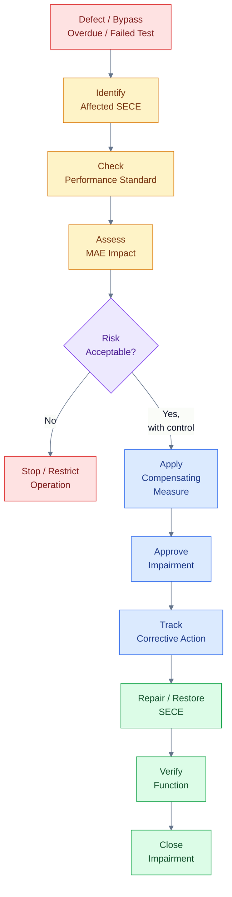

Workflow ini menekankan bahwa impairment bukan hanya masalah maintenance. Operations, Process Safety, HSE, dan management harus memahami dampaknya terhadap risk barrier.

## 8.6 Compensating measure

**Compensating measure** adalah kontrol sementara yang diterapkan ketika SECE tidak memenuhi Performance Standard, dengan tujuan menjaga risiko tetap dalam batas yang dapat diterima sampai SECE dipulihkan.

Contoh compensating measure:

| Kondisi SECE               | Contoh Compensating Measure                                                   |
| -------------------------- | ----------------------------------------------------------------------------- |
| Gas detector fault         | portable gas detector, additional operator patrol                             |
| Firewater pump unavailable | standby fire truck, temporary firewater supply, restrict hot work             |
| ESD valve bypassed         | manual isolation readiness, reduced inventory, operator standby               |
| PSV overdue                | pressure reduction, operating restriction, engineering assessment             |
| UPS autonomy failed        | temporary battery bank, restrict operation, restore priority                  |
| Bund wall damaged          | temporary containment, drain isolation, spill kit standby                     |
| SIS loop inhibited         | additional monitoring, temporary shutdown limit, approval by senior authority |

Compensating measure harus spesifik. Pernyataan umum seperti “operator to monitor” sering tidak cukup. Harus jelas:

- siapa yang memonitor,
- apa yang dimonitor,
- berapa frekuensinya,
- alarm atau indikasi apa yang digunakan,
- tindakan apa yang harus diambil,
- berapa lama compensating measure berlaku,
- siapa yang menyetujui.

## 8.7 Risk acceptance dan approval

Tidak semua orang boleh menyetujui impairment SECE. Approval harus disesuaikan dengan tingkat risiko.

Contoh prinsip approval:

| Tingkat Risiko | Contoh Kondisi                                | Approval                           |
| -------------- | --------------------------------------------- | ---------------------------------- |
| Low            | Minor defect, tidak memengaruhi fungsi utama  | Discipline engineer / supervisor   |
| Medium         | SECE degraded, masih ada redundancy           | Department manager                 |
| High           | SECE unavailable pada area high hazard        | Operations Manager / Plant Manager |
| Very High      | Major barrier hilang tanpa redundancy memadai | Site Director / shutdown decision  |

Risk acceptance harus memiliki batas waktu. Impairment tidak boleh berubah menjadi kondisi permanen hanya karena plant tetap bisa beroperasi.

## 8.8 Kapan operasi harus dibatasi atau dihentikan?

Tidak semua impairment memerlukan shutdown. Namun, operasi harus dibatasi atau dihentikan bila risiko tidak dapat dikendalikan dengan compensating measure yang memadai.

Contoh kondisi yang dapat memerlukan operating restriction atau shutdown:

- firewater system utama tidak tersedia dan tidak ada alternatif memadai,
- SIS critical loop bypassed pada unit high-risk tanpa compensating measure,
- multiple gas detectors failed pada enclosed hydrocarbon area,
- ESD valve gagal menutup pada inventory besar,
- PSV critical unavailable pada vessel bertekanan tanpa relief alternatif,
- containment untuk toxic chemical rusak saat operasi transfer tetap berjalan,
- emergency power untuk safety system tidak tersedia.

Dalam kondisi seperti ini, keputusan teknis harus didukung oleh risk assessment formal, bukan hanya pertimbangan produksi.

## 8.9 Close-out impairment

Impairment tidak boleh ditutup hanya karena work order dinyatakan selesai. Close-out harus membuktikan bahwa fungsi SECE sudah kembali sesuai Performance Standard.

Close-out minimum:

- repair selesai,
- functional test dilakukan,
- acceptance criteria dipenuhi,
- bypass/inhibit direstore,
- temporary compensating measure dihentikan,
- operations diberi informasi,
- record disimpan,
- dashboard diperbarui,
- bila perlu RCA dilakukan.

## Pesan utama Bab 8

**SECE boleh mengalami kegagalan teknis, tetapi tidak boleh mengalami kegagalan manajemen. Setiap impairment harus diketahui, dinilai risikonya, dikompensasi sementara, disetujui, dan ditutup dengan corrective action.**

[Kembali ke atas](#sece-management-di-industri-petrokimia)

---

# 9. Kapan Diperlukan Organisasi Khusus SECE Management?

Tidak semua fasilitas harus memiliki departemen khusus bernama **SECE Management**. Namun, setiap fasilitas berisiko tinggi harus memiliki governance yang jelas untuk memastikan SECE teridentifikasi, dikelola, diuji, dipelihara, dimonitor, dan diverifikasi secara efektif.

Dengan kata lain, yang wajib bukan nama departemennya, tetapi kejelasan:

- accountability,
- ownership,
- competence,
- coordination,
- assurance,
- escalation.

Pada plant kecil atau sederhana, fungsi SECE Management dapat dijalankan oleh Process Safety atau Asset Integrity dengan dukungan maintenance dan operations. Pada plant besar seperti refinery, petrochemical complex, LNG facility, atau offshore installation, biasanya diperlukan fungsi khusus atau minimal **SECE Coordinator / Barrier Management Engineer** yang secara formal mengelola register, dashboard, impairment, action tracking, dan assurance follow-up.

## 9.1 Mengapa organisasi khusus mungkin diperlukan?

SECE Management bersifat multidisiplin. Tidak ada satu departemen yang dapat mengelola seluruh SECE secara efektif.

Contoh:

- PSV berada di area mechanical/inspection.
- SIS dan F&G berada di area instrument.
- UPS dan emergency power berada di area electrical.
- Firewater pump berada di area mechanical dan fire protection.
- Bund wall dan fireproofing berada di area civil/structural.
- Bypass dan impairment banyak dikendalikan oleh operations.
- Major Accident Event dan barrier basis berada di area Process Safety.
- CMMS task berada di maintenance planning.
- MOC berada di engineering/project.
- Assurance dan verification memerlukan fungsi independen.

Jika tidak ada governance yang jelas, maka SECE mudah jatuh di antara banyak fungsi. Semua pihak merasa terlibat, tetapi tidak ada yang benar-benar accountable.

## 9.2 Kapan diperlukan fungsi khusus SECE?

Organisasi khusus atau fungsi khusus SECE Management sangat disarankan bila fasilitas memiliki salah satu atau beberapa kondisi berikut:

- plant memiliki major accident hazard tinggi,
- inventory hydrocarbon atau toxic chemical besar,
- jumlah SECE banyak,
- SIS, F&G, ESD, firewater, dan relief system kompleks,
- banyak bypass atau inhibit,
- banyak overdue SECE task,
- plant ageing,
- banyak modification atau MOC,
- unit sering mengalami start-up/shutdown,
- turnaround besar,
- regulatory exposure tinggi,
- ada requirement safety case atau major hazard facility,
- pernah terjadi serious near miss atau major incident,
- ada kelemahan audit terkait barrier health,
- CMMS data belum reliable,
- SECE Register belum terintegrasi dengan maintenance.

Bila kondisi di atas ada, mengandalkan koordinasi informal biasanya tidak cukup. Diperlukan struktur formal, meeting rutin, KPI, dashboard, dan escalation route.

## 9.3 Prinsip accountability dan responsibility

Dalam SECE Management, penting membedakan **accountable** dan **responsible**.

- **Accountable** adalah pihak yang memiliki tanggung jawab akhir atas efektivitas SECE Management.
- **Responsible** adalah pihak yang melaksanakan aktivitas tertentu, seperti test, inspection, repair, review, atau reporting.

Contoh:

| Area                 | Accountable                               | Responsible                              |
| -------------------- | ----------------------------------------- | ---------------------------------------- |
| Overall SECE health  | Plant Manager / Site Director             | SECE Coordinator, Department Managers    |
| Performance Standard | Process Safety / Technical Safety Manager | Discipline engineers                     |
| PM execution         | Maintenance Manager                       | Mechanical, Electrical, Instrument teams |
| Bypass control       | Operations Manager                        | Shift Supervisor, Control Room Operator  |
| SIS proof test       | Instrument Manager                        | Instrument engineer/technician           |
| Firewater pump test  | Maintenance Manager                       | Mechanical team                          |
| Audit/verification   | Site Management                           | Independent assurance/audit team         |

Tanpa pembagian ini, organisasi sering terjebak dalam kalimat “semua bertanggung jawab”, yang pada praktiknya berarti tidak ada yang benar-benar bertanggung jawab.

## 9.4 Struktur minimum organisasi SECE Management

Struktur minimum untuk plant berisiko tinggi dapat digambarkan sebagai berikut.

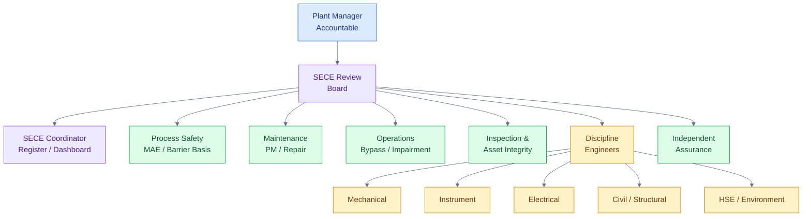

Struktur ini tidak harus menjadi departemen baru. Yang penting adalah fungsi-fungsinya ada, perannya jelas, dan forum pengambilan keputusan berjalan.

## 9.5 Peran masing-masing fungsi

| Fungsi                            | Peran dalam SECE Management                                                |
| --------------------------------- | -------------------------------------------------------------------------- |
| Plant Manager / Site Director     | Accountable atas SECE health dan keputusan risk acceptance tinggi          |
| Process Safety / Technical Safety | Menetapkan metodologi, MAE, Bowtie, Performance Standard                   |
| Maintenance                       | Menjalankan PM, testing, repair, backlog control                           |
| Inspection / Asset Integrity      | Menentukan inspection strategy, degradation mechanism, RBI                 |
| Operations                        | Mengelola bypass, inhibit, impairment, compensating measure                |
| Instrument                        | Mengelola SIS, ESD, F&G, detector, proof test                              |
| Electrical                        | Mengelola UPS, emergency power, emergency lighting                         |
| Mechanical                        | Mengelola PSV, firewater pump, valves, rotating/static equipment           |
| Civil/Structural                  | Mengelola fireproofing, bund wall, blast wall, critical support            |
| HSE/Environment                   | Mengelola environmental critical barriers dan emergency response interface |
| Reliability                       | Menganalisis failure trend, bad actor, KPI, RCA                            |
| MOC Coordinator                   | Melakukan SECE impact screening pada perubahan                             |
| SECE Coordinator                  | Mengelola register, dashboard, action tracking, reporting                  |
| Independent Assurance             | Melakukan audit dan verification                                           |

## 9.6 SECE Coordinator: apakah perlu?

Untuk plant dengan jumlah SECE yang besar, posisi **SECE Coordinator** atau **Barrier Management Engineer** sangat bermanfaat.

Peran utamanya:

- menjaga SECE Register tetap valid,
- memastikan SECE link ke MAE dan Performance Standard,
- memantau overdue SECE task,
- memantau active bypass/inhibit,
- memantau impaired SECE,
- mengelola dashboard,
- menyiapkan SECE Review Meeting,
- melakukan action tracking,
- memastikan MOC memperbarui SECE document,
- memfasilitasi audit dan verification,
- menghubungkan Process Safety, Maintenance, Operations, dan Discipline Engineers.

SECE Coordinator tidak menggantikan owner teknis. PSV tetap dimiliki oleh Mechanical/Inspection. SIS tetap dimiliki oleh Instrument/Functional Safety. Firewater pump tetap dimiliki oleh Mechanical/Fire Protection. SECE Coordinator memastikan semua owner bekerja dalam satu sistem yang terintegrasi.

## 9.7 Forum yang disarankan

SECE Management memerlukan forum rutin. Tanpa forum, dashboard tidak akan menghasilkan tindakan.

Forum yang disarankan:

| Forum                               | Fokus                                                    |
| ----------------------------------- | -------------------------------------------------------- |
| SECE Review Meeting                 | Status umum SECE, action tracking, KPI                   |
| Barrier Health Review               | Status barrier per MAE atau per unit                     |
| Bypass/Inhibit Review               | Active bypass, expiry date, risk control                 |
| Overdue Critical Maintenance Review | PM, inspection, proof test, calibration overdue          |
| Impairment Review                   | SECE degraded, failed, unavailable, compensating measure |
| MOC Review                          | Dampak perubahan terhadap SECE dan barrier               |
| Turnaround SECE Readiness Review    | Scope SECE saat TA, critical punch list                  |
| Management Review                   | Escalation, risk acceptance, resource allocation         |

## 9.8 RACI sederhana untuk SECE Management

RACI dapat digunakan untuk memperjelas peran.

- **R = Responsible**
- **A = Accountable**
- **C = Consulted**
- **I = Informed**

| Aktivitas                    | Plant Manager | Process Safety | Operations | Maintenance | Discipline Eng. | SECE Coord. | Assurance |
| ---------------------------- | ------------- | -------------- | ---------- | ----------- | --------------- | ----------- | --------- |
| Define SECE methodology      | A             | R              | C          | C           | C               | R           | C         |
| Maintain SECE Register       | I             | C              | C          | C           | C               | R           | C         |
| Approve Performance Standard | I             | A/R            | C          | C           | R               | C           | C         |
| Execute PM/Test              | I             | C              | I          | A/R         | R               | I           | I         |
| Approve bypass               | C/A\*         | C              | A/R        | C           | C               | I           | I         |
| Manage impairment            | A\*           | C              | R          | R           | C               | R           | I         |
| Conduct audit                | I             | C              | C          | C           | C               | C           | A/R       |
| Management review            | A             | R              | R          | R           | R               | R           | C         |

Catatan: tanda **A\*** bergantung pada tingkat risiko. Untuk impairment risiko tinggi, Plant Manager atau Site Director dapat menjadi approval authority.

## 9.9 Kesalahan umum organisasi

Beberapa kelemahan organisasi yang sering ditemukan:

1. SECE dianggap hanya tanggung jawab HSE.
2. Maintenance menjalankan test, tetapi tidak memahami related MAE.
3. Operations melakukan bypass tanpa escalation yang memadai.
4. Process Safety membuat register, tetapi tidak terhubung ke CMMS.
5. Engineering melakukan MOC tanpa update SECE Register.
6. Audit menemukan overdue, tetapi tidak ada owner action.
7. Dashboard dibuat, tetapi tidak dibahas dalam forum management.
8. Independent assurance tidak cukup independen.
9. Tidak ada competency requirement untuk pekerjaan SECE.
10. Tidak ada escalation route untuk critical impairment.

## Pesan utama Bab 9

**Yang wajib bukan nama departemennya, tetapi kejelasan accountability, ownership, assurance, dan escalation.**

[Kembali ke atas](#sece-management-di-industri-petrokimia)

---

# 10. SECE Management vs Barrier Management

Istilah **SECE Management** dan **Barrier Management** sering digunakan dalam diskusi process safety. Keduanya saling terkait, tetapi tidak sama. Memahami perbedaannya penting agar organisasi tidak menyamakan semua barrier dengan SECE, atau sebaliknya menganggap SECE hanya sebagai daftar equipment.

Secara sederhana:

> **Barrier Management adalah payung besar untuk mengelola seluruh lapisan proteksi terhadap major accident.** > **SECE Management adalah pengelolaan elemen kritikal dari barrier tersebut.**

Dengan kata lain, semua SECE adalah critical barrier atau bagian dari critical barrier. Namun, tidak semua barrier otomatis menjadi SECE.

## 10.1 Apa itu Barrier?

**Barrier** adalah lapisan perlindungan yang mencegah suatu hazard berkembang menjadi top event, atau mengurangi konsekuensi setelah top event terjadi.

Dalam bowtie, barrier biasanya ditempatkan di dua sisi:

- preventive barrier di sisi kiri, sebelum top event,
- mitigative barrier di sisi kanan, setelah top event.

Contoh:

| Jenis Barrier         | Contoh                                                     |
| --------------------- | ---------------------------------------------------------- |
| Preventive barrier    | pressure control, high-high trip, PSV, operating procedure |
| Detection barrier     | gas detector, flame detector, alarm                        |
| Control barrier       | ESD, isolation valve, shutdown system                      |
| Mitigative barrier    | firewater, deluge, fireproofing, emergency response        |
| Environmental barrier | bund wall, drain isolation, containment pond               |

Barrier dapat berupa hardware, software, structure, procedure, atau human action. Namun, agar efektif, barrier harus jelas fungsinya, memiliki owner, dapat diverifikasi, dan memiliki kontrol terhadap faktor degradasi.

## 10.2 Apa itu Barrier Management?

**Barrier Management** adalah pendekatan sistematis untuk memastikan seluruh barrier pengendali major accident tetap efektif, tersedia, independen, dan dapat diverifikasi.

Barrier Management biasanya mencakup:

- identifikasi major accident hazard,
- bowtie analysis,
- identifikasi preventive dan mitigative barrier,
- identifikasi degradation factor,
- identifikasi degradation control,
- penetapan barrier owner,
- monitoring barrier health,
- audit barrier effectiveness,
- review setelah incident atau near miss.

Diagram berikut menunjukkan konsep Barrier Management secara sederhana.

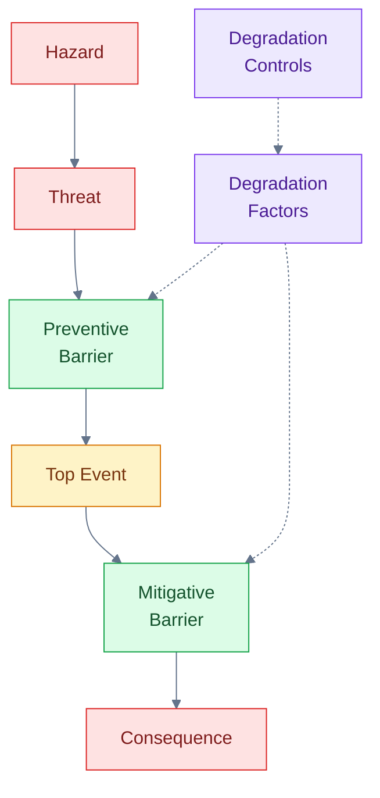

## 10.3 Apa itu SECE Management?

**SECE Management** lebih spesifik. Fokusnya adalah mengelola elemen yang dikategorikan safety atau environmental critical.

SECE Management mencakup:

- SECE Register,
- Performance Standard,
- inspection/testing/maintenance task,
- CMMS integration,
- impairment management,
- bypass/inhibit control,
- defect management,
- verification,
- KPI/dashboard,
- audit evidence.

Jika Barrier Management menjawab pertanyaan:

> **Apa saja barrier yang mengendalikan major accident, dan apakah barrier tersebut efektif?**

Maka SECE Management menjawab pertanyaan:

> **Elemen kritikal apa yang membentuk barrier tersebut, dan apakah elemen itu sehat, teruji, serta memenuhi Performance Standard?**

## 10.4 Perbandingan SECE Management dan Barrier Management

| Aspek         | Barrier Management                            | SECE Management                                         |
| ------------- | --------------------------------------------- | ------------------------------------------------------- |
| Cakupan       | Semua barrier pengendali MAE                  | Barrier yang dikategorikan safety/environment critical  |
| Fokus         | Efektivitas lapisan proteksi                  | Integritas elemen kritikal                              |
| Basis utama   | Bowtie, MAE, threat, top event, consequence   | SECE Register, Performance Standard, assurance task     |
| Jenis kontrol | Hardware, software, procedure, human action   | Equipment, system, component, structure, logic, utility |
| Output        | Barrier health status                         | SECE health status                                      |
| Owner         | Barrier owner / risk owner                    | SECE owner / discipline owner                           |
| Contoh        | procedure, alarm, operator response, PSV, SIS | PSV, SIS, ESD, F&G, firewater, containment              |

## 10.5 Contoh: tank overfill

Skenario:

- Hazard: flammable liquid inventory.
- Threat: wrong line-up, level transmitter failure, high transfer rate, operator error.
- Top Event: tank overfill.
- Consequence: spill, vapor cloud, fire, environmental release.

### Dalam Barrier Management

Barrier Management akan melihat seluruh lapisan proteksi:

| Barrier                          | Jenis                             |
| -------------------------------- | --------------------------------- |
| Transfer procedure               | Preventive / procedural           |
| Operator monitoring              | Preventive / human action         |
| Level control                    | Preventive / control              |
| High level alarm                 | Detection                         |
| Independent high-high level trip | Preventive / automatic protection |
| Inlet shutdown valve             | Control / isolation               |
| Bund wall                        | Mitigative / containment          |
| Drain isolation                  | Environmental mitigation          |
| Foam system                      | Fire mitigation                   |
| Emergency response               | Mitigative                        |

### Dalam SECE Management

SECE Management akan fokus pada elemen yang paling kritikal, misalnya:

| SECE                             | Fungsi                          |
| -------------------------------- | ------------------------------- |
| Independent high-high level trip | Mencegah overfill               |
| SIS logic                        | Memproses trip                  |
| Inlet shutdown valve             | Menghentikan transfer           |
| Bund wall                        | Menahan spill                   |
| Drain isolation valve            | Mencegah release ke environment |
| Foam/firewater system            | Mitigasi fire escalation        |

Transfer procedure dan operator monitoring mungkin tetap penting sebagai barrier, tetapi belum tentu dikategorikan sebagai SECE kecuali organisasi secara eksplisit menetapkannya sebagai critical procedural barrier dengan assurance yang memadai.

## 10.6 Contoh: hydrocarbon gas release

Skenario:

- Hazard: hydrocarbon gas under pressure.
- Threat: compressor seal failure.
- Top Event: gas release.
- Consequence: explosion.

### Barrier Management mencakup:

- seal monitoring,
- routine inspection,
- gas detection,
- ventilation,
- F&G logic,
- ESD,
- ignition source control,
- emergency response.

### SECE Management dapat mencakup:

- gas detector,
- F&G logic,
- ESD valve,
- compressor trip,
- emergency power/UPS,
- deluge system,
- firewater pump.

Dalam contoh ini, Barrier Management memberi gambaran seluruh lapisan proteksi. SECE Management memastikan elemen kritikalnya diuji, dipelihara, dan dimonitor.

## 10.7 Mengapa perbedaan ini penting?

Perbedaan ini penting karena jika semua barrier diperlakukan sebagai SECE, sistem akan menjadi terlalu besar dan sulit dikelola. Sebaliknya, jika SECE diperlakukan hanya sebagai equipment list, organisasi kehilangan hubungan dengan risk scenario.

Pendekatan yang baik adalah:

1. Gunakan Barrier Management untuk memahami seluruh risk control.
2. Gunakan SECE Management untuk mengelola elemen yang paling kritikal.
3. Pastikan semua SECE memiliki Performance Standard.
4. Pastikan barrier non-SECE tetap memiliki owner dan degradation control.
5. Gunakan dashboard untuk melihat health status barrier dan SECE.

## 10.8 Hubungan konseptual

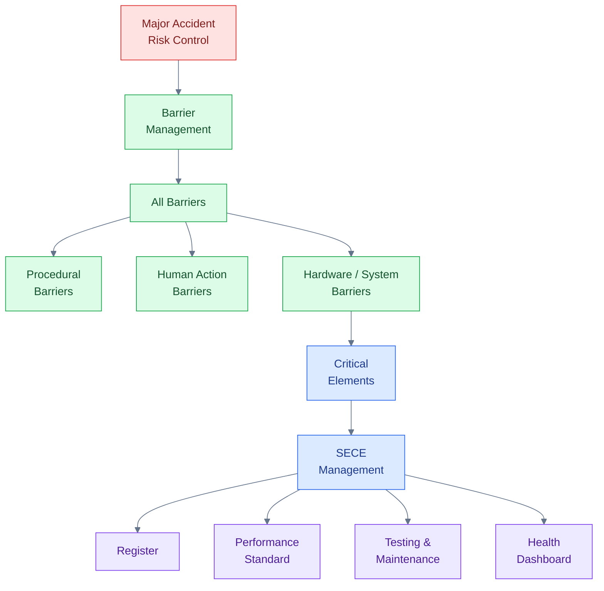

## Pesan utama Bab 10

**Semua SECE adalah critical barrier, tetapi tidak semua barrier otomatis menjadi SECE.**

[Kembali ke atas](#sece-management-di-industri-petrokimia)

---

# 11. KPI, Dashboard, dan Assurance SECE

SECE Management harus menghasilkan visibility. Management tidak cukup hanya mengetahui bahwa program SECE sudah ada. Management harus dapat melihat status aktual SECE: mana yang healthy, mana yang degraded, mana yang failed, mana yang bypassed, mana yang overdue, dan mana yang unknown.

Tanpa KPI dan dashboard, SECE Management mudah berubah menjadi program administratif. Dokumen ada, register ada, prosedur ada, tetapi kondisi aktual barrier tidak terlihat. Dalam plant berisiko tinggi, kondisi seperti ini berbahaya karena management dapat memiliki false confidence.

Tujuan KPI dan dashboard adalah memberikan jawaban cepat terhadap pertanyaan:

> **Apakah critical elements yang melindungi plant dari major accident sedang sehat?**

## 11.1 SECE health status

Status SECE harus sederhana, konsisten, dan mudah dipahami. Status yang terlalu kompleks akan sulit digunakan oleh management dan shift team.

Status minimum yang disarankan:

| Status             | Makna                                           |
| ------------------ | ----------------------------------------------- |
| Healthy            | SECE memenuhi Performance Standard              |
| Degraded           | SECE masih berfungsi tetapi performanya menurun |
| Failed             | SECE tidak mampu menjalankan fungsi             |
| Bypassed/Inhibited | Fungsi proteksi dinonaktifkan sementara         |
| Overdue            | Test/inspection melewati due date               |
| Unknown            | Tidak ada data valid untuk membuktikan kondisi  |

Status **unknown** sangat penting. Banyak organisasi hanya mengenal healthy atau failed. Padahal, bila tidak ada test record valid, tidak ada calibration record, atau kondisi field tidak dapat diverifikasi, maka status SECE seharusnya tidak dianggap healthy.

Prinsipnya:

> **No valid evidence means unknown health.**

## 11.2 Leading dan lagging indicators

KPI SECE dapat dibagi menjadi dua kelompok: **leading indicators** dan **lagging indicators**.

### Leading indicators

Leading indicators menunjukkan kondisi yang dapat memberi peringatan sebelum barrier gagal saat demand.

Contoh:

- % SECE PM completed on time,
- jumlah overdue SECE tests,
- jumlah active bypass/inhibit,
- jumlah impaired SECE,
- jumlah overdue PSV recertification,
- jumlah overdue SIS proof test,
- jumlah overdue gas detector calibration,
- jumlah SECE dengan status unknown,
- jumlah compensating measure aktif,
- jumlah MOC yang memengaruhi SECE.

### Lagging indicators

Lagging indicators menunjukkan kegagalan atau kelemahan yang sudah terjadi.

Contoh:

- firewater pump failed to start,
- ESD valve failed to close,
- SIS proof test failure,
- gas detector failed calibration,
- PSV failed pop test,
- SECE failed on demand,
- loss of containment involving barrier failure,
- emergency system failed during drill,
- impairment exceeded approved duration.

Keduanya diperlukan. Leading indicator membantu mencegah kejadian. Lagging indicator membantu organisasi belajar dari kegagalan yang sudah terjadi.

## 11.3 Formula KPI dasar

Beberapa KPI SECE dapat dihitung dengan formula sederhana.

### SECE PM compliance

$$
SECE\ PM\ Compliance =
\frac{SECE\ PM\ Completed\ On\ Time}{Total\ SECE\ PM\ Due}
\times 100\%
$$

KPI ini menunjukkan persentase preventive maintenance SECE yang diselesaikan tepat waktu.

### SECE proof test compliance

$$
Proof\ Test\ Compliance =
\frac{Proof\ Tests\ Completed\ On\ Time}{Total\ Proof\ Tests\ Due}
\times 100\%
$$

KPI ini penting untuk SIS, SIF, ESD, F&G, gas detector, dan safety trip.

### Overdue SECE ratio

$$
Overdue\ SECE\ Ratio =
\frac{Number\ of\ Overdue\ SECE\ Tasks}{Total\ SECE\ Tasks\ Due}
\times 100\%
$$

KPI ini menunjukkan proporsi pekerjaan SECE yang melewati due date.

### SECE impairment rate

$$
SECE\ Impairment\ Rate =
\frac{Number\ of\ Impaired\ SECE}{Total\ Number\ of\ SECE}
\times 100\%
$$

KPI ini membantu melihat seberapa besar critical element yang sedang tidak memenuhi Performance Standard.

### Bypass exposure

Untuk bypass, jumlah saja tidak cukup. Durasi bypass juga penting. Formula sederhana:

$$
Bypass\ Exposure =
\sum_{i=1}^{n} Duration\ of\ Active\ Bypass_i
$$

Atau dapat dinormalisasi:

$$
Normalized\ Bypass\ Exposure =
\frac{\sum Bypass\ Duration}{Total\ Operating\ Hours}
\times 100\%
$$

KPI ini membantu membedakan antara satu bypass selama dua jam dan satu bypass yang dibiarkan selama tiga minggu.

### Unknown health ratio

$$
Unknown\ Health\ Ratio =
\frac{Number\ of\ SECE\ with\ Unknown\ Status}{Total\ Number\ of\ SECE}
\times 100\%
$$

KPI ini sangat berguna untuk plant yang baru membangun SECE Management, karena kelemahan awal biasanya bukan hanya failed equipment, tetapi kurangnya bukti valid.

## 11.4 Dashboard SECE

Dashboard SECE harus sederhana, visual, dan action-oriented. Dashboard bukan hanya laporan statistik. Dashboard harus membantu management mengambil keputusan.

Minimum informasi dalam dashboard:

| Area                  | Informasi                                                    |
| --------------------- | ------------------------------------------------------------ |
| Overall SECE Health   | jumlah healthy, degraded, failed, bypassed, overdue, unknown |
| Critical Impairment   | daftar SECE failed/unavailable pada high-risk MAE            |
| Active Bypass/Inhibit | tag, reason, start date, expiry date, approval               |
| Overdue Task          | PM, inspection, calibration, proof test overdue              |
| Failed Test           | hasil test yang tidak memenuhi acceptance criteria           |
| Corrective Action     | action owner, due date, status                               |
| Compensating Measure  | kontrol sementara yang aktif                                 |
| Trend                 | perbandingan minggu/bulan sebelumnya                         |

Contoh tampilan dashboard sederhana:

| Status             | Jumlah | Warna     |
| ------------------ | -----: | --------- |
| Healthy            |    420 | Green     |
| Degraded           |     18 | Yellow    |
| Failed             |      3 | Red       |
| Bypassed/Inhibited |      7 | Red/Amber |
| Overdue            |     22 | Amber     |
| Unknown            |     15 | Grey      |

Status warna dapat digunakan untuk memudahkan komunikasi:

- Green = acceptable,
- Yellow/Amber = attention required,
- Red = immediate action/escalation,
- Grey = unknown, evidence required.

## 11.5 Diagram alur dashboard dan assurance

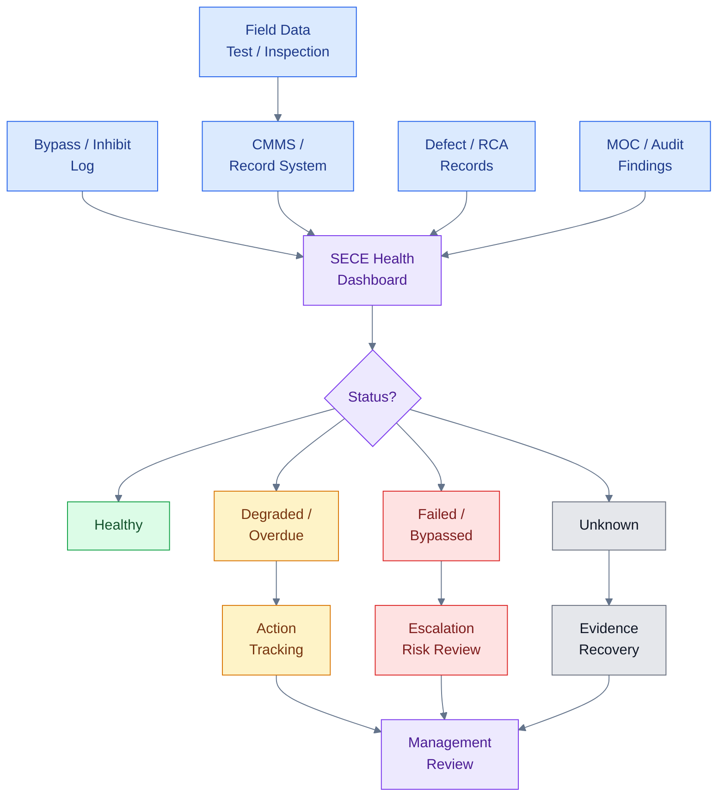

Dashboard yang baik harus mengambil data dari sistem yang valid, bukan hanya manual input. Sumber data dapat berasal dari CMMS, bypass log, inspection system, calibration system, MOC register, audit finding, dan defect/RCA database.

## 11.6 Assurance SECE

**Assurance** adalah proses untuk memperoleh keyakinan bahwa SECE benar-benar memenuhi Performance Standard. Assurance tidak sama dengan sekadar melakukan PM. PM adalah aktivitas. Assurance adalah pembuktian bahwa aktivitas tersebut efektif.

Assurance dapat dilakukan melalui:

- inspection,
- functional test,
- proof test,
- calibration,
- performance test,
- field verification,
- document review,
- audit,
- independent verification,
- drill atau emergency exercise,
- management review.

Contoh assurance:

| SECE           | Assurance Activity    | Evidence                         |
| -------------- | --------------------- | -------------------------------- |
| Firewater pump | performance test      | flow/pressure test record        |
| Gas detector   | calibration/bump test | calibration certificate          |
| SIS loop       | proof test            | proof test report                |
| ESD valve      | stroke test           | stroke time record               |
| UPS            | autonomy test         | battery autonomy report          |
| Bund wall      | inspection            | civil inspection checklist       |
| Fireproofing   | condition inspection  | inspection report/photo evidence |

## 11.7 Assurance tidak boleh hanya administratif

Audit SECE yang hanya memeriksa keberadaan dokumen tidak cukup. Assurance harus melihat tiga hal:

1. **Document adequacy**
   Apakah Performance Standard, procedure, dan register tersedia serta memadai?

2. **Field condition**
   Apakah kondisi aktual di lapangan sesuai dengan dokumen?

3. **Record evidence**
   Apakah ada record valid yang membuktikan test/inspection telah dilakukan dan hasilnya memenuhi acceptance criteria?

Contoh audit yang baik:

- Pilih satu gas detector di SECE Register.
- Cek related MAE dan barrier function.
- Cek Performance Standard.
- Cek calibration record.
- Cek apakah detector inhibited atau tidak.
- Cek field condition.
- Cek Cause & Effect linkage.
- Cek apakah alarm/trip action sesuai.
- Cek overdue status di CMMS.
- Cek bila ada defect, apakah sudah close.

Dengan cara ini, audit menguji efektivitas SECE Management, bukan hanya kelengkapan dokumen.

## 11.8 Review frequency

Frekuensi review harus disesuaikan dengan risiko.

Contoh:

| Review                           | Frekuensi Disarankan                        |
| -------------------------------- | ------------------------------------------- |
| Active bypass/inhibit review     | Harian atau per shift untuk critical bypass |
| Critical impairment review       | Harian sampai restored                      |
| Overdue SECE task review         | Mingguan                                    |
| SECE dashboard review            | Bulanan                                     |
| Management review                | Bulanan atau triwulanan                     |
| Independent audit                | Tahunan atau risk-based                     |
| Full SECE Register review        | Periodic atau setelah major modification    |
| Turnaround SECE readiness review | Sebelum start-up                            |

Semakin tinggi risiko impairment, semakin sering review harus dilakukan.

## 11.9 Threshold dan escalation

Dashboard harus memiliki threshold yang jelas. Tanpa threshold, KPI hanya menjadi angka.

Contoh threshold:

| KPI                    | Green |               Amber |                   Red |
| ---------------------- | ----: | ------------------: | --------------------: |
| SECE PM compliance     | ≥ 98% |            95–97.9% |                 < 95% |
| Active critical bypass |     0 |   1 dengan approval |       >1 atau expired |
| Failed critical SECE   |     0 | 1 dengan mitigation | >1 atau no mitigation |
| Unknown health ratio   |  < 1% |                1–5% |                  > 5% |
| Overdue proof test     |     0 |   approved deferral |    unapproved overdue |

Nilai threshold harus ditetapkan berdasarkan risk profile perusahaan. Yang penting adalah setiap red status harus memiliki escalation dan action owner.

## 11.10 Kesalahan umum KPI dan dashboard

Beberapa kesalahan umum:

1. KPI hanya menghitung jumlah PM selesai, bukan kualitas hasil test.
2. Failed test tidak muncul di dashboard.
3. Bypass dihitung jumlahnya tetapi tidak durasinya.
4. Unknown status dianggap healthy.
5. Dashboard tidak terhubung ke MAE.
6. KPI tidak dibahas dalam management review.
7. Tidak ada threshold red/amber/green.
8. Corrective action tidak ditrack sampai close.
9. Data CMMS tidak valid.
10. Tidak ada audit terhadap akurasi dashboard.

## 11.11 Practical rule untuk dashboard SECE

Dashboard SECE yang baik harus menjawab lima pertanyaan:

1. SECE mana yang tidak healthy?
2. Major Accident Event apa yang terdampak?
3. Apa compensating measure yang aktif?
4. Siapa action owner?
5. Kapan SECE akan kembali normal?

Jika dashboard tidak dapat menjawab lima pertanyaan ini, dashboard tersebut belum cukup untuk mengelola risiko.

## Pesan utama Bab 11

**SECE Management harus menghasilkan visibility. Management harus dapat melihat SECE mana yang healthy, degraded, failed, bypassed, overdue, atau unknown.**

[Kembali ke atas](#sece-management-di-industri-petrokimia)

---

# 12. Glossary dan Checklist Praktis untuk Engineer

Bab ini merangkum istilah penting dan checklist praktis yang dapat digunakan oleh engineer saat melakukan review dokumen, inspeksi lapangan, maintenance planning, troubleshooting, MOC, turnaround preparation, atau audit SECE.

Tujuan utamanya adalah membantu engineer menghubungkan empat hal yang sering terpisah dalam praktik sehari-hari:

> **Tag equipment → fungsi barrier → major accident scenario → status aktual di lapangan**

Jika engineer hanya melihat tag equipment tanpa memahami fungsi barrier-nya, maka SECE Management akan berubah menjadi administrasi equipment biasa. Sebaliknya, jika engineer memahami hubungan antara equipment, skenario kecelakaan besar, Performance Standard, dan kondisi aktual, maka SECE Management menjadi alat nyata untuk menjaga keselamatan fasilitas.

## 12.1 Glossary Istilah Penting

| Istilah                   | Definisi Praktis                                                                                                                                                                                                               |
| ------------------------- | ------------------------------------------------------------------------------------------------------------------------------------------------------------------------------------------------------------------------------ |
| **SECE**                  | Safety and Environmental Critical Element; elemen kritikal yang berfungsi mencegah, mendeteksi, mengendalikan, atau memitigasi Major Accident Event, termasuk dampak terhadap keselamatan dan lingkungan.                      |
| **SCE**                   | Safety Critical Element; elemen kritikal terhadap keselamatan. Dalam beberapa organisasi digunakan hampir sama dengan SECE, tetapi SECE secara eksplisit memasukkan aspek lingkungan.                                          |
| **Element**               | Equipment, system, component, structure, software, utility, atau function yang menjalankan fungsi barrier kritikal.                                                                                                            |
| **MAE**                   | Major Accident Event; kejadian besar seperti fire, explosion, toxic release, overpressure, loss of containment, atau major environmental release.                                                                              |
| **MAH**                   | Major Accident Hazard; sumber bahaya yang dapat menyebabkan Major Accident Event.                                                                                                                                              |
| **Hazard**                | Sumber energi atau kondisi berbahaya, misalnya hidrokarbon bertekanan, bahan kimia toksik, reaksi eksotermik, tekanan tinggi, atau temperatur tinggi.                                                                          |
| **Threat**                | Penyebab potensial yang dapat membuat hazard berkembang menjadi top event, misalnya korosi, valve salah posisi, instrument failure, human error, atau blocked outlet.                                                          |
| **Top Event**             | Titik kehilangan kendali terhadap hazard, misalnya loss of containment, overpressure, tank overfill, atau loss of reaction control.                                                                                            |
| **Consequence**           | Dampak setelah top event terjadi, misalnya kebakaran, ledakan, paparan toksik, pencemaran lingkungan, atau kerusakan fasilitas.                                                                                                |
| **Barrier**               | Lapisan proteksi yang mencegah top event atau mengurangi dampaknya.                                                                                                                                                            |
| **Preventive Barrier**    | Barrier yang bekerja sebelum top event untuk mencegah kejadian terjadi.                                                                                                                                                        |
| **Mitigative Barrier**    | Barrier yang bekerja setelah top event untuk mengurangi konsekuensi.                                                                                                                                                           |
| **Detection Barrier**     | Barrier yang mendeteksi kondisi abnormal atau berbahaya, misalnya gas detector, flame detector, smoke detector, atau alarm kritikal.                                                                                           |
| **Control Barrier**       | Barrier yang mengendalikan atau membatasi eskalasi, misalnya ESD, shutdown valve, blowdown, atau trip system.                                                                                                                  |
| **Environmental Barrier** | Barrier yang mencegah atau membatasi dampak lingkungan, misalnya bund wall, drain isolation, containment pond, atau spill response system.                                                                                     |
| **Bowtie**                | Metode visual untuk memetakan hazard, threat, top event, consequence, preventive barrier, mitigative barrier, dan degradation factor.                                                                                          |
| **Performance Standard**  | Kriteria minimum yang harus dipenuhi SECE agar dianggap mampu menjalankan fungsi safety atau environmental protection.                                                                                                         |
| **Assurance**             | Aktivitas untuk membuktikan bahwa SECE bekerja sesuai Performance Standard, misalnya test, inspection, calibration, proof test, audit, atau verification.                                                                      |
| **Verification**          | Review independen atau semi-independen untuk memastikan SECE suitable, efektif, dan tetap dalam kondisi sesuai requirement. HSE memiliki guidance khusus terkait verification suitability Safety Critical Elements. ([HSE][1]) |
| **Defect**                | Kerusakan, anomali, atau ketidaksesuaian pada SECE.                                                                                                                                                                            |
| **Impairment**            | Kondisi ketika SECE tidak dapat memenuhi Performance Standard secara penuh.                                                                                                                                                    |
| **Degraded**              | SECE masih berfungsi, tetapi performanya menurun atau tidak sepenuhnya sesuai requirement.                                                                                                                                     |
| **Failed**                | SECE tidak mampu menjalankan fungsi kritikalnya.                                                                                                                                                                               |
| **Unavailable**           | SECE tidak tersedia saat dibutuhkan, misalnya karena out of service, isolated, atau under maintenance.                                                                                                                         |
| **Bypass**                | Penonaktifan sementara fungsi proteksi atau interlock.                                                                                                                                                                         |
| **Inhibit**               | Penonaktifan alarm, trip, detector, input, output, atau logic tertentu.                                                                                                                                                        |
| **Override**              | Tindakan mengalahkan fungsi otomatis atau logic tertentu untuk kondisi sementara.                                                                                                                                              |
| **Compensating Measure**  | Kontrol sementara untuk menjaga risiko tetap dapat diterima saat SECE impaired, bypassed, failed, atau unavailable.                                                                                                            |
| **CMMS**                  | Computerized Maintenance Management System, misalnya SAP PM, Maximo, atau sistem maintenance lain.                                                                                                                             |
| **MOC**                   | Management of Change; proses pengendalian perubahan agar modifikasi tidak melemahkan barrier atau SECE.                                                                                                                        |
| **SIS**                   | Safety Instrumented System; sistem instrumentasi yang menjalankan Safety Instrumented Function.                                                                                                                                |
| **SIF**                   | Safety Instrumented Function; fungsi proteksi instrumented yang terdiri dari sensor, logic solver, dan final element.                                                                                                          |
| **SIL**                   | Safety Integrity Level; tingkat integrity yang diperlukan untuk suatu SIF berdasarkan risk reduction requirement.                                                                                                              |
| **IPL**                   | Independent Protection Layer; lapisan proteksi independen yang dikreditkan dalam LOPA.                                                                                                                                         |
| **ESD**                   | Emergency Shutdown System; sistem shutdown untuk membawa plant atau bagian plant ke kondisi aman.                                                                                                                              |
| **F&G**                   | Fire and Gas Detection System; sistem deteksi api dan gas yang dapat memberikan alarm atau executive action.                                                                                                                   |
| **C&E**                   | Cause and Effect; dokumen yang menjelaskan hubungan antara cause/input dan effect/output pada sistem proteksi.                                                                                                                 |
| **Unknown Health**        | Status ketika tidak ada bukti valid untuk menyatakan SECE healthy atau failed. Dalam SECE Management, unknown tidak boleh dianggap healthy.                                                                                    |
| **Barrier Health**        | Status efektivitas barrier berdasarkan kondisi element, test record, defect, bypass, overdue, dan impairment.                                                                                                                  |
| **Criticality**           | Tingkat kekritisan suatu item terhadap safety, environment, production, atau business continuity.                                                                                                                              |
| **Design Intent**         | Tujuan desain awal suatu sistem atau equipment, termasuk fungsi proteksi yang diasumsikan dalam risk assessment.                                                                                                               |
| **Lifecycle**             | Siklus hidup fasilitas mulai dari design, construction, commissioning, operation, modification, life extension, hingga decommissioning.                                                                                        |

## 12.2 Cara Membaca Istilah dalam Praktik

Glossary di atas tidak dimaksudkan untuk dihafal. Yang lebih penting adalah memahami hubungan antar-istilah.

Contoh hubungan sederhana:

- **Hazard:** hydrocarbon gas under pressure.
- **Threat:** compressor seal failure.
- **Top Event:** gas release.
- **Consequence:** explosion.
- **Barrier:** gas detection, ESD, ventilation, emergency response.
- **SECE:** gas detector, F&G logic, ESD valve, UPS untuk F&G/SIS.
- **Performance Standard:** detector harus alarm pada set point tertentu dan tidak inhibited.
- **Assurance:** calibration, bump test, functional test, Cause & Effect test.
- **Health Status:** healthy, degraded, failed, bypassed, overdue, atau unknown.

Dengan pola ini, engineer dapat memahami bahwa SECE tidak berdiri sendiri. SECE selalu berada dalam konteks hazard, scenario, barrier, dan requirement.

## 12.3 Checklist untuk Practical Engineer

Checklist berikut dapat digunakan saat engineer melakukan walkdown, document review, maintenance review, audit, atau troubleshooting.

### A. Checklist Identifikasi SECE

| Pertanyaan                                                                                                                             | Ya/Tidak | Catatan |
| -------------------------------------------------------------------------------------------------------------------------------------- | -------- | ------- |
| Apakah equipment/system ini terkait Major Accident Event?                                                                              |          |         |
| MAE apa yang dikendalikan oleh item ini?                                                                                               |          |         |
| Apakah item ini berfungsi sebagai preventive, detection, control, mitigation, atau environmental barrier?                              |          |         |
| Apakah item ini diklaim dalam HAZOP, LOPA, Bowtie, QRA, SIL Study, Fire Study, atau Environmental Risk Assessment?                     |          |         |
| Apakah kegagalannya dapat menyebabkan atau memperburuk fire, explosion, toxic release, overpressure, atau major environmental release? |          |         |
| Apakah item ini sudah masuk SECE Register?                                                                                             |          |         |
| Apakah level element-nya tepat, tidak terlalu luas dan tidak terlalu sempit?                                                           |          |         |

### B. Checklist Performance Standard

| Pertanyaan                                                                                                                                             | Ya/Tidak | Catatan |
| ------------------------------------------------------------------------------------------------------------------------------------------------------ | -------- | ------- |
| Apakah SECE memiliki Performance Standard?                                                                                                             |          |         |
| Apakah fungsi barrier-nya tertulis jelas?                                                                                                              |          |         |
| Apakah related MAE tertulis jelas?                                                                                                                     |          |         |
| Apakah parameter functionality, availability, reliability, survivability, response time, capacity, atau accuracy sudah didefinisikan sesuai kebutuhan? |          |         |
| Apakah acceptance criteria jelas dan terukur?                                                                                                          |          |         |
| Apakah failure criteria dan impairment criteria tertulis?                                                                                              |          |         |
| Apakah test/inspection requirement dijelaskan?                                                                                                         |          |         |
| Apakah required record dijelaskan?                                                                                                                     |          |         |

### C. Checklist Maintenance, Inspection, and Testing

| Pertanyaan                                                      | Ya/Tidak | Catatan |
| --------------------------------------------------------------- | -------- | ------- |
| Apakah SECE memiliki PM/inspection/test task di CMMS?           |          |         |
| Apakah work order memiliki SECE flag atau criticality code?     |          |         |
| Apakah test procedure tersedia dan sesuai Performance Standard? |          |         |
| Apakah test dilakukan oleh personel kompeten?                   |          |         |
| Apakah hasil aktual dicatat, bukan hanya checklist “done”?      |          |         |
| Apakah hasil test memenuhi acceptance criteria?                 |          |         |
| Apakah failed test langsung menghasilkan corrective action?     |          |         |
| Apakah overdue SECE task dieskalasi?                            |          |         |

### D. Checklist Bypass, Inhibit, dan Impairment

| Pertanyaan                                           | Ya/Tidak | Catatan |
| ---------------------------------------------------- | -------- | ------- |
| Apakah ada bypass/inhibit aktif pada SECE?           |          |         |
| Apakah bypass/inhibit memiliki approval formal?      |          |         |
| Apakah related MAE dan barrier impact sudah dinilai? |          |         |
| Apakah ada compensating measure?                     |          |         |
| Apakah compensating measure spesifik dan realistis?  |          |         |
| Apakah ada expiry date?                              |          |         |
| Apakah shift team mengetahui status impairment?      |          |         |
| Apakah kondisi ini dibahas dalam handover?           |          |         |
| Apakah restoration sudah diverifikasi sebelum close? |          |         |

### E. Checklist Management of Change

| Pertanyaan                                              | Ya/Tidak | Catatan |
| ------------------------------------------------------- | -------- | ------- |
| Apakah perubahan memengaruhi SECE?                      |          |         |
| Apakah perubahan memengaruhi Performance Standard?      |          |         |
| Apakah perubahan memengaruhi MAE atau barrier function? |          |         |
| Apakah perubahan memengaruhi SIS/SIF/SIL?               |          |         |
| Apakah perubahan memengaruhi F&G coverage?              |          |         |
| Apakah perubahan memengaruhi firewater demand?          |          |         |
| Apakah perubahan memengaruhi relief load atau PSV?      |          |         |
| Apakah SECE Register perlu diperbarui?                  |          |         |
| Apakah CMMS task perlu diperbarui?                      |          |         |
| Apakah operator dan technician perlu training tambahan? |          |         |

### F. Checklist Dashboard dan Review

| Pertanyaan                                                                         | Ya/Tidak | Catatan |
| ---------------------------------------------------------------------------------- | -------- | ------- |
| Apakah status SECE terlihat dalam dashboard?                                       |          |         |
| Apakah status healthy, degraded, failed, overdue, bypassed, dan unknown dibedakan? |          |         |
| Apakah dashboard menunjukkan related MAE untuk critical impairment?                |          |         |
| Apakah failed SECE memiliki action owner?                                          |          |         |
| Apakah overdue SECE memiliki target close-out?                                     |          |         |
| Apakah active bypass memiliki expiry date?                                         |          |         |
| Apakah unknown health ditindaklanjuti dengan evidence recovery?                    |          |         |
| Apakah dashboard dibahas dalam management review?                                  |          |         |

## 12.4 Checklist Cepat untuk Walkdown Lapangan

Checklist singkat berikut dapat digunakan saat engineer melakukan field verification.

1. Apakah tag equipment sesuai dengan SECE Register?
2. Apakah equipment terpasang sesuai P&ID/as-built?
3. Apakah ada physical bypass, blind, isolation, atau lock yang tidak tercatat?
4. Apakah indicator, transmitter, detector, valve, atau panel dalam kondisi normal?
5. Apakah ada alarm, fault, inhibit, atau abnormal status di control system?
6. Apakah akses untuk maintenance/test tersedia?
7. Apakah ada tanda degradasi fisik seperti korosi, leak, vibration, loose support, fireproofing damage, atau cable damage?
8. Apakah nameplate, tag, flow direction, dan signage masih terbaca?
9. Apakah local condition dapat mengganggu fungsi SECE, misalnya obstruction pada gas detector, drain tersumbat, valve inaccessible, atau hydrant blocked?
10. Apakah kondisi lapangan sesuai dengan dokumen terakhir?

## 12.5 Checklist Cepat untuk Maintenance Engineer

Untuk maintenance engineer, pertanyaan paling penting adalah:

- Apakah work order ini terkait SECE?
- Apa Performance Standard dari SECE ini?
- Apa acceptance criteria pekerjaan ini?
- Apakah pekerjaan ini dapat menyebabkan bypass atau impairment?
- Apakah operations sudah diberi tahu?
- Apakah permit dan isolation sesuai?
- Apakah restoration test diperlukan?
- Apakah result record sudah lengkap?
- Apakah ada failed test?
- Apakah corrective action sudah dibuat?
- Apakah status di CMMS dan dashboard perlu diperbarui?

Maintenance pada SECE harus diperlakukan sebagai aktivitas assurance, bukan sekadar job completion.

## 12.6 Checklist Cepat untuk Operations Engineer

Untuk operations engineer, fokus utamanya adalah availability dan impairment control.

Pertanyaan penting:

- Apakah ada SECE bypassed atau inhibited pada shift ini?
- Apakah ada SECE failed atau unavailable?
- Apakah compensating measure sudah dijalankan?
- Apakah ada operating restriction?
- Apakah semua kondisi impairment masuk shift handover?
- Apakah bypass masih dalam approved duration?
- Apakah ada abnormal alarm pada SIS, F&G, ESD, atau firewater system?
- Apakah temporary isolation sudah tercatat?
- Apakah kondisi field sesuai dengan control room indication?
- Apakah escalation diperlukan?

Operations adalah fungsi yang paling dekat dengan risk exposure real-time. Karena itu, operations harus memahami status SECE setiap saat, terutama pada unit dengan major accident hazard tinggi.

## 12.7 Checklist Cepat untuk Instrument, Electrical, Mechanical, dan Civil Engineer

| Discipline          | Fokus SECE                                                                                             |
| ------------------- | ------------------------------------------------------------------------------------------------------ |
| Instrument          | SIS, SIF, ESD, F&G, gas detector, flame detector, analyzer, trip logic, C&E, proof test                |
| Electrical          | UPS, emergency generator, emergency lighting, emergency switchgear, safety system power supply         |
| Mechanical          | PSV, rupture disc, ESD valve body, firewater pump, compressor protection, critical valves              |
| Inspection / Static | pressure vessel, piping integrity, corrosion, RBI, relief system, containment integrity                |
| Civil / Structural  | fireproofing, bund wall, blast wall, pipe rack critical support, emergency access                      |
| HSE / Environment   | spill containment, drain isolation, emergency pond, response readiness, environmental critical barrier |

Setiap discipline harus memahami bahwa SECE bukan hanya tanggung jawab Process Safety. Discipline engineer adalah pemilik teknis dari banyak element yang membuat barrier tetap hidup.

## 12.8 Diagram Ringkas untuk Engineer

Diagram berikut merangkum pola pikir praktis yang sebaiknya digunakan engineer saat mengevaluasi sebuah item.

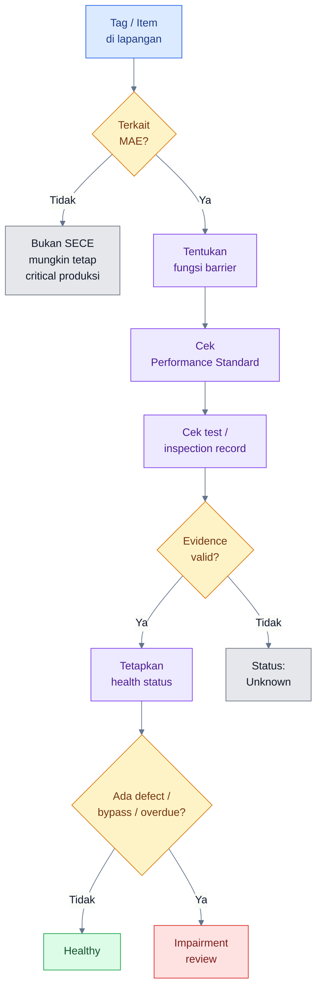

## Pesan utama Bab 12

**Engineer harus mampu menghubungkan tag equipment dengan fungsi barrier, major accident scenario, Performance Standard, dan status aktualnya di lapangan.**

[Kembali ke atas](#sece-management-di-industri-petrokimia)

---

# 13. Kesimpulan Artikel

SECE Management adalah salah satu fondasi penting dalam pengelolaan major accident risk pada industri petrokimia, refinery, LNG, offshore facility, dan fasilitas proses berisiko tinggi. Konsep ini menjadi penting karena kecelakaan besar jarang terjadi hanya akibat satu kegagalan. Biasanya, kecelakaan besar terjadi ketika beberapa barrier melemah secara bersamaan, tidak diketahui statusnya, atau tidak dikendalikan dengan baik.

SECE membantu organisasi memfokuskan perhatian pada elemen yang benar-benar kritikal terhadap keselamatan dan lingkungan. Namun, SECE tidak boleh dipahami hanya sebagai daftar equipment. SECE harus dipahami sebagai **critical element** yang menjalankan fungsi barrier terhadap Major Accident Event.

Kata **Element** dalam SECE sangat penting. Element tidak hanya berarti equipment fisik. Element dapat berupa system, component, structure, software, logic, utility, atau function. Firewater pump, PSV, gas detector, ESD valve, SIS logic, UPS untuk safety system, bund wall, fireproofing, drain isolation, dan emergency containment dapat menjadi SECE bila fungsinya kritikal terhadap pencegahan atau mitigasi major accident.

Karena itu, pertanyaan paling penting bukan:

> “Apakah equipment ini mahal atau penting untuk produksi?”

Tetapi:

> **“Jika element ini gagal, apakah major accident dapat terjadi, memburuk, atau gagal dimitigasi?”**

Jika jawabannya ya, element tersebut perlu dikaji sebagai kandidat SECE.

## 13.1 Ringkasan Konsep Utama

Beberapa poin utama dari artikel ini adalah sebagai berikut.

Pertama, SECE harus diturunkan dari **major accident scenario**, bukan dari daftar equipment. Identifikasi SECE harus dimulai dari Major Accident Hazard, Major Accident Event, top event, consequence, preventive barrier, mitigative barrier, lalu mapping ke element yang nyata di plant.

Kedua, setiap SECE harus memiliki **Performance Standard**. Tanpa Performance Standard, organisasi tidak memiliki dasar objektif untuk menyatakan apakah suatu SECE healthy, degraded, failed, overdue, bypassed, atau unknown.

Ketiga, SECE Management harus terintegrasi dengan inspection, testing, maintenance, calibration, proof test, CMMS, MOC, defect management, impairment management, bypass control, KPI, dashboard, dan audit. SECE yang hanya ada di register tetapi tidak terhubung ke aktivitas assurance tidak akan memberikan perlindungan nyata.

Keempat, dokumen dan records adalah fondasi pembuktian. Dokumen menetapkan requirement, sedangkan records membuktikan compliance. SECE tanpa record valid sebaiknya tidak dianggap healthy, tetapi dikategorikan sebagai unknown health sampai ada bukti yang dapat diverifikasi.

Kelima, impairment, bypass, inhibit, overdue, dan failed test harus dikelola secara formal. Kegagalan teknis pada SECE dapat terjadi, tetapi kegagalan manajemen tidak boleh terjadi. Setiap kondisi impairment harus diketahui, dinilai risikonya, diberi compensating measure, disetujui, dimonitor, dan ditutup dengan corrective action.

Keenam, organisasi khusus tidak selalu wajib, tetapi governance harus jelas. Harus ada accountable owner, technical owner, competent personnel, SECE Coordinator atau focal point bila diperlukan, forum review, dashboard, escalation route, dan independent assurance.

Ketujuh, SECE Management berbeda dari Barrier Management. Barrier Management adalah payung besar untuk mengelola seluruh lapisan proteksi terhadap major accident. SECE Management adalah pengelolaan elemen kritikal dari barrier tersebut. Semua SECE adalah critical barrier atau bagian dari critical barrier, tetapi tidak semua barrier otomatis menjadi SECE.

Kedelapan, KPI dan dashboard diperlukan agar status SECE terlihat oleh management. Dashboard harus menunjukkan mana SECE yang healthy, degraded, failed, bypassed, inhibited, overdue, atau unknown. Dashboard yang baik harus membantu pengambilan keputusan, bukan hanya menjadi laporan administratif.

## 13.2 Inti SECE Management dalam Satu Alur

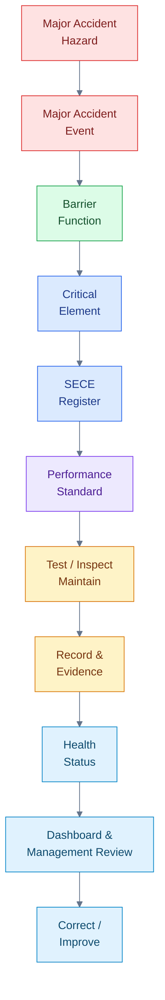

Diagram ini menunjukkan bahwa SECE Management bukan hanya pekerjaan maintenance, bukan hanya pekerjaan HSE, dan bukan hanya pekerjaan Process Safety. SECE Management adalah sistem lintas fungsi untuk memastikan bahwa critical element tetap memenuhi fungsi barrier yang diasumsikan dalam desain dan risk assessment.

## 13.3 Pesan Akhir untuk Practical Engineer

Bagi practical engineer, SECE Management harus diterjemahkan menjadi tindakan nyata di lapangan.

Saat melihat sebuah PSV, engineer tidak cukup hanya bertanya apakah PSV tersebut terpasang. Engineer perlu bertanya:

- overpressure scenario apa yang dikendalikan,
- vessel atau system apa yang dilindungi,
- set pressure dan relieving capacity-nya berapa,
- kapan terakhir diuji,
- apakah inlet/outlet bebas hambatan,
- apakah ada isolation,
- apakah certificate valid,
- apakah ada defect atau overdue.

Saat melihat gas detector, engineer tidak cukup hanya bertanya apakah lampunya menyala. Engineer perlu bertanya:

- gas release scenario apa yang dikendalikan,
- apakah detector masuk F&G mapping,
- apakah calibration valid,
- apakah detector inhibited,
- apakah alarm dan executive action sesuai Cause & Effect,
- apakah ada obstruction atau dirty sensor,
- apakah statusnya healthy atau unknown.

Saat melihat firewater pump, engineer tidak cukup hanya bertanya apakah pump bisa start. Engineer perlu bertanya:

- fire scenario apa yang dimitigasi,
- berapa firewater demand,
- apakah flow dan pressure memenuhi requirement,
- apakah auto-start bekerja,
- apakah diesel engine, fuel, battery, controller, suction, dan discharge path tersedia,
- apakah performance test record valid.

Dengan pola pikir ini, engineer tidak hanya menjaga equipment, tetapi menjaga barrier yang melindungi plant dari Major Accident Event.

## 13.4 Kesimpulan Utama

SECE Management yang baik bukan hanya memastikan equipment terpasang di lapangan. SECE Management yang baik memastikan bahwa setiap critical element:

- diketahui fungsinya,
- jelas related Major Accident Event-nya,
- jelas owner-nya,
- memiliki Performance Standard,
- memiliki inspection/testing/maintenance plan,
- terhubung ke CMMS,
- memiliki record yang valid,
- dikelola saat defect, bypass, inhibit, overdue, atau impaired,
- dikendalikan melalui MOC saat terjadi perubahan,
- diverifikasi secara berkala,
- dan terlihat statusnya oleh management.

Kalimat penutup yang paling tepat untuk merangkum artikel ini adalah:

> **SECE Management yang baik bukan hanya memastikan equipment terpasang di lapangan, tetapi memastikan setiap critical element diketahui fungsinya, jelas owner-nya, terukur performance-nya, valid test record-nya, terkendali impairment-nya, dan terlihat statusnya oleh management.**

[Kembali ke atas](#sece-management-di-industri-petrokimia)

---

# 14. Referensi Utama

Referensi berikut dapat digunakan sebagai rujukan utama dalam penulisan, pengembangan prosedur internal, atau benchmarking SECE Management di fasilitas proses berisiko tinggi.

## 14.1 UK HSE — Offshore Installations Safety Case Regulations Guidance L154

**Judul:** _The Offshore Installations (Offshore Safety Directive) (Safety Case etc.) Regulations 2015: Guidance on Regulations_
**Penerbit:** UK Health and Safety Executive
**Relevansi:** Rujukan penting untuk konsep safety and environmental-critical elements, safety case, duty holder responsibility, verification scheme, dan pengelolaan major accident hazard pada offshore installation. Guidance L154 ditujukan untuk pihak yang memiliki duties under SCR 2015, termasuk licensees, production installation operators, non-production installation owners, dan well operators. ([HSE][2])

**Kapan digunakan dalam konteks artikel ini:**

- saat mendefinisikan SECE,
- saat menjelaskan hubungan SECE dengan major accident,
- saat membahas verification scheme,
- saat membahas governance dan assurance.

## 14.2 Energy Institute — Guidelines for Management of Safety Critical Elements

**Judul:** _Guidelines for Management of Safety Critical Elements (SCEs), 3rd Edition_
**Penerbit:** Energy Institute
**Relevansi:** Salah satu guidance industri paling praktis untuk SCE/SECE Management. Energy Institute menyatakan bahwa publikasi ini memberikan panduan pengelolaan SCE sepanjang lifecycle fasilitas, mulai dari conceptual design, operate phase, life extension, hingga decommissioning; definisi SCE juga mencakup part of a facility, plant, or computer program yang kegagalannya dapat menyebabkan atau berkontribusi secara substansial terhadap Major Accident Hazard atau berfungsi mencegah/membatasi dampaknya. ([Energy Institute][3])

**Kapan digunakan dalam konteks artikel ini:**

- saat menjelaskan arti “Element”,
- saat membahas lifecycle SECE Management,
- saat menyusun Performance Standard,
- saat membangun SECE Register,
- saat mengembangkan assurance dan verification program.

## 14.3 UK HSE — SPC/Enforcement/174: Verification that Safety Critical Elements are “Suitable”

**Judul:** _Verification that Safety Critical Elements are “Suitable” at the Commencement of a Verification Scheme_
**Penerbit:** UK Health and Safety Executive
**Relevansi:** Guidance ini memberikan penjelasan tambahan bagi inspector terkait regulatory requirements untuk verification of suitability of Safety Critical Elements pada existing installations. ([HSE][1])

**Kapan digunakan dalam konteks artikel ini:**

- saat membahas verification,
- saat membahas suitability of SECE,
- saat membahas independent assurance,
- saat membahas hubungan antara Performance Standard dan kondisi aktual SECE.

## 14.4 UK HSE — HSG254: Developing Process Safety Indicators

**Judul:** _Developing Process Safety Indicators: A Step-by-Step Guide for Chemical and Major Hazard Industries_
**Penerbit:** UK Health and Safety Executive
**Relevansi:** HSG254 memberikan pendekatan bertahap untuk membangun program performance monitoring bagi process safety risks. HSE menyatakan guidance ini terutama ditujukan untuk major hazard operators, tetapi model generiknya juga dapat diterapkan pada organisasi lain yang memerlukan assurance serupa. ([HSE][4])

**Kapan digunakan dalam konteks artikel ini:**

- saat membahas KPI SECE,
- saat membedakan leading dan lagging indicators,
- saat menyusun dashboard SECE,
- saat membangun management review berbasis barrier health.

## 14.5 API RP 754 — Process Safety Performance Indicators for the Refining and Petrochemical Industries

**Judul:** _API Recommended Practice 754: Process Safety Performance Indicators for the Refining and Petrochemical Industries_
**Penerbit:** American Petroleum Institute
**Relevansi:** API menyatakan RP 754 membantu fasilitas menerapkan program komprehensif untuk mengurangi safety hazards melalui continuous assessment and improvement. API juga menjelaskan bahwa edisi ketiga RP 754 mencakup pembaruan seperti reclassification of materials, clarification of definitions, dan expansion of data collection capabilities. ([API][5])

**Kapan digunakan dalam konteks artikel ini:**

- saat membahas process safety KPI,
- saat menyusun leading dan lagging indicators,
- saat menghubungkan SECE dashboard dengan process safety performance,
- saat membangun sistem pelaporan untuk refining dan petrochemical facilities.

## 14.6 IOGP Report 544 — Standardization of Barrier Definitions

**Judul:** _IOGP Report 544: Standardization of Barrier Definitions_
**Penerbit:** International Association of Oil & Gas Producers
**Relevansi:** IOGP Report 544 menstandarkan tipe dan kategori process safety barriers, dengan tujuan memberikan terminologi yang konsisten bagi leaders dan workers yang berkontribusi terhadap process safety performance pada asset. ([IOGP][6])

**Kapan digunakan dalam konteks artikel ini:**

- saat membahas Barrier Management,
- saat membedakan barrier dan SECE,
- saat menyusun bowtie,
- saat menyusun barrier health dashboard,
- saat standardisasi terminologi internal perusahaan.

## 14.7 Catatan Penggunaan Referensi

Referensi di atas tidak harus dipakai dengan cara yang sama pada semua fasilitas. Penerapannya perlu disesuaikan dengan:

- jenis fasilitas,
- jurisdiction dan regulatory requirement,
- jenis hazard,
- tingkat kompleksitas plant,
- lifecycle stage,
- maturity organisasi,
- availability data,
- existing management system,
- dan requirement internal perusahaan.

Untuk fasilitas petrochemical onshore, istilah **SECE** mungkin tidak selalu digunakan secara eksplisit dalam regulasi lokal. Beberapa organisasi menggunakan istilah lain seperti **Safety Critical Equipment**, **Safety Critical Element**, **Critical Safeguard**, **Independent Protection Layer**, **Critical Barrier**, atau **MAH Barrier**. Namun, prinsip dasarnya tetap sama:

> **Elemen yang diklaim untuk mencegah atau memitigasi Major Accident Event harus diidentifikasi, diberi Performance Standard, diuji, dipelihara, dimonitor, dikendalikan saat impaired, dan diverifikasi.**

[Kembali ke atas](#sece-management-di-industri-petrokimia)

---

[1]: https://www.hse.gov.uk/foi/internalops/hid_circs/enforcement/spcenf174.htm?utm_source=chatgpt.com "Verification that safety critical elements are \"suitable\" at the ..."
[2]: https://www.hse.gov.uk/pubns/books/l154.htm?utm_source=chatgpt.com "The Offshore Installations (Offshore Safety Directive)( ..."
[3]: https://www.energyinst.org/industry/publications/topics/asset-integrity/guidelines-for-the-management-of-safety-critical-elements2?utm_source=chatgpt.com "Guidelines for the management of safety critical elements"
[4]: https://www.hse.gov.uk/pubns/books/hsg254.htm?utm_source=chatgpt.com "Developing process safety indicators: A step-by-step guide ..."
[5]: https://www.api.org/products-and-services/standards/important-standards-announcements/754?utm_source=chatgpt.com "API Recommended Practice 754, 3rd Edition"
[6]: https://www.iogp.org/bookstore/product/standardization-of-barrier-definitions/?utm_source=chatgpt.com "Standardization of barrier definitions"

---

<small>
  **_Catatan Penyusunan_** Artikel ini disusun sebagai materi edukasi dan
  referensi umum berdasarkan berbagai sumber pustaka, praktik lapangan, serta
  bantuan alat penulisan. Pembaca disarankan untuk melakukan verifikasi lanjutan
  dan penyesuaian sesuai dengan kondisi serta kebutuhan masing-masing sistem.
</small>
