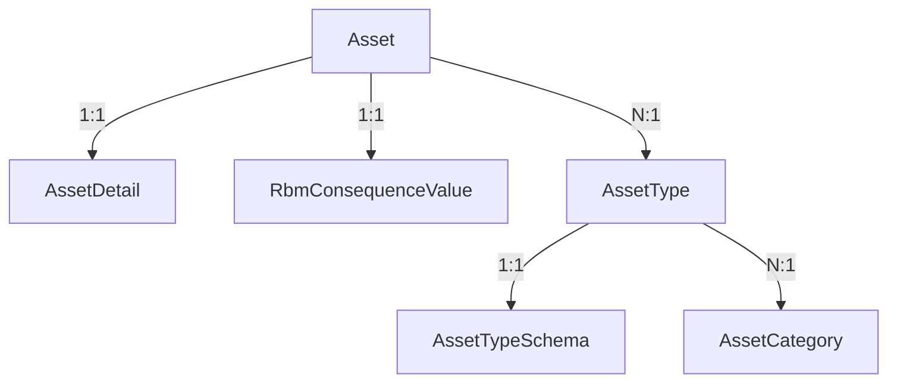
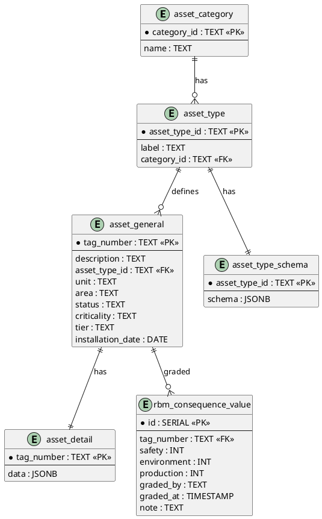

# **Modul Asset & RBM Detail Structure**

> Dokumentasi struktur utama yang digunakan dalam sistem RBM berbasis `mx-core`. Dokumen ini mencakup definisi `Asset`, `AssetType`, `AssetTypeSchema`, `AssetDetail`, serta nilai grading ESC untuk mendukung evaluasi konsekuensi kegagalan aset.

---

## 1. 🧾 Struktur `Asset` (Informasi Umum)

```ts
type Asset = {
  tagNumber: string;
  description: string;
  assetType: string; // FK ke AssetType.assetTypeId
  unit: string;
  area: string;
  status: 'Active' | 'Spare' | 'Retired';
  criticality?: 'Kritis' | 'Normal';
  tier?: 'Tier1' | 'Tier2' | 'Tier3';
  installationDate?: string;
};
```

Contoh:

```json
{
  "tagNumber": "CV-101-A",
  "description": "Control Valve Feed Gas to Reformer",
  "assetType": "control-valve",
  "unit": "Syngas",
  "area": "R-101",
  "status": "Active",
  "criticality": "Kritis",
  "tier": "Tier1",
  "installationDate": "2019-03-12"
}
```

---

## 2. 🧭 Struktur `AssetType`

```ts
type AssetType = {
  assetTypeId: string; // ex: "control-valve"
  label: string; // ex: "Control Valve"
  categoryId: string; // FK ke AssetCategory
};
```

---

## 3. 🗃️ Struktur `AssetCategory`

```ts
type AssetCategory = {
  categoryId: string;
  name: string;
};
```

Contoh:

```json
{ "categoryId": "instrument", "name": "Instrumentasi" }
```

---

## 4. 🧩 Struktur `AssetTypeSchema`

```ts
type AssetTypeSchema = {
  assetTypeId: string;
  fields: FieldDefinition[];
  ppcStrategy: PpcStrategyDefinition;
  spareParts: SparePartTemplate[];
};
```

### ➤ 4.1. `FieldDefinition`

```ts
type FieldDefinition = {
  name: string;
  label: string;
  type: 'string' | 'number' | 'enum' | 'boolean' | 'date';
  required: boolean;
  unit?: string;
  options?: string[]; // hanya berlaku untuk enum
};
```

### ➤ 4.2. `PpcStrategyDefinition`

```ts
type PpcStrategyDefinition = {
  preventive: string[];
  predictive: string[];
  corrective: string[];
};
```

### ➤ 4.3. `SparePartTemplate`

```ts
type SparePartTemplate = {
  name: string;
  partNumber?: string;
  uom: string;
  quantity: number;
  remarks?: string;
};
```

---

## 5. 📁 Contoh Lengkap `AssetTypeSchema`

### 5.1. Control Valve – `/schemas/asset-types/control-valve.json`

```json
{
  "assetTypeId": "control-valve",
  "fields": [
    {
      "name": "size",
      "label": "Ukuran Valve",
      "type": "number",
      "unit": "inch",
      "required": true
    },
    {
      "name": "type",
      "label": "Tipe Valve",
      "type": "enum",
      "options": ["Globe", "Ball", "Butterfly"],
      "required": true
    },
    {
      "name": "failMode",
      "label": "Fail Mode",
      "type": "enum",
      "options": ["Fail Open", "Fail Close", "Fail Last"],
      "required": true
    },
    {
      "name": "flowMax",
      "label": "Flow Max",
      "type": "number",
      "unit": "Nm³/h",
      "required": false
    },
    {
      "name": "flowMin",
      "label": "Flow Min",
      "type": "number",
      "unit": "Nm³/h",
      "required": false
    },
    {
      "name": "characteristic",
      "label": "Flow Characteristic",
      "type": "enum",
      "options": ["Linear", "Equal %", "Quick Opening"],
      "required": true
    },
    {
      "name": "actuatorType",
      "label": "Actuator Type",
      "type": "string",
      "required": false
    }
  ],
  "ppcStrategy": {
    "preventive": [
      "Periksa posisi stem dan kalibrasi travel",
      "Periksa kebocoran body dan bonnet",
      "Bersihkan actuator dan lubrikasi linkage"
    ],
    "predictive": [
      "Pantau tekanan supply air",
      "Pantau sinyal kontrol dan respon waktu",
      "Analisa getaran actuator"
    ],
    "corrective": [
      "Ganti diaphragm actuator",
      "Ganti packing atau gasket valve",
      "Kalibrasi ulang positioner"
    ]
  },
  "spareParts": [
    { "name": "Valve Packing", "uom": "set", "quantity": 1 },
    { "name": "Actuator Diaphragm", "uom": "pcs", "quantity": 1 },
    { "name": "Gasket Bonnet", "uom": "pcs", "quantity": 1 }
  ]
}
```

---

## 6. 🧾 `AssetDetail` — Data Teknis per Aset

```ts
type AssetDetail = {
  tagNumber: string; // FK ke Asset
  [field: string]: string | number | boolean;
};
```

Contoh `/data/asset-details/CV-101-A.detail.json`:

```json
{
  "tagNumber": "CV-101-A",
  "size": 6,
  "type": "Globe",
  "failMode": "Fail Close",
  "flowMax": 1200,
  "flowMin": 600,
  "characteristic": "Equal %",
  "actuatorType": "Pneumatic"
}
```

---

## 7. 📊 `RbmConsequenceValue` – Grading ESC

Struktur penilaian aspek konsekuensi berdasarkan Safety, Environment, dan Production.

```ts
type RbmConsequenceValue = {
  tagNumber: string; // FK ke Asset.tagNumber
  safety: number; // 1–5
  environment: number; // 1–5
  production: number; // 1–5
  gradedBy: string;
  gradedAt: string; // ISO datetime
  note?: string;
};
```

📋 Tabel Referensi:

| Field         | Tipe     | Wajib | Deskripsi                                                  |
| ------------- | -------- | ----- | ---------------------------------------------------------- |
| `tagNumber`   | string   | ✅    | FK ke `Asset.tagNumber`                                    |
| `safety`      | number   | ✅    | Nilai aspek **Safety**, rentang 1–5                        |
| `environment` | number   | ✅    | Nilai aspek **Lingkungan**, rentang 1–5                    |
| `production`  | number   | ✅    | Nilai aspek **Produksi (Continuous Running)**, rentang 1–5 |
| `gradedBy`    | string   | ✅    | Nama/NIP evaluator                                         |
| `gradedAt`    | datetime | ✅    | Timestamp penilaian                                        |
| `note`        | string   | ❌    | Catatan tambahan                                           |

---

## 8. 🔗 Relasi Data & Alur



---

## 9. 📁 Struktur Folder Direkomendasikan

```
/schemas/asset-types/
│   └── control-valve.json
│   └── centrifugal-pump.json
│   └── transformer.json

/data/asset-details/
│   └── CV-101-A.detail.json
│   └── P-204-B.detail.json

/data/assets/
│   └── CV-101-A.json
│   └── P-204-B.json

/data/esc-grading/
│   └── CV-101-A.grading.json

/docs/
│   └── asset-definition.md
```

---

## 10. ✅ Ringkasan

| Entitas               | Keterangan                                                  |
| --------------------- | ----------------------------------------------------------- |
| `Asset`               | Informasi umum aset (tag, unit, status, tier)               |
| `AssetType`           | Jenis peralatan, contoh: `control-valve`                    |
| `AssetTypeSchema`     | Template data teknis + PPC + Spare Part per jenis aset      |
| `AssetDetail`         | Data aktual sesuai skema untuk tiap `tagNumber`             |
| `RbmConsequenceValue` | Data penilaian konsekuensi: Safety, Environment, Production |
| `AssetCategory`       | Kategori besar (electrical, static, rotating, dll.)         |

---

## 🚀 Siap Digunakan

Dokumentasi ini adalah pegangan utama bagi:

- Developer frontend: membuat form dinamis berdasarkan schema
- Backend: validasi otomatis dan penyimpanan
- Planner: referensi strategi TBM/CBM per jenis aset
- Integrasi CMMS: penyusunan WO berdasar criticality, PPC, spare

---

## ✅ 1. `Asset`

| Field              | Tipe   | Wajib | Deskripsi                                      |
| ------------------ | ------ | ----- | ---------------------------------------------- |
| `tagNumber`        | string | ✅    | **Primary key**, ID unik aset                  |
| `description`      | string | ✅    | Penjelasan fungsi aset                         |
| `assetTypeId`      | string | ✅    | FK ke `AssetType.id`                           |
| `unit`             | string | ✅    | Unit proses (Syngas, Octanol, Utility, dll.)   |
| `area`             | string | ✅    | Lokasi fisik atau sistem (misal: R-101, E-203) |
| `status`           | enum   | ✅    | `Active`, `Spare`, `Retired`                   |
| `criticality`      | enum   | ❌    | `Kritis`, `Normal` – hasil dari ESC grading    |
| `tier`             | enum   | ❌    | `Tier1`, `Tier2`, `Tier3` – interval evaluasi  |
| `installationDate` | date   | ❌    | Tanggal commissioning                          |

---

## ✅ 2. `AssetType`

| Field         | Tipe   | Wajib | Deskripsi                                                  |
| ------------- | ------ | ----- | ---------------------------------------------------------- |
| `id`          | string | ✅    | Kode unik tipe asset, misal: `control-valve`               |
| `name`        | string | ✅    | Nama ditampilkan: `Control Valve`, `Centrifugal Pump`, dll |
| `categoryId`  | string | ✅    | FK ke `AssetCategory.id`                                   |
| `description` | string | ❌    | Penjelasan teknis / peran fungsi asset                     |

---

## ✅ 3. `AssetCategory`

| Field         | Tipe   | Wajib | Deskripsi                                   |
| ------------- | ------ | ----- | ------------------------------------------- |
| `id`          | string | ✅    | Kode unik, misal: `rotating`, `static`, dll |
| `name`        | string | ✅    | Nama formal, contoh: `Rotating Equipment`   |
| `description` | string | ❌    | Penjelasan kategori umum                    |

---

## ✅ 4. `AssetTemplateField`

_(Field teknis untuk tiap AssetType)_

| Field         | Tipe     | Wajib | Deskripsi                                                      |
| ------------- | -------- | ----- | -------------------------------------------------------------- |
| `id`          | string   | ✅    | ID field unik, bisa UUID atau kombinasi assetType + nama field |
| `assetTypeId` | string   | ✅    | FK ke `AssetType.id`                                           |
| `name`        | string   | ✅    | Nama internal field, misal: `cv`, `rpm`, `bodyMaterial`        |
| `label`       | string   | ✅    | Label ditampilkan di UI, misal: "Flow Coefficient (Cv)"        |
| `type`        | string   | ✅    | `string`, `number`, `boolean`, `date`, `enum`, dll             |
| `required`    | boolean  | ✅    | Apakah field ini wajib diisi?                                  |
| `options`     | string[] | ❌    | Untuk enum/choice field, misal: `["Fail Open", "Fail Close"]`  |
| `unit`        | string   | ❌    | Jika ada satuan teknis: `bar`, `rpm`, `kW`, dll                |

> Ini membuat setiap tipe asset punya field teknis yang **dinamis, dapat di-render di form UI**, dan divalidasi secara otomatis.

---

## ✅ 5. `AssetDetail`

| Field       | Tipe   | Wajib | Deskripsi                         |
| ----------- | ------ | ----- | --------------------------------- |
| `tagNumber` | string | ✅    | FK ke `Asset.tagNumber`           |
| `fieldId`   | string | ✅    | FK ke `AssetTemplateField.id`     |
| `value`     | any    | ✅    | Nilai aktual untuk field tersebut |

> Menyimpan semua nilai teknis sebagai pasangan `tagNumber + fieldId → value`, seperti `FV-101 + cv → 18.4`.

---

## ✅ 6. `RbmValue` (ESC Grading per Asset)

| Field         | Tipe     | Wajib | Deskripsi                                                 |
| ------------- | -------- | ----- | --------------------------------------------------------- |
| `tagNumber`   | string   | ✅    | FK ke `Asset.tagNumber`                                   |
| `safety`      | number   | ✅    | Nilai konsekuensi aspek **Safety**, misal: 1–5            |
| `environment` | number   | ✅    | Nilai aspek **Lingkungan**, misal: 1–5                    |
| `production`  | number   | ✅    | Nilai aspek **Continuous Running (Produksi)**, misal: 1–5 |
| `gradedBy`    | string   | ✅    | Nama/NIP user yang melakukan grading                      |
| `gradedAt`    | datetime | ✅    | Tanggal grading dilakukan                                 |
| `note`        | string   | ❌    | Catatan tambahan                                          |

> Nilai ESC ini akan dipakai untuk:

- Menentukan `criticality`
- Menyusun `tier`
- Input untuk dashboard RBM

---

## ✅ (Opsional) `MaintenanceSchedule` (TBM Engine)

| Field          | Tipe     | Wajib | Deskripsi                                              |
| -------------- | -------- | ----- | ------------------------------------------------------ |
| `tagNumber`    | string   | ✅    | FK ke `Asset.tagNumber`                                |
| `nextDate`     | date     | ✅    | Tanggal pemeliharaan berikutnya                        |
| `intervalDays` | number   | ✅    | Interval (hari) TBM yang ditentukan dari hasil grading |
| `strategy`     | enum     | ✅    | `Preventive`, `Predictive`, `Corrective`               |
| `generatedAt`  | datetime | ✅    | Waktu jadwal ini dihitung                              |

---

## ✅ Relasi ERD (Konseptual)

```
Asset
  ├── assetTypeId → AssetType
        └── categoryId → AssetCategory
        └── hasMany → AssetTemplateField
  └── tagNumber → AssetDetail (fieldId, value)
  └── tagNumber → RbmValue (ESC grading)
  └── tagNumber → MaintenanceSchedule (jadwal TBM)
```

---

## ✅ Summary Ringkas

| Entitas               | Fungsi                                                                    |
| --------------------- | ------------------------------------------------------------------------- |
| `Asset`               | Master data aset, tagnumber unik                                          |
| `AssetType`           | Jenis aset, contoh: Control Valve, Centrifugal Pump                       |
| `AssetCategory`       | Kategori besar aset, contoh: Instrumentation, Rotating, Static            |
| `AssetTemplateField`  | Struktur field teknis per `AssetType`                                     |
| `AssetDetail`         | Nilai aktual field teknis untuk masing-masing aset                        |
| `RbmValue`            | Nilai ESC grading tiap aset                                               |
| `MaintenanceSchedule` | Engine jadwal TBM adaptif berbasis criticality dan tier (jika diperlukan) |

---

## 🔧 1. **Control Valve**

📁 **`control-valve.json`**

```json
{
  "assetTypeId": "control-valve",
  "fields": [
    {
      "name": "size",
      "label": "Ukuran Valve",
      "type": "number",
      "unit": "inch",
      "required": true
    },
    {
      "name": "type",
      "label": "Tipe Valve",
      "type": "enum",
      "options": ["Globe", "Ball", "Butterfly"],
      "required": true
    },
    {
      "name": "failMode",
      "label": "Fail Mode",
      "type": "enum",
      "options": ["Fail Open", "Fail Close", "Fail Last"],
      "required": true
    },
    {
      "name": "flowMax",
      "label": "Flow Max",
      "type": "number",
      "unit": "Nm³/h",
      "required": false
    },
    {
      "name": "flowMin",
      "label": "Flow Min",
      "type": "number",
      "unit": "Nm³/h",
      "required": false
    },
    {
      "name": "characteristic",
      "label": "Flow Characteristic",
      "type": "enum",
      "options": ["Linear", "Equal %", "Quick Opening"],
      "required": true
    },
    {
      "name": "actuatorType",
      "label": "Actuator Type",
      "type": "string",
      "required": false
    }
  ],
  "ppcStrategy": {
    "preventive": [
      "Periksa posisi stem dan kalibrasi travel",
      "Periksa kebocoran body dan bonnet",
      "Bersihkan actuator dan lubrikasi linkage"
    ],
    "predictive": [
      "Pantau tekanan supply air",
      "Pantau sinyal kontrol dan respon waktu",
      "Analisa getaran actuator"
    ],
    "corrective": [
      "Ganti diaphragm actuator",
      "Ganti packing atau gasket valve",
      "Kalibrasi ulang positioner"
    ]
  },
  "spareParts": [
    { "name": "Valve Packing", "uom": "set", "quantity": 1 },
    { "name": "Actuator Diaphragm", "uom": "pcs", "quantity": 1 },
    { "name": "Gasket Bonnet", "uom": "pcs", "quantity": 1 }
  ]
}
```

---

## ⚙️ 2. **Centrifugal Pump**

📁 **`centrifugal-pump.json`**

```json
{
  "assetTypeId": "centrifugal-pump",
  "fields": [
    {
      "name": "powerRating",
      "label": "Daya Motor",
      "type": "number",
      "unit": "kW",
      "required": true
    },
    {
      "name": "rpm",
      "label": "Kecepatan Putar",
      "type": "number",
      "unit": "RPM",
      "required": true
    },
    {
      "name": "capacity",
      "label": "Kapasitas Flow",
      "type": "number",
      "unit": "m³/h",
      "required": true
    },
    {
      "name": "head",
      "label": "Head Maksimal",
      "type": "number",
      "unit": "m",
      "required": false
    },
    {
      "name": "sealType",
      "label": "Jenis Seal",
      "type": "enum",
      "options": ["Mechanical", "Packing", "Cartridge"],
      "required": true
    },
    {
      "name": "material",
      "label": "Material Body",
      "type": "string",
      "required": false
    }
  ],
  "ppcStrategy": {
    "preventive": [
      "Periksa alignment motor dan pump",
      "Periksa kekencangan mur/baut",
      "Lubrikasi bearing sesuai jadwal"
    ],
    "predictive": [
      "Analisa getaran bearing",
      "Pantau temperatur casing dan bearing",
      "Analisa oli pelumas"
    ],
    "corrective": [
      "Ganti mechanical seal",
      "Ganti bearing motor",
      "Balancing ulang rotor"
    ]
  },
  "spareParts": [
    { "name": "Mechanical Seal", "uom": "pcs", "quantity": 1 },
    { "name": "Bearing", "uom": "pcs", "quantity": 2 },
    { "name": "Gasket Set", "uom": "set", "quantity": 1 }
  ]
}
```

---

## ⚡ 3. **Transformer**

📁 **`transformer.json`**

```json
{
  "assetTypeId": "transformer",
  "fields": [
    {
      "name": "capacity",
      "label": "Kapasitas",
      "type": "number",
      "unit": "kVA",
      "required": true
    },
    {
      "name": "primaryVoltage",
      "label": "Tegangan Primer",
      "type": "number",
      "unit": "kV",
      "required": true
    },
    {
      "name": "secondaryVoltage",
      "label": "Tegangan Sekunder",
      "type": "number",
      "unit": "kV",
      "required": true
    },
    {
      "name": "coolingType",
      "label": "Sistem Pendingin",
      "type": "enum",
      "options": ["ONAN", "ONAF", "OFAF"],
      "required": true
    },
    {
      "name": "oilType",
      "label": "Jenis Oli",
      "type": "string",
      "required": false
    },
    {
      "name": "vectorGroup",
      "label": "Grup Vektor",
      "type": "string",
      "required": false
    }
  ],
  "ppcStrategy": {
    "preventive": [
      "Periksa level dan kondisi oli trafo",
      "Periksa pengencangan koneksi terminal",
      "Bersihkan radiator dari debu dan kotoran"
    ],
    "predictive": [
      "Analisa kualitas minyak (DGA)",
      "Pantau suhu winding dan core",
      "Pantau arus beban dan harmonik"
    ],
    "corrective": [
      "Ganti oli transformator",
      "Perbaiki bocor pada tangki",
      "Kalibrasi ulang proteksi relai"
    ]
  },
  "spareParts": [
    { "name": "Minyak Trafo", "uom": "liter", "quantity": 500 },
    { "name": "Silica Gel", "uom": "pcs", "quantity": 1 },
    { "name": "Packing Oil Valve", "uom": "pcs", "quantity": 2 }
  ]
}
```

---

## ✅ Struktur Data `Asset`

```ts
type Asset = {
  tagNumber: string;
  description: string;
  assetType: string;
  unit: string;
  area: string;
  status: 'Active' | 'Spare' | 'Retired';
  criticality?: 'Kritis' | 'Normal';
  tier?: 'Tier1' | 'Tier2' | 'Tier3';
  installationDate?: string;
};
```

---

### 📌 1. Asset: Control Valve

```json
{
  "tagNumber": "CV-101-A",
  "description": "Control Valve Feed Gas to Reformer",
  "assetType": "control-valve",
  "unit": "Syngas",
  "area": "R-101",
  "status": "Active",
  "criticality": "Kritis",
  "tier": "Tier1",
  "installationDate": "2019-03-12"
}
```

---

### 📌 2. Asset: Centrifugal Pump

```json
{
  "tagNumber": "P-204-B",
  "description": "Recycle Pump Aldol Condensation",
  "assetType": "centrifugal-pump",
  "unit": "Octanol",
  "area": "U-204",
  "status": "Active",
  "criticality": "Normal",
  "tier": "Tier2",
  "installationDate": "2021-08-07"
}
```

---

### 📌 3. Asset: Transformer

```json
{
  "tagNumber": "TRF-3-6KV",
  "description": "Power Transformer 6.3KV for Compressor MCC",
  "assetType": "transformer",
  "unit": "Utility",
  "area": "MCC Room 1",
  "status": "Active",
  "criticality": "Kritis",
  "tier": "Tier1",
  "installationDate": "2017-11-01"
}
```

---

## 📘 1. `CV-101-A.detail.json` (Control Valve)

```json
{
  "tagNumber": "CV-101-A",
  "size": 6,
  "type": "Globe",
  "failMode": "Fail Close",
  "flowMax": 1500,
  "flowMin": 300,
  "characteristic": "Equal %",
  "actuatorType": "Pneumatic"
}
```

---

## 📘 2. `P-204-B.detail.json` (Centrifugal Pump)

```json
{
  "tagNumber": "P-204-B",
  "powerRating": 37.5,
  "rpm": 2950,
  "capacity": 200,
  "head": 35,
  "sealType": "Mechanical",
  "material": "SS316"
}
```

---

## 📘 3. `TRF-3-6KV.detail.json` (Transformer)

```json
{
  "tagNumber": "TRF-3-6KV",
  "capacity": 1000,
  "primaryVoltage": 20,
  "secondaryVoltage": 6.3,
  "coolingType": "ONAF",
  "oilType": "Shell Diala S4",
  "vectorGroup": "Dyn11"
}
```

---

## 🟦 **Versi 1: PlantUML ERD (Copy untuk PlantUML Viewer)**



---

## 🟩 **Versi 2: SQL-style ERD (Copy untuk [dbdiagram.io](https://dbdiagram.io/))**

```sql
Table asset_category {
  category_id TEXT [pk]
  name TEXT
}

Table asset_type {
  asset_type_id TEXT [pk]
  label TEXT
  category_id TEXT [ref: > asset_category.category_id]
}

Table asset_general {
  tag_number TEXT [pk]
  description TEXT
  asset_type_id TEXT [ref: > asset_type.asset_type_id]
  unit TEXT
  area TEXT
  status TEXT
  criticality TEXT
  tier TEXT
  installation_date DATE
}

Table asset_type_schema {
  asset_type_id TEXT [pk, ref: > asset_type.asset_type_id]
  schema JSONB
}

Table asset_detail {
  tag_number TEXT [pk, ref: > asset_general.tag_number]
  data JSONB
}

Table rbm_consequence_value {
  id SERIAL [pk]
  tag_number TEXT [ref: > asset_general.tag_number]
  safety INT
  environment INT
  production INT
  graded_by TEXT
  graded_at TIMESTAMP
  note TEXT
}
```

---

## 📁 Struktur Folder

```bash
plugins/
└── mx-core-rbm/
    └── src/
        └── models/
            ├── asset-category.ts
            ├── asset-type.ts
            ├── asset-general.ts
            ├── asset-type-schema.ts
            ├── asset-detail.ts
            ├── rbm-consequence-value.ts
```

---

## 📦 Data Model Files

### 1. `asset-category.ts`

```ts
import { z } from 'zod';

export interface AssetCategory {
  category_id: string;
  name: string;
}

export const assetCategorySchema = z.object({
  category_id: z.string().optional(),
  name: z.string().min(1, 'Category name is required'),
});
```

---

### 2. `asset-type.ts`

```ts
import { z } from 'zod';

export interface AssetType {
  asset_type_id: string;
  label: string;
  category_id: string;
}

export const assetTypeSchema = z.object({
  asset_type_id: z.string().optional(),
  label: z.string().min(1, 'Asset type name is required'),
  category_id: z.string().min(1, 'Asset category is required'),
});
```

---

### 3. `asset-general.ts`

```ts
import { z } from 'zod';

export type AssetStatus = 'Active' | 'Spare' | 'Retired';
export type AssetCriticality = 'Kritis' | 'Normal';
export type AssetTier = 'Tier1' | 'Tier2' | 'Tier3';

export interface AssetGeneral {
  tag_number: string;
  description: string;
  asset_type_id: string;
  unit: string;
  area: string;
  status: AssetStatus;
  criticality?: AssetCriticality;
  tier?: AssetTier;
  installation_date?: string;
}

export const assetGeneralSchema = z.object({
  tag_number: z.string().min(1, 'Tag number is required'),
  description: z.string().min(1, 'Description is required'),
  asset_type_id: z.string().min(1, 'Asset type is required'),
  unit: z.string().min(1, 'Unit is required'),
  area: z.string().min(1, 'Area is required'),
  status: z.enum(['Active', 'Spare', 'Retired']),
  criticality: z.enum(['Kritis', 'Normal']).optional(),
  tier: z.enum(['Tier1', 'Tier2', 'Tier3']).optional(),
  installation_date: z.string().optional(),
});
```

---

### 4. `asset-type-schema.ts`

```ts
import { z } from 'zod';

export interface FieldDefinition {
  name: string;
  label: string;
  type: 'string' | 'number' | 'enum' | 'boolean' | 'date';
  required: boolean;
  unit?: string;
  options?: string[];
}

export interface PpcStrategyDefinition {
  preventive: string[];
  predictive: string[];
  corrective: string[];
}

export interface SparePartTemplate {
  name: string;
  partNumber?: string;
  uom: string;
  quantity: number;
  remarks?: string;
}

export interface AssetTypeSchema {
  asset_type_id: string;
  fields: FieldDefinition[];
  ppc_strategy: PpcStrategyDefinition;
  spare_parts: SparePartTemplate[];
}

export const fieldDefinitionSchema = z.object({
  name: z.string(),
  label: z.string(),
  type: z.enum(['string', 'number', 'enum', 'boolean', 'date']),
  required: z.boolean(),
  unit: z.string().optional(),
  options: z.array(z.string()).optional(),
});

export const ppcStrategySchema = z.object({
  preventive: z.array(z.string()),
  predictive: z.array(z.string()),
  corrective: z.array(z.string()),
});

export const sparePartTemplateSchema = z.object({
  name: z.string(),
  partNumber: z.string().optional(),
  uom: z.string(),
  quantity: z.number(),
  remarks: z.string().optional(),
});

export const assetTypeSchemaSchema = z.object({
  asset_type_id: z.string(),
  fields: z.array(fieldDefinitionSchema),
  ppc_strategy: ppcStrategySchema,
  spare_parts: z.array(sparePartTemplateSchema),
});
```

---

### 5. `asset-detail.ts`

```ts
import { z } from 'zod';

export interface AssetDetail {
  tag_number: string; // FK ke asset_general
  data: Record<string, any>; // JSON teknis sesuai template schema
}

export const assetDetailSchema = z.object({
  tag_number: z.string().min(1, 'Tag number is required'),
  data: z.record(z.any()),
});
```

---

### 6. `rbm-consequence-value.ts`

```ts
import { z } from 'zod';

export interface RbmConsequenceValue {
  id?: number;
  tag_number: string;
  safety: number;
  environment: number;
  production: number;
  graded_by: string;
  graded_at: string;
  note?: string;
}

export const rbmConsequenceValueSchema = z.object({
  id: z.number().optional(),
  tag_number: z.string().min(1, 'Tag number is required'),
  safety: z.number().min(1).max(5),
  environment: z.number().min(1).max(5),
  production: z.number().min(1).max(5),
  graded_by: z.string().min(1, 'Grader name is required'),
  graded_at: z.string(), // ISO datetime string
  note: z.string().optional(),
});
```

---

## ✅ Langkah Selanjutnya (Opsional)

Berikut hal yang bisa dilanjutkan setelah struktur ini kamu anggap final:

1. 🔹 Menyusun **tabel `AssetType` lengkap (52+ baris)** yang kamu punya, dengan pengelompokan ke `AssetCategory`
2. 🔹 Membuat draft awal file `asset-template.json` → untuk menyusun `metadata` per tipe aset
3. 🔹 Membuat ERD diagram untuk seluruh struktur ini (opsional)
4. 🔹 Mocking data awal (10–20 aset sample) untuk testing antarmuka RBM dan jadwal TBM

Kita sekarang siap menyusun:

1. 📁 Struktur final untuk:

   - `Asset`
   - `AssetType`
   - `AssetCategory`
   - `AssetTemplate`
   - `AssetDetail`

2. 📘 Definisi JSON schema (per `AssetType`)
3. (Jika ingin) ERD atau diagram relasional lengkap

Kalau struktur ini sudah kamu anggap **final**, kita bisa lanjut ke:

1. 📘 Menyusun data awal `AssetType` + `AssetTemplateField`
2. 🗂️ Menentukan struktur folder dan storage file untuk JSON schema per type
3. ✏️ Membuat skema ERD dalam visual (kalau dibutuhkan)
4. 📦 Mock data untuk pengujian modul `mx-core-rbm`

## 🧭 Arah Selanjutnya

Setelah struktur ini disetujui, langkah lanjut bisa:

1. 📁 Buat folder `/schemas/asset-types/` untuk masing-masing `AssetType`
2. 🗂️ Format dalam bentuk `.json` (atau `.ts`) per `AssetTypeSchema`
3. ✏️ Siapkan 3–5 sample `AssetTypeSchema` awal (misal: control-valve, centrifugal-pump, transformer)
4. 📘 Dokumentasikan struktur JSON-nya di `/docs/asset-type-schema.md`
5. 🔌 Integrasikan ke form UI, CMMS, dan RBM grading engine

Kalau kamu sudah oke dengan contoh di atas, saya bisa bantu lanjut:

- 🧪 Buat validasi schema JSON-nya (pakai Zod atau JSON Schema)
- 🧰 Siapkan sample data `Asset` (tagNumber per type)
- 📄 Dokumentasikan struktur schema dan cara membuat schema baru

Jika kamu setuju, langkah selanjutnya kita bisa lanjut:

- 💾 Buat `AssetDetail` sample (berdasarkan schema-nya)
- 🔎 Siapkan validator schema + form auto-generator (Next.js & Zod)
- 📄 Buat dokumentasi `/docs/asset-schema-guide.md`

Mau lanjut ke mana?

1. 🔐 Validasi schema (Zod/JSON Schema)
2. 🖼️ Auto Form Builder untuk input AssetDetail
3. 📄 Dokumentasi internal developer
4. 🧪 Test + Sample Generator CLI
5. ✍️ Tambahkan lebih banyak `AssetTypeTemplate`

--- batas
